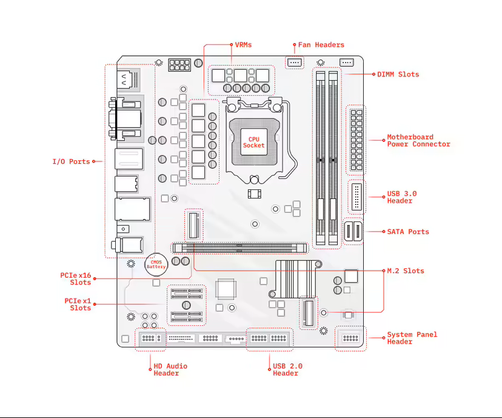
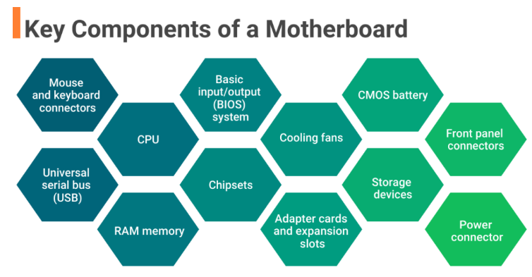
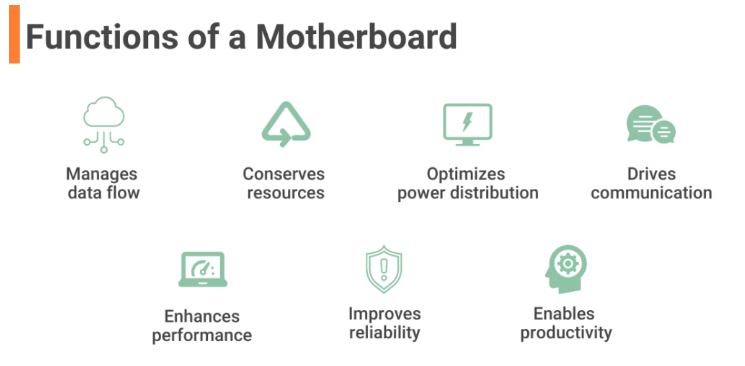

# What Is a Motherboard? Definition, Types, Components, and Functions

A motherboard is a circuit board inside general-purpose computing systems, including personal computers, smart televisions, smart monitors, and other similar devices, which supports communication between different electrical components and houses components such as the CPU, memory, etc. 
It is typically made of fiberglass and copper. 
This article defines a motherboard and explains its components and functions.

## Table of Contents
* What Is a Motherboard?
* Types of Motherboards
* 12 Key Components of a Motherboard
* Functions of Motherboards

---

## What Is a Motherboard?
A computer’s motherboard is typically the largest printed circuit board in a machine’s chassis. It distributes electricity and facilitates communication between and to the central processing unit (CPU), random access memory (RAM), and any other component of the computer’s hardware. There is a broad range of motherboards, each of which is intended to be compatible with a specific model and size of the computer.

Since different kinds of processors and memories are intended to function best with certain types of motherboards, it is difficult to find a motherboard that is compatible with every type of CPU and memory. Hard drives, on the other hand, are generally compatible with a wide variety of motherboards and may be used with most brands and types.

A computer motherboard may be found inside a computer casing, which is the point of connection for most of the computer’s elements and peripherals. When it comes to tower computers, one may look for a motherboard on either the right or left side of the tower; the circuit board is the most significant.

The earliest motherboards for personal computers included relatively fewer real components. Only a CPU and some card ports were included on the very first IBM PC motherboard. Users inserted various components, including memory and controllers for floppy drives, into the slots provided. 

Compaq became the first company to utilize a motherboard that was not based on a design created by IBM. The new architecture utilized a CPU made by Intel. When Compaq’s sales began to take off, other businesses quickly followed suit, even though several companies in the industry believed it was a risky move.

But by the 1990s, Intel had a dominant share of the market for personal computer motherboards. Asus, Gigabyte Technology, and Micro-Star International (MSI) are the three most influential companies in this industry. However, Intel remains one of the ten best motherboard manufacturers in the world, even though Asus is now the largest motherboard maker on the planet.

---

## Types of Motherboards
To comprehend what motherboards are and what they do, we must first examine their various types and specifications.

### 1. Advanced Technology (AT) motherboard
Due to their larger physical dimensions (which can be measured in hundredths of millimeters), these motherboards do not work properly with computers that fall into the category of smaller desktops. A larger physical size makes it more difficult to install new hardware drivers. 

The power connections on these motherboards are in the form of sockets and plugs with six prongs each. Due to the difficulty in recognizing these power connections, users often have issues while trying to connect and operate them. In the 1980s, motherboards of this sort were all the rage, and they continued to be manufactured far into the 2000s.

### 2. Standard ATX motherboard
ATX is an enhanced version of the AT motherboard that Intel created in the 1990s. Its name means “advanced technology extended,” and its initials stand for “advanced technology.” Unlike AT, it is much more compact and enables the associated components to be interchanged. The connection elements have witnessed significant progress and development.

### 3. Micro ATX motherboard
The length and width of these motherboards, measured in millimeters, are also 244 mm (size metrics will differ as per the manufacturer). This motherboard has fewer ports and slots than the Standard ATX board. 

Users who do not want excessive connections and subsequent upgrades, like adding more RAM, an extra GPU, or other Peripheral Component Interconnect (PCI) cards, are better suited for this kind of motherboard than others. 

This motherboard may be installed in any case with enough space to accommodate 244 mm by 244 mm. It can also be installed in larger cases that are compatible with Standard ATX or eXTENDED ATX motherboards.

### 4. eXtended ATX motherboard
The dimensions of this motherboard are 344 millimeters by 330 millimeters (dimensions will differ with different manufacturers). This motherboard supports a single or a twin CPU configuration and has up to eight RAM slots. 

Additionally, it has a higher number of PCIe (where e is for Express) and PCI slots, which may be used to add PCI cards for a wide range of applications. Workstations and servers are both able to use this software. There is sufficient room on all eATX motherboards, making them ideal for desktop computers, thanks to the significant space provided for airflow and the attachment of various components.

### 5. Flex ATX motherboard
These ATX Form Factor mainboards do not enjoy the same degree of popularity as their ATX Form Factor counterparts. They are the ones within the ATX family that are considered the most compact. They were designed to occupy a minimal amount of space and had a minimal price tag. Flex ATX is a modification of mini ATX that Intel created between 1999-2000. It is a motherboard standard.

### 6. Low-Profile EXtended (LPX) motherboard
In comparison to previous iterations, this has two significant enhancements. The first change was that the output and input ports were moved to the rear of the device, and the second change was the addition of a riser card, which enables the device to have additional slots and makes it easier to attach components. 

There is an implementation of some of these functionalities on the AT motherboard. The primary drawback of this board is that it does not have any accelerated graphic port (AGP) ports, resulting in a connection to PCI that is made directly. The new low-profile extended (NLX) boards are where issues present in these motherboards have been addressed.

### 7. BTX motherboard
Balanced technology extended, abbreviated as BTX, is a strategy developed to fulfill the requirements of emerging technologies, which call for increased power consumption and, as a result, emanate more heat. During the middle of the 2000s, Intel ceased the future production of BTX boards to concentrate on low-power CPUs.

### 8. Pico BTX motherboard
Given their diminutive size compared to a typical motherboard, these boards are called Pico. Even though the upper half of the BTX is shared, support is provided for two expansion slots. Its distinguishing characteristics are the half-height or riser cards, and it is designed to meet the needs of digital applications.

### 9. Mini ITX motherboard
It is important to note that there is no regular-sized version of the information technology extended (ITX) motherboard. In its place, the motherboard has been downsized into a more compact form than in earlier iterations. It was developed in the 2000s, and its measurements are 17 by 17 centimeters. 

Due to its reduced power consumption and quicker cooling capabilities, it is primarily used in computers with a small form factor (SFF). Given that it has a relatively low level of fan noise, the motherboard is the one that is recommended the most for use in home theater systems because it will enhance the overall performance of the system. 

### 10. Mini STX motherboard
The name “Intel 5×5” was initially given to the motherboard now known as the Mini-STX, which stands for mini socket technology extended. Although it was introduced in 2015, the motherboard has dimensions of 147 millimeters by 140 millimeters. This converts to a length of 5.8 inches and a width of 5.5 inches; hence, the 5×5 name is rather misleading. 

The Mini-STX board is 7 millimeters longer from front to back, making it somewhat rectangular in shape. This is in contrast to the shape of other tiny form factor boards, like the Next Unit of Computing (NUC) or the mini-ITX, which are square.

---

## How does a motherboard work?
When you turn your computer on, the power supply transfers electricity to the motherboard to be used by the computer. Data is transported between the chipset components via data buses and travels between the southbridge and northbridge sections.

The data connections to the CPU, RAM, or PCIe are made through the northbridge component. The operations performed by the RAM are first “interpreted” by the CPU as being output after the RAM begins to deliver inputs to the CPU. After being written to the PCIe, the data is either copied or moved to the expansion card, based on the kind of card you have.

The data connection to the basic input/output system (BIOS), the universal serial bus (USB), the serial advanced technology attachment (SATA), and the PCI bus are managed by the southbridge component. Your computer can start up because of signals sent to the BIOS, and the data sent to the SATA “awakens” your optical, hard disc, and solid-state drives. The video card, network card, and sound card receive power from the information stored on the SATA.

The remaining components interact via an electrical signal, which serves as a hub for them. These data buses pass via a microchip’s northbridge or southbridge elements, which then branch off to other components like the CPU, RAM, PCI, and PCIe, amongst other elements.

The information sent over buses will be encoded using a programming language (1 and 0). When a signal is sent to a motherboard from one of its components, the motherboard will process it and translate it into a language the other component can comprehend. On most of today’s computing systems, all of this will occur in a split second, and there is almost no delay between the input and the output.

---

## 12 Key Components of a Motherboard
The following are the key components of a motherboard:

### 1. Mouse and keyboard connectors 
Computer motherboards must have two separate connectors that allow users to connect their external mouse and keyboard. These connectors are responsible for sending instructions and receiving responses from the computer. There are two keyboard and mouse connectors, the PS/2 and the USB. The personal system/2(PS/2) port is a mini-DIN plug that contains six pins and connects the mouse or keyboard to an IBM-compatible computer. Other computers use the USB port to connect the mouse or keyboard.

### 2. Universal serial bus (USB)
The USB is a computer interface that connects computers to other devices, such as phones. The USB port is a significant part of a motherboard that allows users to connect external peripheral devices such as printers, scanners, and pen drives to the computer. Moreover, it enables users to transfer data between the device and the computer. A USB port allows users to connect peripheral devices without restarting the system. Types of USB include USB-A, USB-B, USB-mini, micro-USB, USB-C, and USB-3.

### 3. CPU
The central processing unit (CPU) is commonly referred to as the computer’s brain. The CPU controls all the functions of a computer. CPUs are available in different form factors, each requiring a particular slot on the motherboard. A CPU can contain one or multiple cores. A CPU with a single core can only perform a single task at a time, while those with multiple cores can execute multiple tasks simultaneously.

### 4. RAM memory
RAM slots connect the random access memory (RAM) to the motherboard. RAM allows the computer to temporarily store files and programs that are being accessed by the CPU. Computers with more RAM capacity can hold and process larger files and programs, thus enhancing performance. However, RAM contents are erased when the computer is shut down. A computer usually has two RAM slots. However, some computers have up to four RAM slots in the motherboard to increase the available memory.

### 5. Basic input/output (BIOS) system
The BIOS contains the firmware of the motherboard. It consists of instructions about what to do when the computer is turned on. It is responsible for initializing the hardware components and loading the computer’s operating system. The BIOS also allows the computer’s operating system to interact and respond with input and output devices such as a mouse and keyboard.

In some motherboards, the legacy BIOS is replaced by the modern extensible firmware interface (EFI) or the unified extensible firmware interface (UEFI). UEFI and EFI allow the computer to boot faster, provide more diagnostic and repair tools, and provide a more efficient interface between the operating system and computer components.

### 6. Chipsets
The chipsets of a computer control how the computer hardware and buses interact with the CPU and other components. Chipsets also determine the amount of memory users can add to a motherboard and the type of connectors that the motherboard can have.

The first type of chipset is the northbridge chipset. The northbridge manages the speed at which the CPU communicates with the components. It also controls the processor, the AGP video slot, and the RAM.

The second type of chipset is the southbridge chipset. The southbridge chipset controls the rest of the components connected to the computer, including communication between the processor and expansion ports such as USB ports and sound cards.

### 7. Cooling fans
The heat generated when electric current flows between components can make a computer run slowly. If too much heat is left to build up unchecked, it could damage computer components. Thus, a computer performs better when kept cool. Cooling fans increase the airflow, which helps to remove heat from the computer. Some elements, such as video adapter cards, have dedicated cooling fans.

### 8. Adapter cards and expansion slots
Adapter cards are integrated into the motherboard to enhance a computer’s functionality. Examples include sound and video adapters. The expansion slots allow users to install compatible adapter cards. Examples of expansion slots include the peripheral component interconnect (PCI) slot, the AGP slot (which enables the insertion of video cards), the PCI Express serial bus slot, and the PCI-extended slot.

### 9. CMOS battery
The CMOS battery is a small round battery found on the motherboard of every computer. It provides power to the complementary metal oxide semiconductor (CMOS) chip. The CMOS chip stores BIOS information and computer settings, even when powered down. The CMOS battery allows users to skip resetting BIOS configurations, such as boot order, date, and time settings, each time they power on their computer.

### 10. Storage devices
Storage drives store data permanently or retrieve data from a media disk. The storage devices can either be installed in the computer as hard drives or in removable drives that can connect to the computer through the USB ports. Hard disk drives(HDD) or solid-state drives (SSD) are computers’ primary storage drives. Computers with SSDs execute tasks much faster and perform better than HDDs. Users can also use optical drives such as compact discs to store information.

### 11. Front panel connectors
Front panel connectors connect the light-emitting diode (LED) lights on the front of the case to the hard drive, the power button, the reset button, and the internal speaker for testing. Some USB and audio devices also have LED lights.

These front panel connectors are usually plugged into small pins on the motherboard. Although the pins are grouped and color-coded, their layout structure varies depending on the model of the motherboard.

### 12. Power connector
The power connector provides an electric supply to the computer to function as intended. The power supply connector has 20 pins and converts 110-V AC power into +/-12-Volt, +/-5-Volt, and 3.3-Volt direct current (DC) power. 

---

## Functions of a Motherboard
The following are seven functions of a motherboard:

### 1. Manages data flow 
The BIOS component of the motherboard ensures that the operating system interacts well with input and output devices, such as the keyboard and mouse, to process instructions. This ensures that the data sent to the computer moves as expected to perform the intended purpose. It also manages data flow through its USB ports, allowing for data transfer between devices. Additionally, it ensures the processor can access information from the RAM to boost efficiency.

### 2. Conserves resources
The motherboard saves consumers time, energy, and money by connecting all the computer connects. The motherboard provides a platform on which manufacturers can connect all the necessary components to ensure that the computer functions. Thus, saving consumers’ time and energy as they do not have to assemble and connect different parts manually. Moreover, collecting the individual components can prove costly as consumers would be forced to incur additional transport and other miscellaneous costs.

### 3. Optimizes power distribution
The motherboard provides and distributes power optimally. Computers require electricity to function. The motherboard has a power connector plug that connects the computer to a power source and converts it into a form of electrical power that the computer can use. After that, the motherboard ensures that the electric current is distributed optimally to different system components. 
 
The motherboard has an integrated circuit technology with pre-defined connections that ensure each element gets the necessary power. Moreover, the circuits ensure less energy is consumed to make the computer an energy-efficient machine.

### 4. Drives communication
The motherboard makes communication between different components easier. For a computer to process a particular set of instructions, sometimes it may require several components to communicate and work together to complete the task. In such scenarios, the motherboard relies on its circuit technology to enable communication between these components. The motherboard may also depend on some of its components, such as the CPU, BIOS, expansion ports, and USB ports, to interact with the computer’s operating system.

### 5. Enhances performance
The motherboard boosts the capabilities of a computer. Motherboards often transform the capabilities of a computer. For instance, they have additional features and functionalities, such as built-in sound and video capabilities that can enhance the computer’s output. Motherboards also allow users to connect peripheral devices such as printers, enabling computers to perform additional tasks such as printing documents. Additionally, users can expand and upgrade factory-made motherboard parts such as memory slots or hard disks to boost the capabilities of their computers.

### 6. Improves reliability 
A good motherboard boosts the overall reliability of the computer. A high-quality motherboard provides a stable foundation for its components to operate on. A good motherboard has proper cooling, and its integrated circuit technology is set in place. These factors enable it to control the computer’s hardware efficiently by ensuring that each element functions as expected and communicates with the other components. A reliable computer performs tasks efficiently and thus enhances the user experience. 

### 7. Enables productivity
The motherboard reduces effort duplication and simplifies work for computer users. While traditional computers came pre-installed with BIOS, modern ones are pre-installed with EFI and UEFI. BIOS, EFI, and UEFI enable computers to boot without requiring users to reconfigure basic settings, time, and date. They also load the operating system into the memory. Therefore, these motherboard components allow users to focus on other productive tasks.

---

## Takeaway
Motherboards are such an essential part of computing systems that even miniaturized models like Raspberry Pi have one on board. They drive the entire working of the computer by letting other parts (the CPU, drivers, ports, etc.) communicate with each other. A powerful motherboard is also expensive to manufacture and replace and is one of the most durable components of a PC.