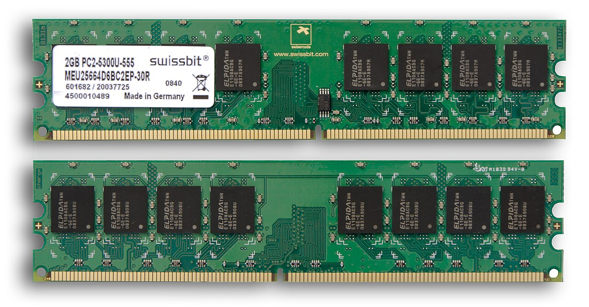
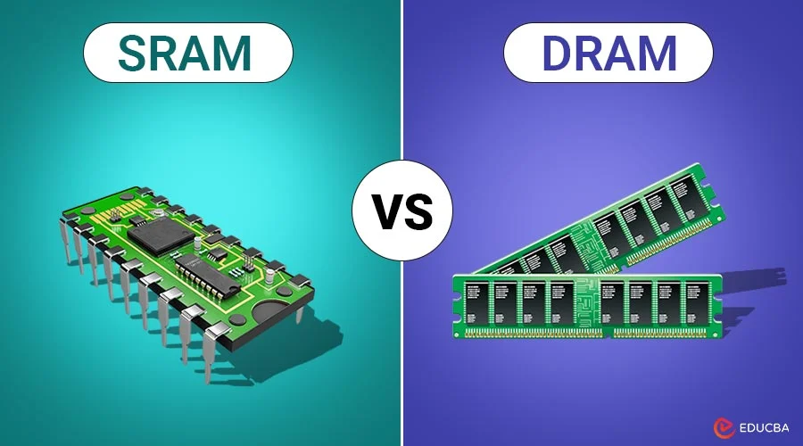
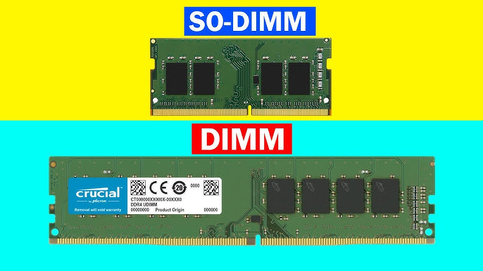

# 🧠 Random Access Memory (RAM)

> Learn what RAM is, how it works, its different types, and why it plays a critical role in computer performance.

---


# 💡 What is RAM?

**Random Access Memory (RAM)** is the computer's **primary memory** used to temporarily store data and instructions that the CPU is currently using.

Unlike storage devices such as SSDs or HDDs, RAM is **volatile memory**, meaning all data is erased when the computer is turned off.

<p align="center">

</p>

---

# ❓ Why is RAM Important?

RAM acts as the **workspace** of the computer.

Whenever you:

- Open Google Chrome
- Launch Microsoft Word
- Play a game
- Edit a video

the operating system loads the required data from the storage device into RAM because RAM is much faster than an SSD or HDD.

Without enough RAM, the computer becomes slow because it must repeatedly access slower storage.

<p align="center">

</p>

---

# ⚙️ How RAM Works

The basic process is:

```
SSD / HDD
     │
     ▼
    RAM
     │
     ▼
    CPU
     │
     ▼
Output
```

Example:

1. You open Google Chrome.
2. Windows loads Chrome from the SSD into RAM.
3. The CPU executes the program from RAM.
4. Closing Chrome frees that memory for other programs.

---

# 🔄 Volatile vs Non-Volatile Memory

| Volatile Memory | Non-Volatile Memory |
|-----------------|---------------------|
| Data is lost when power is removed | Data remains after power loss |
| Very Fast | Slower |
| RAM | SSD, HDD, USB Drive, ROM |

---

# 📚 Types of RAM

<p align="center">

</p>

## SRAM (Static RAM)

Characteristics:

- Very fast
- Expensive
- Doesn't require refreshing
- Used for CPU Cache (L1, L2, L3)

Advantages

- Extremely fast
- Low latency

Disadvantages

- Expensive
- Lower storage capacity

---

## DRAM (Dynamic RAM)

Characteristics:

- Slower than SRAM
- Requires constant refreshing
- Less expensive
- Used as the system's main memory

Advantages

- Large capacity
- Affordable

Disadvantages

- Slower than SRAM


---

# 💾 DDR RAM Generations

Modern computers use DDR (Double Data Rate) memory.

| Generation | Released | Typical Speed |
|------------|----------|---------------|
| DDR | 2000 | 200–400 MT/s |
| DDR2 | 2003 | 400–1066 MT/s |
| DDR3 | 2007 | 800–2133 MT/s |
| DDR4 | 2014 | 1600–3200+ MT/s |
| DDR5 | 2020 | 4800–8400+ MT/s |

Each new generation provides:

- Higher speed
- Greater bandwidth
- Lower power consumption
- Increased capacity

---

# 🖥️ RAM Form Factors

### DIMM

Used in:

- Desktop Computers
- Workstations
- Servers

### SO-DIMM

Used in:

- Laptops
- Mini PCs

SO-DIMMs are physically smaller than DIMMs.

<p align="center">

</p>

---

# 📏 RAM Specifications

When buying RAM, consider:

## Capacity

Examples:

- 4 GB
- 8 GB
- 16 GB
- 32 GB
- 64 GB

More capacity allows more applications to run simultaneously.

---

## Speed

Examples:

- 2666 MT/s
- 3200 MT/s
- 5600 MT/s
- 6000 MT/s

Higher speeds allow data to be transferred faster.

---

## Latency (CAS Latency)

Latency measures how quickly RAM responds to requests.

Lower latency generally means better performance.

Example:

```
CL16
```

is usually faster than

```
CL22
```

at the same speed.

---

# 🔀 Memory Channels

## Single Channel

One RAM module installed.

Lower bandwidth.

---

## Dual Channel

Two identical RAM modules.

Benefits:

- Increased bandwidth
- Better gaming performance
- Faster multitasking

---

## Quad Channel

Common in:

- Servers
- High-end Workstations

Provides even greater memory bandwidth.

---

# 🛡️ ECC vs Non-ECC RAM

## ECC (Error Correcting Code)

Features:

- Detects memory errors
- Corrects single-bit errors
- Used in servers

Advantages:

- High reliability
- Better data integrity

---

## Non-ECC RAM

Used in:

- Home PCs
- Gaming Systems
- Office Computers

Cheaper but cannot automatically correct memory errors.

---

# 💽 Virtual Memory

If RAM becomes full, the operating system uses part of the storage device as **Virtual Memory (Page File or Swap Space).**

```
RAM Full
     │
     ▼
SSD/HDD Used as Virtual Memory
```

Although virtual memory allows applications to continue running, it is much slower than physical RAM.

---

# ⚡ Factors Affecting RAM Performance

RAM performance depends on:

- Capacity
- Speed
- Number of Channels
- Latency
- DDR Generation

A system with sufficient RAM and dual-channel configuration generally performs much better than one with a single memory module.

---

# ❗ Common RAM Problems

Symptoms of faulty RAM include:

- Blue Screen of Death (BSOD)
- Random crashes
- System freezes
- Boot failures
- Unexpected restarts
- File corruption

---

# 🔧 RAM Best Practices

✔ Install matching RAM modules.

✔ Use dual-channel whenever possible.

✔ Avoid mixing different speeds.

✔ Ensure compatibility with the motherboard.

✔ Do not touch the gold contacts.

✔ Properly lock RAM into the DIMM slot.

---

# 🛡️ RAM in Cybersecurity

Understanding RAM is essential because:

- Malware executes in RAM.
- Memory forensics analyzes RAM dumps.
- Passwords and encryption keys may temporarily reside in memory.
- Incident responders capture RAM before shutting down compromised systems.
- Many attacks exploit memory vulnerabilities such as buffer overflows.

---

# 📚 Key Takeaways

- RAM is the computer's primary temporary memory.
- RAM is volatile and loses its contents when power is removed.
- The CPU executes programs loaded into RAM.
- SRAM is faster and used for CPU cache.
- DRAM is slower but provides larger capacity for system memory.
- Modern computers use DDR4 or DDR5 memory.
- Dual-channel memory improves performance.
- Virtual memory is slower than physical RAM.
- Understanding RAM is fundamental for troubleshooting, system performance, digital forensics, and cybersecurity.

---

# 📚 Next Chapter

➡️ **Storage**

In the next chapter, you'll learn about **Hard Disk Drives (HDDs), Solid State Drives (SSDs), NVMe storage, partitions, file systems, and how computers permanently store and retrieve data.**