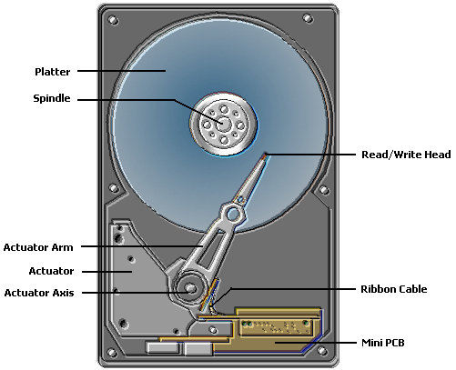
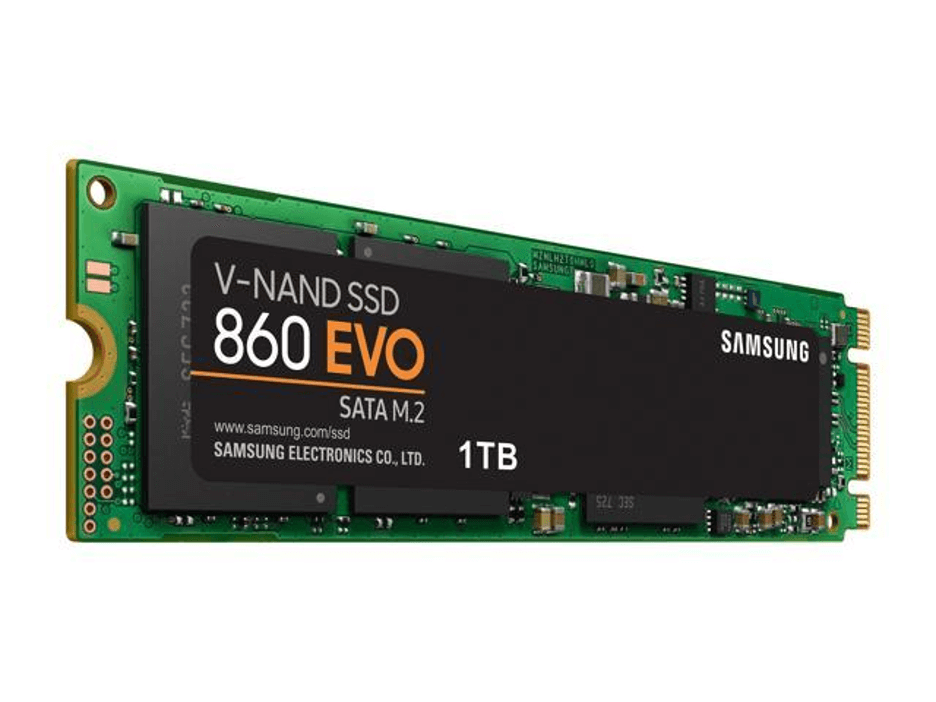
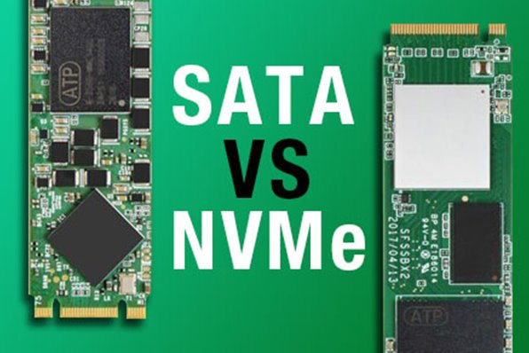
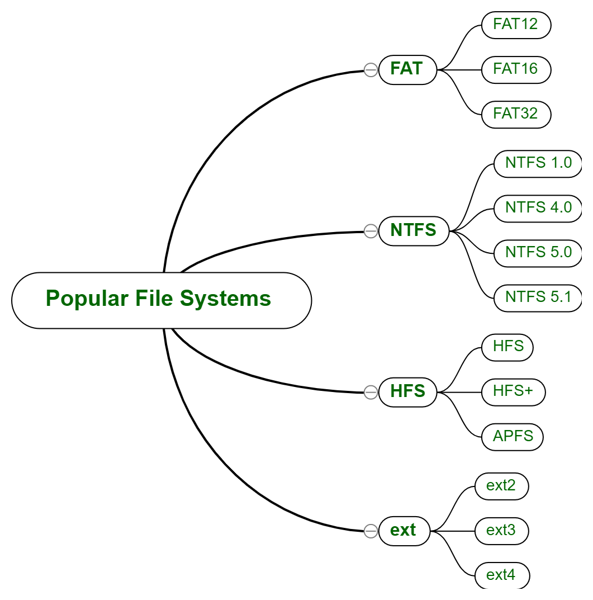

# 💾 Computer Storage

> A beginner's guide to understanding how computers store, organize, and protect data — from HDDs and SSDs to file systems, RAID, backups, and storage security in cybersecurity.

---

## 🎯 Learning Objectives

By the end of this chapter, you should be able to:

- Explain what **computer storage** is.
- Understand why storage is necessary.
- Differentiate **RAM** and **storage**.
- Compare **HDDs** and **SSDs**.
- Understand **flash storage**.
- Explain **NVMe** and **SATA**.
- Choose the appropriate storage device for a given use case.
- Understand why storage matters in **cybersecurity**.

---

## 📑 Table of Contents

- [Introduction](#introduction)
- [What is Computer Storage?](#what-is-computer-storage)
- [How Storage Works](#how-storage-works)
- [Types of Storage](#types-of-storage)
- [Storage Hierarchy](#storage-hierarchy)
- [Hard Disk Drive (HDD)](#hard-disk-drive-hdd)
- [Solid State Drive (SSD)](#solid-state-drive-ssd)
- [SATA SSD vs NVMe SSD](#sata-ssd-vs-nvme-ssd)
- [External Storage](#external-storage)
- [File Systems](#file-systems)
- [Storage Interfaces](#storage-interfaces)
- [Performance Factors](#performance-factors)
- [Data Organization](#data-organization)
- [RAID (Introduction)](#raid-introduction)
- [Backups](#backups)
- [Storage in Cybersecurity](#storage-in-cybersecurity)
- [Storage Security](#storage-security)
- [Common Beginner Mistakes](#common-beginner-mistakes)
- [Best Practices](#best-practices)
- [Visual Learning](#visual-learning)
- [Practical Exercises](#practical-exercises)
- [Interview Questions](#interview-questions)
- [Quick Revision](#quick-revision)
- [Key Takeaways](#key-takeaways)
- [Further Reading](#further-reading)
- [Next Chapter](#next-chapter)

---

## Introduction

Every time you save a photo, install a program, or write a document, that information has to live somewhere even after you turn your computer off. That "somewhere" is **storage**.

### What Is Storage?

**Storage** refers to the hardware components a computer uses to hold data — files, programs, and the operating system itself — so that it can be accessed again later, even after a restart.

### Why Computers Need Storage

Without storage, nothing you create or install would survive a power cycle. Your operating system, your applications, your documents, and your personal files all need a permanent home. Storage provides that home.

### Temporary vs. Permanent Storage

- **Temporary storage (RAM)** holds data only while the computer is powered on and running. It is extremely fast but **volatile** — meaning its contents disappear when power is lost.
- **Permanent storage (HDD/SSD)** holds data even when the computer is turned off. It is **non-volatile**, meaning the data stays put until it is deliberately changed or deleted.

> 🧠 **Analogy: The Desk and the Filing Cabinet**
>
> Think of **RAM** as your **desk** — a place where you keep what you are actively working on for quick access. Think of **storage** as your **filing cabinet** — where documents are kept long-term, even after you leave the room. When you shut your desk drawer at the end of the day (turn off the computer), papers on the desk (RAM) may get swept away, but the filing cabinet (storage) keeps everything safe.

---

## What is Computer Storage?

To understand storage, it helps to understand what actually gets stored:

- **Data** — the raw information a computer works with (numbers, text, images, etc.).
- **Files** — organized units of data given a name and format (e.g., `report.docx`).
- **Programs** — sets of instructions (software) that tell the computer what to do.
- **Operating System (OS)** — the core software (like Windows, Linux, or macOS) that manages hardware and runs programs. The OS itself must be stored somewhere to boot up each time.
- **Persistent storage** — storage that retains data without needing continuous power, such as an HDD or SSD.

> 📁 **Real-world analogy:** A **file** is like a single document, a **folder** is like a physical folder holding related documents, and the **storage device** is the entire filing cabinet or archive room holding everything.

---

## How Storage Works

When you save or open a file, several layers work together behind the scenes:

```
        User
         ↓
  Operating System
         ↓
     File System
         ↓
   Storage Device
```

1. **User** — You click "Save" in an application.
2. **Operating System** — The OS receives the request and decides where the data should go.
3. **File System** — A structured method (like **NTFS** or **ext4**) organizes how data is labeled, indexed, and located on the drive.
4. **Storage Device** — The physical hardware (HDD, SSD, etc.) that actually stores the bits of data magnetically or electronically.

When you later open that file, the process runs in reverse: the storage device retrieves the raw data, the file system tells the OS where to find it, and the OS hands it back to the application you're using.

---

## Types of Storage

| Type | Description | Example |
|---|---|---|
| **Primary Storage** | Fast, temporary memory the CPU uses directly while running programs | RAM |
| **Secondary Storage** | Permanent storage used to hold the OS, programs, and files | HDD, SSD |
| **Offline Storage** | Storage disconnected from the system unless specifically connected | USB drives, external HDDs, optical discs |
| **Cloud Storage** | Data stored on remote servers accessed over the internet | Google Drive, OneDrive, AWS S3 |

---

## Storage Hierarchy

Not all storage is equal — there's a trade-off between **speed** and **capacity/cost**. Storage closer to the CPU is faster but smaller and more expensive; storage farther away is slower but larger and cheaper.

```
                ▲  Fastest / Smallest / Most Expensive
                │
          CPU Registers
                │
              Cache
                │
               RAM
                │
             SSD / HDD
                │
        External Storage
                │
          Cloud Storage
                │
                ▼  Slowest / Largest / Cheapest
```

<p align="center">

</p>

> 💡 The CPU checks the fastest storage first (registers, then cache) before reaching further down the pyramid — because faster memory closer to the CPU dramatically improves performance.

---

## Hard Disk Drive (HDD)

A **Hard Disk Drive (HDD)** is a traditional storage device that stores data magnetically on spinning disks.

### Internal Components

- **Magnetic Platters** — spinning circular disks coated with a magnetic material where data is physically recorded.
- **Read/Write Heads** — tiny components that hover above the platters, reading and writing data magnetically.
- **RPM (Revolutions Per Minute)** — how fast the platters spin (commonly 5,400 RPM or 7,200 RPM). Higher RPM generally means faster data access.
- **Capacity** — how much data the drive can hold, typically measured in terabytes (TB).

<p align="center">

</p>

### Advantages

- Lower cost per gigabyte compared to SSDs.
- Widely available in large capacities (multiple terabytes).
- Well understood, mature technology.

### Disadvantages

- Slower read/write speeds compared to SSDs.
- Moving parts make them more vulnerable to physical shock and mechanical failure.
- Louder and generates more heat than SSDs.

### Common Use Cases

- Bulk data storage (backups, archives, media libraries).
- Budget desktop computers and servers where cost-per-gigabyte matters more than speed.

---

## Solid State Drive (SSD)

A **Solid State Drive (SSD)** stores data electronically using flash memory chips, with no moving parts.

### Key Components

- **NAND Flash Memory** — the chip-based storage medium that retains data even without power.
- **Controller** — a small processor on the SSD that manages how data is written, read, and organized across memory cells.
- **No Moving Parts** — unlike HDDs, SSDs have no spinning platters or mechanical heads, making them faster and more durable against physical shock.

<p align="center">

</p>

### Advantages

- Significantly faster read/write speeds than HDDs.
- More resistant to physical shock (no moving parts).
- Quieter, cooler, and more power-efficient.

### Disadvantages

- Higher cost per gigabyte compared to HDDs (though the gap has narrowed significantly).
- Limited number of write cycles over its lifespan (though modern SSDs are highly durable for typical use).

### Use Cases

- Operating system and application drives, where speed directly impacts user experience.
- Laptops, where durability and power efficiency matter.
- Performance-sensitive workloads like gaming and video editing.

---

## SATA SSD vs NVMe SSD

Not all SSDs are the same — the **interface** they use dramatically affects their speed.

| Feature | SATA SSD | NVMe SSD |
|---|---|---|
| **Interface** | SATA (Serial ATA) | PCIe (Peripheral Component Interconnect Express) |
| **Connector** | SATA data + power cables, or M.2 (SATA variant) | M.2 or U.2, directly on the PCIe bus |
| **Speed** | Up to ~550 MB/s | Up to several GB/s (often 3,000–7,000+ MB/s) |
| **Latency** | Higher latency | Much lower latency |
| **Power Consumption** | Lower | Slightly higher under load |
| **Price** | Generally cheaper | Generally more expensive |
| **Best Use Cases** | Budget upgrades, general use, replacing HDDs | High-performance computing, gaming, video editing, servers |

<p align="center">

</p>

> ⚡ **Why NVMe is faster:** SATA was originally designed for spinning hard drives and has a bandwidth ceiling. **NVMe (Non-Volatile Memory Express)** was designed specifically for flash storage and communicates directly over the much faster PCIe bus, removing that bottleneck.

---

## External Storage

| Type | Description | Advantages | Disadvantages |
|---|---|---|---|
| **USB Flash Drives** | Small, portable flash storage devices | Highly portable, inexpensive | Limited capacity, easy to lose |
| **External HDDs** | Portable hard drives connected via USB | Large capacity at low cost | Slower, fragile if dropped |
| **External SSDs** | Portable flash drives with SSD speeds | Fast, durable, portable | More expensive than external HDDs |
| **Memory Cards** | Small flash cards (SD, microSD) used in cameras/phones | Extremely compact | Limited capacity, easy to lose/damage |
| **Optical Media (CD/DVD/Blu-ray)** | Data stored on reflective discs read by lasers | Cheap, long shelf-life if stored properly | Slow, largely obsolete, requires a drive |
| **Network Attached Storage (NAS)** | A dedicated storage device connected to a network, accessible by multiple users | Centralized storage, supports RAID, remote access | Requires setup and network reliability |
| **Cloud Storage** | Data stored on remote servers accessed via the internet | Accessible anywhere, often includes automatic backup | Requires internet access, ongoing subscription cost |

---

## File Systems

A **file system** determines how data is named, stored, and organized on a storage device.

| File System | Max File Size | Compatibility | Common Use Cases |
|---|---|---|---|
| **FAT32** | 4 GB | Universally compatible (Windows, macOS, Linux, cameras) | USB drives, older devices |
| **exFAT** | Very large (effectively no practical limit) | Widely compatible, designed for flash drives | Large USB drives, SD cards |
| **NTFS** | Very large | Native to Windows, readable (often not writable) on macOS/Linux by default | Windows system drives |
| **ext4** | Very large | Native to most Linux distributions | Linux system and data drives |
| **XFS** | Extremely large | Common in enterprise Linux/Red Hat environments | High-performance servers, large-scale storage |
| **Btrfs** | Extremely large | Growing support in Linux | Snapshots, advanced Linux storage management |
| **APFS** | Very large | Native to macOS | macOS system drives, optimized for SSDs |

<p align="center">

</p>

---

## Storage Interfaces

An **interface** is the physical and logical connection method between a storage device and the rest of the computer.

- **SATA (Serial ATA)** — a common interface for HDDs and entry-level SSDs.
- **SAS (Serial Attached SCSI)** — an enterprise-grade interface offering higher reliability and performance, common in servers.
- **PCIe (Peripheral Component Interconnect Express)** — a high-speed bus used by NVMe SSDs and graphics cards.
- **NVMe (Non-Volatile Memory Express)** — a protocol built specifically for flash storage over PCIe, offering very high speeds.
- **USB (Universal Serial Bus)** — the common interface for external and portable storage devices.
- **Thunderbolt** — a high-speed interface (often combined with USB-C connectors) capable of very fast external storage transfer speeds.

```
Storage Device ── Interface (SATA / SAS / PCIe / NVMe / USB / Thunderbolt) ── Motherboard ── CPU
```

---

## Performance Factors

Several measurable factors determine how "fast" a storage device really is:

- **Capacity** — total amount of data the drive can hold (e.g., 500 GB, 1 TB, 4 TB).
- **Read Speed** — how quickly data can be retrieved from the drive.
- **Write Speed** — how quickly new data can be saved to the drive.
- **IOPS (Input/Output Operations Per Second)** — how many individual read/write operations a drive can handle per second; critical for databases and servers.
- **Latency** — the delay between requesting data and receiving it; lower is better.
- **RPM** — for HDDs, how fast the platters spin, affecting access speed.
- **Cache** — a small amount of fast memory on the drive used to speed up frequently accessed data.
- **Endurance (TBW – Terabytes Written)** — for SSDs, a rating estimating how much data can be written over the drive's lifespan before wear becomes a concern.

> 📊 **Practical example:** A database server handling thousands of transactions per second cares far more about **IOPS** and **latency** than raw storage capacity — which is why enterprise servers often use NVMe SSDs despite the higher cost.

---

## Data Organization

Once a storage device is connected, data must be organized logically:

- **Files** — individual units of stored data (documents, images, programs).
- **Folders** — containers used to group related files together.
- **Partitions** — logical divisions of a physical drive, allowing one drive to act as multiple separate sections (e.g., a `C:` drive and a `D:` drive on the same physical disk).
- **Volumes** — a usable storage unit created from one or more partitions, formatted with a file system.
- **Formatting** — the process of preparing a partition with a specific file system so the OS can store data on it.
- **Allocation Units (Cluster Size)** — the smallest block of space a file system uses to store data; even a 1 KB file will occupy at least one full allocation unit.

```
Physical Disk
   └── Partition 1
         └── Volume (formatted, e.g., NTFS)
               ├── Folder
               │     └── File
               └── File
```

---

## RAID (Introduction)

**RAID (Redundant Array of Independent Disks)** combines multiple physical drives into a single logical unit to improve performance, redundancy, or both.

| RAID Level | Description | Purpose |
|---|---|---|
| **RAID 0** | Splits (stripes) data across multiple drives | Maximizes speed, but offers **no redundancy** — one drive failure loses all data |
| **RAID 1** | Duplicates (mirrors) data across two drives | Provides redundancy — if one drive fails, the other still has the data |
| **RAID 5** | Stripes data with distributed parity across three or more drives | Balances performance and redundancy; can survive one drive failure |
| **RAID 10** | Combines mirroring and striping (RAID 1 + RAID 0) | High performance with strong redundancy, but requires more drives |

### Advantages and Disadvantages

- ✅ Improves performance (RAID 0), redundancy (RAID 1), or both (RAID 5/10).
- ❌ Increases cost due to needing multiple drives.
- ❌ RAID 0 has zero fault tolerance — a single failed drive destroys all data.

> ⚠️ **Important: RAID is not a backup.** RAID protects against certain types of *hardware failure*, but it does **not** protect against accidental deletion, ransomware, corruption, or theft. A separate backup strategy is always required.

---

## Backups

A **backup** is a separate copy of data kept specifically to recover from loss, corruption, or attack.

- **Local Backup** — a copy stored on a separate physical device in the same location (e.g., an external HDD).
- **External Backup** — a copy stored physically off-site, protecting against site-specific disasters like fire or theft.
- **Cloud Backup** — a copy stored on remote servers accessed via the internet, offering off-site protection with easy accessibility.

### The 3-2-1 Backup Rule

> 📌 **3-2-1 Rule:**
> - Keep **3** total copies of your data.
> - Store them on **2** different types of media.
> - Keep **1** copy off-site.

### Why Backups Matter

Backups are the last line of defense against hardware failure, accidental deletion, ransomware, and natural disasters. Without a proper backup strategy, data loss can be permanent and, in a business context, catastrophic.

---

## Storage in Cybersecurity

Understanding storage is essential to several core cybersecurity disciplines:

- **Digital Forensics** — investigators examine storage devices to reconstruct events, recover deleted files, and build evidence timelines.
- **Incident Response** — responders need to quickly image (copy) affected drives to preserve evidence while investigating a breach.
- **Malware Analysis** — analysts examine how malware writes to disk, hides files, or persists across reboots.
- **Data Recovery** — recovering lost or corrupted data after accidental deletion, hardware failure, or attack.
- **Secure Deletion** — ensuring sensitive data is unrecoverable once it's meant to be destroyed.
- **Disk Encryption** — protecting data at rest so that even if a drive is stolen, its contents remain unreadable.
- **Evidence Collection** — properly preserving storage media (using write-blockers and forensic images) so evidence remains admissible in legal proceedings.

---

## Storage Security

| Tool / Concept | Description |
|---|---|
| **BitLocker** | Microsoft's built-in full-disk encryption feature for Windows. |
| **LUKS (Linux Unified Key Setup)** | The standard disk encryption framework used on Linux systems. |
| **FileVault** | Apple's built-in full-disk encryption feature for macOS. |
| **Secure Erase** | A drive-level command that resets an SSD/HDD to a factory-clean state, removing recoverable data. |
| **TRIM** | A command that tells an SSD which data blocks are no longer in use, improving performance and helping ensure deleted data isn't easily recoverable. |
| **Disk Sanitization** | The broader process of completely and verifiably removing data from a storage device before disposal or reuse. |
| **Data Recovery Risks** | Simply deleting a file often only removes its "pointer" in the file system — the actual data may remain recoverable until it's overwritten or securely erased. |

> ⚠️ **Note:** Encryption tools like BitLocker, LUKS, and FileVault protect data **at rest** — meaning while the drive is powered off or locked. They do not replace the need for backups or endpoint security.

---

## Common Beginner Mistakes

> ⚠️ **Confusing RAM with storage.** RAM is temporary and volatile; storage (HDD/SSD) is permanent and non-volatile.

> ⚠️ **Assuming SSDs cannot fail.** SSDs have no moving parts but can still fail due to controller issues, flash memory wear, or power failure.

> ⚠️ **Believing deleting a file permanently removes it.** Standard deletion often just removes the file's reference in the file system — the data may still be recoverable until overwritten.

> ⚠️ **Never making backups.** Relying solely on a single drive (even a RAID array) without a separate backup is a common and costly mistake.

---

## Best Practices

- Always maintain backups following the **3-2-1 rule**.
- Use **full-disk encryption** (BitLocker, LUKS, FileVault) on devices holding sensitive data.
- Choose **SSD (NVMe where possible)** for operating system drives to improve overall system responsiveness.
- Use **HDDs or cloud storage** for bulk, infrequently accessed data where cost matters more than speed.
- Regularly monitor drive health using tools like `S.M.A.R.T.` diagnostics.
- Securely erase drives before disposal or resale to prevent data leakage.
- Never treat **RAID as a substitute** for proper backups.

---


---

## Practical Exercises

1. **Check installed storage devices (Linux):**
   ```bash
   lsblk
   ```

2. **Identify SSD or HDD (Linux):**
   ```bash
   cat /sys/block/sda/queue/rotational
   ```
   *(A result of `0` indicates SSD; `1` indicates HDD.)*

3. **View disk capacity (Linux):**
   ```bash
   df -h
   ```

4. **Compare read/write speeds (Linux, basic test):**
   ```bash
   sudo hdparm -Tt /dev/sda
   ```

5. **Explore disk partitions (Linux):**
   ```bash
   sudo fdisk -l
   ```

6. **Identify the file system used (Linux):**
   ```bash
   df -Th
   ```

---

## Interview Questions

1. What is secondary storage?
2. What is the difference between an HDD and an SSD?
3. What is the difference between SATA and NVMe?
4. What is RAID, and why is it not a substitute for backups?
5. What is a file system, and why does a storage device need one?
6. Why are backups important, and what is the 3-2-1 rule?
7. Explain the difference between RAM and storage.
8. Why might deleting a file not actually remove the data immediately?
9. What is TRIM, and why does it matter for SSDs?
10. Why is disk encryption important from a cybersecurity perspective?

---

## Quick Revision

| Concept | Summary |
|---|---|
| **RAM** | Fast, temporary, volatile memory |
| **Storage (HDD/SSD)** | Permanent, non-volatile data storage |
| **HDD** | Magnetic, mechanical, cheaper, slower |
| **SSD** | Flash-based, no moving parts, faster |
| **SATA** | Older, slower interface for SSDs/HDDs |
| **NVMe** | Modern, high-speed interface over PCIe |
| **File System** | Organizes how data is stored and located |
| **RAID** | Combines drives for speed and/or redundancy — not a backup |
| **Backup** | Separate copy of data for recovery, following the 3-2-1 rule |
| **Encryption** | Protects data at rest (BitLocker, LUKS, FileVault) |

---

## Key Takeaways

- **Storage** is permanent, non-volatile hardware that retains data even when powered off — unlike RAM.
- **HDDs** use spinning magnetic platters; **SSDs** use flash memory with no moving parts, making SSDs faster and more durable.
- **NVMe** SSDs are significantly faster than **SATA** SSDs because they communicate directly over the PCIe bus.
- **File systems** (NTFS, ext4, APFS, etc.) determine how data is organized, and compatibility varies by operating system.
- **RAID** improves performance and/or redundancy but is **never a replacement** for proper backups.
- The **3-2-1 backup rule** (3 copies, 2 media types, 1 off-site) is a foundational data protection strategy.
- Storage knowledge underpins core cybersecurity work, including **digital forensics**, **incident response**, and **secure data deletion**.
- Encryption tools like **BitLocker**, **LUKS**, and **FileVault** protect data at rest but do not replace backups or broader security practices.

---

## Further Reading

- [CompTIA Official Resources](https://www.comptia.org/)
- [Microsoft Learn](https://learn.microsoft.com/)
- [Kingston Technology — Storage Education](https://www.kingston.com/en/blog)
- [Samsung Semiconductor — SSD Resources](https://semiconductor.samsung.com/consumer-storage/)
- [Seagate — Storage Technology Resources](https://www.seagate.com/education/)
- [Western Digital — Storage Education](https://www.westerndigital.com/)

---

## Next Chapter

Now that you understand how computers store and protect data, it's time to look at how they process information visually and computationally.

The next chapter, **Graphics Processing Unit (GPU)**, will explore:

- How GPUs process graphics and render images.
- How GPUs accelerate parallel computation beyond just gaming.
- The role of GPUs in artificial intelligence and machine learning workloads.
- Why GPUs matter in cybersecurity—including tasks like password cracking and AI-driven security tools.

➡️ **Continue to:** **[Graphics Processing Unit (GPU)](../07-GPU/)**
