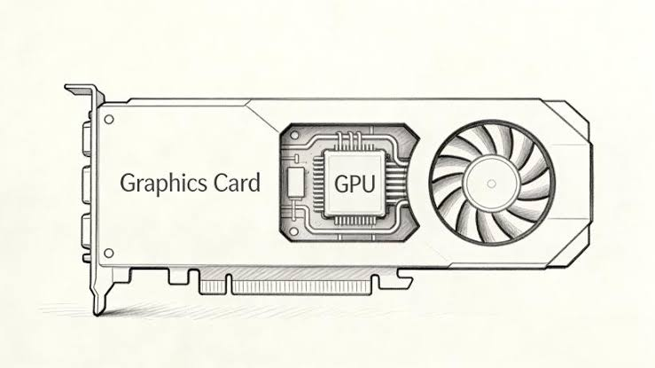
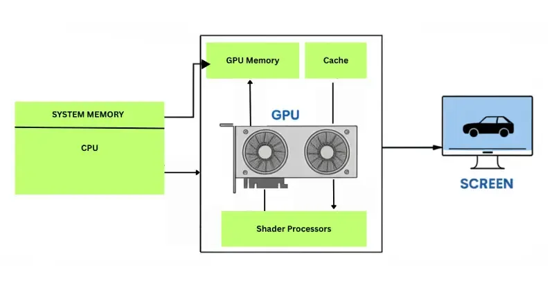
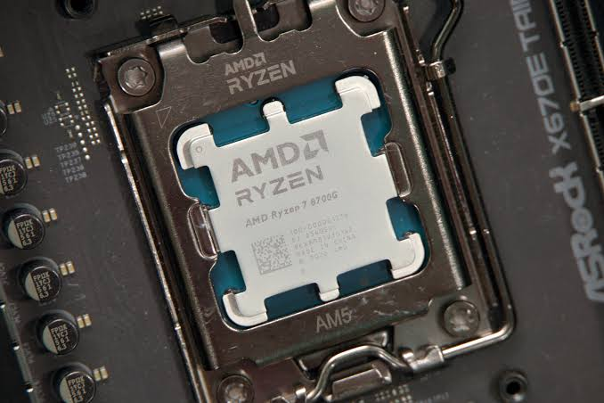
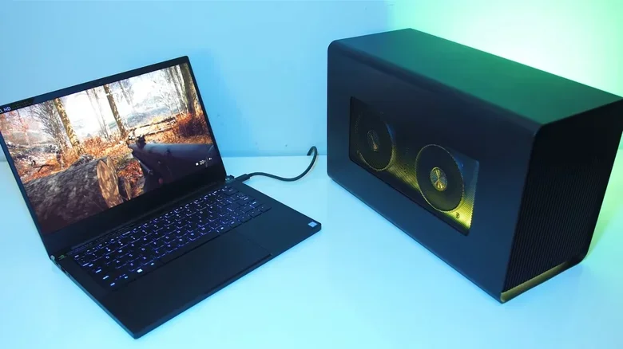
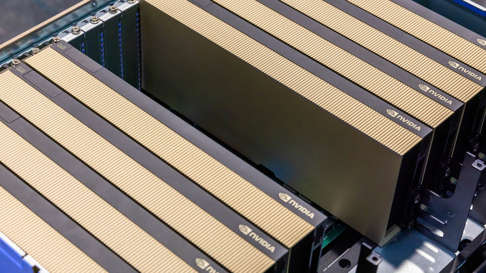
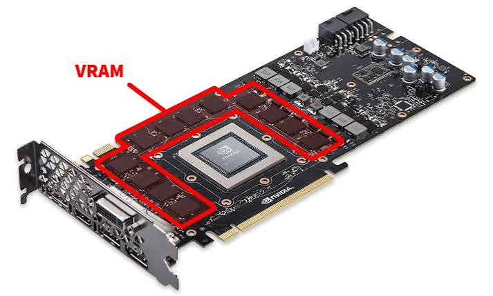
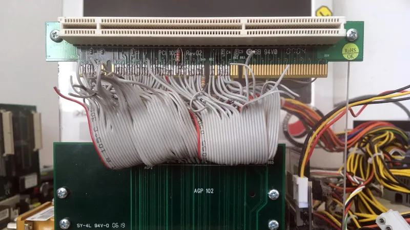

# 🎮 Graphics Processing Unit (GPU)

> A beginner's guide to understanding how GPUs render graphics, accelerate computation, and power modern gaming, AI, and cybersecurity workloads.

---

## 🎯 Learning Objectives

By the end of this chapter, you should be able to:

- Explain what a **GPU** is.
- Understand how a **GPU** differs from a **CPU**.
- Explain how GPUs render graphics.
- Distinguish **integrated** and **dedicated** GPUs.
- Compare **consumer**, **workstation**, and **data-center** GPUs.
- Understand why GPUs are important in **AI** and **cybersecurity**.
- Choose the appropriate GPU for different workloads.

---

## 📑 Table of Contents

- [Introduction](#introduction)
- [What is a GPU?](#what-is-a-gpu)
- [How a GPU Works](#how-a-gpu-works)
- [GPU Architecture](#gpu-architecture)
- [CPU vs GPU](#cpu-vs-gpu)
- [Types of GPUs](#types-of-gpus)
- [GPU Memory (VRAM)](#gpu-memory-vram)
- [GPU Interfaces](#gpu-interfaces)
- [GPU Performance Factors](#gpu-performance-factors)
- [GPU Manufacturers](#gpu-manufacturers)
- [Modern GPU Technologies](#modern-gpu-technologies)
- [GPU Applications](#gpu-applications)
- [GPU in Cybersecurity](#gpu-in-cybersecurity)
- [Common GPU Problems](#common-gpu-problems)
- [GPU Maintenance](#gpu-maintenance)
- [Choosing the Right GPU](#choosing-the-right-gpu)
- [Common Beginner Misconceptions](#common-beginner-misconceptions)
- [Best Practices](#best-practices)
- [Visual Learning](#visual-learning)
- [Practical Exercises](#practical-exercises)
- [Interview Questions](#interview-questions)
- [Quick Revision](#quick-revision)
- [Key Takeaways](#key-takeaways)
- [Further Reading](#further-reading)
- [Next Chapter](#next-chapter)

---

## Introduction

Every image, video, and 3D scene you see on a screen has to be calculated and drawn by something — and in almost every modern computer, that "something" is the **GPU**.

### What Is a GPU?

A **Graphics Processing Unit (GPU)** is a specialized processor designed to perform the massive number of calculations needed to render images, videos, and animations — and, increasingly, to accelerate general-purpose mathematical workloads like artificial intelligence.

<p align="center">

</p>

### Why Computers Need GPUs

Displaying even a simple desktop involves drawing thousands of individual pixels, each requiring color and position calculations. Modern games, videos, and 3D applications require millions of these calculations every second. A **CPU** *can* do this work, but it isn't built to do it efficiently at that scale — which is exactly the gap the GPU fills.

### Graphics Processing vs. General-Purpose Processing

- **General-purpose processing (CPU)** handles a wide variety of sequential tasks — running the operating system, managing files, executing application logic — one instruction (or a handful of instructions) at a time, very quickly.
- **Graphics processing (GPU)** handles a narrower type of task — mathematical calculations — but performs **thousands of them simultaneously**, which is exactly what rendering graphics (and, coincidentally, many AI and scientific workloads) requires.

### Why Modern Computers Almost Always Include a GPU

Even a basic laptop needs to display a desktop, render text, and play video — tasks that benefit from a GPU. Because of this, virtually every modern computer includes at least a basic GPU, whether it is built into the processor or installed as a separate expansion card.

---

## What is a GPU?

A GPU is built around a few foundational ideas:

- **Graphics Processing Unit** — hardware specialized in rendering images and handling parallel mathematical workloads.
- **Parallel Processing** — the ability to perform many calculations at the same time, rather than one after another.
- **Graphics Rendering** — the process of converting data (3D models, textures, lighting information) into a final 2D image ready for display.
- **Display Output** — the final step where the rendered image is sent to a monitor.


> 👔 **Analogy: The Manager and the Workers**
>
> Think of the **CPU** as a **manager** — highly capable, good at handling complex, varied tasks one at a time (or a few at a time), and excellent at making decisions.
>
> Think of the **GPU** as **thousands of workers**, each less individually powerful than the manager, but able to work on **thousands of simple, repetitive tasks simultaneously**. If you need one complex decision made, ask the manager. If you need ten thousand identical, simple tasks done at once (like coloring in ten thousand pixels), the army of workers finishes far faster.

---

## How a GPU Works

Rendering an image on screen involves a pipeline of steps, starting from the application you're using and ending with the picture on your monitor.

```
   Application
        ↓
       CPU
        ↓
       GPU
        ↓
 Video Memory (VRAM)
        ↓
     Monitor
```

<p align="center">

</p>

1. **Application** — A game or program determines what needs to be displayed (a 3D scene, a video frame, a user interface).
2. **CPU** — The CPU processes game logic, physics, and instructions, then sends rendering commands to the GPU.
3. **GPU** — The GPU performs the massive parallel calculations needed to transform 3D models, lighting, and textures into a 2D image (a process called **rendering**).
4. **Video Memory (VRAM)** — The GPU stores textures, frame data, and rendered images in its own dedicated high-speed memory.
5. **Monitor** — The finished image is sent out through a display connector (like HDMI or DisplayPort) and shown on screen.

---

## GPU Architecture

A modern GPU is made up of several key components working together:

| Component | Description |
|---|---|
| **GPU Cores** | The individual processing units that perform mathematical calculations; GPUs contain thousands of smaller cores compared to a CPU's few large cores. |
| **Shader Units** | Specialized cores responsible for calculating color, lighting, and texture effects on each pixel or vertex. |
| **Streaming Multiprocessors / Compute Units** | Groups of cores organized together (NVIDIA calls these **Streaming Multiprocessors**; AMD calls them **Compute Units**) that execute parallel workloads efficiently. |
| **VRAM (Video RAM)** | Dedicated high-speed memory used to store textures, frame buffers, and rendering data. |
| **Memory Bus** | The pathway connecting VRAM to the GPU's processing cores; wider buses allow more data to move at once. |
| **Display Controller** | Manages the output signal sent to a connected monitor. |
| **Video Encoder / Decoder** | Dedicated hardware for compressing and decompressing video, used in tasks like streaming and video editing. |
| **Cooling System** | Fans, heatsinks, or liquid cooling solutions that keep the GPU from overheating under heavy load. |

```
        ┌─────────────────────────┐
        │        GPU Chip         │
        │  ┌─────┐ ┌─────┐ ┌─────┐│
        │  │ SM/ │ │ SM/ │ │ SM/ ││   ← Streaming Multiprocessors / Compute Units
        │  │ CU  │ │ CU  │ │ CU  ││      (each containing many cores + shader units)
        │  └─────┘ └─────┘ └─────┘│
        └────────────┬────────────┘
                     │ Memory Bus
             ┌───────┴───────┐
             │     VRAM      │
             └───────────────┘
```

---

## CPU vs GPU

| Feature | CPU | GPU |
|---|---|---|
| **Purpose** | General-purpose computing and control | Parallel mathematical computation and rendering |
| **Number of Cores** | Few (typically 4–24 in consumer chips), each very powerful | Thousands, each simpler than a CPU core |
| **Clock Speed** | Higher per-core clock speed | Generally lower per-core clock speed |
| **Parallel Processing** | Limited parallelism | Massive parallelism |
| **Latency** | Low latency for individual tasks | Higher latency per task, but far higher total throughput |
| **Power Consumption** | Moderate | Can be very high under full load, especially in gaming/AI GPUs |
| **Best Workloads** | Sequential logic, OS tasks, general applications | Graphics rendering, AI training, scientific simulations |

### Practical Examples

- **Gaming** — The GPU renders the 3D world in real time; the CPU handles game logic, physics, and AI behavior of in-game characters.
- **AI** — Training a machine learning model involves massive matrix multiplication — a task perfectly suited to a GPU's parallel architecture.
- **Scientific Computing** — Simulations like weather modeling or molecular dynamics benefit heavily from GPU acceleration.
- **Cybersecurity** — Password-cracking tools use GPUs to test enormous numbers of password guesses in parallel, far faster than a CPU alone.

---

## Types of GPUs

### Integrated GPU (iGPU)

Built directly into the CPU chip, sharing system memory (RAM) rather than having dedicated VRAM.

- ✅ **Advantages:** Lower cost, lower power consumption, no extra hardware needed.
- ❌ **Disadvantages:** Significantly less powerful than dedicated GPUs; shares memory bandwidth with the CPU.
- 🎯 **Typical Use Cases:** Office work, web browsing, video playback, everyday computing.

<p align="center">

</p>


### Dedicated GPU (dGPU)

A separate expansion card with its own processor and dedicated VRAM, installed via a PCIe slot.

- ✅ **Advantages:** Much higher performance, dedicated memory, better for demanding workloads.
- ❌ **Disadvantages:** Higher cost, higher power consumption, generates more heat.
- 🎯 **Typical Use Cases:** Gaming, video editing, 3D rendering, AI workloads.

<p align="center">

</p>

### External GPU (eGPU)

A dedicated GPU housed in an external enclosure, connected to a laptop or small-form-factor PC (typically via Thunderbolt).

- ✅ **Advantages:** Adds dedicated GPU power to devices that otherwise lack one, like laptops.
- ❌ **Disadvantages:** Limited by external connection bandwidth; added cost and desk footprint.
- 🎯 **Typical Use Cases:** Laptop users needing occasional gaming or GPU-accelerated performance.

<p align="center">

</p>

### Server / Data-Center GPU

Specialized GPUs designed for data centers, optimized for AI training, virtualization, and large-scale parallel workloads rather than display output.

- ✅ **Advantages:** Extremely high computational power, designed for 24/7 operation, often support multi-user virtualization.
- ❌ **Disadvantages:** Very expensive, typically lack traditional display outputs, require specialized cooling and power infrastructure.
- 🎯 **Typical Use Cases:** AI model training, cloud computing, large-scale scientific research.

<p align="center">

</p>

---

## GPU Memory (VRAM)

**VRAM (Video RAM)** is memory dedicated specifically to the GPU, used to store textures, frame buffers, and data the GPU needs immediate access to.

<p align="center">

</p>

### Why GPUs Need Dedicated Memory

Sharing system RAM with the CPU would create a bottleneck, since both processors would compete for the same memory bandwidth. Dedicated VRAM allows the GPU to access the large volumes of graphical data it needs without waiting on the CPU.

### Types of GPU Memory

| Memory Type | Description |
|---|---|
| **GDDR6** | A common high-speed memory type used in most modern consumer GPUs. |
| **GDDR6X** | A faster variant of GDDR6, offering higher bandwidth, often used in higher-end gaming GPUs. |
| **HBM (High Bandwidth Memory)** | Memory stacked vertically and placed very close to the GPU chip, offering extremely high bandwidth; commonly used in data-center and AI-focused GPUs. |
| **Shared Memory** | Memory borrowed from system RAM, typically used by integrated GPUs that lack dedicated VRAM. |

### Capacity and Bandwidth

- **Capacity** (measured in GB) determines how much texture and data the GPU can hold at once — important for high-resolution gaming or large AI models.
- **Bandwidth** (measured in GB/s) determines how quickly data can move between VRAM and the GPU's processing cores — often more important than raw capacity for performance.

---

## GPU Interfaces

### Connection to the Motherboard

- **PCI Express (PCIe)** — the standard high-speed interface used by modern dedicated GPUs to connect to the motherboard.
<p align="center">

</p>

- **AGP (Accelerated Graphics Port)** — a now-obsolete interface used before PCIe became standard; included here for historical context.
<p align="center">

</p>

- **M.2** — primarily used for storage, but also seen on some compact AI accelerator cards designed for smaller form factors.
<p align="center">

</p>

### Display Outputs

| Connector | Description |
|---|---|
| **HDMI** | Common connector supporting both video and audio, widely used for monitors and TVs. |
| **DisplayPort** | A high-performance connector often preferred for gaming monitors due to high refresh rate and resolution support. |
| **DVI** | An older digital video connector, largely being phased out. |
| **VGA (legacy)** | A very old analog connector, rarely used on modern hardware. |

```
GPU ── PCIe slot ── Motherboard
 │
 └── Display Output (HDMI / DisplayPort / DVI / VGA) ── Monitor
```

---

## GPU Performance Factors

- **Core Count** — more cores generally allow more parallel work to be done at once.
- **Clock Speed** — how fast each core operates, measured in MHz/GHz.
- **VRAM Capacity** — determines how much data (textures, models) the GPU can hold without needing to fetch more from slower system memory.
- **Memory Bandwidth** — how quickly data moves between VRAM and the GPU cores.
- **Memory Bus Width** — the "width" of the data pathway between VRAM and the GPU; wider generally means faster data transfer.
- **Architecture Generation** — newer GPU architectures are often significantly more efficient than older ones, even at similar specifications.
- **Cooling** — better cooling allows the GPU to sustain higher performance for longer without **thermal throttling**.
- **Power Limits (TDP – Thermal Design Power)** — the maximum power (and heat) a GPU is designed to handle; higher TDP GPUs generally offer more performance but require better power supplies and cooling.
- **Driver Optimization** — software drivers can significantly affect real-world performance, especially in specific games or applications.

> 💡 **Real-world example:** Two GPUs with identical core counts can perform very differently if one has a newer architecture, faster VRAM, or better driver optimization — specifications alone don't tell the whole story.

---

## GPU Manufacturers

- **NVIDIA** — a leading GPU manufacturer known for gaming GPUs (GeForce), workstation GPUs (RTX/Quadro lineage), and data-center AI GPUs (the "A" and "H" series).
<p align="center">

</p>

- **AMD** — a major competitor offering gaming GPUs (Radeon), workstation GPUs (Radeon Pro), and data-center accelerators (Instinct).
<p align="center">

</p>

- **Intel** — traditionally known for integrated graphics built into its CPUs, and more recently has entered the dedicated GPU market (Arc series).

<p align="center">

</p>

### General Categories

- **Gaming GPUs** — optimized for real-time rendering and high frame rates.
- **Workstation GPUs** — optimized for stability and precision in professional applications like CAD and 3D modeling.
- **AI GPUs** — optimized for massive parallel mathematical operations used in training and running AI models.
- **Integrated Graphics** — built into the CPU, designed for everyday, less demanding tasks.

---

## Modern GPU Technologies

- **Ray Tracing** — a rendering technique that simulates realistic light behavior (reflections, shadows) for more lifelike graphics.
- **Tensor Cores** — specialized cores (found in some NVIDIA GPUs) designed specifically to accelerate AI and machine learning calculations.
- **DLSS (Deep Learning Super Sampling)** — an NVIDIA technology that uses AI to upscale lower-resolution images in real time, improving performance without a large loss in visual quality.
- **FSR (FidelityFX Super Resolution)** — AMD's equivalent upscaling technology.
- **XeSS** — Intel's equivalent upscaling technology.
- **CUDA** — NVIDIA's parallel computing platform, widely used in AI and scientific computing.
- **OpenCL** — an open, cross-vendor standard for parallel computing across different types of hardware.
- **DirectX** — Microsoft's graphics API, widely used for Windows gaming.
- **Vulkan** — a modern, cross-platform graphics API offering lower-level hardware access for improved performance.

> 📝 This chapter introduces these technologies at a conceptual level only — deeper technical exploration is outside the scope of an IT Fundamentals chapter.

---

## GPU Applications

GPUs are used far beyond gaming:

- **Gaming** — real-time rendering of 3D worlds.
- **Video Editing** — accelerating video encoding, effects, and rendering.
- **3D Rendering** — creating realistic images and animations for film and design.
- **CAD (Computer-Aided Design)** — precision engineering and architectural modeling.
- **Artificial Intelligence** — training and running AI models efficiently through parallel computation.
- **Machine Learning** — performing the matrix operations at the heart of most ML algorithms.
- **Scientific Research** — simulations in physics, chemistry, and climate modeling.
- **Cryptocurrency Mining (historical overview)** — GPUs were historically popular for mining certain cryptocurrencies due to their parallel processing power, though this has shifted over time toward specialized hardware for many coins.
- **Cybersecurity** — accelerating tasks like password cracking, AI-based threat detection, and malware analysis.
- **Cloud Computing** — cloud providers offer GPU-powered virtual machines for rent, supporting AI, rendering, and scientific workloads without requiring local hardware.

---

## GPU in Cybersecurity

Cybersecurity professionals benefit from understanding GPUs because many modern security tools and threats rely heavily on GPU acceleration.

- **Password Hash Cracking** — testing large numbers of possible passwords against a hash is a highly parallel task, making GPUs dramatically faster than CPUs for this purpose.
- **Hashcat** — a widely used password recovery/cracking tool that leverages GPU acceleration to test millions of password guesses per second.
- **John the Ripper (GPU acceleration)** — another well-known password-cracking tool that supports GPU-accelerated modes for improved performance.
- **AI Security** — GPUs power the AI models increasingly used for threat detection, anomaly detection, and automated security analysis.
- **Machine Learning** — training models to detect malware patterns or network anomalies relies on GPU-accelerated computation.
- **Malware Analysis** — some analysis workflows use GPU acceleration to process large datasets or run AI-assisted detection more quickly.
- **Threat Detection** — GPU-accelerated systems can analyze network traffic or log data at scale in real time.
- **Digital Forensics** — GPU acceleration can speed up tasks like hash comparison across massive forensic datasets.

> ⚠️ **Ethical Use Only:** Tools like Hashcat and John the Ripper are legitimate, widely used security tools — but they must only be used on systems and data you are **explicitly authorized** to test. Using these tools against systems without permission is illegal in most jurisdictions.

---

## Common GPU Problems

| Problem | Description |
|---|---|
| **Overheating** | Excessive temperatures caused by poor cooling, dust buildup, or heavy sustained workloads. |
| **Artifacting** | Visual glitches (odd colors, shapes, or flickering) usually indicating a hardware fault or overheating. |
| **Driver Issues** | Outdated or corrupted drivers can cause crashes, poor performance, or display problems. |
| **Insufficient Power** | An underpowered or faulty power supply can cause instability, especially under heavy GPU load. |
| **VRAM Errors** | Memory faults on the GPU that can cause crashes or visual corruption. |
| **Display Problems** | No signal, flickering, or resolution issues, often related to cables, connectors, or drivers. |
| **Fan Failure** | A failed cooling fan can quickly lead to overheating and potential hardware damage. |
| **Thermal Throttling** | The GPU automatically reduces its performance to avoid overheating, resulting in lower frame rates or slower processing. |

### Troubleshooting Tips

- Monitor temperatures using GPU monitoring software before assuming a hardware fault.
- Reinstall or update drivers when experiencing crashes or visual glitches.
- Check that power cables are firmly connected and the power supply has sufficient wattage.
- Clean dust from fans and heatsinks regularly to maintain proper airflow.

---

## GPU Maintenance

- **Cleaning Dust** — regularly remove dust buildup from fans and heatsinks to maintain proper airflow and cooling.
- **Monitoring Temperatures** — use monitoring tools to track GPU temperature under load and catch problems early.
- **Updating Drivers** — keep GPU drivers current for stability, performance, and security improvements.
- **Checking Power Connectors** — ensure all power cables are securely connected, especially in high-power GPUs requiring multiple connectors.
- **Replacing Thermal Paste (overview)** — over time, thermal paste between the GPU chip and its cooler can degrade; replacing it can help restore cooling performance (typically an advanced maintenance task).
- **Airflow** — ensure the computer case has adequate intake and exhaust airflow to support GPU cooling.

---

## Choosing the Right GPU

| Use Case | Recommendation | Why |
|---|---|---|
| **Office Work** | Integrated GPU | More than sufficient for documents, browsing, and video playback |
| **Students** | Integrated GPU or entry-level dedicated GPU | Balances cost with light coursework and occasional media/gaming needs |
| **Programming** | Integrated GPU (dedicated GPU only if doing ML/graphics work) | Most development work does not require significant GPU power |
| **Gaming** | Mid-range to high-end dedicated GPU | Real-time rendering demands strong parallel processing |
| **Content Creation** | High-end dedicated GPU with strong VRAM | Video editing and 3D rendering benefit heavily from VRAM and core count |
| **Machine Learning** | GPU with strong Tensor/AI acceleration and high VRAM | Training models requires massive parallel computation and memory capacity |
| **Cybersecurity Labs** | Dedicated GPU (mid-range or higher) | Useful for authorized password-cracking practice and AI-based security tools |
| **Virtual Machines** | Server-grade GPU with virtualization support | Supports multiple users/workloads sharing GPU resources |
| **Budget Builds** | Integrated GPU or entry-level dedicated GPU | Keeps costs low while covering essential tasks |
| **High-End Workstations** | Workstation-class GPU (e.g., professional certified drivers) | Optimized for stability and precision in CAD/3D professional software |

---

## Common Beginner Misconceptions

> ⚠️ **More VRAM does not always mean better performance.** VRAM capacity only helps if the workload actually needs that much memory; a weaker GPU with more VRAM won't outperform a stronger GPU with less.

> ⚠️ **GPUs are used for much more than gaming.** AI, scientific research, video editing, and cybersecurity all rely heavily on GPU acceleration.

> ⚠️ **Integrated GPUs are sufficient for many everyday tasks.** Not every user needs a dedicated GPU — office work, web browsing, and general use run fine on integrated graphics.

> ⚠️ **A powerful GPU cannot compensate for a weak CPU in every workload.** Some tasks are CPU-bound; pairing a high-end GPU with a weak CPU can create a bottleneck that limits overall performance.

---

## Best Practices

- Match the GPU to your actual workload rather than buying based on marketing alone.
- Ensure your power supply can handle the GPU's power requirements before purchasing.
- Keep drivers updated, especially before playing new games or running new AI/ML frameworks.
- Monitor temperatures regularly, especially in dusty or poorly ventilated environments.
- Only use GPU-accelerated security tools (like Hashcat) on systems you are authorized to test.
- Consider VRAM capacity carefully for AI/ML and content-creation workloads, since running out of VRAM can severely limit performance.

---


---

## Practical Exercises

1. **Identify the installed GPU (Windows):**
   ```powershell
   dxdiag
   ```
   *(Check the "Display" tab for GPU details.)*

2. **Identify the installed GPU (Linux):**
   ```bash
   lspci | grep -i vga
   ```

3. **Check VRAM capacity (Linux, NVIDIA):**
   ```bash
   nvidia-smi
   ```

4. **View GPU utilization (Linux, NVIDIA):**
   ```bash
   nvidia-smi --query-gpu=utilization.gpu,memory.used,memory.total --format=csv
   ```

5. **Install/update GPU drivers:**
   - Windows: Use Windows Update or the manufacturer's official driver tool (NVIDIA GeForce Experience, AMD Software).
   - Linux: Use your distribution's package manager (e.g., `sudo apt install nvidia-driver-XXX`).

6. **Compare integrated and dedicated graphics:**
   - If your system has both, use `dxdiag` (Windows) or `lspci` (Linux) to identify both GPUs and compare their listed specifications.

7. **Benchmark a GPU using common tools:**
   - Try a reputable, official benchmarking tool (e.g., a manufacturer-provided or well-known benchmarking suite) to measure real-world performance.

---

## Interview Questions

1. What is a GPU, and how does it differ from a CPU?
2. What is VRAM, and why do GPUs need dedicated memory?
3. What is CUDA, and why is it significant for AI workloads?
4. Explain the difference between integrated and dedicated graphics.
5. Why are GPUs particularly useful for AI and machine learning?
6. Why do password-cracking tools like Hashcat benefit from GPU acceleration?
7. What is thermal throttling, and why does it happen?
8. What is the difference between GDDR6 and HBM memory?
9. Why might a powerful GPU fail to improve performance if paired with a weak CPU?
10. What ethical considerations apply when using GPU-accelerated security tools?

---

## Quick Revision

| Concept | Summary |
|---|---|
| **GPU** | Specialized processor for parallel computation and graphics rendering |
| **CPU vs GPU** | CPU = few powerful cores for general tasks; GPU = thousands of simpler cores for parallel tasks |
| **iGPU** | Built into the CPU, shares system RAM, good for everyday tasks |
| **dGPU** | Separate card with dedicated VRAM, needed for demanding workloads |
| **VRAM** | Dedicated GPU memory (GDDR6, GDDR6X, HBM) for textures and data |
| **CUDA/OpenCL** | Parallel computing platforms enabling GPU-accelerated applications |
| **Ray Tracing** | Realistic lighting simulation technique in modern graphics |
| **Cybersecurity Use** | GPUs accelerate password cracking, AI threat detection, and forensic analysis |

---

## Key Takeaways

- A **GPU** is a specialized processor built for massive parallel computation, originally for graphics but now essential to AI and scientific workloads.
- The **CPU** handles general-purpose, sequential tasks; the **GPU** handles many simple, repetitive tasks simultaneously.
- **Integrated GPUs** are sufficient for everyday tasks; **dedicated GPUs** are needed for gaming, content creation, and AI.
- **VRAM** type and capacity (GDDR6, GDDR6X, HBM) significantly affect performance, especially for memory-intensive workloads.
- Modern technologies like **ray tracing**, **DLSS/FSR/XeSS**, and **Tensor Cores** continue to expand what GPUs can do.
- GPUs play a major role in **cybersecurity**, from authorized password cracking with tools like **Hashcat** to powering AI-based threat detection.
- Choosing the right GPU depends entirely on the intended workload — more powerful (and expensive) isn't always necessary.

---

## Further Reading

- [NVIDIA Official Documentation](https://www.nvidia.com/en-us/geforce/technologies/)
- [AMD Official Documentation](https://www.amd.com/en/technologies.html)
- [Intel Graphics Documentation](https://www.intel.com/content/www/us/en/products/details/discrete-gpus.html)
- [Microsoft Learn](https://learn.microsoft.com/)
- [PCI-SIG (PCI Express Standards)](https://pcisig.com/)

---

## Next Chapter

Now that you understand how GPUs render graphics and accelerate computation, it's time to look at what keeps every component in your system running: power.

The next chapter, **Power Supply Unit (PSU)**, will explore:

- How a PSU converts electrical power for safe use inside a computer.
- How power is distributed to different components.
- Efficiency ratings, including the **80 PLUS** certification system.
- Modular vs. non-modular power supplies.
- How to calculate the wattage a system needs.
- Why stable, reliable power is critical for both system reliability and security.

➡️ **Continue to:** **[Power Supply Unit (PSU)](../08-Power-Supply/)**

---
---