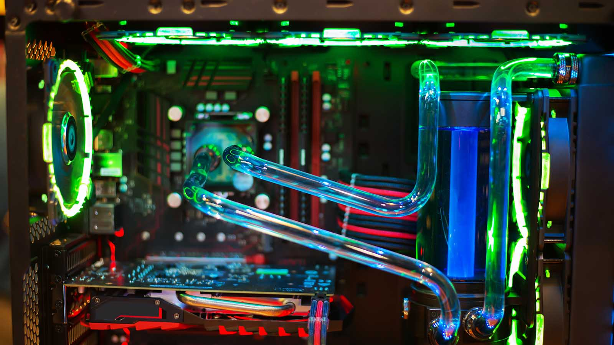
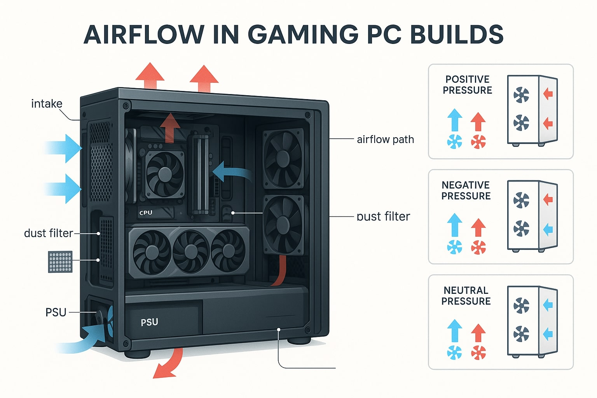
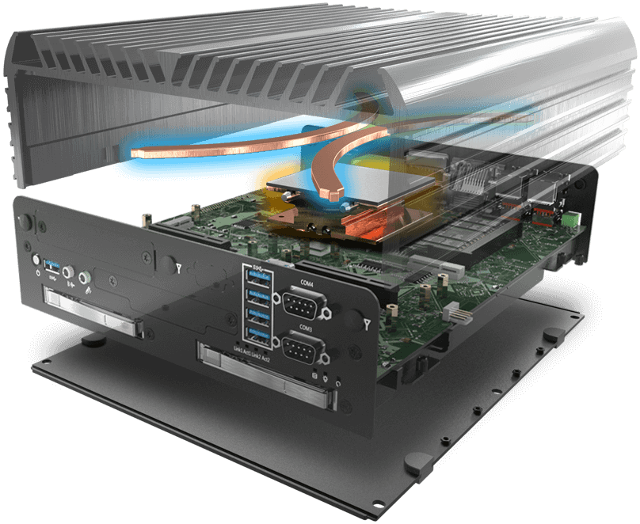
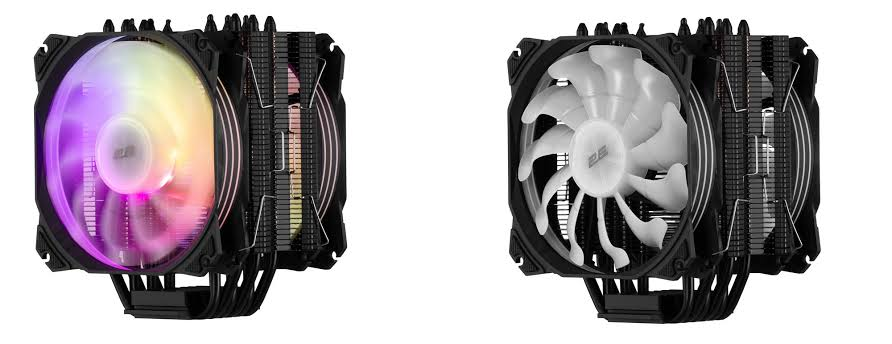
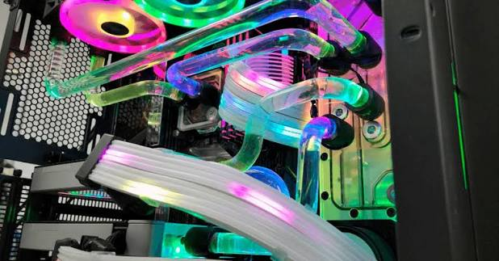
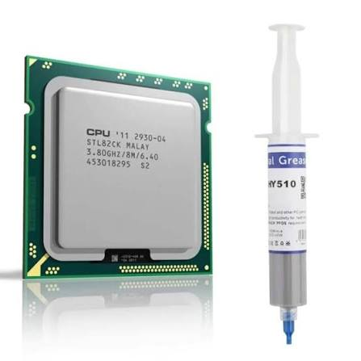
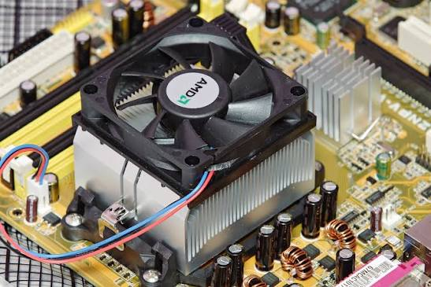
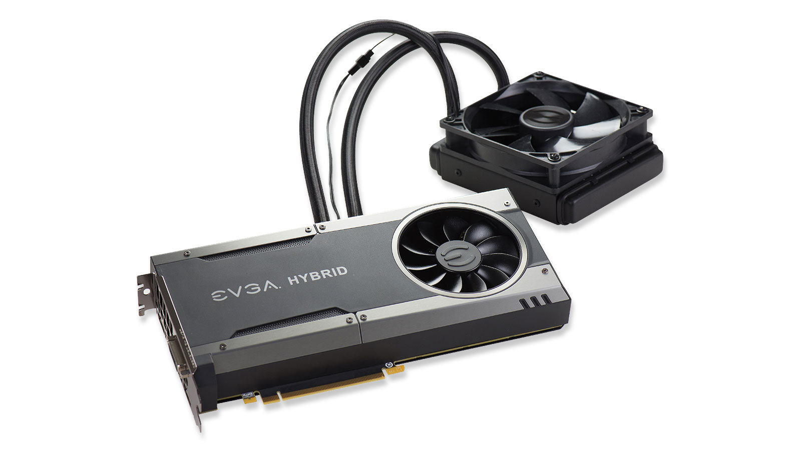
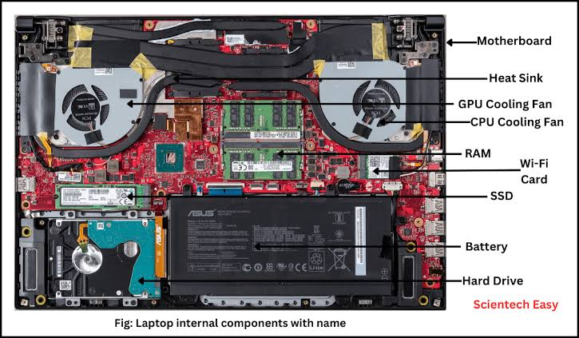

# ❄️ Computer Cooling Systems

> A beginner's guide to understanding how computers manage heat — from heat sinks and airflow to liquid cooling, thermal throttling, and why cooling matters for system reliability and cybersecurity.

---

## 🎯 Learning Objectives

By the end of this chapter, you should be able to:

- Explain why computers generate heat.
- Understand the importance of cooling.
- Identify different cooling solutions.
- Compare **air cooling** and **liquid cooling**.
- Explain **thermal paste** and **heat sinks**.
- Understand **airflow** inside a computer case.
- Perform basic cooling maintenance.
- Explain why cooling is important for system reliability and cybersecurity.

---

## 📑 Table of Contents

- [Introduction](#introduction)
- [What is a Computer Cooling System?](#what-is-a-computer-cooling-system)
- [Why Cooling Matters](#why-cooling-matters)
- [How Heat Moves](#how-heat-moves)
- [Main Cooling Components](#main-cooling-components)
- [Types of Cooling](#types-of-cooling)
- [Air Cooling vs Liquid Cooling](#air-cooling-vs-liquid-cooling)
- [Airflow Inside a Computer Case](#airflow-inside-a-computer-case)
- [Thermal Paste](#thermal-paste)
- [CPU Cooling](#cpu-cooling)
- [GPU Cooling](#gpu-cooling)
- [Laptop Cooling](#laptop-cooling)
- [Cooling and Performance](#cooling-and-performance)
- [Monitoring Temperatures](#monitoring-temperatures)
- [Cooling Maintenance](#cooling-maintenance)
- [Common Cooling Problems](#common-cooling-problems)
- [Cooling in Servers and Data Centers](#cooling-in-servers-and-data-centers)
- [Cooling in Cybersecurity](#cooling-in-cybersecurity)
- [Common Beginner Misconceptions](#common-beginner-misconceptions)
- [Best Practices](#best-practices)
- [Visual Learning](#visual-learning)
- [Practical Exercises](#practical-exercises)
- [Interview Questions](#interview-questions)
- [Quick Revision](#quick-revision)
- [Key Takeaways](#key-takeaways)
- [Further Reading](#further-reading)
- [Next Chapter](#next-chapter)

---

## Introduction

Every electronic component in a computer — the CPU, the GPU, the storage drives — generates heat simply by operating. Left unmanaged, that heat can slow a system down, damage hardware, or cause it to fail entirely.

### Why Electronic Components Generate Heat

Every time electricity flows through a circuit, some of that energy is lost as heat due to electrical resistance. The more work a component does — the more instructions a CPU processes, the more pixels a GPU renders — the more electricity flows, and the more heat is produced.

### Why Cooling Is Essential

Computer components are only designed to operate safely within a certain temperature range. If that range is exceeded, the system will slow itself down, become unstable, or in severe cases, suffer permanent hardware damage.

### What Happens If Components Become Too Hot

- Performance drops as the system protects itself.
- Programs may crash or freeze.
- In extreme cases, permanent damage can occur to the CPU, GPU, or motherboard.
- Data being processed at the time of a crash can become corrupted or lost.

### Why Every Computer Needs an Effective Cooling System

Without cooling, even a brand-new, powerful computer would overheat within minutes of real use. Cooling isn't an optional upgrade — it's a fundamental requirement for any functioning computer, from a smartphone to a data-center server.

---

## What is a Computer Cooling System?

<p align="center">

</p>

A **computer cooling system** is the combination of hardware and design choices used to manage three related processes:

- **Heat Generation** — the unavoidable production of heat as electronic components operate.
- **Heat Dissipation** — the process of moving that heat away from sensitive components and out of the system.
- **Thermal Management** — the overall strategy (hardware and software) used to keep temperatures within safe operating limits.

> 🚗 **Analogy: The Car Engine Cooling System**
>
> A car engine generates enormous heat through combustion. Without a cooling system — a radiator, coolant, and a fan — the engine would overheat and fail within minutes of driving. A computer works the same way: the CPU and GPU are like the engine, and the cooling system (heat sinks, fans, or liquid coolers) plays the same role as the radiator and coolant, carrying heat away before it causes damage.

---

## Why Cooling Matters

Excess heat doesn't just make a computer feel warm — it directly affects reliability and performance.

- **Reduced Performance** — components automatically slow down to manage heat.
- **Thermal Throttling** — a protective mechanism where the CPU/GPU deliberately reduces its clock speed to avoid overheating.
- **System Crashes** — extreme heat can cause sudden shutdowns or freezes.
- **Hardware Damage** — sustained excessive heat can permanently damage chips, solder joints, or capacitors.
- **Reduced Lifespan** — components running consistently hot tend to degrade and fail earlier than well-cooled ones.
- **Data Corruption** — a sudden heat-related crash during a write operation can corrupt files or, in rare cases, damage storage devices.


> 💡 **Real-world example:** A gaming laptop with clogged air vents may perform noticeably worse after 20 minutes of gameplay — not because the hardware became weaker, but because it is thermal throttling to protect itself.

---

## How Heat Moves

Heat always moves from a hotter object to a cooler one, through three basic physical processes:

- **Conduction** — heat transfer through direct contact between materials (e.g., heat moving from the CPU chip into a metal heat sink pressed against it).
- **Convection** — heat transfer through the movement of a fluid, such as air or liquid coolant (e.g., a fan blowing air across a hot heat sink, carrying the heat away).
- **Radiation** — heat transfer through electromagnetic waves, without direct contact (a smaller factor in most PC cooling, but still present).

```
   CPU Chip (hot)
        │  Conduction
        ▼
   Heat Sink (metal)
        │  Convection (airflow from fan)
        ▼
   Warm air exits the case
```
<p align="center">

</p>

Inside a computer, **conduction** moves heat from the chip into the cooler, and **convection** (via fans or liquid flow) carries that heat away and eventually out of the case.


---

## Main Cooling Components

| Component | Description |
|---|---|
| **Heat Sink** | A metal block (usually aluminum or copper) with fins that absorbs heat from a component and increases surface area for faster heat dissipation. |
| **Cooling Fan** | A fan that moves air across a heat sink or through the case to carry heat away. |
| **CPU Cooler** | A heat sink and fan (or liquid loop) assembly mounted directly on the CPU. |
| **GPU Cooler** | A heat sink and fan system built into or attached to the graphics card. |
| **Case Fans** | Fans mounted in the computer case itself, managing overall airflow rather than cooling one specific component. |
| **Thermal Paste** | A heat-conductive compound applied between a chip and its cooler to eliminate microscopic air gaps and improve heat transfer. |
| **Heat Pipes** | Sealed copper tubes containing a small amount of liquid that rapidly transports heat away from a chip toward the fins of a heat sink. |
| **Vapor Chamber** | A flat, sealed chamber (similar in principle to a heat pipe) that spreads heat evenly across a larger surface, common in high-end GPUs and laptops. |

These components work together: a chip transfers heat through **thermal paste** into a **heat sink**, sometimes assisted by **heat pipes** or a **vapor chamber**, and **fans** then carry that heat away from the component and out of the case.

---

## Types of Cooling

### Passive Cooling

Passive cooling relies entirely on heat sinks and natural air movement, with no fans or moving parts.

<p align="center">

</p>

- ✅ **Advantages:** Silent operation, no moving parts to fail, highly reliable.
- ❌ **Disadvantages:** Limited cooling capacity, unsuitable for high-performance components.
- 🎯 **Use Cases:** Low-power devices, some network equipment, small embedded systems.

### Active Air Cooling

Active air cooling uses fans to actively move air across heat sinks and through the case.

<p align="center">

</p>

- ✅ **Advantages:** Effective, affordable, widely available, easy to maintain.
- ❌ **Disadvantages:** Generates noise, fans can fail over time, limited by air's cooling capacity compared to liquid.
- 🎯 **Use Cases:** The vast majority of desktops, laptops, and servers.

### Liquid Cooling

Liquid cooling uses a liquid coolant to absorb and transport heat away from components more efficiently than air.

<p align="center">

</p>

- **AIO (All-in-One)** — a pre-assembled, sealed liquid cooling loop (pump, tubing, and radiator) designed for easy installation, typically used for CPU cooling.
- **Custom Water Cooling** — a manually built loop with separate components (reservoir, pump, tubing, radiators, blocks) offering maximum performance and customization, but requiring significant expertise.

- ✅ **Advantages:** Superior heat dissipation, allows for quieter operation at high performance, better handles overclocked or high-TDP components.
- ❌ **Disadvantages:** Higher cost, added complexity, small risk of leaks, requires more maintenance (especially custom loops).
- 🔧 **Maintenance Requirements:** AIO coolers require little maintenance beyond occasional dust cleaning; custom loops require periodic coolant changes and inspection for leaks or algae growth.

---

## Air Cooling vs Liquid Cooling

| Feature | Air Cooling | Liquid Cooling |
|---|---|---|
| **Cost** | Lower | Higher (especially custom loops) |
| **Performance** | Good for most workloads | Better for high-heat, high-performance workloads |
| **Noise** | Can be louder under heavy load | Often quieter at equivalent cooling performance |
| **Maintenance** | Low (occasional dust cleaning) | Low (AIO) to high (custom loops) |
| **Installation** | Generally simple | More complex, especially custom loops |
| **Reliability** | Very high, few failure points | Slight added risk (pump failure, potential leaks) |
| **Best Use Cases** | General use, budget builds, most gaming PCs | High-end gaming, overclocking, workstations, quiet high-performance builds |

---

## Airflow Inside a Computer Case

Proper airflow ensures cool air enters, moves across hot components, and warm air exits efficiently.

- **Front Intake** — fans mounted at the front of the case pulling cool air in.
- **Rear Exhaust** — a fan at the back of the case pushing warm air out.
- **Top Exhaust** — fans mounted on top of the case, taking advantage of the fact that hot air naturally rises.
- **Bottom Intake** — fans (or a power supply) drawing in cool air from underneath the case.

<p align="center">

</p>

### Air Pressure Balance

- **Positive Air Pressure** — more air is pushed into the case than is pushed out, reducing dust intake through unfiltered gaps.
- **Negative Air Pressure** — more air is pulled out of the case than is pushed in, which can pull dust in through unfiltered openings.
- **Balanced Airflow** — intake and exhaust are roughly equal, aiming for efficient cooling with manageable dust intake.

```
   Front Intake →   [ CPU / GPU ]   → Rear Exhaust
                          │
                    Top Exhaust ↑
                          │
                 Bottom Intake ↑
```

> 📝 **Note:** Most enthusiasts recommend a slightly **positive pressure** setup, since it reduces dust buildup by forcing air out through small gaps rather than pulling dust in through them.

---

## Thermal Paste

**Thermal paste** (also called thermal compound) is a heat-conductive material applied between a processor (CPU or GPU) and its cooler.

<p align="center">

</p>

### Why It Is Needed

Even surfaces that look perfectly smooth have microscopic imperfections. Without thermal paste, tiny air gaps between the chip and the cooler would trap heat, since air is a poor conductor of heat. Thermal paste fills these gaps, allowing heat to transfer efficiently from the chip to the cooler.

### How It Improves Heat Transfer

Thermal paste conducts heat far better than air, ensuring that as much heat as possible moves from the chip into the heat sink rather than being trapped at the surface.

### When It Should Be Replaced

- Every **3–5 years** as general maintenance, since paste can dry out and lose effectiveness over time.
- When temperatures rise noticeably without any other explanation (like increased dust or a failing fan).
- Whenever a cooler is removed and reinstalled, since removing a cooler breaks the existing paste seal.

### Common Mistakes

- Applying **too much** paste, which can spread outside the chip and potentially cause issues.
- Applying **too little** paste, leaving gaps that reduce cooling performance.
- Forgetting to remove old, dried paste before applying new paste.

---

## CPU Cooling

- **Stock Coolers** — basic coolers included with many CPUs, adequate for standard, non-overclocked use.
- **Tower Coolers** — larger aftermarket air coolers with a tall heat sink and one or more fans, offering improved cooling over stock coolers.
- **Dual-Tower Coolers** — two heat sink towers combined for even greater surface area and cooling capacity, often used for high-performance CPUs.
- **Liquid CPU Coolers** — AIO or custom liquid loops mounted directly on the CPU, offering the highest cooling performance for demanding or overclocked systems.

<p align="center">

</p>

---

## GPU Cooling

- **Open-Air Coolers** — fans mounted directly on the GPU that blow air through the heat sink and out into the case, common in most consumer graphics cards.
- **Blower Style** — a single fan that pulls air through the GPU and exhausts it directly out the back of the case, useful in cramped or multi-GPU setups.
- **Hybrid Cooling** — a combination of a small liquid loop (usually for the GPU chip itself) and fans for supporting components, often used in high-end cards.
- **Passive GPU Cooling** — GPUs with no fans at all, relying entirely on heat sinks and case airflow; typically used in specialized, low-power, or fanless systems.

<p align="center">

</p>

---

## Laptop Cooling

Laptops face unique cooling challenges due to their compact size:

<p align="center">

</p>

- **Heat Pipes** — thin copper pipes that carry heat away from the CPU/GPU to a small heat sink, since there isn't room for a large tower cooler.
- **Small Cooling Fans** — compact fans that must work harder (and often spin faster) than desktop fans to compensate for limited airflow space.
- **Vapor Chambers** — used in higher-end laptops to spread heat more evenly across a thin chassis.
- **Cooling Limitations** — limited space means laptops generally run hotter and throttle more readily than desktops with equivalent components.
- **Laptop Cooling Pads** — external accessories with additional fans that sit underneath a laptop to improve airflow and reduce operating temperatures.

---

## Cooling and Performance

Cooling directly affects how much performance a CPU or GPU can sustain:

- **Turbo Boost / Boost Clocks** — modern CPUs and GPUs can temporarily run at higher clock speeds than their base rating, but only if temperatures allow it.
- **Thermal Throttling** — when temperatures get too high, the component automatically reduces its clock speed to cool down, directly lowering performance.
- **Overclocking** — deliberately running a component faster than its default specification, which generates significantly more heat and requires stronger cooling.
- **Undervolting** — reducing the voltage supplied to a component to lower heat output and power consumption, sometimes with little to no performance loss.
- **Power Limits** — many components allow configurable power limits, balancing performance against heat and power draw.

> ⚡ **Practical Example:** Two identical CPUs can perform very differently under sustained load if one has a high-quality cooler and the other has a weak stock cooler — the better-cooled CPU can sustain higher boost clocks for longer.

---

## Monitoring Temperatures

### Common Monitoring Tools

- **BIOS/UEFI** — most motherboards display current temperatures in the system firmware before the OS even loads.
- **Windows Task Manager** — provides basic CPU temperature readings on some systems (via the "Performance" tab, depending on hardware support).
- **HWMonitor** — a popular third-party tool showing detailed temperature, voltage, and fan speed readings.
- **HWiNFO** — a comprehensive hardware monitoring tool with detailed sensor data.
- **Open Hardware Monitor** — an open-source monitoring tool for tracking system temperatures and fan speeds.
- **Linux `sensors` command** — part of the `lm-sensors` package, providing temperature readings directly from the terminal.

### General Safe Temperature Ranges

| Component | Typical Safe Range (Load) |
|---|---|
| **CPU** | Roughly 60–80°C under load (varies by model) |
| **GPU** | Roughly 60–85°C under load (varies by model) |
| **SSD** | Generally under 70°C |
| **Motherboard** | Generally under 60°C |

> ⚠️ **Note:** Safe temperature ranges vary by specific hardware model — always check the manufacturer's official specifications for precise limits.

---

## Cooling Maintenance

- **Cleaning Dust** — regularly remove dust from fans, heat sinks, and filters, since dust buildup significantly reduces airflow and cooling efficiency.
- **Replacing Thermal Paste** — reapply thermal paste every few years or whenever a cooler is removed.
- **Checking Fan Operation** — periodically verify that all fans are spinning correctly and aren't making unusual noises.
- **Cable Management** — organizing cables inside the case improves airflow by reducing obstructions.
- **Cleaning Filters** — dust filters should be cleaned regularly to maintain proper intake airflow.
- **Maintaining Airflow** — ensure vents are not blocked by furniture, walls, or debris.
- **Preventive Maintenance Schedule** — a general guideline is a light dusting every 1–3 months and a deeper clean (including thermal paste inspection) every 1–2 years, depending on environment.

---

## Common Cooling Problems

| Problem | Description | How to Identify / Solve |
|---|---|---|
| **Overheating** | Components running above safe temperature limits | Monitor temperatures; check fans, dust, and thermal paste |
| **Dust Buildup** | Accumulated dust restricting airflow | Regularly clean fans, heat sinks, and filters |
| **Fan Failure** | A fan stops spinning or spins erratically | Listen for unusual noise; replace failed fans promptly |
| **Pump Failure** | The pump in a liquid cooler stops working | Watch for rising temperatures despite normal fan operation; may require cooler replacement |
| **Noisy Fans** | Fans producing excessive or unusual noise | Check for dust, worn bearings, or physical obstructions |
| **Poor Airflow** | Case design or cable clutter restricting air movement | Improve cable management; verify fan placement and direction |
| **Improper Thermal Paste Application** | Too much, too little, or dried-out paste | Clean and reapply thermal paste correctly |
| **Blocked Vents** | Physical obstructions blocking intake or exhaust vents | Ensure adequate clearance around the case |

---

## Cooling in Servers and Data Centers

Enterprise environments require cooling strategies at a much larger scale:

- **Rack Cooling** — cooling systems designed to manage heat across densely packed server racks.
- **Hot Aisle / Cold Aisle** — a data-center layout where server racks are arranged so cold air intakes face one aisle and hot air exhausts face another, improving cooling efficiency.
- **Redundant Cooling** — data centers often deploy backup cooling systems to prevent catastrophic failures if a primary system fails.
- **Liquid Cooling in Data Centers** — increasingly used in high-density computing (including AI training clusters) where air cooling alone cannot keep up with heat output.

### Why Enterprise Cooling Matters

A cooling failure in a data center can lead to widespread hardware damage, unplanned downtime, and significant financial and reputational cost — making cooling a critical part of enterprise infrastructure planning, not just a hardware afterthought.

---

## Cooling in Cybersecurity

Cooling knowledge is relevant to cybersecurity professionals in several practical ways:

- **Security Engineers** — need to understand hardware reliability when designing resilient security infrastructure.
- **Server Administrators** — must monitor and maintain cooling to avoid downtime that could disrupt security monitoring or services.
- **SOC (Security Operations Center) Environments** — rely on always-on systems where overheating-related outages could create monitoring blind spots.
- **Data Centers** — house the infrastructure behind cloud security services, requiring robust, redundant cooling.
- **Incident Response** — responders sometimes work with hardware under heavy analysis loads, where overheating could disrupt time-sensitive investigations.
- **Digital Forensics** — forensic workstations processing large volumes of data can run hot for extended periods and need reliable cooling to avoid crashes mid-analysis.
- **High-Performance Password Auditing Systems** — GPU-based authorized password auditing tools generate significant heat during sustained use, requiring strong cooling to maintain performance.
- **AI Hardware** — AI-driven security tools rely on GPUs that generate substantial heat, especially during model training.

> 🔒 **Key Point:** A system that overheats and crashes during an active investigation, monitoring session, or critical security operation isn't just an inconvenience — it can represent a genuine security and operational risk.

---

## Common Beginner Misconceptions

> ⚠️ **More fans do not always mean better cooling.** Poorly placed or unbalanced fans can create turbulence or pressure imbalances rather than improving cooling.

> ⚠️ **Liquid cooling is not always superior.** A high-quality air cooler can outperform a low-end liquid cooler, especially for moderate workloads.

> ⚠️ **Dust can significantly increase temperatures.** Even a small buildup of dust can meaningfully reduce airflow and raise component temperatures over time.

> ⚠️ **Thermal paste should not be applied excessively.** More paste does not mean better cooling — too much can actually reduce performance or spread onto surrounding components.

---

## Best Practices

- Clean dust from fans and filters every 1–3 months, depending on your environment.
- Maintain a slightly positive air pressure setup to reduce dust accumulation.
- Reapply thermal paste every 3–5 years or after removing a cooler.
- Monitor temperatures periodically, especially after upgrades or during heavy workloads.
- Ensure adequate clearance around case vents — don't place a computer against a wall or inside an enclosed cabinet without ventilation.
- Choose a cooling solution appropriate to your workload rather than over-investing in cooling you don't need.
- For servers and data centers, always plan for redundant cooling to avoid single points of failure.

---
---

## Practical Exercises

1. **Identify the cooling components in a PC:**
   - Open (or view diagrams of) a desktop case and identify the CPU cooler, case fans, and GPU cooler.

2. **Check CPU and GPU temperatures (Windows):**
   - Use a monitoring tool such as HWMonitor or HWiNFO to record idle temperatures.

3. **Check CPU and GPU temperatures (Linux):**
   ```bash
   sensors
   ```

4. **Monitor fan speeds:**
   - Check fan RPM readings in the BIOS/UEFI or a monitoring tool like HWiNFO.

5. **Inspect airflow direction:**
   - Identify which case fans are configured as intake versus exhaust.

6. **Clean dust filters:**
   - If accessible, remove and clean a case's dust filters, noting the difference in airflow before and after.

7. **Compare idle and load temperatures:**
   - Record CPU/GPU temperatures at idle, then again after 10–15 minutes of a demanding task, and compare the difference.

---

## Interview Questions

1. Why do computers need cooling?
2. What is thermal throttling, and why does it occur?
3. What is thermal paste, and why is it necessary?
4. What is the difference between air cooling and liquid cooling?
5. What is positive air pressure, and why is it often recommended?
6. What typically causes a computer to overheat?
7. Why might a data center use a hot aisle/cold aisle layout?
8. How can poor cooling affect a security operations team's reliability?

---

## Quick Revision

| Concept | Summary |
|---|---|
| **Heat Sink** | Metal component that absorbs and spreads heat from a chip |
| **Thermal Paste** | Fills microscopic gaps between chip and cooler for better heat transfer |
| **Air Cooling** | Uses fans and heat sinks; simple, reliable, cost-effective |
| **Liquid Cooling** | Uses coolant to transfer heat more efficiently; higher performance, higher cost |
| **Thermal Throttling** | Automatic performance reduction to prevent overheating |
| **Positive Air Pressure** | More air pushed in than out, reducing dust intake |
| **Hot Aisle / Cold Aisle** | Data-center layout separating hot exhaust from cold intake air |
| **Preventive Maintenance** | Regular dust cleaning and thermal paste replacement to sustain performance |

---

## Key Takeaways

- All electronic components generate heat, and **effective cooling is essential** to prevent performance loss, instability, and hardware damage.
- Heat moves via **conduction, convection, and radiation** — and PC cooling systems are built to leverage these processes efficiently.
- **Air cooling** is simple, reliable, and sufficient for most users, while **liquid cooling** offers superior performance for high-heat, high-performance systems.
- Proper **case airflow** (intake, exhaust, and pressure balance) is just as important as the coolers themselves.
- **Thermal paste** and regular **maintenance** (dust cleaning, paste replacement) are essential to sustained performance over time.
- **Thermal throttling** directly reduces performance, meaning better cooling can translate directly into better sustained performance.
- Cooling matters in cybersecurity contexts too — from **SOC reliability** to **forensic workstations** and **GPU-based security tooling** — because overheating-related outages can create real operational and security risks.

---

## Further Reading

- [Intel — Thermal Guidance and Design Resources](https://www.intel.com/content/www/us/en/support/topics/desktop/system-thermals.html)
- [AMD — Cooling and Thermal Solutions](https://www.amd.com/en/technologies.html)
- [Noctua — Official Cooling Guides](https://noctua.at/en)
- [Cooler Master — Official Resources](https://www.coolermaster.com/)
- [Corsair — Cooling Products and Guides](https://www.corsair.com/)
- [Arctic — Official Cooling Documentation](https://www.arctic.de/en/)

---

## Next Chapter

Now that you understand how computers manage heat and why cooling is essential for both performance and reliability, it's time to explore the hardware that extends what a computer can do.

The next chapter, **Expansion Cards**, will explore:

- **PCI Express (PCIe)** and expansion slots.
- **Sound cards** for dedicated audio processing.
- **Network Interface Cards (NICs)** for wired and wireless connectivity.
- **Capture cards** for recording and streaming video.
- **RAID controllers** for advanced storage configurations.
- Other hardware that extends a computer's core capabilities.

➡️ **Continue to:** **[Expansion Cards](../10-Expansion-Cards/)**
