# 🧩 Expansion Cards

> A complete beginner-to-professional guide to expansion cards — what they are, how they communicate with a computer, the different types you'll encounter in the real world, and why they matter in cybersecurity, IT support, and enterprise infrastructure.

---

---

## 📖 Table of Contents

- [Overview](#-overview)
- [What is an Expansion Card?](#-what-is-an-expansion-card)
- [Why Expansion Cards Exist](#-why-expansion-cards-exist)
- [Expansion Slots — A Brief History](#-expansion-slots--a-brief-history)
- [PCI Express (PCIe) Explained](#-pci-express-pcie-explained)
- [Anatomy of an Expansion Card](#-anatomy-of-an-expansion-card)
- [Common Types of Expansion Cards](#-common-types-of-expansion-cards)
- [How Expansion Cards Communicate](#-how-expansion-cards-communicate)
- [Installing an Expansion Card](#-installing-an-expansion-card)
- [Expansion Card Drivers](#-expansion-card-drivers)
- [Troubleshooting](#-troubleshooting)
- [Expansion Cards in Cybersecurity](#-expansion-cards-in-cybersecurity)
- [Expansion Cards in Data Centers](#-expansion-cards-in-data-centers)
- [Common Beginner Mistakes](#-common-beginner-mistakes)
- [Tips & Best Practices](#-tips--best-practices)
- [Visual Learning](#-visual-learning)
- [Practical Exercises](#-practical-exercises)
- [Interview Questions](#-interview-questions)
- [Quick Revision](#-quick-revision)
- [Key Takeaways](#-key-takeaways)
- [Further Reading](#-further-reading)
- [Next Chapter](#-next-chapter)

---

## 📖 Overview

Every computer starts life with a fixed set of built-in capabilities: a processor, some memory, storage, and just enough basic video and networking to boot up and function. But real-world needs — professional video editing, high-speed networking, enterprise storage, gaming, AI computation, or security monitoring — go far beyond what a motherboard ships with by default.

**Expansion cards** are the answer to this problem. They are add-on circuit boards that plug into a motherboard and give a computer new or improved capabilities without replacing the entire system.

This concept has existed since the earliest personal computers of the 1980s, and it remains just as relevant today — from a home gamer installing a graphics card, to a Security Operations Center (SOC) analyst installing a dedicated packet-capture network card, to a data center engineer deploying an AI accelerator card across thousands of servers.


> 📖 **Historical Note**
> The IBM PC (1981) was one of the first mainstream computers designed around expandability. It shipped with several open slots so that users and businesses could add capabilities like additional memory, printer ports, or graphics adapters. This modular design philosophy is the direct ancestor of every expansion slot on a modern motherboard.

---

## 🧠 What is an Expansion Card?

> 🔖 **Definition**
> An **expansion card** (also called an *add-in card*, *adapter card*, or *expansion board*) is a printed circuit board (PCB) that plugs into a slot on a motherboard to add new functionality or upgrade an existing capability of a computer.

<p align="center">
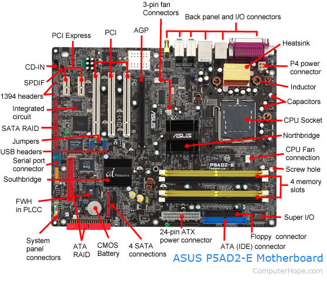
</p>

### Breaking This Down

- **Printed Circuit Board (PCB):** The green (or black) board itself — a rigid platform that holds electronic components and the wiring (traces) that connect them.
- **Slot:** A physical connector on the motherboard designed to accept the card's edge connector and provide it with power, data pathways, and control signals.
- **Functionality:** The specific job the card performs — rendering graphics, connecting to a network, processing audio, storing data, and so on.

### A Simple Analogy

Think of a motherboard like a **smartphone with limited built-in apps**. It can do the basics — calls, texts, a simple camera. An expansion card is like **installing a specialized app** that gives your phone an entirely new ability — except instead of software, it's a physical piece of hardware plugged directly into the system's internal wiring.

### Communication with the Motherboard

An expansion card does not work in isolation. Once installed, it becomes an extension of the computer's internal communication system (the **bus** — explained later). The card:

1. Receives electrical power from the slot or an auxiliary power cable.
2. Exchanges data with the CPU and memory through the motherboard's chipset.
3. Is recognized and configured by the system firmware (BIOS/UEFI) and operating system.
4. Is controlled through software called a **driver** (explained in detail later).

### Plug-and-Play (PnP)

> 🔖 **Definition**
> **Plug-and-Play** is a standard that allows a computer to automatically detect newly installed hardware, allocate the resources it needs (memory addresses, interrupt lines, etc.), and load the correct driver — with little to no manual configuration from the user.

Before Plug-and-Play became standard in the mid-1990s, installing an expansion card often required manually setting physical jumpers or switches on the card to avoid conflicts with other devices. Modern systems handle this automatically, which is a major reason why installing hardware today is far simpler than it was 25 years ago.

---

## ⚙️ Why Expansion Cards Exist

A natural question for a beginner is: *why doesn't the motherboard just include everything built-in?* There are several practical reasons.

| Reason | Explanation |
|---|---|
| **Cost efficiency** | Not every user needs high-end graphics, professional audio, or 10-gigabit networking. Building these into every motherboard would raise costs for everyone. |
| **Upgradability** | Technology evolves quickly. A dedicated GPU can be swapped out for a newer, faster model without replacing the entire motherboard. |
| **Specialization** | Professional tasks (video editing, audio production, AI training) require specialized hardware that a general-purpose motherboard cannot provide. |
| **Failure isolation** | If a dedicated card fails, it can be replaced individually rather than requiring a full motherboard replacement. |
| **Performance** | Dedicated hardware (like a discrete GPU) vastly outperforms integrated equivalents built into the motherboard or CPU. |

### Real-World Examples

- **Better graphics** — A dedicated GPU for gaming, 3D rendering, or AI workloads.
- **Faster networking** — A 10-Gigabit Ethernet NIC for a media server or virtualization host.
- **Additional USB ports** — Adding modern USB-C/Thunderbolt ports to an older system.
- **More storage devices** — A SATA or NVMe expansion controller to connect more drives than the motherboard supports natively.
- **Professional audio** — A dedicated sound card for music production or broadcasting.
- **Video capture** — A capture card for streaming, recording, or digital forensics work.

---

## 📊 Expansion Slots — A Brief History

Expansion slot technology has evolved dramatically over four decades, with each generation solving the bandwidth and efficiency limitations of the one before it.

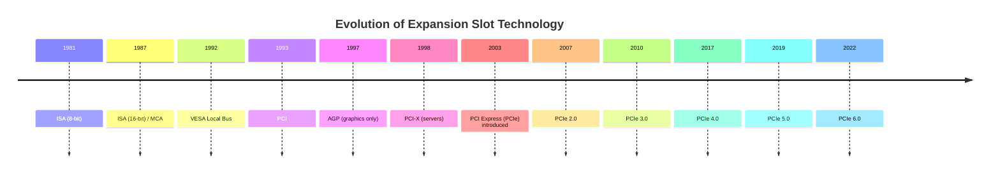

### ISA (Industry Standard Architecture)

> 🔖 **Definition**
> **ISA** was the original expansion bus standard used in IBM-compatible PCs, operating as a **parallel bus** (sending multiple bits of data simultaneously across multiple wires).

<p align="center">
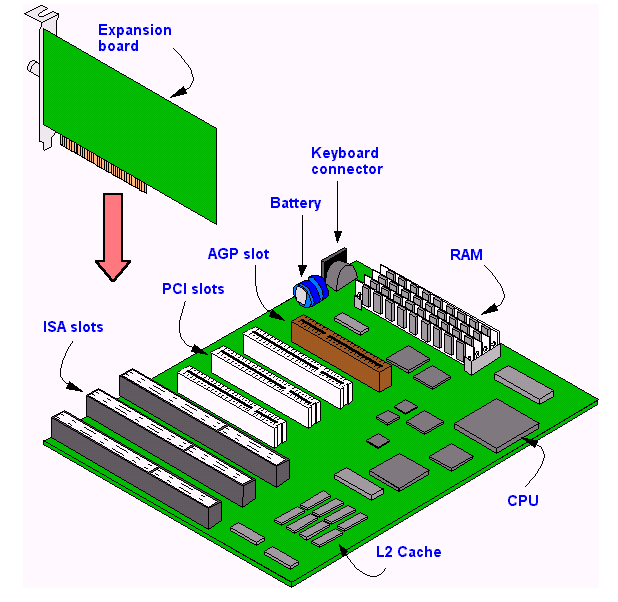
</p>

- Introduced in 1981 (8-bit), extended to 16-bit in 1987.
- Very slow by modern standards (a few megabytes per second).
- Required manual configuration (jumpers/DIP switches) before Plug-and-Play existed.
- Long obsolete, but foundational — nearly every later standard evolved from lessons learned with ISA.

### PCI (Peripheral Component Interconnect)

> 🔖 **Definition**
> **PCI** is a parallel bus standard introduced in 1993 that became the dominant expansion slot for over a decade, supporting Plug-and-Play and much higher bandwidth than ISA.

<p align="center">
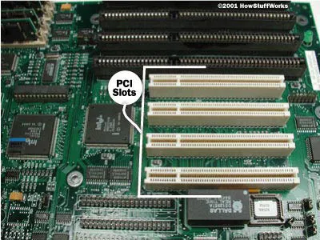
</p>

- Standardized, auto-configuring, and much faster (up to 133 MB/s).
- Used for network cards, sound cards, and modems throughout the 1990s and 2000s.

### PCI-X

- An enhanced, higher-bandwidth version of PCI designed for servers and workstations.
- Backward compatible with standard PCI in many cases, but mostly used in enterprise environments before PCIe took over.

<p align="center">
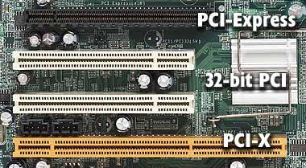
</p>

### AGP (Accelerated Graphics Port)

> 🔖 **Definition**
> **AGP** was a dedicated slot created solely for graphics cards, providing a faster, direct connection to memory than standard PCI could offer at the time.

<p align="center">
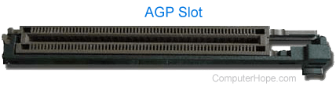
</p>

- Introduced in 1997 specifically because graphics cards needed more bandwidth than PCI could provide.
- Existed only for GPUs — a good early example of specialized expansion hardware.
- Fully replaced by PCI Express by the mid-2000s.

### Why PCI Express Replaced All of These

Older standards (ISA, PCI, PCI-X, AGP) used a **parallel bus** — many wires carrying data at the same time. Parallel buses run into a physical problem at high speeds: signals on different wires start arriving at slightly different times ("timing skew"), which limits how fast you can push the clock speed.

<p align="center">
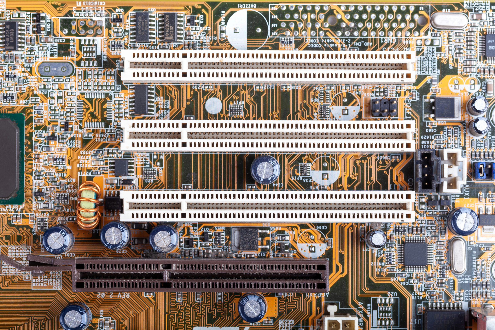
</p>

**PCI Express (PCIe)** solved this by switching to **serial**, **point-to-point** communication — a completely different, far more scalable architecture, explained in detail below.

| Standard | Bus Type | Introduced | Typical Use | Status |
|---|---|---|---|---|
| ISA | Parallel | 1981 | Basic peripherals | Obsolete |
| PCI | Parallel | 1993 | General expansion | Obsolete |
| PCI-X | Parallel | 1998 | Servers | Obsolete |
| AGP | Parallel (dedicated) | 1997 | Graphics only | Obsolete |
| **PCIe** | **Serial, point-to-point** | **2003** | **Everything (GPUs, NICs, storage, etc.)** | **Current standard** |

---

## 🧠 PCI Express (PCIe) Explained

PCI Express is the universal expansion standard used in virtually every modern desktop, laptop, server, and workstation. Understanding it deeply is essential for A+, Security+, and general IT literacy.

<p align="center">
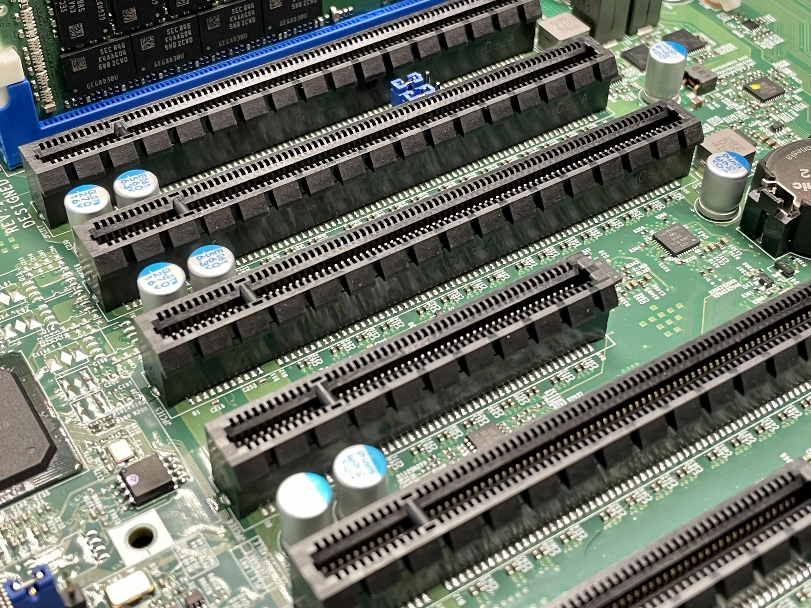
</p>

### Serial Communication and Point-to-Point Links

> 🔖 **Definition**
> **Serial communication** sends data one bit at a time over a single pair of wires, but at extremely high speed — unlike parallel communication, which sends many bits at once but is limited by timing issues at high frequencies.

> 🔖 **Definition**
> **Point-to-point** means each PCIe device has its own **dedicated** direct connection to the chipset/CPU, rather than sharing a single bus with every other device (as older PCI did).

**Analogy:** Old PCI was like a single shared hallway where every device had to take turns speaking, and everyone could hear the "traffic." PCIe is like giving every device its own **private, dedicated highway** directly to the control center — no waiting, no interference.

### Lanes

> 🔖 **Definition**
> A **lane** is a single serial connection consisting of two wire pairs — one for sending data, one for receiving. Multiple lanes can be combined to increase total bandwidth for a single device.

PCIe slots are described by how many lanes they provide, written as "x1," "x4," "x8," or "x16."

```
PCIe x1  : ▮
PCIe x4  : ▮▮▮▮
PCIe x8  : ▮▮▮▮▮▮▮▮
PCIe x16 : ▮▮▮▮▮▮▮▮▮▮▮▮▮▮▮▮
```

| Slot Type | Lanes | Physical Size | Typical Use |
|---|---|---|---|
| **PCIe x1** | 1 | Smallest | Wi-Fi/Bluetooth adapters, capture cards, sound cards, low-bandwidth NICs |
| **PCIe x4** | 4 | Small | NVMe SSD adapters, 10G NICs |
| **PCIe x8** | 8 | Medium | RAID controllers, high-end NICs, some GPUs |
| **PCIe x16** | 16 | Largest | Graphics cards, AI accelerators, high-bandwidth workloads |

<p align="center">
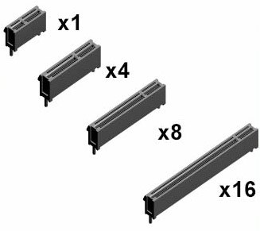
</p>

> 💡 **Note**
> A card physically requiring x16 lanes can often be installed in a *longer, open-ended* x1 or x4 slot if the motherboard supports it — but it will only run at the speed the slot provides. Conversely, a smaller card (like x1) can be installed in a larger x16 slot; it simply won't use all the available lanes.

### PCIe Generations and Bandwidth

Each new PCIe **generation** roughly doubles the bandwidth per lane compared to the previous one, while remaining backward and forward compatible.

| Generation | Released | Bandwidth per Lane (each direction) | x16 Total Bandwidth (approx.) |
|---|---|---|---|
| PCIe 1.0 | 2003 | 250 MB/s | ~4 GB/s |
| PCIe 2.0 | 2007 | 500 MB/s | ~8 GB/s |
| PCIe 3.0 | 2010 | ~985 MB/s | ~16 GB/s |
| PCIe 4.0 | 2017 | ~1,969 MB/s | ~32 GB/s |
| PCIe 5.0 | 2019 | ~3,938 MB/s | ~64 GB/s |
| PCIe 6.0 | 2022 | ~7,563 MB/s | ~128 GB/s |

> 📖 **Note on PCIe 6.0**
> PCIe 6.0 introduces a fundamentally different signaling method called **PAM4** (Pulse Amplitude Modulation with 4 levels), which allows more data to be encoded per clock cycle. It is primarily aimed at data centers, AI clusters, and high-performance computing rather than consumer desktops, at least in its early adoption phase.

### Backward and Forward Compatibility

> 🔖 **Definition**
> **Backward compatibility** means a newer device can work in an older slot, and an older device can work in a newer slot — just at the speed of whichever component (slot or card) supports the *lower* generation.

**Example:** A PCIe 4.0 graphics card installed in a PCIe 3.0 motherboard slot will still work perfectly — it will simply operate at PCIe 3.0 speeds, because the connection runs at the speed of the slowest common denominator.


> ⚠️ **Warning**
> Not every PCIe slot on a motherboard runs at full electrical speed or full lane count, even if it is physically x16-sized. Some slots share lanes with other components (like M.2 storage slots) and may drop to x8 or x4 when multiple devices are in use simultaneously. Always check the motherboard manual.

---

## ⚙️ Anatomy of an Expansion Card

Every expansion card, regardless of its purpose, shares a common physical structure.

```
        ┌───────────────────────────────────────────┐
        │                Cooling / Heatsink         │
        │   ┌───────────────────────────────────┐   │
        │   │       Controller Chip / ASIC      │   │
        │   └───────────────────────────────────┘   │
        │                                           │
        │   ●  ●  ●  ● (Ports facing outward)       │
        │                                           │
        │         Printed Circuit Board (PCB)       │
        │                                           │
        └───────────────┬───────────────────────────┘
                        │  Edge Connector (Gold Fingers)
                        ▼
        ================================================
                    Motherboard PCIe Slot
```

| Component | Purpose |
|---|---|
| **PCB (Printed Circuit Board)** | The rigid board holding all components and internal wiring (traces). |
| **Controller Chip / ASIC** | The "brain" of the card — a specialized processor that performs the card's specific job (e.g., a GPU chip, NIC controller, or RAID chip). |
| **Edge Connector** | The row of gold-plated contacts ("gold fingers") that slots into the motherboard's PCIe connector, carrying both power and data. |
| **Power Connectors** | Additional power inputs (commonly 6-pin or 8-pin connectors on GPUs) for cards that draw more power than the slot alone can supply. |
| **Cooling** | Heatsinks, fans, or vapor chambers that dissipate heat generated by the controller chip. |
| **Ports** | External connectors (HDMI, Ethernet, USB, audio jacks) that the card exposes for external devices. |
| **Bracket** | The metal plate that screws into the computer case, securing the card and aligning its ports with the case's rear opening. |

> 🖼️ *Suggested image: A labeled diagram of a graphics card showing the PCB, GPU chip, heatsink/fan assembly, power connector, display ports, and bracket.*

---

## 📊 Common Types of Expansion Cards

### 🎮 Graphics Card (GPU)

> 🔖 **Definition**
> A **Graphics Processing Unit (GPU)** card is a dedicated processor optimized for rendering images, video, and increasingly, parallel mathematical computation.

<p align="center">
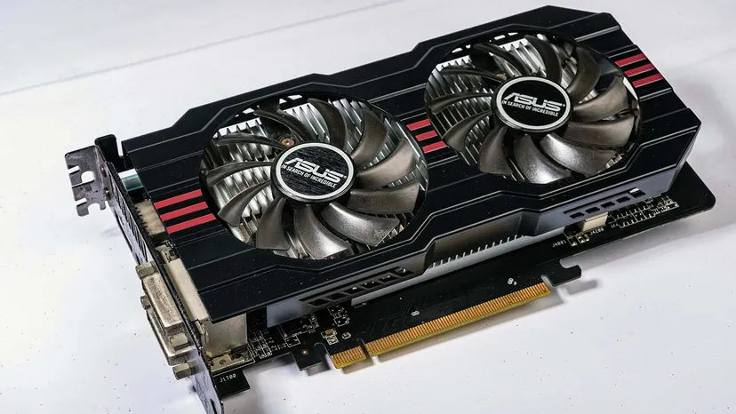
</p>

- **Purpose:** Render 2D/3D graphics, decode/encode video, and accelerate parallel workloads.
- **Common uses:** Gaming, video editing, 3D modeling, cryptography/hash computation, machine learning training, password auditing (with proper authorization).
- **Typical slot:** PCIe x16.

### 🌐 Network Interface Card (NIC)

> 🔖 **Definition**
> A **NIC** allows a computer to connect to a network, translating data between the computer's internal format and the electrical/optical signals used on network cabling.

<p align="center">
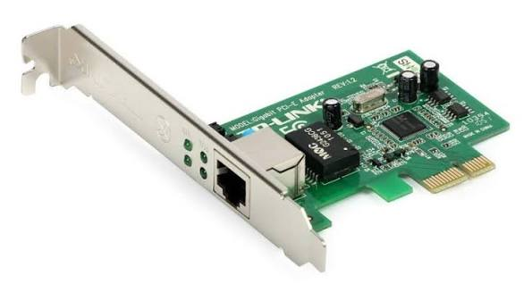
</p>

| NIC Type | Description | Typical Use |
|---|---|---|
| **Ethernet NIC** | Standard copper (RJ45) network connection | General networking, servers, workstations |
| **Fiber NIC** | Uses fiber-optic cabling (SFP/SFP+ modules) | Long-distance or high-bandwidth enterprise links |
| **10G+ NIC** | Supports 10 Gigabit or higher speeds | Data centers, virtualization hosts, storage networks |

### 📶 Wireless Network Adapter

- **Wi-Fi adapters** provide wireless internet connectivity, often supporting standards like Wi-Fi 6/6E/7.
- **Bluetooth adapters** (often combined on the same card as Wi-Fi) enable short-range wireless communication with peripherals.
- Commonly installed in desktops that lack built-in wireless capability.

### 🎧 Sound Card

- **Purpose:** Process and output audio with higher quality or lower latency than motherboard-integrated audio.
- **Professional audio:** Studio-grade sound cards provide multiple inputs/outputs, low-latency monitoring, and high-resolution audio conversion for music production.
- **Gaming:** Enhanced positional audio and reduced latency for competitive gaming.

### 🗄️ RAID Controller

> 🔖 **Definition**
> **RAID (Redundant Array of Independent Disks)** combines multiple physical drives into one logical unit for improved performance, redundancy, or both. A **RAID controller** is a dedicated card that manages this process in hardware rather than relying on the operating system.

<p align="center">
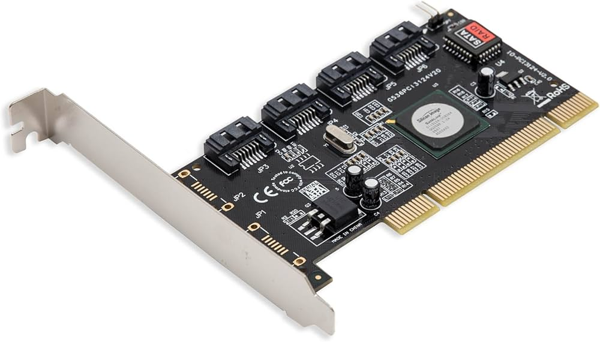
</p>

- **Hardware RAID:** Processing happens on the card itself, reducing CPU load and often providing a battery-backed cache for data safety during power loss.
- **Enterprise storage:** Common in servers where uptime and data redundancy are critical.

### 🔌 USB Expansion Card

- Adds additional USB ports to a system, useful for older motherboards or systems needing extra ports.
<p align="center">
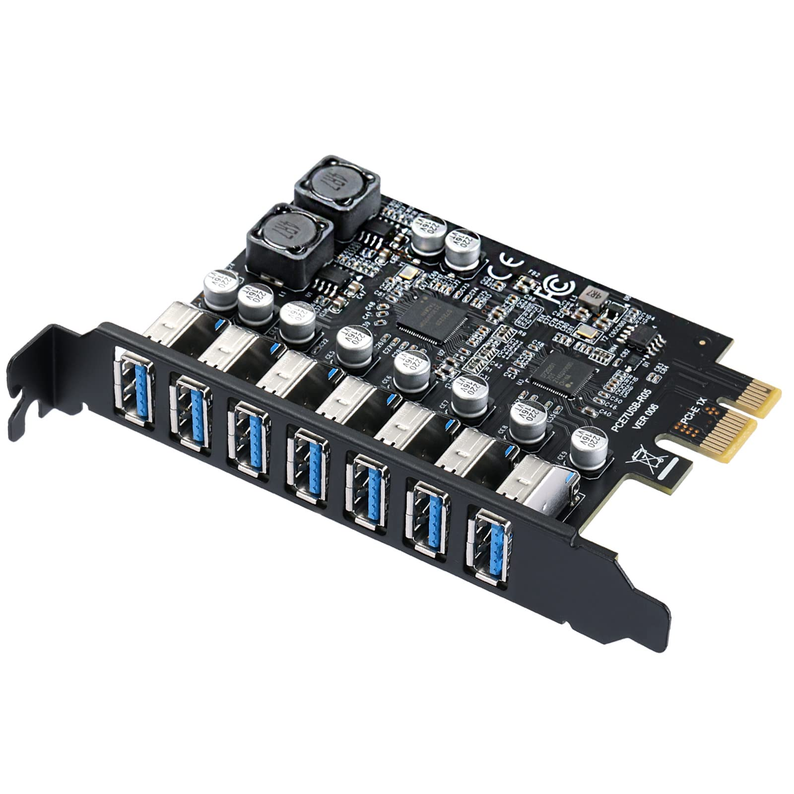
</p>

- **USB-C:** Provides the modern, reversible connector standard supporting higher data and power delivery.
- **Thunderbolt:** A high-bandwidth standard (often using the USB-C connector) that can carry data, video, and power simultaneously, and even connect external GPUs.

### 🎥 Video Capture Card

<p align="center">
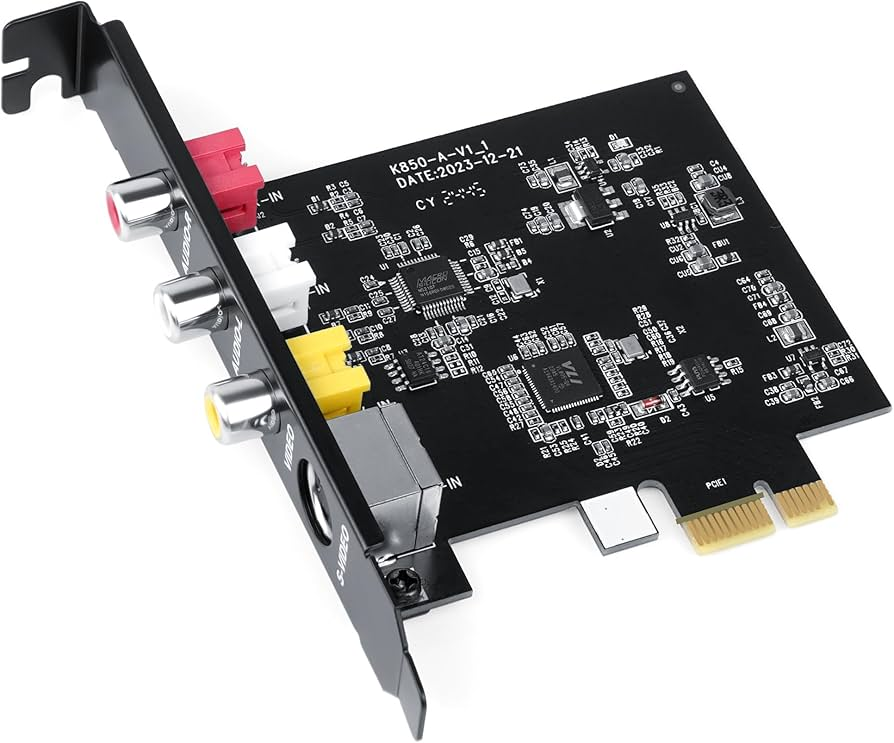
</p>

- **Streaming:** Captures video/audio output from a separate device (like a game console) for live broadcasting.
- **Recording:** Saves high-quality video footage for later editing.
- **Forensics:** Used in digital forensics to capture and analyze video evidence from external sources without altering original data — always under proper legal authorization.

### 💾 Storage Controller Cards

| Type | Description |
|---|---|
| **SATA controller** | Adds additional Serial ATA ports for connecting hard drives/SSDs. |
| **SAS controller** | Serial Attached SCSI — used in enterprise storage for higher speed and reliability. |
| **NVMe controller** | Adds slots or ports for NVMe SSDs, which communicate directly over PCIe for extremely high speed. |

### 🧬 Specialized Expansion Cards

- **Hardware Security Modules (HSMs):** Dedicated cards that securely generate, store, and manage cryptographic keys, often used for encryption, digital signatures, and secure certificate authorities.
- **AI Accelerators:** Cards built specifically to speed up machine learning training/inference workloads.
- **FPGA Cards (Field-Programmable Gate Arrays):** Reconfigurable hardware that can be "programmed" at the circuit level for specialized, high-speed tasks — used in networking, finance, and security appliances.
- **TPUs (Tensor Processing Units):** Google-designed accelerator chips specialized for deep learning workloads, mentioned here for awareness at a conceptual level.

---

## ⚙️ How Expansion Cards Communicate

Understanding the full communication chain helps make sense of concepts you'll see repeatedly across A+, Security+, and CCNA material.

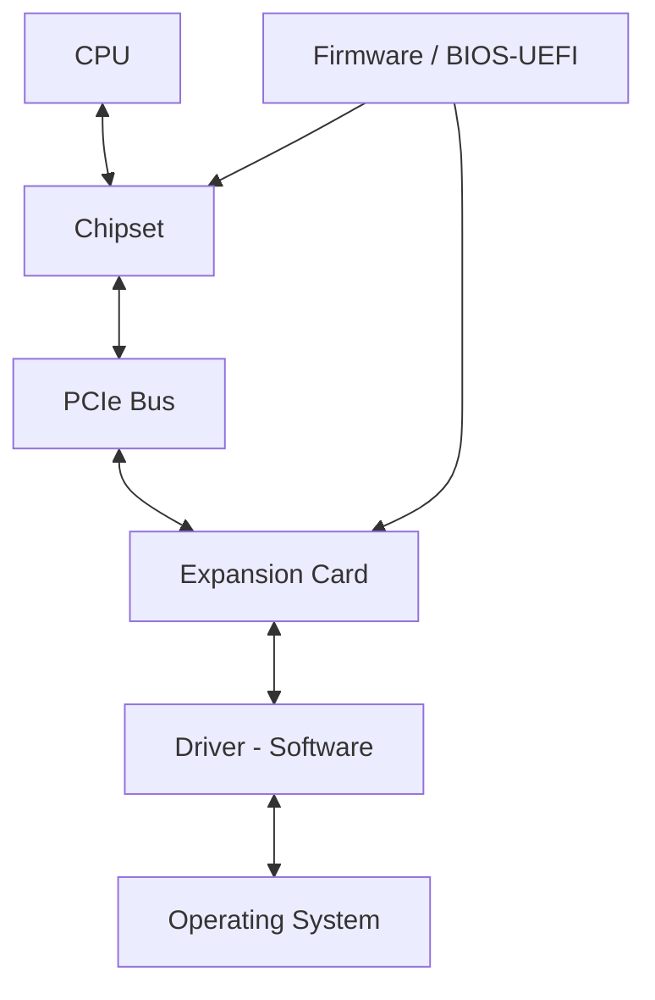

| Layer | Role |
|---|---|
| **CPU** | Executes instructions and requests data from/sends data to devices. |
| **Chipset** | Manages communication pathways between the CPU, memory, and expansion slots. |
| **PCIe Bus** | The physical/electrical pathway carrying data between the chipset and the card. |
| **Firmware (BIOS/UEFI)** | Detects the card at boot time, allocates system resources, and initializes basic communication before the OS loads. |
| **Driver** | Software that translates OS-level requests into commands the card's hardware understands. |
| **Operating System** | Provides applications and users with access to the card's functionality through the driver. |

---

## 🔄 Installing an Expansion Card

Follow this sequence for a safe, successful installation:

1. **Power off completely** — shut down the computer and unplug it from the wall outlet (not just sleep mode).
2. **Apply ESD precautions** — wear an anti-static wrist strap or regularly touch a grounded metal surface to discharge static electricity before touching any components.
3. **Open the case** and locate an appropriate expansion slot matching the card's physical size and required bandwidth.
4. **Remove the corresponding bracket** on the back of the case to expose an opening for the card's ports.
5. **Align the card's edge connector** with the slot and press down firmly and evenly until it clicks/seats fully.
6. **Secure the card** to the case using the bracket screw.
7. **Connect auxiliary power cables** if required (common for high-end GPUs).
8. **Close the case**, reconnect power, and boot the system.
9. **Install drivers** — either automatically via Windows Update/OS package manager, or manually from the manufacturer's website.
10. **Test the card** — confirm it is detected in Device Manager (Windows) or `lspci` (Linux), and verify it functions as expected.

> ⚠️ **Warning**
> Never install or remove an expansion card while the system is powered on. This can cause electrical damage to the card, the motherboard, or both.

---

## 🧠 Expansion Card Drivers

> 🔖 **Definition**
> A **driver** is a piece of software that allows the operating system to communicate with a specific piece of hardware by translating generic OS commands into instructions the hardware understands.

### Why Drivers Are Necessary

Hardware manufacturers design their controller chips differently from one another. Without a driver, the operating system would have no standardized way to understand how to "speak" to a specific card's chip. The driver acts as a **translator** between generic OS requests ("send this data over the network") and the exact hardware-level commands a specific chip requires.

### Automatic vs. Manual Installation

| Method | Description |
|---|---|
| **Automatic** | The OS detects the card (via Plug-and-Play) and downloads/installs a compatible generic or manufacturer driver automatically. |
| **Manual** | The user downloads a driver package directly from the manufacturer's website and installs it — often necessary for full feature support (e.g., GPU control panels) or the very latest hardware. |

### Updating Drivers

Keeping drivers updated is important for:

- **Security** — Outdated drivers can contain unpatched vulnerabilities.
- **Stability** — Manufacturers frequently release bug fixes.
- **Performance** — Especially relevant for GPUs, where driver updates often improve performance in specific applications and games.

> 💡 **Note**
> Only download drivers from official manufacturer websites. Third-party "driver updater" tools can bundle malware or install incorrect, unstable drivers.

---

## ⚠️ Troubleshooting

| Problem | Likely Cause(s) | Suggested Fix |
|---|---|---|
| **Card not detected** | Not seated fully, incompatible slot, disabled in BIOS | Reseat the card, check BIOS settings, verify slot type |
| **Driver conflicts** | Outdated or corrupted driver, conflicting old driver from a previous card | Uninstall old drivers completely, install the latest official driver |
| **No display output** | GPU not receiving power, monitor cable connected to the wrong port, integrated graphics still active | Check auxiliary power, connect monitor directly to GPU port, disable integrated graphics in BIOS if needed |
| **Poor performance** | Running in a lower-bandwidth slot, insufficient power supply, thermal throttling | Confirm slot generation/lane count, check PSU wattage, improve case airflow |
| **Missing power connector** | Auxiliary power cable not connected | Connect the required 6-pin/8-pin power cable from the PSU |
| **Loose installation** | Card not fully seated or bracket screw missing | Reseat firmly and secure with the bracket screw |
| **Device Manager errors** (e.g., Code 43, Code 10) | Driver failure, hardware fault, resource conflict | Reinstall drivers, test in a different slot, check for hardware damage |
| **BIOS not recognizing card** | Legacy/UEFI boot mode mismatch, slot disabled in firmware | Check BIOS/UEFI settings for slot configuration and boot mode |

---

## 🛡️ Expansion Cards in Cybersecurity

Expansion cards play a direct and meaningful role in security operations, not just general computing.

- **Dedicated NICs** — Security appliances (firewalls, IDS/IPS systems) often use multiple dedicated network cards to physically separate trusted and untrusted network segments.
- **Wireless adapters** — Certain Wi-Fi adapters support "monitor mode" and packet injection, which are used in authorized wireless security assessments and penetration testing.
- **GPU acceleration** — Used in password auditing and cryptographic research (e.g., testing password hash strength) — **only** on systems and accounts you are explicitly authorized to test.
- **Packet capture cards** — Specialized NICs designed for high-speed, lossless packet capture, used by network security monitoring tools like Zeek or Suricata.
- **Monitoring** — Dedicated hardware sensors and TAP (Test Access Point) cards allow passive network traffic monitoring without disrupting live traffic.
- **Enterprise servers** — RAID and storage controller cards protect against data loss, which is a core pillar of the CIA triad (Confidentiality, **Integrity**, **Availability**).
- **Virtualization** — Specialized NICs and storage controllers with hardware-level virtualization support (e.g., SR-IOV) allow secure, isolated virtual machines to share physical hardware safely.
- **AI hardware** — Increasingly used in security operations for anomaly detection, malware classification, and behavioral analytics at scale.

> ⚠️ **Warning**
> Tools and hardware capable of packet capture, wireless injection, or password auditing must only be used on networks and systems you own or have **explicit written authorization** to test. Unauthorized use of these techniques is illegal in most jurisdictions and violates professional ethics standards (such as those required for Security+ certification).

---

## 📊 Expansion Cards in Data Centers

Data centers rely heavily on specialized expansion hardware to deliver performance, reliability, and scale.

- **Enterprise networking** — High-speed NICs (10G, 25G, 100G+) connect servers to top-of-rack switches and core networks.
- **Storage controllers** — SAS/NVMe RAID controllers manage large arrays of drives for databases and virtualization hosts.
- **Fiber adapters** — Enable long-distance, high-bandwidth connections between data center racks, floors, or facilities.
- **AI accelerators** — Deployed at scale for machine learning training clusters.
- **Redundancy** — Many data center servers use dual expansion cards (e.g., two NICs, two RAID controllers) so that a single hardware failure doesn't cause downtime — directly supporting the **Availability** principle of the CIA triad.

---

## ⚠️ Common Beginner Mistakes

- ⚠️ Installing a card in the wrong slot type or size without checking bandwidth requirements.
- ⚠️ Forgetting to connect required PCIe auxiliary power cables (common with GPUs).
- ⚠️ Assuming every PCIe x16 slot provides identical full-bandwidth performance — some run at reduced lane counts.
- ⚠️ Installing incorrect or outdated drivers, or leaving old drivers installed when swapping cards.
- ⚠️ Touching card components without ESD (electrostatic discharge) precautions, risking silent hardware damage.
- ⚠️ Forgetting to secure the card's bracket, leading to loose connections over time.
- ⚠️ Ignoring BIOS/UEFI settings that may disable a slot or integrated graphics conflict.

---

## 💡 Tips & Best Practices

- ✅ Always consult your motherboard manual to understand which slots share lanes with other components (like M.2 storage).
- ✅ Match the card's power requirements to your power supply unit (PSU) wattage and available connectors before purchasing.
- ✅ Use manufacturer-provided driver packages rather than relying solely on generic OS drivers when full feature support is needed.
- ✅ Keep firmware (BIOS/UEFI) and drivers updated, especially for security-relevant components like NICs and HSMs.
- ✅ Label and document installed expansion cards in enterprise environments for easier future troubleshooting and asset management.
- ✅ In a security context, always confirm proper authorization before using packet capture or wireless injection hardware.
- ✅ When troubleshooting, isolate variables — test one card at a time, and try a different slot before assuming hardware failure.

---

---

## 💻 Practical Exercises

1. **Identify PCIe slots** on your own motherboard (or a photo of one) and label them by size (x1, x4, x8, x16).
2. **Identify installed expansion cards** on a Windows PC using Device Manager, or on Linux using:
   ```bash
   lspci -v
   ```
3. **Check PCIe generation and lane usage** using a tool like GPU-Z (Windows) or:
   ```bash
   sudo lspci -vv | grep -i "LnkSta"
   ```
4. **Install a Wi-Fi adapter** (physically or in a virtual lab/simulation) and walk through the driver installation process.
5. **Install a GPU** in a test system (or research the process using a manufacturer's official installation guide) and document each step.
6. **Update expansion card drivers** on your own system and record the before/after driver version numbers.

---

## ❓ Interview Questions

- What is an expansion card, and why do motherboards include expansion slots?
- What is PCI Express, and how does it differ from the original PCI standard?
- What is the difference between PCI and PCIe in terms of bus architecture?
- What do PCIe lane counts (x1, x4, x8, x16) actually mean?
- Why are device drivers required for expansion cards to function?
- What is a RAID controller, and what problem does it solve?
- What is a NIC, and what are the different types available?
- Why are graphics cards typically installed in PCIe x16 slots specifically?

---

## 📚 Quick Revision

| Concept | Key Point |
|---|---|
| Expansion card | An add-in circuit board that extends a computer's capabilities |
| PCI vs PCIe | PCI = parallel, shared bus; PCIe = serial, point-to-point |
| Lane | A single serial data pathway; more lanes = more bandwidth |
| Generation | Each PCIe generation roughly doubles bandwidth per lane |
| Backward compatibility | Devices work across generations at the lower common speed |
| Driver | Software translator between the OS and the card's hardware |
| ESD | Static electricity precaution required before handling cards |
| Cybersecurity link | NICs, HSMs, capture cards, and GPUs all play direct security roles |

---

## 📚 Key Takeaways

- Expansion cards allow computers to gain new or improved capabilities without full hardware replacement.
- PCI Express replaced older parallel-bus standards (ISA, PCI, PCI-X, AGP) using faster, more scalable serial point-to-point links.
- PCIe bandwidth scales with both **lane count** (x1–x16) and **generation** (1.0 through 6.0).
- Every expansion card shares common physical components: PCB, controller chip, edge connector, ports, and bracket.
- Drivers are essential software that allow the operating system to communicate correctly with hardware.
- Proper installation practice (power-off, ESD precautions, correct slot selection) prevents most hardware damage and troubleshooting headaches.
- Expansion cards — especially NICs, HSMs, capture cards, and GPUs — have direct, practical relevance to cybersecurity roles including network monitoring, cryptography, and authorized penetration testing.

---

## 🔍 Further Reading

- [PCI-SIG Official Specifications](https://pcisig.com/specifications) — the governing body for PCI/PCIe standards.
- [Intel: PCI Express Technology Overview](https://www.intel.com)
- [AMD: Graphics and Platform Technology Documentation](https://www.amd.com)
- [NVIDIA: GPU Architecture and Driver Documentation](https://www.nvidia.com)
- [Microsoft Learn: Hardware Fundamentals](https://learn.microsoft.com)

---

## ➡️ Next Chapter

Now that you understand how expansion cards extend a computer's internal capabilities, the next logical step is to explore how a computer connects to the *outside world* — displays, peripherals, storage, and networks.

The next chapter explores the physical interfaces used to connect peripherals, displays, storage devices, and networks, including USB, HDMI, DisplayPort, Ethernet, Thunderbolt, and audio connectors.

➡️ **Continue to:** **[Ports & Connectors](../11-Ports-Connectors/)**

---
---

