# 🔌 Computer Port Connectors

> **Chapter Focus:** Physical connectivity, data transmission, and the cybersecurity implications of computer ports and connectors.

---

## 📖 Overview

Every computer, no matter how powerful, is only useful if it can talk to the outside world — to a monitor, a keyboard, a network, or a storage drive. That communication happens through **ports** and **connectors**.

This chapter builds a first-principles understanding of what ports are, how they work, and why they matter — not just for general IT literacy, but specifically for cybersecurity professionals who need to understand physical attack surfaces, forensic artifacts, and hardware-based threats.

**Key distinctions to get right early:**

| Term | Definition |
|------|-----------|
| **Port** | The physical socket/opening on a device where a cable or peripheral connects |
| **Connector** | The physical plug at the end of a cable that fits into a port |
| **Interface** | The overall specification governing how two devices exchange data (mechanical + electrical + logical rules) |
| **Protocol** | The set of rules that define *how data is formatted and communicated* over an interface |

> 💡 **Definition**
> A **port** is the *doorway*. A **connector** is the *key*. The **interface** is the *language spoken through the door*. The **protocol** is the *grammar rules of that language*.

**Why this matters:** Confusing these terms is one of the most common beginner mistakes in IT and cybersecurity — for example, "USB" is often used loosely to describe a port, a connector shape, a cable, and a protocol, when it is technically all four bundled under one name.

---

## 🎯 Learning Objectives

By the end of this chapter, you will be able to:

- ✅ Explain what a port connector is and how it enables communication between devices
- ✅ Describe the electrical and logical process that occurs when a device connects to a port
- ✅ Identify and differentiate major port types (USB, HDMI, DisplayPort, VGA, DVI, Ethernet, Audio, PS/2, Serial, Parallel, Thunderbolt, SATA, M.2)
- ✅ Compare ports based on speed, purpose, and use case
- ✅ Understand the evolution of ports from legacy to modern standards
- ✅ Recognize the cybersecurity relevance of physical ports, including hardware-based attacks
- ✅ Apply best practices for safe and effective use of port connectors in real-world and professional environments

---

## 🧠 What Are Port Connectors?

At the most basic level, a **port connector** is a physical interface that allows two electronic devices to exchange **data**, **power**, or both.

Think of your computer as a small city. Roads (ports) connect the city to the outside world, allowing goods (data) and resources (power) to move in and out. Without roads, the city would be isolated — no matter how advanced its internal infrastructure.

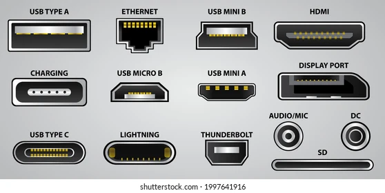

Ports generally serve one or more of these purposes:

- 🔄 **Data Transfer** — moving digital information between devices (files, keystrokes, video signals)
- ⚡ **Power Delivery** — supplying electrical current to charge or run a device
- 🖱️ **Peripheral Connectivity** — connecting input/output devices like keyboards, mice, and monitors
- 🌐 **Network Communication** — connecting a device to a local or wide-area network

> 📝 **Beginner-Friendly Analogy**
> A USB port is like an electrical outlet that can also have a conversation. It doesn't just push power through the wire — it negotiates *what kind* of device is plugged in and *how* they should talk to each other.

---

## ⚙️ How Port Connectors Work

Understanding what happens "under the hood" when you plug something in helps build the foundation for later cybersecurity topics like hardware attacks and forensics.

### Simplified Workflow

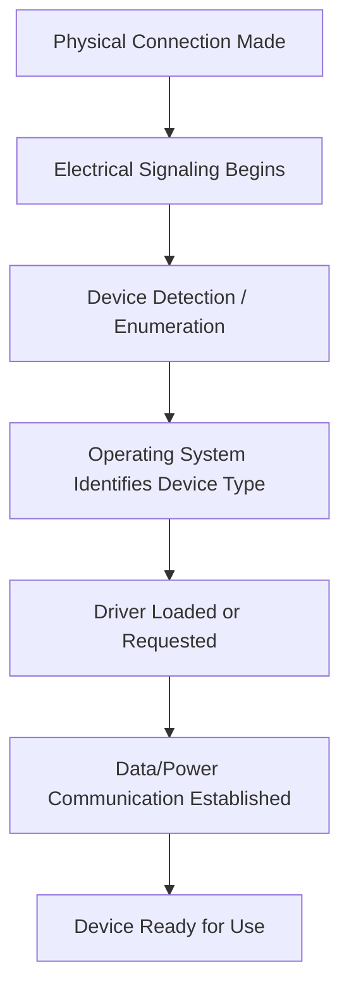

**Step-by-step breakdown:**

1. **Physical Connection** — The connector's metal pins or contacts physically touch the corresponding pins in the port, completing an electrical circuit.
2. **Electrical Signaling** — Voltage changes are sent across the pins, alerting the system that *something* has been connected.
3. **Device Detection** — The system reads identifying information (such as a Vendor ID and Product ID for USB devices) to determine what type of device is attached.
4. **OS Interaction** — The operating system checks whether it has a compatible driver already installed, or prompts for one.
5. **Driver Communication** — The driver translates data between the device's native format and the format the OS and applications understand.
6. **Data/Power Exchange** — Once initialized, actual data transfer or power delivery begins according to the interface's defined protocol.

> ⚠️ **Cybersecurity Note**
> This automatic detection process is precisely what hardware-based attacks like **BadUSB** exploit — the system trusts the device's self-reported identity without verifying its true intent.

---

## 🖥️ Types of Computer Ports

### 🔵 USB (Universal Serial Bus)

USB is the most common connector standard in modern computing, designed to unify data transfer, peripheral connectivity, and power delivery into a single family of standards.

| Connector Type | Description | Common Use |
|---|---|---|
| **USB-A** | Rectangular, flat connector | Keyboards, mice, flash drives |
| **USB-B** | Square-shaped, larger | Printers, scanners |
| **Mini USB** | Smaller, trapezoidal shape | Older cameras, MP3 players |
| **Micro USB** | Thin, flat connector | Older Android phones, peripherals |
| **USB-C** | Oval, reversible connector | Modern laptops, phones, monitors |

**USB Versions & Data Rates:**

| Version | Max Speed | Notes |
|---|---|---|
| USB 1.1 | 12 Mbps | Legacy, largely obsolete |
| USB 2.0 | 480 Mbps | Still common for low-speed peripherals |
| USB 3.0 / 3.1 Gen 1 | 5 Gbps | Marked by blue connectors |
| USB 3.1 Gen 2 | 10 Gbps | |
| USB 3.2 | Up to 20 Gbps | Multi-lane data over USB-C |
| USB4 | Up to 40 Gbps | Converges with Thunderbolt 3/4 |

**Power Delivery (USB-PD):** USB-C supports **USB Power Delivery**, enabling up to 240W in the latest specification — enough to charge laptops, monitors, and even some small appliances.

> 💡 **Important Note**
> Not all USB-C ports are equal. A USB-C *connector shape* does not guarantee USB4 speeds, Power Delivery, or DisplayPort Alt Mode support — always check the device specification.

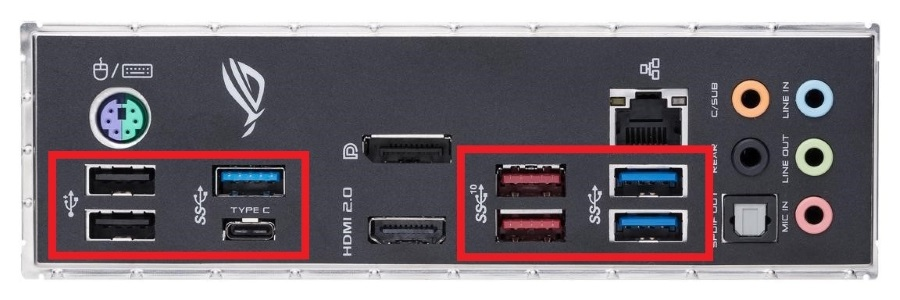

---

### 🎥 HDMI (High-Definition Multimedia Interface)

**Purpose:** Transmits uncompressed digital video and audio between a source (like a PC or game console) and a display.

| Version | Max Resolution | Notes |
|---|---|---|
| HDMI 1.4 | 1080p / 4K@30Hz | Introduced ARC (Audio Return Channel) |
| HDMI 2.0 | 4K@60Hz | Wider color support |
| HDMI 2.1 | 8K@60Hz, 4K@120Hz | Variable Refresh Rate, eARC |

HDMI carries multi-channel audio alongside video, making it the default choice for TVs, projectors, monitors, and gaming consoles.

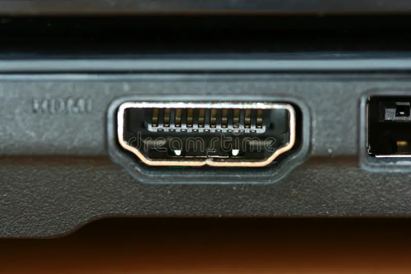

---

### 🖥️ DisplayPort

DisplayPort is a royalty-free digital display standard commonly found on PCs and gaming monitors.

**Comparison with HDMI:**

| Feature | DisplayPort | HDMI |
|---|---|---|
| Primary Use | PC monitors | TVs & general AV |
| Daisy Chaining | ✅ Supported (via MST) | ❌ Not supported |
| Refresh Rate (Gaming) | Generally higher ceiling | Competitive in 2.1 |
| Royalty | Royalty-free | Licensing fees apply |

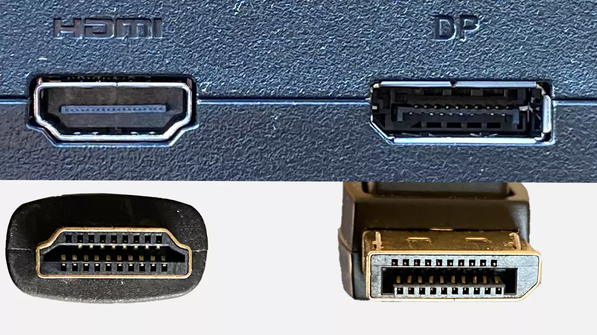

**Daisy Chaining:** DisplayPort's **Multi-Stream Transport (MST)** allows multiple monitors to be connected in a series from a single port — useful for multi-monitor workstations without needing a port per display.

---

### 🖼️ VGA (Video Graphics Array)

VGA is a **legacy analog video standard** dating back to 1987.

- **Analog signal:** Converts digital image data into analog voltage signals, which can degrade over long cable runs.
- **History:** Once the universal standard for CRT monitors and early flat panels.
- **Advantages:** Extremely widespread legacy compatibility, simple and durable connector.
- **Limitations:** No audio support, lower maximum resolution, susceptible to signal degradation and interference.

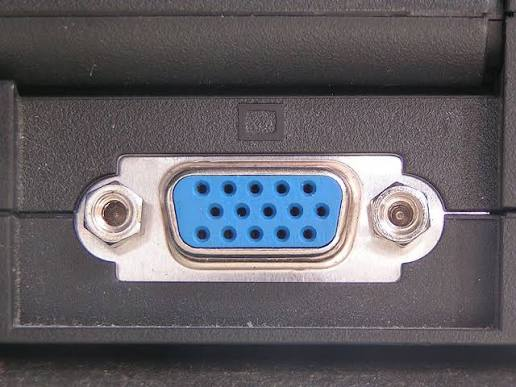

> 📝 You may still encounter VGA on older projectors, industrial equipment, or legacy point-of-sale systems — relevant in physical penetration testing of older facilities.

---

### 🖧 DVI (Digital Visual Interface)

DVI bridged the gap between analog (VGA) and fully digital video standards.

| Type | Signal | Notes |
|---|---|---|
| **DVI-A** | Analog only | Backward compatible with VGA |
| **DVI-D** | Digital only | Pure digital signal |
| **DVI-I** | Integrated (both) | Supports analog and digital |

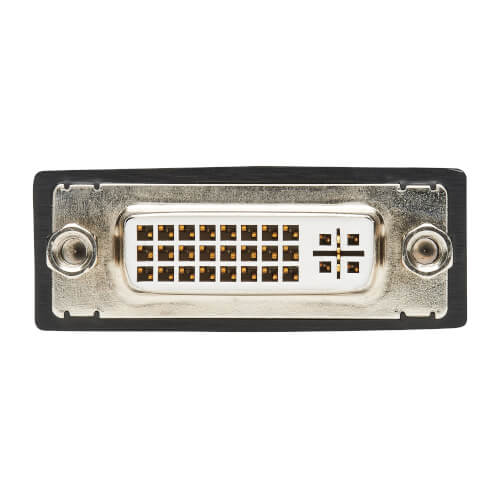

**Single Link vs Dual Link:** Dual Link DVI uses additional pins to double the bandwidth, supporting higher resolutions and refresh rates than Single Link.

---

### 🌐 Ethernet (RJ-45)

Ethernet ports use the **RJ-45 connector** and remain the backbone of wired local area networking (LAN).

- **Network Communication:** Carries data packets over twisted-pair copper cabling using the Ethernet protocol (IEEE 802.3).
- **Cable Categories:**

| Category | Max Speed | Max Distance |
|---|---|---|
| Cat5e | 1 Gbps | 100m |
| Cat6 | 1–10 Gbps | 55–100m |
| Cat6a | 10 Gbps | 100m |
| Cat7/8 | 10–40 Gbps | Shorter runs |

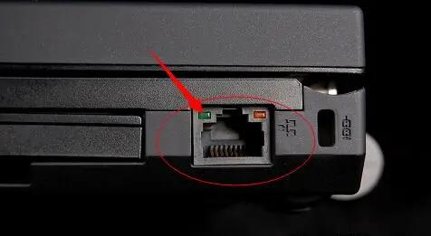

> 🛡️ **Cybersecurity Relevance**
> Ethernet ports are a common target for **physical network attacks**, such as plugging in rogue devices, network taps, or packet sniffers directly into wall jacks or switches during a red-team engagement.

---

### 🔊 Audio Ports

| Port | Function |
|---|---|
| Headphone (Line Out) | Sends audio to speakers/headphones |
| Microphone (Mic In) | Receives audio input |
| Line In | Receives audio from external sources |
| Surround Sound (5.1/7.1) | Multiple color-coded jacks for multi-speaker setups |

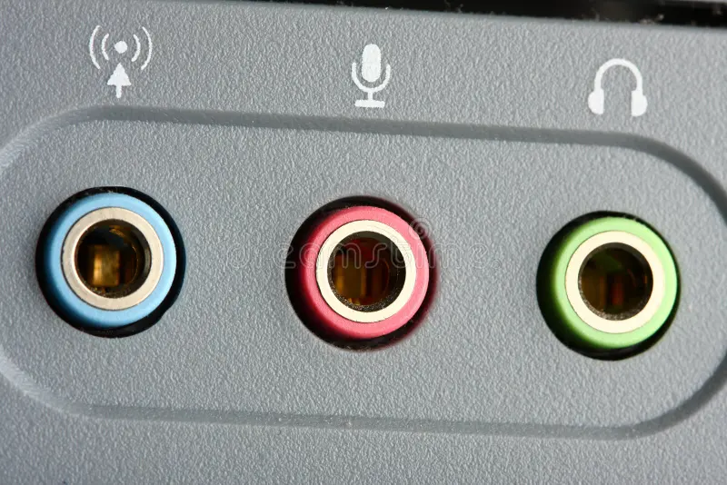

Audio ports are typically 3.5mm TRS/TRRS jacks, color-coded per an industry standard (green = output, pink = mic, blue = line-in).

---

### ⌨️ PS/2

- **Purpose:** Dedicated round connectors for keyboards (purple) and mice (green).
- **History:** Introduced by IBM in 1987; dominant through the 1990s and early 2000s.
- **Modern Alternatives:** Almost entirely replaced by USB, though PS/2 persists in some gaming and industrial setups due to lower input latency and n-key rollover support.

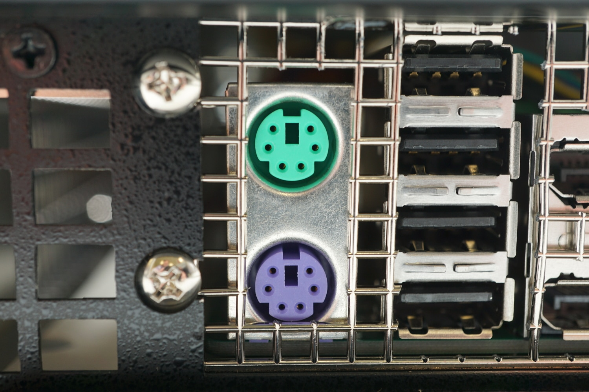

---

### 🔌 Serial Port (RS-232 / COM Port)

- **COM Port:** The logical name Windows assigns to serial communication ports.
- **RS-232:** The electrical standard defining voltage levels and signal timing for serial communication.
- **Legacy Devices:** Still used in industrial control systems, networking equipment (console access), and some medical devices.

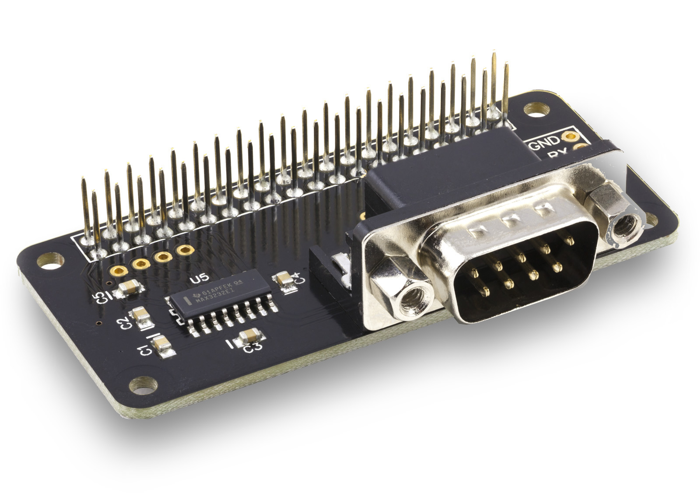

> 🛡️ **Cybersecurity Relevance**
> Serial console ports are frequently used to access **routers, switches, and industrial control systems (ICS/SCADA)** directly — a critical skill in network administration and OT security assessments.

---

### 🖨️ Parallel Port

- **Printers:** Historically the standard connection for dot-matrix and early laser printers.
- **Legacy Hardware:** Also used for some external drives and scanners.
- **Limitations:** Bulky connector, short maximum cable length, far slower than USB, largely obsolete today.

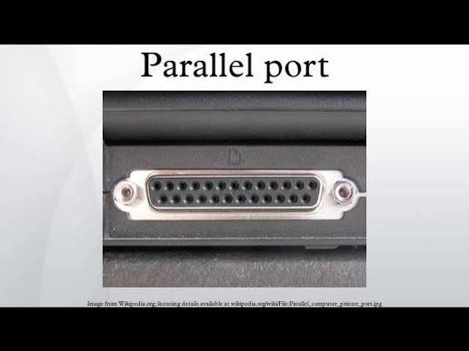

---

### ⚡ Thunderbolt

- **Speed:** Thunderbolt 3/4 supports up to 40 Gbps.
- **USB-C Compatibility:** Thunderbolt 3 and later use the USB-C connector shape, though not every USB-C port supports Thunderbolt.
- **Daisy Chaining:** Supports connecting multiple devices in series (up to 6 devices per port).
- **External GPUs:** High bandwidth allows external graphics card enclosures (eGPUs) for laptops.
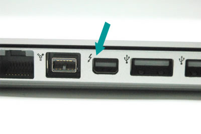

---

### 💾 SATA (Serial ATA)

- **Internal Storage:** The traditional interface connecting HDDs and SSDs to a motherboard.
- **Versions:**

| Version | Max Speed |
|---|---|
| SATA I | 1.5 Gbps |
| SATA II | 3 Gbps |
| SATA III | 6 Gbps |

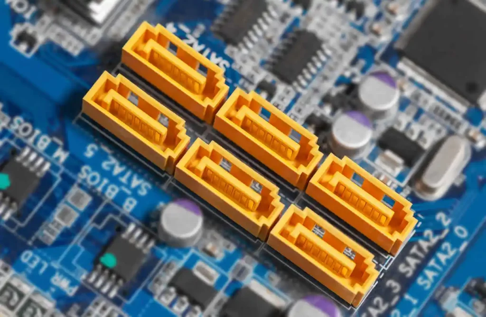

SATA remains common for HDDs and budget SSDs, though it is increasingly replaced by M.2/NVMe for performance-focused storage.

---

### 🧩 M.2

- **SSD Interface:** A compact, gumstick-sized form factor for internal storage.
- **NVMe:** M.2 drives using the NVMe protocol communicate directly over PCIe lanes, offering dramatically higher speeds than SATA.
- **SATA M.2:** Some M.2 drives use the older SATA protocol instead of NVMe — same physical slot, very different performance.
- **Key Types:** M.2 connectors use "keys" (B key, M key, or B+M key) to indicate which protocols/slots they are compatible with.

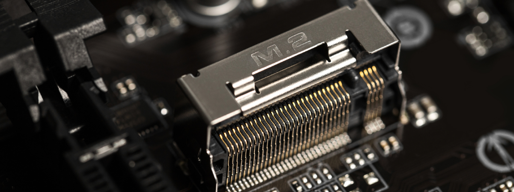

> ⚠️ **Common Confusion**
> Not all M.2 slots and drives are interchangeable — an NVMe drive will not work in a SATA-only M.2 slot, and vice versa. Always check motherboard documentation.

---

## 📊 Port Comparison Table

| Port | Purpose | Max Speed | Video | Audio | Power | Common Devices |
|---|---|---|---|---|---|---|
| USB-A/C | Data, peripherals, power | Up to 40 Gbps (USB4) | ✅ (Alt Mode) | ✅ | ✅ (up to 240W) | Flash drives, phones, laptops |
| HDMI | Audio/video output | 48 Gbps (2.1) | ✅ | ✅ | ❌ | TVs, monitors, consoles |
| DisplayPort | Audio/video output | 80 Gbps (2.1) | ✅ | ✅ | ❌ | Gaming monitors, PCs |
| VGA | Analog video output | ~2 Gbps (analog) | ✅ | ❌ | ❌ | Legacy monitors, projectors |
| DVI | Digital/analog video | ~10 Gbps (Dual Link) | ✅ | ❌ | ❌ | Older monitors |
| Ethernet (RJ-45) | Networking | Up to 40 Gbps | ❌ | ❌ | ✅ (PoE) | Routers, PCs, switches |
| Audio (3.5mm) | Sound I/O | N/A | ❌ | ✅ | ❌ | Headphones, mics |
| PS/2 | Peripheral input | Low (KB/mouse only) | ❌ | ❌ | ❌ | Legacy keyboards/mice |
| Serial (RS-232) | Device/console control | ~115 Kbps | ❌ | ❌ | ❌ | Routers, ICS/SCADA |
| Parallel | Printer/legacy | ~2 Mbps | ❌ | ❌ | ❌ | Old printers |
| Thunderbolt | Data, video, power | Up to 40 Gbps | ✅ | ✅ | ✅ | eGPUs, docks, monitors |
| SATA | Internal storage | 6 Gbps | ❌ | ❌ | ✅ (via power cable) | HDDs, SSDs |
| M.2 | Internal storage | Up to ~64 Gbps (NVMe) | ❌ | ❌ | ✅ | NVMe/SATA SSDs |

---

## 🔄 Evolution of Computer Ports

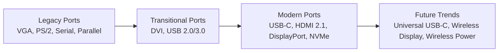

**Key transitions:**

- **USB replacing PS/2** — Unified peripheral connectivity with hot-swapping and plug-and-play support.
- **HDMI/DisplayPort replacing VGA/DVI** — Fully digital signals eliminate analog degradation and add audio support.
- **USB-C becoming universal** — A single reversible connector now handles data, video, and power across phones, laptops, and accessories.
- **Thunderbolt convergence** — Thunderbolt and USB4 are merging toward a unified high-speed standard.
- **Wireless alternatives** — Wi-Fi, Bluetooth, wireless display (Miracast/AirPlay), and wireless charging are gradually reducing reliance on physical ports — with corresponding new cybersecurity considerations around wireless attack surfaces.

---

## 🛡️ Cybersecurity Relevance

Physical ports are not just convenience features — they are **attack surfaces**. Cybersecurity professionals must understand ports deeply because they represent tangible points where systems can be compromised, monitored, or exploited.

### Key Areas of Relevance

| Area | Why It Matters |
|---|---|
| **Device Identification** | Understanding port types helps identify unauthorized or unexpected hardware connected to a system |
| **Hardware Forensics** | Investigators examine which ports were used, when, and by what devices during incident investigations |
| **USB Attacks** | Malicious USB devices can execute code, exfiltrate data, or impersonate trusted hardware |
| **BadUSB** | Firmware-level attack where a USB device's controller is reprogrammed to act as a different device type (e.g., posing as a keyboard) |
| **Rubber Ducky** | A well-known USB attack tool disguised as a flash drive that types pre-programmed malicious keystrokes at high speed once plugged in |
| **Malicious HID Devices** | Human Interface Devices (keyboards/mice) can be weaponized since operating systems inherently trust HID input |
| **Network Troubleshooting** | Ethernet port and cabling knowledge is essential for diagnosing connectivity issues during assessments |
| **Physical Security** | Unused or exposed ports (especially Ethernet jacks and USB ports in public areas) can be physical entry points for attackers |
| **Incident Response** | Identifying what was plugged into a compromised machine is often a first forensic step |
| **Penetration Testing Hardware** | Tools like the O.MG Cable, Rubber Ducky, and LAN Turtle rely on exploiting trust in standard port connections |

> ⚠️ **Real-World Warning**
> Never plug in an unknown USB device — found in a parking lot, received as a "free gift," or left behind by a stranger. This is a well-documented social engineering tactic known as **USB drop attacks**.

> 🛡️ **Defensive Practice**
> Organizations often disable unused USB ports via Group Policy, physically block ports with port locks, or use USB data-blocker adapters ("USB condoms") that allow charging but block data pins.

---

## 💻 Real-World Examples

Understanding what happens internally when common devices are connected reinforces the concepts above.

| Action | Internal Process |
|---|---|
| **Connecting a Keyboard** | USB HID enumeration occurs; OS loads a generic HID driver; keystrokes are sent as HID reports |
| **Connecting a Mouse** | Similar HID enumeration; movement/click data sent continuously as small data packets |
| **Connecting an External SSD** | USB Mass Storage or NVMe-over-USB protocol initializes; OS mounts the file system; drive letter/mount point assigned |
| **Connecting a Monitor (HDMI/DP)** | EDID (Extended Display Identification Data) is read to determine supported resolutions; video signal begins transmission |
| **Connecting an Ethernet Cable** | Physical link established; DHCP request sent; IP address assigned; device joins the network |
| **Connecting a Flash Drive** | Mass storage class driver loads; partition table read; file system mounted for access |
| **Connecting a Docking Station** | Multiple virtual "connections" are negotiated simultaneously — USB hub, Ethernet, and DisplayPort/HDMI over a single physical cable (often USB-C/Thunderbolt) |

---

## ⚠️ Common Mistakes

- ❌ **Confusing USB versions** — assuming a USB-A port supports USB 3.0 speeds just because the cable looks similar to USB 2.0.
- ❌ **Mixing HDMI with DisplayPort** — using an incorrect adapter direction (DisplayPort-to-HDMI adapters are not always bidirectional).
- ❌ **Assuming all USB-C ports are identical** — some support only charging, others full USB4/Thunderbolt/DisplayPort Alt Mode.
- ❌ **Confusing SATA with M.2** — assuming any M.2 SSD will work in any M.2 slot without checking NVMe/SATA compatibility.
- ❌ **Wrong monitor cables** — using VGA when a digital connection (HDMI/DisplayPort) is available, resulting in blurrier image quality.

---

## 💡 Best Practices

- 🧵 **Cable Management** — Label cables and use cable ties to avoid confusion and reduce wear at connector joints.
- 🔍 **Port Maintenance** — Regularly inspect ports for dust, debris, or bent pins; use compressed air for cleaning.
- 🔌 **Safe Device Removal** — Always use "Safely Remove Hardware" (or equivalent) before unplugging storage devices to prevent data corruption.
- 🎯 **Choosing Correct Cables** — Match cable specification to the required use case (e.g., use USB-C cables rated for Power Delivery when charging laptops).
- ⚡ **High-Speed Devices** — Use certified cables for high-speed transfers (e.g., USB 3.x devices need USB 3.x-rated cables, not just USB 2.0 cables that happen to fit).
- 🚫 **Avoiding Counterfeit Adapters** — Poor-quality or counterfeit adapters can damage devices, cause data corruption, or even pose fire hazards due to inadequate power regulation.

---

## 📚 Key Takeaways

- Ports, connectors, interfaces, and protocols are distinct but related concepts — understanding the difference avoids confusion.
- Every connection follows a predictable workflow: physical connection → signaling → detection → driver loading → data/power exchange.
- Modern computing is consolidating around **USB-C** and **Thunderbolt** as universal standards for data, video, and power.
- Legacy ports (VGA, PS/2, Serial, Parallel) still appear in industrial, legacy, and embedded systems — relevant knowledge for OT/ICS security work.
- Physical ports represent real **attack surfaces**: USB drop attacks, BadUSB, and malicious HID devices exploit the inherent trust systems place in connected hardware.
- Practical knowledge of ports supports hardware forensics, incident response, and physical penetration testing.

---

## 📝 Personal Notes

> *Use this space to record your own observations, questions, or lab experiences related to computer ports.*

- ** Note any ports you've physically inspected on your own hardware
- ** Record any USB security tools you've tested (e.g., in a lab environment)
- ** Add observations from CompTIA A+/Network+ study sessions
- ** Document any port-related troubleshooting you've performed

---

## 📖 References

- USB Implementers Forum (USB-IF) — official USB specifications
- VESA (Video Electronics Standards Association) — DisplayPort specifications
- HDMI Licensing Administrator — official HDMI specifications
- IEEE 802.3 — Ethernet standards documentation
- CompTIA A+ Core 1 & 2 Official Study Guide
- NIST Special Publication 800-88 — Guidelines for Media Sanitization (relevant to storage port/device security)
- OWASP — Physical Security and Hardware Attack resources

---
---
## ➡️ Next Chapter

Now that you understand how ports and connectors allow a computer to communicate with external devices, the next logical step is to explore what happens the moment you press the power button.

The next chapter explains the **BIOS** and **UEFI** firmware, the boot process, POST (Power-On Self-Test), bootloaders, Secure Boot, firmware settings, and how modern computers initialize hardware and load an operating system.

➡️ **Continue to:** **[BIOS & UEFI](../12-BIOS-UEFI/)**

---
---

