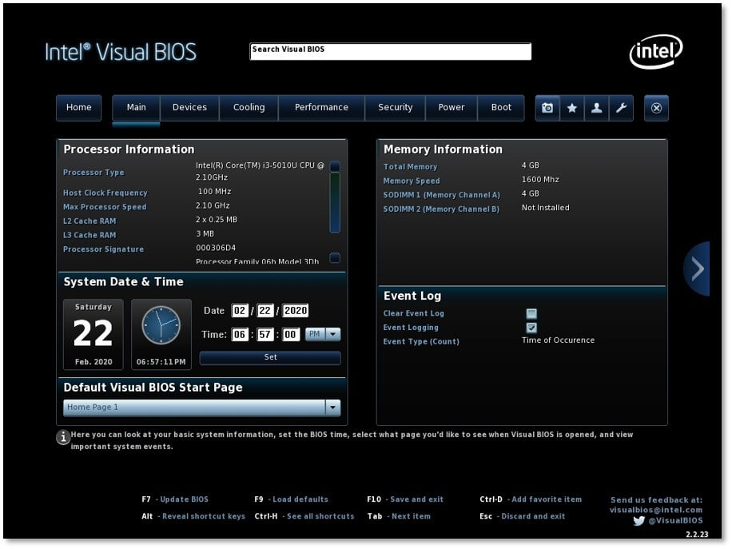
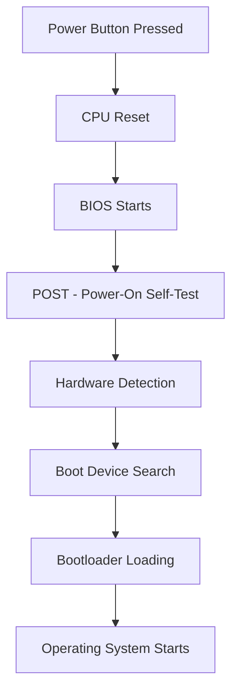
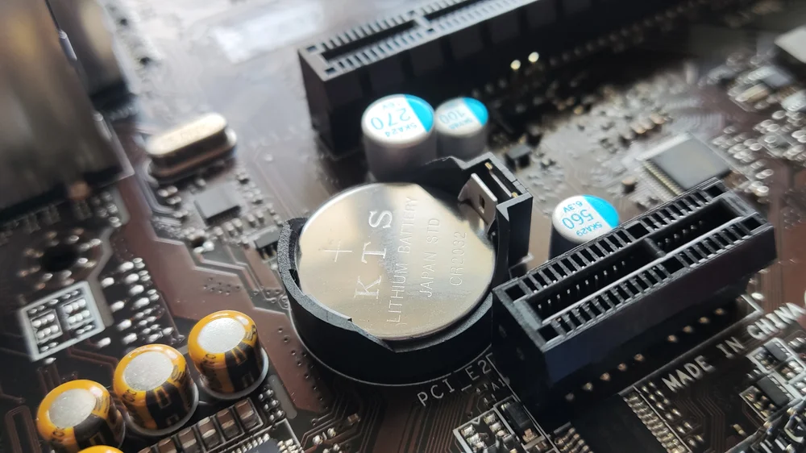
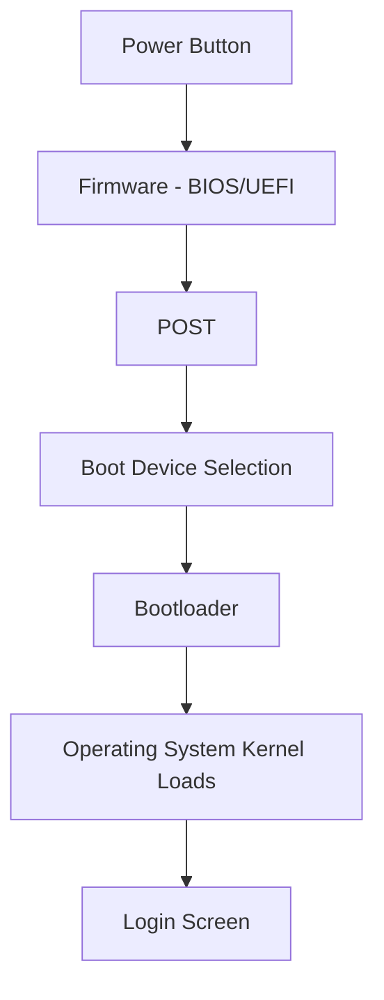
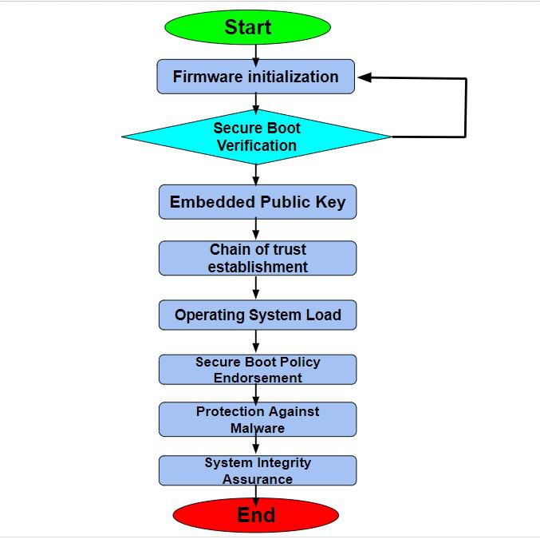

# 💻 BIOS & UEFI

> **Chapter Focus:** System firmware, the boot process, and the cybersecurity implications of BIOS and UEFI.

---

## 📖 Overview

Before an operating system can load, before you even see a login screen, something has to wake the hardware up, check that it's functioning, and hand control over to the OS. That "something" is **firmware**.

**Firmware** is software permanently (or semi-permanently) embedded into a hardware device, responsible for controlling that hardware at the lowest level. Unlike regular applications, firmware doesn't run *on top of* an operating system — it runs *before* the operating system even exists as far as the computer is concerned.

- Every computer needs firmware because raw hardware components (CPU, RAM, storage controllers) have no inherent knowledge of how to cooperate — firmware provides the initial instructions that bring them into a working state.
- **Firmware and hardware** have a direct relationship: firmware is often stored on a chip physically soldered to the motherboard, and it understands the specific hardware it was written for.
- **Firmware and the operating system** have a handoff relationship: firmware initializes the system just enough to locate and load an OS, then steps back once the OS takes over.

> 💡 **Note**
> Think of firmware as the stage crew before a play. They set up the lighting, props, and sound systems (hardware) before the curtain rises — and once the actors (the OS) take the stage, the crew fades into the background, ready to assist only if something breaks.

In modern computing, this firmware layer is implemented as either **BIOS** (Basic Input/Output System) or its modern successor, **UEFI** (Unified Extensible Firmware Interface).

---

## 🎯 Learning Objectives

After completing this chapter, you should understand:

- ✅ What BIOS is and how it historically worked
- ✅ What UEFI is and how it improves on BIOS
- ✅ The complete boot process, from power button to login screen
- ✅ The technical and security differences between BIOS and UEFI
- ✅ What Secure Boot is and why it matters
- ✅ The difference between Legacy Boot and UEFI Boot
- ✅ What firmware settings control, including CMOS, boot order, and virtualization
- ✅ How firmware updates work and why they carry risk
- ✅ The cybersecurity implications of firmware — including rootkits, bootkits, and persistence techniques

---

## 🧠 What is BIOS?

**BIOS (Basic Input/Output System)** is the original firmware standard used in personal computers, dating back to the early 1980s IBM PCs.

| Aspect | Description |
|---|---|
| **Definition** | Firmware stored on a chip that initializes hardware and starts the boot process |
| **History** | Introduced in 1981 with the original IBM PC; standardized across the industry for decades |
| **Purpose** | Test, initialize, and hand off control from hardware to an operating system |
| **Storage (ROM)** | Traditionally stored on a **ROM (Read-Only Memory)** chip; modern implementations use rewritable **flash memory** so updates are possible |

### POST (Power-On Self-Test)

When a computer powers on, BIOS immediately runs **POST**, a diagnostic sequence that checks essential hardware components (CPU, RAM, keyboard controller, graphics) are present and functioning. If POST fails, the system typically communicates the failure using a series of beep codes or diagnostic LEDs, since the display itself may not yet be initialized.

### Bootstrap Process

Once POST completes successfully, BIOS performs the **bootstrap process** — locating a bootable device (like a hard drive), reading its boot sector, and passing control to the bootloader stored there, which eventually loads the operating system.

> 📝 **Beginner-Friendly Explanation**
> BIOS is like a security guard who checks all rooms in a building are safe (POST), then walks to the front lobby to find the "start here" sign (boot sector) and lets the day's activities (OS) begin.

---

## 🧠 What is UEFI?

**UEFI (Unified Extensible Firmware Interface)** is the modern replacement for traditional BIOS, developed as an open specification by a consortium including Intel, AMD, Microsoft, and others.

| Aspect | Description |
|---|---|
| **Definition** | A modern firmware interface standard designed to replace BIOS while providing greater flexibility and security |
| **Evolution** | Originated from Intel's EFI (Extensible Firmware Interface) in the 1990s, later standardized as UEFI in 2005 |
| **Modern Firmware** | Supports graphical interfaces, mouse input, networking, and larger storage devices |
| **Features** | Secure Boot, GPT partition support, faster boot times, modular driver architecture |
| **Advantages** | Better security, larger disk support, more user-friendly interfaces, remote management capability |

> 💡 **Note**
> Almost all computers manufactured since around 2012 use UEFI, though many still include a "Legacy" or "CSM" mode for backward compatibility with older operating systems.

---

## ⚙️ How BIOS Works

The traditional BIOS boot sequence follows a predictable, linear path:

**Step-by-step breakdown:**

1. **Power button pressed** — Electrical current reaches the motherboard.
2. **CPU reset** — The processor initializes to a known starting state and begins executing instructions from a fixed memory address where the BIOS is located.
3. **BIOS starts** — Firmware code begins executing directly from the flash chip.
4. **POST** — Hardware sanity checks run (CPU, memory, basic peripherals).
5. **Hardware detection** — BIOS identifies connected devices (drives, GPUs, input devices).
6. **Boot device search** — BIOS checks configured devices, in order, for a valid boot sector.
7. **Bootloader loading** — The Master Boot Record (MBR) code is read and executed.
8. **Operating system starts** — The bootloader loads the OS kernel into memory and transfers control to it.

---

## ⚙️ How UEFI Works

UEFI follows a more modular and flexible process compared to BIOS:

1. **Firmware initialization** — UEFI firmware begins executing, running in a full 32-bit or 64-bit processor mode (unlike BIOS's legacy 16-bit real mode).
2. **Hardware detection** — Hardware components are identified using modular UEFI drivers rather than hardcoded routines.
3. **EFI System Partition (ESP)** — Instead of relying on a raw boot sector, UEFI looks for a dedicated FAT32-formatted partition containing bootloader files.
4. **Boot Manager** — UEFI includes a built-in **Boot Manager** capable of directly reading files and choosing between multiple installed operating systems.
5. **Secure Boot verification** — If enabled, each bootloader/driver component is cryptographically verified against trusted signatures before execution.
6. **Bootloader** — The verified bootloader (e.g., Windows Boot Manager, GRUB) loads.
7. **Operating system startup** — Control passes to the OS kernel, and normal startup continues.

> 🛡️ **Cybersecurity Insight**
> Because UEFI can verify digital signatures at each boot stage, it closes off many of the attack techniques that thrived under BIOS — particularly bootkits that modified the MBR directly.

---

## 🔄 BIOS vs UEFI

| Feature | BIOS | UEFI |
|---|---|---|
| **Age** | Since 1981 | Since mid-2000s (mainstream ~2012) |
| **Interface** | Text-based, keyboard-only | Graphical, supports mouse input |
| **Storage** | ROM / flash chip | Flash chip, often with GUI resources |
| **Max Disk Size** | ~2.2 TB (due to MBR) | Beyond 9 zettabytes (via GPT) |
| **Boot Speed** | Slower, sequential checks | Faster, parallel initialization |
| **Partition Table** | MBR only | GPT (also supports MBR for compatibility) |
| **Security** | Minimal built-in security | Secure Boot, cryptographic verification |
| **Extensibility** | Limited, hardware-specific | Modular drivers, supports extensions/apps |
| **Networking Support** | None natively | Built-in network stack (PXE boot, remote diagnostics) |

---

## 🧩 Components

| Component | Description |
|---|---|
| **Firmware Chip** | The physical flash memory chip on the motherboard storing BIOS/UEFI code |
| **CMOS** | Complementary Metal-Oxide-Semiconductor memory storing firmware settings (date, time, boot order) |
| **CMOS Battery** | A small battery (typically CR2032) that keeps CMOS settings and the system clock powered when the PC is off |
| **NVRAM** | Non-Volatile RAM used by UEFI to store boot variables and configuration data persistently |
| **Bootloader** | Small program responsible for loading the operating system kernel into memory |
| **EFI System Partition (ESP)** | A dedicated FAT32 partition containing bootloader files and UEFI applications |
| **Boot Manager** | UEFI component that presents and manages available boot options |

---

## 🛠️ BIOS Setup Utility

### Entering BIOS/UEFI Setup

During the earliest moments of boot, most systems display a brief prompt (or none at all) to enter the setup utility, typically by pressing:

| Manufacturer | Common Key(s) |
|---|---|
| Dell | F2 or F12 |
| HP | F10 or Esc |
| Lenovo | F1 or F2 |
| ASUS | F2 or Delete |
| Generic/Custom Builds | Delete or F2 |

> 💡 **Note**
> On systems with very fast boot times (common with UEFI + SSDs), you may need to use the "Advanced Startup" option from within Windows to reach firmware settings, since the setup prompt window can pass in a fraction of a second.

### Common Settings

| Setting | Purpose |
|---|---|
| **Boot Order** | Determines which device the system attempts to boot from first (HDD, USB, network) |
| **Date & Time** | Sets the system's real-time clock, stored via CMOS |
| **CPU Settings** | Adjusts multiplier, voltage, and overclocking parameters |
| **RAM Settings** | Configures memory timings and voltage |
| **Virtualization (Intel VT-x / AMD-V)** | Enables hardware-assisted virtualization required for VMs and some security sandboxes |
| **TPM (Trusted Platform Module)** | Enables/disables the hardware security chip used for encryption keys and Secure Boot |
| **Secure Boot** | Enables cryptographic verification of the boot chain |
| **Fan Control** | Adjusts fan curves for thermal management |
| **XMP / EXPO** | Applies manufacturer-certified overclocking profiles for RAM |
| **Power Settings** | Configures behavior on power loss, wake-on-LAN, and sleep states |

---

## 🔋 CMOS Battery

- **Purpose:** Powers the CMOS memory chip and real-time clock even when the computer is unplugged, preserving firmware settings and the system date/time.
- **CR2032 Battery:** The most common coin-cell battery used for this purpose, typically lasting 3–5 years or more.
- **When It Dies:** The system clock resets (often to a default date like January 1, 2000-something), and custom firmware settings may revert to factory defaults.
- **CMOS Reset:** Removing the battery temporarily, or using a dedicated jumper/button on the motherboard, clears CMOS settings — often used to recover from a bad overclock or forgotten BIOS password.
- **BIOS Reset:** Related but distinct — some systems allow resetting firmware to defaults through the setup menu itself, without physically removing the battery.

> ⚠️ **Warning**
> Removing or replacing the CMOS battery while the system is plugged into power can pose an electric shock risk. Always power off and unplug the system first, and discharge residual power by holding the power button for several seconds.

---

## 🚀 The Boot Process

The complete boot sequence — from pressing the power button to reaching a usable desktop — involves multiple handoffs between firmware, bootloader, and operating system.

**Detailed sequence:**

1. **Power Button** — Physical power is supplied to the motherboard.
2. **Firmware** — BIOS or UEFI begins execution from a fixed memory location.
3. **POST** — Hardware is verified functional.
4. **Boot Device** — Firmware consults its configured boot order to find a valid boot target.
5. **Bootloader** — Control passes to a small program (MBR code, or a UEFI application like GRUB/Windows Boot Manager).
6. **Operating System** — The bootloader loads the kernel and essential drivers into memory.
7. **Login Screen** — Once core OS services initialize, the user-facing login prompt appears.

---

## 🔐 Secure Boot

**Secure Boot** is a UEFI security feature designed to ensure that only trusted, digitally signed software runs during the boot process.

- **What it is:** A verification chain where each component (firmware drivers, bootloader, OS kernel) must present a valid digital signature matching keys stored in firmware before it's permitted to execute.
- **Why it exists:** To prevent malicious code from hijacking the boot process before OS-level security tools (antivirus, EDR) have a chance to load.
- **Digital Signatures:** Cryptographic signatures issued by trusted certificate authorities (e.g., Microsoft, hardware vendors) that prove software hasn't been tampered with.
- **Rootkits:** Malware designed to hide deep within a system, often at the kernel level, to avoid detection.
- **Bootkits:** A specialized form of rootkit that infects the boot process itself — loading before the OS and its security tools, making detection extremely difficult.

| Advantages | Limitations |
|---|---|
| Blocks unsigned bootloaders and drivers | Can complicate dual-booting with unsigned OS distributions |
| Reduces risk of bootkit persistence | Requires firmware and OS support, plus proper key management |
| Works alongside TPM for full-disk encryption trust | Some legitimate tools (older Linux distros, custom kernels) may need extra configuration |

> 🛡️ **Cybersecurity Insight**
> Secure Boot doesn't make a system immune to malware — it specifically targets the **boot chain**, ensuring malware can't gain a foothold *before* the operating system's own defenses activate.

---

## 💾 Legacy Boot vs UEFI Boot

| Aspect | Legacy Boot | UEFI Boot |
|---|---|---|
| **Mode** | 16-bit real mode, MBR-based | 32/64-bit mode, GPT-based |
| **Compatibility Support Module (CSM)** | Emulates legacy BIOS behavior on UEFI systems for older OS support | Not needed; native UEFI boot |
| **Partition Table** | MBR only | GPT (preferred), MBR (compatibility) |
| **Security Features** | None | Secure Boot available |

- **Legacy Mode:** Runs the system as if it were a traditional BIOS machine, useful for installing very old operating systems.
- **CSM (Compatibility Support Module):** A UEFI feature that toggles legacy-compatible behavior on and off, often found in firmware settings menus.

> ⚠️ **Warning**
> Mixing boot modes — for example, installing an OS in Legacy mode on a drive later accessed in UEFI mode — is a common cause of "boot device not found" errors after fresh installs.

---

## 📀 MBR vs GPT

| Feature | MBR (Master Boot Record) | GPT (GUID Partition Table) |
|---|---|---|
| **Introduced** | 1983 | Introduced with EFI/UEFI |
| **Max Partitions** | 4 primary (or 3 primary + 1 extended) | Up to 128 partitions |
| **Max Disk Size** | 2.2 TB | Over 9 zettabytes |
| **Reliability** | Single copy of partition data; vulnerable to corruption | Stores multiple copies plus CRC checksums for redundancy |
| **Compatibility** | Works with both BIOS and UEFI | Best supported with UEFI (some legacy support exists) |

> 💡 **Note**
> If you've ever seen a drive capped at "1.99 TB usable" out of a 4TB disk, that's very likely an MBR-formatted drive — GPT is required to use the full capacity of larger modern storage.

---

## 🔄 Updating BIOS / UEFI

- **Firmware Updates:** Manufacturer-released updates that patch bugs, improve hardware compatibility, and address security vulnerabilities.
- **Why Updates Matter:** New CPU support, improved stability, and critical security patches (such as fixes for firmware-level vulnerabilities) are often delivered exclusively through firmware updates.
- **Risks:** An interrupted firmware update (due to power loss or user error) can leave a motherboard in an unbootable state — sometimes requiring specialized recovery tools or professional repair.
- **Recovery:** Many modern motherboards include dual-BIOS chips or a recovery mode (e.g., "BIOS Flashback") that allows re-flashing firmware even without a working CPU or RAM installed.

> ⚠️ **Warning**
> Never update firmware during a storm, on unstable power, or on a laptop with low battery not connected to a charger. Firmware updates are one of the few situations where an interruption can genuinely "brick" hardware.

---

## 🛡️ Cybersecurity Relevance

Firmware sits at a uniquely privileged layer — beneath the operating system, beneath most security tooling, and often outside the visibility of traditional antivirus software. This makes it an attractive target for sophisticated attackers.

| Area | Why It Matters |
|---|---|
| **Rootkits** | Malware that hides at a deep system level, evading standard detection tools |
| **Bootkits** | Malware that infects firmware or the boot chain itself, executing before the OS and its defenses load |
| **Secure Boot** | A primary defense mechanism against unauthorized boot-chain modification |
| **TPM** | Provides hardware-backed cryptographic key storage, strengthening disk encryption and attestation |
| **Disk Encryption** | Firmware-level trust (via TPM and Secure Boot) underpins secure implementations of full-disk encryption |
| **BitLocker** | Windows' native encryption tool relies on TPM and Secure Boot state to safely store and release decryption keys |
| **Firmware Attacks** | Attacks targeting the UEFI/BIOS chip directly, such as implanting persistent malware that survives OS reinstalls |
| **Persistence Techniques** | Firmware-level infections survive drive wipes and OS reinstalls since they live outside the storage device entirely |
| **Incident Response** | Investigators must consider firmware integrity, not just disk contents, during a thorough compromise investigation |
| **Malware** | Some advanced malware families have included UEFI rootkit components as part of broader attack campaigns |
| **Digital Forensics** | Firmware analysis tools can detect unauthorized modifications to boot firmware images |

> 🛡️ **Cybersecurity Insight**
> Because firmware-level malware can survive a full OS reinstall or even a hard drive replacement, it represents one of the most severe forms of persistence an attacker can achieve — reinforcing why Secure Boot, TPM attestation, and firmware update hygiene matter so much in enterprise security.

---

## 💻 Practical Examples

| Task | What Happens |
|---|---|
| **Entering BIOS** | Pressing the manufacturer-specific key during the earliest boot moment interrupts normal boot and loads the setup utility |
| **Changing Boot Order** | Reordering boot priority so a USB drive or network boot is attempted before the internal drive |
| **Installing Linux** | Often requires disabling Secure Boot (for unsigned kernels/drivers) or enrolling a custom key for signed distributions |
| **Installing Windows** | Modern Windows versions require UEFI + GPT + Secure Boot + TPM 2.0 for full feature support |
| **Booting from USB** | Requires enabling USB boot support and placing the USB device ahead of internal drives in boot order |
| **Enabling Virtualization** | Toggling Intel VT-x/AMD-V in firmware settings, required for running virtual machines or certain sandboxing tools |
| **Resetting CMOS** | Removing the CMOS battery or using a motherboard jumper/button to clear firmware settings back to factory defaults |

---

## ⚠️ Common Mistakes

- ❌ **Wrong boot mode** — installing an OS in Legacy mode when the system/drive is configured for UEFI (or vice versa), causing boot failures.
- ❌ **Disabling Secure Boot incorrectly** — turning it off without understanding the security tradeoff, especially on shared or enterprise systems.
- ❌ **Updating BIOS during a power failure** — interrupting a firmware flash, potentially bricking the motherboard.
- ❌ **Incorrect boot order** — leaving a USB drive prioritized over the internal disk, causing unexpected boot behavior after using bootable media.
- ❌ **Resetting BIOS accidentally** — clearing custom firmware settings (like RAID configurations or overclocks) without realizing the consequences.

---

## 💡 Best Practices

- 🔄 **Keep firmware updated** — apply manufacturer-released updates, especially those addressing known security vulnerabilities.
- 🔐 **Enable Secure Boot when appropriate** — particularly on systems handling sensitive data or in enterprise environments.
- 📀 **Use GPT on modern systems** — take advantage of larger disk support and improved reliability over MBR.
- 💾 **Backup settings before updating** — note custom configurations (boot order, overclocks) before performing a firmware update or reset.
- 🌐 **Download firmware only from official manufacturers** — never use third-party or unofficial firmware images, which may be tampered with or malicious.

---

## 📚 Key Takeaways

- Firmware (BIOS or UEFI) is the first software to run on a computer, bridging raw hardware and the operating system.
- BIOS is the legacy standard; UEFI is its modern, more secure, and more flexible successor.
- The boot process follows a consistent path: power → firmware → POST → boot device → bootloader → OS → login.
- UEFI introduces critical security improvements, most notably **Secure Boot**, which verifies the integrity of each boot stage.
- GPT has largely replaced MBR for partitioning, supporting far larger disks and more partitions with better reliability.
- Firmware sits below the OS and most security tooling, making it a high-value — and high-risk — target for advanced attackers such as bootkit and rootkit authors.
- Responsible firmware management (careful updates, Secure Boot, TPM usage) is a foundational element of both endpoint security and digital forensics.

---

## 📝 Personal Notes

> *Use this space to record your own observations, lab experiences, or questions related to BIOS/UEFI.*

-  Note the BIOS/UEFI key combination for your own hardware
-  Record observations from enabling/disabling Secure Boot in a lab environment
-  Document any firmware update you've performed personally
-  Add notes from CompTIA A+ or Security+ study sessions related to firmware security

---

## 📖 References

- UEFI Forum — official UEFI specifications
- Microsoft Learn — Secure Boot and TPM documentation
- CompTIA A+ Core 1 & 2 Official Study Guide
- NIST Special Publication 800-147 — BIOS Protection Guidelines
- Trusted Computing Group — TPM specifications
- OWASP — Firmware and Hardware Security resources

---
## ➡️ Next Chapter

Now that you understand how BIOS and UEFI initialize hardware and prepare a computer to load an operating system, the next logical step is to explore another major computing platform you'll encounter in both IT and cybersecurity: **mobile devices**.

The next chapter introduces smartphones and tablets, their hardware components, mobile operating systems, connectivity technologies, security features, and the role mobile devices play in modern computing and cybersecurity.

➡️ **Continue to:** **[Mobile Devices](../13-Mobile-Devices/)**

---
---

