# 🖱️ Peripheral Devices

> A complete beginner's guide to input, output, storage, and communication peripherals — how they work, how they connect, and why they matter in cybersecurity.

---

## 🎯 Learning Objectives

By the end of this chapter, you will be able to:

- Explain what peripheral devices are and why they're called "peripherals."
- Differentiate between input, output, and input/output devices.
- Identify common computer peripherals and describe their purpose.
- Understand how peripherals communicate with a computer and its operating system.
- Install, configure, and safely remove peripheral devices.
- Troubleshoot common peripheral problems using a logical process.
- Explain the role of peripherals in cybersecurity, including hardware-based attack vectors.

---

## 📑 Table of Contents

- [Introduction](#introduction)
- [What is a Peripheral Device?](#what-is-a-peripheral-device)
- [Categories of Peripheral Devices](#categories-of-peripheral-devices)
- [Input Devices](#input-devices)
- [Output Devices](#output-devices)
- [Input/Output Devices](#inputoutput-devices)
- [Storage Peripherals](#storage-peripherals)
- [Communication Peripherals](#communication-peripherals)
- [Device Drivers](#device-drivers)
- [Connecting Peripheral Devices](#connecting-peripheral-devices)
- [Installing Peripheral Devices](#installing-peripheral-devices)
- [Common Peripheral Problems](#common-peripheral-problems)
- [Peripheral Devices in Cybersecurity](#peripheral-devices-in-cybersecurity)
- [Peripheral Security Best Practices](#peripheral-security-best-practices)
- [Common Beginner Misconceptions](#common-beginner-misconceptions)
- [Best Practices](#best-practices)
- [Visual Learning](#visual-learning)
- [Practical Exercises](#practical-exercises)
- [Interview Questions](#interview-questions)
- [Quick Revision](#quick-revision)
- [Key Takeaways](#key-takeaways)
- [Further Reading](#further-reading)
- [Next Chapter](#next-chapter)

---

## Introduction

Every computer has two worlds: the world **inside** the case (CPU, RAM, motherboard, storage) and the world **outside** it, where humans and other systems interact with the machine. That outside world is made up of **peripheral devices**.

- **What peripheral devices are:** Any hardware component that connects to a computer but is not part of its essential internal processing core (CPU, motherboard, RAM).
- **Why they're called "peripherals":** The word "peripheral" means "on the outer edge" — these devices sit at the edge of the system, extending what the core computer can do without being part of that core.
- **Why computers need peripherals:** A processor alone cannot see, hear, print, save large amounts of data externally, or network with other machines — peripherals give the computer its senses and its ability to act.
- **Internal components vs. external peripherals:** Internal components (CPU, RAM, motherboard) are what a computer *thinks with*. Peripherals are what it *senses and acts through* — even when, technically, some peripherals (like an internal DVD drive) live inside the case.

> 💬 **Real-World Analogy**
> Think of a computer as a brain in a jar. The brain can think, but it cannot see, hear, speak, or move on its own. Peripherals are the eyes (webcam), ears (microphone), hands (keyboard/mouse), and voice (speakers) that let the brain interact with the world.

---

## What is a Peripheral Device?

**Definition:** A peripheral device is any piece of hardware connected to a computer that provides input to it, receives output from it, or both — without being part of the computer's core processing system.

### How Peripherals Extend Computer Functionality

A base computer can compute, but it can't naturally:
- Accept human input (until you add a keyboard/mouse)
- Display anything visually (until you add a monitor)
- Store large volumes of portable data (until you add external storage)
- Communicate over a network (until you add a network adapter)

Peripherals fill these gaps, turning a general-purpose processor into a usable, interactive system.

### Communication with the Operating System

When you connect a peripheral, it doesn't speak directly to your applications. Instead, communication flows through layers:

```
Peripheral Device
      ↓
Device Driver
      ↓
Operating System
      ↓
Application Software
```

The **operating system** manages this entire chain, ensuring that data from a physical device is translated into a format applications can understand — and vice versa.

### Device Drivers

A **device driver** is a small piece of software that acts as a translator between a peripheral's hardware-specific language and the operating system's general-purpose instructions.

> 💬 **Real-World Analogy**
> If the operating system only speaks English and your webcam only speaks Japanese, the driver is the interpreter standing between them, translating in real time so both sides understand each other perfectly.

Without the correct driver, a peripheral may be physically connected but functionally useless — the OS simply won't know how to talk to it.

---

## Categories of Peripheral Devices

| Category | Description | Examples |
|---|---|---|
| **Input Devices** | Send data *into* the computer | Keyboard, mouse, scanner |
| **Output Devices** | Send data *out of* the computer for the user to perceive | Monitor, printer, speakers |
| **Input/Output Devices** | Both send data in and receive data out | Touchscreen, external storage |
| **Storage Devices** | Store data externally, portably, or for backup | USB flash drive, external SSD |
| **Communication Devices** | Enable connectivity between the computer and networks/other devices | Wi-Fi adapter, docking station |

> 📝 **Note**
> Some devices are hard to categorize strictly — a touchscreen, for example, both accepts touch input and displays visual output, making it a true I/O device.

---

## Input Devices

Input devices allow a user (or another system) to send data or commands into the computer.

### ⌨️ Keyboard

<p align="center">
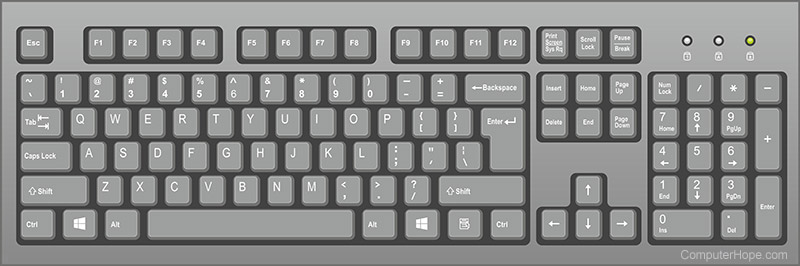
</p>

- **Purpose:** Converts physical key presses into character/command input.
- **How it works:** Each key press closes an electrical circuit at a specific matrix position; a small controller chip identifies which key was pressed and sends that code to the computer.
- **Advantages:** Fast, precise text entry; widely standardized layout (QWERTY).
- **Disadvantages:** Requires a flat surface; limited for graphical or gesture-based input.
- **Common Use Cases:** Typing documents, entering commands, gaming.

### 🖱️ Mouse

<p align="center">
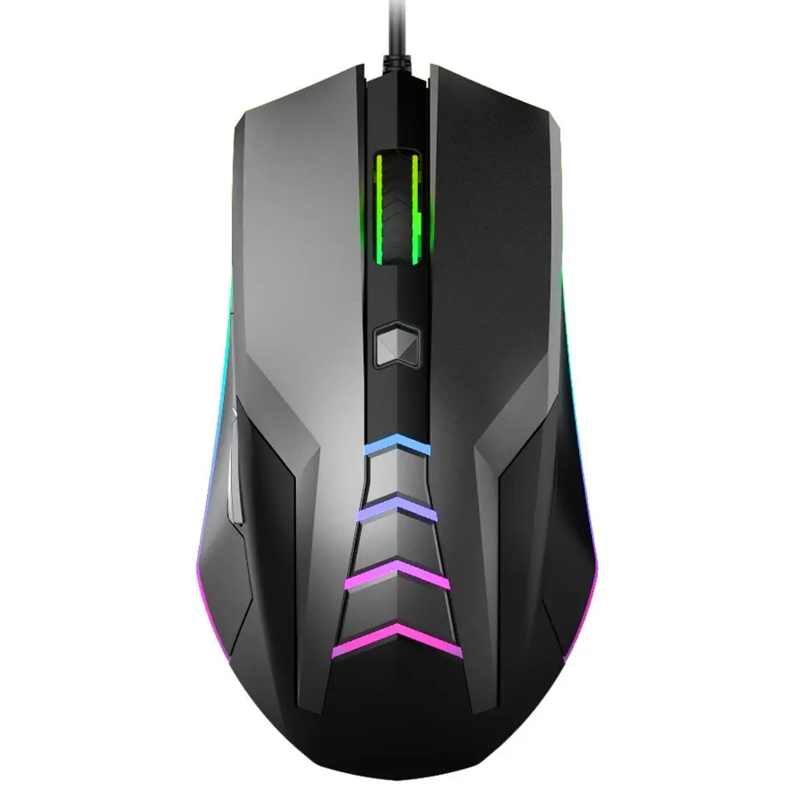
</p>

- **Purpose:** Provides precise pointer control and clicking input.
- **How it works:** An optical or laser sensor tracks surface movement and translates it into cursor movement; buttons register clicks via microswitches.
- **Advantages:** Precise, intuitive pointing and selection.
- **Disadvantages:** Requires flat surface space; less ergonomic for long sessions without proper support.
- **Common Use Cases:** General navigation, design work, gaming.

### 🔵 Trackball

<p align="center">
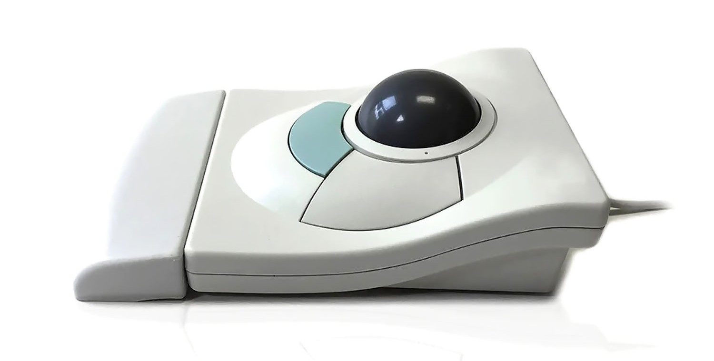
</p>

- **Purpose:** Provides cursor control without moving the entire device.
- **How it works:** The user rolls an exposed ball with their fingers/thumb, which the sensor reads for movement.
- **Advantages:** Requires minimal desk space; reduces repetitive wrist movement.
- **Disadvantages:** Steeper learning curve; less common, so replacements can be harder to find.
- **Common Use Cases:** CAD work, ergonomic setups, limited-desk-space environments.

### 🟦 Touchpad

<p align="center">

</p>

- **Purpose:** Provides pointer control via finger movement on a flat surface.
- **How it works:** A capacitive sensor grid detects finger position and movement across the pad's surface.
- **Advantages:** Built into laptops, no extra hardware needed.
- **Disadvantages:** Less precise than a mouse for detailed work.
- **Common Use Cases:** Laptop navigation, gesture-based commands (scrolling, zooming).

### 🖥️ Touchscreen

<p align="center">
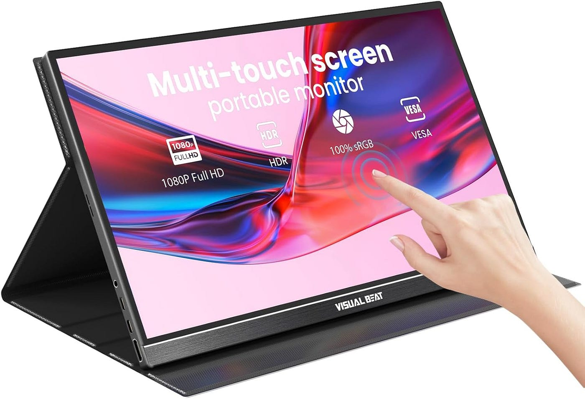
</p>

- **Purpose:** Allows direct interaction with on-screen content via touch.
- **How it works:** Capacitive touchscreens detect changes in electrical charge caused by finger contact; resistive touchscreens detect pressure between two flexible layers.
- **Advantages:** Intuitive, direct interaction; reduces reliance on separate input devices.
- **Disadvantages:** Can smudge easily; less precise than a mouse/stylus for fine detail work.
- **Common Use Cases:** Smartphones, tablets, kiosks, point-of-sale systems.

### 🖨️ Scanner

<p align="center">
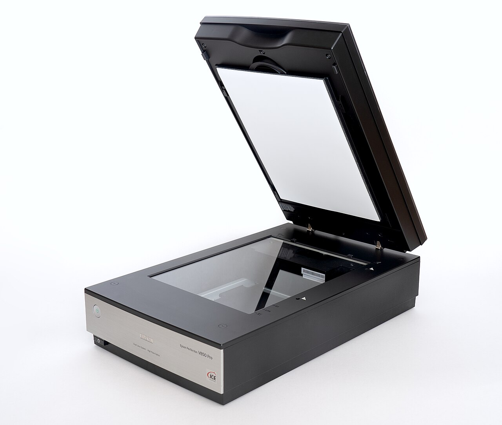
</p>

- **Purpose:** Converts physical documents or images into digital files.
- **How it works:** A light source illuminates the document while a sensor array (CCD or CIS) captures reflected light and converts it into digital pixel data.
- **Advantages:** Digitizes physical records for storage, editing, or sharing.
- **Disadvantages:** Slower than photographing a document; requires flatbed or feeder mechanism.
- **Common Use Cases:** Digitizing paperwork, archiving documents, OCR (Optical Character Recognition).

### 📊 Barcode Scanner

<p align="center">

</p>

- **Purpose:** Reads barcode data for quick, error-free identification.
- **How it works:** A laser or camera-based sensor reads the pattern of bars/spaces and decodes it into numeric or alphanumeric data.
- **Advantages:** Fast, highly accurate compared to manual entry.
- **Disadvantages:** Limited to items with printed/displayed barcodes.
- **Common Use Cases:** Retail checkout, inventory management, shipping/logistics.

### 🎙️ Microphone

<p align="center">
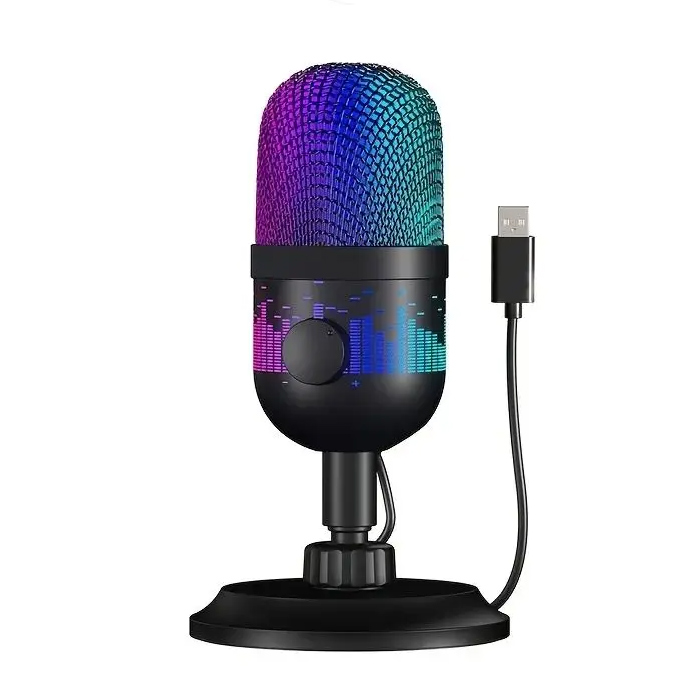
</p>

- **Purpose:** Captures audio input and converts it to an electrical/digital signal.
- **How it works:** Sound waves vibrate a diaphragm, which generates a corresponding electrical signal that's then digitized by an analog-to-digital converter.
- **Advantages:** Enables voice communication, dictation, and recording.
- **Disadvantages:** Susceptible to background noise without proper filtering.
- **Common Use Cases:** Video calls, voice assistants, podcasting, transcription.

### 📷 Webcam

<p align="center">
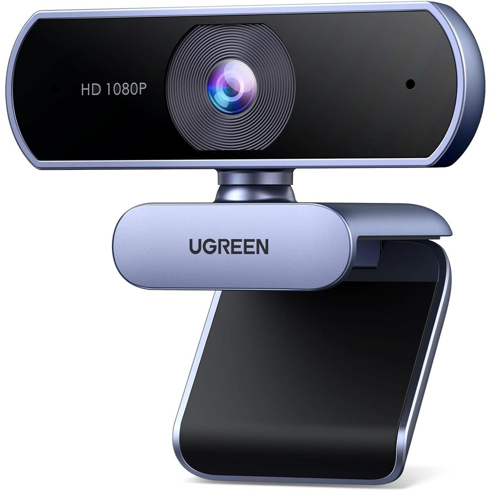
</p>

- **Purpose:** Captures live video input for streaming or recording.
- **How it works:** An image sensor (CMOS) captures light through a lens, converting it into a continuous stream of digital image frames.
- **Advantages:** Enables video conferencing, streaming, and security monitoring.
- **Disadvantages:** Raises privacy concerns if compromised remotely.
- **Common Use Cases:** Video calls, live streaming, security cameras.

### ✏️ Graphics Tablet

<p align="center">
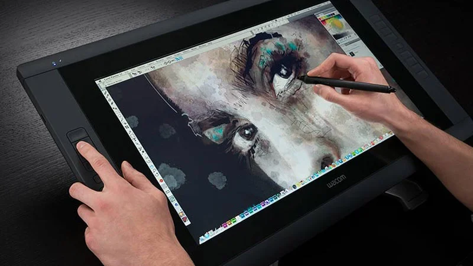
</p>

- **Purpose:** Allows precise, pressure-sensitive drawing input.
- **How it works:** A stylus interacts with an electromagnetic sensor grid embedded in the tablet surface, detecting position and pressure.
- **Advantages:** Far more precise than a mouse for artistic or design work.
- **Disadvantages:** Requires practice; more expensive than standard input devices.
- **Common Use Cases:** Digital art, photo editing, engineering design.

### 🕹️ Joystick

<p align="center">
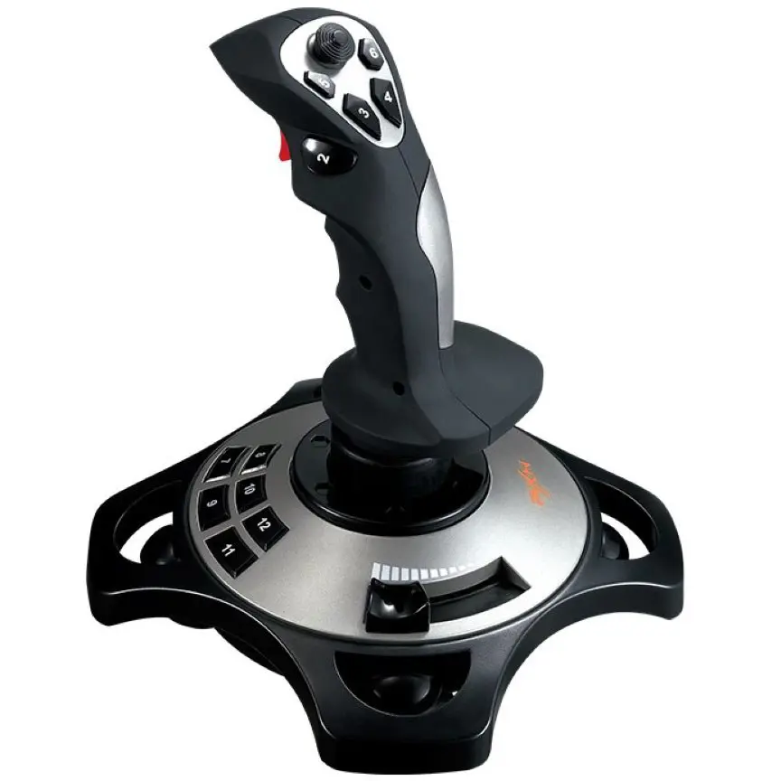
</p>

- **Purpose:** Provides directional and button-based input, often for simulations.
- **How it works:** Potentiometers or Hall-effect sensors measure the stick's angle and translate it into directional data.
- **Advantages:** Intuitive for flight/simulation control.
- **Disadvantages:** Limited general-purpose use outside gaming/simulation.
- **Common Use Cases:** Flight simulators, industrial control systems, gaming.

### 🎮 Game Controller

<p align="center">
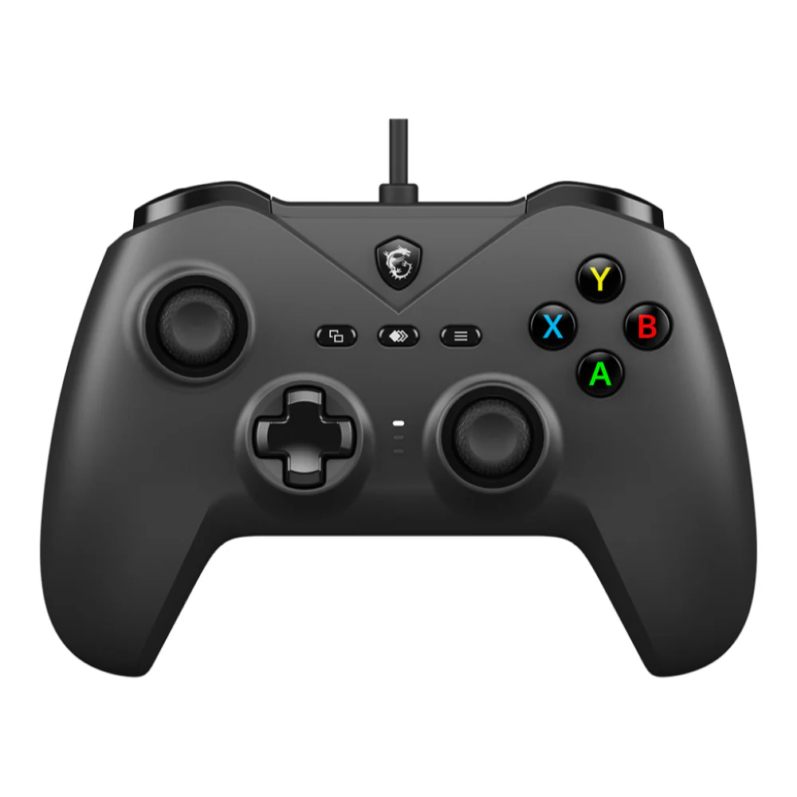
</p>

- **Purpose:** Provides multi-button and analog input for gaming.
- **How it works:** Combines analog sticks (potentiometers), buttons (microswitches), and sometimes motion sensors, all reported to the system many times per second.
- **Advantages:** Ergonomic, versatile for a wide range of game genres.
- **Disadvantages:** Less precise than mouse/keyboard for certain genres (e.g., competitive shooters).
- **Common Use Cases:** Console and PC gaming.

### 👆 Fingerprint Reader

<p align="center">
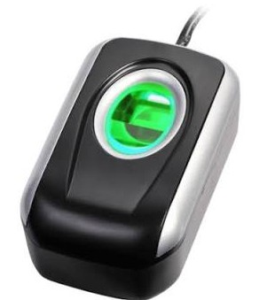
</p>

- **Purpose:** Captures a fingerprint pattern for biometric authentication.
- **How it works:** Capacitive or optical sensors map the unique ridge pattern of a fingerprint into a digital template for comparison.
- **Advantages:** Fast, convenient authentication.
- **Disadvantages:** Can be affected by dirty/wet fingers; not infallible against sophisticated spoofing.
- **Common Use Cases:** Device unlock, secure login, time-tracking systems.

### 💳 Smart Card Reader

<p align="center">
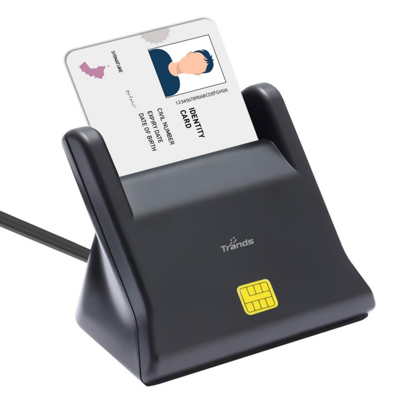
</p>

- **Purpose:** Reads data from embedded-chip cards for authentication or payment.
- **How it works:** Establishes electrical contact (or contactless RF communication) with the card's embedded chip to exchange cryptographic credentials.
- **Advantages:** Strong physical-token-based security.
- **Disadvantages:** Requires the card to be physically present; can be lost or damaged.
- **Common Use Cases:** Government ID systems, corporate access badges, banking cards.

### 🔐 Biometric Devices (General)

<p align="center">
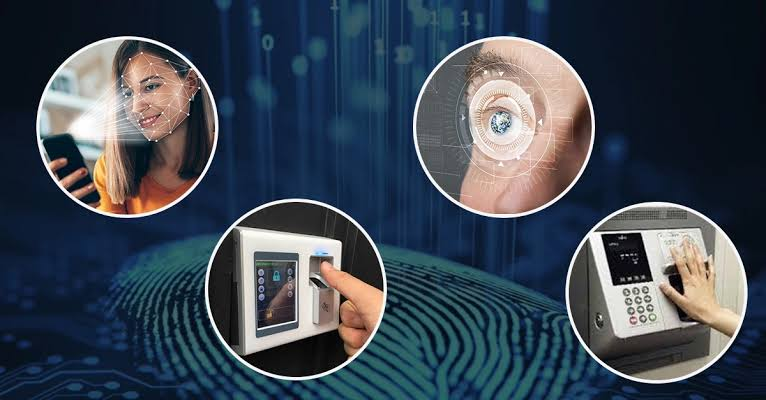
</p>

- **Purpose:** Authenticate identity using unique physical or behavioral traits.
- **How it works:** Sensors capture a biological trait (fingerprint, face, iris, voice) and compare it against a securely stored reference template.
- **Advantages:** Difficult to replicate compared to passwords; convenient for the user.
- **Disadvantages:** Biometric data can't be "changed" like a password if ever compromised.
- **Common Use Cases:** Device authentication, secure facility access, border control systems.

---

## Output Devices

Output devices allow the computer to present information back to the user.

### 🖥️ Monitor

<p align="center">
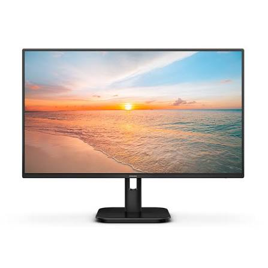
</p>

- **Purpose:** Displays visual output from the computer.
- **How it works:** Receives a video signal and renders it as an image using LCD, LED, or OLED display technology.
- **Common Uses:** General computing, gaming, professional design work.

### 🖨️ Printer

<p align="center">
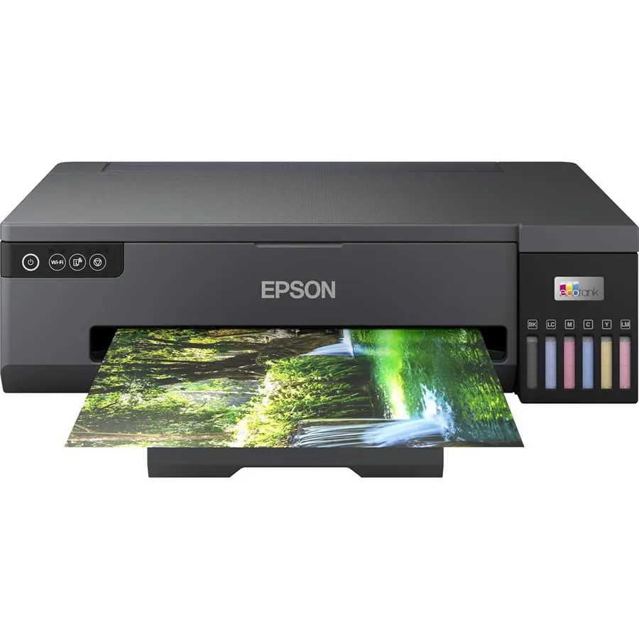
</p>

- **Purpose:** Produces a physical, paper-based copy of digital documents.
- **How it works:** Inkjet printers spray microscopic ink droplets; laser printers use toner fused onto paper via heat.
- **Common Uses:** Document printing, photo printing, office work.

### 🔊 Speakers

<p align="center">
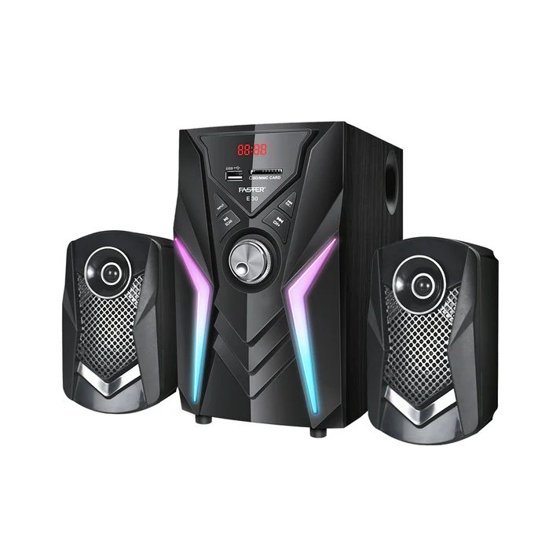
</p>

- **Purpose:** Converts digital audio signals into audible sound.
- **How it works:** An amplified electrical signal drives a speaker cone, which vibrates to produce sound waves.
- **Common Uses:** Music playback, video calls, gaming, notifications.

### 🎧 Headphones

<p align="center">
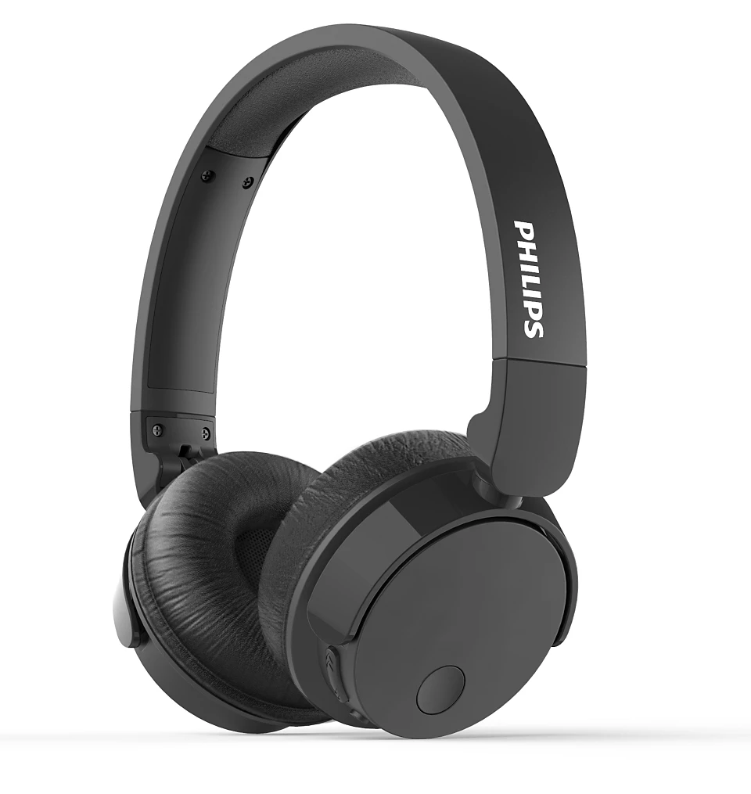
</p>

- **Purpose:** Delivers private audio output directly to the user's ears.
- **How it works:** Miniature speaker drivers convert electrical signals into sound within each ear cup/bud.
- **Common Uses:** Private listening, calls, noise-sensitive environments.

### 📽️ Projector

<p align="center">
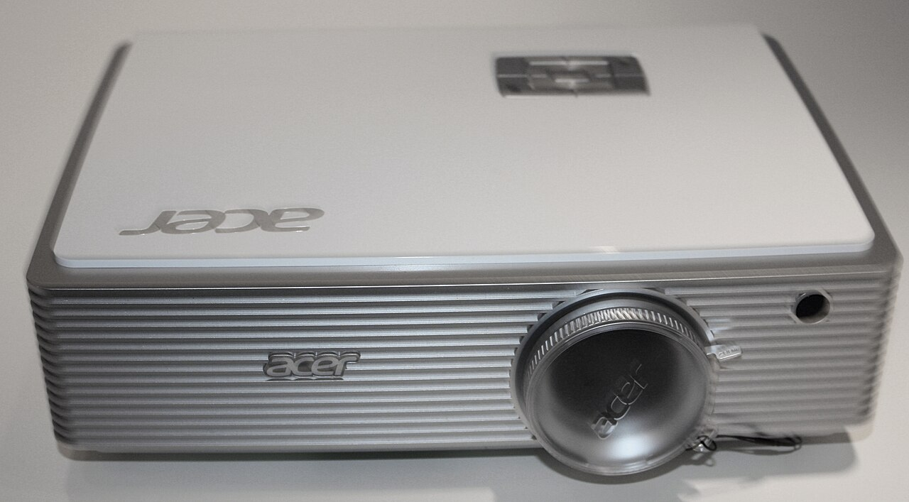
</p>

- **Purpose:** Casts a magnified image onto a large surface or screen.
- **How it works:** A light source shines through (or reflects off) an image-generating panel, projecting a magnified image through a lens.
- **Common Uses:** Presentations, classrooms, home theaters.

### 📈 Plotter

<p align="center">
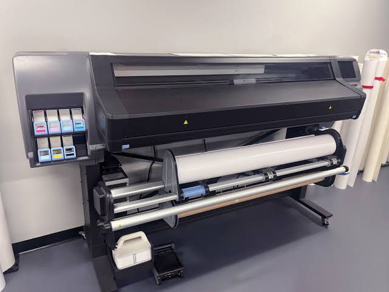
</p>

- **Purpose:** Produces precise vector-based drawings on large-format paper.
- **How it works:** A pen (or cutting tool) moves along X/Y axes, drawing continuous lines based on vector instructions.
- **Common Uses:** Architectural blueprints, engineering diagrams, large-format signage.

### 🥽 VR Headset

<p align="center">
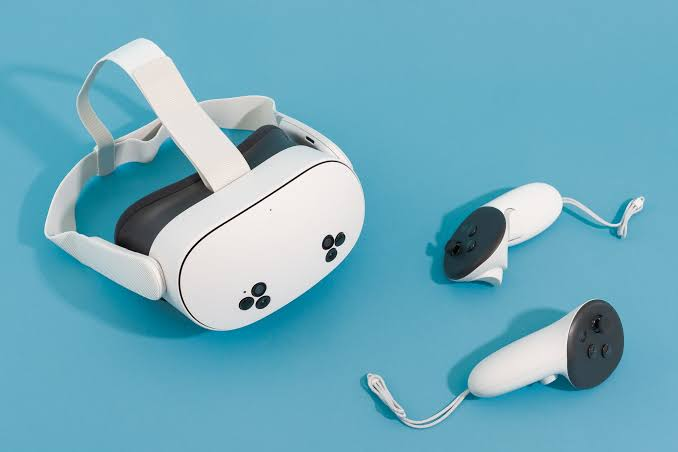
</p>

- **Purpose:** Delivers immersive, three-dimensional visual (and often audio) output.
- **How it works:** Two small displays (one per eye) render slightly different perspectives, combined with motion tracking to simulate depth and movement.
- **Common Uses:** Gaming, training simulations, virtual collaboration.

### 🧊 3D Printer (Brief Overview)

<p align="center">
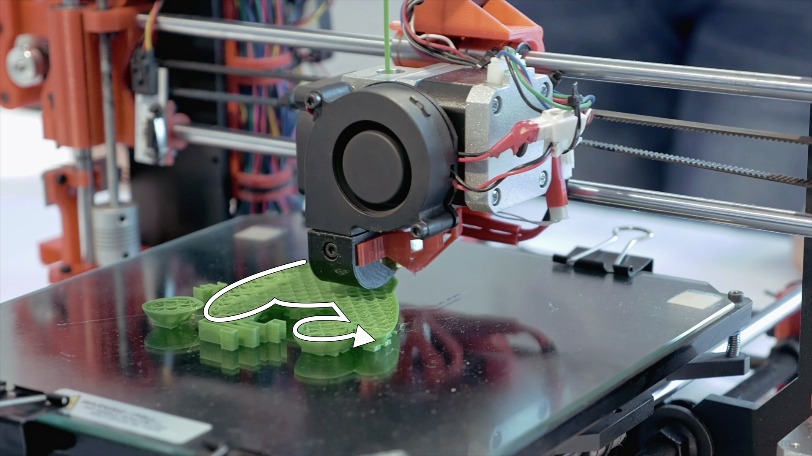
</p>

- **Purpose:** Produces physical, three-dimensional objects from digital models.
- **How it works:** Builds an object layer by layer, typically by extruding melted plastic filament (FDM) or curing resin with light (SLA).
- **Common Uses:** Prototyping, manufacturing, hobbyist creation.

---

## Input/Output Devices

Some peripherals both **send data to** and **receive data from** the computer, making them dual-purpose.

| Device | Input Role | Output Role |
|---|---|---|
| **Touchscreen** | Detects touch gestures | Displays visual content |
| **Multifunction Printer (MFP)** | Scans documents | Prints documents |
| **External Storage** | Receives written data | Provides read data back |
| **Network Devices** | Receives incoming network data | Sends outgoing network data |
| **Smart Displays** | Accepts voice/touch commands | Displays information and plays audio |

> 📝 **Note**
> A device qualifies as "I/O" when it genuinely performs both roles as part of its normal function — not simply because it has two separate ports for two separate purposes.

---

## Storage Peripherals

| Device | Purpose | Advantages | Disadvantages |
|---|---|---|---|
| **USB Flash Drive** | Small, portable flash-based storage | Compact, inexpensive, widely compatible | Limited capacity and speed vs. SSDs; easy to lose |
| **External HDD** | Large-capacity portable storage using spinning disks | High capacity per dollar | Slower, more fragile due to moving parts |
| **External SSD** | High-speed portable flash storage | Fast, durable, no moving parts | More expensive per GB than HDDs |
| **Memory Cards** | Compact storage for cameras, phones, and small devices | Extremely small, widely used in portable electronics | Small size increases risk of loss; limited durability under physical stress |
| **Optical Drives** | Read/write CDs, DVDs, or Blu-ray discs | Useful for long-term archival, media playback | Increasingly obsolete; slow compared to flash storage |
| **NAS Devices (Brief Overview)** | Network-Attached Storage providing shared storage over a network | Centralized access for multiple users/devices | Requires network setup and ongoing maintenance |

---

## Communication Peripherals

| Device | Purpose |
|---|---|
| **USB Wi-Fi Adapter** | Adds wireless networking capability to a device lacking built-in Wi-Fi |
| **Bluetooth Adapter** | Adds short-range wireless connectivity for accessories |
| **External Modem** | Converts digital data for transmission over telephone/cable/fiber lines |
| **Docking Stations** | Expands a laptop's connectivity by providing additional ports through a single connection |
| **USB Hubs** | Expands a single USB port into multiple available ports |
| **Thunderbolt Docks** | High-speed docking solutions supporting video, data, and power delivery simultaneously |

**Why communication peripherals matter:** Without them, a computer would be isolated — unable to reach networks, share data with other systems, or connect additional accessories beyond its built-in ports.

---

## Device Drivers

- **What drivers are:** Software components that allow the operating system to communicate with specific hardware.
- **Why they're needed:** Hardware manufacturers use proprietary internal designs; drivers translate those designs into a standard format the OS can work with.
- **Plug and Play (PnP):** A standard allowing the OS to automatically detect and configure a device the moment it's connected, often without user intervention.
- **Automatic Driver Installation:** Modern operating systems maintain built-in driver libraries and can fetch additional drivers online automatically.
- **Manual Installation:** Some specialized or older devices require downloading and installing a driver package directly from the manufacturer.
- **Driver Updates:** Manufacturers periodically release updated drivers to fix bugs, improve performance, or patch security vulnerabilities.
- **Compatibility:** A driver written for one OS version or architecture may not function on another — always verify compatibility before installing.

> ⚠️ **Warning**
> Only download drivers from official manufacturer websites. Third-party "driver update" tools are a common vector for bundled malware or adware.

---

## Connecting Peripheral Devices

| Connection Type | Common Use |
|---|---|
| **USB** | Universal standard for most peripherals (keyboards, storage, printers) |
| **Bluetooth** | Short-range wireless connection for accessories |
| **Wi-Fi** | Wireless connectivity for network-capable peripherals (printers, smart displays) |
| **Thunderbolt** | High-speed data, video, and power over a single cable |
| **HDMI** | Digital video and audio output to displays |
| **DisplayPort** | Digital video output, common in PC monitors |
| **Audio Connectors** | Analog audio input/output (3.5mm jacks) |
| **Wireless Receivers** | Dedicated USB dongles for proprietary wireless peripherals (e.g., wireless mice/keyboards) |

**How devices communicate with the OS:**

```
Physical Connection Established
          ↓
Electrical Signal Detected
          ↓
Device Identification (Vendor/Product ID)
          ↓
Driver Loaded (built-in or installed)
          ↓
OS Registers Device as Available
          ↓
Applications Can Now Access the Device
```

---

## Installing Peripheral Devices

1. **Connecting Hardware** — Physically attach the device via its supported connection (USB, Bluetooth pairing, Wi-Fi setup, etc.).
2. **Installing Drivers** — Allow automatic driver installation, or manually install from the manufacturer's package if required.
3. **Verifying Installation** — Check Device Manager (Windows) or System Information (macOS/Linux) to confirm the device is recognized without errors.
4. **Testing Functionality** — Perform a basic test (print a test page, speak into a mic, move a mouse) to confirm the device works as expected.
5. **Removing Devices Safely** — Use "Safely Remove Hardware" (or the OS equivalent) for storage devices to prevent data corruption; simply unplugging most non-storage peripherals is generally safe.

> ⚠️ **Warning**
> Removing a storage peripheral without safely ejecting it first can corrupt files that were still being written, even if no activity appears visible on screen.

---

## Common Peripheral Problems

| Problem | Likely Cause | Troubleshooting Steps |
|---|---|---|
| **Device not detected** | Faulty cable/port, driver missing | Try a different port/cable, reinstall drivers, restart the device |
| **Driver conflicts** | Outdated or mismatched driver versions | Update or roll back the driver, check manufacturer's compatibility list |
| **Poor performance** | Wrong USB version, outdated firmware | Use a USB 3.x port for high-speed devices, update firmware |
| **Connection failures** | Interference, damaged cable, low battery (wireless) | Replace cable, move closer to receiver, charge/replace batteries |
| **Printer offline** | Print spooler issue, network disconnect | Restart print spooler service, check network connection |
| **Keyboard not responding** | Loose connection, driver issue | Reconnect device, test on another port/machine |
| **Mouse lag** | Wireless interference, low battery, outdated driver | Change wireless channel, replace battery, update driver |
| **Monitor not displaying** | Loose cable, wrong input source selected | Check cable seating, verify correct input source on monitor |
| **USB device errors** | Power delivery issue, corrupted driver | Try a powered USB hub, reinstall the driver |
| **Bluetooth pairing failures** | Devices out of range, pairing mode not active | Ensure both devices are in pairing mode and within range |
| **Wireless interference** | Overlapping frequencies (Wi-Fi, Bluetooth, microwaves) | Change wireless channel, reduce nearby interference sources |

---

## Peripheral Devices in Cybersecurity

Peripherals are not just productivity tools — they are also physical **attack surfaces** that every cybersecurity professional must understand.

| Topic | Cybersecurity Relevance |
|---|---|
| **USB Security** | Unrestricted USB ports allow data exfiltration, malware injection, and unauthorized device connections |
| **BadUSB Attacks** | Reprogrammed USB device firmware can impersonate a trusted device type (e.g., a flash drive acting as a keyboard) to execute malicious commands |
| **Hardware Keyloggers** | Small physical devices inserted between a keyboard and computer to covertly record keystrokes |
| **Security Keys (FIDO/U2F)** | Physical authentication tokens providing strong, phishing-resistant multi-factor authentication |
| **Biometric Authentication** | Adds a strong authentication factor, but requires secure storage of biometric templates to prevent misuse |
| **Smart Cards** | Widely used for strong two-factor authentication in government and enterprise environments |
| **External Storage Risks** | Unencrypted removable drives can leak sensitive data if lost, stolen, or connected to a compromised machine |
| **Network Adapters** | Rogue or unauthorized adapters can be used to intercept or redirect network traffic |
| **Forensic Write Blockers** | Specialized hardware that allows investigators to examine storage devices without altering their data — critical for maintaining evidence integrity |
| **Hardware Tokens** | Physical devices generating time-based codes for authentication, offering an alternative to software-based MFA |

> 🛡️ **Cybersecurity Insight**
> A huge portion of hardware-based attacks rely on **implicit trust** — operating systems generally assume that a device claiming to be a keyboard *is* a keyboard. BadUSB attacks exploit exactly this assumption.

> ⚠️ **Ethical Note**
> Tools like Rubber Ducky, hardware keyloggers, and BadUSB devices exist for legitimate security research and authorized penetration testing. Using them against systems without explicit, documented permission is illegal in most jurisdictions. Always operate within an authorized scope of engagement.

---

## Peripheral Security Best Practices

- 🔌 **Disable unused ports when appropriate** — especially in high-security or shared environments.
- 🔄 **Keep device firmware updated** — vulnerabilities in peripheral firmware can be exploited just like software vulnerabilities.
- ✅ **Use trusted peripherals** — avoid unknown or unofficial hardware, especially from untrusted sources.
- 🔐 **Encrypt removable storage** — protects data if a drive is lost or stolen.
- 💾 **Safely eject storage devices** — prevents data corruption and file system errors.
- 🚫 **Avoid unknown USB devices** — never plug in a found or unsolicited USB device.
- 📶 **Secure wireless peripherals** — use encrypted wireless protocols (not legacy unencrypted RF) where possible.

---

## Common Beginner Misconceptions

- ⚠️ **"Every USB device works without drivers."** — Many common devices use built-in generic drivers, but specialized hardware often requires manufacturer-specific drivers.
- ⚠️ **"All USB ports provide the same speed and power."** — USB ports vary significantly by version (2.0 vs 3.x) and power delivery capability.
- ⚠️ **"Wireless peripherals are always more secure."** — Wireless connections can be intercepted or spoofed if not properly encrypted; wired connections avoid this risk entirely.
- ⚠️ **"Safely removing storage devices is unnecessary."** — Skipping this step risks file corruption, especially if data was still being written.
- ⚠️ **"Plugging in unknown USB devices is harmless."** — Unknown devices are a well-documented delivery method for malware and hardware-based attacks.

---

## Best Practices

- Choose peripherals from reputable manufacturers with a track record of firmware support.
- Match peripheral specifications (USB version, resolution, connector type) to your actual needs before purchasing.
- Regularly clean and maintain physical devices (keyboards, mice, printers) to extend their lifespan.
- Keep an inventory of connected peripherals in professional/enterprise environments for security auditing.
- Label and organize cables to simplify troubleshooting and reduce accidental disconnections.
- Retire and securely dispose of (or wipe) old storage peripherals rather than discarding them with data intact.

---

## Visual Learning

> 📌 The following diagrams and images are recommended to accompany this chapter. All images use a uniform width (~480px) so the document reads cleanly and consistently on GitHub.

<!-- 1. Keyboard layout diagram -->
<!-- 2. Mouse internal components diagram -->
<!-- 3. Flatbed scanner diagram -->
<!-- 4. Webcam components diagram -->
<!-- 5. Monitor rear I/O ports (HDMI, DisplayPort, VGA) -->
<!-- 6. Printer types comparison (inkjet vs laser) -->
<!-- 7. USB flash drive diagram -->
<!-- 8. External SSD photo/diagram -->
<!-- 9. Docking station with multiple ports -->
<!-- 10. USB hub photo -->
<!-- 11. Bluetooth adapter dongle -->
<!-- 12. Fingerprint reader close-up -->
<!-- 13. Smart card reader photo -->
<!-- 14. FIDO/U2F security key photo -->
<!-- 15. Device driver communication workflow diagram -->
<!-- 16. Peripheral communication flow (device → driver → OS → app) -->
<!-- 17. Barcode scanner in use -->
<!-- 18. Graphics tablet with stylus -->
<!-- 19. VR headset photo -->
<!-- 20. NAS device photo -->

---

## Practical Exercises

Try these hands-on activities to reinforce what you've learned:

1. **Identify all peripherals** connected to a computer you use regularly, and categorize each as input, output, or I/O.
2. **Install a printer** (physical or virtual/PDF) and print a test page.
3. **Connect a Bluetooth device** (headphones, mouse, or keyboard) and confirm successful pairing.
4. **Update a device driver** using Device Manager (Windows) or System Settings (macOS/Linux).
5. **Test a webcam and microphone** using your operating system's built-in camera/sound settings.
6. **Safely remove a USB storage device** using the correct eject procedure for your OS.
7. **Check Device Manager** (or equivalent) to view all currently installed peripherals and their driver status.

---

## Interview Questions

1. What is a peripheral device?
2. What is the difference between input and output devices?
3. What is Plug and Play (PnP), and how does it work?
4. Why are device drivers necessary for hardware to function?
5. What are the cybersecurity risks of connecting unknown USB devices?
6. What is a biometric device, and what are its advantages and disadvantages?
7. Explain the different types of external storage devices and their trade-offs.

---

## Quick Revision

| Category | Examples | Key Point |
|---|---|---|
| **Input** | Keyboard, mouse, scanner, webcam | Sends data *into* the computer |
| **Output** | Monitor, printer, speakers | Sends data *out* for the user to perceive |
| **I/O** | Touchscreen, MFP, external storage | Performs both input and output roles |
| **Storage** | USB drive, external SSD/HDD | Portable, external data storage |
| **Communication** | Wi-Fi adapter, docking station | Enables connectivity and expansion |
| **Drivers** | Software translators | Required for OS-hardware communication |
| **Security Risk** | BadUSB, hardware keyloggers | Physical peripherals can be attack vectors |

---

## Key Takeaways

- Peripheral devices extend a computer's core processing capability by adding senses (input), expression (output), or both.
- Every peripheral relies on a chain of communication: hardware → driver → operating system → application.
- Peripherals are categorized as input, output, input/output, storage, or communication devices, though some overlap categories.
- Device drivers are essential software translators; missing or outdated drivers are a leading cause of peripheral malfunctions.
- Peripherals connect via a range of standards — USB, Bluetooth, Wi-Fi, Thunderbolt, HDMI, DisplayPort — each suited to different needs.
- Peripherals represent real cybersecurity attack surfaces, from BadUSB attacks to hardware keyloggers, making physical security as important as software security.
- Following peripheral security best practices (trusted hardware, firmware updates, safe ejection, avoiding unknown devices) significantly reduces organizational risk.

---

## Further Reading

- [Microsoft Learn](https://learn.microsoft.com/) — official documentation on device drivers, Plug and Play, and Windows hardware management
- [USB Implementers Forum (USB-IF)](https://www.usb.org/) — official USB specifications and certification information
- [Bluetooth SIG](https://www.bluetooth.com/) — official Bluetooth specifications and developer resources
- [Logitech Support](https://www.logitech.com/support) — official peripheral documentation and driver downloads
- [HP Support](https://support.hp.com/) — official printer and peripheral documentation
- [Canon Support](https://www.canon.com/support/) — official scanner and printer documentation
- [Epson Support](https://epson.com/support) — official printer and scanner documentation

---

## Next Chapter

This chapter covered the peripheral devices that let a computer sense, express, store, and communicate with the outside world. But knowing what these devices *are* is only half the job — every IT professional eventually needs to diagnose *why* one has stopped working.

The next chapter brings together everything learned throughout the Computer Hardware section and teaches a **systematic approach to diagnosing and resolving hardware problems**, using structured troubleshooting methodologies, diagnostic tools, and best practices commonly used by IT professionals in the field.

➡️ **Continue to:** **[Hardware Troubleshooting](../15-Hardware-Troubleshooting/)**

------
------
