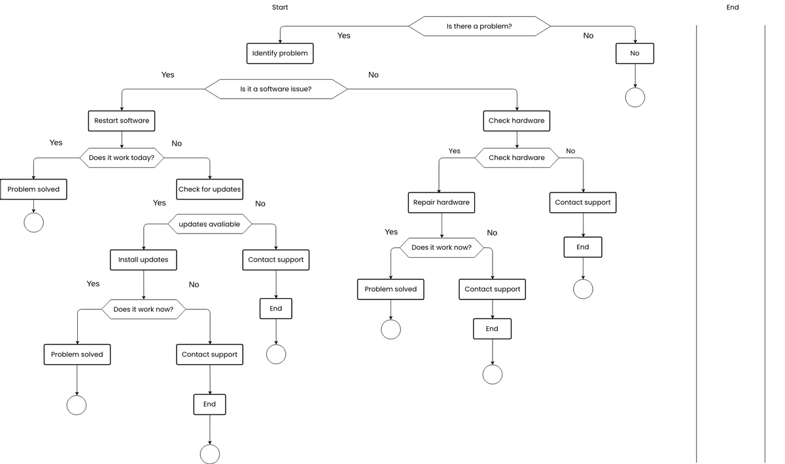
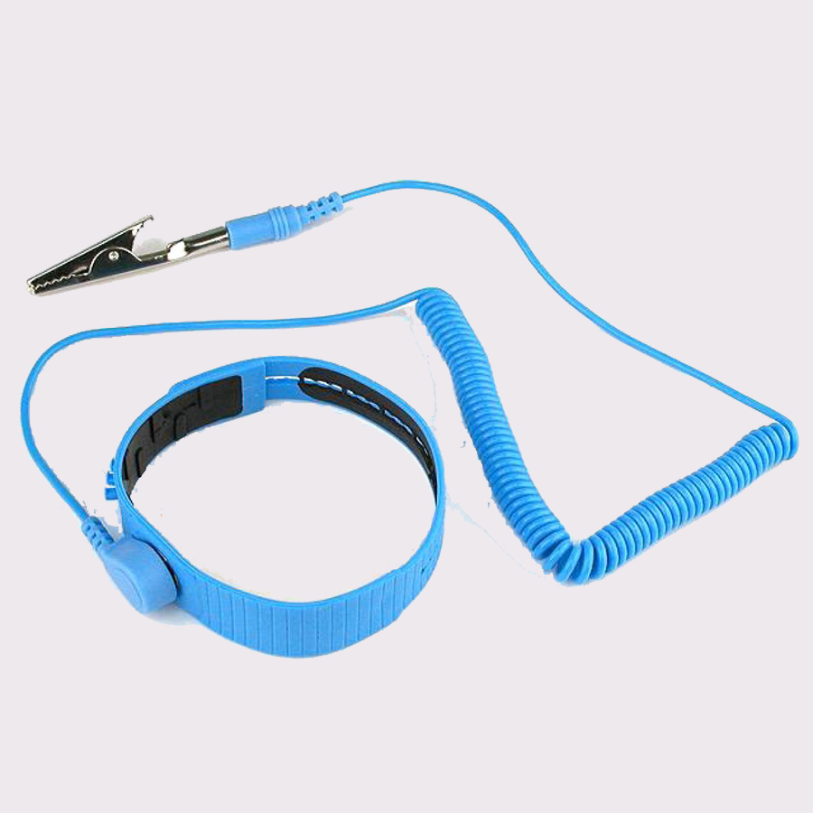
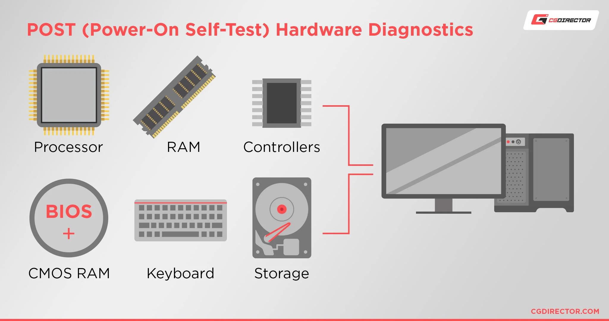
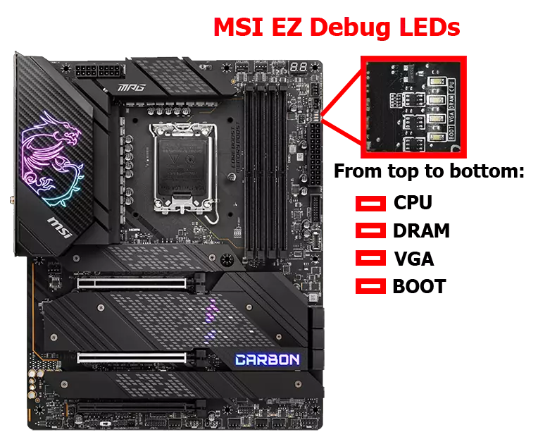
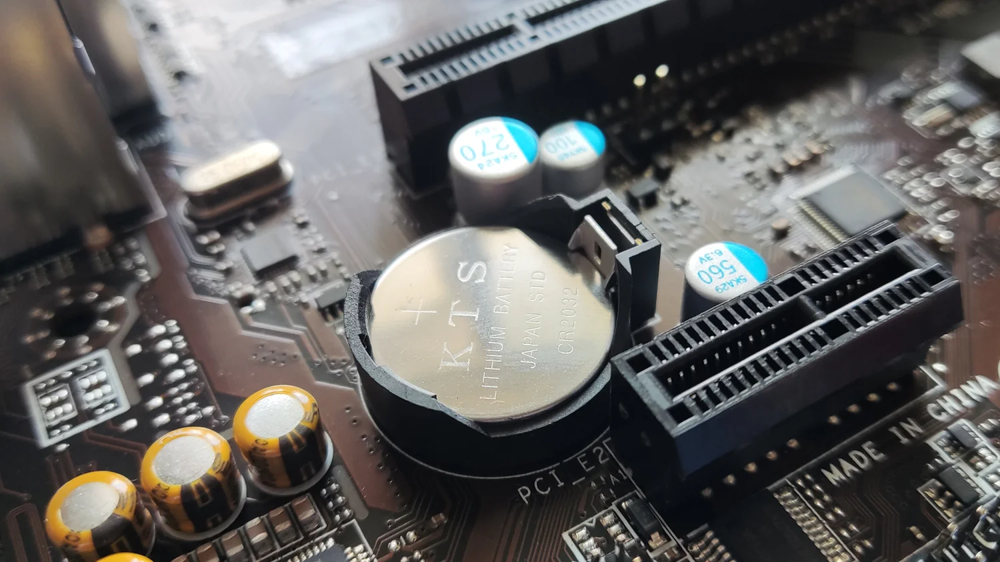

# 🛠️ Hardware Troubleshooting

> A structured, beginner-friendly guide to diagnosing and fixing computer hardware problems — the foundation of every IT and cybersecurity career.

---

## 🎯 Learning Objectives

By the end of this chapter, you will be able to:

- Apply a structured troubleshooting methodology to any hardware problem.
- Diagnose common hardware failures using logic instead of guesswork.
- Use hardware diagnostic tools safely and correctly.
- Recognize symptoms of failing components before they cause bigger problems.
- Troubleshoot desktops, laptops, and peripheral devices.
- Understand and apply preventive maintenance practices.
- Decide when hardware should be repaired versus replaced.
- Explain why troubleshooting skills matter in cybersecurity roles.

---

## 📑 Table of Contents

- [Introduction](#introduction)
- [What is Hardware Troubleshooting?](#what-is-hardware-troubleshooting)
- [Safety First](#safety-first)
- [The Troubleshooting Methodology](#the-troubleshooting-methodology)
- [Essential Diagnostic Tools](#essential-diagnostic-tools)
- [BIOS & POST Troubleshooting](#bios--post-troubleshooting)
- [Power Problems](#power-problems)
- [CPU Problems](#cpu-problems)
- [RAM Problems](#ram-problems)
- [Storage Problems](#storage-problems)
- [GPU Problems](#gpu-problems)
- [Motherboard Problems](#motherboard-problems)
- [Cooling Problems](#cooling-problems)
- [Peripheral Troubleshooting](#peripheral-troubleshooting)
- [Laptop Troubleshooting](#laptop-troubleshooting)
- [Network Hardware Troubleshooting](#network-hardware-troubleshooting)
- [Common Error Messages](#common-error-messages)
- [Preventive Maintenance](#preventive-maintenance)
- [Troubleshooting in Cybersecurity](#troubleshooting-in-cybersecurity)
- [Common Beginner Mistakes](#common-beginner-mistakes)
- [Best Practices](#best-practices)
- [Visual Learning](#visual-learning)
- [Practical Exercises](#practical-exercises)
- [Troubleshooting Scenarios](#troubleshooting-scenarios)
- [Interview Questions](#interview-questions)
- [Quick Revision](#quick-revision)
- [Key Takeaways](#key-takeaways)
- [Further Reading](#further-reading)
- [Congratulations](#congratulations)

---

## Introduction

Every computer eventually breaks. A fan stops spinning, a drive starts clicking, a laptop won't charge, or a desktop refuses to boot. **Hardware troubleshooting** is the skill of figuring out *why* — and fixing it — in a way that is fast, safe, and reliable.

This matters for every IT professional, not just repair technicians. A **help desk agent** needs it to resolve tickets quickly. A **system administrator** needs it to keep servers online. A **cybersecurity analyst** needs it to tell the difference between a failing hard drive and a compromised one. Hardware knowledge is the floor that every other IT and security skill stands on — you cannot secure, patch, or monitor a machine you don't understand.

The biggest mistake beginners make is **guessing**. They swap parts at random, reinstall the operating system "just in case," or replace an entire computer when a $5 cable was the problem. This wastes time, wastes money, and often doesn't even fix the issue.

The alternative is a **structured process**: observe symptoms, form a theory, test it, and confirm the fix. This approach is faster than guessing because it eliminates possibilities systematically instead of randomly. It also reduces **downtime** (the time a system is unusable) and prevents unnecessary hardware replacement, which saves money and reduces electronic waste.

By the end of this chapter, you won't just know facts about hardware — you'll know how to *think* like a troubleshooter.

<p align="center">

<br><i>Troubleshooting flowchart</i>
</p>

---

## What is Hardware Troubleshooting?

**Hardware troubleshooting** is the process of identifying, diagnosing, and resolving physical problems with computer components — as opposed to problems caused purely by software.

### The Diagnostic Process

Troubleshooting is essentially detective work. You gather evidence (symptoms), form a hypothesis (probable cause), and test that hypothesis until you find the truth (root cause).

- **Symptom**: What the user or technician observes. Example — "The computer won't turn on."
- **Cause**: The actual underlying problem. Example — "The power supply unit (PSU) has failed."

A single symptom can have many possible causes. "No display" could mean a dead monitor, a loose cable, a failed GPU, faulty RAM, or a dead motherboard. This is why jumping to conclusions is dangerous — you must narrow down the possibilities methodically.

### Root Cause Analysis

**Root cause analysis** means finding the *original* source of a problem rather than just patching a symptom. If a computer keeps overheating and shutting down, reapplying thermal paste might fix it — but if the real cause is a dust-clogged case with no airflow, the overheating will return. Good troubleshooting fixes the root cause, not just the visible symptom.

### Hardware vs. Software Problems

Many issues *look* like hardware failures but are actually software problems, and vice versa. Learning to tell them apart quickly saves enormous time.

| Symptom | Could Be Hardware | Could Be Software |
|---|---|---|
| Computer won't boot | Dead PSU, bad RAM, failed motherboard | Corrupted OS files, bad update |
| Random freezes | Overheating CPU, failing RAM | Driver conflict, malware |
| No display | Dead GPU, loose cable | Bad graphics driver |
| Slow performance | Failing HDD, insufficient RAM | Malware, too many startup programs |

> 💡 **Tip:** A good rule of thumb — if a problem happens *before* the operating system loads (during POST, discussed later), it's almost always hardware. If it happens *after* Windows or Linux has started, it could be either.

---

## Safety First

Before touching any internal components, safety must come first — for both **you** and the **hardware**.

### ⚡ Electrostatic Discharge (ESD)

**ESD (Electrostatic Discharge)** is a sudden flow of static electricity between two objects. Your body can build up thousands of volts of static electricity just by walking across a carpet — enough to silently destroy a CPU, RAM stick, or motherboard, even if you don't feel a shock.

> ⚠️ **Warning:** ESD damage is often invisible. A component can look fine but fail days or weeks later.

**How to prevent ESD:**
- Wear an **anti-static wrist strap** clipped to an unpainted metal part of the case.
- Work on a hard, non-carpeted surface.
- Touch a grounded metal object before handling components if no strap is available.
- Keep components in **anti-static bags** until ready to install.
- Avoid wearing loose synthetic clothing while working inside a case.
<p align="center">

<br><i>ESD protection (anti-static wrist strap in use)</i>
</p>

### 🔌 Power Safety

- Always **power off and unplug** the system before opening the case.
- Press the power button after unplugging to discharge residual electricity.
- Never open a **power supply unit (PSU)** — capacitors inside can hold a lethal charge even when unplugged.
- Keep liquids away from the workspace.

### 🖥️ Working Inside a Computer Safely

- Handle components by their edges, never touch gold connectors or chips directly.
- Keep track of screws — use a small tray or magnetic mat.
- Avoid excessive force; components should fit without being forced.
- Work in a well-lit area.

### 🔋 Laptop Battery Precautions

- Laptop batteries (lithium-ion) can be dangerous if punctured, bent, or overheated.
- A swollen battery should be treated as a hazard — stop using the device and dispose of it properly.
- Always remove or disconnect the battery before internal repairs if possible.

> ⚠️ **Note:** Never puncture, bend, or expose a lithium-ion battery to heat. Damaged batteries can catch fire.

---

## The Troubleshooting Methodology

This is the **industry-standard troubleshooting process**, used across CompTIA A+ and real-world IT jobs. It applies to almost any hardware (or even software) problem.

```
 ┌─────────────────────────────┐
 │ 1. Identify the Problem     │
 └──────────────┬──────────────┘
                ▼
 ┌─────────────────────────────┐
 │ 2. Theory of Probable Cause │
 └──────────────┬──────────────┘
                ▼
 ┌─────────────────────────────┐
 │ 3. Test the Theory          │
 └──────────────┬──────────────┘
        ┌───────┴────────┐
        ▼                ▼
   Confirmed         Not Confirmed
        │             (new theory)
        ▼                │
 ┌─────────────────────────────┐
 │ 4. Plan of Action           │
 └──────────────┬──────────────┘
                ▼
 ┌─────────────────────────────┐
 │ 5. Implement the Solution   │
 └──────────────┬──────────────┘
                ▼
 ┌─────────────────────────────┐
 │ 6. Verify Full Functionality│
 └──────────────┬──────────────┘
                ▼
 ┌─────────────────────────────┐
 │ 7. Document Findings        │
 └─────────────────────────────┘
```

### 1. Identify the Problem
Gather information: ask the user what happened, what changed recently, and reproduce the issue if possible.
*Example: "The PC restarts randomly during gaming."*

### 2. Establish a Theory of Probable Cause
Start with the most obvious/common cause first (Occam's Razor).
*Example: Overheating CPU is more likely than a failing motherboard.*

### 3. Test the Theory
Confirm or rule it out using monitoring tools or simple tests.
*Example: Monitor CPU temperature under load using HWiNFO.*

### 4. Establish a Plan of Action
Decide the exact fix and any needed resources (parts, downtime, backups).

### 5. Implement the Solution
Apply the fix — reseat a component, replace a part, update a driver.

### 6. Verify Full System Functionality
Don't stop at "it works now." Stress-test to confirm the problem is truly gone and nothing else broke.

### 7. Document Findings
Record the problem, cause, and solution. This builds a knowledge base and helps with future, similar issues — critical in professional IT and security environments.

---

## Essential Diagnostic Tools

| Tool | Purpose |
|---|---|
| **Multimeter** | Measures voltage, current, and resistance — used to test PSU output and cable continuity. |
| **POST Card** | Plugs into a PCIe/legacy slot and displays a hex code showing exactly where the boot process failed. |
| **Power Supply Tester** | Quickly checks whether a PSU is outputting correct voltages on all rails. |
| **Cable Tester** | Verifies network (Ethernet) cables are wired correctly and not damaged. |
| **Loopback Adapter** | Tests whether a network port (NIC) is functioning by looping signal back to itself. |
| **Flashlight** | Essential for inspecting dark case interiors for damage, dust, or loose connections. |
| **Compressed Air** | Removes dust from fans, heatsinks, and vents without introducing moisture. |
| **Thermal Paste** | Improves heat transfer between the CPU/GPU and the heatsink; degrades over time. |
| **Screwdriver Kit** | Precision screwdrivers (Phillips, Torx, flathead) for opening cases and laptops. |
| **Anti-static Tools** | Wrist straps and mats to prevent ESD damage during repairs. |
| **USB Recovery Drive** | Bootable USB with OS installer or diagnostic/recovery tools. |
| **Diagnostic Software** | Tools like MemTest86, CrystalDiskInfo, and HWiNFO for deeper system checks. |

> 💡 **Tip:** You don't need every tool to start troubleshooting — a screwdriver, flashlight, and multimeter cover most beginner scenarios.

---

## BIOS & POST Troubleshooting

The **BIOS (Basic Input/Output System)** or its modern replacement, **UEFI (Unified Extensible Firmware Interface)**, is the firmware that initializes hardware before the operating system loads.

### The POST Process

**POST (Power-On Self-Test)** is a diagnostic sequence the BIOS runs every time the computer powers on. It checks the CPU, RAM, GPU, and other essential components before handing control to the OS.

<p align="center">

<br><i>POST process overview</i>
</p>

### Beep Codes

If POST fails before video output is available, the motherboard communicates through **beep codes** — a pattern of beeps indicating the failure type. Beep patterns vary by BIOS manufacturer (AMI, Award, Phoenix), so always check the motherboard manual.

| Beep Pattern (typical AMI BIOS) | Meaning |
|---|---|
| 1 short beep | Normal POST, no errors |
| Continuous beeping | RAM not detected/seated |
| 1 long, 2 short | Video card error |
| Repeating short beeps | Power supply issue |

### Diagnostic LEDs

Many modern motherboards include onboard LEDs labeled CPU, DRAM, VGA, and BOOT that light up to indicate which component failed POST — much easier to read than beep codes.

<p align="center">

<br><i>Diagnostic LEDs</i>
</p>

### Boot Failures & BIOS Reset

If a system won't boot into BIOS at all, or displays incorrect settings, a **BIOS reset** (clearing CMOS) restores factory defaults.

**How to reset CMOS:**
1. Power off and unplug the PC.
2. Locate the small round **CMOS battery** (CR2032) on the motherboard.
3. Remove it for 1–2 minutes, or use the "Clear CMOS" jumper/button if available.
4. Reinsert and power on.

### CMOS Battery

The **CMOS battery** keeps BIOS settings (like date/time) saved when the PC is powered off. A dying battery causes the system clock to reset and BIOS settings to revert every time the PC is unplugged.

<p align="center">

<br><i>CMOS Battery</i>
</p>

### Secure Boot & Boot Order

**Secure Boot** is a UEFI security feature that only allows trusted, signed operating systems to load — important in cybersecurity contexts to prevent bootkits. **Boot order** determines which device (SSD, USB, network) the system tries to boot from first; incorrect order is a very common cause of "No Boot Device" errors.

---

## Power Problems

| Symptom | Likely Causes | Diagnostic Steps |
|---|---|---|
| Computer won't turn on | Dead PSU, unplugged cables, faulty power button | Check wall outlet, test PSU with a tester, verify 24-pin and CPU power cables are seated |
| Random shutdowns | Overheating, failing PSU, power cycling | Monitor temps, test PSU output under load |
| No display but PC powers on | Loose GPU/monitor cable, GPU failure | Reseat cables and GPU, test with integrated graphics |
| Power cycling (turns on, off, on) | PSU protection triggered by a short or bad component | Disconnect non-essential components and retest |
| Loose cables | Poor seating during past repairs/shipping | Reseat all internal power cables |

**Laptop charging issues** are often caused by a damaged charging port, worn-out cable, or a failing battery. Test with a known-good charger first — it's the cheapest and most common fix.

> 💡 **Tip:** Always start power troubleshooting with the simplest possible cause — is it actually plugged in and switched on at the wall?

---

## CPU Problems

The **CPU (Central Processing Unit)** rarely fails outright, but poor cooling or installation issues cause serious symptoms.

- **Overheating** — CPU running hotter than manufacturer specs, often due to dried thermal paste or blocked airflow.
- **Thermal throttling** — the CPU automatically slows itself down to prevent damage from excess heat, causing sudden performance drops.
- **Bent pins** — on CPUs or sockets with pins, bent pins prevent proper contact and can stop the system from booting entirely.
- **Incorrect installation** — CPU not fully seated or the retention latch not locked.
- **System freezes** — can result from overheating or an unstable CPU.

**Diagnostic steps:**
1. Check CPU temperature at idle and under load using HWiNFO.
2. Reseat the CPU cooler with fresh thermal paste if temps are abnormally high.
3. Inspect the socket for bent pins with a flashlight (power off first).
4. Test with default BIOS settings if the CPU was overclocked.

---

## RAM Problems

**RAM (Random Access Memory)** issues are among the most common — and most misdiagnosed — hardware problems.

- **BSOD (Blue Screen of Death)** — a Windows crash screen often triggered by memory errors.
- **Random crashes** — applications or the OS crashing unpredictably.
- **Failure to boot** — system won't POST if RAM is badly seated or dead.

**Diagnostic steps:**
1. **Reseat memory** — remove and firmly reinsert each RAM stick.
2. **Single-stick testing** — if multiple sticks are installed, test with one at a time to isolate a faulty module.
3. **Test with MemTest86** — a bootable tool that runs extensive memory tests over several passes to detect errors.

> 💡 **Tip:** If a PC won't boot with 2 sticks installed but boots fine with just one, you likely have a bad stick or a bad slot — test each stick in each slot to be sure.

---

## Storage Problems

| Drive Type | Common Failures |
|---|---|
| **HDD (Hard Disk Drive)** | Clicking noises, bad sectors, slow read/write, mechanical failure |
| **SSD (Solid State Drive)** | Sudden disconnects, firmware bugs, wear-related failure over time |

- **SMART errors** — **S.M.A.R.T. (Self-Monitoring, Analysis, and Reporting Technology)** is built into drives to predict failure before it happens. Tools like CrystalDiskInfo read this data.
- **Slow performance** — could indicate a failing drive, a nearly-full drive, or a drive running in the wrong mode (e.g., SATA drive misconfigured).
- **Corrupted partitions** — often caused by improper shutdowns or failing sectors.
- **Missing drives** — not detected in BIOS, often a cable or power connection issue.
- **Bad sectors** — physically or logically damaged areas of a drive that can no longer store data reliably.

**Diagnostic steps:**
1. Check SMART status with CrystalDiskInfo.
2. Verify SATA/power cables are firmly connected.
3. Test the drive in another system or enclosure if it's not detected.
4. Back up data immediately upon any failure warning — drives can fail completely with little notice.

---

## GPU Problems

The **GPU (Graphics Processing Unit)** renders images for the display.

- **No display** — could be a dead GPU, loose cable, or wrong display input selected.
- **Artifacts** — visual glitches like flickering textures or colored squares, usually indicating GPU overheating or damage.
- **Driver issues** — outdated or corrupted graphics drivers causing crashes or poor performance.
- **Overheating** — dust buildup or dried thermal paste on the GPU.
- **Insufficient power** — GPU not receiving enough wattage from the PSU, especially with high-end cards.
- **Display flickering** — loose cable, failing GPU, or driver conflict.

**Diagnostic steps:**
1. Reseat the GPU in its PCIe slot.
2. Test with the motherboard's **integrated graphics** (if available) to rule out the GPU entirely.
3. Check PCIe power cables are fully connected.
4. Roll back or reinstall graphics drivers.

---

## Motherboard Problems

The **motherboard** connects every component together, so its failures can mimic almost any other hardware problem.

- **Failed capacitors** — small cylindrical components that can bulge or leak when failing; visible with a flashlight.
- **Damaged traces** — the thin copper pathways on the board; damage here can cause seemingly random failures.
- **BIOS corruption** — firmware becomes corrupted, often from a failed update, preventing boot.
- **Faulty PCIe slots** — GPU or expansion cards not detected despite being properly seated.
- **USB failures** — front or rear USB ports stop working.
- **No POST** — the system shows no signs of starting the boot process at all.
- **Chipset failures** — the chipset manages communication between CPU, RAM, and peripherals; failure causes widespread instability.

> ⚠️ **Note:** Motherboard problems are diagnosed by elimination — test known-good components (PSU, RAM, GPU) in the system, and test the motherboard's components in another system if possible.

---

## Cooling Problems

Heat is one of the biggest enemies of computer hardware.

- **Overheating** — components running above safe temperature thresholds.
- **Dust buildup** — insulates components and blocks airflow, a leading cause of overheating.
- **Fan failures** — worn bearings or dead motors causing fans to slow or stop.
- **Thermal paste issues** — dried-out paste loses its ability to transfer heat effectively over 2–5 years.
- **Pump failures** — in liquid cooling systems, a failed pump quickly leads to severe overheating.
- **Poor airflow** — badly arranged cables or case fans that don't create a clear intake/exhaust path.
- **Thermal throttling** — the resulting performance drop when a CPU/GPU overheats.

**Preventive steps:** clean dust every 3–6 months, ensure case fans create proper front-to-back or bottom-to-top airflow, and replace thermal paste every 2–3 years.

---

## Peripheral Troubleshooting

| Device | Common Issues | Quick Fixes |
|---|---|---|
| **Keyboard** | Unresponsive keys, not detected | Try a different USB port, check for debris under keys |
| **Mouse** | Cursor lag, not detected | Clean sensor, replace batteries (wireless), try different port |
| **Printer** | Paper jams, not printing, offline status | Check paper path, reinstall driver, verify network connection |
| **Monitor** | No signal, flickering | Check cable, try different input, test on another PC |
| **Webcam** | Not detected, poor image | Update driver, check privacy/app permissions |
| **Scanner** | Not detected, poor scan quality | Reinstall driver, clean glass surface |
| **Speakers** | No sound, distorted audio | Check default output device, test cables |
| **USB devices** | Not recognized | Try different port, check Device Manager for driver errors |
| **Bluetooth devices** | Won't pair | Restart Bluetooth service, remove and re-pair device |
| **Network adapters** | No connectivity | Check driver, restart adapter, verify cable/Wi-Fi signal |

---

## Laptop Troubleshooting

Laptops combine all desktop components into a compact, harder-to-repair form factor.

- **Battery problems** — reduced capacity over time is normal; sudden drops or swelling are not.
- **Charging issues** — often the charging port or cable rather than the battery itself.
- **Overheating** — laptops have limited airflow, making dust buildup especially damaging.
- **Broken keyboard** — spilled liquid or physical damage to individual keys.
- **Damaged display** — cracked screens, dead pixels, or flickering from a loose display cable.
- **Touchpad issues** — unresponsive or erratic cursor movement, often a driver or setting issue.
- **Wi-Fi problems** — can stem from a driver, an internal antenna cable, or the wireless card itself.
- **Hinge damage** — repeated opening/closing can crack the plastic around hinges over years of use.

> ⚠️ **Note:** Laptops have far less standardized, harder-to-access internals than desktops. Always check the manufacturer's service manual before disassembly.

---

## Network Hardware Troubleshooting

- **Ethernet cable issues** — damaged or miscategorized cables (e.g., Cat5 vs Cat6) causing slow or dropped connections.
- **NIC (Network Interface Card) failures** — the hardware component that connects a PC to a network; failure means no wired connectivity.
- **Wi-Fi adapters** — internal or USB devices enabling wireless connectivity; can fail or need driver updates.
- **Routers** — devices that direct traffic between networks; a simple power cycle fixes many issues.
- **Switches** — connect multiple wired devices on a local network; a dead port can be mistaken for a PC issue.
- **Link lights** — small LEDs on NICs/switches indicating an active connection; no light usually means a cable or port problem.
- **Cable testing** — using a cable tester to confirm all 8 wires in an Ethernet cable are correctly connected.

---

## Common Error Messages

| Error Message | Typical Cause |
|---|---|
| `No Boot Device` | Drive not detected, wrong boot order, dead drive |
| `Disk Read Error` | Corrupted partition, failing drive, loose cable |
| `Memory Error` | Faulty or improperly seated RAM |
| `CMOS Checksum Error` | Dead CMOS battery or corrupted BIOS settings |
| `CPU Fan Error` | Fan disconnected, failed, or not detected by motherboard |
| `SMART Failure` | Drive predicting its own imminent failure |
| `USB Device Not Recognized` | Driver issue, faulty port, or failing device |
| `No Signal` | Cable disconnected, wrong input, GPU failure |

---

## Preventive Maintenance

Preventing problems is always cheaper and faster than fixing them.

- **Cleaning dust** every 3–6 months with compressed air.
- **Updating firmware** (BIOS/UEFI) to fix bugs and improve compatibility.
- **Replacing thermal paste** every 2–3 years.
- **Cable management** for better airflow and easier troubleshooting later.
- **Monitoring temperatures** regularly with tools like HWiNFO.
- **Checking SMART data** periodically to catch failing drives early.
- **Battery care** — avoid extreme heat and, for laptops, occasional full discharge cycles.
- **Regular backups** — the single most important habit for minimizing damage from any hardware failure.

---

## Troubleshooting in Cybersecurity

Hardware troubleshooting skills directly support cybersecurity work:

- **SOC analysts** need to distinguish real hardware failures from signs of compromise (e.g., unexplained disk activity).
- **Incident responders** often need to safely handle, image, or preserve compromised hardware.
- **Digital forensics** professionals must understand storage hardware to recover and analyze data without corruption.
- **Malware analysis labs** rely on properly functioning isolated hardware/VMs to safely detonate malware.
- **Server administrators** keep critical infrastructure available by quickly diagnosing hardware failures.
- **Cloud engineers** still need to understand the physical layer underlying virtualized infrastructure.
- **Hardware security** involves protecting against physical attacks like tampering or malicious USB devices.
- Reliable **security infrastructure** — firewalls, IDS/IPS appliances, and servers — depends on the same troubleshooting fundamentals covered in this chapter.

> 💡 In short: you cannot secure what you don't understand. Hardware fluency makes every other security skill sharper.

---

## Common Beginner Mistakes

⚠️ Replacing hardware before diagnosing the problem.

⚠️ Ignoring error messages instead of researching them.

⚠️ Forgetting to disconnect power before opening a case.

⚠️ Touching components without ESD protection.

⚠️ Assuming every issue is caused by software (or vice versa).

⚠️ Not documenting changes, making future troubleshooting harder.

---

## Best Practices

- Always start with the simplest, most likely cause first.
- Change **one variable at a time** so you know exactly what fixed the problem.
- Keep a log of every repair, including dates and parts used.
- Back up data before any repair that risks data loss.
- Use manufacturer documentation and official resources whenever available.
- Test thoroughly after every fix — don't assume it's resolved.
- When in doubt, isolate: strip the system down to minimal components (CPU, one RAM stick, PSU, motherboard) and rebuild step by step.

---

---

## Practical Exercises

1. Diagnose a PC that will not power on using the 7-step methodology.
2. Check RAM health using MemTest86.
3. Verify SSD/HDD health using SMART data (CrystalDiskInfo).
4. Monitor CPU and GPU temperatures under load using HWiNFO.
5. Identify a faulty power supply using a PSU tester or multimeter.
6. Troubleshoot a non-working USB device via Device Manager.
7. Reset BIOS settings by clearing CMOS.
8. Physically remove, reseat, and retest a RAM module.
9. Write a short documentation report for a completed troubleshooting case.

---

## Troubleshooting Scenarios

**1. Problem:** Computer powers on but shows no display.
**Diagnosis:** Check monitor cable and input source → reseat GPU → test with integrated graphics → check GPU power cables.

**2. Problem:** PC restarts randomly during gaming.
**Diagnosis:** Monitor CPU/GPU temperatures → check PSU wattage is sufficient → test with default (non-overclocked) settings.

**3. Problem:** Laptop won't charge.
**Diagnosis:** Test with a different charger → inspect charging port for damage → check battery health in BIOS/OS.

**4. Problem:** Computer beeps continuously and won't boot.
**Diagnosis:** Check beep code meaning → reseat RAM → test with a single stick in different slots.

**5. Problem:** Blue Screen of Death appears intermittently.
**Diagnosis:** Run MemTest86 → check for overheating → update/rollback drivers → check Event Viewer logs.

**6. Problem:** Hard drive makes clicking noises.
**Diagnosis:** Back up data immediately → check SMART status → replace drive if failure is confirmed.

**7. Problem:** USB device not recognized on any port.
**Diagnosis:** Test device on another PC → check Device Manager for driver errors → try a different cable.

**8. Problem:** System clock keeps resetting.
**Diagnosis:** Replace the CMOS battery → reconfigure BIOS date/time and settings.

**9. Problem:** Printer shows "offline" despite being powered on.
**Diagnosis:** Check network/USB connection → restart print spooler service → reinstall driver.

**10. Problem:** New RAM installed but system won't boot.
**Diagnosis:** Verify RAM compatibility (speed/type) → reseat modules firmly → test one stick at a time.

---

## Interview Questions

- What are the seven steps of the troubleshooting methodology?
- What is ESD, and how do you protect against it?
- How would you troubleshoot a computer that does not boot?
- What causes thermal throttling, and how do you fix it?
- How do you identify faulty RAM?
- What are SMART errors, and why do they matter?
- How do you diagnose a failing power supply?
- Why is documenting troubleshooting steps important in a professional environment?

---

## Quick Revision

| Category | Key Tool | Key Symptom | First Check |
|---|---|---|---|
| Power | PSU Tester | Won't turn on | Cables & outlet |
| CPU | HWiNFO | Overheating/throttling | Thermal paste & cooler seating |
| RAM | MemTest86 | BSOD, no boot | Reseat & single-stick test |
| Storage | CrystalDiskInfo | Slow, clicking, SMART errors | SMART status & cables |
| GPU | Integrated graphics swap | No display, artifacts | Reseat card & cables |
| Motherboard | Elimination testing | No POST | Test known-good parts |
| Cooling | Compressed air | Overheating | Dust & fan function |
| Network | Cable tester | No connectivity | Cable & link lights |

---

## Key Takeaways

- Hardware troubleshooting is a **structured process**, not guesswork.
- Always follow the **7-step methodology**: identify, theorize, test, plan, implement, verify, document.
- **Safety first** — ESD protection and power safety prevent injury and further damage.
- Most problems can be narrowed down using **simple, low-cost checks** before replacing parts.
- **Documentation** turns individual fixes into reusable knowledge.
- Hardware fluency is a foundational skill for **cybersecurity, IT support, and systems administration** careers.

---

## Further Reading

- [CompTIA A+ Certification](https://www.comptia.org/certifications/a)
- [Microsoft Learn](https://learn.microsoft.com/)
- [Intel Support](https://www.intel.com/content/www/us/en/support.html)
- [AMD Support](https://www.amd.com/en/support)
- [MemTest86](https://www.memtest86.com/)
- [CrystalDiskInfo](https://crystalmark.info/en/software/crystaldiskinfo/)
- [HWiNFO](https://www.hwinfo.com/)

---

## Congratulations

🎉 You have completed the **Computer Hardware** module!

Over this journey, you've built a solid foundation covering **Computer Architecture**, the **CPU**, **Motherboard**, **RAM**, **Storage**, **GPU**, **Power Supply**, **Cooling**, **Expansion Cards**, **Ports & Connectors**, **BIOS & UEFI**, **Mobile Devices**, **Peripheral Devices**, and now **Hardware Troubleshooting**.

This knowledge isn't just academic — it's the physical-layer foundation that every cybersecurity, IT support, and systems administration skill is built on. You now understand not just *what* hardware is, but *how* to diagnose and fix it when things go wrong.
## 🚀 Next Module

Congratulations on completing the **Computer Hardware** section!

Now it's time to learn how computers communicate with each other across local networks and the Internet.

➡️ **Continue to:** **[Networking](../../02-Networking/README.md)**
------
