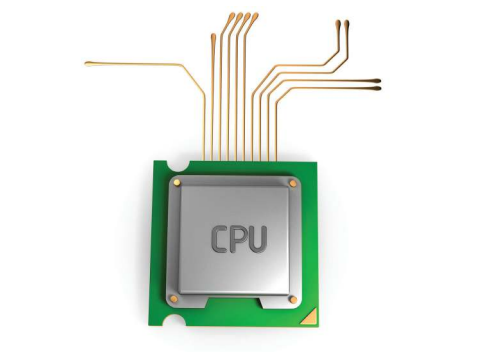
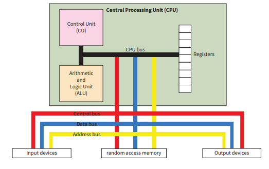
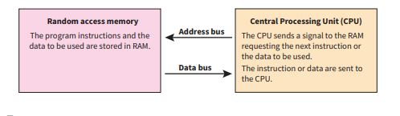
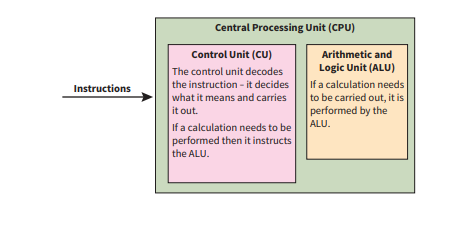
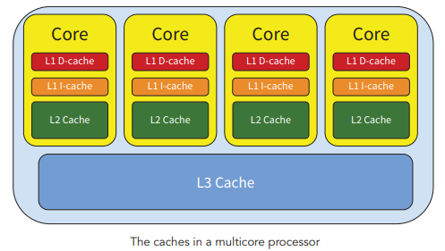

# The Central Processing Unit

---

## ❓ Why the CPU?

The central processing unit (CPU) is responsible for executing the instructions given to it in a program. It follows the instructions in order to do something useful.

The microprocessor relies on other devices:
* To allow users to input the instructions
* To store the instructions
* To transfer the instructions to it so that it can carry them out
* To carry out the commands it issues e.g. to print an essay or display an image.

  

> **ℹ️ Fact Box**
> ENIAC, the first computer, was 8 feet high and 100 feet long and far less powerful than today's laptop.

---

## 📚 Key Terms Reference 1
* **Central Processing Unit (CPU):** This is the component of the computer that controls the other devices, executes the instructions and processes the data.
* **Execute:** To run a computer program or process.

---

## 🖥️ The Central Processing Unit

The microprocessor is the central processing unit (CPU) of the computer. It is here that the data processing takes place.

### Von Neumann Architecture
The way the CPU is designed and executes (carries out) the program instructions is known as **'von Neumann architecture'**. In 1945, John von Neumann proposed his design for a **'stored program'** computer where both the program and data were stored in the memory. Previously, computers had to be rebuilt for each new program that was needed!

  

### Buses
A bus is a collection of wires that carry signals or communications between the various components of the computer system. 
* **Control Bus:** Connects the control unit (CU) with the other components of the CPU and devices in the computer system. The control unit uses it to send instructions to other components of the computer. The components use a bus to send information back to the CPU as well.
* **Data Bus:** Used for the transfer of data between the CPU and the RAM.
* **Address Bus:** Used for the CPU to access memory locations in the main memory.

---

## 📚 Key Terms Reference 2
* **Bus:** A bundle of wires carrying data from one component to another or a number of tracks on a printed circuit board (PCB) fulfilling the same function.
* **RAM (Random Access Memory):** Memory that can be used by computer programs to store data and instructions, but all of its data is lost when the computer is switched off.
* **Control Signals:** Electrical signals that are sent out to all of the devices to check their status and give them instructions.
* **Register:** A storage location that is inside the CPU itself to store instructions and data that are currently being used in the fetch-execute cycle.
* **Storage Location:** A place in RAM where a single piece of data can be kept until it is needed.

---

## 🔄 Executing the Instructions: The Fetch-Execute Cycle

The way in which the 'von Neumann architecture' executes the program instructions is through the fetch-execute cycle. Before the cycle starts, the program instructions are copied from a storage device such as a hard disk drive or DVD to the primary storage or random access memory (RAM).

### The Fetch Phase
In the fetch part of the cycle, instructions and data are moved from the random access memory to the central processing unit.
* **Random Access Memory:** The program instructions and the data to be used are stored in RAM.
* **Address Bus Execution:** The CPU sends a signal to the RAM requesting the next instruction or the data to be used.
* **Data Bus Execution:** The instruction or data are sent to the CPU.

  

### The Execute Phase
In the execute part of the cycle, the control unit decodes or interprets the instructions and decides what action to perform. These instructions are then carried out.
* **Control Unit (CU) Action:** The control unit decodes the instruction — it decides what it means and carries it out. If a calculation needs to be performed, then it instructs the ALU.
* **Arithmetic and Logic Unit (ALU) Action:** If a calculation needs to be carried out, it is performed by the ALU.

  

### Summary Summary of Processing Steps
1. **Fetch:** An instruction is transferred from the memory to the CPU.
   * *a.* The program counter supplies the address of the instruction to be fetched.
   * *b.* The program counter is a register (also referred to as memory location) in the CPU.
2. **Decode:** The CPU works out what the instructions mean.
3. **Execute:** The control unit carries out the instructions using the ALU for instructions involving logical or mathematical operations.

---

## 🧩 Components of the Central Processing Unit (CPU)

### The Arithmetic and Logic Unit (ALU)
The ALU performs arithmetic and logical operations. It carries out activities such as:
* Addition and subtraction
* Multiplication and division
* Logical tests using logic gates
* Comparisons, such as whether one number is greater than another.

### The Control Unit (CU)
The control unit coordinates the actions of the computer and controls the fetch-execute cycle by sending out control signals to the other parts of the CPU such as the ALU and registers. It also sends signals to other components of the computer system such as the input and output devices.

The two main elements of the control unit are the clock and the decoder:
* **The Clock:** Pulses are sent out to the other components to coordinate their activities and ensure instructions are carried out and completed. The timing is controlled by a vibrating quartz crystal. One instruction can be carried out with each pulse of the clock, and therefore the higher the clock speed, the faster the CPU will be able to carry out the program instructions. Clock speed is measured in cycles per second. 1 cycle per second is a rate of 1 Hertz. 1 megahertz (MHz) equals 1 million cycles per second and 1 gigahertz (GHz) is 1,000,000,000 cycles per second. Rates of 1 to 3 GHz are common in most home computers.
* **The Decoder:** This part of the control unit decodes the program instructions (works out what they mean) that have been brought from the memory and decides what actions should be taken. It then sends control signals to the other components to carry them out.

### Registers
Registers are storage locations within the CPU itself. They can be accessed even more quickly than the random access memory. The function of these registers is to store instructions and data that are currently being used in the fetch-execute cycle. Some of the registers serve specific functions, but some of them are general purpose registers used for the quick storage of data items. 

Registers that serve specific functions include:
* The Accumulator (A or ACC)
* The Program Counter (PC)
* The Memory Address Register (MAR)
* The Memory Data Register (MDR) or Memory Buffer Register (MBR)

---

## 📋 Chapter Core Reminders

### Focus List 1
1. The CPU consists of the:
   * *a.* Control Unit (CU)
   * *b.* Arithmetic and Logic Unit (ALU)
   * *c.* Registers
2. The CU controls the activities of the CPU by sending out control signals.
3. The ALU carries out arithmetic and logical operations.
4. The registers are memory stores within the CPU.

### Focus List 2
1. The clock speed cannot be increased indefinitely because of the extra heat generated.
2. A processor with several CPUs is said to be multi-core.
3. The processing speed of the CPU is limited by the speed that data can be supplied by the slower RAM.
4. Cache memory stores regularly used items of data so that they can be accessed more quickly.
5. When the main memory (RAM) is full, the operating system will store data on an area of the hard disk drive (the virtual memory).

### Focus List 3 (Embedded Systems)
* An embedded system is built into a larger device and carries out a limited number of functions.
* All of the components in an embedded system including microprocessor, memory and input and output interfaces are on a single printed circuit board.
* The memory contains the program.

---

## ⚡ CPU Performance

### Clock Speed
The rate at which instructions are processed is controlled by the clock speed. The faster the clock speed, the faster the rate of processing. Clock speeds have increased and a rate of 3 GHz is common in modern computer processors. But increasing the clock speed to increase processing speed has limitations:
* The microprocessor generates a large amount of heat and this increases with the clock speed. Although the heat is dissipated by a fan and heat sink to prevent it from malfunctioning or even melting, there are limits to the rate of cooling.
* Microprocessors with clock speeds of 9 GHz require cooling by liquid nitrogen!

> **💡 Tip: Overclocking**
> Overclocking is the process of increasing the clock speed to a higher level than that recommended by the manufacturer. It causes an increase in heat and can result in instability and permanent damage to the processor.
> 
> **📚 Key Term — Heat Sink:** A metal device, glued to the CPU chip with thermally conducting paste, to transfer the heat away from the chip.

### Cache Size
Bottlenecks occur when one component cannot work as fast as other components and so hinders progress. In the fetch-execute cycle this bottleneck is caused by the dynamic RAM (DRAM) that is used to store the instructions and data.

Although it is far quicker to fetch the instructions from the DRAM than from a hard disk drive, the RAM is still far slower than the CPU and then the instructions have to be transferred through the data bus. The speed of processing will be limited by the RAM which supplies the instructions regardless of how much clock speed is increased or how many cores are used.

The solution to this bottleneck problem is to use faster memory very close to, or even within, the CPU. This memory is used to store recently used data and data likely to be frequently used and is called a **cache**.

> **📚 Key Term — Cache:** A temporary data store so that it can be accessed very quickly when needed.

* Most CPUs have independent instruction and data caches. The data caches have to be read and written to but the instruction caches just have to be read by the CPU.
* The use of caches allows the CPU to check the fast cache for the data it needs. It does not have to wait for it to be fetched from the much slower DRAM. The faster SRAM is used for the cache.
* The caches are located on the processor chip. The fastest is the Level 1 cache and is smaller than the Level 2 and Level 3 caches.
* The L1 cache is checked first followed by the L2 and then L3 caches.
* In a multi-core processor each core has its own L1 and L2 caches while the Last Level Cache (L3) is usually shared by all the cores.

#### Multi-Core Cache Topology Map

  

### Number of Cores
Manufacturers introduced multi-core processors in 2006 to increase processing speed. A multi-core processor has more than one CPU. 

#### Dual-Core Architecture View

  

#### Processor Core Nomenclature Table
| Number of Cores | Common Name |
| :---: | :--- |
| **1** | Single-core |
| **2** | Dual-core |
| **4** | Quad-core |
| **5** | Penta-core |
| **8** | Octa(o)-core |
| **10** | Deca-core |

#### Core Advantages
* The cores can work together on the same program; this is called **parallel processing**.
* The cores can work on different programs at the same time; this is called **multitasking**.

> **📚 Key Terms:**
> * **Parallel Processing:** When the processor cores work on different parts of the same program.
> * **Multitasking:** When the processor cores work on different programs at the same time.

*Limitation:* Not all programs will run at twice the speed with a dual-core processor. The tasks required might not be able to be carried out in parallel. They might be sequential so that one task requires output from a previous task and so the second task cannot start until the first has finished.

---

## ⚙️ Embedded Systems

An embedded system is a computer system built within a larger device such as:
* Washing machines
* Digital cameras

The computer systems in these devices have been built for a range of specific tasks. Embedded devices are limited to a certain number of tasks, unlike desktop and laptop computers, which are general purpose computer systems capable of carrying out many different tasks.

All of the components in an embedded system, including microprocessor, memory and input and output interfaces, are on a single printed circuit board. The memory contains the program. The board is a component built into a larger device, hence the name 'embedded'.

In an embedded system, resources such as memory are limited and the hardware components are often unique to that system. The programs are often written in assembly language rather than in a high level language so that the hardware components can be more easily controlled.

> **📚 Key Terms:**
> * **Printed Circuit Board (PCB):** The base that supports the wiring and electronic components that are soldered to it or fit into sockets on the board.
> * **Hardware:** The physical components making up the computer, and its peripheral devices.

---
