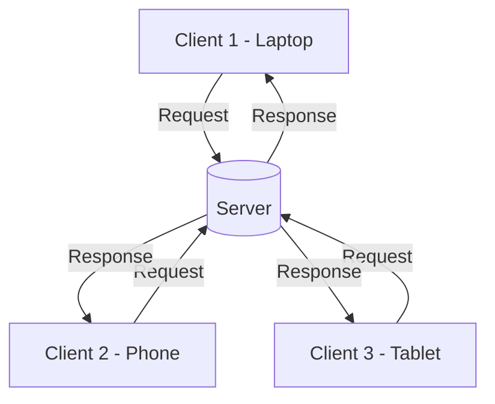
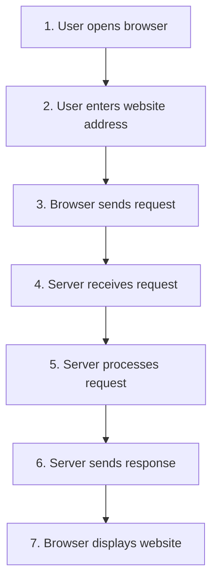
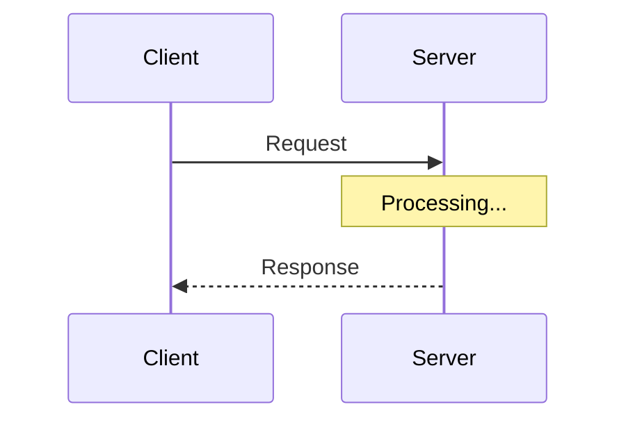

# Client-Server Architecture

Every time you check your email, scroll through social media, stream a video, or log into your online banking app — something is happening behind the scenes that you never see.

Two "sides" are talking to each other.

One side is **asking** for something.
The other side is **providing** it.

This simple pattern — one side asking, one side answering — is called the **Client-Server Architecture**, and it is the foundation of almost everything you do online.

> 💡 **Big Idea**
> Websites, mobile apps, cloud platforms, online banking, social media, email, and streaming services all run on this exact same model.

By the end of this lesson, you won't just know the definition — you'll start **seeing** this pattern everywhere in daily life.

---

# 📖 What is Client-Server Architecture?

**Client-Server Architecture** is a way of organizing communication between two roles:

| Role | Meaning |
|------|---------|
| **Client** | The one who **asks** for something |
| **Server** | The one who **provides** it |

Let's break down the key terms:

- **Client** — A device or program that requests a service (example: your phone's browser).
- **Server** — A device or program that provides a service (example: YouTube's video servers).
- **Service** — Something useful the server offers (a web page, a file, an email inbox, a video).
- **Request** — The client asking, *"Can I have this?"*
- **Response** — The server replying, *"Here you go!"*

> ⚠ **Important Note**
> We are keeping this beginner-friendly. We will **not** dive into technical protocols like HTTP yet — that comes in later lessons. Right now, focus only on the *concept*.

---

# 🧠 Understanding the Idea

Let's use an everyday analogy: **a restaurant**.

```
Customer  →  Waiter  →  Kitchen
   ↑                        │
   └────── Food ────────────┘
```

- **You (Customer)** = the **Client** — you ask for food.
- **Waiter** = carries your request to the kitchen and brings the response back.
- **Kitchen (Server)** = prepares the meal and sends it back.

You never walk into the kitchen yourself. You simply **request**, and the response comes to you.

Now map this to networking:

| Restaurant | Networking |
|------------|------------|
| Customer | Client (your phone/laptop) |
| Order | Request |
| Kitchen | Server |
| Food | Response (data/webpage/file) |

> 🧠 **Memory Trick**
> Client = Customer. Server = Service provider. Simple as that.

---

# 🖼 Architecture Diagram

Here's what it looks like when **multiple clients** talk to **one server**:



Notice something important:

> 📌 **Key Insight**
> A single server can handle requests from **many clients at the same time** — that's what makes this model powerful.

---

# 🔄 How Communication Works

Let's walk through a real example: **opening a website in your browser.**



### Step-by-step explanation

1. **User opens browser** — You launch Chrome, Firefox, Safari, etc.
2. **User enters website** — You type a website address or click a link.
3. **Browser sends request** — Your browser (the client) asks the server for the page.
4. **Server receives request** — The server "hears" your request arrive.
5. **Server processes request** — The server figures out what you need and prepares it.
6. **Server sends response** — The server sends the webpage data back.
7. **Browser displays website** — Your browser turns that data into the page you see.

> 💡 **Pro Tip**
> All of this usually happens in **less than a second** — even though data may travel across countries or continents.

---

# 🌍 Real-World Examples

Let's identify the client and server in tools you use daily:

| Application | Client | Server |
|-------------|--------|--------|
| **Google Search** | Your browser | Google's search servers |
| **YouTube** | YouTube app/browser | YouTube's video servers |
| **Gmail** | Mail app/browser | Google's mail servers |
| **Netflix** | Netflix app | Netflix's streaming servers |
| **Facebook** | Facebook app/browser | Facebook's servers |
| **Online Banking** | Banking app | Bank's secure servers |
| **School Portal** | Student's browser | School's web server |
| **Company Login System** | Employee's device | Company's authentication server |

> 🎯 **Notice the pattern?**
> In every single example, **you** are the client. The company always runs the server.

---

# 🏗 Components of Client-Server Architecture

## 🖥 Client

**Purpose:** Requests services and displays results to the user.

**Responsibilities:**
- Sending requests
- Displaying responses
- Providing the user interface

**Examples:** Web browsers, mobile apps, desktop applications, ATM machines.

---

## 🗄 Server

**Purpose:** Provides services, processes requests, and manages resources.

**Responsibilities:**
- Listening for incoming requests
- Processing/computing data
- Sending back responses
- Managing storage and security

**Examples:** Web servers, database servers, mail servers, file servers.

---

## 🌐 Network

The network is the **road** that connects clients and servers.

Without a network connection (Wi-Fi, mobile data, cables, the Internet), requests and responses would have **nowhere to travel**.

> ⚠ **Common Misconception**
> The Internet is **not** the server. The Internet is the network that *connects* clients to servers.

---

## 📦 Data

Data is what actually gets exchanged, such as:

- Web pages
- Images and videos
- Emails
- Files and documents
- Login credentials
- Application data

---

# 📦 Request and Response



| Stage | What Happens |
|-------|--------------|
| **Client** | Wants something (a page, file, data) |
| **Request** | Client asks the server for it |
| **Server** | Receives and understands the request |
| **Processing** | Server prepares the correct response |
| **Response** | Server sends the result back |
| **Client** | Displays or uses the result |

> 🧠 **Memory Trick**
> Request = Asking. Response = Receiving.

---

# ⚙ Characteristics

| Characteristic | Why It Matters |
|-----------------|-----------------|
| **Centralized Management** | All data and services live in one controlled place, making it easier to manage. |
| **Resource Sharing** | Many clients can use the same server resources (files, apps, databases). |
| **Scalability** | Servers can be upgraded or expanded to handle more clients. |
| **Authentication** | Servers can verify who is allowed to access services. |
| **Security** | Centralized servers can be protected with strong, consistent security policies. |
| **Availability** | Well-maintained servers can stay online and accessible around the clock. |

---

# 👍 Advantages

- ✅ **Easier Management** — Updates and changes happen in one place (the server), not on every client.
- ✅ **Centralized Security** — Security policies are enforced from a single control point.
- ✅ **Better Backups** — Data lives on the server, so backups are simpler and more reliable.
- ✅ **Easier Updates** — Update the server once, and every client benefits instantly.
- ✅ **Scalability** — Add more server power as more clients join.

---

# 👎 Disadvantages

- ❌ **Single Point of Failure** — If the server goes down, all clients lose access.
  > *Example: When a bank's server crashes, no customer can log in.*
- ❌ **Cost** — Servers require investment in hardware, software, and maintenance.
- ❌ **Maintenance** — Servers need continuous monitoring, patching, and upkeep.
- ❌ **Server Overload** — Too many clients requesting at once can slow down or crash the server.
  > *Example: Ticket websites crashing when tickets go on sale.*

---

# 🔐 Cybersecurity Perspective

Client-Server Architecture is at the **heart** of cybersecurity, because most attacks target either the client, the server, or the communication between them.

- **Authentication** — Verifying *who* is connecting (usernames, passwords, biometrics).
- **Authorization** — Verifying *what* that user/client is allowed to do once connected.
- **Logging** — Servers record who accessed what and when, which helps detect suspicious activity.
- **Firewalls** — Filter which requests are allowed to reach a server.
- **IDS/IPS** — Intrusion Detection/Prevention Systems watch for malicious requests targeting servers.
- **Web Servers** — Host websites and are common attack targets (e.g., unpatched software).
- **Database Servers** — Store sensitive data and are prime targets for data breaches.
- **Active Directory** — A special type of server system that manages user accounts and permissions across an organization.

> ⚠ **Warning**
> Because servers are centralized, they are also **high-value targets** for attackers. Protecting the server often means protecting *everyone* who depends on it.

---

# ⚖ Everyday Comparison

| Aspect | Client | Server |
|--------|--------|--------|
| **Purpose** | Requests services | Provides services |
| **Examples** | Browser, mobile app | Web server, database server |
| **Responsibilities** | Displaying data, sending requests | Processing requests, managing data |
| **Initiates Communication?** | ✅ Yes | ❌ No (waits for requests) |
| **Stores Main Data?** | ❌ Usually not | ✅ Yes |
| **Provides Services?** | ❌ No | ✅ Yes |

---

# 💡 Pro Tips

> Every website you visit is a client communicating with one or more servers.

> A single app on your phone might talk to *multiple* servers at once (e.g., a login server, a payment server, and a media server).

> The "cloud" is really just a giant collection of servers owned by companies like Amazon, Google, and Microsoft.

> Faster response times don't always mean a "closer" server — smart routing and caching play a huge role too.

---

# ⚠ Common Beginner Mistakes

- ❌ **"The server is always more powerful than the client."**
  Not always true — some servers are small; some clients (like powerful workstations) can be stronger.

- ❌ **"One server only serves one client."**
  Servers are built to handle **many clients simultaneously** — sometimes millions.

- ❌ **"The Internet is the server."**
  The Internet is the **network** connecting clients to servers — not a server itself.

- ❌ **"The client stores all the data."**
  In most cases, the **server** stores and manages the primary data; the client mainly displays it.

---

# 🧠 Memory Tricks

| Term | Think Of It As |
|------|-----------------|
| **Client** | Customer |
| **Server** | Service Provider |
| **Request** | Asking |
| **Response** | Receiving |

> 🧠 **Quick Trick:** *"Clients Call, Servers Serve."*

---

# 🎉 Fun Facts

- 🌟 Loading a single modern web page can trigger **dozens of separate server requests** (images, scripts, fonts, ads, etc.).
- 🌟 Large websites like Google or Facebook use **thousands of servers** working together behind the scenes.
- 🌟 Cloud providers automatically **distribute requests** across many servers to avoid overload — this is called *load balancing*.
- 🌟 Google alone handles **billions of client requests every single day**.
- 🌟 Some servers never "sleep" — they're designed to run **24/7/365**.

---

# 🎯 Key Takeaways

- Client-Server Architecture is a model where **clients request** and **servers respond**.
- The client and server communicate through a **network**.
- A single server can serve **many clients simultaneously**.
- This model offers **centralized control** but also creates a **single point of failure**.
- Nearly every application you use daily — search engines, banking, streaming, email — relies on this model.
- Understanding this architecture is essential for understanding **cybersecurity**, since most attacks target clients, servers, or the connection between them.

---

# 📝 Quick Review

1. What is the main difference between a client and a server?
2. Can one server handle multiple clients at the same time?
3. What is a "request" in Client-Server Architecture?
4. What is a "response"?
5. Why is the Internet not the same as a server?
6. Name three real-world applications that use Client-Server Architecture.
7. What is one advantage of centralized management?
8. What is a "Single Point of Failure," and why is it a disadvantage?
9. Why are servers considered high-value targets in cybersecurity?
10. What role does authentication play in Client-Server communication?

---

# 📚 Further Reading

Before moving forward, it's worth revisiting these earlier lessons — they connect directly to what you just learned:

- **What is Networking** — helps you understand the foundational concept of devices communicating.
- **Network Types** — helps you understand the environments (LAN, WAN, etc.) where Client-Server systems operate.
- **Network Topologies** — helps you visualize how devices are physically or logically arranged, which affects how clients reach servers.

---

# ➡ Next Lesson

You now understand the most common **centralized** communication model in networking.

But not all systems work this way. In the next lesson, you'll explore a **decentralized** model where devices communicate **directly with one another**, without relying on a central server.

👉 **[Peer to Peer Architecture](./Peer%20to%20Peer%20Architecture.md)**

----
