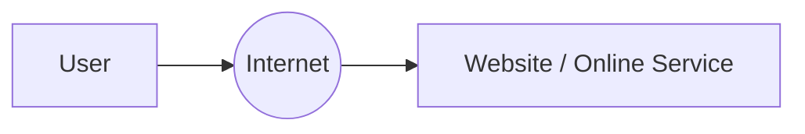
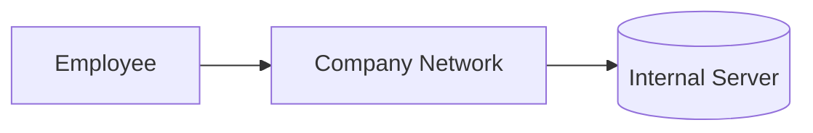
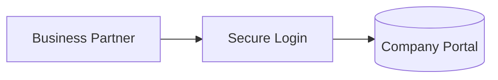
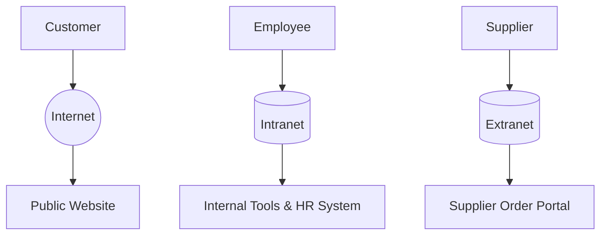

# Internet vs Intranet vs Extranet

Not every network is open to everyone.

Some networks are **public** — anyone in the world can access them.
Some are **private** — locked away for a single organization's employees.
Some sit **in between** — shared only with trusted outsiders like partners or suppliers.

Before learning *how* communication actually happens (which is what the next chapter covers), it's important to understand *where* that communication takes place.

> 💡 **Big Idea**
> The Internet, Intranet, and Extranet are three different "worlds" that networks can exist in — each with its own audience, purpose, and security rules.

---

# 🌍 What is the Internet?

The **Internet** is a massive, public, global network that connects billions of devices worldwide.

- **Definition:** A worldwide system of interconnected networks that allows devices anywhere to communicate.
- **Purpose:** To let anyone, anywhere, access shared information and services.
- **Public Accessibility:** Open to virtually everyone with an internet connection.
- **Ownership:** No single company or government owns the Internet — it's a collection of countless independently-owned networks connected together.
- **Examples:** Google, YouTube, Netflix, Wikipedia, online shopping sites.
- **Services Provided:** Web browsing, email, video streaming, cloud storage, social media, and more.

> 📌 **Why is it called a "network of networks"?**
> The Internet isn't one single network — it's made up of **thousands of smaller networks** (owned by ISPs, governments, universities, and companies) all connected together using shared communication standards.

**Why This Matters:** The Internet's open nature makes it powerful — but it also means anyone, including attackers, can attempt to reach public-facing services.

---

# 🏢 What is an Intranet?

An **Intranet** is a **private network** owned and used by a single organization.

- **Definition:** A restricted, internal network accessible only to an organization's employees or members.
- **Private Organizational Network:** Built specifically for internal use.
- **Employee Access:** Only authorized staff can log in.
- **Authentication:** Requires company credentials — usernames, passwords, sometimes multi-factor authentication.
- **Internal Communication:** Used for internal announcements, collaboration, and workflows.
- **Internal Resources:** Hosts internal-only tools and data.

### Practical Examples

- HR Portal (leave requests, payroll info)
- Employee Dashboard
- Company Wiki (internal documentation)
- Internal Email System
- Internal File Server (shared company documents)

> ⚠ **Important Note**
> An Intranet usually *does* have internet access — it's simply a **private layer** added on top of, or alongside, the company's connection to the Internet.

**Why This Matters:** Intranets keep sensitive company information away from the public Internet, reducing exposure to outside attackers.

---

# 🤝 What is an Extranet?

An **Extranet** is a **controlled, limited-access network** that extends part of an organization's private network to trusted **outsiders**.

- **Definition:** A secure network that allows selected external users to access certain internal resources.
- **Limited External Access:** Only specific, approved outsiders get in — not the general public.
- **Business Partners, Vendors, Suppliers, Clients:** These are the typical users of an Extranet.
- **Secure Collaboration:** Enables safe sharing of data and tools between an organization and its trusted partners.

### Real-World Examples

- A supplier logging in to check inventory orders
- A client accessing a project dashboard
- A vendor submitting invoices through a secure portal

> 💡 **Pro Tip**
> Think of an Extranet as a **"guest area"** carved out of the Intranet — visible only to specific, verified outsiders.

**Why This Matters:** Extranets let businesses collaborate efficiently with external parties without exposing their entire internal network.

---

# 🔄 Comparing the Three Networks

| Aspect | Internet | Intranet | Extranet |
|--------|----------|----------|----------|
| **Accessibility** | Public — open to everyone | Private — internal only | Semi-private — approved outsiders only |
| **Users** | General public | Employees/members | Partners, vendors, suppliers, clients |
| **Ownership** | No single owner (many networks) | Owned by one organization | Owned by one organization, shared selectively |
| **Security** | Lower (open access) | High (restricted access) | High, with additional external controls |
| **Authentication** | Often minimal or none | Required (company credentials) | Required (external accounts/credentials) |
| **Common Uses** | Browsing, streaming, shopping | Internal collaboration, HR, documentation | Partner collaboration, order tracking, vendor access |
| **Examples** | Google, YouTube, Netflix | Company HR Portal, Internal Wiki | Supplier Portal, Client Dashboard |
| **Typical Technologies** | Public web servers, DNS | VPNs, internal servers, firewalls | VPNs, secure portals, extranet-specific firewalls |
| **Cybersecurity Risks** | External attacks, phishing, malware | Insider threats, misconfigured access | Compromised partner accounts, third-party risk |

**Why This Matters:** This table shows a clear pattern — as access becomes more restricted, security control typically increases, but so does the complexity of managing who's allowed in.

---

# 🌎 Real-World Scenario

Imagine a multinational company with customers, employees, and suppliers all interacting with different parts of its network.

- **Customer** → uses the **Internet** to browse the company's public website and place orders.
- **Employee** → uses the **Intranet** to access internal tools, HR systems, and company documents.
- **Supplier** → uses the **Extranet** to log in and check/update order and inventory information.

> 🎯 **Key Insight**
> The **same company** can operate all three network types **at the same time**, each serving a different audience with different access levels.

**Why This Matters:** Real organizations rarely use just one network type — understanding how they coexist is critical for designing and securing enterprise systems.

---

# 🔐 Cybersecurity Perspective

Each network environment comes with its own security priorities:

### Internet
- **Firewalls** — filter incoming public traffic.
- **External Threats** — phishing, malware, DDoS attacks, and scanning by attackers are constant risks.
- **Monitoring** — public-facing systems need continuous traffic monitoring.

### Intranet
- **Access Control** — ensures employees only access what their role permits.
- **Insider Threats** — even trusted employees can pose risks (intentional or accidental).
- **Authentication** — strong internal login policies (passwords, MFA) protect sensitive data.

### Extranet
- **VPN (Virtual Private Network)** — often used to create secure tunnels for external partner access.
- **Zero Trust** — the principle of "never trust, always verify," even for known partners.
- **Data Protection** — extra care is needed since data crosses organizational boundaries.
- **Third-Party Risk** — a partner's weak security can become your organization's problem too.

> ⚠ **Warning**
> A compromised partner account on an Extranet can give an attacker a "trusted" path directly into company systems — this is why **Zero Trust** principles matter so much.

**Why This Matters:** Cybersecurity professionals must apply different strategies depending on *who* is accessing the network and *from where*.

---

# 🧩 Where Do You Use These Every Day?

### 🌍 Internet
- Google Search
- YouTube
- Netflix
- Online Shopping

### 🏢 Intranet
- University Student Portal
- Hospital Management System
- Company HR Portal

### 🤝 Extranet
- Supplier Portal
- Client Dashboard
- Vendor Management Portal

> 🎯 You likely already interact with all three types of networks regularly — often without realizing which is which.

---

# 💡 Pro Tips

> Every Intranet is private, but not every private network is an Intranet.

> An Extranet is essentially a securely shared part of an Intranet.

> The Internet connects *networks*, not just individual computers.

> A single click can move you from the Internet to an Intranet — for example, logging into your company's VPN.

---

# ⚠ Common Beginner Mistakes

- ❌ **"The Internet is one giant network owned by one company."**
  The Internet has **no single owner** — it's a collection of independently owned and operated networks.

- ❌ **"Internet and World Wide Web are the same thing."**
  The **Internet** is the underlying global network; the **World Wide Web** is just one service (websites) that runs on top of it.

- ❌ **"An Extranet is simply another Internet."**
  An Extranet is **restricted** to approved outsiders — it is not open to the general public like the Internet.

- ❌ **"Intranet means no Internet connection."**
  An organization's Intranet usually still connects to the Internet — it's simply a **private layer** with restricted access.

---

# 🧠 Memory Tricks

| Network | Think Of It As |
|---------|-----------------|
| **Internet** | Everyone |
| **Intranet** | Employees only |
| **Extranet** | Trusted outsiders |

> 🧠 **Quick Trick:** *"Intranet stays IN the company. Extranet reaches EXternal partners. The Internet is for EVERYONE."*

---

# 🎉 Fun Facts

- 🌟 The Internet has **no single owner** — it's a cooperative network of networks.
- 🌟 Many companies run **all three** network environments simultaneously.
- 🌟 Large organizations may operate **hundreds of separate Intranets** across different departments or regions.
- 🌟 Extranets have become increasingly important with the rise of **cloud collaboration** tools.
- 🌟 Some company Intranets are so large they function like a "mini version" of the public Internet — internally.

---

# 🎯 Key Takeaways

- The **Internet** is a public, global network of networks with no single owner.
- An **Intranet** is a private network restricted to an organization's own members.
- An **Extranet** extends limited, secure access to trusted external parties like partners and suppliers.
- Each network type has different security priorities — from public-facing firewalls to Zero Trust partner access.
- Most real organizations use **all three** simultaneously, each serving a different audience.

---

# 📝 Quick Review

1. What makes the Internet a "network of networks"?
2. Who typically has access to a company's Intranet?
3. What kind of users access an Extranet?
4. Is the Internet owned by a single company? Why or why not?
5. What is the difference between the Internet and the World Wide Web?
6. Why might a company use a VPN for its Extranet?
7. What is one cybersecurity risk unique to Intranets?
8. What is one cybersecurity risk unique to Extranets?
9. Can an organization use the Internet, Intranet, and Extranet all at the same time?
10. Why is "Zero Trust" especially important for Extranet security?

---

# 📚 Chapter Summary

Congratulations — you've completed the **Networking Introduction** chapter! 🎉

Across these six lessons, you've built a solid foundation:

1. **What is Networking** — the basic concept of connected devices communicating.
2. **Network Types** — how networks vary in size and scope (LAN, WAN, and more).
3. **Network Topologies** — how devices are physically or logically arranged.
4. **Client-Server Architecture** — how centralized communication works.
5. **Peer-to-Peer Architecture** — how decentralized, direct communication works.
6. **Internet vs Intranet vs Extranet** — where these communications actually take place.

Together, these lessons answer: *what networks are, how they're arranged, how devices talk to each other, and where that communication happens.*

> 🎯 You now have the complete foundational picture of networking — the perfect base for understanding **how** communication is structured at a technical level.

---

# 🚀 Next Chapter

You've mastered the **foundations of networking**.

The next chapter dives into **how communication actually happens** at a technical level, covering:

- The OSI Model
- The TCP/IP Model
- Layered communication
- Data encapsulation
- The full network communication process

👉 **[01 – Network Models](../01-Network%20Models/README.md)**

Get ready to go beneath the surface and see exactly how data travels, layer by layer, across every network you've just learned about.
------------