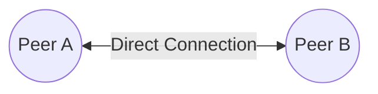
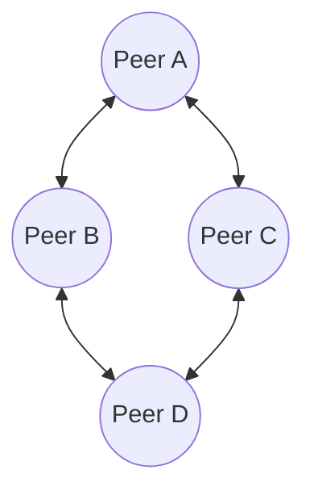
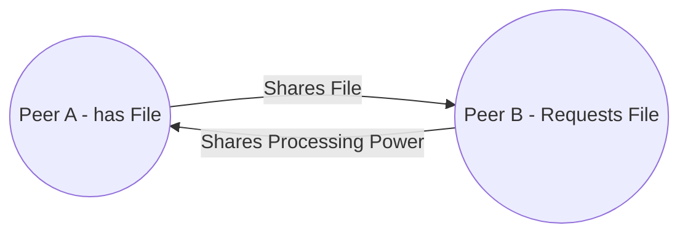
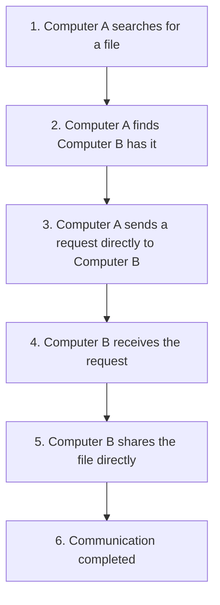

# Peer-to-Peer Architecture

In the last lesson, you learned that most apps and websites rely on a **dedicated server** — a central point that stores data and handles every request.

But not every system works that way.

Some networks have **no central authority at all**. Instead, every device talks directly to every other device, sharing files, resources, and workload among themselves.

This is called **Peer-to-Peer (P2P) Architecture** — and it powers everything from file sharing to cryptocurrency.

> 💡 **Big Idea**
> In a Peer-to-Peer network, there is no "boss" device. Every device can both **ask for** and **provide** services.

---

# 📖 What is Peer-to-Peer Architecture?

**Peer-to-Peer Architecture** is a model where devices — called **peers** — communicate **directly** with each other instead of going through a central server.

Key terms:

- **Peer** — A device that can act as both a client and a server at the same time.
- **Direct Communication** — Peers talk to each other directly, without a middleman.
- **Resource Sharing** — Peers share things like files, storage space, or processing power with one another.
- **Decentralization** — No single device controls the entire network.

> ⚠ **Important Note**
> In Peer-to-Peer networks, every device is equal in role. There's no "main" device that everyone depends on.

**Why This Matters:** Understanding this shift — from *centralized* to *decentralized* — is essential for grasping how modern technologies like blockchain and torrenting actually work.

---

# 🧠 Understanding the Idea

Let's use an everyday analogy: **neighbors lending tools**.

```
Neighbor A  <──────>  Neighbor B
     │                     │
     └────>  Neighbor C <──┘
```

- You need a ladder, so you ask your **neighbor** directly — not a "ladder rental company."
- Your neighbor might later ask *you* for your lawnmower.
- Everyone in the neighborhood can **both borrow and lend** — there's no central "tool office."

Now map this to networking:

| Neighborhood | Networking |
|--------------|------------|
| Neighbor | Peer |
| Borrowing a ladder | Requesting a resource |
| Lending a lawnmower | Sharing a resource |
| No tool rental office | No central server |

> 🧠 **Memory Trick**
> In P2P, every peer is both a **borrower** and a **lender**.

**Why This Matters:** This analogy shows why P2P networks can function even without any single "authority" managing everything.

---

# 🖼 Peer-to-Peer Architecture Diagram

### Two Peers Communicating Directly



### Multiple Peers Connected Together



### Resource Sharing Between Peers



> 📌 **Key Insight**
> Notice the double-headed arrows (`<-->`). Unlike Client-Server diagrams, communication flows **both ways equally** — every peer can initiate contact.

---

# 🔄 How Peer-to-Peer Communication Works

Let's walk through an example: **Computer A wants a file from Computer B.**



### Step-by-step explanation

1. **Computer A searches** for a file it needs.
2. **Computer A discovers** that Computer B has that file.
3. **Computer A sends a request** directly to Computer B — no server in between.
4. **Computer B receives** the request.
5. **Computer B shares the file** directly with Computer A.
6. **Communication completed** — no central server was ever involved.

> 💡 **Pro Tip**
> In many real P2P systems, a small "helper" service may assist peers in *finding* each other — but the actual file transfer still happens directly between peers.

**Why This Matters:** This direct-connection process is exactly what makes technologies like torrenting and blockchain function without needing a company to host everything.

---

# 🌍 Real-World Examples

| Technology | Who Acts as a "Peer"? |
|------------|------------------------|
| **Bluetooth File Sharing** | Your phone and your friend's phone |
| **Torrent Networks** | Every computer downloading/uploading the same file |
| **Blockchain Networks** | Every node maintaining a copy of the ledger |
| **Cryptocurrency Systems** | Every wallet/node participating in transactions |
| **LAN File Sharing** | Computers on the same local network sharing folders |
| **Multiplayer Games (P2P mode)** | Each player's device, connecting directly to others |

> 🎯 **Notice the pattern?**
> In every example, devices talk **directly** to each other — none of them depend on one single company-owned server for the core communication.

---

# 🏗 Components of a Peer-to-Peer Network

## 🖥 Peer

**Purpose:** Acts as both a requester and a provider of services.

**Responsibilities:**
- Sending requests to other peers
- Responding to requests from other peers
- Sharing its own resources

**Examples:** Laptops, phones, gaming consoles, blockchain nodes.

---

## 📦 Shared Resources

Peers can share many types of resources:

- **Files** — documents, music, videos
- **Printers** — shared printer access on a local network
- **Storage** — free disk space contributed to a network
- **Processing Power** — computing power shared for tasks (e.g., distributed computing projects)

---

## 🌐 Communication Medium

This is the pathway peers use to reach each other — Wi-Fi, Bluetooth, Ethernet, or the Internet.

Without this medium, peers would have no way to discover or exchange data with one another.

---

## 🔍 Network (Discovery & Communication)

In larger P2P systems, peers need a way to **find** each other. This can happen through:

- A shared directory or index
- Broadcast messages on a local network
- Distributed lookup systems (used in blockchain and torrent networks)

Once discovered, peers connect and communicate **directly**.

**Why This Matters:** Peer discovery is often the trickiest part of building a P2P system — it's the difference between "everyone shouting into the void" and "peers actually finding what they need."

---

# ⚖ Client-Server vs Peer-to-Peer

| Aspect | Client-Server | Peer-to-Peer |
|--------|----------------|----------------|
| **Architecture** | Centralized | Decentralized |
| **Communication** | Client ↔ Server | Peer ↔ Peer |
| **Control** | Managed by one central server | Distributed among all peers |
| **Performance** | Depends on server capacity | Depends on number/quality of peers |
| **Cost** | Higher (dedicated server hardware) | Lower (uses existing peer devices) |
| **Security** | Easier to centrally secure | Harder to secure consistently |
| **Scalability** | Requires upgrading the server | Naturally scales as more peers join |
| **Ease of Management** | Easier (one point of control) | Harder (no central control point) |
| **Reliability** | Server failure affects everyone | More fault-tolerant (no single failure point) |
| **Examples** | Websites, banking apps, email | Torrents, blockchain, Bluetooth sharing |
| **Typical Use Case** | Business applications, banking, cloud services | File sharing, cryptocurrency, local networks |

> 🎯 **Which to use?**
> - Choose **Client-Server** when you need strong central control, security, and consistent management.
> - Choose **Peer-to-Peer** when you need low cost, resilience, and decentralization.

---

# 👍 Advantages

- ✅ **Lower Cost** — No need to buy or maintain expensive dedicated servers.
- ✅ **Easy Setup** — Small P2P networks (like a home LAN) are simple to configure.
- ✅ **No Dedicated Server Needed** — Every device contributes resources.
- ✅ **Resource Sharing** — Peers pool together storage, files, and processing power.
- ✅ **Decentralization** — No single company or entity controls everything.
- ✅ **Fault Tolerance** — If one peer disconnects, the rest of the network can often keep functioning.

---

# 👎 Disadvantages

- ❌ **Harder Management** — With no central authority, enforcing rules across the network is difficult.
- ❌ **Security Challenges** — Malicious peers can be harder to detect and block.
- ❌ **Backup Difficulties** — Data isn't centrally stored, making consistent backups harder.
- ❌ **Performance Limitations** — Speed depends on peers' individual devices and connections, which can vary wildly.
- ❌ **Availability Issues** — If the peer holding a needed resource goes offline, that resource may become unavailable.

---

# 🔐 Cybersecurity Perspective

Peer-to-Peer networks bring **unique security challenges** that every cybersecurity professional should understand:

- **Malware Spreading Through P2P** — Infected files can spread quickly since there's no central authority scanning every transfer.
- **Torrent Security** — Downloading files from unknown peers carries a real risk of malware or corrupted data.
- **Unauthorized File Sharing** — P2P networks are sometimes used to illegally distribute copyrighted content.
- **Botnets** — Some botnets (networks of infected devices controlled by attackers) use P2P-style communication to avoid detection, since there's no single server to shut down.
- **Blockchain Security** — While decentralization increases resilience, it also introduces unique attack types (like network-level attacks on distributed consensus).
- **Endpoint Protection** — Since every peer is a potential entry point, each device needs its own strong security (antivirus, firewalls, monitoring).

> ⚠ **Warning**
> Because there's no central server enforcing security policies, **every single peer becomes a potential weak point.**

**Why This Matters:** In Client-Server systems, securing one server protects everyone. In P2P systems, security must be handled at **every individual device** — a much bigger challenge.

---

# 🧩 Where is Peer-to-Peer Used Today?

- **BitTorrent** — Distributes large files by having many peers upload and download simultaneously.
- **Bitcoin** — Every node maintains and verifies the blockchain ledger together.
- **Ethereum** — Uses a similar decentralized peer network to process smart contracts.
- **Bluetooth** — Devices pair and share data directly with no server involved.
- **AirDrop-style Technologies** — Nearby devices exchange files directly over local wireless connections.
- **Distributed Storage Systems** — Some cloud alternatives spread data across many peers instead of one data center.

**Why This Matters:** P2P isn't a relic of the past — it's the backbone of some of today's most important technologies, especially in blockchain and decentralized systems.

---

# 💡 Pro Tips

> Every peer is both a client and a server.

> P2P networks scale differently — more peers can mean more available resources, not just more strain.

> Not all P2P traffic is illegal or unsafe — many legitimate systems (like blockchain) rely on it.

> A "hybrid" model exists too: some systems use a central server just for peer discovery, then let peers communicate directly afterward.

---

# ⚠ Common Beginner Mistakes

- ❌ **"Peer-to-Peer means the Internet."**
  The Internet is a network that *can* carry P2P traffic, but it isn't P2P architecture itself.

- ❌ **"Peer-to-Peer is outdated."**
  P2P is very much alive — it powers blockchain, cryptocurrency, and modern file-sharing technologies.

- ❌ **"Peer-to-Peer is always insecure."**
  P2P isn't inherently insecure — but it requires **stronger security at each individual device** since there's no central gatekeeper.

- ❌ **"Peer-to-Peer replaces Client-Server."**
  Both models are still widely used today — they simply solve different problems.

---

# 🧠 Memory Tricks

| Term | Think Of It As |
|------|-----------------|
| **Peer** | A device that can both ask and answer |
| **Direct Communication** | No middleman — straight from A to B |
| **Decentralized** | No single "boss" device |
| **Shared Resources** | Everyone contributes, everyone benefits |

> 🧠 **Quick Trick:** *"In P2P, everyone is equal — no client, no server, just peers."*

---

# 🎉 Fun Facts

- 🌟 Bitcoin operates entirely through a Peer-to-Peer network of nodes.
- 🌟 Some large P2P networks have had **millions of devices** participating at once.
- 🌟 Early versions of Skype relied heavily on Peer-to-Peer technology for voice and video calls.
- 🌟 Many blockchain systems, including Ethereum, use P2P communication to keep every node synchronized.
- 🌟 BitTorrent was once responsible for a significant portion of all global internet traffic.

---

# 🎯 Key Takeaways

- Peer-to-Peer (P2P) Architecture allows devices to communicate **directly**, without a central server.
- Every device in a P2P network is called a **peer**, and can act as both a client and a server.
- P2P networks are **decentralized**, making them resilient but harder to manage and secure.
- Real-world examples include torrenting, blockchain, Bluetooth sharing, and cryptocurrency.
- P2P has unique cybersecurity risks, since security must be enforced at **every peer**, not just one server.
- P2P and Client-Server aren't competitors — they're **different tools for different situations**.

---

# 📝 Quick Review

1. What does the term "peer" mean in a Peer-to-Peer network?
2. How does Peer-to-Peer communication differ from Client-Server communication?
3. Name three real-world examples of Peer-to-Peer technology.
4. What does "decentralization" mean in networking?
5. Why can Peer-to-Peer networks be more fault-tolerant than Client-Server networks?
6. What is one security risk unique to Peer-to-Peer networks?
7. Why might backups be harder to manage in a Peer-to-Peer network?
8. What role does a blockchain node play in a Peer-to-Peer network?
9. Is Peer-to-Peer architecture outdated? Why or why not?
10. When would a business choose Client-Server over Peer-to-Peer?

---

# 📚 Further Reading

Before moving on, it's worth revisiting these earlier lessons:

- **Network Topologies** — helps you visualize how peers might be physically or logically arranged.
- **Client-Server Architecture** — provides the contrasting model, which makes Peer-to-Peer easier to understand by comparison.

---

# ➡ Next Lesson

You now understand **how devices communicate** — both through centralized servers and directly between peers.

The next lesson explores **where** these communications actually take place, across different types of network environments.

👉 **[Internet vs Intranet vs Extranet](./Internet%20vs%20Intranet%20vs%20Extranet.md)**

----