<div align="center">

# 📂 Decapsulation

### Learn how a receiving device removes protocol headers layer by layer to recover the original application data.

<p align="center">


</p>

<p align="center">


</p>

</div>

---

# 📌 Overview

Once data reaches its destination, it cannot be delivered directly to the receiving application. Instead, it must travel back **up** through the networking stack, where each OSI layer removes and processes the information that was added during **Encapsulation**.

This reverse process is called **Decapsulation**.

As the data moves upward through the OSI Model, each layer examines its own header, performs its specific task, removes the information it no longer needs, and passes the remaining data to the next layer. Eventually, the original application data reaches the correct program exactly as it was sent.

Decapsulation happens every time you load a webpage, receive an email, download a file, stream a video, or connect to an online service. Together with encapsulation, it forms the complete communication process used by every modern computer network.

---

## 🎯 Learning Objectives

After completing this lesson, you should be able to:

- Explain what decapsulation is and why it is necessary.
- Describe how data travels upward through the seven layers of the OSI Model.
- Understand how each layer processes and removes its own protocol information.
- Identify how PDUs change from **Bits → Frame → Packet → Segment → Data**.
- Explain the relationship between encapsulation and decapsulation.
- Recognize decapsulation while analyzing packet captures in Wireshark.
- Understand why decapsulation is essential for reliable communication and cybersecurity.

---

## 📚 Lesson Roadmap

```text
Introduction
      │
      ▼
What is Decapsulation?
      │
      ▼
Journey Up the OSI Model
      │
      ▼
Layer-by-Layer Decapsulation
      │
      ▼
Protocol Data Units (PDUs)
      │
      ▼
Real-World Example
      │
      ▼
Wireshark Analysis
      │
      ▼
Cybersecurity Perspective
      │
      ▼
Summary & Knowledge Check
```

---

## 🧭 Prerequisites

Before starting this lesson, you should already understand:

- ✅ OSI Model
- ✅ TCP/IP Model
- ✅ Encapsulation
- ✅ Protocol Data Units (PDUs)

These concepts provide the foundation needed to understand how a receiving device reconstructs the original application data after it has traveled across the network.

----

# 📚 Table of Contents

- [📂 What is Decapsulation?](#-what-is-decapsulation)
- [🚀 The Journey Begins](#-the-journey-begins)
- [📡 Layer-by-Layer Decapsulation](#-layer-by-layer-decapsulation)
  - [⬛ Physical Layer (Layer 1)](#-step-1--physical-layer-layer-1)
  - [🟧 Data Link Layer (Layer 2)](#-step-2--data-link-layer-layer-2)
  - [🟩 Network Layer (Layer 3)](#-step-3--network-layer-layer-3)
  - [🟥 Transport Layer (Layer 4)](#-step-4--transport-layer-layer-4)
  - [🟨 Session Layer (Layer 5)](#-step-5--session-layer-layer-5)
  - [🟪 Presentation Layer (Layer 6)](#-step-6--presentation-layer-layer-6)
  - [🟦 Application Layer (Layer 7)](#-step-7--application-layer-layer-7)
- [📦 Protocol Data Units (PDUs)](#-protocol-data-units-pdus)
- [🌍 Real-World Example — Receiving a Website](#-real-world-example--receiving-a-website)
- [🖥️ Decapsulation Through Wireshark](#️-decapsulation-through-wireshark)
- [🛡️ Decapsulation in Cybersecurity](#️-decapsulation-in-cybersecurity)
- [⚠️ Common Beginner Mistakes](#️-common-beginner-mistakes)
- [📋 Summary](#-summary)
- [🎓 Knowledge Check](#-knowledge-check)
- [💡 Key Takeaways](#-key-takeaways)
- [📖 Further Reading](#-further-reading)
- [➡️ Next Lesson](#️-next-lesson)

----

---
# ═══════════════════════════════════════════════
# 📂 What is Decapsulation?
# ═══════════════════════════════════════════════

In the previous lesson, you learned how **Encapsulation** prepares data for transmission by wrapping it with protocol-specific information at each layer of the OSI Model.

But what happens when that data finally reaches its destination?

The receiving computer cannot simply hand a network frame directly to a web browser or an email application.

Instead, it must carefully remove the networking information that was added during encapsulation, one layer at a time.

This reverse process is called **Decapsulation**.

---

## 📌 Definition

> **Decapsulation** is the process of removing protocol headers (and trailers) from incoming network data as it travels upward through the OSI Model, allowing the original application data to be delivered to the correct program.

Every receiving device performs decapsulation automatically.

Whether you're:

- 🌐 Opening a website
- 📧 Receiving an email
- 📁 Downloading a file
- 🎥 Watching a video
- 🎮 Playing an online game

…the incoming data is always decapsulated before your application can use it.

---

## 🤔 Why Is Decapsulation Necessary?

Imagine receiving a package delivered by a courier.

The item inside is wrapped in several protective layers:

- Shipping box
- Address label
- Protective packaging
- Gift box

You don't use the item immediately.

Instead, you remove each layer until the original item is revealed.

Networking works exactly the same way.

During transmission, every OSI layer added information to help deliver the message.

Once the message arrives, each layer removes only the information that belongs to it before passing the remaining data upward.

---

## 📦 Encapsulation vs Decapsulation

They are opposite processes.

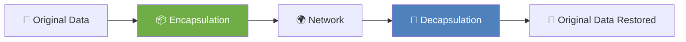

Encapsulation prepares data for transmission.

Decapsulation restores the original message for the receiving application.

---

## 🔄 The Direction Is Reversed

During encapsulation, data travels **down** the OSI Model.

During decapsulation, data travels **up** the OSI Model.

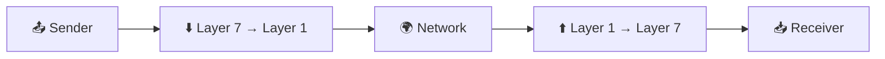

---

## 🌍 A Simple Example

Suppose you visit:

```text
https://www.google.com
```

Your browser sends a request.

Google processes it and sends a response back.

When that response reaches your computer, your network interface card receives a stream of binary data.

Your operating system must now:

- Convert the bits back into a frame.
- Remove the Ethernet header.
- Remove the IP header.
- Remove the TCP header.
- Deliver the original HTTP response to your browser.

Only then can the browser display the webpage.

---

## 🎯 Learning Goal

By the end of this lesson, you'll understand:

- How data travels upward through the OSI Model.
- What each layer removes during decapsulation.
- How protocol headers are processed.
- How PDUs change during the receiving process.
- Why decapsulation is essential for networking and cybersecurity.

---

> 💡 **Did You Know?**
>
> Every packet you receive on the Internet is decapsulated before any application can read its contents. Without decapsulation, your browser, email client, or messaging app would receive only raw network frames instead of meaningful data.

---

> ⚠️ **Common Beginner Mistake**
>
> Some learners think decapsulation means "deleting" headers.
>
> In reality, each layer first **reads and processes** its own header before removing it and passing the remaining data to the next layer.

---

## 🎓 Knowledge Check

Before moving on, ask yourself:

- What is decapsulation?
- Why is it necessary?
- Which direction does data travel during decapsulation?
- Is decapsulation the opposite of encapsulation?

---

➡️ **Next:** We'll follow a real network frame as it arrives at your computer and watch the decapsulation process begin from the Physical Layer.

---
# ═══════════════════════════════════════════════
# 🚀 The Journey Begins
# ═══════════════════════════════════════════════

Now that you understand **what decapsulation is**, let's watch it happen in real time.

We'll continue using the same example from the previous lesson.

You opened your browser and visited:

```
https://www.google.com
```

Your browser sent an HTTP request across the Internet.

Google processed that request and generated an HTTP response.

That response has now reached your computer.

The question is...

**How does your computer know what to do with it?**

The answer is **Decapsulation**.

---

## 🌍 A Real-World Scenario

Imagine Google's server sends the following response:

```http
HTTP/1.1 200 OK

<html>

...

</html>
```

Before this response reaches your browser, it travels across the Internet as:

- Bits
- Ethernet Frame
- IP Packet
- TCP Segment

When the data finally arrives at your computer, the operating system must reverse everything that happened during encapsulation.

---

<!--
Image Description:
A diagram showing Google's server sending a response back to a client computer. The response enters the client's Network Interface Card (NIC), then moves upward through the OSI Model toward the browser.

Search Keywords:
network decapsulation client receives packet diagram
-->

<p align="center">

</p>

---

# 🏁 Arrival at the Destination

The response first reaches your computer's **Network Interface Card (NIC)**.

At this moment, the NIC doesn't know anything about:

- HTML
- HTTP
- Web browsers

It simply receives a stream of binary data from the network.

---

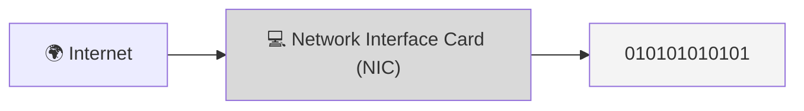

---

## 🔄 Beginning the Reverse Journey

Unlike encapsulation, where data moved **down** the OSI Model, decapsulation begins at the bottom.

Each layer performs three simple steps:

1. Read its own header.
2. Process the information.
3. Remove the header and pass the remaining data upward.

This continues until the original application data reaches the browser.

---

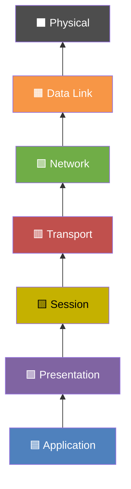

Notice something important.

The data is now traveling **upward**, not downward.

---

# 📦 Watching the Packet Shrink

During encapsulation, the packet became larger as every layer added information.

Now the opposite happens.

Each layer removes only the information that belongs to it.

---

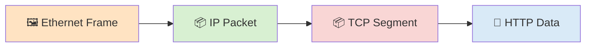

Instead of growing larger, the message becomes smaller as unnecessary networking information is removed.

---

# 🎯 The Goal

The purpose of decapsulation is simple.

Restore the original application data exactly as it was created by the sender.

If every layer successfully performs its job, your browser eventually receives:

```http
HTTP/1.1 200 OK

<html>

...

</html>
```

At that point, the browser can finally render the webpage for the user.

---

## 📈 Complete Overview

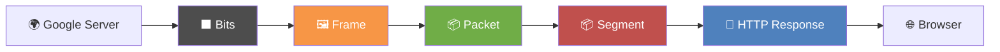

---

> 💡 **Did You Know?**
>
> Every webpage you load may involve hundreds or even thousands of frames arriving at your computer. Each one is decapsulated independently before the browser combines the content into the webpage you see.

---

> ⚠️ **Common Beginner Mistake**
>
> Some beginners think the browser receives packets directly from the Internet.
>
> In reality, the browser never sees Ethernet frames, IP packets, or TCP segments. Those are processed and removed by the operating system's networking stack long before the application receives the original data.

---

## 🎓 Knowledge Check

Before moving on, make sure you can answer:

- Where does decapsulation begin?
- Which hardware component first receives the incoming bits?
- Does each layer remove every header or only its own?
- Why does the packet become smaller as it moves upward?
- What is the final goal of decapsulation?

---

➡️ **Next:** We'll follow the incoming data through every OSI layer, watching each header get processed and removed until the original HTTP response reaches the browser.

---
# ═══════════════════════════════════════════════
# 🚀 The Journey Begins
# ═══════════════════════════════════════════════

Now that you understand **what decapsulation is**, let's watch it happen in real time.

We'll continue using the same example from the previous lesson.

You opened your browser and visited:

```
https://www.google.com
```

Your browser sent an HTTP request across the Internet.

Google processed that request and generated an HTTP response.

That response has now reached your computer.

The question is...

**How does your computer know what to do with it?**

The answer is **Decapsulation**.

---

## 🌍 A Real-World Scenario

Imagine Google's server sends the following response:

```http
HTTP/1.1 200 OK

<html>

...

</html>
```

Before this response reaches your browser, it travels across the Internet as:

- Bits
- Ethernet Frame
- IP Packet
- TCP Segment

When the data finally arrives at your computer, the operating system must reverse everything that happened during encapsulation.

---

<!--
Image Description:
A diagram showing Google's server sending a response back to a client computer. The response enters the client's Network Interface Card (NIC), then moves upward through the OSI Model toward the browser.

Search Keywords:
network decapsulation client receives packet diagram
-->

<p align="center">

</p>

---

# 🏁 Arrival at the Destination

The response first reaches your computer's **Network Interface Card (NIC)**.

At this moment, the NIC doesn't know anything about:

- HTML
- HTTP
- Web browsers

It simply receives a stream of binary data from the network.

---


---

## 🔄 Beginning the Reverse Journey

Unlike encapsulation, where data moved **down** the OSI Model, decapsulation begins at the bottom.

Each layer performs three simple steps:

1. Read its own header.
2. Process the information.
3. Remove the header and pass the remaining data upward.

This continues until the original application data reaches the browser.

---


Notice something important.

The data is now traveling **upward**, not downward.

---

# 📦 Watching the Packet Shrink

During encapsulation, the packet became larger as every layer added information.

Now the opposite happens.

Each layer removes only the information that belongs to it.

---


Instead of growing larger, the message becomes smaller as unnecessary networking information is removed.

---

# 🎯 The Goal

The purpose of decapsulation is simple.

Restore the original application data exactly as it was created by the sender.

If every layer successfully performs its job, your browser eventually receives:

```http
HTTP/1.1 200 OK

<html>

...

</html>
```

At that point, the browser can finally render the webpage for the user.

---

## 📈 Complete Overview


---

> 💡 **Did You Know?**
>
> Every webpage you load may involve hundreds or even thousands of frames arriving at your computer. Each one is decapsulated independently before the browser combines the content into the webpage you see.

---

> ⚠️ **Common Beginner Mistake**
>
> Some beginners think the browser receives packets directly from the Internet.
>
> In reality, the browser never sees Ethernet frames, IP packets, or TCP segments. Those are processed and removed by the operating system's networking stack long before the application receives the original data.

---

## 🎓 Knowledge Check

Before moving on, make sure you can answer:

- Where does decapsulation begin?
- Which hardware component first receives the incoming bits?
- Does each layer remove every header or only its own?
- Why does the packet become smaller as it moves upward?
- What is the final goal of decapsulation?

---

➡️ **Next:** We'll follow the incoming data through every OSI layer, watching each header get processed and removed until the original HTTP response reaches the browser.

---
# ═══════════════════════════════════════════════
# 📡 Continuing Through the Upper Layers
# ═══════════════════════════════════════════════

By the time the data reaches the upper layers of the OSI Model, all of the networking-related headers have already been removed.

The receiving computer now has the original application data, but there are still a few important tasks to complete before the application can actually use it.

These responsibilities belong to the top three layers of the OSI Model.

---

# 🟨 Step 5 — Session Layer (Layer 5)

The **Session Layer** manages communication sessions between applications.

Think of a session as an organized conversation between two devices.

Before data can be exchanged, a session is established.

While communication is taking place, the session is maintained.

When communication is complete, the session is terminated.

During decapsulation, the Session Layer ensures the incoming data belongs to the correct communication session.

---

## 🎯 Responsibilities

- Maintain active communication sessions.
- Synchronize data exchange.
- Resume interrupted sessions when possible.
- Close the session after communication ends.

---

## 🌐 Visualizing Layer 5

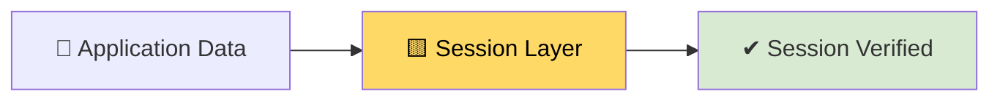

---

> 💡 **Example**
>
> Imagine you're downloading a large file.
>
> The Session Layer helps ensure that the communication session remains organized from the beginning of the download until the transfer is complete.

---

# 🟪 Step 6 — Presentation Layer (Layer 6)

Once the session has been verified, the data moves to the **Presentation Layer**.

This layer is responsible for making sure the receiving application can understand the incoming data.

Depending on how the sender prepared the data, the Presentation Layer may:

- Decrypt encrypted information.
- Decompress compressed data.
- Translate character encoding.
- Convert data into a standard format.

After these tasks are complete, the application receives data in a usable form.

---

## 🎯 Responsibilities

- Decrypt encrypted data.
- Decompress compressed files.
- Translate character encoding.
- Prepare data for the application.

---

## 🌐 Visualizing Layer 6

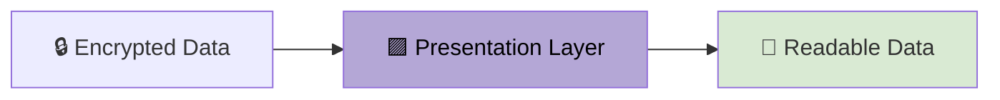

---

> 💡 **Real-World Example**
>
> When you visit an **HTTPS** website, the data arriving at your computer is encrypted.
>
> Before your browser can display the webpage, the Presentation Layer works with the encryption protocols (such as TLS) to convert the encrypted data into readable content.

---

# 🟦 Step 7 — Application Layer (Layer 7)

The final destination is the **Application Layer**.

At this point, every lower layer has completed its job.

The data is now ready for the application that requested it.

If the data belongs to:

- 🌐 A web browser → The webpage is displayed.
- 📧 An email client → The email appears in your inbox.
- ☁️ A cloud application → The requested information is shown.
- 🎮 An online game → The game processes the received data.

The networking process is now complete.

---

## 🎯 Responsibilities

- Deliver data to the correct application.
- Provide network services to software.
- Complete the communication process.

---

## 🌐 Visualizing Layer 7

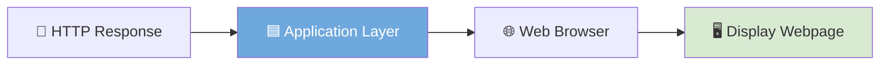

---

# 🛣️ The Complete Reverse Journey

Now let's put everything together.

The incoming message starts as electrical signals and gradually becomes meaningful information that an application can use.

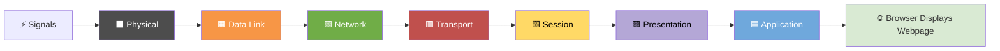

---

# 📊 Decapsulation at a Glance

| Layer | What Happens During Decapsulation |
|--------|----------------------------------|
| ⬛ Physical | Converts signals into bits. |
| 🟧 Data Link | Verifies the frame, checks the FCS, removes the Ethernet header and trailer. |
| 🟩 Network | Processes the IP header and removes it. |
| 🟥 Transport | Processes the TCP/UDP header and identifies the destination application using port numbers. |
| 🟨 Session | Maintains and verifies the communication session. |
| 🟪 Presentation | Decrypts, decompresses, and translates data into a usable format. |
| 🟦 Application | Delivers the original data to the appropriate application. |

---

> 💡 **Did You Know?**
>
> Although the Session and Presentation layers are shown separately in the OSI Model, many modern TCP/IP implementations combine their functionality into the **Application Layer**. The OSI Model separates them to make each responsibility easier to understand.

---

> ⚠️ **Common Beginner Mistake**
>
> Some learners think the Presentation and Session layers are "unused" because they aren't always visible in tools like Wireshark.
>
> In reality, their responsibilities still exist. Modern operating systems and applications often implement these functions together rather than as separate software layers.

---

## 🎓 Knowledge Check

Before moving on, see if you can answer these questions:

- Which layer is responsible for decrypting encrypted data?
- Which layer manages communication sessions?
- Which layer finally delivers the data to the browser?
- Why doesn't the browser receive Ethernet frames directly?
- Why are the Session and Presentation layers less visible in modern networks?

---

➡️ **Next:** We'll explore **Protocol Data Units (PDUs)** during decapsulation and see how the data changes from **Bits → Frame → Packet → Segment → Data** as it travels back up the networking stack.

---
# ═══════════════════════════════════════════════
# 📦 Protocol Data Units (PDUs) During Decapsulation
# ═══════════════════════════════════════════════

As data travels upward through the OSI Model, it gradually returns to its original form.

This transformation happens because each layer removes its own protocol information before passing the remaining data to the next layer.

The name given to the data at each stage is called a **Protocol Data Unit (PDU).**

Understanding these PDUs is essential because networking professionals, packet analyzers, and cybersecurity tools all use these terms when describing network traffic.

---

# 📌 What is a Protocol Data Unit (PDU)?

A **Protocol Data Unit (PDU)** is the specific name given to data at a particular layer of the OSI Model.

As decapsulation progresses, the PDU changes because protocol headers are removed layer by layer.

---

## 🗺️ PDU Transformation

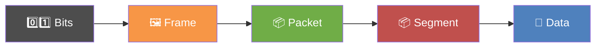

Every step removes one layer of networking information until only the original application data remains.

---

# 📊 PDU Changes Layer by Layer

| OSI Layer | Incoming PDU | Action Performed | Outgoing PDU |
|-----------|--------------|------------------|--------------|
| ⬛ Physical | Signals | Converts signals into bits | Bits |
| 🟧 Data Link | Bits | Reconstructs the Ethernet Frame and removes the Ethernet header & trailer | Packet |
| 🟩 Network | Packet | Removes the IP Header | Segment |
| 🟥 Transport | Segment | Removes the TCP/UDP Header | Data |
| 🟨 Session | Data | Verifies and manages the communication session | Data |
| 🟪 Presentation | Data | Decrypts, decompresses, translates | Data |
| 🟦 Application | Data | Delivers the message to the application | Original Data |

---

# 📦 Watching the PDU Change

Let's watch one HTTP response travel upward through the stack.

---

## ⬛ Physical Layer

Incoming

```text
010101010101010...
```

The Physical Layer converts electrical, optical, or wireless signals into binary digits.

Outgoing

```text
Bits
```

---

## 🟧 Data Link Layer

Incoming

```text
🖼️ Ethernet Frame
```

After checking the MAC addresses and verifying the Frame Check Sequence (FCS), the Ethernet header and trailer are removed.

Outgoing

```text
📦 IP Packet
```

---

## 🟩 Network Layer

Incoming

```text
📦 IP Packet
```

The IP header is examined and removed.

Outgoing

```text
📦 TCP Segment
```

---

## 🟥 Transport Layer

Incoming

```text
📦 TCP Segment
```

The TCP header is processed to identify the destination application using the port number.

Outgoing

```text
📄 Application Data
```

---

## 🟨🟪🟦 Upper Layers

The upper three layers no longer change the PDU's name.

Instead, they prepare the recovered data for the application.

Tasks include:

- Managing sessions.
- Decrypting encrypted data.
- Decompressing compressed information.
- Translating data formats.
- Delivering the message to the correct application.

The PDU remains **Data** throughout these layers.

---

# 🔄 Comparing Both Directions

One of the easiest ways to remember networking is to compare encapsulation and decapsulation side by side.

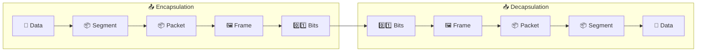

The sender builds the transmission.

The receiver carefully takes it apart.

---

# 🧠 Memory Trick

A simple way to remember the order is:

### 📤 Encapsulation

```text
Data
   ↓
Segment
   ↓
Packet
   ↓
Frame
   ↓
Bits
```

### 📥 Decapsulation

```text
Bits
   ↑
Frame
   ↑
Packet
   ↑
Segment
   ↑
Data
```

Think of it like packing and unpacking a parcel.

- 📦 Encapsulation packs everything for delivery.
- 📂 Decapsulation unpacks everything for the recipient.

---

> 💡 **Did You Know?**
>
> Wireshark displays most captured traffic as **Frames**, because that's the first complete protocol data unit reconstructed after the Physical Layer converts incoming signals into digital bits.

---

> ⚠️ **Common Beginner Mistake**
>
> Many learners believe the PDU changes at every OSI layer.
>
> In reality, the PDU only changes names at specific layers:
>
> - **Bits → Frame**
> - **Frame → Packet**
> - **Packet → Segment**
> - **Segment → Data**
>
> The upper three layers continue processing **Data** without changing its name.

---

## 🎓 Knowledge Check

Test your understanding before moving on.

- What does **PDU** stand for?
- Which PDU arrives at the Network Layer?
- Which layer converts a Packet into a Segment?
- Why doesn't the PDU change name in the upper three layers?
- Which PDU is finally delivered to the browser?

---

➡️ **Next:** We'll follow a complete real-world example by receiving a response from **Google**, tracing every step of decapsulation from the network interface card all the way to the web browser.

---
# ═══════════════════════════════════════════════
# 🌍 Real-World Example — Receiving a Website
# ═══════════════════════════════════════════════

So far, we've learned how each OSI layer performs its own role during decapsulation.

Now let's watch the **entire process** happen using a real example.

Suppose you open your web browser and visit:

```text
https://www.google.com
```

Earlier, your computer sent an HTTP request using **Encapsulation**.

Google received that request, processed it, and prepared an HTTP response.

Now it's your computer's turn to receive that response.

Let's follow the journey from Google's server all the way to your browser.

---

# 🌐 Step 1 — Google Sends the Response

After receiving your request, Google's web server generates a response.

A simplified version might look like this:

```http
HTTP/1.1 200 OK

<html>

<head>
...
</head>

<body>

Google Home Page

</body>

</html>
```

Of course, a real webpage is much larger and contains:

- HTML
- CSS
- JavaScript
- Images
- Fonts
- Cookies
- Security Headers

Before leaving Google's server, this data is **encapsulated**.

It becomes:

```
HTTP Data
      ↓
TCP Segment
      ↓
IP Packet
      ↓
Ethernet Frame
      ↓
Bits
```

Those bits are transmitted across the Internet.

---

<!--
Image Description:
Illustration showing Google's web server sending an HTTPS response across the Internet toward a client computer.

Suggested Search Keywords:
client server response diagram internet data flow
-->

<p align="center">

</p>

---

# 🌍 Step 2 — The Response Travels Across the Internet

The response doesn't travel directly from Google to your computer.

Instead, it passes through many networking devices, including:

- Switches
- Routers
- Internet Service Providers (ISPs)
- Fiber optic links
- Data centers

Every router examines only the information it needs to forward the packet.

None of them care about the HTML webpage inside.

---

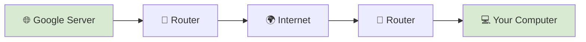

---

## 💡 Notice

Routers never open the webpage.

They simply examine network information such as:

- Destination IP Address
- TTL
- Routing Information

Then they forward the packet toward its destination.

---

# 💻 Step 3 — Your NIC Receives the Data

Eventually, the transmission reaches your computer.

The **Network Interface Card (NIC)** receives the incoming electrical signals, optical signals, or wireless radio waves.

The NIC converts them into digital bits.

At this stage your browser still knows nothing about the webpage.

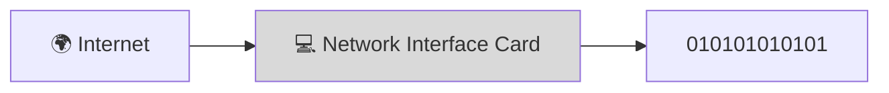

The operating system now begins **Decapsulation**.

---

# 📦 Step 4 — Layer-by-Layer Decapsulation

Each OSI layer performs its own task.

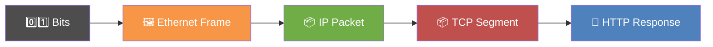

Let's see what happens.

---

## ⬛ Physical Layer

Receives:

```
Bits
```

Converts electrical or wireless signals into binary data.

---

## 🟧 Data Link Layer

Receives:

```
Ethernet Frame
```

Checks:

- Destination MAC Address
- Source MAC Address
- Frame Check Sequence (FCS)

Removes:

- Ethernet Header
- Ethernet Trailer

Passes:

```
IP Packet
```

---

## 🟩 Network Layer

Receives:

```
IP Packet
```

Checks:

- Source IP Address
- Destination IP Address
- TTL
- Protocol

Removes:

- IP Header

Passes:

```
TCP Segment
```

---

## 🟥 Transport Layer

Receives:

```
TCP Segment
```

Checks:

- Port Numbers
- Sequence Numbers
- TCP Flags

Removes:

- TCP Header

Passes:

```
HTTP Response
```

---

## 🟨🟪🟦 Upper Layers

Finally, the upper layers:

- Verify the session.
- Decrypt TLS traffic if necessary.
- Translate data into a usable format.
- Deliver it to the browser.

The browser now receives the original webpage.

---

# 🌐 Step 5 — The Browser Renders the Page

Once the browser receives the HTTP response, networking is finished.

The browser now begins its own work.

It:

- Parses the HTML.
- Downloads CSS files.
- Downloads JavaScript files.
- Requests images.
- Applies styles.
- Executes scripts.
- Draws everything on your screen.

Only after all of these steps do you finally see:

```
https://www.google.com
```

displayed in your browser.

---

<!--
Image Description:
A browser displaying the Google homepage after successfully receiving and processing the HTTP response.

Suggested Search Keywords:
browser renders webpage illustration
-->

<p align="center">

</p>

---

# 🔄 The Complete Journey

Everything you've learned can now be summarized in one diagram.

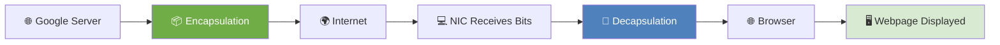

This is exactly what happens every time you:

- Open a website.
- Watch a YouTube video.
- Download a file.
- Read an email.
- Use cloud applications.
- Play online games.

Every network communication follows this same fundamental process.

---

# 📊 Putting It All Together

```mermaid
sequenceDiagram

participant Browser
participant OS as Operating System
participant NIC
participant Internet
participant Google

Browser->>OS: Request Webpage
OS->>Internet: Encapsulated Request
Internet->>Google: Deliver Request

Google-->>Internet: Encapsulated Response
Internet-->>NIC: Bits
NIC-->>OS: Begin Decapsulation
OS-->>Browser: HTTP Response
Browser-->>Browser: Render Webpage
```

This sequence shows the complete lifecycle of a web request—from the browser's request to the rendered webpage.

---

> 💡 **Did You Know?**
>
> Loading a modern website often generates **hundreds or even thousands of HTTP requests**. Every image, stylesheet, JavaScript file, font, advertisement, and API call follows this same encapsulation and decapsulation process independently.

---

> ⚠️ **Common Beginner Mistake**
>
> Many people believe the browser receives data directly from the Internet.
>
> In reality, the browser only receives **application data** after the operating system has completed the entire decapsulation process. The browser never processes Ethernet frames, IP packets, or TCP segments directly.

---

## 🎓 Knowledge Check

Before continuing, see if you can answer these questions:

- What is the first device in your computer to receive incoming network traffic?
- Which OSI layer removes the Ethernet header?
- Which layer removes the IP header?
- Which layer identifies the destination application using port numbers?
- At what point does the browser finally receive the webpage?
- Why don't routers need to inspect the HTML content of the webpage?

---

➡️ **Next:** We'll open **Wireshark** and observe this exact communication in a packet capture, learning how to identify Ethernet, IP, TCP, and HTTP information inside real network traffic.

---
# ═══════════════════════════════════════════════
# 🖥️ Decapsulation Through Wireshark
# ═══════════════════════════════════════════════

So far, you've learned decapsulation as a networking concept.

But how can we actually **observe** this process?

The answer is **Wireshark**.

Although Wireshark cannot literally watch your operating system remove protocol headers, it captures incoming network frames before they're fully processed by the networking stack.

By inspecting these captured frames, we can understand exactly what information each OSI layer receives during decapsulation.

---

# 🎯 Why Wireshark Matters

Wireshark is one of the most important tools in networking and cybersecurity.

It allows you to:

- 📡 Capture live network traffic.
- 🔍 Inspect protocol headers.
- 🛠️ Troubleshoot communication problems.
- 🚨 Detect suspicious network activity.
- 📦 Understand encapsulation and decapsulation.
- 🧑‍💻 Analyze cyberattacks.

Learning Wireshark turns networking theory into something you can actually see.

---

# 🌍 Revisiting Our Example

We'll continue using the same scenario.

You visited:

```text
https://www.google.com
```

Your browser sent an HTTP request.

Google responded with an HTTPS response.

That response traveled across the Internet and eventually reached your computer.

If Wireshark had been running, it would have captured the incoming traffic.

---

<!--
Image Description:
Screenshot of Wireshark capturing HTTPS traffic. The packet list should show protocols such as Ethernet II, IPv4, TCP, TLS, and HTTP where applicable.

Suggested Search Keywords:
Wireshark HTTPS packet capture Ethernet IPv4 TCP
-->

<p align="center">

</p>

---

# 📦 What Does Wireshark Capture?

One of the biggest misconceptions is:

> **"Wireshark captures packets."**

Technically, that's not quite correct.

Wireshark captures **network frames**.

Each frame contains multiple protocol headers that were added during encapsulation.

Those are the same headers your operating system processes during decapsulation.

---

```mermaid
flowchart TD

A["🖼️ Ethernet Frame"]

-->

B["🌐 IP Packet"]

-->

C["📦 TCP Segment"]

-->

D["🔒 TLS"]

-->

E["📄 HTTP Data"]

style A fill:#F79646,color:#fff
style B fill:#70AD47,color:#fff
style C fill:#C0504D,color:#fff
style D fill:#8064A2,color:#fff
style E fill:#4F81BD,color:#fff
```

Think of the frame as a collection of nested layers.

During decapsulation, those layers are processed from the outside inward.

---

# 🔍 Expanding a Packet

When you click a packet inside Wireshark, you'll typically see something similar to this.

```text
Frame

├── Ethernet II
│
├── Internet Protocol Version 4 (IPv4)
│
├── Transmission Control Protocol (TCP)
│
├── Transport Layer Security (TLS)
│
└── Hypertext Transfer Protocol (HTTP)
```

Each protocol corresponds to one or more layers of the OSI Model.

As your operating system decapsulates the data, it processes these protocols in exactly this order.

---

# 🗺️ Mapping Wireshark to the OSI Model

The relationship becomes much easier to understand when viewed side by side.

| OSI Layer | Example in Wireshark |
|-----------|----------------------|
| 🟦 Application | HTTP, DNS |
| 🟪 Presentation | TLS Encryption |
| 🟨 Session | Session Information (handled by protocols) |
| 🟥 Transport | TCP / UDP |
| 🟩 Network | IPv4 / IPv6 |
| 🟧 Data Link | Ethernet II |
| ⬛ Physical | Electrical Signals (not visible) |

---

# 📂 Following the Decapsulation Process

Now imagine your operating system processing the captured frame.

```mermaid
flowchart LR

A["🖼️ Ethernet Frame"]

-->

B["🗑️ Remove Ethernet Header"]

-->

C["📦 IP Packet"]

-->

D["🗑️ Remove IP Header"]

-->

E["📦 TCP Segment"]

-->

F["🗑️ Remove TCP Header"]

-->

G["📄 HTTP Data"]

style A fill:#F79646,color:#fff
style C fill:#70AD47,color:#fff
style E fill:#C0504D,color:#fff
style G fill:#4F81BD,color:#fff
```

Notice something important.

Wireshark displays **all** of these protocol headers.

Your operating system processes them one by one until only the application data remains.

---

# 🔍 What Information Can You Read?

Expanding each section reveals useful information.

### 🟧 Ethernet II

- Source MAC Address
- Destination MAC Address
- EtherType

---

### 🟩 IPv4

- Source IP Address
- Destination IP Address
- Time To Live (TTL)
- Header Length
- Protocol

---

### 🟥 TCP

- Source Port
- Destination Port
- Sequence Number
- ACK Number
- TCP Flags
- Window Size

---

### 🟦 HTTP / HTTPS

- Request Method
- Response Code
- Host Name
- Cookies
- Headers
- HTML Data

Every one of these fields exists because of encapsulation.

Every one of them is processed during decapsulation.

---

# ⚠️ Why Can't We See the Physical Layer?

Many beginners wonder:

> **"Where are the bits?"**

The answer is simple.

By the time Wireshark receives the traffic, the **Network Interface Card (NIC)** has already converted the electrical, optical, or wireless signals into digital frames.

That's why Wireshark begins with the **Data Link Layer**, not the Physical Layer.

---

```mermaid
flowchart LR

A["⚡ Signals"]

-->

B["💻 Network Interface Card"]

-->

C["🖼️ Ethernet Frame"]

-->

D["🖥️ Wireshark"]

style B fill:#D9D9D9
style D fill:#D9EAD3
```

The conversion happens before Wireshark ever sees the traffic.

---

# 🛡️ Why This Matters in Cybersecurity

Cybersecurity professionals rely on Wireshark every day.

By examining captured frames, they can:

- 🔍 Detect malware communication.
- 🚨 Investigate suspicious network traffic.
- 🌐 Analyze web requests.
- 📧 Inspect email traffic.
- 🧑‍💻 Identify port scans.
- 📦 Investigate packet loss.
- 🔒 Verify encrypted connections.
- 🛠️ Troubleshoot networking issues.

Without understanding decapsulation, interpreting packet captures becomes much more difficult.

---

> 💡 **Did You Know?**
>
> A single webpage may generate hundreds or even thousands of captured frames. Wireshark allows you to inspect every one of them individually, making it an invaluable tool for troubleshooting and cybersecurity investigations.

---

> ⚠️ **Common Beginner Mistake**
>
> Many people believe Wireshark "performs" decapsulation.
>
> It doesn't.
>
> Wireshark **captures and displays** protocol information. Your operating system is responsible for processing and removing those headers during the actual decapsulation process.

---

## 🎓 Knowledge Check

Before moving on, see if you can answer these questions:

- What does Wireshark actually capture?
- Why doesn't Wireshark display the Physical Layer?
- Which protocol header is processed first during decapsulation?
- Which protocol identifies the destination application?
- Why is Wireshark so valuable to cybersecurity professionals?

---

➡️ **Next:** We'll conclude this lesson by exploring **Decapsulation in Cybersecurity**, reviewing common beginner mistakes, summarizing the entire process, and testing your understanding with a final knowledge check.

---
# ═══════════════════════════════════════════════
# 🛡️ Decapsulation in Cybersecurity
# ═══════════════════════════════════════════════

Understanding decapsulation isn't just useful for networking—it's a fundamental skill in cybersecurity.

Almost every defensive and offensive security task involves inspecting, analyzing, or manipulating network traffic. To understand what's happening on a network, security professionals must know how data is unpacked as it moves through the networking stack.

Without this knowledge, packet captures become difficult to interpret, intrusion alerts lose context, and troubleshooting often becomes guesswork.

---

## 🎯 Where Decapsulation Is Used

A solid understanding of decapsulation helps in many cybersecurity domains.

### 🌐 Network Monitoring

Security analysts inspect captured traffic to understand how data travels between systems and to identify abnormal behavior.

### 🔍 Packet Analysis

Tools such as **Wireshark** display protocol headers that are processed during decapsulation, allowing analysts to investigate communication in detail.

### 🚨 Incident Response

During a security incident, investigators examine captured packets to determine:

- What happened
- Which systems communicated
- Which protocols were used
- What data was transferred

### 🛡️ Intrusion Detection & Prevention

IDS and IPS solutions inspect packets as they move through the network, looking for malicious patterns, protocol anomalies, and attack signatures.

### 🦠 Malware Analysis

Many types of malware communicate with remote servers.

Understanding decapsulation helps analysts identify:

- Command-and-control (C2) traffic
- Data exfiltration
- Beaconing behavior
- Suspicious network connections

### 🔐 Digital Forensics

Network evidence often plays a critical role in forensic investigations.

Investigators reconstruct communication by analyzing packets layer by layer.

---

# 📊 Complete Decapsulation Summary

| OSI Layer | Receives | Primary Responsibility | Sends Upward |
|-----------|-----------|------------------------|--------------|
| ⬛ Physical | Signals | Converts signals into bits | Bits |
| 🟧 Data Link | Frame | Verifies MAC addresses and FCS, removes Ethernet header & trailer | Packet |
| 🟩 Network | Packet | Processes and removes the IP header | Segment |
| 🟥 Transport | Segment | Processes TCP/UDP headers and identifies the destination application | Data |
| 🟨 Session | Data | Maintains and manages communication sessions | Data |
| 🟪 Presentation | Data | Decrypts, decompresses, and translates data | Data |
| 🟦 Application | Data | Delivers the message to the application | Original Information |

---

# 🔄 The Entire Process at a Glance

```mermaid
flowchart LR

A["🌍 Internet"]

-->

B["⬛ Physical"]

-->

C["🟧 Data Link"]

-->

D["🟩 Network"]

-->

E["🟥 Transport"]

-->

F["🟨 Session"]

-->

G["🟪 Presentation"]

-->

H["🟦 Application"]

-->

I["🌐 Browser Displays the Webpage"]

style B fill:#4D4D4D,color:#fff
style C fill:#F79646,color:#fff
style D fill:#70AD47,color:#fff
style E fill:#C0504D,color:#fff
style F fill:#FFD966,color:#000
style G fill:#B4A7D6,color:#000
style H fill:#6FA8DC,color:#fff
style I fill:#D9EAD3
```

Every successful network communication follows this same journey.

---

# ⚠️ Common Beginner Mistakes

Understanding what **doesn't** happen is just as important as understanding what does.

### ❌ "Decapsulation deletes data."

No.

Only protocol headers (and trailers) are removed.

The original application data remains intact.

---

### ❌ "Every OSI layer removes a header."

Not exactly.

Only layers that have protocol-specific headers remove them.

The upper layers mainly process the data rather than stripping additional networking headers.

---

### ❌ "The browser receives Ethernet frames."

No.

The browser never interacts directly with Ethernet frames, IP packets, or TCP segments.

Those are processed by the operating system before the application receives the data.

---

### ❌ "Wireshark performs decapsulation."

Incorrect.

Wireshark captures and displays protocol information.

Your operating system performs the actual decapsulation.

---

### ❌ "Encapsulation is more important than Decapsulation."

Neither is more important.

Communication only succeeds because both processes work together.

One prepares data for transmission.

The other restores it for the receiving application.

---

# 🧠 60-Second Revision

If you only remember a few things from this lesson, remember these:

- Every received message goes through **Decapsulation**.
- Data moves **upward** through the OSI Model.
- Each layer processes and removes **only its own** protocol information.
- The PDU changes from **Bits → Frame → Packet → Segment → Data**.
- The browser receives **application data**, not network frames.
- Decapsulation is the reverse of encapsulation.
- Wireshark helps visualize the protocol headers involved in this process.

---

# 🎓 Final Knowledge Check

Test your understanding before moving on.

### Conceptual Questions

1. What is decapsulation?
2. Why is decapsulation necessary?
3. Which direction does data travel during decapsulation?
4. What is a Protocol Data Unit (PDU)?
5. Why do PDUs change names?

---

### OSI Layer Questions

6. Which layer receives electrical, optical, or wireless signals?
7. Which layer checks the Frame Check Sequence (FCS)?
8. Which layer removes the IP header?
9. Which layer uses port numbers to identify applications?
10. Which layer delivers the recovered data to the browser?

---

### Practical Questions

11. Why doesn't the browser receive Ethernet frames directly?
12. Why can't Wireshark display the Physical Layer?
13. Which protocol is responsible for routing packets across networks?
14. Why is understanding decapsulation useful during packet analysis?
15. How does decapsulation help cybersecurity professionals investigate suspicious network activity?

---

# 💡 Key Takeaways

- Decapsulation is the reverse of encapsulation.
- Incoming data moves upward through the OSI Model.
- Every layer performs a specific task before passing data to the next layer.
- Protocol headers are removed one layer at a time.
- The PDU changes from **Bits → Frame → Packet → Segment → Data**.
- Applications receive only the original data—not the networking headers used to transport it.
- Tools like Wireshark display the protocol information involved in decapsulation, making them invaluable for networking and cybersecurity.

---

# 📖 Further Reading

Now that you understand both **Encapsulation** and **Decapsulation**, revisit these topics to strengthen your understanding:

- **OSI Model**
- **TCP/IP Model**
- **OSI vs TCP/IP**
- **Packet Structure**
- **Network Protocols**

Understanding how these concepts connect will make future networking and cybersecurity topics much easier to learn.

---

## ➡️ Next Lesson

You've now learned how data is **prepared for transmission (Encapsulation)** and **restored on arrival (Decapsulation)**.

Together, these two processes explain **how information travels successfully between devices across a network**.

The next module shifts from **logical communication models** to the **physical devices** that make networking possible.

In the **📡 Network Devices** module, you'll explore the hardware responsible for moving data through modern networks, including:

- 🔀 Switch
- 🌐 Router
- 📡 Hub
- 🌉 Bridge
- 🔁 Repeater
- 📶 Access Point
- 📞 Modem
- 🚪 Gateway
- 🔥 Firewall

Understanding these devices will help you connect the logical concepts you've learned in this chapter with the real-world infrastructure that powers homes, businesses, and the Internet.

Continue to **[📡 Network Devices](../02-Network%20Devices/README.md)** to begin the next chapter of your networking journey.

---