<div align="center">

# 📦 Encapsulation

### Learn how application data is wrapped layer by layer before traveling across a network.

<p>
  
  
  
</p>

<p>
  
  
  
</p>

</div>


---

>
> **Lesson at a Glance**
>
> 📚 Topic: Encapsulation
>
> 🧱 Module: Network Models
>
> 🎯 Goal: Learn how application data is transformed into network traffic.
>
> 📦 Key Concepts:
>
> - Headers
> - PDUs
> - Segments
> - Packets
> - Frames
> - Bits
>
> 🌍 Real-World Relevance:
>
> Every webpage, email, video call, online game, and file transfer relies on encapsulation before data can travel across a network.

---

# 📑 Table of Contents

- [📌 Overview](#-overview)
- [🎯 Why Learn Encapsulation?](#-why-learn-encapsulation)
- [🎯 Learning Objectives](#-learning-objectives)
- [📦 What is Encapsulation?](#-what-is-encapsulation)
- [🏗️ Why Do We Need Encapsulation?](#️-why-do-we-need-encapsulation)
- [🚀 The Journey Begins](#-the-journey-begins)
- [📚 Encapsulation Layer by Layer](#-encapsulation-layer-by-layer)
- [📦 Protocol Data Unit Transformation](#-protocol-data-unit-transformation)
- [🌍 Real-World Example](#-real-world-example)
- [🛡️ Cybersecurity Perspective](#️-cybersecurity-perspective)
- [⚠️ Common Beginner Mistakes](#️-common-beginner-mistakes)
- [📝 Summary](#-summary)
- [➡️ Next Lesson](#️-next-lesson)

---

# 📌 Overview

When you open a website, send an email, stream a movie, or join an online game, your computer doesn't send the original data directly onto the network.

Instead, the data passes through each layer of the **OSI Model**, where every layer adds its own information before handing the data to the next layer.

This process is called **Encapsulation**.

Think of encapsulation as preparing a package for delivery.

Before shipping a product, you don't simply hand it to a courier.

Instead, you:

- Place the item inside a box.
- Add a shipping label.
- Include the destination address.
- Seal the package.
- Hand it to the delivery company.

Networking works in much the same way.

Each OSI layer wraps the original data with additional information that helps the receiving device understand **where the data should go, how it should be delivered, and how it should be processed**.

Without encapsulation, modern networking would not be possible.

---

<!--
Image Description:
A layered illustration showing a message moving down the OSI Model. Each layer wraps the data with another colored header until it becomes bits at the Physical Layer.

Search Keywords:
OSI encapsulation diagram layers headers packet animation
-->

<p align="center">

</p>

---

# 🎯 Why Learn Encapsulation?

Many networking concepts make sense only after you understand encapsulation.

For example:

- Why packets have headers.
- Why routers only examine IP addresses.
- Why switches only care about MAC addresses.
- Why Wireshark displays multiple protocol headers.
- Why TCP and IP each add their own information.
- Why the same piece of data has different names at different layers.

Encapsulation connects everything you've learned about the OSI Model into one complete process.

Instead of seeing seven independent layers, you'll see **how they cooperate to deliver data from one device to another**.

---

# 🎯 Learning Objectives

By the end of this lesson, you should be able to:

- Define encapsulation.
- Explain why encapsulation is necessary.
- Describe how data moves through the OSI Model.
- Identify the header added by each layer.
- Explain why each layer adds its own information.
- Recognize how PDUs change throughout the encapsulation process.
- Understand how encapsulation appears in packet captures.
- Relate encapsulation to real-world networking and cybersecurity.

---

# 📦 What is Encapsulation?

**Encapsulation** is the process of **adding protocol-specific information to data as it travels down the networking stack** before being transmitted across a network.

Every layer performs a specific job.

After finishing its task, the layer attaches its own **header** (and sometimes a trailer) before passing the data to the layer below.

By the time the information reaches the Physical Layer, the original application data has been wrapped multiple times.

Each wrapper contains instructions that help networking devices process the data correctly.

---

> 💡 Think of it like nesting boxes.

A small gift is placed inside a box.

That box is placed inside another box.

That box goes inside a shipping package.

Finally, a delivery label is attached.

Every outer layer adds information without changing the original gift inside.

Encapsulation works exactly the same way.

The original application data remains intact while every OSI layer wraps it with additional networking information.

---

> 📌 Remember
>
> **Encapsulation does not modify the original data.**
>
> Instead, each networking layer simply adds the information it needs before passing the data to the next layer.

---

# 🏗️ Why Do We Need Encapsulation?

Imagine sending a letter without:

- a destination address,
- a return address,
- an envelope,
- or a postage stamp.

The postal service wouldn't know:

- who sent it,
- where it should go,
- or how to deliver it.

Computer networks face the same challenge.

Different networking devices require different information.

For example:

- Routers need IP addresses.
- Switches need MAC addresses.
- Applications need port numbers.
- Receivers need sequencing information.
- Network interfaces need error detection.

Instead of placing all of this information into one giant structure, each OSI layer adds only the information relevant to its own responsibilities.

This layered design keeps networking organized, modular, and scalable.

---

## 🧠 Key Idea

Every layer asks one question:

- Layer 7 → **What is the user trying to do?**
- Layer 6 → **How should the data be formatted?**
- Layer 5 → **Which session does this belong to?**
- Layer 4 → **Which application should receive it?**
- Layer 3 → **Which network should it travel to?**
- Layer 2 → **Which local device should receive it?**
- Layer 1 → **How can these bits be physically transmitted?**

Encapsulation is simply the process of answering these questions one layer at a time.

---

➡️ **Next:** We'll follow a single message as it travels through every OSI layer, watching each protocol wrap the data with its own header before it's transmitted across the network.

---
# ═══════════════════════════════════════════════
# 🚀 The Journey Begins
# ═══════════════════════════════════════════════

Now that you understand **what encapsulation is**, let's watch it happen in real time.

Imagine you open your web browser and visit:

```
https://www.google.com
```

To you, it feels simple.

You press **Enter**.

A few seconds later, Google's homepage appears.

Behind the scenes, however, your computer performs dozens of networking operations before even a single bit leaves your network card.

The request must travel through every layer of the OSI Model, with each layer adding its own information to help the data reach its destination.

---

## 🌍 A Real-World Scenario

Suppose you type:

```
https://www.google.com
```

and press **Enter**.

Your browser creates an HTTP request similar to:

```
GET / HTTP/1.1
Host: www.google.com
```

At this point, this is simply **application data**.

It contains no IP address.

No MAC address.

No port number.

No routing information.

No error detection.

If this data were placed directly onto the network, no device would know:

- Where it should go.
- Which application should receive it.
- How it should travel.
- Whether it arrived correctly.

That's why encapsulation begins.

---

<!--
Image Description:
Illustration showing a user typing "https://www.google.com" into a web browser. The browser generates an HTTP request that begins moving into the OSI stack.

Search Keywords:
Browser HTTP request OSI diagram
-->

<p align="center">

</p>

---

# 🏗️ Building the Network Package

Think about sending a valuable package through a courier service.

You don't simply hand the courier the item.

Instead, you prepare it step by step.

```
Gift

↓

Gift Box

↓

Shipping Box

↓

Shipping Label

↓

Delivery Truck
```

Each step adds information that wasn't needed before.

Networking follows exactly the same idea.

Every OSI layer wraps the existing data with additional information until the message is finally ready for transmission.

---

## 📦 What Does Each Layer Add?

Every layer contributes something different.

| Layer | Adds |
|--------|------|
| 🟦 Application | User Data |
| 🟪 Presentation | Formatting / Encryption Information |
| 🟨 Session | Session Information |
| 🟥 Transport | TCP or UDP Header |
| 🟩 Network | IP Header |
| 🟧 Data Link | Ethernet Header & Trailer |
| ⬛ Physical | Converts Everything into Bits |

Notice something important.

The original application data is **never replaced**.

Every layer simply wraps it with another piece of information.

This is why the process is called **Encapsulation**.

---

# 🎨 Visualizing Encapsulation

The easiest way to understand encapsulation is to imagine layers wrapping around the original data.

```
Original Data

↓

[Presentation Header]

↓

[Session Header]

↓

[TCP Header]

↓

[IP Header]

↓

[Ethernet Header]

↓

[Ethernet Trailer]

↓

Bits
```

Each new wrapper contains instructions used by a different part of the network.

---

<!--
Image Description:
A colorful layered diagram showing data wrapped by successive headers. Each layer should use a different color representing the OSI Model.

Search Keywords:
OSI encapsulation headers diagram
-->

<p align="center">

</p>

---

# 🔄 Encapsulation Flow

The complete journey looks like this.

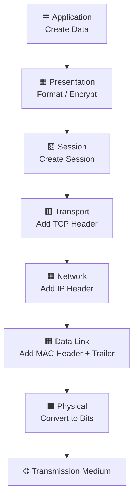

Notice how the amount of information grows at every layer.

The original message becomes larger because every protocol adds its own header.

---

## 📈 The Packet Gets Bigger

Suppose your original application data is:

```
Hello
```

Very small.

After encapsulation it may look conceptually like this:

```
Ethernet Header

↓

IP Header

↓

TCP Header

↓

Application Data

↓

Ethernet Trailer
```

The actual message transmitted across the network is much larger than the original word **"Hello"** because networking information surrounds it.

This additional information is called **protocol overhead**.

Although overhead increases the size of the transmitted data, it is essential because it allows routers, switches, operating systems, and applications to process the data correctly.

---

> 💡 **Did You Know?**
>
> Most of the data transmitted across the Internet isn't the original message—it consists of protocol headers, trailers, acknowledgments, checksums, and other control information that make reliable communication possible.

---

> ⚠️ **Common Beginner Mistake**
>
> Beginners often think the Application Layer sends data directly onto the network.
>
> In reality, every lower layer must first prepare the data by adding its own protocol information before transmission can occur.

---

> 📌 **Remember**
>
> Encapsulation is a **layer-by-layer process**.
>
> Each layer only adds the information that it is responsible for.
>
> No layer removes information during encapsulation—that happens later during **Decapsulation** on the receiving device.

---

## 🎓 Knowledge Check

Before moving on, make sure you can answer:

- Why can't an application send raw data directly across a network?
- Why does each layer add its own header?
- What is protocol overhead?
- Does encapsulation replace the original data or wrap around it?
- Which layer performs the final conversion into bits?

---

➡️ **Next:** We'll follow the data through **every individual OSI layer**, examining exactly **which header is added, why it's needed, and how the Protocol Data Unit (PDU) changes** from **Data → Segment → Packet → Frame → Bits.

---
# ═══════════════════════════════════════════════
# 📚 Encapsulation Layer by Layer
# ═══════════════════════════════════════════════

Now it's time to follow our data as it travels through each layer of the OSI Model.

We'll continue using the same example:

```
https://www.google.com
```

When you press **Enter**, your browser creates an HTTP request.

That request doesn't immediately leave your computer.

Instead, it begins a journey down through all **seven layers**, where each layer performs a specific task and wraps the data with additional information.

By the time it reaches the Physical Layer, the original message has become a complete network frame ready for transmission.

---

# 🟦 Step 1 — Application Layer (Layer 7)

The journey begins at the **Application Layer**.

This is where user applications—such as web browsers, email clients, or messaging apps—generate the data that needs to be sent across the network.

In our example, your browser creates an HTTP request.

```http
GET / HTTP/1.1
Host: www.google.com
```

At this stage, the information is simply **application data**.

It has **no IP address**, **no MAC address**, and **no transport information**.

---

### Responsibilities

- Generate user data.
- Choose the appropriate application protocol.
- Pass the data to the Presentation Layer.

---

### Current PDU

```text
📄 Data
```

---

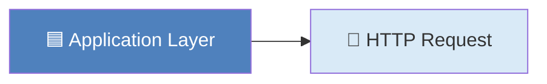

---

# 🟪 Step 2 — Presentation Layer (Layer 6)

The Presentation Layer prepares the data so that both devices understand it in the same way.

Depending on the application, it may:

- Encrypt the data.
- Compress the data.
- Convert character encoding.
- Translate data formats.

For HTTPS websites like Google, this is where **TLS encryption** is applied.

The actual message remains the same, but it is now protected before transmission.

---

### Responsibilities

- Data formatting
- Encryption
- Compression
- Character encoding

---

### Current PDU

```text
📄 Data
```

---

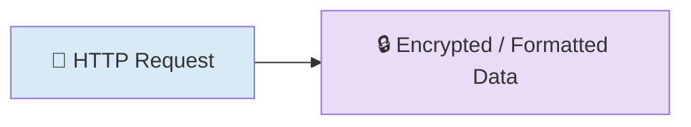

---

# 🟨 Step 3 — Session Layer (Layer 5)

Before communication can continue, both devices must maintain a conversation.

The Session Layer manages that conversation.

It keeps track of:

- Session establishment
- Session maintenance
- Session termination

Think of it as keeping both computers synchronized during communication.

---

### Responsibilities

- Start communication
- Maintain communication
- Close communication

---

### Current PDU

```text
📄 Data
```

---

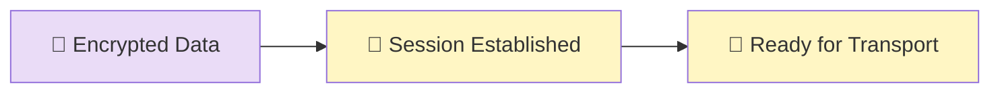

---

# 🟥 Step 4 — Transport Layer (Layer 4)

Now the first real networking header is added.

The Transport Layer decides whether to use:

- TCP (Reliable)
- UDP (Fast)

Since web browsing uses **TCP**, a **TCP Header** is attached.

This header contains important information such as:

- Source Port
- Destination Port
- Sequence Number
- Acknowledgment Number
- Flags
- Window Size

The data is now called a **Segment**.

---

## 🎯 What Changed?

Before Layer 4

```text
📄 Data
```

After Layer 4

```text
TCP Header
──────────────
HTTP Data
```

---

### Current PDU

```text
📦 Segment
```

---

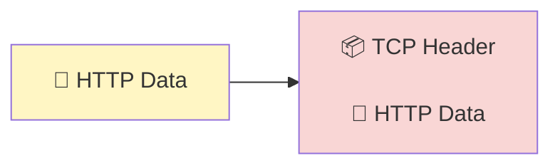

---

> 💡 **Notice**
>
> This is the **first time** additional networking information has been attached to the original data.
>
> The original HTTP request remains untouched—it has simply been wrapped with a TCP header.

---

## 📈 Packet Growth So Far

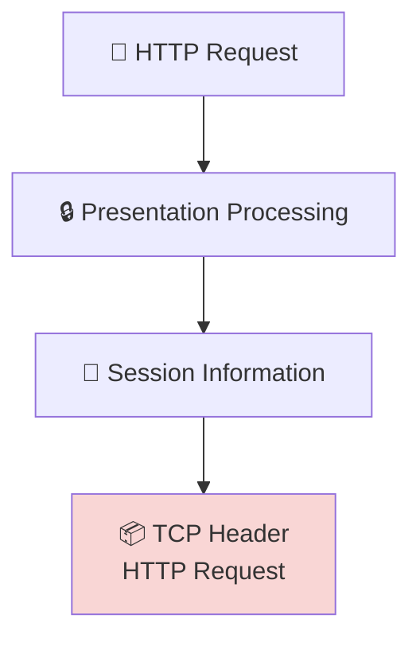

---

At this point, our message has successfully passed through the upper layers of the OSI Model.

The application data has been prepared, formatted, encrypted (if required), associated with a communication session, and finally wrapped with a **TCP header**, transforming it into a **Segment**.

However, the segment still has no idea **where it needs to travel**. It knows **which application** should receive it through port numbers, but it doesn't yet know **which network** or **which destination device** should receive it.

That responsibility belongs to the **Network Layer**, where IP addresses are added and the segment officially becomes a **Packet**.

---

➡️ **Next:** We'll continue following our data through the **Network Layer**, **Data Link Layer**, and **Physical Layer**, watching it transform from a **Segment → Packet → Frame → Bits** before it finally leaves the computer.

---
# 🟩 Step 5 — Network Layer (Layer 3)

Our data has now become a **TCP Segment**.

The Transport Layer knows **which application** should receive the data by using **port numbers**, but it still doesn't know **where the destination computer is located**.

This responsibility belongs to the **Network Layer**.

The Network Layer adds an **IP Header**, which contains the logical addressing information needed to deliver the data across different networks.

---

## 🎯 Responsibilities

The Network Layer is responsible for:

- Assigning logical (IP) addresses.
- Determining the best path to the destination.
- Routing packets between different networks.
- Fragmenting packets if necessary.

---

## 📦 What Gets Added?

The IP header typically contains:

- Source IP Address
- Destination IP Address
- Time To Live (TTL)
- Protocol (TCP/UDP)
- Fragmentation Information

The original TCP Segment is **not modified**.

Instead, the IP header is placed in front of it.

---

## 🎯 PDU Transformation

Before Layer 3

```text
📦 Segment
```

After Layer 3

```text
📦 Packet
```

---

## 🌐 Visualizing the Packet

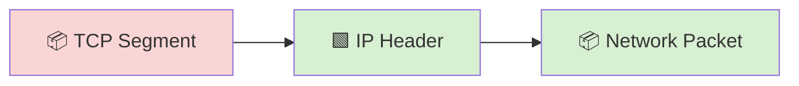

---

## 📦 Packet Growth

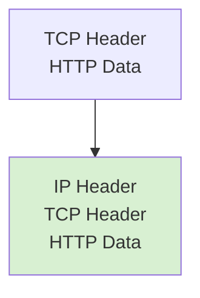

---

> 💡 **Did You Know?**
>
> Routers don't care about your HTTP request or your TCP sequence numbers.
>
> Their primary job is to examine the **destination IP address** and determine the best path toward the destination network.

---

# 🟧 Step 6 — Data Link Layer (Layer 2)

The packet has reached the local network.

However, routers and switches perform different jobs.

While routers use **IP addresses** to move packets between networks, switches use **MAC addresses** to deliver frames within the local network.

The Data Link Layer prepares the packet for local delivery.

It wraps the packet inside an **Ethernet Frame**.

---

## 🎯 Responsibilities

- Add Source MAC Address.
- Add Destination MAC Address.
- Create an Ethernet Frame.
- Detect transmission errors using the Frame Check Sequence (FCS).

---

## 📦 What Gets Added?

The Data Link Layer adds:

- Ethernet Header
- Ethernet Trailer (FCS)

The trailer allows the receiving device to detect transmission errors.

---

## 🎯 PDU Transformation

Before Layer 2

```text
📦 Packet
```

After Layer 2

```text
🖼️ Frame
```

---

## 🌐 Visualizing the Frame

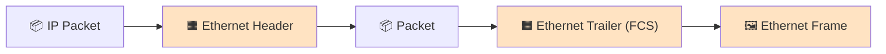

---

## 📦 Packet Growth

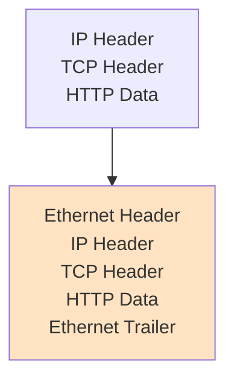

---

> 💡 **Notice**
>
> The trailer is added **only at the Data Link Layer**.
>
> It contains the **Frame Check Sequence (FCS)**, which helps detect transmission errors before the frame is processed further.

---

# ⬛ Step 7 — Physical Layer (Layer 1)

Everything is now prepared.

The Ethernet Frame is complete.

The only remaining task is to physically transmit it across the communication medium.

Unlike the other layers, the Physical Layer doesn't understand:

- HTTP
- TCP
- IP
- MAC addresses

It simply converts the entire frame into a stream of binary digits.

---

## 🎯 Responsibilities

- Convert frames into bits.
- Transmit electrical, optical, or wireless signals.
- Receive incoming signals.
- Synchronize communication between devices.

---

## 🎯 PDU Transformation

Before Layer 1

```text
🖼️ Frame
```

After Layer 1

```text
101010101011001010...
```

---

## 🌐 Visualizing Transmission

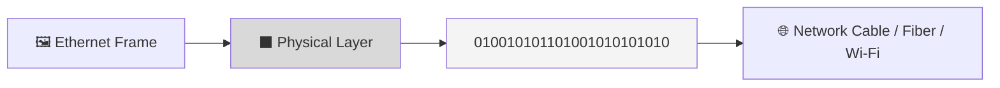

---

## 🚀 The Complete Journey

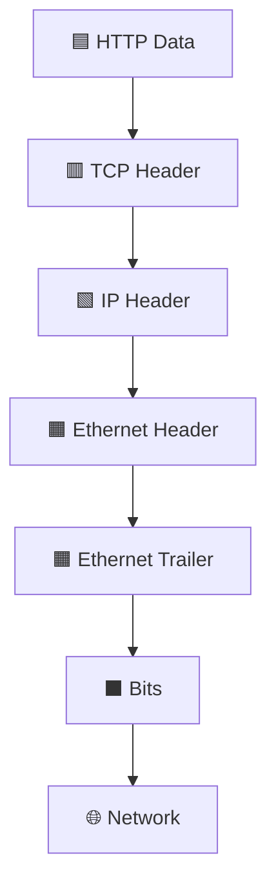

---

# 🎉 Encapsulation Complete

At this point, the message has completed its journey through all seven layers of the OSI Model.

The original HTTP request has been transformed into a stream of bits ready for transmission.

The receiving computer will perform the **reverse process**, removing each header one layer at a time until the original HTTP request reaches the destination application.

This reverse process is known as **Decapsulation**, which you'll explore in a later lesson.

---

## 📊 Encapsulation Timeline

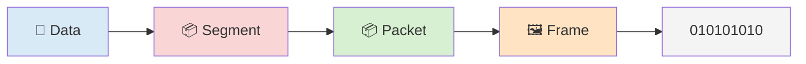

---

## 📌 Remember

Throughout encapsulation:

- ✅ The original application data is **never replaced**.
- ✅ Every layer simply **adds** the information it needs.
- ✅ Each new layer wraps around the previous one.
- ✅ The data changes names as it moves down the OSI Model:
  - **Data**
  - **Segment**
  - **Packet**
  - **Frame**
  - **Bits**

---

➡️ **Next:** Now that you've seen how data is encapsulated step by step, we'll explore **Protocol Data Units (PDUs)** in greater detail, understanding why the data changes names at each layer and what each PDU represents.

---
# ═══════════════════════════════════════════════
# 📦 Protocol Data Units (PDUs)
# ═══════════════════════════════════════════════

During the previous section, you watched data travel through every layer of the OSI Model.

You probably noticed something interesting.

The data didn't keep the same name throughout its journey.

Instead, it changed from:

```text
Data
   ↓
Segment
   ↓
Packet
   ↓
Frame
   ↓
Bits
```

These different names are called **Protocol Data Units (PDUs)**.

A **Protocol Data Unit** is simply the name given to the data at a particular layer of the OSI Model.

As each layer performs its job and adds its own protocol information, the data becomes a different type of network object—and therefore receives a new name.

---

## 🤔 Why Does the Name Change?

Imagine you're shipping a gift.

At different stages of delivery, the same item is described differently.

- At home, it's simply a **gift**.
- After placing it in a box, it's a **package**.
- At the courier warehouse, it's called **cargo**.
- Inside the delivery truck, it's considered **freight**.

The object itself hasn't changed.

Only the **context** has.

Networking works in exactly the same way.

The original application data remains inside the message from beginning to end, but each layer adds information and changes how the data is viewed.

---

# 🌍 PDU Transformation

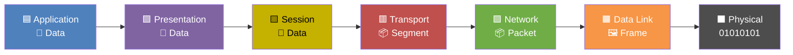

---

# 📄 PDU 1 — Data

The first four layers use the simple term **Data**.

Why?

Because these layers are concerned with:

- User information
- Formatting
- Encryption
- Session management

No networking-specific addressing has been added yet.

The message is still considered application data.

---

## Example

```text
GET / HTTP/1.1

Host: www.google.com
```

At this point, it's simply **Data**.

---

# 📦 PDU 2 — Segment

The Transport Layer adds either a:

- TCP Header
- UDP Header

Now the message contains information such as:

- Source Port
- Destination Port
- Sequence Number
- Reliability Information

Because of these additions, it is now called a **Segment** (when using TCP).

If UDP is used, some textbooks refer to it as a **Datagram**, although many certification exams simply use the term "segment" when discussing Transport Layer PDUs.

---

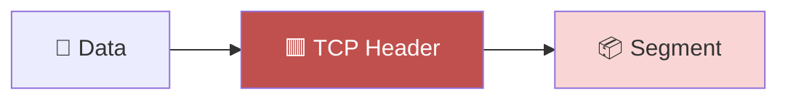

---

# 📦 PDU 3 — Packet

Next, the Network Layer adds an IP header.

This header introduces logical addressing.

Examples include:

- Source IP Address
- Destination IP Address
- Time To Live (TTL)
- Protocol Information

Because the message can now be routed between networks, it is called a **Packet**.

---

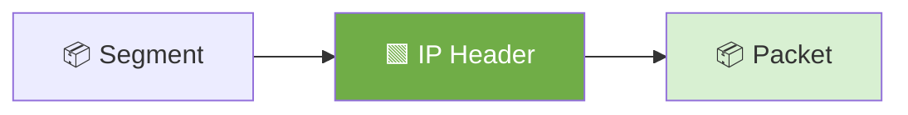

---

# 🖼️ PDU 4 — Frame

When the packet reaches the Data Link Layer, it receives:

- Ethernet Header
- Ethernet Trailer (FCS)

These additions allow communication within the local network using MAC addresses.

The message is now called a **Frame**.

---

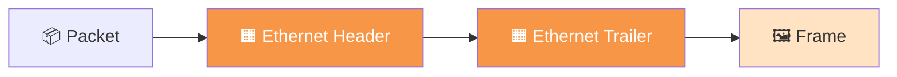

---

# 0️⃣1️⃣ PDU 5 — Bits

Finally, the Physical Layer converts the frame into binary signals.

Depending on the transmission medium, these bits become:

- ⚡ Electrical signals
- 💡 Light pulses
- 📡 Radio waves

At this stage, the message is no longer viewed as a packet or frame.

It is simply a stream of **bits**.

---

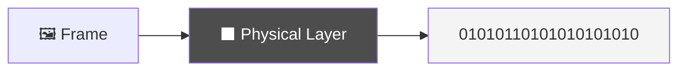

---

# 📊 PDU Comparison Table

| Layer | PDU | Why It Has This Name |
|--------|-----|----------------------|
| Application | 📄 Data | Original user information |
| Presentation | 📄 Data | Formatting and encryption only |
| Session | 📄 Data | Session management only |
| Transport | 📦 Segment | TCP/UDP header added |
| Network | 📦 Packet | IP addressing added |
| Data Link | 🖼️ Frame | MAC addressing and FCS added |
| Physical | 0️⃣1️⃣ Bits | Binary transmission over the medium |

---

# 🧠 Memory Trick

Instead of memorizing the names, think about **what changed**.

```text
Application
↓

Still just Data

↓

Transport

Added TCP

↓

Segment

↓

Added IP

↓

Packet

↓

Added MAC

↓

Frame

↓

Converted into Bits

↓

Transmission
```

If you remember **what each layer adds**, you'll automatically remember the correct PDU.

---

> 💡 **Did You Know?**
>
> Packet analyzers such as **Wireshark** display many of these layers separately. When you inspect captured traffic, you can expand the Ethernet frame, view the IP packet, inspect the TCP segment, and finally read the application data—all within a single captured transmission.

---

> ⚠️ **Common Beginner Mistake**
>
> Many beginners use the words **packet**, **frame**, and **segment** interchangeably.
>
> Although they're related, each term refers to a different stage of the same data as it moves through the OSI Model. Using the correct terminology helps communicate more precisely when troubleshooting networks or analyzing traffic.

---

# 📌 Remember

The original message never changes.

Only the **information surrounding it** changes as each layer adds its own headers (and, at Layer 2, a trailer).

That's why the name changes throughout the encapsulation process.

---

## 🎓 Knowledge Check

Before moving on, make sure you can answer:

- What does **PDU** stand for?
- Why does the data receive a different name at each layer?
- Which layer creates a **Segment**?
- Which layer creates a **Packet**?
- Which layer creates a **Frame**?
- At which layer does the message become **Bits**?
- Why is it incorrect to call every piece of network traffic a "packet"?

---

➡️ **Next:** Now that you understand how data changes form during encapsulation, we'll examine a **real-world example** by following a request to **https://www.google.com** from your browser all the way to Google's server, connecting everything you've learned into one complete journey.

---
# ═══════════════════════════════════════════════
# 🌍 Real-World Example — Loading a Website
# ═══════════════════════════════════════════════

Theory is important, but seeing how everything works together makes networking much easier to understand.

Let's follow a real-world example.

Imagine you open your web browser, type:

```text
https://www.google.com
```

and press **Enter**.

From your perspective, a webpage loads within a second or two.

Behind the scenes, however, dozens of networking operations occur in a precise order before Google's homepage appears on your screen.

Let's walk through that journey.

---

# 🗺️ The Big Picture

```mermaid
flowchart LR

A["👤 User"]

-->

B["🌐 Browser"]

-->

C["🔍 DNS Lookup"]

-->

D["🤝 TCP Connection"]

-->

E["🔒 TLS Handshake"]

-->

F["📨 HTTP Request"]

-->

G["📦 Encapsulation"]

-->

H["🌍 Internet"]

-->

I["🖥️ Google Server"]

-->

J["📤 HTTP Response"]

-->

K["📂 Decapsulation"]

-->

L["🖥️ Browser Displays Page"]
```

---

# ① User Requests a Website

Everything starts with a simple action.

The user enters:

```text
https://www.google.com
```

The browser now knows **what website** you want, but it doesn't yet know **where Google's server is located**.

To communicate over a network, it first needs an IP address.

---

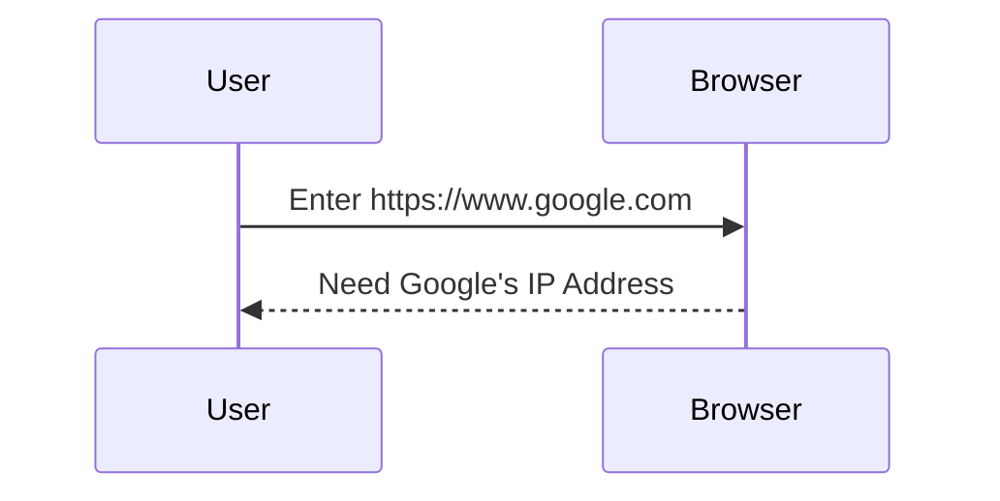

---

# ② DNS Resolves the Domain Name

Humans prefer names like:

```text
google.com
```

Computers communicate using IP addresses.

The browser sends a **DNS request** asking:

> "What is the IP address for www.google.com?"

The DNS server replies with Google's IP address (simplified example):

```text
142.250.190.78
```

Now the browser knows where to send the request.

---

```mermaid
sequenceDiagram

participant Browser
participant DNS

Browser->>DNS: Where is www.google.com?

DNS-->>Browser: 142.250.190.78
```

---

> 💡 **Did You Know?**
>
> DNS is often called the **"Phonebook of the Internet"** because it translates human-friendly domain names into IP addresses.

---

# ③ Establishing a TCP Connection

Web browsing uses **TCP**, which provides reliable communication.

Before any webpage data is exchanged, the browser and Google's server perform the famous **Three-Way Handshake**.

This ensures that both devices are ready to communicate.

---

```mermaid
sequenceDiagram

participant Client
participant Google

Client->>Google: SYN

Google-->>Client: SYN-ACK

Client->>Google: ACK
```

---

Once this handshake completes, a reliable TCP connection exists.

---

# ④ Secure Communication with TLS

Because the website uses **HTTPS**, the browser now performs a **TLS Handshake**.

This process:

- Verifies Google's identity.
- Exchanges encryption keys.
- Creates a secure communication channel.

From this point onward, the HTTP messages are encrypted.

---

```mermaid
flowchart LR

A["🤝 TCP Connection"]

-->

B["🔒 TLS Handshake"]

-->

C["🔐 Secure Encrypted Channel"]
```

---

> 🛡️ **Cybersecurity Insight**
>
> Without TLS, usernames, passwords, and other sensitive information could potentially be intercepted while traveling across the network.

---

# ⑤ Creating the HTTP Request

The browser is finally ready to ask for the webpage.

It creates a request similar to:

```http
GET / HTTP/1.1
Host: www.google.com
```

At this point, this is simply **Application Layer Data**.

It has not yet been encapsulated.

---

```mermaid
flowchart LR

A["🌐 Browser"]

-->

B["📄 HTTP GET Request"]

-->

C["🟦 Application Layer"]
```

---

# ⑥ Encapsulation Begins

Now the request travels down the OSI Model.

Each layer adds its own information.

---

```mermaid
flowchart TB

A["📄 HTTP Data"]

-->

B["🟥 TCP Header"]

-->

C["🟩 IP Header"]

-->

D["🟧 Ethernet Header"]

-->

E["⬛ Bits"]

style B fill:#C0504D,color:#fff
style C fill:#70AD47,color:#fff
style D fill:#F79646,color:#fff
style E fill:#4D4D4D,color:#fff
```

The original HTTP request has now become a complete network transmission ready to leave your computer.

---

# ⑦ Traveling Across the Internet

The data leaves your computer and begins its journey.

Along the way, it may pass through:

- Your home router.
- Your Internet Service Provider (ISP).
- Regional routers.
- Internet backbone routers.
- Google's edge routers.
- Google's internal network.

Every router examines the **destination IP address** and forwards the packet one step closer to its destination.

---

```mermaid
flowchart LR

A["💻 Your Computer"]

-->

B["📡 Home Router"]

-->

C["🏢 ISP"]

-->

D["🌍 Internet Backbone"]

-->

E["🏢 Google Network"]

-->

F["🖥️ Google Server"]
```

---

# ⑧ Google Receives the Request

When the request reaches Google's server, the process is reversed.

Instead of adding headers, the server removes them one by one.

This is called **Decapsulation**.

---

```mermaid
flowchart TB

A["⬛ Bits"]

-->

B["🟧 Frame"]

-->

C["🟩 Packet"]

-->

D["🟥 Segment"]

-->

E["📄 HTTP Request"]
```

Eventually, Google's web server receives the original HTTP request created by your browser.

---

# ⑨ Google Sends a Response

Google processes the request and prepares an HTTP response containing:

- HTML
- CSS
- JavaScript
- Images
- Fonts
- Other webpage resources

That response is encapsulated again and sent back across the Internet.

---

```mermaid
flowchart LR

A["🖥️ Google Server"]

-->

B["📄 HTTP Response"]

-->

C["📦 Encapsulation"]

-->

D["🌍 Internet"]

-->

E["💻 Your Computer"]
```

---

# 🔄 The Complete Journey

```mermaid
flowchart TD

A["👤 User"]

-->

B["🌐 Browser"]

-->

C["🔍 DNS"]

-->

D["🤝 TCP Handshake"]

-->

E["🔒 TLS"]

-->

F["📄 HTTP Request"]

-->

G["📦 Encapsulation"]

-->

H["🌍 Internet"]

-->

I["🖥️ Google"]

-->

J["📤 HTTP Response"]

-->

K["📂 Decapsulation"]

-->

L["🖥️ Webpage Displayed"]
```

---

# 💡 What Did We Just Learn?

Although loading a webpage feels almost instant, many networking technologies work together behind the scenes.

In just a few moments, your computer performed:

- ✅ DNS name resolution.
- ✅ TCP connection establishment.
- ✅ TLS encryption.
- ✅ HTTP request creation.
- ✅ Encapsulation through the OSI Model.
- ✅ Packet routing across the Internet.
- ✅ Decapsulation on the destination server.
- ✅ HTTP response delivery.
- ✅ Rendering the webpage in your browser.

This entire process often completes in less than a second, demonstrating how efficiently modern computer networks operate.

---

> 📌 **Remember**
>
> Every webpage you visit, every email you send, every file you download, and every online game you play follows the same fundamental networking principles you've learned in this chapter.

---

➡️ **Next:** We'll shift our focus from theory to practice by exploring **Wireshark**, where you'll learn how to identify Ethernet frames, IP packets, TCP segments, and application data inside real packet captures.

---
# ═══════════════════════════════════════════════
# 🖥️ Encapsulation Through Wireshark
# ═══════════════════════════════════════════════

So far, you've learned encapsulation as a concept.

But how do we know this process actually happens?

The answer is simple:

**We can capture and inspect the traffic ourselves.**

Tools such as **Wireshark** allow us to observe real network traffic as it moves across the network.

Instead of imagining Ethernet headers, IP packets, and TCP segments, we can actually see them inside every captured frame.

---

## 🎯 Why Wireshark Matters

Wireshark is one of the most widely used packet analysis tools in networking and cybersecurity.

It allows you to:

- Capture live network traffic.
- Inspect every protocol header.
- Troubleshoot network issues.
- Analyze suspicious activity.
- Learn how protocols communicate.
- Investigate cyberattacks.

For cybersecurity professionals, Wireshark is an essential skill.

---

## 🌍 Revisiting Our Example

Let's return to our previous example.

```
https://www.google.com
```

When you pressed **Enter**, your browser generated an HTTP request.

After encapsulation, that request traveled across the network.

If Wireshark had been running, it could capture that transmission.

---

# 📦 What Wireshark Actually Captures

One common misconception is that Wireshark captures only **packets**.

It doesn't.

Wireshark captures **frames**.

Each frame contains multiple protocol layers inside it.

Think of a frame as a package containing several smaller packages.

---

```mermaid
flowchart TD

A["🖼️ Ethernet Frame"]

-->

B["🌐 IP Packet"]

-->

C["📦 TCP Segment"]

-->

D["📄 HTTP Data"]
```

Every captured frame contains multiple layers of information.

---

# 🔍 Expanding a Packet

When you click on a packet inside Wireshark, you'll usually see something similar to this.

```text
Frame
│
├── Ethernet II
│
├── Internet Protocol Version 4 (IPv4)
│
├── Transmission Control Protocol (TCP)
│
└── Hypertext Transfer Protocol (HTTP)
```

Notice something interesting.

Those layers appear in almost the exact same order as the OSI Model.

---

```mermaid
flowchart LR

A["🖼️ Ethernet II"]

-->

B["🌐 IPv4"]

-->

C["📦 TCP"]

-->

D["📄 HTTP"]
```

The only difference is that Wireshark displays **real protocols** instead of the abstract OSI layers.

---

# 🔄 Mapping Wireshark to the OSI Model

The relationship becomes much clearer when viewed side by side.

| OSI Layer | Example in Wireshark |
|-----------|----------------------|
| 🟦 Application | HTTP, HTTPS, DNS |
| 🟪 Presentation | TLS Encryption |
| 🟨 Session | Session Information (often hidden within protocols) |
| 🟥 Transport | TCP or UDP |
| 🟩 Network | IPv4 / IPv6 |
| 🟧 Data Link | Ethernet II |
| ⬛ Physical | Not Captured (Bits) |

---

## ⚠️ Why Isn't the Physical Layer Visible?

A common beginner question is:

> **"Why can't I see the Physical Layer in Wireshark?"**

The answer is simple.

Wireshark captures data **after** it has already been received by the network interface card (NIC).

The electrical signals, light pulses, or radio waves have already been converted back into digital data.

Because of this, Wireshark displays **frames**, not raw electrical or optical signals.

---

```mermaid
flowchart LR

A["⚡ Electrical Signal"]

-->

B["💻 Network Interface Card"]

-->

C["🖼️ Ethernet Frame"]

-->

D["🖥️ Wireshark"]
```

The conversion from signals to digital data happens before Wireshark ever sees the traffic.

---

# 📂 Looking Inside a Frame

Suppose Wireshark captures one frame.

Conceptually, it looks like this.

```mermaid
flowchart TB

A["🖼️ Ethernet Header"]

-->

B["🌐 IP Header"]

-->

C["📦 TCP Header"]

-->

D["📄 HTTP Request"]

-->

E["🟧 Frame Check Sequence (FCS)"]
```

Each protocol contributes its own information.

Together they form one complete network frame.

---

# 🔬 What Can You Learn From One Packet?

A single captured frame can reveal a surprising amount of information.

For example, you can identify:

- Source MAC Address
- Destination MAC Address
- Source IP Address
- Destination IP Address
- Source Port
- Destination Port
- Protocol Used
- Packet Length
- TCP Flags
- Time To Live (TTL)
- Sequence Numbers
- Window Size

This is why packet analysis is such an important skill in cybersecurity.

---

# 🛡️ Cybersecurity Perspective

Imagine investigating a security incident.

An analyst opens Wireshark and immediately notices:

- Hundreds of SYN packets.
- No ACK responses.

That observation alone may indicate a **TCP SYN Flood Attack**.

Similarly, packet captures can reveal:

- Port scans
- ARP spoofing
- DNS tunneling
- Malware communication
- Data exfiltration
- Command-and-Control (C2) traffic

Understanding encapsulation makes these attacks much easier to recognize.

---

# 🎯 Wireshark vs Encapsulation

The relationship between encapsulation and Wireshark is straightforward.

```mermaid
flowchart LR

A["📄 Application Data"]

-->

B["📦 Encapsulation"]

-->

C["🌍 Network"]

-->

D["🖥️ Wireshark Capture"]

-->

E["🔍 Inspect Headers"]
```

Encapsulation creates the headers.

Wireshark lets us inspect them.

Without encapsulation, packet analyzers would have nothing meaningful to display.

---

> 💡 **Did You Know?**
>
> A modern webpage may generate **hundreds or even thousands of packets**. Every image, font, script, video, and API request creates additional network traffic that Wireshark can capture and analyze.

---

> ⚠️ **Common Beginner Mistake**
>
> Many beginners believe Wireshark "reads" network traffic directly from the cable.
>
> In reality, Wireshark receives packets **after the network interface card has already processed the physical signals into digital frames**.

---

# 📌 Remember

Encapsulation and Wireshark go hand in hand.

- Encapsulation creates the protocol headers.
- Networking devices use those headers to deliver data.
- Wireshark displays those headers so humans can understand what happened.

Learning encapsulation first makes packet analysis much easier.

---

## 🎓 Knowledge Check

Before moving on, see if you can answer these questions:

- What does Wireshark actually capture?
- Why can't Wireshark display the Physical Layer?
- Which protocol usually appears first inside a captured frame?
- How does Wireshark relate to encapsulation?
- Why is Wireshark valuable in cybersecurity?

---

➡️ **Next:** Before finishing this lesson, we'll explore the **Cybersecurity Perspective**, common mistakes, key takeaways, and a final revision section that connects everything you've learned about encapsulation.

---
# ═══════════════════════════════════════════════
# 🛡️ Encapsulation in Cybersecurity
# ═══════════════════════════════════════════════

Understanding encapsulation isn't just important for networking—it is fundamental to cybersecurity.

Every packet that crosses a network carries information added during the encapsulation process. Firewalls, intrusion detection systems, VPNs, packet analyzers, and penetration testing tools all rely on these protocol headers to make decisions.

Without encapsulation, modern cybersecurity simply wouldn't exist.

---

## 🎯 Why Cybersecurity Professionals Need It

Understanding encapsulation helps you:

- 🛡️ Analyze suspicious network traffic.
- 🔍 Investigate malware communications.
- 🌐 Understand how firewalls inspect packets.
- 📦 Read Wireshark captures confidently.
- 🚨 Detect attacks such as port scans and SYN floods.
- 🔒 Understand VPNs, HTTPS, and encrypted traffic.
- 🧑‍💻 Perform penetration testing more effectively.
- 📝 Troubleshoot network communication problems.

---

## 🗺️ Where Encapsulation Is Used

```mermaid
flowchart TD

A["📦 Encapsulation"]

-->

B["🛡️ Firewalls"]

A --> C["🔍 Wireshark"]

A --> D["🚨 IDS / IPS"]

A --> E["🔒 VPN"]

A --> F["🧑‍💻 Penetration Testing"]

A --> G["🦠 Malware Analysis"]

A --> H["🖥️ Network Troubleshooting"]
```

Encapsulation is one of the few networking concepts that appears in almost every cybersecurity domain.

---

# ⚠️ Common Beginner Mistakes

Learning networking for the first time can be confusing.

Here are some of the mistakes beginners commonly make.

---

### ❌ Mistake 1 — Thinking Every Layer Creates New Data

Each layer **does not create a new message**.

Instead, it wraps the **same original data** with additional protocol information.

---

### ❌ Mistake 2 — Calling Everything a Packet

Many people refer to every piece of network traffic as a "packet."

Technically, that's incorrect.

| Correct Name | Layer |
|--------------|-------|
| 📄 Data | Layers 7–5 |
| 📦 Segment | Layer 4 |
| 📦 Packet | Layer 3 |
| 🖼️ Frame | Layer 2 |
| 0️⃣1️⃣ Bits | Layer 1 |

---

### ❌ Mistake 3 — Confusing IP Addresses with MAC Addresses

These addresses serve different purposes.

- **IP Address** → Identifies a device across networks.
- **MAC Address** → Identifies a device within the local network.

---

### ❌ Mistake 4 — Thinking Routers Read HTTP Data

Routers generally don't care about web pages.

They primarily examine:

- Destination IP Address
- Routing Table
- TTL
- Protocol Information

Their job is forwarding packets—not interpreting application data.

---

### ❌ Mistake 5 — Assuming Wireshark Captures Everything

Wireshark captures traffic that reaches your network interface.

It cannot magically capture traffic that never reaches your computer.

---

# 📊 Encapsulation Summary

```mermaid
flowchart LR

A["🟦 Data"]

-->

B["🟥 Segment"]

-->

C["🟩 Packet"]

-->

D["🟧 Frame"]

-->

E["⬛ Bits"]

style A fill:#4F81BD,color:#fff
style B fill:#C0504D,color:#fff
style C fill:#70AD47,color:#fff
style D fill:#F79646,color:#fff
style E fill:#4D4D4D,color:#fff
```

---

## 📋 Complete Layer Summary

| Layer | Adds | PDU |
|--------|------|-----|
| 🟦 Application | User Data | Data |
| 🟪 Presentation | Formatting / Encryption | Data |
| 🟨 Session | Session Information | Data |
| 🟥 Transport | TCP / UDP Header | Segment |
| 🟩 Network | IP Header | Packet |
| 🟧 Data Link | Ethernet Header + Trailer | Frame |
| ⬛ Physical | Binary Signals | Bits |

---

# 🧠 60-Second Revision

If you only remember a few things from this lesson, remember these:

- Every layer has a specific responsibility.
- Each layer adds information to the existing data.
- The original data is never replaced.
- The data changes names as it moves through the stack.
- Headers help networking devices deliver the message correctly.
- The Data Link Layer also adds a trailer (FCS).
- The Physical Layer converts everything into bits.
- The receiving device performs the reverse process called **Decapsulation**.

---

# 🎓 Final Knowledge Check

Try answering these questions without looking back at the lesson.

### Basics

- What is encapsulation?
- Why is encapsulation necessary?
- Which layer begins the encapsulation process?
- Which layer converts frames into bits?

### Protocol Data Units

- What does **PDU** stand for?
- At which layer does **Data** become a **Segment**?
- At which layer does a **Segment** become a **Packet**?
- At which layer does a **Packet** become a **Frame**?

### Headers

- Which layer adds the TCP header?
- Which layer adds the IP header?
- Which layer adds the Ethernet header?
- Which layer adds the Ethernet trailer?

### Cybersecurity

- Why is encapsulation important for Wireshark?
- Why do firewalls inspect packet headers?
- Which networking devices primarily use IP addresses?
- Which networking devices primarily use MAC addresses?

---

# 💡 Key Takeaways

- Encapsulation is the process of preparing data for network transmission.
- Every OSI layer performs a unique role before passing the data to the next layer.
- Each layer adds protocol-specific information in the form of headers (and at Layer 2, a trailer).
- The message changes from **Data → Segment → Packet → Frame → Bits** as it moves down the stack.
- Networking devices rely on these headers to deliver data accurately and efficiently.
- Packet analyzers such as Wireshark allow us to inspect encapsulated traffic in real time.
- Understanding encapsulation is essential for networking, troubleshooting, and cybersecurity.

---

# 📖 Further Reading

If you'd like to explore these topics in greater depth, consider reading:

- **OSI Model**
- **TCP/IP Model**
- **OSI vs TCP/IP**
- **Wireshark Basics**
- **TCP Three-Way Handshake**
- **TLS & HTTPS**
- **DNS Fundamentals**

These topics expand on many of the concepts introduced in this lesson.

---

## ➡️ Next Lesson — [Decapsulation](./Decapsulation.md)

Now that you understand **how data is prepared for transmission**, it's time to learn what happens on the receiving side.

In the next lesson, you'll explore **Decapsulation**—the reverse of encapsulation.

You'll follow a frame as it arrives at a destination device, watching each OSI layer remove its own header until the original application data is delivered to the receiving program.

Together, **Encapsulation** and **Decapsulation** explain how every email, webpage, file download, and online game communicates across a network.

```mermaid
flowchart LR

A["📄 Original Data"]

-->

B["📦 Encapsulation"]

-->

C["🌍 Network"]

-->

D["📂 Decapsulation"]

-->

E["🖥️ Application Receives Data"]

style B fill:#70AD47,color:#fff
style D fill:#4F81BD,color:#fff
```