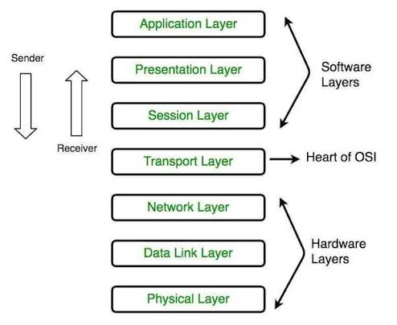
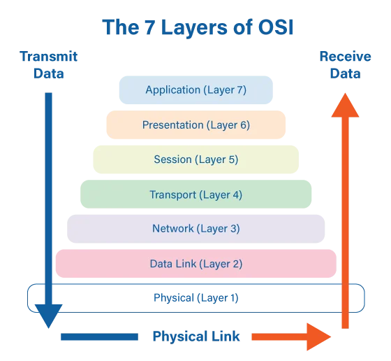
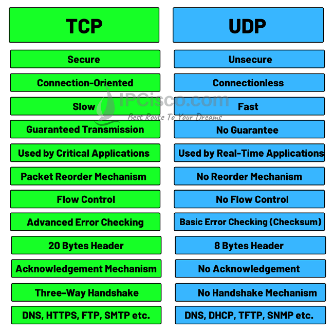
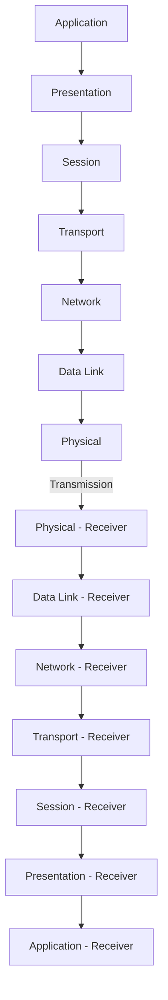
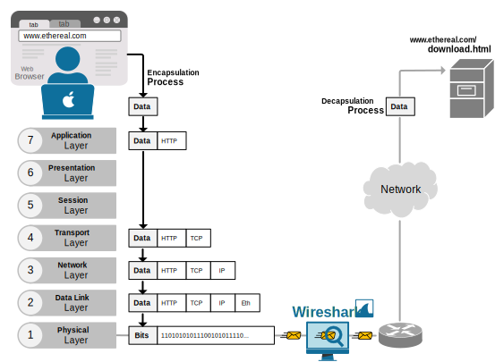

# 🌐 OSI Model

### Learn the seven-layer framework that explains how data travels across a computer network.

---

> **Lesson Overview**  
> The **OSI (Open Systems Interconnection) Model** is a conceptual framework that divides network communication into **seven distinct layers**. Understanding these layers provides the foundation for learning networking, packet analysis, routing, troubleshooting, and cybersecurity. Although modern networks use the TCP/IP Model in practice, the OSI Model remains the industry-standard reference for understanding how data moves through a network.

---

## 📌 Quick Facts

| Property | Value |
|----------|-------|
| **Full Name** | Open Systems Interconnection Model |
| **Created By** | International Organization for Standardization (ISO) |
| **Published** | 1984 |
| **Layers** | 7 |
| **Purpose** | Standardize and explain network communication |
| **Used In Practice?** | ❌ No (Reference Model) |
| **Still Important?** | ✅ Yes — Education, Troubleshooting, Certifications, Cybersecurity |

----

# OSI Model

---

## What is the OSI Model?

**OSI** stands for **Open Systems Interconnection**.

It's a conceptual framework that describes how network communication is broken down into **seven distinct layers**, each responsible for a specific part of getting data from one device to another.

### Why It Was Created

In the early days of computer networking, different vendors built systems that often couldn't communicate with one another. A network built by one company frequently couldn't talk to hardware or software built by a different company, because there was no shared standard for how communication should work.

### The History Behind the OSI Model

The **International Organization for Standardization (ISO)** developed the OSI Model in **1984** to solve this problem. The goal was to create a universal blueprint that any vendor, anywhere, could follow — so that networking equipment and software from different manufacturers could interoperate reliably.

### ISO's Role

ISO didn't invent networking protocols themselves. Instead, they defined a **structure** — a set of layers, each with clearly defined responsibilities — that protocol developers could design around. This made it possible to build interoperable systems without every vendor needing to agree on implementation details, only on the *structure*.

### Why It's Still Taught Today

Even though modern networks actually run on the **TCP/IP Model** (covered in the next lesson), the OSI Model is still taught everywhere because:

- It provides a more **detailed, granular breakdown** of networking concepts.
- It's an excellent **teaching and troubleshooting tool**.
- Cybersecurity tools, certifications, and job interviews **constantly reference OSI layers** ("that's a Layer 3 issue," "this attack targets Layer 7").

> 💡 **Pro Tip**
> Think of the OSI Model as the **detailed textbook version**, and the TCP/IP Model as the **practical, real-world implementation**. You'll need both.

<!--
Image Description:
A colorful seven-layer OSI Model diagram showing all layers stacked from Physical at the bottom to Application at the top, with arrows indicating data flow between layers.
Search Keywords:
OSI Model 7 Layers diagram
-->

  

---

## Why Do We Need the OSI Model?

- **Standardization** — Everyone follows the same layered structure, making systems predictable and compatible.
- **Easier Troubleshooting** — When something breaks, you can isolate the problem to a specific layer instead of guessing across the whole system.
- **Vendor Interoperability** — A Cisco switch, a Linux server, and an iPhone can all communicate because they follow the same layered rules.
- **Layer Separation** — Each layer only needs to worry about its own job, not the entire communication process.
- **Easier Protocol Development** — New protocols can be built to fit into an existing layer without redesigning the entire stack.
- **Modular Design** — Layers can be updated or replaced independently. For example, Wi-Fi can replace Ethernet at Layer 1/2 without changing how the Application layer works.

> 🧠 **Analogy: The Postal System**
> Imagine mailing a letter. You write the message (Application), put it in an envelope (Presentation/Session), add a tracking number (Transport), write the destination address (Network), hand it to a postal worker who sorts it locally (Data Link), and it physically travels by truck or plane (Physical). Each "layer" of the postal system does its own job — you never have to think about how the plane engine works just to write a letter.

**Why This Matters:** Every networking and cybersecurity tool you'll use later organizes information according to these same layers — understanding this now makes everything after this lesson easier to absorb.

---

## The Seven Layers

| Layer | Name | Primary Responsibility | Common Protocols | Devices |
|-------|------|--------------------------|--------------------|---------|
| 7 | Application | Provides network services directly to end-user applications | HTTP, HTTPS, FTP, SMTP, DNS, SSH | — |
| 6 | Presentation | Formats, encrypts, and compresses data | SSL/TLS, JPEG, ASCII | — |
| 5 | Session | Establishes, manages, and terminates communication sessions | NetBIOS, RPC | — |
| 4 | Transport | Ensures reliable (or fast) end-to-end data delivery | TCP, UDP | — |
| 3 | Network | Handles logical addressing and routing between networks | IP, ICMP | Router |
| 2 | Data Link | Handles physical addressing and delivery within a local network | Ethernet, ARP, Wi-Fi (MAC) | Switch, Bridge |
| 1 | Physical | Transmits raw bits over physical media | N/A (cables, radio signals) | Hub, Repeater, Cabling |

<!--
Image Description:
A vertical stack diagram of all seven OSI layers labeled 7 through 1, each shown as a colored block with its name and a small icon representing an example protocol or device.
Search Keywords:
OSI Model layers labeled diagram
-->

  

---

### Layer 7 — Application

**Main Purpose:** This is the layer closest to the end user — it's where network-aware applications interact with the network.

**Responsibilities:**
- Providing the interface between user applications and the network
- Identifying communication partners
- Determining resource availability

**What Data Looks Like:** Raw application data — a webpage request, an email, a file transfer request.

**Real-World Examples:** Opening a web browser, sending an email, using an FTP client.

**Common Protocols:** HTTP, HTTPS, FTP, SMTP, DNS, SSH.

**Common Devices:** None directly — this layer is software-based (browsers, email clients, apps).

**Cybersecurity Relevance:** Most modern attacks (SQL injection, cross-site scripting, phishing) target this layer because it's where users directly interact with applications.

**Typical Attacks:** Web application attacks, malicious email attachments, DNS spoofing.

**Troubleshooting Example:** A website loads but displays incorrectly — this is likely an Application-layer issue (e.g., a broken web app), not a networking hardware problem.

> 🧠 **Analogy:** Layer 7 is like the **words you speak** in a conversation — it's the actual message being communicated.

---

### Layer 6 — Presentation

**Main Purpose:** Translates, encrypts, and compresses data so it can be understood by the receiving system.

**Responsibilities:**
- Data translation between formats
- Encryption and decryption (e.g., SSL/TLS)
- Compression to improve efficiency

**What Data Looks Like:** Data formatted for transmission — encrypted, compressed, or converted into a standard format.

**Real-World Examples:** A browser encrypting your login credentials before sending them (HTTPS), an image being compressed as a JPEG.

**Common Protocols:** SSL/TLS, JPEG, ASCII, MPEG.

**Common Devices:** None directly — mostly handled in software.

**Cybersecurity Relevance:** Encryption at this layer protects data from being read if intercepted — a core concept behind HTTPS security.

**Typical Attacks:** SSL stripping, exploiting weak encryption/cipher implementations.

**Troubleshooting Example:** A browser shows a "certificate error" — often a Presentation-layer (encryption/certificate) issue.

> 🧠 **Analogy:** Layer 6 is like a **translator** converting your words into a language the listener understands.

---

### Layer 5 — Session

**Main Purpose:** Manages and maintains the connection ("session") between two communicating devices.

**Responsibilities:**
- Establishing sessions
- Maintaining sessions during communication
- Properly closing sessions when finished

**What Data Looks Like:** Session-tracking information — tokens, session IDs, connection state data.

**Real-World Examples:** Staying logged into a website while browsing multiple pages, a video call staying connected during a meeting.

**Common Protocols:** NetBIOS, RPC, PPTP.

**Common Devices:** None directly — handled in software/operating systems.

**Cybersecurity Relevance:** Session hijacking attacks specifically target this layer by stealing or guessing session identifiers.

**Typical Attacks:** Session hijacking, session fixation.

**Troubleshooting Example:** You get logged out of a website randomly while browsing — could indicate a Session-layer problem.

> 🧠 **Analogy:** Layer 5 is like keeping a **phone call connected** while you talk — if the call drops, the "session" ends.

---

### Layer 4 — Transport

**Main Purpose:** Ensures data is delivered reliably (or quickly) from one end of the communication to the other.

**Responsibilities:**
- Breaking data into segments
- Ensuring reliable delivery (TCP) or fast delivery (UDP)
- Flow control and error checking

**What Data Looks Like:** **Segments** (TCP) or **Datagrams** (UDP).

**Real-World Examples:** Loading a webpage reliably (TCP) vs. streaming a live video where minor loss is acceptable (UDP).

**Common Protocols:** TCP, UDP.

**Common Devices:** None directly — mostly handled by the operating system's networking stack.

**Cybersecurity Relevance:** Port scanning and many denial-of-service attacks target this layer.

**Typical Attacks:** SYN flood attacks, port scanning.

**Troubleshooting Example:** A specific application can't connect while others work fine — often a port or Transport-layer issue.

> 🧠 **Analogy:** Layer 4 is like choosing between **registered mail** (TCP — guaranteed delivery, tracked) and **regular mail** (UDP — faster, but no delivery guarantee).

<!--
Image Description:
A simple side-by-side comparison illustration showing TCP as a reliable, tracked delivery truck versus UDP as a fast, untracked delivery truck.
Search Keywords:
TCP vs UDP comparison illustration
-->

  

---

### Layer 3 — Network

**Main Purpose:** Handles logical addressing and determines the best path for data to travel between different networks.

**Responsibilities:**
- Logical (IP) addressing
- Routing data between networks
- Path determination

**What Data Looks Like:** **Packets**.

**Real-World Examples:** Data traveling from your home network to a website hosted in another country.

**Common Protocols:** IP, ICMP.

**Common Devices:** Router.

**Cybersecurity Relevance:** IP spoofing and routing attacks operate at this layer; firewalls often filter traffic based on IP addresses here.

**Typical Attacks:** IP spoofing, ICMP flood (ping flood), route manipulation.

**Troubleshooting Example:** You can't reach a specific website but others load fine — could indicate a Network-layer routing issue.

> 🧠 **Analogy:** Layer 3 is like the **postal address** on an envelope — it tells the network exactly where to route the data.

---

### Layer 2 — Data Link

**Main Purpose:** Handles physical addressing and reliable delivery of data within a single local network segment.

**Responsibilities:**
- Physical (MAC) addressing
- Framing data for transmission
- Error detection at the local network level

**What Data Looks Like:** **Frames**.

**Real-World Examples:** A laptop communicating with a switch on the same office network.

**Common Protocols:** Ethernet, ARP, Wi-Fi (802.11 MAC layer).

**Common Devices:** Switch, Bridge.

**Cybersecurity Relevance:** MAC spoofing and ARP poisoning attacks specifically target this layer.

**Typical Attacks:** ARP poisoning/spoofing, MAC flooding.

**Troubleshooting Example:** Devices on the same local network can't communicate — often a Data Link–layer (switching) issue.

> 🧠 **Analogy:** Layer 2 is like a **local mail carrier** who knows every house on their specific street by name, but doesn't know how to route mail to a different city.

---

### Layer 1 — Physical

**Main Purpose:** Transmits raw bits (1s and 0s) as electrical signals, light pulses, or radio waves over physical media.

**Responsibilities:**
- Transmitting raw bitstreams
- Defining cables, connectors, and voltages
- Defining wireless signal characteristics

**What Data Looks Like:** **Bits** (raw 1s and 0s).

**Real-World Examples:** An Ethernet cable, a fiber optic line, Wi-Fi radio signals.

**Common Protocols:** None (this layer defines hardware standards, not protocols in the traditional sense).

**Common Devices:** Hub, Repeater, cabling.

**Cybersecurity Relevance:** Physical security (cutting a network cable, wiretapping) and signal jamming occur here.

**Typical Attacks:** Cable tapping, signal jamming, physical device tampering.

**Troubleshooting Example:** A device shows no network connection at all — often a Physical-layer issue (unplugged cable, damaged hardware).

> 🧠 **Analogy:** Layer 1 is like the **roads and vehicles** the mail actually travels on — without them, nothing moves at all.

---

## Protocol Data Units (PDUs)

As data moves through the OSI layers, its name changes depending on what's been added to it. This "unit of data" at each stage is called a **Protocol Data Unit (PDU)**.

| Layer | PDU Name | Description |
|-------|----------|--------------|
| Application/Presentation/Session | Data | Raw application-level information, not yet broken down |
| Transport | Segment | Data broken into pieces with Transport-layer info (e.g., port numbers) added |
| Network | Packet | Segment with logical (IP) addressing information added |
| Data Link | Frame | Packet with physical (MAC) addressing information added |
| Physical | Bits | Frame converted into raw electrical, optical, or radio signals |

**Why the names change:** Each layer adds its own header (sometimes a trailer) containing information relevant to *its* job. Since the data now contains more structured information at each step, it gets a new name to reflect what it currently represents.

---

## Data Flow Through the OSI Model

When a message is sent, it travels **down** through the sender's layers (getting wrapped with information at each step), and then **up** through the receiver's layers (getting unwrapped).

### What Each Layer Adds (Sender Side)

- **Application** — Creates the actual message/data.
- **Presentation** — Formats/encrypts the data.
- **Session** — Adds session-tracking information.
- **Transport** — Adds port numbers, breaks data into segments.
- **Network** — Adds source and destination IP addresses.
- **Data Link** — Adds source and destination MAC addresses, forms a frame.
- **Physical** — Converts the frame into raw bits for transmission.

**Why This Matters:** This process — called **encapsulation** — is exactly what the next two lessons in this chapter cover in detail.

---

## Devices and OSI Layers

| Device | Primary OSI Layer(s) | Why |
|--------|------------------------|-----|
| **Hub** | Layer 1 (Physical) | Simply repeats electrical signals to all connected ports with no addressing awareness |
| **Switch** | Layer 2 (Data Link) | Forwards frames based on MAC addresses |
| **Router** | Layer 3 (Network) | Forwards packets based on IP addresses between different networks |
| **Firewall** | Layer 3 / Layer 4 (sometimes Layer 7 for advanced firewalls) | Filters traffic based on IP addresses, ports, or even application data |
| **Access Point** | Layer 1 / Layer 2 | Transmits wireless signals and handles MAC-based communication |
| **Gateway** | Can operate at multiple layers, often Layer 3–7 | Translates between different network protocols or environments |

---

## Common Protocols by Layer

| Protocol | Layer | Purpose |
|----------|-------|---------|
| HTTP | Application (7) | Transfers unencrypted web page data |
| HTTPS | Application (7) | Transfers encrypted web page data |
| FTP | Application (7) | Transfers files between systems |
| SMTP | Application (7) | Sends email messages |
| DNS | Application (7) | Translates domain names into IP addresses |
| SSH | Application (7) | Provides secure remote command-line access |
| TCP | Transport (4) | Reliable, connection-based data delivery |
| UDP | Transport (4) | Fast, connectionless data delivery |
| IP | Network (3) | Logical addressing and routing |
| ICMP | Network (3) | Diagnostic messaging (e.g., ping) |
| ARP | Data Link (2) | Resolves IP addresses to MAC addresses |
| Ethernet | Data Link (2) | Wired local network communication standard |
| Wi-Fi | Data Link (2) / Physical (1) | Wireless local network communication standard |

<!--
Image Description:
A layered chart showing common protocols (HTTP, HTTPS, FTP, DNS, TCP, UDP, IP, ARP, Ethernet, Wi-Fi) positioned next to their corresponding OSI layer.
Search Keywords:
OSI Model protocols by layer chart
-->

  

---

## OSI Model in Cybersecurity

Understanding the OSI Model isn't just academic — it's directly applied in real cybersecurity work:

- **Wireshark** — Every packet captured in Wireshark is displayed with layer-by-layer breakdowns (Frame, IP, TCP, and Application data), directly mirroring the OSI structure.
- **Packet Analysis** — Identifying anomalies requires knowing what "normal" looks like at each layer.
- **Firewall Rules** — Rules are often written based on IP addresses (Layer 3), ports (Layer 4), or even application content (Layer 7) for next-generation firewalls.
- **IDS/IPS** — Intrusion detection systems analyze traffic patterns at multiple layers simultaneously to catch threats.
- **Malware Analysis** — Some malware communicates over unusual ports or protocols, which analysts detect by examining Transport and Network layer behavior.
- **Digital Forensics** — Investigators reconstruct events by examining logs and captures organized around these same layers.
- **Penetration Testing** — Attacks are often categorized by which layer they target (e.g., Layer 2 ARP poisoning vs. Layer 7 SQL injection).
- **Network Troubleshooting** — Layer-based thinking allows a professional to say "this is a Layer 2 problem" instead of guessing randomly.

> ⚠ **Warning**
> Many security tools display information using OSI terminology (e.g., "Layer 7 firewall," "Layer 3 switch") — without understanding the model, this terminology will be confusing rather than helpful.

---

## Advantages

- Provides a **detailed, standardized reference** for understanding networking.
- Makes **troubleshooting more precise** by isolating issues to specific layers.
- Encourages **modular development** of protocols and hardware.
- Widely used in **education, documentation, and certifications**.
- Helps professionals **communicate clearly** using shared terminology ("Layer 4 issue," "Layer 7 attack").

---

## Limitations

While the OSI Model is an excellent teaching tool, it isn't what actually runs on real-world networks:

- It's a **theoretical framework**, not an implemented protocol suite.
- Real-world networking is built on the simpler **TCP/IP Model**, which combines several OSI layers together.
- Some OSI layers (like Session and Presentation) are often handled informally within applications rather than as distinct, separate steps.

This is exactly why the next lesson introduces the **TCP/IP Model** — the model that describes how networks actually function in practice.

---

## Memory Tips

### Mnemonic: Layer 7 → Layer 1 (Top to Bottom)

> **A**ll **P**eople **S**eem **T**o **N**eed **D**ata **P**rocessing
> (Application, Presentation, Session, Transport, Network, Data Link, Physical)

### Mnemonic: Layer 1 → Layer 7 (Bottom to Top)

> **P**lease **D**o **N**ot **T**hrow **S**ausage **P**izza **A**way
> (Physical, Data Link, Network, Transport, Session, Presentation, Application)

### Exam Trick

> If you can remember **one direction**, you can always reverse the list to get the other. Practice writing all 7 layers from memory, both top-down and bottom-up, until it's automatic.

---

## Real-World Example

Let's walk through what happens when you type **https://www.ethereal.com** into your browser.

1. **Application (7):** Your browser prepares an HTTP/HTTPS request for Ethereal's web server.
2. **Presentation (6):** The request is encrypted using TLS, since this is HTTPS.
3. **Session (5):** A session is established to maintain the connection with Ethereal's server while the page loads.
4. **Transport (4):** The encrypted request is broken into TCP segments, with port 443 (HTTPS) attached.
5. **Network (3):** Each segment is wrapped into a packet with your device's IP address and Ethereal's server IP address.
6. **Data Link (2):** Each packet is wrapped into a frame with MAC addresses for the next physical hop (e.g., your router).
7. **Physical (1):** The frame is converted into electrical signals (Ethernet) or radio waves (Wi-Fi) and transmitted.

Once the data reaches Ethereal's server, the entire process happens **in reverse** — the frame is decoded back up through each layer until the original HTTP request is understood and a response is generated.

<!--
Image Description:
A step-by-step illustrated diagram showing a browser request for "https://www.google.com" traveling down through all seven OSI layers on the sender side, then back up through all seven layers on the receiver side.
Search Keywords:
OSI Model real world example browser request diagram
-->

  

---

## Key Takeaways

- The OSI Model was created by **ISO** in 1984 to standardize networking across vendors.
- It consists of **seven layers**: Application, Presentation, Session, Transport, Network, Data Link, and Physical.
- Each layer has a **specific, isolated responsibility**.
- Data changes names as it moves through layers: **Data → Segment → Packet → Frame → Bits**.
- **Encapsulation** adds information as data moves down the layers on the sending side.
- **Decapsulation** removes that information as data moves up the layers on the receiving side.
- **Routers** operate primarily at Layer 3; **Switches** operate primarily at Layer 2.
- Common protocols like HTTP, DNS, and SSH operate at **Layer 7**; TCP and UDP operate at **Layer 4**.
- The OSI Model is a **teaching and reference tool** — the **TCP/IP Model** is what real networks actually implement.
- Understanding OSI layers is essential for **Wireshark, firewalls, IDS/IPS, forensics, and penetration testing**.
- Mnemonics like *"All People Seem To Need Data Processing"* make memorizing layer order much easier.

---

## Quick Revision

| Layer | Name | Responsibility | Common Protocols | Devices | PDU |
|-------|------|------------------|--------------------|---------|-----|
| 7 | Application | User-facing services | HTTP, HTTPS, FTP, SMTP, DNS, SSH | — | Data |
| 6 | Presentation | Formatting, encryption | SSL/TLS, JPEG | — | Data |
| 5 | Session | Session management | NetBIOS, RPC | — | Data |
| 4 | Transport | Reliable/fast delivery | TCP, UDP | — | Segment |
| 3 | Network | Logical addressing/routing | IP, ICMP | Router | Packet |
| 2 | Data Link | Physical addressing | Ethernet, ARP | Switch, Bridge | Frame |
| 1 | Physical | Raw signal transmission | N/A | Hub, Repeater | Bits |

---

## Self-Check Questions

### Beginner Questions

1. What does OSI stand for?
2. Which organization created the OSI Model, and in what year?
3. How many layers does the OSI Model have?
4. What is the main responsibility of the Physical layer?
5. What is the main responsibility of the Application layer?
6. Which layer is responsible for logical (IP) addressing?
7. Which layer is responsible for physical (MAC) addressing?
8. What is a PDU, and why does its name change between layers?
9. Which device operates primarily at Layer 2?
10. Which device operates primarily at Layer 3?

### Intermediate Questions

1. Why is the OSI Model still taught today even though it isn't directly implemented on real networks?
2. What is the difference between a segment, a packet, and a frame?
3. How does understanding OSI layers help when using Wireshark?
4. Why might a firewall operate at multiple OSI layers simultaneously?
5. Using the "https://www.google.com" example, explain what happens at the Transport layer.

---

## ➡️ Next Lesson

The OSI Model gives you the **theoretical framework** for understanding networking — a detailed, seven-layer breakdown of how communication works conceptually.

But real-world networks, including the Internet itself, don't run on the OSI Model directly. They run on something simpler and more practical: the **TCP/IP Model**.

The next lesson explains how the TCP/IP Model condenses these ideas into four layers that actually power modern networking.

[TCP/IP Model](./TCP-IP%20Model.md)
----