<div align="center">

# 🌐 OSI vs TCP/IP Model

### Understanding the Two Most Important Networking Models in Computer Networks


**Part 1 — Foundations, History, and Why Two Networking Models Exist**

</div>

---

# 📖 Table of Contents

- [Introduction](#-introduction)
- [Learning Objectives](#-learning-objectives)
- [Why Do We Need Networking Models?](#-why-do-we-need-networking-models)
- [The Problem Before Networking Models](#-the-problem-before-networking-models)
- [The Birth of Standardization](#-the-birth-of-standardization)
- [Historical Background of the OSI Model](#-historical-background-of-the-osi-model)
- [Historical Background of the TCP/IP Model](#-historical-background-of-the-tcpip-model)
- [Why Do Two Networking Models Exist?](#-why-do-two-networking-models-exist)
- [Timeline of Networking Models](#-timeline-of-networking-models)
- [Why Cybersecurity Professionals Study Both Models](#-why-cybersecurity-professionals-study-both-models)
- [Knowledge Check #1](#-knowledge-check-1)

---

# 📘 Introduction

If you have already studied the **OSI Model**, you might now have a very reasonable question:

> **"If the OSI Model explains how networking works, why is there another model called TCP/IP?"**

This is one of the most common questions beginners ask.

The answer is surprisingly interesting.

Although both models describe **how computers communicate over networks**, they were created for **different purposes**, by **different organizations**, and during **different periods of networking history**.

Today, almost every computer, smartphone, cloud server, router, and website communicates using the **TCP/IP protocol suite**, yet universities, certification programs, and cybersecurity courses continue to teach the **OSI Model**.

So, does that mean one model is wrong?

Not at all.

Instead, each model solves a different problem.

- One is an **ideal reference model** used for learning, designing, and troubleshooting.
- The other is a **practical implementation model** that powers the modern Internet.

Understanding **both models—and how they relate to each other—is essential for anyone pursuing networking or cybersecurity.**

Whether you are analyzing packets in Wireshark, configuring firewalls, investigating malware, or preparing for certifications like **CompTIA Network+**, **Security+**, **CCNA**, or **CEH**, you will encounter both models regularly.

This chapter will bridge the gap between theory and real-world networking by showing exactly how these two models compare.

---

# 🎯 Learning Objectives

After completing this lesson, you will be able to:

- Explain why networking models exist.
- Understand the historical background of both models.
- Describe why two different networking models were created.
- Explain the purpose of the OSI Model.
- Explain the purpose of the TCP/IP Model.
- Understand why the Internet uses TCP/IP.
- Recognize when professionals use each model.
- Build a strong foundation for studying encapsulation, packet analysis, and cybersecurity.

---

# 🤔 Why Do We Need Networking Models?

Imagine buying a computer from one company, a router from another company, and a smartphone from a third company.

Now imagine none of these manufacturers agreed on **how devices should communicate**.

What would happen?

Most likely...

- Your phone couldn't connect to Wi-Fi.
- Websites wouldn't load.
- Emails couldn't be delivered.
- Online gaming wouldn't exist.
- Different manufacturers would create incompatible technologies.

In other words, **networking would become chaos.**

Networking only works because millions of devices follow the **same communication rules**, regardless of who built them.

These common rules are called **standards**.

Networking models organize these standards into logical layers, making networks easier to design, understand, troubleshoot, and improve.

---

## 🏗 Real-World Analogy — Building a House

Imagine building a house.

Different specialists perform different jobs:

| Professional | Responsibility |
|--------------|----------------|
| Architect | Designs the house |
| Electrician | Installs electrical wiring |
| Plumber | Installs water pipes |
| Carpenter | Builds wooden structures |
| Painter | Finishes the walls |

If everyone tried doing every job at once, the construction project would quickly become disorganized.

Instead, each person focuses on one specific responsibility.

Networking models work exactly the same way.

Each layer has a specific job and only communicates with the layers directly above and below it.

This separation makes networks:

- Easier to understand
- Easier to troubleshoot
- Easier to upgrade
- Easier to standardize

---

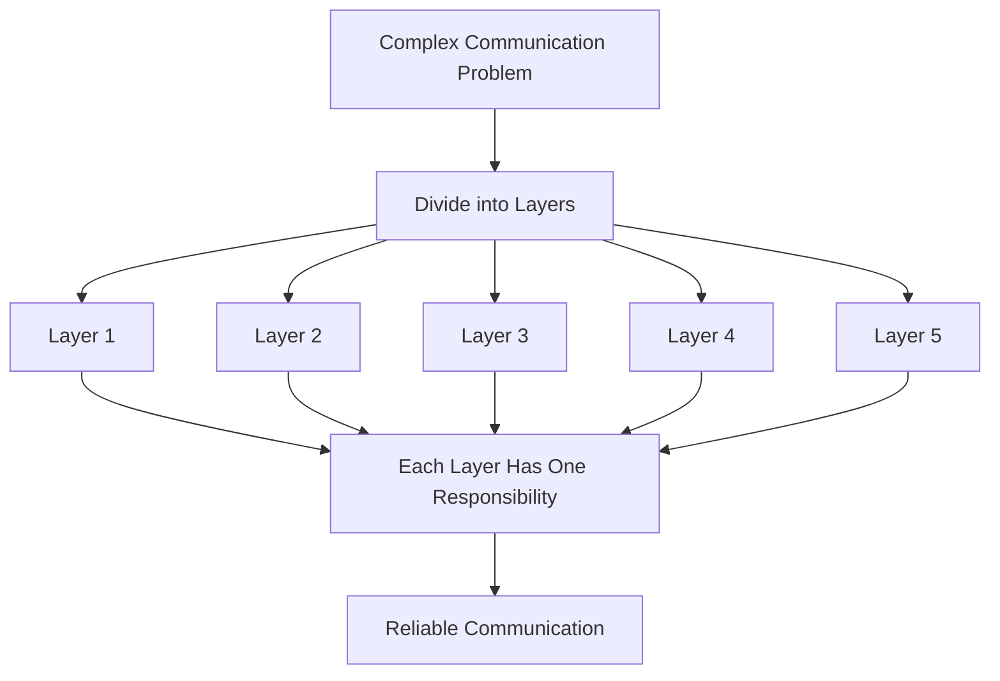

---

> 💡 **Did You Know?**
>
> Layered architecture is not unique to networking.
>
> Modern operating systems, software engineering, cloud computing, and even cybersecurity frameworks rely heavily on layered designs because they simplify complex systems.

---

# 🌍 The Problem Before Networking Models

During the 1960s and early 1970s, computer networking was still in its infancy.

Different manufacturers built their own networking technologies.

For example:

- IBM had its own networking methods.
- DEC created different communication protocols.
- Xerox developed another approach.
- Government research organizations experimented with new networking ideas.

Unfortunately...

None of these systems communicated well with one another.

It was similar to people speaking completely different languages without a translator.

---

## Imagine This Scenario

Company A uses Protocol A.

Company B uses Protocol B.

Company C uses Protocol C.

```text
Computer A  --------X--------  Computer B

Language A            Language B
```

The computers understand their own protocols but cannot understand each other.

As networking expanded globally, this became a major obstacle.

A universal communication framework was urgently needed.

---

<!--
Image Description:
Illustrate three computers from different manufacturers attempting to communicate. Each computer uses a different protocol represented by different colored speech bubbles or symbols. Red "X" marks should appear between the communication paths to indicate incompatibility. At the bottom, show a caption stating "Before Networking Standards".

Suggested Search Keywords:
early computer networking diagram
network protocol incompatibility
computer communication illustration
-->

<p align="center">

</p>

---

# 🌍 The Birth of Standardization

Engineers realized that the networking industry could not continue if every manufacturer created its own communication rules.

Instead of inventing completely different systems every time, the industry needed:

- Shared standards
- Common terminology
- Clearly defined responsibilities
- Vendor-independent communication

This idea eventually led to the development of networking models.

These models became blueprints that everyone could follow.

---

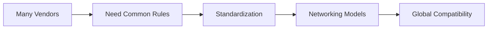

---

> 🎯 **Remember**
>
> Networking models do **not** replace protocols.
>
> Instead, they organize protocols into logical layers so that engineers around the world can build compatible networking systems.

---

# 📚 Historical Background of the OSI Model

By the late 1970s, many organizations recognized the need for an international networking standard.

The **International Organization for Standardization (ISO)** began designing a universal networking framework that could be adopted by manufacturers worldwide.

Rather than creating a specific protocol, ISO created a **reference model**.

This model became known as the:

# Open Systems Interconnection (OSI) Model

Its primary goal was to answer an important question:

> **"How should computers communicate in a standardized way?"**

The OSI Model divided networking into **seven distinct layers**, each responsible for a specific task.

Instead of focusing on implementation, it emphasized:

- Organization
- Modularity
- Standardization
- Interoperability

Because of this design, the OSI Model became one of the greatest educational tools in networking history.

---

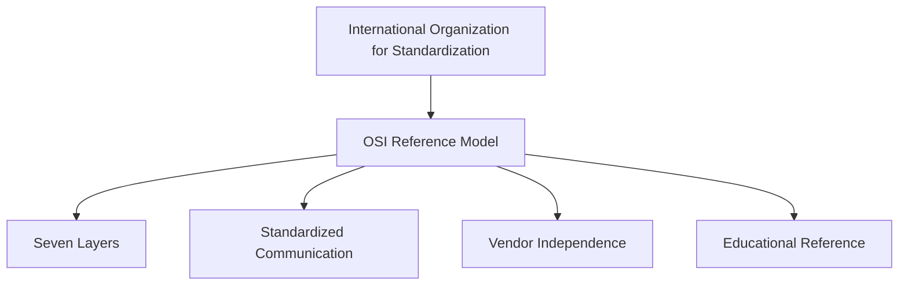

---

> 📝 **Note**
>
> The OSI Model is called a **reference model** because it describes **how networking should be organized**, not necessarily how every real-world network is implemented.

---

# 🌐 Historical Background of the TCP/IP Model

Around the same time, another networking project was taking shape—but with a very different goal.

Instead of designing a theoretical framework, researchers funded by the **United States Department of Defense (DoD)** wanted to build a **real communication system** that could connect computers across long distances.

Their research eventually led to **ARPANET**, the predecessor of today's Internet.

Rather than starting with theory, these researchers focused on solving practical engineering problems such as:

- Reliable communication
- Packet delivery
- Fault tolerance
- Interconnected networks

The collection of protocols they developed eventually became known as the:

# TCP/IP Protocol Suite

Unlike the OSI Model, TCP/IP was **built first and documented later**.

Its success came from the fact that it actually worked on real networks.

As the Internet expanded during the 1980s and 1990s, TCP/IP became the global networking standard.

---

> 💡 **Did You Know?**
>
> Many people casually say **"TCP/IP Model,"** but technically **TCP/IP** refers to a **suite of networking protocols**, while the layered architecture describing those protocols is known as the **TCP/IP Model** or **Internet Model**.

---

# 🎓 Knowledge Check #1

Before moving forward, see if you can answer these questions without looking back.

1. Why were networking models created?
2. What problem existed before networking standards?
3. Who developed the OSI Model?
4. Was the OSI Model designed as a real protocol implementation or a reference framework?
5. Why was TCP/IP originally developed?
6. Which model came from practical networking research?
7. Which model focuses more on education and standardization?

> Don't worry if you cannot answer every question yet. The next sections will build upon these concepts and make the differences between the two models much clearer.

---
# 🏛 The OSI Model — A Structured Blueprint for Networking

The **Open Systems Interconnection (OSI) Model** is a **conceptual reference model** that describes how data should move between devices across a network.

Notice the phrase **"reference model."**

This means the OSI Model is **not a networking protocol itself**. Instead, it acts as a **blueprint** that organizes network communication into logical layers. Each layer has a specific responsibility and communicates only with the layers directly above and below it.

By dividing networking into smaller, well-defined components, the OSI Model makes complex communication easier to understand, design, troubleshoot, and standardize.

Today, networking professionals still use the OSI Model because it provides a common language for discussing network operations, even though the Internet itself primarily relies on the TCP/IP protocol suite.

---

## 🏗 Design Philosophy of the OSI Model

The creators of the OSI Model believed that networking should be built using a **layered architecture**.

Instead of one massive system responsible for every networking task, they divided communication into seven independent layers.

Each layer performs one specific function and passes its work to the next layer.

This modular approach provides several important advantages:

- Easier troubleshooting
- Better organization
- Vendor independence
- Simpler protocol development
- Easier upgrades and maintenance

For example, if a problem occurs with routing, engineers can focus on the **Network Layer** without immediately investigating application software or physical cables.

---

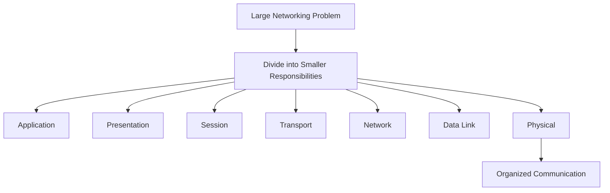

---

> 💡 **Did You Know?**
>
> Many engineering disciplines use layered architectures because they reduce complexity. Operating systems, cloud computing, web development, and even cybersecurity frameworks follow similar design principles.

---

## The Seven Layers of the OSI Model

The OSI Model consists of **seven layers**, numbered from **Layer 1** to **Layer 7**.

Each layer provides services to the layer above it while relying on services from the layer below it.

```text
+-----------------------------+
| Layer 7 | Application       |
+-----------------------------+
| Layer 6 | Presentation      |
+-----------------------------+
| Layer 5 | Session           |
+-----------------------------+
| Layer 4 | Transport         |
+-----------------------------+
| Layer 3 | Network           |
+-----------------------------+
| Layer 2 | Data Link         |
+-----------------------------+
| Layer 1 | Physical          |
+-----------------------------+
```

---

### Quick Overview of Each Layer

| Layer | Primary Responsibility |
|--------|------------------------|
| Application | Provides network services to user applications |
| Presentation | Data formatting, encryption, and compression |
| Session | Establishes, manages, and terminates communication sessions |
| Transport | Reliable delivery, segmentation, flow control, error recovery |
| Network | Logical addressing and routing |
| Data Link | Frame creation, MAC addressing, error detection |
| Physical | Transmission of raw bits over the physical medium |

---

<!--
Image Description:
A professionally designed OSI Model infographic showing all seven layers stacked vertically. Each layer should have its name, layer number, common protocols, and representative devices or functions. Use different colors for each layer and include arrows indicating data flow from Layer 7 down to Layer 1.

Suggested Search Keywords:
OSI model infographic
OSI 7 layers diagram
OSI networking layers illustration
-->

<p align="center">

</p>

---

## Why Is the OSI Model Still Taught?

A common beginner question is:

> **"If the Internet doesn't actually run on the OSI Model, why do we spend so much time learning it?"**

The answer is simple.

The OSI Model provides an excellent framework for understanding how networking works.

Imagine trying to diagnose a network problem without dividing networking into logical sections.

Was the problem caused by:

- The application?
- Encryption?
- Routing?
- The switch?
- The network cable?

Without layers, troubleshooting would become extremely difficult.

The OSI Model gives engineers a structured way to isolate problems.

For example:

- No network cable detected → Physical Layer
- Incorrect MAC address → Data Link Layer
- Wrong IP address → Network Layer
- TCP connection failure → Transport Layer
- Browser cannot access a website despite successful connectivity → Application Layer

Instead of guessing randomly, engineers investigate one layer at a time.

---

> 🎯 **Remember**
>
> The OSI Model is primarily a **teaching, design, and troubleshooting framework**. It helps engineers think systematically about network communication.

---

# 🌐 The TCP/IP Model — The Foundation of the Modern Internet

While the OSI Model provides a theoretical framework, the **TCP/IP Model** represents how modern computer networks actually communicate.

Every time you:

- Open a website
- Watch a YouTube video
- Send an email
- Join an online game
- Connect to cloud services
- Use social media

your data is almost certainly traveling through networks that use the **TCP/IP protocol suite**.

Unlike the OSI Model, TCP/IP was not designed as an educational model.

It was created to solve real networking problems and enable computers to communicate reliably across interconnected networks.

Because it proved successful in practice, it eventually became the communication standard for the global Internet.

---

## Design Philosophy of the TCP/IP Model

The TCP/IP Model was designed with one primary objective:

> **Build a reliable network that actually works in the real world.**

Rather than defining seven separate layers, the TCP/IP designers combined related responsibilities into fewer layers.

This made the architecture simpler and easier to implement.

Instead of emphasizing strict separation, TCP/IP focuses on practical communication between devices.

Its design priorities included:

- Reliability
- Scalability
- Fault tolerance
- Interoperability
- Simplicity
- Real-world deployment

These characteristics allowed TCP/IP to grow from the early ARPANET into the global Internet used today.

---

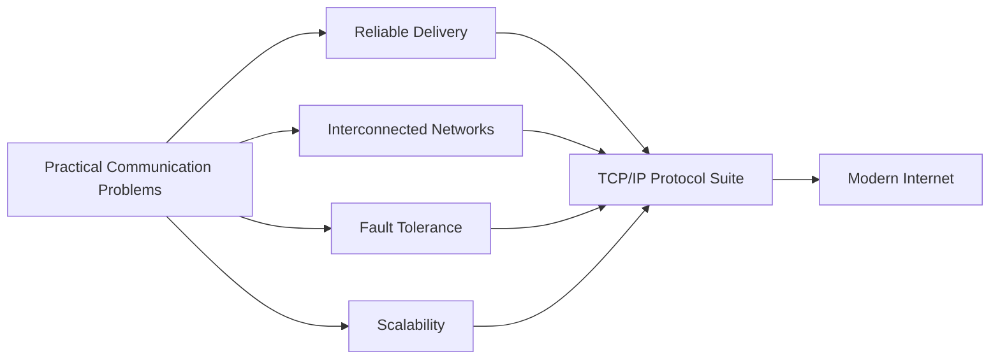

---

> 🚀 **Pro Tip**
>
> The TCP/IP Model evolved through practical use. It wasn't designed in isolation—it improved over time as engineers solved real networking challenges.

---

## The Four Layers of the TCP/IP Model

The TCP/IP Model organizes networking into **four primary layers**.

Each layer performs broader responsibilities than its OSI counterpart.

```text
+-----------------------------+
| Application                 |
+-----------------------------+
| Transport                   |
+-----------------------------+
| Internet                    |
+-----------------------------+
| Network Access              |
+-----------------------------+
```

Some textbooks divide the lowest layer into separate **Data Link** and **Physical** layers, creating a five-layer teaching model. However, the classic TCP/IP architecture contains **four layers**, and that is the version most commonly referenced in networking and cybersecurity.

---

### Quick Overview of Each Layer

| TCP/IP Layer | Primary Responsibility |
|--------------|------------------------|
| Application | User applications, data formatting, session management |
| Transport | End-to-end communication and reliable delivery |
| Internet | Logical addressing and routing |
| Network Access | Local network communication and physical transmission |

---

<!--
Image Description:
Create a modern TCP/IP Model infographic showing the four layers stacked vertically. Include common protocols like HTTP, HTTPS, DNS, FTP, TCP, UDP, IP, ICMP, Ethernet, and Wi-Fi within their respective layers. Show arrows illustrating data moving down and back up the stack.

Suggested Search Keywords:
TCP IP model diagram
Internet protocol suite infographic
TCP IP layers illustration
-->

<p align="center">

</p>

---

# 🆚 Comparing Their Design Philosophies

Although both models describe network communication, they were created with very different goals.

| OSI Model | TCP/IP Model |
|-----------|--------------|
| Designed as a reference framework | Designed as a working protocol architecture |
| Focuses on conceptual organization | Focuses on practical implementation |
| Seven highly specialized layers | Four broader, combined layers |
| Excellent for education and troubleshooting | Excellent for real-world networking |
| Protocol-independent | Built around the TCP/IP protocol suite |

Think of it this way:

- **The OSI Model asks:** *"How should networking be organized?"*
- **The TCP/IP Model asks:** *"How can computers successfully communicate?"*

Neither model is "better" in every situation—they simply serve different purposes.

---

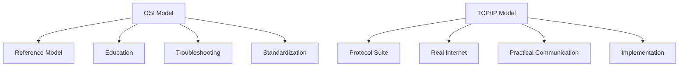

---

> ⚠ **Common Beginner Mistake**
>
> Many students assume the OSI Model and TCP/IP Model compete against each other.
>
> They don't.
>
> The OSI Model helps us **understand** networking, while the TCP/IP Model describes how the **Internet actually operates**. In professional environments, engineers often use the OSI Model to explain problems occurring within TCP/IP-based networks.

---

# 🎓 Knowledge Check

Before continuing, test your understanding.

1. Why is the OSI Model called a reference model?
2. What was the primary design goal of the TCP/IP Model?
3. Which model contains seven layers?
4. Which model powers today's Internet?
5. Why does the TCP/IP Model combine multiple responsibilities into fewer layers?
6. How does the OSI Model help with network troubleshooting?
7. Can a network use TCP/IP protocols while engineers troubleshoot using the OSI Model? Why?

# 🔄 Mapping the OSI Model to the TCP/IP Model

Now that you understand **what the OSI Model and the TCP/IP Model are individually**, it's time to answer one of the biggest questions beginners have:

> **"If one model has seven layers and the other has four, how do they relate to each other?"**

At first glance, the two models may seem completely different.

One contains **7 layers**.

The other contains **4 layers**.

However, they are **not describing different networking processes**.

They are describing **the same journey of data**, but they organize the responsibilities differently.

Think of it like two maps of the same city.

- One map shows **every street and intersection** in great detail.
- The other groups neighborhoods together to make navigation simpler.

Neither map is incorrect—they simply present the same information at different levels of detail.

The OSI Model takes a **highly detailed, modular approach**, while the TCP/IP Model groups related responsibilities into broader functional layers.

---

## 🏗 Visual Comparison

```text
OSI Model                          TCP/IP Model

Application   (Layer 7) ───────┐
Presentation  (Layer 6) ───────┤
Session       (Layer 5) ───────┘────────► Application

Transport     (Layer 4) ─────────────────► Transport

Network       (Layer 3) ─────────────────► Internet

Data Link     (Layer 2) ───────┐
Physical      (Layer 1) ───────┘────────► Network Access
```

Instead of creating completely new responsibilities, the TCP/IP Model **combines several closely related OSI layers into larger functional groups**.

---

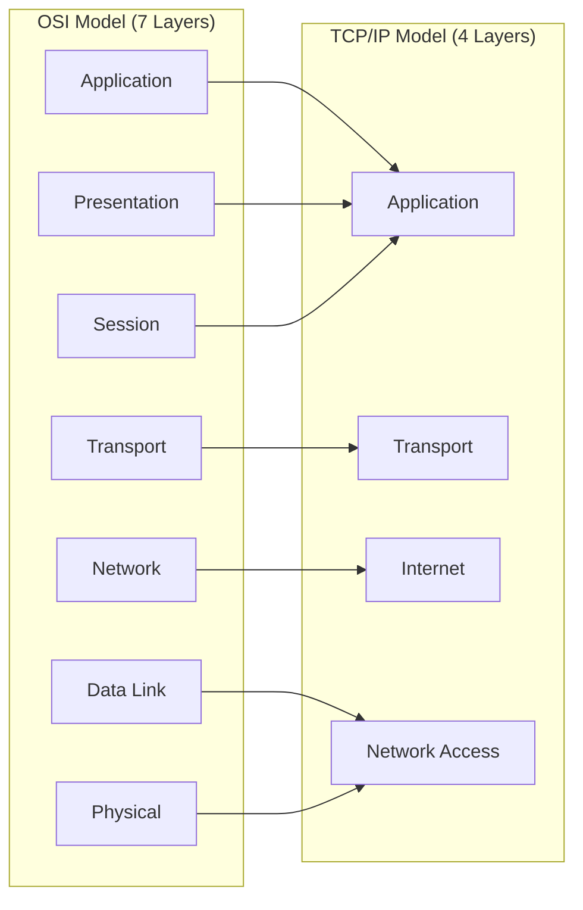

---

<!--
Image Description:
Create a side-by-side comparison of the OSI Model and TCP/IP Model. Display the seven OSI layers on the left and the four TCP/IP layers on the right. Use colored arrows to show how OSI layers map into the TCP/IP layers, especially highlighting that Application, Presentation, and Session merge into the TCP/IP Application layer, while Data Link and Physical merge into the Network Access layer.

Suggested Search Keywords:
OSI vs TCP IP layer mapping
OSI TCP IP comparison infographic
OSI TCP/IP correspondence diagram
-->

<p align="center">

</p>

---

# 📊 Complete Layer Mapping

The following table summarizes how each OSI layer corresponds to the TCP/IP Model.

| OSI Layer | TCP/IP Layer | Why They Correspond |
|-----------|--------------|---------------------|
| Application | Application | Provides network services to user applications |
| Presentation | Application | Handles data representation, encryption, and compression |
| Session | Application | Manages communication sessions between applications |
| Transport | Transport | Provides end-to-end communication and reliability |
| Network | Internet | Responsible for logical addressing and routing |
| Data Link | Network Access | Handles local network communication |
| Physical | Network Access | Transmits bits through the physical medium |

---

> 🎯 **Remember**
>
> The TCP/IP Model did **not remove** the responsibilities of the Presentation or Session layers.
>
> Those responsibilities still exist—they are simply handled within the **Application Layer** instead of being separated into individual layers.

---

# 🧩 Why Were Some Layers Combined?

This is another question that often confuses beginners.

> **"If the OSI Model has seven layers, why doesn't TCP/IP also use seven?"**

The answer lies in the different goals of the two models.

The OSI Model was designed to clearly separate every networking responsibility.

The TCP/IP Model was designed to make networking practical and efficient.

If several responsibilities naturally worked together, they were grouped into a single layer.

For example:

- Applications already manage sessions.
- Many applications perform their own encryption.
- Data formatting often depends on the application itself.

Instead of creating three independent layers, TCP/IP combines them into one.

Similarly:

- Ethernet
- Wi-Fi
- Fiber
- Copper cables
- MAC addressing

all work together to deliver data across the local network, so TCP/IP groups them into the **Network Access Layer**.

---

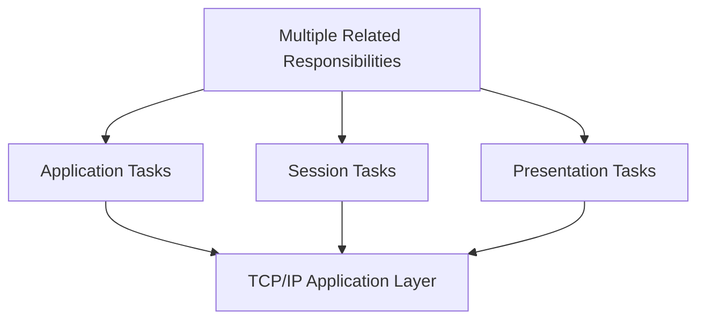

---

## 📦 Layer-by-Layer Mapping Explained

Let's examine each mapping in more detail.

---

## 1️⃣ OSI Application + Presentation + Session → TCP/IP Application

This is the biggest difference between the two models.

The OSI Model separates user communication into three different layers.

| OSI Layer | Responsibility |
|-----------|----------------|
| Application | Network services for software |
| Presentation | Data translation, encryption, compression |
| Session | Session establishment, maintenance, termination |

The TCP/IP Model combines all of these responsibilities into a single **Application Layer**.

Why?

Because in real-world networking, these functions are often performed together by the application or the protocols it uses.

For example, when you open **https://github.com**:

- Your browser requests the webpage.
- TLS encrypts the communication.
- The browser manages the session.
- Data formatting is handled automatically.

Although several different responsibilities are involved, they all happen within the TCP/IP Application Layer.

---

### 🌍 Real-World Example

Imagine entering a hotel.

Instead of visiting three different desks:

- Reception
- Security
- Customer Service

you visit **one reception desk** where all of those services are handled.

That is similar to how TCP/IP groups these networking responsibilities together.

---

> 💡 **Did You Know?**
>
> Protocols such as **HTTP, HTTPS, DNS, SMTP, FTP, SSH, IMAP, POP3, and DHCP** all operate within the TCP/IP Application Layer, even though some of their functions resemble the Presentation or Session layers of the OSI Model.

---

## 2️⃣ OSI Transport → TCP/IP Transport

This is the easiest mapping because both models define this layer in almost the same way.

Its primary responsibilities include:

- Reliable communication
- Segmentation
- Error recovery
- Flow control
- Port numbers
- End-to-end communication

Common protocols include:

- TCP
- UDP

Whether you're studying the OSI Model or TCP/IP Model, the Transport Layer performs essentially the same job.

---

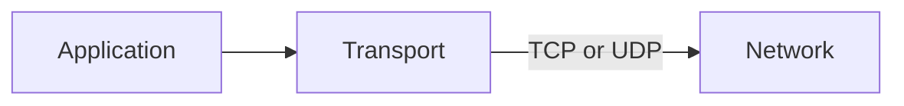

---

### 🌍 Real-World Example

Imagine sending a large book through the mail.

Instead of shipping the entire book as one huge package, it is divided into smaller boxes.

Each box receives:

- A sequence number
- Delivery information
- Tracking details

When the shipment arrives, the receiver puts every box back together in the correct order.

This is exactly how segmentation and reassembly work at the Transport Layer.

---

## 3️⃣ OSI Network → TCP/IP Internet

The mapping here is also very straightforward.

Both layers are responsible for moving data between different networks.

Their responsibilities include:

- Logical addressing
- Routing
- Path selection
- Packet forwarding

The primary protocol used here is:

- IP (Internet Protocol)

Routers primarily operate at this layer because they decide where packets should travel next.

---

### 🌍 Real-World Example

Suppose you order a package from another country.

Many roads are available.

The delivery company chooses the most appropriate route based on current network conditions.

Similarly, routers examine destination IP addresses and determine the best path toward the destination.

---

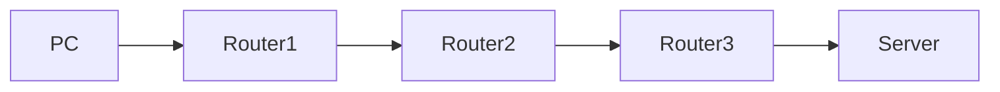

---

## 4️⃣ OSI Data Link + Physical → TCP/IP Network Access

The lowest layers of the OSI Model are combined into a single layer in TCP/IP.

Together they handle communication across the local network.

Responsibilities include:

- MAC addressing
- Framing
- Error detection
- Physical transmission
- Electrical, optical, or wireless signaling
- Local network access

Common technologies include:

- Ethernet
- Wi-Fi
- Fiber Optics
- Copper Ethernet
- Network Interface Cards (NICs)

---

### 🌍 Real-World Example

Imagine driving your car through city streets.

The road itself represents the physical medium.

Traffic signs and lane markings represent communication rules.

Your car follows these local rules until it reaches the highway.

Similarly, the Network Access Layer handles communication within the local network before packets are forwarded to routers.

---

> 🚀 **Pro Tip**
>
> Although the TCP/IP Model groups these responsibilities together, network engineers often continue discussing **Data Link** and **Physical** layers separately because switches, NICs, cables, and wireless technologies each have unique behaviors.

---

# 📋 OSI vs TCP/IP Responsibilities at a Glance

| Networking Responsibility | OSI Layer | TCP/IP Layer |
|---------------------------|-----------|--------------|
| User Applications | Application | Application |
| Encryption | Presentation | Application |
| Compression | Presentation | Application |
| Session Management | Session | Application |
| Reliable Delivery | Transport | Transport |
| Port Numbers | Transport | Transport |
| Logical Addressing | Network | Internet |
| Routing | Network | Internet |
| MAC Addressing | Data Link | Network Access |
| Framing | Data Link | Network Access |
| Physical Transmission | Physical | Network Access |

---

# 🎓 Knowledge Check

Before moving to the next section, test your understanding.

1. Why does the TCP/IP Model have fewer layers than the OSI Model?
2. Which three OSI layers become the TCP/IP Application Layer?
3. Which two OSI layers become the Network Access Layer?
4. Which layers map almost one-to-one between the two models?
5. Does combining layers mean those responsibilities disappear?
6. Why is the Transport Layer nearly identical in both models?
7. Why do networking professionals still discuss Data Link and Physical separately, even when using the TCP/IP Model?

# ⚖️ Detailed Layer-by-Layer Comparison

Now that you've seen **how the layers map together**, let's compare them in detail.

Instead of simply saying *"these layers are equivalent,"* we'll examine **what each layer actually does**, **which protocols operate there**, **what devices commonly work at that layer**, and **how cybersecurity professionals interact with it**.

This section is particularly valuable because it connects **theoretical networking concepts** with **real-world implementations**.

---

# Layer 7 (OSI) ↔ Application Layer (TCP/IP)

The **Application Layer** is the closest layer to the user.

It is where network-aware applications interact with the networking stack to request or provide services.

When you:

- Visit a website
- Send an email
- Download a file
- Chat on Discord
- Watch Netflix
- Access cloud storage

your interaction begins at this layer.

Although the OSI Model separates **Application**, **Presentation**, and **Session**, the TCP/IP Model combines all of those responsibilities into its single **Application Layer**.

---

## Primary Responsibilities

| OSI Model | TCP/IP Model |
|-----------|--------------|
| Provides network services to applications | Provides network services to applications |
| User interaction | User interaction |
| Data formatting | Included |
| Encryption | Included |
| Compression | Included |
| Session management | Included |

---

## Common Protocols

| Protocol | Purpose |
|----------|----------|
| HTTP | Web browsing |
| HTTPS | Secure web browsing |
| DNS | Domain name resolution |
| SMTP | Sending email |
| IMAP | Receiving email |
| POP3 | Downloading email |
| FTP | File Transfer |
| SFTP | Secure File Transfer |
| SSH | Secure remote administration |
| DHCP | Automatic IP address assignment |
| SNMP | Network management |

---

### 🌍 Real-World Example

Imagine opening your browser and typing:

```text
https://github.com
```

Your browser:

- Requests the webpage
- Encrypts communication using TLS
- Manages the communication session
- Formats received data
- Displays the webpage

Although multiple networking functions occur, the TCP/IP Model groups them into its **Application Layer**.

---

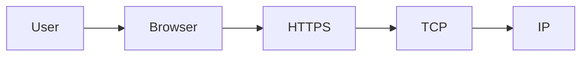

---

> 💡 **Did You Know?**
>
> Most cybersecurity investigations begin with application-layer evidence, such as web requests, email headers, login attempts, DNS queries, or API traffic.

---

# Layer 4 (OSI) ↔ Transport Layer (TCP/IP)

The Transport Layer is responsible for **end-to-end communication** between devices.

Instead of worrying about where data travels, it focuses on **how data reaches the correct application reliably and efficiently**.

This layer is almost identical in both networking models.

---

## Primary Responsibilities

- Segmentation
- Reassembly
- Reliable delivery
- Error recovery
- Flow control
- Port numbers
- Multiplexing

---

## Common Protocols

| Protocol | Characteristics |
|----------|-----------------|
| TCP | Reliable, connection-oriented |
| UDP | Fast, connectionless |

---

## TCP vs UDP

| Feature | TCP | UDP |
|---------|-----|-----|
| Reliable Delivery | ✅ | ❌ |
| Acknowledgments | ✅ | ❌ |
| Error Recovery | ✅ | ❌ |
| Speed | Slower | Faster |
| Streaming | Limited | Excellent |
| Gaming | Sometimes | Common |
| VoIP | Rare | Common |

---

### 🌍 Real-World Example

Suppose you're downloading a **5 GB operating system image**.

Would you want missing pieces?

Of course not.

TCP ensures:

- Every segment arrives.
- Missing data is retransmitted.
- Everything is reassembled correctly.

Now imagine watching a live football match online.

Losing one video frame is usually better than pausing the stream every few seconds.

For this reason, streaming services often prefer UDP for real-time communication.

---

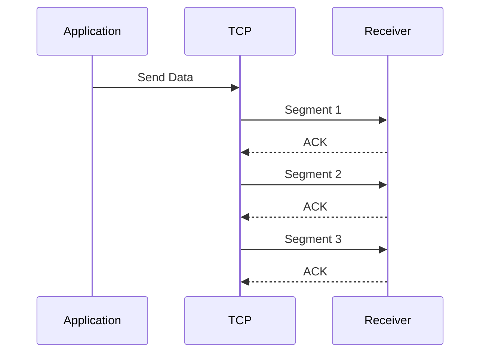

---

> 🚀 **Pro Tip**
>
> One of the first things security analysts examine during packet analysis is whether the traffic uses **TCP** or **UDP**, because it immediately reveals how the communication is expected to behave.

---

# Layer 3 (OSI) ↔ Internet Layer (TCP/IP)

The Network Layer in the OSI Model corresponds directly to the Internet Layer in the TCP/IP Model.

Its primary responsibility is **moving packets between different networks**.

Think of this layer as the navigation system of the Internet.

It determines **where data should travel**.

---

## Primary Responsibilities

- Logical addressing
- Routing
- Path selection
- Packet forwarding
- Fragmentation (IPv4)

---

## Common Protocols

| Protocol | Purpose |
|----------|----------|
| IPv4 | Logical addressing |
| IPv6 | Modern logical addressing |
| ICMP | Error reporting and diagnostics |
| IGMP | Multicast communication |
| IPsec | Secure IP communication |

---

## Devices

- Routers
- Layer 3 Switches
- Firewalls (routing mode)

---

### 🌍 Real-World Example

Suppose you're sending a parcel from Pakistan to Germany.

The delivery company chooses:

- Highways
- Airports
- Distribution centers

Your parcel doesn't choose the path.

The courier company does.

Similarly, routers examine the destination IP address and decide which route the packet should follow.

---

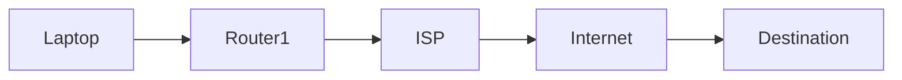

---

> 🎯 **Remember**
>
> IP addresses identify **where** devices are located within a network, while routers decide **how** packets reach those destinations.

---

# Layer 2 (OSI) ↔ Network Access Layer (TCP/IP)

The Data Link Layer provides communication **within the local network**.

Unlike IP addresses, which identify devices globally, this layer uses **MAC addresses** for local delivery.

Its responsibilities include:

- Frame creation
- MAC addressing
- Error detection
- Media access
- Local delivery

Within the TCP/IP Model, these responsibilities belong to the **Network Access Layer**.

---

## Common Technologies

| Technology | Purpose |
|------------|----------|
| Ethernet | Wired LAN communication |
| Wi-Fi (802.11) | Wireless LAN communication |
| PPP | Point-to-point communication |
| VLAN (802.1Q) | Virtual LAN tagging |

---

## Devices

- Switches
- Bridges
- NICs
- Wireless Access Points

---

### 🌍 Real-World Example

Imagine delivering a package inside a large office building.

The city already delivered the package to the correct building.

Now someone inside must determine **which office** receives it.

That local delivery is similar to what the Data Link Layer performs using MAC addresses.

---

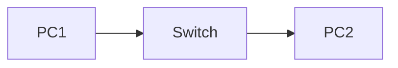

---

> 📝 **Note**
>
> Switches primarily make forwarding decisions using **MAC addresses**, not IP addresses.

---

# Layer 1 (OSI) ↔ Network Access Layer (TCP/IP)

The Physical Layer is responsible for transmitting raw bits across the communication medium.

Unlike higher layers, it does **not understand packets, frames, ports, or IP addresses**.

It only understands electrical, optical, or radio signals.

Examples include:

- Copper Ethernet cables
- Fiber optic cables
- Wireless radio waves
- Connectors
- Network interface hardware

Within the TCP/IP Model, these responsibilities are grouped into the **Network Access Layer**.

---

## Common Hardware

| Hardware | Function |
|----------|----------|
| Ethernet Cable | Carries electrical signals |
| Fiber Optic Cable | Carries light pulses |
| Wireless Antenna | Sends radio signals |
| Hub | Physical signal forwarding |
| Repeater | Signal regeneration |

---

### 🌍 Real-World Example

Imagine speaking to someone over a telephone.

Your voice becomes:

- Electrical signals
- Digital signals
- Radio waves
- Light pulses

The communication medium changes, but the message remains the same.

Similarly, the Physical Layer converts bits into signals that can travel through the transmission medium.

---

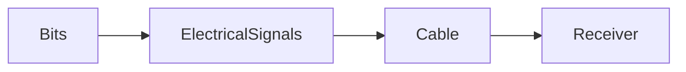

---

# 📊 Complete Layer-by-Layer Comparison

| OSI Layer | TCP/IP Layer | Main Responsibility | Example Protocols | Common Devices |
|-----------|--------------|--------------------|------------------|----------------|
| Application | Application | User services | HTTP, HTTPS, DNS, SMTP | Proxy Server |
| Presentation | Application | Encryption & formatting | TLS, SSL | Gateway |
| Session | Application | Session management | RPC, NetBIOS | Gateway |
| Transport | Transport | Reliable delivery | TCP, UDP | Firewall |
| Network | Internet | Routing | IPv4, IPv6, ICMP | Router |
| Data Link | Network Access | Framing & MAC addressing | Ethernet, Wi-Fi | Switch |
| Physical | Network Access | Signal transmission | Ethernet PHY, Fiber | Hub, Cable |

---

<!--
Image Description:
A professional comparison chart showing all seven OSI layers beside the four TCP/IP layers. Each row should display responsibilities, example protocols, typical networking devices, and the type of data handled (Data, Segments, Packets, Frames, Bits). Use color coding to make corresponding layers easy to identify.

Suggested Search Keywords:
OSI vs TCP IP detailed comparison
network layers protocols devices infographic
OSI TCP/IP responsibilities diagram
-->

<p align="center">

</p>

---

# 🎓 Knowledge Check

Take a moment to test your understanding before moving on.

1. Which OSI layers are combined into the TCP/IP Application Layer?
2. Why is the Transport Layer nearly identical in both models?
3. Which protocols operate at the Internet Layer?
4. Which devices primarily work at the Data Link Layer?
5. Why are MAC addresses used instead of IP addresses on local networks?
6. What is the main responsibility of the Physical Layer?
7. Which layer would be responsible if a damaged Ethernet cable prevents communication?
8. Which layer handles DNS requests?
9. Which protocol would you typically see when securely browsing a website?
10. Why do routers operate at Layer 3 instead of Layer 2?

# ⚖️ Similarities and Differences Between the OSI Model and TCP/IP Model

By this point, you've learned that both the **OSI Model** and the **TCP/IP Model** describe how data travels across a network.

However, they do so in different ways.

This often leads beginners to believe that they are competing technologies.

They are not.

In reality, they share many similarities because they describe the **same networking process**, but they differ in their **design philosophy, structure, purpose, and implementation**.

Understanding these similarities and differences is essential because networking interviews, certification exams, and cybersecurity professionals frequently compare the two models.

---

# 🤝 Similarities Between the OSI and TCP/IP Models

Although they were developed independently, the two models have much more in common than many beginners realize.

Both models aim to solve the same fundamental problem:

> **How can two computers communicate reliably across a network?**

Let's examine their major similarities.

---

## 1️⃣ Both Use a Layered Architecture

Instead of treating networking as one enormous process, both models divide communication into layers.

Each layer has its own responsibilities and interacts only with adjacent layers.

### Why is this important?

Imagine troubleshooting an Internet problem.

Without layers, you would have to inspect every networking component simultaneously.

With layered models, you can narrow the problem down.

For example:

- Cable disconnected → Physical Layer
- Wrong IP Address → Network / Internet Layer
- Website unavailable → Application Layer

Layering dramatically simplifies troubleshooting.

---

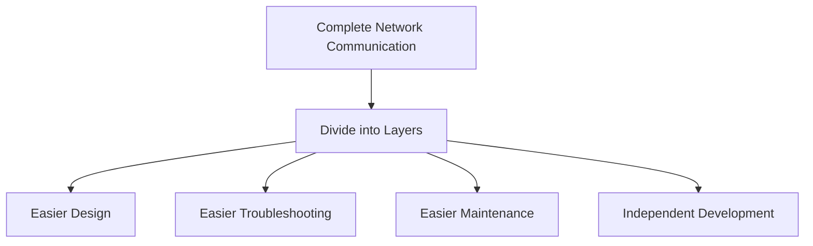

---

## 2️⃣ Both Describe End-to-End Communication

Regardless of which model you study, the overall journey remains the same.

Data:

- Starts at an application
- Travels down through networking layers
- Crosses the network
- Moves back up the layers
- Reaches another application

The organization differs, but the communication process is fundamentally identical.

---

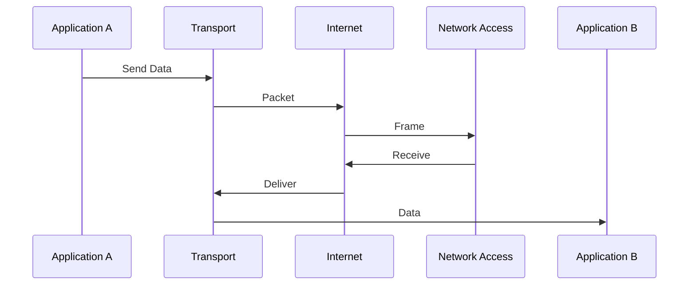

---

## 3️⃣ Both Support Modular Design

A change in one layer generally does not require redesigning the entire networking stack.

For example:

Replacing:

- Wi-Fi with Ethernet
- IPv4 with IPv6
- HTTP with HTTPS

does not require rebuilding every other networking layer.

This modularity has allowed networking technology to evolve over several decades.

---

## 4️⃣ Both Improve Standardization

Networking would be impossible if every manufacturer invented completely different communication methods.

Both models encourage:

- Compatibility
- Standardized communication
- Interoperability
- Vendor independence

Because of these standards:

- A Dell laptop can communicate with an Apple server.
- A Cisco router can forward traffic to a Juniper router.
- An Android phone can access a Microsoft Azure server.

---

> 💡 **Did You Know?**
>
> One of the biggest reasons the Internet became so successful is that networking standards allow millions of devices from thousands of manufacturers to communicate seamlessly.

---

# 📊 Similarities at a Glance

| Feature | OSI Model | TCP/IP Model |
|----------|-----------|--------------|
| Layered Architecture | ✅ | ✅ |
| Modular Design | ✅ | ✅ |
| Standardization | ✅ | ✅ |
| Supports End-to-End Communication | ✅ | ✅ |
| Vendor Independent Concepts | ✅ | ✅ |
| Helps Troubleshooting | ✅ | ✅ |

---

# 🔍 Differences Between the OSI and TCP/IP Models

Although they solve similar problems, their design approaches differ significantly.

Let's examine those differences one by one.

---

# 1️⃣ Number of Layers

This is the most obvious difference.

| OSI Model | TCP/IP Model |
|-----------|--------------|
| 7 Layers | 4 Layers |

The OSI Model separates networking into smaller, specialized responsibilities.

The TCP/IP Model groups related responsibilities into broader layers.

Neither approach is inherently better.

They simply prioritize different goals.

---

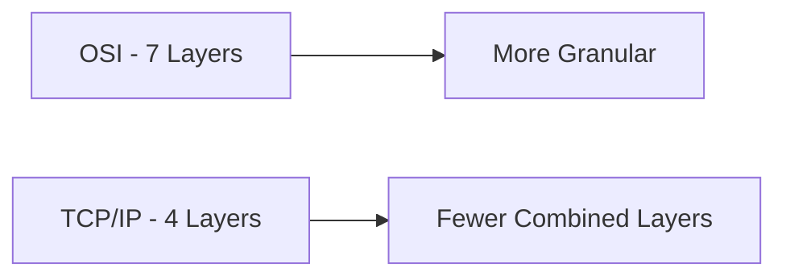

---

# 2️⃣ Purpose

Perhaps the most important difference lies in **why each model was created**.

| OSI Model | TCP/IP Model |
|-----------|--------------|
| Educational Reference Model | Practical Communication Model |

The OSI Model asks:

> **"How should networking be organized?"**

The TCP/IP Model asks:

> **"How can we make computers communicate successfully?"**

---

# 3️⃣ Development History

The two models originated from entirely different organizations.

| OSI Model | TCP/IP Model |
|-----------|--------------|
| Developed by ISO | Developed through DARPA research |
| International standardization effort | U.S. Department of Defense research |
| Designed before implementation | Built through practical implementation |

The OSI Model was developed by first defining an ideal architecture.

TCP/IP evolved by solving real networking challenges, with the architecture being documented as it matured.

---

# 4️⃣ Protocol Dependency

Another major difference is how each model relates to networking protocols.

### OSI Model

The OSI Model is **protocol-independent**.

It does not require any specific protocol.

Any protocol that follows the layered architecture can theoretically fit within the model.

### TCP/IP Model

The TCP/IP Model is based on the TCP/IP protocol suite.

Its layers are designed around protocols such as:

- IP
- TCP
- UDP
- ICMP
- ARP
- HTTP
- DNS

---

> 🎯 **Remember**
>
> The OSI Model explains **how networking concepts are organized**, while the TCP/IP Model explains **how the Internet's protocols work together**.

---

# 5️⃣ Layer Separation

The OSI Model defines strict boundaries between responsibilities.

For example:

- Presentation handles formatting.
- Session handles communication sessions.
- Application provides services.

The TCP/IP Model combines those responsibilities into one Application Layer.

Similarly:

- Physical
- Data Link

are merged into the Network Access Layer.

This makes the TCP/IP Model simpler but less granular.

---

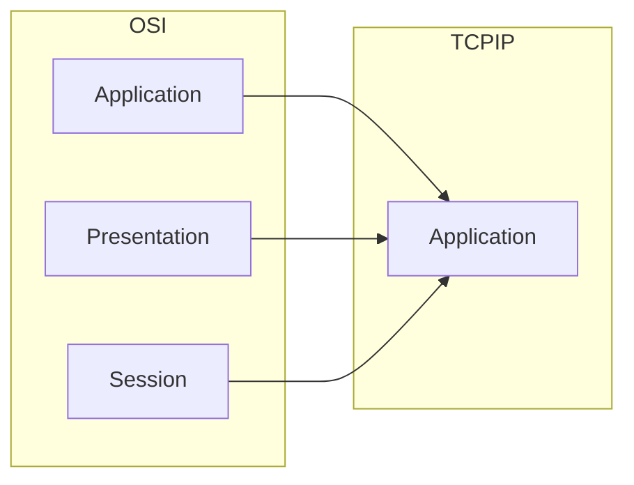

---

# 6️⃣ Adoption

Perhaps the biggest practical difference is where each model is used.

| OSI Model | TCP/IP Model |
|-----------|--------------|
| Mostly education | Global Internet |
| Certifications | Enterprise Networks |
| Documentation | Cloud Computing |
| Troubleshooting | Real Network Communication |

Every website you visit today relies on TCP/IP.

However, engineers often explain problems using OSI terminology because its layer separation is easier to understand.

---

# 📋 Comprehensive Comparison Table

| Feature | OSI Model | TCP/IP Model |
|---------|-----------|--------------|
| Number of Layers | 7 | 4 |
| Developed By | ISO | DARPA / DoD |
| Purpose | Reference Model | Protocol Suite Architecture |
| Focus | Standardization | Practical Communication |
| Protocol Independent | ✅ Yes | ❌ No |
| Used on Modern Internet | ❌ No | ✅ Yes |
| Educational Value | Excellent | Good |
| Troubleshooting | Excellent | Good |
| Implementation | Conceptual | Practical |
| Layer Separation | Strict | Combined |

---

<!--
Image Description:
A professional side-by-side infographic comparing the OSI Model and TCP/IP Model. On the left, display the seven OSI layers stacked vertically. On the right, display the four TCP/IP layers. Below the diagrams, include a comparison table highlighting differences such as number of layers, creator, purpose, implementation, protocol dependency, adoption, and real-world usage. Use contrasting colors to distinguish the two models while showing connecting arrows between equivalent layers.

Suggested Search Keywords:
OSI vs TCP/IP comparison infographic
OSI TCP IP differences chart
network models comparison diagram
-->

<p align="center">

</p>

---

# 🌍 Real-World Example — Sending an Email

Let's revisit a familiar example.

Suppose you send an email to your friend.

### Using the OSI Model, we can describe the process in detail:

- **Application** → Your email client creates the message.
- **Presentation** → The message is encoded and encrypted.
- **Session** → A communication session is established with the mail server.
- **Transport** → TCP ensures reliable delivery.
- **Network** → IP determines the destination.
- **Data Link** → Ethernet or Wi-Fi creates frames.
- **Physical** → Electrical, optical, or radio signals carry the data.

Now look at the same process using the TCP/IP Model:

| TCP/IP Layer | What Happens |
|--------------|--------------|
| Application | Creates, formats, encrypts, and manages the email session |
| Transport | TCP reliably delivers the data |
| Internet | IP routes the packet |
| Network Access | Ethernet or Wi-Fi transmits the frame over the physical medium |

Notice that **nothing about the communication changes**.

Only the way we **organize and describe** the process changes.

This is one of the most important concepts to understand when comparing the two models.

---

> ⚠ **Common Beginner Mistake**
>
> Many students believe that a computer "chooses" between using the OSI Model or the TCP/IP Model.
>
> It does not.
>
> Real devices communicate using **TCP/IP protocols**, while engineers often use the **OSI Model as a conceptual framework** for learning, documentation, and troubleshooting.

---

# 🎓 Knowledge Check

Before moving on, try answering these questions on your own.

1. Why do both models use a layered architecture?
2. What is the biggest structural difference between the OSI and TCP/IP Models?
3. Which model is protocol-independent?
4. Which model powers the modern Internet?
5. Why does the OSI Model separate Presentation and Session into different layers?
6. Does TCP/IP eliminate those responsibilities?
7. Why is the OSI Model still widely taught if the Internet uses TCP/IP?
8. Can engineers use the OSI Model while troubleshooting a TCP/IP network? Why?
9. Which model is generally considered more detailed?
10. If you were designing networking education for beginners, which model would be easier to teach concepts with, and why?

# ⚖️ Advantages and Disadvantages of the OSI and TCP/IP Models

Now that you've explored the architecture, layer mapping, and differences between the two models, a natural question arises:

> **"If the TCP/IP Model powers the Internet, why do we still study the OSI Model?"**

Or perhaps:

> **"If the OSI Model is so detailed, why wasn't it adopted as the Internet standard?"**

These are excellent questions.

To answer them, we need to look beyond the technical layers and understand the **strengths, limitations, and real-world adoption** of each model.

Remember:

- The **OSI Model** was designed to create a universal networking framework.
- The **TCP/IP Model** was designed to solve practical networking problems.

Both achieved their goals—but in very different ways.

---

# 🌐 Advantages of the OSI Model

Although the Internet doesn't operate directly on the OSI Model, it remains one of the most valuable tools in networking education.

Let's examine why.

---

## 1️⃣ Clear Separation of Responsibilities

One of the OSI Model's greatest strengths is its **strict separation of responsibilities**.

Each layer has a clearly defined purpose.

For example:

- Layer 3 handles routing.
- Layer 4 handles reliable delivery.
- Layer 6 handles encryption and data formatting.

Because responsibilities rarely overlap, understanding network communication becomes much easier.

---

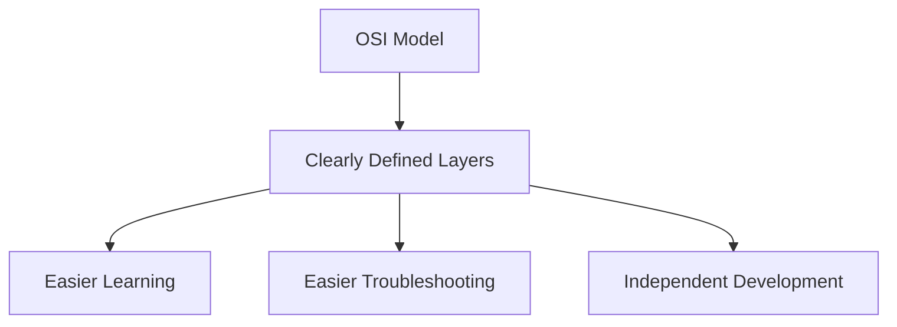

---

### 🌍 Real-World Analogy

Imagine a hospital.

Each department has a specific responsibility:

- Reception
- Emergency
- Radiology
- Surgery
- Pharmacy

Patients move between departments depending on their needs.

No department tries to perform every task.

The OSI Model follows the same principle.

Each networking layer specializes in one area.

---

## 2️⃣ Excellent Educational Tool

The OSI Model explains networking step by step.

Instead of presenting networking as one enormous process, it divides communication into logical pieces.

This makes it ideal for:

- Universities
- Certification programs
- Technical books
- Network documentation
- Training courses

That is why nearly every networking certification introduces the OSI Model before TCP/IP.

---

> 💡 **Did You Know?**
>
> Certifications such as **CompTIA Network+**, **CompTIA Security+**, **Cisco CCNA**, **CCNP**, **CEH**, and many university networking courses still rely heavily on the OSI Model because of its structured approach.

---

## 3️⃣ Easier Troubleshooting

One of the biggest reasons engineers still use the OSI Model is troubleshooting.

Suppose a user reports:

> "I can't access the company website."

Instead of checking everything randomly, an engineer can investigate layer by layer.

| Problem | Possible Layer |
|----------|----------------|
| Damaged cable | Physical |
| Switch issue | Data Link |
| Incorrect IP | Network |
| TCP failure | Transport |
| Browser issue | Application |

This systematic process reduces confusion and speeds up troubleshooting.

---

```mermaid
flowchart TD

Problem[Network Problem]

Problem --> L1[Physical]

Problem --> L2[Data Link]

Problem --> L3[Network]

Problem --> L4[Transport]

Problem --> L7[Application]

L1 --> Solution[Troubleshoot One Layer at a Time]
L2 --> Solution
L3 --> Solution
L4 --> Solution
L7 --> Solution
```

---

## 4️⃣ Vendor Independence

The OSI Model is **protocol-independent**.

It doesn't require any particular technology.

Whether future networks use entirely new protocols or technologies, they can still be described using the OSI framework.

This flexibility makes it useful even decades after its creation.

---

## 5️⃣ Encourages Modular Development

Because each layer performs a separate function, developers can improve one layer without redesigning the entire networking system.

For example:

- Faster Ethernet
- New encryption methods
- Improved routing algorithms

can all evolve independently.

---

# ❌ Disadvantages of the OSI Model

Although the OSI Model is an excellent educational framework, it has several practical limitations.

---

## 1️⃣ It Is Only a Reference Model

This is the most important limitation.

The OSI Model describes **how networking should be organized**, but it does not define a complete protocol suite that became widely adopted.

In other words:

It explains networking.

It doesn't power the Internet.

---

> 🎯 **Remember**
>
> The OSI Model provides the **theory** of networking.
>
> The TCP/IP protocol suite provides the **implementation** used by the Internet.

---

## 2️⃣ More Complex Architecture

Seven layers provide excellent organization, but they also introduce additional complexity.

For beginners, distinguishing between:

- Session
- Presentation
- Application

can initially feel confusing.

In real-world software, these responsibilities often overlap.

---

## 3️⃣ Limited Real-World Deployment

Although some OSI protocols were developed, they never achieved the widespread adoption of TCP/IP.

As the Internet expanded, TCP/IP had already become the dominant networking technology.

---

## 4️⃣ Some Layer Boundaries Are Artificial

In practice, modern applications frequently perform:

- Encryption
- Compression
- Session management

themselves.

Because of this, maintaining separate Presentation and Session layers is not always necessary.

---

# 🌍 Advantages of the TCP/IP Model

Now let's examine why TCP/IP became the foundation of the Internet.

---

## 1️⃣ Proven in Real Networks

Unlike the OSI Model, TCP/IP was developed while solving practical networking challenges.

It wasn't merely theoretical.

It successfully connected computers across long distances, proving that the architecture worked.

This practical success led to widespread adoption.

---

```mermaid
flowchart LR

Research

--> ARPANET

ARPANET

--> TCP/IP

TCP/IP

--> Internet

Internet

--> BillionsOfDevices[Billions of Connected Devices]
```

---

## 2️⃣ Simpler Architecture

The TCP/IP Model combines related responsibilities into broader layers.

Instead of seven specialized layers, engineers work with four primary layers.

This simplification makes implementation easier.

---

## 3️⃣ Highly Scalable

One of TCP/IP's greatest achievements is scalability.

It successfully grew from:

- A few research computers
- University networks
- Government organizations

to today's Internet containing billions of connected devices.

Very few technologies have scaled as successfully.

---

## 4️⃣ Excellent Interoperability

TCP/IP allows devices from different manufacturers to communicate seamlessly.

Examples include:

- Windows ↔ Linux
- Android ↔ iPhone
- Cisco ↔ Juniper
- AWS ↔ Azure
- Home Wi-Fi ↔ Enterprise Networks

This interoperability is one reason the Internet expanded so rapidly.

---

## 5️⃣ Continuous Evolution

TCP/IP has evolved for decades.

Examples include:

- IPv6
- HTTP/2
- HTTP/3
- TLS
- QUIC
- DNSSEC

Rather than replacing the architecture, engineers continuously improve the protocols.

---

> 🚀 **Pro Tip**
>
> One of TCP/IP's greatest strengths is that it adapts without requiring the entire Internet to be redesigned.

---

# ❌ Disadvantages of the TCP/IP Model

Although TCP/IP powers the Internet, it is not perfect.

---

## 1️⃣ Less Detailed Than the OSI Model

Because multiple responsibilities are combined into fewer layers, the TCP/IP Model provides less conceptual detail.

This makes it slightly less effective as a teaching model.

---

## 2️⃣ No Separate Presentation or Session Layers

Encryption, formatting, and session management are grouped into the Application Layer.

While this simplifies implementation, it also hides some conceptual distinctions that beginners benefit from learning.

---

## 3️⃣ Originally Designed Without Modern Security

The early Internet was built among trusted research institutions.

As a result, the original TCP/IP protocols emphasized connectivity over security.

Features such as:

- Authentication
- Encryption
- Integrity verification

were often added later through additional protocols like TLS, IPsec, and SSH.

---

> ⚠ **Common Beginner Mistake**
>
> Many people assume TCP/IP was designed with modern cybersecurity threats in mind.
>
> It wasn't.
>
> Security mechanisms were gradually added as the Internet evolved and became a global public network.

---

# 🌍 Why Does the Internet Use TCP/IP Instead of the OSI Model?

This is perhaps the most frequently asked question after studying both models.

The answer is **not** that the OSI Model was poorly designed.

In fact, the OSI Model is an excellent reference framework.

The real reason is largely historical.

---

## TCP/IP Arrived First

While the OSI committees were still designing their reference architecture, TCP/IP was already being tested on real networks.

Researchers could immediately see that it worked.

As universities and research organizations adopted TCP/IP, its popularity grew rapidly.

By the time the OSI protocols became available, TCP/IP had already established itself as the dominant networking technology.

---

## It Solved Real Problems

Organizations don't adopt technologies because they look elegant on paper.

They adopt technologies that work reliably.

TCP/IP provided:

- Reliable communication
- Routing across multiple networks
- Fault tolerance
- Scalability
- Practical implementation

These qualities made it the natural choice for the expanding Internet.

---

## Wide Adoption Created a Network Effect

As more organizations adopted TCP/IP:

- Software supported it.
- Hardware supported it.
- Universities taught it.
- Internet providers deployed it.

Eventually, using anything else became impractical.

This phenomenon is called the **network effect**.

The value of a technology increases as more people use it.

---

```mermaid
flowchart LR

TCPIP[TCP/IP Works]

TCPIP --> Universities

TCPIP --> Government

TCPIP --> Companies

Universities --> Growth

Government --> Growth

Companies --> Growth

Growth --> InternetStandard[Global Internet Standard]
```

---

## The OSI Model Didn't Fail

A common misconception is that the OSI Model failed.

That isn't accurate.

The **OSI protocols** failed to gain widespread adoption.

The **OSI reference model**, however, became one of the most influential educational frameworks ever created.

Even today, networking professionals use OSI terminology when discussing TCP/IP networks.

---

# 🧠 Common Beginner Misconceptions

| ❌ Misconception | ✅ Reality |
|------------------|-----------|
| The OSI Model powers the Internet. | The Internet primarily uses TCP/IP. |
| TCP/IP replaced every part of the OSI Model. | TCP/IP replaced the protocol suite, not the educational value of the OSI Model. |
| The models compete with each other. | They complement each other. |
| The TCP/IP Model ignores Presentation and Session functions. | Those responsibilities still exist but are grouped within the Application Layer. |
| The OSI Model is obsolete. | It remains one of the most important learning and troubleshooting frameworks in networking. |

---

# 🎓 Knowledge Check

Before moving on, test your understanding.

1. Why is the OSI Model considered an excellent educational tool?
2. What makes the OSI Model particularly useful during troubleshooting?
3. Why is TCP/IP considered more practical than the OSI Model?
4. What is meant by the term *network effect*?
5. Did the OSI Model itself fail, or was it the OSI protocol suite that failed to gain adoption?
6. Why was TCP/IP able to become the Internet standard?
7. Why wasn't security a primary focus of the original TCP/IP protocols?
8. Does the TCP/IP Model eliminate the responsibilities of the Presentation and Session layers?
9. Why is the OSI Model still included in modern cybersecurity certifications?
10. If you were troubleshooting a real TCP/IP network, why might you still use the OSI Model as your reference?

# 🛡 Cybersecurity Relevance

Understanding the **OSI Model** and the **TCP/IP Model** is much more than an academic exercise.

In cybersecurity, almost every attack, defense mechanism, monitoring tool, and forensic investigation can be understood in terms of **network layers**.

Whether you become a:

- Security Analyst (SOC)
- Penetration Tester
- Incident Responder
- Malware Analyst
- Digital Forensics Investigator
- Network Security Engineer
- Threat Hunter

you will constantly think in terms of networking layers.

When someone says:

> "This attack occurs at Layer 7."

or

> "The firewall is filtering Layer 3 traffic."

or

> "The IDS detected suspicious DNS traffic."

they are referring to concepts explained by the OSI and TCP/IP models.

Let's explore how these models are used in real cybersecurity work.

---

# 🔍 Packet Analysis with Wireshark

One of the first tools cybersecurity professionals learn is **Wireshark**.

Wireshark captures network packets and displays every protocol involved in a communication.

When you inspect a packet, you're essentially looking at data as it moves through the networking stack.

For example, opening a single HTTPS packet might reveal:

```text
Frame
└── Ethernet
    └── IPv4
        └── TCP
            └── TLS
                └── HTTP
```

Notice how each protocol belongs to a different networking layer.

This layered structure makes packet analysis much easier.

---

```mermaid
flowchart TD

Application[HTTP Request]

--> TLS

TLS --> TCP

TCP --> IP

IP --> Ethernet

Ethernet --> PhysicalMedium[Network Medium]
```

---

### 🌍 Real-World Example

Suppose a company's website suddenly becomes inaccessible.

Using Wireshark, a security analyst might discover:

- DNS requests succeed.
- TCP connections succeed.
- TLS handshake fails.

This immediately narrows the investigation to the application/security layer instead of checking cables or routing.

Without layered thinking, finding the problem would take much longer.

---

> 💡 **Did You Know?**
>
> Wireshark organizes captured traffic according to networking protocols, making the OSI and TCP/IP Models incredibly useful for understanding packet captures.

---

# 🔥 Firewalls

Firewalls inspect and filter network traffic.

Different firewalls operate at different networking layers.

---

## Traditional Packet Filtering Firewall

These primarily inspect:

- Source IP
- Destination IP
- Protocol
- Port Numbers

These fields belong mainly to:

- Network Layer
- Transport Layer

---

## Next-Generation Firewalls (NGFW)

Modern firewalls inspect much more than IP addresses.

They can analyze:

- HTTP requests
- HTTPS traffic
- DNS queries
- Applications
- Users
- Malware signatures

This moves inspection toward the Application Layer.

---

```mermaid
flowchart LR

Packet

--> Firewall

Firewall --> CheckIP[Check IP]

Firewall --> CheckPorts[Check Ports]

Firewall --> CheckApplication[Inspect Application]

CheckIP --> Allow

CheckPorts --> Allow

CheckApplication --> Allow
```

---

### Example

A firewall might block:

- SSH from the Internet
- Telnet traffic
- Unauthorized FTP
- Malicious web requests

Each decision depends on information found within different networking layers.

---

# 🚨 Intrusion Detection and Intrusion Prevention Systems (IDS/IPS)

IDS and IPS monitor network traffic looking for suspicious behavior.

These systems inspect multiple networking layers simultaneously.

Examples include:

- Abnormal TCP flags
- Port scanning
- Malicious DNS requests
- SQL Injection
- Command Injection
- Buffer Overflow attempts

An IDS detects suspicious activity.

An IPS detects **and blocks** suspicious activity.

---

```mermaid
flowchart LR

NetworkTraffic

--> IDS

IDS --> Normal

IDS --> Suspicious

Suspicious --> IPS

IPS --> BlockAttack
```

---

> 🎯 **Remember**
>
> Many attacks are identified by examining multiple networking layers together—not by looking at a single packet field.

---

# 🦠 Malware Analysis

Malware rarely remains isolated on an infected computer.

Most modern malware communicates across the network.

Examples include:

- Contacting Command and Control (C2) servers
- Downloading additional payloads
- Uploading stolen information
- Receiving remote commands

Understanding networking layers helps analysts answer questions like:

- Which protocol is being used?
- Which destination IP is contacted?
- Which port is involved?
- Is the communication encrypted?

---

### Example

Imagine ransomware infects a workstation.

The malware:

1. Contacts a remote server.
2. Downloads an encryption key.
3. Encrypts files.
4. Sends a status report back.

Every one of these actions can be analyzed using networking layers.

---

# 🕵️ Digital Forensics

Digital forensics often includes network analysis.

Investigators reconstruct events by examining:

- Packet captures
- Firewall logs
- DNS logs
- Proxy logs
- Email headers
- VPN logs

Layered networking helps investigators understand exactly where communication occurred.

---

### Example Investigation

A suspicious login occurs at 2:00 AM.

The investigator examines:

- Source IP
- Destination IP
- TCP session
- HTTPS request
- Authentication logs

Each piece of evidence corresponds to different networking layers.

---

# 🎯 Penetration Testing

Penetration testers evaluate the security of networks by identifying weaknesses.

Throughout an engagement they interact with multiple networking layers.

Examples include:

| Activity | Layer(s) Involved |
|----------|-------------------|
| Host Discovery | Network |
| Port Scanning | Transport |
| Banner Grabbing | Application |
| Web Exploitation | Application |
| Network Pivoting | Network |
| Packet Sniffing | Data Link |

Understanding which layer an attack targets helps determine:

- Appropriate tools
- Potential impact
- Defensive controls

---

# 🖥 Security Operations Center (SOC)

SOC analysts monitor networks continuously.

When alerts appear, one of the first questions asked is:

> **"At which layer is the problem occurring?"**

For example:

| Alert | Likely Layer |
|--------|--------------|
| DNS Tunneling | Application |
| SYN Flood | Transport |
| IP Spoofing | Network |
| ARP Spoofing | Data Link |
| Cable Failure | Physical |

This layered approach dramatically speeds up incident response.

---

```mermaid
flowchart TD

Alert

--> IdentifyLayer

IdentifyLayer --> Investigate

Investigate --> Contain

Contain --> Recover

Recover --> LessonsLearned
```

---

# 🌍 Common Cyber Attacks by Layer

One of the easiest ways to appreciate the importance of networking models is to examine where common attacks occur.

| OSI Layer | Example Attack |
|-----------|----------------|
| Application | SQL Injection, XSS, Phishing, Command Injection |
| Presentation | TLS Downgrade, Weak Encryption |
| Session | Session Hijacking |
| Transport | SYN Flood, TCP Reset Attack |
| Network | IP Spoofing, ICMP Abuse |
| Data Link | ARP Spoofing, MAC Flooding |
| Physical | Cable Tapping, Hardware Theft, Signal Jamming |

> **Note:** Some attacks span multiple layers. For example, ransomware may involve Application Layer exploitation, Transport Layer communication, and Network Layer routing.

---

# 🛠 Common Security Tools by Layer

Different security tools focus on different parts of the networking stack.

| Tool | Primary Layer(s) |
|------|------------------|
| Wireshark | All Layers (Packet Analysis) |
| Nmap | Network & Transport |
| Burp Suite | Application |
| Snort | Multiple Layers |
| Suricata | Multiple Layers |
| Zeek | Application & Network |
| tcpdump | Network & Transport |
| pfSense | Network & Transport |

---

<!--
Image Description:
Design a layered cybersecurity infographic. Show the OSI Model on the left with icons representing common attacks (SQL Injection, SYN Flood, IP Spoofing, ARP Spoofing, Cable Tapping) aligned with their corresponding layers. On the right, align common security tools such as Wireshark, Nmap, Snort, Suricata, Burp Suite, Zeek, and Firewalls with the layers where they primarily operate. Use arrows to indicate that analysts inspect traffic across multiple layers.

Suggested Search Keywords:
OSI model cybersecurity infographic
network security layers attacks
Wireshark firewall IDS OSI diagram
-->

<p align="center">

</p>

---

# 🧠 60-Second Revision

Let's quickly recap the most important concepts from this chapter.

- The **OSI Model** is a **7-layer reference model** designed for education, standardization, and troubleshooting.
- The **TCP/IP Model** is a **4-layer practical model** that powers the modern Internet.
- Both models describe the same communication process but organize responsibilities differently.
- The TCP/IP Application Layer combines the OSI Application, Presentation, and Session layers.
- The TCP/IP Network Access Layer combines the OSI Data Link and Physical layers.
- The Internet uses TCP/IP because it proved practical, scalable, and reliable.
- The OSI Model remains invaluable for learning, troubleshooting, and cybersecurity.
- Security professionals use both models every day to analyze packets, investigate attacks, configure firewalls, and respond to incidents.

---

# 🎓 Final Knowledge Check

Test your understanding of the entire chapter before moving on.

1. Why were networking models created?
2. What was the primary goal of the OSI Model?
3. What was the primary goal of the TCP/IP Model?
4. Why does the OSI Model have seven layers while TCP/IP has four?
5. Which three OSI layers map to the TCP/IP Application Layer?
6. Which two OSI layers map to the TCP/IP Network Access Layer?
7. Why did TCP/IP become the Internet standard?
8. Why is the OSI Model still taught today?
9. What are the biggest advantages of the OSI Model?
10. What are the biggest advantages of the TCP/IP Model?
11. Why is the Transport Layer nearly identical in both models?
12. Which networking devices primarily operate at the Network Layer?
13. Which networking devices primarily operate at the Data Link Layer?
14. How does Wireshark benefit from understanding networking layers?
15. Which types of cyber attacks target the Application Layer?
16. What is the difference between an IDS and an IPS?
17. Why is layered thinking useful during incident response?
18. Can a network use TCP/IP while engineers troubleshoot using the OSI Model? Explain.
19. Why is modular design important in networking?
20. If you capture a packet in Wireshark, how can the OSI and TCP/IP Models help you interpret it?

---

# 📝 Key Takeaways

- ✅ The OSI Model and TCP/IP Model describe the same communication process from different perspectives.
- ✅ The OSI Model emphasizes organization, education, and troubleshooting.
- ✅ The TCP/IP Model emphasizes implementation and real-world communication.
- ✅ The Internet runs on the TCP/IP protocol suite.
- ✅ The OSI Model remains the universal language for discussing network architecture and troubleshooting.
- ✅ Understanding layer responsibilities makes diagnosing network problems significantly easier.
- ✅ Cybersecurity professionals rely on both models every day when analyzing traffic, investigating incidents, and defending networks.

---

# 📚 Further Reading

Continue expanding your networking knowledge with these related chapters in this repository:

- **Network Models**
  - `OSI-Model.md`
  - `TCP-IP-Model.md`
  - `Encapsulation.md`
  - `Decapsulation.md`

- **Network Devices**
  - `Hub.md`
  - `Switch.md`
  - `Router.md`

- **Protocols**
  - `IPv4.md`
  - `IPv6.md`
  - `TCP.md`
  - `UDP.md`

---

# ➡️ Next Lesson — Encapsulation

Now that you understand **how the OSI Model and TCP/IP Model organize network communication**, the next step is to see **what actually happens to data as it travels through these layers**.

In the next chapter, you'll learn about **Encapsulation**—the process of wrapping data with protocol-specific information at each layer before it is transmitted across a network.

You'll discover:

- How application data becomes segments, packets, frames, and bits.
- What headers and trailers are, and why they're essential.
- How each networking layer adds its own information.
- How encapsulation enables reliable communication across the Internet.
- How understanding encapsulation improves packet analysis and cybersecurity investigations.

➡️ **Next Chapter:** **[Encapsulation.md](Encapsulation.md)**
--------