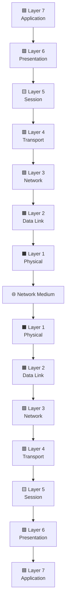
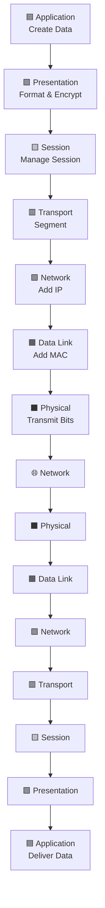

<div align="center">

# 🌐 OSI Model

### Learn the seven-layer framework that explains how computers communicate across modern networks.

<p>


</p>

<p>


</p>

</div>

---

> [!NOTE]
> **Lesson Overview**
>
> The **Open Systems Interconnection (OSI) Model** is a conceptual networking framework that divides communication into **seven logical layers**. Each layer performs a specific responsibility, allowing devices from different vendors and operating systems to communicate using a standardized approach.
>
> Although the Internet primarily runs on the **TCP/IP Model**, the OSI Model remains the universal language for learning networking, troubleshooting connectivity issues, analyzing packets, and understanding how cybersecurity technologies interact with network traffic.
>
> By the end of this lesson, you'll understand not only what each layer does, but also **how data moves through an entire network from one computer to another**.

---

# 📌 Quick Facts

| Property | Value |
|-----------|-------|
| **Full Name** | Open Systems Interconnection Model |
| **Abbreviation** | OSI |
| **Developed By** | International Organization for Standardization (ISO) |
| **Published** | 1984 |
| **Number of Layers** | 7 |
| **Purpose** | Standardize network communication |
| **Used on Today's Internet?** | ❌ No (TCP/IP is used instead) |
| **Still Important?** | ✅ Absolutely — Used for education, troubleshooting, certifications, and cybersecurity |

---

# 📑 Table of Contents

- [📌 Overview](#-overview)
- [🎯 Why Learn the OSI Model?](#-why-learn-the-osi-model)
- [🎯 Learning Objectives](#-learning-objectives)
- [🏛️ History of the OSI Model](#️-history-of-the-osi-model)
- [🏗️ Understanding the Seven Layers](#️-understanding-the-seven-layers)
- [🟦 Layer 7 — Application Layer](#-layer-7--application-layer)
- [🟪 Layer 6 — Presentation Layer](#-layer-6--presentation-layer)
- [🟨 Layer 5 — Session Layer](#-layer-5--session-layer)
- [🟥 Layer 4 — Transport Layer](#-layer-4--transport-layer)
- [🟩 Layer 3 — Network Layer](#-layer-3--network-layer)
- [🟧 Layer 2 — Data Link Layer](#-layer-2--data-link-layer)
- [⬛ Layer 1 — Physical Layer](#-layer-1--physical-layer)
- [📚 Complete OSI Model Summary](#-complete-osi-model-summary)
- [➡️ Next Lesson](#️-next-lesson)

---

# 📌 Overview

The **OSI (Open Systems Interconnection) Model** is one of the most important concepts in computer networking. Rather than being a protocol itself, it is a **reference model** that explains **how data travels from one device to another** across a network.

Instead of treating communication as one large, complex process, the OSI Model divides it into **seven logical layers**, where each layer performs a specific responsibility. This layered design makes networking easier to understand, easier to troubleshoot, and easier to develop.

Although modern networks primarily use the **TCP/IP Model**, the OSI Model remains the industry standard for learning networking concepts, diagnosing network issues, and understanding where protocols, devices, and cyberattacks operate.

Whether you're studying for **CompTIA Network+**, **Security+**, **CCNA**, or preparing for a career in cybersecurity, mastering the OSI Model provides the foundation for nearly every networking topic that follows.

---

## 🎯 Why Learn the OSI Model?

Understanding the OSI Model helps you think like a network engineer or cybersecurity professional rather than simply memorizing protocols.

By learning the responsibilities of each layer, you'll be able to:

- Understand how devices communicate across a network.
- Troubleshoot networking issues systematically.
- Identify where common protocols operate.
- Understand how routers, switches, and firewalls process traffic.
- Analyze packets using tools like Wireshark.
- Recognize where cyberattacks occur within the networking stack.
- Build a strong foundation for advanced networking and security topics.

---

## 🎯 Learning Objectives

By the end of this chapter, you should be able to:

- Explain why the OSI Model was created.
- Name all seven layers in the correct order.
- Describe the primary responsibility of each layer.
- Identify the PDU (Protocol Data Unit) used at every layer.
- Recognize common protocols and devices associated with each layer.
- Explain how data flows through the OSI Model.
- Understand how the OSI Model supports networking and cybersecurity.
- Apply the OSI Model to troubleshooting real-world networking problems.

---
---

> 💡 **Why This Lesson Matters**
>
> Every packet captured in **Wireshark**, every firewall rule, every router, every switch, and almost every networking certification references the OSI Model in some way. Even though modern networks use the TCP/IP Model, mastering the OSI Model gives you a mental framework that makes networking and cybersecurity dramatically easier to understand.

---

## 🚀 What You'll Build During This Lesson

By the end of this lesson, you'll have a complete mental picture of how a simple message—such as opening a website or sending an email—travels through a network. You'll learn **what happens at every layer**, **which protocols are involved**, **which devices participate**, and **how cybersecurity professionals use this knowledge** to analyze, troubleshoot, defend, and secure modern networks.

---
# ═══════════════════════════════════════════════
# 📖 Understanding the OSI Model
# ═══════════════════════════════════════════════

Before diving into the seven layers, it's important to understand **why the OSI Model exists**.

The OSI Model isn't a protocol, a piece of software, or something installed on your computer. Instead, it's a **conceptual framework**—a standardized way of describing how data moves from one device to another across a network.

Think of it as a **blueprint**. Just as architects use blueprints to design buildings before construction begins, network engineers use the OSI Model to understand, design, and troubleshoot communication between devices.

---

# 🌐 What is the OSI Model?

The **OSI (Open Systems Interconnection) Model** is a conceptual networking model developed by the **International Organization for Standardization (ISO)** to standardize communication between different computer systems.

Rather than treating network communication as one large, complicated process, the OSI Model divides it into **seven independent layers**, each responsible for a specific task.

Each layer communicates only with the layer directly above and below it while providing services to the layer above.

This layered approach makes networks:

- Easier to understand
- Easier to troubleshoot
- Easier to improve
- Easier for different vendors to support

---

<!--
Image Description:
A colorful OSI Model diagram showing all seven layers stacked vertically from Application to Physical with arrows indicating the direction of data flow.

Search Keywords:
OSI Model 7 Layers diagram
-->

<p align="center">

</p>

---

> [!TIP]
>
> **The OSI Model does not actually run the Internet.**
>
> Modern networks use the **TCP/IP Model**, but the OSI Model is still the industry's preferred framework for learning networking, explaining communication, troubleshooting problems, and understanding cybersecurity concepts.

---

> [!NOTE]
>
> **OSI Model at a Glance**
>
> 📅 Developed by: **ISO (International Organization for Standardization)**
>
> 📖 Full Name: **Open Systems Interconnection Model**
>
> 🏗️ Number of Layers: **7**
>
> 🎯 Purpose: Standardize and explain network communication
>
> 🌍 Used Today: Primarily for learning, troubleshooting, and cybersecurity
>
> 🔄 Real-World Counterpart: **TCP/IP Model**

------

# 🏛️ A Brief History of the OSI Model

During the late 1970s and early 1980s, networking was becoming increasingly popular. Unfortunately, there was one major problem:

Every company designed its own networking technology.

A computer built by one manufacturer often couldn't communicate with a computer built by another. Different hardware vendors used different communication methods, protocols, and standards, making interoperability extremely difficult.

Imagine trying to call someone if every phone company spoke a different language—that was the state of networking before standardization.

To solve this growing problem, the **International Organization for Standardization (ISO)** introduced the **Open Systems Interconnection (OSI) Model** in **1984**.

Its goal wasn't to create another networking protocol.

Instead, it provided a **common framework** that manufacturers, software developers, and network engineers could all follow when designing communication systems.

---

<!--
Image Description:
A simple timeline illustrating early proprietary networking systems leading to the introduction of the OSI Model in 1984 and eventually modern TCP/IP networking.

Search Keywords:
OSI networking history timeline
-->

<p align="center">

</p>

---

## 📌 Did You Know?

> Before networking standards existed, organizations often became locked into a single vendor's products because devices from different manufacturers couldn't communicate reliably with each other.

The OSI Model helped establish a universal language for discussing network communication, regardless of the underlying hardware or software.

---

# ❓ Why Was the OSI Model Created?

The OSI Model was designed to solve several critical challenges in networking.

## 1️⃣ Standardization

Without standards, every vendor would create its own communication method.

The OSI Model provides a common structure that allows engineers around the world to describe networking in the same way.

---

## 2️⃣ Vendor Interoperability

Companies like Cisco, Microsoft, Juniper, Dell, HP, and many others manufacture networking hardware and software.

Because everyone follows standardized networking principles, equipment from different vendors can work together seamlessly.

---

## 3️⃣ Easier Troubleshooting

Suppose you can't access a website.

Instead of asking:

> "The network isn't working."

Engineers ask more precise questions:

- Is there a Physical Layer problem?
- Is the IP address incorrect?
- Is TCP failing?
- Is DNS responding?
- Is HTTP returning an error?

Breaking communication into layers makes diagnosing problems much faster and more systematic.

---

## 4️⃣ Modular Design

Each layer performs one specific responsibility.

If improvements are made to one layer, the remaining layers generally continue working without modification.

This modular approach allows networking technologies to evolve without redesigning the entire communication process.

---

## 5️⃣ Simplified Learning

Imagine trying to learn networking without layers.

You would need to understand cables, electrical signals, MAC addresses, IP routing, TCP, encryption, sessions, and web applications—all at the same time.

The OSI Model organizes these concepts into manageable pieces, making networking much easier to learn.

---

# 🏗️ Why Layered Networking Changed Everything

One of the greatest strengths of the OSI Model is **separation of responsibilities**.

Instead of assigning every networking task to one enormous system, each layer specializes in a single job.

Think of sending a package through a postal service.

- You write the letter.
- Someone places it inside an envelope.
- The postal service sorts it.
- Trucks transport it.
- A local carrier delivers it.
- The recipient opens the envelope and reads the letter.

Each person has a different responsibility, yet together they complete one communication process.

Networking works in exactly the same way.

Every OSI layer contributes one small part to delivering your data from sender to receiver.

---

> [!IMPORTANT]
>
> **No single layer can successfully deliver data by itself.**
>
> Reliable communication is only possible because all seven layers work together, each performing a specialized task while relying on the services provided by the layers beneath it.

---

## 📖 Quick Summary

✔ The OSI Model is a conceptual framework—not a networking protocol.

✔ It was introduced by ISO in **1984**.

✔ It divides communication into **seven independent layers**.

✔ Each layer has a unique responsibility.

✔ Layering simplifies networking, troubleshooting, and protocol design.

✔ The Internet primarily uses **TCP/IP**, but the OSI Model remains the standard framework for learning networking and cybersecurity.

---

➡️ **Next:** Now that you understand *why* the OSI Model exists, it's time to explore the **seven layers** that make up this powerful framework and discover what each one does during network communication.

# ═══════════════════════════════════════════════
# 🏗️ Understanding the Seven Layers
# ═══════════════════════════════════════════════

Before exploring each layer individually, let's first understand **the big picture**.

The OSI Model doesn't describe **seven separate networks**. Instead, it divides **one communication process** into **seven logical layers**, where each layer performs a specific responsibility before passing the data to the next layer.

Think of it as a relay race.

Each runner has one job:
- Receive the baton.
- Complete their part of the race.
- Hand it to the next runner.

The runners don't perform each other's tasks—they specialize in their own. Together, they successfully complete the race.

The OSI Model works exactly the same way.

Each layer performs one specialized function, relies on the services of the layer below it, and provides services to the layer above it.

---

> [!IMPORTANT]
>
> **No single layer can communicate on its own.**
>
> Successful communication only happens when **all seven layers work together**, from the application creating the data to the physical medium transmitting electrical signals or radio waves.

---

## 🖼️ Bird's-Eye View of the OSI Model

Before studying the details, it's helpful to see the entire model at a glance.

<!--
Image Description:
A clean, colorful vertical OSI Model diagram showing all seven layers stacked from Application (Layer 7) at the top to Physical (Layer 1) at the bottom. Each layer should have a different color and display its layer number.

Search Keywords:
OSI Model layers vertical diagram colorful
-->

<p align="center">

</p>

---

# 📚 The Seven Layers at a Glance

| Layer | Name | Primary Responsibility | Example Technologies |
|:-----:|----------------------|--------------------------------------|--------------------------------|
| **7** | Application | Provides network services to applications | HTTP, HTTPS, DNS, SMTP |
| **6** | Presentation | Formats, encrypts, and compresses data | SSL/TLS, JPEG, ASCII |
| **5** | Session | Establishes and manages communication sessions | NetBIOS, RPC |
| **4** | Transport | Reliable delivery, segmentation, flow control | TCP, UDP |
| **3** | Network | Logical addressing and routing | IP, ICMP |
| **2** | Data Link | Physical addressing and frame delivery | Ethernet, Wi-Fi, MAC |
| **1** | Physical | Transmits bits across the physical medium | Cables, Fiber Optics, Radio Signals |

---

## 🎯 Understanding the Flow

When you send data across a network, communication always begins at the **Application Layer**.

The data then moves **down** through each layer until it reaches the **Physical Layer**, where it is transmitted across the network.

When the receiving computer gets the data, the process happens **in reverse**.

The data travels **up** the layers until it finally reaches the destination application.

This process happens **every single time** you:

- Open a website
- Send an email
- Watch a YouTube video
- Join a Zoom meeting
- Transfer a file
- Play an online game

---

## 🔄 Communication Flow



---

## 🚚 A Real-World Analogy

Imagine you're sending a birthday gift to a friend.

You don't simply throw the gift into the street and hope it arrives.

Instead, several steps happen:

1. You write a greeting card.
2. You wrap the gift.
3. You place it inside a shipping box.
4. You attach the shipping label.
5. The courier transports it.
6. The package arrives.
7. Your friend unwraps everything to reveal the gift.

Each step has a different purpose.

Networking follows the same idea.

Every OSI layer prepares the data a little more until it is ready to travel across the network. At the destination, those preparations are removed in the reverse order until the original data is delivered to the receiving application.

---

<!--
Image Description:
An illustration comparing the OSI Model to sending a parcel through a postal service. Show packaging steps on one side and corresponding OSI layers on the other.

Search Keywords:
OSI Model postal service analogy infographic
-->

<p align="center">

</p>

---

## 🧠 How to Remember the Seven Layers

Remembering the order of the layers is much easier with a mnemonic.

### Top → Bottom (Layer 7 → Layer 1)

| Layer | Name |
|-------:|----------------|
| 7 | Application |
| 6 | Presentation |
| 5 | Session |
| 4 | Transport |
| 3 | Network |
| 2 | Data Link |
| 1 | Physical |

**Mnemonic:**

> **A**ll **P**eople **S**eem **T**o **N**eed **D**ata **P**rocessing

---

### Bottom → Top (Layer 1 → Layer 7)

| Layer | Name |
|-------:|----------------|
| 1 | Physical |
| 2 | Data Link |
| 3 | Network |
| 4 | Transport |
| 5 | Session |
| 6 | Presentation |
| 7 | Application |

**Mnemonic:**

> **P**lease **D**o **N**ot **T**hrow **S**ausage **P**izza **A**way

---

> 💡 **Did You Know?**
>
> There is nothing magical about the number **seven**.
>
> The OSI Model was designed with seven layers because the ISO determined that this separation provided the best balance between simplicity, flexibility, and modular design. Different networking models can have fewer or more layers—for example, the TCP/IP Model uses only **four**.

---

> ⚠️ **Common Beginner Mistake**
>
> Many beginners believe that each layer works independently.
>
> In reality, every layer depends on the services provided by the layer below it. The layers are designed to work together as one complete communication system.

---

> 📌 **Remember**
>
> The OSI Model is a **reference model**, not a communication protocol.
>
> It doesn't transmit data itself—it provides a standardized way to understand **how** communication happens.

---

## 📝 Quick Summary

✔ The OSI Model divides communication into **seven logical layers**.

✔ Each layer has one clearly defined responsibility.

✔ Data moves **down** the layers before transmission and **up** the layers after reception.

✔ Every layer depends on the services of the layer below it.

✔ Understanding the complete structure first makes it much easier to learn each individual layer.

---

➡️ **Next:** With the overall architecture now clear, let's explore each layer in detail—starting at the **Application Layer (Layer 7)**, where every network communication begins.

# ═══════════════════════════════════════════════
# 🟦 Layer 7 — Application Layer
# ═══════════════════════════════════════════════

> **"The layer closest to the user."**

The **Application Layer** is the highest layer of the OSI Model and the one users interact with most often—usually without realizing it.

When you open a web browser, send an email, chat on WhatsApp, upload a file to cloud storage, or access a remote server, you're using applications that communicate through this layer.

Despite its name, the Application Layer **is not the application itself**. Instead, it provides the network services that applications need in order to communicate over a network.

---

<!--
Image Description:
A diagram showing a user interacting with applications like a web browser, email client, FTP client, and chat application, all connecting to the Application Layer of the OSI Model.

Search Keywords:
OSI Application Layer diagram
-->

<p align="center">

</p>

---

## 🎯 Primary Purpose

The Application Layer provides an interface between **software applications** and the underlying network.

It enables programs to request and exchange data across a network without worrying about how the data is actually transmitted.

In simple terms:

> **It allows applications to communicate over a network.**

---

## 🧩 Key Responsibilities

The Application Layer is responsible for providing services such as:

- Web browsing
- Email communication
- File transfers
- Remote login
- Domain name resolution
- Network resource sharing
- Cloud application communication
- API communication

Unlike lower layers, this layer focuses on **what the user wants to do**, not **how the data travels**.

---

## 🌍 Real-World Example

Imagine you type:

```
https://www.google.com
```

into your web browser.

Here's what happens at the Application Layer:

1. The browser creates an HTTP/HTTPS request.
2. It asks the operating system to send the request.
3. The request is passed to the Presentation Layer.
4. Lower layers take over and prepare the data for transmission.

The browser never deals with cables, IP addresses, or electrical signals.

It simply asks:

> "Please send this request."

Everything else happens in the lower layers.

---

## 🌐 Common Protocols

| Protocol | Purpose |
|----------|---------|
| HTTP | Transfers web pages |
| HTTPS | Secure web communication |
| FTP | File transfer |
| SFTP | Secure file transfer |
| SMTP | Sending emails |
| POP3 | Receiving emails |
| IMAP | Managing emails on a server |
| DNS | Converts domain names into IP addresses |
| DHCP* | Requests network configuration *(often associated with the Application Layer in the OSI model for learning purposes, though it relies on lower-layer protocols)* |
| SNMP | Network monitoring and management |
| Telnet | Remote command-line access (insecure) |
| SSH | Secure remote command-line access |

---

## 💻 Applications That Use This Layer

Everyday software relies on the Application Layer, including:

- Google Chrome
- Microsoft Edge
- Mozilla Firefox
- Outlook
- Thunderbird
- Discord
- Slack
- Microsoft Teams
- Zoom
- WhatsApp Desktop
- FileZilla
- PuTTY
- VS Code Remote SSH

Nearly every Internet-connected application begins communication here.

---

## 🛡️ Cybersecurity Perspective

Many cyberattacks target the Application Layer because it's the layer users interact with directly.

Examples include:

- SQL Injection
- Cross-Site Scripting (XSS)
- Cross-Site Request Forgery (CSRF)
- Remote Code Execution (RCE)
- Command Injection
- Authentication bypass
- Session hijacking
- API abuse

Since web applications process user input, poor validation can allow attackers to execute malicious actions.

Application security is therefore one of the most important areas of cybersecurity.

---

## 🔧 Troubleshooting Examples

Problems occurring at the Application Layer may include:

- A website won't load even though Internet access works.
- Email messages fail to send.
- DNS cannot resolve a domain name.
- Login authentication fails.
- Cloud services become unavailable.
- API requests return unexpected errors.

When these problems occur, lower networking layers may still be functioning correctly.

---

## 💡 Did You Know?

Many people believe **HTTP** is responsible for delivering data across the Internet.

In reality, HTTP only defines **how web browsers and web servers exchange information**.

It relies on lower-layer protocols like TCP and IP to actually transport that data.

---

## ⚠️ Common Beginner Mistake

One of the most common misconceptions is thinking that the Application Layer contains the applications themselves.

This isn't true.

Programs like Chrome, Outlook, or Discord are **applications**, but the **Application Layer** provides the networking services those applications use to communicate.

---

## 📌 Remember

> **Application ≠ Application Layer**

The software is the application.

The Application Layer is the networking interface that allows the software to communicate across the network.

---

## 📝 Layer Summary

| Category | Summary |
|----------|---------|
| **Layer Number** | 7 |
| **Name** | Application |
| **Primary Role** | Provides network services to applications |
| **PDU** | Data |
| **Common Protocols** | HTTP, HTTPS, FTP, SMTP, DNS, SSH |
| **Typical Devices** | PCs, Servers, Mobile Devices |
| **Common Attacks** | SQL Injection, XSS, CSRF, RCE |
| **Troubleshooting Focus** | Applications, DNS, Web Services, Email |

---

➡️ **Next:** Before data can be transmitted across the network, it often needs to be translated, encrypted, compressed, or formatted. That's the responsibility of the **Presentation Layer (Layer 6)**.

# ═══════════════════════════════════════════════
# 🟪 Layer 6 — Presentation Layer
# ═══════════════════════════════════════════════

## 📍 OSI Stack Progress

```text
🟦 Layer 7 — Application     ✅ Completed
🟪 Layer 6 — Presentation    👈 Current
🟨 Layer 5 — Session
🟥 Layer 4 — Transport
🟩 Layer 3 — Network
🟧 Layer 2 — Data Link
⬛ Layer 1 — Physical
```

> **"The Translator of the Network."**

Imagine two people trying to communicate:

- One speaks English.
- The other speaks Japanese.

Even if they can hear each other perfectly, communication won't happen without a translator.

That's exactly what the **Presentation Layer** does.

It ensures that the data created by one system is presented in a format that another system can understand.

---

<!--
Image Description:
A diagram showing two computers using different data formats communicating through the Presentation Layer, which performs translation, encryption, and compression.

Search Keywords:
OSI Presentation Layer diagram encryption compression translation
-->

<p align="center">

</p>

---

## 🎯 Primary Purpose

The Presentation Layer is responsible for preparing data so it can be correctly understood by the receiving system.

Think of it as the network's **translator and formatter**.

Before data is transmitted, this layer may:

- Translate data formats
- Encrypt sensitive information
- Compress large files

When data is received, it performs the reverse operations.

---

## 🧩 Key Responsibilities

The Presentation Layer performs several important tasks:

- Data translation
- Character encoding
- Data encryption
- Data decryption
- Data compression
- Data decompression
- Data formatting

Its goal is to make sure both devices interpret the information in the same way.

---

## 🌍 Real-World Example

Suppose you're shopping online.

When you enter your credit card information:

- The browser prepares your request.
- The Presentation Layer encrypts the sensitive data using TLS.
- The encrypted data is passed to the lower layers.

When the server receives it, the Presentation Layer decrypts the information before passing it to the web application.

Without this layer, your information would travel as readable plain text.

---

## 🔐 Common Technologies

| Technology | Purpose |
|------------|---------|
| SSL/TLS | Encryption |
| ASCII | Character encoding |
| Unicode (UTF-8) | Universal text representation |
| JPEG | Image format |
| PNG | Image format |
| GIF | Image format |
| MPEG | Video compression |
| MP3 | Audio compression |

---

## 🛡️ Cybersecurity Perspective

The Presentation Layer is heavily involved in protecting sensitive information.

Examples include:

- HTTPS encryption
- Secure online banking
- VPN encryption
- Digital certificates
- Secure email encryption

Without encryption, attackers could easily read intercepted network traffic.

---

## 🔧 Troubleshooting Examples

Problems at this layer may include:

- Certificate errors
- SSL/TLS handshake failures
- Unsupported file formats
- Corrupted compressed files
- Character encoding issues

---

> 💡 **Did You Know?**

HTTPS doesn't simply "make websites secure."

It encrypts data before it leaves your computer, making intercepted traffic unreadable to attackers.

---

> ⚠️ **Common Beginner Mistake**

Many learners think encryption is handled by the Application Layer.

Although applications request encryption, the actual formatting and encryption responsibilities belong to the Presentation Layer in the OSI reference model.

---

> 📌 **Remember**

The Presentation Layer answers one question:

> **"Can the receiving computer understand this data?"**

---

## 📝 Layer Summary

| Category | Summary |
|----------|---------|
| **Layer Number** | 6 |
| **Name** | Presentation |
| **Primary Role** | Translation, encryption, compression |
| **PDU** | Data |
| **Common Technologies** | TLS, SSL, ASCII, UTF-8, JPEG, PNG |
| **Cybersecurity Focus** | Data confidentiality |

---

## 🎓 Knowledge Check

Before moving on, ask yourself:

- Why is encryption associated with this layer?
- What is the difference between compression and encryption?
- Why is UTF-8 important?
- What would happen if two computers used incompatible data formats?

---

══════════════════════════════

🔗 **Connection to the Next Layer**

The data is now correctly formatted and protected.

However, devices still need a way to **start, manage, and end conversations** with each other.

That responsibility belongs to the **Session Layer**.

══════════════════════════════

---

# ═══════════════════════════════════════════════
# 🟨 Layer 5 — Session Layer
# ═══════════════════════════════════════════════

## 📍 OSI Stack Progress

```text
🟦 Layer 7 — Application     ✅ Completed
🟪 Layer 6 — Presentation    ✅ Completed
🟨 Layer 5 — Session         👈 Current
🟥 Layer 4 — Transport
🟩 Layer 3 — Network
🟧 Layer 2 — Data Link
⬛ Layer 1 — Physical
```

> **"The Conversation Manager."**

Imagine calling a friend.

Before you can start talking:

- Someone answers.
- The conversation begins.
- You both take turns speaking.
- Eventually, one of you says goodbye and hangs up.

Network communication works in a similar way.

The **Session Layer** establishes, manages, and terminates communication sessions between devices.

---

<!--
Image Description:
A diagram showing two computers establishing a communication session, exchanging data, and then closing the session.

Search Keywords:
OSI Session Layer diagram communication session
-->

<p align="center">

</p>

---

## 🎯 Primary Purpose

The Session Layer manages the communication session between two systems.

It is responsible for:

- Opening sessions
- Maintaining sessions
- Synchronizing communication
- Closing sessions gracefully

---

## 🧩 Key Responsibilities

The Session Layer provides services such as:

- Session establishment
- Session maintenance
- Session termination
- Authentication support
- Synchronization checkpoints
- Recovery after interruptions

---

## 🌍 Real-World Example

Imagine downloading a 10 GB file.

After downloading 8 GB, your Internet connection drops.

Without checkpoints, the download would restart from the beginning.

With synchronization provided by the Session Layer, the download can continue from where it stopped.

---

## 🔄 Common Technologies

Examples commonly associated with this layer include:

- NetBIOS
- RPC (Remote Procedure Call)
- SMB Session Services
- PPTP (legacy VPN technology)

Although modern TCP/IP implementations don't separate this layer explicitly, the responsibilities still exist within many networking applications.

---

## 🛡️ Cybersecurity Perspective

Session management plays a critical role in web security.

Examples include:

- Session cookies
- Authentication tokens
- Single Sign-On (SSO)
- Session timeout policies

If attackers steal a user's session token, they may gain unauthorized access without needing the user's password.

This is known as **Session Hijacking**.

---

## 🔧 Troubleshooting Examples

Session-related problems may include:

- Users being logged out unexpectedly
- VPN sessions disconnecting
- Remote desktop sessions failing
- Authentication sessions expiring
- Interrupted file transfers

---

> 💡 **Did You Know?**

Many modern web applications rely on session tokens instead of repeatedly asking users to enter their passwords.

---

> ⚠️ **Common Beginner Mistake**

The Session Layer does **not** transport data.

Its responsibility is managing the conversation—not delivering the data itself.

Reliable delivery is handled by the Transport Layer.

---

> 📌 **Remember**

The Session Layer answers one important question:

> **"How do two devices maintain an organized conversation?"**

---

## 📝 Layer Summary

| Category | Summary |
|----------|---------|
| **Layer Number** | 5 |
| **Name** | Session |
| **Primary Role** | Establish, manage, synchronize, and terminate communication sessions |
| **PDU** | Data |
| **Common Technologies** | NetBIOS, RPC, SMB |
| **Cybersecurity Focus** | Session management and authentication |

---

## 🎓 Knowledge Check

Before moving on, make sure you can answer:

- What is a session?
- Why are checkpoints useful?
- What is Session Hijacking?
- Why is session management important for web applications?

---

══════════════════════════════

🔗 **Connection to the Next Layer**

The communication session has been established successfully.

The next challenge is ensuring that the data reaches the destination **reliably, in the correct order, and without loss**.

That responsibility belongs to the **Transport Layer (Layer 4)**—one of the most important layers in all of networking.

══════════════════════════════

# ═══════════════════════════════════════════════
# 🟥 Layer 4 — Transport Layer
# ═══════════════════════════════════════════════

## 📍 OSI Stack Progress

```text
🟦 Layer 7 — Application     ✅ Completed
🟪 Layer 6 — Presentation    ✅ Completed
🟨 Layer 5 — Session         ✅ Completed
🟥 Layer 4 — Transport       👈 Current
🟩 Layer 3 — Network
🟧 Layer 2 — Data Link
⬛ Layer 1 — Physical
```

> **"The Reliable Delivery Manager."**

Imagine ordering an expensive laptop online.

You don't just want the package to arrive.

You want it to:

- Arrive at the correct address.
- Arrive without missing parts.
- Arrive in the correct order.
- Arrive only once.
- Be delivered safely.

The **Transport Layer** has exactly the same responsibility—but for data instead of packages.

It ensures that information is delivered **reliably, accurately, and efficiently** between two devices.

---

<!--
Image Description:
An infographic illustrating data being divided into multiple numbered segments, traveling across a network, and being reassembled correctly at the destination. Highlight acknowledgments (ACKs) and retransmissions for reliable delivery.

Search Keywords:
Transport Layer TCP segmentation reliable delivery diagram
-->

<p align="center">

</p>

---

# 🎯 Primary Purpose

The Transport Layer is responsible for **end-to-end communication** between applications running on different devices.

Unlike the Session Layer, which manages conversations, the Transport Layer focuses on **delivering the actual data**.

Its responsibilities include:

- Reliable delivery
- Error detection
- Flow control
- Segmentation
- Reassembly
- Port addressing
- Multiplexing
- Connection management

Think of it as the **delivery manager** of the network.

---

# ❓ Why Do We Need the Transport Layer?

Imagine downloading a **10 GB** game.

Sending it as one enormous block of data would be extremely inefficient.

Instead, the Transport Layer breaks it into many **smaller pieces** called **segments**.

Each segment can:

- Travel independently
- Be checked for errors
- Be retransmitted if lost
- Be reassembled in the correct order

Without segmentation, modern networking would be practically impossible.

---

## 🧩 Key Responsibilities

### 📦 Segmentation

Large data is divided into smaller, manageable segments before transmission.

This makes communication faster, more efficient, and easier to recover from errors.

---

### 🧩 Reassembly

At the receiving computer, all segments are placed back into their original order.

Only after every required segment has arrived is the original data reconstructed.

---

### ✔ Reliable Delivery

Some applications cannot tolerate missing information.

Examples:

- Online banking
- File downloads
- Software updates
- Email

The Transport Layer confirms that data has arrived successfully.

If something is missing, it requests retransmission.

---

### 🚦 Flow Control

Imagine pouring water into a small bottle.

If you pour too quickly, it overflows.

The same thing happens in networking.

Flow control ensures that a fast sender doesn't overwhelm a slower receiver.

---

### 🔢 Port Numbers

Multiple applications can use the Internet at the same time.

For example:

- Chrome
- Discord
- Spotify
- Steam

How does your computer know which application should receive incoming data?

The answer is **port numbers**.

Ports allow multiple applications to communicate simultaneously without mixing up their traffic.

---

## 🌍 Real-World Example

Suppose you're downloading Ubuntu Linux.

The file size is over **5 GB**.

The Transport Layer:

1. Splits the file into thousands of segments.
2. Numbers every segment.
3. Sends them across the network.
4. Detects missing segments.
5. Requests retransmission if necessary.
6. Reassembles everything into the original file.

To you, it looks like one download.

Behind the scenes, thousands of transport operations are taking place.

---

# 🌐 The Two Most Important Protocols

The Transport Layer primarily uses two protocols:

| Protocol | Full Name | Reliable | Fast | Typical Use |
|----------|-----------|:--------:|:----:|-------------|
| **TCP** | Transmission Control Protocol | ✅ | ❌ | Web browsing, email, file transfers |
| **UDP** | User Datagram Protocol | ❌ | ✅ | Video calls, online gaming, live streaming |

These two protocols have different goals.

TCP prioritizes **accuracy**.

UDP prioritizes **speed**.

You'll study both in much greater detail later in the networking roadmap.

---

<!--
Image Description:
A comparison diagram of TCP vs UDP showing TCP using acknowledgments, retransmissions, and ordered delivery, while UDP sends packets directly without waiting for confirmation.

Search Keywords:
TCP vs UDP infographic
-->

<p align="center">

</p>

---

# 🛡️ Cybersecurity Perspective

The Transport Layer plays a major role in cybersecurity.

Examples include:

- Port scanning (Nmap)
- Firewall rules based on TCP and UDP ports
- SYN Flood attacks
- TCP session analysis
- Intrusion Detection Systems (IDS)
- Intrusion Prevention Systems (IPS)

Many penetration testing tools begin by identifying which **TCP** or **UDP** ports are open on a target system.

Understanding the Transport Layer makes these tools much easier to understand.

---

# 🔧 Troubleshooting Examples

Transport Layer issues may include:

- Slow downloads
- Connection timeouts
- Packet retransmissions
- Closed or blocked ports
- TCP handshake failures
- High packet loss
- Streaming interruptions

---

> 💡 **Did You Know?**
>
> Every website you visit over **HTTPS** relies on **TCP** to ensure that encrypted data arrives completely and in the correct order. If packets arrived randomly or went missing, websites wouldn't load correctly.

---

> ⚠️ **Common Beginner Mistake**
>
> Many beginners think **TCP is "better" than UDP**.
>
> Neither protocol is better—they're designed for different purposes.
>
> - Choose **TCP** when reliability matters.
> - Choose **UDP** when speed and low latency matter.

---

> 📌 **Remember**
>
> The Transport Layer doesn't decide **where** data should go.
>
> Its responsibility is ensuring that the data reaches the destination application **reliably and efficiently**.
>
> Determining the path through the network is the responsibility of the **Network Layer (Layer 3)**.

---

# 📝 Layer Summary

| Category | Summary |
|----------|---------|
| **Layer Number** | 4 |
| **Name** | Transport |
| **Primary Role** | End-to-end communication and reliable delivery |
| **PDU** | Segment (TCP) / Datagram (UDP) |
| **Common Protocols** | TCP, UDP |
| **Key Features** | Segmentation, Reassembly, Reliability, Flow Control, Ports |
| **Cybersecurity Focus** | Port Scanning, Firewalls, SYN Floods, Session Analysis |

---

## 🎓 Knowledge Check

Before moving on, make sure you can answer:

- Why is segmentation necessary?
- What problem does flow control solve?
- What is the difference between TCP and UDP?
- Why are port numbers important?
- Which applications should use TCP?
- Which applications benefit from UDP?
- Why do penetration testers care about open ports?

---

══════════════════════════════

🔗 **Connection to the Next Layer**

The Transport Layer successfully delivers data between applications.

However, it still doesn't know **where** the destination device is located.

Finding the best path across multiple interconnected networks is the responsibility of the **Network Layer (Layer 3)**.

In the next lesson, you'll learn about **IP addresses, routing, routers, packets, and how data travels across the Internet**.

══════════════════════════════

# ═══════════════════════════════════════════════
# 🟩 Layer 3 — Network Layer
# ═══════════════════════════════════════════════

## 📍 OSI Stack Progress

```text
🟦 Layer 7 — Application     ✅ Completed
🟪 Layer 6 — Presentation    ✅ Completed
🟨 Layer 5 — Session         ✅ Completed
🟥 Layer 4 — Transport       ✅ Completed
🟩 Layer 3 — Network         👈 Current
🟧 Layer 2 — Data Link
⬛ Layer 1 — Physical
```

> **"The GPS of the Internet."**

Imagine you want to send a letter to a friend who lives in another country.

Before the postal service can deliver it, someone has to answer an important question:

> **"Where should this package go?"**

Without an address, the package can never reach its destination.

The same idea applies to computer networks.

The **Network Layer** is responsible for finding the destination device and determining the best path to reach it.

Without this layer, the Internet as we know it simply wouldn't exist.

---

<!--
Image Description:
A world map showing multiple routers connected together with packets traveling from one computer to another through several networks.

Search Keywords:
Network Layer routing Internet diagram
-->

<p align="center">

</p>

---

# 🎯 Primary Purpose

The Network Layer is responsible for **logical addressing and routing**.

It identifies where devices are located using **IP addresses** and determines the best route for packets to travel between different networks.

Think of this layer as the **navigation system** of the Internet.

Its main responsibilities include:

- Logical addressing
- Routing
- Path selection
- Packet forwarding
- Fragmentation (IPv4)
- Connecting different networks together

---

# 🤔 Why Do We Need the Network Layer?

Imagine millions of computers connected across the world.

If your computer wants to communicate with Google's servers, how does it know where Google is?

It doesn't.

Instead, the Network Layer uses **IP addresses** to identify every device and relies on **routers** to forward packets toward their destination.

Every router along the journey makes a simple decision:

> **"Which path should I send this packet through next?"**

This process repeats until the packet reaches its destination.

---

## 🌍 Real-World Example

Imagine you're in Pakistan and you open:

```
https://www.google.com
```

Within milliseconds, your request might travel through:

```
Your Laptop
      │
      ▼
Home Wi-Fi Router
      │
      ▼
Internet Service Provider (ISP)
      │
      ▼
Regional Router
      │
      ▼
International Backbone
      │
      ▼
Google Data Center
      │
      ▼
Google Web Server
```

You only see a webpage loading.

Behind the scenes, your packet may have crossed **multiple cities, countries, and dozens of routers** before reaching Google.

The Network Layer makes this journey possible.

---

## 🧩 Key Responsibilities

### 📍 Logical Addressing

Every device connected to a network needs a unique logical address.

That address is called an **IP Address**.

Examples:

```
192.168.1.25
```

```
8.8.8.8
```

```
172.217.20.14
```

Unlike MAC addresses, IP addresses identify **where a device is located within a network**.

---

### 🧭 Routing

Once the destination IP address is known, routers determine the best path for delivering the packet.

Routing decisions are based on:

- Routing tables
- Network topology
- Routing protocols
- Administrative metrics

Every router only needs to know the **next hop**, not the entire journey.

---

### 📦 Packet Forwarding

After selecting the best path, routers forward packets from one network to another.

Each router repeats this process until the destination is reached.

---

### 🌐 Connecting Different Networks

The Internet isn't one giant network.

It's a collection of **millions of interconnected networks**.

The Network Layer enables communication between all of them.

---

## 🌐 Common Protocols

| Protocol | Purpose |
|----------|---------|
| IPv4 | Logical addressing |
| IPv6 | Modern logical addressing |
| ICMP | Diagnostics and error reporting |
| IPsec | Secure IP communication |
| OSPF | Dynamic routing |
| RIP | Dynamic routing |
| BGP | Internet backbone routing |

---

<!--
Image Description:
A diagram illustrating a packet moving through multiple routers, with each router examining the destination IP address before forwarding it to the next hop.

Search Keywords:
Packet routing through routers diagram
-->

<p align="center">

</p>

---

# 🖥️ Devices Operating at Layer 3

The primary Layer 3 device is the **Router**.

Routers connect different networks together by examining destination IP addresses and selecting the best path for each packet.

Other Layer 3 devices include:

- Layer 3 Switches
- Firewalls (when routing traffic)
- VPN Gateways

---

# 🌍 IPv4 vs IPv6

The Internet originally relied on **IPv4**, which uses **32-bit addresses**.

Example:

```
192.168.10.15
```

As the Internet grew, IPv4 addresses became scarce.

To solve this problem, **IPv6** was introduced, providing a vastly larger address space.

Example:

```
2001:db8::1
```

You'll explore IPv4, IPv6, subnetting, and address planning in much greater detail later in this roadmap.

---

# 🛡️ Cybersecurity Perspective

The Network Layer is one of the most important layers for cybersecurity professionals.

Many security tools and attacks operate here.

Examples include:

- IP Spoofing
- ICMP Attacks
- Routing Attacks
- VPN Tunnels
- Packet Filtering
- Traceroute
- Ping
- Network Scanning

Firewalls also inspect Layer 3 information to determine whether packets should be allowed or blocked.

Understanding this layer is essential for penetration testing, incident response, digital forensics, and network defense.

---

# 🔧 Troubleshooting Examples

Common Layer 3 problems include:

- Incorrect IP address
- Duplicate IP addresses
- Missing default gateway
- Routing loops
- Network unreachable
- High latency
- Failed traceroute
- Packet loss

---

> 💡 **Did You Know?**

When you use the **`ping`** command, it sends **ICMP Echo Request** packets at the Network Layer to check whether another device is reachable.

---

> ⚠️ **Common Beginner Mistake**

Many beginners confuse **IP addresses** with **MAC addresses**.

- **IP Address** → Identifies where a device is located across networks.
- **MAC Address** → Identifies the physical network interface on the local network.

You'll study MAC addresses in the next layer.

---

> 📌 **Remember**

The Network Layer answers one important question:

> **"Where should this packet go?"**

It doesn't guarantee delivery—that's the Transport Layer's responsibility.

It simply chooses the path.

---

# 📝 Layer Summary

| Category | Summary |
|----------|---------|
| **Layer Number** | 3 |
| **Name** | Network |
| **Primary Role** | Logical addressing and routing |
| **PDU** | Packet |
| **Common Protocols** | IPv4, IPv6, ICMP, IPsec, OSPF, RIP, BGP |
| **Primary Device** | Router |
| **Cybersecurity Focus** | Routing, Packet Filtering, IP Spoofing, VPNs |

---

## 🎓 Knowledge Check

Before moving on, make sure you can answer:

- Why do we need IP addresses?
- What is the difference between routing and forwarding?
- What device primarily operates at Layer 3?
- Why is IPv6 replacing IPv4?
- Which protocol does the `ping` command use?
- How is an IP address different from a MAC address?

---

══════════════════════════════

🔗 **Connection to the Next Layer**

The Network Layer successfully determines **where** packets need to go.

However, it still doesn't know **how to deliver a packet across the local network** to the next device.

That responsibility belongs to the **Data Link Layer (Layer 2)**, where devices communicate using **MAC addresses** and **Ethernet frames**.

══════════════════════════════

# ═══════════════════════════════════════════════
# 🟧 Layer 2 — Data Link Layer
# ═══════════════════════════════════════════════

## 📍 OSI Stack Progress

```text
🟦 Layer 7 — Application     ✅ Completed
🟪 Layer 6 — Presentation    ✅ Completed
🟨 Layer 5 — Session         ✅ Completed
🟥 Layer 4 — Transport       ✅ Completed
🟩 Layer 3 — Network         ✅ Completed
🟧 Layer 2 — Data Link       👈 Current
⬛ Layer 1 — Physical
```

> **"The Local Delivery Expert."**

Imagine you've already reached the correct apartment building.

The GPS successfully guided you there.

But now another question appears.

> **Which apartment door should the package be delivered to?**

Knowing the building isn't enough.

You also need the exact apartment number.

The **Network Layer** gets data to the correct **network**.

The **Data Link Layer** gets it to the correct **device** on that network.

---

<!--
Image Description:
Illustration showing a router delivering a packet into a local network where a switch forwards frames to the correct computer using MAC addresses.

Search Keywords:
OSI Data Link Layer MAC address switch diagram
-->

<p align="center">

</p>

---

# 🎯 Primary Purpose

The Data Link Layer provides **node-to-node communication** within the same local network.

Its responsibilities include:

- Physical (MAC) addressing
- Framing
- Error detection
- Media access control
- Local delivery
- Switching

Unlike Layer 3, which uses **IP addresses**, Layer 2 communicates using **MAC addresses**.

---

# 🤔 Why Do We Need Layer 2?

Suppose your laptop wants to send data to your home printer.

Both devices are connected to the same Wi-Fi network.

They don't need Internet routing.

They only need to know:

> **Which device on this local network should receive the frame?**

That's exactly what Layer 2 does.

---

## 🧩 Key Responsibilities

### 🏷️ MAC Addressing

Every network interface card (NIC) has a unique hardware identifier called a **MAC Address**.

Example:

```
00:1A:2B:3C:4D:5E
```

Unlike IP addresses, MAC addresses are primarily used for communication **within the same local network**.

---

### 📦 Framing

Layer 3 sends **packets**.

Layer 2 wraps each packet inside a **frame**.

The frame includes information such as:

- Source MAC Address
- Destination MAC Address
- Error Detection (FCS)

Only after becoming a frame is the data ready for physical transmission.

---

### ✔ Error Detection

The Data Link Layer can detect whether a frame was damaged during transmission.

If corruption is detected, the damaged frame is discarded.

Error recovery is typically handled by higher layers, such as the Transport Layer.

---

### 🔀 Switching

Network switches operate primarily at Layer 2.

Instead of broadcasting every frame to every device, switches examine the destination MAC address and forward the frame only to the intended device.

This makes modern Ethernet networks much faster and more efficient.

---

## 🌍 Real-World Example

Imagine a classroom with 30 students.

The teacher says:

> "Ali, please come to the front."

Only Ali responds.

The teacher didn't need to call everyone's name.

Similarly, switches deliver frames only to the intended MAC address instead of sending them to every device.

---

# 🌐 Common Technologies

| Technology | Purpose |
|------------|---------|
| Ethernet (IEEE 802.3) | Wired Local Area Networking |
| Wi-Fi (IEEE 802.11) | Wireless Local Area Networking |
| ARP | Maps IP addresses to MAC addresses |
| VLAN | Logically separates networks |
| PPP | Point-to-Point communication |

---

<!--
Image Description:
A Layer 2 Ethernet frame showing Destination MAC, Source MAC, Type, Payload, and Frame Check Sequence (FCS).

Search Keywords:
Ethernet frame structure diagram
-->

<p align="center">

</p>

---

# 🖥️ Devices Operating at Layer 2

Devices commonly associated with this layer include:

- Ethernet Switch
- Wireless Access Point
- Network Interface Card (NIC)
- Bridge

Their primary job is forwarding frames inside a local network.

---

# 🛡️ Cybersecurity Perspective

Layer 2 attacks include:

- MAC Flooding
- ARP Spoofing
- ARP Poisoning
- VLAN Hopping
- Rogue Access Points
- MAC Address Spoofing

These attacks often target switches and local network communication.

---

# 🔧 Troubleshooting Examples

Common Layer 2 issues include:

- Duplicate MAC addresses
- Switch failures
- VLAN misconfiguration
- ARP cache problems
- Ethernet frame errors
- Network loops

---

> 💡 **Did You Know?**

Your computer usually doesn't know another device's MAC address immediately.

It first uses **ARP (Address Resolution Protocol)** to discover the correct MAC address before sending the frame.

---

> ⚠️ **Common Beginner Mistake**

Many beginners think switches use IP addresses.

Standard Layer 2 switches forward traffic using **MAC addresses**, not IP addresses.

---

> 📌 **Remember**

**IP addresses identify networks.**

**MAC addresses identify devices on those networks.**

Both are required for successful communication.

---

# 📝 Layer Summary

| Category | Summary |
|----------|---------|
| Layer Number | 2 |
| Name | Data Link |
| Primary Role | Local delivery using MAC addresses |
| PDU | Frame |
| Common Technologies | Ethernet, Wi-Fi, ARP |
| Primary Device | Switch |
| Cybersecurity Focus | ARP Spoofing, MAC Flooding |

---

## 🎓 Knowledge Check

Before moving on:

- What is a MAC address?
- Why do switches use MAC addresses instead of IP addresses?
- What is an Ethernet frame?
- What does ARP do?
- Why is Layer 2 called the Data Link Layer?

---

══════════════════════════════

🔗 **Connection to the Next Layer**

The frame is now complete.

All addressing information has been added.

The only thing left is to convert that frame into something that can actually travel through a cable, fiber optic link, or wireless signal.

That is the responsibility of the **Physical Layer**.

══════════════════════════════

---

# ═══════════════════════════════════════════════
# ⬛ Layer 1 — Physical Layer
# ═══════════════════════════════════════════════

## 📍 OSI Stack Progress

```text
🟦 Layer 7 — Application     ✅ Completed
🟪 Layer 6 — Presentation    ✅ Completed
🟨 Layer 5 — Session         ✅ Completed
🟥 Layer 4 — Transport       ✅ Completed
🟩 Layer 3 — Network         ✅ Completed
🟧 Layer 2 — Data Link       ✅ Completed
⬛ Layer 1 — Physical         👈 Current
```

> **"Where Digital Data Becomes Reality."**

Every message you've ever sent—whether it's an email, a YouTube video, or a WhatsApp message—eventually reaches this layer.

This is where software ends and the physical world begins.

The Physical Layer is responsible for transmitting raw **bits (0s and 1s)** across the communication medium.

Unlike every other layer, it doesn't understand packets, frames, IP addresses, or MAC addresses.

It only understands one thing:

> **Electrical signals, light pulses, and radio waves.**

---

<!--
Image Description:
Illustration showing binary bits being converted into electrical signals over Ethernet cables, light through fiber optic cables, and radio waves over Wi-Fi.

Search Keywords:
OSI Physical Layer diagram cable fiber wifi
-->

<p align="center">

</p>

---

# 🎯 Primary Purpose

The Physical Layer is responsible for physically transmitting bits from one device to another.

It defines:

- Electrical signaling
- Optical signaling
- Wireless radio transmission
- Connectors
- Pin layouts
- Cable specifications
- Data rates
- Voltages

---

## 🌍 Real-World Example

When you press **Send** on an email, the message eventually becomes millions of binary bits.

Depending on the connection, those bits travel as:

- ⚡ Electrical signals through copper Ethernet cables.
- 💡 Light pulses through fiber optic cables.
- 📡 Radio waves through Wi-Fi.

The receiving device converts those signals back into digital bits before passing them up to the Data Link Layer.

---

# 🧩 Components of the Physical Layer

Examples include:

- Ethernet Cables
- Fiber Optic Cables
- Wi-Fi Radio Signals
- Hubs
- Repeaters
- Connectors (RJ45)
- Antennas
- Network Interface Hardware

---

# 🛡️ Cybersecurity Perspective

Although often overlooked, Layer 1 has important security concerns:

- Physical cable tampering
- Hardware theft
- Wiretapping
- Signal jamming
- Electromagnetic interference
- Data center physical security

Without physical security, even the strongest encryption can become ineffective.

---

# 🔧 Troubleshooting Examples

Common Physical Layer problems include:

- Broken cables
- Loose connectors
- Damaged fiber
- Faulty network cards
- Power failures
- Signal interference
- Incorrect cable type

---

> 💡 **Did You Know?**

Fiber optic cables use **light** instead of electricity, allowing data to travel much faster over much longer distances with less interference.

---

> ⚠️ **Common Beginner Mistake**

Many beginners assume Wi-Fi has no physical layer because there are no cables.

In reality, Wi-Fi uses **radio waves**, which are still part of the Physical Layer.

---

> 📌 **Remember**

Layer 1 doesn't understand networking protocols.

It simply moves **bits** from one location to another.

---

# 📝 Layer Summary

| Category | Summary |
|----------|---------|
| Layer Number | 1 |
| Name | Physical |
| Primary Role | Bit transmission |
| PDU | Bits |
| Common Technologies | Ethernet Cable, Fiber, Wi-Fi |
| Devices | Hub, Repeater, NIC, RJ45 |
| Cybersecurity Focus | Physical security, cable attacks, jamming |

---

## 🎓 Knowledge Check

Before continuing:

- What does the Physical Layer transmit?
- What's the difference between copper and fiber optic cables?
- Does Wi-Fi use the Physical Layer?
- Why is physical security important in cybersecurity?

---

---
# ═══════════════════════════════════════════════
# 📚 Complete OSI Model Summary
# ═══════════════════════════════════════════════

Congratulations! 🎉

You've now explored all **seven layers** of the OSI Model individually. Before moving on to topics like **Encapsulation**, **Decapsulation**, and the **TCP/IP Model**, let's bring everything together into one easy-to-review reference.

Think of this section as your **cheat sheet** for the OSI Model.

---

## 🖼️ The Complete OSI Model

<!--
Image Description:
A professional vertical infographic of the complete OSI Model showing all seven layers from Application to Physical. Each layer should have its name, PDU, common protocols, and associated devices with different colors.

Search Keywords:
Complete OSI Model infographic
-->

<p align="center">

</p>

---

# 📋 The Seven Layers at a Glance

| Layer | Name | Primary Responsibility | PDU |
|:--:|----------------|------------------------------------|-----------|
| **7** | 🟦 Application | Provides network services to applications | Data |
| **6** | 🟪 Presentation | Translation, encryption, compression | Data |
| **5** | 🟨 Session | Establishes and manages communication sessions | Data |
| **4** | 🟥 Transport | Reliable delivery and segmentation | Segment (TCP) / Datagram (UDP) |
| **3** | 🟩 Network | Logical addressing and routing | Packet |
| **2** | 🟧 Data Link | Local delivery using MAC addresses | Frame |
| **1** | ⬛ Physical | Physical transmission of bits | Bits |

---

# 🌐 Common Protocols by Layer

| Layer | Common Protocols & Technologies |
|--------|--------------------------------|
| Application | HTTP, HTTPS, FTP, DNS, SMTP, SSH |
| Presentation | TLS, SSL, JPEG, PNG, UTF-8 |
| Session | NetBIOS, RPC, SMB |
| Transport | TCP, UDP |
| Network | IPv4, IPv6, ICMP, IPsec |
| Data Link | Ethernet, Wi-Fi, ARP, VLAN |
| Physical | Ethernet Cables, Fiber Optics, Radio Signals |

---

# 🖥️ Devices by Layer

| Layer | Common Devices |
|--------|----------------|
| Application | Web Servers, Email Servers |
| Presentation | Encryption Gateways, SSL/TLS Services |
| Session | Session Controllers, Authentication Services |
| Transport | Firewalls, Load Balancers |
| Network | Routers, Layer 3 Switches |
| Data Link | Switches, Bridges, Wireless Access Points |
| Physical | Hubs, Repeaters, Cables, NICs, Connectors |

> **Note:** Some modern devices (such as firewalls and load balancers) operate across multiple OSI layers. The table above highlights the layer with which they are most commonly associated for learning purposes.

---

# 🛡️ Cybersecurity Through the OSI Model

| Layer | Cybersecurity Examples |
|--------|------------------------|
| Application | SQL Injection, XSS, Authentication Bypass |
| Presentation | TLS Encryption, Certificates |
| Session | Session Hijacking, Session Fixation |
| Transport | Port Scanning, SYN Floods |
| Network | IP Spoofing, ICMP Attacks, Routing Attacks |
| Data Link | ARP Spoofing, MAC Flooding |
| Physical | Cable Tapping, Hardware Theft, Signal Jamming |

One of the reasons cybersecurity professionals study the OSI Model is that **attacks and defenses can often be mapped to specific layers**, making analysis and troubleshooting much more systematic.

---

# 🔧 Troubleshooting by Layer

| If This Happens... | Start Here |
|--------------------|------------|
| Website won't load | Layer 7 |
| HTTPS certificate warning | Layer 6 |
| Authentication/session keeps expiring | Layer 5 |
| Connection timeout | Layer 4 |
| Can't reach another network | Layer 3 |
| Local network communication fails | Layer 2 |
| Cable unplugged / No link light | Layer 1 |

Experienced network engineers often troubleshoot **from the bottom up (Layer 1 → Layer 7)** or **from the top down (Layer 7 → Layer 1)** depending on the symptoms.

---

# 📦 Protocol Data Units (PDUs)

As data moves down the OSI Model, it changes names.

| Layer | Data Unit |
|--------|-----------|
| Application | Data |
| Presentation | Data |
| Session | Data |
| Transport | Segment (TCP) / Datagram (UDP) |
| Network | Packet |
| Data Link | Frame |
| Physical | Bits |

You'll explore this transformation in detail in the upcoming **Encapsulation** lesson.

---

# 🧠 Mnemonics

## Top → Bottom (7 → 1)

| Layer |
|--------|
| Application |
| Presentation |
| Session |
| Transport |
| Network |
| Data Link |
| Physical |

> **A**ll **P**eople **S**eem **T**o **N**eed **D**ata **P**rocessing

---

## Bottom → Top (1 → 7)

| Layer |
|--------|
| Physical |
| Data Link |
| Network |
| Transport |
| Session |
| Presentation |
| Application |

> **P**lease **D**o **N**ot **T**hrow **S**ausage **P**izza **A**way

---

# 🗺️ The Complete Journey



---

# 💡 Key Takeaways

✅ The OSI Model is a **reference model**, not a protocol.

✅ Each layer has **one specific responsibility**.

✅ Every layer relies on the services of the layer below it.

✅ Data changes form as it moves through the layers:
**Data → Segment → Packet → Frame → Bits**

✅ Understanding the OSI Model makes networking and cybersecurity concepts much easier to learn.

✅ Nearly every networking technology—from Ethernet and Wi-Fi to HTTP and HTTPS—fits somewhere within this layered architecture.

---

# 🎓 Final Self-Assessment

If you can confidently answer the following questions, you've built a solid understanding of the OSI Model:

- Why was the OSI Model created?
- Can you name all seven layers in order?
- What is the primary responsibility of each layer?
- Which PDU belongs to each layer?
- Which common protocols operate at each layer?
- Which networking devices operate at different layers?
- How does data move from Layer 7 to Layer 1?
- What is the difference between an IP address and a MAC address?
- Why are TCP and UDP both necessary?
- How does understanding the OSI Model help with cybersecurity and troubleshooting?

If any of these questions feel difficult, revisit the relevant layer before moving on. A strong understanding of the OSI Model will make every networking topic that follows much easier.

---

## ➡️ Next Lesson

Now that you understand **what each OSI layer does**, it's time to see them **working together**.

In the next lesson, **[Encapsulation](./Encapsulation.md)**, you'll follow a single piece of data as it travels from the Application Layer down to the Physical Layer, watching headers being added at each step before the data is transmitted across the network.

You'll finally see the OSI Model **in action**, rather than as seven separate concepts.
-------