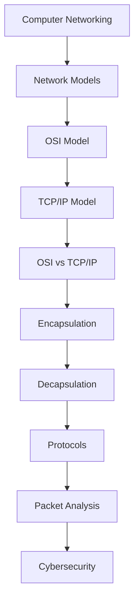

# 🌐 Network Models

### Learn the layered architectures that power modern computer networks and form the foundation of cybersecurity.

---

> **Module Overview**  
> Network models provide the blueprint for how data moves between devices. In this module, you'll learn the OSI Model, the TCP/IP Model, their differences, and how data is encapsulated and decapsulated as it travels across a network. These concepts form the foundation for packet analysis, network troubleshooting, and nearly every cybersecurity discipline.

# 📌 Network Models

Every device on a network — laptops, phones, routers, servers — needs to agree on *how* to communicate. Without a shared structure, one vendor's equipment couldn't reliably talk to another's, and troubleshooting a broken connection would mean guessing blindly at what went wrong.

**Network models** solve this problem by breaking communication into organized, predictable **layers** — each with a specific job.

This layered approach exists so that:

- Different technologies can work together predictably.
- Problems can be isolated to a specific layer instead of the whole system.
- Engineers can design new protocols without rebuilding the entire network stack.

Before learning protocols, packet analysis, Wireshark, routing, firewalls, exploitation, or penetration testing, every cybersecurity professional must first understand **how data is logically structured as it moves across a network** — and that's exactly what this chapter teaches.

---

# 🎯 Why Learn Network Models?

- **Standardization** — Network models create a common language that every device and vendor can follow.
- **Vendor Interoperability** — A Cisco router, an Apple laptop, and a Linux server can all communicate because they follow the same layered rules.
- **Easier Troubleshooting** — Knowing which layer handles what makes it possible to pinpoint exactly where a problem occurs.
- **Better Protocol Design** — New protocols are built to fit into existing layers, keeping networking consistent and extensible.
- **Understanding Packet Flow** — Every packet capture, firewall rule, and intrusion alert only makes sense once you understand which layer it belongs to.
- **Foundation of Networking** — Nearly every networking concept you'll learn going forward builds on top of these models.
- **Foundation of Cybersecurity** — Attacks, defenses, and monitoring tools are all organized around these same layers.

---

# 🎯 Learning Objectives

After completing this module, you should understand:

- What network models are and why they exist.
- Why layered architectures are used instead of a single monolithic system.
- The **OSI Model** and the responsibility of each of its seven layers.
- The **TCP/IP Model** and how it powers real-world networks, including the Internet.
- The key differences between the OSI and TCP/IP models.
- **Encapsulation** — how data gets wrapped with information as it travels down the stack.
- **Decapsulation** — how that same data gets unwrapped as it travels back up the stack.
- How data physically and logically moves across layers during communication.

---

# 🗺️ Visual Learning Path

---

# 📚 Lessons

This module consists of five lessons. Each lesson builds on the previous one, but you can also jump directly to a specific topic if you're reviewing or looking for a particular concept.

---

## 📘 Lesson 1 — [OSI Model](OSI%20Model.md)

> **Learn the universal language of networking.**

The OSI (Open Systems Interconnection) Model breaks network communication into seven distinct layers, making complex networking easier to understand, design, and troubleshoot. This lesson introduces the purpose of each layer, the technologies that operate within them, and why the OSI Model remains a fundamental concept in networking and cybersecurity.

### You'll Learn

- Why the OSI Model was created
- The purpose of each of the seven layers
- Common protocols and technologies at every layer
- How the OSI Model simplifies troubleshooting

### Why This Lesson Matters

The OSI Model provides the vocabulary used throughout networking. Understanding it makes protocols, packet captures, and network troubleshooting much easier.

📍 **Next:** Discover how the Internet uses a more practical networking model.

---

## 📘 Lesson 2 — [TCP/IP Model](TCP-IP%20Model.md)

> **The networking model that powers the Internet.**

While the OSI Model is an excellent learning framework, real-world networks rely on the TCP/IP Model. This lesson explains its four layers, how they relate to the OSI Model, and why nearly every modern network depends on this architecture.

### You'll Learn

- The four layers of the TCP/IP Model
- How TCP/IP compares to the OSI Model
- Why TCP/IP became the Internet standard
- Where common Internet protocols fit

### Why This Lesson Matters

Understanding TCP/IP helps you connect networking theory with the technologies you'll encounter in real environments.

📍 **Next:** Compare both models side by side.

---

## 📘 Lesson 3 — [OSI vs TCP/IP](OSI%20vs%20TCP-IP.md)

> **Understand the similarities and differences between both models.**

Both networking models describe communication, but they do so in different ways and for different purposes. This lesson compares them layer by layer, helping you confidently translate between the two.

### You'll Learn

- Key differences between the models
- Layer mapping between OSI and TCP/IP
- Advantages and limitations of each model
- When each model is commonly used

### Why This Lesson Matters

Being able to move between both models is an essential networking skill used in documentation, certifications, and cybersecurity.

📍 **Next:** Watch data move through these layers.

---

## 📘 Lesson 4 — [Encapsulation](Encapsulation.md)

> **See how data is prepared for transmission.**

Before data leaves a device, each networking layer adds its own information to ensure reliable communication. This lesson follows data as it is transformed into segments, packets, frames, and bits.

### You'll Learn

- What encapsulation is
- How headers are added at each layer
- Protocol Data Units (PDUs)
- How data is prepared for transmission

### Why This Lesson Matters

Encapsulation explains what actually happens when information travels across a network, making packet analysis much easier to understand.

📍 **Next:** Learn what happens when the data reaches its destination.

---

## 📘 Lesson 5 — [Decapsulation](Decapsulation.md)

> **Complete the journey from sender to receiver.**

Once data arrives at its destination, each networking layer removes the information added during encapsulation until the original message reaches the application. This lesson completes the communication process.

### You'll Learn

- What decapsulation is
- How headers are removed
- How devices process incoming data
- The complete lifecycle of network communication

### Why This Lesson Matters

Understanding both encapsulation and decapsulation allows you to follow network traffic from beginning to end, an essential skill for troubleshooting, packet analysis, and cybersecurity.

🏁 **Module Complete:** You now understand the logical models that organize network communication and are ready to explore the devices that make networking possible.
---

## 🎯 What You'll Learn in This Module

- Understanding why layered networking models exist in the first place.
- Explaining the responsibilities of each OSI layer from memory.
- Understanding how the TCP/IP model powers real-world, modern networks.
- Comparing the OSI and TCP/IP models confidently, including where they overlap.
- Following data as it becomes encapsulated on the sending side.
- Following data as it becomes decapsulated on the receiving side.
- Identifying which layer common protocols (like HTTP, TCP, IP, and Ethernet) operate at.
- Tracing the full journey of a packet through the networking stack, from application to physical transmission and back.
- Building the conceptual foundation required for Wireshark and packet analysis.
- Preparing for later topics like routing, firewalls, IDS/IPS, and penetration testing, all of which rely on layered thinking.

---

# 🛣️ Recommended Learning Order

1. **Read this README** — get an overview of the chapter and how the lessons connect.
2. **Learn the OSI Model** — build the detailed, seven-layer foundation first.
3. **Learn the TCP/IP Model** — see how the real-world model simplifies OSI concepts.
4. **Compare both models** — solidify your understanding by seeing them side by side.
5. **Understand Encapsulation** — learn how data is prepared for transmission across layers.
6. **Learn Decapsulation** — complete the picture by learning how data is unwrapped on arrival.

This order is recommended because each lesson builds directly on the one before it — OSI provides the detailed vocabulary, TCP/IP shows the practical implementation, the comparison ties both together, and encapsulation/decapsulation show these models **in motion** as real data.

---

# 🌍 Real World Importance

A solid grasp of network models directly supports nearly every hands-on cybersecurity skill you'll build later, including:

- **Wireshark & Packet Captures** — every packet you inspect is organized according to these layers.
- **Firewalls & IDS/IPS** — filtering and detection rules are written based on specific layers (e.g., IP addresses, ports, application data).
- **Routers & Switches** — these devices operate at specific layers (routers at Layer 3, switches at Layer 2).
- **VPNs** — encrypt and tunnel traffic by operating at defined layers of the stack.
- **DNS, HTTP, HTTPS, SSH** — each of these protocols has a specific "home" layer that explains how it behaves.
- **Web Browsing** — every page load is a real-time demonstration of encapsulation and decapsulation.
- **Malware Analysis** — understanding which layer malware operates on (e.g., network-level vs. application-level) shapes how it's detected and stopped.
- **Digital Forensics** — investigators rely on layer-based knowledge to reconstruct what happened during an incident.
- **Penetration Testing** — many attack techniques specifically target weaknesses at a particular layer.
- **Network Troubleshooting** — layer-based thinking is the fastest way to isolate where a connection problem is actually occurring.

---

# 📖 Prerequisites

Before starting this chapter, you should already understand:

- What a computer network is.
- **Client-Server Architecture.**
- **Peer-to-Peer Architecture.**
- **Internet vs Intranet vs Extranet.**

These concepts were covered in the previous chapter, **02-Networking → 00-Introduction**, and form the foundation this chapter builds on.

---

# 📝 Key Takeaways

- Network models exist to standardize communication across different devices and vendors.
- The **OSI Model** breaks communication into seven distinct layers, each with its own responsibility.
- The **TCP/IP Model** is the simplified, four-layer model that actually runs the modern Internet.
- Both models are still relevant today — OSI for teaching and troubleshooting, TCP/IP for real-world implementation.
- **Encapsulation** wraps data with layer-specific information as it moves down the stack for transmission.
- **Decapsulation** reverses this process, unwrapping data as it moves up the stack on the receiving end.
- Every protocol you'll study later (HTTP, TCP, IP, Ethernet, etc.) has a specific layer it belongs to.
- Layer-based thinking is the fastest way to troubleshoot networking issues and analyze packet captures.
- This module is foundational — Wireshark, firewalls, routing, and penetration testing all assume this knowledge.

---
## ➡️ Next Chapter

Now that you understand **how communication is logically organized** through network models, the next step is learning about **the devices that make communication physically possible**.

The next module, **[Network Devices](../02-Network%20Devices/README.md)**, introduces the hardware that networks rely on, including:

- Hub
- Switch
- Router
- Bridge
- Repeater
- Access Point
- Modem
- Gateway
- Firewall

With the logical foundation from this chapter now in place, you're ready to see how these concepts come to life in real networking hardware.

➡️ **Continue to:** **[Network Devices](../02-Network%20Devices/README.md)**

----------

