<div align="center">

# 🌐 TCP/IP Model

### Understanding the Networking Model That Powers the Modern Internet


**Part 1 — History, Origins, and Foundations of the TCP/IP Model**

</div>

---

# 📖 Table of Contents

- [Introduction](#-introduction)
- [Learning Objectives](#-learning-objectives)
- [What Does TCP/IP Mean?](#-what-does-tcpip-mean)
- [Why Was TCP/IP Created?](#-why-was-tcpip-created)
- [The Networking World Before TCP/IP](#-the-networking-world-before-tcpip)
- [The Birth of ARPANET](#-the-birth-of-arpanet)
- [How TCP/IP Was Developed](#-how-tcpip-was-developed)
- [The Internet Begins](#-the-internet-begins)
- [Historical Timeline](#-historical-timeline)
- [Why Every Cybersecurity Professional Should Learn TCP/IP](#-why-every-cybersecurity-professional-should-learn-tcpip)
- [Knowledge Check #1](#-knowledge-check-1)

---

# 📘 Introduction

If the **OSI Model** teaches us **how networking is organized**, then the **TCP/IP Model** teaches us **how networking actually works in the real world**.

Every time you:

- Open Google
- Watch YouTube
- Browse GitHub
- Send an email
- Play an online game
- Join a Zoom meeting
- Connect to cloud services

your device is communicating using the **TCP/IP protocol suite**.

Unlike the OSI Model, which was designed as a **reference framework**, the TCP/IP Model was created to solve real networking problems.

It wasn't built inside a classroom.

It wasn't created solely for documentation.

It was developed by engineers who needed computers to communicate reliably across long distances.

Because it solved those challenges successfully, it eventually became the foundation of the modern Internet.

Today, nearly every connected device—from smartphones and laptops to cloud servers and IoT devices—uses TCP/IP in some form.

Understanding this model is therefore one of the most important steps in learning networking and cybersecurity.

---

> 💡 **Did You Know?**
>
> Every packet you capture in **Wireshark**, every website you visit, every DNS lookup you perform, and every secure HTTPS connection you establish relies on the TCP/IP protocol suite.

---

# 🎯 Learning Objectives

After completing this lesson, you will be able to:

- Explain what TCP/IP stands for.
- Understand why TCP/IP was created.
- Describe the historical development of TCP/IP.
- Explain the role of ARPANET in Internet history.
- Understand why TCP/IP became the global networking standard.
- Recognize why cybersecurity professionals rely heavily on TCP/IP.
- Build a strong foundation for studying TCP, UDP, IP, DNS, HTTP, and packet analysis.

---

# 🤔 What Does TCP/IP Mean?

The name **TCP/IP** comes from two of the most important networking protocols:

- **TCP (Transmission Control Protocol)**
- **IP (Internet Protocol)**

Together, these protocols became so influential that the entire networking architecture became known as the **TCP/IP Model** or the **TCP/IP Protocol Suite**.

However, this name can sometimes confuse beginners.

A common misconception is that TCP/IP contains only two protocols.

That is **not true**.

TCP and IP are simply the most recognizable members of a much larger family of networking protocols.

The TCP/IP protocol suite includes many protocols, such as:

| Protocol | Purpose |
|----------|----------|
| TCP | Reliable communication |
| UDP | Fast, connectionless communication |
| IP | Logical addressing and routing |
| ICMP | Error reporting and diagnostics |
| ARP | Address resolution on local networks |
| HTTP | Web browsing |
| HTTPS | Secure web browsing |
| DNS | Domain name resolution |
| DHCP | Automatic IP configuration |
| FTP | File transfer |
| SMTP | Sending email |
| SSH | Secure remote administration |

Together, these protocols enable virtually every Internet service we use today.

---

> 📝 **Note**
>
> When people say **"TCP/IP"**, they are usually referring to the **entire family of Internet networking protocols**, not just TCP and IP.

---

# 🌍 Why Was TCP/IP Created?

To appreciate the importance of TCP/IP, we first need to understand the problems engineers faced before it existed.

During the 1960s and early 1970s:

- Computer networks were small.
- Most organizations built their own networking systems.
- Different manufacturers used different communication methods.
- Networks were isolated from one another.

In many cases, computers from different vendors simply could not communicate.

Imagine trying to call someone whose phone only understands a completely different language.

Communication becomes impossible.

Engineers needed a universal method that allowed completely different computers to exchange information reliably.

That challenge led to the development of TCP/IP.

---

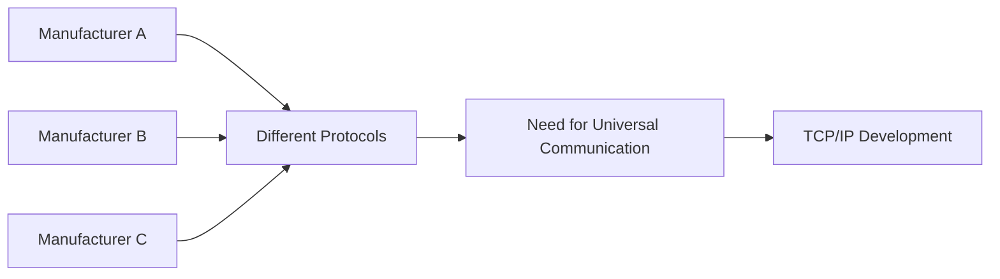

---

# 🌐 The Networking World Before TCP/IP

Before TCP/IP, networking looked very different from today's Internet.

Instead of one global network, there were many independent networks.

Each organization often created its own communication methods.

Examples included:

- Universities
- Military organizations
- Government agencies
- Computer manufacturers

These networks were like isolated islands.

They could communicate internally but struggled to communicate with one another.

---

### 🌍 Real-World Analogy

Imagine several countries where every country has:

- Different languages
- Different alphabets
- Different traffic rules
- Different currencies

Traveling between countries would become extremely difficult.

TCP/IP became the common language that allowed all networks to communicate.

---

<!--
Image Description:
Illustrate several isolated computer networks represented as separate islands. Each island contains computers using different protocols and is disconnected from the others. In the center, show TCP/IP acting as a bridge connecting all islands into one large global network labeled "Internet."

Suggested Search Keywords:
ARPANET to Internet illustration
early computer networking diagram
TCP/IP connects networks infographic
-->

<p align="center">

</p>

---

# 🛰 The Birth of ARPANET

The story of TCP/IP begins with **ARPANET**.

ARPANET (Advanced Research Projects Agency Network) was one of the world's first large-scale packet-switched computer networks.

It was funded by the **United States Department of Defense (DoD)** through the **Advanced Research Projects Agency (ARPA)**, later renamed **DARPA**.

Its goal was ambitious:

> Connect computers located in different research institutions so they could share information and computing resources.

At the time, this was a revolutionary idea.

Instead of treating computers as isolated machines, ARPANET demonstrated that they could become part of a larger interconnected network.

This concept eventually evolved into what we now call the Internet.

---

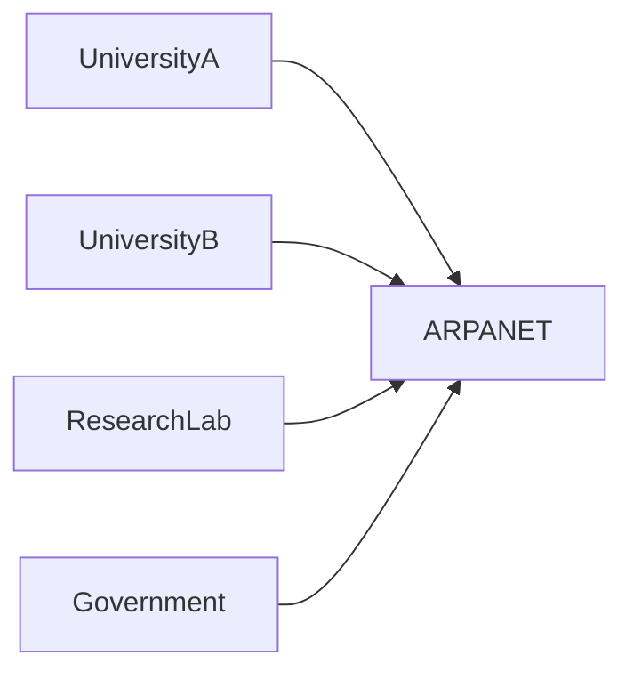

---

> 💡 **Did You Know?**
>
> The first ARPANET connection was established in **1969**, connecting research institutions in the United States. Although tiny by today's standards, it marked the beginning of modern computer networking.

---

# ⚙️ How TCP/IP Was Developed

As ARPANET expanded, engineers encountered new challenges.

Questions included:

- How can computers using different hardware communicate?
- How can messages survive damaged network paths?
- How can data be routed across multiple interconnected networks?
- How can communication remain reliable even if parts of the network fail?

Researchers, including **Vinton Cerf** and **Robert E. Kahn**, developed a new communication architecture to solve these problems.

Their solution eventually became known as the **TCP/IP protocol suite**.

One of its key design principles was simple but powerful:

> **Any network should be able to communicate with any other network, regardless of the underlying hardware or technology.**

This concept gave birth to the term:

# 🌐 Internetworking

Internetworking simply means:

> **Connecting multiple independent networks so they behave as one larger network.**

The word **Internet** comes directly from this concept.

---

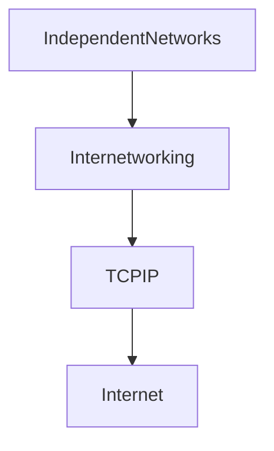

---

# 🚀 The Internet Begins

On **January 1, 1983**, ARPANET officially transitioned to TCP/IP.

This date is often called:

> **The Flag Day of the Internet**

Why?

Because every connected system had to switch to TCP/IP in order to continue communicating.

After this transition:

- Universities rapidly adopted TCP/IP.
- Government agencies adopted TCP/IP.
- Research organizations adopted TCP/IP.
- Businesses adopted TCP/IP.
- Internet Service Providers (ISPs) adopted TCP/IP.

As more organizations connected together, the Internet grew rapidly.

Today, billions of devices communicate using the same fundamental protocol suite.

---

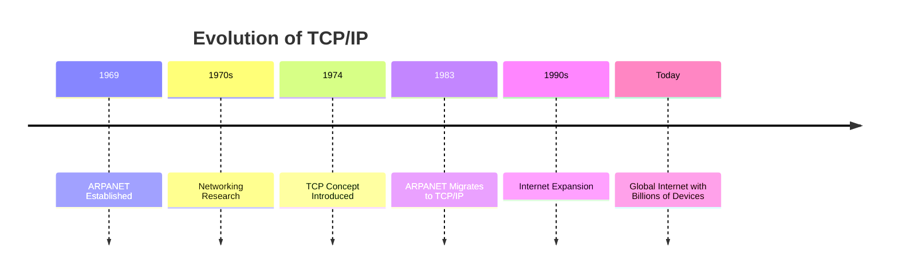

---

# 🌍 Why Did TCP/IP Become So Successful?

Many networking technologies have been developed over the years.

Very few became global standards.

TCP/IP succeeded because it solved several important problems exceptionally well.

It offered:

- Reliability
- Scalability
- Flexibility
- Vendor independence
- Interoperability
- Open standards
- Fault tolerance

Most importantly...

It worked.

Organizations quickly realized they could connect different types of computers without redesigning their entire infrastructure.

As adoption increased, TCP/IP became more valuable.

This created a powerful **network effect**, where every new organization joining the network increased its usefulness for everyone else.

---

> 🎯 **Remember**
>
> Technologies don't become standards simply because they're well designed.
>
> They become standards because they're practical, reliable, and widely adopted.

---

# 🛡 Why Every Cybersecurity Professional Should Learn TCP/IP

Cybersecurity is fundamentally about protecting communication.

To defend a network, you must first understand how that network communicates.

Every cybersecurity discipline depends on TCP/IP.

Examples include:

| Cybersecurity Area | TCP/IP Knowledge Required |
|--------------------|---------------------------|
| Wireshark Analysis | ✅ Yes |
| Packet Capture (PCAP) | ✅ Yes |
| Firewall Configuration | ✅ Yes |
| IDS/IPS | ✅ Yes |
| Penetration Testing | ✅ Yes |
| Malware Analysis | ✅ Yes |
| Digital Forensics | ✅ Yes |
| SOC Operations | ✅ Yes |

Whether you're analyzing suspicious packets, investigating an intrusion, or configuring network defenses, you'll constantly encounter TCP/IP protocols.

Understanding the TCP/IP Model provides the foundation for all of these tasks.

---

# 🎓 Knowledge Check #1

Before moving to the next section, see if you can answer these questions without looking back.

1. What does TCP/IP stand for?
2. Does TCP/IP refer to only two protocols?
3. Why was TCP/IP originally developed?
4. What was ARPANET?
5. Which organization funded ARPANET?
6. What is meant by *internetworking*?
7. Why is January 1, 1983, considered a significant date in Internet history?
8. Why did TCP/IP become the global networking standard?
9. How does TCP/IP enable interoperability between different devices?
10. Why is TCP/IP knowledge essential for cybersecurity professionals?

# 🏗 Understanding the TCP/IP Model

Now that you know **why TCP/IP was created** and **how it became the foundation of the Internet**, it's time to answer an important question:

> **"What exactly is the TCP/IP Model?"**

Many beginners hear terms like **TCP/IP**, **Internet Protocol Suite**, **TCP/IP Stack**, and **Internet Model** and assume they all mean different things.

While there are slight differences in context, they all refer to the same fundamental networking architecture that enables computers around the world to communicate.

This section will build a solid conceptual foundation before we study each layer individually.

---

# 📖 What Is the TCP/IP Model?

The **TCP/IP Model** is a **layered networking architecture** that defines how data is prepared, transmitted, routed, received, and processed across interconnected networks.

Rather than treating communication as one large process, the model divides it into **four logical layers**.

Each layer performs a specific set of responsibilities and works together with the other layers to deliver data from one device to another.

Think of it as a team where every member has a specialized role.

When all four layers work together, communication becomes reliable, organized, and scalable.

---

```mermaid
flowchart TD

Application

↓

Transport

↓

Internet

↓

NetworkAccess

↓

PhysicalNetwork[Network Medium]

↓

Destination
```

---

Instead of requiring one program to handle every networking task, the TCP/IP Model distributes responsibilities across multiple layers.

For example:

- One layer prepares the data.
- Another ensures reliable delivery.
- Another decides where packets should travel.
- Another transmits the data across the local network.

Each layer focuses on **doing one job well**.

---

> 💡 **Did You Know?**
>
> Every Internet-connected device—whether it's a laptop, smartphone, gaming console, smart TV, cloud server, or IoT sensor—communicates using the TCP/IP architecture.

---

# 🌐 Why Is It Called the Internet Model?

The TCP/IP Model is often called the **Internet Model** because it forms the foundation of the global Internet.

Every major Internet service depends on it.

For example:

- Google Search
- YouTube
- Netflix
- GitHub
- Microsoft Azure
- Amazon Web Services (AWS)
- Online Banking
- Cloud Storage
- Online Gaming
- Video Conferencing

Although these services look completely different to users, they all rely on the same underlying networking architecture.

This universal compatibility is one of the greatest strengths of TCP/IP.

---

### 🌍 Real-World Example

Imagine traveling internationally.

Different countries may speak different languages, use different currencies, and follow different customs.

However, airports around the world follow standardized aviation procedures that allow airplanes to travel safely between countries.

Similarly, websites and applications may be completely different, but they all communicate using the common language provided by TCP/IP.

---

# 📦 The TCP/IP Protocol Suite

Earlier, we learned that TCP/IP is much more than just **TCP** and **IP**.

In reality, it is a collection of many networking protocols, each designed to perform a specific task.

Together, these protocols are called the **TCP/IP Protocol Suite**.

---

## Common Protocols in the TCP/IP Suite

| Protocol | Primary Purpose |
|----------|-----------------|
| IP | Logical addressing and routing |
| TCP | Reliable communication |
| UDP | Fast, connectionless communication |
| ICMP | Error reporting and diagnostics |
| ARP | Resolving IP addresses to MAC addresses |
| HTTP | Web browsing |
| HTTPS | Secure web browsing |
| DNS | Domain name resolution |
| DHCP | Automatic IP address assignment |
| FTP | File transfer |
| SMTP | Sending email |
| IMAP | Retrieving email |
| SSH | Secure remote administration |
| SNMP | Network management |

Each protocol specializes in one aspect of communication, and together they make Internet communication possible.

---

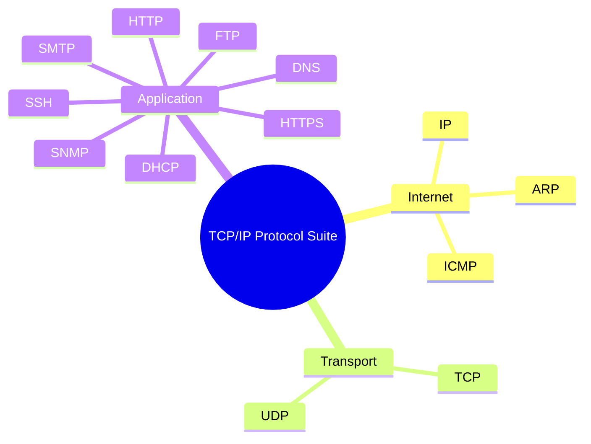

---

> 📝 **Note**
>
> You do **not** need to memorize every protocol immediately.
>
> As you progress through this roadmap, each protocol will have its own dedicated chapter with practical examples and labs.

---

# 🏛 The Layered Architecture

One of the most important concepts in networking is **layering**.

Instead of building one enormous networking system responsible for everything, the TCP/IP Model divides communication into logical layers.

Each layer performs a different responsibility.

This approach provides several important benefits:

- Easier design
- Easier troubleshooting
- Better scalability
- Simpler maintenance
- Independent protocol development

---

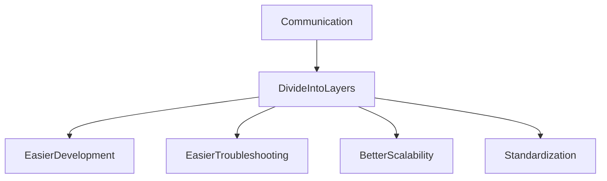

---

## 🌍 Real-World Analogy — Sending a Parcel

Imagine you're sending a package to a friend living in another country.

Many people are involved:

- You prepare the parcel.
- A courier collects it.
- Distribution centers route it.
- Delivery vehicles transport it locally.
- A delivery driver hands it to your friend.

No single person performs every task.

Each participant specializes in one responsibility.

The TCP/IP Model follows the same philosophy.

Every layer contributes one part of the communication process.

---

# 🤔 Why Does the TCP/IP Model Have Only Four Layers?

This is one of the most common beginner questions.

If the OSI Model has seven layers, why does TCP/IP use only four?

The answer is simple:

The TCP/IP Model combines responsibilities that naturally work together.

For example:

Instead of separating:

- Application
- Presentation
- Session

into three different layers, TCP/IP groups them into one **Application Layer**.

Likewise:

- Data Link
- Physical

are combined into the **Network Access Layer**.

This makes the model:

- Simpler
- Easier to implement
- More practical

without removing any essential networking functions.

---

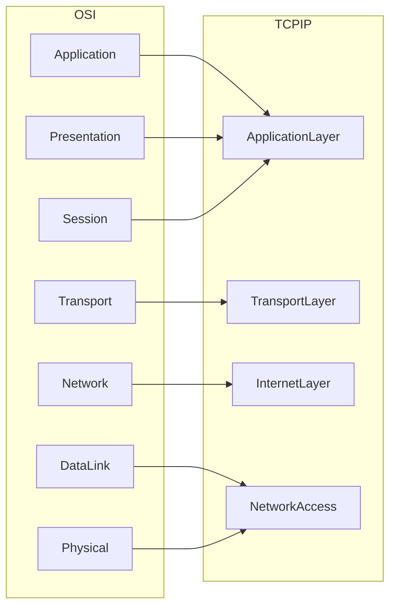

---

> 🎯 **Remember**
>
> The TCP/IP Model doesn't eliminate networking responsibilities.
>
> It simply organizes them into fewer, broader layers.

---

# 🏢 Design Philosophy of the TCP/IP Model

Unlike the OSI Model, which emphasizes theoretical organization, the TCP/IP Model emphasizes **practical communication**.

Its designers asked questions like:

- Can computers reliably exchange data?
- Can networks survive failures?
- Can different hardware communicate?
- Can the architecture scale as networks grow?

The answers to these questions shaped TCP/IP into a practical, resilient networking model.

Its core design principles include:

- Reliability
- Simplicity
- Scalability
- Fault Tolerance
- Interoperability
- Flexibility

These characteristics allowed TCP/IP to grow from a research project into the backbone of the Internet.

---

# 🚀 Advantages of Layering

The layered architecture of TCP/IP provides many practical benefits.

---

## Easier Troubleshooting

If a problem occurs, engineers can investigate one layer at a time.

Example:

- Browser problem → Application Layer
- TCP connection failure → Transport Layer
- Routing issue → Internet Layer
- Cable disconnected → Network Access Layer

---

## Independent Development

Protocols can evolve without redesigning the entire networking architecture.

Examples include:

- HTTP → HTTP/2 → HTTP/3
- IPv4 → IPv6
- SSL → TLS

The overall TCP/IP Model remains the same while individual protocols improve over time.

---

## Interoperability

Devices from different manufacturers can communicate using common protocols.

Examples:

- Windows ↔ Linux
- Android ↔ iPhone
- Cisco ↔ Juniper
- AWS ↔ Azure

---

## Scalability

The same architecture supports:

- Small home networks
- University campuses
- Enterprise environments
- Global cloud infrastructures
- The Internet itself

Very few technologies have scaled as successfully as TCP/IP.

---

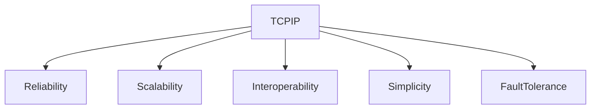

---

<!--
Image Description:
Create a modern infographic illustrating the four-layer TCP/IP Model. Each layer should contain a short description, example protocols, and representative devices or applications. Show arrows indicating the flow of data from the Application Layer down to the Network Access Layer and back up again. Include icons representing a web browser, TCP segment, IP packet, Ethernet frame, router, switch, and physical network medium.

Suggested Search Keywords:
TCP/IP model infographic
Internet protocol suite layers
TCP/IP architecture diagram
-->

<p align="center">

</p>

---

# 🌍 TCP/IP in Everyday Life

One of the easiest ways to appreciate TCP/IP is to recognize how often you use it.

Every one of the following activities relies on the TCP/IP protocol suite:

| Everyday Activity | TCP/IP Used? |
|-------------------|:------------:|
| Browsing websites | ✅ |
| Streaming YouTube | ✅ |
| Online gaming | ✅ |
| Sending email | ✅ |
| Downloading files | ✅ |
| Using cloud storage | ✅ |
| Video conferencing | ✅ |
| Mobile Internet | ✅ |
| Smart Home Devices | ✅ |

Although users rarely notice it, the TCP/IP Model is working behind the scenes every second.

---

> 🚀 **Pro Tip**
>
> Every packet you inspect in **Wireshark** follows the TCP/IP architecture. Learning this model will make packet captures much easier to understand later in your cybersecurity journey.

---

# 🎓 Knowledge Check

Before moving to the next section, test your understanding.

1. What is the TCP/IP Model?
2. Why is it called the Internet Model?
3. What is the TCP/IP Protocol Suite?
4. Does TCP/IP consist of only two protocols?
5. Why does the TCP/IP Model use a layered architecture?
6. Why are there only four layers instead of seven?
7. What are the main advantages of layering?
8. Why is interoperability important?
9. How does TCP/IP support scalability?
10. Can the TCP/IP Model continue working even as individual protocols evolve? Why?

# 🌐 The Four Layers of the TCP/IP Model

Now that you understand the **history**, **purpose**, and **design philosophy** of the TCP/IP Model, it's time to explore its architecture in detail.

The TCP/IP Model consists of **four logical layers**.

Each layer performs a unique role in the communication process.

Together, these layers allow billions of devices around the world to exchange information reliably.

Think of them as members of a relay team.

Each runner has one responsibility.

When one finishes its task, it passes the baton to the next runner.

Similarly, each TCP/IP layer performs its job and passes the data to the next layer until it reaches its destination.

---

```text
+------------------------------------+
|         Application Layer          |
+------------------------------------+
|          Transport Layer           |
+------------------------------------+
|           Internet Layer           |
+------------------------------------+
|        Network Access Layer        |
+------------------------------------+
```

---

```mermaid
flowchart TD

Application

↓

Transport

↓

Internet

↓

NetworkAccess

↓

Transmission[Physical Network]

↓

Destination
```

---

> 💡 **Did You Know?**
>
> Every email, website request, online game, cloud service, and video stream travels through these four layers before reaching its destination.

---

# 🏢 Overview of the Four Layers

Before studying each layer in depth, let's look at the overall picture.

| Layer | Primary Responsibility | Example Protocols |
|--------|------------------------|-------------------|
| Application | Network services for applications | HTTP, HTTPS, DNS, DHCP, SMTP |
| Transport | Reliable end-to-end communication | TCP, UDP |
| Internet | Logical addressing and routing | IP, ICMP |
| Network Access | Local network communication and physical transmission | Ethernet, Wi-Fi, ARP |

Each layer depends on the layer below it.

At the same time, it provides services to the layer above it.

This relationship keeps networking organized and modular.

---

# 🖥 Layer 4 — Application Layer

The **Application Layer** is the highest layer of the TCP/IP Model.

It is the layer closest to the user.

Whenever you interact with a network-enabled application, you are working with the Application Layer.

Examples include:

- Opening a website
- Sending an email
- Downloading a file
- Watching YouTube
- Using cloud storage
- Playing an online game
- Logging into a remote server

This layer provides the network services that applications need to communicate.

Unlike the OSI Model, the TCP/IP Application Layer also includes the responsibilities of:

- Presentation Layer
- Session Layer

---

## Main Responsibilities

- User interaction
- Network services
- Data formatting
- Encryption
- Compression
- Session management

---

## Common Protocols

| Protocol | Purpose |
|----------|----------|
| HTTP | Web browsing |
| HTTPS | Secure web browsing |
| DNS | Name resolution |
| SMTP | Sending email |
| IMAP | Receiving email |
| FTP | File transfer |
| SSH | Secure remote login |
| DHCP | Automatic IP configuration |

---

### 🌍 Real-World Example

You open your browser and visit:

```text
https://github.com
```

Your browser:

- Creates the request.
- Encrypts the communication.
- Maintains the session.
- Sends the request to the Transport Layer.

Everything begins here.

---

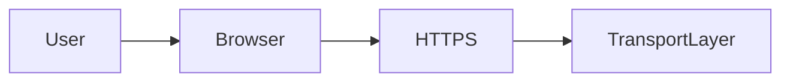

---

> 📝 **Note**
>
> Although we call it the **Application Layer**, users don't interact directly with networking protocols. They interact with applications such as browsers, email clients, or messaging apps, which use these protocols behind the scenes.

---

# 🚚 Layer 3 — Transport Layer

Once the Application Layer prepares the data, it passes it to the **Transport Layer**.

The Transport Layer is responsible for **end-to-end communication**.

Imagine shipping a large package.

Instead of sending one enormous box, the package is divided into smaller, manageable pieces.

The Transport Layer performs a similar function by breaking large amounts of data into smaller segments.

Depending on the protocol being used, it may also ensure that:

- Every segment arrives.
- Lost segments are retransmitted.
- Data arrives in the correct order.
- Communication remains reliable.

---

## Main Responsibilities

- Segmentation
- Reassembly
- Reliable delivery
- Error recovery
- Flow control
- Multiplexing
- Port numbers

---

## Common Protocols

| Protocol | Purpose |
|----------|----------|
| TCP | Reliable communication |
| UDP | Fast communication |

---

### 🌍 Real-World Example

Suppose you're downloading a **10 GB game**.

Without segmentation, the entire download would need to be sent as one huge block.

Instead:

- The file is divided into thousands of smaller pieces.
- Each piece is numbered.
- Missing pieces are resent if necessary.
- The destination rebuilds the original file.

---

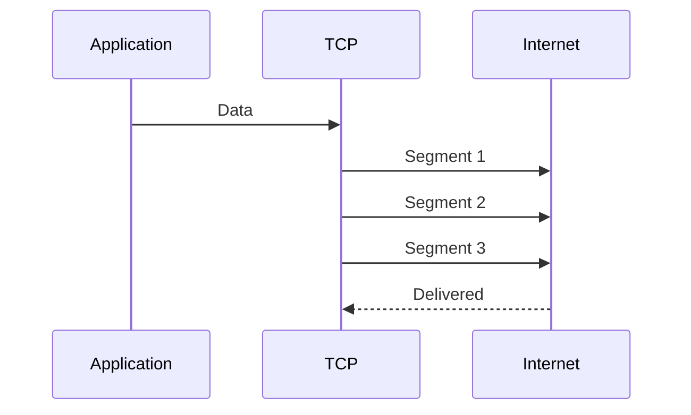

---

> 🎯 **Remember**
>
> The Transport Layer does **not** decide where data travels.
>
> It only ensures that communication between applications is efficient and, when required, reliable.

---

# 🌍 Layer 2 — Internet Layer

After segmentation, data moves to the **Internet Layer**.

This layer is responsible for moving packets between different networks.

Its primary job is determining:

> **"Where should this packet go?"**

The Internet Layer provides logical addressing through IP addresses and determines how packets travel from one network to another.

Without this layer, devices outside your local network could never communicate.

---

## Main Responsibilities

- Logical addressing
- Routing
- Packet forwarding
- Path selection
- Packet fragmentation (IPv4)

---

## Common Protocols

| Protocol | Purpose |
|----------|----------|
| IPv4 | Logical addressing |
| IPv6 | Modern addressing |
| ICMP | Diagnostics and error reporting |

---

### 🌍 Real-World Example

Imagine sending a parcel from Pakistan to Canada.

Your local courier doesn't need to know every road.

Instead, distribution centers determine the best route until the parcel reaches its destination.

Routers perform this same function by forwarding packets toward the correct destination.

---

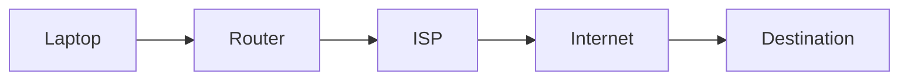

---

> 💡 **Did You Know?**
>
> Every router on the Internet primarily operates at this layer because its main responsibility is forwarding IP packets between networks.

---

# 🔌 Layer 1 — Network Access Layer

The **Network Access Layer** is responsible for delivering data across the local network and transmitting it through the physical medium.

This layer combines responsibilities that the OSI Model separates into:

- Data Link Layer
- Physical Layer

It handles communication using technologies such as:

- Ethernet
- Wi-Fi
- Fiber optics
- Copper cables

This is the layer that actually places data onto the network.

---

## Main Responsibilities

- Framing
- MAC addressing
- Error detection
- Physical transmission
- Media access

---

## Common Technologies

| Technology | Purpose |
|------------|----------|
| Ethernet | Wired networking |
| Wi-Fi | Wireless networking |
| Fiber Optic | High-speed communication |
| ARP | Resolves IP addresses to MAC addresses* |

> **Note:** ARP is often described as operating between the Internet Layer and the Network Access Layer because it bridges logical IP addressing with physical MAC addressing. Different textbooks place it slightly differently, but it is commonly associated with the Network Access Layer in the TCP/IP Model.

---

### 🌍 Real-World Example

Suppose you send a letter to someone living in your neighborhood.

The city knows the correct street.

However, the local postal worker still needs to identify the exact house.

Likewise:

- The Internet Layer gets the packet to the correct network.
- The Network Access Layer delivers it to the correct device using the MAC address.

---

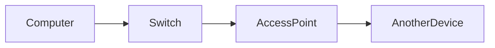

---

> 🚀 **Pro Tip**
>
> When troubleshooting local network problems, engineers often examine this layer first because issues like damaged cables, faulty network cards, incorrect VLANs, or Wi-Fi connectivity problems occur here.

---

# 📊 Layer Summary

| Layer | Main Responsibility | Data Unit | Common Protocols / Technologies | Typical Devices |
|--------|---------------------|-----------|---------------------------------|-----------------|
| Application | User services and network applications | Data | HTTP, HTTPS, DNS, SMTP, FTP, SSH | PCs, Servers, Proxy Servers |
| Transport | End-to-end communication | Segment (TCP) / Datagram (UDP) | TCP, UDP | Firewalls, Load Balancers |
| Internet | Logical addressing and routing | Packet | IPv4, IPv6, ICMP | Routers, Layer 3 Switches |
| Network Access | Local delivery and physical transmission | Frame / Bits | Ethernet, Wi-Fi, ARP | Switches, NICs, Access Points |

---

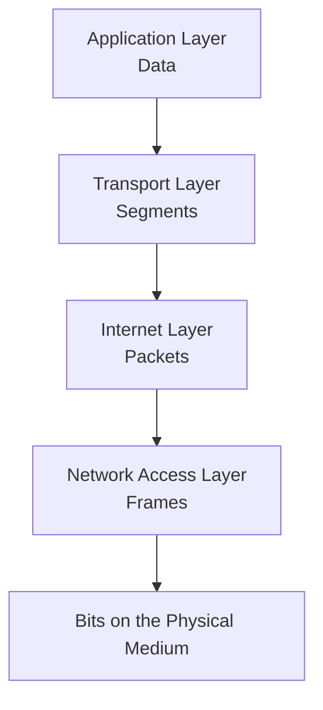

---

<!--
Image Description:
Create a professional infographic of the TCP/IP Model showing all four layers stacked vertically. For each layer, include its primary responsibility, common protocols, data unit, and representative networking devices. Add arrows showing data moving downward during encapsulation and upward during decapsulation. Include icons for a web browser, server, router, switch, and Ethernet cable to visually connect each layer to real networking hardware.

Suggested Search Keywords:
TCP/IP four layer model infographic
TCP/IP layers protocols devices
Internet protocol suite architecture diagram
-->

<p align="center">

</p>

---

# 🌍 Following a Google Search Through the TCP/IP Layers

Let's tie everything together with a simple example.

You type:

```text
https://www.google.com
```

Here's what happens:

| Layer | What Happens |
|--------|--------------|
| Application | Your browser creates an HTTPS request and prepares the data. |
| Transport | TCP divides the data into segments and ensures reliable delivery. |
| Internet | IP assigns source and destination IP addresses and determines routing. |
| Network Access | Ethernet or Wi-Fi creates frames and transmits them across the network. |

Although this entire process happens in milliseconds, every network communication follows these same four layers.

---

# 🎓 Knowledge Check

Before diving deeper into each layer in the next sections, test your understanding.

1. What are the four layers of the TCP/IP Model?
2. Which layer interacts directly with network applications?
3. Which layer is responsible for segmentation and reliable delivery?
4. Which layer uses IP addresses?
5. Which layer uses MAC addresses?
6. Why is the Network Access Layer considered a combination of two OSI layers?
7. Which devices primarily operate at the Internet Layer?
8. Which protocols are commonly found in the Application Layer?
9. Which layer is responsible for routing packets between networks?
10. Why is the layered design of the TCP/IP Model beneficial for networking?

# 🖥 Deep Dive into the Application Layer

In the previous section, we introduced the four layers of the TCP/IP Model and briefly discussed the role of each one.

Now it's time to explore the **Application Layer** in detail.

This is the layer that most users interact with every day—even if they don't realize it.

Every time you:

- Open a website
- Send an email
- Download a file
- Watch YouTube
- Use WhatsApp Web
- Join a Zoom meeting
- Log in to GitHub

you are using protocols that belong to the **Application Layer**.

---

# 📖 What Is the Application Layer?

The **Application Layer** is the topmost layer of the TCP/IP Model.

It provides the **network services** that applications need to communicate over a network.

It does **not** refer to the application itself.

For example:

- Google Chrome is **not** the Application Layer.
- Microsoft Outlook is **not** the Application Layer.
- Firefox is **not** the Application Layer.

Instead, these applications use **Application Layer protocols** such as:

- HTTP
- HTTPS
- SMTP
- DNS

to communicate with other devices across the Internet.

---

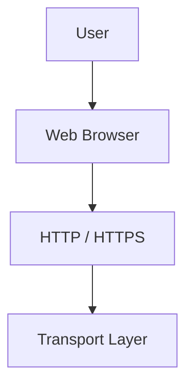

---

> 💡 **Did You Know?**
>
> The Application Layer is the only layer that users interact with **indirectly**. Users click buttons and type URLs, while applications handle the networking protocols behind the scenes.

---

# 🎯 Responsibilities of the Application Layer

The Application Layer is responsible for providing network-based services to software applications.

Its responsibilities include:

- Establishing communication between applications
- Requesting network resources
- Formatting application data
- Managing communication sessions
- Supporting encryption (through protocols like HTTPS/TLS)
- Allowing users to access Internet services

Remember from the OSI vs TCP/IP chapter:

The TCP/IP Application Layer also includes responsibilities that the OSI Model separates into:

- Application Layer
- Presentation Layer
- Session Layer

---

# 🧩 Common Application Layer Protocols

The Application Layer contains many protocols, each designed for a specific purpose.

| Protocol | Purpose |
|----------|----------|
| HTTP | Web browsing |
| HTTPS | Secure web browsing |
| DNS | Name resolution |
| DHCP | Automatic IP assignment |
| FTP | File transfer |
| SMTP | Sending email |
| POP3 | Downloading email |
| IMAP | Synchronizing email |
| SSH | Secure remote administration |
| SNMP | Network monitoring |
| NTP | Time synchronization |

You don't need to memorize all of these now.

Throughout this roadmap, each protocol will have its own dedicated lesson.

---

# 🌐 HTTP (Hypertext Transfer Protocol)

One of the most important Application Layer protocols is **HTTP**.

HTTP is responsible for transferring web pages between a client and a web server.

When you visit:

```text
https://github.com
```

your browser sends an HTTP request asking the server for the webpage.

The server then responds with:

- HTML
- CSS
- JavaScript
- Images
- Videos

which your browser renders into the webpage you see.

---

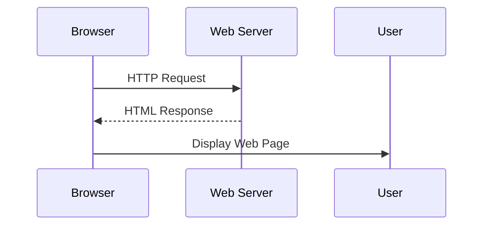

---

### 🌍 Real-World Example

Think of HTTP like ordering food in a restaurant.

You (the client):

- place an order

The waiter (HTTP):

- delivers your request

The kitchen (server):

- prepares the meal

The waiter then returns with your food.

HTTP works similarly by carrying requests and responses between browsers and servers.

---

# 🔒 HTTPS (Hypertext Transfer Protocol Secure)

HTTP sends information in plain text.

This creates a serious security problem.

Anyone monitoring the network could potentially read:

- Usernames
- Passwords
- Credit card information
- Personal messages

HTTPS solves this problem.

It combines:

- HTTP
- TLS (Transport Layer Security)

to encrypt communication.

---

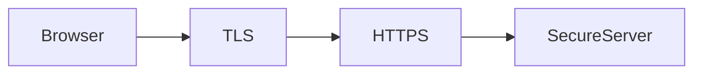

---

### Example

When visiting:

```text
https://bank.com
```

Your browser encrypts:

- Login credentials
- Banking information
- Session cookies

before sending them across the Internet.

Even if attackers capture the packets, they cannot easily read the encrypted contents.

---

> 🚀 **Pro Tip**
>
> Always check for **HTTPS** when entering sensitive information on websites. The padlock icon in modern browsers indicates that the connection is encrypted, though it does **not** guarantee the website itself is trustworthy.

---

# 🌍 DNS (Domain Name System)

Humans prefer names.

Computers prefer numbers.

DNS acts as the Internet's phonebook.

Instead of remembering:

```text
142.250.190.78
```

you simply type:

```text
www.google.com
```

DNS translates the domain name into an IP address.

Without DNS, users would need to remember numerical addresses for every website.

---

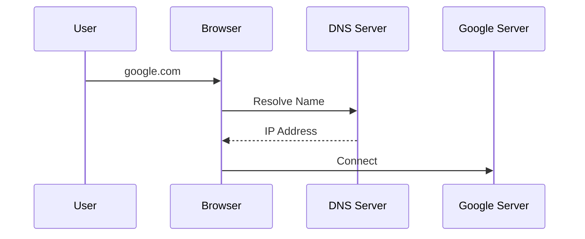

---

### 🌍 Real-World Analogy

Imagine searching for a friend's name in your phone contacts.

You remember:

> "Ahmed"

You don't remember:

> 0300-1234567

DNS performs the same function by translating names into addresses.

---

# 📡 DHCP (Dynamic Host Configuration Protocol)

Every device on a network requires an IP address.

Instead of configuring IP addresses manually, most networks use **DHCP**.

DHCP automatically assigns:

- IP Address
- Subnet Mask
- Default Gateway
- DNS Server

to devices joining the network.

---

### Example

When you connect your laptop to home Wi-Fi:

- You don't manually choose an IP address.
- Your router automatically assigns one.

That's DHCP at work.

---

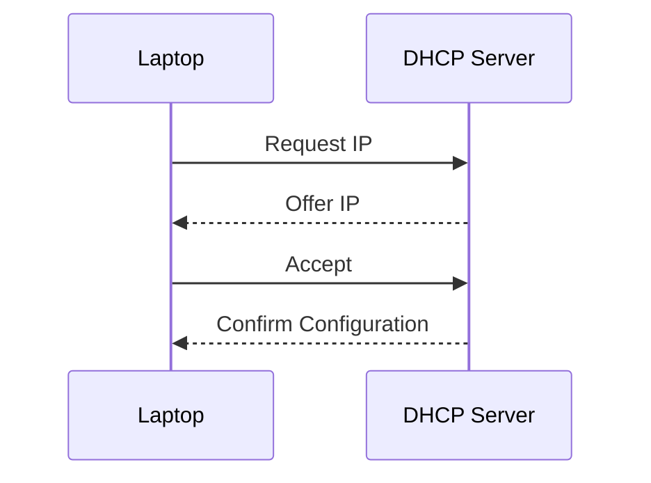

---

# 📁 FTP (File Transfer Protocol)

FTP is used to transfer files between computers.

Common uses include:

- Uploading website files
- Downloading software
- Sharing large files

Traditional FTP does **not** encrypt communication.

For secure file transfers, administrators often use:

- SFTP
- FTPS

instead.

---

### Example

A web developer uploads website files from a laptop to a web server.

FTP transfers the files over the network.

---

# 📧 SMTP, POP3, and IMAP

Email communication relies on multiple Application Layer protocols.

Each has a different role.

| Protocol | Purpose |
|----------|----------|
| SMTP | Sends email |
| POP3 | Downloads email |
| IMAP | Synchronizes email |

---

### Example

When sending an email:

SMTP sends the message to the mail server.

When reading email:

Your email client uses either:

- POP3
- IMAP

to retrieve messages.

---

```mermaid
flowchart LR

Sender

--> SMTP

SMTP

--> MailServer

MailServer

--> IMAP

IMAP

--> Receiver
```

---

# 🔐 SSH (Secure Shell)

SSH allows administrators to remotely control computers securely.

Instead of physically visiting a server, administrators can log in remotely and execute commands.

SSH encrypts all communication.

This makes it much safer than older protocols such as Telnet.

---

### Example

A Linux administrator in Pakistan securely manages a server located in Germany using SSH.

---

# 🌍 Putting It All Together

Suppose you open your browser and visit:

```text
https://github.com
```

Several Application Layer protocols work together.

| Step | Protocol |
|------|----------|
| Resolve website name | DNS |
| Secure communication | HTTPS |
| Transfer webpage | HTTP |
| Automatic IP assignment (earlier) | DHCP |

Most users only see a webpage loading.

Behind the scenes, multiple protocols cooperate seamlessly.

---

```mermaid
flowchart TD

User

--> DNS

DNS

--> HTTPS

HTTPS

--> HTTP

HTTP

--> WebServer
```

---

# 🛡 Cybersecurity Perspective

The Application Layer is one of the most frequently targeted layers in cyber attacks.

Why?

Because it is closest to users and applications.

Common attacks include:

| Attack | Description |
|----------|-------------|
| Phishing | Tricks users into revealing information |
| SQL Injection | Exploits vulnerable databases |
| Cross-Site Scripting (XSS) | Injects malicious JavaScript |
| Command Injection | Executes unauthorized commands |
| Directory Traversal | Accesses restricted files |
| Credential Stuffing | Uses stolen usernames and passwords |
| Malware Downloads | Delivers malicious software through applications |

Security professionals monitor Application Layer traffic carefully because many attacks begin here.

---

> ⚠ **Common Beginner Mistake**
>
> Many beginners think the Application Layer only includes web browsing.
>
> In reality, it includes **all network-enabled applications**, including email, DNS, remote administration, file transfer, cloud services, messaging platforms, and many other protocols.

---

<!--
Image Description:
Create a detailed infographic of the TCP/IP Application Layer. Display the layer at the top with icons representing a browser, email client, DNS server, SSH terminal, FTP client, DHCP server, and web server. Draw arrows showing how each protocol communicates with servers across the Internet. Include small labels describing the purpose of HTTP, HTTPS, DNS, DHCP, FTP, SMTP, IMAP, POP3, and SSH.

Suggested Search Keywords:
TCP/IP application layer infographic
application layer protocols diagram
HTTP DNS SMTP SSH overview
-->

<p align="center">

</p>

---

# 🎓 Knowledge Check

1. What is the primary purpose of the Application Layer?
2. Does the Application Layer refer to applications like Chrome or to networking protocols?
3. What is the difference between HTTP and HTTPS?
4. Why is DNS necessary?
5. What information does DHCP automatically provide to a device?
6. Why is SSH preferred over Telnet?
7. Which protocol is responsible for sending email?
8. Which protocols are commonly used for receiving email?
9. Why is the Application Layer a frequent target for cyber attacks?
10. Which Application Layer protocols were involved when you opened a secure website?

# 🚚 Deep Dive into the Transport Layer

Once the Application Layer has prepared the data, the next question is:

> **"How can this data travel reliably from one application to another?"**

Imagine downloading a **20 GB video game**, participating in a **Zoom meeting**, or streaming a **4K movie**.

How does your computer ensure that:

- Data arrives at the correct destination?
- Missing data is recovered?
- Information stays in the correct order?
- Multiple applications can communicate simultaneously?

These responsibilities belong to the **Transport Layer**.

The Transport Layer acts as the **communication manager** between applications running on different devices.

It doesn't care **what** the data contains.

Instead, it focuses on **how the data should be delivered**.

---

# 📖 What Is the Transport Layer?

The **Transport Layer** is the second layer of the TCP/IP Model.

Its primary responsibility is to provide **end-to-end communication** between applications.

It sits between:

- The **Application Layer**, where data is created.
- The **Internet Layer**, which handles routing.

Think of the Transport Layer as a logistics company.

The sender prepares the package.

The logistics company ensures it reaches the correct recipient safely and efficiently.

---

```mermaid
flowchart TD

Application

↓

Transport

↓

Internet
```

---

> 💡 **Did You Know?**
>
> The Transport Layer communicates **between applications**, not between computers. For example, your browser communicates with a web server's web application, while your email client communicates with a mail server.

---

# 🎯 Responsibilities of the Transport Layer

The Transport Layer performs several important tasks.

These include:

- Segmenting large amounts of data
- Reassembling data at the destination
- Reliable delivery (TCP)
- Fast delivery (UDP)
- Error recovery
- Flow control
- Multiplexing
- Port addressing

Without the Transport Layer, applications would have no reliable way to exchange information.

---

# 📦 Segmentation

Imagine trying to mail an entire encyclopedia inside one enormous box.

It would be difficult to transport.

Instead, you divide it into many smaller boxes.

Networking works the same way.

Large pieces of data are divided into smaller pieces called **segments** (when using TCP).

Each segment contains:

- Part of the original data
- Sequence information
- Control information

These smaller segments are easier to transmit across the network.

---

```mermaid
flowchart LR

LargeFile

-->

Segment1

Segment1 --> Segment2

Segment2 --> Segment3

Segment3 --> Segment4
```

---

### 🌍 Real-World Example

Suppose you're downloading a **15 GB game from Steam**.

The game isn't transmitted as one massive block.

Instead:

- It is divided into thousands of segments.
- Each segment travels independently.
- The destination rebuilds the complete file.

This makes communication faster, more reliable, and easier to recover if some segments are lost.

---

# 🧩 Reassembly

After reaching the destination, the Transport Layer performs the opposite operation.

It takes the received segments and reconstructs the original data.

Imagine receiving puzzle pieces through the mail.

Each piece has a number.

You arrange them correctly to rebuild the original picture.

TCP performs a similar process using **sequence numbers**.

---

```mermaid
flowchart LR

Segment1

Segment2

Segment3

Segment4

-->

OriginalFile
```

---

# 🤝 TCP vs UDP

The Transport Layer primarily uses two protocols:

- **TCP (Transmission Control Protocol)**
- **UDP (User Datagram Protocol)**

Although both deliver data, they do so in very different ways.

---

## TCP — Reliable Communication

TCP is designed for situations where **accuracy is more important than speed**.

It ensures:

- Reliable delivery
- Ordered delivery
- Error detection
- Retransmission of lost segments
- Flow control
- Congestion control

Examples:

- Web browsing
- Email
- Online banking
- File downloads
- Cloud storage

---

## UDP — Fast Communication

UDP focuses on speed.

It sends data without establishing a connection or verifying delivery.

Advantages include:

- Very low overhead
- Faster transmission
- Lower latency

Examples:

- Live video streaming
- Voice calls
- Online gaming
- DNS queries

---

> 🎯 **Remember**
>
> TCP asks:
>
> **"Did you receive the data correctly?"**
>
> UDP asks:
>
> **"Here's the data—good luck!"**

---

# 📊 TCP vs UDP Comparison

| Feature | TCP | UDP |
|---------|-----|-----|
| Connection-Oriented | ✅ Yes | ❌ No |
| Reliable Delivery | ✅ Yes | ❌ No |
| Ordered Delivery | ✅ Yes | ❌ No |
| Error Recovery | ✅ Yes | ❌ No |
| Retransmission | ✅ Yes | ❌ No |
| Speed | Slower | Faster |
| Header Size | Larger | Smaller |
| Best For | Files, Email, Web | Streaming, Gaming, VoIP |

---

# 🤝 TCP Three-Way Handshake

Before TCP begins transmitting data, it establishes a connection.

This process is called the **Three-Way Handshake**.

It ensures that both devices are ready to communicate.

The handshake consists of three steps:

1. **SYN** – The client requests a connection.
2. **SYN-ACK** – The server acknowledges the request and responds.
3. **ACK** – The client confirms the connection.

Only after this process does data transmission begin.

---

```mermaid
sequenceDiagram

Client->>Server: SYN

Server-->>Client: SYN + ACK

Client->>Server: ACK

Note over Client,Server: Connection Established
```

---

### 🌍 Real-World Analogy

Imagine making a phone call.

You:

> "Hello?"

Your friend replies:

> "Hi, I can hear you."

You respond:

> "Great, let's talk."

Only then does the conversation begin.

The TCP handshake works in a very similar way.

---

# 📨 Acknowledgments

TCP confirms successful delivery using **ACK (Acknowledgment)** messages.

Whenever a segment arrives successfully, the receiver sends an acknowledgment back to the sender.

If the sender doesn't receive an acknowledgment within a certain time, it assumes the segment was lost and retransmits it.

---

```mermaid
sequenceDiagram

Sender->>Receiver: Segment #1

Receiver-->>Sender: ACK

Sender->>Receiver: Segment #2

Receiver-->>Sender: ACK
```

---

# 🔄 Retransmission

Networks are not perfect.

Packets can be:

- Lost
- Corrupted
- Delayed

TCP detects missing acknowledgments and automatically resends lost segments.

This ensures complete and accurate communication.

---

### Example

Suppose a file consists of:

```text
1
2
3
4
5
```

If segment **3** is lost:

TCP notices the missing acknowledgment.

It retransmits only segment **3**, not the entire file.

---

# 🚦 Flow Control

Imagine pouring water into a small bottle using a fire hose.

The bottle would overflow.

Similarly, a fast sender can overwhelm a slower receiver.

TCP uses **Flow Control** to prevent this.

The receiving device informs the sender how much data it can accept at one time.

The sender adjusts its transmission speed accordingly.

This prevents buffer overflow and improves efficiency.

---

```mermaid
flowchart LR

FastSender

--> Receiver

Receiver --> Control["Slow Down"]

Control --> FastSender
```

---

# 🪟 Windowing

TCP doesn't wait for an acknowledgment after every single segment.

Instead, it sends multiple segments before expecting acknowledgments.

This group of segments is called a **window**.

Windowing greatly improves network performance by reducing unnecessary waiting.

---

# 🚪 Port Numbers

IP addresses identify **devices**.

Port numbers identify **applications**.

Think of an apartment building.

The street address identifies the building.

The apartment number identifies the individual resident.

Similarly:

- IP Address → Device
- Port Number → Application

---

## Common Well-Known Ports

| Port | Protocol | Purpose |
|------|----------|----------|
| 20/21 | FTP | File Transfer |
| 22 | SSH | Secure Remote Login |
| 23 | Telnet | Remote Login (Insecure) |
| 25 | SMTP | Email Sending |
| 53 | DNS | Name Resolution |
| 67/68 | DHCP | Automatic IP Assignment |
| 80 | HTTP | Web Browsing |
| 110 | POP3 | Email Retrieval |
| 143 | IMAP | Email Synchronization |
| 443 | HTTPS | Secure Web Browsing |

---

> 📝 **Note**
>
> These are called **well-known ports** because they are standardized. Servers listen on these ports so clients know where to send requests.

---

# 🌍 TCP and UDP in Everyday Life

Different applications have different communication needs.

| Activity | Protocol |
|----------|----------|
| Downloading software | TCP |
| Sending email | TCP |
| Online banking | TCP |
| Watching Netflix | TCP (primarily) |
| DNS lookup | UDP (primarily) |
| Voice over IP (VoIP) | UDP |
| Online gaming | UDP |
| Live sports streaming | UDP (often) |

Choosing the correct protocol depends on whether **reliability** or **speed** is more important.

---

# 🛡 Cybersecurity Perspective

The Transport Layer plays a major role in both attacks and defenses.

Security professionals analyze TCP and UDP traffic to detect suspicious behavior.

Common Transport Layer attacks include:

| Attack | Description |
|---------|-------------|
| SYN Flood | Exhausts server resources by abusing the TCP handshake |
| Port Scanning | Identifies open services on a target system |
| TCP Session Hijacking | Attempts to take over an active TCP session |
| UDP Flood | Overwhelms a system with UDP traffic |

Many security tools inspect Transport Layer information, including:

- Wireshark
- Nmap
- Snort
- Suricata
- Zeek
- Firewalls

Understanding TCP and UDP is essential for interpreting packet captures and identifying malicious traffic.

---

```mermaid
flowchart TD

TransportLayer

--> TCP

TransportLayer

--> UDP

TCP --> ReliableCommunication

UDP --> FastCommunication

ReliableCommunication --> SecureApplications

FastCommunication --> RealTimeApplications
```

---

<!--
Image Description:
Create a comprehensive infographic of the TCP/IP Transport Layer. Split the image into two halves comparing TCP and UDP. On the TCP side, illustrate segmentation, sequence numbers, acknowledgments, retransmissions, and the three-way handshake. On the UDP side, show fast, lightweight communication without connection establishment. Include common applications (web browsing, email, gaming, VoIP) and a table of well-known port numbers.

Suggested Search Keywords:
TCP vs UDP infographic
transport layer protocols diagram
TCP three way handshake illustration
-->

<p align="center">

</p>

---

# 🎓 Knowledge Check

1. What is the primary responsibility of the Transport Layer?
2. Why is segmentation necessary?
3. What is the difference between segmentation and reassembly?
4. When should TCP be used instead of UDP?
5. Why is UDP preferred for online gaming and voice calls?
6. What are the three steps of the TCP three-way handshake?
7. What is the purpose of acknowledgments in TCP?
8. How does TCP recover from lost segments?
9. What problem does flow control solve?
10. Why are port numbers necessary in networking?
11. What is the difference between an IP address and a port number?
12. Which attacks specifically target the Transport Layer?

# 🌍 Deep Dive into the Internet Layer

In the previous section, we learned how the **Transport Layer** ensures that data is divided into segments and delivered reliably (TCP) or quickly (UDP).

But another important question still remains:

> **"How does the data know where to go?"**

Imagine sending a letter from Pakistan to Canada.

The letter may pass through dozens of cities, airports, and postal centers before reaching its destination.

How do postal workers know where to send it next?

The answer is the **address**.

Computer networks work in a very similar way.

The **Internet Layer** is responsible for giving data a logical address and determining how it travels across interconnected networks.

Without this layer, communication would be limited to devices on the same local network.

---

# 📖 What Is the Internet Layer?

The **Internet Layer** is the third layer of the TCP/IP Model.

Its primary responsibility is to move data between different networks using **logical addressing** and **routing**.

Think of it as the **navigation system** of the Internet.

It doesn't concern itself with:

- Web pages
- Emails
- Videos
- Files

Instead, it focuses on answering two questions:

- **Where is the destination?**
- **Which path should the packet take to get there?**

---

```mermaid
flowchart TD

Application

↓

Transport

↓

Internet

↓

NetworkAccess
```

---

> 💡 **Did You Know?**
>
> Every router on the Internet makes forwarding decisions based primarily on information found at the Internet Layer.

---

# 🎯 Responsibilities of the Internet Layer

The Internet Layer performs several essential networking functions.

Its main responsibilities include:

- Logical addressing
- Packet creation
- Routing
- Path selection
- Packet forwarding
- Packet fragmentation (IPv4)
- Basic error reporting (with ICMP)

Unlike the Transport Layer, the Internet Layer does **not** guarantee that packets will arrive.

Its responsibility is simply to **deliver packets toward their destination using the best available route**.

---

# 📦 The Protocol Data Unit (PDU)

Each TCP/IP layer uses a different Protocol Data Unit (PDU).

At the Internet Layer, the PDU is called a:

# 📦 Packet

A packet contains:

- Source IP address
- Destination IP address
- Protocol information
- Other control fields
- Data received from the Transport Layer

The packet is then passed to the Network Access Layer for transmission.

---

```mermaid
flowchart LR

TransportSegment["Transport Segment"]

-->

IPPacket["IP Packet"]

-->

NetworkAccess
```

---

# 🌍 IP (Internet Protocol)

The most important protocol at this layer is the **Internet Protocol (IP)**.

IP is responsible for:

- Assigning logical addresses
- Identifying source and destination devices
- Delivering packets between networks

Without IP, the Internet simply could not exist.

---

## Two Versions of IP

Today, two versions of IP are commonly used.

| Version | Description |
|----------|-------------|
| IPv4 | Original addressing system using 32-bit addresses |
| IPv6 | Modern addressing system using 128-bit addresses |

Although they differ in format and capacity, both perform the same fundamental role:

> Deliver packets between networks.

---

# 📍 Logical Addressing

Every device connected to an IP network requires an **IP address**.

This address uniquely identifies the device on the network.

Examples include:

```text
192.168.1.10
```

or

```text
2001:db8::10
```

These addresses allow routers to determine where packets should be sent.

---

### 🌍 Real-World Analogy

Think of sending a package through a courier service.

The package includes:

- Sender's address
- Recipient's address

Without these addresses, the courier would have no idea where to deliver the package.

Similarly, every IP packet contains:

- Source IP address
- Destination IP address

These addresses guide the packet across the Internet.

---

# 🛣 Routing

Having an address is only part of the journey.

The network must also determine:

> **Which route should the packet take?**

This process is called **routing**.

Routers examine the destination IP address and decide where the packet should be forwarded next.

Each router only needs to know the next best destination—not the complete journey.

---

```mermaid
flowchart LR

Laptop

-->

HomeRouter

-->

ISP

-->

Internet

-->

DestinationRouter

-->

Server
```

---

### 🌍 Real-World Example

Suppose you order a product from another country.

The package might travel through:

- Local courier
- Regional distribution center
- International airport
- Customs
- National distribution center
- Local delivery office

Each location decides where to send the package next.

Routers perform exactly this function for IP packets.

---

> 🎯 **Remember**
>
> Routers do **not** know the entire Internet.
>
> They simply choose the next best path based on their routing information.

---

# 🧭 Packet Forwarding

Routing determines **which path** should be used.

Forwarding is the actual process of sending the packet to the next router or destination.

Think of it this way:

- **Routing** is deciding the route.
- **Forwarding** is physically sending the packet along that route.

Every router repeats this process until the destination is reached.

---

```mermaid
flowchart LR

Packet

-->

Router1

-->

Router2

-->

Router3

-->

Destination
```

---

# 🧩 IPv4 vs IPv6

As the Internet grew, IPv4 addresses began to run out.

To solve this problem, IPv6 was introduced.

Let's compare them.

| Feature | IPv4 | IPv6 |
|----------|------|------|
| Address Length | 32 bits | 128 bits |
| Example | 192.168.1.5 | 2001:db8::1 |
| Address Space | ~4.3 Billion | Extremely Large (≈3.4 × 10³⁸) |
| Header Complexity | Simpler | Improved and more efficient |
| NAT Often Required | Yes | Usually No |

> 📝 **Note**
>
> IPv6 is **not** a replacement for TCP/IP—it is simply a newer version of the Internet Protocol used within the TCP/IP protocol suite.

---

# 📢 ICMP (Internet Control Message Protocol)

Not every packet carries user data.

Sometimes devices need to exchange diagnostic or error information.

This is where **ICMP** comes in.

ICMP is used for:

- Error reporting
- Network diagnostics
- Reachability testing

One of the most common utilities based on ICMP is:

```text
ping
```

When you run:

```bash
ping google.com
```

your computer sends ICMP Echo Requests.

If the destination is reachable, it responds with ICMP Echo Replies.

---

```mermaid
sequenceDiagram

Computer->>Server: ICMP Echo Request

Server-->>Computer: ICMP Echo Reply
```

---

### 🌍 Real-World Analogy

Imagine calling a friend.

You ask:

> "Are you there?"

They reply:

> "Yes."

Ping works in a similar way.

It checks whether another device is reachable on the network.

---

# 🔄 Packet Fragmentation (IPv4)

Different networks support different maximum packet sizes.

This limit is called the **Maximum Transmission Unit (MTU)**.

If a packet is larger than the MTU of a network, IPv4 may divide it into smaller pieces.

This process is called **fragmentation**.

The destination later reassembles the fragments into the original packet.

> **Note:** Modern networks try to avoid fragmentation whenever possible because it can reduce performance. IPv6 handles this process differently.

---

# 🌍 A Journey Across the Internet

Let's see what happens when you open:

```text
https://github.com
```

At the Internet Layer:

1. Your device creates an IP packet.
2. Your source IP address is added.
3. GitHub's destination IP address is added.
4. The packet is forwarded to your router.
5. Multiple routers forward it across the Internet.
6. The destination server receives the packet.

Everything after this happens automatically in a matter of milliseconds.

---

```mermaid
flowchart LR

Laptop

-->

HomeRouter

-->

ISP

-->

InternetBackbone["Internet Backbone"]

-->

GitHubRouter

-->

GitHubServer
```

---

# 🛡 Cybersecurity Perspective

The Internet Layer is one of the most important layers for network security.

Many attacks target IP communication directly.

Examples include:

| Attack | Description |
|---------|-------------|
| IP Spoofing | Forging the source IP address |
| ICMP Flood | Overwhelming a target with ICMP traffic |
| Smurf Attack | Amplified ICMP attack |
| Routing Attacks | Manipulating routing information |
| Packet Injection | Inserting malicious IP packets |

Security professionals frequently analyze:

- Source IP addresses
- Destination IP addresses
- TTL values
- Routing paths
- ICMP messages

to detect suspicious activity.

---

### Common Security Tools

| Tool | Internet Layer Usage |
|------|-----------------------|
| Wireshark | Analyze IP packets |
| Nmap | Host discovery and scanning |
| Traceroute | Path analysis |
| Ping | Connectivity testing |
| Firewalls | IP filtering |
| IDS/IPS | Monitor suspicious IP traffic |

---

```mermaid
flowchart TD

InternetLayer

--> IP

InternetLayer

--> ICMP

IP --> Routing

IP --> Addressing

ICMP --> Diagnostics

Routing --> SecureCommunication
```

---

> ⚠ **Common Beginner Mistake**
>
> Many beginners think that **IP guarantees delivery**.
>
> It does **not**.
>
> IP is a **best-effort protocol**. It attempts to deliver packets but does not guarantee they will arrive. Reliable delivery, when required, is handled by **TCP** at the Transport Layer.

---

<!--
Image Description:
Create a detailed infographic illustrating the TCP/IP Internet Layer. Show an IP packet traveling from a laptop through multiple routers across the Internet to a web server. Label source IP address, destination IP address, routing decisions, ICMP messages, IPv4 vs IPv6 examples, and packet forwarding. Include icons for routers, cloud Internet backbone, and destination server.

Suggested Search Keywords:
Internet layer IP routing infographic
IPv4 IPv6 routing diagram
TCP/IP Internet layer illustration
-->

<p align="center">

</p>

---

# 🎓 Knowledge Check

1. What is the primary responsibility of the Internet Layer?
2. What is the Protocol Data Unit (PDU) of the Internet Layer called?
3. What is the purpose of the Internet Protocol (IP)?
4. What is the difference between IPv4 and IPv6?
5. Why are IP addresses necessary?
6. What is routing?
7. What is the difference between routing and forwarding?
8. What is ICMP commonly used for?
9. What command uses ICMP Echo Requests and Echo Replies?
10. Does IP guarantee packet delivery? Why or why not?
11. What is packet fragmentation?
12. Name two cyber attacks that target the Internet Layer.

# 🔌 Deep Dive into the Network Access Layer

We've now explored:

- The **Application Layer**, where network services are provided to applications.
- The **Transport Layer**, which manages end-to-end communication.
- The **Internet Layer**, which handles logical addressing and routing.

There is now one final question left:

> **"How does a packet actually leave my computer and travel onto the network?"**

This is the responsibility of the **Network Access Layer**.

It is the lowest layer of the TCP/IP Model and the only layer that directly interacts with the physical network.

Without it, all the work performed by the upper layers would never leave your device.

---

# 📖 What Is the Network Access Layer?

The **Network Access Layer** is responsible for transmitting data over the local network.

It prepares data for the specific networking technology being used, such as:

- Ethernet
- Wi-Fi
- Fiber Optics
- DSL
- Cable Networks

Unlike the OSI Model, which separates the **Data Link Layer** and **Physical Layer**, the TCP/IP Model combines both into a single layer.

This layer is sometimes also called:

- Link Layer
- Network Interface Layer
- Network Access Layer

All of these names refer to the same concept.

---

```mermaid
flowchart TD

Application

↓

Transport

↓

Internet

↓

NetworkAccess

↓

PhysicalMedium["Cable / Fiber / Radio Waves"]
```

---

> 💡 **Did You Know?**
>
> Every time you connect an Ethernet cable, join a Wi-Fi network, or plug in a fiber connection, you're using technologies that operate at the Network Access Layer.

---

# 🎯 Responsibilities of the Network Access Layer

The Network Access Layer is responsible for communication on the **local network**.

Its major responsibilities include:

- Framing
- Physical addressing (MAC addresses)
- Media access control
- Error detection
- Physical transmission
- Communication with network hardware

Unlike the Internet Layer, this layer focuses only on delivering data **within the local network**.

---

# 🧩 The Protocol Data Unit (PDU)

When data reaches the Network Access Layer, the IP packet is encapsulated into a **frame**.

The **frame** is the PDU used at this layer.

A frame contains:

- Source MAC address
- Destination MAC address
- Encapsulated IP packet
- Error-checking information (such as an FCS in Ethernet)

The frame is then converted into electrical, optical, or wireless signals for transmission.

---

```mermaid
flowchart LR

IPPacket["IP Packet"]

-->

EthernetFrame["Ethernet Frame"]

-->

Bits["Electrical / Optical / Wireless Signals"]
```

---

# 🏠 Local vs Remote Communication

One of the easiest ways to understand this layer is by distinguishing **local communication** from **remote communication**.

### Local Communication

When two devices are connected to the same local network (LAN), communication happens using **MAC addresses**.

Example:

- Laptop → Printer
- Laptop → Smart TV
- PC → Network Attached Storage (NAS)

### Remote Communication

If the destination is on another network, the frame is sent to the **default gateway (router)**, which forwards the packet toward its destination.

The Network Access Layer is only responsible for the **next hop**, not the entire journey.

---

```mermaid
flowchart LR

Laptop --> Switch --> Printer

Laptop --> Switch --> Router --> Internet
```

---

# 🪪 MAC Addresses

Just as every device on a network has an IP address, every network interface has a **Media Access Control (MAC) address**.

A MAC address is a unique hardware identifier assigned to a Network Interface Card (NIC).

Example:

```text
00:1A:2B:3C:4D:5E
```

Unlike IP addresses, MAC addresses are generally tied to the network hardware.

---

## IP Address vs MAC Address

Many beginners confuse these two types of addresses.

| IP Address | MAC Address |
|------------|-------------|
| Logical address | Physical (hardware) address |
| Used between networks | Used within the local network |
| Can change | Usually fixed by the manufacturer |
| Layer 3 (Internet Layer) | Layer 2 equivalent (Network Access Layer) |
| Example: 192.168.1.10 | Example: 00:1A:2B:3C:4D:5E |

---

### 🌍 Real-World Analogy

Imagine sending a package.

- The **street address** tells the courier which building to deliver it to.
- The **apartment number** tells the courier which person inside the building should receive it.

Similarly:

- IP addresses identify devices across networks.
- MAC addresses identify devices on the local network.

---

# 🔍 ARP (Address Resolution Protocol)

Suppose your computer knows the destination IP address but does **not** know the destination MAC address.

How does it send the frame?

This is where **ARP (Address Resolution Protocol)** comes into play.

ARP maps:

> **IP Address ➜ MAC Address**

before the frame is transmitted.

---

## Example

Suppose your computer wants to communicate with:

```text
192.168.1.25
```

It asks:

> **"Who has 192.168.1.25?"**

The device owning that IP address replies with its MAC address.

Your computer can now create the Ethernet frame and send the data.

---

```mermaid
sequenceDiagram

Computer->>LAN: ARP Request

Note over LAN: "Who has 192.168.1.25?"

TargetDevice-->>Computer: ARP Reply

Note over Computer: MAC Address Learned
```

---

> 📝 **Note**
>
> ARP is used only within the local network. Routers do **not** forward ARP requests across the Internet because broadcasts are confined to a single broadcast domain.

---

# 🌐 Ethernet

The most common wired networking technology is **Ethernet**.

Ethernet defines how devices communicate over wired local area networks (LANs).

It specifies:

- Frame format
- MAC addressing
- Error detection
- Media access methods

Most office and enterprise wired networks use Ethernet.

---

### Ethernet Frame (Simplified)

```text
+------------------------------------------------------------+
| Destination MAC | Source MAC | Type | Data | FCS |
+------------------------------------------------------------+
```

The **FCS (Frame Check Sequence)** helps detect transmission errors.

---

# 📶 Wi-Fi

Wi-Fi performs the same basic function as Ethernet but uses **radio waves** instead of cables.

Although the transmission medium differs, the networking principles remain largely the same.

Wi-Fi also uses:

- Frames
- MAC addresses
- Error detection

The main difference is that communication occurs wirelessly.

---

### 🌍 Real-World Example

Whether you:

- Plug in an Ethernet cable
- Connect to home Wi-Fi
- Use a university wireless network

your device still relies on the Network Access Layer to place data onto the network.

---

```mermaid
flowchart LR

Laptop

--> WiFiRouter

WiFiRouter

--> Internet
```

---

# 🔄 From Packet to Frame

Let's review how data changes as it moves downward through the TCP/IP Model.

| Layer | Data Unit |
|--------|-----------|
| Application | Data |
| Transport | Segment / Datagram |
| Internet | Packet |
| Network Access | Frame |
| Physical Medium | Bits / Signals |

This transformation is part of the **encapsulation process**, which you learned in the previous chapter.

---

```mermaid
flowchart TD

Application["Data"]

-->

Transport["Segment"]

-->

Internet["Packet"]

-->

NetworkAccess["Frame"]

-->

Bits["Bits / Signals"]
```

---

# 🌍 Following a Packet onto the Network

Let's revisit our familiar example.

You open:

```text
https://github.com
```

By the time the data reaches the Network Access Layer:

1. The IP packet is already prepared.
2. The destination MAC address is determined (using ARP if necessary).
3. An Ethernet or Wi-Fi frame is created.
4. The frame is converted into signals.
5. The data is transmitted to the next device, usually a switch or wireless access point.

This process occurs in milliseconds and repeats for every frame sent across the network.

---

# 🛡 Cybersecurity Perspective

The Network Access Layer is often overlooked by beginners, but it plays a critical role in network security.

Many local network attacks occur here because devices trust communications on the local network.

Common attacks include:

| Attack | Description |
|---------|-------------|
| ARP Spoofing | Sends fake ARP replies to redirect traffic |
| MAC Flooding | Overloads a switch's MAC address table |
| MAC Spoofing | Changes a device's MAC address to impersonate another |
| Rogue Access Point | A fake Wi-Fi hotspot created to intercept traffic |
| Evil Twin Attack | A malicious Wi-Fi network that imitates a legitimate one |

These attacks target communication before packets even leave the local network.

---

### Common Security Tools

| Tool | Network Access Layer Usage |
|------|-----------------------------|
| Wireshark | Capture Ethernet and Wi-Fi frames |
| arp | View and manage ARP cache |
| tcpdump | Analyze local network traffic |
| Aircrack-ng | Wireless network auditing |
| Switch Security Features | Prevent MAC flooding and spoofing |

---

```mermaid
flowchart TD

NetworkAccessLayer

--> Ethernet

NetworkAccessLayer

--> WiFi

NetworkAccessLayer

--> ARP

Ethernet --> LocalCommunication

WiFi --> WirelessCommunication

ARP --> MACResolution
```

---

> ⚠ **Common Beginner Mistake**
>
> Many learners think that routers use MAC addresses to send packets across the Internet.
>
> This is incorrect.
>
> MAC addresses are used **only for communication within the local network**. As packets travel across the Internet, the **source and destination IP addresses remain the same**, but the **source and destination MAC addresses change at every hop** because each router creates a new frame for the next link.

---

<!--
Image Description:
Create a detailed infographic of the TCP/IP Network Access Layer. Show a laptop creating an Ethernet frame with source and destination MAC addresses, an ARP request and reply, a switch forwarding the frame, and a Wi-Fi access point transmitting wireless frames. Include labels for Ethernet, Wi-Fi, ARP, Frame, MAC Address, and Physical Medium. Also illustrate that MAC addresses change at each router while IP addresses remain constant end-to-end.

Suggested Search Keywords:
network access layer infographic
Ethernet frame MAC address diagram
ARP request reply illustration
TCP/IP link layer overview
-->

<p align="center">

</p>

---

# 🎓 Knowledge Check

1. What is the primary responsibility of the Network Access Layer?
2. What is the Protocol Data Unit (PDU) at this layer?
3. What is the difference between an IP address and a MAC address?
4. Why is ARP necessary?
5. What information does an Ethernet frame contain?
6. How does Ethernet differ from Wi-Fi?
7. Does ARP work across the Internet? Why or why not?
8. Why do MAC addresses change at every router while IP addresses usually remain the same?
9. Name two attacks that target the Network Access Layer.
10. Which networking devices commonly operate at this layer?
11. Why is the Network Access Layer considered a combination of two OSI layers?
12. How does this layer contribute to the overall encapsulation process?

# 🔄 How the TCP/IP Layers Work Together

Now that we've explored each of the four layers individually, it's time to put everything together.

So far, we've answered questions like:

- What does each layer do?
- Which protocols belong to each layer?
- What responsibilities does each layer have?

Now we'll answer a much more important question:

> **"How do all four layers cooperate to deliver a single piece of data across the Internet?"**

This is one of the most important concepts in networking.

Understanding it will make future topics like:

- Packet Analysis
- Wireshark
- Routing
- Firewalls
- VPNs
- Network Security
- Protocol Analysis

much easier to understand.

---

# 🌍 A Real-World Example

Imagine you open your browser and visit:

```text
https://github.com
```

You simply press **Enter**.

Within milliseconds, thousands of networking operations occur behind the scenes.

Every TCP/IP layer performs its own specialized task before handing the data to the next layer.

Let's follow that journey.

---

```mermaid
flowchart TD

User["User Enters URL"]

-->

Application

-->

Transport

-->

Internet

-->

NetworkAccess

-->

InternetCloud["Internet"]

-->

DestinationServer
```

---

# 🖥 Step 1 — Application Layer

Everything begins at the Application Layer.

Your web browser prepares an HTTPS request.

Before sending anything, several Application Layer protocols may be involved.

For example:

| Task | Protocol |
|------|----------|
| Resolve the website name | DNS |
| Secure the communication | HTTPS (TLS) |
| Request the webpage | HTTP |

The browser creates the application data and passes it to the Transport Layer.

---

```mermaid
sequenceDiagram

User->>Browser: Type github.com

Browser->>DNS: Resolve Name

DNS-->>Browser: IP Address

Browser->>HTTPS: Create Secure Request
```

---

# 🚚 Step 2 — Transport Layer

The Transport Layer receives the application data.

If TCP is being used (which is typical for HTTPS), it performs several tasks:

- Breaks the data into segments
- Assigns sequence numbers
- Adds source and destination port numbers
- Prepares for reliable delivery

Each segment is then passed to the Internet Layer.

---

```text
Application Data
        │
        ▼
+---------------------+
| TCP Segment         |
| Source Port         |
| Destination Port    |
| Sequence Number     |
+---------------------+
```

---

# 🌍 Step 3 — Internet Layer

Next, the Internet Layer encapsulates each TCP segment into an IP packet.

It adds:

- Source IP address
- Destination IP address
- Protocol information

Now the packet knows:

- Who sent it
- Where it needs to go

However, it still cannot travel across the network.

That responsibility belongs to the next layer.

---

```text
+--------------------------------+
| Source IP                      |
| Destination IP                 |
| TCP Segment                    |
+--------------------------------+
```

---

# 🔌 Step 4 — Network Access Layer

The Network Access Layer prepares the packet for transmission across the local network.

It performs tasks such as:

- Finding the destination MAC address (using ARP if needed)
- Creating an Ethernet or Wi-Fi frame
- Adding source and destination MAC addresses
- Converting the frame into signals

The frame is then transmitted through:

- Ethernet cable
- Fiber optic cable
- Radio waves (Wi-Fi)

---

```text
+------------------------------------------------------+
| Destination MAC | Source MAC | IP Packet | FCS |
+------------------------------------------------------+
```

---

# 📡 Step 5 — Transmission Across the Network

The frame leaves your computer and reaches the first networking device.

Depending on your network, it may travel through:

- Switch
- Wireless Access Point
- Home Router

The router removes the old frame, examines the IP packet, creates a new frame, and forwards it toward the next network.

This process repeats many times across the Internet.

---

```mermaid
flowchart LR

Laptop

-->

Switch

-->

Router

-->

ISP

-->

Internet

-->

DestinationRouter

-->

Server
```

---

> 💡 **Did You Know?**
>
> Every router strips off the incoming frame and creates a **new frame** for the next network segment. The **IP packet remains**, but the **MAC addresses change** at every hop because each physical link is different.

---

# 📨 Step 6 — Arrival at the Destination

Eventually, the packet reaches the destination server.

The server now performs the opposite process.

Instead of moving **down** the TCP/IP stack, it moves **up** the stack.

This process is called **decapsulation**.

The server:

1. Removes the Ethernet frame.
2. Processes the IP packet.
3. Processes the TCP segment.
4. Delivers the original data to the web server application.

The application generates a response, and the entire process repeats in the opposite direction.

---

```mermaid
flowchart TD

Frame

-->

Packet

-->

Segment

-->

ApplicationData

-->

WebServer
```

---

# 🔄 Complete Communication Flow

The following diagram summarizes the entire journey.

```mermaid
flowchart LR

subgraph Sender

Application1["Application"]

Transport1["Transport"]

Internet1["Internet"]

Network1["Network Access"]

end

subgraph Network

Routers["Routers / Internet"]

end

subgraph Receiver

Network2["Network Access"]

Internet2["Internet"]

Transport2["Transport"]

Application2["Application"]

end

Application1 --> Transport1

Transport1 --> Internet1

Internet1 --> Network1

Network1 --> Routers

Routers --> Network2

Network2 --> Internet2

Internet2 --> Transport2

Transport2 --> Application2
```

---

# 📊 What Each Layer Adds

As data moves downward, each layer adds its own header.

This process is known as **encapsulation**.

| Layer | Adds |
|--------|------|
| Application | Application Data |
| Transport | TCP/UDP Header |
| Internet | IP Header |
| Network Access | Frame Header and Trailer |

This layered approach allows every protocol to focus on its own responsibilities.

---

# 📦 Encapsulation vs Decapsulation

You have already studied these concepts in detail, but here's a quick revision.

| Encapsulation | Decapsulation |
|---------------|---------------|
| Happens on the sender | Happens on the receiver |
| Headers are added | Headers are removed |
| Data moves downward | Data moves upward |
| Prepares data for transmission | Restores original data |

---

```mermaid
flowchart LR

Data

-->

Segment

-->

Packet

-->

Frame

-->

Bits

-->

Frame2["Frame"]

-->

Packet2["Packet"]

-->

Segment2["Segment"]

-->

Data2["Original Data"]
```

---

# 🌍 Following a YouTube Video

Let's use another everyday example.

You click **Play** on a YouTube video.

The following happens:

| Layer | Action |
|--------|--------|
| Application | Requests the video using HTTPS |
| Transport | Uses TCP to reliably deliver video data (or QUIC over UDP in modern implementations) |
| Internet | Routes packets through the Internet |
| Network Access | Sends frames over Wi-Fi or Ethernet |

Although millions of packets are exchanged during playback, every packet follows the same layered architecture.

> 📝 **Note**
>
> Modern versions of YouTube often use **HTTP/3**, which runs over **QUIC** (built on UDP) instead of traditional TCP. Regardless of the transport protocol, the layered communication model remains the same.

---

# 🛡 Cybersecurity Perspective

One reason cybersecurity professionals love the TCP/IP Model is that it allows them to inspect communication layer by layer.

For example:

| Security Tool | Layer Information Examined |
|---------------|----------------------------|
| Wireshark | Frames, packets, segments, and application data |
| Nmap | Transport Layer ports and Internet Layer addressing |
| Firewall | IP addresses, ports, protocols |
| IDS/IPS | Suspicious behavior across multiple layers |
| SIEM | Correlates events from many protocol layers |

When investigating a cyber attack, analysts rarely examine only one layer.

Instead, they move through the TCP/IP stack to understand exactly what happened.

---

```mermaid
flowchart TD

PacketCapture

-->

FrameAnalysis

-->

IPAnalysis

-->

TCPUDPAnalysis

-->

ApplicationAnalysis

-->

ThreatDetection
```

---

> 🚀 **Pro Tip**
>
> If you understand how data flows through the TCP/IP layers, reading packet captures in **Wireshark** becomes much easier because every captured packet follows this same sequence.

---

<!--
Image Description:
Create a comprehensive end-to-end infographic showing the complete journey of data through the TCP/IP Model. On the sender side, illustrate encapsulation (Data → Segment → Packet → Frame → Bits). In the center, show multiple routers forwarding packets across the Internet. On the receiver side, illustrate decapsulation (Bits → Frame → Packet → Segment → Data). Include icons for a laptop, router, cloud, switch, server, browser, and web application. Label each TCP/IP layer and indicate where headers are added and removed.

Suggested Search Keywords:
TCP/IP encapsulation and decapsulation infographic
end-to-end packet journey diagram
TCP/IP communication flow illustration
-->

<p align="center">

</p>

---

# 🎓 Knowledge Check

1. Which TCP/IP layer creates the initial network request?
2. What information does the Transport Layer add to the data?
3. Which layer adds IP addresses?
4. Which layer adds MAC addresses?
5. What happens at each router as a packet travels across the Internet?
6. Why do MAC addresses change while IP addresses remain the same?
7. What is encapsulation?
8. What is decapsulation?
9. How does a server process incoming data?
10. Why is understanding the complete data flow important for cybersecurity professionals?

# ⚖️ TCP/IP Model vs OSI Model

By now, you have studied both major networking models:

- ✅ The **OSI Model**
- ✅ The **TCP/IP Model**

At first glance, they appear very similar.

Both divide networking into layers.

Both describe how data moves between devices.

Both organize communication into manageable parts.

So a common beginner question is:

> **"If they are so similar, why do we have two networking models?"**

The answer lies in **their purpose**.

Although they describe many of the same networking concepts, they were created for different reasons and are used differently today.

Understanding these differences is essential because networking books, certification exams, and cybersecurity professionals frequently reference **both models**.

---

# 📖 Why Two Networking Models Exist

The **OSI Model** was developed as a **reference model**.

Its purpose was to provide a universal framework for understanding and designing network communication.

The **TCP/IP Model**, on the other hand, was developed to solve real-world networking problems.

It was built around working protocols that eventually powered the Internet.

In simple terms:

- **OSI explains how networking should be organized.**
- **TCP/IP shows how networking is actually implemented.**

---

```mermaid
flowchart LR

OSI["OSI Model"]

--> Theory["Reference & Learning"]

TCPIP["TCP/IP Model"]

--> Practice["Real Internet Communication"]
```

---

> 💡 **Did You Know?**
>
> Most networking textbooks teach the **OSI Model first** because it clearly separates networking responsibilities into seven layers. Once students understand those concepts, they learn how the **TCP/IP Model combines those responsibilities into four practical layers.

---

# 🏛 Historical Perspective

Although these models are often compared, they were not developed together.

| OSI Model | TCP/IP Model |
|------------|--------------|
| Developed by ISO | Developed by DARPA |
| Primarily a reference framework | Built around working protocols |
| Published in the 1980s | Developed during the 1970s |
| Focused on standardization | Focused on practical communication |
| Rarely implemented exactly as designed | Forms the foundation of the modern Internet |

The TCP/IP protocol suite was already gaining widespread adoption while the OSI Model was still being finalized.

As a result, TCP/IP became the dominant networking architecture.

---

# 🧩 Layer Mapping

The biggest visible difference between the two models is the number of layers.

| OSI Model | TCP/IP Model |
|------------|--------------|
| 7 Layers | 4 Layers |

However, TCP/IP does **not** remove networking responsibilities.

Instead, it groups several OSI layers together.

---

```mermaid
flowchart LR

subgraph OSI

A["Application"]

B["Presentation"]

C["Session"]

D["Transport"]

E["Network"]

F["Data Link"]

G["Physical"]

end

subgraph TCPIP

H["Application"]

I["Transport"]

J["Internet"]

K["Network Access"]

end

A --> H

B --> H

C --> H

D --> I

E --> J

F --> K

G --> K
```

---

# 📊 Layer-by-Layer Comparison

| OSI Layer | Main Responsibility | TCP/IP Equivalent |
|------------|---------------------|-------------------|
| Application | User services | Application |
| Presentation | Data formatting, encryption, compression | Application |
| Session | Session establishment and management | Application |
| Transport | Reliable communication | Transport |
| Network | Routing and logical addressing | Internet |
| Data Link | Framing and MAC addressing | Network Access |
| Physical | Signal transmission | Network Access |

Notice that:

- The OSI Model separates responsibilities more precisely.
- The TCP/IP Model groups closely related functions into broader layers.

---

# 🎯 Similarities Between the Models

Despite their differences, both models share many important ideas.

Both models:

- Divide communication into layers.
- Support modular network design.
- Simplify troubleshooting.
- Encourage protocol standardization.
- Use encapsulation and decapsulation.
- Allow different technologies to work together.
- Separate responsibilities between networking functions.

Because of these similarities, understanding one model makes learning the other much easier.

---

```mermaid
mindmap
  root((Both Models))
    Layered Architecture
    Encapsulation
    Decapsulation
    Standardization
    Modular Design
    Troubleshooting
    Protocol Communication
```

---

# 🔍 Major Differences

Although they have similar goals, the two models differ in several important ways.

| Feature | OSI Model | TCP/IP Model |
|---------|-----------|--------------|
| Number of Layers | 7 | 4 |
| Purpose | Reference model | Practical networking model |
| Developed By | ISO | DARPA |
| Based On | Conceptual design | Real protocols |
| Internet Usage | Rarely implemented directly | Used worldwide |
| Presentation Layer | Separate | Combined into Application |
| Session Layer | Separate | Combined into Application |
| Physical Layer | Separate | Combined into Network Access |

---

# 🏆 Advantages of the OSI Model

The OSI Model remains one of the best learning tools in networking.

Advantages include:

- Clear separation of responsibilities
- Easier to understand networking concepts
- Excellent for troubleshooting
- Widely used in education and certifications
- Encourages modular thinking

---

# 🚀 Advantages of the TCP/IP Model

The TCP/IP Model offers many practical advantages.

Advantages include:

- Powers the modern Internet
- Built on proven protocols
- Highly scalable
- Vendor independent
- Flexible
- Open standard
- Continuously evolving

Because it is based on real implementations, nearly every modern operating system supports TCP/IP.

---

# ⚠ Limitations of Each Model

Every model has strengths and weaknesses.

| OSI Model | TCP/IP Model |
|------------|--------------|
| Mostly theoretical | Less detailed layering |
| Rarely implemented exactly | Combines several responsibilities |
| More complex for beginners | Some protocols don't fit neatly into one layer |
| Slower industry adoption | Less descriptive for educational purposes |

Neither model is "better."

They simply serve different purposes.

---

> 🎯 **Remember**
>
> Use the **OSI Model** to understand networking concepts.
>
> Use the **TCP/IP Model** to understand how modern networks actually communicate.

---

# 🌍 Why the Internet Uses TCP/IP Instead of OSI

This is one of the most frequently asked networking questions.

The answer is surprisingly simple.

The TCP/IP protocol suite became widely deployed **before** the OSI protocol suite achieved broad adoption.

By the time the OSI standards were finalized:

- Universities were already using TCP/IP.
- Governments had adopted TCP/IP.
- Internet Service Providers (ISPs) relied on TCP/IP.
- Businesses were building networks around TCP/IP.

Changing the entire world's networking infrastructure would have been extremely expensive and unnecessary.

TCP/IP already worked.

As the Internet expanded, TCP/IP became the global standard.

---

```mermaid
timeline
    title Why TCP/IP Became the Internet Standard

    1969 : ARPANET Begins

    1970s : TCP/IP Developed

    1983 : ARPANET Migrates to TCP/IP

    1980s : OSI Model Standardized

    1990s : Internet Explodes in Growth

    Today : TCP/IP Powers the Global Internet
```

---

# 🌍 Real-World Example

Imagine two companies designing road systems.

Company A creates an excellent theoretical design with perfect documentation.

Company B builds roads that people immediately begin using.

Years later, even if Company A's design is elegant, replacing every existing road would be impractical.

The world continues using the system that is already functioning successfully.

The OSI Model is like the well-designed blueprint.

TCP/IP is the road network everyone actually drives on.

---

# 🛡 Cybersecurity Perspective

Cybersecurity professionals use **both models** regularly.

The model chosen depends on the task.

| Activity | Common Model Used |
|----------|-------------------|
| Learning networking concepts | OSI |
| Packet captures | TCP/IP |
| Wireshark analysis | Both |
| Firewall troubleshooting | TCP/IP |
| Security training | OSI |
| Penetration testing | TCP/IP |
| Network design discussions | Both |

For example:

When analyzing packets in Wireshark, you'll often identify:

- Ethernet Frame
- IP Packet
- TCP Segment
- HTTP Request

These map naturally to the TCP/IP Model.

However, when discussing security concepts like encryption or session management, instructors often reference the corresponding OSI layers because they provide finer detail.

---

```mermaid
flowchart LR

OSI

--> Learning

OSI

--> Troubleshooting

TCPIP

--> Internet

TCPIP

--> PacketAnalysis

Learning --> Cybersecurity

PacketAnalysis --> Cybersecurity
```

---

# ⚠ Common Beginner Misconceptions

Many new learners misunderstand the relationship between these two models.

Let's clear up some common misconceptions.

| Misconception | Reality |
|--------------|---------|
| OSI is obsolete | ❌ It is still widely used for learning and troubleshooting. |
| TCP/IP replaced the OSI Model | ❌ TCP/IP replaced OSI protocols, not the OSI reference model. |
| The models compete with each other | ❌ They complement each other. |
| TCP/IP has fewer responsibilities | ❌ It combines responsibilities into broader layers. |
| You only need to learn one model | ❌ Networking and cybersecurity professionals use both. |

---

> 🚀 **Pro Tip**
>
> Think of the **OSI Model as the "theory book"** and the **TCP/IP Model as the "real-world implementation."**
>
> Mastering both will make future topics—such as Wireshark, routing, switching, VPNs, and network security—much easier to understand.

---

<!--
Image Description:
Create a side-by-side comparison infographic of the OSI Model and the TCP/IP Model. Show the seven OSI layers aligned with the four TCP/IP layers using arrows. Include a comparison table highlighting purpose, creator, number of layers, real-world usage, and common protocols. Add icons representing education (for OSI) and the Internet/cloud (for TCP/IP).

Suggested Search Keywords:
OSI vs TCP/IP comparison infographic
OSI and TCP/IP layer mapping diagram
network models comparison illustration
-->

<p align="center">

</p>

---

# 🎓 Knowledge Check

1. Why were the OSI Model and TCP/IP Model created?
2. Which organization developed the OSI Model?
3. Which organization developed the TCP/IP Model?
4. Why does the TCP/IP Model have fewer layers?
5. Which three OSI layers are combined into the TCP/IP Application Layer?
6. Which two OSI layers become the TCP/IP Network Access Layer?
7. Why did TCP/IP become the global networking standard?
8. Which model is more commonly used for education?
9. Which model reflects how the Internet actually works?
10. Why do cybersecurity professionals need to understand both models?

---

# 🛡 Cybersecurity Relevance

Understanding the TCP/IP Model is far more than an academic exercise—it is one of the most fundamental skills in cybersecurity.

Almost every network attack, defensive technology, and forensic investigation involves one or more layers of the TCP/IP Model.

When cybersecurity professionals analyze suspicious traffic, they don't simply look at raw data. Instead, they examine communication layer by layer to understand **what happened, where it happened, and how it happened**.

Let's see how different cybersecurity domains rely on TCP/IP.

| Cybersecurity Domain | How TCP/IP Is Used |
|----------------------|--------------------|
| 🔍 Wireshark | Analyze frames, packets, segments, and application protocols |
| 🛡 Firewalls | Filter traffic based on IP addresses, protocols, and port numbers |
| 🚨 IDS/IPS | Detect malicious network behavior across multiple TCP/IP layers |
| 🧪 Penetration Testing | Enumerate hosts, scan ports, fingerprint services, and exploit vulnerable protocols |
| 🦠 Malware Analysis | Observe malware communication with command-and-control (C2) servers |
| 🕵 Digital Forensics | Reconstruct network sessions and investigate suspicious communications |
| 📊 SOC Operations | Monitor network events, investigate alerts, and correlate logs |
| ☁ Cloud Security | Secure communication between cloud services using TCP/IP protocols |
| 🔐 VPN Technologies | Securely tunnel TCP/IP traffic across untrusted networks |

### 🌍 Real-World Example

Imagine a Security Operations Center (SOC) receives an alert that an employee's computer is communicating with a suspicious external server.

An analyst might investigate the communication by asking questions such as:

- Which IP address was contacted?
- Which port was used?
- Was the communication encrypted using HTTPS?
- Which protocol was involved?
- Were any unusual TCP flags observed?
- Was DNS used before the connection?
- How much data was transferred?

Answering these questions requires a strong understanding of the TCP/IP Model.

> 💡 **Did You Know?**
>
> Most packet captures (PCAP files) examined during malware analysis, incident response, and penetration testing are interpreted using the TCP/IP Model.

---

# 🧠 60-Second Revision

Before moving on, let's quickly review the most important concepts from this chapter.

- TCP/IP is the networking architecture that powers the modern Internet.
- It was developed for practical communication rather than theoretical modeling.
- The TCP/IP Model consists of **four layers**:
  1. Application
  2. Transport
  3. Internet
  4. Network Access
- The Application Layer provides network services to applications.
- The Transport Layer manages end-to-end communication using **TCP** and **UDP**.
- The Internet Layer handles logical addressing and routing through **IP**.
- The Network Access Layer delivers frames across the local network using technologies such as Ethernet and Wi-Fi.
- Data moves downward through the layers during **encapsulation** and upward during **decapsulation**.
- TCP/IP groups several OSI layers together while preserving the same overall networking responsibilities.
- Nearly every Internet application relies on the TCP/IP protocol suite.

---

# 🎓 Final Knowledge Check

Test your understanding before moving to the next lesson.

1. What problem was the TCP/IP Model originally designed to solve?
2. Why did TCP/IP become the foundation of the Internet?
3. Name the four layers of the TCP/IP Model.
4. Which layer is responsible for providing network services to applications?
5. What is the difference between TCP and UDP?
6. Why does TCP use a Three-Way Handshake?
7. What is the purpose of sequence numbers in TCP?
8. Which layer uses IP addresses?
9. Which layer uses MAC addresses?
10. What is the purpose of ARP?
11. What is the difference between routing and forwarding?
12. What role does ICMP play in networking?
13. How does encapsulation differ from decapsulation?
14. Why does the TCP/IP Model have fewer layers than the OSI Model?
15. Which three OSI layers are combined into the TCP/IP Application Layer?
16. Why is the TCP/IP Model considered a practical implementation rather than a theoretical model?
17. Why is understanding TCP/IP essential for Wireshark analysis?
18. Name three cybersecurity tools that rely on TCP/IP knowledge.
19. Which TCP/IP layer is most commonly associated with routers?
20. Which TCP/IP layer is responsible for communication over Ethernet and Wi-Fi?

---

# 📌 Key Takeaways

- TCP/IP is the networking model used by the modern Internet.
- It was developed by DARPA to solve real communication problems.
- The model organizes communication into four logical layers.
- Each layer performs a specific responsibility while working with adjacent layers.
- The Application Layer contains protocols such as HTTP, HTTPS, DNS, DHCP, FTP, SMTP, and SSH.
- The Transport Layer uses TCP for reliable communication and UDP for fast communication.
- The Internet Layer provides logical addressing and routing through IPv4 and IPv6.
- The Network Access Layer handles framing, MAC addressing, and local network communication.
- Encapsulation adds protocol information as data moves down the stack.
- Decapsulation removes protocol information at the destination.
- Routers primarily operate at the Internet Layer.
- Switches and network interface cards primarily operate at the Network Access Layer.
- TCP/IP is simpler than the OSI Model because it combines related responsibilities into broader layers.
- The OSI Model remains valuable for learning, while TCP/IP reflects real-world networking.
- Every packet captured in Wireshark follows the TCP/IP architecture.
- A solid understanding of TCP/IP is essential for networking, cloud computing, and cybersecurity.

---

# 📚 Further Reading

Continue strengthening your networking fundamentals with these related chapters:

| Topic | Description |
|-------|-------------|
| ➜ **[OSI Model](OSI-Model.md)** | Learn the seven-layer reference model that forms the conceptual foundation of networking. |
| ➜ **[OSI vs TCP/IP Model](OSI-vs-TCP-IP.md)** | Compare the theoretical OSI Model with the practical TCP/IP Model used today. |
| ➜ **[Encapsulation](Encapsulation.md)** | Understand how data is wrapped with protocol headers as it travels down the networking stack. |
| ➜ **[Decapsulation](Decapsulation.md)** | Learn how the receiving device removes protocol headers to recover the original data. |

---

# ➡️ Next Lesson

Now that you understand **what the TCP/IP Model is**, **how each layer functions**, and **how data flows through the stack**, the next logical step is to examine **exactly what happens to data as it moves between those layers**.

In the next chapter, you'll explore **Encapsulation**, the process of adding protocol-specific headers and trailers to data before it is transmitted across a network.

You'll follow a single piece of data as it transforms from **application data** into a **TCP segment**, **IP packet**, **Ethernet frame**, and finally into **electrical, optical, or wireless signals**.

Understanding encapsulation is essential before moving on to packet analysis with tools like **Wireshark**, where you'll inspect these protocol headers in real network traffic.

**➡️ Continue to:** **[Encapsulation.md](Encapsulation.md)**

---

<div align="center">

## 🎉 Congratulations!

You have completed the **TCP/IP Model** chapter.

You now understand:

✅ Why TCP/IP was created  
✅ How the Internet evolved around TCP/IP  
✅ The responsibilities of all four layers  
✅ Common protocols used at each layer  
✅ How data flows through the networking stack  
✅ The relationship between TCP/IP and the OSI Model  
✅ Why TCP/IP knowledge is fundamental for networking and cybersecurity

This knowledge forms the foundation for every networking and cybersecurity topic that follows.

**Happy Learning! 🚀**

</div>