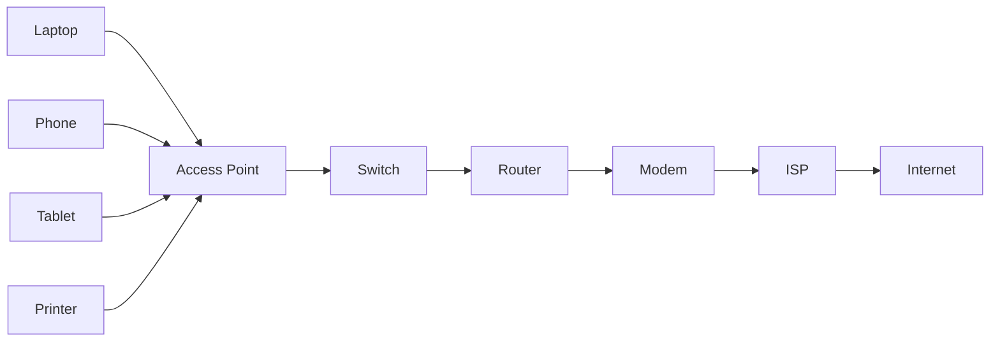
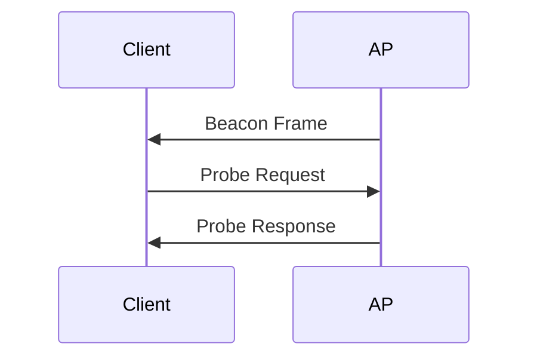
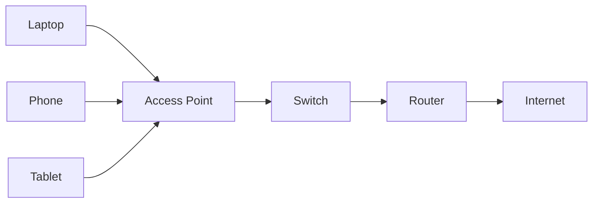
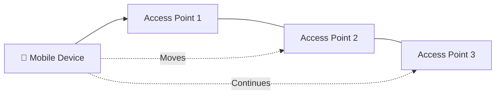

# 📡 Access Point (AP)

> *An Access Point (AP) extends a wired network into the wireless world, allowing devices such as laptops, smartphones, tablets, and IoT devices to connect using Wi-Fi instead of Ethernet cables.*

---
<div align="center">


-informational?style=for-the-badge)


</div>

---

# 📖 Table of Contents

- [Previously in this Roadmap](#-previously-in-this-roadmap)
- [Why Do We Need an Access Point?](#-why-do-we-need-an-access-point)
- [What is an Access Point?](#-what-is-an-access-point)
- [Wireless vs Wired Networking](#-wireless-vs-wired-networking)
- [Basic Wireless Terminology](#-basic-wireless-terminology)
- [Access Point and the OSI Model](#-access-point-and-the-osi-model)
- [Learning Objectives](#-learning-objectives)

---

# 📚 Previously in this Roadmap

In the previous lesson, you learned how a **modem** connects your local network to an **Internet Service Provider (ISP)** by converting digital information into signals that can travel across different communication media.

At this point, your network has everything it needs to reach the Internet:

- A **Switch** connects devices within the Local Area Network (LAN).
- A **Router** connects different IP networks.
- A **Gateway** enables communication between different technologies.
- A **Modem** provides Internet connectivity through the ISP.

However, there is still one limitation.

Every device must be connected using an **Ethernet cable**.

For a desktop computer, this may be acceptable.

But what about:

- Laptops
- Smartphones
- Tablets
- Smart TVs
- Wireless printers
- Security cameras
- Smart home devices

Running Ethernet cables to every device would quickly become expensive, inconvenient, and sometimes impossible.

Modern networks need a way to provide the same network access **without requiring physical cables**.

That is where the **Access Point (AP)** comes in.

---

# 🌍 Why Do We Need an Access Point?

Imagine walking into a university campus.

Hundreds of students are using:

- Laptops
- Smartphones
- Tablets

At the same time.

Now imagine trying to connect every one of those devices with an Ethernet cable.

The result would be:

- Thousands of cables
- Limited mobility
- Difficult installation
- High maintenance costs

Wireless networking solves this problem by allowing devices to communicate through **radio waves** instead of physical cables.

An Access Point acts as the bridge between the **wired network** and **wireless devices**.

It extends the reach of the existing network without changing how the rest of the infrastructure operates.

---

> **💡 Key Idea**
>
> A **Switch** connects devices using Ethernet cables.
>
> An **Access Point** connects devices using Wi-Fi.
>
> Both ultimately connect devices to the same network.

---

<!--
Image Description:
Illustrate a modern office where laptops, smartphones, tablets, printers, and IoT devices connect wirelessly to a central Access Point. The Access Point is connected by an Ethernet cable to a switch, which then connects to a router and the Internet. Show Wi-Fi coverage radiating from the Access Point.

Suggested Search Keywords:
enterprise wireless access point diagram
office Wi-Fi infrastructure
wireless LAN architecture
-->

<p align="center">

</p>

---

# 📶 What is an Access Point?

An **Access Point (AP)** is a networking device that allows wireless devices to join a wired Local Area Network (LAN).

Instead of plugging into an Ethernet cable, devices communicate with the Access Point using **Wi-Fi (IEEE 802.11)**.

The Access Point then forwards that traffic onto the wired network through its Ethernet connection.

In simple terms:

> **An Access Point extends a wired network into the wireless world.**

Unlike a router, an Access Point does **not** usually make routing decisions.

Its primary responsibility is to provide wireless connectivity.

---

## 🔄 How an Access Point Fits into a Network

A typical wireless network looks like this:



Notice that the Access Point is connected to the switch using an Ethernet cable.

Only the **client devices** communicate wirelessly.

---

<!--
Image Description:
Create a layered network diagram showing laptops, smartphones, tablets, printers, and IoT devices connecting wirelessly to an Access Point. The Access Point connects via Ethernet to a switch, followed by a router, modem, ISP, and the Internet.

Suggested Search Keywords:
wireless access point topology
Wi-Fi network architecture diagram
-->

<p align="center">

</p>

---

# 🔌 Wireless vs Wired Networking

Both wired and wireless networks provide access to the same resources.

The difference lies in **how data travels**.

| Wired Network | Wireless Network |
|----------------|------------------|
| Uses Ethernet cables | Uses radio waves |
| Physical connection required | No physical cable required |
| Higher reliability | Greater mobility |
| Less interference | More susceptible to interference |
| Typically lower latency | Slightly higher latency |

Neither approach is universally better.

Modern organizations commonly use **both**.

Desktop computers and servers often remain wired, while mobile devices rely on wireless connectivity.

---

# 📖 Basic Wireless Terminology

Before learning how Wi-Fi works, it helps to understand a few common terms.

| Term | Meaning |
|------|----------|
| **SSID** | The name of a wireless network shown to users. |
| **BSSID** | The unique MAC address that identifies an individual Access Point's radio. |
| **Client** | A wireless device such as a laptop, smartphone, or tablet. |
| **Coverage Area** | The physical area where devices can communicate with an Access Point. |
| **Wi-Fi** | A family of wireless networking technologies based on IEEE 802.11 standards. |

These terms will appear throughout the remainder of this lesson.

---

<!--
Image Description:
Illustrate a Wi-Fi coverage cell with an Access Point at the center. Show multiple client devices connected within the coverage area. Label the SSID, BSSID, clients, and coverage boundary.

Suggested Search Keywords:
Wi-Fi coverage cell SSID BSSID diagram
wireless LAN basic terminology infographic
-->

<p align="center">

</p>

---

# 🌐 Access Point and the OSI Model

An Access Point primarily operates at the **Data Link Layer (Layer 2)** of the OSI model.

It receives wireless frames from client devices, processes them according to the IEEE 802.11 standard, and bridges them onto the wired Ethernet network.


Although wireless communication uses radio waves, the Access Point's main function is forwarding **Layer 2 frames** between wireless and wired networks.

---

> **📝 Remember**
>
> An Access Point does **not** replace a router or modem.
>
> It extends an existing wired network by providing **wireless access** to client devices.

---

# 🎯 Learning Objectives

After completing this lesson, you should be able to:

- Explain why Access Points are needed.
- Describe how an Access Point extends a wired network.
- Differentiate between wired and wireless networking.
- Identify common wireless networking terminology.
- Understand where an Access Point operates within the OSI model.
- Prepare to learn how wireless devices discover, authenticate, and communicate with an Access Point.

---

# ⚙️ How an Access Point Works

Although connecting to a Wi-Fi network appears almost instantaneous, several networking operations occur before a device can communicate with the rest of the network.

Whenever a laptop, smartphone, or tablet joins a wireless network, it must:

1. Discover available wireless networks.
2. Select an Access Point.
3. Authenticate itself.
4. Associate with the Access Point.
5. Obtain network configuration.
6. Exchange data with other devices and the Internet.

These steps happen automatically and usually take only a few seconds.

---

## 📶 Step 1 — Discovering Wireless Networks

Before connecting, a wireless device must first determine which Wi-Fi networks are available.

Access Points periodically broadcast small management frames called **Beacon Frames**.

These frames advertise information such as:

- Network Name (SSID)
- Supported Wi-Fi standards
- Security type
- Supported data rates
- Channel information

When your laptop displays a list of nearby Wi-Fi networks, it is showing information learned from these beacon frames.

---

<!--
Image Description:
Create an illustration showing an Access Point broadcasting beacon frames in all directions. Multiple nearby devices (laptop, smartphone, tablet) detect the broadcast and display the available SSID.

Suggested Search Keywords:
Wi-Fi beacon frame diagram
wireless network discovery infographic
-->

<p align="center">

</p>

---

## 🔍 Step 2 — Scanning for Networks

Wireless clients discover networks in two different ways.

### Passive Scanning

The client listens for Beacon Frames transmitted by nearby Access Points.

This is the most common discovery method.

### Active Scanning

Instead of waiting, the client actively broadcasts a **Probe Request** asking whether a specific network is nearby.

Nearby Access Points reply with a **Probe Response**.



Both methods help devices identify available wireless networks.

---

## 🔐 Step 3 — Authentication

After selecting a wireless network, the client must prove that it is allowed to connect.

Depending on the network, authentication may involve:

- No authentication (Open Wi-Fi)
- WPA2-Personal password
- WPA3-Personal password
- Enterprise authentication (802.1X with RADIUS)

Successful authentication confirms that the client is permitted to access the wireless network.

---

> **💡 Analogy**
>
> Imagine arriving at a secure office building.
>
> Before entering, you show your ID card to the security guard.
>
> If your identity is verified, you are allowed inside.
>
> Wireless authentication works in a very similar way.

---

<!--
Image Description:
Illustrate a client device attempting to join a secure Wi-Fi network. Show the client sending authentication credentials to an Access Point, which verifies them before allowing access.

Suggested Search Keywords:
Wi-Fi authentication process diagram
WPA2 WPA3 authentication infographic
-->

<p align="center">

</p>

---

## 🤝 Step 4 — Association

Authentication alone does not complete the connection.

The client must also **associate** with the Access Point.

Association creates the logical relationship between the client device and the wireless network.

During this process, the Access Point:

- Registers the client
- Allocates wireless resources
- Tracks the client's connection
- Prepares to forward network traffic

Only after association can normal communication begin.

---

## 🌐 Step 5 — Obtaining Network Configuration

After association, the client still needs network settings.

Typically, the Access Point forwards the client's **DHCP request** to the network's DHCP server.

The client then receives:

- IP Address
- Subnet Mask
- Default Gateway
- DNS Server

These settings allow the device to communicate with other networks and the Internet.

---

## 📡 Step 6 — Data Communication

Once connected, normal communication begins.

The Access Point receives wireless frames from client devices and forwards them onto the wired Ethernet network.

Likewise, traffic arriving from the wired network is transmitted wirelessly to the appropriate client.



The Access Point acts as the bridge between the wireless and wired portions of the network.

---

<!--
Image Description:
Create a layered diagram illustrating the complete Wi-Fi connection process. Show a client discovering an Access Point, authenticating, associating, receiving an IP address via DHCP, and exchanging data with the Internet through the switch, router, and modem.

Suggested Search Keywords:
Wi-Fi connection process infographic
wireless client association DHCP diagram
-->

<p align="center">

</p>

---

# 🌐 Wireless Communication Concepts

Now that you understand the connection process, it's helpful to explore a few important concepts that appear in almost every wireless network.

---

## 📢 SSID (Service Set Identifier)

The **SSID** is the human-readable name of a wireless network.

Examples include:

- Home_WiFi
- Office_Network
- University_Guest

The SSID helps users identify the correct network when multiple Wi-Fi networks are available.

---

## 🆔 BSSID (Basic Service Set Identifier)

While the SSID identifies the **network name**, the **BSSID** uniquely identifies a specific Access Point.

The BSSID is usually the MAC address of the Access Point's wireless radio.

This distinction becomes important in large enterprise environments where many Access Points broadcast the same SSID.

---

## 📻 Wireless Channels

Wi-Fi networks communicate using radio frequencies divided into **channels**.

Using different channels helps reduce interference between nearby Access Points.

For example:

- 2.4 GHz provides fewer non-overlapping channels.
- 5 GHz provides many more available channels.
- 6 GHz (Wi-Fi 6E and Wi-Fi 7) provides even greater channel availability and reduced congestion.

Choosing appropriate channels improves wireless performance.

---

## 📡 Coverage Area

Every Access Point has a limited wireless coverage area.

Coverage depends on factors such as:

- Walls
- Floors
- Building materials
- Radio interference
- Antenna design
- Transmit power

As the client moves farther away, signal strength gradually decreases.

---

<!--
Image Description:
Illustrate three neighboring Access Points with overlapping Wi-Fi coverage areas. Label each AP with its SSID, BSSID, and wireless channel. Show a mobile client moving between coverage areas.

Suggested Search Keywords:
wireless coverage overlap BSSID SSID channels diagram
enterprise Wi-Fi cell design
-->

<p align="center">

</p>

---

> **📝 Remember**
>
> Connecting to Wi-Fi involves much more than simply entering a password.
>
> Behind every successful wireless connection are multiple networking processes including **network discovery, authentication, association, DHCP configuration, and frame forwarding**.
>
> Understanding these steps provides the foundation for wireless security, troubleshooting, and enterprise Wi-Fi design.

---

# 📶 Wi-Fi Standards (IEEE 802.11)

Wireless networking has evolved significantly over the past two decades.

As more devices began using Wi-Fi and applications demanded higher speeds, better reliability, and improved efficiency, new wireless standards were developed.

Each new generation built upon the previous one by increasing performance, improving security, and supporting more connected devices.

---

## 📜 Evolution of Wi-Fi Standards

The following table summarizes the most common Wi-Fi standards you are likely to encounter.

| Standard | Common Name | Frequency Band | Primary Improvement |
|-----------|-------------|----------------|---------------------|
| 802.11a | Wi-Fi 1 | 5 GHz | Higher speeds, less interference |
| 802.11b | Wi-Fi 2 | 2.4 GHz | Lower cost, wider adoption |
| 802.11g | Wi-Fi 3 | 2.4 GHz | Combined speed with compatibility |
| 802.11n | Wi-Fi 4 | 2.4 & 5 GHz | MIMO, improved speed and range |
| 802.11ac | Wi-Fi 5 | 5 GHz | Gigabit-class wireless speeds |
| 802.11ax | Wi-Fi 6 | 2.4 & 5 GHz | Better efficiency in crowded environments |
| 802.11ax (6 GHz) | Wi-Fi 6E | 6 GHz | Additional spectrum and reduced congestion |
| 802.11be | Wi-Fi 7 | 2.4, 5 & 6 GHz | Extremely high throughput and lower latency |

Notice that modern Wi-Fi standards focus not only on **speed**, but also on handling **large numbers of connected devices efficiently**.

---

<!--
Image Description:
Create a horizontal timeline showing the evolution of Wi-Fi standards from 802.11a through Wi-Fi 7. Include release progression, supported frequency bands, and major improvements such as MIMO, OFDMA, and 6 GHz support.

Suggested Search Keywords:
Wi-Fi standards timeline infographic
IEEE 802.11 evolution diagram
-->

<p align="center">

</p>

---

# 📡 Understanding Wi-Fi Frequency Bands

Wireless networks communicate using radio frequencies.

Modern Wi-Fi primarily operates in three frequency bands.

---

## 📻 2.4 GHz

The 2.4 GHz band provides:

- Longer range
- Better wall penetration
- Wider device compatibility

However, it is also the most crowded band because many household devices use it, including Bluetooth devices, microwave ovens, and cordless phones.

---

## 📶 5 GHz

The 5 GHz band offers:

- Higher throughput
- Lower interference
- More available channels

The trade-off is reduced range compared to 2.4 GHz.

---

## 🚀 6 GHz

The newest Wi-Fi generation introduces the 6 GHz band.

Advantages include:

- More wireless spectrum
- Less congestion
- Wider channels
- Lower latency
- Higher performance

This band is primarily used by Wi-Fi 6E and Wi-Fi 7 devices.

---

## 📊 Frequency Band Comparison

| Feature | 2.4 GHz | 5 GHz | 6 GHz |
|-----------|----------|--------|--------|
| Range | Excellent | Good | Moderate |
| Maximum Speed | Moderate | High | Very High |
| Wall Penetration | Excellent | Moderate | Lower |
| Interference | High | Lower | Very Low |
| Typical Usage | Home & IoT | Offices & Homes | High-density environments |

---

<!--
Image Description:
Illustrate the coverage characteristics of the 2.4 GHz, 5 GHz, and 6 GHz frequency bands. Show that lower frequencies travel farther and penetrate walls better, while higher frequencies provide greater speed but shorter range.

Suggested Search Keywords:
2.4 GHz vs 5 GHz vs 6 GHz infographic
Wi-Fi frequency comparison diagram
-->

<p align="center">

</p>

---

# 🏢 Types of Access Points

Not every Access Point is designed for the same environment.

The type of Access Point selected depends on factors such as network size, management requirements, user density, and deployment location.

---

## 🏠 Standalone Access Point

A standalone Access Point operates independently.

Characteristics:

- Easy to install
- Suitable for homes and small offices
- Configured individually
- Limited scalability

---

## 🏢 Controller-Based Access Point

Large organizations often manage dozens or even hundreds of Access Points.

Instead of configuring each device separately, they use a **Wireless LAN Controller (WLC)**.

Advantages include:

- Centralized management
- Consistent configuration
- Easier firmware updates
- Simplified monitoring

---

## ☁️ Cloud-Managed Access Point

Cloud-managed Access Points are administered through a web portal.

Network administrators can:

- Configure devices remotely
- Monitor network health
- Push updates
- View analytics

This approach is increasingly popular in distributed organizations.

---

## 🌐 Mesh Access Point

Mesh Access Points communicate with one another wirelessly.

Instead of every AP requiring its own Ethernet cable, multiple APs work together to extend wireless coverage.

Mesh networking is commonly used in:

- Homes
- Hotels
- Campuses
- Warehouses

---

## 🌳 Outdoor Access Point

Outdoor Access Points are built for harsh environments.

Typical deployments include:

- Stadiums
- Parks
- University campuses
- Industrial sites

They are designed to withstand rain, dust, temperature changes, and other environmental conditions.

---

<!--
Image Description:
Create a comparison infographic showing Standalone, Controller-Based, Cloud-Managed, Mesh, and Outdoor Access Points. Illustrate the environments where each type is commonly deployed.

Suggested Search Keywords:
types of wireless access points infographic
enterprise Wi-Fi deployment diagram
-->

<p align="center">

</p>

---

> **📝 Remember**
>
> Modern Wi-Fi is much more than faster wireless networking.
>
> Newer standards improve efficiency, reduce interference, support more devices, and provide better performance in busy environments.
>
> Likewise, different types of Access Points are designed to meet the needs of different network sizes and deployment scenarios.

---

# ✅ Advantages of Access Points

Wireless networking has transformed how people connect to computer networks.

Instead of being limited by physical cables, users can move freely while remaining connected to the same network.

This flexibility has made Access Points an essential part of modern homes, businesses, schools, hospitals, airports, and public spaces.

---

## 🚶 Mobility

One of the greatest advantages of an Access Point is **mobility**.

Users can move throughout the coverage area without disconnecting from the network.

Examples include:

- Walking through an office while on a video call
- Using a tablet in different classrooms
- Moving around a warehouse with a handheld scanner
- Accessing patient records throughout a hospital

Wireless networking allows communication without sacrificing productivity.

---

## 📈 Scalability

Expanding a wired network often requires installing additional Ethernet cables.

With wireless networking, adding new devices is usually much simpler.

Organizations can often expand coverage by deploying additional Access Points instead of running cables to every user.

---

## 💻 Support for Mobile Devices

Modern workplaces rely heavily on devices that cannot always remain connected by cable.

Examples include:

- Smartphones
- Tablets
- Laptops
- Barcode scanners
- IoT sensors
- Smart displays

Access Points allow these devices to communicate efficiently while remaining portable.

---

## 🌐 Flexible Deployment

Wireless networking makes it possible to provide connectivity in locations where installing cables would be expensive or impractical.

Examples include:

- Historic buildings
- Outdoor campuses
- Exhibition halls
- Temporary event venues

---

## 👥 Guest Network Support

Many organizations create separate wireless networks for visitors.

For example:

- Hotel guests
- Coffee shop customers
- University visitors
- Conference attendees

Guest networks provide Internet access while keeping internal business systems isolated.

---

<!--
Image Description:
Illustrate various real-world environments where Access Points provide wireless connectivity, including an office, university, hospital, airport, warehouse, and café. Show users moving freely while connected to Wi-Fi.

Suggested Search Keywords:
enterprise Wi-Fi deployment environments
wireless networking real world examples
-->

<p align="center">

</p>

---

# ⚠️ Limitations of Access Points

Although wireless networking offers tremendous flexibility, it also introduces challenges that wired networks experience less frequently.

Understanding these limitations helps network administrators design more reliable wireless infrastructures.

---

## 📡 Limited Range

Every Access Point has a finite coverage area.

As users move farther away:

- Signal strength decreases.
- Connection quality may decline.
- Data throughput may be reduced.

Deploying additional Access Points is often necessary to provide complete coverage.

---

## 🧱 Physical Obstacles

Wireless signals weaken as they pass through objects.

Common obstacles include:

- Concrete walls
- Metal structures
- Glass
- Elevators
- Floors and ceilings

These materials absorb or reflect radio waves, reducing signal quality.

---

## 📻 Radio Interference

Wireless communication shares radio frequencies with many other devices.

Potential sources of interference include:

- Neighboring Wi-Fi networks
- Bluetooth devices
- Microwave ovens
- Wireless cameras
- Baby monitors

Proper channel planning helps reduce interference.

---

## 👥 Shared Bandwidth

Unlike a dedicated Ethernet cable, wireless devices share the available bandwidth of an Access Point.

As more users connect:

- Throughput per device may decrease.
- Congestion increases.
- Latency may rise.

High-density environments often require multiple Access Points to distribute client traffic.

---

## 🔋 Environmental Factors

Signal quality can also be affected by:

- Weather (outdoor deployments)
- Building design
- Antenna placement
- Device orientation

Professional wireless site surveys help optimize Access Point placement.

---

# 🚶 Roaming Between Access Points

Large organizations rarely rely on a single Access Point.

Instead, they deploy many Access Points with overlapping coverage areas.

This allows wireless devices to **roam** from one Access Point to another without manually reconnecting.

For example:

- Walking through a university campus
- Moving between hospital wards
- Traveling through an airport terminal

Your device automatically connects to the Access Point providing the strongest and most reliable signal.



Roaming provides a seamless wireless experience, especially for voice calls, video conferencing, and mobile applications.

---

<!--
Image Description:
Create an illustration showing a mobile user walking through a building while automatically roaming between three overlapping Access Points. Display overlapping Wi-Fi coverage cells and arrows showing the client's movement.

Suggested Search Keywords:
Wi-Fi roaming between access points
wireless roaming infographic
enterprise wireless coverage overlap
-->

<p align="center">

</p>

---

# 💡 Best Practices for Access Point Placement

Proper placement is just as important as choosing the right Access Point.

General recommendations include:

- Position Access Points near the center of the coverage area.
- Avoid placing them behind thick concrete or metal walls.
- Minimize interference from other electronic devices.
- Use multiple Access Points for large buildings instead of increasing transmit power.
- Perform wireless site surveys before large deployments.

Good placement improves both performance and user experience.

---

> **📝 Remember**
>
> Wireless networking offers flexibility and mobility that wired networks cannot provide.
>
> However, successful Wi-Fi deployments require careful planning to address coverage, interference, client density, and roaming.
>
> Understanding these trade-offs is essential before learning how wireless networks are secured.

---

# 🛡️ Cybersecurity Perspective

Wireless networking offers tremendous convenience, but unlike Ethernet cables, **radio waves travel through the air**.

Anyone within range of a wireless network can potentially detect its signals.

For this reason, wireless networks require strong security mechanisms to ensure that only authorized users can connect and that transmitted data remains confidential.

Without proper security, attackers may intercept traffic, impersonate legitimate networks, or gain unauthorized access.

Understanding how wireless networks are protected is a fundamental skill for every cybersecurity professional.

---

## 🔐 WPA2 and WPA3

Modern Wi-Fi networks typically use one of two security standards:

- **WPA2 (Wi-Fi Protected Access 2)**
- **WPA3 (Wi-Fi Protected Access 3)**

These protocols provide:

- User authentication
- Encryption of wireless traffic
- Protection against unauthorized access
- Secure communication between clients and the Access Point

For most modern environments, **WPA3** is recommended because it offers stronger protection against password-based attacks and improves security for public Wi-Fi networks.

---

<!--
Image Description:
Create a comparison infographic showing an open Wi-Fi network, a WPA2-protected network, and a WPA3-protected network. Highlight authentication, encryption, and the increasing level of security provided by each.

Suggested Search Keywords:
WPA2 vs WPA3 infographic
wireless security comparison
-->

<p align="center">

</p>

---

## 🌐 Open Wi-Fi Networks

Not every wireless network requires authentication.

Examples include:

- Coffee shops
- Airports
- Hotels
- Shopping malls

These are known as **Open Wi-Fi Networks**.

Because they do not encrypt traffic by default, users should avoid transmitting sensitive information unless additional protections—such as HTTPS or a VPN—are in use.

Open networks provide convenience but significantly reduce security.

---

## 🚨 Rogue Access Points

A **Rogue Access Point** is an unauthorized wireless device connected to an organization's network.

Examples include:

- An employee installing a personal Wi-Fi router.
- An unauthorized Access Point connected to an office switch.
- A forgotten wireless device left connected after testing.

Rogue Access Points bypass normal security controls and may expose internal systems to unauthorized users.

For this reason, organizations regularly scan for unauthorized wireless devices.

---

## 🎭 Evil Twin Attack

An **Evil Twin** is a fake wireless network created to impersonate a legitimate Access Point.

For example:

```text
Legitimate SSID:
Office_WiFi

Fake SSID:
Office_WiFi
```

A nearby user may unknowingly connect to the fake network instead of the legitimate one.

Once connected, an attacker may attempt to:

- Capture login credentials
- Monitor network traffic
- Redirect users to malicious websites
- Perform man-in-the-middle attacks

This is why users should always verify the wireless network before connecting.

---

<!--
Image Description:
Illustrate an Evil Twin attack. Show a legitimate Access Point and a malicious fake Access Point broadcasting the same SSID. A user's laptop mistakenly connects to the fake network while an attacker intercepts the communication.

Suggested Search Keywords:
evil twin Wi-Fi attack diagram
rogue access point infographic
-->

<p align="center">

</p>

---

## 🏢 Enterprise Authentication (802.1X)

Large organizations rarely rely on a shared Wi-Fi password.

Instead, they often use **IEEE 802.1X authentication** together with a **RADIUS server**.

This approach provides:

- Individual user accounts
- Centralized authentication
- Better auditing
- Easier access control
- Improved security

Instead of every employee sharing one password, each user authenticates using their own credentials.

---

## 📡 Wireless IDS and IPS

As you'll learn later in this roadmap, organizations also monitor wireless networks for suspicious activity.

Examples include:

- Rogue Access Points
- Unauthorized clients
- Wireless attacks
- Signal interference
- Suspicious authentication attempts

These tasks are commonly performed by:

- **Wireless Intrusion Detection Systems (WIDS)**
- **Wireless Intrusion Prevention Systems (WIPS)**

These technologies continuously monitor the wireless environment and help security teams detect threats before they become serious incidents.

---

## 🔗 Connections to Future Cybersecurity Topics

This chapter introduces concepts that will become increasingly important throughout your cybersecurity journey.

| Future Topic | How It Builds on This Chapter |
|--------------|-------------------------------|
| Firewall | Controls which network traffic is allowed or blocked |
| IDS | Detects suspicious network activity, including wireless threats |
| IPS | Automatically blocks malicious wireless traffic |
| Wireshark | Captures and analyzes wireless packets |
| Wireless Penetration Testing | Evaluates Wi-Fi security through controlled testing |
| SOC Operations | Monitors enterprise wireless environments for threats |
| Zero Trust | Applies identity verification before granting network access |

Understanding how wireless communication normally operates makes it much easier to recognize abnormal or malicious behavior.

---

# ⚠️ Beginner Mistakes

Many newcomers misunderstand how Wi-Fi works.

Common mistakes include:

❌ Thinking Wi-Fi and the Internet are the same thing.

❌ Assuming an Access Point is the same as a wireless router.

❌ Believing every Wi-Fi network is secure.

❌ Connecting to public Wi-Fi without considering security risks.

❌ Assuming signal strength always indicates Internet speed.

---

# 💡 Did You Know?

- Wi-Fi is based on the **IEEE 802.11** family of standards.
- Enterprise campuses may deploy hundreds or even thousands of Access Points.
- A single SSID can be broadcast by many Access Points simultaneously.
- Modern Wi-Fi 7 networks can deliver multi-gigabit wireless speeds under ideal conditions.
- Wireless roaming allows users to move between Access Points without manually reconnecting.

---

# ⏱️ 60-Second Revision

- An Access Point extends a wired network into a wireless one.
- Wireless devices communicate using radio waves rather than Ethernet cables.
- Clients discover networks using Beacon Frames and Probe Requests.
- Authentication and association occur before normal communication begins.
- Modern Wi-Fi uses standards such as Wi-Fi 6, Wi-Fi 6E, and Wi-Fi 7.
- Enterprise networks use multiple Access Points to provide seamless roaming.
- WPA2 and WPA3 help secure wireless communication.

---

# 📌 Key Takeaways

- Access Points provide wireless connectivity to existing wired networks.
- Wi-Fi clients follow a structured connection process before exchanging data.
- Different Wi-Fi standards improve speed, efficiency, and scalability.
- Enterprise wireless networks require careful planning and management.
- Wireless networking introduces unique security challenges that must be addressed through authentication, encryption, and monitoring.

---

# 🧠 Final Knowledge Check

### Question 1

What is the primary purpose of an Access Point?

<details>
<summary>Answer</summary>

An Access Point allows wireless devices to connect to an existing wired Local Area Network (LAN) using Wi-Fi.

</details>

---

### Question 2

What is the difference between an SSID and a BSSID?

<details>
<summary>Answer</summary>

The SSID is the human-readable network name, while the BSSID uniquely identifies a specific Access Point, typically using its wireless MAC address.

</details>

---

### Question 3

Name the main steps a wireless client performs before exchanging data.

<details>
<summary>Answer</summary>

The client discovers nearby networks, authenticates, associates with an Access Point, obtains network configuration (typically through DHCP), and then begins normal communication.

</details>

---

### Question 4

Why is WPA3 generally preferred over WPA2?

<details>
<summary>Answer</summary>

WPA3 provides stronger authentication mechanisms and improved protection against password-based attacks while enhancing the security of wireless communications.

</details>

---

### Question 5

What is an Evil Twin attack?

<details>
<summary>Answer</summary>

An Evil Twin attack uses a fake Access Point broadcasting the same SSID as a legitimate network to trick users into connecting, allowing attackers to intercept or manipulate their communications.

</details>

---

# 📚 Further Reading

Continue exploring related topics in this roadmap:

- **Switch.md** — Connecting devices within a Local Area Network
- **Router.md** — Routing packets between different IP networks
- **Modem.md** — Connecting your network to an Internet Service Provider
- **Firewall.md** *(Next Lesson)* — Controlling and filtering network traffic
- **Network Security** — Building secure and resilient network infrastructures

---

# 🗺️ Where You Are in the Roadmap

```text
Cybersecurity Roadmap

02-Networking

README.md
│
├── ✅ Network Devices Overview
│
├── ✅ Repeater
├── ✅ Hub
├── ✅ Bridge
├── ✅ Switch
├── ✅ Router
├── ✅ Gateway
├── ✅ Modem
│
├── 📍 Access Point (Current Lesson)
├── ⏭️ Firewall
├── ⏳ IDS
├── ⏳ IPS
└── ⏳ Load Balancer
```

---

# ➡️ Next Lesson

Throughout this chapter, you've learned how Access Points extend wired networks into the wireless world, allowing devices to communicate using Wi-Fi instead of Ethernet cables.

So far in this roadmap, every device has focused on **enabling communication**—whether by extending signals, forwarding frames, routing packets, translating protocols, connecting to an ISP, or providing wireless access.

The next step is equally important:

> **Not all network traffic should be allowed.**

Organizations must decide which connections are trusted, which are suspicious, and which should be blocked entirely.

That responsibility belongs to the **Firewall**.

In the next lesson, you'll learn how firewalls inspect network traffic, enforce security policies, filter packets, and serve as one of the first lines of defense against unauthorized access and cyber threats.

**Continue to the next lesson:** **[Firewall.md](Firewall.md)** →
