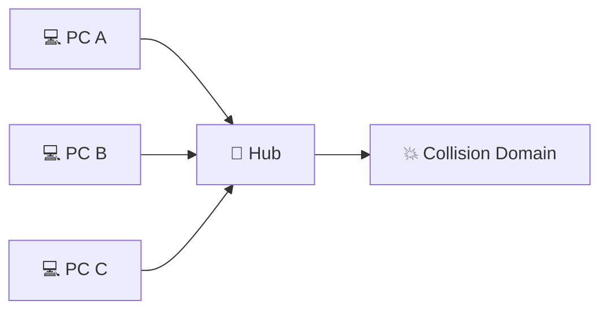
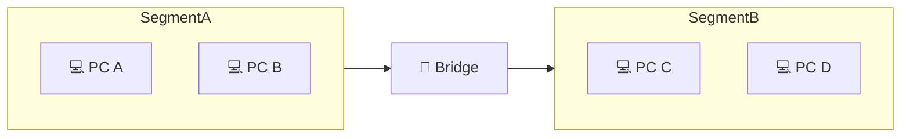
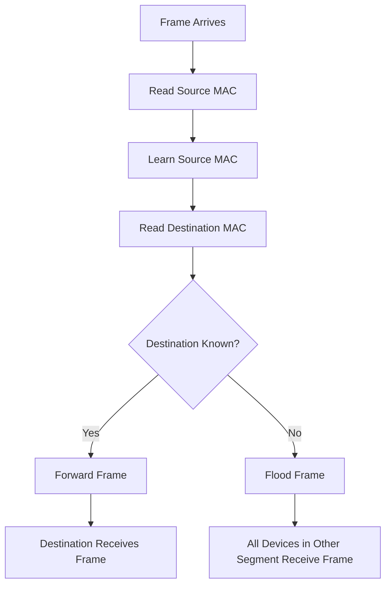
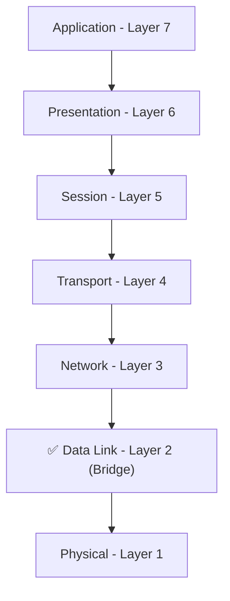
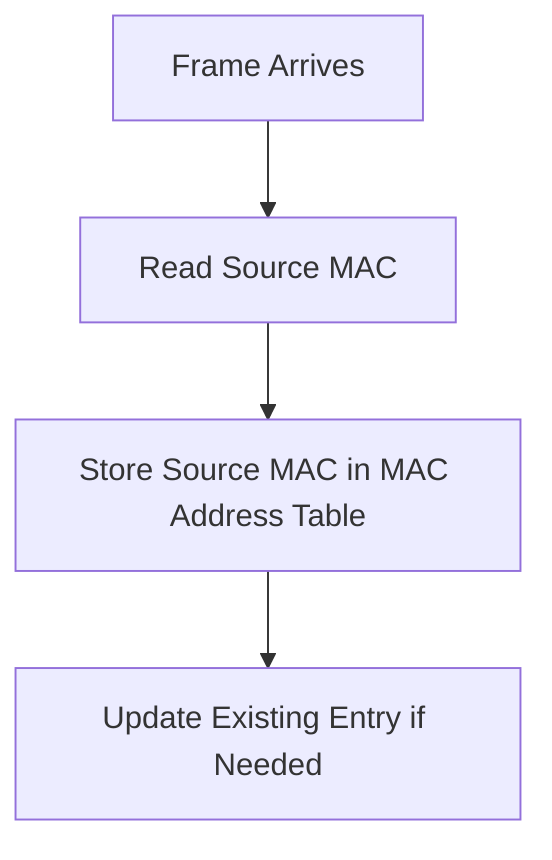
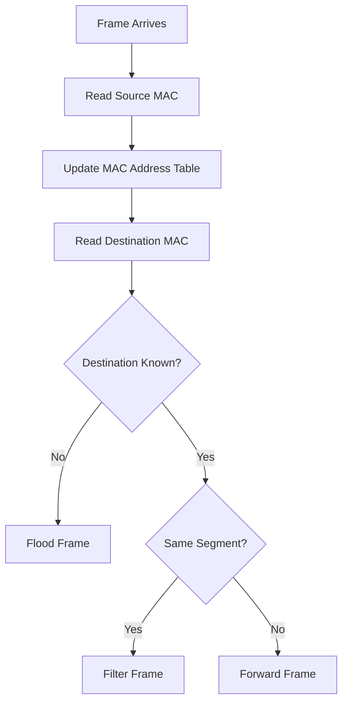
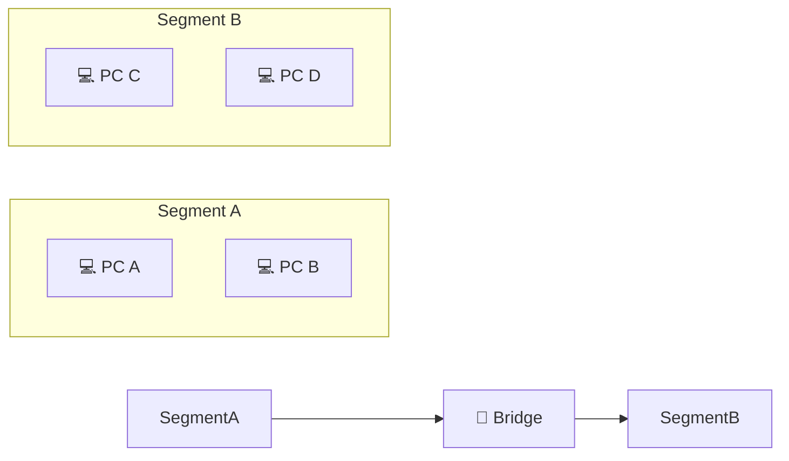

# 🌉 Bridge

> *Understanding how bridges intelligently forward network traffic, reduce collisions, and introduce Layer 2 decision-making in computer networks.*

<div align="center">


-informational?style=for-the-badge)


</div>

---

# 📑 Table of Contents

- [📚 Previously in This Roadmap](#-previously-in-this-roadmap)
- [📖 Introduction](#-introduction)
- [🤔 Why Do We Need a Bridge?](#-why-do-we-need-a-bridge)
- [🌍 Real-World Analogy](#-real-world-analogy)
- [🎯 Learning Objectives](#-learning-objectives)

---

# 📚 Previously in This Roadmap

In the previous lesson, you learned how a **Hub** connects multiple devices by broadcasting every incoming transmission to all connected ports. This simplified network design and allowed many computers to communicate through a central device.

However, hubs introduced two major problems.

First, every connected device received every transmission, even when the data was intended for only one computer. Second, because all devices shared the same communication medium, network collisions became increasingly common as traffic grew.

These limitations reduced both network performance and security.

To solve these problems, networking engineers developed a smarter device known as the **Bridge**.

Unlike a hub, a bridge does not blindly broadcast every frame. Instead, it examines network information and makes intelligent forwarding decisions.

---

# 📖 Introduction

Imagine a busy office divided into two departments.

If every announcement made in one department were broadcast to the entire building, employees in other departments would constantly be interrupted by conversations that had nothing to do with them.

The same problem existed in early computer networks.

Hubs forwarded every transmission to every connected device, creating unnecessary traffic, increasing collisions, and reducing overall efficiency.

Networks needed a device that could distinguish between traffic that should be forwarded and traffic that should remain within its own network segment.

The **Bridge** was designed to solve this challenge.

Unlike devices operating only at the Physical Layer, a bridge works at the **Data Link Layer (Layer 2)**, allowing it to examine **MAC addresses** and make forwarding decisions based on the destination of each frame.

This marked a major milestone in networking history—the transition from simple signal forwarding to **intelligent frame forwarding**.

---

# 🤔 Why Do We Need a Bridge?

A hub treats every transmission exactly the same.

Whenever a computer sends data, the hub broadcasts it to every connected device, regardless of who the intended recipient is.

As networks grew larger, this approach created several problems:

- More unnecessary network traffic
- Increased collisions
- Lower overall performance
- Reduced privacy because every device received every transmission

Clearly, networks needed a better solution.

Instead of sending every frame everywhere, what if a device could determine **where the frame actually needed to go?**

That is exactly what a bridge does.

By examining the **MAC address** contained in each Ethernet frame, a bridge can decide whether the frame should remain within the current network segment or be forwarded to another segment.

This simple idea dramatically improved network efficiency and laid the foundation for modern Ethernet switching.

> 💡 **Did You Know?**
>
> The bridge was one of the first networking devices capable of making forwarding decisions based on network addresses rather than simply repeating electrical signals.

---

# 🌍 Real-World Analogy

Imagine a large office building with two separate departments connected by a security door.

Employees working in Department A usually communicate only with people in Department A, while employees in Department B mostly communicate within their own department.

Instead of allowing everyone to walk freely between departments all day, a security guard stands at the connecting door.

The guard checks where each person needs to go.

- If the destination is in the same department, the person stays where they are.
- If the destination is in the other department, the guard allows them to pass through the door.

A bridge performs a very similar role in a network.

Rather than broadcasting every frame to every device, it examines the destination and forwards the frame only when necessary.


The bridge acts like an intelligent gatekeeper, allowing communication between network segments only when it is actually needed.

---

# 🎯 Learning Objectives

After completing this lesson, you will be able to:

- Explain why bridges were developed.
- Define what a bridge is and identify the OSI layer where it operates.
- Understand the concepts of network segmentation and collision domains.
- Describe how bridges learn and use MAC addresses.
- Explain how bridges make forwarding decisions.
- Compare bridges with hubs and switches.
- Identify the advantages and limitations of bridges.
- Understand the cybersecurity benefits of intelligent frame forwarding.
- Appreciate how bridges paved the way for modern Ethernet switches.

---

---

# 🌐 Understanding Collision Domains and Network Segmentation

Before learning how a bridge works, it's important to understand the networking problems it was designed to solve.

In the previous lesson, you learned that a **hub broadcasts every transmission to every connected device**. While this makes communication simple, it also means that all devices compete for the same communication medium.

As more devices begin transmitting data, collisions become increasingly common, reducing network performance.

To solve this problem, networks needed a way to divide large shared networks into **smaller, more efficient sections**.

This idea is called **network segmentation**.

---

# 💥 What Is a Collision Domain?

A **collision domain** is a part of a network where devices share the same communication medium.

If two devices transmit data at exactly the same time within the same collision domain, their signals interfere with one another, resulting in a **collision**.



In a hub-based network, **every connected device belongs to the same collision domain**.

As more devices communicate, collisions become more frequent.

> 💡 **Remember**
>
> More devices sharing the same communication medium generally means a higher chance of collisions.

---

# ✂️ What Is Network Segmentation?

**Network segmentation** is the process of dividing a large network into smaller sections called **segments**.

Instead of allowing every device to compete for the same communication medium, each segment handles its own local traffic.

This significantly improves network performance.



The bridge becomes the connection point between two network segments.

Instead of forwarding every frame, it forwards only the traffic that actually needs to cross between segments.

---

# 📈 Why Does Segmentation Improve Performance?

Imagine a company with two departments.

Most employees communicate only with colleagues in their own department.

Without segmentation, every conversation would be heard throughout the entire office.

With segmentation, local conversations remain within each department, while only necessary communication passes between departments.

Networks work in a very similar way.

By keeping local traffic within its own segment, a bridge reduces unnecessary transmissions and minimizes collisions.

---

# 🌉 What Is a Bridge?

A **Bridge** is a **Layer 2 (Data Link Layer)** networking device that connects two or more network segments and intelligently forwards Ethernet frames based on their **MAC addresses**.

Unlike a hub, which broadcasts every transmission, a bridge examines each frame before deciding whether it should be forwarded.

> 🎯 **Simple Definition**
>
> A **Bridge** is a Layer 2 device that learns MAC addresses and forwards frames only when necessary.

---

# ⚙️ How Does a Bridge Work?

Suppose **Computer A** wants to communicate with **Computer D**.

The bridge follows these basic steps:

1. Receives the Ethernet frame.
2. Reads the **source MAC address**.
3. Learns where that device is located.
4. Reads the **destination MAC address**.
5. Decides whether to forward or filter the frame.

Unlike a hub, the bridge does not blindly broadcast every transmission.

It makes a forwarding decision for each frame.


Only the necessary traffic crosses the bridge.

---

# 🔍 Inside the Bridge

The bridge follows a simple decision-making process every time a frame arrives.



This intelligent process allows the bridge to significantly reduce unnecessary network traffic.

---

# 📍 Where Does a Bridge Operate?

Unlike repeaters and hubs, a bridge operates at the **Data Link Layer (Layer 2)** of the OSI Model.



Because it operates at Layer 2, a bridge can understand Ethernet frames and read **MAC addresses**.

However, it cannot understand **IP addresses**, which belong to the Network Layer.

---

# 📊 Characteristics of a Bridge

| Characteristic | Description |
|---------------|-------------|
| OSI Layer | Layer 2 (Data Link) |
| Primary Function | Connect network segments |
| Reads Frames | ✅ Yes |
| Reads MAC Addresses | ✅ Yes |
| Reads IP Addresses | ❌ No |
| Learns Device Locations | ✅ Yes |
| Intelligent Forwarding | ✅ Yes |
| Reduces Collisions | ✅ Yes |
| Creates Multiple Collision Domains | ✅ Yes |

---

> ⚠ **Common Beginner Mistake**
>
> Many beginners think a bridge completely eliminates broadcasting.
>
> This is incorrect.
>
> A bridge forwards traffic intelligently, but it may still **flood unknown destination frames** until it learns where devices are located.

---

# ✅ Knowledge Check

1. What is a collision domain?
2. Why do hubs create large collision domains?
3. What is network segmentation?
4. At which OSI layer does a bridge operate?
5. What information does a bridge examine before forwarding a frame?
6. Why does a bridge reduce unnecessary traffic?
7. Why is a bridge considered more intelligent than a hub?

> 🎯 **Think About It**
>
> A bridge receives a frame destined for a device it has never seen before.
>
> How do you think it decides where to send that frame?
>
> The answer introduces one of the most important concepts in Ethernet networking: the **MAC Address Table**, which you'll explore in the next section.

---

# 🧠 The MAC Address Table

One of the biggest differences between a **Hub** and a **Bridge** is that a bridge can **learn**.

Instead of broadcasting every Ethernet frame to every connected device, a bridge gradually builds a **MAC Address Table**, sometimes called a **Forwarding Database (FDB)**.

This table helps the bridge remember **which devices are connected to which network segment**.

Think of it as the bridge's memory.

Instead of asking, *"Where should I send this frame?"* every time, the bridge can simply check its table and make an informed decision.

---

# 📖 What Is a MAC Address Table?

A **MAC Address Table** is a list that maps **MAC addresses** to the bridge's network ports or segments.

For example:

| MAC Address | Connected Segment |
|-------------|-------------------|
| AA-AA-AA-AA-AA-AA | Segment A |
| BB-BB-BB-BB-BB-BB | Segment A |
| CC-CC-CC-CC-CC-CC | Segment B |
| DD-DD-DD-DD-DD-DD | Segment B |

Whenever a frame arrives, the bridge consults this table before deciding what to do.

---

# 🎓 How Does a Bridge Learn?

A bridge does **not** come preconfigured with device addresses.

Instead, it learns automatically by observing incoming traffic.

Every Ethernet frame contains:

- A **Source MAC Address**
- A **Destination MAC Address**

When a frame enters the bridge, the bridge first records the **Source MAC Address**.

Over time, the MAC Address Table becomes more complete as additional devices communicate.



This process is called **MAC Learning**.

> 💡 **Did You Know?**
>
> Bridges and switches continuously update their MAC Address Tables as devices communicate. Entries that are not used for a period of time are automatically removed through a process called **aging**, ensuring the table reflects the current network.

---

# 🚦 How Does a Bridge Make Forwarding Decisions?

After learning the source MAC address, the bridge examines the **Destination MAC Address**.

It then performs one of three actions.

---

## 1️⃣ Forwarding

If the destination MAC address is known **and is located on another network segment**, the bridge forwards the frame.

```text
Segment A
PC A
   │
   ▼
Bridge
   │
   ▼
Segment B
PC D
```

Only the destination segment receives the frame.

This reduces unnecessary traffic on the rest of the network.

---

## 2️⃣ Filtering

If both the sender and the destination are located on the **same network segment**, the bridge does nothing.

The communication stays local.

```text
Segment A

PC A ─────────► PC B

Bridge
(No forwarding required)
```

Because the frame never crosses the bridge, unnecessary traffic is avoided.

This process is called **filtering**.

Filtering is one of the biggest reasons bridges improve network performance.

---

## 3️⃣ Flooding

Sometimes the destination MAC address is **not yet present** in the MAC Address Table.

In this situation, the bridge does not know where the destination device is located.

Instead of dropping the frame, it forwards the frame to **all other network segments**.

This process is known as **flooding**.

```text
Unknown Destination

        Frame
          │
          ▼
      🌉 Bridge
      /       \
Segment A   Segment B
          (Flood)
```

Once the destination device responds, the bridge learns its MAC address and updates its table.

Future frames can then be forwarded intelligently.

---

# 🔄 Complete Decision Process

The entire forwarding process can be summarized as follows.



This simple algorithm allows the bridge to dramatically reduce unnecessary network traffic compared to a hub.

---

# 📊 Hub vs Bridge Decision-Making

| Feature | Hub | Bridge |
|---------|-----|--------|
| Reads MAC Addresses | ❌ No | ✅ Yes |
| Learns Devices | ❌ No | ✅ Yes |
| Broadcasts Everything | ✅ Yes | ❌ No |
| Filters Local Traffic | ❌ No | ✅ Yes |
| Forwards Intelligently | ❌ No | ✅ Yes |
| Creates Multiple Collision Domains | ❌ No | ✅ Yes |

---

# 🌍 Real-World Analogy

Imagine a receptionist working in a large office building.

At first, the receptionist does not know where every employee sits.

Whenever a visitor arrives asking for someone, the receptionist may need to ask around.

As the day goes on, the receptionist learns where everyone works.

Soon, visitors can be directed immediately to the correct office without disturbing the rest of the building.

A bridge behaves in much the same way.

It **learns**, **remembers**, and **forwards traffic only where it needs to go**.

---

> ⚠ **Common Beginner Mistake**
>
> Many beginners think a bridge knows every device on the network as soon as it is powered on.
>
> This is incorrect.
>
> A bridge starts with an **empty MAC Address Table** and gradually learns device locations by observing network traffic.

---

# ✅ Knowledge Check

1. What is the purpose of a MAC Address Table?
2. How does a bridge learn MAC addresses?
3. What information is stored in the MAC Address Table?
4. What is the difference between **forwarding**, **filtering**, and **flooding**?
5. Why is filtering beneficial for network performance?
6. Why does a bridge flood frames for unknown destinations?
7. What happens after the bridge learns the destination device's MAC address?

> 🎯 **Think About It**
>
> A bridge has learned the locations of 100 devices on a network.
>
> A brand-new laptop is connected for the first time and immediately sends a frame.
>
> What new information will the bridge learn, and how will that change its forwarding decisions for future communications?

---

# 🏗️ Types of Bridges

As networking technology evolved, different types of bridges were developed to support various network architectures and communication standards.

Although modern Ethernet networks rely primarily on **switches**, understanding bridge types provides valuable historical context and explains how network segmentation evolved over time.

---

## 1️⃣ Transparent Bridge

A **Transparent Bridge** is the most common type of bridge used in Ethernet networks.

It operates automatically without requiring any configuration from connected devices.

The bridge learns MAC addresses by observing network traffic and builds its MAC Address Table dynamically.

### Characteristics

- Most common bridge type
- Used in Ethernet LANs
- Automatically learns MAC addresses
- Requires no configuration from end devices

> 💡 **Did You Know?**
>
> The forwarding behavior of modern Ethernet switches is based on the same principles originally developed for transparent bridges.

---

## 2️⃣ Source Route Bridge

A **Source Route Bridge** was primarily used in **IBM Token Ring** networks.

Unlike a transparent bridge, the complete communication path is determined by the sending device rather than by the bridge itself.

Because Token Ring networks are now largely obsolete, source route bridges are rarely encountered today.

### Characteristics

- Used in IBM Token Ring networks
- Sender specifies the communication path
- Rare in modern networking

---

## 3️⃣ Translational Bridge

Sometimes two networks use different communication standards.

A **Translational Bridge** connects these networks by converting frames from one protocol into another.

Historically, these bridges helped connect different LAN technologies during the early years of networking.

### Characteristics

- Connects different LAN technologies
- Converts frame formats
- Rarely used in modern Ethernet environments

---

# 🌍 Where Are Bridges Used?

Although dedicated bridge devices are uncommon today, the underlying technology is still widely used.

Historically, bridges were deployed in:

- 🏫 Schools and universities
- 🏢 Office LANs
- 🏭 Industrial control networks
- 🖥️ Enterprise Ethernet environments

Today, bridge technology exists inside many modern networking devices.

Examples include:

- Ethernet switches
- Wireless access points (wireless bridging)
- Virtual bridges in operating systems and hypervisors
- Software-defined networking (SDN) environments

> 📝 **Note**
>
> Even if you never see a standalone bridge, you'll regularly encounter devices that perform **bridging functions**.

---

# ✅ Advantages of Bridges

Bridges introduced several important improvements over hubs.

### Advantages

- Reduces unnecessary network traffic
- Creates multiple collision domains
- Learns device locations automatically
- Improves overall network performance
- Makes better use of available bandwidth
- Provides better privacy than broadcast-based communication
- Forms the foundation of modern Ethernet switching

---

# ⚠️ Limitations of Bridges

Although bridges represented a significant advancement, they also have limitations.

### Limitations

- Supports fewer ports than a switch
- Operates more slowly than modern switches
- Cannot route traffic between different IP networks
- Unknown destinations still require flooding
- Large networks eventually outgrow traditional bridge designs

These limitations motivated the development of high-performance Ethernet switches.

---

# 📊 Bridge vs Hub

| Feature | Hub | Bridge |
|---------|-----|--------|
| OSI Layer | Layer 1 | Layer 2 |
| Reads Frames | ❌ No | ✅ Yes |
| Reads MAC Addresses | ❌ No | ✅ Yes |
| Learns Devices | ❌ No | ✅ Yes |
| Broadcasts Every Frame | ✅ Yes | ❌ No |
| Intelligent Forwarding | ❌ No | ✅ Yes |
| Collision Domains | One | Multiple |
| Performance | Lower | Higher |
| Security | Lower | Better |

---

# 📊 Bridge vs Switch

| Feature | Bridge | Switch |
|---------|---------|---------|
| Typical Number of Ports | Few | Many |
| Forwarding Speed | Moderate | Very High |
| MAC Learning | ✅ Yes | ✅ Yes |
| Intelligent Forwarding | ✅ Yes | ✅ Yes |
| Collision Domains | Multiple | One Per Port |
| Used Today | Rare | Standard |

A modern **switch** can be thought of as a **high-speed multiport bridge**.

It performs the same basic Layer 2 functions but on a much larger scale and with significantly better performance.

---

# ⚠️ Common Beginner Mistakes

### ❌ "A bridge eliminates all broadcasts."

Incorrect.

Broadcast frames are still forwarded when required. Bridges mainly reduce **unnecessary unicast traffic**, not all broadcasts.

---

### ❌ "A bridge understands IP addresses."

Incorrect.

Bridges operate at **Layer 2**, meaning they examine **MAC addresses**, not IP addresses.

---

### ❌ "Bridges and routers perform the same job."

Incorrect.

A bridge connects **network segments within the same network**, while a router connects **different networks** using IP addresses.

---

### ❌ "Bridges are completely obsolete."

Not entirely.

Dedicated bridge hardware is uncommon, but **bridging technology remains a core function of modern Ethernet switches, wireless infrastructure, and virtualization platforms**.

---

# 📖 Mini Review

Before moving to the cybersecurity perspective, let's summarize what you've learned.

A bridge represents a major milestone in networking evolution.

Unlike repeaters and hubs, a bridge can:

- Learn device locations
- Examine MAC addresses
- Reduce unnecessary traffic
- Create multiple collision domains
- Improve network efficiency

Most importantly, the bridge introduced the concept of **intelligent Layer 2 forwarding**, which became the foundation for modern Ethernet switches.

---

# ✅ Knowledge Check

1. What are the three main types of bridges?
2. Which bridge type is most common in Ethernet networks?
3. Why are source route bridges rarely used today?
4. What is the purpose of a translational bridge?
5. Name three advantages of a bridge over a hub.
6. Why can't a bridge replace a router?
7. Why is a switch often described as a high-speed multiport bridge?

> 🎯 **Think About It**
>
> Imagine you're upgrading a small office that still uses a hub.
>
> Would installing a bridge improve the network?
>
> Or would a switch be a better long-term solution?
>
> Explain your reasoning based on everything you've learned so far.

---
---

# 🔐 Cybersecurity Perspective: Why Should Security Professionals Understand Bridges?

A bridge is **not** a firewall, intrusion detection system (IDS), or any other dedicated security device.

Its primary purpose is to **improve network performance** by intelligently forwarding Ethernet frames.

However, the way a bridge forwards traffic also provides **important security benefits** compared to a hub.

Understanding these benefits helps cybersecurity professionals appreciate how networking technologies evolved to support both **performance** and **confidentiality**.

---

# 🛡️ Reducing Unnecessary Traffic

Unlike a hub, which broadcasts every transmission to every connected device, a bridge forwards traffic **only when it is required**.

This means that devices located on one network segment do not automatically receive traffic intended for another segment.



Local traffic remains within its own segment whenever possible.

This reduces unnecessary network exposure.

---

# 👀 Improved Confidentiality

Because fewer devices receive each transmission, there are fewer opportunities for unauthorized systems to observe network traffic.

This does **not** make the network completely secure.

Broadcast traffic and unknown-destination frames may still cross the bridge, and sensitive information should always be protected using appropriate security measures such as encryption.

> 🎯 **Remember**
>
> A bridge improves **traffic isolation**, but it does **not** provide encryption or access control.

---

# 🕵️ Packet Sniffing Becomes More Difficult

In a hub-based network, every connected computer receives every transmission.

This makes packet capture straightforward.

A bridge changes this behavior.

Because traffic is forwarded only when necessary, devices located in other network segments usually **cannot observe local communications**.

Although packet sniffing is still possible under certain conditions, it becomes significantly more difficult than in a hub-based network.

---

# ⚠️ Security Limitations

While bridges improve network behavior, they should never be mistaken for security devices.

A bridge cannot:

- Block malicious traffic
- Detect malware
- Filter applications
- Inspect packet contents
- Enforce security policies
- Prevent unauthorized access

Those responsibilities belong to devices such as **firewalls**, **IDS**, **IPS**, and modern security appliances.

---

# 🌐 Why Does This Matter in Cybersecurity?

Studying bridges helps explain several important cybersecurity concepts:

- Why reducing unnecessary traffic improves confidentiality.
- Why network segmentation is an important security principle.
- Why intelligent forwarding is preferable to broadcasting.
- How modern switches inherited the core ideas of bridge technology.
- Why understanding Layer 2 communication is essential for penetration testers, SOC analysts, and digital forensics investigators.

Many Layer 2 attacks and defensive techniques make much more sense once you understand how bridges forward Ethernet frames.

---

# 🌍 Real-World Example

Imagine a company with two departments connected by a bridge.

Most communication stays within each department, while only necessary traffic crosses between them.

If an attacker compromises a computer in Department A, they are less likely to observe internal communications occurring entirely within Department B.

Although this is **not** complete network isolation, it reduces unnecessary exposure compared to a hub-based network where every transmission reaches every connected device.

---

> 💡 **Did You Know?**
>
> Modern Ethernet switches inherit the intelligent forwarding behavior introduced by bridges. This is one reason switched networks are both **more efficient** and **more secure** than traditional hub-based networks.

---

# 🧠 60-Second Revision

Let's quickly review the most important concepts from this lesson.

- A **Bridge** is a **Layer 2 (Data Link Layer)** networking device.
- Bridges divide networks into **multiple collision domains**, reducing unnecessary traffic.
- Bridges learn **MAC addresses** and store them in a **MAC Address Table**.
- Every incoming frame is either **forwarded**, **filtered**, or **flooded**, depending on the destination.
- Bridges improve network efficiency by forwarding only the traffic that needs to cross between network segments.
- Modern Ethernet switches are built upon the same fundamental principles introduced by bridges.

If you understand these six points, you've mastered the core concepts of network bridges.

---

# 📌 Key Takeaways

- ✅ A bridge operates at **OSI Layer 2 (Data Link Layer)**.
- ✅ Bridges examine **MAC addresses** to make forwarding decisions.
- ✅ They learn device locations automatically through MAC learning.
- ✅ Bridges reduce collisions by creating multiple collision domains.
- ✅ They improve network efficiency by filtering unnecessary traffic.
- ✅ Bridge technology became the foundation of modern Ethernet switches.

---

# 🎓 Final Knowledge Check

Test your understanding before moving on.

1. Why were bridges developed?
2. How does a bridge differ from a hub?
3. What is the purpose of a MAC Address Table?
4. Explain the difference between **forwarding**, **filtering**, and **flooding**.
5. Why do bridges reduce network collisions?
6. At which OSI layer does a bridge operate?
7. Why can't a bridge understand IP addresses?
8. How does a bridge improve confidentiality compared to a hub?
9. Why is a bridge not considered a security device?
10. Why is a switch often described as a **multiport bridge**?

> 🎯 **Scenario Challenge**
>
> A company currently uses a hub to connect two busy office departments. Employees complain about poor performance, and the security team is concerned that every workstation can observe unnecessary network traffic.
>
> - Which networking device would improve this situation?
> - How would it reduce collisions?
> - How would it improve confidentiality?
> - Why would a switch be an even better long-term solution?

---

# 📚 Further Reading

Continue exploring the evolution of intelligent networking devices.

| Lesson | Description |
|---------|-------------|
| **[Switch](Switch.md)** | Learn how switches expand upon bridge technology to provide dedicated collision domains, intelligent forwarding, and high-performance Ethernet communication. |
| **[Router](Router.md)** | Discover how routers connect different networks using IP addresses rather than MAC addresses. |
| **[Choosing the Right Network Device](Choosing%20the%20Right%20Network%20Device.md)** | Compare networking devices and learn when each one should be used. |

---

# 🗺️ Where You Are in the Roadmap

```text
Cybersecurity Roadmap

02-Networking

README.md
│
├── ✅ Network Devices Overview
│
├── ✅ Repeater
├── ✅ Hub
├── ✅ Bridge (Current Lesson)
│
├── ⏭️ Switch
├── ⏳ Router
├── ⏳ Gateway
├── ⏳ Modem
├── ⏳ Access Point
├── ⏳ Firewall
├── ⏳ IDS
├── ⏳ IPS
└── ⏳ Load Balancer
```

---

# ➡️ Next Lesson: [🔀 Switch](Switch.md)

You've now learned how a bridge introduced **intelligent Layer 2 forwarding**, reducing unnecessary traffic and improving network performance by learning MAC addresses.

However, traditional bridges supported only a small number of network segments and could not efficiently meet the demands of rapidly growing Ethernet networks.

To overcome these limitations, engineers developed the **Ethernet Switch**—a high-speed, multiport bridge capable of making intelligent forwarding decisions for dozens or even hundreds of devices simultaneously.

In the next lesson, you'll learn:

- Why switches replaced bridges in modern LANs
- How switches build and maintain MAC Address Tables
- Why each switch port forms its own collision domain
- How full-duplex communication eliminates collisions
- Why switches became the standard networking device in modern Ethernet

By the end of the next lesson, you'll understand why nearly every wired Local Area Network today is built around **Ethernet switches** and how they became one of the most important devices in computer networking.

---

> 🎉 **Congratulations!**
>
> You have completed another major milestone in your networking journey. More importantly, you've taken the first step into **intelligent networking**, where devices no longer simply repeat signals—they analyze, learn, and make forwarding decisions. These concepts form the foundation of modern Ethernet networks and prepare you perfectly for the next lesson on **switches**, one of the most important networking devices you'll encounter in cybersecurity and IT.
