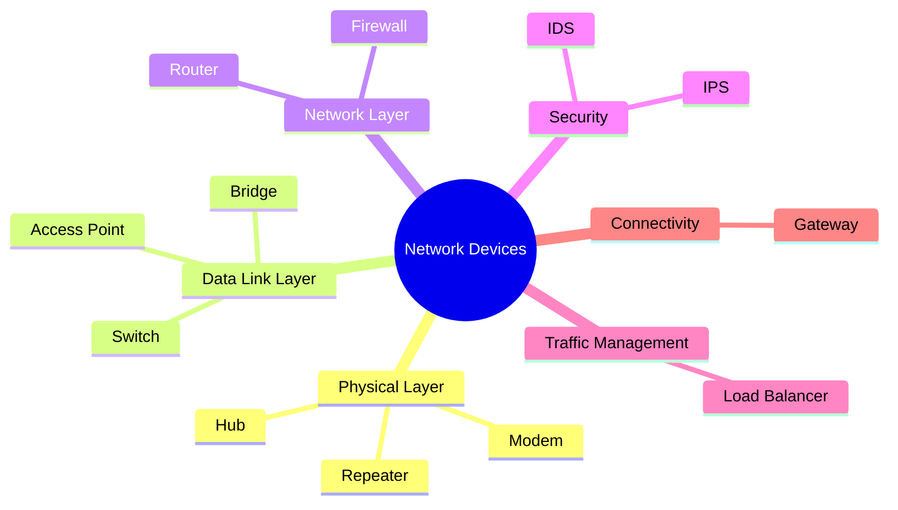
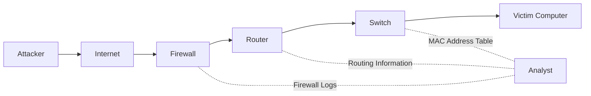

# 🌐 Network Devices

> *Understanding the physical and logical devices that make modern computer networks possible.*

<div align="center">


</div>

---

## 📖 Module Overview

Every device connected to a network has a specific role. Some devices simply regenerate signals, while others intelligently forward data, connect different networks, enforce security policies, or monitor traffic for suspicious activity.

In this chapter, you'll build a solid understanding of the most common networking devices—from simple repeaters and hubs to routers, firewalls, intrusion detection systems (IDS), intrusion prevention systems (IPS), and load balancers. Rather than memorizing their names, you'll learn **why each device exists, how it works, where it operates in the OSI Model, and why cybersecurity professionals must understand it.**

By the end of this chapter, you'll not only recognize different network devices but also understand how they work together to create reliable, scalable, and secure networks.

---

# 🏗️ Understanding the Roles of Network Devices

Imagine trying to run an entire city with only one type of worker. Police officers would also have to build roads, firefighters would deliver mail, doctors would manage traffic, and engineers would teach in schools. Although everyone would be working hard, the city would quickly become disorganized and inefficient.

Computer networks face a similar challenge.

A modern network performs many different tasks simultaneously. It must move data between devices, connect different networks, provide wireless access, improve performance, detect cyber threats, enforce security policies, and ensure reliable communication. Expecting a single device to perform all these responsibilities would make the network slow, difficult to manage, and less secure.

Instead, networks are built using **specialized devices**, each designed to perform a specific role efficiently. Some devices focus on moving data within the same network, while others connect different networks together. Some extend wireless connectivity, while others inspect traffic to detect or block malicious activity.

This specialization is one of the reasons modern networks are fast, scalable, reliable, and secure.

> 💡 **Did You Know?**
>
> Large enterprise networks often contain **hundreds or even thousands of network devices**, each performing a specific function as part of a much larger infrastructure.

---

# 🤝 Teamwork Instead of One Super Device

Network devices rarely work alone.

When you browse a website, send an email, or stream a video, your data doesn't travel through a single device. Instead, it passes through multiple devices, each responsible for a different part of the journey.

Think of it as a relay race.

Each runner has one job: receive the baton, complete their section of the race, and pass it to the next runner. The runners succeed because they work together—not because one runner does everything.

Network devices operate in much the same way.


In this example:

- Your **computer** creates the data.
- The **switch** forwards it within the local network.
- The **router** sends it to another network.
- The **firewall** inspects and filters the traffic according to security rules.
- The **Internet** carries the traffic toward its destination.
- The **web server** receives the request and sends back a response.

Although the process appears simple from the user's perspective, multiple devices are working together behind the scenes within milliseconds.

---

<!--
Image Description:
A modern office network showing multiple computers connected to a switch, which connects to a router, then to a firewall, followed by a modem and the Internet. Include a wireless access point connected to the switch, allowing laptops and smartphones to join the network. Use arrows to illustrate the flow of data from a user device to an external web server. Clearly label each network device.

Suggested Search Keywords:
office network topology
network devices diagram
router switch firewall topology
enterprise network illustration
-->

<p align="center">

</p>

---

# 🧩 Every Device Has a Purpose

Each network device is designed to solve a particular networking problem.

Rather than trying to perform every possible task, each device specializes in one primary responsibility. This makes networks easier to expand, troubleshoot, secure, and maintain.

| Device | Primary Responsibility |
|---------|------------------------|
| Repeater | Extends signal distance |
| Hub | Sends incoming data to every connected device |
| Bridge | Separates network segments to reduce unnecessary traffic |
| Switch | Delivers data to the correct device within a local network |
| Router | Connects different networks together |
| Gateway | Enables communication between different systems or protocols |
| Modem | Connects a local network to an Internet Service Provider (ISP) |
| Access Point | Provides wireless connectivity |
| Firewall | Filters network traffic based on security rules |
| IDS | Detects suspicious or malicious network activity |
| IPS | Detects and automatically blocks malicious traffic |
| Load Balancer | Distributes traffic across multiple servers |

> 📝 **Note**
>
> At this stage, you only need to understand the **purpose** of each device. In the following lessons, each device will be explored individually with detailed explanations, diagrams, real-world examples, and practical use cases.

---

# 🌐 How Devices Work Together

A network becomes powerful not because of one device, but because each device performs its own job efficiently.

For example, when you open your favorite website:

1. Your computer generates the request.
2. The switch forwards it within your local network.
3. The router decides where the request should go.
4. The firewall checks whether the traffic is allowed.
5. The modem communicates with your Internet Service Provider.
6. The request travels across the Internet.
7. The destination server processes the request and sends back a response.

Every step depends on a different device performing its specific role.

This cooperation allows modern networks to support millions of users simultaneously.

---

# 🔐 Cybersecurity Perspective

Understanding the role of each network device is essential in cybersecurity.

Security professionals don't just investigate computers—they investigate the entire network.

When analyzing a cyberattack, they need to know:

- Which device forwarded the traffic?
- Which router connected the affected networks?
- Which firewall allowed or blocked the connection?
- Which IDS detected suspicious activity?
- Which IPS prevented the attack?
- Which access point allowed the attacker to join the wireless network?

Without understanding the responsibilities of network devices, it becomes much more difficult to detect, analyze, and respond to security incidents.

As you progress through this chapter, you'll learn not only **how these devices work**, but also **how attackers abuse them and how defenders use them to protect networks**.

> 🎯 **Remember**
>
> Network devices are not isolated components—they form a cooperative system. Understanding their individual responsibilities is the first step toward understanding how modern networks operate and how cybersecurity professionals defend them.

---

# ✅ Knowledge Check

Before moving on, see if you can answer these questions without looking back.

1. Why can't a single network device perform every networking task?
2. How does specialization improve network performance and reliability?
3. Why do multiple network devices work together instead of independently?
4. Which device is responsible for connecting different networks?
5. Why is understanding the role of each network device important for cybersecurity professionals?

---

# 🛠️ Meet the Network Devices

Now that you understand **why networks rely on multiple specialized devices**, it's time to meet the devices that make modern communication possible.

Each device introduced in this section has a unique responsibility within a network. Some operate at the physical level, simply extending signals, while others make intelligent forwarding decisions, provide wireless connectivity, protect networks from cyber threats, or improve application availability.

Think of this section as a guided tour. You'll become familiar with each device's purpose before exploring it in detail in its dedicated lesson.

---

# 📋 Network Devices at a Glance

| Device | Primary Purpose | Typical OSI Layer | Deep Dive |
|---------|-----------------|-------------------|-----------|
| Repeater | Regenerates weak signals | Layer 1 | [Repeater.md](Repeater.md) |
| Hub | Broadcasts data to every connected device | Layer 1 | [Hub.md](Hub.md) |
| Bridge | Separates network segments | Layer 2 | [Bridge.md](Bridge.md) |
| Switch | Forwards frames using MAC addresses | Layer 2 | [Switch.md](Switch.md) |
| Router | Connects different IP networks | Layer 3 | [Router.md](Router.md) |
| Gateway | Connects different systems or protocols | Layer 4–7* | [Gateway.md](Gateway.md) |
| Modem | Connects a network to an ISP | Layer 1/2 | [Modem.md](Modem.md) |
| Access Point | Provides wireless network access | Layer 2 | [Access Point.md](Access%20Point.md ) |
| Firewall | Filters and controls network traffic | Layer 3–7 | [Firewall.md](Firewall.md) |
| IDS | Detects suspicious network activity | Layer 3–7 | [IDS.md](IDS.md) |
| IPS | Detects and blocks malicious traffic | Layer 3–7 | [IPS.md](IPS.md) |
| Load Balancer | Distributes traffic across servers | Layer 4–7 | [Load Balancer.md](Load%20Balancer.md) |

> 📝 **Note**
>
> Some devices, such as firewalls, gateways, IDS, IPS, and load balancers, can operate across multiple layers of the OSI Model depending on their design and capabilities. The OSI layer shown here represents their most common operational role.

---

# 🗺️ How These Devices Fit Together



The diagram above provides a high-level view of how different network devices fit into a network. While some devices primarily forward data, others focus on security, connectivity, or performance. Together, they create the reliable networks we use every day.

---

# 📖 A Quick Introduction to Each Device

## 📡 Repeater

A repeater is one of the simplest network devices. Its primary job is to regenerate weakened electrical or optical signals so they can travel longer distances without losing quality.

➡️ **Learn more:** [Repeater.md](Repeater.md)

---

## 📢 Hub

A hub connects multiple devices but has no intelligence. Whenever it receives data, it sends that data to **every connected device**, regardless of the intended destination.

➡️ **Learn more:** [Hub.md](Hub.md)

---

## 🌉 Bridge

A bridge divides a network into smaller segments, helping reduce unnecessary traffic and improving communication efficiency.

➡️ **Learn more:** [Bridge.md](Bridge.md)

---

## 🔀 Switch

A switch intelligently forwards data only to the intended destination by using **MAC addresses**, making it one of the most common devices in modern local area networks (LANs).

➡️ **Learn more:** [Switch.md](Switch.md)

---

## 🌍 Router

A router connects different networks together and determines the best path for data to travel. It is responsible for moving traffic between your local network and external networks such as the Internet.

➡️ **Learn more:** [Router.md](Router.md)

---

## 🌐 Gateway

A gateway enables communication between networks or systems that use different protocols or technologies. It acts as a translator when two systems cannot communicate directly.

➡️ **Learn more:** [Gateway.md](Gateway.md)

---

## 📞 Modem

A modem connects your home or business network to your Internet Service Provider (ISP), allowing devices on your network to communicate with the Internet.

➡️ **Learn more:** [Modem.md](Modem.md)

---

## 📶 Access Point

An access point allows wireless devices such as laptops, tablets, and smartphones to join a wired network using Wi-Fi.

➡️ **Learn more:** [Access Point.md](Access Point.md)

---

## 🔥 Firewall

A firewall monitors and filters network traffic according to predefined security rules, helping protect systems from unauthorized access and cyber threats.

➡️ **Learn more:** [Firewall.md](Firewall.md)

---

## 👁️ Intrusion Detection System (IDS)

An IDS continuously monitors network traffic and alerts administrators when it detects suspicious or potentially malicious activity.

➡️ **Learn more:** [IDS.md](IDS.md)

---

## 🛡️ Intrusion Prevention System (IPS)

An IPS goes one step further than an IDS by not only detecting malicious traffic but also automatically taking action to block or prevent attacks.

➡️ **Learn more:** [IPS.md](IPS.md)

---

## ⚖️ Load Balancer

A load balancer distributes incoming traffic across multiple servers, improving performance, reliability, and availability for applications and services.

➡️ **Learn more:** [Load Balancer.md](Load Balancer.md)

---

> 💡 **Coming Up Next**
>
> In the following lessons, we'll explore each of these devices individually. You'll learn how they work internally, where they operate in the OSI Model, when they should be used, how they compare with similar devices, and why they are important in cybersecurity.

---

# 🔐 Why Network Devices Matter in Cybersecurity

Throughout this chapter, you've learned that network devices are responsible for moving data, connecting networks, providing wireless access, improving performance, and enforcing security policies.

For a typical user, these devices simply make the Internet work.

For a cybersecurity professional, however, they are much more than that.

Every network device generates information, makes decisions, processes traffic, or enforces rules. Understanding these responsibilities is essential when defending networks, investigating cyber incidents, or identifying malicious activity.

In cybersecurity, protecting a network begins with understanding the devices that make the network function.

---

# 🛡️ Every Security Team Depends on Network Devices

Whether you're working as a Security Operations Center (SOC) analyst, penetration tester, digital forensic investigator, or network security engineer, you'll interact with network devices on a daily basis.

Each device provides valuable information or performs a critical security function.

| Cybersecurity Role | How Network Devices Help |
|--------------------|--------------------------|
| SOC Analyst | Monitors network traffic, firewall logs, IDS and IPS alerts |
| Penetration Tester | Identifies exposed devices, network paths, and security weaknesses |
| Incident Responder | Traces malicious traffic through routers, switches, and firewalls |
| Malware Analyst | Studies how malware communicates across a network |
| Digital Forensics Analyst | Uses network logs and packet captures to reconstruct incidents |
| Network Security Engineer | Designs secure networks using routers, firewalls, VLANs, and access controls |

No matter which cybersecurity career path you choose, network devices will become part of your everyday toolkit.

---

# 🌐 Every Packet Leaves a Trail

Whenever data travels across a network, it passes through multiple devices.

Each device can generate valuable information such as:

- Connection logs
- Traffic statistics
- Security alerts
- Routing information
- Access records
- Packet metadata

These records help security professionals understand:

- Where the traffic came from.
- Where it was going.
- Which devices handled it.
- Whether it was allowed or blocked.
- Whether it appeared suspicious.



When investigating an attack, cybersecurity professionals often follow this trail of evidence to reconstruct what happened.

---

<!--
Image Description:
A cybersecurity analyst sitting in a Security Operations Center (SOC) monitoring multiple screens. One screen displays firewall logs, another shows IDS alerts, another displays network topology with routers, switches, and servers connected. Highlight how network devices provide visibility into network activity.

Suggested Search Keywords:
SOC analyst network monitoring
firewall dashboard
network security operations center
cybersecurity monitoring illustration
-->

<p align="center">

</p>

---

# 🎯 Network Devices Are the First Line of Defense

Many attacks are detected—or even stopped—before they reach their target.

For example:

- A **firewall** blocks unauthorized connections.
- An **IDS** detects suspicious activity and generates alerts.
- An **IPS** automatically blocks known attacks.
- A **router** enforces network segmentation through routing and access control policies.
- A **switch** supports secure network design through technologies such as VLANs and port security.
- A **load balancer** helps maintain service availability during periods of high traffic.

Working together, these devices create multiple layers of protection rather than relying on a single security mechanism.

> 🛡️ **Defense in Depth**
>
> Modern cybersecurity follows the principle of **Defense in Depth**, where multiple security controls work together to reduce risk. Network devices form one of the most important layers in this defense strategy.

---

# 🚀 Looking Ahead

This chapter introduces the most common network devices and their primary responsibilities.

As you continue through the roadmap, you'll discover that these same devices appear again and again in different cybersecurity domains.

For example:

- During **Packet Analysis**, you'll examine traffic flowing through switches and routers.
- In **Firewall Fundamentals**, you'll learn how firewalls enforce security policies.
- During **Wireshark Labs**, you'll analyze packets as they travel across the network.
- In **Intrusion Detection and Prevention**, you'll explore how IDS and IPS identify malicious activity.
- In **Network Security**, you'll study secure network design and segmentation.
- During **Incident Response**, you'll use logs from network devices to investigate attacks.

The concepts introduced in this chapter form the foundation for many of the advanced topics you'll encounter later in your cybersecurity journey.

---

# 🧠 Before You Continue...

Remember this simple idea:

> **Every cyberattack travels through a network.**

To defend against attacks, investigate incidents, or secure systems, you must first understand the devices responsible for moving, filtering, monitoring, and protecting network traffic.

Mastering network devices is one of the first steps toward becoming an effective cybersecurity professional.

---

# 🧠 60-Second Revision

Let's quickly review the key ideas from this chapter.

- Modern networks rely on **multiple specialized devices** rather than a single all-purpose device.
- Each network device has a **specific responsibility**, such as forwarding traffic, connecting networks, providing wireless access, or enforcing security.
- Network devices work **together** to ensure efficient, reliable, and secure communication.
- Different devices operate at **different layers of the OSI Model**, depending on their function.
- Understanding the role of each device is essential for both networking and cybersecurity.
- Cybersecurity professionals use network devices to **monitor, protect, investigate, and defend** modern computer networks.

If you understand these six points, you've built a strong foundation for everything that follows in this chapter.

---

# 📌 Key Takeaways

- ✅ Networks are built from multiple specialized devices.
- ✅ Every device performs a specific role within the network.
- ✅ Devices cooperate to deliver data from one endpoint to another.
- ✅ No single network device can efficiently perform every networking task.
- ✅ Modern organizations rely on combinations of switches, routers, firewalls, access points, and other devices.
- ✅ Understanding network devices is a fundamental skill for cybersecurity professionals.

---

# 🎓 Final Knowledge Check

Try answering these questions without looking back at the chapter.

1. Why are specialized network devices more effective than one all-purpose device?
2. How do network devices cooperate to deliver data across a network?
3. Why is understanding the role of each device important before learning how it works?
4. Which network device is responsible for connecting different networks?
5. What is the primary responsibility of a switch?
6. How does a firewall contribute to network security?
7. Why are access points important in modern wireless networks?
8. How does an IDS differ from an IPS?
9. Why do cybersecurity professionals need to understand routers and switches?
10. What role does a modem play in Internet connectivity?
11. Why do enterprise networks contain many different network devices?
12. How do network devices contribute to network reliability and performance?
13. Which types of network devices generate valuable information during a security investigation?
14. Why is network visibility important for incident response?
15. How do network devices support the principle of Defense in Depth?

> 💡 **Challenge Yourself**
>
> Imagine you're designing a small office network with wired computers, Wi-Fi, Internet access, and basic security. Which network devices would you include, and why?

---

# 📚 Further Reading

Ready to explore each device in detail? Continue with the dedicated lessons below.

| Lesson | Description |
|---------|-------------|
| [Choosing the Right Network Device.md](Choosing%20the%20Right%20Network%20Device.md) | Learn how professionals decide which network device best fits different networking scenarios. |
| [Repeater.md](Repeater.md) | Learn how repeaters regenerate weak signals to extend communication distance. |
| [Hub.md](Hub.md) | Understand how hubs broadcast data and why they have largely been replaced by switches. |
| [Bridge.md](Bridge.md) | Discover how bridges reduce unnecessary network traffic by dividing network segments. |
| [Switch.md](Switch.md) | Explore how switches intelligently forward frames using MAC addresses. |
| [Router.md](Router.md) | Learn how routers connect different networks and direct packets between them. |
| [Gateway.md](Gateway.md) | Understand how gateways enable communication between different protocols and systems. |
| [Modem.md](Modem.md) | Discover how modems connect local networks to Internet Service Providers (ISPs). |
| [Access Point.md](Access%20Point.md) | Learn how wireless devices join a wired network using Wi-Fi. |
| [Firewall.md](Firewall.md) | Explore how firewalls inspect and filter network traffic based on security policies. |
| [IDS.md](IDS.md) | Understand how Intrusion Detection Systems identify suspicious network activity. |
| [IPS.md](IPS.md) | Learn how Intrusion Prevention Systems detect and automatically block malicious traffic. |
| [Load Balancer.md](Load%20Balancer.md) | Discover how load balancers distribute traffic to improve performance and availability. |

---

# 🗺️ Where You Are in the Roadmap

```text
Cybersecurity Roadmap

00-Introduction
├── ✅ Introduction to Cybersecurity
├── ✅ Career Paths
├── ✅ Cybersecurity Labs
└── ✅ Ethics & Legal Considerations

01-Computer Fundamentals
├── ✅ Computer Hardware
├── ✅ Storage Devices
├── ✅ BIOS & UEFI
├── ✅ Operating Systems
└── ✅ ...

02-Networking
├── ✅ Network Fundamentals
├── ✅ Network Types
├── ✅ Network Topologies
├── ✅ Client-Server Architecture
├── ✅ Peer-to-Peer Architecture
├── ✅ Internet vs Intranet vs Extranet
├── ✅ Network Models
├── ✅ OSI Model
├── ✅ TCP/IP Model
├── ✅ Encapsulation & Decapsulation
│
├── ✅ Network Devices (Current Chapter)
│
├── ⏭️ Choosing the Right Network Device
├── ⏳ Repeater
├── ⏳ Hub
├── ⏳ Bridge
├── ⏳ Switch
├── ⏳ Router
├── ⏳ Gateway
├── ⏳ Modem
├── ⏳ Access Point
├── ⏳ Firewall
├── ⏳ IDS
├── ⏳ IPS
└── ⏳ Load Balancer
```

---

# ➡️ Next Lesson: [📡 Repeater](Repeater.md)

You've now gained a high-level understanding of the major network devices used in modern computer networks. You know that each device has a specific responsibility, but before exploring intelligent devices like switches and routers, it's important to begin with the simplest building block.

The next lesson introduces the **Repeater**—one of the earliest and simplest network devices. Although repeaters perform only a single task, they solve a fundamental networking problem: **signals become weaker as they travel over long distances**.

In the next chapter, you'll learn:

- Why network signals weaken over distance
- What signal attenuation is
- How repeaters regenerate signals
- Where repeaters operate in the OSI Model
- When repeaters should (and should not) be used
- Why repeaters became an important milestone in the evolution of computer networks

Understanding repeaters will also help you appreciate why more advanced devices such as **hubs, bridges, and switches** were later developed to solve additional networking challenges.

\
