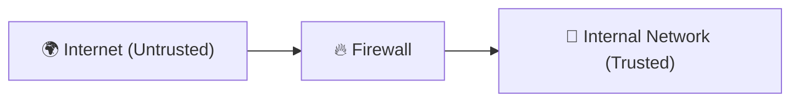
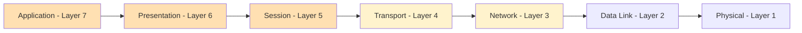
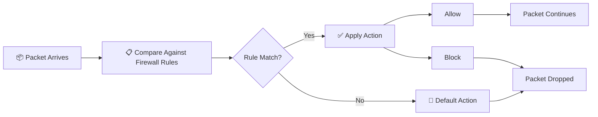
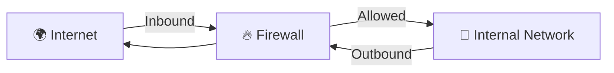
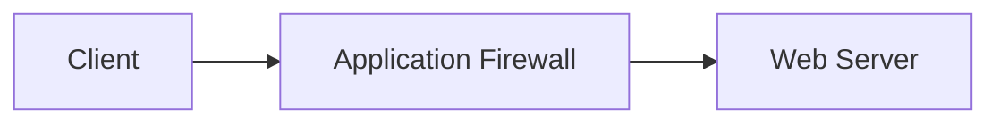
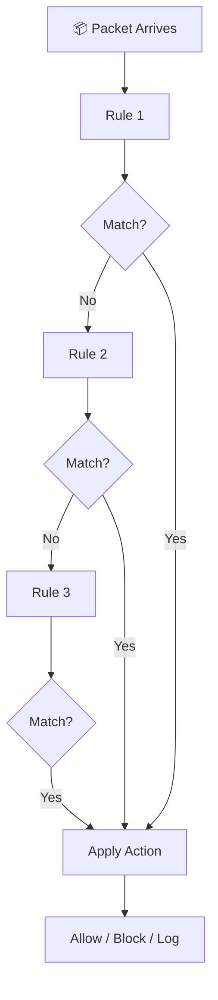
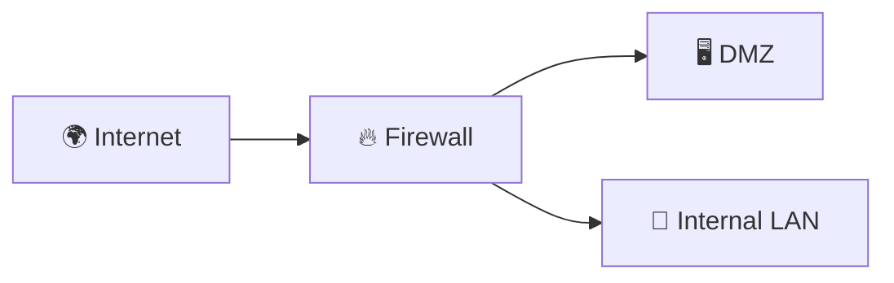

# 🔥 Firewall

> *A firewall is a security device that monitors, filters, and controls network traffic based on predefined security rules. It acts as the first line of defense between trusted and untrusted networks.*

---

<div align="center">


-informational?style=for-the-badge)


</div>

---

# 📖 Table of Contents

- [Previously in this Roadmap](#-previously-in-this-roadmap)
- [A New Stage in Networking](#-a-new-stage-in-networking)
- [Why Do We Need a Firewall?](#-why-do-we-need-a-firewall)
- [What is a Firewall?](#-what-is-a-firewall)
- [Trusted vs Untrusted Networks](#-trusted-vs-untrusted-networks)
- [Where Firewalls Are Placed](#-where-firewalls-are-placed)
- [Firewall and the OSI Model](#-firewall-and-the-osi-model)
- [Learning Objectives](#-learning-objectives)

---

# 📚 Previously in this Roadmap

Congratulations!

By completing the previous chapters, you have learned how modern computer networks are built.

So far, you have studied how different networking devices work together to make communication possible.

```text
Repeater
      │
      ▼
Hub
      │
      ▼
Bridge
      │
      ▼
Switch
      │
      ▼
Router
      │
      ▼
Gateway
      │
      ▼
Modem
      │
      ▼
Access Point
```

Each device solved a different networking problem.

- Repeaters extended signals.
- Hubs shared communication.
- Bridges reduced unnecessary traffic.
- Switches intelligently forwarded frames.
- Routers connected different IP networks.
- Gateways translated between different protocols.
- Modems connected networks to an Internet Service Provider.
- Access Points extended wired networks into wireless networks.

Together, these devices created a complete and functional network.

But there is one important question we have not asked yet.

> **Should every device and every packet be allowed to communicate freely?**

The answer is **no**.

Modern networks must not only enable communication—they must also **protect** it.

This chapter marks the beginning of the **network security** portion of the roadmap.

---

# 🛡️ A New Stage in Networking

Up to this point, every networking device had one primary objective:

> **Deliver data successfully.**

A firewall introduces an entirely different objective.

> **Protect the network by deciding which communication should be allowed and which should be denied.**

This represents one of the biggest mindset changes in networking.

Instead of focusing only on connectivity, we now begin focusing on **security**.

```text
Network Connectivity
═══════════════════════════════════

Repeater
      │
Hub
      │
Bridge
      │
Switch
      │
Router
      │
Gateway
      │
Modem
      │
Access Point

═══════════════════════════════════
        Security Begins Here
═══════════════════════════════════

Firewall
      │
IDS
      │
IPS
```

Everything after this point builds layers of defense around the network you have learned to build.

---

<!--
Image Description:
Create an infographic showing the progression of networking devices. The upper section represents network connectivity (Repeater, Hub, Bridge, Switch, Router, Gateway, Modem, Access Point). A dividing line labeled "Security Begins Here" separates these devices from Firewall, IDS, and IPS below.

Suggested Search Keywords:
network devices progression infographic
network connectivity to cybersecurity roadmap
-->

<p align="center">

</p>

---

# 🚪 Why Do We Need a Firewall?

Imagine that your office building has no entrance doors.

Anyone could walk inside.

There would be:

- No identity verification.
- No visitor log.
- No security guard.
- No restrictions on where people could go.

Clearly, this would be unsafe.

Instead, most organizations place security personnel at the entrance.

Visitors are checked before entering.

Some people are allowed inside.

Others are turned away.

A firewall performs the same role for a computer network.

Instead of inspecting people, it inspects **network traffic**.

Instead of deciding who enters a building, it decides which **packets** are allowed to enter or leave a network.

---

> 💡 **Real-World Analogy**
>
> A firewall is like the security guard at the entrance to a building.
>
> Every visitor is checked before being allowed to enter.
>
> Every packet is checked before being allowed to pass through the network.

---

<!--
Image Description:
Illustrate a split-screen comparison. On the left, show a security guard checking visitors before they enter an office building. On the right, show a firewall inspecting network packets before they enter an organization's internal network. Use arrows to compare physical access control with network traffic filtering.

Suggested Search Keywords:
firewall security guard analogy
network firewall access control infographic
-->

<p align="center">

</p>

---

# 🔥 What is a Firewall?

A **firewall** is a network security device—or software—that monitors and controls network traffic based on a set of predefined security rules.

Its primary purpose is to determine whether network traffic should be:

- ✅ Allowed
- ❌ Blocked

Rather than allowing every packet to pass freely, a firewall examines traffic and applies security policies before making a decision.

Think of it as a **traffic controller** positioned at the boundary between different networks.

---

## 🌐 Trusted vs Untrusted Networks

Firewalls are commonly placed between two different types of networks.

### 🟢 Trusted Network

A trusted network is one that the organization owns and manages.

Examples include:

- Corporate LAN
- Internal servers
- Employee workstations
- Private data centers

---

### 🔴 Untrusted Network

An untrusted network is any network outside the organization's direct control.

Examples include:

- The Internet
- Public Wi-Fi networks
- External partner networks
- Unknown remote connections

Because the Internet is open to everyone, organizations cannot automatically trust incoming traffic.

A firewall helps determine which traffic is safe enough to enter the trusted network.

---



---

<!--
Image Description:
Create a simple network diagram showing the Internet on the left, an organization's internal network on the right, and a firewall positioned between them. Use green to represent the trusted network and red to represent the untrusted network, with arrows showing traffic flowing through the firewall.

Suggested Search Keywords:
firewall between internet and LAN diagram
trusted vs untrusted network infographic
-->

<p align="center">

</p>

---

# 📍 Where Firewalls Are Placed

Firewalls can be deployed in many different locations depending on the network's size and security requirements.

Common deployment locations include:

- Between the Internet and an organization's network.
- Between different internal departments.
- Around data centers.
- Inside cloud environments.
- On individual computers (host-based firewalls).

Regardless of where they are deployed, their purpose remains the same:

> **Inspect traffic before allowing communication.**

---

# 🌐 Firewall and the OSI Model

Unlike many networking devices you've studied so far, firewalls can operate at multiple layers of the OSI model.

Traditional firewalls primarily inspect information at:

- Layer 3 — Network
- Layer 4 — Transport

Modern **Next-Generation Firewalls (NGFWs)** can also inspect traffic at higher layers, including:

- Layer 5 — Session
- Layer 6 — Presentation
- Layer 7 — Application

This allows them to make far more intelligent security decisions.



---

# 🎯 Learning Objectives

By the end of this lesson, you should be able to:

- Explain why firewalls are necessary.
- Describe the role of a firewall in protecting a network.
- Differentiate between trusted and untrusted networks.
- Identify where firewalls are commonly deployed.
- Understand how firewalls differ from networking devices that focus only on connectivity.
- Prepare to learn how firewalls inspect traffic, apply security rules, and enforce organizational security policies.

---

# ⚙️ How Firewalls Work

Every second, thousands—or even millions—of packets may attempt to enter or leave a network.

A firewall cannot simply allow everything to pass through.

Instead, it examines each packet and compares it against a predefined set of **security rules** before deciding whether the packet should continue or be blocked.

Think of a firewall as a security checkpoint.

Every packet must stop at the checkpoint, where it is inspected before being allowed to proceed.

---

## 📦 The Journey of a Packet

Whenever a packet reaches a firewall, the firewall follows a logical decision-making process.



Every firewall follows this basic workflow, although more advanced firewalls perform additional inspections before making a final decision.

---

<!--
Image Description:
Create a flowchart illustrating a packet arriving at a firewall. Show the firewall comparing the packet against its rule set, making an allow or block decision, and either forwarding or dropping the packet.

Suggested Search Keywords:
firewall packet inspection process
firewall rule evaluation diagram
-->

<p align="center">

</p>

---

# 📋 Firewall Rules

A firewall makes decisions using a collection of **rules**, often called a **Rule Set** or **Security Policy**.

Each rule tells the firewall what should happen when certain traffic is detected.

A rule may:

- Allow traffic
- Block traffic
- Log the activity
- Redirect the traffic (depending on the firewall)

Rules are evaluated in order, from top to bottom.

The first rule that matches the packet is applied.

---

## 📝 What Can a Firewall Examine?

A firewall can inspect several characteristics of a packet before making a decision.

Common matching criteria include:

| Packet Information | Example |
|--------------------|---------|
| Source IP Address | `192.168.1.25` |
| Destination IP Address | `8.8.8.8` |
| Source Port | `51520` |
| Destination Port | `443 (HTTPS)` |
| Protocol | TCP, UDP, ICMP |
| Direction | Inbound or Outbound |
| Interface | LAN or WAN |

By combining these values, administrators can create highly specific security policies.

---

## 💡 Example Firewall Rule

Suppose an organization wants employees to browse secure websites but block unsecured web traffic.

The firewall rules might look like this:

| Rule | Traffic | Action |
|------|----------|--------|
| 1 | Allow TCP Port 443 (HTTPS) | ✅ Allow |
| 2 | Block TCP Port 80 (HTTP) | ❌ Block |
| 3 | Deny All Remaining Traffic | 🚫 Block |

When a packet arrives, the firewall checks these rules one by one until it finds a match.

---

# 📥 Inbound vs 📤 Outbound Traffic

Firewalls monitor traffic flowing in both directions.

## 📥 Inbound Traffic

Inbound traffic originates **outside** the network and attempts to enter it.

Examples include:

- Someone visiting a company's website.
- A remote employee connecting through a VPN.
- Attackers scanning public IP addresses.

Inbound traffic generally presents a higher security risk because it comes from external networks.

---

## 📤 Outbound Traffic

Outbound traffic begins **inside** the network and travels outward.

Examples include:

- Opening a web page.
- Sending an email.
- Downloading software updates.
- Accessing cloud services.

Many organizations also monitor outbound traffic to prevent data leakage or unauthorized communications.

---



---

<!--
Image Description:
Illustrate inbound and outbound traffic passing through a firewall. Show the Internet on one side, the firewall in the middle, and the internal network on the other. Use arrows to distinguish inbound and outbound communication.

Suggested Search Keywords:
firewall inbound outbound traffic diagram
network traffic flow firewall infographic
-->

<p align="center">

</p>

---

# 📑 Access Control Lists (ACLs)

Many firewalls organize their rules into **Access Control Lists (ACLs)**.

An ACL is simply a list of conditions that determines whether traffic should be allowed or denied.

For example:

```text
Rule 1:
Allow HTTPS (TCP 443)

↓

Rule 2:
Allow DNS (UDP 53)

↓

Rule 3:
Block Telnet (TCP 23)

↓

Rule 4:
Deny Everything Else
```

ACLs make firewall behavior predictable and easier to manage.

---

# 🚦 Rule Order Matters

One of the most important concepts in firewall administration is that **rule order matters**.

Firewalls process rules **from top to bottom**.

As soon as a packet matches a rule, the firewall stops checking the remaining rules.

Consider the following example:

| Order | Rule | Result |
|------:|------|--------|
| 1 | Allow All Traffic | ✅ Everything passes |
| 2 | Block FTP (Port 21) | ❌ Never reached |

Because the first rule allows everything, the firewall never evaluates the second rule.

For this reason, firewall administrators must carefully organize their rule sets.

---

> **⚠️ Beginner Tip**
>
> Always remember:
>
> **The first matching rule wins.**
>
> A poorly ordered rule set can accidentally expose services or block legitimate traffic.

---

# 🚫 Default Action

What happens if a packet does **not** match any firewall rule?

That depends on the firewall's **default policy**.

There are two common approaches:

| Default Policy | Description |
|---------------|-------------|
| **Default Allow** | Allow traffic unless a rule blocks it. |
| **Default Deny** | Block traffic unless a rule explicitly allows it. |

From a cybersecurity perspective, **Default Deny** is considered the more secure approach.

This follows the principle of **least privilege**—only permit what is explicitly authorized.

---

> **📝 Remember**
>
> A firewall does not make random decisions.
>
> Every packet is evaluated according to a defined set of security rules.
>
> Understanding how these rules are processed is essential before learning about the different types of firewalls and advanced security features.

---

# 🧱 Types of Firewalls

As computer networks grew larger and cyber threats became more sophisticated, firewall technology evolved to provide stronger and more intelligent protection.

Early firewalls focused on examining basic packet information, such as IP addresses and port numbers.

Modern firewalls can inspect application data, identify users, detect malicious activity, and even integrate with threat intelligence services.

Each new type of firewall was developed to overcome the limitations of earlier generations.

---

# 📜 Evolution of Firewall Technology

```text
Packet Filtering Firewall
          │
          ▼
Stateful Firewall
          │
          ▼
Circuit-Level Gateway
          │
          ▼
Application (Proxy) Firewall
          │
          ▼
Next-Generation Firewall (NGFW)
          │
          ▼
Cloud Firewall (FWaaS)
```

The evolution reflects a shift from **simple packet inspection** to **intelligent security analysis**.

---

<!--
Image Description:
Create a vertical timeline illustrating the evolution of firewall technology. Include Packet Filtering Firewall, Stateful Firewall, Circuit-Level Gateway, Application Proxy Firewall, Next-Generation Firewall (NGFW), and Firewall as a Service (FWaaS). Briefly highlight the primary improvement introduced by each generation.

Suggested Search Keywords:
firewall evolution timeline
types of firewalls infographic
-->

<p align="center">

</p>

---

# 📦 Packet Filtering Firewall

The earliest firewalls were known as **Packet Filtering Firewalls**.

They examine each packet independently and make decisions based on information found in the packet header.

Typical criteria include:

- Source IP address
- Destination IP address
- Protocol
- Source port
- Destination port

Because they inspect only header information, they are fast but have limited visibility into the contents of network traffic.

### Advantages

- Fast processing
- Simple configuration
- Low resource usage

### Limitations

- No awareness of existing connections
- Cannot inspect application data
- Limited protection against sophisticated attacks

---

# 🔄 Stateful Firewall

Packet filtering alone is often insufficient.

For example, if a user initiates a secure web connection, the firewall should recognize that the returning packets belong to the same conversation.

A **Stateful Firewall** solves this problem by maintaining a **State Table**.

Instead of evaluating every packet independently, it tracks active network sessions.

```text
Client
   │
TCP Connection Begins
   │
   ▼
Firewall Records Session
   │
   ▼
Future Packets Belonging
to the Same Session
Are Recognized Automatically
```

This improves both security and efficiency because the firewall understands the context of ongoing communications.

---

<!--
Image Description:
Illustrate a stateful firewall maintaining a connection table. Show a client establishing a TCP session through the firewall, with subsequent packets recognized as part of the existing session.

Suggested Search Keywords:
stateful firewall connection table
stateful packet inspection diagram
-->

<p align="center">

</p>

---

# 🔌 Circuit-Level Gateway

A **Circuit-Level Gateway** operates at the **Session Layer (Layer 5)** of the OSI model.

Rather than inspecting the contents of every packet, it verifies that communication sessions are established correctly.

Its primary goal is to ensure that network connections follow valid session procedures.

Although less common today, circuit-level gateways introduced the idea of monitoring communication sessions rather than individual packets.

---

# 🌐 Application (Proxy) Firewall

As web applications became more common, attackers began targeting the applications themselves rather than simply the network.

An **Application Firewall**, also called a **Proxy Firewall**, sits between clients and servers.

Instead of allowing clients to communicate directly with a server, the firewall acts as an intermediary.



This allows the firewall to inspect application-layer data such as:

- HTTP requests
- HTTPS traffic (when configured)
- FTP commands
- SMTP traffic

Application firewalls provide much deeper inspection than traditional packet filtering.

---

<!--
Image Description:
Illustrate an Application (Proxy) Firewall positioned between a client and a web server. Show that all traffic passes through the firewall before reaching the destination, emphasizing application-layer inspection.

Suggested Search Keywords:
proxy firewall diagram
application firewall architecture
-->

<p align="center">

</p>

---

# 🚀 Next-Generation Firewall (NGFW)

Modern organizations face threats that traditional firewalls were never designed to detect.

A **Next-Generation Firewall (NGFW)** combines traditional firewall capabilities with advanced security features.

Common capabilities include:

- Stateful packet inspection
- Application awareness
- User identity integration
- Intrusion Prevention System (IPS)
- Malware detection
- SSL/TLS traffic inspection
- Threat intelligence integration

Rather than simply asking,

> "Which port is this packet using?"

an NGFW can also ask,

> "Which application generated this traffic?"

This provides much greater visibility into modern network activity.

---

# ☁️ Firewall as a Service (FWaaS)

As organizations move infrastructure to the cloud, traditional hardware firewalls are not always practical.

**Firewall as a Service (FWaaS)** delivers firewall capabilities through cloud platforms.

Benefits include:

- Centralized management
- Scalability
- Cloud-native deployment
- Protection for remote users
- Consistent security policies across multiple locations

FWaaS has become an important component of modern cloud security architectures.

---

# 🏠 Host-Based vs 🌐 Network Firewalls

Firewalls can also be categorized by **where they are deployed**.

| Host-Based Firewall | Network Firewall |
|---------------------|------------------|
| Installed on an individual computer | Protects an entire network |
| Controls traffic entering and leaving one device | Controls traffic between networks |
| Examples: Windows Defender Firewall, Linux `ufw` | Enterprise perimeter firewall, branch firewall |
| Suitable for endpoint protection | Suitable for organizational security |

Many organizations use **both** to provide multiple layers of protection.

---

# 📊 Firewall Comparison

| Firewall Type | Primary Focus | Best Use Case |
|---------------|---------------|---------------|
| Packet Filtering | Packet headers | Basic traffic filtering |
| Stateful Firewall | Active sessions | Enterprise perimeter security |
| Circuit-Level Gateway | Session establishment | Session validation |
| Application Firewall | Application traffic | Web applications and services |
| NGFW | Deep inspection and threat prevention | Modern enterprise security |
| FWaaS | Cloud-based protection | Hybrid and cloud environments |

---

> **💡 Key Idea**
>
> Firewall technology has evolved alongside computer networks.
>
> As applications, cloud computing, and cyber threats became more advanced, firewalls also became more intelligent.
>
> Modern organizations often deploy multiple firewall technologies together to create layered protection rather than relying on a single solution.

---

# ⚖️ Firewall Policies and Rule Management

A firewall is only as effective as the **security policy** it enforces.

Even the most advanced firewall cannot protect a network if it is configured with poor or overly permissive rules.

For this reason, designing firewall policies is one of the most important responsibilities of a network administrator.

A good policy should:

- Allow legitimate communication.
- Block unauthorized access.
- Be easy to understand and maintain.
- Follow the organization's security requirements.

---

# 📑 Rule Processing

As you learned earlier, firewall rules are evaluated **from top to bottom**.

The firewall compares each packet against its rule set until it finds the first matching rule.



This is why **rule order is extremely important**.

A single misplaced rule can accidentally expose critical services or prevent legitimate users from accessing network resources.

---

# 🚫 Implicit Deny

Most enterprise firewalls implement an **Implicit Deny** rule.

This means:

> If a packet does not match any rule, it is automatically blocked.

Think of it like entering a secure building.

If your name is **not** on the approved visitor list, security does not assume you should be allowed inside.

Instead, access is denied by default.

This approach follows the cybersecurity principle of **least privilege**:

> Only explicitly authorized traffic should be permitted.

---

# 🌍 Security Zones

Modern firewalls often divide networks into **security zones**.

Instead of treating every device equally, firewalls apply different policies depending on where traffic originates and where it is going.

Common security zones include:

| Zone | Description |
|------|-------------|
| 🌐 WAN | The external network, usually the Internet |
| 🏢 LAN | The trusted internal network |
| 🖥️ DMZ | A semi-trusted network for public-facing servers |
| ☁️ Cloud | Cloud-hosted infrastructure |
| 👤 Guest | Visitor or public Wi-Fi networks |

By separating networks into zones, organizations can apply different security rules to each area.

---

<!--
Image Description:
Create a network diagram showing a firewall separating multiple security zones. Include the Internet (WAN), Internal LAN, Guest Network, DMZ containing a Web Server, and a Cloud environment. Show traffic flowing through the firewall between these zones.

Suggested Search Keywords:
firewall security zones diagram
LAN WAN DMZ firewall architecture
-->

<p align="center">

</p>

---

# 🖥️ What is a DMZ?

A **Demilitarized Zone (DMZ)** is a separate network that hosts systems which must be accessible from the Internet.

Common examples include:

- Web servers
- Mail servers
- DNS servers
- Reverse proxies

Instead of placing these systems directly inside the internal network, organizations isolate them in the DMZ.

This reduces the risk that an attacker who compromises a public-facing server can immediately access sensitive internal systems.



The firewall enforces different security policies for traffic entering the DMZ and the internal LAN.

---

<!--
Image Description:
Illustrate a firewall protecting both a DMZ and an internal network. Show a web server located in the DMZ and employee computers inside the LAN. Use arrows to demonstrate how Internet users can reach the web server without direct access to the internal network.

Suggested Search Keywords:
DMZ firewall network diagram
firewall DMZ architecture infographic
-->

<p align="center">

</p>

---

# 🏢 Enterprise Firewall Deployment

Large organizations rarely rely on a single firewall.

Instead, they deploy multiple firewalls throughout the network.

Common deployment locations include:

- Internet perimeter
- Data centers
- Branch offices
- Cloud environments
- Internal network segments

Each firewall protects a different part of the organization's infrastructure.

This layered approach reduces the impact of a single device failure or security breach.

---

# 🔄 High Availability (HA)

Because firewalls are critical security devices, organizations often deploy them in **High Availability (HA)** pairs.

If the primary firewall fails, a secondary firewall automatically takes over.

```text
Internet
     │
     ▼

Primary Firewall
       │
       ├───────────────┐
       │               │
       ▼               ▼

 Internal LAN     Secondary Firewall
                        │
                        ▼
                   Takes Over if Needed
```

High Availability helps ensure:

- Continuous Internet access.
- Reduced downtime.
- Improved business continuity.
- Increased network reliability.

---

<!--
Image Description:
Illustrate two firewalls configured in an Active/Standby High Availability (HA) pair. Show the primary firewall handling traffic while the secondary firewall remains synchronized and automatically takes over if the primary fails.

Suggested Search Keywords:
firewall high availability diagram
active standby firewall architecture
-->

<p align="center">

</p>

---

# 🧩 Network Segmentation

Modern organizations do not place every device on one large network.

Instead, they divide networks into smaller segments.

Examples include:

- Finance
- Human Resources
- Engineering
- Servers
- Guest Wi-Fi
- Management Network

Firewalls control communication **between these segments**, reducing the spread of attacks if one area becomes compromised.

Network segmentation is a fundamental security practice and an important part of a **Defense in Depth** strategy.

---

> **📝 Remember**
>
> A firewall is more than a device that blocks traffic.
>
> It enforces security policies, separates networks into security zones, protects public-facing services with DMZs, supports high availability, and helps organizations build secure, resilient network architectures.

---

# 🛡️ Cybersecurity Perspective

A firewall is one of the most recognizable cybersecurity technologies, but it is important to understand **both its strengths and its limitations**.

A firewall can:

- Filter network traffic
- Enforce security policies
- Block unauthorized connections
- Restrict access to sensitive resources
- Log network activity

However, a firewall **cannot guarantee complete security**.

Modern cyber threats constantly evolve, and attackers often attempt to bypass or exploit systems in ways that traditional firewall rules cannot detect.

For this reason, organizations use firewalls as **one layer** of a much larger security strategy.

---

# 🏰 Defense in Depth

Cybersecurity professionals rarely rely on a single security control.

Instead, they implement **Defense in Depth**, a strategy that uses multiple layers of protection.

If one layer fails, another layer can still detect or stop the attack.

```text
                Internet
                    │
                    ▼
             🔥 Firewall
                    │
                    ▼
            🚨 IDS (Detection)
                    │
                    ▼
            🛡️ IPS (Prevention)
                    │
                    ▼
           🏢 Internal Network
```

As you continue through this roadmap, each of these layers will become its own lesson.

By the end of the Networking module, you'll understand how they work together to protect modern enterprise networks.

---

<!--
Image Description:
Create a layered security diagram illustrating the concept of Defense in Depth. Show Internet traffic passing through a Firewall, then an IDS, then an IPS before reaching the Internal Network. Represent each layer with distinct icons and emphasize that security consists of multiple protective layers rather than a single device.

Suggested Search Keywords:
defense in depth network security infographic
layered network security diagram
-->

<p align="center">

</p>

---

# 🔐 Firewalls and Zero Trust

Traditional networks often assumed that devices inside the network could be trusted.

Modern organizations increasingly follow a different philosophy called **Zero Trust**.

Zero Trust follows one simple principle:

> **"Never trust, always verify."**

Rather than automatically trusting users because they are inside the network, every connection must be authenticated, authorized, and continuously evaluated.

Firewalls play an important role in implementing Zero Trust by enforcing access policies between users, devices, applications, and network segments.

---

# 📊 Logging and Monitoring

Blocking traffic is only one responsibility of a firewall.

Firewalls also generate **logs** that record network activity.

Typical log entries include:

- Allowed connections
- Blocked connections
- Source and destination IP addresses
- Ports and protocols
- Time and date of events
- Security policy that was applied

These logs help administrators troubleshoot problems and allow security teams to investigate suspicious activity.

---

# 👨‍💻 Firewalls in a Security Operations Center (SOC)

Security Operations Centers (SOCs) continuously monitor an organization's network.

Firewall logs are one of the primary data sources used by SOC analysts.

They help answer questions such as:

- Who attempted to access the network?
- Which traffic was blocked?
- Are repeated connection attempts occurring?
- Is unusual outbound traffic leaving the organization?

Firewall data becomes even more valuable when combined with other security tools.

---

# 🔗 How Firewalls Work with IDS and IPS

A firewall is designed to **control** network traffic.

However, not every malicious action can be identified simply by examining ports, IP addresses, or protocols.

Organizations therefore deploy additional security technologies alongside firewalls.

| Security Device | Primary Role |
|-----------------|--------------|
| 🔥 Firewall | Controls which traffic is allowed or blocked |
| 🚨 IDS | Detects suspicious or malicious network activity |
| 🛡️ IPS | Detects and automatically blocks malicious traffic |

Together, these technologies provide stronger protection than any one device alone.

---

# ⚠️ Beginner Mistakes

Many newcomers misunderstand what a firewall can and cannot do.

Common misconceptions include:

❌ Thinking a firewall stops every cyberattack.

❌ Believing antivirus software and firewalls perform the same function.

❌ Assuming HTTPS makes a firewall unnecessary.

❌ Creating firewall rules that allow all traffic.

❌ Ignoring firewall logs after deployment.

---

# 💡 Did You Know?

- Nearly every modern operating system includes a built-in firewall.
- Large enterprises often deploy multiple firewalls throughout their infrastructure.
- Next-Generation Firewalls can identify applications, not just ports.
- Cloud providers offer Firewall as a Service (FWaaS) for cloud-native environments.
- Firewalls are often integrated with SIEM platforms for centralized monitoring and incident response.

---

# ⏱️ 60-Second Revision

- A firewall monitors and controls network traffic.
- Firewall decisions are based on predefined security rules.
- Rules evaluate packet information such as IP addresses, ports, and protocols.
- Modern firewalls include features such as stateful inspection and application awareness.
- Firewalls divide networks into trusted and untrusted zones.
- DMZs isolate public-facing services from internal networks.
- Firewalls are an essential—but not sufficient—component of cybersecurity.

---

# 📌 Key Takeaways

- Firewalls are policy enforcement devices that protect networks from unauthorized communication.
- Rule order and security policies directly affect firewall effectiveness.
- Different firewall technologies are designed for different security requirements.
- Enterprise firewalls support segmentation, high availability, and layered security.
- Firewalls work alongside IDS, IPS, SIEM, and other security tools to strengthen an organization's defenses.

---

# 🧠 Final Knowledge Check

### Question 1

Why is a firewall considered the first line of defense for many networks?

<details>
<summary>Answer</summary>

Because it inspects and controls network traffic entering or leaving a network, enforcing security policies before communication is allowed.

</details>

---

### Question 2

What is the purpose of an Access Control List (ACL)?

<details>
<summary>Answer</summary>

An ACL is a collection of firewall rules that determines whether specific network traffic should be allowed, denied, or otherwise processed.

</details>

---

### Question 3

What is the difference between a Packet Filtering Firewall and a Stateful Firewall?

<details>
<summary>Answer</summary>

A Packet Filtering Firewall evaluates packets independently using header information, while a Stateful Firewall tracks active network sessions and makes decisions based on the context of those connections.

</details>

---

### Question 4

Why is the **Implicit Deny** policy considered more secure?

<details>
<summary>Answer</summary>

Because any traffic that is not explicitly permitted is automatically blocked, reducing the likelihood of unintended or unauthorized access.

</details>

---

### Question 5

How do firewalls and IDS complement each other?

<details>
<summary>Answer</summary>

A firewall enforces access policies by allowing or blocking traffic, while an IDS monitors permitted traffic for suspicious or malicious activity and alerts security teams when threats are detected.

</details>

---

# 📚 Further Reading

Continue exploring related topics in this roadmap:

- **Router.md** — Connecting different IP networks
- **Access Point.md** — Providing secure wireless connectivity
- **IDS.md** *(Next Lesson)* — Detecting suspicious network activity
- **IPS.md** — Automatically preventing malicious network activity
- **Network Security** — Building layered defenses for enterprise networks

---

# 🗺️ Where You Are in the Roadmap

```text
Cybersecurity Roadmap

02-Networking

README.md
│
├── ✅ Network Devices Overview
│
├── ✅ Repeater
├── ✅ Hub
├── ✅ Bridge
├── ✅ Switch
├── ✅ Router
├── ✅ Gateway
├── ✅ Modem
├── ✅ Access Point
│
├── 📍 Firewall (Current Lesson)
├── ⏭️ IDS
├── ⏳ IPS
└── ⏳ Load Balancer
```

---

# ➡️ Next Lesson

Throughout this chapter, you've learned how a firewall **controls** communication by enforcing predefined security policies.

But an important question remains:

> **What if malicious traffic is allowed through because it appears legitimate?**

Modern attacks often use approved ports, trusted applications, or encrypted connections, making them difficult for a firewall to identify based on rules alone.

Organizations therefore need another layer of defense—one that continuously **monitors network activity for suspicious behavior**, even after traffic has been permitted.

That responsibility belongs to an **Intrusion Detection System (IDS)**.

In the next lesson, you'll learn how IDS solutions analyze network traffic, detect potential attacks, generate security alerts, and provide visibility into threats that traditional firewalls may not recognize.

By combining **Firewalls**, **IDS**, and later **IPS**, you'll begin to understand how modern organizations build **layered network defenses** capable of protecting against increasingly sophisticated cyber threats.

**Continue to the next lesson:** **[IDS.md](IDS.md)** →

