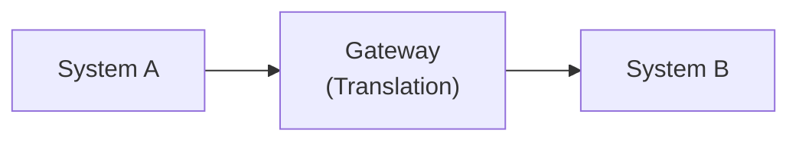
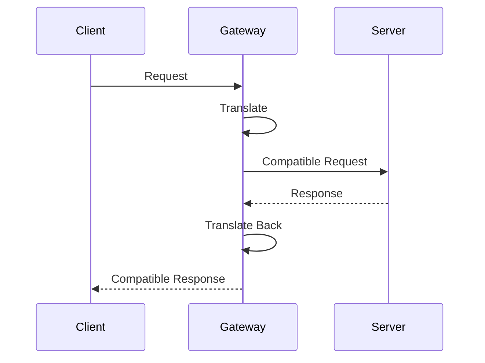

# 🌉 Gateway

> *A gateway enables communication between systems, networks, or applications that would otherwise be unable to understand one another. While routers determine where data should go, gateways ensure that different technologies can communicate successfully.*

---


---

# 📖 Table of Contents

- [Previously in this Roadmap](#-previously-in-this-roadmap)
- [Why Do We Need a Gateway?](#-why-do-we-need-a-gateway)
- [What is a Gateway?](#-what-is-a-gateway)
- [Why is it Called a Gateway?](#-why-is-it-called-a-gateway)
- [Gateway vs Router: The Big Misconception](#-gateway-vs-router-the-big-misconception)
- [The Default Gateway](#-the-default-gateway)
- [Where Are Gateways Used?](#-where-are-gateways-used)
- [Gateway and the OSI Model](#-gateway-and-the-osi-model)
- [Learning Objectives](#-learning-objectives)

---

# 📚 Previously in this Roadmap

In **Router.md**, you learned that routers connect **different IP networks**.

When your computer sends a packet to another network, the router examines the destination **IP address**, consults its **routing table**, and forwards the packet toward the next network.

Routers solve one important problem:

> **"Which path should this packet take?"**

For most communication, routing is exactly what we need.

However, modern computer networks are far more diverse than simply connecting IP networks together.

Consider these examples:

- A legacy industrial machine communicating with a modern cloud service.
- An IPv4-only device communicating with an IPv6-only network.
- A Voice over IP (VoIP) system communicating with a traditional telephone network.
- An email system filtering and translating messages before delivery.

In each of these situations, the problem isn't choosing the correct path.

The problem is that the two systems speak **different languages**.

This introduces another important networking concept:

> **The Gateway.**

---

# 🌍 Why Do We Need a Gateway?

Imagine two people trying to have a conversation.

One speaks only **English**.

The other speaks only **Japanese**.

```
English Speaker
        │
        │ ❌ Cannot Communicate
        ▼
Japanese Speaker
```

No matter how close they are, communication cannot happen because they don't understand one another.

Now imagine a professional translator standing between them.

```
English
    │
    ▼
Translator
    │
    ▼
Japanese
```

The translator doesn't decide **where** the conversation goes.

Instead, the translator makes the conversation **possible**.

A gateway performs a very similar role in computer networking.

It allows different systems, protocols, applications, or technologies to communicate even when they were never designed to understand one another directly.

---

> **💡 Key Idea**
>
> A router answers:
>
> **"Where should this packet go?"**
>
> A gateway answers:
>
> **"How can these two systems understand each other?"**

---

<!--
Image Description:
Illustration comparing a router and a gateway. On the left, a router connects two IP networks using arrows labeled "Routing." On the right, a gateway sits between two systems using different protocols, showing translation between them.

Suggested Search Keywords:
router vs gateway conceptual diagram
-->

<p align="center">

</p>

---

# 🌉 What is a Gateway?

A **gateway** is a networking device or software component that enables communication between systems that use **different protocols, formats, architectures, or communication methods**.

Unlike a router, which primarily forwards packets between IP networks, a gateway may:

- Translate protocols
- Convert data formats
- Bridge different communication technologies
- Connect applications using different standards
- Enable interoperability between incompatible systems

Simply put:

> A gateway allows different technologies to communicate successfully.

---

## 🛣️ Why is it Called a Gateway?

The word **gateway** literally means **an entrance or passage between two places**.

Think of a gate in a fence.

The gate allows people to move from one area to another.

Without the gate, the fence creates a barrier.

Similarly, a networking gateway provides a passage between systems that would otherwise remain isolated.

Sometimes the barrier is:

- Different network protocols
- Different communication standards
- Different applications
- Different hardware platforms

The gateway removes this barrier by translating or adapting the communication.

---

# 🤔 Gateway vs Router: The Big Misconception

One of the most common beginner questions is:

> **"Isn't a gateway just a router?"**

The answer is:

> **Sometimes—but not always.**

This confusion exists because, in many home and small office networks, the router also performs the role of the default gateway.

However, these are **different concepts**.

A **router** focuses on **routing**.

A **gateway** focuses on **communication between different systems**.

Sometimes a single physical device performs both jobs.

In enterprise environments, these roles are often separated into different devices or services.

---

## 📊 Router vs Gateway

| Router | Gateway |
|---------|----------|
| Connects different IP networks | Connects different systems or technologies |
| Chooses the best path | Enables communication |
| Uses routing tables | Performs translation or adaptation |
| Primarily operates at Layer 3 | Can operate across multiple OSI layers |
| Focuses on forwarding packets | Focuses on interoperability |

Notice that these responsibilities complement one another rather than compete.

A network may use both a router and one or more gateways simultaneously.

---

# 🚪 The Default Gateway

You may have seen the term **Default Gateway** in your computer's network settings.

At first glance, this seems to suggest that a gateway and a router are the same thing.

Not quite.

The **default gateway** is simply the device that your computer sends packets to whenever the destination is outside the local network.

In most home and office networks:

```
Computer
     │
     ▼
Default Gateway
     │
     ▼
Router
     │
     ▼
Internet
```

The router performs the role of the default gateway because it knows how to reach other networks.

This is why many people use the terms interchangeably.

However, remember:

> **Default Gateway** is a role.

> **Router** is a device.

A router often serves as the default gateway, but the concept of a gateway extends far beyond routing.

---

# 🌍 Where Are Gateways Used?

Gateways appear in many different areas of networking and computing.

Examples include:

- Cloud computing
- Industrial control systems
- Smart home devices
- Email systems
- Voice over IP (VoIP)
- Web applications
- API communication
- Payment processing
- Internet of Things (IoT)

Each of these environments involves systems that must exchange information despite using different technologies or communication methods.

You will explore many of these gateway types later in this chapter.

---

# 🌐 Gateway and the OSI Model

Unlike routers, gateways are **not limited to a single OSI layer**.

A gateway may operate at different layers depending on the type of translation it performs.

For example:

| Gateway Type | Possible OSI Layer(s) |
|---------------|----------------------|
| Network Gateway | Layer 3 |
| Email Gateway | Layer 7 |
| API Gateway | Layer 7 |
| VoIP Gateway | Layers 4–7 |
| Protocol Gateway | Multiple Layers |

This flexibility makes gateways one of the most versatile components in modern networking.

---



Unlike routers, gateways are primarily concerned with making communication possible rather than simply forwarding packets.

---

> **📝 Remember**
>
> Every router makes forwarding decisions.
>
> Every gateway makes communication possible.
>
> Sometimes a single device performs both functions—but they are not the same concept.

---

# 🎯 Learning Objectives

After completing this lesson, you should be able to:

- Explain why gateways exist.
- Describe the problem gateways solve.
- Define what a gateway is.
- Distinguish between routers and gateways.
- Explain the meaning of a default gateway.
- Identify common environments where gateways are used.
- Understand why gateways can operate at multiple OSI layers.
- Prepare to learn how gateways translate and adapt communication between different technologies.

---

# ⚙️ How a Gateway Works

Unlike a router, which simply forwards packets toward the correct destination, a gateway may need to **understand, interpret, modify, or translate** the data before forwarding it.

The exact process depends on the type of gateway, but the overall workflow remains similar.

Instead of asking:

> **"Where should this packet go?"**

a gateway asks:

> **"How can I make this information understandable to the destination?"**

---

## 🔄 The Gateway Translation Process

The following diagram illustrates the general workflow performed by many gateways.


Although the details vary, every gateway performs some form of adaptation before communication continues.

---

## Step 1 — Receive the Incoming Data

The gateway first receives information from one system.

This information may arrive as:

- Network packets
- API requests
- Email messages
- Voice traffic
- Industrial control messages
- IoT sensor data

At this stage, the gateway identifies:

- The source
- The communication protocol
- The expected destination

---

## Step 2 — Understand the Communication

Before translation can occur, the gateway must determine **how the incoming data is structured**.

For example, it may identify:

- The protocol being used
- The message format
- The data encoding
- Required authentication information
- Security policies

Unlike routers, gateways often inspect far more than just IP addresses.

Many gateways analyze the contents of the communication itself.

---

## Step 3 — Translate or Convert

This is the defining characteristic of a gateway.

Depending on its purpose, the gateway may:

- Translate one protocol into another
- Convert data formats
- Modify message headers
- Encrypt or decrypt traffic
- Authenticate users
- Validate requests
- Apply security policies

The original communication is transformed into a format that the destination system understands.

---

> **💡 Analogy**
>
> Imagine an interpreter at an international conference.
>
> The interpreter listens to one language, understands its meaning, and immediately speaks another language that the audience understands.
>
> The message stays the same, but the language changes.
>
> A gateway performs a similar function for computer systems.

---

## Step 4 — Forward the Translated Data

Once the translation is complete, the gateway sends the new data toward its destination.

From the destination's perspective, the communication now appears to use a familiar protocol or format.

The destination often has no knowledge that translation occurred in the middle.

---

## Step 5 — Handle the Response

Communication rarely ends with a single message.

Responses usually travel back through the gateway.

The gateway performs the reverse translation before sending the response back to the original system.



This two-way translation allows both systems to communicate seamlessly despite using different technologies.

---

# 🌍 Real-World Translation Examples

The idea of "translation" becomes much easier to understand through practical examples.

---

## 🌐 IPv4 ↔ IPv6 Gateway

Many organizations continue to use IPv4 while newer systems adopt IPv6.

A gateway can translate communication between these two addressing systems.

```
IPv4 Device
      │
      ▼
 IPv4/IPv6 Gateway
      │
      ▼
IPv6 Network
```

Without the gateway, the two environments may not communicate correctly.

---

## ☎️ VoIP Gateway

Traditional telephone networks use different technologies from modern Voice over IP systems.

A VoIP gateway translates between these communication methods.

```
Traditional Telephone

        │

        ▼

VoIP Gateway

        │

        ▼

IP Network
```

This allows calls to move between conventional telephone systems and Internet-based communication.

---

## 📧 Email Gateway

An email gateway processes messages before they reach users.

Typical responsibilities include:

- Spam filtering
- Malware scanning
- Policy enforcement
- Content inspection
- Message routing

In many organizations, every email passes through an email gateway before reaching employee inboxes.

---

## ☁️ Cloud Gateway

Many businesses maintain both on-premises infrastructure and cloud services.

Cloud gateways help these environments communicate securely and efficiently.

They often provide:

- Authentication
- Encryption
- Traffic optimization
- Data synchronization

---

## 🌐 API Gateway

Modern applications frequently consist of dozens—or even hundreds—of independent services.

Rather than allowing every client to communicate directly with every service, organizations often deploy an API gateway.

The API gateway can:

- Authenticate requests
- Route requests
- Apply rate limits
- Log activity
- Balance traffic
- Enforce security policies

Clients communicate with the gateway, while the gateway manages communication with backend services.

---

## 🏭 IoT Gateway

Internet of Things (IoT) devices often use lightweight communication protocols that differ from traditional enterprise networks.

An IoT gateway acts as a bridge between:

- Sensors
- Industrial equipment
- Smart devices
- Cloud platforms

This allows thousands of small devices to integrate with modern applications.

---

# 🧭 Types of Gateways

Now that you understand the translation process, let's explore the most common gateway types found in modern networks.

---

## 🌐 Network Gateway

A network gateway enables communication between different networks.

In many home and office environments, the router performs this role as the default gateway.

Its primary purpose is to provide access to networks beyond the local LAN.

---

## 🚪 Default Gateway

The default gateway is the destination your computer uses whenever it needs to communicate outside its local network.

Although this role is usually performed by a router, the concept itself refers to the **exit point** from the local network.

---

## 📧 Email Gateway

An email gateway protects and manages email communication.

Common features include:

- Spam filtering
- Malware detection
- Email encryption
- Policy enforcement

Email gateways are an essential part of enterprise cybersecurity.

---

## 🌍 Web Gateway

A web gateway sits between users and the Internet.

It can:

- Filter websites
- Block malicious content
- Inspect web traffic
- Enforce browsing policies

Many organizations use secure web gateways to protect employees from dangerous websites.

---

## 🔌 API Gateway

An API gateway manages communication between clients and backend application services.

Typical responsibilities include:

- Authentication
- Request routing
- Logging
- Monitoring
- Rate limiting

API gateways are widely used in cloud-native applications and microservices architectures.

---

## ☁️ Cloud Gateway

Cloud gateways simplify communication between on-premises infrastructure and cloud platforms.

They often provide:

- Secure connectivity
- Data synchronization
- Authentication
- Encryption

---

## 🏭 IoT Gateway

IoT gateways collect, process, and forward information from connected devices.

They help integrate sensors, industrial controllers, and smart devices into enterprise networks.

---

## ☎️ VoIP Gateway

VoIP gateways translate communication between traditional telephone systems and IP-based voice networks.

Without these gateways, many organizations could not integrate legacy telephony with modern communication platforms.

---

## 📊 Comparing Gateway Types

| Gateway Type | Primary Purpose | Typical Environment |
|--------------|-----------------|---------------------|
| Network Gateway | Connect networks | Home and enterprise networks |
| Default Gateway | Exit point from a local network | Every IP network |
| Email Gateway | Secure email communication | Enterprise environments |
| Web Gateway | Control web access | Organizations and schools |
| API Gateway | Manage application communication | Cloud and web services |
| Cloud Gateway | Connect cloud and on-premises systems | Hybrid cloud environments |
| IoT Gateway | Connect smart devices | Industrial and IoT deployments |
| VoIP Gateway | Translate voice communication | Business telephone systems |

---

<!--
Image Description:
A central gateway connected to multiple technologies, including cloud services, email servers, web applications, IoT devices, VoIP systems, and enterprise networks. Each connection illustrates the gateway acting as a translator between different communication methods.

Suggested Search Keywords:
types of gateways networking diagram
-->

<p align="center">

</p>

---

> **📝 Remember**
>
> Routers primarily decide **where** data should go.
>
> Gateways ensure that different systems can **understand** one another.
>
> Modern organizations often deploy multiple specialized gateways, each designed to solve a different communication challenge.

---

# ⚖️ Router vs Gateway

Throughout this chapter, you've learned that both routers and gateways help systems communicate.

Because of this, the terms are often used interchangeably—especially in home networking.

However, they are **not the same concept**.

Understanding the difference is one of the most important lessons in networking.

---

## 🎯 Different Problems, Different Solutions

Although routers and gateways may appear similar, they are designed to solve different problems.

A router asks:

> **"Which path should this packet take?"**

A gateway asks:

> **"How can these two systems communicate successfully?"**

This distinction is the foundation for understanding modern network architecture.

---

## 📊 Router vs Gateway Comparison

| Router | Gateway |
|---------|----------|
| Connects different IP networks | Connects different systems, networks, or applications |
| Uses IP addresses to make forwarding decisions | Translates, converts, or adapts communication |
| Primarily operates at OSI Layer 3 | Can operate at multiple OSI layers |
| Uses routing tables | May perform protocol, format, or application translation |
| Focuses on packet forwarding | Focuses on interoperability |
| Always performs routing | May or may not perform routing |

---

## 🛣️ An Everyday Analogy

Imagine you're driving to another country.

The **road network** gets you to the border.

That is the job of a **router**.

When you reach the border, however, you encounter:

- Immigration officers
- Customs inspections
- Passport verification
- Language differences
- Currency exchange

These services allow you to continue your journey in a completely different country.

That is the role of a **gateway**.

```text
Home City
    │
    ▼
Road Network
 (Router)
    │
    ▼
International Border
 (Gateway)
    │
    ▼
Foreign Country
```

The router gets you there.

The gateway makes communication across different environments possible.

---

# 🤔 Can a Router Be a Gateway?

Yes.

In fact, this is extremely common.

Most home routers also serve as the **default gateway** for devices on the local network.

```
Laptop
    │
    ▼
Home Router
(Default Gateway)
    │
    ▼
Internet
```

When your computer sends traffic to another network, it forwards the packet to its default gateway—which is usually the router.

In this scenario, one physical device performs **two different roles**.

---

> **💡 Remember**
>
> A **router** is a device.
>
> A **default gateway** is a role.
>
> One device can perform multiple networking roles.

---

# 🤔 Can Every Gateway Be a Router?

No.

Many gateways never perform routing at all.

For example:

- An **Email Gateway** filters spam and malware.
- An **API Gateway** manages application requests.
- A **Payment Gateway** securely processes financial transactions.
- An **IoT Gateway** translates communication between sensors and cloud platforms.

These gateways enable communication, but they do not necessarily make routing decisions between IP networks.

---

# 🏢 Home Networks vs Enterprise Networks

The difference between routers and gateways becomes much clearer when comparing home and enterprise environments.

### 🏠 Home Network

A single device often combines many functions.

```text
                 Home Router

        ✓ Router
        ✓ Default Gateway
        ✓ Switch
        ✓ Wireless Access Point
        ✓ Firewall
        ✓ NAT
        ✓ DHCP Server
```

For simplicity and lower cost, one appliance performs several networking roles.

---

### 🏢 Enterprise Network

Large organizations usually separate these responsibilities.

```text
Users
   │
   ▼
Switches
   │
   ▼
Router
   │
   ▼
Firewall
   │
   ▼
Email Gateway
   │
   ▼
Web Gateway
   │
   ▼
Internet
```

Each device focuses on a specialized task.

This modular design improves:

- Performance
- Scalability
- Reliability
- Security
- Easier maintenance

---

## 📋 Common Misconceptions

Let's address some common misunderstandings.

| Misconception | Reality |
|---------------|----------|
| A gateway is just another name for a router. | Sometimes a router acts as a gateway, but the concepts are different. |
| Every gateway performs routing. | Many gateways only translate or secure communication. |
| Every router performs protocol translation. | Routers primarily forward packets using IP routing. |
| Gateways only exist in networking hardware. | Many gateways are software applications or cloud services. |
| Default gateway means gateway and router are identical. | Default gateway describes the device used to leave the local network, which is often—but not always—a router. |

---

# ✅ Advantages of Gateways

Gateways provide several important benefits in modern networking.

### 🌐 Interoperability

They allow different systems and technologies to communicate successfully.

---

### 🔄 Protocol Translation

Gateways bridge communication between protocols that would otherwise be incompatible.

---

### ☁️ Cloud Integration

They simplify communication between on-premises infrastructure and cloud platforms.

---

### 🛡️ Security

Many gateways inspect, filter, authenticate, or encrypt traffic before it reaches its destination.

---

### 🔗 Legacy System Support

Organizations can continue using older equipment while integrating newer technologies.

---

### 📈 Scalability

Specialized gateways allow organizations to expand services without redesigning their entire network.

---

# ⚠️ Limitations of Gateways

Although gateways are extremely useful, they also introduce challenges.

### Additional Complexity

Translation and inspection require more processing than simple packet forwarding.

---

### Performance Overhead

Deep inspection or protocol conversion may increase latency.

---

### Configuration Requirements

Gateways often require detailed configuration and ongoing maintenance.

---

### Cost

Enterprise gateways may require dedicated hardware, software licenses, or cloud subscriptions.

---

### Potential Single Point of Failure

If a critical gateway becomes unavailable, communication between systems may stop entirely.

Organizations often deploy redundant gateways to improve availability.

---

> **📝 Remember**

> **Router**
>
> - Chooses the path.
> - Connects networks.
> - Uses IP routing.
>
> **Gateway**
>
> - Makes communication possible.
> - Connects different technologies.
> - Performs translation or adaptation.
>
> Sometimes they are the same physical device—but they perform different networking functions.

---

# 🛡️ Cybersecurity Perspective

In modern cybersecurity, gateways are much more than communication devices.

Because they sit between users, applications, networks, and external services, gateways are often the **first point where security policies are enforced**.

Instead of allowing every request to pass directly to its destination, a gateway can inspect, filter, authenticate, and control communication before it continues.

This makes gateways one of the most important defensive technologies in modern enterprise networks.

---

## 📧 Email Security Gateway

Email remains one of the most common methods attackers use to deliver:

- Phishing emails
- Malware
- Ransomware
- Malicious attachments
- Spam

Before these messages reach users, organizations often route them through an **Email Security Gateway**.

```text
Internet
    │
    ▼
Email Security Gateway
    │
    ▼
Employee Mailbox
```

An email gateway can:

- Scan attachments
- Filter spam
- Detect phishing attempts
- Block malicious links
- Enforce company policies

Rather than trusting every incoming email, the gateway evaluates it before delivery.

---

## 🌐 Secure Web Gateway (SWG)

Whenever employees browse the Internet, organizations want to ensure they are accessing safe and appropriate websites.

A **Secure Web Gateway (SWG)** sits between users and the Internet.

```text
Employee
    │
    ▼
Secure Web Gateway
    │
    ▼
Internet
```

Typical responsibilities include:

- Blocking malicious websites
- Filtering inappropriate content
- Inspecting downloads
- Enforcing browsing policies
- Monitoring web activity

Secure Web Gateways help reduce the risk of users accidentally visiting harmful websites.

---

## 🔌 API Gateway

Modern applications often communicate through **Application Programming Interfaces (APIs)**.

Instead of allowing clients to communicate directly with backend services, organizations commonly deploy an **API Gateway**.

An API Gateway can:

- Authenticate users
- Authorize requests
- Apply rate limits
- Log activity
- Validate requests
- Protect backend services

This centralizes security and simplifies application management.

---

## ☁️ Cloud Gateway

As organizations adopt cloud computing, secure communication between on-premises infrastructure and cloud services becomes increasingly important.

Cloud gateways help by providing:

- Secure connectivity
- Authentication
- Encryption
- Traffic inspection
- Policy enforcement

They enable organizations to extend security controls beyond the traditional network perimeter.

---

## 🔐 VPN Gateway

Remote employees often need secure access to internal company resources.

A **VPN Gateway** establishes encrypted communication between remote users and the organization's network.

```text
Remote User
      │
Encrypted Tunnel
      │
      ▼
VPN Gateway
      │
      ▼
Internal Network
```

This allows employees to work remotely while protecting sensitive data as it travels across the Internet.

---

## 🏢 Zero Trust Architecture

Modern cybersecurity increasingly follows the principle of **Zero Trust**.

Rather than automatically trusting users or devices because they are inside the network, every request must be verified.

Many gateways contribute to Zero Trust by:

- Verifying user identity
- Inspecting requests
- Applying access policies
- Logging activity
- Blocking unauthorized communication

Gateways therefore play an important role in modern identity-aware security.

---

## 🔗 Connections to Future Cybersecurity Topics

Throughout this roadmap, you'll encounter gateways in many different contexts.

| Future Topic | How Gateways Are Involved |
|--------------|---------------------------|
| Firewall | Often deployed alongside network and security gateways |
| IDS & IPS | Analyze traffic passing through gateway-controlled networks |
| SOC Operations | Investigate gateway logs and alerts |
| Web Security | Secure Web Gateways filter web traffic |
| Email Security | Email gateways inspect and protect messages |
| Cloud Security | Cloud gateways secure hybrid environments |
| Zero Trust | Gateways enforce authentication and authorization policies |
| Digital Forensics | Gateway logs help reconstruct security incidents |

Understanding how gateways normally operate makes it much easier to understand how security teams monitor, control, and protect communication.

---

# ⚠️ Beginner Mistakes

Many newcomers misunderstand gateways because the term is used in several different contexts.

Common mistakes include:

❌ Thinking every gateway is a router.

❌ Believing routers and gateways are always the same thing.

❌ Assuming gateways only exist as physical hardware.

❌ Thinking gateways only connect networks.

❌ Confusing a **Default Gateway** with the broader concept of a **Gateway**.

Recognizing these misconceptions early will help you better understand enterprise networking and cybersecurity.

---

# 💡 Did You Know?

- Many organizations use **multiple gateways** at the same time, each serving a different purpose.
- API Gateways are a core component of modern cloud-native applications and microservices.
- Secure Web Gateways inspect billions of web requests every day to block malicious content.
- Email gateways often stop malicious messages before users ever see them.
- Many gateways are implemented entirely in software or cloud platforms rather than dedicated hardware.

---

# ⏱️ 60-Second Revision

- A gateway enables communication between different systems, protocols, or applications.
- Routers determine **where** data should go; gateways determine **how** different systems can communicate.
- A router may act as a default gateway, but the two concepts are not identical.
- Gateways can operate across multiple OSI layers.
- Common gateway types include network, email, web, API, cloud, VPN, and IoT gateways.
- Modern gateways often include powerful security and monitoring capabilities.

---

# 📌 Key Takeaways

- Gateways solve communication problems that routing alone cannot solve.
- They translate, adapt, or secure communication between different technologies.
- Many specialized gateways exist for different networking and cybersecurity needs.
- Gateways play a critical role in cloud computing, enterprise networking, and secure communications.
- Understanding gateways prepares you for advanced topics such as firewalls, Zero Trust, VPNs, and secure application architectures.

---

# 🧠 Final Knowledge Check

### Question 1

What is the primary purpose of a gateway?

<details>
<summary>Answer</summary>

A gateway enables communication between systems, networks, or applications that use different protocols, formats, or communication methods.

</details>

---

### Question 2

How does a gateway differ from a router?

<details>
<summary>Answer</summary>

A router forwards packets between IP networks using routing tables, while a gateway translates or adapts communication so different systems can understand each other.

</details>

---

### Question 3

Why is the term **Default Gateway** commonly associated with routers?

<details>
<summary>Answer</summary>

Because, in most home and office networks, the router serves as the device that forwards traffic outside the local network, making it the default gateway.

</details>

---

### Question 4

Name three common types of gateways used in enterprise environments.

<details>
<summary>Answer</summary>

Examples include Email Gateways, Secure Web Gateways, API Gateways, Cloud Gateways, VPN Gateways, and IoT Gateways.

</details>

---

### Question 5

Why are gateways important in cybersecurity?

<details>
<summary>Answer</summary>

Gateways inspect, filter, authenticate, monitor, and control communication between systems, helping organizations enforce security policies and protect network resources.

</details>

---

# 📚 Further Reading

Continue exploring related topics in this roadmap:

- **Router.md** — Routing packets between networks
- **Modem.md** *(Next Lesson)* — Connecting your network to an Internet Service Provider
- **Firewall.md** — Controlling and filtering network traffic
- **IDS.md** — Detecting suspicious network activity
- **IPS.md** — Preventing malicious network traffic
- **Network Security** — Applying security principles to modern networks

---

# 🗺️ Where You Are in the Roadmap

```text
Cybersecurity Roadmap

02-Networking

README.md
│
├── ✅ Network Devices Overview
│
├── ✅ Repeater
├── ✅ Hub
├── ✅ Bridge
├── ✅ Switch
├── ✅ Router
│
├── 📍 Gateway (Current Lesson)
├── ⏭️ Modem
├── ⏳ Access Point
├── ⏳ Firewall
├── ⏳ IDS
├── ⏳ IPS
└── ⏳ Load Balancer
```

---

# ➡️ Next Lesson

Throughout this chapter, you learned how gateways enable communication between different systems, protocols, and applications. However, before any home or business network can communicate with an **Internet Service Provider (ISP)**, there is another essential device involved.

That device is the **modem**.

Unlike a gateway, which makes communication **understandable**, a modem makes communication **physically possible** by converting digital signals from your network into signals that can travel across the transmission medium provided by your ISP—and converting incoming signals back into digital data.

In the next lesson, you'll learn how modems work, why they are required for Internet connectivity, how they differ from routers, and why many modern home devices combine both technologies into a single unit.

**Continue to the next lesson:** **[Modem.md](Modem.md)** →

