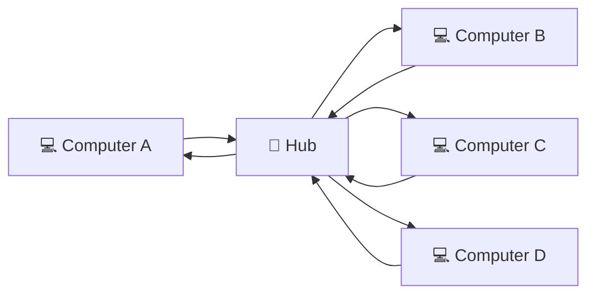
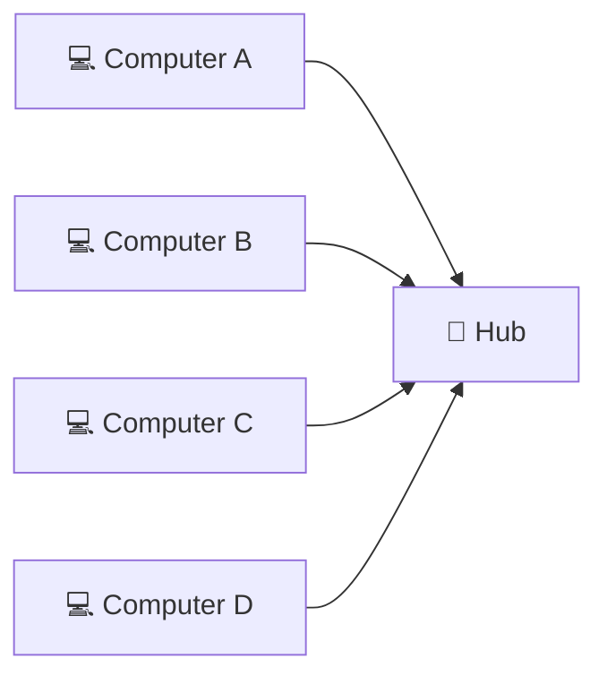
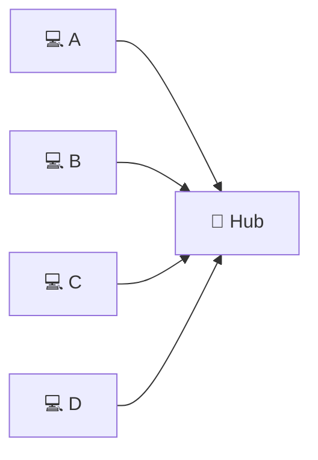
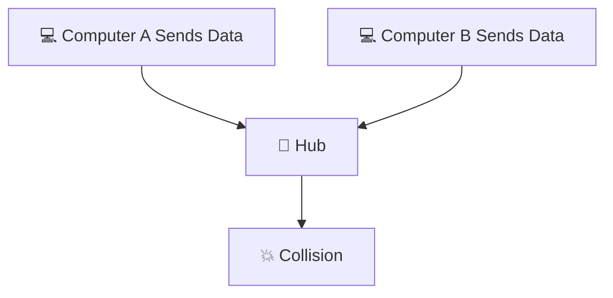
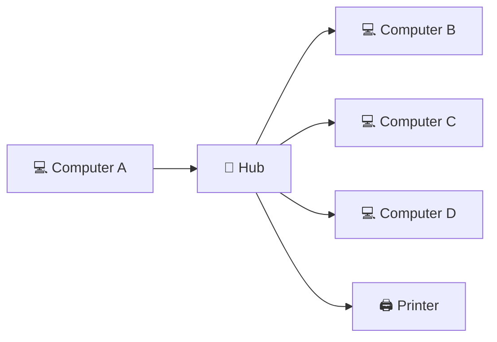
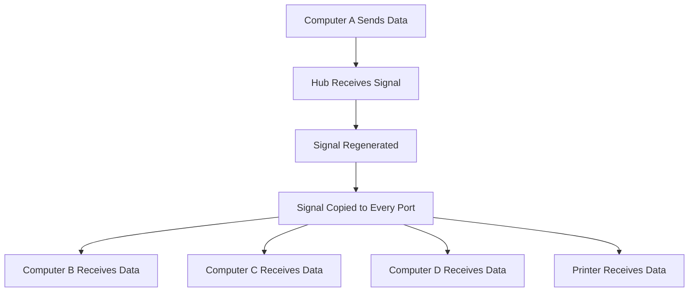
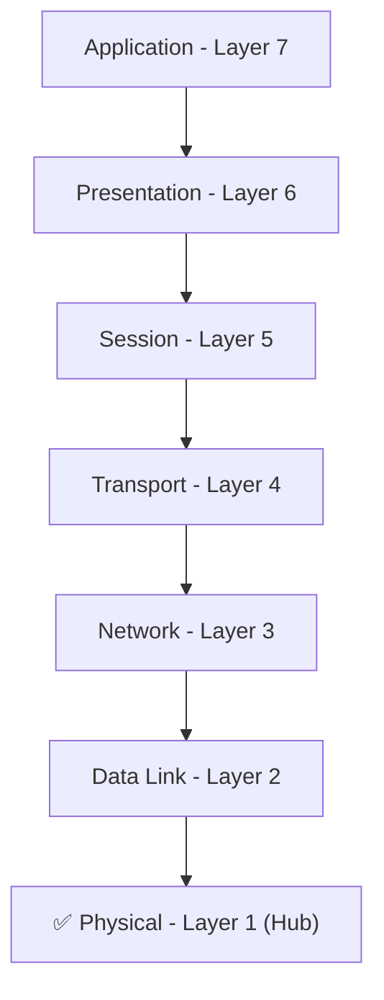
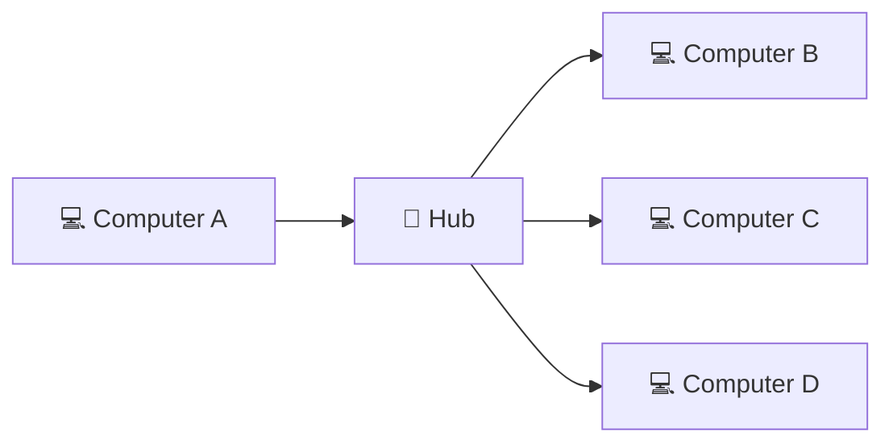
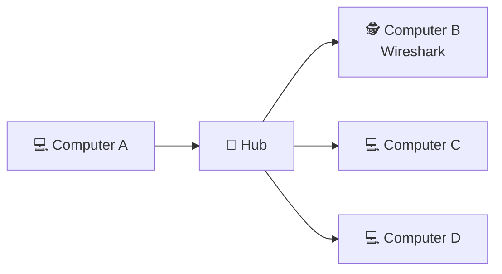
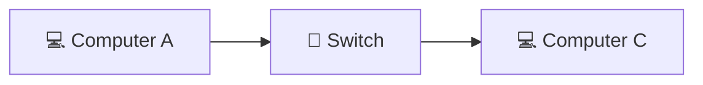

# 📡 Hub

> *Understanding how hubs connect multiple devices and why they became one of the earliest building blocks of Local Area Networks (LANs).*

<div align="center">


-informational?style=for-the-badge)


</div>

---

# 📑 Table of Contents

- [📚 Previously in This Roadmap](#-previously-in-this-roadmap)
- [📖 Introduction](#-introduction)
- [🤔 Why Do We Need a Hub?](#-why-do-we-need-a-hub)
- [🌍 Real-World Analogy](#-real-world-analogy)
- [🎯 Learning Objectives](#-learning-objectives)

---

# 📚 Previously in This Roadmap

In the previous lesson, you learned about the **Repeater**, a simple network device that regenerates weakened signals to extend communication over longer distances. You also explored **signal attenuation**, why it occurs, and how repeaters help maintain reliable communication without understanding or processing the data being transmitted.

Although repeaters solve the problem of **distance**, they introduce another question.

**How do you connect more than two computers together?**

A repeater simply extends an existing communication link—it doesn't provide a way for multiple devices to share the same network. As computer networks grew, a new device was needed to allow many computers to communicate over a shared medium.

That device was the **Hub**.

---

# 📖 Introduction

Imagine an office where every computer has its own dedicated cable connecting directly to every other computer.

With just two computers, this setup is simple.

With ten computers, it quickly becomes difficult to manage.

With hundreds of computers, it becomes completely impractical.

Early computer networks needed a simple way to connect multiple devices without requiring a separate cable between every pair of computers.

The **Hub** was one of the first devices designed to solve this challenge.

A hub acts as a central connection point, allowing multiple computers to communicate through a single networking device. Although hubs are rarely used in modern networks, understanding how they work provides valuable insight into the evolution of networking technologies and explains why more advanced devices such as **bridges** and **switches** were later developed.

---

# 🤔 Why Do We Need a Hub?

Connecting two devices is relatively straightforward.

However, real networks contain many devices:

- Desktop computers
- Laptops
- Printers
- Servers
- Network storage devices
- IP phones

Without a central device, every computer would require separate connections to every other computer, creating an enormous number of cables.

A hub simplified this process by providing a **central connection point**.

Instead of connecting directly to one another, every device connects to the hub. Whenever one device transmits data, the hub immediately repeats that signal to every connected device.

This made network installation much simpler and less expensive than creating direct connections between every pair of computers.

> 💡 **Did You Know?**
>
> Before switches became common, hubs were widely used in homes, schools, and small office networks because they were inexpensive and easy to install.

---

# 🌍 Real-World Analogy

Imagine standing in a classroom with a loudspeaker.

Whenever one student speaks into the microphone, the loudspeaker broadcasts the message so that **everyone in the room hears it**, regardless of whether the message was intended for them.

A hub works in much the same way.

When one connected computer sends data, the hub does not determine who should receive it. Instead, it simply broadcasts the data to **every connected device**.

Each computer receives the transmission, but only the intended recipient processes it. All other devices simply ignore it.



Although this approach is simple, it also creates inefficiencies that you'll explore later in this lesson.

---

# 🎯 Learning Objectives

After completing this lesson, you will be able to:

- Explain why hubs were developed.
- Describe how a hub connects multiple devices.
- Understand why hubs operate at the **Physical Layer (Layer 1)**.
- Explain how hubs broadcast data to every connected device.
- Identify the different types of hubs.
- Recognize the advantages and limitations of hub-based networks.
- Compare hubs with repeaters and switches.
- Explain why hubs have largely been replaced in modern networking.
- Understand the cybersecurity implications of broadcast-based communication.

---

---

# 🌐 Understanding Shared Communication

Before learning how a hub works, it's important to understand the networking concept that made hubs possible: **shared communication**.

In the earliest Local Area Networks (LANs), multiple computers needed a simple way to exchange data without requiring a dedicated cable between every pair of devices.

Instead of creating many direct connections, all computers were connected to a **single central device**—the hub.

This meant that every connected computer shared the same communication medium.



The hub became the center of the network, allowing every connected device to communicate through it.

---

# 🔗 Point-to-Point vs Shared Communication

To understand why hubs were introduced, compare two different communication models.

### Point-to-Point Communication

In a point-to-point connection, two devices communicate using a dedicated link.


Characteristics:

- Only two devices share the connection.
- Communication is simple and direct.
- No other devices can use that link.

While this works well for two devices, it doesn't scale well as networks grow.

---

### Shared Communication

In a shared communication model, many devices connect to the same hub.

Instead of having separate links between every pair of computers, all devices share the same network medium.



This approach greatly reduced the number of cables required and made network installation much easier.

However, it also introduced new challenges.

---

# ⚠ What Happens When Everyone Shares the Same Network?

Imagine a classroom where every student tries to speak at exactly the same time.

Instead of hearing a clear conversation, everyone hears overlapping voices.

The same thing can happen in a hub-based network.

Because every connected device shares the same communication medium, only **one device should transmit at a time**.

If two or more devices transmit simultaneously, their signals interfere with one another.

This event is called a **collision**.



When a collision occurs, neither transmission is received correctly. The affected devices must wait and send their data again.

> ⚠ **Common Beginner Mistake**
>
> A hub does **not** prevent collisions.
>
> In fact, because every connected device shares the same communication medium, hubs make collisions **more likely** as network activity increases.

---

<!--
Image Description:
An illustration showing four computers connected to a central hub. Two computers are transmitting data at the same time, causing a collision represented by overlapping signals or an explosion icon in the hub. Label the devices, hub, and collision.

Suggested Search Keywords:
hub collision diagram
ethernet hub collision
shared network medium illustration
-->

<p align="center">

</p>

---

# 🤔 Why Was This Still Useful?

If hubs can cause collisions, why were they used at all?

The answer lies in the technology available at the time.

Compared to creating separate cables between every computer, hubs offered several advantages:

- They were inexpensive.
- They were easy to install.
- They allowed many devices to share a single network.
- They made expanding a Local Area Network much simpler.

For small networks with only a few computers, these benefits often outweighed the disadvantages.

As networks became larger and busier, however, collisions became a significant performance problem.

This challenge led to the development of **bridges** and later **switches**, which greatly improved network efficiency.

> 💡 **Did You Know?**
>
> Modern Ethernet networks almost never use hubs because switches eliminate many of the performance problems caused by shared communication and collisions.

---

# 📊 Point-to-Point vs Shared Communication

| Feature | Point-to-Point | Shared Communication (Hub) |
|---------|----------------|----------------------------|
| Number of Devices | Two | Multiple |
| Communication Medium | Dedicated | Shared |
| Collisions | No | Possible |
| Scalability | Limited | Better |
| Performance | High | Decreases as more devices communicate |

---

# ✅ Knowledge Check

Before continuing, test your understanding.

1. What is a shared communication medium?
2. Why were hubs introduced instead of connecting every computer directly?
3. What is the difference between point-to-point and shared communication?
4. What is a network collision?
5. Why are collisions more common in hub-based networks?
6. Why were hubs still popular despite their limitations?

> 🎯 **Think About It**
>
> Imagine a hub connecting **20 computers** in a busy office.
>
> As more employees begin transferring files at the same time, what do you think will happen to the number of collisions and the overall network performance?
>
> Keep your answer in mind as you move to the next section, where you'll discover exactly **how a hub forwards data**.

---

# 📡 What Is a Hub?

A **Hub** is a **Layer 1 (Physical Layer)** network device that connects multiple devices within a Local Area Network (LAN).

Unlike a repeater, which typically connects **two network segments**, a hub provides **multiple ports**, allowing many computers to share the same communication medium.

When a hub receives a signal on one port, it **regenerates the signal** and immediately sends it out through **every other port**.

It does **not** determine which device should receive the data.

Instead, it broadcasts every transmission to all connected devices.

> 🎯 **Simple Definition**
>
> A **Hub** is a **multiport repeater** that receives a signal on one port and broadcasts it to every other connected port.

---

# ⚙️ How Does a Hub Work?

The operation of a hub is extremely simple.

Suppose **Computer A** wants to send data to **Computer C**.

The communication process looks like this:

1. Computer A sends data to the hub.
2. The hub receives the electrical signal.
3. The hub regenerates the signal.
4. The hub broadcasts the regenerated signal to every connected port.
5. Every connected computer receives the transmission.
6. Only the intended recipient processes the data; all other devices ignore it.

The hub does not know where the data is supposed to go.

Its only job is to repeat the signal to everyone.



Even though the message is intended for **Computer C**, every connected device receives the transmission.

---

# 🔍 Inside the Hub

Let's look at what actually happens inside the device.



Notice something important:

The hub never asks questions like:

- "Who is the destination?"
- "Which port should receive the data?"
- "Should I block this transmission?"

It simply repeats the signal to every connected device.

This is why hubs are often described as **blind devices**.

---

# 👁️ Why Is a Hub Called a "Blind" Device?

Unlike switches and routers, a hub has **no knowledge of network addresses**.

It cannot identify:

- Source devices
- Destination devices
- MAC addresses
- IP addresses
- Frames
- Packets

To the hub, every incoming signal looks exactly the same.

Because it operates entirely at the **Physical Layer**, it only works with electrical signals (or optical signals in similar technologies), not the information carried within them.

> 💡 **Did You Know?**
>
> A hub cannot decide where data should go because it never reads the data itself. It simply regenerates and forwards the signal to every connected port.

---

# 📍 Where Does a Hub Operate?

Like a repeater, a hub operates at the **Physical Layer (Layer 1)** of the **OSI Model**.



Because the hub operates only at Layer 1, it cannot:

- Make forwarding decisions
- Read MAC addresses
- Read IP addresses
- Filter traffic
- Improve security

Its role is limited to receiving, regenerating, and broadcasting signals.

---

# 📊 Characteristics of a Hub

| Characteristic | Description |
|----------------|-------------|
| OSI Layer | Layer 1 (Physical Layer) |
| Primary Function | Connect multiple devices and broadcast signals |
| Reads Frames? | ❌ No |
| Reads MAC Addresses? | ❌ No |
| Reads IP Addresses? | ❌ No |
| Forwards Intelligently? | ❌ No |
| Broadcasts Traffic | ✅ Yes |
| Collision Domain | One shared collision domain |
| Security Features | ❌ None |

---

> ⚠ **Common Beginner Mistake**
>
> Many beginners believe a hub sends data only to the destination computer.
>
> This is incorrect.
>
> A hub **always broadcasts** incoming data to every connected device. The destination computer accepts the data, while all other devices simply discard it.

---

# ✅ Knowledge Check

Before continuing, test your understanding.

1. Why is a hub called a **multiport repeater**?
2. What happens when a hub receives a signal?
3. Why is a hub considered a **blind device**?
4. At which OSI layer does a hub operate?
5. Does a hub understand MAC or IP addresses?
6. Why does every connected device receive the same transmission?
7. What happens to the data on devices that are not the intended recipient?

> 🎯 **Think About It**
>
> If every computer connected to a hub receives every transmission, what problems might this create for **network performance** and **security**?
>
> Keep this question in mind—it will be answered in the next sections and will explain why **switches replaced hubs** in almost every modern network.

---

---

# 🏷️ Types of Hubs

Although all hubs perform the same basic function—connecting multiple devices and broadcasting incoming signals—they are not all identical.

Historically, hubs were available in three main types.

---

# 1️⃣ Passive Hub

A **Passive Hub** is the simplest type of hub.

It acts primarily as a physical connection point between network devices.

Unlike active hubs, it does **not regenerate or strengthen** incoming signals.

Instead, it simply passes the electrical signal from one connected device to all other ports.

Because passive hubs do not improve signal quality, they are suitable only for very small networks with short cable distances.

### Characteristics

- Requires no external power (in many implementations)
- Does not regenerate signals
- Simple and inexpensive
- Rarely used today

---

# 2️⃣ Active Hub

An **Active Hub** is a powered networking device that receives incoming signals, regenerates them, and broadcasts the refreshed signals to all connected devices.

Unlike passive hubs, active hubs help maintain signal quality over longer cable distances.

Most Ethernet hubs used in Local Area Networks were active hubs.

### Characteristics

- Requires electrical power
- Regenerates weakened signals
- Functions as a multiport repeater
- More reliable than passive hubs

> 💡 **Did You Know?**
>
> When people refer to an **Ethernet Hub**, they are usually referring to an **Active Hub**.

---

# 3️⃣ Intelligent (Managed) Hub

An **Intelligent Hub**, sometimes called a **Managed Hub**, builds upon the functionality of an active hub by adding basic management and monitoring capabilities.

Although it still broadcasts traffic like a traditional hub, administrators can monitor device status, diagnose faults, and perform limited management tasks.

Intelligent hubs were primarily used in enterprise networks before managed switches became common.

### Characteristics

- Regenerates signals
- Supports basic network monitoring
- Provides limited remote management
- Largely replaced by managed switches

---

# 📊 Comparison of Hub Types

| Feature | Passive Hub | Active Hub | Intelligent Hub |
|----------|-------------|------------|-----------------|
| Requires Power | Usually No | ✅ Yes | ✅ Yes |
| Regenerates Signals | ❌ No | ✅ Yes | ✅ Yes |
| Broadcasts Data | ✅ Yes | ✅ Yes | ✅ Yes |
| Network Monitoring | ❌ No | ❌ No | ✅ Limited |
| Common Today | ❌ No | ❌ Rare | ❌ Almost Never |

---

# 🌍 Where Were Hubs Used?

Before switches became affordable, hubs were one of the most common networking devices for building Local Area Networks.

They were frequently found in:

- 🏫 School computer laboratories
- 🏢 Small office networks
- 🏠 Home networks
- 🧪 Networking training environments
- 🖥️ Legacy Ethernet installations

Their low cost and simple design made them popular during the early growth of Ethernet networking.

---

# ❌ Why Are Hubs Rarely Used Today?

Although hubs played an important role in the history of networking, they have been almost completely replaced by **network switches**.

The main reasons include:

- Every transmission is broadcast to all connected devices.
- Frequent network collisions reduce performance.
- Bandwidth is shared among all devices.
- They provide no traffic filtering.
- They offer no security features.
- They do not scale well as networks grow.

Modern switches solve these problems by forwarding data **only to the intended destination**, making networks significantly faster, more efficient, and more secure.


This evolution marked one of the biggest improvements in the history of Ethernet networking.

---

> 📝 **Note**
>
> Although hubs are rarely used in production networks today, they remain valuable educational tools. Understanding how hubs work makes it much easier to appreciate why switches, bridges, and modern Ethernet technologies were developed.

---

# ✅ Knowledge Check

Before moving on, test your understanding.

1. What is the difference between a passive hub and an active hub?
2. Why does an active hub require electrical power?
3. What additional capabilities does an intelligent hub provide?
4. In which environments were hubs commonly used?
5. Why have switches replaced hubs in modern networks?
6. Why is it still useful to study hubs even though they are largely obsolete?

> 🎯 **Think About It**
>
> Imagine you're designing a new office network today.
>
> Would you choose a **hub** or a **switch** as the central networking device?
>
> Based on everything you've learned so far, explain **why**.

---

# 🔐 Cybersecurity Perspective: Why Should Security Professionals Understand Hubs?

At first glance, a hub may seem like an outdated networking device with little relevance to modern cybersecurity.

However, hubs played an important role in the evolution of network security because they exposed one of the biggest weaknesses of early Local Area Networks:

> **Every connected device received every transmission.**

This behavior created significant security and privacy concerns and ultimately influenced the development of more secure networking technologies.

Understanding hubs helps cybersecurity professionals appreciate **why modern networks rely on switches instead of hubs**.

---

# 📡 Why Are Hubs Inherently Insecure?

A hub does not know which device should receive a transmission.

Whenever a computer sends data, the hub broadcasts that data to **every connected port**.



Although only the intended recipient processes the data, **every device physically receives the transmission**.

This creates an opportunity for anyone connected to the hub to observe network traffic.

> ⚠ **Remember**
>
> A hub provides **no confidentiality**. Every transmission is visible to every connected device.

---

# 🕵️ Packet Sniffing on a Hub

Because hubs broadcast all traffic, a computer running a packet capture tool can easily observe communications between other devices.

For example:

- Computer A sends data to Computer C.
- The hub broadcasts the transmission.
- Computer B also receives the same transmission.
- If Computer B is running a packet analyzer such as **Wireshark**, it can capture those packets even though they were never intended for it.



This made hub-based networks particularly vulnerable to eavesdropping.

---

# 🎯 Why Did Attackers Like Hubs?

From an attacker's perspective, hubs made network monitoring extremely easy.

An attacker connected to the hub could potentially:

- Capture usernames and passwords sent in plaintext
- Monitor unencrypted network traffic
- Collect sensitive information
- Observe communication between other computers
- Gather intelligence before launching additional attacks

The hub itself was **not malicious**, but its broadcast behavior made these attacks possible.

---

# 🛡️ How Did Switches Improve Security?

Modern switches solved this problem by forwarding frames **only to the correct destination port**.

Instead of broadcasting every transmission, a switch uses **MAC addresses** to determine exactly where the data should go.



Because other devices do not normally receive the traffic, packet sniffing becomes much more difficult.

This is one of the many reasons switches replaced hubs in modern networks.

> 💡 **Did You Know?**
>
> In a switched network, simply connecting a laptop running Wireshark does **not** allow you to see all network traffic. Additional techniques, such as **port mirroring (SPAN)** or **network taps**, are often required.

---

# 🔍 Why Does This Matter in Cybersecurity?

Even though hubs are rarely used today, the concepts introduced by hub-based networks remain important.

Understanding hubs helps explain:

- Why encrypted communication is essential.
- Why modern Ethernet relies on switches.
- How packet sniffing works.
- Why network segmentation improves security.
- Why confidentiality is an important security principle.

These concepts appear throughout penetration testing, digital forensics, incident response, and Security Operations Center (SOC) workflows.

---

# 🌐 Real-World Example

Imagine an organization still using an old hub-based network.

An employee unknowingly connects a laptop running a packet capture tool.

Without interfering with the network, the laptop begins capturing traffic exchanged between other employees.

If sensitive information is transmitted without encryption, it may be exposed.

Today, this scenario is uncommon because switches prevent most devices from seeing traffic that is not intended for them.

---

> 🎯 **Key Cybersecurity Insight**
>
> Hubs teach one of the most important lessons in network security:
>
> **Not every networking device is designed with security in mind.**
>
> Many technologies were created to solve connectivity problems first. Security improvements often came later as networking evolved.

---
---

# 🧠 60-Second Revision

Let's quickly review the most important concepts from this lesson.

- A **Hub** is a **Layer 1 (Physical Layer)** network device that connects multiple devices within a Local Area Network (LAN).
- A hub is often described as a **multiport repeater** because it regenerates incoming signals and broadcasts them to every connected port.
- Hubs create a **shared communication medium**, meaning all connected devices share the same network bandwidth.
- Because every transmission is broadcast, network collisions become more likely as the number of connected devices increases.
- Hubs do not understand MAC addresses, IP addresses, frames, or packets.
- Modern networks have almost entirely replaced hubs with switches because switches are faster, more efficient, and significantly more secure.

If you understand these six points, you've mastered the fundamental concepts behind network hubs.

---

# 📌 Key Takeaways

- ✅ A hub operates at the **Physical Layer (OSI Layer 1)**.
- ✅ A hub is essentially a **multiport repeater**.
- ✅ Every incoming transmission is broadcast to all connected devices.
- ✅ Hubs create a single shared collision domain.
- ✅ They do not inspect, filter, or intelligently forward traffic.
- ✅ Broadcast communication makes hubs inefficient and insecure.
- ✅ Modern Ethernet networks use **switches** instead of hubs.

---

# 🎓 Final Knowledge Check

Test your understanding before continuing.

1. Why were hubs developed for early computer networks?
2. Why is a hub often called a **multiport repeater**?
3. What happens when a hub receives a signal from one computer?
4. Why does a hub broadcast data to every connected device?
5. What is a shared communication medium?
6. Why are collisions common in hub-based networks?
7. How does a hub differ from a repeater?
8. Why can't a hub improve network security?
9. Why is packet sniffing easier on a hub than on a switch?
10. Why have switches almost completely replaced hubs in modern networks?

> 🎯 **Scenario Challenge**
>
> A small office uses an old Ethernet hub to connect ten computers. Employees complain that file transfers are slow, and a security analyst discovers that a packet capture tool can observe traffic from every workstation.
>
> Based on what you've learned:
>
> - What networking limitations are causing these problems?
> - Which device would you recommend replacing the hub with?
> - Why would that improve both performance and security?

---

# 📚 Further Reading

Continue exploring the evolution of network devices.

| Lesson | Description |
|---------|-------------|
| **[Bridge](Bridge.md)** | Learn how bridges reduce unnecessary traffic by dividing networks into smaller collision domains. |
| **[Switch](Switch.md)** | Discover how switches intelligently forward frames using MAC addresses. |
| **[Router](Router.md)** | Explore how routers connect different networks and make forwarding decisions. |
| **[Choosing the Right Network Device](Choosing%20the%20Right%20Network%20Device.md)** | Learn how network engineers select the appropriate device for different networking scenarios. |

---

# 🗺️ Where You Are in the Roadmap

```text
Cybersecurity Roadmap

02-Networking

README.md
│
├── ✅ Network Devices Overview
│
├── ✅ Repeater
├── ✅ Hub (Current Lesson)
│
├── ⏭️ Bridge
├── ⏳ Switch
├── ⏳ Router
├── ⏳ Gateway
├── ⏳ Modem
├── ⏳ Access Point
├── ⏳ Firewall
├── ⏳ IDS
├── ⏳ IPS
└── ⏳ Load Balancer
```

---

# ➡️ Next Lesson: [🌉 Bridge](Bridge.md)

You've now learned how a hub made it possible to connect multiple devices through a central network connection. While this was a major improvement over simple point-to-point communication, hubs introduced a new problem: **every transmission was broadcast to every connected device**.

As networks grew, this constant broadcasting led to **more collisions, lower performance, and unnecessary network traffic**.

The next lesson introduces the **Bridge**, a smarter Layer 2 device designed to solve these limitations.

In the next chapter, you'll learn:

- Why broadcast communication reduces network efficiency
- What collision domains are and why they matter
- How a bridge learns and uses MAC addresses
- How bridges forward traffic more intelligently than hubs
- Why bridges became an important step toward the development of modern network switches

By understanding how bridges improve upon hubs, you'll see the beginning of the transition from **simple physical connectivity** to **intelligent data forwarding**—one of the most significant milestones in networking history.

---

> 🎉 **Congratulations!**
>
> You have completed another important step in your networking journey. You now understand how early networks connected multiple devices, why hubs became popular, and why their limitations eventually led to the development of more intelligent networking technologies. This understanding will make the next lesson on **bridges** much easier to grasp as you continue building your knowledge of modern computer networks.

