# 🚨 Intrusion Detection System (IDS)

> *An Intrusion Detection System (IDS) continuously monitors network or host activity to detect suspicious behavior, policy violations, and potential cyberattacks. Unlike a firewall, an IDS typically observes and alerts rather than blocking traffic.*

---

<div align="center">


-informational?style=for-the-badge)


</div>

---

# 📖 Table of Contents

- [Previously in this Roadmap](#-previously-in-this-roadmap)
- [A New Perspective on Network Security](#-a-new-perspective-on-network-security)
- [Why Do We Need an IDS?](#-why-do-we-need-an-ids)
- [What is an IDS?](#-what-is-an-ids)
- [Firewall vs IDS](#-firewall-vs-ids)
- [Where IDS is Deployed](#-where-ids-is-deployed)
- [Learning Objectives](#-learning-objectives)

---

# 📚 Previously in this Roadmap

In the previous chapter, you learned how **Firewalls** protect networks by enforcing security policies.

A firewall decides whether traffic should be:

- ✅ Allowed
- ❌ Blocked

This makes a firewall the **first line of defense** for many organizations.

However, modern cyberattacks are often far more sophisticated than simply sending traffic through the wrong port.

Attackers may:

- Use legitimate applications.
- Exploit software vulnerabilities.
- Hide malicious activity inside encrypted traffic.
- Abuse trusted user accounts.

Some malicious traffic may appear perfectly normal to a firewall.

This raises an important question:

> **How do we identify suspicious activity that is already passing through the network?**

The answer is an **Intrusion Detection System (IDS).**

---

# 👀 A New Perspective on Network Security

The Firewall chapter introduced the concept of **controlling communication**.

This chapter introduces a different responsibility:

> **Observing communication.**

Instead of deciding whether packets are allowed to pass, an IDS continuously watches network activity for signs of suspicious behavior.

Think of it this way:

- A **Firewall** controls who enters a building.
- An **IDS** watches what happens inside the building.

Both are essential, but they serve different purposes.

```text
Internet
      │
      ▼

🔥 Firewall
(Controls Access)

      │
      ▼

🚨 IDS
(Monitors Activity)

      │
      ▼

🏢 Internal Network
```

As you'll see throughout this lesson, an IDS provides visibility into network activity that may otherwise go unnoticed.

---

<!--
Image Description:
Create a layered network security illustration showing Internet traffic passing through a Firewall before reaching an IDS. The Firewall is labeled "Controls Access," while the IDS is labeled "Monitors Activity." Use arrows to show traffic flow toward the Internal Network.

Suggested Search Keywords:
firewall and IDS architecture
network security layers infographic
-->

<p align="center">

</p>

---

# 🕵️ Why Do We Need an IDS?

Imagine a large office building.

A security guard checks everyone who enters through the front door.

Once visitors are inside, however, the guard cannot see every hallway, meeting room, or office.

To monitor activity throughout the building, security cameras are installed.

These cameras do not stop people from entering.

Instead, they continuously observe, record, and alert security personnel if suspicious activity occurs.

An IDS performs a similar role in a computer network.

It continuously watches network traffic and generates alerts whenever it detects activity that may indicate an attack or security policy violation.

---

> 💡 **Real-World Analogy**
>
> **Firewall = Security Guard**
>
> Controls who is allowed to enter.
>
> **IDS = Security Camera System**
>
> Watches everything that happens after entry and alerts security personnel if suspicious behavior is detected.

---

<!--
Image Description:
Illustrate a comparison between a security guard at a building entrance and CCTV cameras monitoring activity inside the building. Alongside, show a Firewall controlling network access and an IDS monitoring network traffic after the firewall.

Suggested Search Keywords:
IDS security camera analogy
firewall security guard comparison
-->

<p align="center">

</p>

---

# 🎯 Learning Objectives

By the end of this lesson, you should be able to:

- Explain the purpose of an Intrusion Detection System.
- Distinguish between a Firewall and an IDS.
- Describe how an IDS detects suspicious activity.
- Identify common IDS deployment locations.
- Understand the different types of IDS.
- Explain why IDS is an important component of Defense in Depth.

---

# 🔍 What is an IDS?

An **Intrusion Detection System (IDS)** is a security system that continuously monitors network traffic or host activity for signs of malicious behavior, policy violations, or attempted cyberattacks.

Unlike a firewall, an IDS generally **does not block traffic**.

Instead, it focuses on:

- Monitoring
- Detecting
- Logging
- Alerting

Whenever suspicious activity is detected, the IDS generates an alert so that administrators or security analysts can investigate.

Its goal is **visibility**, not prevention.

---

# 📊 Primary Responsibilities of an IDS

An IDS helps organizations by:

- Monitoring network traffic.
- Detecting known attack patterns.
- Identifying unusual behavior.
- Recording security events.
- Alerting administrators.
- Supporting incident investigations.

These capabilities allow security teams to identify threats that may otherwise remain hidden.

---

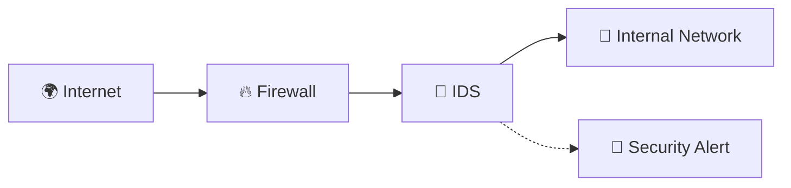

In this example, traffic is first filtered by the firewall.

The IDS then analyzes the permitted traffic for suspicious behavior.

If it detects something unusual, it generates an alert rather than blocking the communication.

---

<!--
Image Description:
Create a network diagram showing Internet traffic passing through a Firewall and then an IDS before reaching the Internal Network. Include a separate alert icon connected to the IDS to illustrate that it generates alerts instead of blocking traffic.

Suggested Search Keywords:
IDS monitoring network traffic diagram
intrusion detection system workflow
-->

<p align="center">

</p>

---

# ⚖️ Firewall vs IDS

Although Firewalls and IDS devices often work together, they perform different tasks.

| Feature | Firewall | IDS |
|----------|----------|-----|
| Primary Purpose | Control network access | Detect suspicious activity |
| Traffic Action | Allow or Block | Monitor and Alert |
| Primary Focus | Policy enforcement | Threat detection |
| Stops Attacks? | Yes, when rules match | No, it reports suspicious activity |
| Generates Alerts | Sometimes | Yes |

A useful way to remember the difference is:

> **A Firewall asks:** *"Should this traffic be allowed?"*

> **An IDS asks:** *"Does this traffic look suspicious?"*

---

# 📍 Where IDS is Deployed

IDS solutions may be placed at strategic points throughout a network.

Common deployment locations include:

- Behind the firewall.
- Near critical servers.
- At data center entrances.
- Between network segments.
- In cloud environments.
- On individual hosts (Host IDS).

The goal is to observe network activity where valuable systems and sensitive data are located.

---

> **📝 Remember**
>
> A firewall focuses on **controlling** network traffic.
>
> An IDS focuses on **observing** network traffic.
>
> Together, they provide stronger protection than either technology could provide alone.

---

# ⚙️ How an IDS Works

An Intrusion Detection System continuously observes network traffic or host activity, searching for signs of suspicious behavior.

Unlike a firewall, which immediately decides whether to allow or block traffic, an IDS performs a deeper analysis before determining whether an event should be reported.

Whenever packets pass through the monitored network, the IDS follows a series of steps to determine whether they indicate normal activity or a potential security threat.

---

# 📦 The IDS Detection Process

The detection process can be summarized in the following workflow.

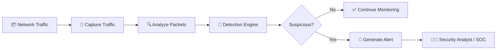

Unlike an IPS, the IDS does **not** stop the traffic.

Its responsibility is to detect suspicious activity and notify administrators so they can investigate further.

---

<!--
Image Description:
Create a workflow diagram illustrating the IDS detection process. Show network traffic being captured, analyzed by the detection engine, evaluated for suspicious behavior, and either ignored or converted into a security alert for the SOC.

Suggested Search Keywords:
IDS detection process diagram
intrusion detection workflow infographic
-->

<p align="center">

</p>

---

# 👀 Step 1 — Capturing Network Traffic

Before an IDS can analyze anything, it must first observe the traffic flowing through the network.

Depending on the deployment, traffic may be obtained from:

- A network TAP (Test Access Point)
- A switch SPAN (Mirror) port
- A network interface operating in monitoring mode
- Host operating system logs (for Host IDS)

The IDS receives copies of packets without interrupting the normal communication between devices.

This passive monitoring approach allows the IDS to inspect traffic without affecting network performance.

---

# 🔍 Step 2 — Packet Analysis

Once traffic is captured, the IDS begins examining each packet.

It may inspect information such as:

- Source IP address
- Destination IP address
- Ports
- Protocols
- Packet headers
- Packet payloads (when possible)

Instead of asking:

> **"Should this packet be allowed?"**

the IDS asks:

> **"Does this packet look suspicious?"**

This difference is what separates an IDS from a firewall.

---

# 🧠 Step 3 — The Detection Engine

The **Detection Engine** is the intelligence behind an IDS.

It compares observed network activity against different detection methods to determine whether suspicious behavior is present.

Common detection techniques include:

- Signature Matching
- Anomaly Detection
- Protocol Analysis

These techniques will be explored in greater detail later in this chapter.

---

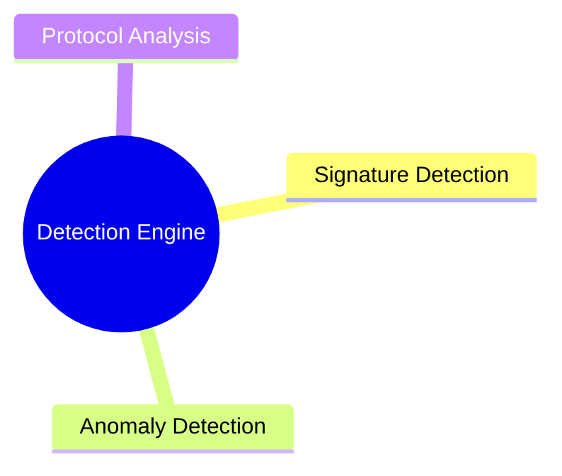

The detection engine evaluates every observed event before deciding whether an alert should be generated.

---

<!--
Image Description:
Create a mind map centered on "IDS Detection Engine" with three branches: Signature Detection, Anomaly Detection, and Protocol Analysis. Use simple icons to represent each detection method.

Suggested Search Keywords:
IDS detection engine mind map
intrusion detection techniques infographic
-->

<p align="center">

</p>

---

# 📝 Step 4 — Logging Events

Not every event is an attack.

Many events simply provide useful information about network activity.

For this reason, an IDS records observed events in **log files**.

Typical information stored includes:

- Timestamp
- Source IP address
- Destination IP address
- Port numbers
- Protocol
- Alert severity
- Description of the event

Logs allow administrators to review historical activity and investigate security incidents.

---

# 🚨 Step 5 — Generating Alerts

If the IDS determines that network activity appears suspicious, it generates an alert.

Alerts may be delivered through:

- Security dashboards
- Email notifications
- SIEM platforms
- SOC monitoring consoles
- Mobile notifications

The purpose of an alert is to inform security personnel that an event requires investigation.

An alert does **not** necessarily mean that an attack has occurred.

Instead, it indicates that unusual activity has been detected.

---

# 👨‍💻 From Alert to Investigation

Once an alert is generated, security analysts begin investigating the event.

A typical workflow looks like this:

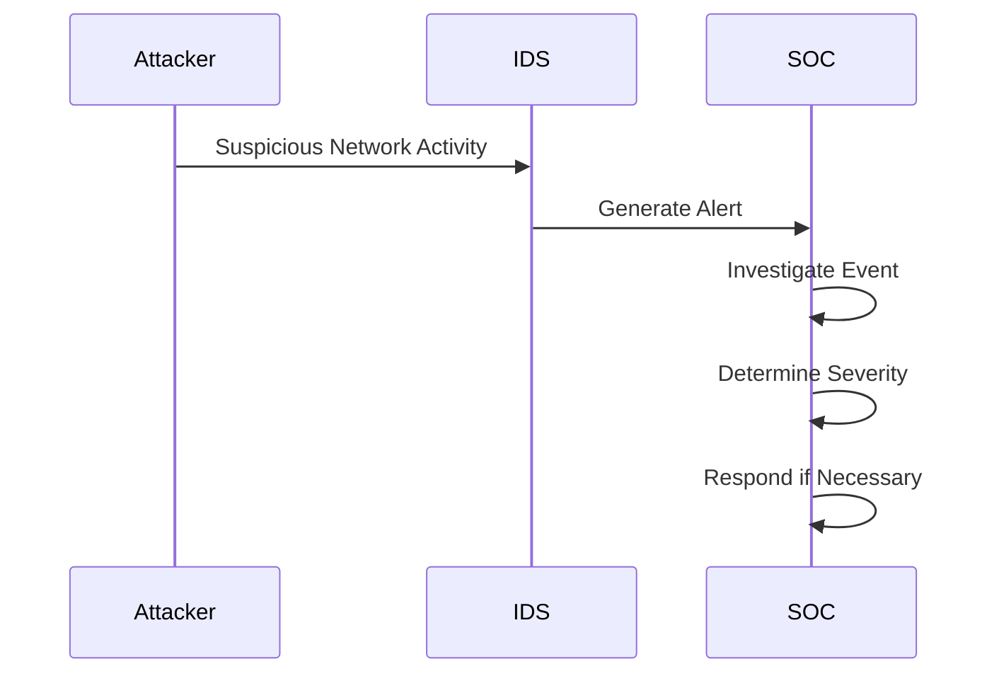

The IDS acts as an **early warning system**, helping analysts identify threats before they become major security incidents.

---

<!--
Image Description:
Illustrate the journey of an IDS alert from suspicious network activity to a Security Operations Center (SOC). Show the IDS generating an alert and a security analyst investigating it using a monitoring dashboard.

Suggested Search Keywords:
IDS alert workflow
SOC intrusion detection diagram
-->

<p align="center">

</p>

---

# 💡 Why Alerting Matters

Without an IDS, many attacks could remain unnoticed for long periods.

An IDS provides organizations with:

- Early warning of suspicious activity.
- Visibility into network behavior.
- Valuable forensic evidence.
- Support for incident response.
- Better understanding of emerging threats.

It helps security teams answer an important question:

> **"Is something unusual happening inside our network?"**

---

> **📝 Remember**
>
> An IDS follows a simple but powerful process:
>
> **Capture → Analyze → Detect → Log → Alert**
>
> It does not normally block traffic. Instead, it provides the visibility that security teams need to detect and investigate potential attacks.

---

# 🧩 Types of Intrusion Detection Systems

Not all IDS solutions are designed for the same environment.

Some monitor **entire networks**, while others monitor **individual computers**.

Likewise, different IDS solutions use different techniques to determine whether activity is malicious.

To understand IDS technology, it helps to classify it in two ways:

1. **Based on where it is deployed**
2. **Based on how it detects attacks**

---

# 📍 Classification of IDS

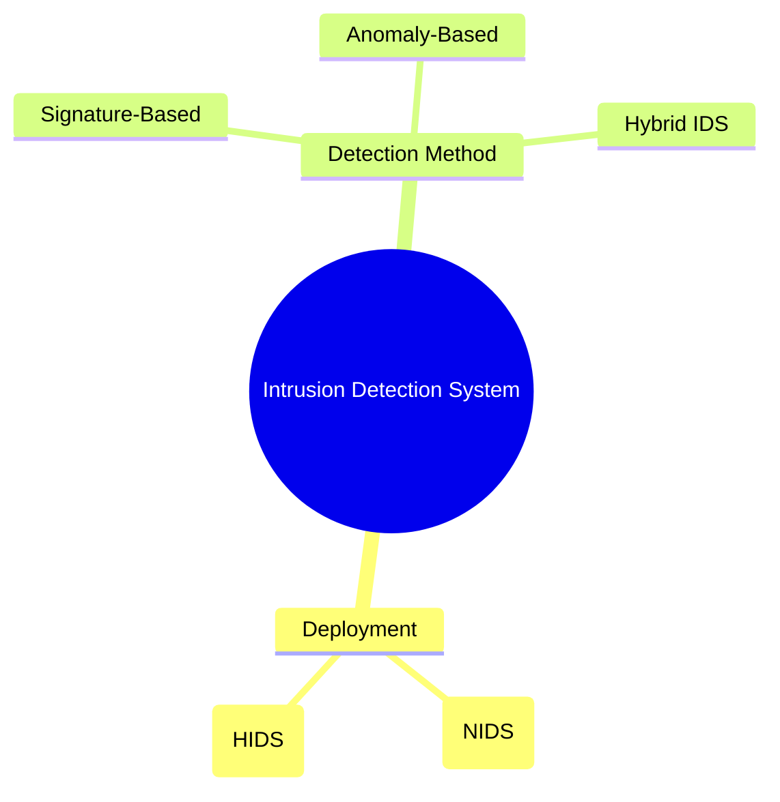

These categories are not mutually exclusive.

For example, an organization may deploy a **Network IDS** that uses **both signature-based and anomaly-based detection**.

---

<!--
Image Description:
Create a mind map showing the classification of Intrusion Detection Systems. Divide IDS into two main branches: Deployment (Network IDS and Host IDS) and Detection Method (Signature-Based, Anomaly-Based, and Hybrid IDS).

Suggested Search Keywords:
IDS classification diagram
network IDS host IDS infographic
-->

<p align="center">

</p>

---

# 🌐 Network Intrusion Detection System (NIDS)

A **Network Intrusion Detection System (NIDS)** monitors traffic flowing across an entire network.

Instead of being installed on individual computers, it is positioned at strategic points where it can observe communications between multiple devices.

Common deployment locations include:

- Behind a firewall
- At the edge of a network
- Between network segments
- Inside data centers
- At cloud gateways

Because a NIDS monitors many devices simultaneously, it provides a broad view of network activity.

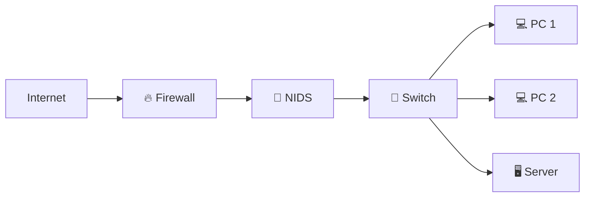

The NIDS analyzes copies of the traffic flowing through the network without interrupting communication.

---

<!--
Image Description:
Illustrate a Network Intrusion Detection System placed behind a firewall and connected to a switch. Show multiple computers and servers whose traffic is monitored by the NIDS.

Suggested Search Keywords:
network intrusion detection system architecture
NIDS deployment diagram
-->

<p align="center">

</p>

---

## ✅ Advantages of NIDS

- Monitors an entire network from a central location.
- Detects attacks targeting multiple systems.
- Does not require software on every endpoint.
- Easier to manage in large environments.

### ⚠️ Limitations of NIDS

- Cannot always inspect encrypted traffic.
- May miss activity occurring only within an individual host.
- High-speed networks may require powerful hardware for real-time analysis.

---

# 💻 Host Intrusion Detection System (HIDS)

A **Host Intrusion Detection System (HIDS)** runs directly on an individual computer or server.

Instead of monitoring network traffic for many devices, it focuses on the activity occurring within a single host.

A HIDS can monitor:

- System logs
- Running processes
- File integrity
- User activity
- Registry changes (Windows)
- Configuration changes

Because it has direct access to the operating system, a HIDS can detect attacks that may never appear on the network.

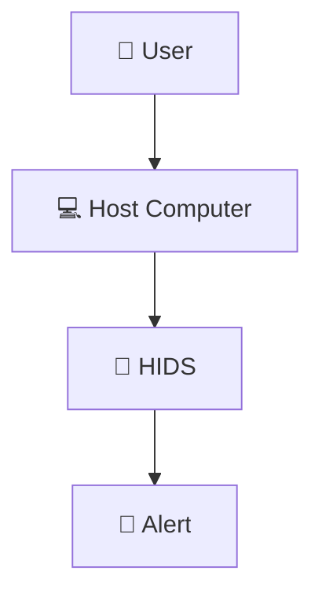

---

<!--
Image Description:
Illustrate a Host Intrusion Detection System installed on a single computer. Show the HIDS monitoring files, processes, logs, and user activity within the operating system before generating security alerts.

Suggested Search Keywords:
host intrusion detection system diagram
HIDS architecture infographic
-->

<p align="center">

</p>

---

## ✅ Advantages of HIDS

- Detects attacks occurring directly on the host.
- Monitors file integrity and system changes.
- Provides detailed visibility into operating system activity.
- Can detect insider threats affecting a single machine.

### ⚠️ Limitations of HIDS

- Must be installed and maintained on every protected host.
- Consumes local system resources.
- Does not provide visibility across the entire network.

---

# 📊 NIDS vs HIDS

| Feature | NIDS | HIDS |
|----------|------|------|
| Deployment | Network | Individual Host |
| Visibility | Entire network | Single computer |
| Monitors | Network traffic | Operating system activity |
| Detects | Network attacks | Host-based attacks |
| Installation | Centralized | Installed on each endpoint |
| Best For | Enterprise monitoring | Critical servers and endpoints |

Most organizations use **both NIDS and HIDS** because they complement each other.

---

# ✍️ Signature-Based Detection

One of the most common IDS detection methods is **Signature-Based Detection**.

A **signature** is a known pattern associated with a previously identified attack.

The IDS compares observed traffic against a database of known attack signatures.

If a match is found, an alert is generated.

```text
Known Attack Pattern
        │
        ▼
Compare with Network Traffic
        │
        ▼
Match Found
        │
        ▼
🚨 Generate Alert
```

This approach is highly effective for detecting **known threats**.

---

## ✅ Advantages

- Fast detection.
- Low false positive rate.
- Effective against previously identified attacks.

### ⚠️ Limitations

- Cannot detect brand-new (zero-day) attacks.
- Requires frequent signature updates.
- Depends on an up-to-date threat database.

---

# 📈 Anomaly-Based Detection

Instead of searching for known attack signatures, **Anomaly-Based Detection** learns what **normal network behavior** looks like.

It then compares current activity against this baseline.

If behavior differs significantly from what is expected, the IDS generates an alert.

For example:

- A user normally downloads 200 MB each day.
- Suddenly, the same user transfers 50 GB overnight.

Even if no known attack signature exists, the unusual behavior may indicate suspicious activity.

---

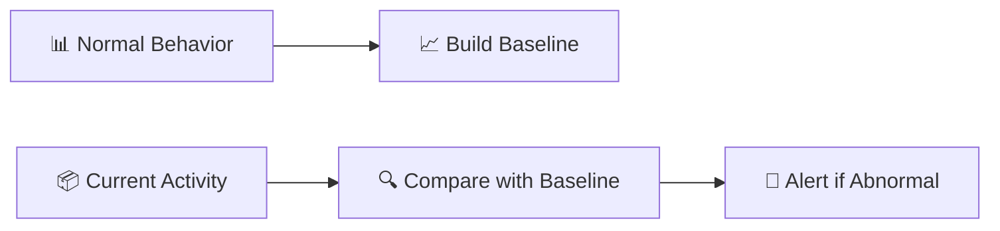

---

<!--
Image Description:
Create an infographic illustrating anomaly-based detection. Show a baseline of normal network behavior being established, followed by current activity being compared against that baseline. Highlight unusual behavior triggering an alert.

Suggested Search Keywords:
anomaly based intrusion detection diagram
behavior based IDS infographic
-->

<p align="center">

</p>

---

## ✅ Advantages

- Can identify previously unknown attacks.
- Useful for detecting insider threats.
- Effective against zero-day exploits and unusual behavior.

### ⚠️ Limitations

- Higher false positive rate.
- Requires time to learn normal behavior.
- May require frequent tuning.

---

# 🔀 Hybrid IDS

Modern IDS solutions often combine multiple detection methods.

A **Hybrid IDS** uses both:

- Signature-Based Detection
- Anomaly-Based Detection

This allows organizations to detect:

- Known attacks using signatures.
- Unknown or emerging threats using behavioral analysis.

Hybrid systems provide a more balanced approach and are widely used in enterprise environments.

---

# 📋 Comparison of Detection Methods

| Detection Method | Strength | Limitation |
|------------------|----------|------------|
| Signature-Based | Excellent for known attacks | Cannot detect unknown threats |
| Anomaly-Based | Detects unusual behavior and zero-day attacks | More false positives |
| Hybrid | Combines both approaches | More complex and resource-intensive |

---

> **💡 Key Idea**
>
> IDS technologies can be classified in two different ways:
>
> - **Where they are deployed** (NIDS or HIDS)
> - **How they detect threats** (Signature-Based, Anomaly-Based, or Hybrid)
>
> Modern enterprise IDS solutions often combine multiple deployment models and detection techniques to achieve broader visibility and stronger threat detection.

---

# 🏢 Deploying an IDS in Real Networks

Knowing how an IDS works is only part of the story.

The next question is:

> **Where should an IDS be placed so it can observe the most useful network traffic?**

If an IDS is placed in the wrong location, it may miss important attacks or generate incomplete information.

For this reason, network administrators carefully choose where IDS sensors are deployed.

---

# 📍 Common IDS Deployment Locations

Organizations often install IDS sensors at locations where large amounts of important traffic pass through.

Common deployment points include:

- Behind the firewall
- Between the Internet and internal network
- Near critical servers
- Between network segments
- Inside data centers
- Cloud environments

The goal is to maximize visibility while minimizing blind spots.

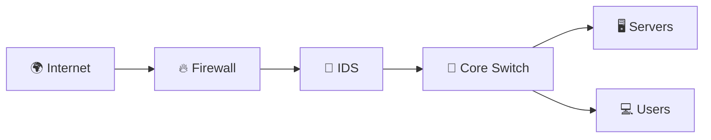

In this example, the IDS analyzes traffic **after it passes through the firewall**, allowing it to inspect communications that were permitted into the network.

---

<!--
Image Description:
Create a network architecture diagram showing an IDS deployed behind a firewall and before the core switch. Include servers and user devices connected to the core switch to illustrate how the IDS monitors traffic entering the internal network.

Suggested Search Keywords:
enterprise IDS deployment diagram
IDS behind firewall architecture
-->

<p align="center">

</p>

---

# 🔀 SPAN (Mirror) Port

One challenge with an IDS is that it must **observe traffic without interrupting it**.

Managed switches solve this problem using a **SPAN (Switched Port Analyzer)** or **Mirror Port**.

A SPAN port creates a copy of network traffic and sends it to the IDS.

```text
Normal Traffic
      │
      ▼

Managed Switch
      │
      ├────────► Destination Device
      │
      ▼
 Mirror (SPAN) Port
      │
      ▼
     🚨 IDS
```

Because the IDS receives only a copy of the traffic, it can analyze packets without affecting normal communication.

---

<!--
Image Description:
Illustrate a managed switch with a SPAN (Mirror) port. Show network traffic flowing normally to its destination while a copy of the traffic is simultaneously sent to an IDS for analysis.

Suggested Search Keywords:
SPAN port IDS diagram
switch mirror port network monitoring
-->

<p align="center">

</p>

---

# 🔌 Network TAP (Test Access Point)

Another common method for providing traffic to an IDS is a **Network TAP**.

A TAP is a dedicated hardware device installed directly into a network link.

Unlike a SPAN port, a TAP creates an exact copy of all network traffic, making it highly reliable.

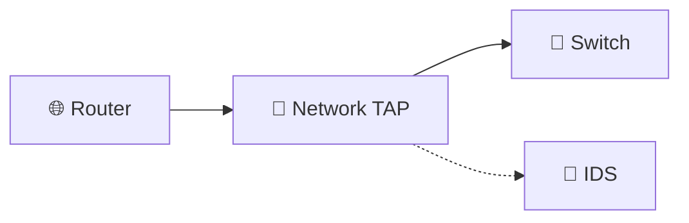

Network TAPs are commonly used in enterprise environments where complete packet visibility is essential.

---

<!--
Image Description:
Create a diagram illustrating a Network TAP placed between a router and a switch. Show the TAP forwarding normal traffic while simultaneously sending an identical copy to an IDS.

Suggested Search Keywords:
network TAP IDS diagram
test access point network monitoring
-->

<p align="center">

</p>

---

# 📊 IDS and SIEM Integration

Large organizations rarely monitor IDS alerts manually.

Instead, IDS alerts are forwarded to a **Security Information and Event Management (SIEM)** platform.

A SIEM collects logs from multiple security devices, including:

- Firewalls
- IDS
- IPS
- Servers
- Authentication systems
- Cloud services

By combining information from many sources, a SIEM helps security teams identify complex attacks that might not be obvious from a single alert.

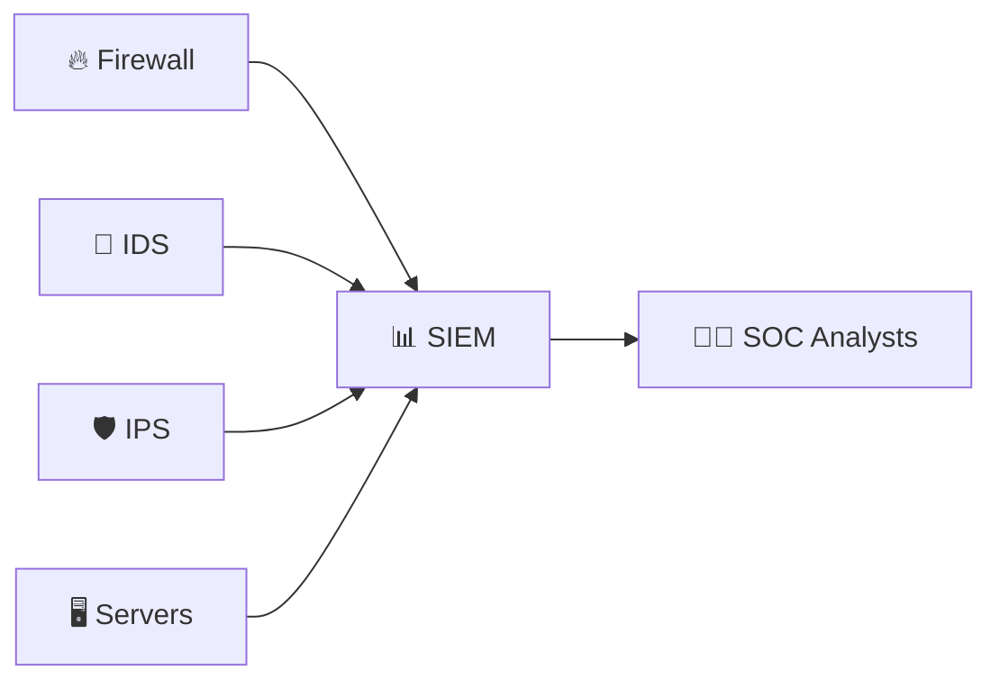

---

<!--
Image Description:
Illustrate a SIEM collecting logs from multiple sources, including a Firewall, IDS, IPS, and Servers. Show the SIEM forwarding correlated alerts to SOC analysts for investigation.

Suggested Search Keywords:
SIEM architecture diagram
IDS SIEM integration infographic
-->

<p align="center">

</p>

---

# 👨‍💻 The Role of the Security Operations Center (SOC)

A **Security Operations Center (SOC)** is responsible for continuously monitoring an organization's security systems.

When an IDS generates an alert, SOC analysts investigate questions such as:

- Is this a real attack?
- Is it a false alarm?
- Which systems are affected?
- What should be done next?

The IDS acts as an **early warning system**, while the SOC provides the human expertise needed to evaluate and respond to alerts.

---

# ⚠️ False Positives and False Negatives

No IDS is perfect.

Security analysts must understand two important concepts.

## 🚨 False Positive

A **False Positive** occurs when the IDS reports an attack even though no attack has actually occurred.

Example:

Normal employee activity is incorrectly identified as malicious.

---

## ❌ False Negative

A **False Negative** occurs when malicious activity is **not detected**.

Example:

An attacker successfully compromises a server without triggering an IDS alert.

---

# 📊 Comparison

| Event | Meaning | Risk |
|--------|---------|------|
| False Positive | Benign activity flagged as malicious | Wastes analyst time |
| False Negative | Real attack goes undetected | High security risk |

Security teams continually tune IDS rules to reduce both types of errors.

---

# ☁️ Cloud-Based IDS

As organizations move services to cloud platforms, IDS solutions have also evolved.

Cloud-based IDS services monitor traffic within cloud environments such as:

- Virtual Networks
- Cloud Servers
- Containers
- Kubernetes Clusters

These solutions provide visibility into environments where traditional hardware IDS appliances cannot be deployed.

---

# ✅ Best Practices for IDS Deployment

To maximize effectiveness, organizations should follow several best practices:

- Deploy IDS at strategic network locations.
- Keep detection signatures up to date.
- Regularly review and investigate alerts.
- Integrate IDS with SIEM platforms.
- Combine NIDS and HIDS where appropriate.
- Tune detection rules to reduce false positives.
- Monitor both on-premises and cloud environments.

---

> **📝 Remember**
>
> An IDS is most effective when it is properly deployed, continuously monitored, and integrated with other security technologies.
>
> Simply installing an IDS is not enough—its alerts must be analyzed, correlated, and acted upon by trained security professionals.

---

# 🛡️ Cybersecurity Perspective

An Intrusion Detection System is much more than a network monitoring tool.

For security professionals, it serves as an **early warning system**, helping identify suspicious activity before it develops into a larger security incident.

An IDS does not usually stop an attacker.

Instead, it provides the visibility needed to recognize attacks that might otherwise remain unnoticed.

This visibility is one of the most valuable assets in modern cybersecurity.

---

# 🏰 IDS in Defense in Depth

Throughout this networking module, you've encountered several technologies that work together to secure a network.

Rather than relying on a single security device, organizations implement **Defense in Depth**, where multiple layers of security complement one another.

```text
                 Internet
                     │
                     ▼
              🔥 Firewall
                     │
                     ▼
              🚨 IDS
                     │
                     ▼
              🛡️ IPS
                     │
                     ▼
             🏢 Internal Network
```

Each layer has a different responsibility:

| Security Layer | Primary Responsibility |
|----------------|------------------------|
| 🔥 Firewall | Controls which traffic is permitted |
| 🚨 IDS | Detects suspicious or malicious activity |
| 🛡️ IPS | Detects and automatically blocks attacks |

Together, these technologies provide significantly stronger protection than any single solution.

---

<!--
Image Description:
Create a layered cybersecurity diagram illustrating Defense in Depth. Show Internet traffic passing through a Firewall, then an IDS, then an IPS before reaching the Internal Network. Clearly label the responsibility of each layer: Firewall (Control), IDS (Detect), IPS (Prevent).

Suggested Search Keywords:
defense in depth firewall IDS IPS diagram
layered network security infographic
-->

<p align="center">

</p>

---

# 🔎 IDS and Threat Hunting

Not every attack is immediately obvious.

Some attackers move slowly through a network, attempting to avoid detection.

Security teams therefore perform **Threat Hunting**, a proactive process of searching for hidden threats before they cause significant damage.

IDS alerts often provide the starting point for these investigations.

By analyzing IDS logs and network activity, analysts can identify:

- Unusual communication patterns
- Repeated login attempts
- Unexpected data transfers
- Suspicious connections between systems

An IDS helps security teams ask:

> **"Is there evidence that an attacker is already inside the network?"**

---

# 🚑 IDS and Incident Response

When an IDS generates an alert, the work is only beginning.

Security teams follow an **Incident Response** process to determine what happened and how to respond.

A simplified workflow looks like this:

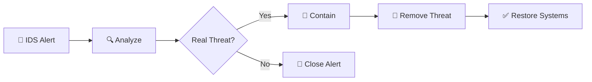

The IDS provides the information that helps responders make informed decisions during an investigation.

---

# 🧭 IDS and the MITRE ATT&CK Framework

Many organizations map IDS alerts to the **MITRE ATT&CK Framework**, a knowledge base that describes how attackers behave during real-world cyberattacks.

Instead of focusing only on malware, the framework documents attacker techniques such as:

- Credential Access
- Privilege Escalation
- Lateral Movement
- Command and Control
- Data Exfiltration

By mapping IDS alerts to these techniques, security teams gain a clearer understanding of an attacker's objectives and progression through the network.

---

# 🦈 IDS and Wireshark

Earlier in this roadmap, you learned that an IDS analyzes network packets.

Another widely used networking tool is **Wireshark**.

Although both work with network traffic, they serve different purposes.

| IDS | Wireshark |
|------|-----------|
| Monitors traffic continuously | Captures and analyzes packets manually |
| Generates alerts | Does not generate alerts by default |
| Used for security monitoring | Used for troubleshooting and forensic analysis |
| Runs continuously | Usually started by an administrator when needed |

As you continue through this roadmap, you'll eventually use Wireshark to inspect the same types of packets that an IDS analyzes automatically.

---

# ⚠️ Beginner Mistakes

Many newcomers misunderstand the purpose of an IDS.

Common misconceptions include:

❌ Believing an IDS automatically blocks attacks.

❌ Assuming every IDS alert indicates a successful attack.

❌ Ignoring false positives.

❌ Deploying an IDS but never reviewing its alerts.

❌ Thinking an IDS replaces a firewall or antivirus software.

Remember:

> **Detection is only valuable if someone investigates the alerts.**

---

# 💡 Did You Know?

- Many enterprise IDS solutions inspect millions of packets every second.
- Open-source IDS platforms such as **Snort** and **Suricata** are widely used by security professionals.
- IDS alerts are often combined with firewall logs inside a SIEM for better threat detection.
- Many cloud providers now offer managed IDS services for cloud-native environments.

---

# ⏱️ 60-Second Revision

- An IDS continuously monitors network or host activity.
- Unlike a firewall, it normally does **not** block traffic.
- IDS solutions detect suspicious behavior using signatures, anomaly detection, or hybrid techniques.
- NIDS monitors entire networks, while HIDS monitors individual hosts.
- IDS alerts are investigated by SOC analysts.
- SIEM platforms combine IDS alerts with other security logs.
- IDS is an essential layer in a Defense in Depth strategy.

---

# 📌 Key Takeaways

- An IDS provides visibility into suspicious network activity.
- Detection and prevention are different security functions.
- IDS deployment location significantly affects its effectiveness.
- Security teams rely on IDS alerts for incident response and threat hunting.
- IDS works together with firewalls, IPS, and SIEM platforms to strengthen enterprise security.

---

# 🧠 Final Knowledge Check

### Question 1

Why is an IDS considered a detection technology rather than a prevention technology?

<details>
<summary>Answer</summary>

Because an IDS monitors network or host activity and generates alerts about suspicious behavior, but it does not normally block or modify traffic.

</details>

---

### Question 2

What is the difference between a Network IDS (NIDS) and a Host IDS (HIDS)?

<details>
<summary>Answer</summary>

A NIDS monitors traffic across an entire network from strategic locations, while a HIDS runs on an individual computer or server and monitors activity within that specific host.

</details>

---

### Question 3

What is the difference between signature-based detection and anomaly-based detection?

<details>
<summary>Answer</summary>

Signature-based detection compares activity against known attack patterns, whereas anomaly-based detection identifies behavior that deviates from an established baseline of normal activity.

</details>

---

### Question 4

Why are false negatives generally considered more dangerous than false positives?

<details>
<summary>Answer</summary>

A false negative means malicious activity was not detected, allowing an attacker to continue operating without being noticed.

</details>

---

### Question 5

How does an IDS complement a firewall?

<details>
<summary>Answer</summary>

A firewall controls access by allowing or blocking traffic, while an IDS monitors permitted traffic for suspicious behavior and alerts security teams when potential threats are detected.

</details>

---

# 📚 Further Reading

Continue exploring related topics in this roadmap:

- **Firewall.md** — Controlling network traffic with security policies
- **IPS.md** *(Next Lesson)* — Automatically preventing malicious network activity
- **Wireshark** *(Future Module)* — Packet capture and protocol analysis
- **SIEM** *(Future Module)* — Centralized security monitoring and event correlation
- **Network Security** — Building layered enterprise defenses

---

# 🗺️ Where You Are in the Roadmap

```text
Cybersecurity Roadmap

02-Networking

README.md
│
├── ✅ Network Devices Overview
│
├── ✅ Repeater
├── ✅ Hub
├── ✅ Bridge
├── ✅ Switch
├── ✅ Router
├── ✅ Gateway
├── ✅ Modem
├── ✅ Access Point
├── ✅ Firewall
│
├── 📍 IDS (Current Lesson)
├── ⏭️ IPS
└── ⏳ Load Balancer
```

---

# ➡️ Next Lesson

Throughout this chapter, you've learned how an **Intrusion Detection System (IDS)** monitors network activity, detects suspicious behavior, and alerts security teams when potential threats are identified.

However, an IDS usually takes **no direct action** against malicious traffic.

This raises an important question:

> **What if the security system could automatically stop an attack the moment it was detected?**

That is the role of an **Intrusion Prevention System (IPS)**.

In the next lesson, you'll learn how IPS builds upon IDS by operating **inline** with network traffic, inspecting packets in real time, and actively blocking malicious connections before they can reach their targets. You'll also explore prevention techniques, deployment models, and how IPS completes the trio of **Firewall → IDS → IPS** in a modern layered security architecture.

**Continue to the next lesson:** **[IPS.md](IPS.md)** →
