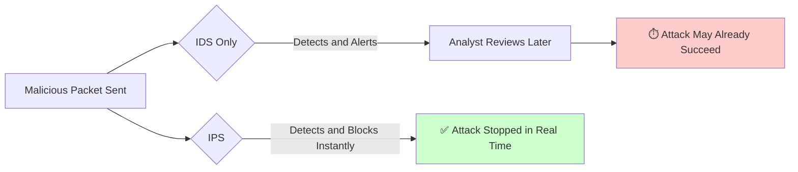
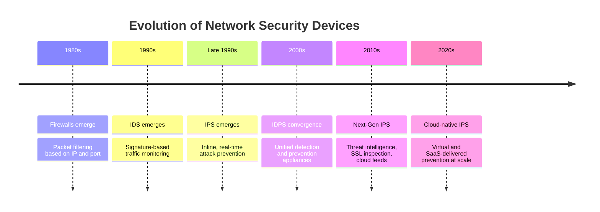
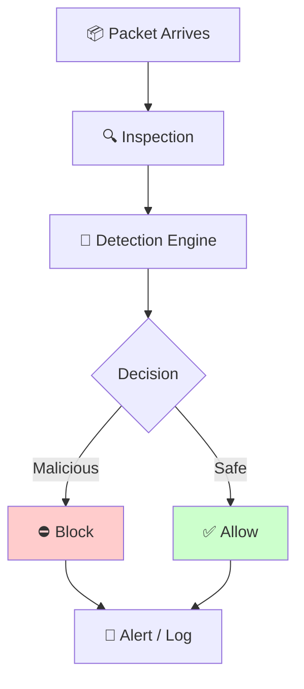
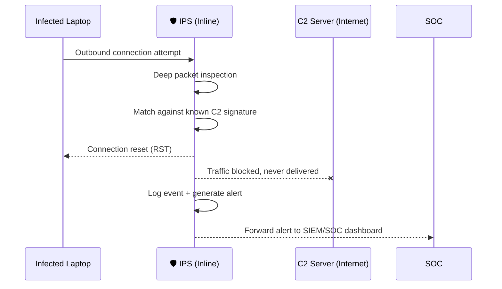
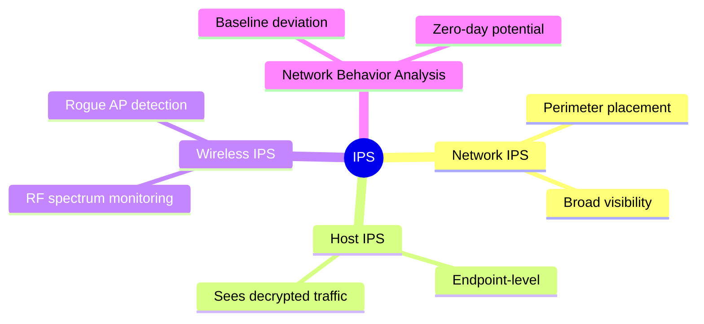
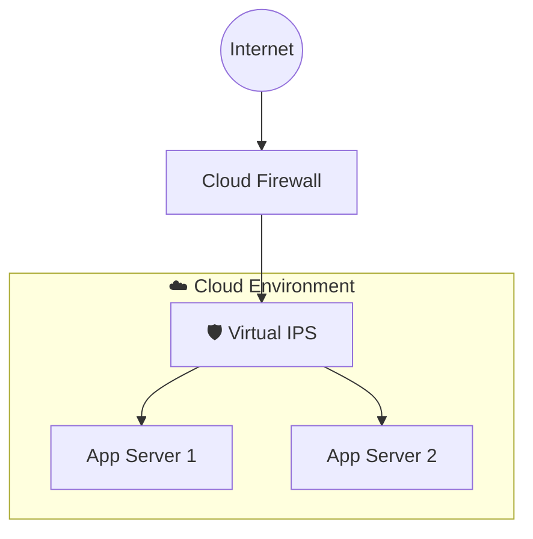

# 🛡️ Intrusion Prevention System (IPS)

> Detecting an attack is only half the battle — stopping it before it does damage is the other half. This is where IPS enters the story.


---

## 📚 Table of Contents

- [Part 1 — Introduction](#part-1--introduction)
  - [Previously in this Roadmap](#previously-in-this-roadmap)
  - [From Firewall to IDS to IPS](#from-firewall-to-ids-to-ips)
  - [Why Detection Alone Isn't Enough](#why-detection-alone-isnt-enough)
  - [Why IPS Exists](#why-ips-exists)
  - [A New Perspective on Network Security](#a-new-perspective-on-network-security)
  - [Security Evolution Timeline](#security-evolution-timeline)
  - [Learning Objectives](#learning-objectives)
- [Part 2 — Understanding IPS](#part-2--understanding-ips)
  - [What is IPS?](#what-is-ips)
  - [Purpose and Core Responsibilities](#purpose-and-core-responsibilities)
  - [Active vs Passive Security](#active-vs-passive-security)
  - [Inline Security](#inline-security)
  - [Deep Packet Inspection — A First Look](#deep-packet-inspection--a-first-look)
  - [IPS vs IDS](#ips-vs-ids)
  - [IPS vs Firewall](#ips-vs-firewall)
- [Part 3 — How IPS Works](#part-3--how-ips-works)
  - [The IPS Workflow](#the-ips-workflow)
  - [Packet Inspection](#packet-inspection)
  - [Inline Analysis](#inline-analysis)
  - [Rule Engine and Signature Matching](#rule-engine-and-signature-matching)
  - [Response Actions](#response-actions)
  - [Real-World Walkthrough](#real-world-walkthrough)
- [Part 4 — Types of IPS](#part-4--types-of-ips)
  - [Network IPS (NIPS)](#network-ips-nips)
  - [Host IPS (HIPS)](#host-ips-hips)
  - [Wireless IPS (WIPS)](#wireless-ips-wips)
  - [Network Behavior Analysis (NBA)](#network-behavior-analysis-nba)
  - [Detection Methods](#detection-methods)
- [Part 5 — Deployment & Enterprise Use](#part-5--deployment--enterprise-use)
  - [Deployment Modes](#deployment-modes)
  - [Fail-Open vs Fail-Closed](#fail-open-vs-fail-closed)
  - [High Availability and Performance](#high-availability-and-performance)
  - [False Positives and False Negatives](#false-positives-and-false-negatives)
  - [Best Practices](#best-practices)
  - [Cloud IPS and Virtual IPS](#cloud-ips-and-virtual-ips)
  - [SIEM Integration and the SOC Workflow](#siem-integration-and-the-soc-workflow)
- [Final Part — IPS in the Bigger Picture](#final-part--ips-in-the-bigger-picture)
  - [Defense in Depth](#defense-in-depth)
  - [Zero Trust](#zero-trust)
  - [MITRE ATT&CK and Incident Response](#mitre-attck-and-incident-response)
  - [Firewall + IDS + IPS Relationship](#firewall--ids--ips-relationship)
  - [Beginner Mistakes](#beginner-mistakes)
  - [Pro Tips](#pro-tips)
  - [Did You Know?](#did-you-know)
  - [60-Second Revision](#60-second-revision)
  - [Key Takeaways](#key-takeaways)
  - [Final Knowledge Check](#final-knowledge-check)
  - [Further Reading](#further-reading)
- [Roadmap Progress](#roadmap-progress)
- [Next Lesson](#next-lesson)

---

## Part 1 — Introduction

### Previously in this Roadmap

By this point in the roadmap, you have built a solid foundation in network infrastructure and security devices. You understand how a **Repeater** and **Hub** move raw signals, how a **Bridge** and **Switch** intelligently forward frames, how a **Router** and **Gateway** direct traffic between networks, and how a **Modem** and **Access Point** get devices onto the network in the first place.

More importantly, in **Firewall.md** you learned how organizations control *what* is allowed to enter or leave a network. Then, in **IDS.md**, you learned how organizations *watch* their network for signs of malicious activity.

That leaves one glaring question that this chapter will answer:

> If a Firewall controls access, and an IDS only watches and alerts — **who actually stops the attack while it's happening?**

That job belongs to the **Intrusion Prevention System (IPS)**.

### From Firewall to IDS to IPS

Think of network security as a story with three characters, each building on the last:

| Character | Role in the Story |
|---|---|
| 🔥 **Firewall** | The gatekeeper. Decides who is *allowed* through the door based on rules. |
| 🚨 **IDS** | The security camera. Watches everything, and *alerts* someone if it sees something suspicious. |
| 🛡️ **IPS** | The security guard. Sees the same suspicious activity as the camera — but instead of just alerting, **physically stops it**. |

As you learned in **Firewall.md**, a firewall is excellent at enforcing broad access rules — allow HTTP, block Telnet, permit traffic from a trusted subnet. But a firewall generally does not look deeply inside allowed traffic. If an attacker's malicious payload is wrapped inside a permitted protocol like HTTP, the firewall waves it through.

As you learned in **IDS.md**, an Intrusion Detection System solves part of this problem. It inspects traffic content, compares it against known attack patterns and behavioral baselines, and raises an alert when something looks wrong. This closes the visibility gap the firewall left open.

But IDS introduces a new problem — one this chapter exists to solve.

### Why Detection Alone Isn't Enough

Imagine a security camera in a bank. It sees a robbery in progress, and it does its job perfectly — it records everything and sends an alert to the security office.

But by the time a human reads that alert, walks over, and responds... **the robbery is already over.**

This is precisely the limitation of IDS. It was designed to *observe and report*, not to *act*. In cybersecurity terms:

- An IDS sensor sees a malicious payload → generates an alert → a SOC analyst (or automated system) must review and respond.
- That review-and-response window might take seconds. It might take hours. In a real breach, attackers often need only **seconds** to exfiltrate data, deploy ransomware, or pivot to another host.

> [!IMPORTANT]
> **The core limitation of IDS is time.** Detection without immediate action leaves a window of opportunity for the attack to succeed before a human — or another system — can intervene.

This gap between *knowing* about an attack and *stopping* an attack is exactly why the industry needed a technology that could act autonomously and instantly.

### Why IPS Exists

An Intrusion Prevention System exists to close that exact gap. It takes everything an IDS is good at — deep inspection, signature matching, anomaly detection — and adds one transformative capability:

**The authority to act immediately, without waiting for a human.**

Instead of simply raising a flag, an IPS sits directly in the flow of traffic and can drop malicious packets, reset connections, or block offending hosts in real time — often within milliseconds of detection.



### A New Perspective on Network Security

Up to now, this roadmap has taught you devices that either **move traffic** (Repeater, Hub, Bridge, Switch, Router) or **passively guard** traffic (Firewall, IDS). IPS introduces a new category entirely: an **active, inline, automated defender**.

This is a conceptual turning point in your cybersecurity education. Every device before this chapter reacted to traffic based on static rules or simply reported what it saw. IPS is the first device in this roadmap that makes **autonomous security decisions in real time**.

> 📝 **Note:** Some vendors sell a single physical or virtual appliance that performs both IDS and IPS functions, often called an **IDPS** (Intrusion Detection and Prevention System). The underlying detection engines are frequently identical — what differs is *where* the device sits in the network and whether it is *permitted to act*.

### Security Evolution Timeline



<!--
Image Description:
A horizontal timeline graphic showing the evolution from Firewall → IDS → IPS → Next-Gen IPS → Cloud IPS, with small icons representing each era of network security technology.

Suggested Search Keywords:
network security timeline
cybersecurity evolution diagram
IPS history infographic
-->

<p align="center">

</p>

### Comparison: Where IPS Fits

| Device | Sees Traffic Content? | Takes Action? | Sits Inline? |
|---|---|---|---|
| 🔥 Firewall | Limited (headers, ports) | ✅ Blocks by rule | ✅ Yes |
| 🚨 IDS | ✅ Deep inspection | ❌ Alerts only | ❌ Usually out-of-band |
| 🛡️ IPS | ✅ Deep inspection | ✅ Blocks automatically | ✅ Yes |

> [!TIP]
> **Mini Review:** A Firewall controls access based on rules. An IDS watches traffic and raises alarms. An IPS does what IDS does — but also stops the attack itself, in real time, without waiting for a human.

### Knowledge Check ✅

<details>
<summary>1. What is the single biggest limitation of an IDS that IPS was created to solve?</summary>

The delay between detecting an attack and a human responding to it. IDS only alerts — it cannot act — which leaves a window where the attack can succeed before anyone intervenes.
</details>

<details>
<summary>2. True or False: An IPS and an IDS always use completely different detection engines.</summary>

False. Many vendors use the same detection engine for both; the difference lies in placement (inline vs out-of-band) and whether the device is authorized to actively block traffic.
</details>

### Learning Objectives

By the end of this chapter, you will be able to:

- Explain why IPS was developed and what problem it solves that Firewall and IDS could not.
- Describe how an IPS inspects, analyzes, and reacts to traffic in real time.
- Distinguish between Network IPS, Host IPS, Wireless IPS, and Network Behavior Analysis.
- Compare signature-based, anomaly-based, and policy-based detection methods.
- Understand enterprise deployment models, including fail-open/fail-closed design and high availability.
- Explain how IPS fits into Defense in Depth, Zero Trust, and modern SOC operations.

---

## Part 2 — Understanding IPS

### What is IPS?

An **Intrusion Prevention System (IPS)** is a network security technology that sits **directly in the path of network traffic**, inspects that traffic in real time, and automatically **blocks, drops, or otherwise neutralizes** traffic identified as malicious — all without requiring human intervention.

Where IDS answers the question *"Is something wrong?"*, IPS answers a more demanding question:

> *"Is something wrong, and if so, what should be done about it — right now?"*

### Purpose and Core Responsibilities

An IPS exists to fulfill several core responsibilities:

- **Real-time inspection** of packets flowing through the network.
- **Immediate response** to confirmed or highly-suspected threats.
- **Enforcement** of security policy at the traffic level, not just the access level.
- **Reduction of dwell time** — the amount of time an attacker's traffic is allowed to persist on the network.
- **Providing a safety net** for threats that bypass the firewall's access rules.

### Active vs Passive Security

This distinction is the conceptual heart of this entire chapter.

| Security Model | Description | Example Device |
|---|---|---|
| **Passive** | Observes and reports; requires a human or external system to act | IDS |
| **Active** | Observes and acts immediately, autonomously | IPS |

> 🧠 **Remember:** Passive security tells you a window was broken. Active security slams the window shut before the intruder climbs through.

### Inline Security

For an IPS to block traffic in real time, it cannot simply "listen" to a copy of traffic the way many IDS deployments do. It must sit **inline** — meaning every single packet physically passes *through* the IPS device on its way to its destination.


This inline positioning is what gives IPS its power — and, as you'll see in Part 5, also its risk. If the IPS device fails, it can potentially take the entire network path down with it, since traffic has no alternate route around it.

> 📝 **Note:** This is fundamentally different from a typical IDS deployment, where a copy of traffic (via a SPAN port or network tap) is sent to the sensor. The original traffic keeps flowing whether the IDS is up or down. An inline IPS has no such luxury.

### Deep Packet Inspection — A First Look

To decide whether traffic is malicious, an IPS must look past the basic headers a firewall checks (source IP, destination IP, port number) and examine the **actual contents** of the packet — this is called **Deep Packet Inspection (DPI)**.

Think of DPI like airport security: a firewall is the metal detector checking if you're carrying anything metallic at all, while DPI is the full baggage scan that looks *inside* your suitcase to see exactly what's there.

> We'll explore DPI in much greater depth in Part 3, since it's central to how the IPS inspection engine actually functions.

### IPS vs IDS

This is the single most important comparison in this chapter, because it directly addresses the most common misconception in networking education.

> [!WARNING]
> **Common Misconception:** *"IDS and IPS are basically the same thing."*
> This is **false**, and it's one of the most frequently misunderstood concepts in cybersecurity. They may share detection logic, but their **role, placement, and authority to act** are fundamentally different.

| Aspect | IDS | IPS |
|---|---|---|
| Placement | Out-of-band (monitors a copy of traffic) | Inline (traffic flows through it) |
| Action on threat | Alerts only | Blocks, drops, resets automatically |
| Risk if device fails | Network unaffected | Network path may be affected |
| Response speed | Depends on human/analyst response | Immediate (milliseconds) |
| Primary goal | Visibility and detection | Prevention and enforcement |

### IPS vs Firewall

| Aspect | Firewall | IPS |
|---|---|---|
| Decision basis | IP address, port, protocol, simple rules | Packet content, signatures, behavior patterns |
| Inspection depth | Shallow (headers) | Deep (payload) |
| Primary question | "Is this connection allowed?" | "Is this allowed traffic actually malicious?" |
| Example block | Block all inbound traffic on port 23 (Telnet) | Block an allowed HTTP connection carrying a SQL injection payload |

> 💡 **Example:** A firewall rule permits all traffic on port 443 (HTTPS) because it's a normal, trusted port. An attacker exploits this trust and sends a malicious exploit payload disguised inside an HTTPS session. The firewall lets it through — it's "allowed" traffic. The IPS, inspecting the actual content of that session, recognizes the exploit signature and kills the connection instantly.

<!--
Image Description:
A side-by-side diagram showing a Firewall checking only packet headers (IP/Port) versus an IPS inspecting the full payload contents of the same packet, with a magnifying glass icon over the payload.

Suggested Search Keywords:
deep packet inspection diagram
firewall vs IPS comparison
packet header vs payload illustration
-->

<p align="center">

</p>

> [!TIP]
> **Mini Review:** IDS watches and warns. Firewall filters based on rules. IPS inspects deeply *and* acts instantly — combining the visibility of IDS with the enforcement power of a Firewall, but at a much more granular level.

---

## Part 3 — How IPS Works

### The IPS Workflow

Every packet that reaches an inline IPS passes through a consistent internal pipeline:



Let's walk through each stage.

### Packet Inspection

As each packet arrives at the IPS, it is captured and reassembled if necessary (since data is often split across multiple packets). The IPS then extracts relevant details: headers, protocol behavior, and — critically — the payload itself, using Deep Packet Inspection.

Unlike a firewall, which might approve a packet after a quick header check, the IPS holds the packet just long enough to analyze its full content before deciding what happens next.

### Inline Analysis

Because the IPS sits inline, this inspection happens **in the direct path of the traffic**, not on a mirrored copy. This has a critical implication:

> [!IMPORTANT]
> Inline analysis must happen **fast**. Every microsecond of delay adds latency to real network traffic. This is why IPS hardware and detection engines are heavily optimized for speed — the device cannot become a bottleneck for legitimate business traffic.

### Rule Engine and Signature Matching

The heart of the IPS is its **detection engine**, which compares incoming traffic against:

- **Signatures** — known patterns of malicious traffic, similar to how antivirus software matches known virus fingerprints.
- **Rules** — administrator or vendor-defined logic describing what is and isn't acceptable behavior.
- **Behavioral baselines** — for anomaly-based detection, discussed further in Part 4.

If a packet's contents match a known attack signature — for example, a pattern associated with a specific SQL injection string or a known exploit for a specific vulnerability — the detection engine flags it as malicious.

### Response Actions

Once the detection engine flags traffic as malicious, the IPS has several possible response actions:

| Action | Description |
|---|---|
| **Block / Drop Packet** | The malicious packet is silently discarded, never reaching its destination |
| **Reset Connection** | The IPS sends a TCP reset (RST) to both endpoints, tearing down the malicious session |
| **Rate Limiting** | Traffic from a suspicious source is throttled rather than fully blocked, useful for handling suspected DoS activity |
| **Logging & Alerting** | The event is recorded and forwarded to a SIEM or SOC dashboard for visibility, regardless of whether it was blocked |

> 📝 **Note:** Logging happens alongside every action — even a block — because visibility into what was stopped is just as important as the prevention itself. Security teams need evidence trails for investigation and compliance.

### Real-World Walkthrough

Imagine an employee's laptop is silently infected with malware that attempts to communicate with a command-and-control (C2) server to receive further instructions.



Notice what did **not** happen here: no analyst had to be watching in real time for this attack to be stopped. The malware's attempt to "phone home" was blocked automatically, the instant it was recognized — and only *afterward* did a human get notified, for investigation and follow-up.

<!--
Image Description:
A sequence diagram-style illustration showing an infected laptop attempting to contact a C2 server, with the IPS intercepting and blocking the connection inline before forwarding an alert to a SOC dashboard.

Suggested Search Keywords:
IPS blocking malware C2 traffic diagram
inline intrusion prevention workflow
SOC alert workflow illustration
-->

<p align="center">

</p>

### Knowledge Check ✅

<details>
<summary>1. Why must IPS inspection happen quickly compared to some IDS deployments?</summary>

Because the IPS sits inline — directly in the path of real traffic. Any delay in inspection adds latency to the network itself, unlike an out-of-band IDS which analyzes a copy without affecting live traffic flow.
</details>

<details>
<summary>2. What is the difference between "Block/Drop" and "Reset Connection" as IPS response actions?</summary>

Blocking/dropping silently discards the malicious packet without notifying either end. Resetting a connection actively sends a TCP RST signal to both the source and destination, deliberately tearing down the entire session.
</details>

---

## Part 4 — Types of IPS

Not all IPS deployments look the same. Just as you learned that different network devices serve different layers of the network (as covered in **Choosing the Right Network Device.md**), IPS technology comes in several specialized forms.

### Network IPS (NIPS)

A **Network IPS** is a dedicated appliance (physical or virtual) deployed at a key chokepoint in the network — typically just inside the perimeter firewall — where it can inspect all traffic entering or leaving a network segment.

- **Strength:** Broad visibility; protects every device behind it without needing anything installed on endpoints.
- **Limitation:** Cannot see encrypted traffic without decryption, and cannot protect a device once traffic has already passed it if that device talks to another *internal* device directly.

### Host IPS (HIPS)

A **Host IPS** runs as software directly on an individual endpoint — a server or workstation — monitoring and blocking malicious activity at the operating system and application level on that specific machine.

- **Strength:** Sees encrypted and internal traffic *after* it's decrypted on the host; can catch local, non-network-based attacks like malicious process behavior.
- **Limitation:** Must be deployed and maintained on every single endpoint; consumes local system resources.

### Wireless IPS (WIPS)

A **Wireless IPS** specializes in monitoring the radio frequency (RF) spectrum for wireless-specific threats — rogue access points, evil-twin attacks, or unauthorized devices attempting to join the wireless network.

As you learned in **Access Point.md**, wireless networks introduce unique risks that wired networks don't face. WIPS exists specifically to police that wireless airspace, something a traditional Network IPS inspecting wired traffic would never see.

### Network Behavior Analysis (NBA)

**Network Behavior Analysis** systems don't focus on matching known attack signatures. Instead, they build a baseline of "normal" network behavior over time and raise alarms — or trigger prevention actions — when traffic deviates significantly from that baseline (for example, a sudden spike in outbound traffic suggesting data exfiltration).

### Comparison of IPS Types

| Type | Deployment Location | Best For |
|---|---|---|
| **NIPS** | Network chokepoint (inline) | Broad network-wide protection |
| **HIPS** | Individual endpoint | Deep, host-level protection |
| **WIPS** | Wireless spectrum monitoring | Rogue APs, wireless-specific attacks |
| **NBA** | Network-wide traffic analysis | Detecting abnormal behavior, zero-day patterns |

### Detection Methods

Regardless of *type*, every IPS relies on one or more underlying detection methods:

| Method | How It Works | Strength | Limitation |
|---|---|---|---|
| **Signature-based** | Matches traffic against a database of known attack patterns | Very accurate for known threats | Cannot detect brand-new, unknown (zero-day) attacks |
| **Anomaly-based** | Compares traffic to an established baseline of "normal" behavior | Can catch novel, previously unseen attacks | Higher risk of false positives if the baseline is imperfect |
| **Policy-based** | Blocks anything that violates an explicitly defined organizational policy | Highly customizable to business rules | Requires significant upfront configuration and maintenance |

<!--
Image Description:
A mindmap-style diagram with "IPS" at the center, branching out into four categories (NIPS, HIPS, WIPS, NBA), each with two or three small sub-branches describing their key traits.

Suggested Search Keywords:
IPS types mindmap
network host wireless IPS diagram
intrusion prevention system categories
-->

<p align="center">

</p>



> 🧠 **Remember:** Signature-based detection answers *"Have I seen this exact attack before?"* Anomaly-based detection answers *"Does this look different from normal?"* Most enterprise IPS deployments use a blend of both.

---

## Part 5 — Deployment & Enterprise Use

### Deployment Modes

| Mode | Description |
|---|---|
| **Inline** | Traffic physically passes through the IPS; enables active blocking |
| **Transparent Mode** | The IPS operates at Layer 2, without an IP address of its own, making it invisible to attackers and simple to insert into an existing network without redesigning IP addressing |

### Fail-Open vs Fail-Closed

Because an inline IPS sits directly in the traffic path, its behavior *during a failure* is a critical design decision.

| Mode | Behavior on Failure | Trade-off |
|---|---|---|
| **Fail-Open** | Traffic keeps flowing through, unfiltered, if the IPS crashes | Prioritizes availability; briefly sacrifices security |
| **Fail-Closed** | All traffic is blocked if the IPS crashes | Prioritizes security; sacrifices availability |

> [!WARNING]
> Choosing fail-open vs fail-closed is not a technical afterthought — it's a business risk decision. A hospital's life-critical systems might prefer fail-open to preserve connectivity, while a bank's core transaction network might prefer fail-closed to prevent any risk of unmonitored traffic.

### High Availability and Performance

Enterprise IPS deployments are typically paired in **High Availability (HA)** clusters, so that if one appliance fails, a secondary unit instantly takes over inspection duties without interrupting traffic flow.

Performance considerations include:

- **Throughput capacity** — how much traffic the IPS can inspect without becoming a bottleneck.
- **Latency introduced** — the extra delay added to every packet due to inspection.
- **Encrypted traffic inspection** — SSL/TLS decryption adds significant processing overhead.

### False Positives and False Negatives

| Term | Meaning | Consequence |
|---|---|---|
| **False Positive** | Legitimate traffic incorrectly flagged as malicious | Business disruption, blocked legitimate users |
| **False Negative** | Malicious traffic incorrectly allowed through | The actual security failure — an attack succeeds undetected |

> 💡 **Example:** An overly aggressive anomaly-based rule might flag a legitimate large file transfer during a company's year-end reporting period as a "data exfiltration" attempt, blocking an executive's report submission — a false positive with real business impact.

### Best Practices

- Regularly update signature databases to catch newly discovered threats.
- Tune anomaly-based baselines to reflect your organization's actual traffic patterns.
- Deploy in HA pairs for mission-critical network segments.
- Combine signature, anomaly, and policy-based detection rather than relying on just one.
- Continuously review false positive/negative rates and adjust rules accordingly.

### Cloud IPS and Virtual IPS

As organizations move workloads to the cloud, traditional physical IPS appliances aren't always practical. This has given rise to:

- **Virtual IPS (vIPS):** Software-based IPS running as a virtual machine, deployed within private or hybrid cloud environments.
- **Cloud IPS:** A fully managed, SaaS-delivered prevention service, often built directly into cloud provider security offerings, protecting cloud-hosted workloads without requiring dedicated hardware.



<!--
Image Description:
A cloud architecture diagram showing internet traffic passing through a cloud firewall, then a virtual IPS instance, before reaching multiple protected application servers within a cloud environment.

Suggested Search Keywords:
cloud IPS architecture diagram
virtual IPS cloud security
SaaS intrusion prevention diagram
-->

<p align="center">

</p>

### SIEM Integration and the SOC Workflow

An IPS rarely operates in isolation. Its logs and alerts are typically forwarded to a **Security Information and Event Management (SIEM)** platform, where they're correlated with data from firewalls, IDS sensors, endpoint tools, and other sources to build a complete picture of an organization's security posture.

From there, a **Security Operations Center (SOC)** analyst can investigate flagged events, confirm whether the IPS's automatic action was appropriate, and adjust rules as needed — closing the loop between automated prevention and human oversight.

<!--
Image Description:
An enterprise network diagram showing a firewall, IPS, and IDS all feeding logs and alerts into a central SIEM platform, which is monitored by SOC analysts on a dashboard.

Suggested Search Keywords:
SIEM SOC integration diagram
enterprise security architecture
IPS IDS firewall SIEM diagram
-->

<p align="center">

</p>

---

## Final Part — IPS in the Bigger Picture

### Defense in Depth

IPS is one critical layer in a broader security philosophy called **Defense in Depth** — the principle that no single security control should be relied upon alone. Firewall, IDS, IPS, endpoint protection, and user training all work together, so that if one layer fails, others remain to catch the threat.

### Zero Trust

In a **Zero Trust** security model, no traffic — internal or external — is trusted by default. IPS plays a key enforcement role here, continuously inspecting traffic even *within* a network, rather than assuming that traffic which has already passed the perimeter is automatically safe.

### MITRE ATT&CK and Incident Response

Modern IPS platforms are increasingly built around the **MITRE ATT&CK** framework, a globally recognized knowledge base of real-world attacker tactics and techniques. By aligning signatures and behavioral rules to specific ATT&CK techniques, security teams can better understand *what stage* of an attack was blocked, feeding directly into a structured **Incident Response** process.

### Firewall + IDS + IPS Relationship

This is the single most important relationship to internalize from this entire chapter:

| Technology | Primary Role |
|------------|--------------|
| 🔥 Firewall | Controls network access |
| 🚨 IDS | Detects suspicious activity |
| 🛡️ IPS | Detects **and automatically prevents** malicious activity |


### Beginner Mistakes

- ❌ Assuming IDS and IPS are interchangeable terms for the same thing.
- ❌ Deploying IPS without properly tuning rules first, leading to excessive false positives.
- ❌ Forgetting to plan for fail-open vs fail-closed behavior before a real outage occurs.
- ❌ Treating IPS as a total replacement for a firewall, rather than a complementary layer.

### Pro Tips

- ✅ Always test new IPS rule sets in a monitoring-only mode before enabling active blocking in production.
- ✅ Regularly review blocked traffic logs — sometimes what's being blocked reveals attempted attacks worth deeper investigation.
- ✅ Pair signature-based detection with anomaly-based detection to cover both known and unknown threats.

### Did You Know?

> 💡 Many modern Next-Generation Firewalls (NGFWs) now include built-in IPS functionality, blurring the line between the two technologies at the product level — even though, conceptually, they remain distinct security functions.

### 60-Second Revision

- Firewall = access control. IDS = detection. IPS = detection **plus automatic prevention**.
- IPS sits **inline**, directly in the traffic path, unlike most IDS deployments.
- Detection methods: signature-based, anomaly-based, policy-based.
- IPS types: Network (NIPS), Host (HIPS), Wireless (WIPS), and Network Behavior Analysis (NBA).
- Fail-open vs fail-closed is a critical design decision balancing availability against security.
- IPS integrates with SIEM/SOC workflows and supports Defense in Depth and Zero Trust models.

### Key Takeaways

1. IPS was created to solve the response-time gap left by IDS's passive, alert-only nature.
2. Being inline gives IPS the power to act instantly — and the responsibility to be fast and reliable.
3. No single detection method is perfect; enterprise IPS blends multiple techniques.
4. Deployment decisions like fail-open/fail-closed carry real business risk trade-offs.
5. IPS is one layer among many in a Defense in Depth and Zero Trust strategy — never a silver bullet on its own.

### Final Knowledge Check ✅

<details>
<summary>1. Why is "IDS and IPS are the same thing" considered a major misconception?</summary>

Because while they may share similar detection engines, IDS is passive (alerts only, out-of-band) while IPS is active (blocks automatically, inline). Their placement, purpose, and authority to act are fundamentally different.
</details>

<details>
<summary>2. In the Firewall → IDS → IPS progression, what does each stage add?</summary>

Firewall adds access control. IDS adds visibility and detection into allowed traffic. IPS adds automatic, real-time prevention on top of that same detection capability.
</details>

<details>
<summary>3. Why might an organization choose fail-open instead of fail-closed for a particular network segment?</summary>

To prioritize availability — ensuring traffic keeps flowing even if the IPS appliance fails — accepting a temporary security gap rather than a full network outage.
</details>

### Further Reading

- NIST Special Publication 800-94: Guide to Intrusion Detection and Prevention Systems
- MITRE ATT&CK Framework: attack.mitre.org
- Vendor documentation from major IPS providers (Cisco Firepower, Palo Alto Networks, Snort/Suricata open-source engines)

---

## Roadmap Progress

**Cybersecurity Roadmap**
**02-Networking**

```
README.md
│
├── ✅ Network Devices Overview
│
├── ✅ Repeater
├── ✅ Hub
├── ✅ Bridge
├── ✅ Switch
├── ✅ Router
├── ✅ Gateway
├── ✅ Modem
├── ✅ Access Point
├── ✅ Firewall
├── ✅ IDS
│
├── 📍 IPS (Current Lesson)
└── ⏭️ Load Balancer
```

---

## Next Lesson

With IPS complete, the security trilogy that began with **Firewall.md** is now finished: the Firewall **controls** traffic, the IDS **detects** attacks, and the IPS **prevents** them from succeeding. Together, these three devices form the backbone of real-time network defense.

The next chapter shifts the roadmap's focus in a new direction. Instead of asking "how do we stay secure?", **Load Balancer.md** asks "how do we stay available, scalable, and performant?" — a natural next step now that your understanding of network protection is solid.

**Continue to the next lesson:** **[Load Balancer.md](Load%20Balancer.md)** →
