# ⚖️ Load Balancer

> *A Load Balancer is a networking device or software service that intelligently distributes incoming client requests across multiple servers. By sharing the workload, it improves availability, scalability, reliability, and overall application performance while preventing any single server from becoming overwhelmed.*

---

<div align="center">


</div>

---

# 📖 Table of Contents

- [Previously in this Roadmap](#-previously-in-this-roadmap)
- [A New Direction in Networking](#-a-new-direction-in-networking)
- [Why Security Alone Is Not Enough](#-why-security-alone-is-not-enough)
- [The Availability Problem](#-the-availability-problem)
- [Why Do We Need a Load Balancer?](#-why-do-we-need-a-load-balancer)
- [Traffic Congestion Analogy](#-traffic-congestion-analogy)
- [Learning Objectives](#-learning-objectives)

---

# 📚 Previously in this Roadmap

Throughout this networking module, we have explored how different devices enable communication, connect networks, and protect digital infrastructure.

We started with devices that forward data, moved on to devices that intelligently route traffic, and finally learned how organizations defend their networks against cyber threats.

Our journey included:

| Device | Primary Responsibility |
|----------|------------------------|
| Repeater | Regenerate weak signals |
| Hub | Broadcast network traffic |
| Bridge | Separate collision domains |
| Switch | Forward frames efficiently |
| Router | Connect different networks |
| Gateway | Translate between different systems |
| Modem | Connect digital networks to ISPs |
| Access Point | Provide wireless connectivity |
| Firewall | Control network access |
| IDS | Detect suspicious activity |
| IPS | Detect **and automatically prevent** malicious activity |

By this point, you have learned how organizations **build secure networks**.

However, building a secure network is only part of the challenge.

Imagine an online shopping website during a major sale.

The network is secure.

The firewall blocks malicious traffic.

The IPS prevents attacks.

Everything appears to be working perfectly.

Then, suddenly...

One million customers try to access the website at exactly the same time.

The servers become overloaded.

Pages load slowly.

Users receive connection errors.

Some customers leave before completing their purchases.

Despite having excellent security, the service becomes unavailable.

This introduces a completely different problem.

> **How do we keep services available when thousands or even millions of users connect simultaneously?**

This is the problem that **Load Balancers** are designed to solve.

---

# 🌐 A New Direction in Networking

Until now, our focus has been on **communication** and **security**.

This chapter marks an important transition.

Instead of asking:

> **"How do we protect the network?"**

We begin asking:

> **"How do we keep services fast, reliable, and always available?"**

This introduces one of the most important concepts in modern networking:

> **Availability**

Availability means ensuring that applications, websites, and services remain accessible whenever users need them.

A secure service that is unavailable is still a failed service.

Likewise, a fast service that crashes under heavy traffic cannot provide a good user experience.

Modern networking therefore depends on three major goals:

- Connectivity
- Security
- Availability

These goals work together to build reliable systems.

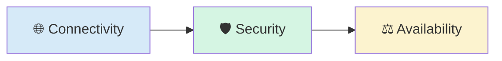

---

# 🛡️ Why Security Alone Is Not Enough

Throughout the previous chapters, we learned that security devices protect networks from malicious activity.

For example:

- A **Firewall** filters traffic.
- An **IDS** monitors for suspicious behavior.
- An **IPS** automatically blocks known threats.

These technologies help maintain the **confidentiality** and **integrity** of systems.

However, cybersecurity is built upon three fundamental objectives known as the **CIA Triad**:

- **Confidentiality** — Prevent unauthorized access.
- **Integrity** — Protect data from unauthorized modification.
- **Availability** — Ensure systems remain accessible.

So far, we have focused mainly on the first two.

Now we focus on the third.

If legitimate users cannot access a website because the servers are overloaded, the organization has an **availability problem**.

Even though no attacker has broken into the system, the service has still failed its users.

---

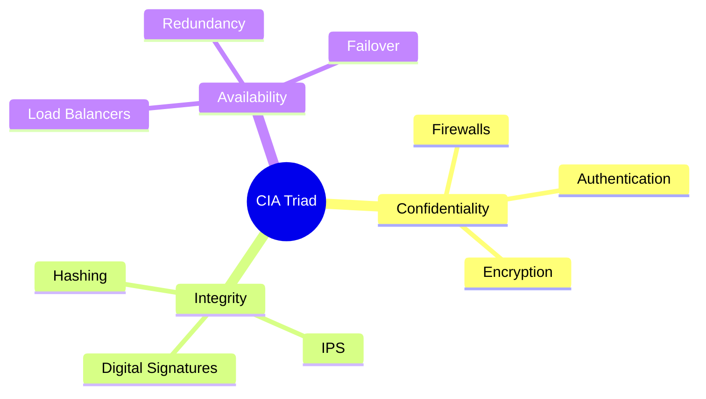

---

<!--
Image Description:
Create an illustration of the CIA Triad. Highlight Availability by showing multiple servers behind a Load Balancer serving users continuously, while Confidentiality and Integrity are represented by security shields and protected data.

Suggested Search Keywords:
CIA Triad availability infographic
load balancer CIA triad
cybersecurity availability diagram
-->

<p align="center">

</p>

---

# 🚦 The Availability Problem

Imagine a small restaurant with only one cashier.

During quiet hours, customers are served quickly.

However, during lunch time, hundreds of customers arrive at once.

A long queue forms.

Customers wait longer.

Some become frustrated and leave.

The cashier is working correctly.

The problem is not the cashier.

The problem is that **one person cannot efficiently serve everyone at the same time**.

Computer servers experience the same problem.

When a website receives more requests than a single server can handle, performance begins to degrade.

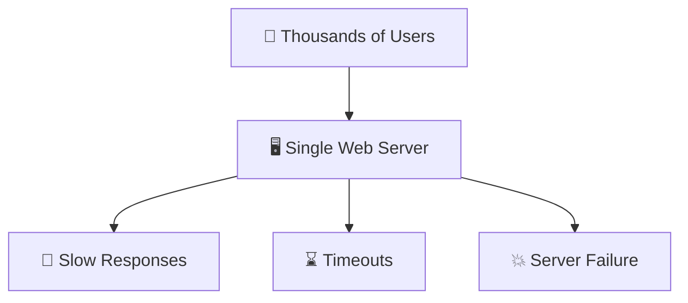

---

This situation leads to several problems:

- Slow page loading.
- Increased response times.
- Application crashes.
- Lost customer trust.
- Reduced business revenue.
- Poor user experience.

Simply buying a more powerful server may help temporarily.

Eventually, that server will also reach its limits.

A different solution is needed.

---

<!--
Image Description:
Illustrate thousands of users sending requests to a single overloaded web server. Show warning symbols indicating slow performance, long queues, and server overload.

Suggested Search Keywords:
single server overload diagram
website traffic congestion
server bottleneck illustration
-->

<p align="center">

</p>

---

# ⚖️ Why Do We Need a Load Balancer?

Instead of forcing one server to handle every request, organizations deploy multiple servers that work together.

However, another question immediately appears:

> **How do we decide which server should handle each incoming request?**

This is where the Load Balancer becomes essential.

Rather than sending every user to the same server, a Load Balancer intelligently distributes requests across multiple available servers.

Instead of this:

```text
             👥 Users
                 │
                 ▼
          🖥️ Web Server
```

We can build this:

```text
            👥 Users
               │
               ▼
        ⚖️ Load Balancer
          ┌────┼────┐
          ▼    ▼    ▼
      🖥️ S1 🖥️ S2 🖥️ S3
```

Each server now shares part of the workload.

The result is:

- Better performance.
- Higher availability.
- Improved reliability.
- Greater scalability.
- Reduced server overload.

---

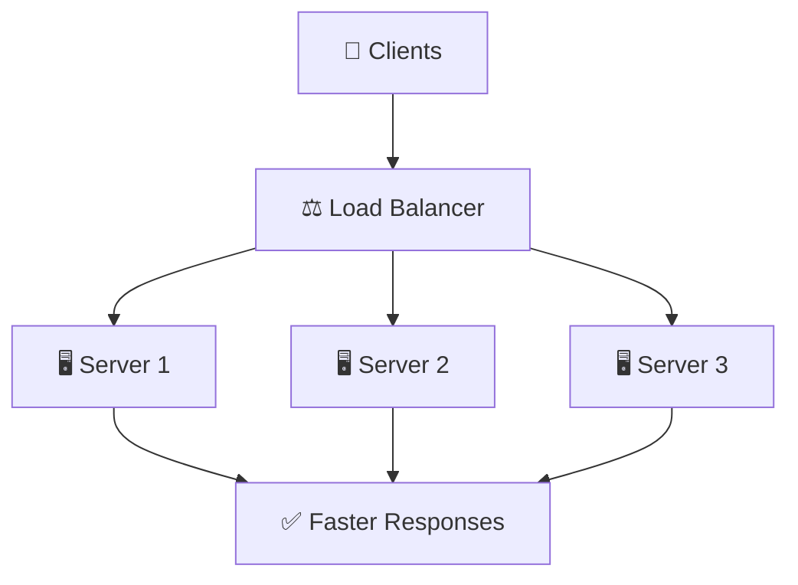

---

# 🚗 Traffic Congestion Analogy

Imagine a busy highway leading into a city.

If every vehicle is forced into a single lane, traffic quickly becomes congested.

Cars slow down.

Long queues form.

Travel times increase.

Now imagine that a traffic controller opens several lanes and directs vehicles into the least congested route.

Traffic begins flowing smoothly again.

A Load Balancer performs a very similar role.

Instead of directing vehicles, it directs network requests.

Instead of managing roads, it manages servers.

> 💡 **Real-World Analogy**
>
> **Single Server = One Checkout Counter**
>
> Every customer must wait in the same queue.
>
> **Load Balancer = Supermarket Queue Manager**
>
> Customers are directed to different checkout counters, reducing waiting time and improving overall efficiency.

---

<!--
Image Description:
Create a split illustration.
Left side: Traffic congestion caused by all vehicles using one lane.
Right side: Multiple lanes managed by a traffic controller allowing traffic to flow smoothly.
Below, show the networking equivalent where a Load Balancer distributes user requests across multiple servers.

Suggested Search Keywords:
load balancer traffic analogy
multiple server load balancing
network traffic distribution illustration
-->

<p align="center">

</p>

---

# 🎯 Learning Objectives

By the end of this lesson, you should be able to:

- Explain why Load Balancers are needed in modern networks.
- Describe the relationship between availability and performance.
- Understand how Load Balancers improve scalability.
- Explain why multiple servers are often better than one powerful server.
- Understand the role of Load Balancers in enterprise and cloud environments.
- Recognize how Load Balancers fit into the broader goals of networking and cybersecurity.

---

# 🧠 Mini Review

Before continuing, remember the progression of this networking module:

```text
Communication
        │
        ▼
Connectivity
        │
        ▼
Security
        │
        ▼
Availability
```

A Firewall protects communication.

An IDS detects suspicious activity.

An IPS prevents malicious traffic.

A **Load Balancer** ensures legitimate users can continue accessing services efficiently—even during periods of heavy demand.

---

# 🔍 Knowledge Check

### Question 1

Why isn't security alone enough for a modern web application?

<details>
<summary>Answer</summary>

A service can be completely secure but still fail if legitimate users cannot access it because the servers are overloaded. Modern systems must provide both security and high availability.

</details>

---

### Question 2

What problem does a Load Balancer primarily solve?

<details>
<summary>Answer</summary>

A Load Balancer distributes incoming requests across multiple servers, preventing any single server from becoming overwhelmed and improving availability, scalability, and performance.

</details>

---

### Question 3

Which principle of the CIA Triad is most closely associated with Load Balancers?

<details>
<summary>Answer</summary>

Availability. Load Balancers help ensure applications and services remain accessible, responsive, and reliable even under heavy traffic.

</details>

---
# ⚖️ What is a Load Balancer?

A **Load Balancer** is a networking device or software service that sits between clients and servers, intelligently distributing incoming requests across multiple servers instead of allowing a single server to handle all the traffic.

From the client's perspective, it appears as though they are communicating with a single server.

Behind the scenes, however, the Load Balancer decides **which server is best suited to handle each request**, ensuring that no individual server becomes overwhelmed.

Instead of increasing the power of a single server, a Load Balancer improves performance by allowing **multiple servers to work together as one system**.

This approach enables modern applications to remain:

- ✅ Available
- ✅ Fast
- ✅ Reliable
- ✅ Scalable

In today's Internet, Load Balancers are an essential component of almost every large-scale application, including:

- Google
- Microsoft
- Amazon
- Netflix
- Facebook
- Cloud platforms
- Banking systems
- E-commerce websites

Without Load Balancers, many of the services we use every day would struggle to handle millions of simultaneous users.

---

# 🎯 The Core Purpose of a Load Balancer

At its core, a Load Balancer has one simple objective:

> **Distribute work intelligently so that no single server becomes a bottleneck.**

Imagine three identical web servers.

Instead of sending every user request to Server 1, the Load Balancer spreads the workload across all available servers.

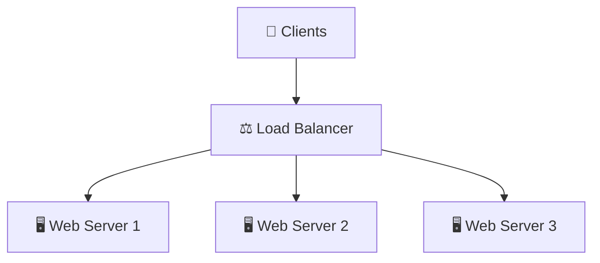

Each server processes only a portion of the total workload.

As a result:

- Response times improve.
- Resources are used efficiently.
- Server failures become less disruptive.
- More users can be served simultaneously.

---

<!--
Image Description:
Illustrate multiple clients sending requests to a Load Balancer, which distributes traffic evenly across three web servers. Show arrows representing balanced traffic flow.

Suggested Search Keywords:
load balancer architecture
multiple web servers
load balancing network diagram
-->

<p align="center">

</p>

---

# 👥 The Client's Perspective

One of the most interesting characteristics of a Load Balancer is that **clients are usually unaware that multiple servers even exist.**

When a user opens a website, they simply enter a domain name such as:

```text
https://example.com
```

The client believes they are communicating with a single server.

In reality, their request first reaches the Load Balancer.

The Load Balancer then selects one of many backend servers to process the request.

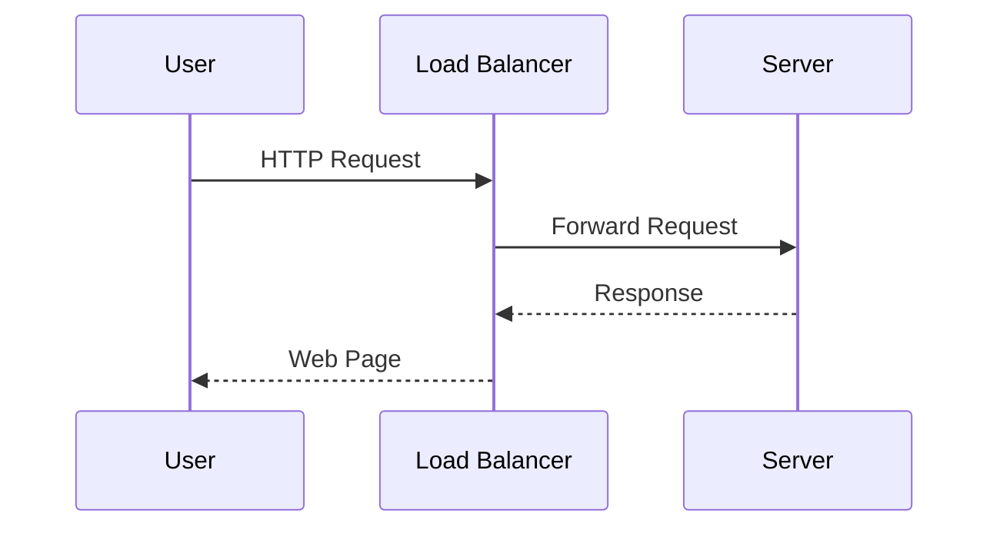

From the user's perspective:

```text
User
   │
   ▼

example.com

```

Actual infrastructure:

```text
User
   │
   ▼

Load Balancer
   │
   ├────────► Server 1
   ├────────► Server 2
   └────────► Server 3
```

This abstraction simplifies client communication while allowing organizations to expand their infrastructure without changing the user experience.

---

# 🖥️ The Server's Perspective

From the server's point of view, the Load Balancer acts as a traffic manager.

Instead of competing for incoming connections, each server receives only the requests assigned to it.

This provides several advantages:

- Lower CPU utilization.
- Lower memory usage.
- Reduced network congestion.
- Better response times.
- Improved system stability.

Servers no longer need to handle every incoming request individually.

Instead, they work together as members of a larger server cluster.

---

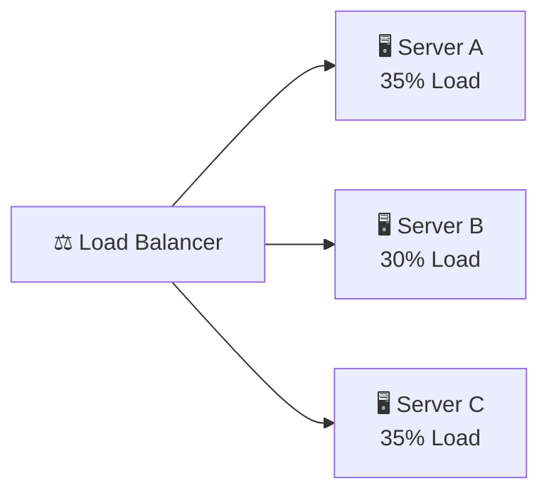

Rather than one overloaded server and two idle servers, the workload is distributed more evenly.

---

# ⚡ Why Does a Load Balancer Improve Availability?

Availability means ensuring that services remain accessible whenever users need them.

Suppose a website is hosted on only one server.

If that server fails:

```text
Users
   │
   ▼

Server

   ❌ Failure

Website Offline
```

Every user immediately loses access.

Now consider a load-balanced environment.

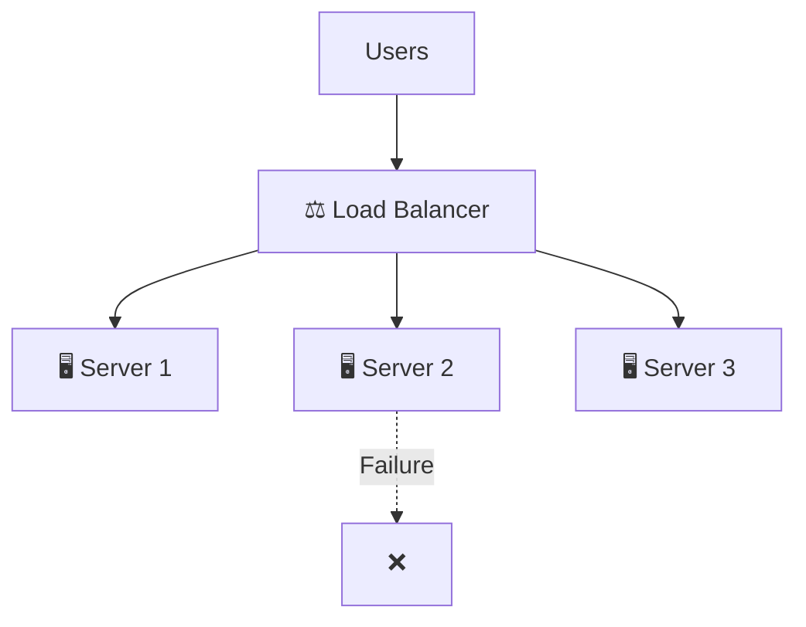

If Server 2 stops responding, the Load Balancer simply redirects future requests to the remaining healthy servers.

Users may never notice that a server has failed.

This capability dramatically increases system availability.

---

<!--
Image Description:
Illustrate three web servers behind a Load Balancer. One server has failed, but traffic is automatically redirected to the remaining healthy servers. Show uninterrupted user access.

Suggested Search Keywords:
load balancer failover
high availability load balancing
server redundancy diagram
-->

<p align="center">

</p>

---

# 📈 Why Does a Load Balancer Improve Scalability?

As applications become more popular, they receive more traffic.

One approach is to purchase increasingly powerful hardware.

This is known as **Vertical Scaling**.

Another approach is to add more servers.

This is known as **Horizontal Scaling**.

Load Balancers make horizontal scaling practical.

Instead of replacing one expensive server, organizations simply add another server to the server pool.


As demand grows, additional servers can be added without changing how clients access the application.

This makes Load Balancers one of the key technologies behind cloud computing.

---

# 🏗️ Why Does a Load Balancer Improve Reliability?

Reliability refers to the ability of a system to continue operating correctly over time.

Without a Load Balancer:

- One hardware failure may stop an entire service.
- Maintenance requires downtime.
- Software updates interrupt users.

With a Load Balancer:

- Traffic can be redirected during maintenance.
- Faulty servers can be removed temporarily.
- New servers can be added without affecting users.

Organizations can therefore perform upgrades while keeping applications online.

---

# 📊 Single Server vs Load-Balanced Environment

| Feature | Single Server | Load-Balancer Environment |
|----------|---------------|---------------------------|
| Number of Servers | One | Multiple |
| Performance | Limited by one server | Shared across many servers |
| Scalability | Difficult | Easy |
| Availability | Low | High |
| Fault Tolerance | Poor | Excellent |
| Maintenance | Often causes downtime | Usually transparent |
| User Experience | Can degrade under heavy traffic | Consistently responsive |

---

# 💡 Remember

> A **Load Balancer does not replace your servers.**

Instead, it acts as an intelligent traffic manager that decides **which server should process each incoming request.**

Think of it as the conductor of an orchestra.

The conductor does not play every instrument.

Instead, they coordinate many musicians so they perform together as one harmonious system.

Similarly, a Load Balancer coordinates multiple servers so they operate as a single, highly available service.

---

# 🧠 Mini Review

So far, you have learned that a Load Balancer:

- Sits between clients and servers.
- Appears as a single server to users.
- Distributes requests across multiple servers.
- Improves performance.
- Increases availability.
- Enables horizontal scalability.
- Enhances reliability.

Unlike security devices such as Firewalls, IDS, and IPS, a Load Balancer focuses on **delivering services efficiently**, ensuring that applications remain responsive even under heavy demand.

---

# 🔍 Knowledge Check

### Question 1

Does a Load Balancer replace web servers?

<details>
<summary>Answer</summary>

No. A Load Balancer works alongside multiple servers and intelligently distributes requests among them. It coordinates servers rather than replacing them.

</details>

---

### Question 2

From a client's perspective, how many servers are usually visible?

<details>
<summary>Answer</summary>

Typically, only one. The client communicates with the Load Balancer, while the Load Balancer handles communication with multiple backend servers.

</details>

---

### Question 3

Which three major benefits does a Load Balancer provide?

<details>
<summary>Answer</summary>

- Improved Availability
- Better Scalability
- Increased Reliability

It also improves performance by distributing traffic efficiently.

</details>

# ⚙️ How Does a Load Balancer Work?

Understanding **what** a Load Balancer is is only the first step.

The next question is:

> **How does a Load Balancer decide where each client request should go?**

Every time a user opens a website, clicks a button, watches a video, or sends an API request, a series of decisions take place behind the scenes.

Instead of blindly forwarding every request to the same server, the Load Balancer analyzes the current state of the server pool and intelligently selects the most appropriate destination.

This entire process usually happens in just a few milliseconds.

For the user, it feels as though they are communicating with a single, powerful server.

In reality, multiple servers are working together behind the Load Balancer.

---

# 🔄 Request Processing Workflow

Every incoming request follows a similar journey.

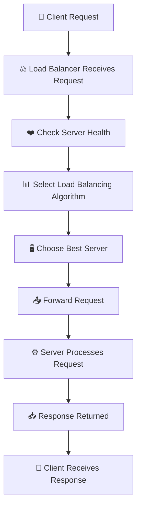

Although this workflow appears simple, each step involves important decisions that ensure applications remain fast, reliable, and highly available.

---

<!--
Image Description:
Illustrate the complete request lifecycle through a Load Balancer. Show a client sending a request to the Load Balancer, health checks being performed, a server being selected, the request forwarded, and the response returned to the client.

Suggested Search Keywords:
load balancer request flow
load balancing workflow
application load balancer architecture
-->

<p align="center">

</p>

---

# ① Client Sends a Request

Everything begins with a client.

The client may be:

- A web browser
- A mobile application
- Another server
- An API client
- An IoT device

The client sends a request to a website or application.

For example:

```text
https://example.com
```

The client does **not** know which backend server will process the request.

Instead, the request always reaches the **Load Balancer first**.

```text
Client
   │
   ▼
Load Balancer
```

The Load Balancer becomes the single entry point for all incoming traffic.

---

# ② The Load Balancer Receives the Request

Once the request arrives, the Load Balancer performs several tasks before forwarding it.

It may examine information such as:

- Source IP address
- Destination address
- Protocol (HTTP, HTTPS, TCP, UDP)
- Port number
- URL path
- Cookies
- Session information
- Current server status

These details help the Load Balancer determine the best destination for the request.

Different Load Balancers inspect different amounts of information depending on whether they operate at **Layer 4** or **Layer 7** of the OSI Model.

*(We'll explore Layer 4 and Layer 7 Load Balancers later in this chapter.)*

---

# ③ Health Checks

Before sending traffic to any server, the Load Balancer needs to know whether that server is actually available.

This is accomplished using **Health Checks**.

A Health Check is a small test performed periodically to verify that a server is functioning correctly.

A Load Balancer may check:

- Is the server powered on?
- Is the application responding?
- Is the database connection healthy?
- Is the web service returning valid responses?
- Is response time acceptable?

Only servers that successfully pass these checks receive client traffic.

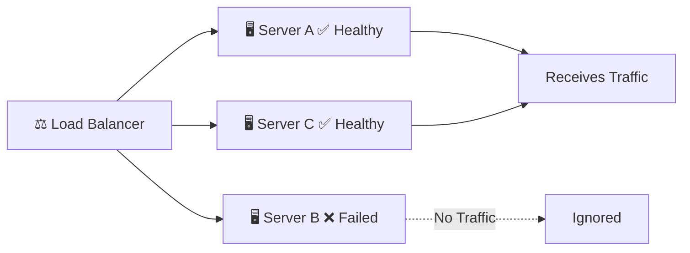

This process prevents users from being sent to failed or unavailable servers.

---

<!--
Image Description:
Create an illustration showing a Load Balancer performing health checks on three servers. Two servers are healthy and receive traffic, while one failed server is excluded from the server pool.

Suggested Search Keywords:
load balancer health check
server health monitoring
load balancer fail detection
-->

<p align="center">

</p>

---

# ④ Selecting a Load Balancing Algorithm

Once healthy servers have been identified, the Load Balancer must decide **which server should handle the next request**.

This decision is made using a **Load Balancing Algorithm**.

An algorithm is simply a set of rules used to make decisions.

Different algorithms are designed for different workloads.

Some algorithms distribute requests equally.

Others consider:

- Current server load
- Number of active connections
- Server capacity
- Response time
- Client IP address

For now, simply remember:

> **The algorithm determines where the next request will go.**

We will study each algorithm in detail later in this chapter.

---

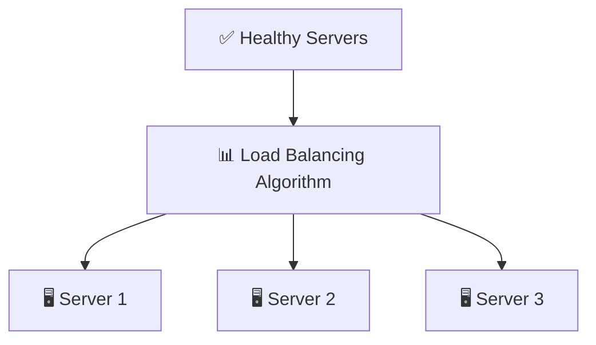

---

# ⑤ Forwarding the Request

After selecting the most appropriate server, the Load Balancer forwards the client's request.

From this point onward, the chosen server processes the request exactly as if the client had contacted it directly.

Examples include:

- Loading a web page.
- Running application code.
- Querying a database.
- Retrieving images.
- Processing API requests.

The server generates a response and sends it back to the Load Balancer.

The Load Balancer then returns the response to the client.

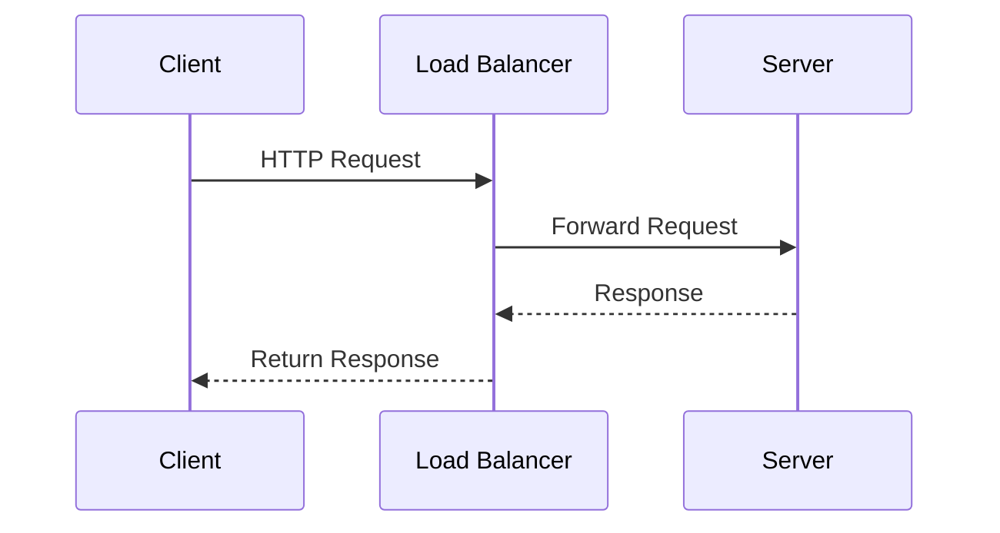

Notice that the client never communicates directly with the backend server.

The Load Balancer manages the entire interaction.

---

# ⑥ Returning the Response

After processing the request, the selected server sends its response back.

The Load Balancer forwards this response to the client.

To the client, everything appears seamless.

They never know:

- Which server processed the request.
- How many servers exist.
- Whether another server handled their previous request.

This abstraction is one of the major advantages of load balancing.

Servers can be added, removed, or replaced without changing the user experience.

---

# 🔒 Session Persistence (Sticky Sessions)

Some applications require a user to continue communicating with the same server during a session.

For example:

- Online shopping carts
- Banking websites
- User login sessions
- Multiplayer games

Imagine adding products to an online shopping cart.

If every request were sent to a different server, one server might know about the cart while another does not.

To solve this problem, Load Balancers can use **Session Persistence**, also called **Sticky Sessions**.

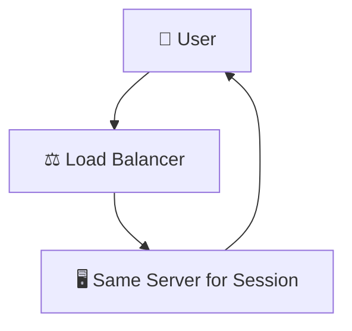

The Load Balancer remembers which server was assigned to the user and continues sending future requests to that same server until the session ends.

---

# 🔐 SSL/TLS Termination

Many websites use HTTPS to encrypt communication.

Decrypting encrypted traffic requires significant processing power.

Instead of making every backend server perform this task, organizations often configure the Load Balancer to handle encryption.

This process is called **SSL/TLS Termination**.

```text
Client

      HTTPS

        │

        ▼

⚖️ Load Balancer

Decrypts Traffic

        │

        ▼

HTTP

        │

        ▼

Backend Servers
```

This approach:

- Reduces server workload.
- Simplifies certificate management.
- Improves application performance.

---

<!--
Image Description:
Illustrate SSL/TLS Termination where HTTPS traffic reaches the Load Balancer, is decrypted there, and forwarded as HTTP to backend servers within a trusted internal network.

Suggested Search Keywords:
SSL termination load balancer
HTTPS load balancer diagram
TLS offloading architecture
-->

<p align="center">

</p>

---

# 📌 Connection Management

Modern Load Balancers do much more than simply forward packets.

They also manage network connections by:

- Opening client connections.
- Reusing existing server connections.
- Closing inactive sessions.
- Managing connection timeouts.
- Reducing unnecessary overhead.

Efficient connection management improves both performance and resource utilization.

---

# 🧠 Bringing It All Together

The complete decision-making process can be summarized as follows:

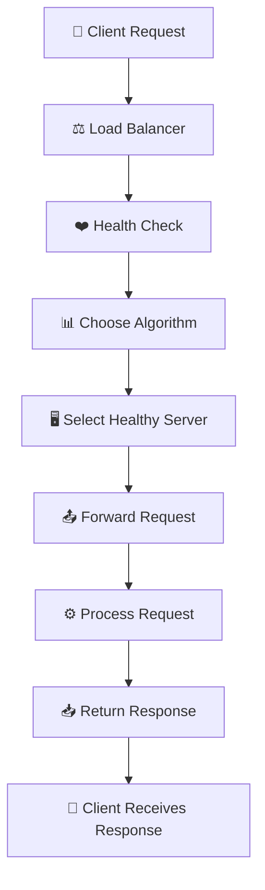

Each of these steps occurs within milliseconds, allowing users to experience fast and reliable applications without realizing the complexity happening behind the scenes.

---

# 💡 Remember

> A Load Balancer does **far more than simply split traffic.**

It continuously:

- Monitors server health.
- Makes intelligent routing decisions.
- Optimizes resource usage.
- Maintains user sessions.
- Improves performance.
- Keeps services available.

---

# 🧠 Mini Review

The workflow of a Load Balancer follows six key stages:

1. Receive the client request.
2. Check server health.
3. Select a load balancing algorithm.
4. Choose the most appropriate server.
5. Forward the request.
6. Return the response to the client.

Together, these steps enable multiple servers to function as a single, highly available service.

---

# 🔍 Knowledge Check

### Question 1

Why does a Load Balancer perform health checks?

<details>
<summary>Answer</summary>

Health checks ensure that traffic is only sent to servers that are functioning correctly. If a server fails or becomes unresponsive, the Load Balancer removes it from the active server pool until it recovers.

</details>

---

### Question 2

What is the purpose of a load balancing algorithm?

<details>
<summary>Answer</summary>

A load balancing algorithm determines which healthy server should process the next client request based on predefined rules such as server load, active connections, or response time.

</details>

---

### Question 3

What are Sticky Sessions?

<details>
<summary>Answer</summary>

Sticky Sessions (Session Persistence) ensure that a user's requests continue to be sent to the same backend server throughout a session, which is important for applications like shopping carts, banking systems, and authenticated user sessions.

</details>

# 🧮 Load Balancing Algorithms

In the previous section, you learned that a Load Balancer does not randomly choose a server.

Instead, it follows a **Load Balancing Algorithm**.

An algorithm is simply a set of rules or decision-making logic that determines **which backend server should receive the next client request**.

Different applications have different requirements.

A small company website may only need a simple algorithm that distributes traffic evenly.

A global cloud provider serving millions of users every second may require intelligent algorithms that consider server health, response times, and current workloads.

There is no single "best" algorithm.

Each algorithm is designed for a particular situation.

---

# 🤔 Why Do We Need Different Algorithms?

Imagine you manage a restaurant with three chefs.

Should every new customer always be assigned to Chef 1?

Of course not.

Sometimes:

- One chef is already busy.
- Another chef has just finished an order.
- One chef may have more experience.
- One chef may be unavailable.

A good restaurant manager distributes customers intelligently.

A Load Balancer performs the same task for servers.

Instead of assigning customers, it assigns **network requests**.

---

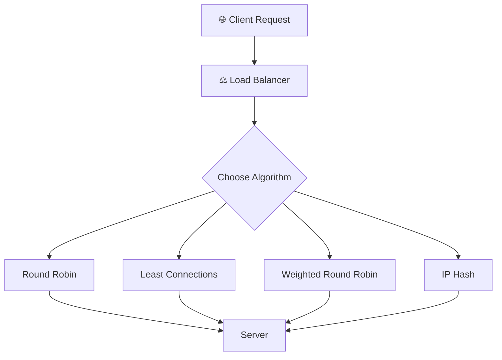

---

<!--
Image Description:
Illustrate a Load Balancer receiving client requests and selecting different routing algorithms before forwarding traffic to backend servers.

Suggested Search Keywords:
load balancing algorithms diagram
load balancer decision process
network traffic distribution
-->

<p align="center">

</p>

---

# 🔄 Round Robin

Round Robin is the simplest and one of the most commonly used load balancing algorithms.

It distributes requests sequentially across all available servers.

For example:

```text
Request 1 → Server 1

Request 2 → Server 2

Request 3 → Server 3

Request 4 → Server 1

Request 5 → Server 2

Request 6 → Server 3
```

Each server receives approximately the same number of requests.

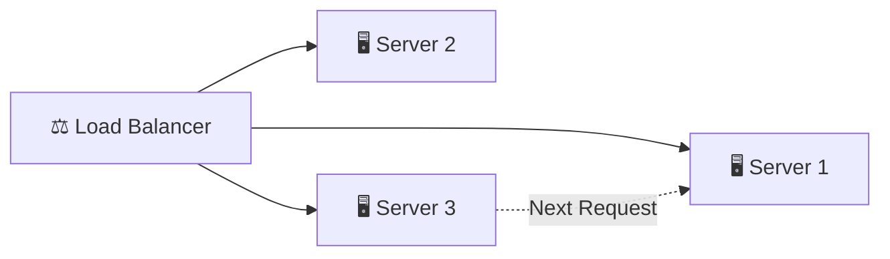

### Advantages

- Very simple
- Easy to implement
- Even traffic distribution
- Minimal processing overhead

### Limitations

- Assumes all servers have equal capacity.
- Ignores current server workload.
- Not ideal when servers have different hardware specifications.

---

# ⚖️ Weighted Round Robin

Sometimes servers are not equally powerful.

For example:

| Server | CPU | Weight |
|---------|-----|--------|
| Server A | 32 Cores | 5 |
| Server B | 16 Cores | 3 |
| Server C | 8 Cores | 1 |

Weighted Round Robin assigns **more requests to stronger servers**.

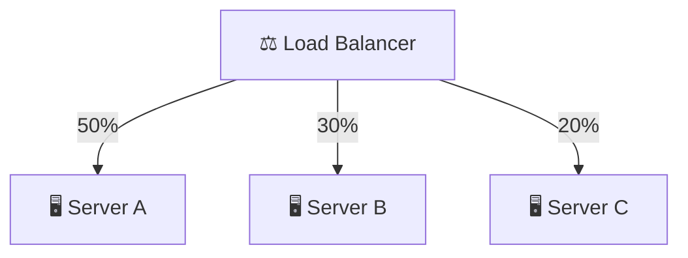

### Best Used When

- Servers have different hardware capabilities.
- Some servers are intentionally assigned more workload.

---

# 🔗 Least Connections

Instead of counting requests, this algorithm counts **active client connections**.

The next request is always sent to the server with the fewest active connections.

Example:

```text
Server 1 → 85 Connections

Server 2 → 24 Connections

Server 3 → 11 Connections

Next Client

↓

Server 3
```

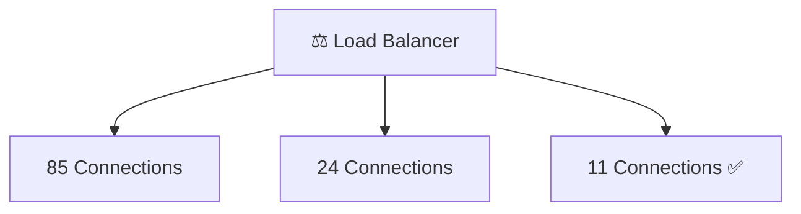

### Best Used When

- Sessions have different durations.
- Applications maintain long-lived connections.

---

# ⚖️ Weighted Least Connections

This combines two ideas:

- Current number of active connections.
- Server capacity.

Powerful servers receive more traffic, but only when they have available resources.

This algorithm is commonly used in enterprise environments.

---

# ⏱️ Least Response Time

Some servers may be healthy but slower than others.

Instead of counting connections, this algorithm measures how quickly each server responds.

The Load Balancer sends requests to the server with the fastest response time.

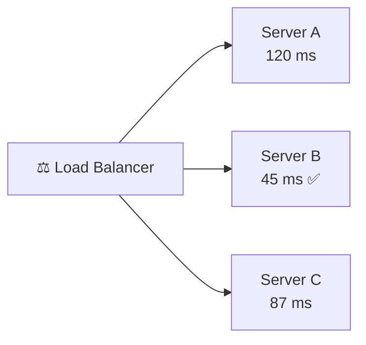

This algorithm is particularly useful for high-performance web applications.

---

# 🆔 IP Hash

Some applications require users to consistently communicate with the same server.

The IP Hash algorithm calculates a value using the client's IP address.

The same client is therefore directed to the same server whenever possible.

```text
Client A

192.168.1.10

↓

Server 2

Client A reconnects

↓

Server 2
```

This helps maintain session consistency.

---

# 🎲 Random

The Random algorithm selects a healthy server at random.

Although simple, it generally provides less predictable traffic distribution than other algorithms.

It is mainly used in smaller environments or for testing.

---

# 🌳 Resource-Based Algorithms

Modern cloud platforms often use intelligent algorithms.

Instead of relying on fixed rules, they monitor:

- CPU utilization
- Memory usage
- Network bandwidth
- Response time
- Disk I/O
- Real-time performance metrics

Requests are dynamically routed to the server with the greatest available resources.

Many cloud providers use AI-assisted or adaptive routing techniques based on these principles.

---

# 🧠 Comparison of Common Algorithms

| Algorithm | Best For | Advantages | Limitations |
|------------|----------|------------|-------------|
| Round Robin | Equal servers | Simple and efficient | Ignores workload |
| Weighted Round Robin | Different server capacities | Uses hardware efficiently | Requires configuration |
| Least Connections | Long user sessions | Balances active users | Slightly higher overhead |
| Weighted Least Connections | Enterprise environments | Highly balanced | More complex |
| Least Response Time | Performance optimization | Fast user experience | Requires continuous monitoring |
| IP Hash | Session persistence | Consistent routing | Uneven distribution possible |
| Random | Small deployments | Very simple | Less predictable |

---

```mermaid
mindmap
  root((Load Balancing Algorithms))
    Round Robin
    Weighted Round Robin
    Least Connections
    Weighted Least Connections
    Least Response Time
    IP Hash
    Random
    Resource-Based
```

---

<!--
Image Description:
Create a mind map illustrating the major load balancing algorithms. Each algorithm should branch from a central "Load Balancing Algorithms" node.

Suggested Search Keywords:
load balancing algorithms mindmap
network load balancing methods
algorithm comparison infographic
-->

<p align="center">

</p>

---

# 💡 Remember

> A Load Balancer is only as effective as the algorithm it uses.

The choice of algorithm directly affects application performance, resource utilization, and user experience.

---

# 🔍 Knowledge Check

### Question 1

Which algorithm distributes requests equally across all servers?

<details>
<summary>Answer</summary>

Round Robin.

</details>

---

### Question 2

Which algorithm is most suitable when servers have different hardware capacities?

<details>
<summary>Answer</summary>

Weighted Round Robin.

</details>

---

### Question 3

Which algorithm directs requests to the server with the fewest active connections?

<details>
<summary>Answer</summary>

Least Connections.

</details>

---

### Question 4

Which algorithm helps keep a client connected to the same backend server?

<details>
<summary>Answer</summary>

IP Hash.

</details>

# 🏗️ Types of Load Balancers

So far, we have learned:

- Why Load Balancers exist.
- How they distribute traffic.
- How they make routing decisions using different algorithms.

The next question is:

> **Are all Load Balancers the same?**

The answer is **No**.

Load Balancers come in different forms, each designed to solve different networking challenges.

Some are physical appliances installed inside data centers.

Others are software applications running on standard servers.

Many modern organizations rely on cloud-based Load Balancers that automatically scale as demand increases.

Some operate at **Layer 4 (Transport Layer)**, while others make decisions at **Layer 7 (Application Layer)**.

Understanding these different types is essential because selecting the wrong type can affect application performance, scalability, and even security.

---

# 🗺️ Classification of Load Balancers

Load Balancers can be classified in several different ways.

The most common classifications are:

```mermaid
mindmap
  root((Load Balancers))
    Hardware
    Software
    Cloud
    Layer 4
    Layer 7
```

Each type serves a different purpose and is suited for different environments.

---

<!--
Image Description:
Create a mind map showing the major categories of Load Balancers. The central node should be "Load Balancers" with branches for Hardware, Software, Cloud, Layer 4, and Layer 7 Load Balancers.

Suggested Search Keywords:
types of load balancers
load balancer classification
hardware software cloud load balancer
-->

<p align="center">

</p>

---

# 🖥️ Hardware Load Balancer

A **Hardware Load Balancer** is a dedicated physical networking appliance built specifically for distributing network traffic.

Unlike software running on a general-purpose server, hardware Load Balancers use specialized processors and optimized hardware to process a very large number of requests with minimal latency.

They are commonly deployed in:

- Enterprise data centers
- Banks
- Government organizations
- Internet Service Providers (ISPs)
- Large corporate networks

```text
              Internet
                  │
                  ▼
      ┌────────────────────┐
      │ Hardware Load      │
      │     Balancer       │
      └────────────────────┘
           │      │      │
           ▼      ▼      ▼
      Server1 Server2 Server3
```

### Advantages

- Extremely high performance.
- Purpose-built hardware.
- Low latency.
- Highly reliable.
- Designed for enterprise environments.

### Limitations

- Expensive.
- Requires physical installation.
- Less flexible than software solutions.
- Scaling often requires purchasing additional hardware.

---

# 💻 Software Load Balancer

A **Software Load Balancer** performs the same job as a hardware Load Balancer but runs as software on a standard operating system.

Instead of purchasing dedicated appliances, organizations install Load Balancer software on virtual machines, servers, or containers.

Popular software Load Balancers include:

- NGINX
- HAProxy
- Traefik
- Envoy

Software Load Balancers have become increasingly popular because they are:

- Flexible
- Cost-effective
- Easy to update
- Cloud-friendly

```mermaid
flowchart TD

VM["🖥️ Virtual Machine"]

VM --> LB["💻 Software Load Balancer"]

LB --> A["Application Server 1"]

LB --> B["Application Server 2"]

LB --> C["Application Server 3"]

```

### Advantages

- Lower cost.
- Easy deployment.
- Highly configurable.
- Ideal for virtualization and cloud environments.

### Limitations

- Performance depends on server resources.
- May require tuning for high workloads.

---

<!--
Image Description:
Illustrate a Software Load Balancer running inside a virtual machine or Linux server, distributing traffic to multiple application servers.

Suggested Search Keywords:
software load balancer architecture
HAProxy diagram
NGINX load balancer architecture
-->

<p align="center">

</p>

---

# ☁️ Cloud Load Balancer

As organizations moved to cloud computing, managing physical Load Balancers became impractical.

Cloud providers now offer **Load Balancing as a managed service**.

Instead of installing hardware or configuring software manually, organizations simply create a Load Balancer through the cloud provider's management console.

Examples include:

- AWS Elastic Load Balancer (ELB)
- Microsoft Azure Load Balancer
- Google Cloud Load Balancing

```mermaid
flowchart TD

Users["👥 Users"]

Users --> Cloud["☁️ Cloud Load Balancer"]

Cloud --> VM1["Virtual Machine 1"]

Cloud --> VM2["Virtual Machine 2"]

Cloud --> VM3["Virtual Machine 3"]

```

Cloud Load Balancers automatically:

- Scale with demand.
- Replace failed resources.
- Integrate with cloud services.
- Support global deployments.

### Advantages

- Fully managed.
- Automatic scaling.
- High availability.
- Minimal administration.

### Limitations

- Ongoing operational costs.
- Vendor-specific features.
- Less control over underlying infrastructure.

---

# 🚚 Layer 4 Load Balancer

A **Layer 4 Load Balancer** operates at the **Transport Layer** of the OSI Model.

It makes routing decisions using information such as:

- Source IP address
- Destination IP address
- TCP ports
- UDP ports

It **does not inspect the actual application data**.

Instead, it forwards traffic based on network and transport information.

```text
Client

      │

 TCP / UDP

      ▼

Layer 4 Load Balancer

      ▼

Server
```

### Characteristics

- Extremely fast.
- Low processing overhead.
- Suitable for high-performance applications.
- Does not inspect HTTP content.

### Common Use Cases

- TCP applications
- UDP services
- Gaming servers
- Database clusters

---

# 🌐 Layer 7 Load Balancer

A **Layer 7 Load Balancer** operates at the **Application Layer** of the OSI Model.

Unlike Layer 4 devices, it can inspect application data such as:

- URLs
- HTTP headers
- Cookies
- Session information
- Host names
- API paths

Because it understands application protocols, it can make much more intelligent routing decisions.

```mermaid
flowchart TD

Client["🌐 Client"]

Client --> LB["Layer 7 Load Balancer"]

LB -->|/images| Image["Image Server"]

LB -->|/videos| Video["Video Server"]

LB -->|/api| API["API Server"]

```

For example:

```
example.com/images
```

can be sent to one server, while

```
example.com/api
```

is sent to a completely different backend.

### Advantages

- Content-aware routing.
- SSL termination.
- URL-based routing.
- Cookie-based routing.
- Better application optimization.

### Limitations

- More CPU intensive.
- Slightly higher latency.
- More complex configuration.

---

<!--
Image Description:
Illustrate a Layer 7 Load Balancer routing requests based on URL paths. Show requests for /images, /videos, and /api being directed to different backend servers.

Suggested Search Keywords:
layer 7 load balancer
application load balancer diagram
content based routing
-->

<p align="center">

</p>

---

# ⚖️ Layer 4 vs Layer 7 Load Balancer

| Feature | Layer 4 | Layer 7 |
|----------|----------|----------|
| OSI Layer | Transport Layer | Application Layer |
| Uses TCP/UDP Information | ✅ | ✅ |
| Reads HTTP Headers | ❌ | ✅ |
| URL-Based Routing | ❌ | ✅ |
| Cookie-Based Routing | ❌ | ✅ |
| SSL Termination | Limited | Yes |
| Processing Speed | Faster | Slightly Slower |
| Decision Making | Network Information | Application Content |

---

# 🌍 Which Type Should You Choose?

The answer depends entirely on the environment.

| Environment | Recommended Load Balancer |
|--------------|--------------------------|
| Enterprise Data Center | Hardware |
| Small Business | Software |
| Cloud Infrastructure | Cloud Load Balancer |
| High-Speed TCP Services | Layer 4 |
| Modern Web Applications | Layer 7 |

There is no universally "best" Load Balancer.

The right choice depends on:

- Budget
- Performance requirements
- Infrastructure
- Application type
- Scalability needs

---

# 💡 Remember

> **Hardware, Software, and Cloud** describe **where** the Load Balancer runs.

> **Layer 4 and Layer 7** describe **how** the Load Balancer makes routing decisions.

These are different classifications and should not be confused.

For example:

A cloud provider may offer a **Layer 7 Software Load Balancer** as a managed service.

---

# 🧠 Mini Review

Load Balancers can be categorized by:

- Deployment method (Hardware, Software, Cloud)
- Operating layer (Layer 4 or Layer 7)

Each type offers different advantages depending on the organization's requirements.

As networking evolves toward cloud-native applications and microservices, **Layer 7 Cloud Load Balancers** have become increasingly common because they provide intelligent routing, automatic scaling, and deep application awareness.

---

# 🔍 Knowledge Check

### Question 1

What is the primary difference between a Hardware and a Software Load Balancer?

<details>
<summary>Answer</summary>

A Hardware Load Balancer is a dedicated physical appliance, while a Software Load Balancer runs as software on a standard server, virtual machine, or container.

</details>

---

### Question 2

Which type of Load Balancer is commonly used in cloud environments?

<details>
<summary>Answer</summary>

Cloud Load Balancers, such as AWS Elastic Load Balancer, Azure Load Balancer, and Google Cloud Load Balancing.

</details>

---

### Question 3

Which OSI layer does a Layer 4 Load Balancer operate at?

<details>
<summary>Answer</summary>

The Transport Layer (Layer 4), using information such as IP addresses and TCP/UDP port numbers.

</details>

---

### Question 4

Why is a Layer 7 Load Balancer considered more intelligent than a Layer 4 Load Balancer?

<details>
<summary>Answer</summary>

Because it understands application-layer information such as URLs, HTTP headers, cookies, and API paths, allowing it to make content-aware routing decisions.

</details>

# 🏢 Enterprise Deployment and High Availability

In the previous sections, you learned:

- Why Load Balancers are needed.
- How they distribute traffic.
- How they make routing decisions.
- The different types of Load Balancers.

So far, we have mainly focused on **a single Load Balancer managing multiple servers**.

However, modern enterprises operate on a much larger scale.

Large organizations such as Google, Microsoft, Amazon, Netflix, Meta, and Cloudflare serve **millions of users every second**.

Their infrastructure cannot rely on:

- One server
- One Load Balancer
- One data center

Doing so would create a **Single Point of Failure (SPOF)**.

Instead, enterprise environments are designed around one important principle:

> **No single component should be able to bring down the entire service.**

This philosophy leads us to concepts such as **High Availability**, **Redundancy**, and **Failover**.

---

# ❌ The Problem: Single Point of Failure (SPOF)

Imagine an organization with three web servers.

Traffic is distributed by a single Load Balancer.

```mermaid
flowchart TD

Users["👥 Users"]

Users --> LB["⚖️ Load Balancer"]

LB --> S1["🖥️ Server 1"]
LB --> S2["🖥️ Server 2"]
LB --> S3["🖥️ Server 3"]

```

Everything works perfectly...

Until the Load Balancer itself fails.

```text
              Users
                 │
                 ▼

         ❌ Load Balancer

                 │

       No Traffic Reaches Servers

                 │

          Entire Service Offline
```

Although every backend server is healthy, users can no longer reach them.

This is called a **Single Point of Failure (SPOF)**.

---

# 🛡️ High Availability (HA)

**High Availability (HA)** is a design approach that ensures services remain operational even if individual components fail.

Instead of relying on one device, organizations deploy redundant systems that can immediately take over if another component becomes unavailable.

The goal is simple:

> **Keep services running with little or no downtime.**

High Availability is one of the most important design principles in enterprise networking and cloud computing.

---

```mermaid
flowchart TD

Users["👥 Users"]

Users --> LB1["⚖️ Primary Load Balancer"]

Users --> LB2["⚖️ Secondary Load Balancer"]

LB1 --> Web["🖥️ Web Server Cluster"]
LB2 --> Web

```

If one Load Balancer fails, the second Load Balancer continues handling traffic.

Users often never notice the failure.

---

<!--
Image Description:
Illustrate a High Availability architecture with two Load Balancers (Primary and Secondary) connected to the same web server cluster. Show user traffic continuing even if one Load Balancer fails.

Suggested Search Keywords:
high availability load balancer
redundant load balancer architecture
HA load balancing
-->

<p align="center">

</p>

---

# 🔁 Redundancy

High Availability is made possible through **Redundancy**.

Redundancy means intentionally deploying additional components so that another component can immediately replace a failed one.

Examples include:

- Multiple Load Balancers
- Multiple Web Servers
- Multiple Database Servers
- Multiple Network Links
- Multiple Power Supplies

Although redundant hardware increases cost, it dramatically improves reliability.

A useful rule is:

> **If a component is critical, it should never exist as a single instance.**

---

# 🔄 Failover

When one component fails, another component automatically takes over.

This process is called **Failover**.

Consider this example:

```mermaid
sequenceDiagram

participant User
participant LB1 as Primary LB
participant LB2 as Secondary LB

User->>LB1: Request

LB1--xUser: Failure

LB2->>User: Continue Service

```

The transition usually occurs automatically.

Modern enterprise systems perform failover in just a few seconds—or even milliseconds.

---

# ⚖️ Active-Passive Architecture

One common High Availability design is **Active-Passive**.

In this configuration:

- One Load Balancer actively processes traffic.
- The second Load Balancer remains on standby.

If the primary device fails, the backup immediately becomes active.

```mermaid
flowchart LR

Users

Users --> Active["🟢 Active Load Balancer"]

Users -. Standby .-> Passive["⚪ Passive Load Balancer"]

Active --> Servers["🖥️ Server Cluster"]

Passive --> Servers

```

### Advantages

- Simple configuration.
- Easy failover.
- Reliable.

### Limitations

- Backup resources remain unused during normal operation.

---

# 🔄 Active-Active Architecture

Another design is **Active-Active**.

Instead of waiting as a backup, **both Load Balancers process traffic simultaneously**.

```mermaid
flowchart TD

Users["👥 Users"]

Users --> LB1["⚖️ Load Balancer A"]

Users --> LB2["⚖️ Load Balancer B"]

LB1 --> Cluster["🖥️ Server Cluster"]

LB2 --> Cluster

```

If one Load Balancer fails, the remaining device simply handles additional traffic.

### Advantages

- Better hardware utilization.
- Improved scalability.
- Higher throughput.

### Limitations

- More complex configuration.
- Requires synchronization between devices.

---

# 📈 Horizontal vs Vertical Scaling

As organizations grow, they need to support increasing numbers of users.

There are two primary scaling strategies.

## Vertical Scaling

Upgrade existing hardware.

Examples:

- More CPU
- More RAM
- Faster storage

```text
🖥️ Small Server

        │

Upgrade

        ▼

💪 Powerful Server
```

### Advantages

- Simple.
- No application redesign.

### Limitations

- Hardware limits eventually reached.
- Downtime may be required.

---

## Horizontal Scaling

Instead of upgrading one server, add more servers.

```mermaid
flowchart LR

One["🖥️ Server"]

One --> Two["🖥️🖥️"]

Two --> Four["🖥️🖥️🖥️🖥️"]

Four --> Many["☁️ Server Cluster"]

```

Horizontal Scaling works perfectly with Load Balancers because new servers can immediately begin receiving traffic.

This is the foundation of modern cloud infrastructure.

---

# ☁️ Load Balancers in Cloud Computing

Cloud providers automatically integrate Load Balancers into their services.

A typical cloud deployment looks like this:

```mermaid
flowchart TD

Internet

↓

CDN["🌍 CDN"]

↓

LB["☁️ Cloud Load Balancer"]

↓

VM1["VM 1"]

LB --> VM2["VM 2"]

LB --> VM3["VM 3"]

```

Benefits include:

- Automatic scaling.
- Geographic distribution.
- Built-in monitoring.
- Health checks.
- High Availability.

Cloud platforms can even create new virtual machines automatically when traffic increases.

---

<!--
Image Description:
Illustrate a cloud architecture where users access a CDN, followed by a Cloud Load Balancer distributing traffic to multiple virtual machines.

Suggested Search Keywords:
cloud load balancer architecture
AWS load balancing diagram
Azure application gateway
-->

<p align="center">

</p>

---

# ☸️ Load Balancers in Kubernetes

Modern applications are increasingly built using **containers**.

Container orchestration platforms such as **Kubernetes** automatically manage:

- Containers
- Scaling
- Networking
- Service discovery

Load Balancers work closely with Kubernetes Services to distribute traffic among containerized applications.

```text
Internet

      │

      ▼

Load Balancer

      │

      ▼

Kubernetes Service

      │

      ▼

Pods

Pods

Pods
```

This architecture allows applications to grow or shrink automatically depending on demand.

---

# 📊 Monitoring and Metrics

Enterprise Load Balancers continuously collect performance data.

Common metrics include:

- CPU utilization
- Memory usage
- Active connections
- Request rate
- Response time
- Error rate
- Server health

Administrators use this information to identify bottlenecks before users experience problems.

---

# 📋 Enterprise Best Practices

Successful enterprise deployments typically follow these recommendations:

- Deploy multiple Load Balancers.
- Avoid Single Points of Failure.
- Perform regular health checks.
- Use automatic failover.
- Monitor application performance.
- Enable logging and alerting.
- Encrypt external traffic.
- Regularly test disaster recovery plans.
- Continuously update software.

---

# 💡 Remember

> A Load Balancer improves **availability**, but enterprise availability requires much more than simply distributing traffic.

True High Availability depends on:

- Redundancy
- Failover
- Monitoring
- Health Checks
- Scalable Infrastructure

Together, these technologies ensure that services remain online even when individual components fail.

---

# 🧠 Mini Review

Enterprise Load Balancers are designed to eliminate single points of failure and maintain continuous service availability.

Modern organizations combine:

- Multiple Load Balancers
- Multiple Servers
- Automatic Health Checks
- Automatic Failover
- Horizontal Scaling
- Cloud Infrastructure

This architecture allows applications to remain available even during hardware failures, maintenance, or sudden increases in traffic.

---

# 🔍 Knowledge Check

### Question 1

What is a Single Point of Failure (SPOF)?

<details>
<summary>Answer</summary>

A Single Point of Failure is any component whose failure causes the entire system or service to become unavailable.

</details>

---

### Question 2

What is the purpose of High Availability?

<details>
<summary>Answer</summary>

High Availability ensures that services remain operational even when individual hardware or software components fail.

</details>

---

### Question 3

What is the difference between Active-Passive and Active-Active architectures?

<details>
<summary>Answer</summary>

In Active-Passive, one Load Balancer handles traffic while the other remains on standby. In Active-Active, both Load Balancers process traffic simultaneously.

</details>

---

### Question 4

Why is Horizontal Scaling preferred in modern cloud environments?

<details>
<summary>Answer</summary>

Horizontal Scaling allows organizations to add more servers instead of upgrading a single server, providing better scalability, fault tolerance, and integration with Load Balancers.

</details>

# 🛡️ Load Balancers from a Cybersecurity Perspective

Throughout this chapter, we have primarily viewed the Load Balancer as a networking device that improves **performance**, **availability**, and **scalability**.

However, in modern enterprise environments, a Load Balancer is much more than a traffic distributor.

It has become an important part of an organization's **security architecture**.

Many next-generation Load Balancers can:

- Perform SSL/TLS termination.
- Detect unhealthy or compromised servers.
- Integrate with Web Application Firewalls (WAFs).
- Limit malicious traffic.
- Enforce secure communication.
- Hide internal infrastructure from attackers.
- Improve resilience against Distributed Denial-of-Service (DDoS) attacks.

For this reason, cybersecurity professionals frequently work with Load Balancers when designing secure, highly available network architectures.

---

# 🏰 Where Does a Load Balancer Fit?

Over the past few lessons, you have gradually built a layered security model.

Each networking device serves a different purpose.

Rather than replacing one another, these devices work together to protect and optimize the network.

```text
                 🌍 Internet
                      │
                      ▼
              🔥 Firewall
        (Controls Network Access)
                      │
                      ▼
               🚨 IDS
      (Monitors Suspicious Activity)
                      │
                      ▼
               🛡️ IPS
     (Detects and Blocks Attacks)
                      │
                      ▼
             ⚖️ Load Balancer
   (Distributes Traffic Efficiently)
                      │
                      ▼
           🖥️ Application Servers
```

Each layer contributes to a different objective:

| Device | Primary Responsibility |
|----------|------------------------|
| Firewall | Allow or block network traffic |
| IDS | Detect suspicious activity |
| IPS | Detect and automatically block attacks |
| Load Balancer | Improve performance, availability, and scalability |

Together, they form part of a **Defense in Depth** strategy, where multiple security controls work together rather than relying on a single device.

---

<!--
Image Description:
Illustrate a layered enterprise architecture showing Internet traffic passing through a Firewall, IDS, IPS, and Load Balancer before reaching a cluster of web servers. Label each device with its primary responsibility.

Suggested Search Keywords:
enterprise security architecture
firewall ids ips load balancer diagram
defense in depth network architecture
-->

<p align="center">

</p>

---

# 🌐 Load Balancer vs Reverse Proxy

One concept that often confuses beginners is the difference between a **Load Balancer** and a **Reverse Proxy**.

Although both sit in front of backend servers and receive client requests, their primary goals are different.

A **Reverse Proxy** primarily acts as an intermediary between clients and servers.

It can:

- Hide backend servers.
- Cache content.
- Compress responses.
- Enforce authentication.
- Improve security.

A **Load Balancer** focuses on distributing traffic across multiple servers to improve availability and performance.

Many modern products, such as **NGINX**, **HAProxy**, and cloud Application Load Balancers, perform both roles simultaneously.

| Feature | Reverse Proxy | Load Balancer |
|----------|---------------|---------------|
| Hides backend servers | ✅ | ✅ |
| Distributes traffic | Sometimes | ✅ |
| Caching | ✅ | Limited |
| SSL/TLS Termination | ✅ | ✅ |
| High Availability | Limited | ✅ |
| Primary Goal | Security & Optimization | Traffic Distribution |

---

# 🌊 Load Balancers and DDoS Protection

A Load Balancer is **not a DDoS protection system**.

However, it can help reduce the impact of certain denial-of-service attacks.

For example, a Load Balancer can:

- Distribute traffic across many servers.
- Prevent one server from becoming overloaded.
- Remove failed servers from rotation.
- Work alongside cloud-based DDoS protection services.

```mermaid
flowchart LR

Attack["🌐 Massive Traffic"]

Attack --> LB["⚖️ Load Balancer"]

LB --> S1["🖥️ Server 1"]

LB --> S2["🖥️ Server 2"]

LB --> S3["🖥️ Server 3"]

```

Even though traffic is balanced, a sufficiently large DDoS attack can still overwhelm network infrastructure.

That is why organizations combine Load Balancers with:

- Firewalls
- Web Application Firewalls (WAFs)
- DDoS mitigation services
- Content Delivery Networks (CDNs)

---

# 🧱 Defense in Depth

Throughout this Networking module, one recurring concept has appeared again and again:

> **No single security device can stop every attack.**

Instead, organizations deploy multiple layers of protection.

```mermaid
flowchart TD

Internet

↓

Firewall["🔥 Firewall"]

↓

IDS["🚨 IDS"]

↓

IPS["🛡️ IPS"]

↓

LoadBalancer["⚖️ Load Balancer"]

↓

Servers["🖥️ Application Servers"]

```

Each layer performs a different function.

If one control fails, another layer may still detect, block, or mitigate the threat.

This layered approach is known as **Defense in Depth**, one of the most important principles in cybersecurity.

---

# ⚠️ Common Beginner Mistakes

When first learning about Load Balancers, beginners often develop misconceptions.

### ❌ Mistake 1

> A Load Balancer replaces web servers.

✅ Reality:

A Load Balancer works **with** multiple servers—it does not replace them.

---

### ❌ Mistake 2

> Load Balancers provide complete security.

✅ Reality:

They improve availability and can support security, but they are **not** a replacement for Firewalls, IDS, IPS, or WAFs.

---

### ❌ Mistake 3

> All requests are distributed equally.

✅ Reality:

Traffic distribution depends on the selected load balancing algorithm.

---

### ❌ Mistake 4

> One Load Balancer is enough for every environment.

✅ Reality:

Enterprise networks typically deploy redundant Load Balancers to eliminate single points of failure.

---

# 💡 Did You Know?

- Netflix, Google, Microsoft, Amazon, and Meta use thousands of Load Balancers worldwide.
- Cloud providers can automatically create additional backend servers when traffic increases.
- Many cloud Load Balancers process **millions of requests every second**.
- Modern Application Load Balancers can route traffic based on URLs, HTTP headers, cookies, and host names.

---

# 📝 Key Takeaways

By completing this lesson, you should now understand that:

- A Load Balancer distributes client requests across multiple servers.
- It improves performance, scalability, reliability, and availability.
- Health checks ensure traffic is sent only to healthy servers.
- Different algorithms determine how requests are distributed.
- Hardware, Software, Cloud, Layer 4, and Layer 7 Load Balancers each serve different purposes.
- High Availability depends on redundancy and automatic failover.
- Load Balancers complement—not replace—other security technologies.

---

# ⚡ 60-Second Revision

If you only remember a few things from this chapter, remember these:

- ⚖️ A Load Balancer sits between clients and servers.
- 🖥️ It distributes requests across multiple backend servers.
- ❤️ Health checks remove failed servers from rotation.
- 📊 Algorithms determine which server receives each request.
- ☁️ Modern cloud platforms rely heavily on Load Balancers.
- 🏢 Enterprise environments use redundant Load Balancers for High Availability.
- 🛡️ Load Balancers improve resilience but are only one layer in a Defense in Depth strategy.

---

# 🧠 Final Knowledge Check

1. What problem does a Load Balancer solve?
2. Why is a single server considered a scalability limitation?
3. What is the purpose of health checks?
4. How does Round Robin differ from Least Connections?
5. What is the benefit of Session Persistence (Sticky Sessions)?
6. What is the difference between Layer 4 and Layer 7 Load Balancers?
7. Why are redundant Load Balancers used in enterprise environments?
8. What is a Single Point of Failure (SPOF)?
9. How does a Load Balancer contribute to High Availability?
10. Why is a Load Balancer not considered a replacement for a Firewall or IPS?

<details>
<summary>Click to reveal answers</summary>

1. It distributes traffic across multiple servers to improve performance, availability, and scalability.
2. One server has limited processing power and becomes a bottleneck as traffic grows.
3. To ensure traffic is only sent to healthy backend servers.
4. Round Robin distributes requests sequentially, while Least Connections selects the server with the fewest active connections.
5. It keeps a user's requests directed to the same backend server during a session.
6. Layer 4 routes based on network information (IP addresses and ports), while Layer 7 routes based on application data such as URLs and HTTP headers.
7. To eliminate single points of failure and improve High Availability.
8. A component whose failure causes the entire service to become unavailable.
9. By redirecting traffic away from failed servers and distributing requests across healthy ones.
10. Because its primary role is traffic distribution, not enforcing security policies or detecting attacks.

</details>

---

# 📚 Further Reading

To deepen your understanding of Load Balancers, consider exploring:

- Layer 4 vs Layer 7 Load Balancing
- Reverse Proxy Architecture
- Web Application Firewalls (WAF)
- Content Delivery Networks (CDN)
- High Availability (HA) Clustering
- Kubernetes Services and Ingress Controllers
- Cloud Load Balancing (AWS, Azure, Google Cloud)

---

# 🗺️ Cybersecurity Roadmap

```text
Cybersecurity Roadmap

02-Networking

README.md
│
├── ✅ Choosing the Right Network Device
├── ✅ Repeater
├── ✅ Hub
├── ✅ Bridge
├── ✅ Switch
├── ✅ Router
├── ✅ Gateway
├── ✅ Modem
├── ✅ Access Point
├── ✅ Firewall
├── ✅ IDS
├── ✅ IPS
├── ✅ Load Balancer
│
└── ⏭️ Next Module
```

---

# 🎉 Congratulations!

You have now completed the **Network Devices** section of the Networking module.

Throughout these lessons, you explored how different networking devices operate together to build modern computer networks.

You learned how data is:

- Extended using Repeaters.
- Shared through Hubs.
- Segmented with Bridges.
- Switched efficiently.
- Routed between networks.
- Connected to the Internet through Modems and Gateways.
- Made wireless using Access Points.
- Protected with Firewalls, IDS, and IPS.
- Distributed efficiently using Load Balancers.

These devices form the foundation of enterprise networking and appear in nearly every modern organization.

Understanding **how they work together** is far more valuable than simply memorizing their definitions.

As you continue your cybersecurity journey, this knowledge will help you understand network architecture, security monitoring, cloud infrastructure, penetration testing, and defensive operations.

---

---

# ⏭️ Next Chapter

Congratulations! 🎉

You have completed the **Network Devices** chapter, where you learned how the hardware and software components of a network work together to forward, filter, monitor, protect, and distribute network traffic.

However, understanding networking devices is only one part of the picture.

An important question still remains:

> **How does data actually travel between these devices?**

Routers, switches, firewalls, and load balancers cannot communicate on their own—they require a physical or wireless medium to carry signals from one device to another.

In the next chapter, you'll explore the **transmission media** that form the foundation of every network.

You'll learn:

- 📡 How data travels across a network
- 🔌 Copper Ethernet cables and twisted-pair standards
- 💡 Fiber-optic communication and light transmission
- 📶 Wireless communication technologies
- 📏 Cable categories and connector types
- ⚡ Bandwidth, latency, interference, and signal attenuation
- 🌍 How different transmission media are chosen for real-world networks

By the end of the next chapter, you'll understand **not only how networking devices process data, but also how that data physically moves from one device to another**, completing another essential building block of computer networking.

---

## 🗺️ Continue Your Journey

```text
02-Networking

├── ✅ Network Devices
│     ├── Repeater
│     ├── Hub
│     ├── Bridge
│     ├── Switch
│     ├── Router
│     ├── Gateway
│     ├── Modem
│     ├── Access Point
│     ├── Firewall
│     ├── IDS
│     ├── IPS
│     └── Load Balancer
│
└── 📍 Next Chapter
      03-Network Media
```

---

## 🚀 Continue to the Next Lesson

**Next Chapter:** **[03-Network Media/README.md](../03-Network%20Media/README.md)** →