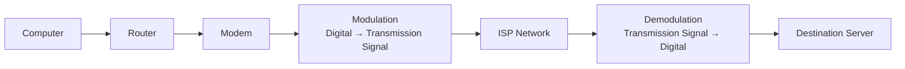
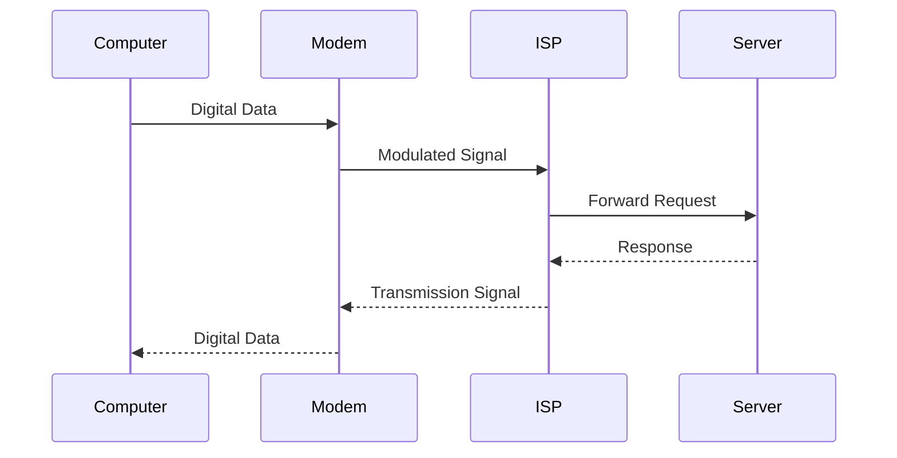

# 🌐 Modem

> *A modem is the device that makes Internet connectivity physically possible by converting digital data from your computer into signals that can travel across your Internet Service Provider's transmission medium—and converting incoming signals back into digital data.*

---


---

# 📖 Table of Contents

- [Previously in this Roadmap](#-previously-in-this-roadmap)
- [Why Do We Need a Modem?](#-why-do-we-need-a-modem)
- [What is a Modem?](#-what-is-a-modem)
- [Why is it Called a Modem?](#-why-is-it-called-a-modem)
- [Digital Data vs Transmission Signals](#-digital-data-vs-transmission-signals)
- [Where Are Modems Used?](#-where-are-modems-used)
- [Modem and the OSI Model](#-modem-and-the-osi-model)
- [Learning Objectives](#-learning-objectives)

---

# 📚 Previously in this Roadmap

In the previous lessons, you explored several networking devices that solve different communication problems.

- **Switches** connect devices within the same local network.
- **Routers** connect different IP networks and determine the best path for packets.
- **Gateways** enable communication between systems that use different protocols or technologies.

These devices successfully move and manage data **inside computer networks**.

But another question remains:

> **How does your home or office network physically connect to your Internet Service Provider (ISP)?**

Your computer understands **digital data**.

Your ISP communicates using transmission media such as:

- Copper telephone lines
- Coaxial cable
- Fiber-optic cable
- Cellular networks
- Satellite links

These media do not always carry information in the same way your computer generates it.

Before your data can travel across these communication channels, it must first be converted into a suitable signal.

That is the responsibility of the **modem**.

---

# 🌍 Why Do We Need a Modem?

Imagine you write a letter on your computer.

Inside your computer, everything exists as **digital information**—millions of tiny 0s and 1s.

However, your Internet connection doesn't simply carry those binary numbers directly.

Depending on your ISP, data may travel as:

- Electrical signals
- Light pulses
- Radio waves

Your computer cannot send these signals directly.

Likewise, when information arrives from the Internet, your computer cannot understand raw electrical, optical, or radio signals.

A device must convert the information in both directions.

That device is the modem.

---

> **💡 Key Idea**
>
> Routers decide **where** data should go.
>
> Gateways ensure different systems can **understand** each other.
>
> **Modems make communication physically possible by converting signals.**

---

<!--
Image Description:
Illustrate the complete journey of Internet communication. Show a computer connected to a router, the router connected to a modem, the modem connected to an ISP through a transmission medium (fiber, cable, DSL, or cellular), and finally the Internet. Use arrows to show the flow of data.

Suggested Search Keywords:
home network modem router ISP diagram
computer router modem internet connection
-->

<p align="center">

</p>

---

# 💻 What is a Modem?

A **modem** is a networking device that converts digital data into signals suitable for transmission over a communication medium and converts incoming transmission signals back into digital data.

Unlike a router, which forwards packets between networks, a modem focuses on **signal conversion**.

Without a modem—or an equivalent technology—your computer would not be able to communicate with your Internet Service Provider.

Simply put:

> A modem is the bridge between your digital network and your ISP's communication infrastructure.

---

# 📖 Why is it Called a Modem?

The word **modem** comes from two technical terms:

- **MO**dulator
- **DEM**odulator

Together they form:

> **MOdulator + DEModulator = Modem**

These two operations describe everything a modem does.

### Modulation

Converts digital data from your computer into signals that can travel across the ISP's communication medium.

### Demodulation

Converts incoming transmission signals back into digital data that your computer can understand.

Every Internet communication involves both of these processes.

---

<!--
Image Description:
Create an educational infographic explaining the meaning of the word "Modem." Show the words "MOdulator" and "DEModulator" combining into "MODEM." Below, illustrate modulation as converting digital bits into transmission signals, and demodulation as converting incoming signals back into digital bits.

Suggested Search Keywords:
modulator demodulator infographic
how modem works signal conversion
-->

<p align="center">

</p>

---

# ⚡ Digital Data vs Transmission Signals

One of the most important concepts in networking is understanding that computers and communication media often "speak different languages."

Your computer works with:

- Binary digits (0s and 1s)
- Digital logic
- Electronic circuits

Communication media carry information as physical signals.

Depending on the technology, these signals may be:

| Transmission Medium | Signal Type |
|---------------------|-------------|
| Copper Telephone Line (DSL) | Electrical signals |
| Coaxial Cable | Electrical signals |
| Fiber-Optic Cable | Light pulses |
| Cellular Network | Radio waves |
| Satellite | Radio waves |

The modem converts between these two worlds.

```text
Computer

Digital Data
(0s and 1s)

        │

        ▼

      Modem

Signal Conversion

        │

        ▼

Transmission Medium

Electrical
Optical
Radio
```

Notice that the modem does **not** decide where information should go.

Its responsibility is to ensure that information can physically travel across the communication medium.

---

<!--
Image Description:
Create a side-by-side comparison showing digital data inside a computer on the left and different transmission signals (electrical, optical, and radio) on the right. Place a modem in the center illustrating the conversion between the two.

Suggested Search Keywords:
digital data vs analog signal modem infographic
computer digital data to transmission signals
-->

<p align="center">

</p>

---

# 🌍 Where Are Modems Used?

Although many people associate modems with home Internet connections, they are used in many different environments.

Examples include:

- 🏠 Home broadband connections
- 🏢 Small business networks
- 🏭 Enterprise branch offices
- 📡 Cellular Internet services
- 🛰️ Satellite communication
- 🌐 Internet Service Providers (ISPs)
- ☁️ Remote communication infrastructure

The exact modem technology depends on the communication medium used by the ISP.

---

<!--
Image Description:
Create an illustration showing different environments where modems are used, including a home, office, cellular tower, satellite, and fiber network. Connect each environment to the Internet through the appropriate modem technology.

Suggested Search Keywords:
types of modem deployment environments
home business fiber satellite modem
-->

<p align="center">

</p>

---

# 🌐 Modem and the OSI Model

Unlike switches and routers, a modem primarily operates at the lower layers of the networking stack because its main responsibility is transmitting and receiving signals.

Its work is closely associated with:

- **Layer 1 (Physical Layer)** – transmitting signals over the communication medium.
- **Layer 2 (Data Link Layer)** – depending on the communication technology being used.


Because different modem technologies use different communication standards, their exact operation within the OSI model may vary.

For beginners, it is sufficient to remember:

> **A modem's primary responsibility is signal transmission—not routing or switching.**

---

> **📝 Remember**
>
> A modem does **not** replace a router.
>
> A modem does **not** choose network paths.
>
> A modem does **not** provide Wi-Fi by itself.
>
> Its primary responsibility is converting digital information into signals that can travel across the communication medium.

---

# 🎯 Learning Objectives

After completing this lesson, you should be able to:

- Explain why modems are necessary.
- Define what a modem is.
- Describe the meaning of modulation and demodulation.
- Explain the difference between digital data and transmission signals.
- Identify common communication media used by ISPs.
- Describe where modems are commonly used.
- Understand the modem's role within the OSI model.
- Prepare to learn how modems perform signal conversion in the next section.

---

# ⚙️ How a Modem Works

Every time you open a website, watch a video, or send a message, your modem performs a series of operations behind the scenes.

Although these actions happen in milliseconds, they follow the same basic workflow every time data travels between your network and your Internet Service Provider (ISP).

Unlike a router, which forwards packets, the modem's primary responsibility is **signal conversion**.

---

## 🔄 The Signal Conversion Process

The modem performs two fundamental operations:

1. **Modulation** – Converts digital data into a transmission signal.
2. **Demodulation** – Converts the received transmission signal back into digital data.

The overall communication process looks like this:



Every Internet request follows this general process.

---

## Step 1 — Receive Digital Data

Communication begins inside your computer or another network device.

For example:

- Opening a website
- Sending an email
- Streaming a video
- Downloading a file

Your device creates digital data composed of binary values (0s and 1s).

This information is passed to the router and then to the modem.

---

## Step 2 — Modulation

The modem converts the digital information into a signal that matches the communication technology used by your ISP.

Depending on the connection, this may involve:

- Electrical signals
- Light pulses
- Radio waves

This conversion process is called **modulation**.

Without modulation, the transmission medium would not be able to carry the information correctly.

---

<!--
Image Description:
Create a step-by-step infographic showing digital binary data leaving a computer, entering a modem, being converted into transmission signals, and then traveling through the ISP's communication medium.

Suggested Search Keywords:
modem modulation process infographic
digital data to transmission signal diagram
-->

<p align="center">

</p>

---

## Step 3 — Transmission

After modulation, the signal travels across the communication medium provided by the ISP.

Examples include:

| ISP Technology | Transmission Medium |
|----------------|---------------------|
| DSL | Copper telephone line |
| Cable Internet | Coaxial cable |
| Fiber Internet | Fiber-optic cable |
| Cellular Internet | Radio waves |
| Satellite Internet | Satellite radio communication |

Although the physical media differ, the modem performs the same essential role: preparing data for transmission.

---

## Step 4 — Demodulation

When the signal reaches its destination, another modem (or equivalent ISP equipment) performs the reverse operation.

This process is called **demodulation**.

The incoming signal is converted back into digital data that computers and servers can process.

```
Transmission Signal

        │

        ▼

     Demodulation

        │

        ▼

Digital Data
```

Communication is now complete.

---

## Step 5 — The Response Travels Back

Internet communication is almost always two-way.

When a server responds, the process happens again in reverse.



This continuous cycle allows devices around the world to exchange information almost instantly.

---

# 🤝 Synchronization and Handshaking

Before communication begins, the modem and the ISP must agree on how they will communicate.

This process is often called **handshaking**.

During handshaking, they negotiate factors such as:

- Connection speed
- Communication standard
- Error correction
- Signal timing

Once these settings are agreed upon, normal communication begins.

---

> **💡 Analogy**
>
> Imagine two people using walkie-talkies.
>
> Before having a conversation, they first agree on:
>
> - Which channel to use
> - When to speak
> - How loudly to transmit
>
> A modem performs a similar negotiation before exchanging data.

---

## ⚡ Different Signal Types

Not every modem works with the same type of signal.

Different ISP technologies require different forms of communication.

| Connection Type | Signal Used |
|-----------------|-------------|
| DSL | Electrical |
| Cable | Electrical |
| Fiber | Optical (Light) |
| Cellular | Radio |
| Satellite | Radio |

Regardless of the technology, the modem's purpose remains the same:

> Convert digital information into a signal that the communication medium can carry.

---

<!--
Image Description:
Illustrate five different communication media—DSL, Cable, Fiber, Cellular, and Satellite—each connected to a modem. Use icons to represent electrical signals, light pulses, and radio waves.

Suggested Search Keywords:
DSL cable fiber cellular satellite modem comparison
network transmission media infographic
-->

<p align="center">

</p>

---

# 🌍 Types of Modems

As Internet technologies have evolved, different types of modems have been developed for different communication media.

Although they all perform signal conversion, the underlying technologies vary considerably.

---

## ☎️ Dial-Up Modem

One of the earliest consumer Internet technologies.

Characteristics:

- Uses telephone lines
- Audible connection tones
- Very slow speeds
- Mostly obsolete today

Although outdated, dial-up modems introduced millions of people to the Internet.

---

## ☎️ DSL Modem

A DSL (Digital Subscriber Line) modem uses existing copper telephone lines for broadband Internet access.

Advantages:

- Widely available
- Dedicated Internet connection
- More reliable than dial-up

Limitations:

- Speed decreases with distance from the ISP.

---

## 📺 Cable Modem

Cable modems use coaxial television cables.

Advantages:

- Higher speeds than DSL
- Common in residential broadband

Limitations:

- Bandwidth may be shared among nearby users.

---

## 💡 Fiber Modem (ONT)

Fiber Internet typically uses an **Optical Network Terminal (ONT)** instead of a traditional electrical modem.

The ONT converts light signals from the fiber-optic network into digital data for your local network.

Although the hardware differs, the purpose is the same:

> Convert communication signals into digital information.

---

<!--
Image Description:
Create an illustration of an Optical Network Terminal (ONT) connected to a fiber-optic cable on one side and a home router on the other. Label the conversion from light pulses to digital Ethernet.

Suggested Search Keywords:
fiber ONT diagram
optical network terminal home network
-->

<p align="center">

</p>

---

## 📡 Cellular Modem

Cellular modems connect to mobile communication networks such as:

- 4G LTE
- 5G

These are commonly used in:

- Mobile hotspots
- Industrial IoT
- Vehicles
- Remote offices

Instead of cables, they communicate using radio waves.

---

## 🛰️ Satellite Modem

Satellite Internet uses communication satellites orbiting Earth.

Advantages:

- Internet access in remote locations
- Wide geographic coverage

Limitations:

- Higher latency
- Weather can affect signal quality

---

# 📊 Comparing Modem Technologies

| Modem Type | Communication Medium | Typical Use Case |
|-------------|----------------------|------------------|
| Dial-Up | Telephone Line | Legacy Internet |
| DSL | Copper Telephone Line | Residential Broadband |
| Cable | Coaxial Cable | Home Internet |
| Fiber (ONT) | Fiber-Optic Cable | High-Speed Broadband |
| Cellular | Radio Waves | Mobile Internet |
| Satellite | Satellite Radio | Remote Areas |

---

<!--
Image Description:
Create a comparison infographic showing Dial-Up, DSL, Cable, Fiber (ONT), Cellular, and Satellite modems. Include icons for each communication medium and compare their typical environments.

Suggested Search Keywords:
types of modems infographic
DSL cable fiber cellular satellite comparison
-->

<p align="center">

</p>

---

> **📝 Remember**
>
> Every modem performs the same core task:
>
> **Converting digital information into transmission signals—and converting those signals back into digital data.**
>
> The communication medium may change, but the modem's fundamental purpose remains the same.

---

# ⚖️ Modem vs Other Network Devices

By now, you've studied several networking devices, each designed to solve a different problem.

Because Internet Service Providers (ISPs) often provide a single box that combines multiple technologies, it's easy to assume these devices all perform the same job.

In reality, each has a distinct responsibility.

Understanding these differences is essential for troubleshooting networks and designing enterprise infrastructures.

---

# 📊 Modem vs Router

This is the most common comparison in networking.

Although a modem and a router often sit next to each other—or even inside the same physical device—they perform completely different tasks.

| Modem | Router |
|--------|---------|
| Connects your network to the ISP | Connects different IP networks |
| Converts signals | Routes packets |
| Works with the communication medium | Works with IP addresses |
| Usually communicates with the ISP | Usually communicates with local devices and other networks |
| Operates mainly at Layers 1–2 | Operates mainly at Layer 3 |

A simple way to remember the difference is:

> **A modem gets you connected to the Internet.**
>
> **A router decides where Internet traffic should go.**

---

<!--
Image Description:
Create a side-by-side comparison infographic. On the left, show a modem connected to an ISP with labels indicating signal conversion. On the right, show a router connecting multiple networks and forwarding packets based on IP addresses. Include icons for computers, routers, modems, and the Internet.

Suggested Search Keywords:
modem vs router infographic
router modem comparison diagram
-->

<p align="center">

</p>

---

# 🌉 Modem vs Gateway

Although both devices help communication occur, they solve entirely different problems.

| Modem | Gateway |
|--------|----------|
| Converts communication signals | Translates protocols or communication methods |
| Connects to the ISP | Connects different systems or technologies |
| Focuses on the physical transmission medium | Focuses on interoperability |
| Does not perform protocol translation | May translate data formats or protocols |

Think of it this way:

- **Modem:** Makes communication physically possible.
- **Gateway:** Makes communication understandable.

---

# 🔀 Modem vs Switch

A switch connects devices within a Local Area Network (LAN).

A modem connects the entire network to an Internet Service Provider.

| Modem | Switch |
|--------|---------|
| Communicates with the ISP | Communicates with devices inside the LAN |
| Converts transmission signals | Forwards Ethernet frames |
| Usually has a WAN connection | Usually has multiple LAN ports |
| Provides Internet connectivity | Provides local network connectivity |

---

# 🏠 Why Do Home Routers Include a Modem?

If these devices are different, why does a single home networking appliance often perform all of these jobs?

The answer is **convenience**.

Instead of installing several separate devices, manufacturers combine multiple networking technologies into one unit.

A typical home Internet device may include:

- Modem
- Router
- Ethernet Switch
- Wireless Access Point
- Firewall
- NAT (Network Address Translation)
- DHCP Server

This reduces:

- Cost
- Cable clutter
- Power consumption
- Installation complexity

For home users, this all-in-one design is simple and practical.

---

<!--
Image Description:
Illustrate an all-in-one home networking device. Show labeled internal components including a modem, router, Ethernet switch, wireless access point, firewall, NAT, and DHCP server inside a single enclosure.

Suggested Search Keywords:
all in one home router modem diagram
wireless router internal components infographic
-->

<p align="center">

</p>

---

## 🏢 Enterprise Networks

Large organizations rarely rely on an all-in-one device.

Instead, each function is often performed by dedicated hardware.

```text
Internet
    │
    ▼
ISP Modem / ONT
    │
    ▼
Firewall
    │
    ▼
Router
    │
    ▼
Core Switch
    │
    ▼
Access Switches
    │
    ▼
Wireless Access Points
```

This modular architecture provides several advantages:

- Higher performance
- Better scalability
- Easier maintenance
- Greater redundancy
- Improved security

Enterprise administrators can upgrade or replace one component without affecting the others.

---

# ✅ Advantages of Modems

Although modems perform a specialized task, they provide several important benefits.

### 🌐 Internet Connectivity

A modem enables devices on a local network to communicate with an ISP.

Without a modem—or equivalent technology—Internet access would not be possible.

---

### ⚡ Signal Conversion

The modem translates digital data into signals suitable for transmission across the communication medium.

---

### 🔗 Compatibility

Different communication technologies require different signal types.

Modems ensure compatibility between your network and the ISP's infrastructure.

---

### 📈 Reliable Communication

Modern modems use advanced techniques for synchronization, error detection, and signal correction to improve communication reliability.

---

### 🌍 Support for Multiple Technologies

Whether the connection uses DSL, cable, fiber, cellular, or satellite, each technology has an appropriate modem solution.

---

# ⚠️ Limitations of Modems

Like every networking device, modems also have limitations.

### ISP Dependency

A modem must be compatible with the communication technology provided by the ISP.

---

### No Routing Decisions

A modem does not determine where packets should travel.

Routing remains the responsibility of the router.

---

### No Built-in Wi-Fi

Unless combined with other technologies, a modem alone does not provide wireless networking.

---

### Performance Depends on the Connection

The modem cannot make an Internet connection faster than the bandwidth provided by the ISP.

---

### Hardware Compatibility

Some ISPs require specific modem models or approved hardware for their network.

---

> **📝 Remember**
>
> Every networking device solves a different problem.
>
> - **Switch:** Connects devices within a LAN.
> - **Router:** Connects different IP networks.
> - **Gateway:** Enables communication between different technologies.
> - **Modem:** Converts signals so communication with the ISP becomes physically possible.
>
> Together, these devices form the foundation of modern computer networks.

---

# 🛡️ Cybersecurity Perspective

At first glance, a modem may not seem like a cybersecurity device.

After all, its primary responsibility is **signal conversion**, not filtering traffic or blocking attacks.

However, because a modem sits at the edge of your network and communicates directly with your Internet Service Provider (ISP), it is still an important part of your organization's security posture.

Understanding what a modem **does**—and just as importantly, what it **does not do**—is essential for anyone studying networking or cybersecurity.

---

## 🔒 A Modem Is Not a Firewall

One of the most common misconceptions is that a modem protects your network from Internet threats.

In reality, a standalone modem simply converts communication signals.

It does **not** typically:

- Block malicious traffic
- Filter network packets
- Detect attacks
- Enforce security policies
- Inspect application data

These responsibilities belong to devices such as:

- Firewalls
- Intrusion Detection Systems (IDS)
- Intrusion Prevention Systems (IPS)
- Secure Gateways

---

## 🏠 ISP-Provided Devices

Many Internet Service Providers supply customers with an all-in-one networking device.

Although people often call it "the modem," it usually contains several integrated technologies.

```text
┌─────────────────────────────┐
│ ISP Home Gateway            │
│                             │
│ ✓ Modem                     │
│ ✓ Router                    │
│ ✓ Ethernet Switch           │
│ ✓ Wireless Access Point     │
│ ✓ Firewall                  │
│ ✓ NAT                       │
│ ✓ DHCP Server               │
└─────────────────────────────┘
```

Because these features are packaged together, it's easy to assume the modem itself provides security.

In reality, the security features are typically performed by the **router** or **firewall** components inside the device—not by the modem.

---

<!--
Image Description:
Create an exploded-view illustration of an ISP-provided home gateway showing its internal networking components: modem, router, switch, wireless access point, firewall, NAT, and DHCP server. Use arrows to indicate how these components work together.

Suggested Search Keywords:
home gateway internal components diagram
ISP modem router firewall infographic
-->

<p align="center">

</p>

---

## ⚠️ Firmware Security

Like any network device, a modem runs **firmware**—specialized software that controls its operation.

Keeping firmware up to date is important because updates may:

- Fix software bugs
- Improve stability
- Patch security vulnerabilities
- Enhance compatibility with ISP infrastructure

Some ISPs automatically update modem firmware, while others require manual updates or replace outdated hardware.

---

## 🌐 Remote Management

Many ISP-managed devices support remote administration.

This allows the ISP to:

- Monitor connection quality
- Diagnose faults
- Update firmware
- Configure network settings

While remote management is useful, it must be secured to prevent unauthorized access.

Organizations often restrict or disable unnecessary remote management features.

---

## 🔑 Default Credentials

If a modem or integrated home gateway includes a management interface, it may ship with default login credentials.

Leaving these credentials unchanged creates an unnecessary security risk.

Best practices include:

- Changing the default administrator password
- Using strong, unique credentials
- Disabling unused management services
- Restricting remote administration when possible

---

## 🔗 Connections to Future Cybersecurity Topics

Although modems perform little direct security processing, they provide the foundation for devices that do.

As you continue through this roadmap, you'll discover how security controls are layered on top of Internet connectivity.

| Future Topic | Connection to the Modem |
|--------------|-------------------------|
| Access Point | Extends the network wirelessly after Internet connectivity is established |
| Firewall | Filters and controls traffic after it passes through the modem |
| IDS | Monitors network traffic entering and leaving the network |
| IPS | Detects and blocks malicious activity in real time |
| Network Security | Builds multiple defensive layers beyond basic Internet connectivity |
| SOC Operations | Uses network devices and logs to investigate security events |

The modem enables communication.

The devices that follow help **secure** that communication.

---

# ⚠️ Beginner Mistakes

Many beginners misunderstand the role of a modem.

Common misconceptions include:

❌ Thinking a modem and a router are the same device.

❌ Believing the modem provides Wi-Fi.

❌ Assuming the modem decides where packets are routed.

❌ Thinking fiber Internet does not use modem-like technology.

❌ Believing the modem itself protects the network from cyberattacks.

Remember:

> A modem's job is signal conversion—not routing, switching, or security enforcement.

---

# 💡 Did You Know?

- The word **modem** is short for **MOdulator-DEModulator**.
- Fiber Internet often uses an **Optical Network Terminal (ONT)** instead of a traditional electrical modem.
- Many ISP devices combine six or more networking technologies into a single appliance.
- Early dial-up modems communicated over ordinary telephone lines at speeds measured in kilobits per second.
- Modern fiber connections can deliver speeds measured in gigabits per second.

---

# ⏱️ 60-Second Revision

- A modem converts digital data into transmission signals and back again.
- The word **modem** comes from **MOdulator-DEModulator**.
- Different ISPs use different transmission media, including DSL, cable, fiber, cellular, and satellite.
- A modem is responsible for **signal conversion**, not routing.
- Modern home networking devices often combine a modem, router, switch, access point, and firewall into one unit.
- A modem enables Internet connectivity but does not provide comprehensive network security.

---

# 📌 Key Takeaways

- A modem bridges your local network and your ISP's communication infrastructure.
- Modulation converts digital data into transmission signals.
- Demodulation converts received signals back into digital data.
- Different modem technologies support different transmission media.
- Modems and routers solve different networking problems.
- Security controls such as firewalls and IDS operate beyond the modem.

---

# 🧠 Final Knowledge Check

### Question 1

What is the primary purpose of a modem?

<details>
<summary>Answer</summary>

To convert digital data into transmission signals that can travel across the ISP's communication medium and convert incoming signals back into digital data.

</details>

---

### Question 2

What do the terms **modulation** and **demodulation** mean?

<details>
<summary>Answer</summary>

Modulation converts digital information into transmission signals, while demodulation converts received transmission signals back into digital data.

</details>

---

### Question 3

Name three communication media commonly used by modern Internet Service Providers.

<details>
<summary>Answer</summary>

Examples include copper telephone lines (DSL), coaxial cable, fiber-optic cable, cellular radio networks, and satellite communication.

</details>

---

### Question 4

Why are modems and routers often confused?

<details>
<summary>Answer</summary>

Many home networking appliances combine a modem, router, switch, wireless access point, and firewall into a single physical device.

</details>

---

### Question 5

Does a standalone modem provide firewall protection?

<details>
<summary>Answer</summary>

No. A standalone modem primarily performs signal conversion. Firewall protection is provided by dedicated firewalls or the router/firewall components of integrated home gateways.

</details>

---

# 📚 Further Reading

Continue exploring related topics in this roadmap:

- **Router.md** — Connecting and routing between IP networks
- **Gateway.md** — Enabling communication between different technologies
- **Access Point.md** *(Next Lesson)* — Extending wired networks into wireless networks
- **Firewall.md** — Protecting networks by filtering traffic
- **Network Security** — Building secure network infrastructures

---

# 🗺️ Where You Are in the Roadmap

```text
Cybersecurity Roadmap

02-Networking

README.md
│
├── ✅ Network Devices Overview
│
├── ✅ Repeater
├── ✅ Hub
├── ✅ Bridge
├── ✅ Switch
├── ✅ Router
├── ✅ Gateway
│
├── 📍 Modem (Current Lesson)
├── ⏭️ Access Point
├── ⏳ Firewall
├── ⏳ IDS
├── ⏳ IPS
└── ⏳ Load Balancer
```

---

# ➡️ Next Lesson

Throughout this chapter, you learned how a modem connects your network to an Internet Service Provider by converting digital information into signals that can travel across different communication media.

So far, every networking device you've studied has relied primarily on **wired communication**.

Modern networks, however, increasingly depend on **wireless connectivity**.

Laptops, smartphones, tablets, smart TVs, printers, and countless IoT devices all need a way to join the network **without Ethernet cables**.

That is the role of the **Access Point (AP)**.

In the next lesson, you'll learn how Access Points extend wired networks into wireless ones, how Wi-Fi communication works, how clients connect securely to wireless networks, and why understanding wireless networking is essential for both network administrators and cybersecurity professionals.

**Continue to the next lesson:** **[Access Point.md](Access Point.md)** →

