<div align="center">

# 🌐 Network Devices

### Understanding the Hardware That Powers Modern Networks


<br>


</div>

---

# 📖 Table of Contents

- [Introduction](#-introduction)
- [Why Network Devices Exist](#-why-network-devices-exist)
- [Learning Objectives](#-learning-objectives)
- [What Is a Network Device?](#-what-is-a-network-device)
- [Why Every Network Needs Network Devices](#-why-every-network-needs-network-devices)
- [A Real-World Home Network](#-a-real-world-home-network)
- [Knowledge Check](#-knowledge-check)

> **📌 Note**
>
> This README serves as the **chapter overview** for Network Devices.
> Each individual device—such as the Router, Switch, Firewall, or Access Point—is covered in its own dedicated lesson with in-depth explanations, diagrams, and practical examples.

---

# 🌍 Introduction

In the previous chapter, you learned **how data moves through a network** using the **OSI Model** and the **TCP/IP Model**.

You discovered how information is encapsulated, transmitted across networks, and finally decapsulated at the destination.

But an important question still remains:

> **How does data physically travel from one device to another?**

Imagine opening your browser and visiting:

```text
https://github.com
```

Within milliseconds, your request travels through multiple networking devices before reaching GitHub's servers.

Your data may pass through:

- Your computer's Network Interface Card (NIC)
- A wireless Access Point
- A Switch
- A Router
- Your Internet Service Provider (ISP)
- Multiple enterprise routers
- Firewalls
- Load Balancers
- Finally, the destination server

Each of these devices performs a unique task.

Without them, modern computer networks—including the Internet—would not exist.

This chapter introduces the most important networking devices used in home networks, enterprise environments, cloud infrastructure, and cybersecurity.

By the end of this chapter, you'll understand:

- What each device does
- Why it exists
- Which OSI/TCP-IP layer it primarily operates on
- Where it's commonly used
- How different devices work together to deliver data
- Why these devices are critical in both networking and cybersecurity

Rather than memorizing device names, you'll build a conceptual understanding of how they cooperate to create reliable, secure, and scalable networks.

---

# 🎯 Why Beginners Should Learn Network Devices

Learning protocols like **IP**, **TCP**, and **HTTP** explains *how* communication works.

Learning network devices explains *where* that communication happens.

For example:

- A **Switch** decides which device on a local network should receive a frame.
- A **Router** decides which network a packet should travel to next.
- A **Firewall** determines whether traffic should be allowed or blocked.
- A **Load Balancer** distributes requests across multiple servers.
- An **Access Point** allows wireless devices to join the network.

Every time you browse a website, stream a video, play an online game, or connect to public Wi-Fi, these devices work together behind the scenes.

Understanding their roles is essential for:

- Network Administration
- Cybersecurity
- Cloud Computing
- System Administration
- Ethical Hacking
- Digital Forensics
- SOC Operations

---

# 🎯 Learning Objectives

After completing this chapter, you will be able to:

- Explain what a network device is.
- Understand why different network devices exist.
- Identify the purpose of common networking devices.
- Differentiate between devices such as hubs, switches, and routers.
- Understand how devices cooperate during communication.
- Recognize where each device fits within the OSI and TCP/IP models.
- Explain how network devices improve performance, scalability, and security.
- Identify devices commonly found in home, enterprise, and cloud networks.
- Understand the cybersecurity role of modern networking devices.

---

# 📦 What Is a Network Device?

A **network device** is a piece of hardware that helps computers and other digital devices communicate with one another.

Some devices connect computers together.

Others forward traffic between networks.

Some improve performance.

Others enforce security.

Each device has a specialized purpose.

Think of a computer network as a modern city.

People need:

- Roads
- Traffic signals
- Bridges
- Highways
- Security checkpoints
- Delivery routes

Without this infrastructure, transportation would quickly become chaotic.

Computer networks require similar infrastructure.

Network devices act as the **roads, intersections, traffic controllers, security guards, and delivery systems** that allow data to travel safely and efficiently.

---

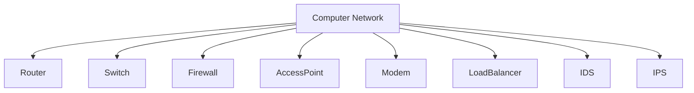

---

> 💡 **Did You Know?**
>
> A medium-sized enterprise may have **hundreds or even thousands of networking devices** working together to connect employees, servers, cloud services, and remote offices.

---

# 🌐 Why Every Network Needs Network Devices

Imagine connecting every computer on Earth using a single cable.

Obviously, this would be impossible.

Modern networks must solve several problems:

- Connecting thousands or millions of devices
- Choosing the best communication path
- Preventing collisions
- Managing wireless communication
- Protecting against cyber attacks
- Expanding networks across cities and countries
- Balancing heavy traffic loads
- Maintaining high availability

No single device can perform all of these tasks.

Instead, specialized devices work together.

For example:

| Device | Primary Responsibility |
|---------|------------------------|
| Repeater | Extends signal distance |
| Hub | Broadcasts incoming traffic |
| Bridge | Connects LAN segments |
| Switch | Connects devices within a LAN intelligently |
| Router | Connects different networks |
| Modem | Connects to the ISP |
| Access Point | Provides wireless connectivity |
| Firewall | Filters network traffic |
| IDS | Detects suspicious activity |
| IPS | Detects and blocks malicious traffic |
| Load Balancer | Distributes traffic across multiple servers |

Throughout this chapter, you'll explore each of these devices in detail.

---

# 🏠 A Real-World Home Network

Let's look at a simple home network.

Imagine you're watching a YouTube video on your laptop.

The request doesn't travel directly to YouTube.

Instead, it passes through several networking devices.


Here's what happens:

1. Your laptop sends a request over Wi-Fi.
2. The **Access Point** receives the wireless signal.
3. The **Router** determines where the request should go.
4. The **Modem** converts signals for communication with your ISP.
5. Your ISP forwards the request across the Internet.
6. The request reaches YouTube's servers.
7. The response follows the reverse path back to your device.

Although this entire process takes only a fraction of a second, multiple networking devices cooperate to make it possible.

---

<!--
Image Description:
Create a clean illustration of a modern home network. Show a laptop, desktop PC, smartphone, smart TV, and gaming console connected wirelessly to a Wi-Fi Access Point. The Access Point connects to a Router, which connects to a Modem, then to the ISP cloud, and finally to the Internet. Label each networking device clearly and use directional arrows to show the flow of data.

Suggested Search Keywords:
home network topology diagram
wireless home network illustration
router modem access point network diagram
-->

<p align="center">

</p>

---

# 🎓 Knowledge Check

Before continuing, test your understanding of the concepts introduced in this lesson.

1. What is a network device?
2. Why can't modern networks function without networking devices?
3. What are some common responsibilities performed by network devices?
4. Which networking device typically connects your home network to your ISP?
5. Why are different types of networking devices needed instead of one universal device?
6. Which networking devices have you already encountered in your home, school, or workplace?
7. How many networking devices might a simple web request pass through before reaching its destination?

---

➡️ **Next:** In the next section, we'll classify network devices into different categories, such as **active vs. passive**, **wired vs. wireless**, **end devices vs. intermediary devices**, and **LAN vs. WAN devices**. Understanding these categories will make it much easier to learn the purpose of each device later in the chapter.

# 🗂 Classifying Network Devices

Now that you understand **what network devices are** and **why they exist**, the next step is to organize them into meaningful categories.

One of the biggest mistakes beginners make is trying to memorize devices one by one.

Instead, networking professionals think in terms of **roles**.

Rather than asking:

> "What does this device do?"

They often ask:

> "What category of device is this, and what role does it play in the network?"

Once you understand these categories, learning individual devices becomes much easier.

---

# 🎯 Why Classify Network Devices?

Imagine walking into a large electronics store.

Instead of placing every product randomly on shelves, the store organizes them into sections:

- Computers
- Smartphones
- Printers
- Cameras
- Networking Equipment

This organization helps customers quickly find what they need.

Networking devices are organized in a similar way.

Although every device communicates over a network, each one serves a different purpose.

Classifying them helps us understand:

- Where they are used
- How they communicate
- Which OSI or TCP/IP layer they primarily operate on
- How they interact with other devices

---

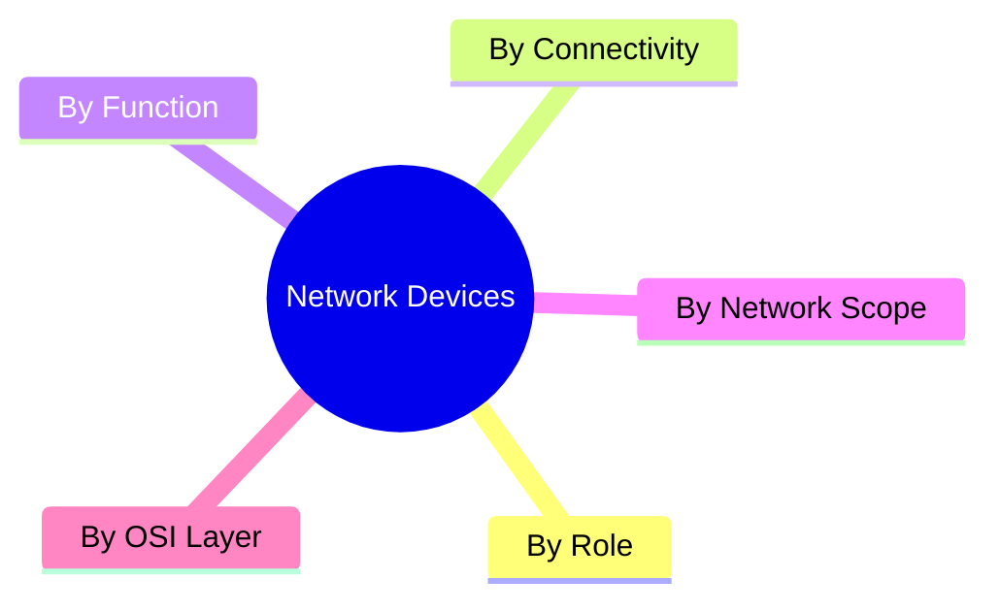

---

> 💡 **Did You Know?**
>
> Large enterprise networks often contain **dozens of different types of network devices**, but each belongs to one or more logical categories based on its purpose.

---

# 💻 End Devices vs Intermediary Devices

One of the most fundamental networking classifications is the distinction between **end devices** and **intermediary devices**.

Although both participate in network communication, they perform very different roles.

---

## 🖥 End Devices

End devices are the devices **used directly by people or applications**.

They generate, receive, or consume network data.

Examples include:

- Desktop computers
- Laptops
- Smartphones
- Tablets
- Servers
- Smart TVs
- IP Cameras
- Printers
- Gaming Consoles

These devices are also known as:

- Hosts
- End Hosts
- Network Hosts

---

### Real-World Example

When you send an email:

- Your laptop creates the message.
- The recipient's computer receives it.

Both systems are **end devices**.

---

## 🌐 Intermediary Devices

Intermediary devices sit **between end devices**.

They do not normally create user data.

Instead, they help move, secure, and manage communication.

Examples include:

- Router
- Switch
- Firewall
- Hub
- Bridge
- Modem
- Access Point
- Load Balancer

These devices form the infrastructure that allows networks to function efficiently.

---


---

### 📊 Comparison

| End Devices | Intermediary Devices |
|-------------|----------------------|
| Generate or receive user data | Forward or manage network traffic |
| Used directly by users | Used to connect and manage networks |
| Examples: PC, Phone, Server | Examples: Router, Switch, Firewall |

---

> 🎯 **Remember**
>
> **End devices communicate with users.**
>
> **Intermediary devices communicate with networks.**

---

# 🔌 Wired vs Wireless Devices

Another common classification is based on **how devices communicate**.

---

## 🔗 Wired Devices

Wired devices use physical cables for communication.

Common media include:

- Ethernet (UTP/STP)
- Fiber Optic Cable
- Coaxial Cable

Examples:

- Switches
- Routers
- Servers
- Desktop PCs
- Modems

### Advantages

- High speed
- Stable connections
- Low latency
- Better security
- Less interference

---

## 📶 Wireless Devices

Wireless devices communicate using radio waves.

Examples include:

- Access Points
- Smartphones
- Laptops
- Tablets
- Wireless Routers
- IoT Devices

### Advantages

- Mobility
- Easy installation
- Flexible deployment
- No physical cables

---

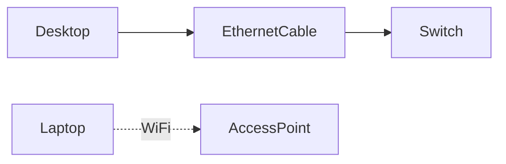

---

### 📊 Comparison

| Wired | Wireless |
|--------|----------|
| Uses cables | Uses radio waves |
| Faster and more stable | More flexible |
| Lower interference | More susceptible to interference |
| Better for servers | Better for mobile devices |

---

# ⚙ Active vs Passive Devices

Networking devices can also be classified based on whether they actively process network traffic.

---

## ⚡ Active Devices

Active devices require electrical power.

They can:

- Process data
- Forward traffic
- Make forwarding decisions
- Improve security
- Manage communication

Examples include:

- Router
- Switch
- Firewall
- Access Point
- IDS
- IPS
- Load Balancer

These devices are considered the "intelligent" components of a network.

---

## 📡 Passive Devices

Passive networking components do **not** process traffic.

Instead, they provide the physical infrastructure that enables communication.

Examples include:

- Ethernet cables
- Fiber optic cables
- Patch panels
- Keystone jacks
- Connectors

Although passive devices are essential, they do not inspect or manipulate network traffic.

---

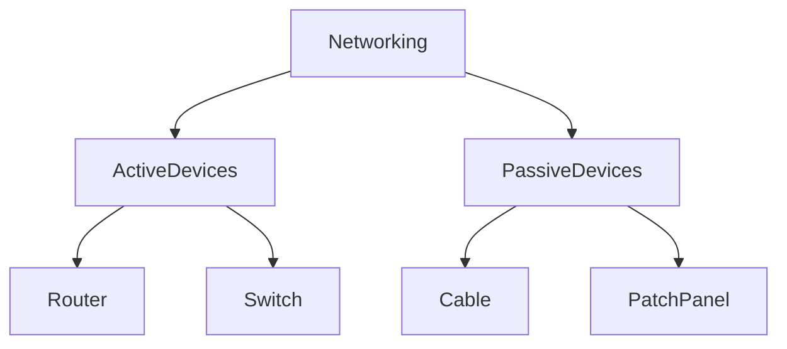

---

> 📝 **Note**
>
> In many networking books, the term **"network device"** refers primarily to **active devices**, while passive components are discussed separately as networking hardware or infrastructure.

---

# 🏢 LAN Devices vs WAN Devices

Network devices can also be grouped according to the type of network in which they primarily operate.

---

## 🏠 LAN (Local Area Network) Devices

LAN devices are commonly found within:

- Homes
- Schools
- Offices
- University campuses

Examples include:

- Switch
- Access Point
- Bridge
- Hub

These devices typically connect systems located within the same building or local network.

---

## 🌍 WAN (Wide Area Network) Devices

WAN devices connect **different networks** over long distances.

Examples include:

- Router
- Modem
- Gateway

These devices enable communication between geographically separated networks.

---

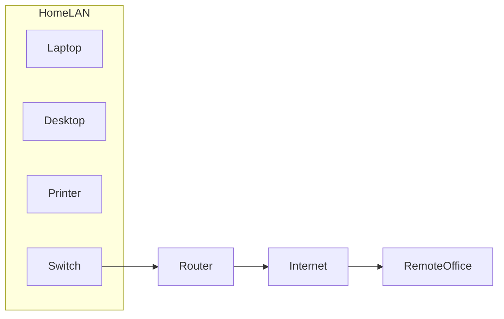

---

### 📊 Comparison

| LAN Devices | WAN Devices |
|-------------|-------------|
| Operate within local networks | Connect multiple networks |
| Usually high-speed local communication | Long-distance communication |
| Examples: Switch, AP | Examples: Router, Modem |

---

# 🏛 Core Devices vs Edge Devices

As networks grow larger, they are often divided into **core** and **edge** infrastructure.

---

## 🌐 Core Devices

Core devices form the backbone of a network.

They are designed for:

- High performance
- High availability
- High-speed forwarding

Examples:

- Core Routers
- Core Switches
- Data Center Switches

---

## 🌍 Edge Devices

Edge devices are located near users or external networks.

Examples include:

- Firewalls
- Access Points
- Customer Routers
- ISP Routers

These devices connect users to the rest of the network.

---

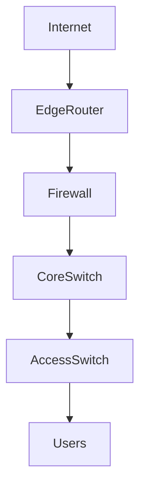

---

# 🌍 Where These Categories Fit Together

Notice that a single device can belong to multiple categories.

For example:

| Device | End/Intermediary | Wired/Wireless | Active/Passive | LAN/WAN |
|---------|------------------|----------------|----------------|---------|
| Switch | Intermediary | Wired | Active | LAN |
| Router | Intermediary | Wired | Active | WAN |
| Access Point | Intermediary | Wireless | Active | LAN |
| Laptop | End Device | Wired/Wireless | Active | LAN |
| Ethernet Cable | Infrastructure | Wired | Passive | LAN |

This demonstrates why networking devices are classified in different ways depending on the context.

---

> ⚠ **Common Beginner Mistake**
>
> Beginners often assume that every networking device belongs to only one category.
>
> In reality, a device can fit into **multiple classifications** simultaneously.
>
> For example, a **wireless access point** is an **intermediary device**, an **active device**, a **wireless device**, and is primarily used in **LAN environments**.

---

<!--
Image Description:
Create a colorful infographic showing the classification of network devices. Divide the image into sections: End Devices vs Intermediary Devices, Wired vs Wireless, Active vs Passive, and LAN vs WAN. Include representative icons such as laptops, routers, switches, access points, firewalls, cables, and servers. Use arrows to show how a single device (e.g., a router) can belong to multiple categories.

Suggested Search Keywords:
network devices classification infographic
LAN WAN devices diagram
active vs passive networking devices
end device vs intermediary device illustration
-->

<p align="center">

</p>

---

# 🎓 Knowledge Check

1. Why do networking professionals classify network devices?
2. What is the difference between an end device and an intermediary device?
3. Can a server be considered an end device? Why?
4. Name three examples of intermediary devices.
5. What is the primary difference between wired and wireless devices?
6. What distinguishes an active device from a passive device?
7. Is an Ethernet cable considered an active networking device? Explain.
8. Which devices are most commonly found in a LAN?
9. Which devices are responsible for connecting different networks together?
10. Can a network device belong to more than one category? Give an example.

---

➡️ **Next:** Now that you understand how network devices are classified, we'll begin exploring the major networking devices individually. You'll get an overview of each device, its primary purpose, the OSI layer it operates on, and why it plays a critical role in modern networks before diving into dedicated lessons for each one.

# 🖥 Overview of Common Network Devices

Now that you understand **how network devices are classified**, it's time to meet the devices themselves.

Think of this section as a **guided tour**.

The goal is **not** to master every device here—that's what the individual chapters are for.

Instead, you'll learn:

- What each device does
- Why it exists
- Which OSI layer it primarily operates on
- Where it is commonly used
- Why cybersecurity professionals should understand it

By the end of this section, you'll have a clear mental map of how these devices fit into modern networks.

---

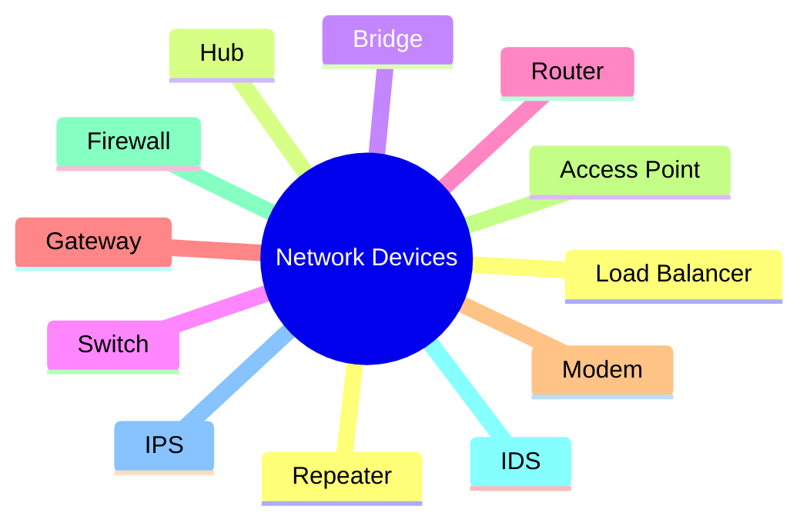

---

# 📡 Repeater

The **Repeater** is one of the simplest networking devices.

Its purpose is to **extend the distance that a signal can travel**.

As electrical or optical signals move through cables, they gradually weaken. This weakening is known as **signal attenuation**.

A repeater receives the weakened signal, regenerates it, and forwards a refreshed copy.

It does **not** inspect frames, packets, or addresses.

---

### 📌 Primary Purpose

- Regenerate weak signals
- Extend network distance

### 🌐 Common Usage

- Long Ethernet cable runs
- Fiber optic communication
- Industrial networks

### 📚 Primary OSI Layer

**Layer 1 — Physical Layer**

### 🛡 Cybersecurity Relevance

Repeaters simply regenerate signals and do not inspect network traffic, making them largely transparent from a security perspective.

➡️ **Continue Reading:** **[Repeater.md](Repeater.md)**

---

# 📢 Hub

A **Hub** connects multiple devices within a network.

However, unlike modern switches, it has **no intelligence**.

Whenever a hub receives incoming data, it simply copies that data and broadcasts it to **every connected device**, regardless of the intended destination.

This makes hubs inefficient and insecure.

Today, hubs are considered obsolete in most production networks.

---

### 📌 Primary Purpose

- Connect multiple devices
- Broadcast traffic to every port

### 🌐 Common Usage

- Historical Ethernet networks
- Educational demonstrations
- Legacy environments

### 📚 Primary OSI Layer

**Layer 1 — Physical Layer**

### 🛡 Cybersecurity Relevance

Because every connected device receives every frame, hubs make packet sniffing extremely easy.

➡️ **Continue Reading:** **[Hub.md](Hub.md)**

---

# 🌉 Bridge

A **Bridge** was designed to improve network efficiency.

Instead of blindly forwarding traffic, it learns **MAC addresses** and forwards frames only when necessary.

Bridges divide large LANs into smaller network segments, reducing unnecessary traffic.

Although largely replaced by switches, bridges introduced concepts still used today.

---

### 📌 Primary Purpose

- Connect LAN segments
- Filter traffic using MAC addresses

### 🌐 Common Usage

- Legacy Ethernet networks
- Small LAN segmentation

### 📚 Primary OSI Layer

**Layer 2 — Data Link Layer**

### 🛡 Cybersecurity Relevance

Bridges reduce unnecessary traffic but generally provide little security beyond basic traffic filtering.

➡️ **Continue Reading:** **[Bridge.md](Bridge.md)**

---

# 🔀 Switch

The **Switch** is one of the most important networking devices in modern LANs.

Unlike a hub, a switch learns the MAC address of every connected device.

It forwards frames **only to the correct destination**, making communication significantly faster and more secure.

Nearly every home, office, university, and enterprise LAN relies on switches.

---

### 📌 Primary Purpose

- Connect devices within a LAN
- Forward frames intelligently

### 🌐 Common Usage

- Homes
- Offices
- Data Centers
- Campus Networks

### 📚 Primary OSI Layer

**Layer 2 — Data Link Layer**

*(Some enterprise switches also perform Layer 3 routing.)*

### 🛡 Cybersecurity Relevance

Switches support features such as VLANs, Port Security, and MAC filtering, making them an important part of network segmentation.

➡️ **Continue Reading:** **[Switch.md](Switch.md)**

---

# 🌍 Router

Routers connect **different networks** together.

Instead of forwarding frames using MAC addresses, routers examine **IP addresses** and determine the best path for packets.

Without routers, communication between different networks—including the Internet—would not be possible.

---

### 📌 Primary Purpose

- Connect different networks
- Forward packets using IP addresses

### 🌐 Common Usage

- Home Internet
- Enterprise Networks
- ISP Infrastructure
- Internet Backbone

### 📚 Primary OSI Layer

**Layer 3 — Network Layer**

### 🛡 Cybersecurity Relevance

Routers can implement Access Control Lists (ACLs), routing policies, and basic traffic filtering to improve network security.

➡️ **Continue Reading:** **[Router.md](Router.md)**

---

# 🌐 Gateway

A **Gateway** enables communication between systems that use **different protocols or architectures**.

Unlike a router, which connects similar IP networks, a gateway performs **protocol translation**.

It acts as a translator, allowing otherwise incompatible systems to communicate.

---

### 📌 Primary Purpose

- Translate between different protocols
- Connect dissimilar networks

### 🌐 Common Usage

- Cloud services
- Email gateways
- VoIP gateways
- IoT environments

### 📚 Primary OSI Layer

**Layers 4–7 (depending on implementation)**

### 🛡 Cybersecurity Relevance

Security gateways inspect, filter, and translate traffic while enforcing organizational security policies.

➡️ **Continue Reading:** **[Gateway.md](Gateway.md)**

---

# 📡 Modem

A **Modem** connects your local network to your **Internet Service Provider (ISP)**.

Its name comes from **Modulator/Demodulator**.

It converts digital signals generated by computers into signals suitable for transmission over communication media, then converts incoming signals back into digital form.

Although many home devices combine a modem and router into one unit, they perform different functions.

---

### 📌 Primary Purpose

- Connect to the ISP
- Convert communication signals

### 🌐 Common Usage

- Cable Internet
- DSL
- Fiber Internet

### 📚 Primary OSI Layer

**Primarily Layer 1 (with technology-dependent functions)**

### 🛡 Cybersecurity Relevance

Modems are often the first device exposed to an ISP and should always be paired with a secure router or firewall.

➡️ **Continue Reading:** **[Modem.md](Modem.md)**

---

# 📶 Access Point (AP)

An **Access Point** allows wireless devices to join a wired network.

It acts as the bridge between **Wi-Fi clients** and the wired LAN.

Without access points, wireless networking as we know it would not exist.

---

### 📌 Primary Purpose

- Provide wireless connectivity
- Bridge Wi-Fi devices to Ethernet

### 🌐 Common Usage

- Homes
- Schools
- Enterprises
- Airports
- Hotels

### 📚 Primary OSI Layer

**Layer 2 — Data Link Layer**

### 🛡 Cybersecurity Relevance

Access points enforce wireless security standards such as WPA2 and WPA3 and are common targets for wireless attacks.

➡️ **Continue Reading:** **[Access Point.md](Access Point.md)**

---

# 🔥 Firewall

A **Firewall** protects networks by inspecting and filtering traffic according to predefined security rules.

It acts as a security checkpoint between trusted and untrusted networks.

Modern firewalls can inspect traffic far beyond basic IP addresses.

---

### 📌 Primary Purpose

- Filter network traffic
- Enforce security policies

### 🌐 Common Usage

- Homes
- Enterprises
- Cloud Infrastructure
- Data Centers

### 📚 Primary OSI Layer

**Layers 3–7 (depending on firewall type)**

### 🛡 Cybersecurity Relevance

Firewalls are one of the most important defensive technologies in cybersecurity and serve as the first line of defense for many networks.

➡️ **Continue Reading:** **[Firewall.md](Firewall.md)**

---

# 🚨 Intrusion Detection System (IDS)

An **Intrusion Detection System (IDS)** monitors network traffic for suspicious or malicious activity.

Unlike a firewall, an IDS **does not block traffic**.

Instead, it generates alerts when potential threats are detected.

---

### 📌 Primary Purpose

- Monitor traffic
- Detect attacks
- Generate alerts

### 🌐 Common Usage

- Security Operations Centers (SOC)
- Enterprise Networks
- Government Infrastructure

### 📚 Primary OSI Layer

**Multiple Layers (3–7)**

### 🛡 Cybersecurity Relevance

IDS solutions help analysts identify malware, reconnaissance activity, and policy violations before serious damage occurs.

➡️ **Continue Reading:** **[IDS.md](IDS.md)**

---

# 🛑 Intrusion Prevention System (IPS)

An **Intrusion Prevention System (IPS)** performs many of the same detection functions as an IDS.

However, it goes one step further by automatically **blocking malicious traffic** before it reaches the target.

---

### 📌 Primary Purpose

- Detect attacks
- Block malicious traffic automatically

### 🌐 Common Usage

- Enterprise Security
- Government Networks
- Critical Infrastructure

### 📚 Primary OSI Layer

**Multiple Layers (3–7)**

### 🛡 Cybersecurity Relevance

IPS solutions actively protect networks from exploitation, malware, and known attack signatures.

➡️ **Continue Reading:** **[IPS.md](IPS.md)**

---

# ⚖ Load Balancer

A **Load Balancer** distributes incoming requests across multiple servers.

Instead of allowing one server to become overloaded, it shares the workload among several systems.

This improves:

- Performance
- Reliability
- High Availability
- Scalability

Large websites such as Google, Amazon, Netflix, and GitHub rely heavily on load balancers.

---

### 📌 Primary Purpose

- Distribute network traffic
- Improve availability

### 🌐 Common Usage

- Cloud Platforms
- Data Centers
- Enterprise Applications
- High-Traffic Websites

### 📚 Primary OSI Layer

**Layer 4 and/or Layer 7**

### 🛡 Cybersecurity Relevance

Load balancers improve resilience against traffic spikes and are commonly integrated with Web Application Firewalls (WAFs) and DDoS protection services.

➡️ **Continue Reading:** **[Load Balancer.md](Load Balancer.md)**

---

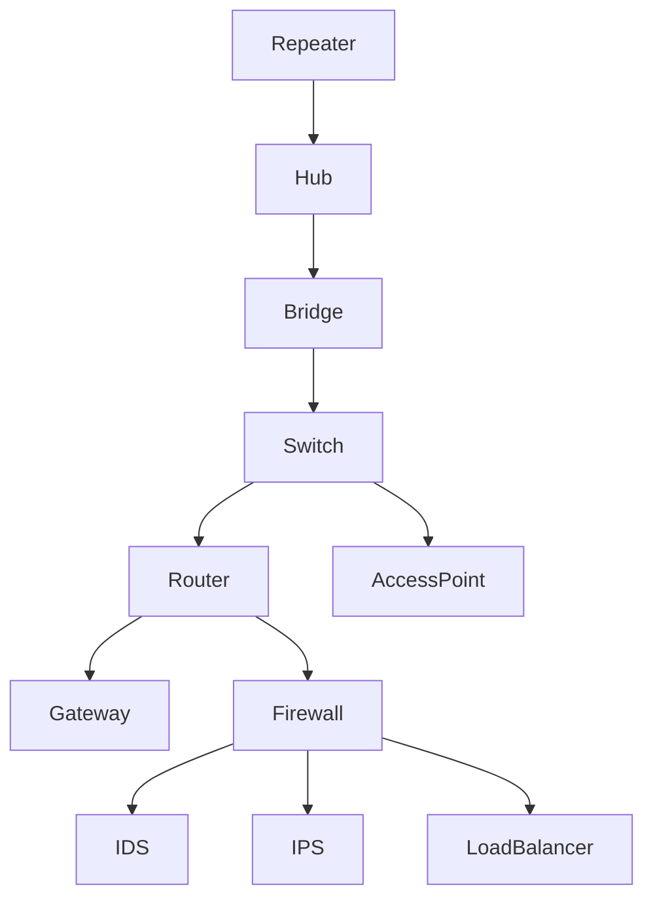

> 💡 **Did You Know?**
>
> Although these devices have different responsibilities, they rarely operate alone. A typical enterprise network uses **multiple networking devices working together**, each performing a specialized role to ensure reliable, efficient, and secure communication.

---

# 🎓 Knowledge Check

1. Which networking device regenerates weak signals?
2. Why are hubs rarely used in modern networks?
3. How does a switch differ from a hub?
4. What is the primary responsibility of a router?
5. When would you use a gateway instead of a router?
6. Why is a modem required for most Internet connections?
7. What role does an access point play in a wireless network?
8. How does a firewall differ from an IDS?
9. What additional capability does an IPS provide compared to an IDS?
10. Why are load balancers essential for large-scale websites and cloud services?

---

➡️ **Next:** In the following section, we'll see **how these devices work together inside real-world home, enterprise, and cloud networks**, following the complete journey of a packet from a user's device to a remote server.

# 🌐 How Network Devices Work Together

So far, you've learned what each networking device does individually.

However, real networks don't rely on a single device.

Instead, **multiple devices cooperate**, each performing a specialized task as data travels from the source to its destination.

Think of it like a relay race.

Each participant has a specific responsibility, and together they ensure the baton reaches the finish line.

In networking, the "baton" is your data.

Whether you're opening GitHub, streaming a YouTube video, checking email, or joining an online game, your data passes through several networking devices before reaching its destination.

Understanding how these devices interact is one of the most important concepts in networking.

---

# 🏠 Scenario 1: A Home Network

Let's start with the network most people use every day.

Imagine you open your browser and visit:

```text
https://github.com
```

Although this action feels instantaneous, your request travels through multiple devices before reaching GitHub's servers.

---


---

## Step-by-Step Journey

### Step 1 — User Creates a Request

You type:

```text
https://github.com
```

Your browser generates an HTTPS request.

At this point, the request exists only inside your computer.

---

### Step 2 — Access Point

If you're connected using Wi-Fi, your laptop sends the wireless signal to the **Access Point**.

The Access Point converts the wireless communication into Ethernet frames for the wired network.

If you're using a wired Ethernet connection instead, this step may not be necessary.

---

### Step 3 — Router

The Router receives the packet.

It examines the destination IP address and decides where the packet should go next.

Since GitHub isn't on your local network, the router forwards the packet toward your ISP.

---

### Step 4 — Modem

The modem prepares the signal for transmission over your Internet connection.

Depending on your ISP, this could involve:

- Cable
- DSL
- Fiber
- Cellular

The modem then forwards the communication to your Internet Service Provider.

---

### Step 5 — ISP

Your ISP becomes responsible for forwarding the packet across the Internet.

The packet may travel through numerous routers owned by different organizations before reaching GitHub.

---

### Step 6 — Destination

Eventually, the packet reaches GitHub's data center.

Before reaching the web server, it may pass through additional networking devices such as:

- Firewalls
- Load Balancers
- Core Routers
- Core Switches

Finally, the web server processes your request and sends the response back.

---

> 💡 **Did You Know?**
>
> A simple web request may travel through **dozens of routers** before reaching its destination—even if the entire process takes less than a second.

---

# 🏢 Scenario 2: Enterprise Network

Enterprise networks are significantly more complex than home networks.

Large organizations must support:

- Thousands of employees
- Hundreds of servers
- Multiple office buildings
- Cloud infrastructure
- Security monitoring
- Remote workers

To achieve this, they use many different networking devices working together.

---

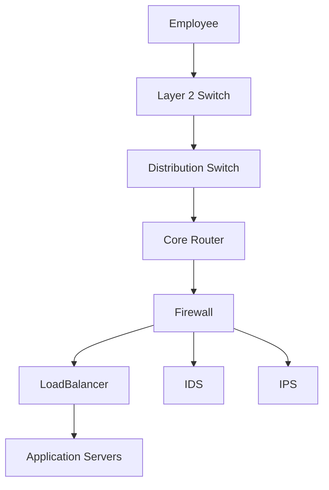

---

## What Happens Here?

### 🖥 Access Switch

Connects employee devices within the office.

---

### 🔀 Distribution Switch

Aggregates traffic from multiple access switches.

---

### 🌍 Core Router

Determines the best path toward internal services or the Internet.

---

### 🔥 Firewall

Inspects traffic.

Allows legitimate communication.

Blocks unauthorized access.

---

### ⚖ Load Balancer

Distributes requests across multiple servers.

Instead of sending every request to one server, it shares the workload.

---

### 🛡 IDS / IPS

Continuously monitor traffic for malicious behavior.

An IDS generates alerts.

An IPS can actively stop attacks.

---

### 🖥 Server Farm

The application servers process requests and return responses.

---

# ☁ Scenario 3: Cloud Infrastructure

Modern applications often run in cloud environments instead of traditional data centers.

Cloud providers use thousands of networking devices to deliver highly available services.

---


---

## Device Responsibilities

| Device | Responsibility |
|---------|----------------|
| Cloud Firewall | Protects cloud resources |
| Load Balancer | Distributes traffic |
| Web Server | Handles HTTP/HTTPS requests |
| Application Server | Executes business logic |
| Database Server | Stores application data |

Although the infrastructure looks different, the networking principles remain the same.

---

# 📦 Following a Packet

Let's follow one packet as it travels across a network.

---


---

| Device | What Happens to the Packet? |
|---------|-----------------------------|
| Computer | Creates the packet |
| Switch | Uses MAC addresses to forward the frame |
| Router | Uses IP addresses to determine the best route |
| Firewall | Applies security policies |
| Internet | Carries the packet across multiple networks |
| Remote Server | Processes the request and sends a response |

Each device contributes something different.

None of them performs every networking task.

---

# 🧩 The Right Tool for the Right Job

Why don't we build one device that does everything?

Because specialization improves:

- Performance
- Reliability
- Scalability
- Security
- Troubleshooting
- Cost-effectiveness

For example:

| Task | Best Device |
|------|-------------|
| Extend signal | Repeater |
| Connect devices within a LAN | Switch |
| Connect different networks | Router |
| Protect the network | Firewall |
| Detect attacks | IDS |
| Prevent attacks | IPS |
| Provide Wi-Fi | Access Point |
| Balance server traffic | Load Balancer |

Each device focuses on doing one job extremely well.

---

# 🌍 Real-World Example

Imagine you're watching a movie on Netflix.

Behind the scenes:

1. Your TV connects to the **Access Point**.
2. The Access Point forwards traffic to the **Switch** or **Router**.
3. The Router sends packets to your ISP.
4. Multiple Internet routers forward the packets.
5. Netflix's Firewall inspects incoming traffic.
6. A Load Balancer selects the least busy server.
7. The streaming server sends video data back to your TV.

All of this happens continuously while you're watching the movie.

Without networking devices working together, smooth video streaming wouldn't be possible.

---

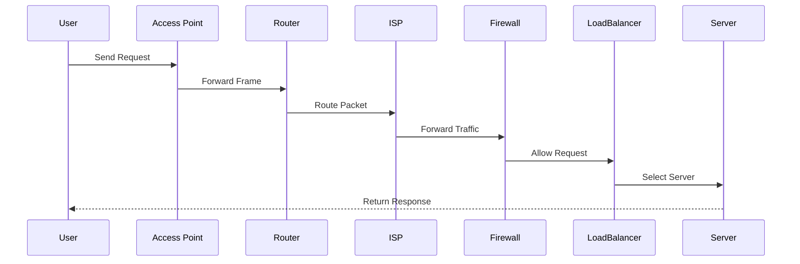

---

> ⚠ **Common Beginner Mistake**
>
> Many beginners believe that a router handles every networking task.
>
> In reality, routers focus primarily on **routing packets between networks**. Tasks such as switching, wireless connectivity, security inspection, traffic analysis, and load balancing are performed by specialized devices designed for those specific purposes.

---

<!--
Image Description:
Illustrate the complete journey of a data packet from a user's laptop to a cloud-hosted web application. Include a laptop, wireless access point, switch, router, modem, ISP cloud, Internet cloud, enterprise firewall, IDS, IPS, load balancer, web server, application server, and database server. Use arrows to clearly indicate the packet's path and label each networking device.

Suggested Search Keywords:
enterprise network topology diagram
packet journey through network devices
home network to cloud infrastructure diagram
-->

<p align="center">

</p>

---

# 🎓 Knowledge Check

1. Why do modern networks use multiple networking devices instead of one universal device?
2. Which device is usually the first networking device a Wi-Fi laptop communicates with?
3. What is the primary responsibility of a router during packet forwarding?
4. Why are firewalls placed between trusted and untrusted networks?
5. How does a load balancer improve application availability?
6. What is the difference between an IDS and an IPS in an enterprise network?
7. Which devices are commonly found in a home network?
8. Which additional devices are typically found in enterprise or cloud environments?
9. Why is specialization important in networking?
10. Describe the journey of a packet from your laptop to a website in your own words.

---

➡️ **Next:** In the next section, we'll map each networking device to the **OSI Model** and **TCP/IP Model**, helping you understand **which layer each device primarily operates on** and why that knowledge is essential for troubleshooting and cybersecurity.

# 🗺 Mapping Network Devices to the OSI and TCP/IP Models

One of the greatest strengths of the **OSI Model** and the **TCP/IP Model** is that they help us understand **where networking devices operate**.

Every device has a specific job.

To perform that job, it only needs to examine certain pieces of information.

For example:

- A **Switch** doesn't need to understand HTTP requests.
- A **Router** doesn't care about MAC addresses beyond the local link.
- A **Firewall** may inspect everything from IP addresses to application-layer data.

Knowing **which layer a device operates on** tells you:

- What information it can inspect
- What decisions it can make
- What problems it can solve
- What limitations it has

This knowledge is essential for networking, troubleshooting, and cybersecurity.

---

# 📊 Network Devices and Their Primary OSI Layers

The following table shows the primary operating layer for each networking device.

> **📝 Note**
>
> Some modern devices operate across **multiple layers**. The layer shown below represents the device's primary or traditional operating layer.

| Device | Primary OSI Layer | TCP/IP Layer | Main Responsibility |
|---------|------------------|--------------|---------------------|
| Repeater | Layer 1 – Physical | Network Access | Regenerate signals |
| Hub | Layer 1 – Physical | Network Access | Broadcast signals |
| Bridge | Layer 2 – Data Link | Network Access | Filter frames using MAC addresses |
| Switch | Layer 2 – Data Link | Network Access | Forward frames intelligently |
| Layer 3 Switch | Layer 3 – Network | Internet | Routing within LANs |
| Router | Layer 3 – Network | Internet | Route packets between networks |
| Access Point | Layer 2 – Data Link | Network Access | Connect wireless devices |
| Modem | Layer 1 (Technology Dependent) | Network Access | Connect to ISP |
| Firewall | Layers 3–7 | Internet / Application | Filter and inspect traffic |
| IDS | Layers 3–7 | Multiple | Detect suspicious activity |
| IPS | Layers 3–7 | Multiple | Detect and block attacks |
| Gateway | Layers 4–7 | Application | Translate between protocols |
| Load Balancer | Layers 4 & 7 | Transport / Application | Distribute client requests |

---

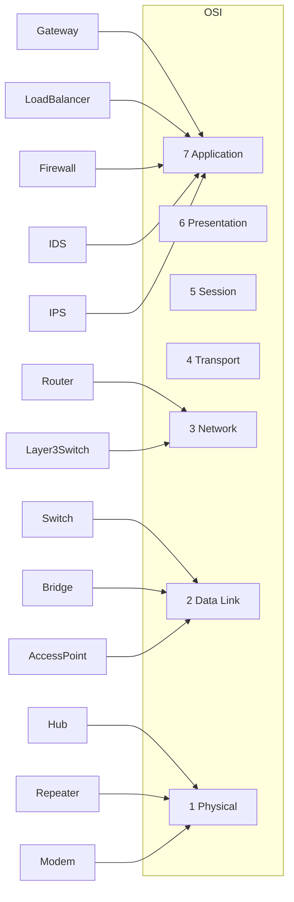

---

# 👀 What Can Each Device Actually See?

A networking device can only make decisions based on the information available at its operating layer.

The deeper a device can inspect traffic, the more intelligent its decisions can be.

| Device | Can Read Signals | MAC Address | IP Address | TCP/UDP Ports | Application Data |
|---------|:---------------:|:-----------:|:----------:|:--------------:|:----------------:|
| Repeater | ✅ | ❌ | ❌ | ❌ | ❌ |
| Hub | ✅ | ❌ | ❌ | ❌ | ❌ |
| Bridge | ❌ | ✅ | ❌ | ❌ | ❌ |
| Switch | ❌ | ✅ | ❌ | ❌ | ❌ |
| Router | ❌ | ❌ | ✅ | ❌ | ❌ |
| Traditional Firewall | ❌ | ❌ | ✅ | ✅ | ❌ |
| Next-Generation Firewall | ❌ | ❌ | ✅ | ✅ | ✅ |
| IDS / IPS | ❌ | Sometimes | ✅ | ✅ | ✅ |
| Load Balancer | ❌ | ❌ | ✅ | ✅ | Sometimes |

---

> 💡 **Did You Know?**
>
> A **Layer 2 switch** cannot block a website like `github.com` because it has no understanding of HTTP requests or domain names. It only forwards Ethernet frames based on MAC addresses.

---

# 🧠 How Devices Make Decisions

Each networking device uses a different type of information to perform its job.

| Device | Makes Decisions Using |
|---------|-----------------------|
| Repeater | Signal strength |
| Hub | No decision (broadcasts everything) |
| Bridge | MAC Address |
| Switch | MAC Address Table |
| Router | Routing Table & IP Address |
| Firewall | Security Rules |
| IDS | Attack Signatures & Traffic Patterns |
| IPS | Security Policies & Threat Intelligence |
| Gateway | Protocol Translation Rules |
| Load Balancer | Server Health & Traffic Load |

---

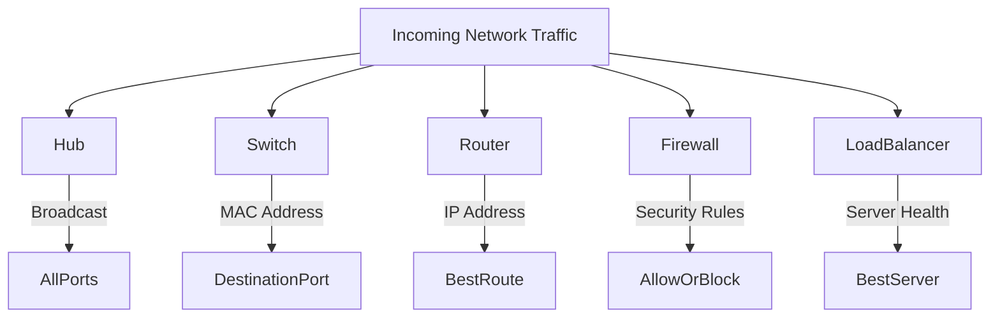

---

# 🔍 Troubleshooting by Layer

One of the biggest advantages of understanding the OSI Model is that it provides a logical troubleshooting framework.

Instead of guessing where a problem exists, you can narrow your investigation based on the affected layer.

| Symptom | Likely Layer | Device to Check |
|---------|--------------|-----------------|
| No link lights | Physical | Cable, Repeater, Hub, NIC |
| Devices on same LAN can't communicate | Data Link | Switch, Bridge |
| Can't reach another network | Network | Router |
| Website loads slowly | Transport / Application | Firewall, Load Balancer |
| Wi-Fi disconnects frequently | Data Link | Access Point |
| Internet completely unavailable | Physical / Network | Modem, Router |

---

### 🌍 Real-World Example

Imagine users in an office report that they **cannot access the company website**, but they can still print documents and access shared folders.

What does this tell us?

- The local network is functioning.
- Switches are forwarding traffic correctly.
- End devices can communicate within the LAN.

The problem is more likely related to:

- The router
- The firewall
- The Internet connection
- The web server itself

By thinking layer by layer, troubleshooting becomes much faster and more systematic.

---

# ⚖ Device Comparison at a Glance

| Device | Connects | Uses | Intelligent? | Primary Purpose |
|---------|----------|------|--------------|-----------------|
| Repeater | Cable Segments | Signals | ❌ | Extend distance |
| Hub | Devices | Signals | ❌ | Broadcast traffic |
| Bridge | LAN Segments | MAC Address | ✅ | Filter frames |
| Switch | Devices | MAC Address | ✅ | Efficient LAN communication |
| Router | Networks | IP Address | ✅ | Route packets |
| Access Point | Wireless Devices | MAC Address | ✅ | Wi-Fi access |
| Firewall | Networks | Security Rules | ✅ | Protect networks |
| IDS | Networks | Traffic Analysis | ✅ | Detect attacks |
| IPS | Networks | Traffic Analysis | ✅ | Prevent attacks |
| Gateway | Different Systems | Protocol Translation | ✅ | Enable interoperability |
| Load Balancer | Servers | Traffic Metrics | ✅ | Improve availability |

---

> 🎯 **Remember**
>
> **A device cannot make decisions using information it cannot see.**
>
> This simple principle explains why different networking devices exist and why each one has a specialized role.

---

<!--
Image Description:
Create a layered infographic showing the seven OSI layers on the left and the four TCP/IP layers on the right. Place networking devices beside the layer where they primarily operate, using icons for repeaters, hubs, switches, routers, access points, firewalls, IDS, IPS, gateways, and load balancers. Use arrows to indicate the relationship between layers and devices.

Suggested Search Keywords:
OSI layer devices infographic
network devices by OSI layer
OSI TCP-IP device mapping diagram
-->

<p align="center">

</p>

---

# 🎓 Knowledge Check

1. Why is it important to know which OSI layer a device operates on?
2. Why can't a hub make forwarding decisions?
3. Which device primarily uses MAC addresses to forward traffic?
4. Which device primarily uses IP addresses?
5. Can a traditional Layer 2 switch inspect HTTP traffic? Why or why not?
6. How does a next-generation firewall differ from a traditional firewall?
7. Which networking devices commonly operate across multiple OSI layers?
8. Why does understanding device layers simplify troubleshooting?
9. If devices on the same LAN cannot communicate, which device would you investigate first?
10. Explain the statement: **"A device cannot make decisions using information it cannot see."**

---

➡️ **Next:** In the following section, we'll shift our focus from networking to **cybersecurity**. You'll discover how routers, switches, firewalls, IDS, IPS, access points, and load balancers become critical components in defending modern networks against cyber threats.

# 🛡 Cybersecurity Perspective: Network Devices as the First Line of Defense

Modern networks are not designed with performance alone in mind.

They are also designed to be **secure**.

Every packet entering or leaving a network passes through one or more networking devices.

Some devices simply forward traffic.

Others inspect it.

Some detect attacks.

Others actively stop them.

Together, these devices form the foundation of **network security**.

For cybersecurity professionals, understanding network devices is essential because almost every attack—and every defense—involves one or more of these devices.

---

# 🏰 Defense in Depth

One of the most important cybersecurity concepts is **Defense in Depth**.

Instead of relying on a single security mechanism, organizations deploy **multiple layers of protection**.

If one security control fails, another is ready to defend the network.

Think of a castle.

An attacker doesn't immediately reach the king.

Instead, they must bypass:

- The moat
- The outer wall
- The gate
- The guards
- The inner walls
- The castle keep

Modern networks use the same philosophy.

---

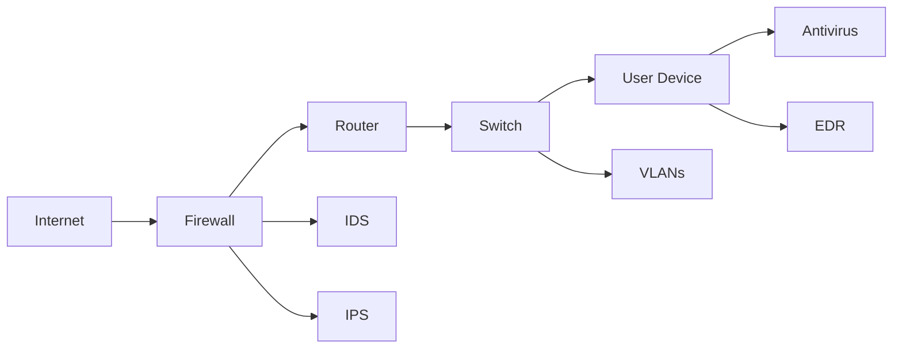

---

> 💡 **Did You Know?**
>
> Most successful cyberattacks are not caused by the failure of a single security device—they occur because **multiple security controls are missing, misconfigured, or bypassed**.

---

# 🔥 Firewalls — Controlling Network Traffic

A firewall acts as a **security checkpoint**.

Every packet attempting to enter or leave the network can be inspected against predefined security rules.

A firewall can decide whether to:

- Allow traffic
- Block traffic
- Log activity
- Alert administrators

Modern **Next-Generation Firewalls (NGFWs)** go even further by inspecting application-layer traffic such as:

- HTTP
- HTTPS
- DNS
- FTP
- SMTP

Firewalls are often the first line of defense between an organization's internal network and the Internet.

---

# 🚨 IDS and IPS — Detecting and Preventing Attacks

Although firewalls filter traffic, they cannot identify every attack.

This is where **Intrusion Detection Systems (IDS)** and **Intrusion Prevention Systems (IPS)** become essential.

### IDS

An IDS monitors traffic and generates alerts when suspicious behavior is detected.

Examples include:

- Port scanning
- Malware communication
- Brute-force login attempts
- Suspicious DNS requests

---

### IPS

An IPS performs similar analysis but can automatically respond.

Possible actions include:

- Dropping packets
- Resetting TCP sessions
- Blocking IP addresses
- Quarantining malicious traffic

---


---

# 🌐 Routers and Secure Network Design

Routers do much more than forward packets.

They also play an important role in securing networks.

Examples include:

- Access Control Lists (ACLs)
- Route filtering
- Network segmentation
- VPN connectivity
- Traffic isolation

Many enterprise routers enforce security policies before packets ever reach internal systems.

---

# 🔀 Switches and Network Segmentation

Modern switches contribute significantly to cybersecurity.

One of their most important features is **Virtual LANs (VLANs)**.

VLANs divide one physical network into multiple isolated logical networks.

For example:

- HR Department
- Finance Department
- Guest Wi-Fi
- Server Network

Even though all devices use the same physical switches, they remain isolated unless routing policies allow communication.

---

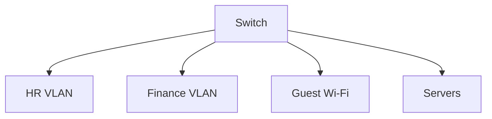

---

> 🎯 **Remember**
>
> Network segmentation limits the spread of cyberattacks.
>
> If one network segment becomes compromised, VLANs help prevent attackers from moving freely throughout the organization.

---

# 📶 Wireless Security

Wireless networking introduces unique security challenges.

Unlike wired communication, radio waves extend beyond the walls of a building.

Attackers may attempt to:

- Capture wireless traffic
- Crack weak Wi-Fi passwords
- Create rogue access points
- Perform Evil Twin attacks
- Launch deauthentication attacks

For this reason, modern Access Points support security mechanisms such as:

- WPA2
- WPA3
- 802.1X Authentication
- MAC Filtering
- Guest Network Isolation

---

# ⚖ Load Balancers and Availability

Cybersecurity isn't only about confidentiality.

It also includes **availability**.

Load balancers help keep services online by distributing requests across multiple servers.

Benefits include:

- Preventing server overload
- Improving fault tolerance
- Supporting high availability
- Reducing downtime

Many organizations combine load balancers with:

- Web Application Firewalls (WAFs)
- DDoS Protection Services
- Content Delivery Networks (CDNs)

---

# 🔍 Packet Analysis and Wireshark

When security incidents occur, analysts often investigate packet captures.

Tools such as **Wireshark** reveal how packets move through networking devices.

Understanding:

- Switches
- Routers
- Firewalls
- TCP/IP
- OSI Layers

makes packet analysis dramatically easier.

Without networking knowledge, Wireshark appears to be random hexadecimal data.

With networking knowledge, it becomes a detailed story of what happened on the network.

---

# 🏢 Security Operations Centers (SOC)

Security analysts spend much of their day working with networking devices.

Typical responsibilities include:

- Monitoring firewall logs
- Investigating IDS alerts
- Reviewing IPS blocks
- Analyzing suspicious packets
- Investigating unusual DNS traffic
- Examining VPN connections
- Correlating router and switch logs

A strong understanding of networking devices is one of the core skills expected from SOC analysts.

---

# 🌍 Real-World Example

Imagine an employee accidentally clicks a malicious email link.

What happens next?

1. The computer attempts to contact a malicious server.
2. The switch forwards the traffic.
3. The router routes the packet toward the Internet.
4. The firewall inspects the connection.
5. The IDS detects suspicious behavior.
6. The IPS blocks the communication.
7. Security analysts receive an alert.
8. The infected computer is isolated before malware spreads.

Notice how **multiple networking devices work together** to stop a single attack.

This is Defense in Depth in action.

---

```mermaid
sequenceDiagram

participant User
participant Switch
participant Router
participant Firewall
participant IDS
participant IPS
participant SOC

User->>Switch: Suspicious Traffic
Switch->>Router: Forward Packet
Router->>Firewall: Route Packet
Firewall->>IDS: Inspect Traffic
IDS->>IPS: Threat Detected
IPS-->>User: Block Connection
IPS->>SOC: Generate Alert
```

---

# 🚀 Looking Ahead

As you continue through this roadmap, you'll study many of these devices in far greater depth.

Future chapters will cover topics such as:

- Firewall technologies
- VLAN implementation
- Network segmentation
- VPNs
- Proxy servers
- Network Access Control (NAC)
- Packet capture with Wireshark
- Intrusion Detection Systems
- Intrusion Prevention Systems
- Zero Trust Architecture

Everything you learn in those chapters will build upon the networking foundation established here.

---

# 🎓 Knowledge Check

1. What is Defense in Depth?
2. Why shouldn't organizations rely on a single security device?
3. How does a firewall improve network security?
4. What is the difference between an IDS and an IPS?
5. Why are VLANs considered a security feature?
6. How can routers contribute to network security?
7. What are some common attacks against wireless networks?
8. Why are load balancers important for availability?
9. How does Wireshark benefit from understanding networking devices?
10. Explain how multiple network devices work together to stop a cyberattack.

---

➡️ **Next:** We'll conclude this chapter with a comprehensive revision, key takeaways, final knowledge check, further reading, and a bridge to the next chapter in your networking roadmap.

# 🗺 Where You Are in the Roadmap

```text
Cybersecurity Roadmap
```

## 📖 02 – Networking

### ✅ Network Models

- ✅ [OSI Model](../01-Network%20Models/OSI%20Model.md)
- ✅ [TCP/IP Model](../01-Network%20Models/TCP-IP%20Model.md)
- ✅ [OSI vs TCP/IP](../01-Network%20Models/OSI%20vs%20TCP-IP%20Model.md)
- ✅ [Encapsulation](../01-Network%20Models/Encapsulation.md)
- ✅ [Decapsulation](../01-Network%20Models/Decapsulation.md)

---

### 📖 Network Devices

- ✅ **README (Current Chapter)**
- ⏭️ [Choosing the Right Network Device](Choosing%20the%20Right%20Network%20Device.md)
- ⏭️ [Repeater](Repeater.md)
- ⏭️ [Hub](Hub.md)
- ⏭️ [Bridge](Bridge.md)
- ⏭️ [Switch](Switch.md)
- ⏭️ [Router](Router.md)
- ⏭️ [Gateway](Gateway.md)
- ⏭️ [Modem](Modem.md)
- ⏭️ [Access Point](Access%20Point.md)
- ⏭️ [Firewall](Firewall.md)
- ⏭️ [IDS](IDS.md)
- ⏭️ [IPS](IPS.md)
- ⏭️ [Load Balancer](Load%20Balancer.md)

---

> 🎯 **Remember**
>
> Networking is not about memorizing devices.
>
> It's about understanding **why each device exists**, **what problem it solves**, **where it operates**, and **how it works with the rest of the network**.
>
> Once you understand those four questions, learning advanced networking and cybersecurity becomes much easier.

---

# 🎉 Congratulations!

You've completed the **Network Devices Overview** chapter.

You now understand:

- ✅ Why network devices exist.
- ✅ How they are classified.
- ✅ How they work together.
- ✅ Where they operate in the OSI and TCP/IP models.
- ✅ Their role in enterprise networking.
- ✅ Their importance in cybersecurity.
- ✅ How each device contributes to reliable, scalable, and secure communication.

This chapter serves as the conceptual foundation for every networking device covered throughout the remainder of this roadmap.

---

## ➡️ Next Lesson

Now that you have a broad understanding of modern networking devices, it's time to answer an important practical question:

> **How do you choose the right networking device for the right job?**

Before studying individual devices, you'll learn how they evolved, why different devices exist, and how network engineers decide which device should be used in different scenarios.

The next chapter will compare devices based on:

- Their purpose
- OSI and TCP/IP layers
- Intelligence
- Traffic handling
- Security capabilities
- Real-world use cases

This will give you a strong mental framework before diving into each networking device individually.

**➡️ Next Chapter:** **[Choosing the Right Network Device.md](Choosing%20the%20Right%20Network%20Device.md)**