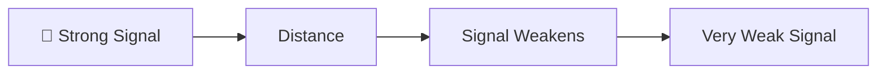
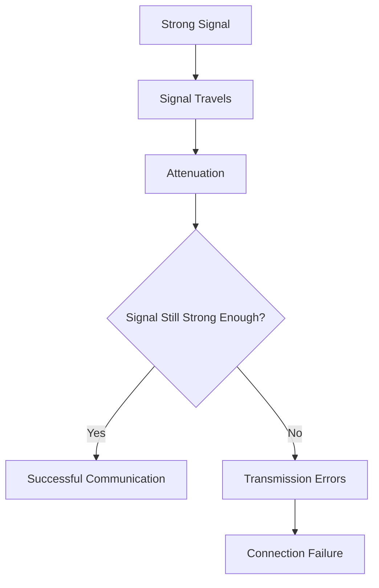
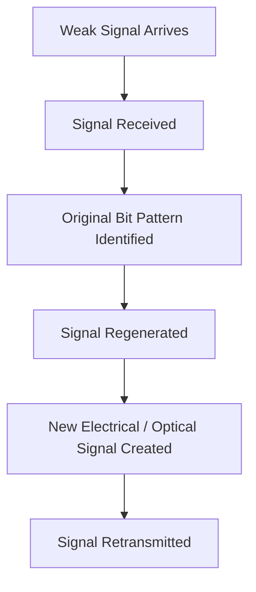
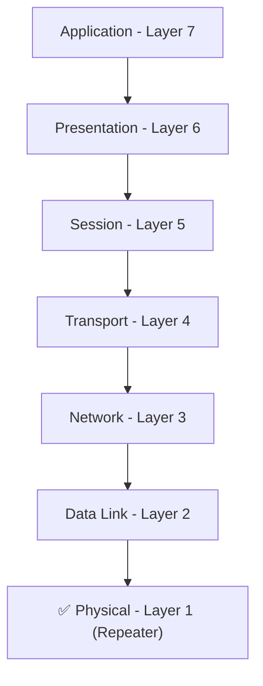

# 📡 Repeater

> *Understanding how repeaters regenerate weakened signals to extend communication distances in computer networks.*

<div align="center">


-informational?style=for-the-badge)


</div>

---

# 📑 Table of Contents

- [📚 Previously in This Roadmap](#-previously-in-this-roadmap)
- [📖 Introduction](#-introduction)
- [🤔 Why Do We Need a Repeater?](#-why-do-we-need-a-repeater)
- [🌍 Real-World Analogy](#-real-world-analogy)
- [🎯 Learning Objectives](#-learning-objectives)

---

# 📚 Previously in This Roadmap

In the previous chapter, you explored the world of **network devices** and learned that modern networks rely on multiple specialized devices working together. Instead of one device performing every networking task, each device has a specific responsibility, such as forwarding traffic, connecting networks, providing wireless access, or improving security.

You also discovered that understanding these devices is essential for networking and cybersecurity. Before diving into more intelligent devices like **switches**, **routers**, and **firewalls**, we'll begin with one of the simplest devices in networking history—the **Repeater**.

Although repeaters perform only a single task, they solve an important networking problem that every computer network must overcome.

---

# 📖 Introduction

Imagine trying to have a conversation with a friend standing only a few meters away. Your voice reaches them clearly, and communication is effortless.

Now imagine the same friend standing hundreds of meters away. As the distance increases, your voice becomes weaker until it can no longer be understood.

Network signals behave in a very similar way.

Whether data travels through a copper cable, a fiber-optic cable, or even through the air using wireless communication, the strength of the signal gradually decreases as it travels farther from its source. If the signal becomes too weak, the receiving device may no longer be able to correctly interpret the transmitted data.

This natural weakening of signals creates one of the earliest challenges in computer networking.

To overcome this limitation, networks use a simple but important device known as a **Repeater**.

Rather than creating new data or making intelligent forwarding decisions, a repeater's job is straightforward: it receives a weakened signal, regenerates it, and sends it onward with renewed strength, allowing communication to continue over much greater distances.

Understanding repeaters is an excellent starting point because they introduce one of the most fundamental concepts in networking—**maintaining signal integrity during transmission**.

---

# 🤔 Why Do We Need a Repeater?

Every communication medium has physical limitations.

Electrical signals lose energy while traveling through copper cables.

Light signals gradually weaken inside optical fibers.

Wireless signals become weaker as they spread through the air and encounter walls, buildings, weather conditions, and other obstacles.

Without a way to restore these weakened signals, networks would be limited to very short communication distances.

A repeater solves this problem by restoring the signal before it becomes too weak to be understood.

Think of a repeater as a checkpoint along a long journey. Instead of allowing the signal to continue losing strength, the repeater refreshes it and sends it on its way, helping data reach destinations that would otherwise be impossible.

> 💡 **Did You Know?**
>
> The maximum length of a standard Ethernet cable is typically **100 meters (328 feet)**. Beyond this distance, the signal can become too weak for reliable communication. Repeaters were originally developed to help overcome such physical limitations.

---

# 🌍 Real-World Analogy

Imagine a relay race.

One runner carries the baton only for a limited distance before passing it to the next runner, who continues the race with full energy. The baton reaches the finish line not because one runner completes the entire race, but because each runner takes over before the previous one becomes exhausted.

A repeater works in a similar way.

Instead of allowing a weakened signal to travel indefinitely, it receives the signal, restores it to its original quality, and sends it onward so the journey can continue successfully.


The repeater does **not** change the information being transmitted.

Its responsibility is simply to ensure that the signal remains strong enough to continue its journey.

---

# 🎯 Learning Objectives

After completing this lesson, you will be able to:

- Explain why network signals weaken over distance.
- Define **signal attenuation** and understand its causes.
- Describe the purpose of a repeater in a computer network.
- Explain how a repeater regenerates signals.
- Identify the OSI layer where repeaters operate.
- Recognize common real-world uses of repeaters.
- Distinguish repeaters from other network devices such as hubs and switches.
- Explain why repeaters have limited functionality in modern cybersecurity.
- Build a strong foundation for understanding more advanced network devices.

---

---

# 📉 Understanding Signal Attenuation: Why Signals Become Weaker

Before we can understand **how a repeater works**, we first need to understand the problem it was designed to solve.

When data travels across a network, it is carried by a **signal**. Depending on the communication medium, that signal may be an electrical pulse traveling through a copper cable, a beam of light moving through a fiber-optic cable, or a radio wave propagating through the air.

No matter which medium is used, one fundamental rule always applies:

> **The farther a signal travels, the weaker it becomes.**

This gradual loss of signal strength is known as **signal attenuation**.

If attenuation is not controlled, the receiving device may no longer recognize the original signal correctly, leading to transmission errors or complete communication failure.

---

# 📡 What Is a Signal?

A **signal** is the physical representation of data as it travels from one device to another.

Although we often say that "data is sent across the network," computers do not transmit files or messages directly. Instead, they convert data into signals that can travel through a communication medium.

Depending on the network technology, these signals can take different forms.

| Communication Medium | Signal Type |
|----------------------|-------------|
| Copper Cable (Ethernet) | Electrical Signals |
| Fiber-Optic Cable | Light Pulses |
| Wireless Network (Wi-Fi) | Radio Waves |

Regardless of the type of signal, they all experience some degree of attenuation as they travel.

> 📝 **Note**
>
> The **data itself does not become weaker**. It is the **signal carrying the data** that loses strength over distance.

---

# 🔍 Why Do Signals Become Weaker?

Signals lose energy as they travel through a communication medium.

Imagine rolling a ball across the floor.

At first, the ball moves quickly, but friction gradually slows it down until it eventually stops.

Signals experience a similar effect.

As they move through cables or the air, some of their energy is lost due to physical properties of the transmission medium and environmental conditions.

Common causes include:

- Resistance within copper cables
- Absorption of light inside optical fibers
- Electromagnetic interference (EMI)
- Physical obstacles such as walls and buildings
- Long transmission distances
- Signal reflections and scattering

The result is a weaker signal that becomes increasingly difficult for receiving devices to interpret correctly.

---



As the distance increases, the signal gradually loses strength until communication becomes unreliable.

---

<!--
Image Description:
A side-by-side illustration showing a strong electrical signal entering a long Ethernet cable and gradually weakening as it travels toward the other end. Include a signal strength graph decreasing from left to right. Label the concepts "Strong Signal," "Signal Attenuation," and "Weak Signal."

Suggested Search Keywords:
signal attenuation diagram
ethernet signal weakening
network attenuation illustration
-->

<p align="center">

</p>

---

# 🌐 Signal Attenuation in Different Network Media

Attenuation affects every type of communication medium, although the causes and severity may differ.

| Communication Medium | How Attenuation Occurs |
|----------------------|------------------------|
| Copper Cable | Electrical resistance gradually weakens electrical signals. |
| Fiber-Optic Cable | Light pulses lose intensity due to absorption and scattering within the fiber. |
| Wireless Networks | Radio waves weaken with distance and are affected by walls, weather, and interference. |

Because attenuation is unavoidable, every networking technology has practical distance limits.

For example:

- Standard Ethernet cables are typically limited to **100 meters**.
- Wi-Fi signals become weaker as devices move farther from the access point.
- Long-distance fiber links often require optical repeaters or amplifiers to maintain signal quality.

---

# ⚠ What Happens If the Signal Becomes Too Weak?

If attenuation continues without any method of restoring the signal, several problems may occur:

- Data arrives with errors.
- Packets may need to be retransmitted.
- Communication becomes slower.
- Devices may lose network connectivity.
- Connections may fail completely.

In extreme cases, the receiving device cannot distinguish between valid signals and background noise.



This is the exact problem that the **Repeater** was designed to solve.

---

> 💡 **Did You Know?**
>
> Every networking technology specifies a **maximum transmission distance**. These limits are carefully calculated to ensure that signals remain strong enough for reliable communication without requiring regeneration.

---

# ✅ Knowledge Check

Before moving on, test your understanding.

1. What is signal attenuation?
2. Does the **data** become weaker, or does the **signal** carrying the data become weaker?
3. Why do all communication media experience attenuation?
4. Name three factors that can cause signal attenuation.
5. What problems can occur if a signal becomes too weak before reaching its destination?
6. Why is understanding attenuation important before learning about repeaters?

> 🎯 **Think About It**
>
> If signals never became weaker over distance, would repeaters be necessary? Why or why not?

---

---

# 🔁 What Is a Repeater?

Now that you understand **why signals weaken over distance**, it's time to explore the device designed to solve this problem.

A **Repeater** is a **Layer 1 (Physical Layer)** network device that receives a weakened signal, restores it to its original strength and quality, and retransmits it so the signal can continue traveling over a longer distance.

Unlike devices such as switches or routers, a repeater **does not examine, modify, or make decisions about the data** being transmitted.

Its only responsibility is to ensure that the signal remains strong enough to continue its journey.

> 🎯 **Simple Definition**
>
> A repeater receives a weak signal, regenerates it, and sends it forward as if it were a brand-new signal.

---

# ⚙️ How Does a Repeater Work?

A repeater follows a very simple process.

1. It receives a weakened signal from the transmitting device.
2. It analyzes the incoming signal to determine the original bit pattern.
3. It reconstructs (regenerates) a clean version of the signal.
4. It retransmits the regenerated signal toward the destination.

The important point is that the repeater **does not simply make the weak signal louder**.

Instead, it creates a **fresh copy** of the original signal before transmitting it again.


By regenerating the signal, the repeater allows communication to continue over distances that would otherwise be impossible.

---

# 🔍 Inside the Repeater

Let's look at what happens inside the device.



Although this entire process happens in a fraction of a second, it ensures that the receiving device receives a much cleaner and stronger signal than it would have otherwise.

---

# 🔄 Regeneration vs Amplification

One of the most common beginner misconceptions is believing that a repeater simply **amplifies** a signal.

In reality, a repeater performs **signal regeneration**, which is much more effective.

| Amplification | Regeneration |
|--------------|--------------|
| Makes the existing signal stronger | Reconstructs a new, clean signal |
| Amplifies both the signal and any noise | Removes much of the accumulated noise before retransmitting |
| Signal quality may continue to degrade | Signal quality is restored before transmission |
| Common in analog systems | Common in digital computer networks |

> ⚠ **Common Beginner Mistake**
>
> Many beginners say that a repeater "boosts" or "amplifies" a signal.
>
> While this is a convenient way to describe its purpose, a digital network repeater actually **regenerates** the signal by reconstructing the original digital information before sending it again.

---

# 📍 Where Does a Repeater Operate?

A repeater operates at the **Physical Layer (Layer 1)** of the **OSI Model**.

At this layer, the repeater works only with **signals**.

It does **not** understand:

- MAC addresses
- IP addresses
- Frames
- Packets
- Ports
- Applications

Its responsibility ends at restoring and forwarding the physical signal.



Because it operates only at Layer 1, a repeater has **no knowledge of the data** being transmitted.

---

# 📌 Characteristics of a Repeater

| Characteristic | Description |
|----------------|-------------|
| OSI Layer | Layer 1 (Physical Layer) |
| Primary Function | Regenerate weakened signals |
| Reads Data? | ❌ No |
| Uses MAC Addresses? | ❌ No |
| Uses IP Addresses? | ❌ No |
| Makes Routing Decisions? | ❌ No |
| Filters Traffic? | ❌ No |
| Security Features | ❌ None |
| Main Benefit | Extends communication distance |

---

> 💡 **Did You Know?**
>
> Because repeaters do not inspect or modify network traffic, they introduce very little processing delay. Their job is simply to regenerate and forward signals as quickly as possible.

---

# ✅ Knowledge Check

Before continuing, test your understanding.

1. What is the primary function of a repeater?
2. Why is regeneration better than simple amplification?
3. At which OSI layer does a repeater operate?
4. Does a repeater examine frames or packets?
5. Can a repeater read MAC or IP addresses?
6. Why does a repeater introduce very little processing delay?

> 🎯 **Think About It**
>
> If a repeater cannot understand frames, packets, or addresses, how does it know where to send the signal?
>
> You'll be able to answer this confidently after studying the next few network devices.

---

# 🌍 Where Are Repeaters Used?

Repeaters are used whenever a network signal must travel **farther than the communication medium can reliably support**.

Although modern networking technologies have reduced the need for traditional repeaters in many environments, they are still widely used in telecommunications, fiber-optic networks, wireless communication, and specialized industrial systems.

The following examples illustrate where repeaters are commonly found.

---

# 🏢 Scenario 1: Large Office Buildings

Imagine a company occupying several floors of a large office building.

The network server is located on the ground floor, but employees also work on the upper floors. If a single Ethernet cable exceeds its recommended maximum length, the electrical signal may become too weak before reaching its destination.

A repeater can be installed along the cable to regenerate the weakened signal, allowing reliable communication over a greater distance.


Without the repeater, devices at the far end of the cable could experience unreliable communication or complete connection loss.

---

# 🌐 Scenario 2: Long-Distance Fiber-Optic Networks

Fiber-optic cables can carry data much farther than copper cables, but even light signals gradually lose strength over very long distances.

Telecommunication companies therefore use **optical repeaters** (or optical regeneration equipment) throughout long fiber routes to restore signal quality.

These repeaters are commonly used in:

- National backbone networks
- International communication links
- Undersea fiber-optic cables
- Metropolitan Area Networks (MANs)

> 💡 **Did You Know?**
>
> Internet traffic traveling between continents passes through thousands of kilometers of submarine fiber-optic cables. Signal regeneration is essential to maintain reliable communication across these enormous distances.

---

<!--
Image Description:
A world map showing two continents connected by an undersea fiber-optic cable. Along the cable are several optical repeaters that regenerate light signals before they continue to the next section of the cable. Label the continents, cable, repeaters, and data flow.

Suggested Search Keywords:
submarine fiber optic cable repeater
optical repeater diagram
undersea cable illustration
-->

<p align="center">

</p>

---

# 📶 Scenario 3: Extending Wireless Coverage

Many people are familiar with **Wi-Fi repeaters** or **Wi-Fi range extenders**.

Suppose your wireless router provides excellent coverage in the living room, but the signal becomes weak in an upstairs bedroom or a distant office.

A Wi-Fi repeater receives the wireless signal, regenerates it, and retransmits it, increasing the coverage area.


Although Wi-Fi repeaters improve coverage, they may also reduce overall network throughput because they must receive and retransmit the same wireless traffic.

> 📝 **Note**
>
> Modern homes often use **mesh Wi-Fi systems** instead of traditional repeaters. Mesh networks generally provide better performance, smoother roaming, and more reliable wireless coverage.

---

# 🏭 Scenario 4: Industrial and Campus Networks

Large factories, warehouses, university campuses, and industrial facilities often contain network devices separated by long distances.

Examples include:

- Factory production lines
- Warehouse automation systems
- Airport communication systems
- University campuses
- Railway communication networks

In these environments, repeaters help maintain reliable communication between distant network segments.

---

# ❌ When Should You NOT Use a Repeater?

Although repeaters solve distance-related problems, they are **not** the right solution for every networking challenge.

For example, a repeater cannot:

- Connect different networks together
- Reduce unnecessary network traffic
- Improve network security
- Filter malicious traffic
- Make forwarding decisions
- Understand frames or packets

If your goal is to perform one of these tasks, another network device—such as a **switch**, **router**, or **firewall**—is required.

This is why modern networks rely on many different devices rather than repeaters alone.

---

# 📊 Common Uses of Repeaters

| Environment | Why a Repeater Is Used |
|--------------|------------------------|
| Office Networks | Extend Ethernet communication over longer distances |
| Fiber-Optic Networks | Regenerate weakened light signals |
| Wi-Fi Networks | Increase wireless coverage |
| Industrial Networks | Maintain reliable communication across large facilities |
| Telecommunications | Support long-distance communication infrastructure |

---

> 🎯 **Remember**
>
> A repeater solves **only one problem**: **signal attenuation**.
>
> If the problem is related to security, routing, switching, or traffic management, a repeater is not the appropriate solution.

---

# ✅ Knowledge Check

Before moving on, test your understanding.

1. Why might an office building require a repeater?
2. Why are repeaters important in long-distance fiber-optic communication?
3. How does a Wi-Fi repeater extend wireless coverage?
4. Why are repeaters commonly used in industrial environments?
5. Can a repeater improve network security? Why or why not?
6. Which networking problems cannot be solved by a repeater?

> 🤔 **Think About It**
>
> Imagine you need to connect two computers that are **250 meters apart** using Ethernet cable.
>
> Would adding a repeater solve the problem, or would another network device be more appropriate? Explain your reasoning.

---

# ⚖️ Advantages and Limitations of Repeaters

Like every networking device, a repeater has strengths and weaknesses. Understanding both helps network engineers decide whether a repeater is the right solution for a particular networking problem.

---

# ✅ Advantages of a Repeater

Repeaters may be simple devices, but they provide several important benefits.

| Advantage | Explanation |
|-----------|-------------|
| 📏 Extends Communication Distance | Allows signals to travel farther than the normal limits of the transmission medium. |
| ✨ Restores Signal Quality | Regenerates weakened signals, improving communication reliability. |
| ⚡ Fast Operation | Operates at the Physical Layer, introducing very little processing delay. |
| 💰 Cost-Effective | A relatively inexpensive solution for extending network coverage. |
| 🔌 Easy to Deploy | Requires minimal configuration because it does not inspect or process network data. |

> 💡 **Did You Know?**
>
> One of the biggest advantages of a repeater is its simplicity. Since it works only with signals, it performs its job extremely quickly.

---

# ❌ Limitations of a Repeater

Despite its usefulness, a repeater has significant limitations.

| Limitation | Explanation |
|------------|-------------|
| 🚫 No Traffic Filtering | Every signal is regenerated and forwarded without inspection. |
| 🚫 No Security Features | Cannot detect, block, or monitor malicious traffic. |
| 🚫 No Address Awareness | Does not understand MAC addresses, IP addresses, frames, or packets. |
| 🚫 Cannot Connect Different Networks | Only extends an existing communication link. |
| 🚫 Cannot Reduce Network Congestion | Simply regenerates signals—it does not manage or optimize traffic. |

Because of these limitations, repeaters are rarely used as standalone networking solutions in modern enterprise environments.

---

# ❌ When Is a Repeater NOT the Right Choice?

A repeater is useful only when the primary problem is **signal attenuation**.

If your objective is to:

- Connect two different networks
- Improve network performance
- Reduce unnecessary traffic
- Increase network security
- Control packet forwarding
- Monitor suspicious activity

then a repeater is **not** the correct device.

Instead, you would choose devices such as:

| Problem | Better Device |
|----------|---------------|
| Connect multiple devices intelligently | Switch |
| Connect different IP networks | Router |
| Protect the network | Firewall |
| Detect attacks | IDS |
| Automatically stop attacks | IPS |

Choosing the correct device is just as important as understanding how each device works.

---

# ⚖️ Repeater vs Amplifier

These two terms are often confused because both are associated with increasing signal strength.

However, they operate differently.

| Repeater | Amplifier |
|----------|-----------|
| Regenerates the original digital signal | Simply increases signal strength |
| Attempts to remove accumulated noise | Amplifies both the signal and the noise |
| Common in digital computer networks | Common in analog communication systems |
| Produces a cleaner output signal | May produce a stronger but noisier signal |

> ⚠ **Common Beginner Mistake**
>
> Many people say that a repeater "amplifies" a signal.
>
> A digital repeater actually **regenerates** the signal by reconstructing the original bit pattern before transmitting it again.

---

# ⚖️ Repeater vs Hub

At first glance, a hub may appear similar to a repeater because both operate at the **Physical Layer (Layer 1)**.

However, their purposes are different.

| Repeater | Hub |
|----------|-----|
| Connects two network segments | Connects multiple devices together |
| Usually has two interfaces | Usually has multiple ports |
| Extends communication distance | Creates a shared communication medium |
| Regenerates signals | Regenerates signals and broadcasts them to all connected devices |

You can think of a **hub** as a **multiport repeater**.

This is why learning about repeaters first makes understanding hubs much easier.

> 📝 **Looking Ahead**
>
> In the next lesson after the repeater, you'll explore the **Hub** in detail and discover why it eventually became obsolete in most modern networks.

---

# 🚫 Common Beginner Mistakes

Avoid these common misconceptions.

- ❌ Thinking that a repeater understands data or packets.
- ❌ Assuming a repeater can improve network security.
- ❌ Believing a repeater makes networking faster.
- ❌ Confusing signal regeneration with signal amplification.
- ❌ Assuming repeaters can connect different networks.
- ❌ Expecting a repeater to reduce network congestion.

Understanding what a repeater **cannot** do is just as important as understanding what it **can** do.

---

# 🧠 Mini Review

Let's summarize what you've learned so far.

- A repeater operates at the **Physical Layer (Layer 1)**.
- Its primary purpose is to regenerate weakened signals.
- It does not understand frames, packets, MAC addresses, or IP addresses.
- Repeaters are used to overcome distance limitations, not networking or security limitations.
- Modern networks use repeaters alongside other specialized devices, each solving a different problem.

---

# ✅ Knowledge Check

Before moving to the cybersecurity perspective, test your understanding.

1. What is the greatest advantage of using a repeater?
2. Why can't a repeater reduce network congestion?
3. How does a repeater differ from an amplifier?
4. Why is a hub often described as a multiport repeater?
5. Which networking problems require a router instead of a repeater?
6. Why doesn't a repeater improve network security?
7. Can a repeater examine network packets? Why or why not?

> 🎯 **Think Like an Engineer**
>
> A company reports that devices located **150 meters** from a network switch frequently lose connectivity.
>
> Based on what you've learned so far:
>
> - Is signal attenuation the most likely cause?
> - Would installing a repeater solve the problem?
> - Or would another network device be a better choice?
>
> Explain your reasoning before continuing to the next section.

---

---

# 🔐 Cybersecurity Perspective: Why Should Security Professionals Understand Repeaters?

At first glance, a repeater may not seem like an important cybersecurity device.

Unlike firewalls, intrusion detection systems (IDS), or intrusion prevention systems (IPS), a repeater does not inspect network traffic, enforce security policies, or detect malicious activity.

So why is it included in a cybersecurity roadmap?

The answer is simple:

> **Cybersecurity professionals must understand the entire network—not just the devices that provide security.**

Every packet, every connection, and every cyberattack travels across a physical network. Understanding how signals move through that network provides the foundation for understanding more advanced networking and security concepts.

---

# 🛡️ What Can a Repeater Do?

From a cybersecurity perspective, a repeater has a very limited role.

A repeater can:

- Extend communication over longer distances.
- Regenerate weakened signals.
- Improve signal reliability.
- Support stable communication between network devices.

These functions help maintain network connectivity, but they do **not** provide any security features.

---

# ❌ What Can't a Repeater Do?

A repeater cannot:

- Inspect packets
- Read network traffic
- Filter malicious data
- Detect cyberattacks
- Block unauthorized connections
- Apply security rules
- Log network events
- Monitor suspicious activity

Since a repeater operates entirely at the **Physical Layer (Layer 1)**, it simply regenerates signals without understanding the information they contain.

> ⚠ **Remember**
>
> A repeater treats every signal exactly the same. It has no way of knowing whether the signal carries a harmless email, a video stream, or malicious malware.

---

# 🔍 Why Is This Important in Cybersecurity?

One of the most important skills in cybersecurity is understanding **where security controls exist**.

Not every network device is responsible for protecting the network.

Some devices:

- Move data.
- Some connect networks.
- Some provide wireless access.
- Some regenerate signals.
- Others provide security.

Understanding these responsibilities helps security professionals identify **which device should be investigated** during an incident.

For example:

| Question | Device Most Likely to Help |
|----------|----------------------------|
| Why is the signal weak? | Repeater |
| Why can't two networks communicate? | Router |
| Why was malicious traffic allowed? | Firewall |
| Who detected the attack? | IDS |
| Who blocked the attack? | IPS |

Knowing the role of each device makes troubleshooting and incident response much more efficient.

---

# 🌐 A Simple Attack Scenario

Imagine an attacker sends malicious traffic toward a company's network.


In this example:

- The **Repeater** simply regenerates the signal.
- The **Firewall** decides whether the traffic should be allowed or blocked.
- The **Server** receives only the traffic permitted by the firewall.

The repeater has **no awareness** that the traffic is malicious. Its job is only to maintain signal quality.

This example demonstrates why different network devices have different responsibilities and why no single device can secure an entire network.

---

# 🎯 Why Learning Repeaters Still Matters

Although dedicated repeaters are less common in modern enterprise networks, the concepts introduced in this lesson remain fundamental.

By understanding repeaters, you have learned:

- Why communication distance is limited.
- Why signals weaken over time.
- How signal regeneration works.
- Why the Physical Layer is different from higher OSI layers.
- Why some network devices provide connectivity rather than security.

These concepts form the foundation for understanding more advanced devices later in this roadmap.

As you continue, you'll notice that each new device adds additional capabilities.

- A **Hub** connects multiple devices.
- A **Bridge** reduces unnecessary traffic.
- A **Switch** intelligently forwards frames.
- A **Router** connects different networks.
- A **Firewall** begins enforcing security policies.

Each lesson builds upon the one before it.

---

> 💡 **Key Cybersecurity Insight**
>
> Security professionals don't just study security devices—they study how **every** network device contributes to communication. Understanding where a device fits into the network is the first step toward understanding how to defend it.

---
---

# 🧠 60-Second Revision

Let's quickly recap the most important concepts from this lesson.

- A **Repeater** is a **Layer 1 (Physical Layer)** network device.
- Its primary purpose is to **regenerate weakened signals** so they can travel longer distances.
- Repeaters solve the problem of **signal attenuation**, which naturally occurs as signals travel through a communication medium.
- A repeater **does not inspect, filter, or modify data**. It simply regenerates the signal and forwards it.
- Repeaters are commonly used in long-distance communication systems, fiber-optic networks, industrial environments, and wireless range extension.
- From a cybersecurity perspective, repeaters provide **connectivity**, not **security**.

If you understand these six points, you've mastered the fundamental concepts behind repeaters.

---

# 📌 Key Takeaways

- ✅ Repeaters operate at the **Physical Layer (OSI Layer 1)**.
- ✅ They regenerate signals rather than simply amplifying them.
- ✅ Their purpose is to overcome signal attenuation.
- ✅ Repeaters do not understand frames, packets, MAC addresses, or IP addresses.
- ✅ They cannot filter traffic, detect attacks, or improve network security.
- ✅ Modern networks use repeaters alongside more intelligent devices such as switches, routers, and firewalls.

---

# 🎓 Final Knowledge Check

Test your understanding before moving to the next lesson.

1. What networking problem is a repeater designed to solve?
2. What is signal attenuation, and why does it occur?
3. Why is signal regeneration more effective than simple amplification?
4. At which OSI layer does a repeater operate?
5. Does a repeater understand frames, packets, or IP addresses? Explain your answer.
6. How does a repeater differ from a hub?
7. Why can't a repeater improve network security?
8. Name three environments where repeaters are commonly used.
9. In what situations would a switch or router be a better choice than a repeater?
10. Why is it important for cybersecurity professionals to understand devices that do not provide security features?

> 🎯 **Scenario Challenge**
>
> A university campus has two buildings connected by an Ethernet cable that exceeds the recommended maximum length. Users in the second building frequently lose network connectivity.
>
> - What is the most likely cause of the problem?
> - Would installing a repeater help?
> - Why or why not?

---

# 📚 Further Reading

Continue your networking journey with the next lessons in this chapter.

| Lesson | Description |
|---------|-------------|
| **[Hub](Hub.md)** | Learn how hubs connect multiple devices and why they broadcast data to every connected system. |
| **[Bridge](Bridge.md)** | Discover how bridges reduce unnecessary traffic by dividing networks into smaller segments. |
| **[Switch](Switch.md)** | Understand how switches intelligently forward frames using MAC addresses. |
| **[Router](Router.md)** | Explore how routers connect different networks and make routing decisions. |
| **[Choosing the Right Network Device](Choosing%20the%20Right%20Network%20Device.md)** | A supplementary guide to selecting the most appropriate networking device for different scenarios. |

---

# 🗺️ Where You Are in the Roadmap

```text
Cybersecurity Roadmap

02-Networking

README.md
│
├── ✅ Network Devices Overview
│
├── ✅ Repeater (Current Lesson)
│
├── ⏭️ Hub
├── ⏳ Bridge
├── ⏳ Switch
├── ⏳ Router
├── ⏳ Gateway
├── ⏳ Modem
├── ⏳ Access Point
├── ⏳ Firewall
├── ⏳ IDS
├── ⏳ IPS
└── ⏳ Load Balancer
```

---

# ➡️ Next Lesson: [📡 Hub](Hub.md)

You've now learned how a repeater solves one of the earliest challenges in networking—**signal attenuation**. However, a repeater can only regenerate a signal; it **cannot connect multiple devices together**.

The next lesson introduces the **Hub**, one of the earliest networking devices designed to allow multiple computers to share the same communication medium.

In the next chapter, you'll learn:

- Why repeaters alone are not enough for building a network
- How hubs connect multiple devices
- Why hubs broadcast every frame to every connected device
- Why hubs create network collisions and inefficiencies
- Why switches eventually replaced hubs in modern networks

By understanding the limitations of repeaters, you'll naturally appreciate why hubs were developed—and why networking technology continued to evolve beyond them.

---

> 🎉 **Congratulations!**
>
> You have completed your first deep dive into a network device. More importantly, you've begun building a problem-solving mindset: understanding **why** a device exists before learning **how** it works. As you progress through the roadmap, each new device will solve a limitation introduced by the previous one, helping you understand the natural evolution of modern computer networks.

