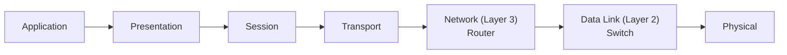
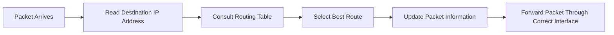
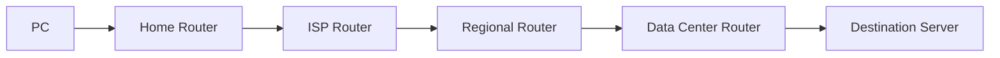
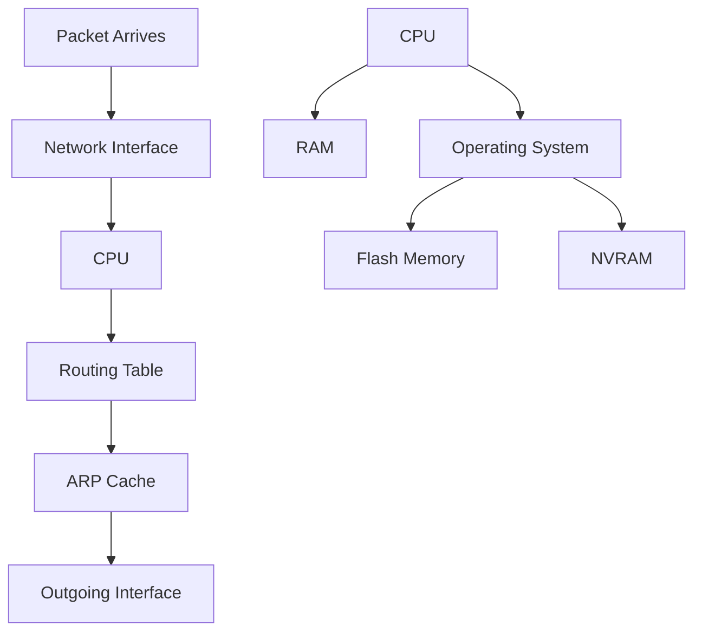
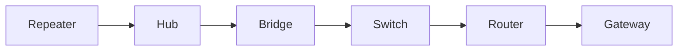
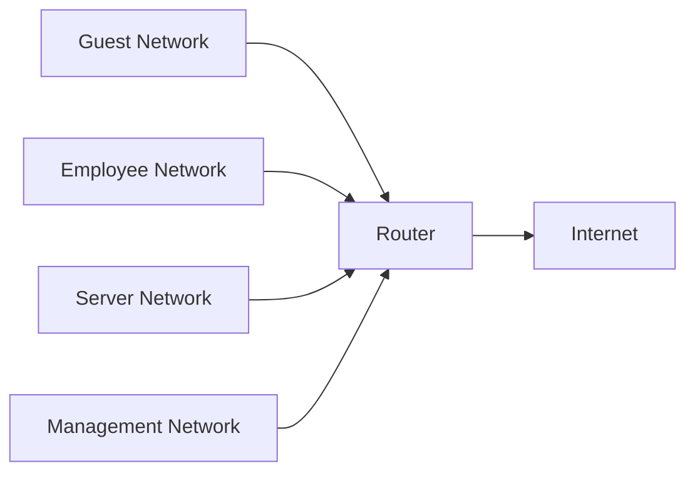

# 🌐 Router

> *A router is the device that makes communication between different networks possible. It examines IP addresses, chooses the best path for packets, and acts as the gateway that connects local networks to the rest of the world.*

---
<div align="center">


-informational?style=for-the-badge)


</div>

---

# 📖 Table of Contents

- [Previously in this Roadmap](#-previously-in-this-roadmap)
- [Why We Need Routers](#-why-we-need-routers)
- [The Limitation of Switches](#-the-limitation-of-switches)
- [What is a Router?](#-what-is-a-router)
- [Why is it Called a Router?](#-why-is-it-called-a-router)
- [How Routers Think Differently from Switches](#-how-routers-think-differently-from-switches)
- [Where Routers are Used](#-where-routers-are-used)
- [Layer 3 - The Network Layer](#-layer-3---the-network-layer)
- [Router Interfaces](#-router-interfaces)
- [Broadcast Domains](#-broadcast-domains)
- [Learning Objectives](#-learning-objectives)

---

# 📚 Previously in this Roadmap

In the previous lesson, **Switch.md**, you learned how switches intelligently forward Ethernet frames using **MAC addresses** and a **CAM table**. Unlike hubs, switches send traffic only to the correct destination, making modern Local Area Networks (LANs) significantly faster and more efficient.

However, switches have an important limitation.

They are designed to communicate **within a single network**.

But today's computers rarely communicate only inside their own LAN.

Think about what happens when:

- You open Google.
- You watch YouTube.
- You play an online game.
- You access cloud storage.
- You send an email.

In every one of these situations, your computer needs to communicate with devices **outside** your local network.

This introduces an entirely new challenge—one that switches were never designed to solve.

That challenge leads us to one of the most important networking devices ever created:

> **The Router.**

---

# 🌍 Why We Need Routers

Imagine a city.

Inside one neighborhood, people can easily walk from one house to another using local streets.

Those local streets are like a **switch**.

Now imagine someone wants to travel to another city hundreds of kilometers away.

Walking through neighborhood streets won't get them there.

They need highways, intersections, and road signs that guide them toward their destination.

A router performs exactly this job for computer networks.

Instead of deciding which **house** receives a letter, it decides which **network** should receive a packet next.

---

```text
Same Neighborhood
        │
        ▼
   Local Streets
        │
     (Switch)

──────────────────────────

Different Cities
        │
        ▼
 Highways & Intersections
        │
      (Router)
```

A switch helps devices communicate **inside** one network.

A router helps entirely different networks communicate with one another.

---

> **💡 Key Idea**
>
> Switches answer:
>
> **"Which device inside this network should receive this frame?"**
>
> Routers answer:
>
> **"Which network should this packet travel to next?"**

---

# 🚧 The Limitation of Switches

Suppose your computer has the following address:

```
192.168.1.10
```

Another computer on the same network has:

```
192.168.1.25
```

Your switch can successfully deliver traffic because both devices belong to the same local network.

Now imagine the destination is:

```
142.250.190.78
```

This is a completely different network somewhere on the Internet.

The switch has no knowledge of:

- Internet routes
- Remote networks
- Best paths
- Service providers
- Destination networks

It only understands local Ethernet communication.

At this point, another device must take over.

That device is the router.

---

# 🧭 What is a Router?

A **router** is a **Layer 3 networking device** that connects different networks and forwards packets between them using **IP addresses**.

Unlike a switch, which makes forwarding decisions using **MAC addresses**, a router examines the **destination IP address** of every incoming packet and determines the best path toward its destination.

In simple terms:

> A router is the traffic director of the Internet.

Every packet traveling from your home network to another network is guided by one or more routers.

Without routers:

- The Internet would not exist as a connected system.
- Different LANs could not communicate.
- Businesses could not connect branch offices.
- Cloud services would be unreachable.
- Websites could never receive your requests.

---

<!--
Image Description:
A router connecting three separate LANs to the Internet. Each LAN contains a switch and several computers. The router sits in the center, illustrating how it forwards traffic between different networks rather than within a single LAN.

Suggested Search Keywords:
router connecting multiple LANs diagram
-->

<p align="center">

</p>

---

# 🛣️ Why is it Called a Router?

The word **route** means a path from one place to another.

When you use Google Maps, it calculates the best route to your destination.

A router performs a similar task.

Instead of roads, it works with computer networks.

Instead of cars, it forwards packets.

Instead of maps, it uses a **routing table**.

Every packet arriving at a router is examined so the router can determine:

- Where the destination network is located
- Which path should be used
- Which interface should send the packet onward

This decision-making process happens in milliseconds.

---

# 🔍 How Routers Think Differently from Switches

One of the biggest transitions in networking is moving from **Layer 2 thinking** to **Layer 3 thinking**.

| Switch | Router |
|---------|---------|
| Uses MAC addresses | Uses IP addresses |
| Connects devices | Connects networks |
| Works mainly inside a LAN | Works between different networks |
| Uses a CAM table | Uses a routing table |
| Forwards Ethernet frames | Forwards IP packets |
| Layer 2 | Layer 3 |

Notice the progression.

As you learned in **Bridge.md**, bridges introduced MAC learning.

In **Switch.md**, that idea evolved into hardware-based CAM tables for high-speed forwarding.

Now, the router moves beyond individual devices. Instead of asking *"Which device should receive this frame?"*, it asks *"Which network should receive this packet?"*

This is the next major step in understanding how modern networks are built.

---

# 🌍 Where Routers Are Used

Routers are everywhere.

Almost every modern network relies on one.

Examples include:

- 🏠 Home Internet connections
- 🏢 Corporate offices
- ☁️ Cloud data centers
- 🎓 Universities
- 🏥 Hospitals
- 🛒 Retail stores
- 📡 Internet Service Providers (ISPs)
- 🌐 The Internet itself

Whenever data travels between different networks, one or more routers are involved.

---

# 🌐 Layer 3 — The Network Layer

According to the OSI Model, routers operate primarily at **Layer 3**, known as the **Network Layer**.

The Network Layer is responsible for:

- Logical addressing
- Inter-network communication
- Choosing paths between networks
- Forwarding packets
- Delivering data across large networks



Unlike switches, routers are designed to understand the logical structure of networks through IP addressing.

---

# 🔌 Router Interfaces

Every router contains one or more **network interfaces**.

An interface is simply a connection point through which packets enter or leave the router.

For example:

```
Internet
    │
    │
┌──────────┐
│ Router   │
├──────────┤
│WAN Port  │
│LAN 1     │
│LAN 2     │
│LAN 3     │
│LAN 4     │
└──────────┘
```

Each interface belongs to a different network.

This allows the router to receive traffic from one network and forward it to another.

In enterprise routers, there may be dozens or even hundreds of interfaces connecting branch offices, servers, cloud environments, and Internet providers.

---

# 📡 Broadcast Domains

Another important responsibility of routers is separating **broadcast domains**.

As you learned in **Switch.md**, switches forward broadcast traffic throughout their local network.

Routers deliberately do **not** forward these broadcasts to other networks.

This prevents unnecessary traffic from spreading across the Internet and keeps networks more efficient, secure, and easier to manage.

You will explore broadcast domains and subnetting in much greater detail in the IP Addressing section of this roadmap.

---

> **📝 Note**
>
> Routers do not simply connect cables together.
>
> They make intelligent forwarding decisions, isolate networks, control broadcast traffic, and determine how information moves across the world.

---

# 🎯 Learning Objectives

After completing this lesson, you should be able to:

- Explain why routers exist.
- Describe the limitations of switches.
- Define what a router is.
- Explain why routers operate at Layer 3.
- Distinguish between switches and routers.
- Describe how routers connect different networks.
- Explain the purpose of router interfaces.
- Understand why routers separate broadcast domains.
- Prepare to learn how routers make forwarding decisions using routing tables in the next section.

---

# ⚙️ How a Router Works

Now that you know **what a router is**, let's answer a more important question:

> **How does a router decide where to send a packet?**

Unlike a switch, which only looks at a destination MAC address, a router examines the **destination IP address** inside every incoming packet.

Using this information, it determines the most appropriate path to the destination network and forwards the packet toward the next router—or directly to the destination if it is on a connected network.

Although this process sounds complex, it happens in a few milliseconds.

---

## 📦 Following a Packet Through a Router

Imagine your computer wants to open:

```
https://www.openai.com
```

Before the webpage can load, your computer sends IP packets toward the destination.

The first networking device that receives these packets is usually your **default gateway**, which is typically your router.

The router then performs a series of decisions before forwarding the packet.



Every packet follows this general workflow.

Let's examine each step.

---

## Step 1 — Receive the Packet

The router receives an incoming Ethernet frame through one of its interfaces.

At this point, the router removes the Layer 2 Ethernet header because it is only relevant on the local network.

What remains is the **IP packet**, which contains the information needed for routing.

```text
Ethernet Frame

┌─────────────────────────────┐
│ Ethernet Header             │
├─────────────────────────────┤
│ IP Packet                   │
└─────────────────────────────┘

          ↓

Router removes Layer 2 header

          ↓

IP Packet Ready for Routing
```

This demonstrates an important concept:

> **Routers make forwarding decisions using Layer 3 information, not Layer 2 information.**

---

## Step 2 — Read the Destination IP Address

Inside every IP packet is a destination IP address.

Example:

```
Destination IP

142.250.190.78
```

The router ignores application data at this stage.

Instead, it asks:

> **"Which network contains this destination address?"**

This question is the foundation of routing.

---

## Step 3 — Consult the Routing Table

Every router maintains a **routing table**.

Think of it as a navigation map for networks.

Instead of storing directions to individual computers, it stores directions to **entire networks**.

Example:

| Destination Network | Next Hop | Interface |
|---------------------|----------|-----------|
| 192.168.1.0/24 | Connected | LAN1 |
| 10.0.0.0/24 | 192.168.1.2 | LAN2 |
| 172.16.0.0/16 | 192.168.1.3 | LAN3 |
| Default Route | ISP Router | WAN |

When a packet arrives, the router searches this table to determine the best path.

---

> **💡 Analogy**
>
> Imagine a postal sorting center.
>
> Workers don't memorize the address of every house in the country.
>
> Instead, they first identify the **city** or **postal region**, then send the package toward the correct distribution center.
>
> Routers work in much the same way—they forward packets toward the correct **network**, not directly to every individual device.

---

## Step 4 — Choose the Best Route

Sometimes multiple routes can reach the same destination.

In these situations, the router chooses the **most specific matching route**.

Networking professionals call this **Longest Prefix Match**.

You do **not** need to master subnet calculations yet.

For now, simply remember:

> The router chooses the route that most closely matches the destination network.

You will study this concept in detail during the **IP Addressing** and **Routing & Switching** modules.

---

## Step 5 — Update the Packet

Before forwarding the packet, the router performs several important tasks.

### Decrease the TTL

Every IP packet contains a value called **Time To Live (TTL).**

Each router decreases this value by **1**.

If the TTL reaches zero, the router discards the packet.

This prevents packets from looping endlessly around the Internet.

---

### Update the Header

Because the TTL changed, parts of the IP header must also be updated.

This ensures the packet remains valid before continuing its journey.

Fortunately, this entire process is automatic and happens almost instantly.

---

## Step 6 — Forward the Packet

Finally, the router sends the packet out through the selected interface.

Before transmission, the router creates a **new Layer 2 frame** appropriate for the next network.

This is important because Ethernet frames are only valid within a single local network.



Notice that every router repeats the same forwarding process.

No single router knows the entire Internet.

Each router simply decides:

> **"What is the next best place to send this packet?"**

---

# 🖥️ Inside a Router

Understanding the forwarding process is much easier once you know what components exist inside a router.

Although routers vary from small home devices to large enterprise systems, most contain the same core components.

---

## 🧠 CPU (Processor)

The CPU is the router's brain.

It performs tasks such as:

- Processing routing protocols
- Managing the operating system
- Making forwarding decisions
- Handling management traffic
- Running security features

Enterprise routers often contain powerful multi-core processors capable of processing millions of packets every second.

---

## 💾 RAM

RAM provides temporary working memory.

It stores information that changes while the router is running.

Examples include:

- Active routing table
- ARP cache
- Packet buffers
- Routing protocol information
- Running configuration

When the router loses power, RAM is cleared.

---

## 💽 Flash Memory

Flash memory stores files permanently.

It usually contains:

- Router operating system
- Firmware
- Software updates

Unlike RAM, Flash retains its contents after power is removed.

---

## 📝 NVRAM

Non-Volatile RAM (NVRAM) stores the **startup configuration**.

When the router boots, it loads these saved settings.

Without NVRAM, every reboot would erase the router's configuration.

---

## 🗺️ Routing Table

The routing table is one of the router's most important data structures.

It tells the router:

- Which networks exist
- Which interface reaches them
- Which next-hop router should receive packets
- Which path is preferred

Think of it as the router's roadmap.

---

## 📇 ARP Cache

Although routers primarily work with IP addresses, they still need MAC addresses when sending packets across Ethernet networks.

The **ARP cache** stores recently learned IP-to-MAC mappings.

This allows the router to forward packets efficiently without repeatedly sending ARP requests.

---

## 🔌 Network Interfaces

Interfaces are the router's doors to different networks.

Each interface:

- Connects to one network
- Has its own IP address
- Sends and receives packets
- Maintains independent communication with connected devices

Enterprise routers may include:

- Ethernet interfaces
- Fiber interfaces
- WAN interfaces
- Virtual interfaces

---

## ⚙️ Router Operating System

Every router runs an operating system.

Examples include:

- Cisco IOS
- Cisco IOS XE
- Juniper Junos
- MikroTik RouterOS
- Arista EOS

The operating system is responsible for:

- Managing hardware
- Running routing protocols
- Applying security policies
- Configuring interfaces
- Monitoring network traffic

You will begin interacting with router operating systems during networking labs later in this roadmap.

---

<!--
Image Description:
A labeled cutaway diagram of a router showing the CPU, RAM, Flash Memory, NVRAM, routing table, network interfaces, and operating system. Arrows should illustrate how packets move through these components during forwarding.

Suggested Search Keywords:
router internal architecture diagram
-->

<p align="center">

</p>

---

## 🧩 How These Components Work Together



The router's hardware and software work together continuously.

As packets arrive, the interfaces receive them, the CPU processes them with the help of the operating system, the routing table determines the best path, the ARP cache provides the required MAC address, and the outgoing interface forwards the packet toward the next network.

---

> **📝 Remember**
>
> A router does far more than simply "send packets."
>
> It analyzes destination networks, consults routing information, updates packet headers, manages interfaces, and makes intelligent forwarding decisions millions of times every second.

---

# 🌍 Types of Routers

Although all routers perform the same fundamental job—forwarding packets between different networks—not every router is designed for the same environment.

A router in a home network has very different requirements from one that connects thousands of enterprise branches or forms part of the Internet backbone.

Choosing the right router depends on factors such as:

- Network size
- Number of connected devices
- Required performance
- Security features
- Reliability
- Budget

Let's explore the most common types of routers.

---

## 🏠 Home Router

The **home router** is the type most people interact with every day.

It is usually provided by an Internet Service Provider (ISP) or purchased for home use.

A home router often combines several networking devices into one unit:

- Router
- Ethernet Switch
- Wireless Access Point
- Firewall
- NAT Device
- DHCP Server

This all-in-one design makes home networking simple and affordable.

Typical uses include:

- Browsing the Internet
- Streaming videos
- Online gaming
- Smart home devices
- Remote work

---

## 🏢 SOHO Router

**SOHO** stands for **Small Office/Home Office**.

These routers are designed for small businesses that require greater performance and flexibility than a typical home router.

Common features include:

- Multiple WAN connections
- VPN support
- VLAN support
- Advanced firewall rules
- Better traffic management
- More administrative controls

Examples:

- Small retail stores
- Cafés
- Clinics
- Startup offices

---

## 🏛️ Enterprise Router

Enterprise routers are built for large organizations.

Unlike home routers, these devices are expected to operate continuously while handling thousands—or even millions—of packets every second.

They typically support:

- High-speed fiber connections
- Multiple routing protocols
- Redundant hardware
- High availability
- Advanced Quality of Service (QoS)
- Network segmentation
- Extensive security policies

Enterprise routers are commonly found in:

- Universities
- Hospitals
- Government agencies
- Large corporations
- Data centers

---

## 🌐 Edge Router

An **edge router** sits at the boundary of a network.

Its primary role is to connect an organization's internal network to external networks, such as an ISP or another enterprise.

Because it faces external traffic, it often works alongside firewalls and other security devices.

```text
Internet
    │
    ▼
┌─────────────┐
│ Edge Router │
└─────────────┘
       │
       ▼
 Internal Network
```

Think of the edge router as the organization's front door.

---

## 🚀 Core Router

A **core router** operates within the backbone of a large network.

Unlike edge routers, which connect different organizations, core routers connect major sections of the same large network.

Their primary focus is:

- Extremely high speed
- Reliability
- Low latency
- Massive throughput

Core routers are commonly used by:

- Internet Service Providers
- Telecommunications companies
- Large cloud providers

---

## ☁️ Virtual Router

Modern networks are no longer limited to physical hardware.

A **virtual router** performs routing functions entirely in software.

Virtual routers are widely used in:

- Cloud platforms
- Virtualized data centers
- Software-defined networking (SDN)
- Containerized environments

They provide flexibility while reducing hardware costs.

---

## 📶 Wireless Router

Many people use the terms **router** and **Wi-Fi router** interchangeably.

In reality, a wireless router combines multiple devices into a single appliance:

- Router
- Switch
- Wireless Access Point

The routing component forwards packets between networks, while the wireless component allows devices to connect using Wi-Fi.

You will study wireless networking in much greater detail in the **Access Point** chapter.

---

## 📊 Comparing Router Types

| Router Type | Typical Environment | Main Purpose |
|-------------|--------------------|--------------|
| Home Router | Houses and apartments | Internet access for home users |
| SOHO Router | Small businesses | Business networking with additional features |
| Enterprise Router | Large organizations | High-performance routing and security |
| Edge Router | Network boundary | Connect internal networks to external networks |
| Core Router | Backbone networks | High-speed packet forwarding |
| Virtual Router | Cloud and virtual environments | Software-based routing |
| Wireless Router | Homes and small offices | Routing combined with Wi-Fi connectivity |

---

<!--
Image Description:
Illustration showing different router types in their typical environments: a home router in a house, a SOHO router in a small office, an enterprise router in a corporate data center, an edge router at the boundary of a network, a core router in an ISP backbone, and a virtual router inside a cloud platform.

Suggested Search Keywords:
types of routers network diagram
-->

<p align="center">

</p>

---

# ⚖️ Router Compared with Other Network Devices

By this point in the roadmap, you've studied several networking devices.

Each one solves a different problem.

Understanding their differences helps you choose the correct device for a particular networking task.

---

## 🔁 Router vs Switch

This is one of the most common comparisons in networking.

| Switch | Router |
|---------|---------|
| Connects devices within the same network | Connects different networks |
| Uses MAC addresses | Uses IP addresses |
| Operates at Layer 2 | Operates primarily at Layer 3 |
| Uses a CAM table | Uses a routing table |
| Forwards Ethernet frames | Forwards IP packets |
| Broadcasts remain within the LAN | Separates broadcast domains |

### Remember

A switch expands a LAN.

A router connects multiple LANs together.

---

## 🌉 Router vs Bridge

As you learned in **Bridge.md**, bridges introduced intelligent forwarding using MAC addresses.

Routers extend networking even further.

| Bridge | Router |
|---------|---------|
| Connects LAN segments | Connects separate networks |
| Uses MAC addresses | Uses IP addresses |
| Layer 2 | Layer 3 |
| Learns device locations | Learns network paths |
| Cannot route between networks | Can route between networks |

You can think of a router as solving a much larger problem than a bridge.

Instead of connecting rooms within the same building, it connects entire cities.

---

## 🌍 Router vs Gateway

At first glance, routers and gateways appear very similar.

Both connect networks.

However, their responsibilities are different.

| Router | Gateway |
|---------|----------|
| Routes packets between IP networks | Translates communication between different systems or protocols |
| Works primarily at Layer 3 | Can operate across multiple OSI layers |
| Uses routing tables | May perform protocol or application translation |
| Focuses on forwarding traffic | Focuses on enabling interoperability |

> **📘 Note**
>
> In many home networks, the default gateway is the router.
>
> However, the networking concept of a **gateway** is broader than simply "the router."
>
> The next lesson explores this distinction in depth.

---

## 🌐 Router vs Modem

Many beginners confuse routers with modems because they are often packaged together by Internet providers.

Their jobs are completely different.

| Modem | Router |
|--------|---------|
| Connects your home to your ISP | Connects different networks |
| Converts signals for Internet access | Routes packets using IP addresses |
| Usually provides one Internet connection | Shares Internet access with multiple devices |
| Communicates with the ISP | Communicates with local and remote networks |

A modem brings the Internet into your home.

A router distributes and manages that Internet connection.

---

## 🧠 Device Evolution

Throughout this roadmap, each device has built upon the previous one.



Notice how each device addresses a larger networking challenge.

- **Repeater** extends distance.
- **Hub** connects multiple devices.
- **Bridge** reduces unnecessary traffic.
- **Switch** intelligently forwards frames within a LAN.
- **Router** connects different networks.
- **Gateway** enables communication between different systems and protocols.

Rather than replacing previous devices, each one adds new capabilities to solve problems that earlier devices could not.

---

> **💡 Pro Tip**
>
> A common beginner mistake is trying to identify devices by their physical appearance.
>
> Instead, identify them by the **problem they solve**.
>
> Once you understand the purpose of each device, choosing the correct one becomes much easier.

---

# ✅ Advantages of Routers

- Connect different networks efficiently
- Enable Internet access
- Reduce broadcast traffic
- Support network segmentation
- Improve scalability
- Enable path selection
- Support advanced security features
- Work with dynamic routing protocols
- Connect geographically distant locations

---

# ⚠️ Limitations of Routers

Like every networking device, routers also have limitations.

- More expensive than switches
- More complex to configure
- Require IP addressing and routing knowledge
- Can become performance bottlenecks if undersized
- Advanced enterprise features require careful planning and management

These limitations are trade-offs for the flexibility and functionality that routers provide.

---

# 🛡️ Cybersecurity Perspective

Throughout this chapter, you've learned that a router's primary responsibility is to move packets between different networks. However, in modern networking, routers do much more than simply forward traffic.

Because nearly all traffic entering or leaving a network passes through a router, it becomes one of the most important control points for both **network management** and **cybersecurity**.

Understanding how routers normally operate is essential before learning how attackers attempt to exploit networks or how defenders protect them.

---

## 🚪 The First Line of Network Control

In many organizations, the router sits at the boundary between the internal network and external networks such as the Internet.

```text
                Internet
                    │
                    ▼
          ┌──────────────────┐
          │      Router      │
          └──────────────────┘
                    │
      ┌─────────────┴─────────────┐
      │                           │
 Internal Network            Remote Networks
```

Every packet entering or leaving the organization typically passes through this point.

This allows administrators to:

- Control traffic flow
- Monitor network activity
- Apply routing policies
- Segment networks
- Improve performance
- Enforce security controls

The router becomes a strategic location for observing and managing network communication.

---

## 🔍 Network Visibility

Security professionals must understand how data moves through a network before they can detect abnormal behavior.

Routers provide valuable information such as:

- Source IP addresses
- Destination IP addresses
- Traffic paths
- Network utilization
- Interface statistics
- Routing changes

This information helps administrators:

- Troubleshoot connectivity problems
- Detect routing issues
- Monitor network health
- Investigate suspicious activity

Many monitoring tools rely on router data to build a complete picture of network operations.

---

## 🛡️ Security Features Found on Routers

Modern routers often include built-in security capabilities.

Although each feature will be covered in detail later in this roadmap, it's helpful to understand their purpose now.

### Access Control Lists (ACLs)

ACLs allow administrators to define rules that permit or deny specific network traffic.

For example, an organization might allow employees to access a web server while blocking access to sensitive management systems.

---

### Network Address Translation (NAT)

NAT allows multiple private devices to share a single public IP address.

Besides conserving IPv4 addresses, NAT also hides internal IP addresses from external networks, adding a layer of separation between private networks and the Internet.

> **Note**
>
> NAT is **not** a replacement for a firewall, but it contributes to network design and can reduce direct exposure of internal devices.

---

### Virtual Private Networks (VPNs)

Routers can establish encrypted VPN tunnels between remote locations.

This allows:

- Employees to work securely from home
- Branch offices to communicate safely
- Organizations to connect geographically separated networks

The concepts behind VPNs will be explored in later networking and security chapters.

---

### Logging and Monitoring

Routers generate logs that record important events such as:

- Interface status changes
- Routing updates
- Configuration changes
- System warnings
- Administrative actions

These logs are valuable during troubleshooting, incident response, and digital forensics.

---

## 🧩 Network Segmentation

One of the most effective security strategies is **network segmentation**.

Instead of placing every device on one large network, organizations divide their infrastructure into smaller, isolated networks.



By controlling communication between these networks, routers help reduce the spread of security incidents and improve overall network management.

You will revisit segmentation when studying VLANs, subnetting, and firewalls later in this roadmap.

---

## 🔗 Connections to Future Cybersecurity Topics

Everything you've learned about routers forms the foundation for many cybersecurity disciplines.

| Future Topic | How Routers Are Involved |
|--------------|--------------------------|
| Wireshark | Understanding packet paths during packet analysis |
| Firewalls | Often deployed alongside routers at network boundaries |
| IDS & IPS | Monitor traffic flowing through routed networks |
| SOC Operations | Analyze routing information during investigations |
| Penetration Testing | Map network paths and identify routing boundaries |
| Digital Forensics | Reconstruct network communication using router logs |
| Network Monitoring | Measure traffic, performance, and availability |

Understanding normal routing behavior makes it much easier to recognize abnormal or malicious activity.

---

# ⚠️ Beginner Mistakes

Many newcomers make the following assumptions when learning about routers.

❌ Thinking a router and a modem are the same device.

❌ Believing routers only provide Internet access.

❌ Assuming every router includes Wi-Fi.

❌ Confusing MAC addresses with IP addresses.

❌ Thinking routers know the complete path across the Internet.

❌ Assuming routers forward broadcast traffic like switches.

Recognizing these misconceptions early will help you build a stronger networking foundation.

---

# 💡 Did You Know?

- The Internet is made up of **millions of interconnected routers**.
- Large Internet Service Providers operate routers capable of forwarding **millions of packets every second**.
- A packet traveling across the Internet may pass through **dozens of routers** before reaching its destination.
- Every time you open a website, multiple routers cooperate to deliver your data.

---

# ⏱️ 60-Second Revision

- A router is a **Layer 3** networking device.
- Routers connect **different networks**, while switches connect devices within the same network.
- Routers forward packets using **IP addresses**.
- Routing decisions are based on a **routing table**.
- Routers separate **broadcast domains**.
- Each router forwards packets to the **next best destination**, not necessarily the final destination.
- Modern routers also provide security, monitoring, and network management features.

---

# 📌 Key Takeaways

- Routers make communication between different networks possible.
- They examine destination IP addresses and select the best path for forwarding packets.
- Routing tables guide forwarding decisions.
- Routers contain specialized hardware and software that process traffic efficiently.
- Different environments require different types of routers.
- Routers play a central role in modern cybersecurity by controlling, monitoring, and securing network communication.

---

# 🧠 Final Knowledge Check

Test your understanding before moving on.

### Question 1

Why can't a switch replace a router when communicating with the Internet?

<details>
<summary>Answer</summary>

A switch forwards frames within the same local network using MAC addresses. It cannot determine paths between different IP networks. A router is required to forward packets between networks.

</details>

---

### Question 2

Which OSI layer is primarily associated with routing?

<details>
<summary>Answer</summary>

Layer 3 — the Network Layer.

</details>

---

### Question 3

What information does a router primarily use to make forwarding decisions?

<details>
<summary>Answer</summary>

The destination IP address, together with information stored in the routing table.

</details>

---

### Question 4

Why is the routing table important?

<details>
<summary>Answer</summary>

It tells the router which network a packet should be forwarded to and which interface or next hop should be used.

</details>

---

### Question 5

Why are routers important in cybersecurity?

<details>
<summary>Answer</summary>

Routers control traffic between networks, support security features such as ACLs and VPNs, enable network segmentation, generate logs, and provide visibility into network communication.

</details>

---

# 📚 Further Reading

To strengthen your understanding, review these related lessons in this roadmap:

- **Bridge.md** — Intelligent Layer 2 forwarding
- **Switch.md** — High-speed switching and CAM tables
- **Gateway.md** *(Next Lesson)* — Communication between different networks and protocols
- **IP Addressing** — Understanding logical addressing and subnetting
- **Routing & Switching** — Static routing, dynamic routing, and routing protocols

---
# 🗺️ Where You Are in the Roadmap

```text
Cybersecurity Roadmap

02-Networking

README.md
│
├── ✅ Network Devices Overview
│
├── ✅ Repeater
├── ✅ Hub
├── ✅ Bridge
├── ✅ Switch
│
├── 📍 Router (Current Lesson)
├── ⏭️ Gateway
├── ⏳ Modem
├── ⏳ Access Point
├── ⏳ Firewall
├── ⏳ IDS
├── ⏳ IPS
└── ⏳ Load Balancer
```

------
# ➡️ Next Lesson

Now that you understand how **routers** connect different IP networks and determine the best path for forwarding packets, it's time to explore a broader concept in networking.

In this chapter, you learned that a router forwards traffic based on **IP addresses** and a **routing table**. However, not every communication problem can be solved by routing alone. Sometimes two systems use different protocols, data formats, or communication methods that must be translated before they can understand each other.

That is where a **gateway** comes in.

In the next lesson, you'll discover how gateways enable communication between otherwise incompatible networks, protocols, and applications. You'll also learn why the terms **router** and **gateway** are often used interchangeably, why that can be misleading, and how understanding the difference is essential for enterprise networking and cybersecurity.

**Continue to the next lesson:** **[Gateway.md](Gateway.md)** →

