# 🔀 Switch

> *Understanding how Ethernet switches intelligently forward frames, eliminate collisions, and form the foundation of modern Local Area Networks (LANs).*

<div align="center">


-informational?style=for-the-badge)


</div>

---

# 📑 Table of Contents

- [📚 Previously in This Roadmap](#-previously-in-this-roadmap)
- [📖 Introduction](#-introduction)
- [🤔 Why Do We Need a Switch?](#-why-do-we-need-a-switch)
- [🌍 Real-World Analogy](#-real-world-analogy)
- [🎯 Learning Objectives](#-learning-objectives)

---

# 📚 Previously in This Roadmap

In the previous lesson, you learned how a **Bridge** introduced intelligent forwarding into computer networks. Unlike hubs, bridges examine **MAC addresses** and make forwarding decisions instead of broadcasting every frame to every connected device.

This innovation significantly reduced unnecessary traffic, improved network performance, and divided large collision domains into smaller ones.

However, traditional bridges were designed to connect only a small number of network segments. As organizations expanded and Local Area Networks (LANs) grew to include dozens or even hundreds of devices, bridges could no longer meet the increasing demands for speed, scalability, and efficiency.

To solve these challenges, networking engineers developed the **Ethernet Switch**—a high-speed, multiport bridge capable of making intelligent forwarding decisions for every connected device.

Today, switches are the backbone of nearly every modern wired network, from small home offices to large enterprise data centers.

---

# 📖 Introduction

Imagine walking into a modern office building.

Every desktop computer, printer, IP phone, wireless access point, and server is connected through a network.

Although these devices communicate constantly, they do not interfere with one another in the way early hub-based networks did.

This level of efficiency is made possible by one of the most important inventions in computer networking—the **Ethernet Switch**.

A switch is far more than a device with many Ethernet ports.

It is an intelligent Layer 2 networking device that learns where devices are located, forwards traffic only to the correct destination, and allows multiple conversations to occur simultaneously without creating the collision problems found in older networks.

Because of these capabilities, switches have almost completely replaced hubs and traditional bridges in modern Ethernet environments.

Understanding how switches work is essential for anyone studying networking, cybersecurity, system administration, cloud computing, or digital forensics.

---

# 🤔 Why Do We Need a Switch?

Bridges solved many of the problems introduced by hubs.

They learned **MAC addresses**, reduced unnecessary traffic, and improved overall network performance.

However, they also had limitations.

Traditional bridges typically connected only a few network segments and were not designed to support the large, fast-growing networks used by modern organizations.

Imagine a university campus with hundreds of computers spread across classrooms, laboratories, administrative offices, and libraries.

A small bridge would quickly become a bottleneck.

Networks needed a device that could:

- Connect many devices through a single central device.
- Forward traffic at much higher speeds.
- Maintain large MAC Address Tables.
- Support simultaneous communication between multiple devices.
- Scale efficiently as networks continued to grow.

The solution was the **Ethernet Switch**.

Rather than replacing the bridge's ideas, the switch expanded them.

It took the intelligent forwarding principles introduced by bridges and combined them with specialized hardware capable of supporting modern, high-performance Ethernet networks.

> 💡 **Did You Know?**
>
> A modern Ethernet switch is often described as a **high-speed multiport bridge** because it performs the same fundamental Layer 2 functions—but much faster and on a much larger scale.

---

# 🌍 Real-World Analogy

Imagine a large postal distribution center.

Thousands of letters arrive every hour, each addressed to a specific recipient.

Instead of sending every letter to every department, workers examine the destination address and place each letter onto the correct delivery route.

Only the intended recipient receives the letter.

A switch performs a very similar task.

Instead of broadcasting every Ethernet frame to every connected device, it examines the destination **MAC address** and forwards the frame only to the appropriate port.

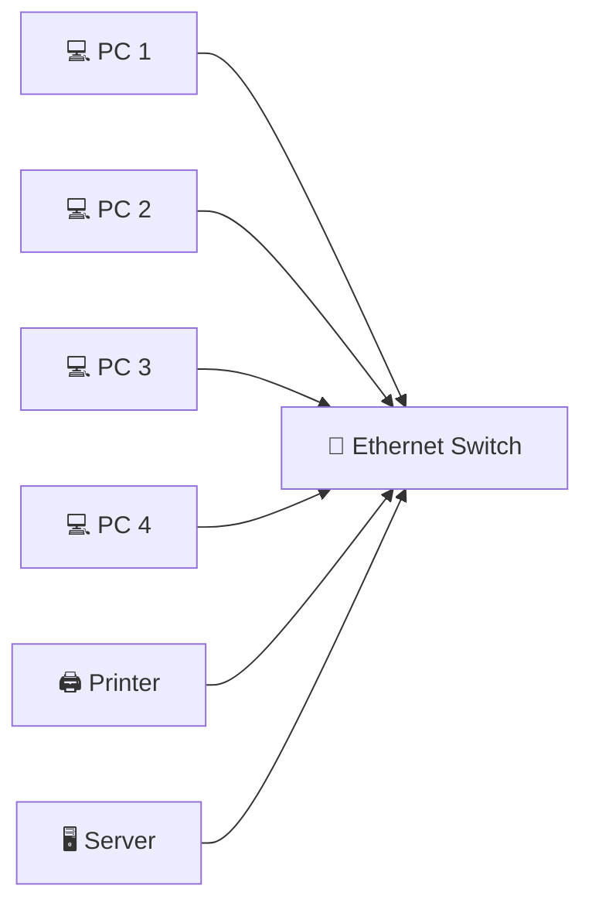

The switch acts like an intelligent traffic manager, ensuring that data reaches the correct destination quickly and efficiently.

---

# 🎯 Learning Objectives

After completing this lesson, you will be able to:

- Explain why Ethernet switches replaced hubs and traditional bridges.
- Describe how switches operate at the Data Link Layer (OSI Layer 2).
- Understand why a switch is often called a **multiport bridge**.
- Explain how switches learn and use MAC addresses.
- Describe how switches forward Ethernet frames.
- Differentiate between collision domains and broadcast domains.
- Compare managed and unmanaged switches.
- Understand switching modes and duplex communication.
- Explain the cybersecurity benefits of switched Ethernet networks.
- Recognize why switches are the standard networking device in modern LANs.

---
---

# 🌐 What Is an Ethernet Switch?

An **Ethernet Switch** is a **Layer 2 (Data Link Layer)** networking device that connects multiple devices within a Local Area Network (LAN) and intelligently forwards Ethernet frames based on their **MAC addresses**.

Unlike a hub, which broadcasts every frame to every connected device, a switch sends data **only to the device that needs to receive it**.

Because of this intelligent forwarding, switches provide:

- Higher network performance
- Better bandwidth utilization
- Reduced unnecessary traffic
- Improved security
- Scalable network design

Today, Ethernet switches are the **standard networking device** used in homes, schools, businesses, cloud environments, and data centers.

> 🎯 **Simple Definition**
>
> An **Ethernet Switch** is a Layer 2 device that connects multiple devices and forwards Ethernet frames intelligently using MAC addresses.

---

# 🌉 A Switch Is a Multiport Bridge

If you've understood the previous lesson on bridges, then you're already halfway to understanding switches.

A switch is **not** a completely new invention.

Instead, it builds upon the same Layer 2 principles introduced by the bridge.

Both devices:

- Learn MAC addresses
- Build forwarding tables
- Forward frames intelligently
- Filter unnecessary traffic
- Reduce collisions

The major difference is **scale**.

A traditional bridge usually connects **two network segments**, while a switch can connect **dozens or even hundreds of devices simultaneously**.

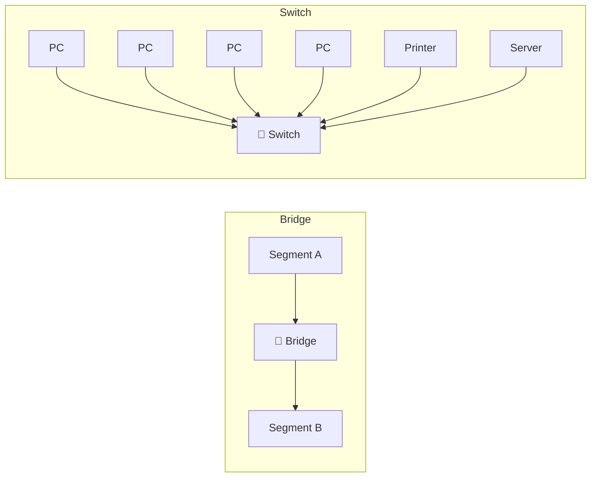

> 💡 **Remember**
>
> A modern Ethernet switch is often described as a **high-speed multiport bridge** because it performs the same Layer 2 functions—but for many devices at once.

---

# 🎯 Dedicated Collision Domains

One of the greatest advantages of a switch is that **each switch port forms its own collision domain**.

Unlike a hub, where all connected devices compete for the same communication medium, a switch isolates traffic between ports.

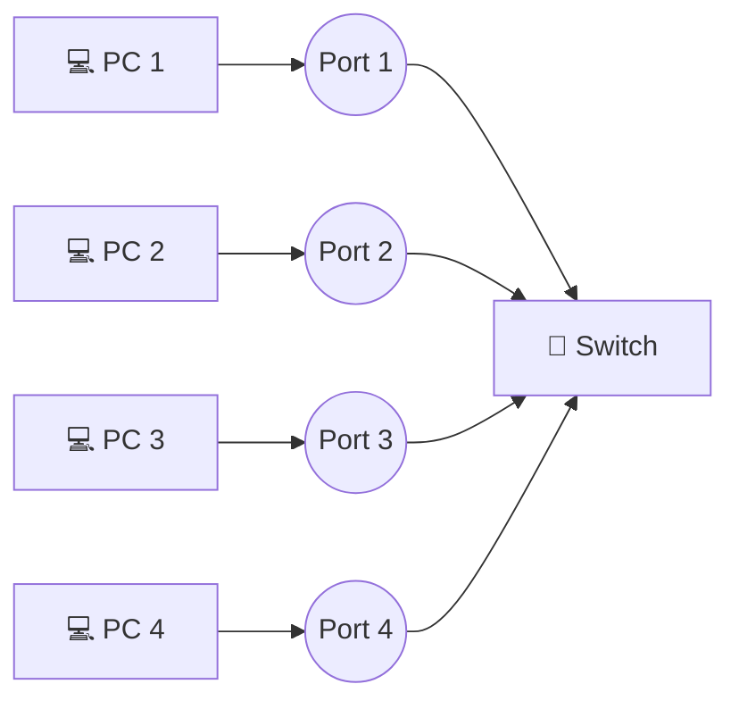

Each connection operates independently.

This means devices connected to different ports no longer compete for bandwidth in the same way they did on hub-based networks.

---

# 🧩 What Is Microsegmentation?

Because every switch port is an independent collision domain, a switch effectively divides the network into many small segments.

This concept is known as **microsegmentation**.

Instead of placing every device into one large collision domain, the switch creates a separate collision domain for **every connected port**.

```text
Hub

PC ─┐
PC ─┤
PC ─┤── One Large Collision Domain
PC ─┘


Switch

PC ─ Port 1 → Collision Domain 1
PC ─ Port 2 → Collision Domain 2
PC ─ Port 3 → Collision Domain 3
PC ─ Port 4 → Collision Domain 4
```

Microsegmentation significantly improves:

- Network performance
- Bandwidth efficiency
- Reliability
- Scalability

---

# 🚀 Simultaneous Communication

One of the biggest limitations of hubs was that only one device could successfully transmit at a time without risking collisions.

A switch changes this completely.

Because each port operates independently, multiple devices can communicate **at the same time**.

For example:

- PC 1 can communicate with the server.
- PC 2 can print documents.
- PC 3 can access the internet.
- PC 4 can transfer files.

All of these communications can occur simultaneously without interfering with one another.

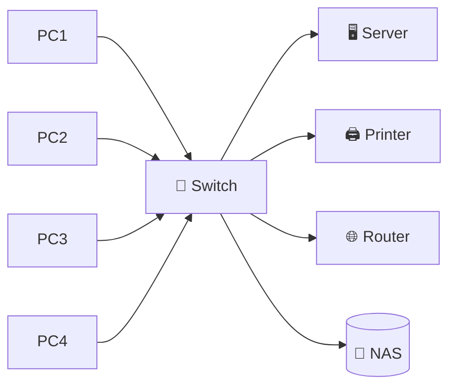

This parallel communication is one of the primary reasons modern Ethernet networks are so efficient.

---

# 📍 Where Does a Switch Operate?

A standard Ethernet switch operates at the **Data Link Layer (Layer 2)** of the OSI Model.

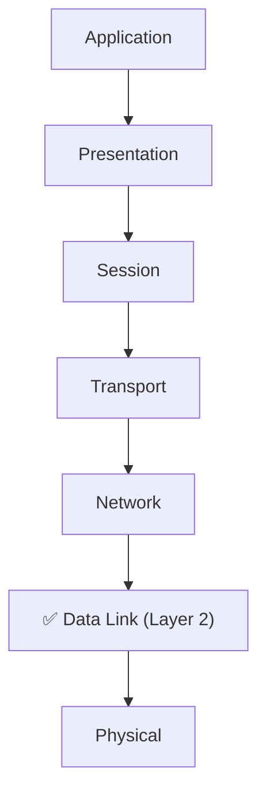

At this layer, the switch works with:

- Ethernet Frames
- MAC Addresses

It does **not** make forwarding decisions based on IP addresses.

Those decisions are performed by **routers** operating at Layer 3.

> 📝 **Note**
>
> Some advanced **Layer 3 switches** can also make routing decisions using IP addresses. You'll learn about these devices later in your networking journey.

---

# 📊 Characteristics of an Ethernet Switch

| Characteristic | Description |
|---------------|-------------|
| OSI Layer | Layer 2 (Data Link) |
| Primary Function | Connect devices within a LAN |
| Reads Frames | ✅ Yes |
| Reads MAC Addresses | ✅ Yes |
| Reads IP Addresses | ❌ No (Standard Layer 2 Switch) |
| Learns Device Locations | ✅ Yes |
| Intelligent Forwarding | ✅ Yes |
| Collision Domains | One per Port |
| Broadcast Domain | One (by default) |
| Modern LAN Device | ✅ Yes |

---

> ⚠ **Common Beginner Mistake**
>
> Many beginners believe that switches completely eliminate broadcasts.
>
> This is incorrect.
>
> A standard Layer 2 switch **still forwards broadcast frames** to all devices within the same broadcast domain. What it eliminates are **unnecessary collisions**, not broadcasts.

---

# ✅ Knowledge Check

1. Why is an Ethernet switch considered a Layer 2 device?
2. Why is a switch often called a **multiport bridge**?
3. What is a dedicated collision domain?
4. What is microsegmentation, and why is it important?
5. Why can multiple devices communicate simultaneously through a switch?
6. Which information does a switch examine before forwarding a frame?
7. Why does a switch improve network performance compared to a hub?

> 🎯 **Think About It**
>
> A company replaces a 24-port hub with a 24-port Ethernet switch.
>
> Without changing any computers or cables, network performance improves dramatically.
>
> **What design improvements inside the switch are responsible for this increase in performance?**

---
---

# 🧠 Inside an Ethernet Switch

When you send an email, open a website, print a document, or access a shared file, your computer sends Ethernet frames into the network.

The switch receives each frame and must decide **exactly where it should go**.

Unlike a hub, which broadcasts every frame, a switch analyzes each frame individually and makes an intelligent forwarding decision in just a fraction of a second.

This process happens continuously, allowing modern switches to forward **millions or even billions of frames every second**, depending on the hardware.

---

# 🗂️ The CAM Table

In the previous lesson, you learned that a **Bridge** stores learned MAC addresses in a **MAC Address Table**.

An Ethernet switch performs the same task, but because it is designed for much higher performance, it stores this information in specialized hardware called **Content Addressable Memory (CAM)**.

The resulting database is known as the **CAM Table**.

Think of the CAM Table as the switch's memory.

It records which **MAC address** is connected to which **switch port**, allowing the switch to forward frames quickly and accurately.

For example:

| MAC Address | Switch Port |
|-------------|-------------|
| AA-AA-AA-AA-AA-AA | Port 1 |
| BB-BB-BB-BB-BB-BB | Port 2 |
| CC-CC-CC-CC-CC-CC | Port 5 |
| DD-DD-DD-DD-DD-DD | Port 8 |

Instead of searching the entire network, the switch simply checks its CAM Table and sends the frame directly to the correct port.

> 💡 **Did You Know?**
>
> CAM stands for **Content Addressable Memory**, a type of high-speed memory optimized for extremely fast lookups. This allows switches to make forwarding decisions almost instantly.

---

# 📚 How Does a Switch Learn?

A switch does not know where devices are located when it is first powered on.

Its CAM Table starts out empty.

As devices begin communicating, the switch learns automatically by examining the **Source MAC Address** of every incoming frame.

Each time a frame arrives, the switch records:

- The source MAC address
- The switch port where the frame arrived

Over time, the CAM Table becomes a map of the entire local network.

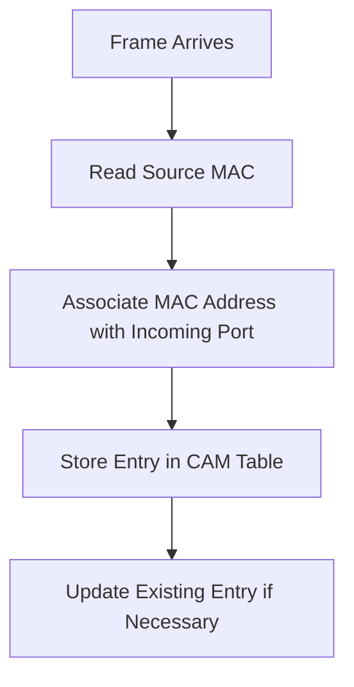

This process is known as **MAC Learning**.

It happens automatically without any manual configuration.

---

# 🚦 The Switching Process

After learning the source MAC address, the switch examines the **Destination MAC Address**.

It then decides how to handle the frame.

There are three possible actions.

---

## 1️⃣ Forwarding

If the destination MAC address exists in the CAM Table and is connected to a different port, the switch forwards the frame **only to that specific port**.

```text
PC A
 │
 ▼
Port 1
 │
🔀 Switch
 │
Port 6
 │
▼
PC D
```

Only the intended recipient receives the frame.

No other connected devices see this communication.

This is the normal operating mode of a switch.

---

## 2️⃣ Filtering

If both the sender and destination are connected to the **same switch port or local segment**, forwarding is unnecessary.

The switch filters the frame instead of sending it elsewhere.

Filtering reduces unnecessary traffic and improves overall network efficiency.

> 📝 **Note**
>
> Filtering prevents frames from being forwarded where they are not needed, conserving bandwidth and reducing unnecessary network activity.

---

## 3️⃣ Flooding

Sometimes the switch receives a frame destined for a MAC address that does **not** exist in its CAM Table.

Since it does not yet know where that device is located, it temporarily floods the frame to all appropriate ports (except the incoming port).

```text
Unknown Destination

        Frame
          │
          ▼
      🔀 Switch
     /  |  |  \
 Port2 Port3 Port4 Port5
```

Once the destination device replies, the switch learns its MAC address and updates the CAM Table.

Future frames can then be forwarded directly.

---

# 🔄 Complete Frame Processing Workflow

Every Ethernet frame follows essentially the same journey through the switch.

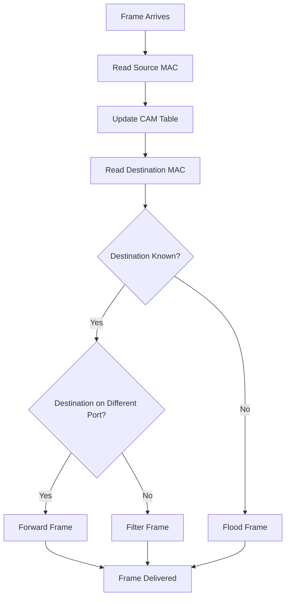

This intelligent workflow allows switches to handle enormous amounts of network traffic with remarkable efficiency.

---

# 🌍 Real-World Analogy

Imagine a hotel receptionist.

Every guest checks in and is assigned a room number.

The receptionist remembers where each guest is staying.

Later, when a package arrives, the receptionist immediately knows which room should receive it.

If a package arrives for someone who has not yet checked in, the receptionist asks around until the correct guest is found.

Once the guest is located, future deliveries become quick and effortless.

A switch works in much the same way.

Its CAM Table acts as a directory, helping it deliver Ethernet frames to the correct destination without disturbing every other device on the network.

---

# 📊 Bridge vs Switch Learning

| Feature | Bridge | Switch |
|---------|---------|---------|
| Learns MAC Addresses | ✅ Yes | ✅ Yes |
| Uses a Forwarding Table | ✅ Yes | ✅ Yes (CAM Table) |
| Hardware Optimized | Limited | ✅ Yes |
| Typical Number of Ports | Few | Many |
| Forwarding Speed | Moderate | Very High |
| Used in Modern Networks | Rare | Standard |

---

> ⚠ **Common Beginner Mistake**
>
> Many beginners believe a switch permanently knows every device on the network.
>
> In reality, the CAM Table is **dynamic**.
>
> Entries are automatically updated as devices communicate and removed after a period of inactivity through a process known as **CAM Table aging**.

---

# ✅ Knowledge Check

1. What is the purpose of the CAM Table?
2. What information is stored in a CAM Table?
3. How does a switch learn MAC addresses?
4. What is the difference between forwarding, filtering, and flooding?
5. Why does a switch flood frames for unknown destinations?
6. Why is Content Addressable Memory important?
7. Why are future communications faster after the destination MAC address has been learned?

> 🎯 **Think About It**
>
> A brand-new laptop is connected to **Port 12** of a switch and immediately sends its first Ethernet frame.
>
> - What information will the switch learn?
> - How will the CAM Table change?
> - How will this affect future communications with that laptop?

---
---

# ⚡ Switching Methods

Not all Ethernet switches forward frames in exactly the same way.

Different switches use different forwarding methods depending on the balance they want to achieve between **speed**, **accuracy**, and **error detection**.

The three primary switching methods are:

- 📦 Store-and-Forward Switching
- ⚡ Cut-Through Switching
- 🚀 Fragment-Free Switching

Each method has its own advantages and trade-offs.

---

# 📦 Store-and-Forward Switching

**Store-and-Forward** is the most common switching method used in modern Ethernet networks.

Instead of immediately forwarding a frame, the switch first receives the **entire Ethernet frame**.

Only after the complete frame has arrived does the switch inspect it for errors.

If the frame is valid, it is forwarded to the correct destination.

If errors are detected, the frame is discarded.

```mermaid
flowchart LR

A[Frame Arrives]
--> B[Receive Entire Frame]
--> C[Check for Errors (FCS)]
--> D{Frame Valid?}

D -->|Yes| E[Forward Frame]

D -->|No| F[Discard Frame]
```

### Advantages

- Detects corrupted frames
- Prevents damaged data from spreading
- Most reliable switching method
- Widely used in enterprise networks

### Limitation

- Slightly higher latency because the switch waits for the complete frame.

---

# ⚡ Cut-Through Switching

**Cut-Through Switching** is designed for environments where **speed is more important than error checking**.

Instead of waiting for the entire frame, the switch begins forwarding as soon as it reads the **Destination MAC Address**.

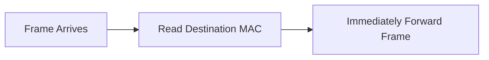

Because forwarding starts almost instantly, network latency is extremely low.

However, corrupted frames may also be forwarded because the switch has not yet verified the entire frame.

### Advantages

- Extremely low latency
- Very fast forwarding
- Suitable for high-performance environments

### Limitation

- May forward damaged or corrupted frames

---

# 🚀 Fragment-Free Switching

**Fragment-Free Switching** combines ideas from both previous methods.

Instead of forwarding immediately, the switch waits until it has received the **first 64 bytes** of the Ethernet frame.

Why 64 bytes?

Historically, most collision-related frame corruption occurred within the first 64 bytes of transmission.

Once those bytes are received successfully, the switch forwards the frame.

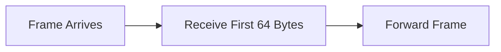

This method provides a compromise between speed and reliability.

---

# 📊 Comparing Switching Methods

| Feature | Store-and-Forward | Cut-Through | Fragment-Free |
|----------|-------------------|-------------|---------------|
| Reads Entire Frame | ✅ Yes | ❌ No | Partial |
| Error Detection | ✅ Excellent | ❌ None | Limited |
| Latency | Higher | Lowest | Low |
| Reliability | Highest | Lower | Moderate |
| Common Today | ✅ Very Common | Specialized | Rare |

> 💡 **Remember**
>
> Most enterprise Ethernet switches today use **Store-and-Forward Switching** because reliability is usually more important than saving a few microseconds.

---

# 🔄 Half-Duplex vs Full-Duplex Communication

To understand why modern switched networks perform so well, we also need to understand **duplex communication**.

Duplex describes whether devices can **send** and **receive** data simultaneously.

---

## Half-Duplex

In **Half-Duplex** communication, a device can either:

- Send data
- Receive data

—but **not both at the same time**.

```text
Computer A  ─────►  Computer B

(wait)

Computer B  ─────►  Computer A
```

This communication method is similar to using a walkie-talkie.

Only one person speaks at a time.

Older hub-based Ethernet networks operated in half-duplex mode.

Because multiple devices shared the same communication medium, collisions were possible.

---

## Full-Duplex

In **Full-Duplex** communication, both devices can transmit and receive simultaneously.

```text
Computer A  ◄────►  Computer B
```

This is similar to a telephone conversation where both people can speak and listen at the same time.

Modern Ethernet switches support **Full-Duplex communication**.

Each switch port provides an independent communication channel, allowing simultaneous transmission without collisions.

---

# 💥 Why Do Switches Eliminate Collisions?

One of the biggest improvements introduced by Ethernet switches is the practical elimination of collisions.

This happens because:

- Every switch port has its own collision domain.
- Devices no longer compete for a shared communication medium.
- Full-duplex communication allows simultaneous transmission and reception.
- Intelligent forwarding prevents unnecessary traffic.

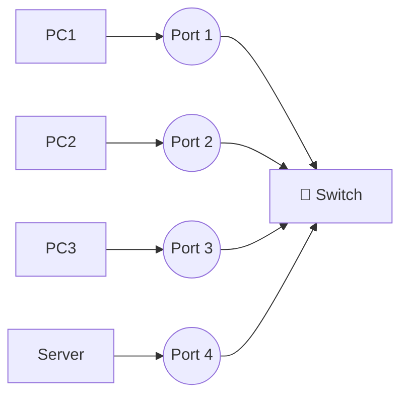

Each connection operates independently.

As a result, collisions that were common in hub-based networks have essentially disappeared from modern switched Ethernet.

> 🎯 **Remember**
>
> In a properly configured **full-duplex switched Ethernet network**, collisions do not normally occur.

---

# 🌐 Collision Domains vs Broadcast Domains

These two concepts are often confused by beginners.

Understanding the difference is essential.

| Collision Domain | Broadcast Domain |
|------------------|------------------|
| Area where data collisions may occur | Area where broadcast frames are received |
| Switch creates one collision domain per port | A Layer 2 switch creates one broadcast domain by default |
| Improves performance | Affects broadcast traffic |
| Reduced by switches | Divided by routers or VLANs |

Think of it this way:

- **Collision Domains** control **who can transmit at the same time**.
- **Broadcast Domains** control **who receives broadcast messages**.

---

> ⚠ **Common Beginner Mistake**
>
> Many students believe switches eliminate both collisions and broadcasts.
>
> This is only partially true.
>
> Switches effectively eliminate collisions through dedicated collision domains and full-duplex communication.
>
> However, standard Layer 2 switches still forward **broadcast frames** to every device within the same broadcast domain.

---

# ✅ Knowledge Check

1. What is the difference between Store-and-Forward and Cut-Through switching?
2. Why is Store-and-Forward the most common switching method?
3. What is Fragment-Free switching?
4. What is the difference between Half-Duplex and Full-Duplex communication?
5. Why do collisions rarely occur in modern switched Ethernet networks?
6. Why does every switch port create its own collision domain?
7. What is the difference between a collision domain and a broadcast domain?

> 🎯 **Think About It**
>
> Two modern computers are connected to the same Ethernet switch using full-duplex links.
>
> Both begin transmitting large files at exactly the same time.
>
> Why do collisions not occur, even though both devices are actively sending data?

---
---

# 🏗️ Types of Ethernet Switches

Although all Ethernet switches perform the same basic job—connecting devices and forwarding Ethernet frames—they are designed for different environments and requirements.

Some switches are simple plug-and-play devices for home networks, while others provide advanced management, security, and monitoring features for enterprise environments.

The most common types include:

- Unmanaged Switch
- Managed Switch
- Smart (Web-Managed) Switch
- Power over Ethernet (PoE) Switch
- Layer 3 Switch

Let's explore each one.

---

# 🔌 Unmanaged Switch

An **Unmanaged Switch** is the simplest type of Ethernet switch.

It requires **no configuration**.

Simply connect the devices, power on the switch, and it begins forwarding traffic automatically.

These switches are commonly found in:

- 🏠 Homes
- 🏢 Small offices
- 🎓 Classrooms
- 🧪 Small laboratories

### Advantages

- Easy to install
- Low cost
- No configuration required
- Reliable for small networks

### Limitations

- No VLAN support
- No monitoring
- No security configuration
- No traffic management

---

# ⚙️ Managed Switch

A **Managed Switch** provides administrators with complete control over the network.

Instead of simply forwarding traffic, administrators can configure, monitor, and secure the switch using a command-line interface (CLI), web interface, or management software.

Managed switches are commonly used in:

- Enterprise networks
- Universities
- Hospitals
- Government organizations
- Data centers

Common management features include:

- VLAN configuration
- Port security
- Quality of Service (QoS)
- Traffic monitoring
- Port mirroring (SPAN)
- Link aggregation
- Remote management
- SNMP monitoring

> 💡 **Did You Know?**
>
> Nearly every enterprise network relies on managed switches because they provide the visibility and control required for modern IT operations.

---

# 🌐 Smart (Web-Managed) Switch

A **Smart Switch** sits between unmanaged and fully managed switches.

It offers a limited set of management features through a web-based interface while remaining easier to configure than a fully managed switch.

Smart switches are ideal for:

- Small businesses
- Growing organizations
- Branch offices

They provide basic features such as:

- VLANs
- QoS
- Port statistics
- Basic security settings

---

# ⚡ Power over Ethernet (PoE) Switch

A **Power over Ethernet (PoE) Switch** can deliver both **electrical power** and **network connectivity** through a single Ethernet cable.

This eliminates the need for separate power adapters for many network devices.

Common PoE devices include:

- 📹 IP Cameras
- 📶 Wireless Access Points
- ☎️ VoIP Phones
- 🚪 Smart Door Access Systems
- 📡 IoT Devices

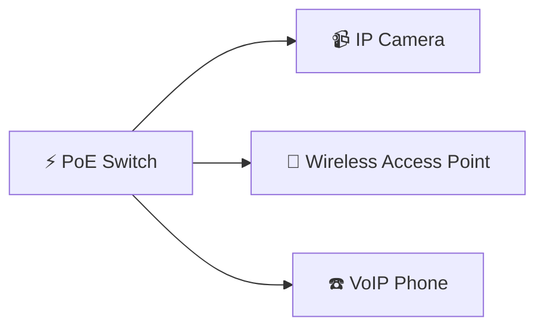

### Benefits

- Easier installation
- Fewer cables
- Centralized power management
- Cleaner network infrastructure

---

# 🌐 Layer 3 Switch

Most Ethernet switches operate at **Layer 2**.

However, some advanced switches also include **Layer 3 routing capabilities**.

These devices are known as **Layer 3 Switches**.

In addition to forwarding frames using MAC addresses, they can also make routing decisions using **IP addresses**.

Layer 3 switches are commonly used in:

- Large enterprise campuses
- University networks
- Data centers

> 📝 **Note**
>
> Layer 3 switching combines the high performance of switching with many of the routing capabilities traditionally provided by routers.

You will study Layer 3 switching in greater detail after learning about routers.

---

# 🌍 Where Are Ethernet Switches Used?

Today, Ethernet switches are everywhere.

Examples include:

- 🏠 Home networks
- 🏢 Office buildings
- 🏭 Manufacturing plants
- 🏫 Schools and universities
- 🏥 Hospitals
- ☁️ Cloud data centers
- 🛒 Retail stores
- 📡 Internet Service Provider (ISP) infrastructure

Wherever multiple wired devices communicate within a Local Area Network, an Ethernet switch is usually present.

---

# ✅ Advantages of Ethernet Switches

Compared to older networking devices, switches offer many benefits.

### Advantages

- Intelligent frame forwarding
- High-speed communication
- Dedicated collision domains
- Full-duplex communication
- Better bandwidth utilization
- Supports many connected devices
- Scalable network design
- Foundation of modern Ethernet
- Improved confidentiality compared to hubs

---

# ⚠️ Limitations of Ethernet Switches

Although switches are extremely capable, they also have limitations.

### Limitations

- Standard Layer 2 switches cannot route between different IP networks.
- Broadcast traffic still exists within the same broadcast domain.
- Large enterprise switches may be expensive.
- Misconfiguration can create security risks.
- Advanced management requires networking knowledge.

---

# 📊 Switch vs Hub

| Feature | Hub | Switch |
|---------|-----|---------|
| OSI Layer | Layer 1 | Layer 2 |
| Reads MAC Addresses | ❌ No | ✅ Yes |
| Intelligent Forwarding | ❌ No | ✅ Yes |
| Collision Domains | One Shared | One Per Port |
| Full-Duplex | ❌ No | ✅ Yes |
| Performance | Low | High |
| Security | Low | Better |
| Used Today | Rare | Standard |

---

# 📊 Switch vs Bridge

| Feature | Bridge | Switch |
|---------|---------|---------|
| Typical Ports | Few | Many |
| Hardware Performance | Moderate | Very High |
| Uses CAM Table | Limited | ✅ Yes |
| Full-Duplex Support | Limited | ✅ Yes |
| Enterprise Scalability | Limited | Excellent |
| Common Today | Rare | Standard |

A modern Ethernet switch is best understood as a **high-performance evolution of the bridge**.

It performs the same intelligent forwarding operations but on a much larger scale and at significantly higher speeds.

---

# ⚠️ Common Beginner Mistakes

### ❌ "Every switch is managed."

Incorrect.

Many home and small-office switches are **unmanaged** and require no configuration.

---

### ❌ "PoE makes a network faster."

Incorrect.

PoE delivers **electrical power**, not additional network speed.

---

### ❌ "Layer 3 switches replace routers."

Incorrect.

Although Layer 3 switches can perform routing functions, routers still provide many advanced networking features that switches do not.

---

### ❌ "Switches completely stop broadcast traffic."

Incorrect.

Standard Layer 2 switches still forward broadcast frames within the same broadcast domain.

---

# 📖 Mini Review

You've now explored the device that powers almost every modern wired network.

Unlike hubs and traditional bridges, Ethernet switches provide:

- Intelligent frame forwarding
- High-speed hardware switching
- Dedicated collision domains
- Full-duplex communication
- Scalable LAN connectivity

These innovations transformed Ethernet from a shared communication medium into the efficient, high-performance networks used throughout the world today.

---

# ✅ Knowledge Check

1. What is the difference between a managed and unmanaged switch?
2. What is a Smart Switch?
3. What is Power over Ethernet (PoE), and why is it useful?
4. What additional capability does a Layer 3 switch provide?
5. Name five environments where Ethernet switches are commonly used.
6. Why are managed switches preferred in enterprise networks?
7. Why has the Ethernet switch replaced both hubs and bridges?

> 🎯 **Think About It**
>
> Your organization is installing:
>
> - IP security cameras
> - Wireless access points
> - VoIP telephones
> - Hundreds of employee computers
>
> Which type of switch would you recommend, and why would it be a better choice than a basic unmanaged switch?

---
---

# 🔐 Cybersecurity Perspective: Why Should Security Professionals Understand Switches?

Ethernet switches are designed to improve **performance** and **efficiency**, not to act as security devices. However, because they control how devices communicate within a Local Area Network (LAN), they play a critical role in both **network security** and **cybersecurity investigations**.

Understanding how switches forward traffic helps security professionals recognize normal network behavior, detect suspicious activity, and investigate security incidents.

Many attacks at the **Data Link Layer (Layer 2)** specifically target switch behavior. Without understanding how switches learn MAC addresses, build CAM tables, and forward frames, these attacks can be difficult to understand and defend against.

---

# 🛡️ Improving Network Security

Compared to older hub-based networks, switches provide several security advantages.

Because a switch forwards frames only to the intended destination, other devices on the network do not automatically receive every transmission.

This reduces unnecessary network exposure and makes casual packet sniffing much more difficult than in a hub-based environment.

However, switches do **not** encrypt traffic or enforce access control. They simply make communication more efficient and limit unnecessary traffic.

> 🎯 **Remember**
>
> A switch improves **traffic isolation**, but it is **not a replacement** for firewalls, encryption, or other security technologies.

---

# 🕵️ Switches and Packet Analysis

Security analysts frequently use tools such as **Wireshark** to capture and analyze network traffic.

In a hub-based network, every connected device receives every frame, making packet capture straightforward.

In a switched network, traffic is forwarded only to the appropriate destination port.

As a result, an analyst running Wireshark on one workstation will usually see:

- Broadcast traffic
- Multicast traffic
- Frames sent directly to that workstation

Traffic exchanged between two other devices normally remains invisible.

To monitor all traffic on a switched network, administrators often configure **Port Mirroring (SPAN)**, which copies traffic from one or more ports to a monitoring port for analysis.

---

# ⚠️ Layer 2 Attacks

Although switches improve network performance, attackers have developed techniques that specifically target Layer 2 communication.

Examples include:

| Attack | Description |
|---------|-------------|
| **MAC Flooding** | Attempts to overflow the CAM Table, forcing the switch to behave more like a hub. |
| **ARP Spoofing** | Tricks devices into sending traffic through the attacker's system. |
| **VLAN Hopping** | Attempts to bypass VLAN isolation and access traffic from another VLAN. |
| **MAC Spoofing** | Changes a device's MAC address to impersonate another system. |

You will study these attacks in detail later in the cybersecurity roadmap.

For now, remember that understanding **normal switch operation** is the first step toward understanding how attackers attempt to exploit it.

---

# 🏢 Why Switches Matter in Enterprise Networks

Nearly every enterprise network depends on Ethernet switches.

They connect:

- Employee workstations
- Servers
- Wireless access points
- IP telephones
- Security cameras
- Storage systems
- Printers
- Network appliances

Because so much communication passes through switches, they also become valuable sources of information during:

- Incident response
- Digital forensics
- Network troubleshooting
- Security monitoring
- Performance analysis

This is one reason why network engineers, SOC analysts, penetration testers, and digital forensics investigators all need a solid understanding of Ethernet switching.

---

> 💡 **Did You Know?**
>
> Many enterprise switches support features such as **Port Security**, **802.1X authentication**, **VLANs**, **DHCP Snooping**, and **Dynamic ARP Inspection (DAI)** to strengthen network security. You'll explore these technologies later as you progress through the roadmap.

---

# 🧠 60-Second Revision

Let's review the most important concepts from this lesson.

- An **Ethernet Switch** is a **Layer 2 (Data Link Layer)** networking device.
- A switch is essentially a **high-speed multiport bridge**.
- Switches learn **MAC addresses** automatically and store them in a **CAM Table**.
- Incoming frames are **forwarded**, **filtered**, or **flooded** depending on the destination MAC address.
- Every switch port creates its own **collision domain**, greatly improving performance.
- Modern switched Ethernet networks typically operate in **full-duplex mode**, eliminating collisions under normal conditions.
- Switches are the standard networking device used in modern wired LANs.

If you understand these ideas, you've mastered the foundation of Ethernet switching.

---

# 📌 Key Takeaways

- ✅ Switches operate at **OSI Layer 2**.
- ✅ They forward frames using **MAC addresses**.
- ✅ CAM Tables allow intelligent frame forwarding.
- ✅ Every switch port forms its own collision domain.
- ✅ Full-duplex communication eliminates normal Ethernet collisions.
- ✅ Managed switches provide advanced monitoring and security features.
- ✅ Ethernet switches are the backbone of modern Local Area Networks.

---

# 🎓 Final Knowledge Check

1. Why did Ethernet switches replace hubs in modern networks?
2. Why is a switch often called a **multiport bridge**?
3. What information is stored in a CAM Table?
4. How does a switch learn MAC addresses?
5. Explain the difference between **forwarding**, **filtering**, and **flooding**.
6. Why does every switch port create its own collision domain?
7. What is microsegmentation, and why is it important?
8. Compare **Store-and-Forward** and **Cut-Through** switching.
9. Why do modern switched networks normally operate without collisions?
10. What is the difference between **Half-Duplex** and **Full-Duplex** communication?
11. Compare managed and unmanaged switches.
12. What is the purpose of a PoE switch?
13. What additional capability does a Layer 3 switch provide?
14. Why can't Wireshark running on a normal workstation see all switched network traffic?
15. What is Port Mirroring (SPAN), and why is it useful?
16. Name two Layer 2 attacks that target switch behavior.
17. Why are switches important in digital forensics and SOC operations?
18. How does understanding Ethernet switching help cybersecurity professionals?

> 🎯 **Scenario Challenge**
>
> A company replaces every hub in its office with managed Ethernet switches.
>
> After the upgrade:
>
> - Network performance improves significantly.
> - File transfers become faster.
> - Collisions disappear.
> - Security analysts notice that Wireshark no longer captures traffic between unrelated workstations.
>
> Explain **why** each of these improvements occurred using the concepts you've learned throughout this chapter.

---

# 📚 Further Reading

Continue your networking journey with the following lessons:

| Lesson | Description |
|---------|-------------|
| **[Router](Router.md)** | Learn how routers connect different IP networks and make forwarding decisions using IP addresses instead of MAC addresses. |
| **[Gateway](Gateway.md)** | Understand how gateways enable communication between different networks and protocols. |
| **[Choosing the Right Network Device](Choosing%20the%20Right%20Network%20Device.md)** | Review and compare all networking devices covered in this chapter. |

---

# 🗺️ Where You Are in the Roadmap

```text
Cybersecurity Roadmap

02-Networking

README.md
│
├── ✅ Network Devices Overview
│
├── ✅ Repeater
├── ✅ Hub
├── ✅ Bridge
├── ✅ Switch (Current Lesson)
│
├── ⏭️ Router
├── ⏳ Gateway
├── ⏳ Modem
├── ⏳ Access Point
├── ⏳ Firewall
├── ⏳ IDS
├── ⏳ IPS
└── ⏳ Load Balancer
```

---

# ➡️ Next Lesson: [🌐 Router](Router.md)

So far, every networking device you've studied—**Repeater**, **Hub**, **Bridge**, and **Switch**—has focused on communication **within the same Local Area Network (LAN)**.

Each device became progressively more intelligent, culminating in the switch, which forwards Ethernet frames using **MAC addresses**.

But what happens when data needs to travel **beyond the local network**?

How does your computer communicate with websites, cloud services, or computers on the other side of the world?

Answering these questions requires a new type of networking device: the **Router**.

Unlike a switch, which makes forwarding decisions using **MAC addresses**, a router operates at the **Network Layer (Layer 3)** and forwards packets using **IP addresses**. It connects separate networks together, chooses the best path for data, and makes global communication across the Internet possible.

In the next lesson, you'll learn:

- Why routers are essential for internetworking
- How routers use IP addresses to forward packets
- The difference between Layer 2 switching and Layer 3 routing
- How routers connect LANs to WANs and the Internet
- Why routers are one of the most important devices in modern networking and cybersecurity

By understanding routers, you'll complete the transition from **local communication** to **global communication**, unlocking one of the most fundamental concepts in computer networking.

---

> 🎉 **Congratulations!**
>
> You have now completed the four core devices that illustrate the evolution of Ethernet networking:
>
> **Repeater → Hub → Bridge → Switch**
>
> Each lesson built upon the previous one, showing how computer networks evolved from simply regenerating electrical signals to making intelligent, high-speed forwarding decisions. That foundation will make learning **routing, IP addressing, network security, and packet analysis** significantly easier in the chapters ahead.

---

