# 📡 Coaxial Cable

> *A Coaxial Cable is a shielded transmission medium that carries electrical signals with excellent resistance to electromagnetic interference (EMI). Although it played a major role in early Ethernet networks, today it is widely used for cable television, broadband Internet, CCTV systems, satellite communication, and radio frequency (RF) applications.*

---

<div align="center">


-informational?style=for-the-badge)


</div>

---

# 📖 Table of Contents

- [Previously in this Roadmap](#-previously-in-this-roadmap)
- [Why Do We Need Coaxial Cables?](#-why-do-we-need-coaxial-cables)
- [A New Evolution in Network Media](#-a-new-evolution-in-network-media)
- [What is a Coaxial Cable?](#-what-is-a-coaxial-cable)
- [Where Are Coaxial Cables Used?](#-where-are-coaxial-cables-used)
- [Learning Objectives](#-learning-objectives)

---

# 📚 Previously in this Roadmap

In the previous lesson, **Copper Cables.md**, you learned how **twisted-pair Ethernet cables** became the foundation of modern Local Area Networks (LANs).

You explored:

- ✅ How electrical signals travel through copper conductors.
- ✅ Why twisted-pair cables reduce electromagnetic interference (EMI).
- ✅ The differences between UTP, FTP, and STP cables.
- ✅ Ethernet cable categories from Cat3 to Cat8.
- ✅ RJ-45 connectors and wiring standards.
- ✅ Installation best practices and cybersecurity considerations.

Twisted-pair Ethernet cables are now the most common networking medium inside homes, offices, schools, and enterprise environments.

However, Ethernet was **not the first technology** used to build computer networks.

Long before modern structured cabling became common, engineers faced a different challenge.

They needed a cable that could:

- Carry electrical signals over longer distances.
- Resist electromagnetic interference more effectively.
- Support higher-frequency communication.
- Deliver reliable performance in electrically noisy environments.

This challenge led to the development and widespread adoption of the **Coaxial Cable**.

---

# 🤔 Why Do We Need Coaxial Cables?

Imagine trying to have an important conversation in the middle of a crowded stadium.

Even if you speak loudly, surrounding noise makes it difficult for the listener to hear your message clearly.

Electrical signals experience a similar problem.

As they travel through ordinary conductors, nearby electrical devices such as motors, power cables, radios, and industrial equipment can introduce unwanted interference that distorts the signal.

While twisted-pair cables reduce much of this interference by twisting wire pairs together, some environments demand even greater protection.

Engineers solved this problem by surrounding the signal-carrying conductor with a protective metallic shield.

This new design became known as the **Coaxial Cable**.

Its construction allows electrical signals to travel with significantly better protection against external interference while maintaining higher signal quality over longer distances.

---

> 💡 **Real-World Analogy**
>
> Imagine carrying an important document through heavy rain.
>
> You could carry the paper in your hand, where it is exposed to the weather, or place it inside a waterproof protective tube.
>
> The document remains the same, but the protective tube shields it from the outside environment.
>
> A **Coaxial Cable** works in a similar way.
>
> The electrical signal travels through the center conductor, while surrounding layers protect it from external interference.

---

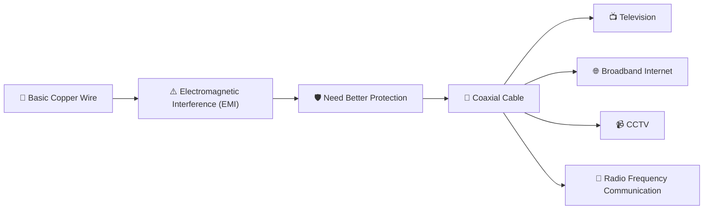

The evolution from ordinary copper wiring to coaxial cables represents an important milestone in communication technology.

Instead of simply carrying electrical signals, engineers designed a cable that actively protects those signals from external noise, making communication more reliable across longer distances.

---

<!--
Image Description:
Illustrate the evolution of communication media from a basic copper wire to a shielded coaxial cable. Show electromagnetic interference affecting the unshielded wire while the coaxial cable protects the signal. Include examples such as television, broadband Internet, and CCTV connected to the coaxial cable.

Suggested Search Keywords:
coaxial cable evolution infographic
coaxial cable shielding diagram
coaxial cable applications illustration
-->

<p align="center">

</p>

---

# 🌍 A New Evolution in Network Media

The history of network media can be viewed as a continuous effort to solve communication problems.

Each new transmission medium was developed to overcome limitations of the previous one.

```text
Basic Copper Wire
        │
        ▼
Poor Protection Against Interference
        │
        ▼
📡 Coaxial Cable
        │
Better Shielding
Longer Distance
Higher Signal Quality
        │
        ▼
🔌 Twisted Pair Ethernet
        │
Flexible • Affordable • Easy to Install
        │
        ▼
💡 Fiber Optics
Light-Based Communication
Very High Speed
Extremely Long Distance
Immune to EMI
```

As communication technologies evolved, each transmission medium found its own role.

Today:

- **Twisted Pair** dominates Local Area Networks.
- **Coaxial Cable** powers cable television, broadband Internet, and RF communication.
- **Fiber Optics** delivers the highest speeds for modern enterprise and Internet backbone networks.

Rather than replacing one another completely, these technologies now work together in modern communication infrastructures.

---

# 🎯 Learning Objectives

By the end of this lesson, you should be able to:

- Explain why coaxial cables were developed.
- Describe the internal structure of a coaxial cable.
- Understand how shielding protects electrical signals.
- Differentiate between common types of coaxial cables.
- Identify common coaxial connectors and their applications.
- Explain where coaxial cables are used in modern communication systems.
- Compare coaxial cables with twisted-pair Ethernet and fiber-optic cables.
- Recognize the cybersecurity considerations associated with coaxial infrastructure.

---

---

# 📡 What is a Coaxial Cable?

A **Coaxial Cable** is a type of electrical transmission cable specifically designed to carry high-frequency signals while minimizing interference from the surrounding environment.

Unlike a standard electrical wire, a coaxial cable uses multiple protective layers that work together to preserve signal quality.

Its unique construction allows it to:

- Transmit electrical signals efficiently.
- Reduce electromagnetic interference (EMI).
- Support higher frequencies.
- Carry signals over longer distances than ordinary unshielded copper wire.
- Provide reliable communication in electrically noisy environments.

The word **coaxial** comes from the term **co-axis**, meaning that all of the cable's layers share the same central axis.

```text
        Outer Jacket
   ┌─────────────────────┐
   │   Metallic Shield   │
   │ ┌─────────────────┐ │
   │ │ Dielectric Core │ │
   │ │      ●          │ │
   │ │ Center Wire     │ │
   │ └─────────────────┘ │
   └─────────────────────┘
```

Unlike twisted-pair Ethernet cables, which rely on twisting two conductors together to reduce interference, a coaxial cable surrounds its signal conductor with dedicated shielding.

This design provides significantly better protection against external electrical noise.

---

> 💡 **Remember**
>
> Twisted-pair cables reduce interference by **twisting wires together**.
>
> Coaxial cables reduce interference by **surrounding the signal with metallic shielding**.

---

# 🏗️ Anatomy of a Coaxial Cable

Every coaxial cable is built using **four primary layers**, each with a specific purpose.

Rather than serving as simple insulation, these layers work together to create a stable environment for transmitting electrical signals.

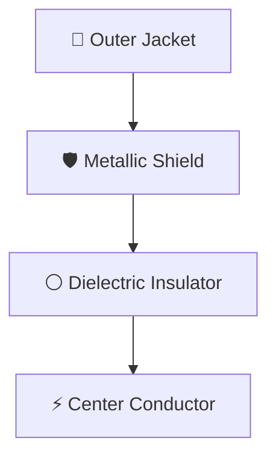

---

<!--
Image Description:
Create a labeled cross-sectional diagram of a coaxial cable showing the four main layers: Outer Jacket, Metallic Shield (braided mesh), Dielectric Insulator, and Center Conductor. Use arrows to label each component and indicate that all layers share the same central axis.

Suggested Search Keywords:
coaxial cable cross section
coaxial cable anatomy
coaxial cable internal structure
-->

<p align="center">

</p>

---

# ⚡ 1. Center Conductor

The **Center Conductor** is the core of the cable.

It is responsible for carrying the electrical signal from one device to another.

It is typically made from:

- Solid Copper
- Copper-Clad Steel (CCS)

Because it sits at the center of the cable, it remains evenly surrounded by insulating and shielding layers.

This balanced design helps maintain consistent signal characteristics.

---

```text
Electrical Signal

⚡──────────────►

Center Conductor
```

---

# ⚪ 2. Dielectric Insulator

Surrounding the center conductor is a thick layer of insulating material called the **Dielectric**.

Its primary responsibilities are to:

- Prevent electrical contact between the conductor and the shield.
- Maintain a constant distance between the conductor and the shield.
- Preserve the cable's electrical properties.
- Help determine the cable's characteristic impedance.

Common dielectric materials include:

- Polyethylene (PE)
- Foam Polyethylene
- PTFE (Teflon)

Although it does not carry electrical current, the dielectric plays a critical role in signal quality.

---

> 📝 **Interesting Fact**
>
> Even a small change in the spacing between the conductor and the shield can alter the cable's impedance, leading to signal reflections and reduced performance.

---

# 🛡️ 3. Metallic Shield

The **Metallic Shield** is one of the defining characteristics of a coaxial cable.

Unlike twisted-pair cables, which rely primarily on wire twisting to reduce interference, coaxial cables use a conductive shield that surrounds the signal.

The shield may consist of:

- Braided Copper
- Aluminum Foil
- Braided Aluminum
- Multiple Shielding Layers

Its responsibilities include:

- Blocking electromagnetic interference (EMI).
- Reducing radio frequency interference (RFI).
- Preventing signal leakage.
- Protecting transmitted data from external electrical noise.

This shielding makes coaxial cables especially useful in environments with strong electrical interference.

---


---

# 🧥 4. Outer Jacket

The **Outer Jacket** is the protective covering that surrounds the entire cable.

Unlike the metallic shield, it does not affect signal transmission directly.

Instead, it protects the cable from environmental damage.

The outer jacket helps resist:

- Moisture
- Dust
- Physical abrasion
- Sunlight (UV radiation)
- Chemicals
- Everyday wear and tear

Different environments require different jacket materials.

For example:

| Environment | Typical Jacket Material |
|-------------|-------------------------|
| Indoor Office | PVC |
| Outdoor Installations | UV-Resistant Polyethylene |
| Industrial Sites | Heavy-Duty Protective Jacket |

---

# 🔄 How the Layers Work Together

Each layer has a unique responsibility, but they function as a single integrated system.

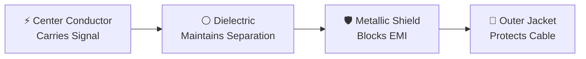

The signal travels through the center conductor.

The dielectric ensures proper spacing.

The metallic shield protects the signal from interference.

Finally, the outer jacket protects the entire cable from environmental damage.

Together, these layers allow coaxial cables to transmit signals reliably over long distances while maintaining excellent resistance to external interference.

---

# 📊 Components of a Coaxial Cable

| Component | Primary Function | Why It Matters |
|-----------|------------------|----------------|
| Center Conductor | Carries electrical signals | Transmits data and RF signals |
| Dielectric Insulator | Separates conductor and shield | Maintains impedance and signal quality |
| Metallic Shield | Blocks EMI and RFI | Protects signals from interference |
| Outer Jacket | Protects against environmental damage | Improves durability and cable lifespan |

---

# 📝 Mini Review

Before moving on, you should now understand:

- ✅ Why coaxial cables use multiple protective layers.
- ✅ The purpose of each internal component.
- ✅ How metallic shielding reduces interference.
- ✅ Why the dielectric is essential for maintaining signal quality.
- ✅ How all four layers work together to create a reliable transmission medium.

With this foundation in place, you're ready to explore **how coaxial cables actually transmit electrical signals**, why **impedance** is so important, and how coaxial cables achieve reliable communication over long distances.

---

# ⚡ How Does a Coaxial Cable Work?

Now that you understand the internal structure of a coaxial cable, the next question is:

> **How does a coaxial cable actually transmit data?**

At first glance, a coaxial cable may appear to be just another piece of wire.

However, its design is based on principles of **electromagnetic transmission**, allowing it to carry high-frequency electrical signals with remarkable efficiency.

Unlike ordinary electrical wiring, where interference can easily affect signal quality, a coaxial cable guides electrical energy through a carefully engineered pathway while its surrounding shield protects that energy from the outside world.

This combination of signal transmission and shielding is what makes coaxial cables ideal for television broadcasting, broadband Internet, satellite communication, and many radio-frequency (RF) applications.

---

# ⚙️ Signal Transmission

A coaxial cable carries information by transmitting **electrical signals** through its **center conductor**.

Whenever a device sends data—such as a television receiving a broadcast or a cable modem downloading a webpage—it converts that information into electrical signals.

These signals travel through the center conductor at extremely high speeds.

The surrounding dielectric insulator and metallic shield ensure that the signal remains stable throughout its journey.


Unlike household electrical wiring, which mainly delivers power, coaxial cables are optimized to deliver **high-frequency information** with minimal signal loss.

---

<!--
Image Description:
Illustrate a signal source transmitting an electrical signal through the center conductor of a coaxial cable to a receiving device. Highlight the signal traveling only through the center conductor while the surrounding layers provide protection.

Suggested Search Keywords:
coaxial cable signal transmission
electrical signal through coaxial cable
coaxial communication diagram
-->

<p align="center">

</p>

---

# 🛡️ Why the Shield Is So Important

One of the biggest advantages of a coaxial cable is its **metallic shield**.

Electrical equipment such as:

- Power lines
- Electric motors
- Radio transmitters
- Wireless devices
- Industrial machinery

all produce electromagnetic fields.

These fields can interfere with communication signals.

This unwanted disturbance is known as:

- **Electromagnetic Interference (EMI)**
- **Radio Frequency Interference (RFI)**

The metallic shield acts like a protective barrier around the signal.

Instead of allowing external noise to reach the center conductor, the shield absorbs or redirects much of the interference.


This shielding allows coaxial cables to operate reliably even in electrically noisy environments where ordinary cables might struggle.

---

> 💡 **Think of It Like This**
>
> Imagine listening to music through noise-canceling headphones.
>
> The music is the electrical signal.
>
> The surrounding noise represents electromagnetic interference.
>
> The headphones reduce unwanted noise so you hear the music clearly.
>
> A coaxial cable's metallic shield performs a similar function by protecting the signal from external electrical interference.

---

# 🌊 Electromagnetic Fields Inside the Cable

Whenever electricity flows through a conductor, it creates an **electromagnetic field**.

In an ordinary wire, part of this field spreads into the surrounding environment.

In a coaxial cable, however, the electromagnetic field is largely confined between:

- The **Center Conductor**
- The **Metallic Shield**

This controlled design provides two major advantages:

- Less signal leakage.
- Better protection from outside interference.

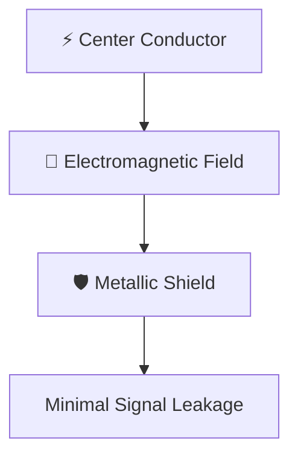

By keeping the electromagnetic field contained, coaxial cables achieve higher signal quality than many other electrical transmission methods.

---

<!--
Image Description:
Create a cross-sectional illustration showing electromagnetic fields traveling between the center conductor and metallic shield inside a coaxial cable. Indicate that the field remains contained within the cable.

Suggested Search Keywords:
coaxial cable electromagnetic field
coaxial cable shielding illustration
coaxial cable signal confinement
-->

<p align="center">

</p>

---

# 📏 Understanding Impedance

One of the most important concepts in coaxial communication is **impedance**.

Impedance is the electrical resistance that a cable presents to alternating current (AC) signals.

It is measured in **Ohms (Ω)**.

The two most common impedance values are:

| Impedance | Common Use |
|-----------|------------|
| **50 Ω** | Radio communication, RF systems, wireless equipment, test equipment |
| **75 Ω** | Cable television, broadband Internet, satellite communication |

The impedance of a coaxial cable is determined by:

- The diameter of the center conductor.
- The thickness of the dielectric.
- The spacing between the conductor and the shield.

Maintaining the correct impedance throughout a network is essential for reliable communication.

---

# 🔄 Signal Reflection

Imagine shouting inside a tunnel.

If the tunnel suddenly becomes narrower or wider, your voice echoes back.

Electrical signals behave in a similar way.

When a signal encounters a change in impedance, part of the signal reflects back toward the source instead of continuing forward.

This phenomenon is called **Signal Reflection**.


Signal reflections can cause:

- Reduced signal strength.
- Communication errors.
- Distorted television signals.
- Slower broadband performance.

This is why technicians always use connectors and cables with matching impedance ratings.

---

> ⚠️ **Best Practice**
>
> Never mix **50 Ω** and **75 Ω** coaxial components in the same communication system unless the equipment is specifically designed to support both.

---

# 📉 Signal Attenuation

As electrical signals travel through a cable, they gradually lose energy.

This natural reduction in signal strength is called **attenuation**.

Attenuation increases with:

- Longer cable lengths.
- Higher operating frequencies.
- Lower-quality cable materials.
- Poor connector installation.

Although coaxial cables perform better than ordinary wires, they still experience attenuation over long distances.

In large communication systems, engineers often install **signal amplifiers** or **repeaters** to restore signal strength.


---

# 📊 Advantages of Coaxial Signal Transmission

Because of its unique construction, coaxial cable offers several advantages over ordinary electrical wiring.

| Advantage | Benefit |
|-----------|---------|
| Excellent Shielding | Reduces EMI and RFI |
| Stable Signal Quality | Reliable communication |
| Longer Transmission Distance | Less signal degradation |
| High-Frequency Support | Suitable for RF and broadband applications |
| Durable Construction | Performs well in challenging environments |

---

# ⚠️ Limitations

Although coaxial cable is highly effective, it is not perfect.

Some limitations include:

- Thicker and heavier than twisted-pair Ethernet.
- Less flexible during installation.
- More expensive than UTP cables.
- Requires impedance-matched connectors.
- Generally slower and less scalable than modern fiber-optic communication.

As networking technologies evolved, twisted-pair Ethernet became the preferred choice for most LAN installations, while coaxial cable found its niche in television, broadband, and radio-frequency systems.

---

# 📝 Mini Review

You should now understand:

- ✅ How electrical signals travel through a coaxial cable.
- ✅ Why metallic shielding is so effective.
- ✅ How electromagnetic fields remain contained inside the cable.
- ✅ What impedance is and why it matters.
- ✅ How signal reflection occurs.
- ✅ Why attenuation affects long-distance communication.

In the next section, you'll explore the **different types of coaxial cables**, learn where each one is used, and discover how coaxial technology has evolved from early Ethernet networks to today's broadband communication systems.

---

---

# 📦 Types of Coaxial Cables

Not all coaxial cables are designed for the same purpose.

Over the years, different types of coaxial cables have been developed to meet the requirements of various communication systems.

Some were created specifically for **early computer networks**, while others were optimized for **television broadcasting, broadband Internet, satellite communication, and radio frequency (RF) applications**.

Choosing the correct coaxial cable depends on several factors, including:

- Required transmission distance
- Operating frequency
- Signal quality
- Bandwidth requirements
- Installation environment
- Cost

Understanding these cable types helps network engineers select the most appropriate medium for a given application.

---

# 🕰️ Historical Coaxial Cables

Before twisted-pair Ethernet became the standard for Local Area Networks (LANs), Ethernet itself relied on coaxial cable.

The IEEE 802.3 Ethernet standard originally defined two major coaxial Ethernet implementations:

- **10BASE5 (Thicknet)**
- **10BASE2 (Thinnet)**

Although these technologies are now obsolete, understanding them provides valuable historical context and explains how Ethernet evolved into the networks we use today.

---

## 🟡 10BASE5 (Thicknet)

**10BASE5**, commonly known as **Thicknet**, was one of the earliest Ethernet standards.

It used a thick, rigid coaxial cable that provided excellent signal quality over relatively long distances.

### Characteristics

- Data Rate: **10 Mbps**
- Maximum Segment Length: **500 meters**
- Thick and rigid cable
- High durability
- Required external transceivers
- Difficult to install

```text
Computer
     │
     ▼
Transceiver
     │
══════ Thick Coaxial Cable ══════
     │
Transceiver
     │
Computer
```

### Advantages

- Long transmission distance
- Excellent shielding
- Reliable communication
- Suitable for large office environments

### Limitations

- Heavy and difficult to install
- Expensive
- Required specialized connectors
- Difficult to expand or troubleshoot

---

## 🔵 10BASE2 (Thinnet)

As Ethernet adoption increased, engineers wanted a solution that was easier to install and more affordable.

This led to the development of **10BASE2**, commonly called **Thinnet**.

Thinnet used a thinner and more flexible coaxial cable than Thicknet while maintaining the same Ethernet speed.

### Characteristics

- Data Rate: **10 Mbps**
- Maximum Segment Length: **185 meters**
- Flexible cable
- Lower cost
- Easier installation
- BNC connectors

```text
PC ───┬────────┬────────┬──────── PC
      │        │        │
     BNC      BNC      BNC
```

Unlike modern switched Ethernet networks, all computers shared the same communication medium.

A break anywhere in the cable could interrupt communication for the entire network segment.

---

### Advantages

- Lower installation cost
- Easier maintenance than Thicknet
- More flexible cable
- Smaller connectors

### Limitations

- Shorter distance
- Shared collision domain
- Entire network affected by cable faults
- Eventually replaced by twisted-pair Ethernet

---

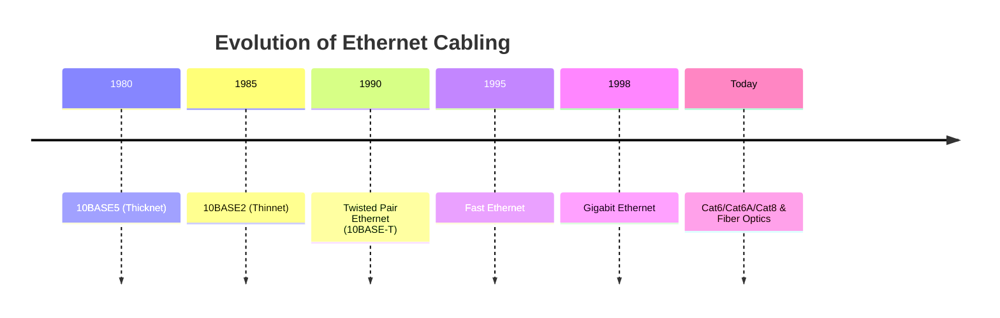

---

<!--
Image Description:
Create a timeline illustrating the evolution of Ethernet media from Thicknet (10BASE5) to Thinnet (10BASE2), followed by Twisted Pair Ethernet, Gigabit Ethernet, and modern Fiber Optics.

Suggested Search Keywords:
ethernet history timeline
10BASE5 10BASE2 evolution
ethernet media evolution
-->

<p align="center">

</p>

---

# 🌐 Modern Coaxial Cable Types

Although coaxial cables are no longer commonly used for Ethernet LANs, they remain an essential part of modern communication systems.

Today's coaxial cables are identified using **Radio Guide (RG)** numbers.

Each type is optimized for specific frequencies, distances, and applications.

---

## 📺 RG-6

RG-6 is the most widely used coaxial cable in homes and businesses today.

It offers excellent shielding and supports high-frequency communication.

### Common Uses

- Cable Television
- Broadband Internet
- DOCSIS Networks
- Satellite Television

### Features

- 75 Ω impedance
- Low signal loss
- High bandwidth
- Excellent shielding

---

## 📹 RG-59

RG-59 is thinner than RG-6 and is commonly used for shorter cable runs.

### Common Uses

- CCTV Cameras
- Analog Video Systems
- Short RF Connections

### Features

- 75 Ω impedance
- More flexible
- Higher attenuation than RG-6
- Best for short distances

---

## 🌍 RG-11

RG-11 is designed for longer transmission distances.

Because it has a larger conductor, it experiences less attenuation than RG-6.

### Common Uses

- Long outdoor cable runs
- Cable service providers
- Commercial broadband installations

### Features

- 75 Ω impedance
- Lower attenuation
- Greater transmission distance
- Less flexible

---

## 📡 Hardline Coaxial Cable

Hardline coaxial cable is a heavy-duty cable designed for high-power RF communication.

It provides extremely low signal loss.

### Common Uses

- Cellular Towers
- Radio Broadcasting
- Military Communication
- Industrial RF Systems

---

## 🔄 Flexible Coaxial Cable

Flexible coaxial cables are designed for applications where frequent movement or tight installation spaces are expected.

Examples include:

- Laboratory equipment
- Test instruments
- Portable communication systems

---

# 📊 Comparison of Common Coaxial Cables

| Cable Type | Impedance | Typical Use | Maximum Distance | Flexibility |
|------------|-----------|-------------|------------------|-------------|
| 10BASE5 (Thicknet) | 50 Ω | Early Ethernet | 500 m | Low |
| 10BASE2 (Thinnet) | 50 Ω | Early Ethernet | 185 m | Medium |
| RG-6 | 75 Ω | Cable TV, Internet | Long | Medium |
| RG-59 | 75 Ω | CCTV | Short | High |
| RG-11 | 75 Ω | Long Broadband Runs | Very Long | Low |
| Hardline | 50 Ω | RF Infrastructure | Very Long | Very Low |

---

# 🏢 Where Are These Cables Used?

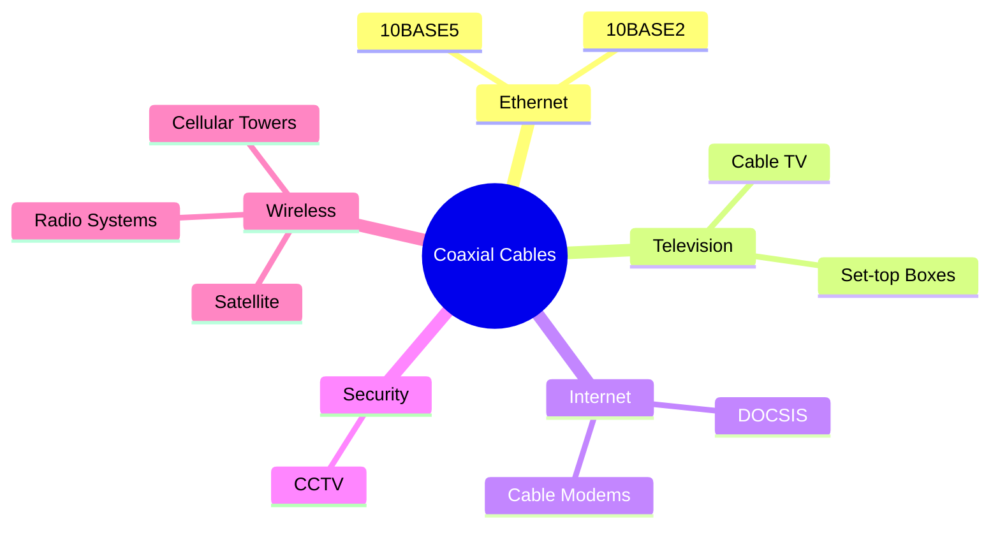

---

<!--
Image Description:
Create a mind map showing the major applications of coaxial cables, including Early Ethernet, Cable Television, Broadband Internet, CCTV, Cellular Towers, Satellite Communication, and Radio Frequency systems.

Suggested Search Keywords:
coaxial cable applications infographic
coaxial cable uses diagram
modern applications of coaxial cable
-->

<p align="center">

</p>

---

# 📝 Mini Review

You should now be able to:

- ✅ Differentiate between historical and modern coaxial cables.
- ✅ Explain the purpose of Thicknet and Thinnet Ethernet.
- ✅ Identify the common uses of RG-6, RG-59, and RG-11 cables.
- ✅ Compare different coaxial cable types based on impedance, flexibility, and application.
- ✅ Understand why coaxial Ethernet was eventually replaced by twisted-pair networking while coaxial technology continued to thrive in television, broadband, and RF communication.

In the next section, you'll explore the **connectors used with coaxial cables** and discover how these cables power real-world technologies such as cable Internet, satellite communication, CCTV systems, and radio-frequency networks.

---

---

# 🔌 Connectors and Real-World Applications

A coaxial cable cannot function on its own.

To connect devices reliably and maintain signal quality, it requires specially designed **connectors**.

Unlike twisted-pair Ethernet cables, which primarily use the **RJ-45 connector**, coaxial cables support a variety of connector types depending on the application, operating frequency, and communication standard.

Selecting the correct connector is just as important as selecting the correct cable.

A poor-quality or incompatible connector can introduce:

- Signal loss
- Increased attenuation
- Impedance mismatch
- Signal reflections
- Communication failures

For this reason, professional installations always use connectors designed specifically for the cable type and intended application.

---

# 🔩 Why Are Different Connectors Needed?

Different communication systems have different requirements.

For example:

- A home television requires a connector that is easy to install.
- A military radio requires a connector that remains secure under vibration.
- A laboratory instrument requires a connector capable of handling very high frequencies.

Because of these varying needs, multiple connector standards have been developed over the years.

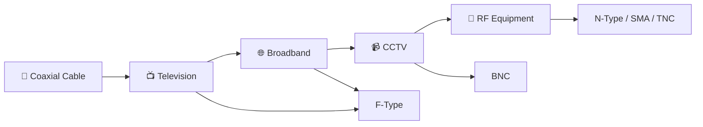

---

<!--
Image Description:
Illustrate a single coaxial cable branching into different applications including television, broadband Internet, CCTV, and radio equipment. Show each application using its respective connector type (F-Type, BNC, N-Type, SMA).

Suggested Search Keywords:
coaxial connector types
BNC F-Type SMA N-Type
coaxial cable connectors infographic
-->

<p align="center">

</p>

---

# 🔹 BNC Connector (Bayonet Neill–Concelman)

The **BNC connector** is one of the most recognizable coaxial connectors.

It uses a **bayonet locking mechanism**, allowing it to be connected or disconnected with a simple quarter-turn twist.

This design provides a secure connection while remaining quick to install.

### Common Applications

- CCTV Cameras
- Oscilloscopes
- Laboratory Equipment
- Video Signal Distribution
- Legacy Ethernet (10BASE2)

### Advantages

- Quick locking mechanism
- Reliable connection
- Excellent signal quality
- Easy maintenance

---

```text
      Twist to Lock

      ↻

────────────┐
            │
        BNC Connector
            │
────────────┘
```

---

# 📺 F-Type Connector

The **F-Type connector** is the most common connector found in residential environments.

If you've ever connected a cable television box or cable modem, you've likely used an F-Type connector.

Unlike BNC connectors, F-Type connectors are threaded, allowing them to be tightened securely.

### Common Applications

- Cable Television
- DOCSIS Cable Internet
- Satellite Receivers
- Broadband Modems

### Advantages

- Low cost
- Easy installation
- Excellent high-frequency performance
- Widely available

---

# 📡 N-Type Connector

The **N-Type connector** is designed for professional radio-frequency communication.

It provides excellent weather resistance and performs well at higher frequencies than consumer-grade connectors.

### Common Applications

- Cellular Towers
- Wireless Infrastructure
- Radio Communication
- Microwave Links
- Outdoor RF Installations

### Advantages

- Weather resistant
- Durable
- Excellent RF performance
- Low signal loss

---

# 📶 SMA Connector

The **SMA (SubMiniature Version A)** connector is much smaller than BNC or N-Type connectors.

Despite its compact size, it supports very high-frequency communication.

### Common Applications

- Wi-Fi Antennas
- GPS Equipment
- RF Modules
- Wireless Devices
- Laboratory Instruments

Its small size makes it ideal for modern wireless equipment.

---

# 📻 TNC Connector

The **TNC (Threaded Neill–Concelman)** connector is similar to the BNC connector but replaces the bayonet lock with threaded coupling.

This makes it more resistant to vibration and accidental disconnection.

### Common Applications

- Military Communication
- Aviation Equipment
- Outdoor RF Systems
- Wireless Infrastructure

---

# 📊 Comparison of Common Coaxial Connectors

| Connector | Locking Mechanism | Typical Applications |
|-----------|-------------------|----------------------|
| BNC | Bayonet Twist Lock | CCTV, Test Equipment, Legacy Ethernet |
| F-Type | Threaded | Cable TV, DOCSIS, Satellite |
| N-Type | Threaded | Cellular Towers, RF Systems |
| SMA | Threaded | Wi-Fi, GPS, Wireless Modules |
| TNC | Threaded | Military, Aviation, Outdoor RF |

---

# 🌍 Real-World Applications of Coaxial Cable

Although coaxial cables are no longer the primary choice for Ethernet LANs, they continue to play a vital role in modern communication systems.

Their excellent shielding, long-distance capability, and high-frequency performance make them ideal for many specialized applications.

---

## 📺 Cable Television (CATV)

One of the most common uses of coaxial cable is **Cable Television (CATV).**

Television providers distribute hundreds of digital television channels through coaxial infrastructure.

The cable carries high-frequency RF signals from the service provider directly to homes and businesses.


---

## 🌐 Broadband Internet (DOCSIS)

Many Internet Service Providers (ISPs) use existing cable television infrastructure to deliver broadband Internet.

This technology is known as **DOCSIS (Data Over Cable Service Interface Specification).**

A cable modem converts RF signals received through the coaxial cable into Ethernet data for home routers and computers.


---

## 📹 CCTV Surveillance Systems

Many surveillance systems use coaxial cables to transmit video from cameras to recording equipment.

Although IP cameras using Ethernet are increasingly common, coaxial CCTV systems remain widely deployed.

Benefits include:

- Reliable video transmission
- Good signal quality
- Long cable runs
- Cost-effective upgrades

---

## 🛰️ Satellite Communication

Satellite television systems use coaxial cables to connect the outdoor satellite dish to the indoor satellite receiver.

The coaxial cable carries high-frequency RF signals received from satellites orbiting Earth.

---

## 📡 Radio Frequency (RF) Communication

Coaxial cables are extensively used in RF communication because they can transmit high-frequency signals with low interference.

Examples include:

- Cellular Towers
- Radio Broadcasting
- Amateur Radio
- Military Communication
- Microwave Links
- Scientific Equipment

---

# 🏢 Why Coaxial Cable Is Still Relevant

Although Ethernet networking has largely transitioned to twisted-pair and fiber-optic cabling, coaxial technology continues to be widely deployed.

Its advantages include:

- Excellent shielding against EMI.
- High-frequency signal support.
- Reliable long-distance communication.
- Durable construction.
- Proven performance in RF systems.

Rather than disappearing, coaxial cable has simply found its specialized role in modern communication infrastructure.

---

# 📋 Common Applications Summary

| Industry | Typical Use |
|----------|-------------|
| Home Entertainment | Cable Television |
| Internet Service Providers | DOCSIS Broadband |
| Security | CCTV Systems |
| Telecommunications | Cellular Infrastructure |
| Aerospace | Satellite Communication |
| Broadcasting | Radio and Television |
| Scientific Research | RF Test Equipment |

---

# 📝 Mini Review

You should now be able to:

- ✅ Identify the most common coaxial connector types.
- ✅ Explain where BNC, F-Type, N-Type, SMA, and TNC connectors are used.
- ✅ Understand why different communication systems require different connectors.
- ✅ Describe how coaxial cables support cable television, broadband Internet, CCTV, satellite communication, and RF systems.
- ✅ Recognize why coaxial technology remains an important part of modern communication infrastructure.

In the next and final technical section, you'll examine **Coaxial Cables from a Cybersecurity Perspective**, where you'll learn about physical tapping, signal leakage, cable security, defense in depth, and best practices for protecting coaxial communication systems.

---

---

# 🔐 Coaxial Cables from a Cybersecurity Perspective

So far, you've explored how coaxial cables are constructed, how they transmit electrical signals, the different types available, and where they are used in modern communication systems.

From a networking perspective, a coaxial cable is simply another transmission medium.

From a cybersecurity perspective, however, it is much more than that.

> **Every communication cable represents a potential attack surface.**

Whether it carries television broadcasts, broadband Internet traffic, surveillance video, or radio-frequency communication, compromising the physical cable can affect the confidentiality, integrity, and availability of the data being transmitted.

For this reason, cybersecurity professionals must understand not only how communication systems operate, but also how they can be attacked and protected.

---

# 🛡️ Physical Security Comes First

No firewall, intrusion detection system (IDS), intrusion prevention system (IPS), or encryption protocol can protect a cable that has already been physically compromised.

This reinforces one of the most important principles in cybersecurity:

> **Cybersecurity begins with physical security.**

If an attacker gains physical access to communication infrastructure, they may attempt to:

- Intercept network traffic.
- Disconnect communication services.
- Damage equipment.
- Install unauthorized devices.
- Disrupt critical operations.

Protecting communication cables is therefore just as important as securing servers and software.

---

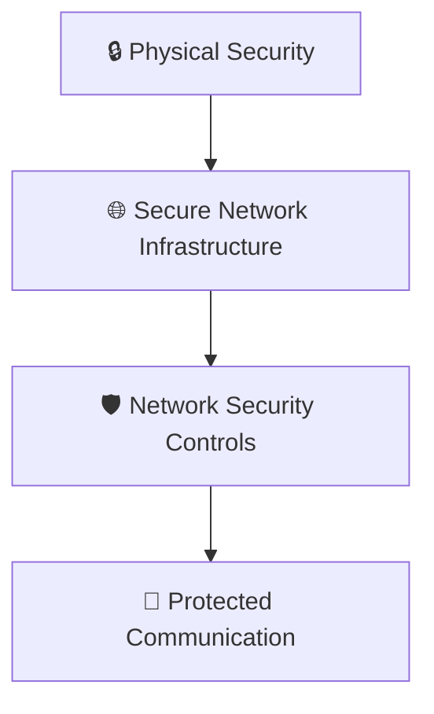

---

<!--
Image Description:
Illustrate a layered security model where physical security protects coaxial cables, which in turn support higher network security layers such as firewalls, IDS, IPS, and encryption.

Suggested Search Keywords:
physical security network infrastructure
defense in depth physical layer
network security layers infographic
-->

<p align="center">

</p>

---

# 🎯 Threat 1: Cable Tapping

One of the oldest attacks against communication systems is **cable tapping**.

Cable tapping involves connecting an unauthorized device to a communication cable in an attempt to intercept transmitted signals.

Historically, coaxial cables carrying television broadcasts, radio-frequency communication, or broadband Internet have all been targets of unauthorized tapping.

Depending on the communication system, attackers may attempt to:

- Capture transmitted data.
- Monitor communication.
- Access paid television services.
- Analyze radio-frequency signals.

---

```text
Provider

    │

    ▼

═══════════════════════

📡 Coaxial Cable

═══════════════════════

        │

        ▼

⚠️ Unauthorized Tap

        │

        ▼

🕵️ Attacker
```

---

> ⚠️ **Security Tip**
>
> Communication infrastructure should be inspected regularly for unauthorized splitters, taps, or unexpected cable modifications.

---

# 🎯 Threat 2: Signal Leakage

Although coaxial cables provide excellent shielding, they are **not completely immune** to signal leakage.

Poor-quality cables, damaged shielding, or improperly installed connectors can allow electromagnetic signals to escape.

Attackers equipped with specialized equipment may attempt to analyze these leaked signals.

This is one reason why professional installations emphasize:

- High-quality cables.
- Proper shielding.
- Correct connector installation.
- Routine maintenance.

---


---

# 🎯 Threat 3: Service Disruption

Unlike wireless communication, physical cables can be intentionally damaged.

Attackers may attempt to:

- Cut communication cables.
- Disconnect connectors.
- Damage outdoor infrastructure.
- Remove amplifiers or splitters.

These attacks primarily affect the **availability** of communication services.

For example:

- Loss of Internet connectivity.
- Television service interruption.
- CCTV camera failures.
- Communication outages.

---

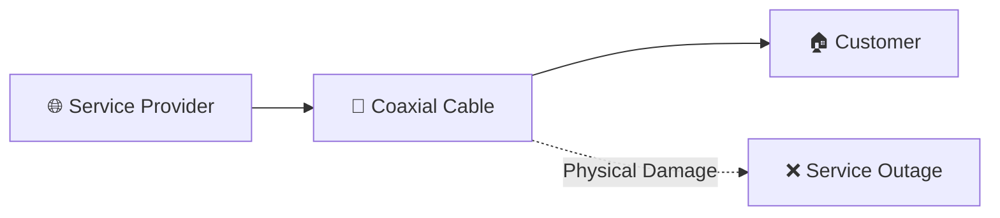

---

# 🎯 Threat 4: Unauthorized Splitters

Coaxial networks often use **signal splitters** to distribute communication to multiple devices.

While splitters are legitimate networking components, unauthorized splitters may introduce several problems.

Examples include:

- Signal degradation.
- Reduced bandwidth.
- Unauthorized service access.
- Increased troubleshooting complexity.

Organizations should ensure that every installed splitter is documented and approved.

---

# 🔒 Encryption Still Matters

Modern broadband Internet connections delivered through coaxial infrastructure typically use encrypted communication protocols.

Examples include:

- HTTPS
- TLS
- VPNs
- SSH

Even if an attacker were somehow able to intercept communication, encryption prevents them from understanding the transmitted information without the appropriate cryptographic keys.

This demonstrates an important cybersecurity principle:

> **Encryption protects data even if the transmission medium is compromised.**

---

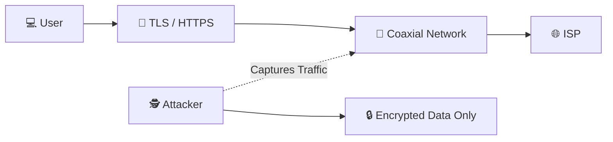

---

# 🧱 Defense in Depth

No organization relies on a single security control.

Instead, multiple defensive layers work together.

```text
👤 Users

      │

      ▼

🔒 Physical Security

      │

      ▼

📡 Protected Coaxial Infrastructure

      │

      ▼

🔥 Firewall

      │

      ▼

🚨 IDS / 🛡️ IPS

      │

      ▼

🔐 Encryption

      │

      ▼

🖥️ Secure Services
```

If one layer fails, the remaining layers continue protecting the organization.

This layered approach is known as **Defense in Depth**, one of the core principles of modern cybersecurity.

---

# 🏢 Best Practices

Organizations should follow these best practices when deploying and maintaining coaxial communication systems:

- Secure outdoor communication infrastructure.
- Lock communication cabinets and equipment rooms.
- Inspect cables for physical damage.
- Use high-quality connectors.
- Replace damaged shielding immediately.
- Document all splitters and cable routes.
- Encrypt sensitive communication.
- Perform routine infrastructure audits.

---

# 📊 Common Threats and Defenses

| Threat | Potential Impact | Recommended Protection |
|---------|------------------|------------------------|
| Cable Tapping | Information Disclosure | Physical security, encryption |
| Signal Leakage | RF interception | High-quality shielding, proper installation |
| Cable Damage | Service outage | Protected cable routes, inspections |
| Unauthorized Splitters | Signal degradation, unauthorized access | Regular audits and documentation |
| Equipment Theft | Loss of communication | Secure communication rooms and cabinets |

---

# 🚫 Common Beginner Mistakes

❌ Assuming coaxial communication cannot be intercepted.

❌ Ignoring physical security.

❌ Using low-quality connectors.

❌ Leaving outdoor cables exposed without protection.

❌ Believing shielding eliminates every security risk.

❌ Forgetting that encryption remains essential regardless of the transmission medium.

---

# 💡 Did You Know?

> Many Internet Service Providers continuously monitor the health of their coaxial infrastructure.
>
> Unexpected signal loss, excessive attenuation, or unusual noise levels can indicate damaged cables, faulty equipment, or even unauthorized modifications.

---

# 📝 60-Second Review

- ✅ Coaxial cables use metallic shielding to reduce EMI and RFI.
- ✅ They remain widely used for broadband Internet, television, CCTV, and RF communication.
- ✅ Different connector types serve different industries and communication standards.
- ✅ Physical attacks such as cable tapping and cable damage remain important security concerns.
- ✅ Encryption protects data even when the communication medium is compromised.
- ✅ Defense in Depth combines physical security, network security, and cryptographic protection.

---

# 🎯 Key Takeaways

- Coaxial cables are designed for reliable, high-frequency communication.
- Excellent shielding makes them ideal for RF and broadband applications.
- Modern Ethernet has largely replaced coaxial cable in LANs, but coaxial technology remains essential in many communication systems.
- Cybersecurity professionals must protect both the logical network and the physical infrastructure that carries communication.
- Strong physical security and encryption together provide the best protection for coaxial communication systems.

---

# 🧠 Knowledge Check

1. Why were coaxial cables developed instead of using ordinary copper wire?
2. What are the four primary layers of a coaxial cable?
3. What is the purpose of the metallic shield?
4. What is the difference between 50 Ω and 75 Ω coaxial cables?
5. Which connector is commonly used for cable television?
6. Why did Ethernet transition from coaxial cable to twisted-pair Ethernet?
7. What is cable tapping, and why is it a security concern?
8. How does encryption protect data transmitted through coaxial infrastructure?

---

# 📚 Further Reading

- **[Copper Cables.md](01-Copper%20Cables.md)** – Review twisted-pair Ethernet and compare it with coaxial communication.
- **[Fiber Optics.md](03-Fiber%20Optics.md)** – Learn how light replaces electrical signals for high-speed communication.
- **[Switch.md](../02-Network%20Devices/Switch.md)** – Understand how Ethernet switches replaced shared coaxial LANs.
- **[OSI Model.md](../01-Network%20Models/OSI%20Model.md)** – Explore how coaxial cables operate at the Physical Layer of the OSI model.

---
---

# 📝 Chapter Summary

Throughout this chapter, we explored **Coaxial Cable**, one of the oldest and most reliable guided transmission media used in networking and communication systems.

We learned that a coaxial cable is specially designed with multiple protective layers that allow electrical signals to travel with much less interference than ordinary copper wires.

The major points covered include:

- Understanding what a coaxial cable is
- Learning its internal structure
- Purpose of each cable layer
- How electromagnetic shielding works
- Types of coaxial cables
- Common connectors
- Advantages and disadvantages
- Real-world applications
- Comparison with twisted pair and fiber optic cables

Although Ethernet networks have largely moved to twisted pair and fiber optics, coaxial cables remain extremely important in television broadcasting, cable internet, CCTV systems, and RF communication.

Understanding coaxial cables also provides an excellent foundation for understanding signal transmission and electromagnetic shielding.

---

# 📌 Key Takeaways

> Remember these important points before moving to the next lesson.

- ✅ Coaxial cable is a **guided transmission medium**.
- ✅ It carries data using **electrical signals**.
- ✅ The center conductor carries the signal.
- ✅ The dielectric insulator separates the conductor from the shield.
- ✅ The metallic shield protects against EMI and crosstalk.
- ✅ The outer jacket provides physical protection.
- ✅ Better shielding means lower signal loss.
- ✅ Can support higher bandwidth than traditional copper wire.
- ✅ Frequently used for:
  - Cable TV
  - Cable Internet
  - CCTV Cameras
  - Radio Frequency systems
  - Satellite Communication
- ✅ Less common in modern LAN Ethernet because twisted pair is cheaper and easier to install.

---

# 🧠 Quick Revision

| Feature | Coaxial Cable |
|----------|---------------|
| Transmission Medium | Guided |
| Signal Type | Electrical |
| EMI Resistance | High |
| Cost | Medium |
| Installation | Moderate |
| Flexibility | Moderate |
| Bandwidth | High |
| Typical Distance | Hundreds of meters |
| Common Uses | TV, CCTV, Cable Internet |

---

# 🎯 Interview Questions

### Q1. What is a coaxial cable?

**Answer:**

A coaxial cable is a guided transmission medium consisting of a central conductor, dielectric insulation, metallic shield, and outer jacket. It is designed to carry electrical signals while minimizing electromagnetic interference.

---

### Q2. Why is it called "coaxial"?

**Answer:**

Because the center conductor and the outer metallic shield share the same central axis.

---

### Q3. What is the purpose of the metallic shield?

**Answer:**

It blocks external electromagnetic interference (EMI) and prevents signal leakage.

---

### Q4. Which connector is commonly used with coaxial cable?

**Answer:**

BNC connector for networking and CCTV, and F-Type connector for cable television and cable internet.

---

### Q5. Why isn't coaxial cable commonly used in modern Ethernet LANs?

**Answer:**

Because twisted pair cables are cheaper, easier to install, easier to maintain, and support higher network speeds with modern Ethernet standards.

---

# 📚 Practice Questions

Try answering these without looking back.

1. Draw the structure of a coaxial cable.
2. Explain the function of every layer.
3. Why is shielding important?
4. Differentiate between RG-59 and RG-6.
5. What is impedance?
6. Compare coaxial cable with twisted pair.
7. Compare coaxial cable with fiber optic cable.
8. Name three real-world applications.
9. Why is BNC used?
10. Why does cable television still use coaxial cable?

---

# ⚠️ Common Beginner Mistakes

### ❌ Mistake 1

Thinking the metallic shield carries the signal.

✅ Reality:

Only the **center conductor** carries the primary signal.

---

### ❌ Mistake 2

Believing all coaxial cables are identical.

✅ Reality:

Different coaxial cables have different impedance, shielding quality, and intended applications.

---

### ❌ Mistake 3

Assuming coaxial cable has no signal loss.

✅ Reality:

Every cable experiences attenuation. Longer cables lose more signal.

---

### ❌ Mistake 4

Confusing coaxial cable with twisted pair cable.

✅ Reality:

Twisted pair uses two twisted conductors.

Coaxial uses one center conductor surrounded by shielding.

---

### ❌ Mistake 5

Thinking coaxial cable is obsolete.

✅ Reality:

While uncommon in modern Ethernet LANs, coaxial cable is still widely used in cable TV, cable internet, CCTV, satellite systems, and RF communication.

---
# 📖 Module Progress

The **Network Media** chapter is designed to build your understanding of the physical technologies that carry network data.

So far, you have completed:

| Status | Lesson | What You Learned |
|---------|--------|------------------|
| ✅ | **README.md** | Overview of network transmission media and learning objectives |
| ✅ | **Copper Cables.md** | Electrical signaling, twisted-pair technology, Ethernet categories, RJ-45 connectors, installation best practices, and cybersecurity considerations |
| ✅ | **Coaxial Cable.md** | Cable structure, shielding, impedance, connectors, applications, advantages, disadvantages, and real-world networking uses |
| ⏭️ | **Fiber Optic Cable.md** | Learn how light transmits data at extremely high speeds over long distances |
| ⏳ | **Connectors.md** | Explore common network connectors and how they interface with networking devices |
| ⏳ | **Ethernet Standards.md** | Understand Ethernet speeds, IEEE standards, and modern LAN technologies |
| ⏳ | **Wireless Standards.md** | Learn how Wi-Fi standards evolved and how wireless communication works |

---

> 💡 **Learning Milestone**
>
> You now understand two of the most important wired transmission media in networking:
>
> - **Twisted-Pair Copper Cable**, the standard for modern Ethernet LANs.
> - **Coaxial Cable**, the shielded medium that revolutionized television, broadband Internet, and RF communications.
>
> The next lesson introduces the fastest and most advanced transmission medium used in today's networking infrastructure: **Fiber Optic Cable**.

---

# 🚀 Continue Your Journey

Congratulations! 🎉

You have successfully completed the **Coaxial Cable** lesson.

You now understand:

- ✅ The structure of a coaxial cable.
- ✅ How shielding protects electrical signals from interference.
- ✅ The purpose of each internal layer.
- ✅ Common coaxial cable types.
- ✅ BNC, F-Type, and N-Type connectors.
- ✅ Real-world networking applications.
- ✅ Advantages and disadvantages.
- ✅ How coaxial compares with twisted-pair cabling.
- ✅ Why coaxial cable is still widely used despite modern Ethernet.

These concepts strengthen your understanding of guided transmission media and prepare you for the next major leap in networking technology.

---

# 🔄 Why Learn About Fiber Optic Cables Next?

Both **Twisted-Pair** and **Coaxial** cables transmit data using **electrical signals**.

However, electrical transmission has limitations:

- Signal attenuation
- Electromagnetic interference (EMI)
- Crosstalk
- Limited bandwidth
- Shorter transmission distances

To overcome these challenges, modern networks increasingly rely on **Fiber Optic Cables**, which transmit information using **light instead of electricity**.

Fiber optics provide:

- ⚡ Extremely high bandwidth
- 🚀 Multi-gigabit and terabit speeds
- 📏 Long-distance communication
- 🛡️ Immunity to electromagnetic interference
- 🔒 Improved resistance to signal interception
- 🌍 The backbone of the modern Internet

Understanding fiber optics will help you appreciate why today's data centers, ISPs, cloud providers, and enterprise networks depend on optical communication.

---

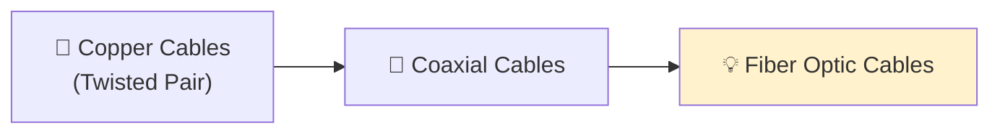

---

# 🎯 What You'll Learn Next

In the next lesson, you'll explore:

- How light carries data through optical fibers.
- The structure of a fiber optic cable.
- Total Internal Reflection (TIR).
- Single-mode vs Multi-mode fiber.
- Optical connectors.
- Fiber optic transmission standards.
- Advantages and disadvantages.
- Real-world deployments.
- Cybersecurity considerations.
- Comparisons with copper and coaxial cables.

By the end of the lesson, you'll understand why fiber optics have become the foundation of modern high-speed communication networks.

---

<!--
Image Description:
Create an educational comparison illustration showing Twisted Pair Cable, Coaxial Cable, and Fiber Optic Cable. Highlight the Fiber Optic Cable as the next lesson. Include icons representing high-speed Internet, cloud computing, data centers, and global communication.

Suggested Search Keywords:
fiber optic networking infographic
twisted pair vs coaxial vs fiber
fiber optic cable illustration
modern network transmission media
-->

<p align="center">

</p>

---

# 📚 Continue to the Next Lesson

The evolution of networking continues with **Fiber Optic Cable**, the technology that transformed global communications.

Unlike copper-based media, fiber optics transmit data using pulses of light, enabling incredible speeds, massive bandwidth, and long-distance communication with minimal signal loss.

Mastering fiber optics will prepare you to understand modern enterprise networks, cloud infrastructure, Internet Service Providers (ISPs), submarine communication cables, and the future of networking.

## ➜ Continue to the next lesson:

# **[💡 Fiber Optic Cable.md](03-Fiber%20Optic%20Cable.md)** →

---