# 🔗 Network Connectors

> *Network connectors are physical interfaces that terminate network cables, allowing them to securely connect to networking devices and transmit data reliably.*

---

<div align="center">


<br>


</div>

---

# 🎯 Learning Objectives

By the end of this lesson, you will be able to:

- Explain what a network connector is and why it is essential.
- Differentiate between connectors and ports.
- Identify the most common connectors used with copper, coaxial, and fiber optic cables.
- Understand where different connector types are used in real-world networks.
- Compare connector designs and locking mechanisms.
- Apply basic installation and maintenance best practices.
- Recognize physical security risks related to network connectors.

---

# 📚 Prerequisites

Before starting this lesson, you should already understand:

- ✅ Copper Cables
- ✅ Coaxial Cables
- ✅ Fiber Optic Cables

---

# 📑 Table of Contents

1. Introduction to Network Connectors
2. Connectors for Copper Cables
3. Connectors for Coaxial Cables
4. Connectors for Fiber Optic Cables
5. Connector Comparison
6. Common Networking Ports
7. Installation & Best Practices
8. Cybersecurity Perspective
9. Chapter Summary

---

# 📖 Introduction to Network Connectors

In the previous lessons, we explored the **three primary guided transmission media** used in modern computer networking:

- 🔌 Copper Cables
- 📡 Coaxial Cables
- 💡 Fiber Optic Cables

Each of these transmission media is responsible for carrying data between networking devices. However, a cable by itself cannot communicate with a computer, switch, router, or any other network device.

To establish a reliable physical connection, every cable requires a specially designed interface at its end.

That interface is known as a **network connector**.

Network connectors act as the bridge between a transmission medium and a networking device. They ensure that electrical signals or pulses of light are transferred accurately while providing a secure and standardized physical connection.

Without connectors, even the highest-quality network cable would be unable to communicate with other devices.

---

# 🤔 What Is a Network Connector?

A **network connector** is a hardware component attached to the end of a network cable that allows it to connect to a compatible port on a networking device.

Its primary responsibilities are to:

- Establish a secure physical connection.
- Carry electrical or optical signals between devices.
- Ensure reliable data transmission.
- Allow cables to be connected and disconnected safely.

Because different transmission media carry signals differently, each cable type requires its own connector design.

For example:

| Cable Type | Common Connectors |
|------------|-------------------|
| 🔌 Copper (Twisted Pair) | RJ-45, RJ-11 |
| 📡 Coaxial | BNC, F-Type, N-Type |
| 💡 Fiber Optic | LC, SC, ST, FC |

Each connector is specifically engineered for the cable and networking technology it supports.

---


---

# 🎯 Why Are Network Connectors Important?

It may seem like a connector simply plugs a cable into a device, but its role is much more significant.

A properly designed connector ensures that:

- Electrical or optical signals are transferred accurately.
- Signal loss is minimized.
- The cable remains securely attached.
- Devices can communicate without interruption.
- Installation and maintenance are simple and standardized.

A damaged, dirty, or poorly installed connector can cause:

- Packet loss
- Slow network performance
- Frequent disconnections
- Increased error rates
- Complete communication failure

For this reason, network engineers inspect connectors just as carefully as they inspect cables.

---

# 🔄 Connector vs Port

One of the most common beginner mistakes is confusing a **connector** with a **port**.

Although they work together, they are different components.

## 🔗 Connector

A **connector** is attached to the **end of a cable**.

Its purpose is to plug into a compatible port and carry data between devices.

Examples include:

- RJ-45
- LC
- SC
- BNC
- F-Type

---

## 🖧 Port

A **port** is the socket or interface built into a networking device that accepts a connector.

Ports are commonly found on:

- Computers
- Switches
- Routers
- Firewalls
- Access Points
- Servers
- Patch Panels

Simply put:

> **The connector is attached to the cable. The port is attached to the device.**

---


---

# 👨‍🔧 Male and Female Connectors

Many networking connectors are described as **male** or **female**.

This terminology refers to how two components physically connect.

### ♂️ Male Connector

A male connector has protruding contacts or a plug that is inserted into another component.

Example:

- RJ-45 plug attached to an Ethernet cable.

---

### ♀️ Female Connector

A female connector contains the socket or receptacle that accepts the male connector.

Examples include:

- Ethernet port on a switch.
- Wall-mounted keystone jack.
- Fiber optic adapter.

---


---

# 🌍 Why Do Different Connectors Exist?

If all networks transmit data, why don't all cables use the same connector?

The answer lies in the unique characteristics of each transmission medium.

Different cable types have different requirements for:

- Signal transmission
- Electrical contacts
- Optical alignment
- Shielding
- Frequency
- Bandwidth
- Installation environment

For example:

- **Copper cables** require multiple electrical contacts to carry electrical signals.
- **Coaxial cables** require connectors that preserve impedance and maintain shielding for radio-frequency communication.
- **Fiber optic cables** require highly precise alignment so pulses of light pass efficiently from one fiber to another.

Because these requirements are fundamentally different, no single connector can support every networking technology.

---

# 📚 What You'll Learn in This Chapter

In this lesson, you'll explore the connectors commonly used with each transmission medium.

You'll learn:

- 🔌 Copper cable connectors
- 📡 Coaxial cable connectors
- 💡 Fiber optic connectors
- The difference between connectors and ports
- Common networking interfaces
- Connector comparison
- Installation best practices
- Cybersecurity considerations

By the end of this chapter, you'll be able to identify the most common networking connectors, understand where they are used, and choose the appropriate connector for different networking scenarios.

---

> **🎯 Key Takeaway**
>
> **Network connectors provide the physical interface between transmission media and networking devices. While cables carry the signals, connectors ensure those signals are transferred securely, reliably, and according to standardized networking specifications. Understanding connectors is essential for building, maintaining, and troubleshooting modern computer networks.**

---

# 🔌 Connectors for Copper Cables

Copper cables are the most widely used transmission medium in Local Area Networks (LANs).

However, a copper cable cannot simply be inserted into a computer or switch by itself. The electrical wires inside the cable must terminate in a connector that aligns each wire with the correct contact inside the networking device.

Over the years, several connector types have been developed for copper cabling. Some are used for Ethernet networking, while others are designed for telephone systems or structured cabling installations.

In this section, we'll explore the most common copper cable connectors and understand where each one is used.

---

# 🔌 RJ-45 Connector

The **RJ-45 (Registered Jack 45)** connector is the most common connector used in modern Ethernet networks.

It terminates **twisted-pair copper cables**, such as Cat5e, Cat6, Cat6a, Cat7, and Cat8, allowing them to connect to devices like computers, switches, routers, access points, printers, and IP phones.

The RJ-45 connector has **8 positions and 8 electrical contacts**, often referred to as an **8P8C connector**.

Each contact aligns with one conductor inside the Ethernet cable, ensuring data is transmitted correctly.

---

> 💡 **Did You Know?**
>
> Although people commonly call it an **RJ-45 connector**, the connector used for Ethernet is technically an **8P8C (8 Position, 8 Contact)** modular connector. The name **RJ-45** has become the industry-standard term, even though it originally referred to a specific telephone wiring standard.

---

## 🧩 Structure of an RJ-45 Connector

An RJ-45 connector consists of several important parts:

- Plastic housing
- Eight metal contacts (pins)
- Locking tab (clip)
- Cable strain relief

The locking tab secures the connector inside the Ethernet port, preventing accidental disconnection during normal operation.

---

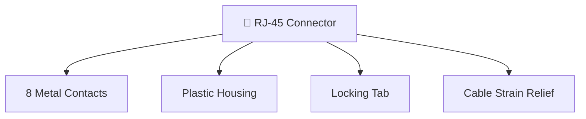

---

## 🌍 Common Uses of RJ-45

RJ-45 connectors are found almost everywhere Ethernet networking is used.

Common applications include:

- 💻 Desktop computers
- 🖥️ Servers
- 🖧 Network switches
- 🌐 Routers
- 📡 Wireless access points
- 📹 IP cameras
- ☎️ VoIP phones
- 🖨️ Network printers

If you've ever plugged an Ethernet cable into a device, you've almost certainly used an RJ-45 connector.

---

## ✅ Advantages

- Widely available
- Easy to install
- Inexpensive
- Reliable locking mechanism
- Standardized worldwide
- Supports modern high-speed Ethernet

---

## ❌ Limitations

- Designed specifically for twisted-pair copper cables
- Plastic locking tab can break with repeated use
- Sensitive to improper cable termination
- Limited to relatively short Ethernet cable runs (typically up to 100 meters)

---

# ☎️ RJ-11 Connector

The **RJ-11** connector is primarily used in **telephone systems** rather than computer networking.

It is smaller than an RJ-45 connector and typically supports fewer conductors.

Historically, RJ-11 connectors were widely used to connect:

- Landline telephones
- Fax machines
- DSL Internet modems

Although modern broadband networks increasingly use fiber optics, RJ-11 connectors are still found in many homes and offices.

---

> 💡 **Did You Know?**
>
> Many people accidentally confuse **RJ-11** and **RJ-45** because they look similar. However, an RJ-11 plug is **smaller** and is designed for telephone wiring, while an RJ-45 connector is larger and designed for Ethernet networking.

---

## 📊 RJ-45 vs RJ-11

| Feature | RJ-45 | RJ-11 |
|----------|--------|--------|
| Primary Use | Ethernet Networking | Telephone Systems |
| Typical Contacts | 8 | 2–6 |
| Size | Larger | Smaller |
| Common Cable | Cat5e/Cat6/Cat6a | Telephone Cable |
| Data Networks | Yes | Rare |

---

# 🧱 Keystone Jack

A **Keystone Jack** is a female connector commonly installed in:

- Wall outlets
- Patch panels
- Surface-mounted boxes

Unlike an RJ-45 plug, which is attached to a cable, a keystone jack provides a permanent connection point within a structured cabling system.

Network cables are terminated on the back of the keystone jack using a **punch-down tool**, while the front accepts a standard RJ-45 connector.

---


---

## Why Use Keystone Jacks?

Instead of running long cables directly to every device, buildings typically install permanent structured cabling inside walls.

Keystone jacks provide:

- Easy cable management
- Professional installations
- Simple maintenance
- Easy replacement of damaged patch cables
- Cleaner network infrastructure

---

# 🗂️ Patch Panel

A **Patch Panel** is a centralized termination point for multiple network cables.

Rather than connecting every cable directly to a switch, permanent building cables terminate at the patch panel.

Short **patch cables** are then used to connect the patch panel to network switches.

This design improves:

- Cable organization
- Troubleshooting
- Maintenance
- Network expansion

Large enterprise networks may contain hundreds or even thousands of patch panel connections.

---


---

> 💡 **Certification Tip**
>
> For the **CompTIA Network+** and **CCNA** exams, remember the difference:
>
> - **RJ-45** → Male connector attached to an Ethernet cable.
> - **Keystone Jack** → Female wall outlet or patch panel connector.
> - **Patch Panel** → Centralized cable management and termination point.

---

# 📋 Summary of Copper Connectors

| Connector | Type | Primary Use |
|-----------|------|-------------|
| 🔌 RJ-45 | Male Plug | Ethernet Networking |
| ☎️ RJ-11 | Male Plug | Telephone Systems |
| 🧱 Keystone Jack | Female Jack | Wall Outlets & Structured Cabling |
| 🗂️ Patch Panel | Distribution Hardware | Cable Organization & Management |

---

> **🎯 Key Takeaway**
>
> Copper networking relies on standardized connectors to provide reliable electrical connections between cables and networking devices. While the **RJ-45 connector** is the foundation of modern Ethernet networking, **keystone jacks** and **patch panels** enable structured cabling systems that are easier to manage, maintain, and expand.

# 📡 Connectors for Coaxial Cables

In the previous lesson on **Coaxial Cables**, you learned that coaxial cables are designed to carry **high-frequency electrical signals** while protecting them from external electromagnetic interference (EMI).

To preserve signal quality, coaxial cables require specialized connectors that maintain the cable's shielding and characteristic impedance.

Unlike twisted-pair Ethernet cables, which commonly use a single connector type (RJ-45), coaxial cables use several different connectors depending on the application.

Some connectors are designed for television systems, while others are used in radio communication, surveillance systems, laboratories, and wireless networking.

Let's explore the most common coaxial cable connectors.

---

# 🔗 BNC Connector

The **BNC (Bayonet Neill–Concelman)** connector is one of the most recognizable coaxial cable connectors.

It was originally developed for radio-frequency (RF) applications and later became widely used in early computer networking, test equipment, and video systems.

Instead of simply pushing into a port, a BNC connector uses a **bayonet locking mechanism**.

To secure the connection, the connector is inserted and then rotated approximately one-quarter turn until it locks into place.

This locking mechanism prevents accidental disconnection and provides a secure, reliable connection.

---

> 💡 **Did You Know?**
>
> The name **BNC** comes from its inventors, **Paul Neill** and **Carl Concelman**, while the letter **"B"** stands for the connector's **Bayonet locking mechanism**.

---

## 🏗️ Structure of a BNC Connector

A typical BNC connector consists of:

- Center pin (signal conductor)
- Outer metal shield
- Bayonet locking ring
- Connector housing

The outer shield connects to the cable's braided shield, helping preserve signal integrity and reduce interference.

---

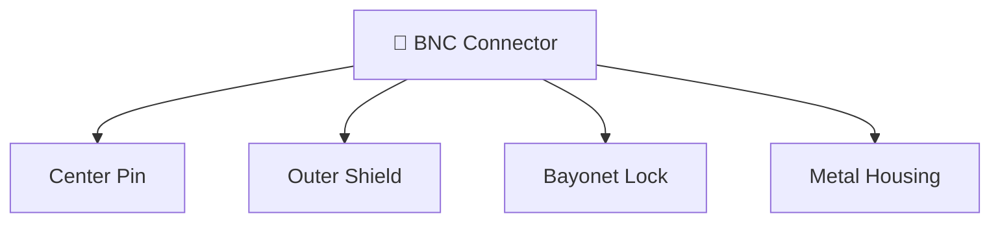

---

## 🌍 Common Uses

BNC connectors are commonly found in:

- 📹 CCTV surveillance systems
- 📡 Radio-frequency equipment
- 📺 Video transmission systems
- 🧪 Electronic test equipment
- 📈 Oscilloscopes
- 🖥️ Legacy Ethernet networks (10BASE2)

Although modern Ethernet no longer uses BNC connectors, they remain common in many RF and video applications.

---

## ✅ Advantages

- Secure locking mechanism
- Good shielding
- Reliable RF performance
- Easy to connect and disconnect
- Durable metal construction

---

## ❌ Limitations

- Larger than RJ-45 connectors
- Requires twisting to lock
- Mostly replaced in modern Ethernet
- Designed specifically for coaxial cables

---

# 📺 F-Type Connector

The **F-Type connector** is one of the most widely used connectors in residential and commercial television systems.

Unlike the BNC connector, it uses a **threaded screw-on mechanism**, providing a firm and stable connection.

One unique feature of the F-Type connector is that the **center conductor of the coaxial cable itself acts as the connector's center pin**, reducing manufacturing cost while maintaining good signal performance.

---

## 🌍 Common Uses

F-Type connectors are commonly used for:

- 📺 Cable television (CATV)
- 🌐 Cable Internet
- 📡 Satellite television
- 🏠 Home broadband installations
- 📦 Cable modems

If you've ever connected a television to a cable outlet at home, you've almost certainly used an F-Type connector.

---

> 💡 **Did You Know?**
>
> Nearly every cable Internet service uses **F-Type connectors** to connect the incoming coaxial cable to a cable modem before the signal is converted into Ethernet for your home network.

---

## ✅ Advantages

- Low cost
- Excellent RF performance
- Secure threaded connection
- Easy to install
- Common in residential networks

---

## ❌ Limitations

- Primarily intended for 75-ohm coaxial cable
- Not suitable for Ethernet LAN cabling
- Requires threaded installation

---

# 📡 N-Type Connector

The **N-Type connector** is a heavy-duty coaxial connector designed for professional radio-frequency communication.

Compared to BNC and F-Type connectors, it offers:

- Better weather resistance
- Higher power handling
- Improved high-frequency performance
- Greater durability

Because of these characteristics, N-Type connectors are widely used in outdoor communication systems.

---

## 🌍 Common Uses

N-Type connectors are commonly found in:

- 📡 Cellular base stations
- 📶 Wireless antennas
- 📻 Radio transmitters
- 🛰️ Satellite communication systems
- 🌐 Outdoor wireless networking

Many wireless Internet service providers (WISPs) rely on N-Type connectors to connect outdoor antennas to networking equipment.

---

# 📶 SMA Connector (Brief Overview)

The **SMA (SubMiniature Version A)** connector is a compact RF connector designed for high-frequency communication.

Although much smaller than an N-Type connector, it provides excellent electrical performance.

SMA connectors are frequently used where space is limited.

---

## 🌍 Common Uses

SMA connectors are commonly found on:

- 📡 Wi-Fi antennas
- 📶 Wireless routers
- 📻 RF modules
- 📱 GPS receivers
- 🛰️ Laboratory equipment

Many removable Wi-Fi antennas found on desktop routers use SMA connectors.

---

> 💡 **Certification Tip**
>
> For most networking certifications, remember these associations:
>
> - **BNC** → CCTV, test equipment, legacy Ethernet
> - **F-Type** → Cable TV and cable Internet
> - **N-Type** → Outdoor antennas and professional RF systems
> - **SMA** → Wi-Fi antennas and wireless devices

---

# 📊 Comparison of Coaxial Connectors

| Connector | Locking Method | Common Applications |
|------------|----------------|---------------------|
| 📡 BNC | Bayonet Twist Lock | CCTV, RF equipment, legacy Ethernet |
| 📺 F-Type | Threaded Screw | Cable TV, Cable Internet, Satellite |
| 📡 N-Type | Threaded Heavy-Duty | Outdoor antennas, Cellular, RF systems |
| 📶 SMA | Threaded Compact | Wi-Fi antennas, GPS, RF modules |

---

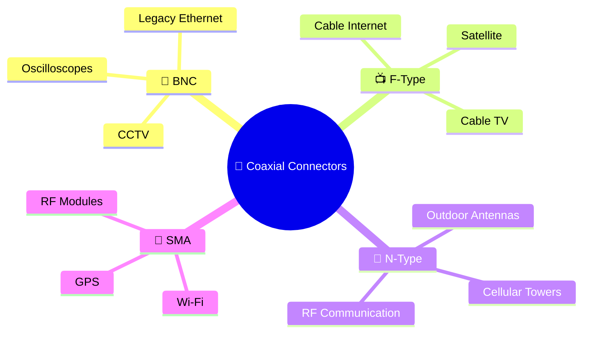

---

> **🎯 Key Takeaway**
>
> Coaxial cable connectors are specifically designed to preserve **signal integrity**, **shielding**, and **characteristic impedance** while carrying high-frequency radio signals. Different connectors are optimized for different applications, from home television systems and broadband Internet to professional radio communications and wireless networking infrastructure.

# 💡 Connectors for Fiber Optic Cables

Unlike copper and coaxial cables, which transmit **electrical signals**, fiber optic cables carry **pulses of light**.

Because light must pass from one optical fiber to another with minimal loss, fiber optic connectors are manufactured with **extremely high precision**.

Even a tiny amount of dust, a scratched connector, or poor alignment can reduce signal quality and increase attenuation.

For this reason, fiber optic connectors are designed to provide:

- Precise optical alignment
- Low insertion loss
- Minimal signal reflection
- Secure mechanical connections
- Easy installation and maintenance

Different fiber optic connectors have been developed for different networking environments, from enterprise LANs and data centers to telecommunications and Internet backbone infrastructure.

---

# 🔷 SC Connector

The **SC (Subscriber Connector)** is one of the most widely used fiber optic connectors.

It features a **square-shaped body** and uses a simple **push-pull locking mechanism**, making it quick and easy to connect or disconnect.

Because of its reliability and ease of use, SC connectors became popular in telecommunications and enterprise networking.

---

> 💡 **Did You Know?**
>
> The **SC connector** is sometimes called the **"Square Connector"** because of its rectangular design, making it easy to identify among other fiber connectors.

---

## 🌍 Common Uses

SC connectors are commonly found in:

- ☁️ Data centers
- 🏢 Enterprise networks
- 🌐 Internet Service Providers (ISPs)
- 📡 Telecommunications
- 🏠 Fiber-to-the-Home (FTTH)

---

## ✅ Advantages

- Simple push-pull design
- Easy to install
- Reliable connection
- Excellent optical performance

---

## ❌ Limitations

- Larger than modern LC connectors
- Lower port density in patch panels

---

# 🔹 LC Connector

The **LC (Lucent Connector)** is currently one of the **most popular fiber optic connectors** used in modern networking.

It is approximately **half the size of an SC connector**, allowing network engineers to install many more fiber connections within the same amount of rack space.

LC connectors use a small **latching mechanism** similar to an RJ-45 connector.

Because of their compact size, they have become the preferred connector for high-density environments.

---

## 🌍 Common Uses

LC connectors are commonly used in:

- 🖥️ Enterprise switches
- ☁️ Cloud data centers
- 🏢 Server rooms
- 🌐 High-speed Ethernet
- 🔌 SFP and SFP+ transceivers

Most modern enterprise switches with fiber ports use **LC connectors**.

---

> 💡 **Certification Tip**
>
> If you encounter an **SFP or SFP+ transceiver**, there is a very high chance it uses **LC fiber connectors**.

---

## ✅ Advantages

- Small size
- High-density installations
- Secure latch
- Excellent optical performance

---

## ❌ Limitations

- Smaller components require careful handling
- Slightly more delicate than larger connectors

---

# 🔄 ST Connector

The **ST (Straight Tip)** connector was one of the earliest fiber optic connectors used in networking.

It uses a **bayonet locking mechanism**, similar to the BNC connector used with coaxial cables.

To secure the connector, it is inserted into the port and rotated until it locks into place.

Although still found in some older installations, ST connectors have largely been replaced by SC and LC connectors.

---

## 🌍 Common Uses

ST connectors are commonly found in:

- 🏫 Older campus networks
- 🏢 Legacy enterprise networks
- 🧪 Laboratory environments
- 📚 Educational institutions

---

## Advantages

- Durable
- Secure bayonet lock
- Easy to disconnect

---

## Limitations

- Larger than LC
- Mostly replaced in modern networks

---

# ⚙️ FC Connector

The **FC (Ferrule Connector)** is designed for environments where vibration could loosen other connector types.

Instead of using a push or latch mechanism, FC connectors use a **threaded screw-on locking system**.

This design provides excellent mechanical stability and precise optical alignment.

---

## 🌍 Common Uses

FC connectors are commonly used in:

- 🧪 Scientific laboratories
- 📡 Telecommunications
- 🎯 Precision measurement systems
- 🏭 Industrial environments

---

## Advantages

- Highly secure connection
- Excellent vibration resistance
- Very accurate optical alignment

---

## Limitations

- Slower to install
- Larger than LC connectors

---

# 🚀 MPO/MTP Connector

As network speeds continue to increase, organizations require connectors capable of carrying multiple optical fibers simultaneously.

The **MPO (Multi-Fiber Push-On)** connector addresses this need.

Instead of connecting a single fiber pair, an MPO connector contains **multiple optical fibers within one connector**.

Common configurations include:

- 8 fibers
- 12 fibers
- 16 fibers
- 24 fibers
- 48 fibers

A related connector, **MTP**, is an enhanced version of the MPO connector with improved alignment and performance.

These connectors are widely used in modern data centers supporting **40G, 100G, 200G, and 400G Ethernet**.

---

> 💡 **Did You Know?**
>
> A single MPO connector can carry multiple fiber strands at once, allowing extremely high-speed network links while reducing cable clutter in data centers.

---

## 🌍 Common Uses

- ☁️ Cloud computing
- 🖥️ Large data centers
- 🌐 Internet backbone
- 🚀 High-speed Ethernet
- 📡 Telecommunications

---

# 🔄 Simplex vs Duplex Connectors

Fiber optic communication may use either **Simplex** or **Duplex** connections.

## 🔹 Simplex

A **Simplex** connection contains **one optical fiber**.

Data travels in **only one direction**.

Used for:

- Sensors
- Broadcast systems
- Specialized industrial communication

---

## 🔸 Duplex

A **Duplex** connection contains **two optical fibers**.

One fiber transmits data.

The other receives data.

Duplex communication is the standard configuration for modern Ethernet fiber networks.

---

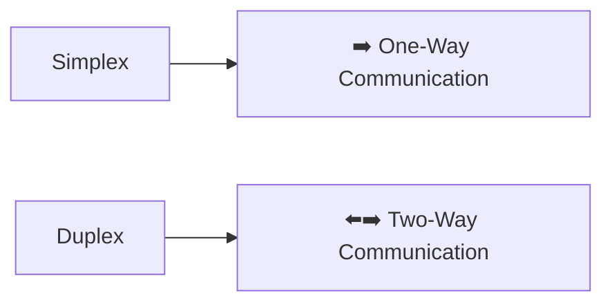

---

# ✨ UPC vs APC Connectors

Although two fiber connectors may appear identical, the **end face** of the connector can be polished differently.

The two most common polishing methods are:

### 🔵 UPC (Ultra Physical Contact)

- Flat polished surface
- Low signal loss
- Common in enterprise networking
- Blue connector body

---

### 🟢 APC (Angled Physical Contact)

- End face polished at an angle (typically **8°**)
- Reduces reflected light
- Preferred for long-distance telecommunications and FTTH
- Green connector body

---

> ⚠️ **Important**
>
> UPC and APC connectors are **not interchangeable**.
>
> Connecting them together can increase signal loss and damage network performance.

---

# 📊 Comparison of Fiber Optic Connectors

| Connector | Locking Method | Typical Use |
|------------|----------------|-------------|
| 🔷 SC | Push-Pull | Enterprise, FTTH, Telecommunications |
| 🔹 LC | Latch | Data Centers, Enterprise Switches |
| 🔄 ST | Bayonet Twist | Legacy Networks |
| ⚙️ FC | Threaded Screw | Industrial & Laboratory |
| 🚀 MPO/MTP | Push-On Multi-Fiber | High-Speed Data Centers |

---

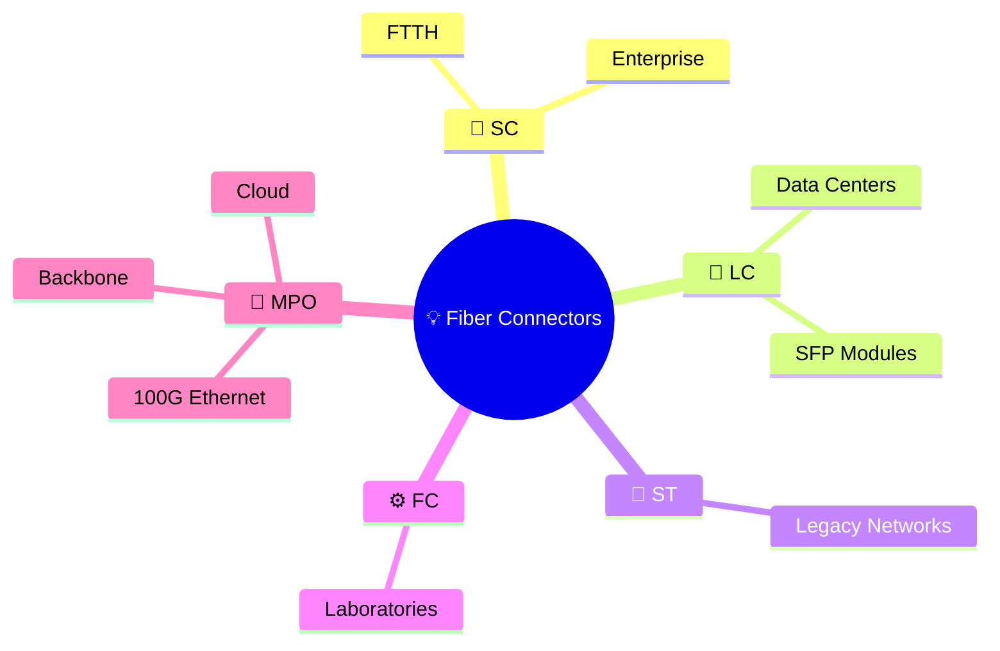

---

> **🎯 Key Takeaway**
>
> Fiber optic connectors are engineered to align optical fibers with exceptional precision, ensuring that pulses of light travel with minimal loss. Modern enterprise networks commonly use **LC connectors**, telecommunications frequently rely on **SC connectors**, and high-speed data centers increasingly deploy **MPO/MTP connectors** to support the growing demand for multi-gigabit and terabit communication.

---

# 📊 Connector Comparison

Throughout this chapter, you've explored the most common connectors used with **copper**, **coaxial**, and **fiber optic** cables.

Each connector is designed for a specific transmission medium and networking application.

Some prioritize ease of installation, while others focus on maintaining signal integrity, supporting high-frequency communication, or enabling high-speed optical networking.

Understanding these differences helps network engineers select the right connector for the right environment.

---

# 🔍 Comparison by Cable Type

| Connector | Cable Type | Signal Type | Common Applications |
|-----------|------------|-------------|---------------------|
| 🔌 RJ-45 | Twisted Pair Copper | Electrical | Ethernet LANs, Computers, Switches, Routers |
| ☎️ RJ-11 | Telephone Cable | Electrical | Telephone Systems, DSL |
| 📡 BNC | Coaxial | RF Electrical | CCTV, Test Equipment, Legacy Ethernet |
| 📺 F-Type | Coaxial | RF Electrical | Cable TV, Cable Internet, Satellite |
| 📡 N-Type | Coaxial | RF Electrical | Outdoor Antennas, Cellular Networks |
| 📶 SMA | Coaxial | RF Electrical | Wi-Fi Antennas, GPS, RF Modules |
| 💡 SC | Fiber Optic | Light | FTTH, Enterprise Networks, Telecommunications |
| 💡 LC | Fiber Optic | Light | Data Centers, Enterprise Switches, SFP Modules |
| 💡 ST | Fiber Optic | Light | Legacy Fiber Networks |
| 💡 FC | Fiber Optic | Light | Industrial Systems, Laboratories |
| 🚀 MPO/MTP | Fiber Optic | Light | High-Speed Data Centers, Cloud Infrastructure |

---

# 🔒 Comparison by Locking Mechanism

Different connectors use different methods to ensure a secure physical connection.

| Connector | Locking Method |
|-----------|----------------|
| 🔌 RJ-45 | Plastic Latching Clip |
| ☎️ RJ-11 | Plastic Latching Clip |
| 📡 BNC | Bayonet Twist Lock |
| 📺 F-Type | Threaded Screw |
| 📡 N-Type | Threaded Screw |
| 📶 SMA | Threaded Screw |
| 💡 SC | Push-Pull |
| 💡 LC | Plastic Latch |
| 💡 ST | Bayonet Twist Lock |
| 💡 FC | Threaded Screw |
| 🚀 MPO/MTP | Push-On |

---

# 🌍 Where You'll Find These Connectors

Different environments use different connector types based on performance, cost, and compatibility.

| Environment | Common Connector |
|-------------|------------------|
| 🏠 Home Ethernet | RJ-45 |
| ☎️ Telephone Line | RJ-11 |
| 📺 Cable Television | F-Type |
| 🌐 Cable Internet | F-Type |
| 📹 CCTV Systems | BNC |
| 📡 Outdoor Wireless Links | N-Type |
| 📶 Wi-Fi Antennas | SMA |
| ☁️ Cloud Data Centers | LC, MPO/MTP |
| 🏢 Enterprise Fiber Networks | LC, SC |
| 🏠 Fiber-to-the-Home (FTTH) | SC |
| 🧪 Laboratory Equipment | FC |

---

> 💡 **Did You Know?**
>
> Modern enterprise switches often include **SFP or SFP+ transceiver slots**, and these modules typically use **LC fiber connectors**. This combination allows administrators to replace transceivers without replacing the entire switch.

---

# ⚖️ Advantages and Limitations

Every connector has strengths and trade-offs depending on the networking environment.

| Connector | Advantages | Limitations |
|-----------|------------|-------------|
| RJ-45 | Inexpensive, easy to install, widely available | Limited to copper Ethernet |
| RJ-11 | Simple and low cost | Primarily for telephone systems |
| BNC | Secure locking, durable | Rare in modern Ethernet |
| F-Type | Excellent for TV and broadband | Not used for Ethernet LANs |
| N-Type | Weather-resistant, high-frequency performance | Larger and more expensive |
| SMA | Compact, excellent RF performance | Small components require careful handling |
| SC | Reliable, easy to connect | Larger size limits port density |
| LC | Compact, ideal for high-density installations | More delicate than larger connectors |
| ST | Strong mechanical connection | Mostly found in legacy networks |
| FC | Highly secure and vibration-resistant | Slower to install |
| MPO/MTP | Supports many fibers in one connector | Higher cost and more specialized installation |

---

# 🧠 Memory Trick

One way to remember these connectors is by grouping them according to the cable they support.

```text
🔌 Copper
│
├── RJ-45
└── RJ-11

📡 Coaxial
│
├── BNC
├── F-Type
├── N-Type
└── SMA

💡 Fiber
│
├── SC
├── LC
├── ST
├── FC
└── MPO/MTP
```

This simple grouping makes it much easier to identify the correct connector during troubleshooting or certification exams.

---

# 📋 Quick Revision Table

| Question | Answer |
|----------|--------|
| Which connector is used for Ethernet? | RJ-45 |
| Which connector is used for telephone lines? | RJ-11 |
| Which connector is common in CCTV systems? | BNC |
| Which connector is used for cable TV and cable Internet? | F-Type |
| Which connector is commonly used with Wi-Fi antennas? | SMA |
| Which connector is most common in enterprise fiber networks? | LC |
| Which connector is widely used for FTTH? | SC |
| Which connector supports multiple fibers in one plug? | MPO/MTP |

---

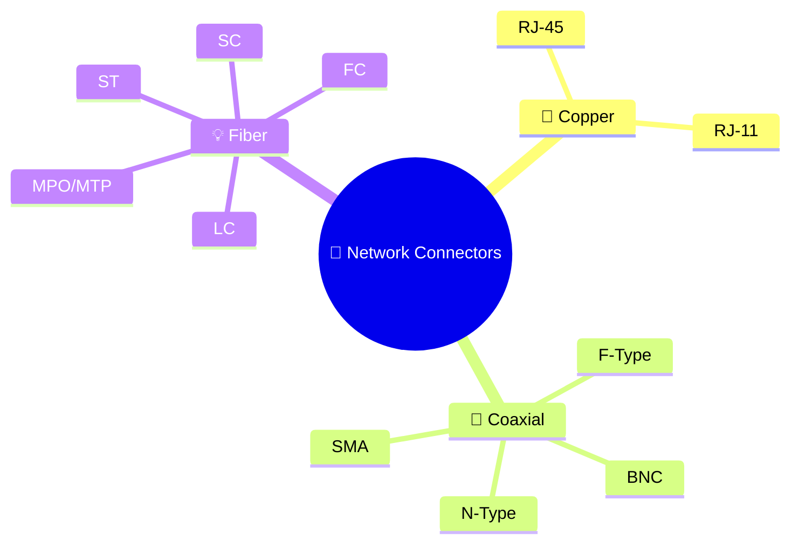

---

> **🎯 Key Takeaway**
>
> Every network connector is designed to match a specific transmission medium and application. Copper connectors focus on electrical communication, coaxial connectors preserve radio-frequency signals, and fiber optic connectors precisely align optical fibers for light transmission. Understanding these differences enables network professionals to select the correct connector, install it properly, and troubleshoot physical network connections with confidence.

---

# 🖧 Common Networking Ports

In the previous sections, you learned about the connectors attached to different network cables.

However, a connector alone cannot establish communication.

Every connector must be inserted into a compatible **network port**, which acts as the interface between the cable and the networking device.

Whether you're connecting a computer to a switch, plugging a fiber optic cable into a router, or attaching a coaxial cable to a modem, the communication always begins at a network port.

Understanding common networking ports will help you correctly identify devices, connect cables, and troubleshoot physical network connectivity issues.

---

# 🔄 Connector vs Port

Although the terms **connector** and **port** are often used interchangeably, they describe two different components.

- A **connector** is attached to the **end of a cable**.
- A **port** is built into a **networking device**.

Think of it like a **key and a lock**:

- 🔑 The connector is the **key**.
- 🔒 The port is the **lock**.

The correct connector must be matched with the correct port for communication to occur.

---


---

> 💡 **Did You Know?**
>
> A network cable is only as useful as the connector attached to it. Likewise, a networking device can only communicate if it has a compatible port for that connector.

---

# 🌐 Ethernet (RJ-45) Port

The **Ethernet port** is the most common networking port found on computers and network devices.

It is designed to accept an **RJ-45 connector** attached to a twisted-pair Ethernet cable.

Ethernet ports are found on:

- 💻 Desktop computers
- 🖥️ Servers
- 🖧 Network switches
- 🌐 Routers
- 📡 Wireless access points
- 📹 IP cameras
- 🖨️ Network printers
- ☎️ VoIP phones

Modern Ethernet ports often include small **LED indicators** that display:

- Link status
- Network activity
- Connection speed

---


---

# 💡 SFP Port

As networks grew faster and fiber optic communication became more common, fixed Ethernet ports were no longer sufficient for every networking scenario.

Manufacturers introduced the **Small Form-factor Pluggable (SFP)** port.

Unlike an RJ-45 port, an SFP port does **not** accept a cable directly.

Instead, it accepts a **transceiver module**, which determines:

- The cable type
- The transmission medium
- The supported speed
- The communication distance

After the transceiver is inserted, the appropriate fiber or copper cable connects to the transceiver.

This modular design makes network equipment far more flexible.

---

## 🌍 Common Uses

SFP ports are commonly found on:

- Enterprise switches
- Routers
- Firewalls
- Data center equipment

---

> 💡 **Did You Know?**
>
> By simply replacing the SFP transceiver, the same switch can support copper Ethernet today and fiber optic networking tomorrow—without replacing the entire device.

---

# 🚀 SFP+ Port

The **SFP+ (Enhanced Small Form-factor Pluggable)** port is an improved version of the standard SFP interface.

While SFP ports are commonly associated with **1 Gbps** networking, SFP+ ports are designed for **10 Gbps Ethernet**.

They use the same general concept:

1. Insert the appropriate transceiver.
2. Connect the compatible cable.

SFP+ is widely used in:

- Data centers
- Enterprise backbone networks
- Server-to-switch connections

---

# ⚡ QSFP and QSFP28 Ports

As networking speeds continued to increase, larger transceiver standards were developed.

The **QSFP (Quad Small Form-factor Pluggable)** family supports much higher data rates than SFP.

Common examples include:

| Interface | Typical Speed |
|------------|---------------|
| SFP | 1 Gbps |
| SFP+ | 10 Gbps |
| QSFP+ | 40 Gbps |
| QSFP28 | 100 Gbps |

These interfaces are commonly found in:

- Cloud data centers
- Internet backbone infrastructure
- High-performance computing (HPC)
- Telecommunications

---

# 🔄 What Is a Transceiver?

One concept that often confuses beginners is the **transceiver**.

A **transceiver** is a removable hardware module that both:

- **Transmits** data.
- **Receives** data.

The word **transceiver** is actually formed by combining:

> **Transmitter + Receiver = Transceiver**

It plugs into an SFP, SFP+, or QSFP port and provides the actual interface for the network cable.

Different transceivers support different media, such as:

- 🔌 Copper Ethernet
- 💡 Fiber Optic
- 📡 Long-distance fiber
- 🌐 Short-distance fiber

---


---

# 📺 Coaxial Port

A **coaxial port** is designed to accept coaxial cable connectors such as **F-Type** or **BNC**, depending on the equipment.

These ports are commonly found on:

- 📺 Televisions
- 🌐 Cable modems
- 📡 Satellite receivers
- 📹 CCTV equipment
- 📈 Test instruments

Unlike Ethernet ports, coaxial ports are specifically designed for **radio-frequency (RF) signals**.

---

# 🧩 Choosing the Correct Port

Selecting the correct port depends on several factors, including:

- Required network speed
- Transmission distance
- Cable type
- Existing infrastructure
- Budget
- Future scalability

For example:

| Requirement | Recommended Port |
|-------------|------------------|
| Standard Office LAN | RJ-45 Ethernet |
| Fiber Backbone | SFP / SFP+ |
| High-Speed Data Center | QSFP28 |
| Cable Internet | Coaxial Port |

Network engineers choose ports based on both current requirements and future expansion plans.

---

# 📊 Port Comparison

| Port | Accepts | Typical Use |
|------|----------|-------------|
| 🖧 Ethernet | RJ-45 | LAN Networking |
| 💡 SFP | SFP Transceiver | 1 Gbps Fiber/Copper |
| 🚀 SFP+ | SFP+ Transceiver | 10 Gbps Networks |
| ⚡ QSFP/QSFP28 | QSFP Transceiver | 40G / 100G Networks |
| 📺 Coaxial | BNC / F-Type | Cable TV, Broadband, CCTV |

---

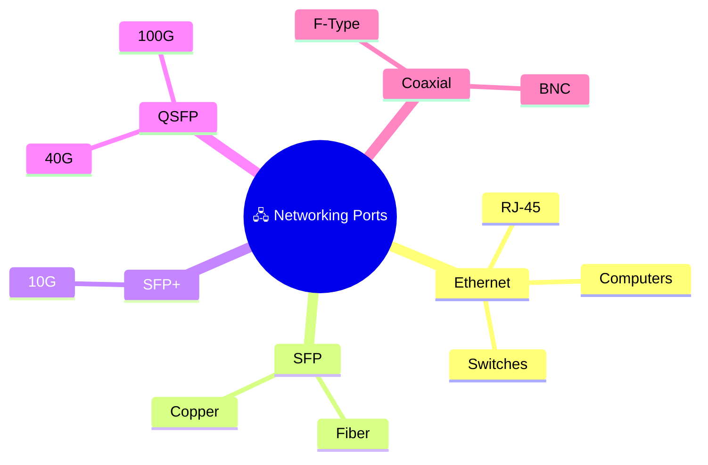

---

> **🎯 Key Takeaway**
>
> A **connector** attaches to the end of a cable, while a **port** is the interface built into a networking device. Modern networks use a variety of ports—from standard **RJ-45 Ethernet ports** to modular **SFP**, **SFP+**, and **QSFP** interfaces—allowing network administrators to support different cable types, communication speeds, and transmission distances with maximum flexibility.

---

# 🛠️ Installation and Best Practices

Choosing the correct connector is only the first step in building a reliable network.

Even the highest-quality cable and connector can perform poorly if they are installed incorrectly or handled without proper care.

Network technicians and administrators follow industry best practices to ensure that physical connections remain secure, organized, and reliable throughout the life of the network.

These practices not only improve performance but also simplify troubleshooting, maintenance, and future network expansion.

---

# 🧹 1. Keep Connectors Clean

Dust, dirt, and moisture are common causes of physical network problems.

A dirty connector can prevent proper electrical contact or interfere with the transmission of light in fiber optic networks.

Before connecting any cable:

- Inspect the connector for dirt or damage.
- Keep protective caps on unused fiber connectors.
- Avoid touching connector contacts or fiber end faces.
- Store spare cables in clean, dry environments.

Maintaining clean connectors helps reduce signal loss and connection errors.

---

> 💡 **Did You Know?**
>
> A single dust particle on the end of a fiber optic connector can significantly reduce signal quality. For this reason, professional technicians often inspect and clean fiber connectors every time they are connected.

---

# 🔒 2. Ensure Secure Connections

A loose connector can lead to intermittent network failures that are often difficult to diagnose.

Always make sure that connectors are fully seated and properly locked.

Examples include:

- RJ-45 connectors should click into place.
- BNC connectors should be twisted until the bayonet lock engages.
- Threaded connectors such as F-Type, FC, and N-Type should be tightened securely without excessive force.
- Fiber connectors should be inserted gently until the locking mechanism engages.

A secure connection minimizes the risk of accidental disconnection and signal loss.

---

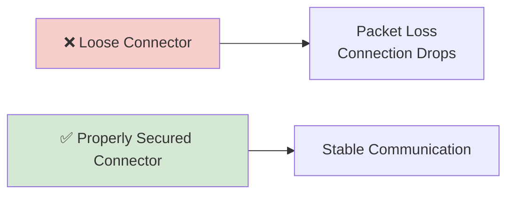

---

# 🏷️ 3. Label Every Cable

As networks grow, dozens or even hundreds of cables may be installed in a single rack or wiring closet.

Without proper labels, identifying the correct cable becomes time-consuming and increases the risk of disconnecting the wrong device.

A good labeling system should identify:

- Source device
- Destination device
- Patch panel port
- Installation date (optional)
- VLAN or network segment (optional)

Clear labeling makes maintenance and troubleshooting much easier.

---

# 📦 4. Provide Proper Cable Strain Relief

Connectors are not designed to support the weight of the cable.

If a cable hangs under tension, stress is placed on the connector and port.

To prevent damage:

- Use cable ties or Velcro straps.
- Support heavy cable bundles.
- Avoid pulling on connectors when disconnecting cables.
- Leave a small service loop where appropriate.

Proper strain relief extends the life of both the connector and the networking device.

---

# 🔄 5. Avoid Excessive Plugging and Unplugging

Every connector has a limited mechanical lifespan.

Repeatedly inserting and removing connectors can:

- Wear electrical contacts.
- Damage locking clips.
- Increase insertion loss on fiber connectors.
- Loosen ports over time.

Only disconnect cables when necessary and handle connectors carefully during maintenance.

---

# 📏 6. Respect Cable Specifications

Different cable types have different installation requirements.

For example:

- Copper cables should not exceed their maximum Ethernet distance.
- Fiber optic cables should never be bent beyond their minimum bend radius.
- Coaxial cables should maintain proper shielding and impedance.

Ignoring manufacturer specifications can reduce performance and shorten the lifespan of the network.

---

# 📋 7. Inspect Before Troubleshooting

When a network connection fails, technicians often suspect software or configuration issues first.

However, many problems originate at the physical layer.

Before investigating higher network layers, inspect:

- Connectors
- Ports
- Cable damage
- Locking mechanisms
- Bent pins
- Broken clips
- Dust or contamination

A simple physical inspection often resolves connectivity issues quickly.

---

> 💡 **Certification Tip**
>
> The **OSI Model** starts with the **Physical Layer (Layer 1)**. Before troubleshooting IP addresses, routing, or applications, always verify that cables, connectors, and ports are functioning correctly.

---

# 📊 Best Practices Checklist

Before completing a network installation, verify the following:

| ✔️ Best Practice | Completed |
|------------------|-----------|
| Inspect connectors for damage | ☐ |
| Clean connectors before use | ☐ |
| Secure all cable connections | ☐ |
| Label every cable | ☐ |
| Provide proper strain relief | ☐ |
| Follow cable specifications | ☐ |
| Protect unused ports and connectors | ☐ |
| Test the connection after installation | ☐ |

---

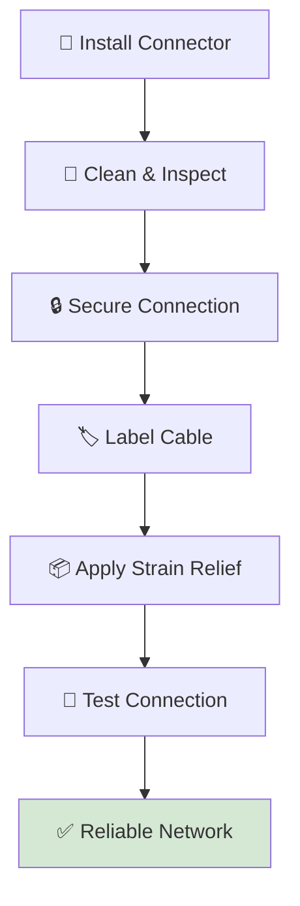

---

# ⚠️ Common Installation Mistakes

New technicians often make small mistakes that lead to larger networking problems.

Common examples include:

- ❌ Forcing the wrong connector into a port.
- ❌ Pulling a cable by its connector instead of the cable jacket.
- ❌ Leaving fiber connectors uncovered.
- ❌ Failing to label installed cables.
- ❌ Ignoring damaged locking clips.
- ❌ Over-tightening threaded connectors.
- ❌ Skipping post-installation testing.

Avoiding these mistakes improves both network reliability and equipment lifespan.

---

> **🎯 Key Takeaway**
>
> Proper installation is just as important as choosing the correct connector. Clean connectors, secure connections, accurate labeling, proper cable support, and routine inspection all contribute to a reliable, maintainable, and high-performing network. Following these best practices reduces downtime, simplifies troubleshooting, and extends the life of both cables and networking equipment.

---

# 🔐 Cybersecurity Perspective

Network connectors and ports may appear to be simple physical components, but they also represent potential **security entry points** into a network.

A well-configured firewall or secure operating system cannot protect against every threat if an attacker gains physical access to the network infrastructure.

For this reason, cybersecurity professionals consider **physical security** to be the foundation of network security.

Protecting cables, connectors, ports, and networking equipment is just as important as protecting software and data.

---

# 🚪 Physical Access Equals Network Access

One of the oldest security principles states:

> **If an attacker has unrestricted physical access to a device, the security of that device can no longer be fully guaranteed.**

An unused Ethernet port, an exposed patch panel, or an unlocked network cabinet can provide an attacker with an opportunity to connect directly to the network.

Once connected, they may attempt to:

- Discover devices on the network.
- Capture unencrypted traffic.
- Obtain an IP address from the DHCP server.
- Launch attacks against other systems.
- Access internal resources.

This is why organizations strictly control access to networking equipment and cabling.

---

> 💡 **Did You Know?**
>
> Many organizations disable unused network ports by default. This simple practice significantly reduces the number of potential entry points available to attackers.

---

# 🖧 Secure Unused Network Ports

Every active network port represents a possible connection point.

If a port is not required, it should be:

- Disabled through switch configuration.
- Physically blocked when appropriate.
- Clearly documented.
- Regularly inspected.

Leaving unused ports active allows unauthorized devices to connect with little effort.

---

# 🔒 Port Security

Enterprise switches often include a feature known as **Port Security**.

Port Security limits which devices are allowed to communicate through a specific switch port.

For example, an administrator can configure a port to accept traffic only from a single authorized device by identifying its **MAC address**.

If an unknown device is connected, the switch can:

- Block network traffic.
- Disable the port.
- Generate a security alert.

This helps prevent unauthorized devices from joining the network.

---

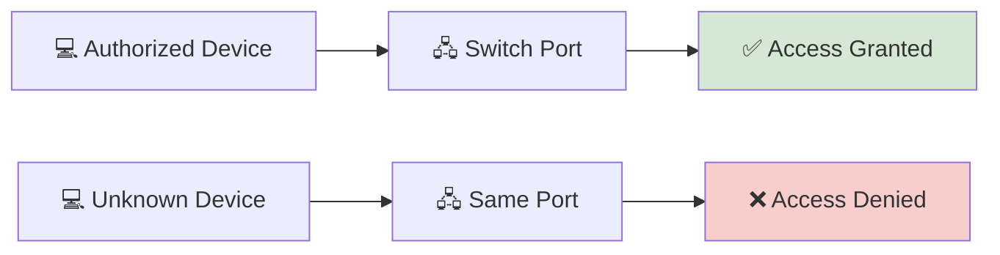

---

# 🏷️ Protect Patch Panels and Network Cabinets

Patch panels are often considered the "heart" of structured cabling.

Every cable running through a building may terminate at a patch panel.

If an attacker gains access to this location, they could:

- Disconnect critical systems.
- Reconnect cables incorrectly.
- Connect unauthorized devices.
- Interrupt business operations.

For this reason, patch panels are typically installed inside:

- 🔒 Locked network cabinets
- 🏢 Secure server rooms
- 📡 Restricted telecommunications closets

Physical access should be limited to authorized personnel only.

---

# 🔌 Beware of Rogue Devices

A **rogue device** is any unauthorized hardware connected to a network.

Examples include:

- Unauthorized laptops
- Personal routers
- Unapproved wireless access points
- Network taps
- Small unmanaged switches

These devices may bypass organizational security controls or create new attack paths.

Regular inspections and network monitoring help identify rogue devices before they become a serious security risk.

---

> 💡 **Certification Tip**
>
> A **Rogue Access Point (Rogue AP)** is one of the most common examples of an unauthorized network device and is frequently discussed in **CompTIA Network+**, **Security+**, and **CCNA** courses.

---

# 🧹 Keep Connectors Protected

Damaged or contaminated connectors can affect more than just performance.

For example:

- A damaged RJ-45 connector may create intermittent connectivity issues.
- A dirty fiber optic connector can increase signal loss.
- An exposed connector may be damaged intentionally or accidentally.

Protective covers, proper storage, and routine inspections help reduce these risks.

---

# 📹 Monitor Critical Network Areas

Organizations often install surveillance systems around areas containing networking equipment, including:

- Server rooms
- Data centers
- Wiring closets
- Patch panels
- Network cabinets

Video monitoring helps detect:

- Unauthorized access
- Equipment tampering
- Cable theft
- Physical sabotage

These measures complement logical security controls.

---

# 📋 Physical Security Best Practices

Cybersecurity begins with protecting the physical network.

A secure organization should:

| ✔️ Best Practice | Purpose |
|------------------|---------|
| Lock server rooms | Prevent unauthorized access |
| Disable unused ports | Reduce attack surface |
| Secure patch panels | Prevent cable tampering |
| Restrict access to network cabinets | Protect critical infrastructure |
| Monitor networking areas with CCTV | Detect suspicious activity |
| Inspect connectors regularly | Identify damage or tampering |
| Document cable changes | Maintain accountability |

---

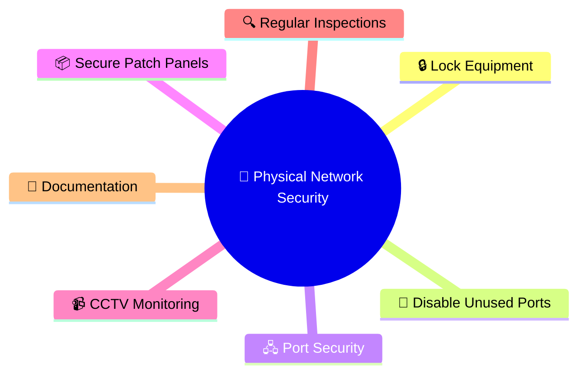

---

# 🌍 Real-World Example

Imagine a company leaves an unused Ethernet port active in a meeting room.

An attacker enters the building pretending to be a visitor.

They plug a laptop into the unused network port.

Within seconds, the laptop receives an IP address from the DHCP server and gains access to the internal network.

If the organization has **disabled unused ports**, implemented **Port Security**, and restricted physical access, this attack becomes much more difficult to carry out.

This example demonstrates why physical network security is an essential part of every cybersecurity strategy.

---

> **🎯 Key Takeaway**
>
> Connectors and ports are more than physical interfaces—they are potential security entry points. By securing unused ports, protecting networking equipment, controlling physical access, and implementing features such as **Port Security**, organizations reduce the risk of unauthorized access and strengthen the overall security of their networks.

---

# 📖 Module Progress

The **Network Media** chapter is designed to build your understanding of the physical technologies that carry network data.

So far, you have completed:

| Status | Lesson | What You Learned |
|---------|--------|------------------|
| ✅ | **README.md** | Overview of network transmission media and learning objectives |
| ✅ | **Copper Cables.md** | Electrical signaling, twisted-pair technology, Ethernet categories, RJ-45 connectors, installation best practices, and cybersecurity considerations |
| ✅ | **Coaxial Cable.md** | Shielded transmission media, coaxial cable structure, RF communication, connectors, and real-world applications |
| ✅ | **Fiber Optic Cable.md** | Optical communication, fiber construction, single-mode vs multi-mode fiber, wavelengths, connectors, and modern networking |
| ✅ | **Connectors.md** | Copper, coaxial, and fiber connectors, networking ports, transceivers, installation best practices, and physical security |
| ⏭️ | **Ethernet Standards.md** | Learn how Ethernet evolved into the world's dominant LAN technology and understand the standards that define modern networks |
| ⏳ | **Wireless Standards.md** | Discover how Wi-Fi standards evolved and how wireless communication enables modern networking |

---

> 💡 **Learning Milestone**
>
> You can now identify the most common connectors used with copper, coaxial, and fiber optic cables, understand the ports they connect to, and explain how physical connectivity forms the foundation of every computer network.
>
> You are now ready to move beyond the physical components and explore the **communication standards** that make Ethernet networks interoperable across the world.

---

# 🚀 Continue Your Journey

Congratulations! 🎉

You have successfully completed the **Network Connectors** lesson.

You now understand:

- ✅ What network connectors are and why they are essential.
- ✅ The difference between connectors and ports.
- ✅ RJ-45, RJ-11, BNC, F-Type, N-Type, SMA, SC, LC, ST, FC, and MPO/MTP connectors.
- ✅ How fiber optic connectors differ from copper and coaxial connectors.
- ✅ The purpose of SFP, SFP+, and QSFP transceivers.
- ✅ Installation and maintenance best practices.
- ✅ Physical security risks related to connectors and ports.
- ✅ How connectors, ports, and networking devices work together.

These concepts are fundamental for installing, maintaining, and troubleshooting modern wired networks.

---

# 🔄 Why Learn Ethernet Standards Next?

So far, you've learned about the **physical infrastructure** of a wired network:

- The cables that carry data.
- The connectors attached to those cables.
- The ports found on networking devices.

But simply connecting two devices with a cable does **not** guarantee they can communicate successfully.

For communication to work reliably, every device must follow the same set of rules regarding:

- ⚡ Data transmission speeds
- 📏 Cable specifications
- 🔄 Frame formatting
- 🏷️ Auto-negotiation
- 📡 Signaling methods
- 🌐 Network compatibility

These rules are known as **Ethernet Standards**.

They ensure that equipment from different manufacturers can communicate seamlessly, making Ethernet the most widely adopted LAN technology in the world.

---


---

# 🎯 What You'll Learn Next

In the next lesson, you'll explore:

- The history and evolution of Ethernet.
- The role of the IEEE 802.3 standard.
- Common Ethernet naming conventions (10BASE-T, 100BASE-TX, 1000BASE-T, etc.).
- Ethernet speeds from 10 Mbps to 400 Gbps.
- Full-duplex and half-duplex communication.
- Auto-negotiation and Auto-MDI/MDIX.
- Modern high-speed Ethernet technologies.
- Real-world deployment examples.
- Cybersecurity considerations for Ethernet networks.

By the end of the lesson, you'll understand how Ethernet standards allow billions of devices around the world to communicate using a common, standardized networking technology.

---

<!--
Image Description:
Create an illustration showing the progression of wired networking technologies. Display Ethernet cables connected through RJ-45 connectors into switches and routers, with labels such as 10 Mbps, 100 Mbps, 1 Gbps, 10 Gbps, 40 Gbps, and 100 Gbps. Highlight IEEE 802.3 as the standard governing Ethernet communication.

Suggested Search Keywords:
ethernet evolution infographic
IEEE 802.3 Ethernet standards
Ethernet speeds comparison
network switch Ethernet ports
-->

<p align="center">

</p>

---

# 📚 Continue to the Next Lesson

The physical components of a network are only part of the story.

To enable reliable communication, devices must also follow standardized rules that define how data is transmitted, how speeds are negotiated, and how different hardware remains compatible across manufacturers.

In the next lesson, you'll explore **Ethernet Standards**—the foundation of modern wired networking and one of the most important technologies you'll encounter throughout your cybersecurity journey.

## ➜ Continue to the next lesson:

# **[🌐 Ethernet Standards.md](Ethernet%20Standards.md)** →

---