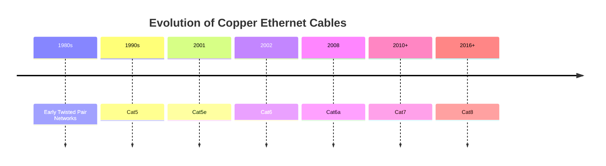
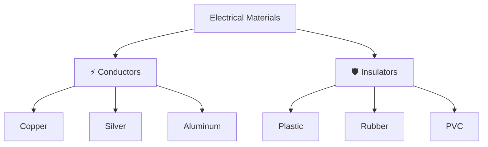
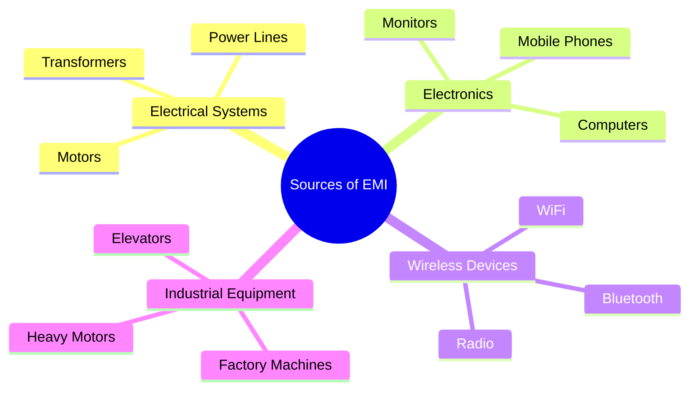
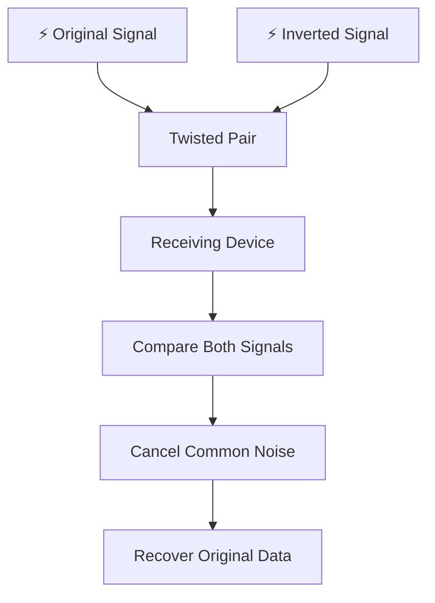
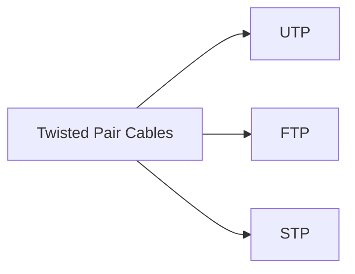
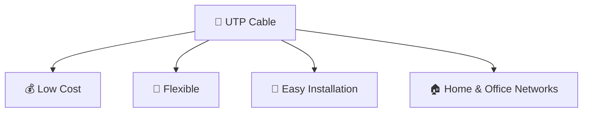
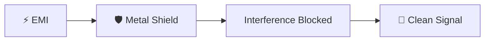
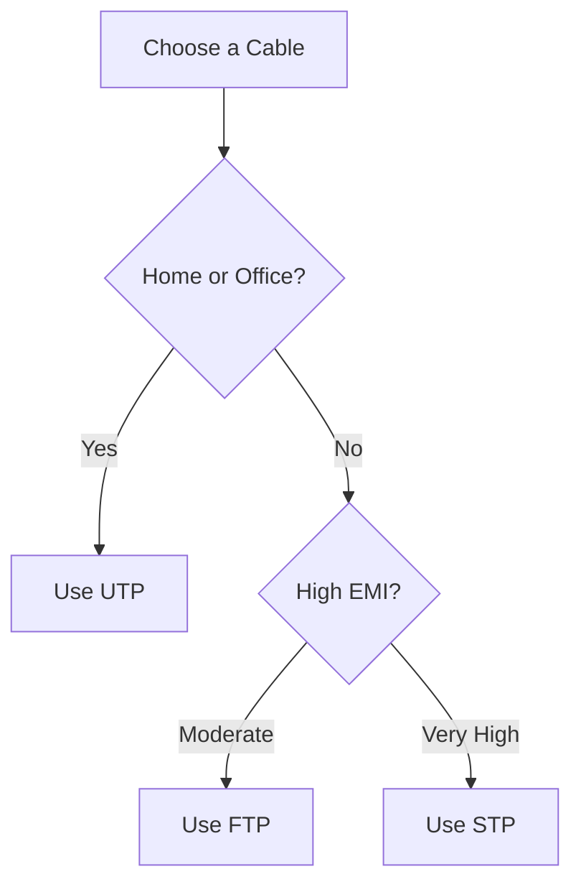
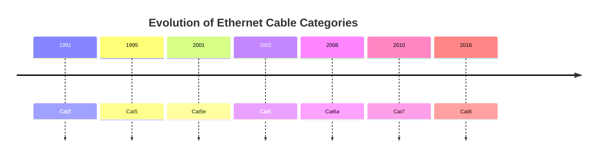
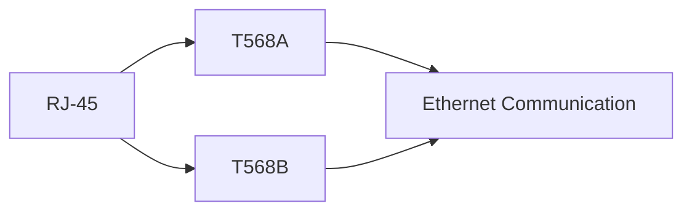

# 🔌 Copper Cables

> *Copper cables are the most widely used transmission medium in computer networking. They carry digital information as electrical signals between networking devices, forming the foundation of Ethernet-based Local Area Networks (LANs) around the world.*

---

<div align="center">


-informational?style=for-the-badge)


</div>

---

# 📖 Table of Contents

- [Previously in this Chapter](#-previously-in-this-chapter)
- [The First Step into Network Media](#-the-first-step-into-network-media)
- [Why Do Copper Cables Matter?](#-why-do-copper-cables-matter)
- [A Brief History of Network Cabling](#-a-brief-history-of-network-cabling)
- [Real-World Analogy](#-real-world-analogy)
- [Learning Objectives](#-learning-objectives)
- [Lesson Overview](#-lesson-overview)

---

# 📚 Previously in this Chapter

In the **Network Media** chapter, you learned that every computer network requires a **transmission medium** to carry data between devices.

You discovered that network media can be broadly divided into two categories:

- 🔌 **Wired (Guided) Media**
- 📶 **Wireless (Unguided) Media**

You also explored the overall structure of this chapter and saw that different transmission media are designed for different networking environments.

One important question remains:

> **Which transmission medium is used most frequently in modern Local Area Networks (LANs)?**

The answer is **Copper Cables**.

Before exploring advanced technologies like fiber optics and wireless networking, it's essential to understand copper cabling because it remains the foundation of Ethernet communication in homes, schools, offices, and enterprise networks.

---

# 🌐 The First Step into Network Media

Every networking device you've studied so far—whether it's a switch, router, firewall, or access point—must exchange information with other devices.

But these devices cannot communicate on their own.

They need a physical pathway that allows digital information to travel from one point to another.

For most Local Area Networks (LANs), that pathway is a **copper Ethernet cable**.

Think back to the networking devices you studied earlier.

```text
💻 Computer
      │
      ▼
🔌 Copper Ethernet Cable
      │
      ▼
🔀 Switch
      │
      ▼
🔌 Copper Ethernet Cable
      │
      ▼
🌍 Router
      │
      ▼
☁️ Internet
```

Notice that the networking devices perform the processing and forwarding of data, while the copper cables provide the physical connection that allows communication to take place.

Without the cable, the devices remain isolated.

Without the devices, the cable has nothing to connect.

Together, they create a functioning network.

---


---

<!--
Image Description:
Illustrate a simple Ethernet network showing a computer connected to a switch using a copper Ethernet cable. The switch is connected to a router using another copper cable, and the router connects to the Internet. Clearly highlight the copper cables as the communication medium.

Suggested Search Keywords:
ethernet cable network diagram
copper ethernet connection
LAN copper cable illustration
-->

<p align="center">

</p>

---

# 🤔 Why Do Copper Cables Matter?

If you've ever connected a desktop computer to a router, plugged a gaming console into a switch, or installed an office network, you've already used copper cabling.

Despite the rapid growth of fiber-optic and wireless technologies, copper cables remain one of the most common transmission media in networking.

Why?

Because they provide an excellent balance of:

- 💰 Cost
- ⚡ Performance
- 🔧 Ease of installation
- 🌍 Wide compatibility
- 🛠️ Simple maintenance

For distances commonly found inside homes, offices, classrooms, and enterprise buildings, copper Ethernet cables deliver reliable, high-speed communication at a relatively low cost.

This combination of affordability and performance has made them the global standard for Ethernet LANs.

---

## 🌍 Where Are Copper Cables Used?

Copper Ethernet cables are found in countless networking environments, including:

- 🏠 Home networks
- 🏢 Office buildings
- 🏫 Schools and universities
- 🏥 Hospitals
- 🏭 Industrial environments
- 🏬 Retail stores
- ☁️ Small server rooms
- 🖨️ Printers and VoIP phones
- 📷 IP surveillance cameras
- 🎮 Gaming systems

Even in organizations with fiber-optic backbones, copper cables are often used to connect end-user devices to nearby switches.

This combination provides both high performance and cost efficiency.

---

> 💡 **Did You Know?**
>
> Although Internet traffic may travel thousands of kilometers through fiber-optic cables, the final connection between your computer and a nearby network switch is often still made using a copper Ethernet cable.

---

<!--
Image Description:
Create an illustration showing various environments where copper Ethernet cables are commonly used, including homes, offices, schools, hospitals, retail stores, and data centers. Connect each environment with Ethernet cables to emphasize their widespread use.

Suggested Search Keywords:
ethernet cable applications
where copper ethernet is used
network infrastructure illustration
-->

<p align="center">

</p>

---

# 📜 A Brief History of Network Cabling

Modern networking didn't always look the way it does today.

Early computer networks experimented with several transmission media, including thick coaxial cables and specialized wiring systems.

As networking technology evolved, engineers searched for a solution that was:

- Easier to install
- More flexible
- Less expensive
- Faster
- Easier to maintain

Twisted-pair copper cabling gradually became the preferred choice.

Over time, new cable categories were introduced, allowing Ethernet speeds to increase from a few megabits per second to multiple gigabits per second.

Today, modern categories such as **Cat6**, **Cat6a**, and **Cat8** continue to support increasingly demanding networking applications.

---



The evolution of copper cabling demonstrates an important principle in networking:

> **Technology evolves to meet growing demands for speed, reliability, and bandwidth.**

---

<!--
Image Description:
Create a timeline showing the evolution of Ethernet copper cable categories from early twisted-pair networks to Cat5, Cat5e, Cat6, Cat6a, Cat7, and Cat8. Include increasing speed indicators along the timeline.

Suggested Search Keywords:
ethernet cable evolution
cat5 to cat8 timeline
network cable history infographic
-->

<p align="center">

</p>

---

# 🏗️ Real-World Analogy

Imagine a modern city.

Buildings represent computers, switches, routers, and servers.

For people to travel between these buildings, roads must connect them.

Without roads, even the most advanced buildings become isolated.

Computer networks work in much the same way.

- 🖥️ Devices are like buildings.
- 🚗 Data is like vehicles.
- 🛣️ Copper cables are the roads connecting everything together.

The wider and better maintained the roads, the more efficiently traffic can move.

Similarly, higher-quality Ethernet cables support faster, more reliable communication.

---

> 💡 **Real-World Analogy**
>
> Imagine delivering a package across a city.
>
> The delivery truck represents the **data**.
>
> The road represents the **copper cable**.
>
> The buildings represent **network devices**.
>
> Without roads, the package never reaches its destination.
>
> Without copper cables, network devices cannot exchange information.

---

# 🎯 Learning Objectives

By the end of this lesson, you will be able to:

- Explain what copper cables are.
- Understand why copper is commonly used for Ethernet networking.
- Describe how electrical signals carry digital data.
- Explain why twisted-pair cabling is used.
- Distinguish between UTP, STP, and other cable types.
- Compare Ethernet cable categories.
- Identify common Ethernet connectors.
- Understand best practices for installing copper cabling.
- Recognize physical security risks associated with network cables.

---

# 🧭 Lesson Overview

This lesson is organized to gradually build your understanding of copper-based networking.

Rather than memorizing cable names and specifications, you'll first understand **how copper cables work**, **why they were designed the way they are**, and **how they fit into modern computer networks**.

```text
Copper Cables

│

├── What are Copper Cables?
├── How Electricity Carries Data
├── Twisted Pair Technology
├── UTP vs STP vs FTP
├── Ethernet Cable Categories
├── RJ-45 Connectors
├── Cable Wiring Standards
├── Installation Best Practices
├── Cybersecurity Perspective
└── Chapter Summary
```

Each section builds upon the previous one, ensuring you develop both theoretical understanding and practical networking knowledge before moving on to the next lesson in the **Network Media** chapter.

---

# 🔍 What are Copper Cables?

A **copper cable** is a type of **guided transmission medium** that carries digital information between networking devices using **electrical signals**.

Whenever two devices communicate through an Ethernet cable, they exchange data by sending tiny electrical pulses through thin copper conductors inside the cable.

Unlike wireless communication, where information travels through radio waves, copper cables provide a **physical path** that guides electrical signals directly from one device to another.

Because of their reliability, affordability, and widespread compatibility, copper cables have become the most commonly used transmission medium in Local Area Networks (LANs).

---

## 📖 Breaking Down the Definition

Let's examine the definition one piece at a time.

> **Copper Cable**

The physical cable itself is made of one or more **copper conductors** surrounded by insulating materials and protective outer jackets.

Copper is used because it is an excellent conductor of electricity.

---

> **Guided Transmission Medium**

A transmission medium is the path through which data travels.

Since electrical signals remain inside the cable instead of traveling freely through the air, copper cables are called **guided media**.

Think of it like water flowing through a pipe.

The pipe guides the water exactly where it needs to go.

Similarly, the cable guides electrical signals from one networking device to another.

---

> **Electrical Signals**

Computers understand only two values:

- **0**
- **1**

These binary digits (bits) are represented inside a copper cable using carefully controlled changes in electrical voltage.

These tiny voltage changes occur millions—or even billions—of times every second.

The receiving device interprets these electrical changes as binary data, reconstructing the original information.

---


The copper cable itself does not understand the information being transmitted.

Its job is simply to provide a reliable pathway for electrical signals.

---

<!--
Image Description:
Illustrate a computer connected to a switch using a copper Ethernet cable. Show electrical signals traveling through the cable with arrows. Label the cable as a guided transmission medium and indicate the sender and receiver.

Suggested Search Keywords:
how ethernet cable works
electrical signals in copper cable
guided transmission medium diagram
-->

<p align="center">

</p>

---

# 🤔 Why is Copper Used?

You might wonder why engineers chose **copper** instead of another metal.

The answer lies in the unique properties of copper.

Copper offers an excellent balance between performance, durability, and cost, making it ideal for large-scale network deployments.

Some of its most important characteristics include:

- Excellent electrical conductivity.
- Affordable compared to precious metals like silver.
- Flexible and easy to manufacture.
- Resistant to everyday wear.
- Widely available around the world.
- Compatible with standard Ethernet technologies.

These advantages have made copper the dominant material for Ethernet networking for decades.

---

## 📊 Why Copper Instead of Other Materials?

| Material | Conductivity | Cost | Practical for Networking? |
|-----------|-------------:|-----:|:-------------------------:|
| 🥇 Silver | Excellent | Very High | ❌ Too expensive |
| 🥈 Copper | Excellent | Moderate | ✅ Yes |
| 🥉 Aluminum | Good | Low | ⚠️ Limited |
| 🪙 Gold | Excellent | Extremely High | ❌ Not practical |

Although silver conducts electricity slightly better than copper, its cost makes it impractical for large-scale networking.

Copper provides nearly the same performance at a fraction of the cost.

---

> 💡 **Remember**
>
> Networking is always a balance between **performance**, **cost**, and **practicality**.
>
> Copper became the industry standard because it offers an excellent compromise between all three.

---

# ⚡ How Does Electricity Carry Data?

One of the most fascinating aspects of networking is that **the cable itself does not carry files, images, or videos**.

Instead, it carries **electrical signals**.

Imagine sending a photograph to a friend.

The photograph is first converted into binary digits:

```text
10110010...
```

Those binary digits are then represented as tiny changes in electrical voltage.

These voltage changes travel through the copper cable at extremely high speeds.

When the receiving device detects these changes, it converts them back into binary data and reconstructs the original photograph.

The entire process happens so quickly that it appears almost instantaneous.

---


This process occurs every time you:

- Browse the web.
- Watch a YouTube video.
- Send an email.
- Join a video conference.
- Download software.
- Play an online game.

Although the content appears different to you, the copper cable simply carries electrical signals representing binary data.

---

<!--
Image Description:
Create a diagram showing a photograph being converted into binary digits, then into electrical signals traveling through a copper Ethernet cable, and finally reconstructed as the original image on another computer.

Suggested Search Keywords:
binary data electrical signals
ethernet data transmission
how computers transmit data
-->

<p align="center">

</p>

---

# 🔢 Binary Data and Electrical Signals

Every computer ultimately communicates using only two binary values:

- **0**
- **1**

Copper cables do not physically transport these numbers.

Instead, networking hardware represents them using carefully controlled electrical states.

A simplified representation looks like this:

```text
Binary Data

1 0 1 1 0 0 1

↓

Electrical Signals

⬆️ ⬇️ ⬆️ ⬆️ ⬇️ ⬇️ ⬆️

↓

Copper Cable

↓

Receiving Device

↓

Original Data
```

Modern Ethernet standards use sophisticated signaling techniques rather than simple "high voltage equals 1" and "low voltage equals 0."

However, the underlying concept remains the same:

> **Digital information is transmitted by changing electrical characteristics inside the cable.**

---

# 🔬 Conductors and Insulators

To understand why copper cables work so well, it's important to know the difference between **conductors** and **insulators**.

### ⚡ Conductors

Conductors allow electricity to flow easily.

Examples include:

- Copper
- Silver
- Gold
- Aluminum

These materials are commonly used wherever electrical current needs to travel.

---

### 🛡️ Insulators

Insulators resist the flow of electricity.

Examples include:

- Plastic
- Rubber
- PVC
- Glass

In Ethernet cables, the copper wires are covered with insulating materials to prevent electrical leakage and short circuits.

Without insulation, the signals inside neighboring wires could interfere with one another.

---



---

# 📦 Anatomy of a Copper Ethernet Cable

Although an Ethernet cable appears simple from the outside, it contains several important layers designed to protect the electrical signals.

```text
┌──────────────────────────────┐
│ Outer Protective Jacket      │
├──────────────────────────────┤
│ Insulation                   │
├──────────────────────────────┤
│ Twisted Copper Wire Pairs    │
└──────────────────────────────┘
```

Each component serves a specific purpose:

| Component | Purpose |
|-----------|----------|
| Outer Jacket | Protects the cable from physical damage. |
| Insulation | Prevents electrical leakage and interference. |
| Copper Conductors | Carry electrical signals. |
| Twisted Pairs | Reduce interference and improve signal quality. |

You'll learn much more about **twisted pairs** in the next section of this lesson.

---

<!--
Image Description:
Illustrate the internal structure of an Ethernet cable showing the outer jacket, insulation, twisted copper wire pairs, and copper conductors. Label each component and indicate its function.

Suggested Search Keywords:
ethernet cable internal structure
copper cable anatomy
twisted pair cable diagram
-->

<p align="center">

</p>

---

# 📝 Mini Review

Before moving to the next section, make sure you can answer the following questions:

- What is a copper cable?
- Why is copper commonly used in networking?
- How does a copper cable transmit digital information?
- What is the difference between a conductor and an insulator?
- Why are electrical signals used instead of directly transmitting files?

If you can confidently answer these questions, you're ready to explore one of the most important innovations in Ethernet networking:

> **Twisted Pair Technology** — the clever engineering solution that dramatically reduces interference and enables reliable high-speed communication over copper cables.

---

# 🧵 Twisted Pair Technology

In the previous section, you learned that copper cables transmit data by carrying carefully controlled electrical signals between networking devices.

However, simply placing two copper wires next to each other introduces a new problem.

As electrical signals travel through a wire, they generate a small electromagnetic field around it.

If another wire is nearby, that electromagnetic field can interfere with the signals traveling through the neighboring wire.

This unwanted interference can corrupt data, reduce transmission quality, and even cause communication failures.

Engineers needed a solution that was:

- Cost-effective
- Easy to manufacture
- Reliable
- Suitable for high-speed communication

Their solution was surprisingly simple:

> **Twist the wires together.**

This innovation became one of the most important developments in Ethernet networking.

---

# 🤔 Why Are Wires Twisted?

At first glance, twisting two wires together may seem unnecessary.

Why not keep them perfectly straight?

The answer lies in the laws of physics.

When electricity flows through a conductor, it creates a magnetic field around that conductor.

If two straight wires run parallel over a long distance, those magnetic fields constantly interact.

The result is unwanted interference that weakens signal quality.

By twisting the wires together at regular intervals, both wires experience nearly the same amount of external interference.

Because the interference affects both wires equally, networking hardware can cancel most of it during signal processing.

This significantly improves communication reliability.

---

## 💡 The Core Idea

Instead of trying to eliminate electromagnetic interference completely, twisted-pair technology **balances** the interference so it can be cancelled.

This is one of the reasons Ethernet networks can reliably transmit data at Gigabit and even Multi-Gigabit speeds using copper cables.

---


---

<!--
Image Description:
Illustrate two straight copper wires producing electromagnetic fields that interfere with one another. Beside them, show two twisted wires where interference is evenly distributed and largely cancelled. Label both scenarios clearly.

Suggested Search Keywords:
twisted pair cable illustration
why ethernet cables are twisted
twisted pair electromagnetic interference
-->

<p align="center">

</p>

---

# ⚡ Electromagnetic Interference (EMI)

One of the biggest challenges in electrical communication is **Electromagnetic Interference (EMI).**

EMI refers to unwanted electromagnetic energy that disrupts electrical signals traveling through a cable.

Think of it as background noise that makes it harder for networking devices to correctly interpret incoming data.

The stronger the interference, the greater the chance that transmitted data becomes corrupted.

---

## 🌍 Common Sources of EMI

Electromagnetic interference exists almost everywhere.

Common sources include:

- ⚡ Power cables
- 🔌 Electrical transformers
- ⚙️ Industrial machinery
- 💡 Fluorescent lighting
- 📡 Radio transmitters
- 📺 Television equipment
- 📱 Mobile phones
- 🔊 Electric motors
- ☢️ High-voltage electrical systems

This is why network cables should never be installed directly alongside high-voltage power cables.

---



---

<!--
Image Description:
Create a mind map showing common sources of Electromagnetic Interference (EMI), including power lines, electrical motors, wireless devices, industrial equipment, fluorescent lights, and radio transmitters. Use icons for each source.

Suggested Search Keywords:
EMI sources infographic
electromagnetic interference networking
ethernet interference diagram
-->

<p align="center">

</p>

---

# 📡 Crosstalk

While EMI comes from **external sources**, another form of interference can originate **inside the network cable itself**.

This is known as **Crosstalk**.

Crosstalk occurs when electrical signals traveling through one wire pair unintentionally interfere with signals traveling through another wire pair within the same cable.

Imagine several people talking loudly in adjacent rooms.

Even though each conversation is separate, voices can leak through the walls and become distracting.

A similar phenomenon occurs inside Ethernet cables.

Instead of voices, electrical signals leak between wire pairs.

---

## 🏠 Real-World Analogy

Imagine four classrooms located side by side.

If every teacher speaks loudly at the same time, students may begin hearing parts of neighboring lessons.

The conversations overlap.

This is similar to crosstalk inside a network cable.

Each wire pair is trying to carry its own conversation.

Without proper design, those conversations begin interfering with one another.

---


---

<!--
Image Description:
Illustrate an Ethernet cable containing four twisted wire pairs. Show one pair leaking electromagnetic signals into another pair and label the effect as Crosstalk.

Suggested Search Keywords:
ethernet crosstalk diagram
twisted pair crosstalk
network cable interference
-->

<p align="center">

</p>

---

# 🔊 Noise

The term **Noise** describes any unwanted electrical signal that interferes with the intended communication.

Noise can originate from many different sources, including:

- Electromagnetic Interference (EMI)
- Crosstalk
- Electrical equipment
- Faulty hardware
- Poor cable installation
- Damaged connectors

Networking engineers work hard to reduce noise because excessive noise increases transmission errors and lowers network performance.

---

## 📊 Types of Signal Disturbances

| Disturbance | Source | Example |
|-------------|--------|----------|
| EMI | External environment | Power cables |
| Crosstalk | Nearby wire pairs | Ethernet cable pairs |
| Noise | Any unwanted electrical signal | Electrical equipment |
| Attenuation | Signal weakening over distance | Long cable runs |

Each of these factors can reduce the quality of data transmission.

Fortunately, twisted-pair technology helps minimize many of these problems.

---

# ⚖️ Differential Signaling

Twisting wires alone is not enough.

Modern Ethernet also uses a technique called **Differential Signaling**.

Instead of sending data through a single wire, Ethernet sends information across **two wires simultaneously**.

One wire carries the original electrical signal.

The other carries an inverted version of that same signal.

When the receiving device compares both signals, any interference that affected both wires equally is removed.

Only the actual data remains.

This dramatically improves communication reliability.

---



---

> 💡 **Why Differential Signaling Works**
>
> External interference usually affects both wires almost equally.
>
> Because the receiver compares the two signals rather than reading them independently, most unwanted noise is automatically cancelled.
>
> This is one of the key reasons twisted-pair Ethernet cables can reliably transmit data at extremely high speeds.

---

# 📌 Mini Review

Before continuing to the next section, make sure you understand these key concepts:

- ✅ Why Ethernet cables use twisted wire pairs.
- ✅ What Electromagnetic Interference (EMI) is.
- ✅ The difference between EMI and Crosstalk.
- ✅ Why electrical noise affects communication.
- ✅ How Differential Signaling helps cancel interference.

In the next section, you'll build on these concepts by exploring the three most common types of twisted-pair cabling:

- **UTP (Unshielded Twisted Pair)**
- **STP (Shielded Twisted Pair)**
- **FTP (Foiled Twisted Pair)**

You'll learn how each type is constructed, where it is used, and how to choose the right cable for different networking environments.

---

# 🛡️ Types of Twisted Pair Cables

Now that you understand **why Ethernet cables use twisted wire pairs**, it's time to explore the different types of twisted-pair cables used in modern computer networks.

Although all twisted-pair cables are designed to carry electrical signals efficiently, they are **not all built the same**.

Different environments present different challenges.

For example:

- A quiet home office has very little electromagnetic interference.
- A hospital contains medical equipment that generates electrical noise.
- A manufacturing plant operates heavy motors and industrial machinery.
- A data center houses hundreds of network cables packed closely together.

Because of these varying conditions, engineers developed different types of twisted-pair cables, each offering a different level of protection against interference.

The three most common types are:

- **UTP (Unshielded Twisted Pair)**
- **STP (Shielded Twisted Pair)**
- **FTP (Foiled Twisted Pair)**

---



---

<!--
Image Description:
Illustrate the three major types of twisted-pair Ethernet cables: UTP, FTP, and STP. Show their internal construction side-by-side, highlighting the absence or presence of shielding.

Suggested Search Keywords:
UTP vs STP vs FTP
twisted pair cable comparison
ethernet cable types
-->

<p align="center">

</p>

---

# 🔌 Unshielded Twisted Pair (UTP)

**UTP (Unshielded Twisted Pair)** is the most common Ethernet cable used around the world.

As the name suggests, it **does not include any additional metallic shielding** around the wire pairs.

Instead, it relies entirely on:

- Twisting the wire pairs
- Differential signaling
- Proper cable design

to reduce interference.

Because UTP contains fewer materials, it is:

- Lightweight
- Flexible
- Easy to install
- Cost-effective

These advantages make it the preferred choice for most home and office networks.

---

## 🌍 Common Applications of UTP

UTP cables are widely used in:

- 🏠 Home networks
- 🏢 Office buildings
- 🏫 Schools
- 🏪 Retail stores
- ☁️ Small server rooms
- 📚 Universities

Whenever electromagnetic interference is relatively low, UTP provides excellent performance.

---

### ✅ Advantages

- Low cost
- Easy installation
- Flexible cable
- Lightweight
- Widely available
- Supports modern Gigabit and Multi-Gigabit Ethernet

### ❌ Limitations

- Less protection against EMI
- More susceptible to electrical noise
- Not ideal near heavy industrial equipment

---



---

# 🛡️ Shielded Twisted Pair (STP)

While UTP works well in most environments, some locations contain extremely high levels of electromagnetic interference.

Examples include:

- Manufacturing plants
- Hospitals
- Airports
- Power stations
- Industrial automation systems

In these environments, additional protection is necessary.

This is where **Shielded Twisted Pair (STP)** becomes useful.

STP includes a metallic shield surrounding the cable or individual wire pairs.

The shield absorbs or redirects unwanted electromagnetic energy before it reaches the copper conductors.

This significantly improves signal quality in electrically noisy environments.

---

### ✅ Advantages

- Excellent EMI protection
- Reduced Crosstalk
- Better signal quality
- Ideal for industrial environments

### ❌ Limitations

- More expensive
- Thicker cable
- Less flexible
- More difficult to install
- Requires proper grounding

---



---

<!--
Image Description:
Illustrate an STP Ethernet cable showing metallic shielding surrounding the twisted wire pairs. Include electromagnetic waves striking the shield and being blocked before reaching the conductors.

Suggested Search Keywords:
shielded twisted pair diagram
STP cable shielding
ethernet cable EMI protection
-->

<p align="center">

</p>

---

# 🪙 Foiled Twisted Pair (FTP)

FTP stands for **Foiled Twisted Pair**.

Instead of using heavy braided shielding like some STP cables, FTP wraps the cable with a thin layer of metallic foil.

This foil provides additional protection against electromagnetic interference while keeping the cable lighter and more flexible than fully shielded cables.

FTP is often viewed as a compromise between UTP and STP.

It offers:

- Better EMI protection than UTP
- Lower cost than STP
- Easier installation than heavily shielded cables

---

### Common Uses

- Medium-sized offices
- Commercial buildings
- Educational institutions
- Areas with moderate electrical interference

---


---

# 📊 UTP vs FTP vs STP

Each cable type is designed for a specific networking environment.

Choosing the correct cable depends on factors such as:

- Cost
- Installation difficulty
- Interference levels
- Network performance requirements

---

| Feature | UTP | FTP | STP |
|----------|:---:|:---:|:---:|
| Shielding | ❌ None | ✅ Foil | ✅ Metallic Shield |
| EMI Protection | Low | Medium | High |
| Crosstalk Protection | Good | Better | Best |
| Installation | Easy | Moderate | Difficult |
| Cost | Low | Medium | High |
| Flexibility | Excellent | Good | Moderate |
| Home Networks | ⭐⭐⭐⭐⭐ | ⭐⭐⭐ | ⭐ |
| Office Networks | ⭐⭐⭐⭐⭐ | ⭐⭐⭐⭐ | ⭐⭐⭐ |
| Industrial Networks | ⭐ | ⭐⭐⭐ | ⭐⭐⭐⭐⭐ |

---

# 🎯 Choosing the Right Cable

There is no universally "best" Ethernet cable.

The right choice depends entirely on the networking environment.



---

> 💡 **Pro Tip**
>
> Many beginners assume that STP is always better because it offers more protection.
>
> In reality, using STP where it isn't needed increases installation costs, makes cable management more difficult, and requires proper grounding.
>
> For most home and office networks, **UTP is the recommended choice**.

---

# 🚫 Common Beginner Mistakes

❌ Assuming every Ethernet cable provides the same level of protection.

❌ Installing UTP cables alongside high-voltage electrical wiring.

❌ Choosing STP without understanding grounding requirements.

❌ Believing expensive cables automatically improve network speed.

❌ Ignoring the installation environment when selecting cable types.

---

# 🌍 Real-World Deployment Examples

| Environment | Recommended Cable | Why? |
|-------------|------------------|------|
| 🏠 Home Network | UTP | Low cost and minimal interference |
| 🏢 Office Building | UTP / FTP | Reliable and easy to install |
| 🏭 Factory | STP | High electrical interference |
| 🏥 Hospital | STP | Sensitive medical equipment |
| ☁️ Data Center | UTP / FTP | Depends on cable density and EMI levels |
| 📡 Industrial Automation | STP | Maximum signal protection |

---

<!--
Image Description:
Create an infographic comparing UTP, FTP, and STP deployment environments. Show homes using UTP, offices using UTP/FTP, and factories or hospitals using STP. Include icons representing each environment.

Suggested Search Keywords:
UTP FTP STP deployment
ethernet cable use cases
network cable comparison infographic
-->

<p align="center">

</p>

---

# 📝 Mini Review

Before moving to the next lesson section, you should now be able to answer the following questions:

- What is the difference between UTP, FTP, and STP?
- Why is shielding important in some environments?
- Which cable type is most common in home and office networks?
- Why does STP require proper grounding?
- How do environmental conditions influence cable selection?

If you can confidently answer these questions, you're ready to explore the **evolution of Ethernet cable categories**, where you'll learn how standards such as **Cat5e, Cat6, Cat6a, and Cat8** support increasingly faster and more reliable network communication.

---

# 🏷️ Ethernet Cable Categories

As computer networks evolved, the demand for **higher speeds**, **greater bandwidth**, and **better signal quality** increased dramatically.

The earliest Ethernet networks carried only a few megabits of data per second.

Today, modern enterprise networks routinely operate at **1 Gbps**, **10 Gbps**, **25 Gbps**, and even faster.

Older copper cables simply could not support these increasing performance requirements.

To solve this problem, networking organizations developed different **Ethernet cable categories**, commonly referred to as **Cat (Category) cables**.

Each new category introduced improvements in:

- 🚀 Data transmission speed
- 📶 Bandwidth
- 🛡️ Resistance to interference
- 📏 Maximum operating frequency
- ⚡ Signal quality
- 🔒 Reliability

Rather than inventing an entirely new networking technology every few years, engineers continuously improved the design of twisted-pair copper cables.

---

# 🤔 What Does "Cat" Mean?

The word **Cat** is short for **Category**.

Each category defines an internationally recognized standard that specifies how a cable should perform.

These standards describe characteristics such as:

- Maximum bandwidth
- Supported Ethernet speeds
- Construction requirements
- Testing specifications
- Signal quality
- Performance under interference

A higher category generally means the cable has been engineered to support **higher frequencies and faster data transmission**.

---


---

<!--
Image Description:
Illustrate the evolution of Ethernet cable categories. Show increasing network demand leading to faster cable categories with improved bandwidth and signal quality. Use arrows to indicate progression from older to newer cable standards.

Suggested Search Keywords:
ethernet cable categories evolution
cat cable standards infographic
network cable improvements
-->

<p align="center">

</p>

---

# 📈 Evolution of Ethernet Cable Categories

Over the years, Ethernet cables have evolved to meet the growing demands of modern networking.



Each generation introduced improvements that allowed networks to operate at higher speeds while reducing interference and maintaining reliable communication.

---

# 📊 Ethernet Cable Categories at a Glance

| Category | Maximum Speed | Bandwidth | Typical Maximum Distance | Common Use Cases |
|-----------|--------------:|----------:|-------------------------:|------------------|
| Cat3 | 10 Mbps | 16 MHz | 100 m | Legacy telephone & early Ethernet |
| Cat5 | 100 Mbps | 100 MHz | 100 m | Older LANs |
| Cat5e | 1 Gbps | 100 MHz | 100 m | Home & office Ethernet |
| Cat6 | 1 Gbps (10 Gbps up to 55 m) | 250 MHz | 100 m | Modern business networks |
| Cat6a | 10 Gbps | 500 MHz | 100 m | Enterprise networks & data centers |
| Cat7 | 10 Gbps | 600 MHz | 100 m | Specialized enterprise environments |
| Cat8 | 25–40 Gbps | 2000 MHz | 30 m | Data centers & high-speed server connections |

---

# 📖 Understanding Each Category

## 📞 Category 3 (Cat3)

Cat3 was one of the earliest twisted-pair Ethernet cables.

It supported network speeds up to **10 Mbps** and was widely used in the early days of Ethernet.

Today, Cat3 has largely disappeared from modern computer networks but may still be found in:

- Older office buildings
- Telephone systems
- Legacy network installations

---

## 🌐 Category 5 (Cat5)

Cat5 represented a significant improvement over Cat3.

It supported:

- 100 Mbps Fast Ethernet
- 100 MHz bandwidth

Although revolutionary in the 1990s, Cat5 has now been replaced by newer standards.

---

## ⭐ Category 5e (Cat5e)

The "e" stands for **Enhanced**.

Cat5e improved the original Cat5 specification by reducing crosstalk and improving signal integrity.

Today, Cat5e remains one of the most widely installed Ethernet cables in the world.

It supports:

- ✅ 1 Gigabit Ethernet
- ✅ 100-meter cable runs
- ✅ Affordable installation
- ✅ Excellent compatibility

---

## 🚀 Category 6 (Cat6)

Cat6 introduced better insulation and tighter manufacturing standards.

Compared to Cat5e, it offers:

- Higher bandwidth
- Better noise reduction
- Improved crosstalk resistance

Cat6 supports:

- 1 Gbps up to 100 meters
- 10 Gbps up to approximately 55 meters

This makes it an excellent choice for modern office networks.

---

## 🏢 Category 6a (Cat6a)

The "a" stands for **Augmented**.

Cat6a was designed to fully support:

- 10 Gigabit Ethernet
- Full 100-meter cable length

Because of its superior performance, Cat6a is commonly deployed in:

- Enterprise networks
- Large office buildings
- Data centers
- Server rooms

---

## ⚙️ Category 7 (Cat7)

Cat7 introduced even stronger shielding to reduce interference.

Although technically impressive, it has not achieved the widespread adoption of Cat6a.

It is mainly found in specialized networking environments that require additional shielding.

---

## ⚡ Category 8 (Cat8)

Cat8 represents the newest generation of copper Ethernet cables.

It is specifically designed for:

- High-speed data centers
- Server-to-switch connections
- 25 Gbps Ethernet
- 40 Gbps Ethernet

Unlike previous categories, Cat8 is intended for **short-distance, high-performance connections**, typically up to **30 meters**.

---

<!--
Image Description:
Create an infographic showing Cat3 through Cat8 Ethernet cables arranged from oldest to newest. Include icons representing increasing speed, bandwidth, and typical deployment environments such as homes, offices, and data centers.

Suggested Search Keywords:
cat3 cat5 cat6 cat8 comparison
ethernet cable categories infographic
network cable standards
-->

<p align="center">

</p>

---

# 💡 Which Cable Should You Choose?

For most networking environments, the following recommendations apply:

| Environment | Recommended Cable |
|--------------|------------------|
| 🏠 Home Network | Cat5e or Cat6 |
| 🏢 Small Office | Cat6 |
| 🏬 Enterprise Office | Cat6a |
| ☁️ Data Center | Cat6a or Cat8 |
| 🏭 Industrial Environment | Shielded Cat6a / Cat7 |
| 🚀 High-Speed Server Connections | Cat8 |

---

> 💡 **Pro Tip**
>
> Buying the highest category cable doesn't automatically make your network faster.
>
> Your network speed is limited by the **slowest component** in the communication path, including your network interface card (NIC), switch, router, and connected devices.

---

# 🚫 Common Beginner Mistakes

❌ Assuming Cat8 is always the best choice.

❌ Believing a higher category automatically improves Internet speed.

❌ Ignoring compatibility with existing networking equipment.

❌ Confusing bandwidth (MHz) with network speed (Gbps).

❌ Replacing cables when the bottleneck is actually the router or switch.

---

# 📝 Mini Review

Before moving to the next section, make sure you can answer these questions:

- What does "Cat" stand for?
- Why were new Ethernet cable categories introduced?
- Which category is most common in modern home networks?
- Which cable is commonly used in enterprise environments?
- Why isn't Cat8 always the best choice?

In the next section, you'll learn about one of the most recognizable components of Ethernet networking: the **RJ-45 connector**, along with Ethernet wiring standards such as **T568A** and **T568B**, and the differences between **straight-through**, **crossover**, and **rollover** cables.

---

# 🔌 RJ-45 Connectors and Ethernet Wiring

So far in this lesson, you've learned:

- How copper cables transmit electrical signals.
- Why twisted-pair technology is used.
- The differences between UTP, FTP, and STP cables.
- How Ethernet cable categories have evolved.

However, a copper cable alone cannot connect two networking devices.

Every Ethernet cable must terminate with a connector that allows networking devices to establish a reliable physical connection.

For Ethernet networks, the most common connector is the **RJ-45 connector**.

It is the familiar plastic connector found at the end of nearly every Ethernet cable.

---

# 🤔 What is an RJ-45 Connector?

An **RJ-45 (Registered Jack-45)** connector is the standardized connector used with Ethernet twisted-pair cables.

It provides the physical interface between:

- 💻 Computers
- 🔀 Switches
- 🌍 Routers
- 📡 Access Points
- 🖨️ Printers
- 📹 IP Cameras
- ☁️ Servers
- 📺 Smart TVs

Without an RJ-45 connector, an Ethernet cable cannot be plugged into networking equipment.

---


---

<!--
Image Description:
Illustrate a Cat6 Ethernet cable terminated with an RJ-45 connector. Label the connector, locking clip, copper contacts, and cable jacket.

Suggested Search Keywords:
RJ45 connector diagram
ethernet connector anatomy
RJ45 pinout illustration
-->

<p align="center">

</p>

---

# 🏗️ Anatomy of an RJ-45 Connector

Although it appears simple, the RJ-45 connector contains several important components.

```text
       Front View

┌──────────────────────┐
│ 1 2 3 4 5 6 7 8 │ ← Gold Contacts
└──────────────────────┘

        Side View

      ____________
     /            \
    |  Lock Clip   |
    |______________|
         ||
         ||
     Ethernet Cable
```

Each component serves a specific purpose.

| Component | Purpose |
|-----------|----------|
| Gold Contacts | Carry electrical signals |
| Plastic Housing | Protects internal contacts |
| Locking Clip | Secures the cable inside the port |
| Cable Jacket | Protects internal wires |

---

# 🧵 Inside an Ethernet Cable

An Ethernet cable contains **eight individual copper wires** arranged into **four twisted pairs**.

Each wire terminates at one of the eight contacts inside the RJ-45 connector.

```text
RJ-45 Connector

Pin 1
Pin 2
Pin 3
Pin 4
Pin 5
Pin 6
Pin 7
Pin 8

↓

4 Twisted Pairs

🟧 Pair 1
🟩 Pair 2
🟦 Pair 3
🟫 Pair 4
```

These wire pairs are carefully arranged according to internationally recognized wiring standards.

---

# 📏 Ethernet Wiring Standards

If every manufacturer connected wires in a different order, Ethernet devices would not be able to communicate reliably.

To prevent this, two official wiring standards were developed:

- **T568A**
- **T568B**

Both standards use the same eight wires.

The only difference is the order in which some wire pairs are arranged.

---



---

<!--
Image Description:
Create a comparison diagram showing T568A and T568B wiring standards. Display both RJ-45 connectors side-by-side with colored wire order and clearly label each standard.

Suggested Search Keywords:
T568A vs T568B
RJ45 wiring standard
ethernet wiring color code
-->

<p align="center">

</p>

---

# 🎨 T568A Wire Order

```text
Pin   Color

1️⃣ White/Green
2️⃣ Green
3️⃣ White/Orange
4️⃣ Blue
5️⃣ White/Blue
6️⃣ Orange
7️⃣ White/Brown
8️⃣ Brown
```

---

# 🎨 T568B Wire Order

```text
Pin   Color

1️⃣ White/Orange
2️⃣ Orange
3️⃣ White/Green
4️⃣ Blue
5️⃣ White/Blue
6️⃣ Green
7️⃣ White/Brown
8️⃣ Brown
```

---

> 💡 **Remember**
>
> Both wiring standards provide the **same Ethernet performance**.
>
> The important rule is to use the **same standard on both ends** of a straight-through cable unless creating a crossover cable.

---

# 🔀 Straight-Through Cable

The **Straight-Through Cable** is the most common Ethernet cable used today.

Both ends are wired using the **same wiring standard**.

Examples:

- T568A → T568A
- T568B → T568B

These cables connect **different types of networking devices**.

Typical examples include:

- 💻 Computer → Switch
- 💻 Computer → Router
- 🖨️ Printer → Switch
- 📹 IP Camera → Switch
- 📡 Access Point → Switch

---


---

# 🔄 Crossover Cable

A **Crossover Cable** swaps the transmit and receive wire pairs.

One end follows **T568A**, while the other follows **T568B**.

Historically, crossover cables were used to connect **similar devices** directly.

Examples include:

- Computer ↔ Computer
- Switch ↔ Switch
- Hub ↔ Hub
- Router ↔ Router

Modern networking equipment usually supports **Auto MDI-X**, which automatically detects cable wiring.

As a result, crossover cables are much less common today.

---


---

# 📟 Rollover Cable

A **Rollover Cable** is different from both straight-through and crossover cables.

Instead of carrying normal Ethernet traffic, it is primarily used for **device management**.

Historically, rollover cables connected a computer's serial port to the **console port** of networking equipment for initial configuration.

Examples include:

- Computer → Cisco Router Console
- Computer → Cisco Switch Console

Today, USB-to-console adapters have largely replaced traditional serial connections, but the concept remains important for networking professionals.

---

```mermaid
flowchart LR

Laptop["💻 Laptop"]

Cable["Rollover Cable"]

Router["🌍 Router Console Port"]

Laptop --> Cable --> Router
```

---

# 📊 Cable Comparison

| Feature | Straight-Through | Crossover | Rollover |
|----------|-----------------|-----------|-----------|
| Wiring Standard | Same on both ends | Different on each end | Completely reversed |
| Primary Purpose | Ethernet communication | Direct device-to-device communication | Device configuration |
| Common Today | ✅ Yes | ⚠️ Rare | ⚠️ Limited |
| Uses Auto MDI-X | Yes | Often unnecessary today | No |

---

# 🤖 Auto MDI-X

Modern Ethernet devices support a technology called **Auto MDI-X (Automatic Medium Dependent Interface Crossover).**

Auto MDI-X automatically detects:

- Transmit pairs
- Receive pairs
- Cable wiring

and internally adjusts communication.

Because of this technology:

- Straight-through cables work in almost every situation.
- Manual crossover cables are rarely required.

This greatly simplifies network installation and troubleshooting.

---

```mermaid
flowchart TD

Cable["Ethernet Cable"]

Cable --> Switch["Modern Switch"]

Switch --> Detect["Detect Cable Type"]

Detect --> Configure["Auto MDI-X"]

Configure --> Communication["Successful Communication"]
```

---

> 💡 **Did You Know?**
>
> Many modern networking professionals may never need to use a crossover cable because Auto MDI-X has become a standard feature in switches, routers, and network interface cards.

---

# 🚫 Common Beginner Mistakes

❌ Confusing an RJ-45 connector with the Ethernet cable itself.

❌ Believing T568A is faster than T568B.

❌ Mixing wiring standards accidentally when creating straight-through cables.

❌ Assuming crossover cables are still required for all switch-to-switch connections.

❌ Forgetting that most modern devices automatically support Auto MDI-X.

---

# 📝 Mini Review

Before moving to the next section, make sure you can answer these questions:

- What is an RJ-45 connector?
- Why do Ethernet cables contain eight wires?
- What is the difference between T568A and T568B?
- When should a straight-through cable be used?
- What was the purpose of crossover cables?
- How does Auto MDI-X simplify Ethernet networking?

In the next section, you'll learn about **Ethernet installation best practices**, including the **100-meter rule**, **Power over Ethernet (PoE)**, **patch panels**, **cable management**, **testing**, and **physical security considerations** that ensure reliable and secure network deployments.

---

# 🛠️ Installation Best Practices

Selecting the correct Ethernet cable is only part of building a reliable network.

Even the highest-quality cable can perform poorly if it is installed incorrectly.

Professional network engineers follow industry best practices to ensure that network cabling remains:

- Reliable
- Easy to troubleshoot
- Safe
- Scalable
- Organized

Proper installation improves both **network performance** and **long-term maintenance**.

---

# 📏 The 100-Meter Rule

One of the most important guidelines in Ethernet networking is the **100-meter rule**.

According to Ethernet standards, the maximum recommended length of a standard copper Ethernet cable is:

> **100 meters (328 feet)**

This distance is typically divided into:

- **90 meters** of permanent horizontal cabling
- **10 meters** of patch cables (5 meters on each end)

```text
Device
   │
   ▼

5m Patch Cable

───────────────┐

90m Horizontal Cable

───────────────┘

5m Patch Cable

   │
   ▼

Switch
```

Beyond this distance:

- Electrical signals become weaker.
- Data errors increase.
- Network performance decreases.
- Connections may become unstable.

This gradual weakening of a signal is called **attenuation**.

---

```mermaid
flowchart LR

A["💻 Device"]

A --> B["5m Patch Cable"]

B --> C["90m Permanent Link"]

C --> D["5m Patch Cable"]

D --> E["🔀 Switch"]

style C fill:#D5E8D4
```

---

<!--
Image Description:
Illustrate the Ethernet 100-meter rule showing a device connected to a switch using 5-meter patch cables on each end and a 90-meter permanent horizontal cable in between. Clearly label the total distance as 100 meters.

Suggested Search Keywords:
ethernet 100 meter rule
structured cabling distance
horizontal cabling diagram
-->

<p align="center">

</p>

---

# 📉 Signal Attenuation

As electrical signals travel through copper cables, they gradually lose strength.

This natural reduction in signal strength is called **attenuation**.

Longer cables experience greater attenuation because the signal must travel farther through the conductor.

Think of it like speaking to someone across a large room.

The farther your voice travels, the quieter it becomes.

Electrical signals behave similarly.

---

```mermaid
flowchart LR

Strong["⚡ Strong Signal"]

Strong --> Medium["⚡ Medium Signal"]

Medium --> Weak["⚡ Weak Signal"]

Weak --> Errors["❌ Transmission Errors"]
```

---

> 💡 **Remember**
>
> Longer cable runs do not automatically make a network faster.
>
> In fact, excessively long cables often reduce performance because of signal attenuation.

---

# 📦 Patch Panels

Large organizations rarely connect every Ethernet cable directly to a switch.

Instead, they use **patch panels**.

A **patch panel** is a device that organizes and terminates large numbers of Ethernet cables in one central location.

This allows administrators to:

- Organize cable connections.
- Replace damaged cables easily.
- Simplify troubleshooting.
- Keep server rooms tidy.
- Reduce downtime.

---

```text
Office Rooms

Room A ─────┐

Room B ─────┤

Room C ─────┤

Room D ─────┘

        │

        ▼

┌────────────────────┐

Patch Panel

└────────────────────┘

        │

        ▼

Network Switch
```

---

<!--
Image Description:
Illustrate multiple office network cables terminating into a patch panel, which then connects to a network switch. Label the office rooms, patch panel, and switch.

Suggested Search Keywords:
patch panel networking
structured cabling patch panel
server rack patch panel
-->

<p align="center">

</p>

---

# 🗂️ Cable Management

Imagine entering a server room where hundreds of Ethernet cables are tangled together.

Finding a faulty cable would be extremely difficult.

Professional network engineers therefore invest significant effort in **cable management**.

Good cable management includes:

- Cable trays
- Cable ties
- Color coding
- Labels
- Cable organizers
- Proper routing

Well-managed cables make networks:

- Easier to maintain.
- Easier to upgrade.
- Faster to troubleshoot.
- Safer to operate.

---

```mermaid
flowchart TD

Mess["❌ Tangled Cables"]

Mess --> Difficult["Hard to Troubleshoot"]

Organized["✅ Organized Cabling"]

Organized --> Easy["Easy Maintenance"]
```

---

# 🏷️ Cable Labeling

Every Ethernet cable should be clearly labeled.

Without labels:

- Technicians waste time tracing cables.
- Mistakes become more likely.
- Maintenance becomes difficult.

A typical label may include:

```text
SW1 → Office-204

Floor 2

Port 18
```

Proper documentation is just as important as proper installation.

---

# ↩️ Bend Radius

Copper cables should **never be bent sharply**.

Excessive bending can:

- Damage internal wire pairs.
- Increase signal loss.
- Cause intermittent network failures.
- Shorten cable lifespan.

Instead, cables should follow smooth curves.

---

```text
❌ Incorrect

────┐
    │
    │

✅ Correct

────────╮
         ╰────────
```

---

> ⚠️ **Best Practice**
>
> Never staple Ethernet cables tightly against walls or bend them around sharp corners.
>
> Doing so may permanently damage the internal twisted pairs.

---

# ⚡ Power over Ethernet (PoE)

One of the most useful innovations in modern networking is **Power over Ethernet (PoE).**

Normally, devices require:

- A network cable
- A separate power cable

PoE allows both **electrical power** and **network data** to travel through the same Ethernet cable.

This reduces installation costs and simplifies network deployment.

---

## 🌍 Common PoE Devices

Power over Ethernet is commonly used with:

- 📷 IP Cameras
- 📡 Wireless Access Points
- ☎️ VoIP Phones
- 🚪 Smart Door Access Systems
- 💡 Smart Lighting
- 🖥️ IoT Devices

---

```mermaid
flowchart LR

Switch["⚡ PoE Switch"]

Switch --> Cable["🔌 Ethernet Cable"]

Cable --> Camera["📷 IP Camera"]

Cable --> AP["📡 Access Point"]

Cable --> Phone["☎️ VoIP Phone"]
```

---

<!--
Image Description:
Illustrate a PoE-enabled network switch powering an IP camera, wireless access point, and VoIP phone through Ethernet cables. Show both power and data flowing through each cable.

Suggested Search Keywords:
Power over Ethernet diagram
PoE switch illustration
ethernet power and data
-->

<p align="center">

</p>

---

# 🧪 Cable Testing and Certification

Before a newly installed network becomes operational, engineers test every cable.

Testing ensures that the cable:

- Has correct wiring.
- Meets Ethernet standards.
- Has no broken conductors.
- Does not exceed maximum length.
- Produces acceptable signal quality.

Professional installers often use:

- Cable Testers
- Cable Certifiers
- Network Analyzers

Testing helps identify problems before users experience connectivity issues.

---

# 📋 Installation Best Practices Checklist

| ✅ Best Practice | Why It Matters |
|-----------------|----------------|
| Keep cable length within 100 meters | Prevent attenuation |
| Avoid running Ethernet beside power cables | Reduce EMI |
| Label every cable | Simplify maintenance |
| Use patch panels | Improve organization |
| Protect bend radius | Prevent cable damage |
| Test every cable | Ensure reliable communication |
| Use PoE when appropriate | Simplify installations |
| Maintain documentation | Improve troubleshooting |

---

# 🚫 Common Beginner Mistakes

❌ Exceeding the 100-meter cable limit.

❌ Running Ethernet cables alongside high-voltage electrical wiring.

❌ Ignoring cable labels.

❌ Pulling cables with excessive force.

❌ Creating extremely tight bends.

❌ Skipping cable testing after installation.

❌ Assuming all switches support PoE.

---

# 📝 Mini Review

Before moving to the cybersecurity section of this lesson, make sure you can answer these questions:

- What is the Ethernet 100-meter rule?
- What is signal attenuation?
- Why are patch panels used?
- Why is cable labeling important?
- What is Power over Ethernet (PoE)?
- Why should every installed cable be tested?

Understanding these installation practices ensures that copper Ethernet networks remain **fast, reliable, maintainable, and ready to support modern business operations**.

In the next section, you'll explore **Copper Cables from a Cybersecurity Perspective**, where you'll discover how attackers can exploit physical network infrastructure and how organizations protect their cabling against unauthorized access, wiretapping, and other physical security threats.

---

# 🔐 Copper Cables from a Cybersecurity Perspective

Throughout this chapter, you've learned how copper cables transmit data, how twisted-pair technology reduces interference, and how proper installation ensures reliable communication.

From a networking perspective, copper cables are simply the physical medium that carries data.

However, from a cybersecurity perspective, they represent something much more valuable.

> **Every Ethernet cable is a pathway through which sensitive information travels.**

User credentials, emails, financial transactions, database queries, confidential documents, and authentication requests all pass through physical network cables.

If an attacker gains access to those cables, they may be able to intercept, manipulate, or disrupt network communication.

Understanding these risks helps cybersecurity professionals design networks that are not only fast and reliable but also physically secure.

---

# 🛡️ Physical Security Matters

When people think about cybersecurity, they often focus on:

- Firewalls
- Antivirus software
- Encryption
- Intrusion Detection Systems (IDS)
- Intrusion Prevention Systems (IPS)

While these technologies are essential, they cannot protect a network if an attacker gains physical access to its infrastructure.

Physical security is the foundation of network security.

Without it, many software-based defenses become significantly less effective.

---

```mermaid
flowchart TD

A["🔒 Physical Security"]

A --> B["🧱 Secure Network Infrastructure"]

B --> C["🛡️ Strong Cybersecurity"]

C --> D["🔐 Protected Data"]
```

---

<!--
Image Description:
Illustrate a layered security model where physical security forms the base, supporting network security devices such as firewalls, IDS, IPS, and encryption above it. Highlight that physical security is the first layer of protection.

Suggested Search Keywords:
physical security layered defense
network security layers infographic
defense in depth physical security
-->

<p align="center">

</p>

---

# 🎯 Threat 1: Unauthorized Physical Access

The simplest attack is often the most effective.

If an attacker can physically connect a device to an organization's Ethernet network, they may immediately gain access to internal systems.

Examples include:

- Plugging a laptop into an unused wall port.
- Connecting to an exposed network switch.
- Accessing unsecured server rooms.
- Using forgotten Ethernet ports in meeting rooms.

Even if authentication is required later, physical connectivity provides attackers with an opportunity to begin reconnaissance.

---

```text
🏢 Office Network

Unused Ethernet Port
        │
        ▼
💻 Attacker Laptop

        │
        ▼

🌐 Internal Network
```

---

> ⚠️ **Security Tip**
>
> Organizations should disable unused network ports and secure network equipment inside locked communication rooms or server racks.

---

# 🎯 Threat 2: Packet Sniffing

Unlike wireless communication, many people assume wired networks are impossible to intercept.

While wired networks are generally more secure, attackers can still capture network traffic if they gain physical access.

This process is known as **Packet Sniffing**.

A packet sniffer captures network packets for analysis.

Examples of packet analysis tools include:

- Wireshark
- tcpdump
- Microsoft Message Analyzer (legacy)

These tools are commonly used by:

- Network administrators
- Security analysts
- Penetration testers

However, attackers may also misuse them to collect sensitive information.

---

```mermaid
flowchart LR

User["💻 Employee"]

User --> Switch["🔀 Switch"]

Switch --> Server["🖥️ Server"]

Switch -. Mirrored Traffic .-> Sniffer["🕵️ Packet Analyzer"]
```

---

<!--
Image Description:
Illustrate an attacker using a packet analyzer connected to a mirrored switch port while observing communication between a workstation and a server.

Suggested Search Keywords:
packet sniffing ethernet
network traffic analysis
Wireshark network diagram
-->

<p align="center">

</p>

---

# 🔒 Why Encryption Is Important

Even if attackers successfully capture Ethernet traffic, encryption can prevent them from understanding the captured information.

Modern protocols such as:

- HTTPS
- SSH
- TLS
- IPsec

encrypt data before it is transmitted.

Without the correct encryption keys, intercepted packets are largely unreadable.

This demonstrates an important cybersecurity principle:

> **Encryption protects data even when communication is intercepted.**

---

```mermaid
flowchart LR

Plain["📄 Plain Data"]

Plain --> Encrypt["🔐 Encryption"]

Encrypt --> Cable["🔌 Ethernet Cable"]

Cable --> Capture["🕵️ Packet Capture"]

Capture --> Cipher["🔒 Encrypted Data"]
```

---

# 🎯 Threat 3: Cable Tampering

Attackers may attempt to physically modify network cabling.

Examples include:

- Cutting cables to create denial-of-service conditions.
- Replacing legitimate cables with malicious ones.
- Installing unauthorized devices between network connections.
- Damaging connectors to create intermittent failures.

Although these attacks are relatively uncommon, they can cause significant disruption in enterprise environments.

---

# 🎯 Threat 4: Rogue Devices

One of the most dangerous physical attacks involves connecting unauthorized devices to the network.

Examples include:

- Rogue switches
- Rogue wireless access points
- Miniature computers
- Unauthorized network taps

These devices can provide attackers with persistent access to internal networks.

---

```mermaid
flowchart LR

Internet --> Firewall

Firewall --> Switch

Switch --> Workstation

Switch --> Rogue["⚠️ Rogue Device"]

Rogue --> Attacker["🕵️ Remote Attacker"]
```

---

# 🏢 How Organizations Protect Copper Networks

Enterprise organizations use multiple layers of protection to secure their physical network infrastructure.

Common security measures include:

- 🔒 Locked server rooms
- 🪪 Employee access cards
- 📹 CCTV surveillance
- 🚪 Secured communication closets
- 🏷️ Cable labeling
- 🔌 Disabled unused switch ports
- 📡 Network Access Control (NAC)
- 📊 Continuous network monitoring

Together, these controls significantly reduce the risk of unauthorized physical access.

---

# 🧱 Defense in Depth

No single security control can stop every attack.

Instead, organizations use a strategy known as **Defense in Depth**.

Each security layer complements the others.

```text
👤 User

      │

      ▼

🔒 Physical Security

      │

      ▼

🔥 Firewall

      │

      ▼

🚨 IDS / 🛡️ IPS

      │

      ▼

🔐 Encryption

      │

      ▼

🖥️ Secure Systems
```

If one layer fails, the remaining layers continue protecting the organization.

---

# 📊 Common Threats and Defenses

| Threat | Potential Impact | Security Control |
|----------|-----------------|------------------|
| Unauthorized Physical Access | Network compromise | Locked facilities, NAC |
| Packet Sniffing | Data interception | Encryption (TLS, SSH, HTTPS) |
| Cable Tampering | Network disruption | Physical inspections, monitoring |
| Rogue Devices | Unauthorized access | Port security, NAC, IDS/IPS |
| Cable Theft | Connectivity loss | Physical protection and surveillance |

---

# 💡 Did You Know?

> Large enterprise networks often perform **physical security audits** in addition to cybersecurity assessments.
>
> During these audits, security teams inspect communication rooms, cable pathways, patch panels, and networking equipment to identify physical vulnerabilities before attackers can exploit them.

---

# 🚫 Common Beginner Mistakes

❌ Assuming wired networks are completely immune to attacks.

❌ Ignoring the importance of physical security.

❌ Believing encryption is unnecessary on internal networks.

❌ Leaving unused Ethernet ports enabled.

❌ Connecting unknown devices to an organization's network.

---

# 📝 60-Second Review

- ✅ Copper cables transmit data using electrical signals.
- ✅ Twisted pairs reduce interference and improve signal quality.
- ✅ UTP, FTP, and STP provide different levels of shielding.
- ✅ Ethernet categories determine cable performance and supported speeds.
- ✅ RJ-45 connectors and wiring standards ensure interoperability.
- ✅ Proper installation improves reliability and simplifies maintenance.
- ✅ Physical security is an essential component of cybersecurity.
- ✅ Encryption protects data even if network traffic is intercepted.
- ✅ Defense in Depth combines physical, network, and software security controls.

---

# 🎯 Key Takeaways

- Copper Ethernet cables remain the most widely deployed networking medium.
- Correct cable selection depends on the environment and performance requirements.
- Proper installation is just as important as cable quality.
- Cybersecurity begins with securing the physical network infrastructure.
- Protecting cables, switches, and communication rooms is a critical responsibility for every organization.

---

# 🧠 Knowledge Check

1. Why are twisted-pair cables used instead of straight wires?
2. What is the purpose of shielding in STP and FTP cables?
3. What is the maximum recommended length for a standard Ethernet cable?
4. What is the difference between T568A and T568B?
5. What is Power over Ethernet (PoE)?
6. Why is encryption important even on wired networks?
7. How can packet sniffing threaten network security?
8. What is Defense in Depth, and how does physical security contribute to it?

---

# 📚 Further Reading

- **[Fiber Optics.md](Fiber%20Optics.md)** – Learn how light is used instead of electrical signals for high-speed communication.
- **[OSI Model.md](../01-Network%20Models/OSI%20Model.md)** – Review how copper cables operate at the Physical Layer.
- **[Network Types.md](../00-Introduction/Network%20Types.md)** – Explore where Ethernet networks are commonly deployed.
- **[Switch.md](../02-Network%20Devices/Switch.md)** – Understand how switches forward frames across Ethernet networks.

---

---

# 🗺️ Cybersecurity Roadmap

Congratulations! 🎉

You have successfully completed the **Copper Cables** lesson.

In this chapter, you learned how electrical signals travel through copper conductors, why twisted-pair technology is essential, how Ethernet cable categories evolved, how RJ-45 connectors and wiring standards work, and why proper installation and physical security are critical in modern networks.

Copper cables remain the backbone of countless Local Area Networks (LANs) around the world. Understanding how they work provides a strong foundation for everything you'll study in networking and cybersecurity.

The next lesson expands this foundation by introducing another important transmission medium: **Coaxial Cable**.

---

```text
Cybersecurity Roadmap

02-Networking

README.md
│
├── ✅ 00-Introduction
├── ✅ 01-Network Models
├── ✅ 02-Network Devices
│
├── 📍 03-Network Media
│   │
│   ├── ✅ README
│   ├── ✅ 01-Copper Cables
│   ├── ⏭️ 02-Coaxial Cable
│   ├── ⏳ 03-Fiber Optics
│   ├── ⏳ 04-Connectors
│   ├── ⏳ 05-Ethernet Standards
│   └── ⏳ 06-Wireless Standards
│
├── ⏳ 04-IP Addressing
├── ⏳ 05-Network Protocols
├── ⏳ 06-Ports
├── ⏳ 07-Routing & Switching
├── ⏳ 08-Network Services
└── ⏳ 09-Network Security
```

---

# 📍 Your Current Position

```mermaid
flowchart LR

A["✅ Introduction"]
--> B["✅ Network Models"]
--> C["✅ Network Devices"]
--> D["📍 Network Media"]

D --> D1["✅ Copper Cables"]
D1 --> D2["⏭️ Coaxial Cable"]
D2 --> D3["Fiber Optics"]
D3 --> D4["Connectors"]
D4 --> D5["Ethernet Standards"]
D5 --> D6["Wireless Standards"]

D6 --> E["IP Addressing"]
--> F["Network Protocols"]
--> G["Ports"]
--> H["Routing & Switching"]
--> I["Network Services"]
--> J["Network Security"]
```

---

# 📖 Module Progress

The **Network Media** chapter is designed to build your understanding of the physical technologies that carry network data.

So far, you have completed:

| Status | Lesson | What You Learned |
|---------|--------|------------------|
| ✅ | **README.md** | Overview of network transmission media and learning objectives |
| ✅ | **Copper Cables.md** | Electrical signaling, twisted-pair technology, Ethernet categories, RJ-45 connectors, installation best practices, and cybersecurity considerations |
| ⏭️ | **Coaxial Cable.md** | Learn how coaxial cables reduce interference and where they are used in networking and telecommunications |
| ⏳ | **Fiber Optics.md** | Discover how light enables high-speed, long-distance communication |
| ⏳ | **Connectors.md** | Explore common network connectors and how they interface with networking devices |
| ⏳ | **Ethernet Standards.md** | Understand Ethernet speeds, IEEE standards, and modern LAN technologies |
| ⏳ | **Wireless Standards.md** | Learn how Wi-Fi standards evolved and how wireless communication works |

---

> 💡 **Learning Milestone**
>
> You have now mastered the most widely used physical transmission medium in computer networking.
>
> The remaining lessons in this chapter will broaden your understanding of other media and standards, helping you compare their strengths, weaknesses, and real-world applications before moving on to IP Addressing.

---

# 🚀 Continue Your Journey

Congratulations! 🎉

You have successfully completed the **Copper Cables** lesson—the foundation of wired Ethernet networking.

You now understand:

- ✅ How copper cables transmit electrical signals.
- ✅ Why twisted-pair technology reduces interference.
- ✅ The differences between UTP, FTP, and STP cables.
- ✅ Ethernet cable categories from Cat3 to Cat8.
- ✅ RJ-45 connectors and Ethernet wiring standards.
- ✅ Straight-through, crossover, and rollover cables.
- ✅ Best practices for cable installation and management.
- ✅ The cybersecurity risks associated with physical network infrastructure.

These concepts form the basis of nearly every modern Local Area Network (LAN).

---

# 🔄 Why Learn About Coaxial Cables Next?

If twisted-pair Ethernet cables dominate modern LANs, why should you still learn about **Coaxial Cables**?

The answer is simple:

> **Not every network has always used Ethernet, and not every communication system uses twisted-pair cabling.**

Before Ethernet became the global standard, coaxial cables played a major role in computer networking.

Even today, they remain essential in many technologies, including:

- 📺 Cable television (CATV)
- 🌐 Cable Internet services
- 📹 CCTV surveillance systems
- 📡 Radio frequency (RF) communication
- 📡 Satellite communication
- 🛰️ Broadband infrastructure
- 🏭 Industrial communication systems

Understanding coaxial cables will help you appreciate how network media has evolved and why different communication technologies require different transmission media.

---

```mermaid
flowchart LR

A["🔌 Copper Cables<br/>(Twisted Pair)"]
--> B["📡 Coaxial Cables"]
--> C["💡 Fiber Optics"]

style B fill:#FFF2CC
```

---

# 🎯 What You'll Learn Next

In the next lesson, you'll explore:

- The internal structure of a coaxial cable.
- How shielding protects signals from interference.
- The purpose of the center conductor, dielectric layer, shielding, and outer jacket.
- Common types of coaxial cables.
- BNC, F-Type, and N-Type connectors.
- Where coaxial cables are still used today.
- Advantages and disadvantages compared to twisted-pair and fiber-optic cables.
- Cybersecurity considerations for coaxial networks.

By the end of the lesson, you'll understand why coaxial technology remains an important part of modern communication systems despite the widespread adoption of Ethernet.

---

<!--
Image Description:
Create a comparison illustration showing three major transmission media: Twisted Pair Copper Cable, Coaxial Cable, and Fiber Optic Cable. Place the Coaxial Cable in the center and highlight it as the next topic to be studied. Use icons representing Ethernet, cable television, and broadband Internet.

Suggested Search Keywords:
network transmission media comparison
twisted pair coaxial fiber infographic
coaxial cable networking overview
-->

<p align="center">

</p>

---

# 📚 Continue to the Next Lesson

The journey through **Network Media** continues with one of the most influential communication technologies ever developed.

Although modern Ethernet primarily relies on twisted-pair cabling, **coaxial cables continue to power broadband Internet, cable television, surveillance systems, and radio-frequency communications around the world**.

Learning how they work will deepen your understanding of network infrastructure and prepare you to compare different transmission media based on performance, cost, shielding, distance, and real-world applications.

## ➜ Continue to the next lesson:

# **[📡 Coaxial Cable.md](02-Coaxial%20Cable.md)** →

---