# 🌐 Ethernet Standards

> *Ethernet standards define the rules, specifications, and communication methods that enable devices from different manufacturers to communicate reliably over wired networks.*

---

<div align="center">


<br>


</div>

---

# 🎯 Learning Objectives

By the end of this lesson, you will be able to:

- Explain why Ethernet standards are necessary.
- Describe the role of the IEEE in networking.
- Understand the IEEE 802.3 Ethernet standard.
- Decode common Ethernet naming conventions.
- Compare different Ethernet speeds and technologies.
- Explain duplex communication and auto-negotiation.
- Recognize modern Ethernet technologies used in enterprise networks.
- Identify basic cybersecurity considerations related to Ethernet.

---

# 📚 Prerequisites

Before starting this lesson, you should already understand:

- ✅ Copper Cables
- ✅ Coaxial Cables
- ✅ Fiber Optic Cables
- ✅ Network Connectors

---

# 📑 Table of Contents

1. Why Ethernet Standards Exist
2. History and Evolution of Ethernet
3. Understanding Ethernet Naming Conventions
4. Ethernet Speeds and Standards
5. Duplex Communication
6. Auto-Negotiation and Auto-MDI/MDIX
7. Modern Ethernet Technologies
8. Cybersecurity Perspective
9. Chapter Summary

---

# 📖 Why Ethernet Standards Exist

Imagine building a computer network using equipment from several different manufacturers.

You purchase:

- 💻 A Dell desktop computer
- 🖧 A Cisco network switch
- 🌐 A TP-Link router
- 🖥️ An HP server
- 💾 An Intel network adapter

Each device is designed by a different company.

Now imagine that every manufacturer created its own unique networking technology.

One device might transmit data in one format, another might use different signal timings, and another might use completely different communication rules.

Even though all the devices are connected with Ethernet cables, they would be unable to understand one another.

The result would be a network where devices from different vendors simply could not communicate.

Clearly, this would make building reliable computer networks nearly impossible.

---

# 🤔 The Need for Common Rules

For computers to communicate successfully, every device must follow the same set of rules.

These rules define important aspects of communication, such as:

- 📦 How data is formatted before transmission.
- ⚡ How electrical or optical signals are transmitted.
- 🚀 Supported communication speeds.
- 🔄 How devices negotiate connection settings.
- 🖧 How network interfaces behave.
- 📏 Cable and connector requirements.

Without these common rules, every manufacturer would build incompatible networking equipment.

These standardized rules are known as **network standards**.

---

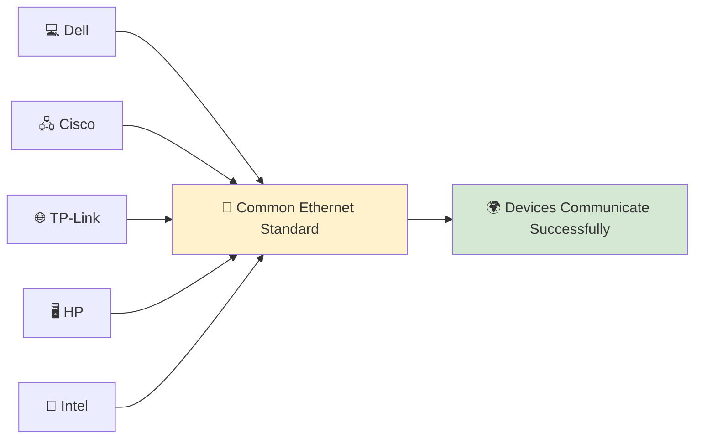

---

<!--
Image Description:
Create an educational illustration showing networking devices from different manufacturers (such as Dell, Cisco, HP, TP-Link, and Intel) all connected through a common Ethernet standard. Emphasize that despite being built by different companies, they can communicate because they follow the same networking standards.

Suggested Search Keywords:
Ethernet interoperability diagram
network devices different manufacturers
Ethernet standard illustration
IEEE 802.3 networking infographic
-->

<p align="center">

</p>

---

# 🌍 What Is a Standard?

A **standard** is an agreed-upon set of technical rules and specifications that manufacturers follow to ensure their products work together correctly.

Standards are used throughout technology.

For example:

| Technology | Standard Ensures |
|------------|------------------|
| 🔌 USB | Devices from different manufacturers can connect to computers. |
| 📶 Wi-Fi | Wireless devices communicate using the same protocols. |
| 🔵 Bluetooth | Phones, headphones, and speakers work together. |
| 🌐 Ethernet | Wired networking devices communicate reliably. |

By following common standards, organizations can build networks using equipment from many different vendors without worrying about compatibility.

This interoperability is one of the main reasons Ethernet became the world's most successful Local Area Network (LAN) technology.

---

> 💡 **Did You Know?**
>
> One of Ethernet's greatest strengths is **vendor interoperability**. A computer from one manufacturer can communicate with a switch from another and a router from a third because they all follow the same Ethernet standards.

---

# 🏛️ Who Creates Ethernet Standards?

Standards are not created by a single networking company.

Instead, they are developed by international standards organizations made up of engineers, researchers, manufacturers, and technology experts.

For Ethernet, the most important organization is the:

## **IEEE (Institute of Electrical and Electronics Engineers)**

The IEEE develops technical standards that ensure networking equipment remains compatible across manufacturers.

The Ethernet standard maintained by the IEEE is known as:

# **IEEE 802.3**

Throughout the rest of this lesson, you'll explore how IEEE 802.3 has evolved over time and how it defines modern Ethernet communication.

---

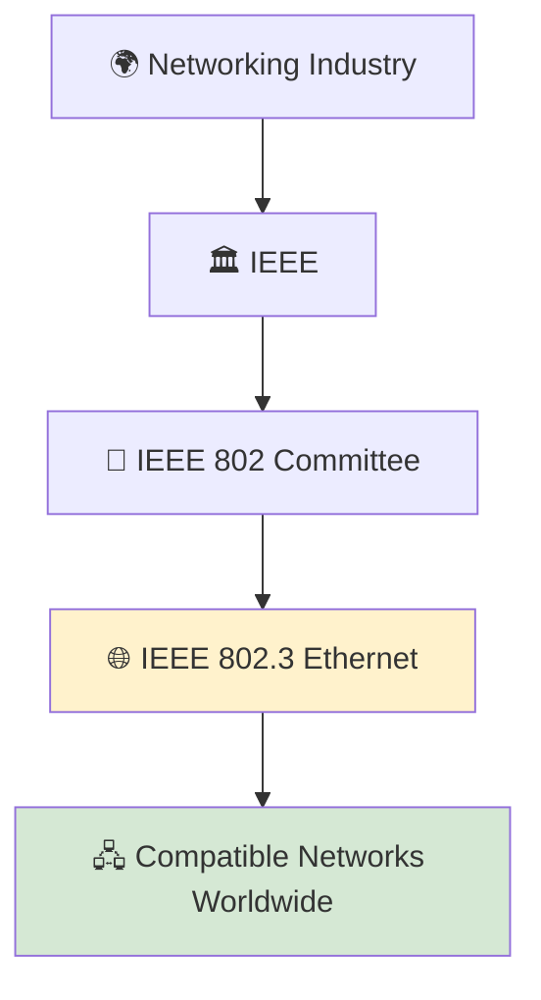

---

<!--
Image Description:
Create an educational infographic illustrating the role of the IEEE in networking. Show the IEEE organization leading to the IEEE 802 Committee and then to the IEEE 802.3 Ethernet standard, which enables networking devices worldwide to communicate using common rules.

Suggested Search Keywords:
IEEE 802.3 infographic
IEEE Ethernet standards diagram
network standards organization illustration
Ethernet standards education
-->

<p align="center">

</p>

---

> **🎯 Key Takeaway**
>
> Ethernet standards exist to solve the problem of interoperability. By following the common rules defined in **IEEE 802.3**, networking devices from different manufacturers can communicate reliably, making Ethernet the foundation of modern wired networking around the world.

---

# 📜 History and Evolution of Ethernet

Today, Ethernet is the most widely used technology for **Local Area Networks (LANs)**.

From home networks and office buildings to universities, cloud data centers, and enterprise campuses, billions of devices communicate using Ethernet every day.

However, Ethernet did not become the global networking standard overnight.

It evolved over several decades through continuous improvements in speed, reliability, cable technology, and networking standards.

Understanding this evolution helps explain why modern Ethernet looks very different from the original versions developed in the 1970s.

---

# 🏗️ The Birth of Ethernet

In the early 1970s, computers were becoming increasingly common in research laboratories and businesses.

Although multiple computers often worked in the same building, there was no simple or standardized way for them to share data and resources.

Researchers at **Xerox PARC (Palo Alto Research Center)** wanted a method that would allow computers to communicate efficiently over a shared cable.

In **1973**, computer engineer **Robert Metcalfe**, together with **David Boggs**, developed the first version of **Ethernet**.

The name **Ethernet** was inspired by the historical concept of the **"luminiferous ether,"** a substance once believed to carry light waves through space. Although this scientific theory was later disproven, the name reflected the idea of information traveling through a shared communication medium.

The original Ethernet operated at a speed of approximately **2.94 Mbps**, which was considered remarkably fast for its time.

---

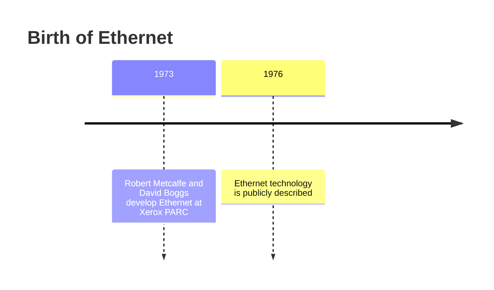

---

<!--
Image Description:
Create an educational illustration showing the early Ethernet network developed at Xerox PARC. Display several early computers connected to a shared coaxial cable, representing one of the first Ethernet networks.

Suggested Search Keywords:
Xerox PARC Ethernet illustration
early Ethernet network diagram
Robert Metcalfe Ethernet history
original Ethernet coaxial cable
-->

<p align="center">

</p>

---

# 🤝 The DIX Ethernet Standard

As Ethernet gained attention, three major technology companies recognized its potential:

- 🖥️ Digital Equipment Corporation (DEC)
- 💻 Intel
- 🖨️ Xerox

Together, they collaborated to publish a common Ethernet specification.

This became known as the **DIX Standard**, named after the first letters of the participating companies:

> **D**igital • **I**ntel • **X**erox

The DIX specification helped establish Ethernet as a practical networking technology and laid the foundation for future standardization.

---

# 🏛️ IEEE Standardizes Ethernet

Although the DIX specification was widely adopted, the networking industry needed an independent international standard that manufacturers around the world could follow.

In **1983**, the **IEEE (Institute of Electrical and Electronics Engineers)** officially standardized Ethernet as:

# **IEEE 802.3**

This standard defined how Ethernet devices communicate over wired networks, including specifications for:

- Frame transmission
- Physical media
- Signaling methods
- Data rates
- Network interoperability

From this point onward, Ethernet became an open international standard rather than a technology controlled by individual companies.

---

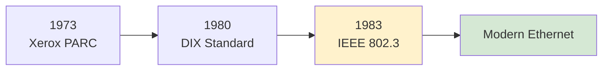

---

<!--
Image Description:
Create a timeline infographic illustrating the evolution of Ethernet from Xerox PARC to the DIX specification and finally to the IEEE 802.3 standard. Include company logos or representative icons for Xerox, Intel, DEC, and IEEE.

Suggested Search Keywords:
Ethernet history timeline
IEEE 802.3 evolution infographic
DIX Ethernet illustration
Ethernet development history
-->

<p align="center">

</p>

---

# 🚀 Ethernet Continues to Evolve

After IEEE 802.3 became the official Ethernet standard, engineers continued improving the technology.

Over the years, Ethernet evolved from a relatively slow networking technology into one capable of supporting modern cloud computing, virtualization, artificial intelligence, and hyperscale data centers.

Some major milestones include:

| Era | Typical Ethernet Speed | Common Environment |
|------|-----------------------:|--------------------|
| 1970s | 2.94 Mbps | Research Laboratories |
| 1980s | 10 Mbps | Early Office Networks |
| 1990s | 100 Mbps | Business LANs |
| 2000s | 1 Gbps | Enterprise Networks |
| 2010s | 10 Gbps | Servers and Data Centers |
| Today | 40G, 100G, 200G, 400G+ | Cloud Computing and Internet Backbone |

Notice that while Ethernet speeds have increased dramatically, the core goal has remained the same:

> **Enable reliable communication between networked devices using common standards.**

---

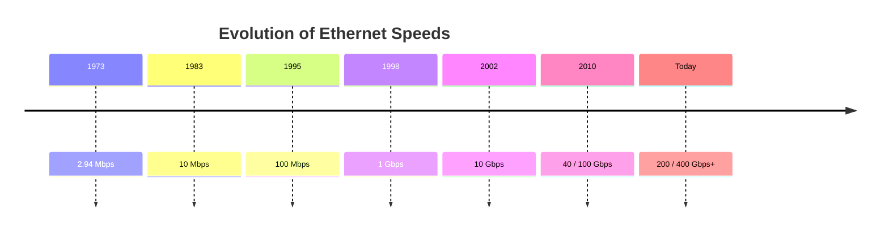

---

<!--
Image Description:
Create a modern infographic showing the evolution of Ethernet speeds from 2.94 Mbps to 400 Gbps and beyond. Use a horizontal timeline with icons representing offices, enterprise networks, servers, cloud computing, and data centers.

Suggested Search Keywords:
Ethernet speed evolution infographic
Ethernet timeline 10 Mbps to 400 Gbps
modern Ethernet history
Ethernet generations
-->

<p align="center">

</p>

---

> 💡 **Did You Know?**
>
> Modern Ethernet standards continue to evolve. Today, data centers and cloud providers commonly deploy **100 Gbps** and **400 Gbps** Ethernet links, while research and industry are actively developing even faster standards to meet growing demands for bandwidth.

---

# 🎯 Key Takeaway

Ethernet began as an experimental networking technology at **Xerox PARC** in the early 1970s and has evolved into the world's dominant wired networking standard. Through the efforts of companies like **Digital, Intel, and Xerox**, followed by the standardization work of the **IEEE**, Ethernet has continuously improved in speed, reliability, and compatibility while remaining the foundation of modern Local Area Networks.

---

# 🏷️ Understanding Ethernet Naming Conventions

If you've ever looked at Ethernet documentation, network switches, or certification books, you've probably seen names like these:

- 10BASE-T
- 100BASE-TX
- 1000BASE-T
- 1000BASE-SX
- 10GBASE-LR

At first glance, these names may seem confusing.

However, they are **not random names**.

Each Ethernet standard follows a structured naming convention defined by the **IEEE 802.3** standard.

Once you understand how these names are constructed, you can identify:

- ⚡ The transmission speed
- 📡 The signaling method
- 🔌 The transmission medium
- 📏 Sometimes even the supported transmission distance

Instead of memorizing dozens of Ethernet standards, you simply learn how to **decode the name**.

---

# 🧩 Breaking Down an Ethernet Name

Let's start with one of the most common Ethernet standards:

# **1000BASE-T**

This name can be divided into three parts:

```text
1000BASE-T

┌──────┬────────┬────┐
│1000  │ BASE   │ T  │
└──────┴────────┴────┘
```

Each part provides specific information about the Ethernet standard.

---

## ⚡ 1. Speed

The first number represents the **maximum data transmission speed**.

Examples include:

| Value | Speed |
|--------|-------|
| 10 | 10 Mbps |
| 100 | 100 Mbps |
| 1000 | 1 Gbps |
| 10G | 10 Gbps |
| 40G | 40 Gbps |
| 100G | 100 Gbps |

The larger the value, the greater the amount of data that can be transmitted every second.

---

## 📡 2. BASE

The word **BASE** stands for **Baseband**.

In **baseband transmission**, the entire communication channel carries **one signal at a time**.

This is the method used by modern Ethernet networks.

Unlike broadband systems—which can carry multiple signals simultaneously using different frequencies—Ethernet dedicates the full bandwidth of the cable to a single communication channel.

---

> 💡 **Did You Know?**
>
> Cable television networks commonly use **broadband transmission**, while traditional Ethernet uses **baseband transmission**.

---

## 🔌 3. Transmission Medium

The final letters describe the type of cable or optical technology used.

Some common examples are:

| Suffix | Meaning | Medium |
|---------|----------|--------|
| **T** | Twisted Pair | Copper Cable |
| **TX** | Twisted Pair (Fast Ethernet) | Copper Cable |
| **SX** | Short Wavelength | Multi-Mode Fiber |
| **LX** | Long Wavelength | Single-Mode Fiber (and some Multi-Mode) |
| **SR** | Short Range | Fiber Optic |
| **LR** | Long Range | Fiber Optic |

These suffixes help network engineers quickly identify which cable and hardware are required.

---


---

<!--
Image Description:
Create a labeled educational infographic that breaks down the Ethernet standard name "1000BASE-T". Highlight each section separately and explain that "1000" represents speed, "BASE" indicates baseband transmission, and "T" stands for twisted-pair copper cable.

Suggested Search Keywords:
1000BASE-T explanation
Ethernet naming convention infographic
IEEE Ethernet naming diagram
1000BASE-T breakdown
-->

<p align="center">

</p>

---

# 📚 Decoding Common Ethernet Standards

Now that you understand the naming convention, let's decode some of the most common Ethernet standards.

| Ethernet Standard | Meaning |
|-------------------|---------|
| **10BASE-T** | 10 Mbps over Twisted Pair Copper |
| **100BASE-TX** | 100 Mbps Fast Ethernet over Twisted Pair |
| **1000BASE-T** | 1 Gbps Gigabit Ethernet over Twisted Pair |
| **1000BASE-SX** | 1 Gbps over Short-Wavelength Multi-Mode Fiber |
| **1000BASE-LX** | 1 Gbps over Long-Wavelength Fiber |
| **10GBASE-SR** | 10 Gbps Short-Range Fiber |
| **10GBASE-LR** | 10 Gbps Long-Range Fiber |

Notice that although the names look complicated, they all follow the same basic structure.

Once you recognize the pattern, interpreting Ethernet standards becomes much easier.

---

# 🧠 Memory Trick

You can remember most Ethernet names using a simple formula:

```text
Speed
   +
Transmission Method
   +
Cable / Fiber Type
```

Example:

```text
1000BASE-T

↓

1000
↓

1 Gbps

+

BASE
↓

Baseband

+

T
↓

Twisted Pair
```

Whenever you encounter an unfamiliar Ethernet standard, break it into these three parts before trying to understand its purpose.

---

# 🌍 Why This Naming System Matters

Imagine a network administrator is asked to install equipment that supports **10GBASE-LR**.

Without understanding Ethernet naming conventions, they would need to search documentation just to identify the required cable type.

However, someone familiar with the naming system can immediately recognize:

- ⚡ 10 Gbps Ethernet
- 📡 Baseband communication
- 💡 Long-range fiber optic transmission

This saves time, reduces installation errors, and simplifies troubleshooting.

Understanding Ethernet names is therefore an essential skill for network technicians, system administrators, and cybersecurity professionals.

---

> 💡 **Certification Tip**
>
> Exams such as **CompTIA Network+**, **Cisco CCNA**, and many vendor certifications frequently test your ability to interpret Ethernet standard names. Rather than memorizing every standard individually, learn the naming pattern—you'll be able to decode unfamiliar standards with confidence.

---

# 🎯 Key Takeaway

Ethernet standard names are designed to communicate useful technical information. By breaking a name into its **speed**, **transmission method**, and **transmission medium**, you can quickly determine how an Ethernet technology operates without memorizing every individual standard. This systematic approach makes it much easier to understand and work with modern Ethernet networks.

---

# ⚡ Ethernet Speeds and Standards

Since its invention in the early 1970s, Ethernet has continuously evolved to meet the growing demand for faster and more reliable communication.

As computers became more powerful, applications became more data-intensive, and the Internet expanded globally, higher network speeds became essential.

Rather than replacing Ethernet with a completely new technology, engineers improved the existing IEEE 802.3 standard by introducing faster Ethernet generations while maintaining backward compatibility whenever possible.

Today, Ethernet ranges from a few megabits per second to hundreds of gigabits per second, making it suitable for everything from small home networks to massive cloud data centers.

---

# 📈 Evolution of Ethernet Speeds

Over the years, Ethernet has progressed through several major speed generations.

Each generation was designed to support the increasing demands of modern networking.

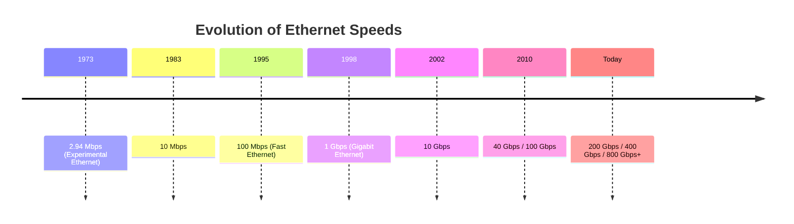

---

<!--
Image Description:
Create a horizontal timeline infographic illustrating the evolution of Ethernet speeds from 2.94 Mbps to 800 Gbps and beyond. Include representative icons for offices, enterprise networks, cloud computing, and data centers at each stage.

Suggested Search Keywords:
Ethernet speed evolution infographic
Ethernet generations timeline
10 Mbps to 400 Gbps Ethernet
network speed history

-->

<p align="center">

</p>

---

# 🟢 10 Mbps Ethernet

The first standardized Ethernet networks operated at **10 Mbps**.

At the time, this was more than enough for:

- 📄 Text documents
- 📧 Email
- 🖨️ File sharing
- 🏢 Small office networks

Common standards included:

- **10BASE5**
- **10BASE2**
- **10BASE-T**

Although these standards are now considered legacy technologies, they established the foundation for modern Ethernet networking.

---

# 🟡 Fast Ethernet (100 Mbps)

As businesses began transferring larger files and using graphical applications, 10 Mbps networks became a bottleneck.

To solve this problem, IEEE introduced **Fast Ethernet**, increasing network speed to **100 Mbps**.

Common standards include:

- **100BASE-TX**
- **100BASE-FX**

Fast Ethernet became the standard choice for business networks throughout the late 1990s and early 2000s.

---

# 🔵 Gigabit Ethernet (1 Gbps)

The rapid growth of the Internet, multimedia content, and networked applications created demand for even faster communication.

**Gigabit Ethernet** increased network speed to **1 Gbps (1000 Mbps)**.

Common standards include:

- **1000BASE-T** (Copper)
- **1000BASE-SX** (Multi-Mode Fiber)
- **1000BASE-LX** (Single-Mode Fiber)

Today, **1 Gbps Ethernet** is the most common wired networking speed found in:

- 🏠 Homes
- 🏢 Offices
- 🎓 Schools
- 🖥️ Small businesses

---

# 🟣 10 Gigabit Ethernet

As virtualization, cloud computing, and large-scale storage systems became more common, organizations required significantly higher bandwidth.

IEEE introduced **10 Gigabit Ethernet (10GbE)** to support these demanding workloads.

Common standards include:

- **10GBASE-T**
- **10GBASE-SR**
- **10GBASE-LR**

10 Gigabit Ethernet is widely used for:

- 🖥️ Servers
- ☁️ Data centers
- 💾 Storage networks
- 🏢 Enterprise backbone links

---

# 🚀 High-Speed Ethernet

Modern cloud providers and Internet service providers process enormous volumes of data every second.

To support these environments, IEEE introduced increasingly faster standards such as:

- **25 Gigabit Ethernet**
- **40 Gigabit Ethernet**
- **50 Gigabit Ethernet**
- **100 Gigabit Ethernet**
- **200 Gigabit Ethernet**
- **400 Gigabit Ethernet**
- **800 Gigabit Ethernet**

These technologies are primarily deployed in:

- 🌐 Internet backbone networks
- ☁️ Cloud platforms
- 🏢 Enterprise data centers
- 🤖 Artificial Intelligence infrastructure
- 📊 High-Performance Computing (HPC)

---


---

<!--
Image Description:
Create an infographic comparing Ethernet speeds and their common deployment environments. Show 1 Gbps for homes, 10 Gbps for enterprise networks, and 100–400 Gbps for cloud data centers and Internet backbone infrastructure.

Suggested Search Keywords:
Ethernet speeds comparison infographic
1G vs 10G vs 100G Ethernet
enterprise Ethernet speeds
data center networking illustration

-->

<p align="center">

</p>

---

# 📊 Ethernet Speed Comparison

| Ethernet Generation | Typical Speed | Common Standards | Typical Deployment |
|----------------------|--------------:|------------------|--------------------|
| Experimental Ethernet | 2.94 Mbps | Prototype | Xerox PARC |
| Standard Ethernet | 10 Mbps | 10BASE-T | Early LANs |
| Fast Ethernet | 100 Mbps | 100BASE-TX | Small Businesses |
| Gigabit Ethernet | 1 Gbps | 1000BASE-T | Homes & Offices |
| 10 Gigabit Ethernet | 10 Gbps | 10GBASE-T | Enterprise Networks |
| High-Speed Ethernet | 40–800 Gbps+ | QSFP-based Standards | Cloud & Data Centers |

---

# 🌍 Why Ethernet Keeps Getting Faster

Every new Ethernet generation was introduced to solve real-world challenges.

As technology evolved, networks needed to support:

- 📹 High-definition video streaming
- ☁️ Cloud computing
- 💾 Large file transfers
- 🤖 Artificial intelligence workloads
- 📡 Internet of Things (IoT)
- 🎮 Online gaming
- 📱 Billions of connected devices

Increasing Ethernet speeds allows organizations to transmit more data with lower latency and greater efficiency.

---

> 💡 **Did You Know?**
>
> Although **1 Gbps Ethernet** is more than sufficient for many homes and offices, large cloud providers often deploy hundreds or even thousands of **100 Gbps** and **400 Gbps** links inside a single data center to handle massive amounts of network traffic.

---

# 🎯 Key Takeaway

Ethernet has evolved from an experimental **2.94 Mbps** technology into a family of standards capable of transmitting **hundreds of gigabits per second**. Each new generation was developed to meet increasing demands for speed, capacity, and reliability while remaining compatible with the IEEE 802.3 standard. Today, Ethernet powers everything from home networks to the world's largest cloud data centers.

---

# 🔄 Duplex Communication

So far, you've learned about Ethernet cables, connectors, ports, naming conventions, and transmission speeds.

However, one important question remains:

> **How do two devices actually communicate over an Ethernet connection?**

Can both devices send data at the same time?

Or must they take turns?

The answer depends on the **communication mode**, also known as the **duplex mode**.

Duplex communication defines **how data flows between two connected devices**.

Understanding duplex modes is essential because they affect:

- 🚀 Network performance
- ⏱️ Communication efficiency
- 💥 Network collisions
- 🔧 Troubleshooting
- 🌐 Overall Ethernet reliability

---

# 📡 What Is Duplex Communication?

The word **duplex** simply refers to the **direction in which data can travel** between two devices.

Think of two people having a conversation.

Sometimes only one person speaks.

Sometimes each person takes turns speaking.

Sometimes both people can speak and listen simultaneously.

Ethernet communication follows the same principle.

There are **three communication modes**:

- 📢 Simplex
- 🔄 Half-Duplex
- ↔️ Full-Duplex

---


---

<!--
Image Description:
Create an educational illustration comparing the three communication modes: Simplex, Half-Duplex, and Full-Duplex. Show arrows indicating one-way communication for Simplex, alternating two-way communication for Half-Duplex, and simultaneous two-way communication for Full-Duplex.

Suggested Search Keywords:
simplex half duplex full duplex infographic
communication modes networking
network duplex comparison
-->

<p align="center">

</p>

---

# 📢 Simplex Communication

In **Simplex communication**, data flows in **only one direction**.

One device always sends information, while the other device only receives it.

There is **no return path** for communication.

A helpful real-world example is a **television broadcast**.

The television station sends signals to your TV, but your TV does not send data back to the broadcaster.

Other examples include:

- 📻 Traditional radio broadcasting
- 📺 Television transmission
- 📢 Public announcement systems
- 📡 GPS satellite broadcasts

---


---

<!--
Image Description:
Illustrate Simplex communication using a television station broadcasting to multiple televisions. Show arrows moving in only one direction.

Suggested Search Keywords:
simplex communication example
TV broadcast networking analogy
simplex transmission diagram
-->

<p align="center">

</p>

---

# 🔄 Half-Duplex Communication

In **Half-Duplex communication**, both devices can send and receive data, **but not at the same time**.

Only one device may transmit at any given moment.

If both devices attempt to send data simultaneously, one must wait until the other has finished.

A useful analogy is a **walkie-talkie**.

When one person presses the talk button, the other person must wait before replying.

Communication works in **both directions**, but only **one direction at a time**.

Common examples include:

- 📻 Walkie-talkies
- 🚓 Two-way radios
- 📡 Some wireless communication systems
- 🖧 Legacy Ethernet hubs

---


---

<!--
Image Description:
Create an illustration of two people communicating with walkie-talkies. Show that only one person can speak while the other listens, emphasizing alternating communication.

Suggested Search Keywords:
half duplex walkie talkie diagram
half duplex communication example
two-way radio communication
-->

<p align="center">

</p>

---

> 💡 **Did You Know?**
>
> Early Ethernet networks that used **hubs** operated in **half-duplex mode**. Because all connected devices shared the same communication medium, only one device could transmit at a time.

---

# ↔️ Full-Duplex Communication

**Full-Duplex communication** allows both devices to **send and receive data simultaneously**.

Neither device has to wait for the other to finish transmitting.

A good analogy is a **telephone call**.

Both people can speak and listen at the same time without waiting for turns.

Modern Ethernet networks connected through **switches** almost always operate in **full-duplex mode**.

Benefits include:

- 🚀 Higher throughput
- ⏱️ Lower latency
- ❌ No collisions
- 📈 Better overall network performance

---


---

<!--
Image Description:
Illustrate Full-Duplex communication using two people having a telephone conversation. Show arrows moving in both directions simultaneously.

Suggested Search Keywords:
full duplex communication example
telephone full duplex diagram
Ethernet full duplex illustration
-->

<p align="center">

</p>

---

# 📊 Comparing Duplex Modes

| Feature | 📢 Simplex | 🔄 Half-Duplex | ↔️ Full-Duplex |
|----------|:---------:|:--------------:|:--------------:|
| One-way communication | ✅ | ❌ | ❌ |
| Two-way communication | ❌ | ✅ | ✅ |
| Simultaneous transmission | ❌ | ❌ | ✅ |
| Devices take turns | ❌ | ✅ | ❌ |
| Collisions possible | ❌ | ✅ | ❌ |
| Common Ethernet today | ❌ | Rare | ✅ |

---

# 💥 What Is a Collision?

A **collision** occurs when **two devices attempt to transmit data at exactly the same time** over a shared communication medium.

When this happens:

- Both signals interfere with each other.
- Neither transmission is received correctly.
- The data must be retransmitted.

Collisions were common in **early Ethernet networks** that used **hubs** because every connected device shared the same communication channel.

Modern switched Ethernet has largely eliminated collisions by using **full-duplex communication**.

---

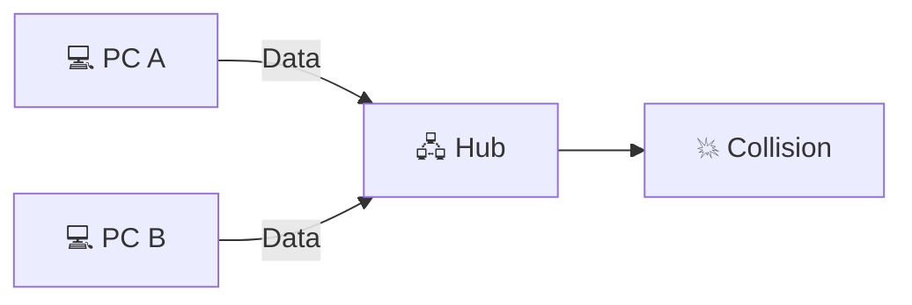

---

<!--
Image Description:
Show two computers sending data simultaneously to a hub, causing a collision. Use a burst icon where the signals meet.

Suggested Search Keywords:
Ethernet collision hub diagram
network collision illustration
CSMA CD collision example
-->

<p align="center">

</p>

---

# 🛡️ CSMA/CD (Collision Detection)

To reduce collisions on early Ethernet networks, Ethernet used a mechanism called **CSMA/CD** (**Carrier Sense Multiple Access with Collision Detection**).

In simple terms, devices followed this process:

1. 👂 Listen to the network before transmitting.
2. 🚦 If the cable is busy, wait.
3. 📤 If the cable is free, transmit data.
4. 💥 If a collision occurs, stop transmitting.
5. ⏳ Wait for a random amount of time.
6. 🔁 Try again.

This approach helped multiple devices share the same communication medium more efficiently.

---

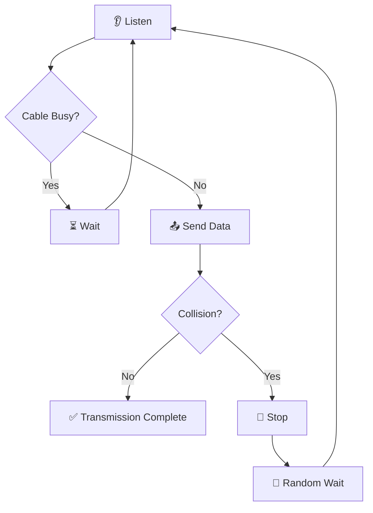

---

> 💡 **Certification Tip**
>
> **CSMA/CD** is primarily associated with **legacy half-duplex Ethernet** using hubs. Modern switched Ethernet operates in **full-duplex mode**, so collisions no longer occur during normal operation and CSMA/CD is generally not used.

---

# 🎯 Key Takeaway

Duplex communication determines how data flows between two network devices. **Simplex** allows one-way communication, **Half-Duplex** allows two-way communication one direction at a time, and **Full-Duplex** enables simultaneous communication in both directions. Modern Ethernet networks use **full-duplex communication with switches**, eliminating collisions and providing faster, more efficient, and more reliable network performance.

---

# ⚙️ Auto-Negotiation and Auto-MDI/MDIX

Imagine connecting a computer to a network switch using an Ethernet cable.

The computer supports:

- 🚀 10 Mbps
- 🚀 100 Mbps
- 🚀 1 Gbps

The switch also supports these same speeds.

When the cable is connected, an important question arises:

> **Which speed should they use?**

Should they communicate at **10 Mbps**, **100 Mbps**, or **1 Gbps**?

They must first agree on the best communication settings before any data is exchanged.

This process is known as **Auto-Negotiation**.

---

# 🤝 What Is Auto-Negotiation?

**Auto-Negotiation** is an Ethernet feature that allows two connected devices to automatically determine the best communication settings.

Instead of requiring a network administrator to manually configure every connection, the devices exchange information and select the highest settings that **both** devices support.

These settings typically include:

- ⚡ Connection speed
- 🔄 Duplex mode (Half or Full Duplex)
- 🖧 Other Ethernet capabilities

Once both devices agree, communication begins using those settings.

---

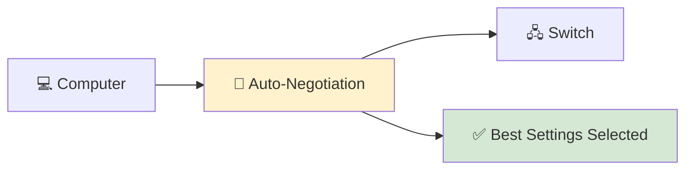

---

<!--
Image Description:
Create an educational illustration showing a computer and a network switch exchanging capability information before communication begins. Display supported speeds (10 Mbps, 100 Mbps, 1 Gbps) and show both devices agreeing on the highest common speed.

Suggested Search Keywords:
Ethernet auto negotiation diagram
switch auto negotiation illustration
Ethernet capability exchange
-->

<p align="center">

</p>

---

# 🧠 How Auto-Negotiation Works

The process happens automatically within milliseconds after an Ethernet cable is connected.

A simplified version looks like this:

1. 🔌 The cable is connected.
2. 📢 Both devices announce their capabilities.
3. 📋 Each device compares the supported features.
4. 🤝 Both devices agree on the highest compatible settings.
5. 🌐 Normal network communication begins.

This process happens automatically every time an Ethernet link is established.

---

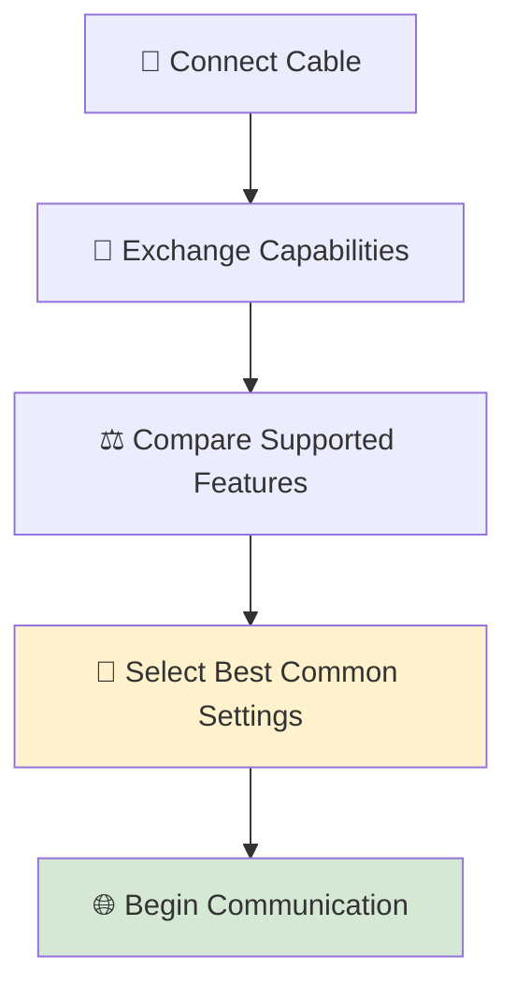

---

# 📊 Auto-Negotiation Example

Consider the following situation:

| Device | Supported Speeds |
|----------|------------------|
| 💻 Computer | 10 Mbps, 100 Mbps, 1 Gbps |
| 🖧 Switch | 100 Mbps, 1 Gbps |

Since both devices support **100 Mbps** and **1 Gbps**, they automatically choose the **highest common speed**.

Result:

> ✅ **1 Gbps Full-Duplex Connection**

If one device supported only **100 Mbps**, then both devices would communicate at **100 Mbps**, even if the other device was capable of higher speeds.

---

# 🎯 Why Auto-Negotiation Is Important

Without Auto-Negotiation, network administrators would need to manually configure every Ethernet connection.

This would:

- Increase installation time.
- Cause configuration mistakes.
- Lead to speed mismatches.
- Create duplex mismatches.
- Make troubleshooting more difficult.

Auto-Negotiation eliminates most of these problems by allowing devices to configure themselves automatically.

---

> 💡 **Did You Know?**
>
> Nearly every modern Ethernet device uses Auto-Negotiation by default. In most home and office networks, users never notice this process because it completes automatically in just a fraction of a second.

---

# 🔀 What Is Auto-MDI/MDIX?

In older Ethernet networks, connecting devices correctly required choosing the **right type of cable**.

For example:

| Connection | Required Cable |
|------------|----------------|
| PC → Switch | Straight-Through |
| Switch → Switch | Crossover |
| PC → PC | Crossover |

Using the wrong cable prevented communication.

Network technicians had to remember which cable type was required for every device combination.

---

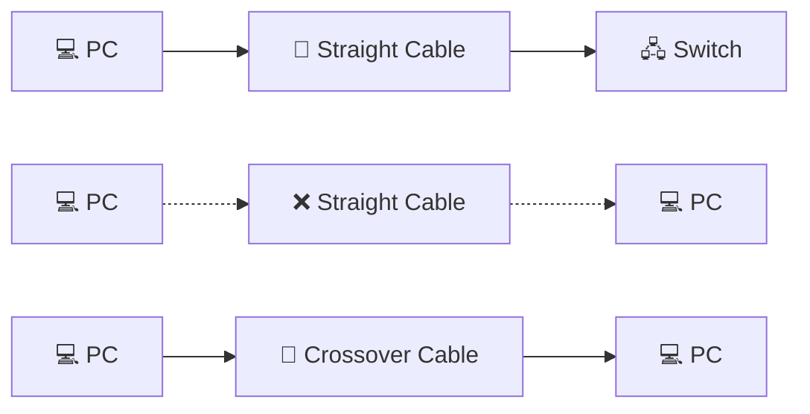

---

<!--
Image Description:
Create an educational comparison showing older Ethernet connections. Illustrate that a PC connected to a switch uses a straight-through cable, while connecting two similar devices (such as PC-to-PC or switch-to-switch) requires a crossover cable.

Suggested Search Keywords:
straight through vs crossover cable diagram
old Ethernet crossover cable
network cable comparison
-->

<p align="center">

</p>

---

# ✨ The Solution: Auto-MDI/MDIX

Modern Ethernet devices solve this problem using **Auto-MDI/MDIX**.

This technology automatically detects how the cable is wired and internally adjusts the transmit and receive pairs if necessary.

As a result, modern devices can communicate correctly regardless of whether a straight-through or crossover cable is used (provided the hardware supports Auto-MDI/MDIX).

For most users, this means:

> **Simply plug in the cable, and the devices handle the rest.**

---


---

<!--
Image Description:
Illustrate a modern computer connected to a network switch with a standard Ethernet cable. Highlight Auto-MDI/MDIX inside the switch, showing that it automatically detects and adjusts the wiring without requiring a specific cable type.

Suggested Search Keywords:
Auto MDI MDIX illustration
modern Ethernet auto crossover
Auto MDI MDIX networking diagram
-->

<p align="center">

</p>

---

# 📊 Auto-Negotiation vs Auto-MDI/MDIX

Although these technologies work together, they solve different problems.

| Feature | Auto-Negotiation | Auto-MDI/MDIX |
|----------|------------------|---------------|
| Purpose | Selects the best communication settings | Detects and adjusts cable wiring |
| Automatically Chooses Speed | ✅ | ❌ |
| Automatically Chooses Duplex | ✅ | ❌ |
| Eliminates Crossover Cable Requirements | ❌ | ✅ |
| Used on Modern Ethernet Devices | ✅ | ✅ |

Understanding the difference helps prevent confusion when configuring or troubleshooting Ethernet networks.

---

> 💡 **Certification Tip**
>
> Older certification exams often required candidates to identify when a **crossover cable** was necessary. Modern Ethernet devices with **Auto-MDI/MDIX** have largely eliminated this requirement, but understanding the concept remains important because legacy equipment is still found in some environments.

---

# 🎯 Key Takeaway

Before Ethernet devices begin communicating, they use **Auto-Negotiation** to automatically select the highest compatible speed and duplex mode. Modern devices also use **Auto-MDI/MDIX** to detect and adjust cable wiring automatically, eliminating the need to manually choose between straight-through and crossover cables in most situations. Together, these technologies make Ethernet networks easier to install, configure, and maintain.

---

# 🚀 Modern Ethernet Technologies

Ethernet has come a long way since its early days of connecting a few computers in an office.

Today, Ethernet is the foundation of:

- 🏠 Home networks
- 🏢 Enterprise campuses
- ☁️ Cloud computing
- 🖥️ Data centers
- 🌍 Internet Service Providers (ISPs)
- 🤖 Artificial Intelligence (AI) infrastructure

Modern Ethernet networks are no longer defined only by faster speeds. They also include technologies that improve flexibility, simplify installations, increase efficiency, and support new types of devices.

Let's explore some of the most important Ethernet technologies used today.

---

# ⚡ Power over Ethernet (PoE)

Traditionally, network devices required two separate cables:

- 🔌 A power cable
- 🌐 An Ethernet cable

This increased installation costs and limited where devices could be placed.

**Power over Ethernet (PoE)** solves this problem by allowing a single Ethernet cable to carry both:

- ⚡ Electrical power
- 📦 Network data

As a result, many devices no longer require a separate power adapter.

Common PoE-powered devices include:

- 📷 IP security cameras
- 📶 Wireless Access Points (APs)
- ☎️ VoIP phones
- 🚪 Smart door access systems
- 📺 Digital signage
- 🌡️ IoT sensors

---

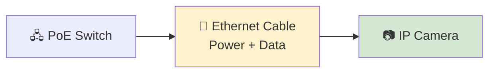

---

<!--
Image Description:
Create an educational diagram showing a PoE-enabled network switch connected to an IP camera using a single Ethernet cable carrying both electrical power and network data. Label the cable to indicate that it provides both functions.

Suggested Search Keywords:
Power over Ethernet diagram
PoE switch IP camera illustration
PoE networking infographic
-->

<p align="center">

</p>

---

# 🔌 SFP and SFP+ Modules

Modern enterprise switches often include small expansion slots instead of permanently attached network ports.

These slots accept **Small Form-factor Pluggable (SFP)** modules.

An SFP module allows administrators to choose the appropriate connection type for their network.

Depending on the module installed, a switch can support:

- 💡 Fiber optic connections
- 🔌 Copper Ethernet connections
- 🌍 Long-distance communication
- 🚀 High-speed links

For higher speeds, many devices use **SFP+**, which supports **10 Gigabit Ethernet**.

> 📚 **Already Covered**
>
> You learned about SFP and SFP+ modules in the **Connectors** lesson. Here, we simply highlight their role in modern Ethernet deployments.

---


---

<!--
Image Description:
Create an illustration of a modern enterprise switch with an SFP slot. Show an SFP module inserted into the slot and connected to a fiber optic cable.

Suggested Search Keywords:
SFP module switch
fiber SFP illustration
enterprise switch SFP port
-->

<p align="center">

</p>

---

# 🚀 Multi-Gig and High-Speed Ethernet

As businesses adopted cloud services, virtualization, video conferencing, and AI workloads, traditional Gigabit Ethernet became insufficient for some environments.

To meet these growing demands, IEEE introduced faster Ethernet standards, including:

- ⚡ 2.5 Gigabit Ethernet (2.5G)
- ⚡ 5 Gigabit Ethernet (5G)
- ⚡ 10 Gigabit Ethernet (10G)
- ⚡ 25 Gigabit Ethernet (25G)
- ⚡ 40 Gigabit Ethernet (40G)
- ⚡ 100 Gigabit Ethernet (100G)
- ⚡ 200 Gigabit Ethernet (200G)
- ⚡ 400 Gigabit Ethernet (400G)

Many of these speeds are used in enterprise networks and cloud data centers rather than typical home environments.

---

```mermaid
flowchart LR

A["1 Gbps"]

--> B["2.5 Gbps"]

--> C["5 Gbps"]

--> D["10 Gbps"]

--> E["25 Gbps"]

--> F["100 Gbps"]

--> G["400 Gbps+"]

style G fill:#D5E8D4
```

---

<!--
Image Description:
Create a horizontal infographic illustrating the progression of modern Ethernet speeds from 1 Gbps to 400 Gbps and beyond. Use icons representing homes, enterprise offices, and cloud data centers.

Suggested Search Keywords:
Ethernet speed progression infographic
modern Ethernet speeds
1G to 400G Ethernet
-->

<p align="center">

</p>

---

# ☁️ Ethernet in Modern Data Centers

Today's cloud providers operate some of the largest Ethernet networks ever built.

A single data center may contain:

- Thousands of servers
- Hundreds of switches
- Petabytes of storage
- Millions of simultaneous network connections

High-speed Ethernet enables these systems to exchange enormous amounts of data with low latency and high reliability.

This makes Ethernet an essential technology for:

- ☁️ Cloud computing
- 📊 Big data analytics
- 🤖 Artificial Intelligence
- 🎥 Streaming services
- 🌍 Global Internet infrastructure

---

<!--
Image Description:
Create an illustration of a modern data center showing rows of servers interconnected by high-speed Ethernet switches and fiber optic links. Include cloud icons to represent cloud computing services.

Suggested Search Keywords:
data center Ethernet network
cloud infrastructure illustration
enterprise networking infographic
-->

<p align="center">

</p>

---

# 🌍 The Future of Ethernet

Ethernet continues to evolve as technology advances.

Researchers and networking companies are developing faster standards to support future applications such as:

- 🤖 Artificial Intelligence (AI)
- 🥽 Virtual and Augmented Reality (VR/AR)
- 🌐 5G and future mobile networks
- 🚗 Autonomous vehicles
- 🛰️ Edge computing
- 📡 Massive Internet of Things (IoT) deployments

Although speeds continue to increase, the fundamental goal of Ethernet remains unchanged:

> **Provide reliable, standardized communication between network devices.**

---

> 💡 **Did You Know?**
>
> Modern hyperscale cloud providers such as Microsoft, Google, Amazon, and Meta rely on Ethernet for much of their internal networking infrastructure. High-speed Ethernet links connect servers, storage systems, and switches, enabling the massive scale of today's cloud services.

---

# 🎯 Key Takeaway

Modern Ethernet is much more than a simple wired connection. Technologies such as **Power over Ethernet (PoE)**, **SFP modules**, **Multi-Gig Ethernet**, and **high-speed fiber links** have transformed Ethernet into a flexible and scalable networking solution. From smart buildings and enterprise campuses to hyperscale data centers, Ethernet continues to power the digital world while evolving to meet future networking demands.

---
# 🛡️ Cybersecurity Perspective

Ethernet is one of the most reliable and widely used networking technologies in the world.

However, like any networking technology, it is **not immune to security threats**.

An Ethernet network is only as secure as the devices connected to it and the security controls implemented by network administrators.

Understanding the security risks associated with Ethernet helps organizations protect their networks from unauthorized access, data theft, and service disruptions.

---

# 🚪 Physical Security Matters

One of the biggest advantages of Ethernet is its reliability.

Ironically, one of its biggest security weaknesses is also its **physical accessibility**.

Unlike wireless networks, an attacker generally needs **physical access** to an Ethernet connection.

If an attacker gains access to:

- 🖧 A network switch
- 🔌 An unused Ethernet port
- 🏢 A wall network outlet
- 💻 An unattended office computer

they may be able to connect directly to the organization's internal network.

For this reason, protecting physical network infrastructure is a fundamental part of cybersecurity.

---

```mermaid
flowchart LR

A["🚪 Unauthorized Person"]

--> B["🔌 Unused Ethernet Port"]

--> C["🌐 Internal Network"]

style B fill:#F8CECC
style C fill:#FFE6CC
```

---

<!--
Image Description:
Create an educational illustration showing an unauthorized individual plugging a laptop into an unused Ethernet wall port inside an office building. Highlight that physical access can provide direct access to the internal network.

Suggested Search Keywords:
physical network security Ethernet
unauthorized Ethernet connection
network wall port security illustration
-->

<p align="center">

</p>

---

# 🔓 Rogue Devices

A **rogue device** is any unauthorized device connected to a network.

Examples include:

- 💻 Personal laptops
- 📶 Unauthorized wireless access points
- 🖧 Small unmanaged switches
- 📡 Rogue routers
- 📷 Unknown IP cameras

Although these devices may appear harmless, they can introduce serious security risks.

For example, a rogue wireless access point could create an unsecured entry point into an otherwise well-protected corporate network.

Network administrators should regularly monitor their networks to identify and remove unauthorized devices.

---

# 🌊 MAC Flooding Attacks

Ethernet switches use **MAC address tables** to determine where Ethernet frames should be forwarded.

Some attackers attempt to overwhelm these tables by sending thousands of fake MAC addresses.

This attack is known as a **MAC Flooding Attack**.

If the switch's MAC address table becomes full, some switches may begin forwarding traffic to multiple ports instead of the correct destination.

This increases the possibility that an attacker could intercept network traffic.

---

```mermaid
flowchart LR

A["👨‍💻 Attacker"]

--> B["📦 Thousands of Fake MAC Addresses"]

--> C["🖧 Switch"]

--> D["⚠️ MAC Table Overflow"]

style D fill:#F8CECC
```

---

<!--
Image Description:
Illustrate a MAC flooding attack where an attacker sends thousands of fake MAC addresses to an Ethernet switch, causing its MAC address table to overflow.

Suggested Search Keywords:
MAC flooding attack diagram
switch MAC table overflow
Ethernet security infographic
-->

<p align="center">

</p>

---

# 🔐 Port Security

Modern managed switches provide a feature called **Port Security**.

Port Security allows administrators to control which devices are permitted to connect to each switch port.

Common security controls include:

- 🔒 Limiting the number of MAC addresses allowed on a port.
- 📝 Allowing only approved MAC addresses.
- 🚫 Automatically disabling a port if unauthorized devices are detected.
- 📊 Logging security violations for investigation.

These features help prevent unauthorized devices from joining the network.

---

# 🪪 IEEE 802.1X Authentication

Many organizations require users and devices to **authenticate before receiving network access**.

One common solution is **IEEE 802.1X**, a standard for **port-based network access control**.

With 802.1X enabled:

1. 🔌 A device connects to a switch.
2. 🔐 The switch requests authentication.
3. 🪪 The user or device provides valid credentials.
4. ✅ If authentication succeeds, access is granted.
5. ❌ If authentication fails, network access is denied or restricted.

This prevents unknown devices from simply plugging into the network and communicating freely.

---

```mermaid
flowchart TD

A["🔌 Device Connects"]

--> B["🖧 Switch Requests Authentication"]

--> C{"Credentials Valid?"}

C -- Yes --> D["✅ Network Access Granted"]

C -- No --> E["❌ Access Denied"]

style D fill:#D5E8D4
style E fill:#F8CECC
```

---

<!--
Image Description:
Create a flow diagram illustrating IEEE 802.1X authentication. Show a device connecting to a switch, authentication being requested, credentials being verified, and either access granted or denied.

Suggested Search Keywords:
IEEE 802.1X authentication diagram
port based authentication illustration
network access control infographic
-->

<p align="center">

</p>

---

# 🛠️ Ethernet Security Best Practices

Organizations can significantly improve Ethernet security by following established best practices.

Some important recommendations include:

- 🔒 Disable unused switch ports.
- 🪪 Enable IEEE 802.1X authentication.
- 🛡️ Configure Port Security.
- 📋 Regularly monitor connected devices.
- 🖧 Separate sensitive systems using VLANs.
- 📈 Keep switch firmware updated.
- 🚪 Restrict physical access to networking equipment.
- 📊 Review switch logs for suspicious activity.

Security is not achieved through a single feature but through multiple layers of protection working together.

---

# 🌍 Ethernet and Defense in Depth

Ethernet provides the physical foundation for many modern networks, but security requires more than reliable communication.

Organizations combine Ethernet with multiple security technologies, including:

- 🔥 Firewalls
- 🛡️ Intrusion Detection Systems (IDS)
- 🚨 Intrusion Prevention Systems (IPS)
- 🌐 Network Access Control (NAC)
- 🔐 Virtual LANs (VLANs)
- 📡 Network monitoring solutions

Together, these technologies form a **Defense in Depth** strategy, where multiple security layers protect the network against different types of attacks.

---

> 💡 **Certification Tip**
>
> For certifications such as **CompTIA Network+**, **Security+**, and **Cisco CCNA**, remember that Ethernet security involves both **physical protection** (preventing unauthorized access to cables and ports) and **logical protection** (using features like Port Security and IEEE 802.1X). Modern network security depends on combining these layers rather than relying on a single defense.

---

# 🎯 Key Takeaway

Ethernet provides fast and reliable communication, but it must also be secured against physical and logical threats. Unauthorized devices, MAC flooding attacks, and unsecured switch ports can expose a network to compromise. Features such as **Port Security**, **IEEE 802.1X authentication**, proper physical security, and continuous network monitoring help organizations build secure Ethernet infrastructures that support both performance and cybersecurity.

---

# 📖 Module Progress

The **Network Media** chapter is designed to help you understand the physical technologies and standards that enable devices to communicate across modern computer networks.

So far, you have completed:

| Status | Lesson | What You Learned |
|---------|--------|------------------|
| ✅ | **README.md** | Overview of network transmission media and learning objectives |
| ✅ | **Copper Cables.md** | Twisted-pair cabling, Ethernet categories, RJ-45 connectors, and installation best practices |
| ✅ | **Coaxial Cable.md** | Shielded transmission media, cable construction, connectors, and real-world applications |
| ✅ | **Fiber Optic Cable.md** | Optical communication, fiber construction, single-mode and multi-mode fiber, connectors, and high-speed networking |
| ✅ | **Connectors.md** | Common networking connectors including RJ-45, RJ-11, BNC, LC, SC, ST, SFP, and QSFP |
| ✅ | **Ethernet Standards.md** | IEEE 802.3, Ethernet evolution, naming conventions, duplex communication, Auto-Negotiation, PoE, and modern Ethernet technologies |
| ⏭️ | **Wireless Standards.md** | Explore Wi-Fi standards, IEEE 802.11, wireless frequencies, and modern wireless networking technologies |

---

> 💡 **Learning Milestone**
>
> You have now completed the wired networking portion of the **Network Media** chapter.
>
> You understand how data travels through copper, coaxial, and fiber optic media, how devices are physically connected, and how Ethernet standards ensure reliable communication across networks.
>
> The final lesson introduces the wireless technologies that allow devices to communicate **without physical cables**, completing your understanding of modern network media.

---

# 🚀 Continue Your Journey

Congratulations! 🎉

You have successfully completed the **Ethernet Standards** lesson.

You now understand:

- ✅ Why Ethernet standards are necessary.
- ✅ The history and evolution of Ethernet.
- ✅ The role of **IEEE 802.3** in standardizing Ethernet.
- ✅ How to decode Ethernet naming conventions.
- ✅ Major Ethernet speed generations.
- ✅ Simplex, Half-Duplex, and Full-Duplex communication.
- ✅ Auto-Negotiation and Auto-MDI/MDIX.
- ✅ Modern Ethernet technologies such as PoE and SFP modules.
- ✅ The cybersecurity considerations associated with Ethernet networks.

You now have a solid understanding of how modern wired Ethernet networks operate—from the physical cable all the way to enterprise networking technologies.

---

# 🔄 Why Learn Wireless Standards Next?

Although Ethernet remains the preferred choice for **high-speed, reliable wired communication**, today's networks increasingly rely on **wireless connectivity**.

Smartphones, tablets, laptops, smart TVs, IoT devices, and countless other systems communicate using **Wi-Fi** instead of physical Ethernet cables.

Unlike Ethernet, wireless networking must address additional challenges such as:

- 📡 Radio wave transmission
- 📶 Signal interference
- 🔐 Wireless encryption
- 📍 Coverage and roaming
- ⚡ Wireless performance optimization

Understanding wireless standards will help you compare wired and wireless networking technologies and choose the right solution for different environments.

---

```mermaid
flowchart LR

A["🌐 Ethernet Standards"]
--> B["📶 Wireless Standards"]

style B fill:#FFF2CC
```

---

# 🎯 What You'll Learn Next

In the next lesson, you'll explore:

- The fundamentals of wireless networking.
- The IEEE 802.11 family of Wi-Fi standards.
- Wi-Fi generations from 802.11a to Wi-Fi 7.
- The differences between the 2.4 GHz, 5 GHz, and 6 GHz frequency bands.
- Wireless channels and channel width.
- Wireless security protocols including WEP, WPA, WPA2, and WPA3.
- Common wireless networking devices.
- Advantages and limitations of wireless communication.
- Cybersecurity considerations for Wi-Fi networks.

By the end of the lesson, you'll understand how modern wireless networks operate and how they complement traditional Ethernet networks.

---

<!--
━━━━━━━━━━━━━━━━━━━━━━━━━━━━━━━━━━━━━━━━━━━━━━━━━━━━━━━━━━━━━━━━━━
IMAGE PLACEHOLDER
━━━━━━━━━━━━━━━━━━━━━━━━━━━━━━━━━━━━━━━━━━━━━━━━━━━━━━━━━━━━━━━━━━

Title:
Next Lesson – Wireless Standards

Purpose:
Illustrate the transition from wired Ethernet networking to
modern wireless networking technologies. Highlight Wi-Fi as
the final topic in the Network Media chapter.

Image Type:
Educational Comparison Illustration

Image Description:
Create an educational illustration showing a transition from
Ethernet cables and switches to wireless communication.
Include laptops, smartphones, wireless access points, and
Wi-Fi signal icons. Highlight Wireless Standards as the next
lesson.

Suggested Search Keywords:
wireless networking infographic
Ethernet to Wi-Fi illustration
Wi-Fi standards education
wireless network overview

Suggested Filename:
Images/next_wireless_standards.png

━━━━━━━━━━━━━━━━━━━━━━━━━━━━━━━━━━━━━━━━━━━━━━━━━━━━━━━━━━━━━━━━━━
-->

<p align="center">

</p>

---

# 📚 Continue to the Next Lesson

The journey through **Network Media** concludes with one of the most important technologies in modern networking.

While Ethernet provides unmatched speed, stability, and reliability for wired communication, **wireless networking has transformed the way people connect to networks**, enabling mobility and convenience across homes, businesses, schools, and public spaces.

In the next lesson, you'll discover how **Wi-Fi standards**, radio frequencies, wireless security, and modern access points work together to provide secure and efficient wireless connectivity.

## ➜ Continue to the next lesson:

# **[📶 Wireless Standards.md](Wireless%20Standards.md)** →

---