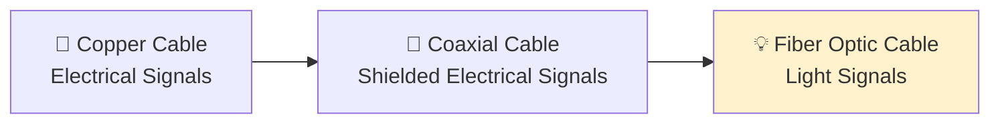
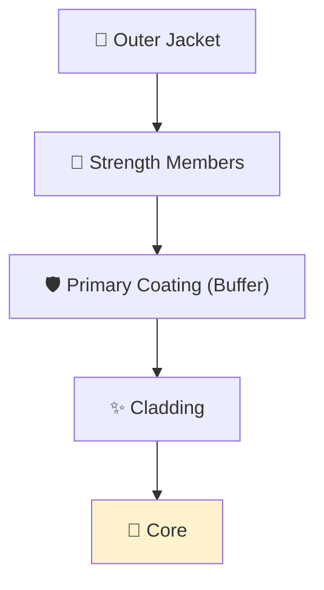
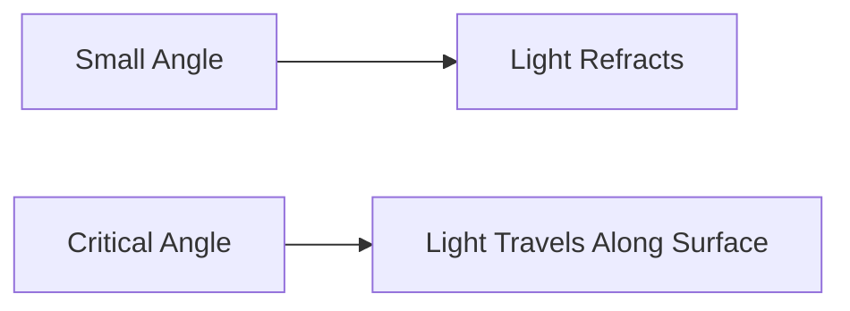
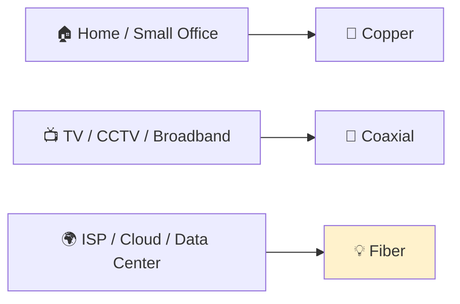
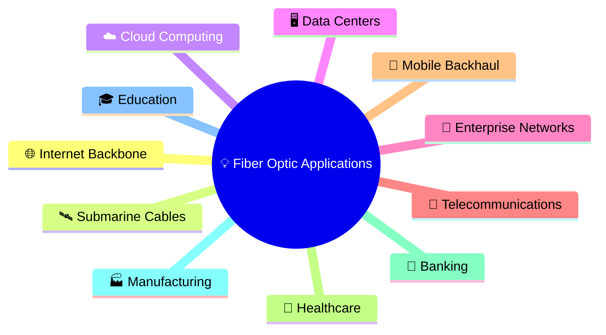
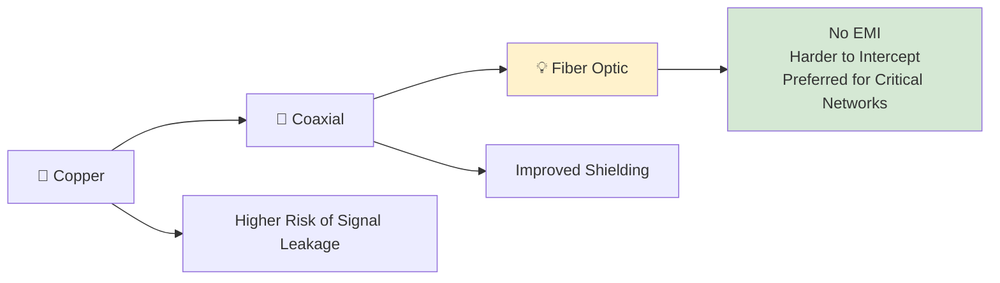
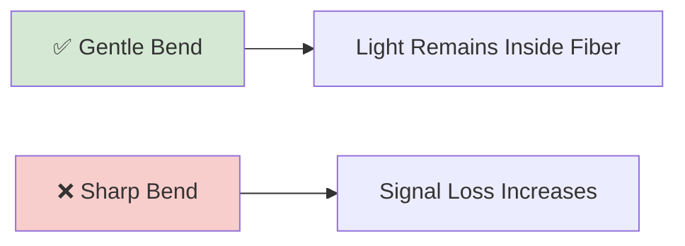
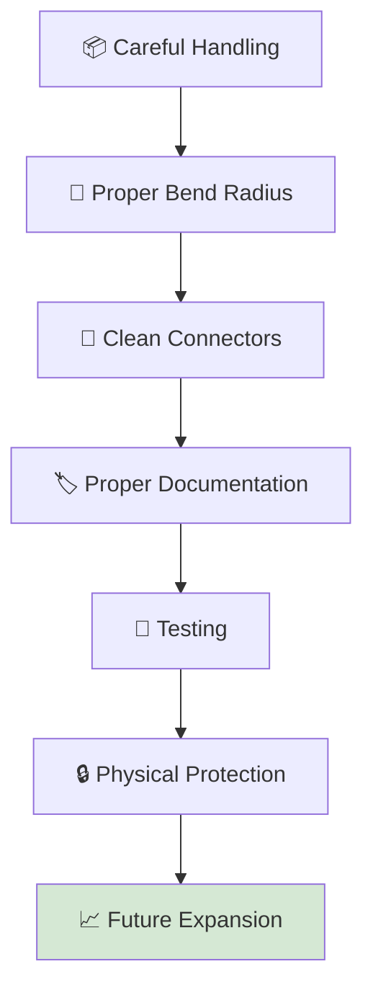

# 💡 Fiber Optic Cable

> *Fiber optic cables transmit data using pulses of light instead of electrical signals, making them the fastest, most secure, and highest-bandwidth transmission medium in modern computer networks.*

---


---

# 📚 Table of Contents

- [Why Learn Fiber Optic Cables?](#-why-learn-fiber-optic-cables)
- [Learning Objectives](#-learning-objectives)
- [Prerequisites](#-prerequisites)
- [Introduction](#-introduction)

---

# 🌍 Why Learn Fiber Optic Cables?

Modern society depends on the rapid movement of information. Every time you stream a movie, join a video conference, play an online game, or access cloud services, enormous amounts of data travel across continents in fractions of a second.

While copper cables have served networking for decades, today's demand for **higher speeds, greater bandwidth, and longer transmission distances** has pushed networks toward a more advanced technology:

> **Fiber Optic Cable**

Instead of transmitting information through electrical signals, fiber optic cables use **pulses of light** traveling through extremely thin strands of glass or plastic.

Because light travels incredibly fast and is unaffected by electromagnetic interference, fiber optics have become the preferred transmission medium for modern communication systems.

Today, fiber optic technology forms the backbone of:

- 🌍 The Internet
- ☁️ Cloud Computing
- 🏢 Enterprise Networks
- 🖥️ Data Centers
- 📡 Telecommunications
- 🛰️ International Submarine Cables
- 📱 Mobile Network Backhaul
- 🏥 Healthcare Systems
- 🏦 Financial Institutions

Without fiber optics, today's high-speed Internet and global communication infrastructure would not be possible.

---

# 🎯 Learning Objectives

By the end of this lesson, you will be able to:

- Explain what a fiber optic cable is.
- Understand how data travels using light.
- Describe the internal structure of a fiber optic cable.
- Explain the principle of **Total Internal Reflection (TIR)**.
- Differentiate between Single-Mode and Multi-Mode fiber.
- Understand common fiber transmission standards.
- Identify the advantages and disadvantages of fiber optics.
- Compare fiber optic cables with copper and coaxial cables.
- Recognize where fiber optics are used in real-world networking.
- Understand the cybersecurity benefits of fiber optic communication.

---

# 📖 Prerequisites

Before studying this lesson, you should already understand:

- ✅ Copper Cables
- ✅ Coaxial Cables
- ✅ Electrical signal transmission
- ✅ Guided transmission media
- ✅ Basic networking concepts

If you have completed the previous lessons in this module, you are ready to begin learning about fiber optic communication.

---

# 📘 Introduction

In the previous lessons, we studied **Copper Cables** and **Coaxial Cables**, both of which transmit information using **electrical signals**.

Although these technologies remain widely used, electrical communication has several limitations.

As signals travel through metal conductors, they gradually weaken over distance, are susceptible to electromagnetic interference (EMI), and have practical limits on bandwidth and transmission speed.

As networks grew larger and the demand for high-speed communication increased, engineers needed a new transmission medium that could overcome these challenges.

The solution was **Fiber Optic Cable**.

Rather than relying on electricity, fiber optic cables carry data as **tiny pulses of light** through ultra-thin strands of glass or plastic. This innovative approach allows information to travel over much greater distances with minimal signal loss while supporting dramatically higher data rates.

Today, fiber optics are the foundation of the modern Internet. They connect homes to Internet Service Providers (ISPs), link enterprise offices, power cloud data centers, and even span oceans through submarine cables that connect continents.

Throughout this chapter, you'll discover how fiber optic technology works, why it has become the preferred choice for high-performance networks, and how it compares with other transmission media you've already studied.

---



---

> **Key Idea**
>
> Copper and coaxial cables transmit data using **electricity**, whereas fiber optic cables transmit data using **light**. This fundamental difference enables fiber optics to deliver exceptional speed, longer transmission distances, greater bandwidth, and improved resistance to interference.

---

# 💡 What is a Fiber Optic Cable?

A **Fiber Optic Cable** is a **guided transmission medium** that transmits data as **pulses of light** through extremely thin strands of glass or plastic called **optical fibers**.

Unlike traditional copper-based cables, which rely on the movement of electrical signals through metal conductors, fiber optic cables use **light** as the transmission medium. This allows data to travel at incredibly high speeds over long distances while experiencing very little signal loss.

Because fiber optic communication is immune to electromagnetic interference (EMI) and offers exceptional bandwidth, it has become the preferred technology for modern networking, telecommunications, cloud computing, and global Internet infrastructure.

> **Definition**
>
> A **Fiber Optic Cable** is a guided transmission medium that carries digital information by transmitting pulses of light through optical fibers using the principle of **Total Internal Reflection (TIR)**.

---

# 🔍 Breaking Down the Definition

Let's understand the definition one concept at a time.

### 📌 Guided Transmission Medium

Like copper and coaxial cables, a fiber optic cable is a **guided transmission medium**.

This means the signal follows a **physical path** instead of traveling freely through the air.

In this case, the path is a thin optical fiber made of glass or plastic.

---

### 💡 Transmits Data Using Light

The biggest difference between fiber optic cables and other wired media is **how data is transmitted**.

Instead of sending electrical signals through a metal conductor, a fiber optic cable converts digital information into **rapid pulses of light**.

These light pulses travel through the fiber at extremely high speeds, with each pulse representing binary data (0s and 1s).

This method enables significantly faster communication while reducing signal degradation over long distances.

---

### 🧵 Optical Fibers

At the heart of every fiber optic cable are one or more **optical fibers**.

An optical fiber is an extremely thin strand of transparent material that guides light from one end of the cable to the other.

Most networking-grade optical fibers are made from **high-purity glass (silica)**, although some short-distance applications use specialized plastic fibers.

Despite being thinner than a human hair, these fibers are capable of carrying enormous amounts of information every second.

---

### 🌟 Guided by Total Internal Reflection

Light naturally wants to travel in a straight line.

So how does it travel through long cables that bend around buildings, underground conduits, and networking equipment?

The answer lies in a fascinating optical phenomenon called **Total Internal Reflection (TIR)**.

Instead of escaping through the sides of the fiber, light continuously reflects inside the cable, allowing it to travel long distances while remaining confined within the fiber.

> **Note:** We'll study Total Internal Reflection in detail later in this chapter, as it is the fundamental principle that makes fiber optic communication possible.

---

# 📜 Why Was Fiber Optic Technology Developed?

For many years, electrical cables such as twisted-pair and coaxial cables served as the primary transmission media for communication networks.

As technology advanced, however, the amount of data being transmitted increased dramatically.

People began demanding:

- Faster Internet connections
- High-definition video streaming
- Cloud computing services
- Video conferencing
- Online gaming
- Large-scale data centers
- Global communication networks

Traditional electrical cables faced several limitations:

- 📉 Signal attenuation over long distances
- ⚡ Electromagnetic interference (EMI)
- 📏 Limited transmission distance
- 🚧 Bandwidth limitations
- 🔒 Greater vulnerability to signal interception

Engineers needed a transmission medium capable of carrying much more data while maintaining signal quality over thousands of kilometers.

Fiber optic technology was developed to solve these challenges.

By replacing electrical signals with pulses of light, fiber optics dramatically increased transmission speed, reduced interference, and enabled reliable long-distance communication.

Today, nearly every major Internet backbone relies on fiber optic infrastructure.

---

# ⚖️ Fiber Optics vs Traditional Electrical Communication

| Feature | Copper / Coaxial | Fiber Optic |
|----------|------------------|-------------|
| Transmission Method | Electrical Signals | Light Pulses |
| Medium | Copper Conductor | Glass or Plastic Fiber |
| Electromagnetic Interference | Susceptible | Immune |
| Signal Loss | Higher | Very Low |
| Bandwidth | Moderate to High | Extremely High |
| Long-Distance Communication | Limited | Excellent |
| Security | Easier to Tap | More Difficult to Intercept |

This comparison highlights why fiber optic technology has become the preferred transmission medium for modern communication networks.

---

# 🌍 Real-World Example

Imagine you're making a video call with a friend living on another continent.

Although the conversation feels almost instantaneous, your voice and video travel thousands of kilometers through a global network of fiber optic cables.

Your data passes through Internet Service Providers (ISPs), regional data centers, and even submarine fiber optic cables beneath the oceans—all using pulses of light traveling through optical fibers.

Without fiber optic technology, modern services such as cloud computing, online gaming, video streaming, and real-time communication would be far slower and far less reliable.

---


---

> **Key Idea**
>
> A fiber optic cable is not simply "another type of cable." It represents a completely different method of communication, replacing electrical signals with pulses of light to achieve greater speed, higher bandwidth, longer transmission distances, and improved reliability.

---

# ⚙️ How Fiber Optic Communication Works

Now that we know what a fiber optic cable is, the next question is:

> **How can light carry digital information from one device to another?**

The answer lies in converting electrical data into **pulses of light**, transmitting those light pulses through an optical fiber, and then converting them back into electrical signals at the destination.

Although this process happens in milliseconds, it involves several important steps.

---

# 🔄 The Communication Process

A fiber optic communication system consists of three main stages:

1. **Transmission** – Converting electrical signals into light.
2. **Propagation** – Guiding light through the optical fiber.
3. **Reception** – Converting light back into electrical signals.

Together, these stages allow information to travel across cities, countries, and even continents with incredible speed and reliability.

---


---

# 📤 Step 1 — Data is Created

Everything begins with a device that wants to send information.

This could be:

- 💻 A computer
- 📱 A smartphone
- 🖥️ A server
- 🎮 A gaming console
- 📹 A security camera

Regardless of the device, all digital information is represented as **binary data (0s and 1s).**

For example:

```
01000001
```

To humans, this appears as meaningless numbers.

To a computer, however, these binary values represent letters, images, videos, voice recordings, and every other type of digital information.

Initially, this information exists as **electrical signals** inside the device.

---

# 💡 Step 2 — Electrical Signals Become Light

Electrical signals cannot travel directly through an optical fiber.

Instead, they must first be converted into **light pulses**.

This conversion is performed by an **Optical Transmitter**.

The optical transmitter contains a light source, typically:

- 🔴 LED (Light Emitting Diode)
- 🔺 Laser Diode

The transmitter rapidly switches the light source **ON** and **OFF**.

These flashes of light represent binary information.

For example:

| Binary | Light |
|---------|-------|
| 1 | 💡 Light ON |
| 0 | ⚫ Light OFF |

These pulses occur millions or even billions of times every second, allowing enormous amounts of information to be transmitted.

> **Note:** Modern high-speed networks commonly use laser diodes because they produce a more focused and powerful beam of light than LEDs.

---

# 🧵 Step 3 — Light Travels Through the Optical Fiber

Once the light pulses are generated, they enter the **core** of the fiber optic cable.

Rather than escaping through the sides of the cable, the light remains trapped inside the fiber and continues traveling toward the destination.

This happens because of a special optical phenomenon known as **Total Internal Reflection (TIR)**.

Instead of passing through the outer layer, the light continuously reflects within the fiber, allowing it to travel long distances while losing very little energy.

At this stage, you only need to understand that:

- The light remains inside the fiber.
- It follows the path of the cable, even around gentle bends.
- It experiences very little signal loss compared to electrical transmission.

> **We'll explore Total Internal Reflection in detail later in this chapter.**

---

# 📷 Step 4 — Light Reaches the Receiver

At the other end of the cable, the light pulses arrive at an **Optical Receiver**.

The receiver contains a special component called a **photodetector** (or photodiode).

Its job is to detect the incoming light pulses and convert them back into electrical signals.

In simple terms:

- 💡 Light detected → Electrical signal generated
- ⚫ No light detected → Different electrical signal generated

The original binary data is reconstructed with remarkable accuracy.

---

# 💻 Step 5 — The Receiving Device Processes the Data

Once the electrical signals have been recreated, they are delivered to the receiving device.

The computer, server, smartphone, or other device interprets the binary information and displays it as meaningful content.

Depending on the application, this could be:

- 📧 An email
- 🎬 A streaming video
- 🎮 Online game data
- 🎵 Music
- 📁 Downloaded files
- 🌐 A web page

To the user, the communication appears almost instantaneous, even though the data may have traveled thousands of kilometers.

---

# 🌍 End-to-End Example

Imagine you're watching a movie on a streaming platform.

The communication process looks like this:

1. A streaming server stores the movie.
2. The server converts the movie data into binary information.
3. An optical transmitter converts the binary data into light pulses.
4. The light travels through fiber optic cables across the Internet.
5. An optical receiver at your ISP converts the light back into electrical signals.
6. Your home router forwards the data to your computer or smart TV.
7. The movie begins playing on your screen.

Although this involves many networking devices, the transmission through the Internet backbone primarily relies on **fiber optic communication**.

---


---

# 📌 Why Is This Process So Fast?

Fiber optic communication offers several advantages over electrical transmission:

- ⚡ Light travels extremely fast.
- 📶 Massive amounts of data can be transmitted simultaneously.
- 📏 Signals travel much farther before needing amplification.
- 🛡️ Electromagnetic interference does not affect light.
- 📉 Signal attenuation is significantly lower than in copper cables.

These characteristics make fiber optics the preferred transmission medium for modern Internet infrastructure.

---

> **Key Idea**
>
> Fiber optic communication works by converting electrical data into pulses of light, transmitting those light pulses through an optical fiber, and converting them back into electrical signals at the destination. This process enables the high-speed, long-distance communication that powers today's Internet.

---

# 🧵 Structure of a Fiber Optic Cable

At first glance, a fiber optic cable may look similar to an ordinary electrical cable. However, its internal construction is completely different.

Unlike copper or coaxial cables, which use **metal conductors** to carry electrical signals, a fiber optic cable contains **ultra-thin optical fibers** that guide pulses of light from one end of the cable to the other.

Each layer of the cable has a specific purpose. Some layers are responsible for transmitting light, while others protect the delicate optical fibers from physical damage and environmental conditions.

Together, these layers ensure that data can travel over long distances with minimal signal loss and exceptional reliability.

---

## 📦 Layers of a Fiber Optic Cable

A typical fiber optic cable consists of five main layers:

1. 💎 Core
2. ✨ Cladding
3. 🛡️ Primary Coating (Buffer)
4. 💪 Strength Members
5. 🧥 Outer Jacket

---



---

# 💎 1. Core

The **core** is the innermost part of the fiber optic cable and the most important component.

It is a very thin strand of transparent material made from **high-purity glass (silica)** or, in some cases, specialized plastic.

The core serves as the **pathway through which light travels**.

Unlike copper cables, where electricity flows through a metal conductor, the core carries information using pulses of light.

Every bit of data transmitted through a fiber optic cable passes through this tiny central region.

Because light must travel with as little distortion as possible, the core is manufactured with exceptional precision and purity.

The diameter of the core varies depending on the type of fiber being used.

For example:

| Fiber Type | Typical Core Diameter |
|------------|----------------------:|
| Single-Mode Fiber (SMF) | 8–10 µm |
| Multi-Mode Fiber (MMF) | 50 µm or 62.5 µm |

> **Note:** A micrometer (µm) is one-millionth of a meter. For comparison, a human hair is typically around **70–100 µm** thick.

---

# ✨ 2. Cladding

Surrounding the core is a layer called the **cladding**.

Although the cladding is also made from glass, it has a slightly different optical property known as the **refractive index**.

This small difference is extremely important.

Instead of allowing light to escape from the core, the cladding causes the light to reflect back into the core repeatedly.

This keeps the light trapped inside the fiber as it travels toward its destination.

Without the cladding, light would leak out of the cable, making long-distance communication impossible.

The interaction between the **core** and **cladding** enables the optical phenomenon known as **Total Internal Reflection (TIR)**, which we'll explore in the next section.

---

# 🛡️ 3. Primary Coating (Buffer)

Outside the cladding is a protective layer called the **primary coating**, often referred to as the **buffer**.

This layer does **not** carry light or transmit data.

Instead, it protects the fragile glass fiber from:

- Scratches
- Moisture
- Dust
- Small impacts
- Micro-bending and vibration

Since optical fibers are extremely thin and delicate, even minor damage can reduce signal quality or cause the fiber to break.

The buffer acts as the first line of defense against everyday handling and environmental stress.

---

# 💪 4. Strength Members

The next layer consists of **strength members**.

Their purpose is to provide mechanical support and prevent the fiber from stretching or breaking during installation and operation.

These strength members are commonly made from **Kevlar®**, the same high-strength synthetic material used in bullet-resistant vests and protective equipment.

Strength members help the cable withstand:

- Pulling forces during installation
- Bending stress
- Twisting
- Physical tension
- External pressure

Without this reinforcement, the delicate optical fiber could be damaged while the cable is being installed through walls, underground conduits, or cable trays.

---

# 🧥 5. Outer Jacket

The outermost layer of the cable is called the **outer jacket**.

This is the protective covering that surrounds all internal components.

Depending on the cable's intended environment, the jacket may be designed to resist:

- Moisture
- Heat
- Chemicals
- Ultraviolet (UV) radiation
- Abrasion
- Fire

The outer jacket also helps identify the type of fiber cable through standardized colors used in many installations.

Although it never carries the signal itself, the jacket plays an essential role in protecting the cable throughout its service life.

---

# 🧩 How the Layers Work Together

Each layer of the fiber optic cable performs a unique function.

Together, they create a transmission medium that is fast, reliable, and durable.

| Layer | Purpose |
|--------|---------|
| 💎 Core | Carries pulses of light that represent digital data |
| ✨ Cladding | Keeps light confined within the core through Total Internal Reflection |
| 🛡️ Primary Coating | Protects the glass fiber from moisture, scratches, and minor damage |
| 💪 Strength Members | Prevent stretching and provide mechanical strength |
| 🧥 Outer Jacket | Shields the entire cable from environmental and physical damage |

Every layer is essential.

If any one of these layers is damaged or missing, the performance, reliability, or lifespan of the fiber optic cable can be significantly reduced.

---


---

> **Key Idea**
>
> The **core** carries the light, the **cladding** keeps the light inside the core, and the remaining layers protect the delicate optical fiber from mechanical and environmental damage. Together, these components enable high-speed, long-distance communication.

---

# 🌟 Total Internal Reflection (TIR)

In the previous section, we learned that the **core** carries light while the **cladding** keeps the light inside the fiber.

But this raises an important question:

> **Why doesn't the light simply escape through the sides of the cable?**

The answer is a fascinating optical phenomenon called **Total Internal Reflection (TIR).**

Without Total Internal Reflection, fiber optic communication would not be possible.

It is the fundamental principle that allows light to travel through optical fibers over long distances while carrying enormous amounts of digital information.

---

# 💡 Understanding the Behavior of Light

Before learning about Total Internal Reflection, we first need to understand how light behaves when it encounters different materials.

Imagine shining a flashlight toward a glass window.

Several things can happen:

- Some light may bounce back.
- Some light may pass through the glass.
- The light that enters the glass changes direction slightly.

These behaviors are known as **reflection** and **refraction**.

---

# 🔄 Reflection

**Reflection** occurs when light strikes a surface and bounces back into the same medium instead of passing through it.

For example:

- Looking into a mirror
- Seeing your reflection in calm water
- Sunlight reflecting off a polished car

In each case, the light does not continue through the surface—it reflects back.

---


---

# 🌈 Refraction

Unlike reflection, **refraction** occurs when light moves from one material into another.

When light changes materials, its speed changes.

Because its speed changes, its direction also changes.

For example:

- Air → Glass
- Air → Water
- Glass → Air

This bending of light is called **refraction**.

You've probably noticed this effect when placing a straw in a glass of water—the straw appears bent even though it is perfectly straight.

---


---

# 📐 Refractive Index

Every transparent material affects the speed of light differently.

This property is measured using the **Refractive Index (RI)**.

The refractive index tells us **how much a material slows down light**.

Some examples are:

| Material | Approximate Refractive Index |
|-----------|-----------------------------:|
| Vacuum | 1.000 |
| Air | 1.0003 |
| Water | 1.33 |
| Glass | 1.50 |

A **higher refractive index** means light travels more slowly through that material.

This difference in refractive index is what makes fiber optic communication possible.

---

# 📏 The Critical Angle

As light travels from a material with a **higher refractive index** to one with a **lower refractive index**, something interesting happens.

If the light strikes the boundary at a small angle, it passes through the second material.

As the angle becomes larger, less light escapes.

Eventually, a special angle is reached where the refracted light travels exactly along the boundary between the two materials.

This angle is called the **Critical Angle**.

It marks the point just before all the light begins reflecting back into the original material.

---



---

# ✨ Total Internal Reflection (TIR)

Now comes the key concept.

When light travels:

- from a material with a **higher refractive index**
- into a material with a **lower refractive index**
- **and** strikes the boundary at an angle **greater than the critical angle**

the light **does not leave the first material.**

Instead, **100% of the light is reflected back into the original material.**

This phenomenon is called **Total Internal Reflection (TIR).**

> **Definition**
>
> **Total Internal Reflection (TIR)** is the complete reflection of light back into a material when it attempts to move from a higher refractive index to a lower refractive index at an angle greater than the critical angle.

---


---

# 🧵 How TIR Works Inside a Fiber Optic Cable

Now let's connect this concept to the structure of a fiber optic cable.

Recall the two innermost layers:

- 💎 **Core**
- ✨ **Cladding**

The **core** has a **slightly higher refractive index** than the **cladding**.

This difference is intentional.

As the light travels through the core, it repeatedly strikes the boundary between the core and the cladding.

Because the light approaches at an angle greater than the critical angle, it undergoes **Total Internal Reflection** instead of escaping.

The result is that the light becomes trapped inside the core and continues moving toward the other end of the cable.

This process happens continuously—millions or even billions of times each second—allowing data to travel over very long distances with minimal signal loss.

---


---

# 🚗 Real-World Analogy

Imagine you're inside a long hallway with perfectly polished walls.

Every time you throw a rubber ball toward one wall, it bounces to the opposite wall.

The ball continues bouncing from side to side while moving forward until it reaches the end of the hallway.

Light behaves in a similar way inside a fiber optic cable.

Instead of escaping through the sides, it continuously reflects within the core while traveling toward the destination.

This repeated reflection keeps the signal confined inside the fiber.

---

# 📌 Why Is Total Internal Reflection Important?

Without Total Internal Reflection:

- ❌ Light would escape from the fiber.
- ❌ Data would be lost.
- ❌ Long-distance communication would become unreliable.
- ❌ Fiber optic networks would not function.

Because of TIR:

- ✅ Light remains inside the fiber.
- ✅ Signal loss is extremely low.
- ✅ Data can travel for many kilometers.
- ✅ High-speed communication becomes possible.
- ✅ Fiber optics can support the modern Internet.

---

> **Key Idea**
>
> Fiber optic communication depends on **Total Internal Reflection (TIR)**. By giving the **core** a slightly higher refractive index than the **cladding**, light is continuously reflected back into the core instead of escaping. This allows information to travel long distances using pulses of light with minimal signal loss.

---

# 🔍 Types of Fiber Optic Cable

Although all fiber optic cables transmit data using pulses of light, **not every fiber optic cable is designed for the same purpose**.

Different networking environments have different requirements.

For example:

- A small office building may only need to transmit data a few hundred meters.
- A university campus may require communication between buildings several kilometers apart.
- An Internet Service Provider (ISP) may need to transmit data across entire cities.
- International communication networks must carry data across oceans.

To meet these different requirements, fiber optic cables are primarily divided into **two types**:

1. 💡 Single-Mode Fiber (SMF)
2. 🌈 Multi-Mode Fiber (MMF)

The main difference between them is **how light travels through the core**.

---


---

# 💡 Single-Mode Fiber (SMF)

Single-Mode Fiber (SMF) is designed to carry **a single beam (mode) of light** through a very small core.

Because only one light path exists, the light travels almost perfectly straight from one end of the cable to the other.

This minimizes distortion and signal loss, making SMF ideal for **very long-distance communication**.

---

## 📏 Core Size

The core of a Single-Mode Fiber is extremely small.

Typical diameter:

- **8–10 µm (micrometers)**

Because the core is so narrow, only one light path can propagate through it.

---

## 💡 How Light Travels

In SMF, the light follows a nearly straight path through the core.

There are very few internal reflections compared to Multi-Mode Fiber.

This significantly reduces signal distortion and allows data to travel much farther before requiring amplification.

---


---

## ✅ Advantages of Single-Mode Fiber

- Extremely high bandwidth
- Very low signal attenuation
- Minimal signal distortion
- Supports communication over hundreds of kilometers
- Ideal for high-speed backbone networks

---

## ❌ Disadvantages

- More expensive equipment
- Requires laser transmitters
- Installation and alignment are more precise
- Higher deployment cost

---

## 🌍 Common Applications

Single-Mode Fiber is commonly used in:

- 🌍 Internet backbone networks
- 📡 Telecommunications
- ☁️ Cloud data centers
- 🏢 Enterprise WANs
- 🛰️ Submarine communication cables
- 📶 ISP infrastructure

Whenever communication must cover long distances, SMF is usually the preferred choice.

---

# 🌈 Multi-Mode Fiber (MMF)

Multi-Mode Fiber (MMF) has a **much larger core** than Single-Mode Fiber.

Because the core is wider, **multiple light rays (modes)** can travel through the fiber at the same time.

Each ray follows a slightly different path as it reflects inside the core.

This makes MMF well suited for short-distance communication, but less efficient over long distances.

---

## 📏 Core Size

Typical core diameters are:

- **50 µm**
- **62.5 µm**

The larger core makes it easier to inject light into the fiber.

---

## 🌈 How Light Travels

Instead of following one straight path, many light rays travel simultaneously.

Some rays travel almost straight, while others bounce repeatedly from the walls of the core.

Because different light rays arrive at slightly different times, signal distortion increases as distance grows.

This effect is known as **modal dispersion**.

---


---

## 📚 What is Modal Dispersion?

Since multiple light rays travel along different paths inside the fiber, they do **not all reach the destination at the same time**.

Some rays take shorter paths.

Others bounce more frequently and travel longer paths.

As a result, the light pulses begin to spread apart, making it harder for the receiver to distinguish individual bits over long distances.

This spreading of light pulses is called **modal dispersion**.

It is the primary reason why Multi-Mode Fiber is generally limited to shorter communication distances.

---

## ✅ Advantages of Multi-Mode Fiber

- Lower installation cost
- Easier to connect
- Larger core simplifies alignment
- Uses less expensive light sources such as LEDs
- Ideal for short-distance networking

---

## ❌ Disadvantages

- Higher signal distortion
- Greater attenuation than SMF
- Limited transmission distance
- Lower maximum bandwidth over long distances

---

## 🌍 Common Applications

Multi-Mode Fiber is widely used in:

- 🏢 Office buildings
- 🎓 University campuses
- 🖥️ Local data centers
- 🏭 Industrial facilities
- 🏥 Hospitals
- 🏫 School networks

Whenever communication distances are relatively short, MMF is often the most cost-effective solution.

---

# ⚖️ Single-Mode vs Multi-Mode Fiber

| Feature | Single-Mode Fiber (SMF) | Multi-Mode Fiber (MMF) |
|----------|-------------------------|------------------------|
| Core Diameter | 8–10 µm | 50 µm or 62.5 µm |
| Number of Light Paths | One | Multiple |
| Light Source | Laser | LED or Laser |
| Transmission Distance | Very Long | Short |
| Signal Distortion | Very Low | Higher |
| Modal Dispersion | Negligible | Significant |
| Cost | Higher | Lower |
| Installation | More Precise | Easier |
| Typical Use | Internet backbone, ISPs, WANs | LANs, campuses, buildings |

---

# 🤔 Which One Should You Choose?

The choice depends on the networking requirements.

Choose **Single-Mode Fiber** when:

- Long transmission distances are required.
- Maximum bandwidth is important.
- Building backbone or ISP infrastructure.
- Connecting cities or countries.

Choose **Multi-Mode Fiber** when:

- Communication distances are short.
- Budget is limited.
- Networking within buildings or campuses.
- High-speed LAN connectivity is required.

There is no universally "better" option—each type is designed for specific networking scenarios.

---

> **Key Idea**
>
> Single-Mode Fiber uses a **small core** that allows only one light path, making it ideal for long-distance, high-speed communication. Multi-Mode Fiber uses a **larger core** that supports multiple light paths, making it more affordable and suitable for short-distance networks, though it experiences greater signal distortion due to **modal dispersion**.

---# 🚀 Advantages of Fiber Optic Cable

Fiber optic technology has become the preferred transmission medium for modern communication networks because it offers several significant advantages over traditional copper-based cables.

By transmitting information as **pulses of light** instead of electrical signals, fiber optics overcome many of the limitations associated with electrical communication.

These advantages make fiber optic cables the backbone of today's Internet, cloud computing infrastructure, enterprise networks, and telecommunications systems.

---

# ⚡ 1. Extremely High Speed

One of the biggest advantages of fiber optic cables is their incredible transmission speed.

Because information travels as pulses of light, fiber optics can carry enormous amounts of data every second.

Modern fiber networks support speeds ranging from:

- Gigabits per second (Gbps)
- Tens of Gigabits per second
- Hundreds of Gigabits per second
- Terabits per second in advanced backbone networks

This makes fiber ideal for:

- Cloud computing
- Video streaming
- Online gaming
- Artificial Intelligence workloads
- Data centers

---

# 📶 2. Massive Bandwidth

Bandwidth refers to the amount of data that can be transmitted within a given period.

Fiber optic cables provide significantly greater bandwidth than copper or coaxial cables.

Higher bandwidth allows networks to support:

- More users
- More devices
- Higher-resolution video
- Larger file transfers
- Simultaneous applications

This is why modern Internet Service Providers (ISPs) increasingly deploy fiber optic infrastructure.

---

# 📏 3. Long-Distance Communication

Electrical signals gradually weaken as they travel through copper cables.

This weakening is known as **attenuation**.

Fiber optic cables experience much lower attenuation, allowing signals to travel much greater distances before requiring regeneration or amplification.

As a result, fiber is ideal for:

- Metropolitan networks
- National communication systems
- International Internet backbones
- Submarine communication cables

---

# 🛡️ 4. Immunity to Electromagnetic Interference (EMI)

Copper cables carry electrical signals, making them vulnerable to:

- High-voltage equipment
- Electric motors
- Power cables
- Radio transmitters
- Lightning

Fiber optic cables transmit light rather than electricity.

Because of this, electromagnetic interference (EMI) has virtually no effect on fiber optic communication.

This results in more stable and reliable data transmission.

---

# 🔒 5. Improved Security

Fiber optic cables are much more difficult to intercept than copper cables.

Unlike electrical cables, fiber optics do not radiate electromagnetic signals that can be easily monitored.

Attempting to tap a fiber cable usually requires physically accessing and altering the cable, which often introduces detectable signal loss.

For this reason, fiber is widely used in environments where protecting sensitive data is critical, such as:

- Government agencies
- Military networks
- Financial institutions
- Healthcare organizations
- Data centers

> **Note:** While more secure, fiber optic cables are **not impossible** to intercept. Specialized tapping techniques do exist, which we'll discuss later in this chapter.

---

# 📉 6. Low Signal Loss

Every transmission medium loses some signal strength as data travels.

Fiber optic cables experience significantly lower signal loss than copper cables.

This means:

- Better performance
- Fewer repeaters
- Longer cable runs
- Higher communication reliability

---

# 🔥 7. Electrical Isolation

Since fiber carries light instead of electricity, it does not conduct electrical current.

This provides several benefits:

- No risk of electrical shock
- No ground loops
- Better protection against lightning-induced surges
- Safe operation near high-voltage equipment

---

# 🌱 8. Lightweight and Compact

Optical fibers are extremely thin and lightweight.

Compared with large bundles of copper cables, fiber optic cables:

- Occupy less space
- Weigh less
- Are easier to transport
- Simplify cable management in large installations

This is especially valuable in data centers where thousands of cables may be installed.

---

# 🚀 9. Future Scalability

The demand for network bandwidth continues to grow every year.

Fiber optic infrastructure provides enough capacity to support future technologies without requiring complete replacement of the physical cable.

In many cases, increasing network speed only requires upgrading the networking equipment at each end of the fiber rather than replacing the cable itself.

This makes fiber a long-term investment.

---

# 📊 Summary of Advantages

| Advantage | Benefit |
|------------|---------|
| ⚡ High Speed | Extremely fast data transmission |
| 📶 Massive Bandwidth | Supports large amounts of traffic |
| 📏 Long Distance | Low attenuation over many kilometers |
| 🛡️ EMI Immunity | Stable communication in electrically noisy environments |
| 🔒 Better Security | Difficult to intercept without physical access |
| 📉 Low Signal Loss | Reliable long-distance communication |
| 🔥 Electrical Isolation | No electrical current or lightning conduction |
| 🌱 Lightweight | Easier installation and cable management |
| 🚀 Scalable | Supports future networking technologies |

---

> **Key Idea**
>
> Fiber optic cables combine **high speed, massive bandwidth, long-distance capability, and strong resistance to interference**, making them the preferred transmission medium for modern communication networks. These advantages explain why fiber forms the backbone of today's Internet and enterprise infrastructure.

---

# ⚠️ Disadvantages of Fiber Optic Cable

Although fiber optic cables offer exceptional performance, they are **not the perfect solution for every networking scenario**.

Like every transmission medium, fiber optics have certain limitations that organizations must consider before deployment.

Understanding these disadvantages helps network engineers choose the most appropriate cable for a particular environment.

---

# 💰 1. Higher Initial Cost

One of the biggest disadvantages of fiber optic technology is its **higher upfront cost**.

Compared to copper and coaxial cables, fiber optic installations generally require:

- More expensive cables
- Specialized networking equipment
- Optical transceivers
- Fiber patch panels
- Professional installation

Although prices have decreased significantly over the years, deploying a fiber optic network is still usually more expensive than installing a traditional copper network.

> **Important:** While the initial cost is higher, fiber often becomes more cost-effective over time because of its longer lifespan, greater reliability, and ability to support future network upgrades.

---

# 🔧 2. Difficult Installation

Installing fiber optic cables requires greater precision than installing copper cables.

Unlike copper wiring, optical fibers are extremely thin and fragile.

Technicians must carefully:

- Route the cable
- Avoid excessive bending
- Protect the fiber from damage
- Maintain proper cleanliness
- Follow strict installation procedures

Improper installation can reduce network performance or permanently damage the cable.

---

# 💎 3. Fragility

The core of a fiber optic cable is made of **glass or specialized plastic**.

Although the cable contains several protective layers, the optical fiber itself is much more delicate than a copper conductor.

Excessive force can cause:

- Cracks
- Breaks
- Increased signal loss
- Complete communication failure

For this reason, fiber cables must always be handled with care during transportation and installation.

---

# 🔄 4. Limited Bend Radius

Fiber optic cables cannot be bent sharply.

If a cable is bent beyond its recommended **minimum bend radius**, some of the light may escape from the core.

This can result in:

- Increased attenuation
- Reduced signal quality
- Communication errors
- Permanent cable damage in severe cases

Modern bend-insensitive fibers have improved this limitation, but proper cable routing remains essential.

---

# 🛠️ 5. Specialized Equipment Required

Unlike copper Ethernet cables, fiber optic communication requires dedicated optical equipment.

Typical fiber installations use:

- Optical transceivers
- Fiber switches
- Optical Network Terminals (ONTs)
- Media converters
- Fusion splicing equipment
- Optical power meters
- OTDR (Optical Time Domain Reflectometer)

These devices increase both the complexity and cost of deployment.

---

# 🔍 6. More Difficult to Repair

Repairing a damaged fiber optic cable is more challenging than repairing copper wiring.

In many cases, technicians must:

- Locate the exact fault
- Remove the damaged section
- Perform precision fusion splicing
- Test the repaired fiber
- Verify signal quality

This process requires specialized tools and trained personnel.

---

# 👨‍🔧 7. Skilled Technicians Required

Because fiber optic systems involve optical transmission rather than electrical signals, installation and maintenance require specialized knowledge.

Technicians must understand topics such as:

- Fiber handling
- Splicing
- Connector cleaning
- Optical testing
- Light loss measurement
- Safety procedures

Organizations may therefore need additional training or certified fiber technicians.

---

# 👁️ 8. Invisible Laser Light Can Be Hazardous

Many fiber optic communication systems use **laser diodes** as their light source.

Unlike visible light, the laser used in many fiber systems is **infrared**, meaning it cannot be seen by the human eye.

Looking directly into an active fiber optic connector can damage the eyes.

For this reason:

- Never look directly into a fiber connector.
- Always assume a fiber cable is active.
- Use appropriate testing equipment to verify whether light is present.

Following proper safety procedures is essential when working with fiber optic systems.

---

# 📊 Summary of Disadvantages

| Disadvantage | Impact |
|--------------|--------|
| 💰 Higher Initial Cost | More expensive infrastructure and equipment |
| 🔧 Difficult Installation | Requires careful handling and precision |
| 💎 Fragility | Optical fibers can be damaged if mishandled |
| 🔄 Limited Bend Radius | Sharp bends may increase signal loss |
| 🛠️ Specialized Equipment | Requires optical networking hardware |
| 🔍 Difficult Repairs | Fiber repair is more complex than copper repair |
| 👨‍🔧 Skilled Technicians | Installation and maintenance require training |
| 👁️ Laser Safety | Active fibers must be handled carefully |

---

# ⚖️ Is Fiber Still Worth It?

Despite these disadvantages, fiber optic technology remains the preferred choice for modern communication networks.

Its advantages—including exceptional speed, massive bandwidth, low signal loss, and resistance to electromagnetic interference—far outweigh the additional cost and installation complexity for most enterprise and service provider networks.

For this reason, organizations around the world continue to replace aging copper infrastructure with fiber optic networks.

---

> **Key Idea**
>
> Fiber optic cables are more expensive, delicate, and complex to install than copper cables. However, their superior performance, scalability, and reliability make them the transmission medium of choice for modern high-speed networks.

---
# ⚖️ Fiber Optic vs Copper vs Coaxial Cable

Throughout this chapter, we have explored the three major guided transmission media used in computer networking:

- 🔌 Copper Cables
- 📡 Coaxial Cables
- 💡 Fiber Optic Cables

Each transmission medium was developed to solve different communication challenges.

There is **no single "best" cable** for every situation. Instead, network engineers choose the appropriate cable based on factors such as speed, distance, cost, installation requirements, and the operating environment.

Understanding the strengths and weaknesses of each transmission medium allows you to select the most suitable technology for a given networking scenario.

---

# 📊 Complete Comparison

| Feature | 🔌 Copper Cable | 📡 Coaxial Cable | 💡 Fiber Optic Cable |
|----------|----------------|-----------------|----------------------|
| Transmission Medium | Electrical Signals | Electrical Signals | Light Pulses |
| Cable Type | Guided | Guided | Guided |
| Conductor Material | Copper | Copper Core | Glass or Plastic Fiber |
| Maximum Bandwidth | High | Higher than Twisted Pair | Extremely High |
| Typical Transmission Distance | Up to 100 m (Ethernet) | Hundreds of meters | Several kilometers to hundreds of kilometers |
| Signal Attenuation | Moderate | Lower than Copper | Very Low |
| Electromagnetic Interference (EMI) | Susceptible | Highly Resistant | Immune |
| Crosstalk | Possible | Very Low | None |
| Security | Easier to tap | More secure than Copper | Most difficult to intercept |
| Installation | Easy | Moderate | More Complex |
| Flexibility | High | Moderate | Limited (minimum bend radius) |
| Physical Durability | Good | Good | Delicate internal fiber |
| Weight | Moderate | Heavy | Lightweight |
| Cost | Low | Moderate | Higher |
| Maintenance | Easy | Moderate | Requires specialized tools |
| Typical Speed | Up to Multi-Gigabit Ethernet | High | Extremely High (Gbps–Tbps) |
| Primary Applications | LANs, Offices, Homes | Cable TV, Broadband, CCTV | Internet Backbone, Data Centers, WANs, Cloud Networks |

---

# 🌍 Where Each Cable Is Commonly Used

Different environments require different transmission media.

### 🔌 Copper Cable

Copper cables are ideal for short-distance communication where low cost and easy installation are priorities.

Common uses include:

- 🏠 Home networks
- 🏢 Office LANs
- 🖨️ Printers
- 💻 Desktop computers
- 📞 VoIP phones
- 🎮 Gaming devices

---

### 📡 Coaxial Cable

Coaxial cables provide better shielding than twisted-pair cables and are widely used for radio-frequency communication.

Common uses include:

- 📺 Cable Television (CATV)
- 🌐 Broadband Internet
- 📹 CCTV Systems
- 📡 RF Communication
- 🛰️ Satellite Communication

---

### 💡 Fiber Optic Cable

Fiber optic cables provide the highest performance and are used wherever speed, reliability, and long-distance communication are essential.

Common uses include:

- 🌍 Internet Backbone
- ☁️ Cloud Infrastructure
- 🖥️ Data Centers
- 🏢 Enterprise Networks
- 📡 Telecommunications
- 🛰️ Submarine Communication Cables
- 📱 Mobile Network Backhaul

---

# 📈 Choosing the Right Cable

The choice of transmission medium depends on the requirements of the network.

### Choose 🔌 Copper Cable when:

- Communication distances are short.
- Installation costs must remain low.
- Standard Ethernet networking is required.
- Easy maintenance is important.

---

### Choose 📡 Coaxial Cable when:

- Better shielding is required.
- Supporting cable television or broadband infrastructure.
- Carrying radio-frequency signals.
- Working with CCTV systems.

---

### Choose 💡 Fiber Optic Cable when:

- Maximum speed is required.
- Communication spans long distances.
- High bandwidth is essential.
- Electromagnetic interference is present.
- Network security and reliability are priorities.

---



---

# 🧠 Quick Decision Guide

| Requirement | Best Choice |
|-------------|-------------|
| Lowest Cost | 🔌 Copper |
| Easy Installation | 🔌 Copper |
| Better Shielding | 📡 Coaxial |
| Cable TV & Broadband | 📡 Coaxial |
| Long-Distance Communication | 💡 Fiber |
| Highest Speed | 💡 Fiber |
| Highest Bandwidth | 💡 Fiber |
| No Electromagnetic Interference | 💡 Fiber |
| Modern Internet Backbone | 💡 Fiber |

---

# 🎯 Key Takeaway

Each transmission medium has its own strengths and ideal use cases.

- **Copper cables** are affordable, easy to install, and widely used for Local Area Networks (LANs).
- **Coaxial cables** provide superior shielding and remain essential for broadband Internet, cable television, and radio-frequency communication.
- **Fiber optic cables** deliver the highest speed, longest transmission distances, and greatest bandwidth, making them the foundation of modern enterprise networks, cloud infrastructure, and the global Internet.

Rather than competing with one another, these technologies **complement each other**, with each serving a specific role in today's networking ecosystem.

---

# 🌍 Real-World Applications of Fiber Optic Cable

Fiber optic technology is no longer limited to research laboratories or large telecommunications companies.

Today, it has become the foundation of modern digital communication, connecting billions of people and devices around the world.

From streaming videos at home to processing financial transactions across continents, fiber optic cables play a critical role in delivering fast, reliable, and secure communication.

Let's explore some of the most common real-world applications of fiber optic technology.

---

# 🌐 1. Internet Backbone

The **Internet Backbone** is the core infrastructure that connects Internet Service Providers (ISPs), cloud providers, governments, and large organizations across countries and continents.

These backbone networks carry enormous amounts of Internet traffic every second.

Fiber optic cables are used because they provide:

- Extremely high bandwidth
- Long-distance communication
- Low signal attenuation
- High reliability
- Excellent scalability

Without fiber optics, today's global Internet would not be able to support billions of users simultaneously.

---

# 🛰️ 2. Submarine Communication Cables

One of the most impressive applications of fiber optics is the network of **submarine communication cables** laid across the ocean floor.

These underwater cables connect continents and carry the vast majority of international Internet traffic.

For example, when someone in Pakistan accesses a website hosted in Europe or North America, the data often travels through multiple submarine fiber optic cables.

These cables are engineered to withstand:

- High water pressure
- Ocean currents
- Saltwater corrosion
- Long-distance transmission

Some submarine fiber systems span **thousands of kilometers** before requiring signal amplification.

---

# ☁️ 3. Cloud Computing and Data Centers

Modern cloud platforms store and process massive amounts of data in large data centers.

These facilities contain thousands of servers that continuously exchange information.

Fiber optic cables connect:

- Servers
- Storage systems
- Network switches
- Core routers

High-speed fiber communication enables cloud services such as:

- File storage
- Video streaming
- Artificial Intelligence
- Virtual machines
- Online collaboration platforms

The speed and reliability of fiber optics allow cloud providers to deliver services to millions of users around the world.

---

# 🏢 4. Enterprise Networks

Large organizations often operate multiple buildings or offices that need to communicate with one another.

Fiber optic cables are commonly used to connect:

- Office buildings
- Campus networks
- Manufacturing facilities
- Corporate headquarters
- Branch offices

Compared to copper cables, fiber offers greater bandwidth and supports much longer distances between network devices.

---

# 📡 5. Telecommunications

Telecommunication companies rely heavily on fiber optic infrastructure.

Fiber connects:

- Telephone exchanges
- Cellular towers
- Internet Service Providers (ISPs)
- Regional communication hubs

As mobile technologies continue to evolve, fiber plays an increasingly important role in transporting large volumes of voice and data traffic.

---

# 📱 6. Mobile Network Backhaul

When you make a phone call or use mobile Internet, nearby cell towers receive your signal.

However, the data must still travel from the tower to the mobile operator's core network.

This connection is called the **backhaul network**.

Most modern mobile operators use fiber optic cables because they provide:

- High capacity
- Low latency
- Reliable communication
- Support for 4G and 5G traffic

Without fiber backhaul, modern mobile networks would struggle to handle today's growing data demands.

---

# 🏥 7. Healthcare

Hospitals and medical facilities generate large amounts of digital information every day.

Fiber optic networks support:

- Electronic medical records
- Medical imaging systems
- Telemedicine
- High-definition video consultations
- Communication between medical departments

Reliable and high-speed communication helps healthcare professionals access critical information quickly.

---

# 🏦 8. Banking and Financial Services

Financial institutions depend on secure and low-latency communication.

Fiber optic networks are widely used for:

- Online banking
- ATM networks
- Digital payment systems
- Stock exchanges
- Financial data centers

Even a small delay in data transmission can have significant financial consequences, making fiber the preferred communication medium.

---

# 🏭 9. Industrial and Manufacturing Networks

Modern factories increasingly rely on automated production systems.

Fiber optic cables connect:

- Industrial controllers
- Manufacturing equipment
- Monitoring systems
- Robotics
- Industrial Ethernet networks

Because fiber is immune to electromagnetic interference (EMI), it performs reliably in environments filled with heavy electrical machinery.

---

# 🎓 10. Education and Research

Universities, schools, and research institutions require fast network connectivity to support:

- Online learning platforms
- Research databases
- Digital libraries
- Scientific computing
- Video conferencing

Campus-wide fiber optic networks enable thousands of students and researchers to access shared resources efficiently.

---

# 📊 Summary of Applications

| Industry | Why Fiber Is Used |
|-----------|-------------------|
| 🌐 Internet Backbone | High bandwidth and long-distance communication |
| 🛰️ Submarine Cables | Connects continents with reliable global communication |
| ☁️ Cloud Computing | High-speed communication between servers and storage |
| 🏢 Enterprise Networks | Connects offices, campuses, and buildings |
| 📡 Telecommunications | Supports voice and Internet infrastructure |
| 📱 Mobile Networks | Provides high-capacity backhaul for 4G and 5G |
| 🏥 Healthcare | Fast and reliable transmission of medical data |
| 🏦 Banking | Low latency and secure communication |
| 🏭 Manufacturing | Resistant to EMI in industrial environments |
| 🎓 Education | Supports research, online learning, and campus networking |

---



---

> **Key Idea**
>
> Fiber optic cables are the foundation of modern communication infrastructure. Their exceptional speed, massive bandwidth, long transmission distance, and immunity to electromagnetic interference make them the preferred transmission medium for Internet backbones, cloud computing, enterprise networks, telecommunications, healthcare, finance, manufacturing, and many other industries.

---
# 🔐 Cybersecurity Perspective of Fiber Optic Cable

From a cybersecurity perspective, fiber optic cables are often considered the **most secure transmission medium** available for modern networks.

Unlike copper cables, which carry electrical signals, fiber optic cables transmit information using **pulses of light** through glass or plastic fibers.

This fundamental difference provides several security advantages, making fiber the preferred choice for organizations that handle sensitive or mission-critical data.

However, **more secure does not mean completely secure**.

Like every networking technology, fiber optic communication still faces physical and operational security risks that network administrators must understand and mitigate.

---

# 🛡️ Why Fiber Optics Are More Secure

One of the primary reasons fiber optic networks are considered secure is that they **do not emit electromagnetic radiation** during normal operation.

Copper cables carry electrical signals that can produce electromagnetic emissions, which, under certain circumstances, may be monitored using specialized equipment.

Fiber optic cables, on the other hand, transmit **light confined within the optical fiber**.

Since there is no electrical current traveling through the cable, there are no electromagnetic emissions to capture.

This makes passive interception significantly more difficult.

---

# 🚫 No Electromagnetic Interference (EMI)

Fiber optic cables are immune to electromagnetic interference.

This means nearby electrical equipment cannot disrupt communication by introducing electrical noise.

Common sources of EMI include:

- High-voltage power lines
- Electric motors
- Industrial machinery
- Radio transmitters
- Lightning

Because fiber carries light instead of electricity, these sources do not affect the transmitted data.

As a result, communication remains stable even in electrically noisy environments.

---

# 👂 Is Fiber Impossible to Intercept?

A common misconception is:

> **"Fiber optic cables cannot be hacked."**

This statement is **false**.

While fiber optic communication is **much more difficult to intercept** than copper communication, it is **not impossible**.

With specialized equipment and physical access to the cable, attackers may attempt to extract a portion of the transmitted light.

However, doing so is technically challenging, expensive, and often introduces detectable signal loss.

For this reason, successful attacks against fiber infrastructure are far less common than attacks against traditional copper-based networks.

---

# ✂️ Physical Damage and Sabotage

One of the biggest threats to fiber optic infrastructure is **physical damage**.

Unlike many cyberattacks, these threats target the cable itself rather than the transmitted data.

Examples include:

- Construction accidents
- Cable cuts
- Natural disasters
- Theft of infrastructure
- Deliberate sabotage

Because many organizations rely on a small number of backbone fiber links, damaging a single cable can interrupt communication for thousands—or even millions—of users.

This is why critical fiber routes are often designed with **redundant paths** so traffic can automatically reroute if one connection fails.

---

# 🏢 Why Critical Organizations Use Fiber

Many organizations choose fiber optic communication because of its combination of performance and security.

Examples include:

- 🏛️ Government agencies
- 🛡️ Military networks
- ☁️ Cloud providers
- 🏦 Financial institutions
- 🏥 Healthcare organizations
- 📡 Telecommunications providers
- 🖥️ Large enterprise data centers

These organizations require:

- Confidential communication
- Reliable connectivity
- High bandwidth
- Low latency
- Resistance to interference

Fiber optics help meet these requirements while reducing many of the risks associated with electrical transmission.

---

# 🔒 Best Practices for Securing Fiber Networks

Although fiber optic communication is highly secure, organizations should still follow security best practices.

These include:

- Restrict physical access to networking infrastructure.
- Install fiber cables in secure conduits or protected pathways.
- Monitor critical backbone links for unexpected signal loss.
- Maintain redundant communication paths for high availability.
- Regularly inspect cables for physical damage.
- Secure networking equipment such as switches, routers, and patch panels.
- Apply strong authentication and encryption to network traffic.

Remember that **network security depends on more than just the transmission medium**.

A secure cable cannot compensate for weak passwords, vulnerable software, or poorly configured network devices.

---

# 📊 Fiber Security Compared to Other Transmission Media

| Security Feature | 🔌 Copper | 📡 Coaxial | 💡 Fiber Optic |
|------------------|----------|-----------|----------------|
| Electromagnetic Emissions | Yes | Very Low | None |
| EMI Susceptibility | High | Low | None |
| Passive Signal Interception | Easier | More Difficult | Most Difficult |
| Physical Damage Risk | Moderate | Moderate | Moderate |
| Data Confidentiality | Good | Better | Excellent |
| Typical Use in High-Security Networks | Sometimes | Occasionally | Very Common |

---



---

# 🎯 Key Takeaway

Fiber optic cables provide one of the most secure methods of transmitting data because they use **light instead of electrical signals**, making them immune to electromagnetic interference and significantly more difficult to intercept.

However, **no transmission medium is completely immune to attack**. Physical damage, unauthorized access to infrastructure, and poor network security practices can still compromise a fiber optic network.

For this reason, cybersecurity professionals combine the strengths of fiber optic communication with proper physical security, network monitoring, encryption, and access controls to build resilient and secure communication systems.

---

# 🛠️ Installation and Best Practices

Installing a fiber optic network requires much greater care than installing traditional copper cabling.

Although fiber optic cables are protected by multiple layers, the **glass fiber inside the cable is extremely thin and delicate**. Improper handling during installation can reduce network performance, increase signal loss, or permanently damage the cable.

Following industry best practices helps ensure reliable communication, simplifies maintenance, and extends the lifespan of the fiber infrastructure.

---

# 📦 1. Handle Fiber Optic Cables with Care

Unlike copper conductors, optical fibers are made from glass or specialized plastic.

While these materials provide excellent optical performance, they are more fragile than metal conductors.

When installing fiber optic cables:

- Avoid dropping heavy objects on the cable.
- Do not pull the cable with excessive force.
- Prevent crushing or pinching the cable.
- Use appropriate cable supports during installation.

Careful handling helps prevent internal damage that may not be visible from the outside.

---

# 🔄 2. Respect the Minimum Bend Radius

One of the most important installation rules is maintaining the **minimum bend radius**.

Every fiber optic cable can only bend so much before signal quality begins to degrade.

If the cable is bent too sharply:

- Some light may escape from the core.
- Signal attenuation increases.
- Communication performance decreases.
- The fiber may crack or break.

Always follow the manufacturer's recommended bend radius during installation.

---



---

# 🧹 3. Keep Connectors Clean

Dust and dirt are among the most common causes of fiber optic communication problems.

Even microscopic particles can interfere with the transmission of light.

Before connecting fiber equipment:

- Inspect connector ends.
- Clean connectors using approved fiber cleaning tools.
- Keep protective caps in place until installation.
- Never touch the polished connector surface with your fingers.

A clean connector helps minimize signal loss and ensures reliable communication.

---

# 🏷️ 4. Label and Document Every Cable

Large organizations may have thousands of fiber optic connections.

Without proper documentation, troubleshooting becomes extremely difficult.

Good documentation should include:

- Cable identification labels
- Source and destination locations
- Fiber type
- Installation date
- Patch panel information
- Network diagrams

Well-documented networks are easier to maintain, expand, and troubleshoot.

---

# 🧪 5. Test the Installation

After installation, the network should be tested to verify that it operates correctly.

Common testing methods include:

- Measuring signal strength
- Checking for excessive attenuation
- Verifying cable continuity
- Identifying damaged fibers

Professional technicians often use specialized tools to confirm that the fiber link meets the required performance standards.

> **Note:** Advanced testing tools, such as Optical Power Meters and Optical Time Domain Reflectometers (OTDRs), are used by network engineers to diagnose and certify fiber optic links.

---

# 🔒 6. Protect Fiber Infrastructure

Fiber optic cables should be installed in locations that minimize the risk of accidental or intentional damage.

Common protective measures include:

- Installing cables inside conduits.
- Using cable trays and protective raceways.
- Restricting physical access to network rooms.
- Protecting outdoor cables from environmental hazards.
- Avoiding areas with heavy machinery or frequent construction.

Protecting the physical infrastructure is an important part of both network reliability and cybersecurity.

---

# 📈 7. Plan for Future Expansion

Network infrastructure should be designed with future growth in mind.

During installation, organizations often:

- Install additional fiber strands.
- Reserve spare conduits.
- Leave extra cable length for future maintenance.
- Design scalable backbone routes.

Planning ahead reduces future installation costs and minimizes network downtime when expansion becomes necessary.

---

# ❌ Common Installation Mistakes

New technicians often make avoidable mistakes when working with fiber optic cables.

Some of the most common include:

- Bending the cable too sharply.
- Pulling the cable with excessive force.
- Leaving connectors exposed to dust.
- Failing to label installed cables.
- Ignoring manufacturer installation guidelines.
- Skipping post-installation testing.
- Routing fiber alongside unnecessary physical hazards.

Avoiding these mistakes improves both network performance and long-term reliability.

---

# 📋 Best Practices Checklist

Before considering a fiber installation complete, verify the following:

- ✅ Handle fiber carefully during installation.
- ✅ Maintain the recommended bend radius.
- ✅ Keep connectors clean and protected.
- ✅ Label every cable clearly.
- ✅ Document cable routes and connections.
- ✅ Test every installed fiber link.
- ✅ Secure physical access to network infrastructure.
- ✅ Plan for future network expansion.

---



---

> **Key Takeaway**
>
> Installing fiber optic cables is not simply about connecting two devices. Proper handling, careful routing, clean connectors, thorough testing, and accurate documentation are all essential for building a reliable, high-performance, and secure fiber optic network. Following industry best practices ensures that the network remains efficient, maintainable, and ready for future growth.

---
---

# 📝 Chapter Summary

Throughout this chapter, you explored **Fiber Optic Cables**, the fastest and most advanced guided transmission medium used in modern computer networks.

Unlike copper and coaxial cables, which transmit data using **electrical signals**, fiber optic cables use **pulses of light** traveling through ultra-thin strands of glass or plastic.

This unique method of communication provides exceptional speed, enormous bandwidth, long-distance transmission, and immunity to electromagnetic interference (EMI), making fiber optics the backbone of today's Internet and global communication infrastructure.

During this lesson, you learned:

- What a fiber optic cable is.
- How data is transmitted using light.
- The structure of a fiber optic cable.
- The principle of **Total Internal Reflection (TIR)**.
- The differences between Single-Mode and Multi-Mode Fiber.
- The advantages and disadvantages of fiber optics.
- How fiber compares with copper and coaxial cables.
- Real-world applications of fiber optic technology.
- Cybersecurity considerations.
- Installation best practices.

You now have a solid understanding of how modern high-speed communication networks operate and why fiber optics have become the preferred transmission medium for enterprise networks, cloud computing, telecommunications, and Internet backbone infrastructure.

---

# 📌 Key Takeaways

> Before moving to the next lesson, remember these important concepts.

- ✅ Fiber optic cable is a **guided transmission medium**.
- ✅ It transmits data using **light instead of electricity**.
- ✅ The **core** carries the light.
- ✅ The **cladding** keeps light inside the core through **Total Internal Reflection (TIR)**.
- ✅ Single-Mode Fiber (SMF) is ideal for long-distance communication.
- ✅ Multi-Mode Fiber (MMF) is commonly used for shorter distances.
- ✅ Fiber provides extremely high bandwidth and very low signal attenuation.
- ✅ Fiber is immune to electromagnetic interference (EMI).
- ✅ Fiber is more difficult to intercept than copper-based communication.
- ✅ Modern Internet infrastructure depends heavily on fiber optic technology.

---

# 🧠 Quick Revision

| Feature | Fiber Optic Cable |
|----------|-------------------|
| Transmission Medium | Guided |
| Signal Type | Light Pulses |
| Core Material | Glass or Plastic |
| EMI Resistance | Complete |
| Signal Loss | Very Low |
| Bandwidth | Extremely High |
| Long-Distance Communication | Excellent |
| Security | Very High |
| Typical Applications | Internet Backbone, Cloud, Data Centers, Telecommunications |

---

# 🎯 Interview Questions

### Q1. What is a fiber optic cable?

**Answer:**

A fiber optic cable is a guided transmission medium that carries digital information using pulses of light through thin strands of glass or plastic.

---

### Q2. What is Total Internal Reflection (TIR)?

**Answer:**

Total Internal Reflection is the optical phenomenon that keeps light trapped inside the fiber core by reflecting it at the boundary between the core and cladding.

---

### Q3. What is the difference between Single-Mode and Multi-Mode Fiber?

**Answer:**

Single-Mode Fiber has a small core that allows one light path and is designed for long-distance communication. Multi-Mode Fiber has a larger core that supports multiple light paths, making it suitable for shorter distances.

---

### Q4. Why is fiber optic communication immune to EMI?

**Answer:**

Because fiber optic cables transmit data using light rather than electrical signals, electromagnetic interference cannot affect the transmitted information.

---

### Q5. Name three major applications of fiber optic cables.

**Answer:**

- Internet backbone infrastructure
- Cloud data centers
- Telecommunications networks

---

# 📚 Practice Questions

Try answering these questions without referring back to the lesson.

1. Explain how a fiber optic cable transmits data.
2. Draw and label the structure of a fiber optic cable.
3. Describe the purpose of each layer.
4. Explain Total Internal Reflection (TIR).
5. Compare Single-Mode and Multi-Mode Fiber.
6. List the advantages of fiber optic communication.
7. List the disadvantages of fiber optic communication.
8. Compare fiber with copper and coaxial cables.
9. Why is fiber preferred for Internet backbone networks?
10. Describe the cybersecurity benefits of fiber optic communication.

---

# ⚠️ Common Beginner Mistakes

### ❌ Mistake 1

Thinking that fiber optic cables transmit electricity.

✅ **Reality:** Fiber optic cables transmit **light**, not electrical current.

---

### ❌ Mistake 2

Believing that light travels in a perfectly straight line inside the cable.

✅ **Reality:** Light continuously undergoes **Total Internal Reflection**, allowing it to remain inside the core.

---

### ❌ Mistake 3

Assuming all fiber optic cables are identical.

✅ **Reality:** Different fiber types, such as Single-Mode and Multi-Mode Fiber, are designed for different networking requirements.

---

### ❌ Mistake 4

Thinking fiber optic cables cannot be intercepted.

✅ **Reality:** Fiber is significantly more secure than copper, but with physical access and specialized equipment, interception is still possible.

---

### ❌ Mistake 5

Believing fiber optic cables can be bent without limitation.

✅ **Reality:** Exceeding the minimum bend radius may increase signal loss or permanently damage the fiber.

---

# 📖 Further Reading

To continue expanding your networking knowledge, explore these topics:

- Optical Networking
- Wavelength Division Multiplexing (WDM)
- Passive Optical Networks (PON)
- Fiber to the Home (FTTH)
- Dense Wavelength Division Multiplexing (DWDM)
- Internet Backbone Infrastructure
- Undersea Fiber Optic Cable Systems

---

# 📖 Module Progress

The **Network Media** chapter is designed to build your understanding of the physical technologies that carry network data.

So far, you have completed:

| Status | Lesson | What You Learned |
|---------|--------|------------------|
| ✅ | **README.md** | Overview of network transmission media and learning objectives |
| ✅ | **Copper Cables.md** | Twisted-pair technology, Ethernet categories, RJ-45 connectors, installation, and cybersecurity |
| ✅ | **Coaxial Cable.md** | Shielded transmission, cable structure, impedance, connectors, and applications |
| ✅ | **Fiber Optic Cable.md** | Light-based communication, TIR, fiber types, applications, cybersecurity, and best practices |
| ⏭️ | **Connectors.md** | Learn how different networking connectors interface with cables and networking devices |
| ⏳ | **Ethernet Standards.md** | Understand Ethernet speeds, IEEE standards, and modern LAN technologies |
| ⏳ | **Wireless Standards.md** | Learn how Wi-Fi standards evolved and how wireless communication works |

---

> 💡 **Learning Milestone**
>
> Congratulations! You have now mastered the **three primary guided transmission media** used in computer networking:
>
> - 🔌 Copper Cable
> - 📡 Coaxial Cable
> - 💡 Fiber Optic Cable
>
> You can now compare these media based on speed, bandwidth, distance, cost, security, and practical applications.

---

# 🚀 Continue Your Journey

Understanding transmission media is only one part of building a network.

To connect cables to networking devices, we also need **connectors**.

Different transmission media require different connector types, each designed for specific networking standards and applications.

In the next lesson, you'll explore:

- 🔌 Copper cable connectors
- 📡 Coaxial cable connectors
- 💡 Fiber optic connectors
- Connector types and locking mechanisms
- Common networking interfaces
- Real-world connector usage
- Best practices for connector selection and maintenance

---


---

<!--
Image Description:
Create an educational illustration showing Copper Cable, Coaxial Cable, and Fiber Optic Cable connected to their respective networking connectors (RJ-45, BNC, LC/SC). Highlight "Network Connectors" as the next lesson.

Suggested Search Keywords:
network connectors infographic
RJ45 BNC LC SC connectors
network cable connectors comparison
-->

<p align="center">

</p>

---

# 📚 Continue to the Next Lesson

You now understand **how data travels through different physical transmission media**.

The next step is learning **how those media connect to networking devices** through specialized connectors.

Understanding network connectors will help you correctly identify, install, troubleshoot, and maintain physical network connections in real-world environments.

## ➜ Continue to the next lesson:

# **[🔗 Connectors.md](Connectors.md)** →

---