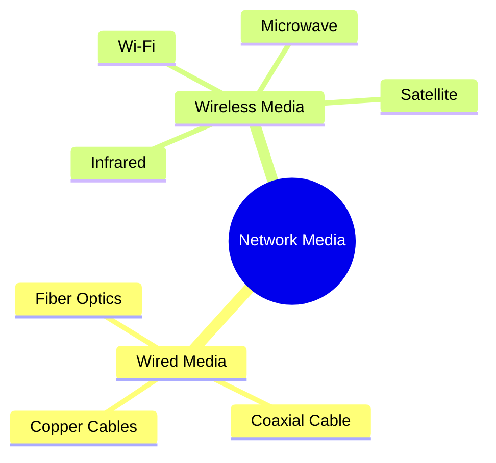
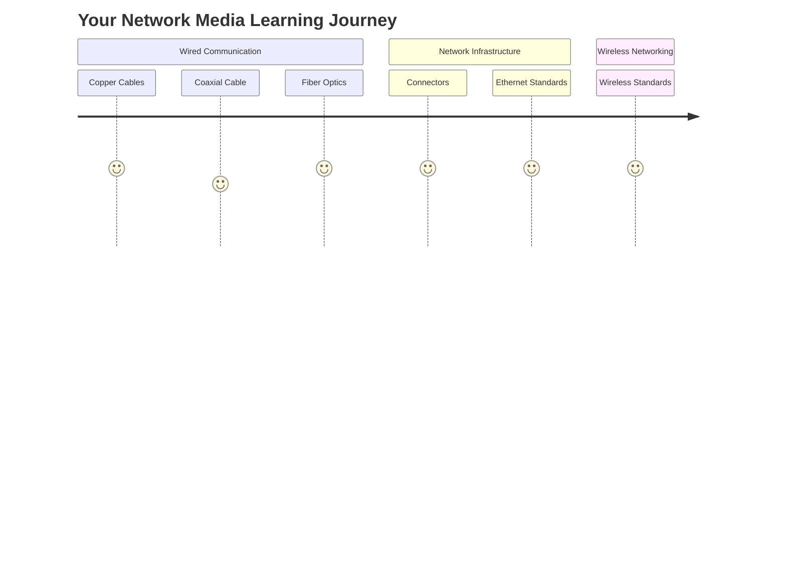
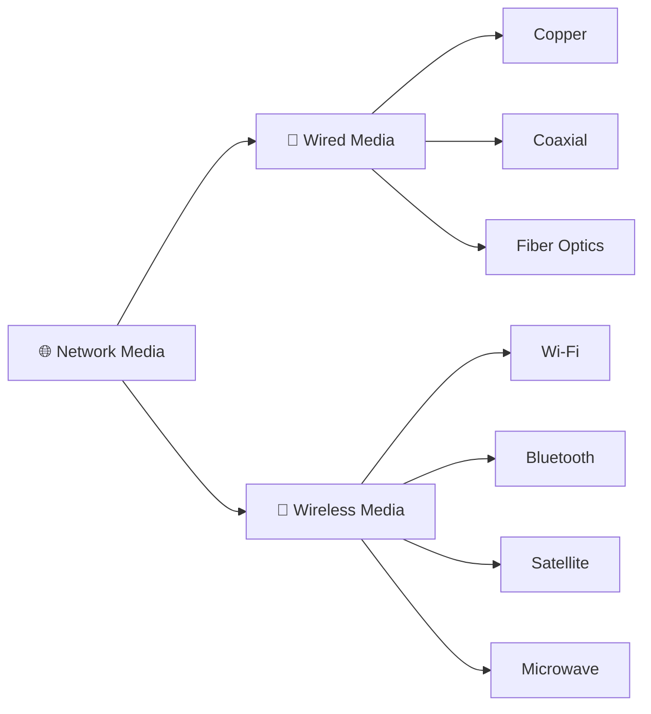
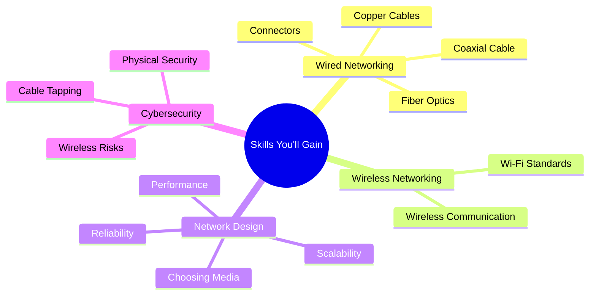

# 🌐 Network Media

> *Network media refers to the physical and wireless communication channels that carry data between networking devices. Every email, web page, video stream, and file transfer relies on network media to move information from one location to another.*

---

<div align="center">


-informational?style=for-the-badge)


</div>

---

# 📖 Table of Contents

- [Previously in this Roadmap](#-previously-in-this-roadmap)
- [A New Chapter in Networking](#-a-new-chapter-in-networking)
- [Why Network Media Matters](#-why-network-media-matters)
- [What is Network Media?](#-what-is-network-media)
- [How Data Travels Through a Network](#-how-data-travels-through-a-network)
- [Learning Objectives](#-learning-objectives)

---

# 📚 Previously in this Roadmap

In the previous chapter, you explored the **Network Devices** that make modern communication possible.

You learned how different devices perform specialized tasks within a network, including:

- 🔁 Repeating signals with **Repeaters**
- 🔀 Connecting devices using **Hubs** and **Switches**
- 🌍 Routing traffic between networks using **Routers**
- 🌉 Translating communication with **Gateways**
- 🌐 Connecting to Internet Service Providers through **Modems**
- 📶 Providing wireless connectivity with **Access Points**
- 🔥 Protecting networks using **Firewalls**
- 🚨 Detecting attacks with **Intrusion Detection Systems (IDS)**
- 🛡️ Preventing attacks using **Intrusion Prevention Systems (IPS)**
- ⚖️ Distributing traffic across servers with **Load Balancers**

By now, you understand **what these devices do** and **how they work together** to build a functional network.

However, one important question still remains.

> **How does data actually travel between all of these devices?**

A router cannot communicate with a switch unless there is a medium connecting them.

A computer cannot access the Internet unless its data can travel to the router.

A wireless access point cannot send data to your smartphone without using radio waves.

Every communication in a network depends on a **transmission medium**.

That transmission medium is the focus of this chapter.

---

# 🌐 A New Chapter in Networking

Until now, most of your attention has been focused on **devices**.

Devices process, forward, inspect, secure, and distribute data.

This chapter shifts your perspective.

Instead of asking:

> **"Which device is processing the data?"**

we begin asking:

> **"How is the data moving from one device to another?"**

This distinction is important.

A powerful router is useless without a way to transmit packets.

A firewall cannot inspect traffic that never reaches it.

A load balancer cannot distribute requests unless users can first establish a connection.

In other words,

> **Network devices provide intelligence, while network media provides the path.**

Both are essential for successful communication.

---

```text
Computer
     │
     ▼
🔌 Network Cable
     │
     ▼
🖥️ Switch
     │
     ▼
💡 Fiber Optic Link
     │
     ▼
🌍 Router
     │
     ▼
📶 Wireless Signal
     │
     ▼
📱 Smartphone
```

Every arrow in this communication path represents some form of **network media**.

Without those communication channels, no information could move between devices.

---

<!--
Image Description:
Create a complete communication path showing a desktop computer connected by an Ethernet cable to a network switch. The switch connects through a fiber-optic backbone to a router, which then communicates wirelessly with a smartphone. Label each transmission medium clearly.

Suggested Search Keywords:
network communication path
wired and wireless network media
computer network transmission diagram
-->

<p align="center">

</p>

---

# 🤔 Why Network Media Matters

Imagine building a modern city.

You could construct:

- Beautiful homes
- Office buildings
- Hospitals
- Schools
- Shopping centers

But without roads connecting them, people could never travel between locations.

The buildings would exist, but they would be isolated.

Computer networks face the same challenge.

Networking devices are like buildings.

**Network media is the road system that connects everything together.**

Without communication channels:

- Computers cannot exchange data.
- Servers cannot respond to requests.
- Routers cannot forward packets.
- Switches cannot deliver Ethernet frames.
- The Internet simply would not exist.

Every website you visit, every email you send, every online game you play, and every cloud service you access depends on data traveling through some form of network media.

---

> 💡 **Real-World Analogy**
>
> Think of a network as a country's transportation system.
>
> - **Network Devices** are the airports, train stations, and highways that direct traffic.
> - **Network Media** are the roads, railway tracks, air routes, and bridges that allow vehicles to travel.
>
> Without transportation routes, even the most advanced transportation hubs would be useless.

---

<!--
Image Description:
Illustrate a comparison between a city's transportation network and a computer network. Show roads connecting buildings on one side and cables and wireless signals connecting computers, switches, and routers on the other.

Suggested Search Keywords:
network media analogy
computer network transportation analogy
network infrastructure illustration
-->

<p align="center">

</p>

---

# 📡 What is Network Media?

**Network media** refers to the physical or wireless communication channel through which data travels from one networking device to another.

Whenever two devices communicate, information must pass through some type of transmission medium.

That medium may be:

- 🔌 A copper Ethernet cable
- 💡 A fiber-optic cable
- 📺 A coaxial cable
- 📶 Radio waves used by Wi-Fi
- 📡 Microwave links
- 🛰️ Satellite communication

Although these technologies work differently, they all perform the same essential task:

> **They carry information from one point to another.**

As networking technologies have evolved, so have the methods used to transmit data.

Some media rely on electrical signals.

Others use pulses of light.

Wireless technologies transmit information using electromagnetic waves.

Each medium offers different advantages depending on speed, distance, cost, reliability, and environmental conditions.

---



---

# 🚀 How Data Travels Through a Network

Whenever you perform an action online, such as opening a website, a surprisingly complex journey begins.

For example, when you visit:

```text
https://www.example.com
```

Your request travels across several different transmission media before reaching the destination server.


Notice something important.

The networking devices:

- Process the information.
- Forward the packets.
- Make routing decisions.

The **network media**:

- Carries the electrical, optical, or wireless signals between those devices.

Together, they form the complete communication path.

---

<!--
Image Description:
Illustrate the complete journey of a web request from a laptop through an Ethernet cable, switch, fiber-optic backbone, router, Internet, and finally to a web server. Clearly distinguish networking devices from the transmission media connecting them.

Suggested Search Keywords:
data transmission path
network media workflow
internet communication diagram
-->

<p align="center">

</p>

---

# 🎯 Learning Objectives

By the end of this chapter, you will be able to:

- Explain what network media is and why it is essential.
- Distinguish between wired and wireless transmission media.
- Identify common network cable types and their characteristics.
- Understand how Ethernet standards define wired communication.
- Recognize different connector types used in networking.
- Explain how wireless communication works.
- Compare the advantages and limitations of different transmission media.
- Choose appropriate network media for different real-world scenarios.

---

# 📌 Chapter Preview

Throughout this chapter, you'll gradually explore the technologies that make communication possible.

```text
Network Media

│

├── 🔌 Copper Cables
├── 📺 Coaxial Cable
├── 💡 Fiber Optics
├── 🔗 Connectors
├── 🌐 Ethernet Standards
└── 📶 Wireless Standards
```

Each lesson builds upon the previous one, starting with traditional wired communication before moving into modern high-speed fiber networks and wireless technologies.

By the end of this chapter, you'll understand not only **how devices communicate**, but also **how data physically travels across local networks, enterprise infrastructures, and the global Internet.**

# 🗂️ Chapter Structure

This chapter is organized to take you on a logical journey through the different types of network media used in modern computer networks.

Rather than memorizing different cables and technologies, you'll begin by understanding **why each type of transmission medium exists**, the problems it solves, and where it is used.

Each lesson builds upon the previous one, allowing you to gradually progress from traditional wired communication to high-speed fiber optics and modern wireless technologies.

---

```text
03-Network Media

README.md
│
├── 📄 Copper Cables.md
│     Learn how electrical signals travel through twisted-pair cables,
│     explore cable categories, and understand why Ethernet has become
│     the standard for Local Area Networks (LANs).
│
├── 📄 Coaxial Cable.md
│     Discover the design of coaxial cables, their historical importance,
│     and where they are still used in television, broadband Internet,
│     and specialized networking environments.
│
├── 📄 Fiber Optics.md
│     Explore how pulses of light transmit enormous amounts of data over
│     long distances, making fiber optics the backbone of the modern Internet.
│
├── 📄 Connectors.md
│     Learn about common networking connectors such as RJ-45, LC, SC,
│     and others that physically connect networking devices to transmission media.
│
├── 📄 Ethernet Standards.md
│     Understand Ethernet speeds, IEEE standards, cable requirements,
│     and how wired networks have evolved from 10 Mbps to hundreds of Gigabits.
│
└── 📄 Wireless Standards.md
      Learn how Wi-Fi transmits data through radio waves, understand
      IEEE 802.11 standards, wireless frequencies, and modern Wi-Fi generations.
```

---

# 🛤️ Learning Journey

Each topic has been intentionally arranged to build your understanding step by step.

Instead of jumping directly into advanced technologies, you'll first develop a strong understanding of traditional wired communication before exploring modern high-speed and wireless networking.



By following this progression, you'll understand not only **what each technology is**, but also **why it was developed** and **where it fits into today's networking environments**.

---

# 📚 Lessons in This Chapter

The following lessons make up the **Network Media** chapter. Each lesson builds on the previous one, so it is recommended to study them in order.

---
---

# 📖 Explore the Lessons

This chapter is divided into six carefully structured lessons, each focusing on a specific aspect of network media.

Rather than treating cables and wireless technologies as isolated topics, these lessons build upon one another to develop a complete understanding of how data physically travels through modern computer networks.

It is recommended to study the lessons in the order presented below, as each lesson introduces concepts that will be used in later chapters.

---

## 🔌 1. Copper Cables

**Read:** **[01-Copper Cables.md](01-Copper%20Cables.md)**

Copper cables have been the foundation of Ethernet networking for decades and remain the most common transmission medium in homes, schools, offices, and enterprise Local Area Networks (LANs).

In this lesson, you'll discover how electrical signals carry digital data, why twisted-pair cabling is used, how different Ethernet cable categories have evolved, and the best practices for installing and maintaining copper cabling.

### 🎯 You'll Learn

- How copper cables transmit digital information.
- UTP vs STP cabling.
- Cable categories (Cat5e, Cat6, Cat6a, Cat8).
- Straight-through and crossover cables.
- RJ-45 connectors.
- Advantages and limitations of copper media.

> 💡 **Why it matters**
>
> Nearly every cybersecurity professional will encounter Ethernet networks. Understanding copper cabling is essential for network installation, troubleshooting, penetration testing, and enterprise infrastructure management.

---

## 📺 2. Coaxial Cable

**Read:** **[02-Coaxial Cable.md](02-Coaxial%20Cable.md)**

Although coaxial cable is no longer the primary choice for Ethernet LANs, it continues to play an important role in broadband Internet, cable television, surveillance systems, and radio frequency (RF) communication.

This lesson explores the construction of coaxial cables, how they reduce interference, and why they remain relevant in modern networking.

### 🎯 You'll Learn

- How coaxial cables are constructed.
- Why shielding improves signal quality.
- Historical use in computer networking.
- Modern broadband and cable TV applications.
- Advantages and disadvantages of coaxial media.

> 💡 **Why it matters**
>
> Understanding coaxial cable helps explain the evolution of networking technologies and prepares you to work with Internet service providers (ISPs), cable networks, and legacy infrastructure.

---

## 💡 3. Fiber Optics

**Read:** **[03-Fiber Optics.md](03-Fiber%20Optics.md)**

Fiber-optic communication revolutionized networking by replacing electrical signals with pulses of light.

Today, fiber forms the backbone of the global Internet, connecting cities, countries, and continents through ultra-high-speed communication links.

This lesson explains how fiber-optic cables work, why they provide exceptional speed and distance, and where they are used in enterprise and cloud environments.

### 🎯 You'll Learn

- How light transmits digital data.
- Single-Mode vs Multi-Mode fiber.
- Fiber connectors.
- Advantages over copper.
- Enterprise and Internet backbone deployments.

> 💡 **Why it matters**
>
> Every modern data center, cloud provider, and Internet backbone depends on fiber-optic communication. Understanding fiber is essential for networking and cybersecurity careers.

---

## 🔗 4. Connectors

**Read:** **[04-Connectors.md](04-Connectors.md)**

Network cables are only useful if they can establish reliable physical connections between devices.

This lesson introduces the connectors used in copper and fiber-optic networking, explaining their design, compatibility, and common deployment scenarios.

### 🎯 You'll Learn

- RJ-45 Ethernet connectors.
- LC, SC, ST, and other fiber connectors.
- Connector compatibility.
- Proper cable termination.
- Best installation practices.

> 💡 **Why it matters**
>
> Correct connector selection and installation are critical for reliable communication and efficient network troubleshooting.

---

## 🌐 5. Ethernet Standards

**Read:** **[05-Ethernet Standards.md](05-Ethernet%20Standards.md)**

Ethernet standards define how wired communication operates, including transmission speeds, cable requirements, signaling methods, and maximum transmission distances.

Understanding these standards is essential for designing reliable, high-performance networks.

### 🎯 You'll Learn

- IEEE 802.3 standards.
- Ethernet speed evolution.
- Cable compatibility.
- Full-duplex and half-duplex communication.
- Modern enterprise Ethernet technologies.

> 💡 **Why it matters**
>
> Every wired network depends on Ethernet standards. Whether configuring a home LAN or designing a data center, these standards ensure interoperability between devices from different manufacturers.

---

## 📶 6. Wireless Standards

**Read:** **[06-Wireless Standards.md](06-Wireless%20Standards.md)**

Wireless networking eliminates the need for physical cables by transmitting data through radio waves.

This lesson explores Wi-Fi standards, wireless frequencies, channel selection, and the technologies that allow mobile devices to communicate securely and efficiently.

### 🎯 You'll Learn

- IEEE 802.11 Wi-Fi standards.
- Wireless frequencies.
- Wi-Fi generations.
- Wireless channels.
- Wireless security fundamentals.

> 💡 **Why it matters**
>
> Wireless communication is now a fundamental part of enterprise, cloud, and home networking. Understanding Wi-Fi technologies is essential for securing and troubleshooting modern wireless networks.

---

> 📚 **Recommended Learning Order**
>
> Follow the lessons in sequence. Each topic introduces concepts that are expanded upon in later lessons, creating a smooth progression from traditional wired communication to modern wireless networking technologies.
<!--
Image Description:
Create a roadmap-style illustration showing the learning journey through the Network Media chapter. Begin with Copper Cables, progress to Coaxial Cable, then Fiber Optics, followed by Connectors, Ethernet Standards, and finally Wireless Standards. Use arrows to indicate progression.

Suggested Search Keywords:
network media learning roadmap
network transmission technologies roadmap
network media study path
-->

<p align="center">

</p>

---

# 🔌 Wired vs Wireless Transmission Media

Every communication channel in a network can be broadly classified into one of two categories:

- **Wired (Guided) Media**
- **Wireless (Unguided) Media**

Both are designed to transport data, but they do so using different physical principles.

Wired media guides signals through a physical cable, while wireless media transmits signals through the air using electromagnetic waves.

Understanding the strengths and limitations of each is essential for choosing the appropriate technology for different networking scenarios.

---

## 🔌 Wired (Guided) Media

Wired media carries signals through a physical conductor or optical medium.

Examples include:

- Copper Ethernet cables
- Coaxial cables
- Fiber-optic cables

### Advantages

- High reliability
- Stable connections
- Better resistance to interference (especially fiber)
- Higher security because physical access is usually required
- Consistent performance

### Limitations

- Requires physical installation
- Less flexible
- Cable management becomes challenging in large environments

---

## 📶 Wireless (Unguided) Media

Wireless media transmits data using electromagnetic waves instead of physical cables.

Examples include:

- Wi-Fi
- Bluetooth
- Microwave communication
- Cellular networks
- Satellite communication

### Advantages

- Greater mobility
- Easy deployment
- Supports portable devices
- Flexible network expansion

### Limitations

- Susceptible to interference
- Limited range
- Signal quality varies with environmental conditions
- Strong security configurations are required to protect wireless communication

---



---

<!--
Image Description:
Illustrate a side-by-side comparison of wired and wireless network media. On the left, show copper cables, fiber-optic cables, and coaxial cables connecting networking devices. On the right, show wireless communication using Wi-Fi, satellites, and radio waves.

Suggested Search Keywords:
wired vs wireless networking infographic
network media comparison
guided vs unguided transmission media
-->

<p align="center">

</p>

---

# 📊 Wired vs Wireless Comparison

Although both wired and wireless media perform the same fundamental task—transmitting data—they differ in several important ways.

| Feature | 🔌 Wired Media | 📶 Wireless Media |
|----------|---------------|------------------|
| Transmission Method | Physical cable | Electromagnetic waves |
| Mobility | Limited | Excellent |
| Installation | Requires cabling | Easier deployment |
| Reliability | Very High | Depends on environment |
| Speed | Generally higher | Improving rapidly |
| Interference | Low | Higher |
| Security | More secure | Requires strong encryption |
| Typical Examples | Ethernet, Fiber, Coaxial | Wi-Fi, Bluetooth, Cellular |

Neither technology is universally better.

Instead, network engineers choose the most appropriate medium based on:

- Performance requirements
- Distance
- Cost
- Environmental conditions
- Security requirements
- Scalability

---

> 💡 **Remember**
>
> The goal of network media is not simply to move data.
>
> The goal is to move data **efficiently, reliably, securely, and at the speed required by the application**.
>
> Choosing the correct transmission medium is one of the most important design decisions in network engineering.

---

# 🌍 Real-World Applications

Different types of network media are used in different environments depending on their strengths.

| Environment | Common Network Media |
|-------------|----------------------|
| 🏠 Home Networks | Ethernet, Wi-Fi |
| 🏢 Office Networks | Ethernet, Fiber |
| ☁️ Data Centers | High-speed Fiber Optics |
| 🌍 Internet Backbone | Fiber Optics |
| 📺 Cable Television | Coaxial Cable |
| 📡 Cellular Networks | Wireless Radio |
| 🛰️ Remote Locations | Satellite Communication |

As you progress through this chapter, you'll explore each of these technologies in detail and understand why one medium is chosen over another in different networking environments.

---

# 🎓 Skills You'll Gain

By completing the **Network Media** chapter, you'll develop a solid understanding of the technologies that physically connect modern computer networks.

Rather than simply memorizing cable names or wireless standards, you'll learn **how different transmission media work**, **why they were developed**, and **where they are most effectively used**.

These skills form an essential foundation for advanced networking, cybersecurity, cloud computing, and network administration.

---

## 🛠️ Technical Skills

Throughout this chapter, you will learn to:

- 🔌 Identify common wired transmission media.
- 💡 Differentiate between copper, coaxial, and fiber-optic cables.
- 📶 Understand the fundamentals of wireless communication.
- 🔗 Recognize common networking connectors and their applications.
- 🌐 Interpret Ethernet and Wi-Fi standards.
- 📏 Compare transmission media based on speed, distance, reliability, and cost.
- ⚡ Understand how physical media impacts network performance.
- 🛡️ Recognize security considerations associated with different transmission media.

---



---

<!--
Image Description:
Create a mind map illustrating the skills gained from studying Network Media. Divide the diagram into four categories: Wired Networking, Wireless Networking, Network Design, and Cybersecurity. Include representative icons for cables, wireless signals, network devices, and security.

Suggested Search Keywords:
network media learning outcomes
networking skills infographic
cybersecurity networking skills
-->

<p align="center">

</p>

---

# 🌟 Why These Skills Matter

Understanding network media is valuable far beyond passing certification exams.

Every networking professional, system administrator, cloud engineer, and cybersecurity analyst works with transmission media in some form.

Whether you're installing an office network, troubleshooting connectivity issues, designing a data center, or securing enterprise infrastructure, you'll need to understand **how information physically travels between devices**.

These concepts also provide the foundation for many industry certifications, including:

- CompTIA Network+
- Cisco CCNA
- CompTIA Security+
- Microsoft Azure (AZ-900 & AZ-104)
- AWS Certified Solutions Architect
- Google Professional Cloud Network Engineer

---

> 💡 **Remember**
>
> Networking devices determine **where data should go**.
>
> **Network media determines how the data gets there.**
>
> Understanding both is essential for building reliable, efficient, and secure computer networks.

---

# 🚀 Preparing for the Next Chapters

The knowledge you gain in this chapter will support many upcoming networking topics.

For example:

- **IP Addressing** relies on network media to deliver packets between devices.
- **Network Protocols** define the rules used when data travels across these communication channels.
- **Routing and Switching** depend on reliable transmission media to move traffic between networks.
- **Network Security** requires an understanding of both wired and wireless communication to protect organizational infrastructure.

As your cybersecurity journey continues, you'll repeatedly build upon the concepts introduced in this chapter.

---

# 📝 Chapter Summary

Network media is the foundation upon which every computer network is built.

Throughout this chapter, you'll explore the technologies that physically carry information between networking devices, allowing computers, servers, switches, routers, and cloud services to communicate with one another.

You'll begin by understanding traditional wired communication through copper and coaxial cables before progressing to modern fiber-optic technology and wireless networking standards.

Along the way, you'll also learn how Ethernet standards define wired communication, how connectors ensure reliable physical connections, and why choosing the correct transmission medium is one of the most important decisions in network design.

By completing this chapter, you won't just recognize different types of network media—you'll understand **how they work, why they exist, where they're used, and what trade-offs they introduce**.

These concepts provide a strong foundation for the networking topics that follow throughout this roadmap.

---


---

<!--
Image Description:
Create a roadmap illustrating the complete learning path through the Network Media chapter. Show the progression from Copper Cables to Coaxial Cable, Fiber Optics, Connectors, Ethernet Standards, and Wireless Standards, ending with a completed chapter milestone.

Suggested Search Keywords:
network media roadmap
network media learning path
network transmission roadmap
-->

<p align="center">

</p>

---

# 📌 Key Takeaways

After completing this chapter, you will be able to:

- ✅ Explain the purpose of network media in computer networks.
- ✅ Distinguish between wired and wireless transmission media.
- ✅ Identify the characteristics of copper, coaxial, and fiber-optic cables.
- ✅ Recognize common networking connectors and their applications.
- ✅ Understand Ethernet and Wi-Fi standards.
- ✅ Compare transmission media based on speed, bandwidth, distance, reliability, and cost.
- ✅ Select the most appropriate transmission medium for different networking environments.
- ✅ Appreciate the importance of network media in cybersecurity, cloud computing, and enterprise networking.

---

> 💡 **Remember**
>
> Every packet that travels across a network depends on two things:
>
> - **A networking device** to process and forward the data.
> - **A transmission medium** to carry that data to its destination.
>
> Devices provide the intelligence.
>
> **Network media provides the pathway.**
>
> Together, they make modern communication possible.

# 🗺️ Cybersecurity Roadmap

Congratulations! 🎉

You've reached the **Network Media** chapter. This README serves as your guide for the lessons ahead, introducing the different transmission media used in modern computer networks and preparing you for the detailed topics that follow.

---

```text
Cybersecurity Roadmap

02-Networking

README.md
│
├── ✅ 00-Introduction
├── ✅ 01-Network Models
├── ✅ 02-Network Devices
│
├── 📍 03-Network Media
│   │
│   ├── ✅ README (Current)
│   ├── 📍 01-Copper Cables
│   ├── ⏳ 02-Coaxial Cable
│   ├── ⏳ 03-Fiber Optics
│   ├── ⏳ 04-Connectors
│   ├── ⏳ 05-Ethernet Standards
│   └── ⏳ 06-Wireless Standards
│
├── ⏳ 04-IP Addressing
├── ⏳ 05-Network Protocols
├── ⏳ 06-Ports
├── ⏳ 07-Routing & Switching
├── ⏳ 08-Network Services
└── ⏳ 09-Network Security
```

---

# 📍 Your Current Position


---

> 💡 **Current Progress**
>
> You've finished the first three networking chapters and are currently exploring **Network Media**.
>
> The next lesson is **01-Copper Cables.md**, where you'll begin learning how electrical signals carry data across Ethernet networks and why copper cabling remains the foundation of most Local Area Networks (LANs).

---

# 🚀 Next Lesson: Copper Cables

Congratulations on completing the introduction to the **Network Media** chapter!

You now understand **why transmission media is essential**, the difference between **wired and wireless communication**, and how this chapter is organized.

The next step is to begin exploring the first and most widely used transmission medium in computer networking: **Copper Cables**.

Copper cabling has been the backbone of Ethernet networks for decades and continues to connect millions of computers, switches, routers, printers, and servers around the world.

In the next lesson, you'll move beyond the overview and discover **how data is physically transmitted through copper wires**, why twisted-pair cabling is used, and how different Ethernet cable categories have evolved to support faster and more reliable communication.

You'll also explore:

- 🔌 How electrical signals represent digital data.
- 🧵 Why copper wires are twisted together.
- ⚡ Electromagnetic Interference (EMI) and Crosstalk.
- 📂 UTP vs STP cabling.
- 🏷️ Ethernet cable categories (Cat5e, Cat6, Cat6a, Cat8).
- 🔗 RJ-45 connectors and Ethernet wiring standards.
- 🛠️ Best practices for installing and troubleshooting copper cables.

---

> 💡 **Why This Lesson Matters**
>
> Before you can understand how devices communicate across local networks, you must first understand the physical medium carrying that communication.
>
> Copper cables remain the most common networking medium in homes, schools, offices, and enterprise environments, making them one of the most important topics for anyone studying networking or cybersecurity.

---


---

<!--
Image Description:
Create a learning roadmap for the Network Media chapter. Highlight the README as completed, Copper Cables as the current lesson to begin, and Coaxial Cable, Fiber Optics, Connectors, Ethernet Standards, and Wireless Standards as upcoming lessons. Use arrows to show the learning progression.

Suggested Search Keywords:
network media lesson roadmap
ethernet cable learning path
network media curriculum
-->

<p align="center">

</p>

---

# 📚 Continue Your Learning Journey

You're now ready to begin the first lesson of this chapter.

**Continue to:** **[01-Copper Cables.md](01-Copper%20Cables.md)** →

> *"Every network begins with a connection. Let's explore the cables that have powered Ethernet networks for decades."*
