# 📶 Wireless Standards

> *Wireless standards define the rules and technologies that allow devices to communicate over radio waves, enabling secure and reliable networking without physical cables.*

---

<div align="center">


<br>


</div>

---

# 🎯 Learning Objectives

By the end of this lesson, you will be able to:

- Explain how wireless networking works.
- Understand the role of radio waves in communication.
- Describe the IEEE 802.11 Wi-Fi standards.
- Compare different Wi-Fi generations.
- Explain wireless frequency bands and channels.
- Understand wireless security protocols.
- Identify common wireless networking devices.
- Recognize cybersecurity threats affecting wireless networks.

---

# 📚 Prerequisites

Before starting this lesson, you should already understand:

- ✅ Copper Cables
- ✅ Coaxial Cables
- ✅ Fiber Optic Cables
- ✅ Network Connectors
- ✅ Ethernet Standards

---

# 📑 Table of Contents

1. Introduction to Wireless Networking
2. How Wireless Communication Works
3. IEEE 802.11 Wi-Fi Standards
4. Evolution of Wi-Fi
5. Wireless Frequency Bands
6. Wireless Channels and Channel Width
7. Wireless Security
8. Wireless Networking Devices
9. Advantages and Limitations
10. Cybersecurity Perspective
11. Chapter Summary

---

# 📖 Introduction to Wireless Networking

Throughout this chapter, you've explored how devices communicate using **physical transmission media** such as copper cables, coaxial cables, and fiber optic cables.

These media provide reliable, high-speed communication by physically connecting devices together.

But what happens when running a cable is impractical—or impossible?

Imagine connecting:

- 📱 A smartphone
- 💻 A laptop
- ⌚ A smartwatch
- 📷 A wireless security camera

Running a separate Ethernet cable to every mobile device would be inconvenient and, in many cases, impossible.

Instead, these devices communicate using **wireless networking**, transmitting data through the air using **radio waves**.

Wireless networking has transformed the way people access the Internet, making communication more flexible, mobile, and convenient than ever before.

---

# 🌍 What Is Wireless Networking?

**Wireless networking** is the process of transmitting data between devices **without using physical cables**.

Instead of electrical signals traveling through copper cables or light pulses traveling through fiber optic cables, wireless networks transmit information using **electromagnetic radio waves**.

This allows devices to communicate while moving freely within the coverage area of a wireless network.

Common wireless devices include:

- 📱 Smartphones
- 💻 Laptops
- 📟 Tablets
- ⌚ Smartwatches
- 📺 Smart TVs
- 🏠 Smart home devices
- 🎮 Gaming consoles

---

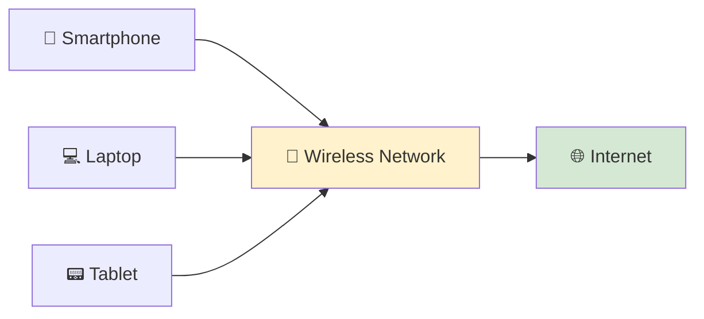

---

<!--
━━━━━━━━━━━━━━━━━━━━━━━━━━━━━━━━━━━━━━━━━━━━━━━━━━━━━━━━━━━━━━━━━━
IMAGE PLACEHOLDER
━━━━━━━━━━━━━━━━━━━━━━━━━━━━━━━━━━━━━━━━━━━━━━━━━━━━━━━━━━━━━━━━━━

Title:
Wireless Network Overview

Purpose:
Illustrate several wireless devices communicating with a Wi-Fi
access point, demonstrating how data travels without physical
network cables.

Image Type:
Educational Network Illustration

Image Description:
Create an illustration showing a smartphone, laptop, tablet,
and smart TV communicating wirelessly with a central Wi-Fi
router or wireless access point. Show radio wave icons instead
of Ethernet cables, with the access point connected to the
Internet.

Suggested Search Keywords:
wireless network infographic
Wi-Fi network illustration
wireless devices connected to router
home wireless network diagram

Suggested Filename:
Images/wireless_network_overview.png

━━━━━━━━━━━━━━━━━━━━━━━━━━━━━━━━━━━━━━━━━━━━━━━━━━━━━━━━━━━━━━━━━━
-->

<p align="center">

</p>

---

# 📡 Wired vs Wireless Networking

Both wired and wireless networks serve the same purpose:

> **They allow devices to exchange data and access network resources.**

The difference lies in **how that data is transmitted**.

| Feature | 🌐 Wired Network | 📶 Wireless Network |
|---------|------------------|---------------------|
| Transmission Medium | Copper or Fiber Cables | Radio Waves |
| Mobility | Limited | Excellent |
| Installation | Requires Cabling | Minimal Cabling |
| Speed | Generally Faster | Continually Improving |
| Reliability | Very High | Depends on Signal Quality |
| Interference | Very Low | More Susceptible |

Neither technology is universally better.

Instead, they complement each other.

For example:

- 🏢 Offices often use **Ethernet** for desktop computers and servers.
- 📱 Employees connect laptops and smartphones using **Wi-Fi**.
- 🏠 Homes typically combine wired connections for fixed devices with wireless connections for mobile devices.

Modern networks almost always use a combination of both technologies.

---

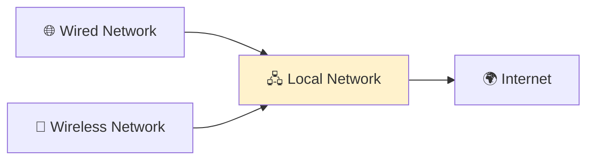

---

<!--
━━━━━━━━━━━━━━━━━━━━━━━━━━━━━━━━━━━━━━━━━━━━━━━━━━━━━━━━━━━━━━━━━━
IMAGE PLACEHOLDER
━━━━━━━━━━━━━━━━━━━━━━━━━━━━━━━━━━━━━━━━━━━━━━━━━━━━━━━━━━━━━━━━━━

Title:
Wired vs Wireless Networking

Purpose:
Compare wired Ethernet connections with wireless Wi-Fi
connections, illustrating that both technologies work together
within the same network.

Image Type:
Comparison Illustration

Image Description:
Create a comparison showing desktop computers connected by
Ethernet cables while laptops, smartphones, and tablets connect
wirelessly to the same wireless router or access point.

Suggested Search Keywords:
wired vs wireless networking
Ethernet and Wi-Fi comparison
hybrid network illustration
home office network diagram

Suggested Filename:
Images/wired_vs_wireless_network.png

━━━━━━━━━━━━━━━━━━━━━━━━━━━━━━━━━━━━━━━━━━━━━━━━━━━━━━━━━━━━━━━━━━
-->

<p align="center">

</p>

---

# 🌟 Why Wireless Networking Became So Popular

Wireless networking has become an essential part of modern life because it offers something wired networking cannot:

> **Mobility.**

Users can move throughout a home, office, school, or airport while remaining connected to the network.

Wireless networking also simplifies installation because there is no need to run Ethernet cables to every device.

As mobile devices became more common, wireless networking evolved from a convenience into a necessity.

Today, billions of devices rely on Wi-Fi every day.

---

> 💡 **Did You Know?**
>
> Although many people use the terms **Wi-Fi** and **wireless networking** interchangeably, **Wi-Fi is just one type of wireless networking technology**. Other wireless technologies include Bluetooth, cellular networks (4G/5G), NFC, Zigbee, and satellite communication.

---

# 🎯 Key Takeaway

Wireless networking allows devices to communicate without physical cables by transmitting data through radio waves. While wired networks remain the preferred choice for maximum speed and reliability, wireless networking provides the mobility and flexibility required by today's connected world. Together, wired and wireless technologies form the foundation of modern computer networks.

---
# 📡 How Wireless Communication Works

When you connect your laptop or smartphone to a Wi-Fi network, you don't see any cables connecting your device to the router.

So how does your data actually reach the Internet?

The answer lies in **radio waves**.

Instead of transmitting electrical signals through copper cables or light pulses through fiber optic cables, wireless networks use **electromagnetic radio waves** to carry data through the air.

These radio waves travel between your device and a **Wireless Access Point (WAP)**, which acts as the bridge between the wireless network and the wired network.

---

# 📻 Radio Waves as a Transmission Medium

A **radio wave** is a form of **electromagnetic energy** that can travel through the air without requiring a physical cable.

Wireless devices convert digital data into radio signals before transmitting them.

The receiving device then converts those radio signals back into digital data.

This entire process happens so quickly that users experience seamless communication.

Unlike Ethernet cables, radio waves can pass through open spaces and some obstacles such as walls and furniture, although their strength decreases with distance and interference.

---


---

<!--
━━━━━━━━━━━━━━━━━━━━━━━━━━━━━━━━━━━━━━━━━━━━━━━━━━━━━━━━━━━━━━━━━━
IMAGE PLACEHOLDER
━━━━━━━━━━━━━━━━━━━━━━━━━━━━━━━━━━━━━━━━━━━━━━━━━━━━━━━━━━━━━━━━━━

Title:
Wireless Communication Using Radio Waves

Purpose:
Illustrate how a wireless device communicates with a wireless
access point using radio waves instead of physical cables.

Image Type:
Educational Networking Illustration

Image Description:
Create an illustration showing a laptop transmitting radio
waves to a wireless access point. The access point is connected
to the Internet using an Ethernet cable. Clearly distinguish
the wireless and wired portions of the network.

Suggested Search Keywords:
wireless communication diagram
Wi-Fi radio waves illustration
wireless access point infographic
wireless network architecture

Suggested Filename:
Images/wireless_radio_waves.png

━━━━━━━━━━━━━━━━━━━━━━━━━━━━━━━━━━━━━━━━━━━━━━━━━━━━━━━━━━━━━━━━━━
-->

<p align="center">

</p>

---

# 📡 The Role of a Wireless Access Point (WAP)

A **Wireless Access Point (WAP)** is a networking device that allows wireless devices to connect to a wired network.

Think of it as a **bridge** between two different communication methods:

- 📶 Wireless communication (radio waves)
- 🌐 Wired communication (Ethernet)

When a wireless device sends data:

1. The device transmits radio signals.
2. The Wireless Access Point receives those signals.
3. The WAP converts them into Ethernet frames.
4. The data travels through the wired network to its destination.

When data returns, the process happens in reverse.

This allows wireless devices to communicate with servers, printers, and the Internet just like wired devices.

---


---

> 💡 **Remember**
>
> A **Wireless Access Point** is **not the Internet**. It simply provides wireless access to an existing network. In many homes, the wireless access point is built into the home router, making it appear as though they are a single device.

---

# 📛 What Is an SSID?

Every wireless network has a name that users see when searching for available Wi-Fi networks.

This name is called the **SSID (Service Set Identifier)**.

Examples include:

- 🏠 HomeWiFi
- 🏢 OfficeNet
- ☕ CoffeeShop Wi-Fi
- 🎓 Campus Wireless

The SSID helps users identify and connect to the correct wireless network.

It is important to remember that:

> **The SSID identifies the wireless network—it does not provide security by itself.**

A network with a visible or hidden SSID still requires proper authentication and encryption to protect users.

---

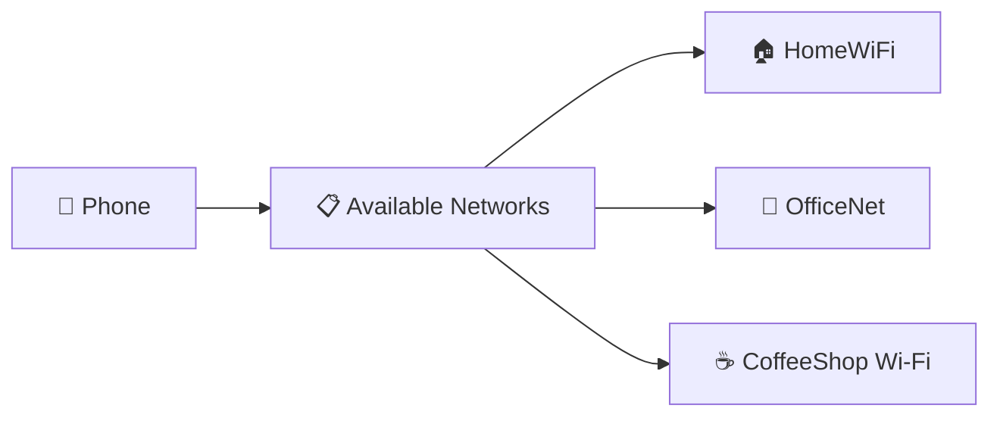

---

<!--
━━━━━━━━━━━━━━━━━━━━━━━━━━━━━━━━━━━━━━━━━━━━━━━━━━━━━━━━━━━━━━━━━━
IMAGE PLACEHOLDER
━━━━━━━━━━━━━━━━━━━━━━━━━━━━━━━━━━━━━━━━━━━━━━━━━━━━━━━━━━━━━━━━━━

Title:
SSID Selection

Purpose:
Illustrate a smartphone displaying a list of available Wi-Fi
networks, highlighting the concept of the Service Set Identifier
(SSID).

Image Type:
Educational Illustration

Image Description:
Create a smartphone screen showing several available Wi-Fi
network names (SSIDs). Highlight one network being selected by
the user before connecting.

Suggested Search Keywords:
SSID Wi-Fi illustration
wireless network names
Wi-Fi network selection infographic

Suggested Filename:
Images/ssid_selection.png

━━━━━━━━━━━━━━━━━━━━━━━━━━━━━━━━━━━━━━━━━━━━━━━━━━━━━━━━━━━━━━━━━━
-->

<p align="center">

</p>

---

# 🔄 The Wireless Communication Process

Although wireless networking appears simple to users, several steps occur whenever a device connects to a Wi-Fi network.

The process can be summarized as follows:

1. 📡 The wireless device searches for nearby Wi-Fi networks.
2. 📋 Available SSIDs are displayed.
3. 🔐 The user selects a network and authenticates if required.
4. 🤝 The device establishes a connection with the Wireless Access Point.
5. 📦 Data is exchanged using radio waves.
6. 🌐 The Access Point forwards the traffic to the wired network and the Internet.

All of these steps typically occur within a few seconds.

---

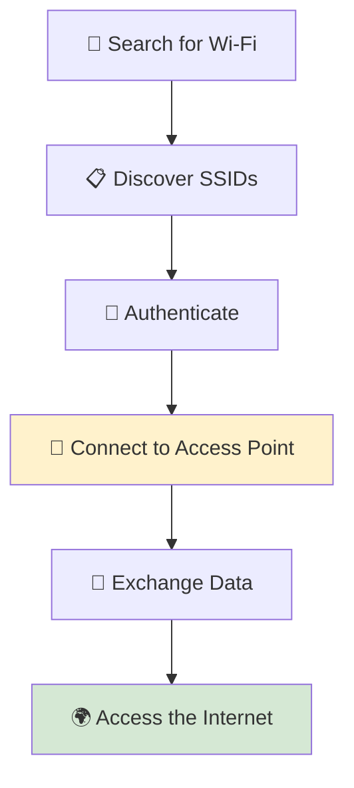

---

# 🌍 Why Access Points Are Important

Without a Wireless Access Point, wireless devices would have no way to communicate with the wired network.

Access Points perform several essential tasks, including:

- 📡 Transmitting and receiving wireless signals.
- 🌐 Connecting wireless users to the wired LAN.
- 📋 Managing wireless client connections.
- 🔐 Supporting wireless security features.
- 📶 Extending wireless network coverage.

In homes, a single wireless router may provide sufficient coverage.

In larger environments such as schools, hospitals, airports, and corporate offices, dozens or even hundreds of access points work together to provide continuous wireless connectivity.

---

> 💡 **Did You Know?**
>
> Large organizations often deploy **multiple wireless access points** that broadcast the same network name (SSID). As users move through the building, their devices automatically connect to the access point with the strongest signal, providing a seamless roaming experience.

---

# 🎯 Key Takeaway

Wireless communication uses **radio waves** to transmit data between devices and a **Wireless Access Point (WAP)**. The access point acts as a bridge between the wireless and wired portions of the network, while the **SSID** helps users identify available wireless networks. Together, these technologies allow devices to connect to the Internet without requiring physical Ethernet cables.

---
# 📶 IEEE 802.11 Wi-Fi Standards

Imagine purchasing a new laptop from one manufacturer and a wireless router from another.

Even though they were built by different companies, they connect to each other without any special configuration.

Why?

Because both devices follow the same **wireless networking standard**.

Without common standards, every manufacturer could design its own wireless technology, and devices from different vendors might not be compatible.

To ensure interoperability, wireless networking follows a family of international standards known as **IEEE 802.11**.

---

# 🏛️ What Is IEEE?

The **Institute of Electrical and Electronics Engineers (IEEE)** is an international professional organization that develops technical standards for many areas of engineering and technology.

In computer networking, IEEE is responsible for defining how many networking technologies operate.

Some well-known IEEE networking standards include:

| Standard | Technology |
|-----------|------------|
| **IEEE 802.3** | Ethernet (Wired Networking) |
| **IEEE 802.11** | Wireless LAN (Wi-Fi) |
| **IEEE 802.15** | Bluetooth and Personal Area Networks |
| **IEEE 802.16** | WiMAX |

By following these standards, manufacturers can produce networking equipment that works together regardless of brand.

---

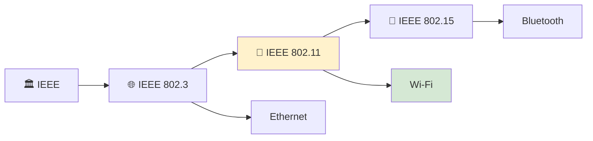

---

<!--
━━━━━━━━━━━━━━━━━━━━━━━━━━━━━━━━━━━━━━━━━━━━━━━━━━━━━━━━━━━━━━━━━━
IMAGE PLACEHOLDER
━━━━━━━━━━━━━━━━━━━━━━━━━━━━━━━━━━━━━━━━━━━━━━━━━━━━━━━━━━━━━━━━━━

Title:
IEEE Networking Standards

Purpose:
Illustrate IEEE as the standards organization responsible for
multiple networking technologies, including Ethernet, Wi-Fi,
and Bluetooth.

Image Type:
Educational Hierarchy Diagram

Image Description:
Create an infographic showing IEEE at the top branching into
IEEE 802.3 (Ethernet), IEEE 802.11 (Wi-Fi), and IEEE 802.15
(Bluetooth). Include simple icons representing each technology.

Suggested Search Keywords:
IEEE networking standards infographic
IEEE 802.3 802.11 comparison
IEEE networking hierarchy

Suggested Filename:
Images/ieee_networking_standards.png

━━━━━━━━━━━━━━━━━━━━━━━━━━━━━━━━━━━━━━━━━━━━━━━━━━━━━━━━━━━━━━━━━━
-->

<p align="center">

</p>

---

# 📡 What Is IEEE 802.11?

**IEEE 802.11** is the family of standards that defines how **Wireless Local Area Networks (WLANs)** operate.

It specifies many aspects of wireless communication, including:

- 📡 How devices transmit and receive radio signals.
- 📶 Which frequency bands can be used.
- ⚡ Maximum data rates.
- 🔄 Communication methods.
- 🤝 Device interoperability.
- 🔐 Security capabilities.

In simple terms:

> **IEEE 802.11 provides the technical rules that allow Wi-Fi devices from different manufacturers to communicate successfully.**

Without IEEE 802.11, a laptop from one company might not be able to connect to a router from another company.

---

# 🤝 The Role of the Wi-Fi Alliance

Although IEEE develops the technical standards, another organization helps bring those standards to consumers.

This organization is called the **Wi-Fi Alliance**.

The Wi-Fi Alliance is an industry group that:

- ✅ Tests wireless devices.
- ✅ Certifies compatibility between products.
- ✅ Promotes Wi-Fi technology.
- ✅ Simplifies wireless technology for consumers.

One of its most important contributions was introducing **simple generation names** for Wi-Fi.

Instead of remembering names like:

- IEEE 802.11n
- IEEE 802.11ac
- IEEE 802.11ax

Consumers can simply recognize them as:

- Wi-Fi 4
- Wi-Fi 5
- Wi-Fi 6

This makes it much easier to compare wireless devices.

---

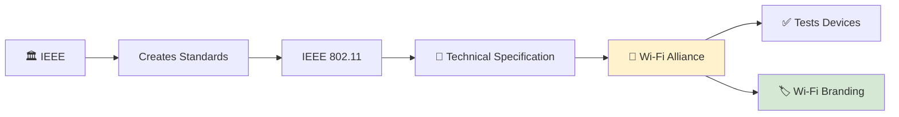

---

<!--
━━━━━━━━━━━━━━━━━━━━━━━━━━━━━━━━━━━━━━━━━━━━━━━━━━━━━━━━━━━━━━━━━━
IMAGE PLACEHOLDER
━━━━━━━━━━━━━━━━━━━━━━━━━━━━━━━━━━━━━━━━━━━━━━━━━━━━━━━━━━━━━━━━━━

Title:
IEEE and Wi-Fi Alliance

Purpose:
Explain the relationship between IEEE and the Wi-Fi Alliance.

Image Type:
Educational Flow Diagram

Image Description:
Illustrate IEEE creating the IEEE 802.11 standards and the
Wi-Fi Alliance testing, certifying, and branding products with
consumer-friendly Wi-Fi generation names.

Suggested Search Keywords:
IEEE vs Wi-Fi Alliance infographic
Wi-Fi Alliance certification
IEEE 802.11 relationship

Suggested Filename:
Images/ieee_vs_wifi_alliance.png

━━━━━━━━━━━━━━━━━━━━━━━━━━━━━━━━━━━━━━━━━━━━━━━━━━━━━━━━━━━━━━━━━━
-->

<p align="center">

</p>

---

# 🏷️ IEEE 802.11 Names vs Wi-Fi Generations

For many years, Wi-Fi standards were identified only by their IEEE names.

As more versions were introduced, these names became difficult for consumers to remember.

To simplify things, the Wi-Fi Alliance introduced generation-based names.

| IEEE Standard | Consumer Name |
|----------------|---------------|
| **802.11n** | Wi-Fi 4 |
| **802.11ac** | Wi-Fi 5 |
| **802.11ax** | Wi-Fi 6 / Wi-Fi 6E* |
| **802.11be** | Wi-Fi 7 |

> **Note:** Wi-Fi 6E is not a new IEEE standard. It is Wi-Fi 6 (802.11ax) operating in the **6 GHz** frequency band.

These names are now commonly displayed on wireless routers, smartphones, laptops, and other networking equipment.

---

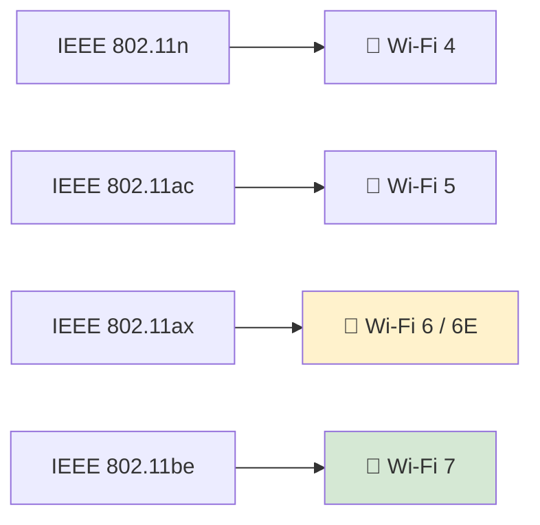

---

# 🌍 Why Wireless Standards Matter

Wireless standards provide many important benefits.

They ensure that:

- 🔄 Devices from different manufacturers work together.
- 📈 Performance improves over time.
- 🔐 Security features evolve.
- 📡 New wireless technologies remain compatible with existing devices whenever possible.
- 🌐 Wireless networking can continue to grow as technology advances.

Without common standards, modern Wi-Fi networks would be unreliable and difficult to deploy.

---

> 💡 **Did You Know?**
>
> Every time you purchase a smartphone, laptop, wireless router, or tablet with the **Wi-Fi Certified** logo, it has been tested by the **Wi-Fi Alliance** to help ensure it works correctly with other certified Wi-Fi devices.

---

# 🎯 Key Takeaway

**IEEE 802.11** is the international standard that defines how Wi-Fi networks operate, ensuring devices from different manufacturers can communicate reliably. While the **IEEE** develops the technical specifications, the **Wi-Fi Alliance** certifies compatible products and introduced simple generation names such as **Wi-Fi 4**, **Wi-Fi 5**, **Wi-Fi 6**, and **Wi-Fi 7**, making wireless technologies easier for consumers to understand.

---

# 🚀 Evolution of Wi-Fi

Wireless networking has evolved dramatically since the first IEEE 802.11 standard was introduced in the late 1990s.

As the number of wireless devices increased and applications such as video streaming, cloud computing, online gaming, and remote work became common, each new Wi-Fi generation was designed to provide:

- 🚀 Higher speeds
- 📶 Better coverage
- 👥 Support for more connected devices
- ⚡ Greater efficiency
- 🔐 Improved security
- 📡 Better performance in crowded environments

Today's Wi-Fi networks are significantly faster, more reliable, and more secure than the original wireless networks developed over two decades ago.

---

# 📈 Timeline of Wi-Fi Evolution

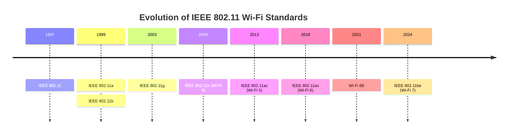

---

<!--
━━━━━━━━━━━━━━━━━━━━━━━━━━━━━━━━━━━━━━━━━━━━━━━━━━━━━━━━━━━━━━━━━━
IMAGE PLACEHOLDER
━━━━━━━━━━━━━━━━━━━━━━━━━━━━━━━━━━━━━━━━━━━━━━━━━━━━━━━━━━━━━━━━━━

Title:
Evolution of Wi-Fi Standards

Purpose:
Show the progression of Wi-Fi standards from IEEE 802.11
through Wi-Fi 7, emphasizing increasing speed and capabilities.

Image Type:
Timeline Infographic

Image Description:
Create a horizontal timeline showing each major Wi-Fi standard,
its release year, and an icon representing increasing speed
and technological advancement.

Suggested Search Keywords:
Wi-Fi evolution timeline
IEEE 802.11 generations infographic
Wi-Fi standards history

Suggested Filename:
Images/wifi_evolution_timeline.png

━━━━━━━━━━━━━━━━━━━━━━━━━━━━━━━━━━━━━━━━━━━━━━━━━━━━━━━━━━━━━━━━━━
-->

<p align="center">

</p>

---

# 📡 IEEE 802.11 (1997)

The original IEEE 802.11 standard marked the beginning of wireless local area networking.

Although revolutionary for its time, it offered relatively low performance.

### Characteristics

- 📅 Released: **1997**
- 📶 Frequency: **2.4 GHz**
- ⚡ Maximum Speed: **2 Mbps**

The first version of Wi-Fi demonstrated that reliable wireless communication was possible, but its speed was too limited for widespread adoption.

---

# 📡 IEEE 802.11a (1999)

IEEE 802.11a was designed to increase performance by operating in the **5 GHz** frequency band.

Using this higher frequency reduced interference but also shortened the effective communication range.

### Characteristics

- 📅 Released: **1999**
- 📶 Frequency: **5 GHz**
- ⚡ Maximum Speed: **54 Mbps**

### Advantages

- Less interference
- Higher speed than the original standard

### Limitations

- Shorter range
- Higher deployment cost

---

# 📡 IEEE 802.11b (1999)

Released in the same year as 802.11a, IEEE 802.11b took a different approach.

Instead of increasing frequency, it continued using the **2.4 GHz** band, providing better coverage and lower equipment costs.

### Characteristics

- 📅 Released: **1999**
- 📶 Frequency: **2.4 GHz**
- ⚡ Maximum Speed: **11 Mbps**

Because of its affordability and compatibility, 802.11b became the first widely adopted Wi-Fi standard for homes and small businesses.

---

# 📡 IEEE 802.11g (2003)

IEEE 802.11g combined the best features of the previous two standards.

It offered:

- The higher speed of 802.11a
- The wider coverage of 802.11b

### Characteristics

- 📅 Released: **2003**
- 📶 Frequency: **2.4 GHz**
- ⚡ Maximum Speed: **54 Mbps**

This made 802.11g one of the most popular wireless standards during the early 2000s.

---

# 📡 IEEE 802.11n (Wi-Fi 4)

As video streaming and cloud services became more common, faster wireless communication was needed.

IEEE 802.11n introduced several major improvements.

### Characteristics

- 📅 Released: **2009**
- 📶 Frequency: **2.4 GHz and 5 GHz**
- ⚡ Maximum Speed: **600 Mbps**

Major innovations included:

- 📡 MIMO (Multiple Input Multiple Output)
- 📶 Dual-band operation
- 🚀 Improved throughput
- 👥 Better support for multiple users

The Wi-Fi Alliance later branded IEEE 802.11n as **Wi-Fi 4**.

---

# 📡 IEEE 802.11ac (Wi-Fi 5)

IEEE 802.11ac focused on increasing speed while operating exclusively in the **5 GHz** band.

### Characteristics

- 📅 Released: **2013**
- 📶 Frequency: **5 GHz**
- ⚡ Maximum Speed: **Several Gbps (theoretical, depending on configuration)**

Major improvements included:

- Wider channels
- More MIMO streams
- Beamforming
- Higher throughput

Wi-Fi 5 became the standard found in many modern laptops, smartphones, and home routers.

---

# 📡 IEEE 802.11ax (Wi-Fi 6 / Wi-Fi 6E)

Rather than focusing only on speed, IEEE 802.11ax improved **efficiency**.

It was specifically designed for environments with many connected devices.

### Characteristics

- 📅 Released: **2019**
- 📶 Frequency: **2.4 GHz and 5 GHz**
- ⚡ Maximum Speed: **Up to approximately 9.6 Gbps (theoretical)**

Major improvements:

- Better performance in crowded environments
- Lower latency
- Improved battery life for wireless devices
- OFDMA technology
- Enhanced MU-MIMO

**Wi-Fi 6E** extended Wi-Fi 6 by adding support for the **6 GHz** frequency band, providing additional spectrum for compatible devices.

---

# 📡 IEEE 802.11be (Wi-Fi 7)

Wi-Fi 7 represents the latest generation of Wi-Fi technology.

Its goal is to provide extremely high throughput with very low latency.

### Characteristics

- 📅 Released: **2024**
- 📶 Frequency: **2.4 GHz, 5 GHz, and 6 GHz**
- ⚡ Maximum Speed: **Up to approximately 46 Gbps (theoretical)**

Key improvements include:

- Multi-Link Operation (MLO)
- Wider 320 MHz channels
- Higher-order modulation (4096-QAM)
- Lower latency
- Better support for AI, AR/VR, and high-performance applications

Although adoption is still growing, Wi-Fi 7 is expected to become the foundation for next-generation wireless networks.

---

# 📊 Comparison of Wi-Fi Generations

| Standard | Consumer Name | Frequency | Maximum Theoretical Speed |
|-----------|---------------|-----------|--------------------------:|
| 802.11 | — | 2.4 GHz | 2 Mbps |
| 802.11a | — | 5 GHz | 54 Mbps |
| 802.11b | — | 2.4 GHz | 11 Mbps |
| 802.11g | — | 2.4 GHz | 54 Mbps |
| 802.11n | Wi-Fi 4 | 2.4 / 5 GHz | 600 Mbps |
| 802.11ac | Wi-Fi 5 | 5 GHz | Several Gbps |
| 802.11ax | Wi-Fi 6 / 6E | 2.4 / 5 / 6 GHz* | Up to ~9.6 Gbps |
| 802.11be | Wi-Fi 7 | 2.4 / 5 / 6 GHz | Up to ~46 Gbps |

> **Note:** Standard Wi-Fi 6 (802.11ax) operates on **2.4 GHz and 5 GHz**. **Wi-Fi 6E** extends 802.11ax by adding the **6 GHz** band.

---

> 💡 **Did You Know?**
>
> Modern Wi-Fi networks are no longer limited by raw speed alone. Technologies such as **MIMO**, **MU-MIMO**, **OFDMA**, and **beamforming** improve efficiency, allowing dozens or even hundreds of devices to share the same wireless network more effectively.

---

# 🎯 Key Takeaway

The IEEE 802.11 family has evolved from a **2 Mbps** wireless technology into modern **multi-gigabit Wi-Fi** capable of supporting cloud computing, 4K and 8K video streaming, online gaming, smart homes, and enterprise networks. Each generation introduced improvements in speed, efficiency, capacity, and reliability, enabling wireless networking to become an essential part of everyday life.

---

# 📻 Wireless Frequency Bands

Every wireless network uses **radio waves** to transmit data.

However, not all radio waves are the same.

Wi-Fi operates on specific portions of the radio spectrum known as **frequency bands**.

A frequency band is simply a range of radio frequencies that wireless devices use to communicate.

Modern Wi-Fi primarily operates on three frequency bands:

- 📶 **2.4 GHz**
- 🚀 **5 GHz**
- ⚡ **6 GHz**

Each band offers different advantages and limitations.

Understanding these differences helps network administrators choose the right band for different environments and applications.

---

# 📡 What Is Frequency?

**Frequency** describes how many times a radio wave oscillates (cycles) in one second.

It is measured in **Hertz (Hz)**.

Common units include:

| Unit | Meaning |
|------|---------|
| Hz | 1 cycle per second |
| kHz | 1,000 Hz |
| MHz | 1 million Hz |
| GHz | 1 billion Hz |

For example:

- **2.4 GHz** means approximately **2.4 billion cycles per second**.
- **5 GHz** means approximately **5 billion cycles per second**.
- **6 GHz** means approximately **6 billion cycles per second**.

You don't need to memorize the physics behind radio waves.

The important idea is:

> **Different frequency bands provide different balances between speed, coverage, and interference.**

---


---

<!--
━━━━━━━━━━━━━━━━━━━━━━━━━━━━━━━━━━━━━━━━━━━━━━━━━━━━━━━━━━━━━━━━━━
IMAGE PLACEHOLDER
━━━━━━━━━━━━━━━━━━━━━━━━━━━━━━━━━━━━━━━━━━━━━━━━━━━━━━━━━━━━━━━━━━

Title:
Wi-Fi Frequency Bands

Purpose:
Illustrate the three primary Wi-Fi frequency bands (2.4 GHz,
5 GHz, and 6 GHz) as portions of the radio spectrum.

Image Type:
Educational Spectrum Illustration

Image Description:
Create a clean infographic showing the radio spectrum with the
2.4 GHz, 5 GHz, and 6 GHz Wi-Fi bands highlighted. Use icons
representing range, speed, and interference.

Suggested Search Keywords:
Wi-Fi frequency bands infographic
2.4 GHz vs 5 GHz vs 6 GHz
radio spectrum Wi-Fi illustration

Suggested Filename:
Images/wifi_frequency_bands.png

━━━━━━━━━━━━━━━━━━━━━━━━━━━━━━━━━━━━━━━━━━━━━━━━━━━━━━━━━━━━━━━━━━
-->

<p align="center">

</p>

---

# 📶 The 2.4 GHz Band

The **2.4 GHz** band has been used since the earliest Wi-Fi standards and remains widely supported by nearly all wireless devices.

### Advantages

- 📡 Longer communication range
- 🧱 Better penetration through walls and floors
- 🔄 Excellent compatibility with older devices

### Limitations

- 🐢 Lower maximum speeds than newer bands
- 📶 More interference
- 🚦 Higher congestion in busy areas

Many household devices also use the 2.4 GHz band, including:

- 🎧 Bluetooth devices
- 👶 Baby monitors
- 📹 Some wireless cameras
- 🍽️ Microwave ovens
- 🏠 Smart home devices

Because many devices share the same spectrum, performance can decrease in crowded environments.

---

# 🚀 The 5 GHz Band

The **5 GHz** band was introduced to provide higher performance and reduce congestion.

Compared with 2.4 GHz, it offers:

### Advantages

- ⚡ Higher data rates
- 📉 Less interference
- 📶 More available wireless channels
- 🎮 Better performance for gaming and video streaming

### Limitations

- 📏 Shorter communication range
- 🧱 Reduced ability to penetrate walls and other obstacles

The 5 GHz band is ideal for environments where speed is more important than maximum coverage.

---

# ⚡ The 6 GHz Band

The **6 GHz** band is the newest Wi-Fi frequency band and became available with **Wi-Fi 6E** and **Wi-Fi 7**.

It provides a large amount of additional wireless spectrum.

### Advantages

- 🚀 Extremely high throughput
- 📡 More available channels
- 📉 Very little interference
- 👥 Better performance in dense environments

### Limitations

- 📏 Shortest communication range
- 🧱 Limited wall penetration
- 📱 Requires newer Wi-Fi 6E or Wi-Fi 7 compatible devices

Because relatively few devices currently operate on 6 GHz, it often provides the cleanest wireless environment.

---

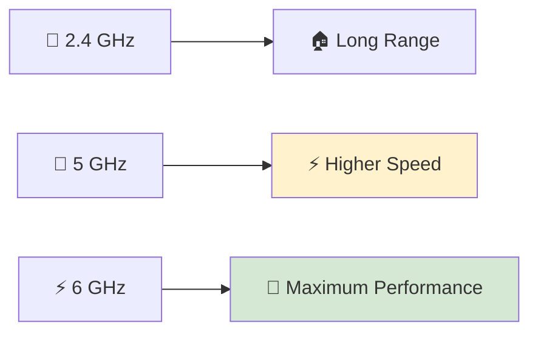

---

<!--
━━━━━━━━━━━━━━━━━━━━━━━━━━━━━━━━━━━━━━━━━━━━━━━━━━━━━━━━━━━━━━━━━━
IMAGE PLACEHOLDER
━━━━━━━━━━━━━━━━━━━━━━━━━━━━━━━━━━━━━━━━━━━━━━━━━━━━━━━━━━━━━━━━━━

Title:
Comparison of Wi-Fi Frequency Bands

Purpose:
Compare the range, speed, and interference characteristics of
2.4 GHz, 5 GHz, and 6 GHz frequency bands.

Image Type:
Comparison Illustration

Image Description:
Create a side-by-side comparison showing 2.4 GHz with long
coverage, 5 GHz with balanced coverage and speed, and 6 GHz
with the highest speed but shortest range.

Suggested Search Keywords:
2.4 GHz vs 5 GHz vs 6 GHz comparison
Wi-Fi band comparison infographic
wireless frequency range illustration

Suggested Filename:
Images/wifi_band_comparison.png

━━━━━━━━━━━━━━━━━━━━━━━━━━━━━━━━━━━━━━━━━━━━━━━━━━━━━━━━━━━━━━━━━━
-->

<p align="center">

</p>

---

# 📊 Comparing the Frequency Bands

| Feature | 📶 2.4 GHz | 🚀 5 GHz | ⚡ 6 GHz |
|----------|:----------:|:--------:|:--------:|
| Maximum Speed | Good | High | Very High |
| Coverage Range | Long | Medium | Short |
| Wall Penetration | Excellent | Moderate | Limited |
| Interference | High | Medium | Low |
| Number of Available Channels | Few | More | Most |
| Device Compatibility | Excellent | Very Good | Newer Devices Only |

---

# 🏡 Real-World Examples

Choosing the best frequency band depends on your environment and requirements.

### 📶 Use **2.4 GHz** when:

- You need greater coverage.
- Devices are far from the router.
- Signals must pass through multiple walls.
- You are connecting older devices.

### 🚀 Use **5 GHz** when:

- You want faster downloads.
- You stream high-definition video.
- You play online games.
- Your device is relatively close to the access point.

### ⚡ Use **6 GHz** when:

- You have Wi-Fi 6E or Wi-Fi 7 devices.
- Maximum performance is required.
- The environment contains many wireless users.
- You need the lowest possible latency and interference.

---

> 💡 **Did You Know?**
>
> Many modern wireless routers are **dual-band** or **tri-band**. A **dual-band router** broadcasts both **2.4 GHz** and **5 GHz** networks, while a **tri-band router** adds a second 5 GHz radio or a **6 GHz** radio (depending on the Wi-Fi generation), allowing more devices to communicate efficiently at the same time.

---

# 🎯 Key Takeaway

Wi-Fi uses three primary frequency bands: **2.4 GHz**, **5 GHz**, and **6 GHz**. Each band offers a different balance between coverage, speed, and interference. The **2.4 GHz** band provides the greatest range, **5 GHz** offers higher performance for most modern devices, and **6 GHz** delivers the highest speeds with the least interference for compatible hardware. Understanding these trade-offs helps network administrators design faster, more reliable wireless networks.

---


# 📡 Wireless Channels and Channel Width

Imagine a busy highway with hundreds of vehicles traveling at the same time.

If every vehicle tried to drive in the same lane, traffic congestion would quickly occur.

The solution is to divide the highway into **multiple lanes**, allowing traffic to flow more efficiently.

Wireless networks use a similar concept.

Instead of placing every wireless device on the same radio frequency, Wi-Fi divides each frequency band into smaller sections called **channels**.

These channels help organize wireless communication and reduce interference between nearby wireless networks.

---

# 🛣️ What Is a Wireless Channel?

A **wireless channel** is a specific portion of a Wi-Fi frequency band used for communication between wireless devices and an access point.

Think of a channel as a **lane on a highway**.

Multiple wireless networks can operate within the same frequency band, but using different channels helps reduce interference.

For example:

- Your home Wi-Fi network may use one channel.
- Your neighbor's Wi-Fi network may use another.
- A nearby office may use yet another.

Choosing appropriate channels improves wireless performance and reliability.

---


---

<!--
━━━━━━━━━━━━━━━━━━━━━━━━━━━━━━━━━━━━━━━━━━━━━━━━━━━━━━━━━━━━━━━━━━
IMAGE PLACEHOLDER
━━━━━━━━━━━━━━━━━━━━━━━━━━━━━━━━━━━━━━━━━━━━━━━━━━━━━━━━━━━━━━━━━━

Title:
Wireless Channels

Purpose:
Illustrate a Wi-Fi frequency band divided into multiple
channels, showing how different wireless networks can operate
on separate channels.

Image Type:
Educational Spectrum Illustration

Image Description:
Create an illustration showing the 2.4 GHz frequency band
divided into several channels. Highlight Channels 1, 6, and 11
as commonly used non-overlapping channels.

Suggested Search Keywords:
Wi-Fi channels infographic
2.4 GHz channels diagram
wireless channel illustration

Suggested Filename:
Images/wifi_channels.png

━━━━━━━━━━━━━━━━━━━━━━━━━━━━━━━━━━━━━━━━━━━━━━━━━━━━━━━━━━━━━━━━━━
-->

<p align="center">

</p>

---

# ⚠️ Channel Overlap and Interference

Not all wireless channels are completely separate.

Some channels overlap with one another.

When nearby wireless networks operate on overlapping channels, their signals interfere, reducing network performance.

In the **2.4 GHz** band, the most commonly recommended non-overlapping channels are:

- 📶 Channel 1
- 📶 Channel 6
- 📶 Channel 11

Using these channels minimizes interference in many regions because they are sufficiently spaced apart.

The **5 GHz** and **6 GHz** bands generally provide many more non-overlapping channels, making congestion less of a problem.

---

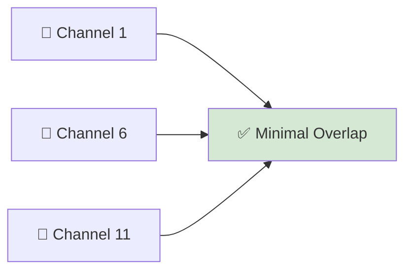

---

> 💡 **Remember**
>
> The exact channels available and the regulations governing their use vary by country or region. Network equipment automatically limits channel selection to comply with local regulatory requirements.

---

# 📏 What Is Channel Width?

In addition to choosing a channel, wireless networks also choose a **channel width**.

Channel width determines **how much radio spectrum is used for communication**.

A wider channel can carry more data, resulting in higher potential speeds.

However, wider channels also consume more spectrum and are more likely to experience interference in crowded environments.

Common Wi-Fi channel widths include:

- 📏 20 MHz
- 📏 40 MHz
- 📏 80 MHz
- 📏 160 MHz
- 📏 320 MHz *(Wi-Fi 7)*

---


---

<!--
━━━━━━━━━━━━━━━━━━━━━━━━━━━━━━━━━━━━━━━━━━━━━━━━━━━━━━━━━━━━━━━━━━
IMAGE PLACEHOLDER
━━━━━━━━━━━━━━━━━━━━━━━━━━━━━━━━━━━━━━━━━━━━━━━━━━━━━━━━━━━━━━━━━━

Title:
Wi-Fi Channel Width Comparison

Purpose:
Compare different Wi-Fi channel widths and illustrate how wider
channels provide greater bandwidth for data transmission.

Image Type:
Educational Comparison Illustration

Image Description:
Create an infographic comparing 20 MHz, 40 MHz, 80 MHz,
160 MHz, and 320 MHz channels. Represent each width with
progressively wider bars to demonstrate increasing bandwidth.

Suggested Search Keywords:
Wi-Fi channel width comparison
20 MHz vs 80 MHz Wi-Fi
wireless bandwidth infographic

Suggested Filename:
Images/channel_width_comparison.png

━━━━━━━━━━━━━━━━━━━━━━━━━━━━━━━━━━━━━━━━━━━━━━━━━━━━━━━━━━━━━━━━━━
-->

<p align="center">

</p>

---

# ⚖️ Choosing the Right Channel Width

Selecting the best channel width depends on the environment.

### 📏 Narrow Channels (20 MHz)

Advantages:

- 📉 Less interference
- 📡 Better performance in crowded areas
- 👥 Supports many nearby wireless networks

Limitations:

- 🚀 Lower maximum throughput

---

### 🚀 Wide Channels (80 MHz, 160 MHz, 320 MHz)

Advantages:

- ⚡ Higher data rates
- 🎥 Better for high-bandwidth applications
- 🎮 Improved performance for gaming and large file transfers

Limitations:

- 📶 More susceptible to interference
- 📡 Uses more of the available spectrum
- 🚧 May not perform well in congested environments

The best choice depends on balancing **speed** and **reliability**.

---

# 🏢 Channel Planning

In homes, Wi-Fi routers often select channels automatically.

In larger environments such as offices, universities, airports, and hospitals, careful **channel planning** is essential.

Network administrators design wireless networks to:

- 📡 Minimize channel overlap
- 🚦 Reduce interference
- 📈 Maximize wireless coverage
- 👥 Support many simultaneous users

Proper channel planning improves both network performance and user experience.

---

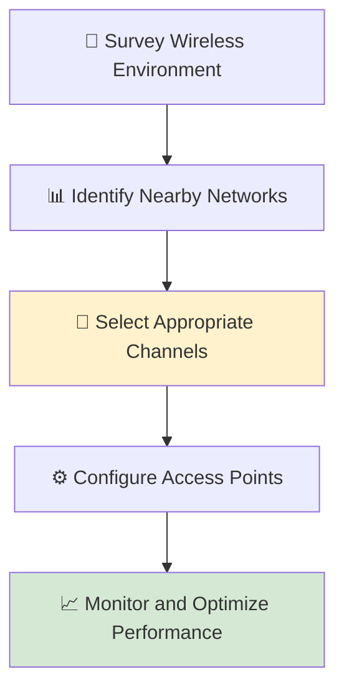

---

# 🌍 Automatic Channel Selection

Most modern wireless access points automatically select the most suitable channel during startup.

Some enterprise wireless systems continuously monitor the radio environment and adjust channels dynamically as conditions change.

This helps reduce interference without requiring manual configuration.

Although automatic channel selection works well in many situations, network administrators may manually configure channels in environments where greater control is required.

---

# 📊 Channel Width Comparison

| Channel Width | Typical Characteristics | Common Use Cases |
|---------------|-------------------------|------------------|
| **20 MHz** | Highest reliability, lowest throughput | Crowded environments, IoT, offices |
| **40 MHz** | Balanced speed and reliability | Small businesses, homes |
| **80 MHz** | High throughput | Streaming, gaming, modern home networks |
| **160 MHz** | Very high throughput | High-performance Wi-Fi 6/6E networks |
| **320 MHz** | Maximum throughput | Wi-Fi 7 environments |

---

> 💡 **Did You Know?**
>
> Faster Wi-Fi is not always better. In apartment buildings or other dense environments, using a **20 MHz** or **40 MHz** channel often provides a more stable connection than using a wider channel, because it reduces interference from neighboring networks.

---

# 🎯 Key Takeaway

Wireless channels divide each Wi-Fi frequency band into smaller communication paths, allowing multiple networks to operate simultaneously. Channel width determines how much spectrum is used for communication—wider channels provide higher potential speeds but are more susceptible to interference. By selecting appropriate channels and channel widths, network administrators can optimize both wireless performance and reliability.

---

# 🔐 Wireless Security

Wireless networking offers tremendous convenience by allowing devices to communicate without physical cables.

However, this convenience also introduces unique security challenges.

Unlike a wired network, where an attacker usually needs physical access to a cable or switch, wireless signals travel through the air.

Anyone within range of a wireless network can potentially detect its signals.

Without proper security, unauthorized users may be able to:

- 🚫 Connect to the network without permission.
- 👂 Intercept network traffic.
- 🔑 Steal sensitive information.
- 🛠️ Launch attacks against connected devices.
- 🌐 Consume network bandwidth.

To protect wireless communications, Wi-Fi networks use **authentication** and **encryption**.

Together, these technologies ensure that only authorized users can join the network and that transmitted data remains confidential.

---

# 🔑 Authentication vs. Encryption

Although these terms are often used together, they perform different functions.

### 🔑 Authentication

Authentication answers one question:

> **"Are you allowed to connect to this wireless network?"**

Authentication verifies the identity of a user or device before granting access.

Examples include:

- Wi-Fi passwords
- Enterprise login credentials
- Digital certificates

---

### 🔒 Encryption

Encryption protects the data after a device has connected.

It converts readable information into an unreadable format that can only be interpreted by authorized devices possessing the correct encryption keys.

Even if an attacker captures encrypted wireless traffic, they should not be able to understand its contents without the proper key.

---


---

<!--
━━━━━━━━━━━━━━━━━━━━━━━━━━━━━━━━━━━━━━━━━━━━━━━━━━━━━━━━━━━━━━━━━━
IMAGE PLACEHOLDER

Title:
Authentication and Encryption

Purpose:
Illustrate the relationship between authentication,
encryption, and secure wireless communication.

Suggested Filename:
Images/authentication_vs_encryption.png
━━━━━━━━━━━━━━━━━━━━━━━━━━━━━━━━━━━━━━━━━━━━━━━━━━━━━━━━━━━━━━━━━━
-->

<p align="center">

</p>

---

# 📡 Open Wireless Networks

An **open wireless network** does not require authentication or encryption.

Anyone within wireless range can connect.

Examples include:

- ☕ Public cafés
- ✈️ Airports
- 🏨 Hotels
- 📚 Libraries

### Advantages

- Easy to access
- No password required
- Convenient for guests

### Limitations

- Very poor security
- Data may be intercepted
- Users are exposed to greater cyber risks

Open networks should only be used for non-sensitive activities unless additional protection, such as a VPN, is used.

---

# 🔓 WEP (Wired Equivalent Privacy)

WEP was the first security protocol introduced for Wi-Fi networks.

Its goal was to provide wireless security comparable to wired Ethernet.

Although it represented an important step forward, WEP contained serious design weaknesses.

### Characteristics

- Introduced in the late 1990s
- Static encryption keys
- Weak encryption algorithm
- Easily broken using modern attack tools

Today, **WEP is considered completely insecure** and should never be used.

---

# 🔐 WPA (Wi-Fi Protected Access)

As weaknesses in WEP became widely known, the Wi-Fi Alliance introduced **WPA** as a temporary improvement.

WPA strengthened wireless security without requiring organizations to replace all existing hardware.

Major improvements included:

- Stronger encryption methods
- Dynamic encryption keys
- Improved authentication

Although much more secure than WEP, WPA was intended only as an interim solution.

---

# 🛡️ WPA2 (Wi-Fi Protected Access II)

WPA2 became the standard wireless security protocol for many years.

It introduced **AES (Advanced Encryption Standard)**, which provides significantly stronger encryption than earlier protocols.

### Benefits

- Strong encryption
- Excellent compatibility
- Reliable security
- Widely supported by modern devices

For many years, WPA2 protected billions of wireless devices worldwide.

Although still widely used, newer security requirements have led to the adoption of WPA3.

---

# 🚀 WPA3 (Wi-Fi Protected Access III)

WPA3 is the latest generation of Wi-Fi security.

It improves protection against several types of attacks while simplifying secure connections for modern devices.

Major improvements include:

- 🔒 Stronger encryption
- 🛡️ Better protection against password guessing attacks
- 📱 Improved security for public Wi-Fi
- 🔐 Enhanced authentication mechanisms

Whenever possible, new wireless networks should use **WPA3**.

---

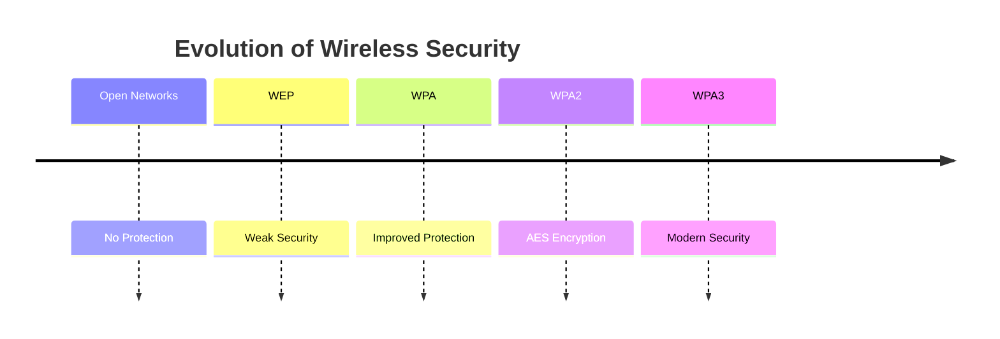

---

<!--
━━━━━━━━━━━━━━━━━━━━━━━━━━━━━━━━━━━━━━━━━━━━━━━━━━━━━━━━━━━━━━━━━━
IMAGE PLACEHOLDER

Title:
Evolution of Wi-Fi Security

Purpose:
Show the progression from Open Networks to WEP, WPA, WPA2,
and WPA3.

Suggested Filename:
Images/wifi_security_evolution.png
━━━━━━━━━━━━━━━━━━━━━━━━━━━━━━━━━━━━━━━━━━━━━━━━━━━━━━━━━━━━━━━━━━
-->

<p align="center">

</p>

---

# 🏠 Personal vs. Enterprise Wi-Fi Security

Not all wireless networks authenticate users in the same way.

### 🏠 Personal (Home) Networks

Typically use:

- Shared Wi-Fi password
- WPA2-Personal or WPA3-Personal

This approach is simple and suitable for homes and small offices.

---

### 🏢 Enterprise Networks

Large organizations require stronger authentication.

Instead of sharing one password, each user receives individual credentials.

Enterprise wireless networks commonly use:

- Username and password
- Digital certificates
- Authentication servers (such as RADIUS)

This provides:

- Better security
- Individual accountability
- Easier user management
- Improved access control

---

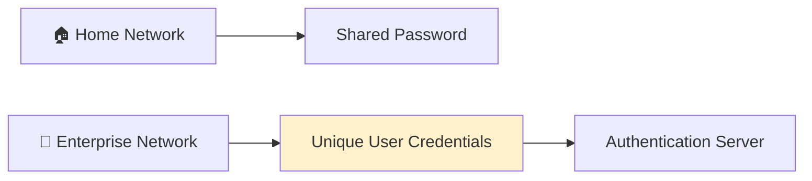

---

# 🔑 Creating Strong Wi-Fi Passwords

Even the strongest wireless security protocol cannot protect a weak password.

A secure Wi-Fi passphrase should:

- ✅ Be long (at least 12–16 characters)
- ✅ Include uppercase and lowercase letters
- ✅ Include numbers
- ✅ Include special characters
- ✅ Avoid dictionary words and personal information

Examples of weak passwords:

- password123
- admin123
- qwerty

Examples of stronger passwords:

- R!ver$2026Sky#Lake
- C0ffee&Clouds!88

Using a password manager can help generate and store complex passphrases securely.

---

> 💡 **Did You Know?**
>
> Many wireless routers still ship with default administrator usernames and passwords. If these credentials are not changed, attackers who gain access to the network may also be able to compromise the router itself. Always change default administrative credentials during initial setup.

---

# 📊 Comparison of Wireless Security Protocols

| Protocol | Security Level | Status |
|-----------|----------------|--------|
| Open Network | None | ❌ Not Secure |
| WEP | Very Low | ❌ Obsolete |
| WPA | Moderate | ⚠️ Legacy |
| WPA2 | High | ✅ Widely Used |
| WPA3 | Very High | ⭐ Recommended |

---

# 🎯 Key Takeaway

Wireless security relies on two essential concepts: **authentication**, which verifies who is allowed to join the network, and **encryption**, which protects the confidentiality of transmitted data. Security protocols have evolved from **Open Networks** and **WEP** to **WPA**, **WPA2**, and **WPA3**, with each generation addressing weaknesses discovered in earlier technologies. Today, **WPA3** provides the strongest protection and is the recommended choice for modern wireless networks.

---

# 📱 Wireless Networking Devices

Wireless communication would not be possible without specialized networking devices that transmit, receive, and manage radio signals.

Whether you're connecting a smartphone at home, deploying hundreds of access points in a university, or building a large enterprise network, these devices form the backbone of every wireless infrastructure.

Each device has a specific role, from providing wireless connectivity to extending network coverage and managing thousands of client connections.

In this section, we'll explore the most common wireless networking devices and understand how they work together.

---

# 📡 Wireless Access Point (WAP)

A **Wireless Access Point (WAP)** is a networking device that allows wireless devices to connect to a wired Local Area Network (LAN).

It receives data transmitted over radio waves and forwards it to the wired network. Likewise, it converts data from the wired network into wireless signals that can be received by smartphones, laptops, tablets, and other Wi-Fi devices.

You can think of a Wireless Access Point as a **bridge** between wireless and wired communication.

### Common Uses

- 🏢 Offices
- 🏫 Schools
- 🏥 Hospitals
- 🏨 Hotels
- 🏠 Homes

---

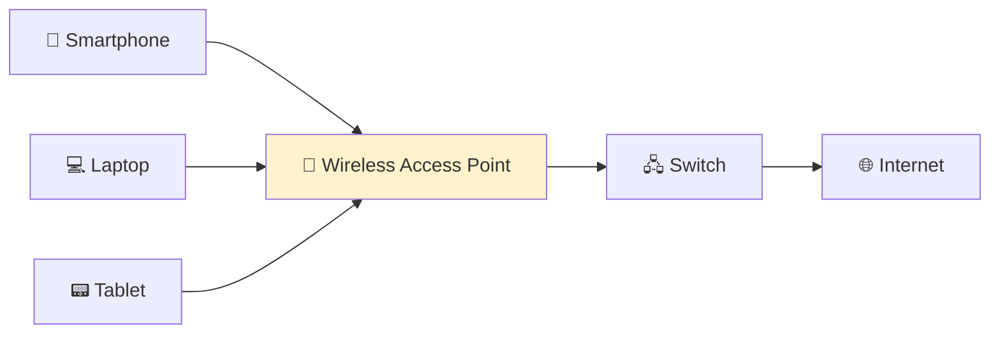

---

<!--
Image Description:
Illustrate a Wireless Access Point connecting multiple wireless
devices to a wired Ethernet switch and the Internet.

Suggested Filename:
Images/wireless_access_point.png
-->

<p align="center">

</p>

---

# 📶 Wireless Router

A **wireless router** combines multiple networking functions into a single device.

Most home routers include:

- 📡 Wireless Access Point
- 🌐 Router
- 🔀 Ethernet Switch
- 🔒 Basic Firewall
- 📍 DHCP Server

This all-in-one design makes wireless routers ideal for homes and small businesses.

Unlike a standalone Wireless Access Point, a wireless router also performs **routing**, allowing devices on the local network to communicate with the Internet.

---

```mermaid
flowchart LR

A["📱 Wireless Devices"]

--> B["📶 Wireless Router"]

B --> C["🌍 Internet"]

B --> D["🖥️ Wired Devices"]

style B fill:#FFF2CC
```

---

> 💡 **Remember**
>
> Every wireless router contains a Wireless Access Point, but **not every Wireless Access Point is a router**. Enterprise networks often use dedicated access points connected to separate routers and switches.

---

# 💻 Wireless Network Interface Card (Wireless NIC)

A **Wireless Network Interface Card (Wireless NIC)** is the hardware that enables a device to communicate with wireless networks.

Without a Wireless NIC, a laptop, smartphone, or tablet cannot send or receive Wi-Fi signals.

Most modern devices have a built-in wireless adapter.

Examples include:

- 💻 Laptop Wi-Fi adapters
- 📱 Smartphone wireless chipsets
- 🖥️ USB Wi-Fi adapters
- 🖧 PCIe wireless cards for desktop computers

The Wireless NIC is responsible for:

- Searching for available Wi-Fi networks
- Connecting to an Access Point
- Sending and receiving wireless frames
- Supporting encryption and authentication

---

```mermaid
flowchart LR

A["💻 Laptop"]

--> B["📶 Wireless NIC"]

--> C["📡 Access Point"]

style B fill:#FFF2CC
```

---

<!--
Image Description:
Show the internal Wireless NIC inside a laptop communicating
with a nearby wireless access point.

Suggested Filename:
Images/wireless_nic.png
-->

<p align="center">

</p>

---

# 🏠 Mesh Wi-Fi Systems

Traditional home networks often rely on a single wireless router.

In larger homes or buildings, however, one router may not provide sufficient coverage.

A **Mesh Wi-Fi System** consists of multiple wireless nodes working together as a single network.

Instead of manually switching between different Wi-Fi networks, devices automatically connect to the node with the strongest signal.

### Advantages

- 📶 Improved coverage
- 🔄 Seamless roaming
- 📡 Stronger signal throughout large buildings
- 🏠 Better support for smart homes

---

```mermaid
flowchart LR

A["🌍 Internet"]

--> B["📡 Main Mesh Node"]

B --> C["📡 Mesh Node"]

B --> D["📡 Mesh Node"]

C --> E["📱 Devices"]

D --> F["💻 Devices"]

style B fill:#FFF2CC
```

---

# 🔁 Wireless Range Extenders (Repeaters)

A **wireless range extender**, also known as a **repeater**, increases the coverage area of an existing wireless network.

It receives an existing Wi-Fi signal, amplifies or retransmits it, and extends the signal into areas with weak coverage.

Range extenders are commonly used to eliminate dead zones in homes and small offices.

### Advantages

- Easy to install
- Inexpensive
- Improves coverage

### Limitations

- May reduce overall throughput
- Adds additional latency
- Less efficient than a mesh system

---

```mermaid
flowchart LR

A["📡 Router"]

--> B["🔁 Range Extender"]

--> C["📱 Devices"]

style B fill:#FFF2CC
```

---

# 🎛️ Wireless LAN Controller (WLC)

Large organizations may deploy dozens or even hundreds of Wireless Access Points.

Managing each Access Point individually would be inefficient.

A **Wireless LAN Controller (WLC)** provides centralized management for enterprise wireless networks.

A WLC can:

- 📡 Configure multiple Access Points
- 👥 Manage thousands of wireless users
- 🔐 Enforce security policies
- 📊 Monitor wireless performance
- 🔄 Perform firmware updates
- 📶 Optimize channel selection and power levels

Wireless LAN Controllers are commonly used in:

- Universities
- Airports
- Hospitals
- Corporate campuses
- Large office buildings

---

```mermaid
flowchart LR

A["🎛️ Wireless LAN Controller"]

--> B["📡 AP 1"]

--> C["📡 AP 2"]

--> D["📡 AP 3"]

B --> E["📱 Users"]

C --> F["💻 Users"]

D --> G["📟 Users"]

style A fill:#FFF2CC
```

---

<!--
Image Description:
Illustrate a Wireless LAN Controller managing multiple access
points across a large enterprise building.

Suggested Filename:
Images/wireless_lan_controller.png
-->

<p align="center">

</p>

---

# 📊 Comparison of Wireless Networking Devices

| Device | Primary Function | Typical Environment |
|---------|------------------|---------------------|
| 📡 Wireless Access Point | Connects wireless devices to a wired LAN | Homes, offices, schools |
| 📶 Wireless Router | Combines routing, switching, and Wi-Fi | Homes, small businesses |
| 💻 Wireless NIC | Enables a device to use Wi-Fi | Computers, smartphones, tablets |
| 🏠 Mesh Wi-Fi System | Expands wireless coverage using multiple nodes | Large homes, offices |
| 🔁 Range Extender | Extends the range of an existing Wi-Fi network | Homes, small offices |
| 🎛️ Wireless LAN Controller | Centrally manages multiple Access Points | Enterprise environments |

---

> 💡 **Did You Know?**
>
> Enterprise wireless networks often support **thousands of users** simultaneously. Instead of configuring each Access Point manually, administrators use a **Wireless LAN Controller (WLC)** to centrally manage security, firmware updates, radio settings, and client connections, making large-scale Wi-Fi deployments far more efficient.

---

# 🎯 Key Takeaway

Wireless networking relies on a combination of specialized devices to provide seamless connectivity. **Wireless Access Points** connect wireless clients to wired networks, **wireless routers** combine multiple networking functions into one device, **Wireless NICs** enable devices to communicate over Wi-Fi, **mesh systems** and **range extenders** improve coverage, and **Wireless LAN Controllers** simplify the management of enterprise wireless deployments. Together, these devices create the wireless networks that power homes, businesses, schools, and public spaces around the world.

---

# ⚖️ Advantages and Limitations of Wireless Networking

Wireless networking has transformed the way people communicate, work, and access information.

Today, billions of smartphones, laptops, tablets, IoT devices, and smart home systems rely on Wi-Fi every day.

However, like every networking technology, wireless communication is **not perfect**.

While it provides unmatched flexibility and mobility, it also introduces challenges such as interference, reduced reliability, and additional security risks.

Understanding both the strengths and limitations of wireless networking allows network administrators to choose the most appropriate solution for a given environment.

---

# ✅ Advantages of Wireless Networking

Wireless networking offers several significant benefits over traditional wired connections.

These advantages have made Wi-Fi the preferred choice for mobile devices and many modern workplaces.

---

## 🚶 Mobility

The greatest advantage of wireless networking is **mobility**.

Users can move freely throughout a home, office, school, or airport while remaining connected to the network.

Examples include:

- 📱 Walking around the house while on a video call.
- 💻 Moving between meeting rooms with a laptop.
- 🏥 Doctors accessing patient records throughout a hospital.
- 🏫 Students using tablets anywhere on campus.

Unlike Ethernet connections, users are **not physically tied to a network cable**.

---

## ⚙️ Easy Installation

Installing wireless networking is generally much faster than installing a wired network.

Instead of running Ethernet cables through walls and ceilings, administrators simply deploy wireless access points.

This is particularly useful in:

- Historic buildings
- Rental properties
- Large campuses
- Temporary workspaces
- Outdoor events

Wireless deployment often reduces both installation time and labor costs.

---

## 📈 Scalability

Wireless networks are easy to expand.

Adding a new user usually requires **no additional network cabling**.

As an organization grows, administrators can simply install additional Wireless Access Points to increase coverage and capacity.

This flexibility makes wireless networking highly scalable.

---

## 💰 Reduced Cabling Costs

Because fewer physical cables are required, wireless networking can reduce infrastructure costs in many environments.

Organizations save money on:

- Ethernet cabling
- Cable trays
- Wall outlets
- Installation labor

Although enterprise Wi-Fi equipment can be expensive, reduced cabling often lowers the overall deployment cost.

---

## 🌍 Supports Modern Mobile Devices

Most modern devices are designed primarily for wireless connectivity.

Examples include:

- 📱 Smartphones
- 💻 Ultrabooks
- 📟 Tablets
- ⌚ Smartwatches
- 🏠 Smart home devices
- 📷 Wireless security cameras

Without wireless networking, many of these devices would lose much of their convenience.

---

```mermaid
mindmap
  root((Advantages))
    Mobility
    Easy Installation
    Scalability
    Lower Cabling Costs
    Supports Mobile Devices
    Flexible Deployment
```

---

<!--
Image Description:
Illustrate people using laptops, smartphones, tablets,
and smart home devices connected through Wi-Fi in different
locations such as homes, offices, schools, and cafés.

Suggested Filename:
Images/wireless_advantages.png
-->

<p align="center">

</p>

---

# ⚠️ Limitations of Wireless Networking

Despite its many advantages, wireless networking also presents several challenges.

Understanding these limitations helps organizations design more reliable and secure networks.

---

## 📶 Signal Interference

Wireless signals share the radio spectrum with many other devices.

Interference may come from:

- Nearby Wi-Fi networks
- Bluetooth devices
- Microwave ovens
- Baby monitors
- Wireless cameras

Interference can reduce speed, increase latency, and cause unstable connections.

---

## 📏 Limited Range

Unlike wired Ethernet cables, wireless signals weaken as distance increases.

Walls, floors, furniture, and other obstacles further reduce signal strength.

As users move farther from an Access Point, they may experience:

- Slower speeds
- Higher latency
- Packet loss
- Connection drops

Large buildings often require multiple Access Points to provide complete coverage.

---

## ⚡ Lower Performance Than Wired Networks

Modern Wi-Fi is extremely fast, but wired Ethernet generally offers:

- Higher throughput
- Lower latency
- Greater stability
- More consistent performance

For this reason, servers, network switches, and many desktop workstations continue to use wired connections.

---

## 🔓 Greater Security Risks

Wireless signals travel through the air.

Anyone within range can potentially detect those signals.

Without proper security, attackers may attempt to:

- Capture wireless traffic
- Guess weak passwords
- Create rogue access points
- Launch denial-of-service attacks

Strong security protocols such as **WPA3** help reduce these risks, but wireless networks still require careful configuration and monitoring.

---

## 🔋 Battery Consumption

Wireless communication requires devices to continuously transmit and receive radio signals.

This process consumes battery power.

Although modern wireless technologies are more energy-efficient than earlier generations, Wi-Fi still uses more power than a wired Ethernet connection.

Battery-powered devices must balance performance with energy efficiency.

---

```mermaid
mindmap
  root((Limitations))
    Interference
    Limited Range
    Lower Performance
    Security Risks
    Battery Usage
```

---

<!--
Image Description:
Create a comparison showing wireless signals being weakened
by walls, interference from neighboring Wi-Fi networks,
and reduced performance with increasing distance.

Suggested Filename:
Images/wireless_limitations.png
-->

<p align="center">

</p>

---

# 📊 Comparison: Wired vs. Wireless Networking

| Feature | 🌐 Wired Network | 📶 Wireless Network |
|---------|------------------|---------------------|
| Mobility | ❌ Limited | ✅ Excellent |
| Installation | ❌ Requires Cabling | ✅ Simple |
| Maximum Speed | ⭐ Very High | ⭐ High |
| Latency | Very Low | Higher |
| Reliability | Excellent | Depends on Signal Quality |
| Security | Easier to Physically Secure | Requires Strong Wireless Security |
| Coverage | Limited by Cable Length | Limited by Signal Range |
| Scalability | Requires Additional Cabling | Add More Access Points |

---

# 🌍 Choosing the Right Technology

In practice, modern networks rarely rely on only one technology.

Instead, organizations combine both wired and wireless networking to take advantage of the strengths of each.

For example:

- 🖥️ Desktop computers and servers often use **wired Ethernet** for maximum speed and reliability.
- 📱 Smartphones, tablets, and laptops connect through **Wi-Fi** for mobility.
- 🏢 Enterprise networks deploy both technologies together to create flexible and efficient infrastructures.

This hybrid approach provides the best balance between performance, security, and convenience.

---

> 💡 **Did You Know?**
>
> Many organizations follow a simple principle:
>
> **"If a device rarely moves and requires maximum performance, use Ethernet. If mobility is important, use Wi-Fi."**
>
> That's why servers, switches, and desktop workstations are usually wired, while laptops, smartphones, and tablets rely on wireless networking.

---

# 🎯 Key Takeaway

Wireless networking has become an essential technology because it provides **mobility, flexibility, and easy deployment**, making it ideal for modern mobile devices and dynamic environments. However, it also introduces challenges such as **interference, limited range, lower performance compared to wired Ethernet, and increased security risks**. Rather than replacing wired networking, Wi-Fi complements it, and most modern networks combine both technologies to achieve the best balance of performance, reliability, and convenience.

---

# 🛡️ Cybersecurity Perspective

Wireless networking has become an essential part of modern life, but it also presents unique security challenges.

Unlike wired networks, where an attacker typically needs physical access to a cable or network device, wireless signals are broadcast through the air. Anyone within range of a wireless network can detect its presence and, if the network is poorly secured, may attempt to gain unauthorized access.

For this reason, securing a wireless network is just as important as configuring it correctly.

A secure wireless network combines **strong encryption, proper authentication, regular maintenance, and continuous monitoring**.

---

# ⚠️ Common Wireless Security Threats

Cybercriminals use a variety of techniques to target wireless networks.

Understanding these threats helps network administrators recognize risks and implement appropriate defenses.

---

## 👤 Unauthorized Access

One of the simplest threats occurs when an unauthorized person successfully connects to a wireless network.

This may happen because:

- Weak Wi-Fi passwords are used.
- Default router credentials were never changed.
- Outdated security protocols such as WEP are still enabled.
- Guest networks are poorly configured.

Once connected, an attacker may consume bandwidth, access shared resources, or attempt additional attacks against other devices on the network.

---

## 📡 Rogue Access Points

A **Rogue Access Point** is a wireless access point connected to an organization's network **without authorization**.

Sometimes employees install their own wireless routers for convenience without informing the IT department.

Although their intentions may be harmless, unauthorized devices create security risks because they bypass established security policies.

A rogue access point may:

- Provide weak security.
- Use default passwords.
- Operate with outdated firmware.
- Create an unmonitored entry point into the network.

---

```mermaid
flowchart LR

A["🏢 Corporate Network"]

--> B["✅ Authorized Access Point"]

A --> C["❌ Rogue Access Point"]

C --> D["👤 Unauthorized User"]

style C fill:#F8CECC
style D fill:#F8CECC
```

---

<!--
Image Description:
Illustrate a corporate network containing one authorized
wireless access point and one unauthorized rogue access point.
Show an attacker connecting through the rogue device.

Suggested Filename:
Images/rogue_access_point.png
-->

<p align="center">

</p>

---

## 🎭 Evil Twin Access Points

An **Evil Twin** is a fake wireless network designed to imitate a legitimate Wi-Fi network.

For example:

Instead of connecting to:

```
Office_WiFi
```

A user might accidentally connect to:

```
Office-WiFi_Free
```

or

```
Office_WiFi_Guest
```

If users connect to the fake network, an attacker may attempt to monitor traffic or trick them into revealing sensitive information.

The best defense is to verify the correct network name (SSID) and avoid connecting to unexpected or suspicious wireless networks.

---

## 📶 Denial-of-Service (DoS) Attacks

Wireless networks can also be disrupted through **Denial-of-Service (DoS)** attacks.

Instead of stealing information, the attacker's goal is to make the wireless network unavailable.

Examples include:

- Flooding the wireless network with excessive traffic.
- Overloading wireless devices with connection requests.
- Interfering with normal wireless communication.

The result may include:

- Slow performance.
- Frequent disconnections.
- Complete loss of wireless connectivity.

---

## 🔑 Weak Passwords

Even when using modern encryption such as WPA2 or WPA3, weak passwords remain a common security problem.

Poor examples include:

- password123
- admin123
- qwerty123

Strong passphrases should be:

- Long
- Unique
- Difficult to guess
- Stored securely using a password manager

A strong security protocol cannot compensate for a weak password.

---

# ✅ Best Practices for Securing Wireless Networks

Protecting a wireless network requires multiple layers of security rather than relying on a single feature.

Recommended best practices include:

- 🔐 Use **WPA3** whenever supported.
- 🔐 Use **WPA2** if WPA3 is unavailable.
- 🚫 Never use **WEP**.
- 🔑 Create strong, unique Wi-Fi passwords.
- 🔄 Change default administrator usernames and passwords.
- 📦 Keep router and access point firmware updated.
- 👥 Create separate guest Wi-Fi networks for visitors.
- 📊 Monitor connected devices regularly.
- 🚨 Remove unknown or unauthorized devices.
- 📡 Position access points appropriately to avoid unnecessary signal leakage outside the intended coverage area.

---

```mermaid
mindmap
  root((Wireless Security))
    WPA3
    Strong Passwords
    Firmware Updates
    Guest Networks
    Device Monitoring
    Remove Unknown Devices
```

---

<!--
Image Description:
Create a cybersecurity-themed infographic illustrating best
practices for securing a wireless network. Include WPA3,
firmware updates, strong passwords, guest networks, and device
monitoring.

Suggested Filename:
Images/wireless_security_best_practices.png
-->

<p align="center">

</p>

---

# 🌍 Security Is an Ongoing Process

Wireless security is not something that is configured once and forgotten.

New vulnerabilities, software updates, and attack techniques continue to emerge.

As a result, network administrators should:

- Review wireless configurations regularly.
- Update networking equipment when security patches become available.
- Monitor wireless activity for unusual behavior.
- Educate users about safe wireless practices.

A well-managed wireless network is significantly more resilient against modern cyber threats.

---

> 💡 **Did You Know?**
>
> Many organizations regularly perform **wireless security assessments** to identify rogue access points, weak configurations, outdated encryption protocols, and other vulnerabilities before attackers can exploit them. These assessments are an important part of maintaining a secure wireless infrastructure.

---

# 🎯 Key Takeaway

Wireless networks provide flexibility and convenience, but they also introduce security risks because radio signals can be received by anyone within range. Threats such as **unauthorized access, rogue access points, evil twin networks, denial-of-service attacks, and weak passwords** highlight the importance of securing wireless environments. By using **WPA3**, creating strong passphrases, keeping networking devices updated, monitoring connected clients, and following security best practices, organizations can significantly reduce the risk of wireless attacks.

---

# 📖 Module Progress

The **Network Media** chapter has introduced the physical and wireless technologies that enable devices to communicate across modern computer networks.

So far, you have completed:

| Status | Lesson | What You Learned |
|---------|--------|------------------|
| ✅ | **README.md** | Overview of network transmission media and learning objectives |
| ✅ | **Copper Cables.md** | Twisted-pair cabling, Ethernet categories, RJ-45 connectors, and physical network security |
| ✅ | **Coaxial Cable.md** | Shielded cable design, RF communication, broadband networks, and coaxial connectors |
| ✅ | **Fiber Optic Cable.md** | Optical communication, fiber construction, single-mode and multi-mode fiber, connectors, and optical networking |
| ✅ | **Connectors.md** | Common networking connectors and how devices interface with different transmission media |
| ✅ | **Ethernet Standards.md** | Ethernet evolution, IEEE standards, Ethernet speeds, duplex communication, and PoE |
| ✅ | **Wireless Standards.md** | Wi-Fi standards, frequency bands, wireless channels, wireless security, wireless devices, and cybersecurity best practices |

---

> 💡 **Learning Milestone**
>
> Congratulations! You have now completed the **Network Media** module.
>
> You understand how information travels through **wired and wireless transmission media**, how different communication technologies operate, and how to choose the appropriate medium for different networking environments.
>
> These concepts provide the physical foundation upon which all higher networking technologies are built.

---

# 🚀 Continue Your Journey

Congratulations! 🎉

You have successfully completed the **Network Media** chapter.

You now understand:

- ✅ How copper cables transmit electrical signals.
- ✅ How coaxial cables provide shielding against interference.
- ✅ How fiber optic cables transmit data using light.
- ✅ The purpose of common network connectors.
- ✅ How Ethernet standards evolved from 10 Mbps to hundreds of Gigabits per second.
- ✅ How Wi-Fi standards evolved from IEEE 802.11 to Wi-Fi 7.
- ✅ The differences between 2.4 GHz, 5 GHz, and 6 GHz frequency bands.
- ✅ Wireless channels and channel widths.
- ✅ Modern wireless security (WPA2 and WPA3).
- ✅ Common wireless networking devices.
- ✅ The advantages, limitations, and cybersecurity considerations of wireless networking.

You now have a strong understanding of **how data physically travels between devices**, whether through electrical signals, light pulses, or radio waves.

---

# 🔄 Why Learn IP Addressing Next?

Imagine a city with thousands of houses.

Roads allow people to travel, but without **house numbers**, mail carriers would never know where to deliver a package.

Network media works in a similar way.

- Copper cables carry electrical signals.
- Fiber optic cables carry light.
- Wireless networks carry radio signals.

But none of these technologies identify **where the data should go**.

For devices to communicate correctly, every device on a network requires a unique logical address.

That address is known as an **IP Address**.

IP addressing allows routers and computers to determine:

- 🌍 Where data should be delivered.
- 📍 Which network a device belongs to.
- 🚦 How packets travel across multiple networks.
- 🌐 How billions of devices communicate over the Internet.

Without IP addressing, modern networking would not be possible.

---

```mermaid
flowchart LR

A["📡 Network Media"]
--> B["🌍 IP Addressing"]
--> C["📦 Network Protocols"]

style B fill:#FFF2CC
```

---

# 🎯 What You'll Learn Next

In the next chapter, you'll begin exploring one of the most fundamental concepts in computer networking:

**IP Addressing.**

You'll learn:

- 🌍 What an IP address is.
- 🏠 The difference between IPv4 and IPv6.
- 🔢 Binary and decimal notation.
- 🌐 Public and private IP addresses.
- 🏢 Network IDs and Host IDs.
- 🎭 Static vs. Dynamic IP addressing.
- 📡 Subnet masks and CIDR notation.
- 🚪 Default gateways.
- 🧮 Introduction to subnetting.

By the end of the next module, you'll understand how every device on a network receives a unique identity and how routers use IP addresses to deliver data across the Internet.

---

<!--
Image Description:
Create an educational illustration showing the networking learning journey. Display completed topics (Copper, Coaxial, Fiber, Connectors, Ethernet, Wireless) leading toward the next module, IP Addressing. Represent IP addresses with network nodes, routers, and Internet connectivity.

Suggested Search Keywords:
network media to IP addressing infographic
computer networking learning roadmap
IP addressing illustration
network devices connected by IP addresses

Suggested Filename:
Images/next_ip_addressing.png
-->

<p align="center">

</p>

---

# 📚 Continue to the Next Module

Excellent work!

You have completed one of the most important foundations of networking by learning **how data is transmitted through different physical and wireless media**.

The next step is understanding **how devices are identified and how data finds its destination**.

This knowledge will introduce you to logical addressing, packet delivery, routing, and many of the concepts that power modern computer networks and the Internet.

## ➜ Continue to the next module:

# **[🌍 04-IP Addressing/README.md](../04-IP%20Addressing/README.md)** →

---
