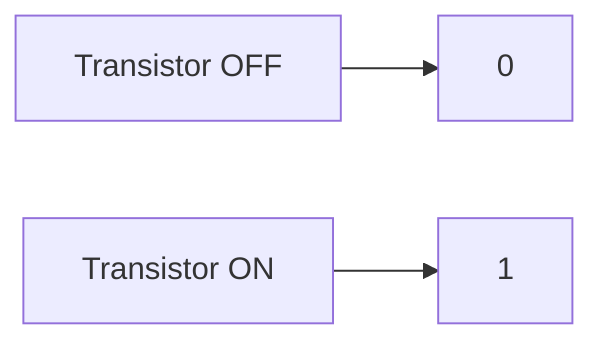
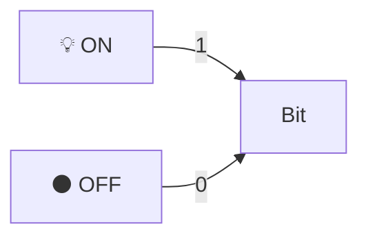
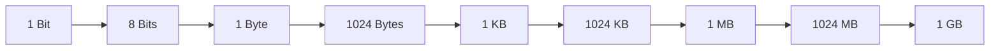
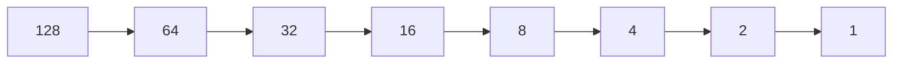
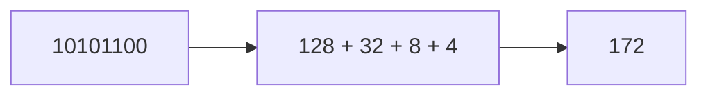
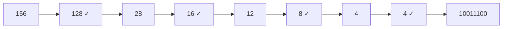
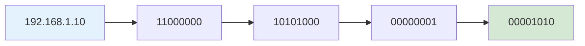
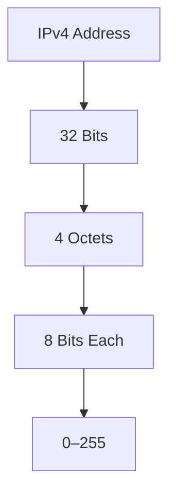

```mermaid
flowchart LR

A["✅ Binary Basics"]

--> B["🌍 IPv4"]

--> C["🚀 IPv6"]

--> D["🌐 Public vs Private"]

--> E["⚙️ Static vs Dynamic"]

--> F["🆘 APIPA"]

--> G["🔄 Loopback"]

--> H["📏 CIDR"]

--> I["🚪 Default Gateway"]

--> J["🧩 Subnetting"]

--> K["🏢 VLSM"]

--> L["🌎 Supernetting"]

style A fill:#D5E8D4
style B fill:#FFF2CC
```

# 🔢 Binary Basics

> *Learn the language computers use to represent numbers and build the foundation for IP addressing, subnetting, and network calculations.*

---

<div align="center">


</div>

---

<!--
Image Description:
Create an educational illustration showing binary numbers (0s and 1s), bits, bytes, and a computer processing digital information. Include a simple comparison between binary and decimal numbers.

Suggested Search Keywords:
binary number system infographic
bits and bytes illustration
computer binary representation
binary basics networking
-->

<p align="center">

</p>

---

# 🌐 What Is Binary?

Computers do not understand decimal numbers the way humans do.

When we write numbers, we use the **decimal system**, which has ten possible digits:

```
0 1 2 3 4 5 6 7 8 9
```

Computers, however, use the **binary system**, which has only two possible digits:

```
0 and 1
```

A **binary number** is a number expressed using only these two digits. Each binary digit is called a **bit**.

> **Definition:** Binary is a base-2 number system that represents information using only 0s and 1s.

---

# 🤔 Why Only 0 and 1?

Electronic circuits inside computers are built from tiny switches called **transistors**.

Each transistor can be in one of two states:

| State | Binary Value | Meaning |
|------|------|------|
| OFF | 0 | No electrical signal |
| ON | 1 | Electrical signal present |

Because hardware can reliably detect only these two states, binary becomes the natural language of computers.

---



---

<!--
Image Description:
Create a simple diagram showing a transistor with two states: OFF = 0 and ON = 1. Include arrows showing how electrical signals are represented as binary values.

Suggested Search Keywords:
transistor binary 0 1 diagram
computer switch binary representation
digital circuit binary infographic
-->

<p align="center">

</p>

---

> 💡 **Did You Know?**
>
> Every text message, image, video, and network packet is ultimately stored and transmitted as a sequence of **0s and 1s**.

---

# 📌 Why Binary Matters in Networking

You might wonder why a networking student needs to learn binary.

The answer is simple: **IP addresses are stored internally as binary numbers**.

For example, the IPv4 address:

```
192.168.1.10
```

is actually represented inside the computer as:

```
11000000.10101000.00000001.00001010
```

Understanding binary will help you:

- Read IPv4 addresses more clearly
- Understand subnet masks
- Learn CIDR notation
- Perform subnetting calculations
- Troubleshoot network configurations

---

> ⭐ **Point to Remember**
>
> **Binary is the foundation of IP addressing.** If you understand binary, IPv4 and subnetting will become much easier to learn.

# 📦 Bits and Bytes

Everything inside a computer—from text documents and images to videos and IP addresses—is ultimately stored as **binary data**.

Binary data is made up of only two digits:

- **0**
- **1**

These two digits are called **bits**, and they represent the smallest unit of information that a computer can understand.

A single bit can have only **one of two possible values**:

- **0** → Off, False, No, Low Voltage
- **1** → On, True, Yes, High Voltage

Although one bit can store only a tiny amount of information, combining multiple bits allows computers to represent much more complex data.

---

## 🔹 What Is a Bit?

A **bit** (short for **Binary Digit**) is the smallest unit of digital information.

Think of a bit like a simple light switch.

- 💡 **ON** → 1
- ⚫ **OFF** → 0

Since a switch can only be ON or OFF, a bit can only be **1 or 0**.



Every operation performed by a computer—from opening a web browser to playing a game—is ultimately reduced to billions of these tiny 0s and 1s.

---

## 🔹 What Is a Byte?

While a single bit is useful, it cannot represent much information on its own.

To store meaningful data, computers group **8 bits together**.

This group of **8 bits** is called a **Byte**.

```
1 Byte = 8 Bits
```

For example:

```
01000001
```

This sequence contains **8 binary digits**, so it represents **one byte**.

A byte can represent:

- A letter
- A number
- A punctuation symbol
- A small piece of an image
- Part of a sound or video file

As data grows larger, computers measure it using larger units:

| Unit | Equals |
|------|---------|
| 1 Bit | A single binary digit (0 or 1) |
| 1 Byte | 8 Bits |
| 1 Kilobyte (KB) | 1,024 Bytes |
| 1 Megabyte (MB) | 1,024 KB |
| 1 Gigabyte (GB) | 1,024 MB |
| 1 Terabyte (TB) | 1,024 GB |

---



---

<!--
Image Description:
Create an educational infographic illustrating the relationship between bits and bytes. Show individual bits (0 and 1) combining into one byte (8 bits), then expanding into kilobytes, megabytes, gigabytes, and terabytes. Use modern icons representing digital storage.

Suggested Search Keywords:
bits and bytes infographic
binary data storage illustration
computer storage hierarchy
digital information units

Suggested Filename:
Images/bits_and_bytes.png
-->

<p align="center">

</p>

---

## 🌐 Why Bits and Bytes Matter in Networking

Understanding bits and bytes is essential because networking devices process data in binary form.

For example:

- Every **IPv4 address** is **32 bits** long.
- IPv4 is divided into **4 octets**, with each octet containing **8 bits**.
- Since **8 bits = 1 byte**, an IPv4 address consists of **4 bytes**.

You'll explore this in detail in the upcoming **IPv4** lesson, but understanding bits and bytes now will make those concepts much easier to learn.

---

> 💡 **Point to Remember**
>
> A **bit** is the smallest unit of digital information, while a **byte** is a group of **8 bits**. Almost every networking concept—including IP addresses, subnet masks, MAC addresses, and packet headers—is built upon these fundamental units.

---

> 🤓 **Did You Know?**
>
> Although Internet speeds are usually advertised in **megabits per second (Mbps)**, file sizes are typically measured in **megabytes (MB)**. Since **1 Byte = 8 Bits**, a **100 Mbps** Internet connection does **not** download files at **100 MB/s**—its theoretical maximum is about **12.5 MB/s**.

---

# 🔢 Understanding Binary Place Values

Humans use the **Decimal Number System (Base-10)** every day.

In decimal, each digit has a value based on powers of **10**.

For example, consider the number:

```
583
```

Its value can be broken down as:

| Digit | Place Value | Calculation |
|-------:|------------:|------------:|
| 5 | Hundreds | 5 × 100 = 500 |
| 8 | Tens | 8 × 10 = 80 |
| 3 | Ones | 3 × 1 = 3 |

```
500 + 80 + 3 = 583
```

Computers use the exact same idea—but instead of powers of **10**, they use powers of **2**.

This is called the **Binary Number System (Base-2)**.

---

## 🔹 Binary Place Values

Each position in a binary number represents a power of **2**.

Starting from the **rightmost bit**, the place values are:

| Bit Position | 7 | 6 | 5 | 4 | 3 | 2 | 1 | 0 |
|--------------|---|---|---|---|---|---|---|---|
| Power of 2 | 2⁷ | 2⁶ | 2⁵ | 2⁴ | 2³ | 2² | 2¹ | 2⁰ |
| Decimal Value | 128 | 64 | 32 | 16 | 8 | 4 | 2 | 1 |

These eight values are extremely important because **every octet in an IPv4 address uses them**.

---



---

## 🔹 Reading a Binary Number

Let's examine the binary number:

```
11001010
```

Place each bit above its corresponding place value.

| Place Value | 128 | 64 | 32 | 16 | 8 | 4 | 2 | 1 |
|-------------|----:|---:|---:|---:|--:|--:|--:|--:|
| Binary Bit  | 1 | 1 | 0 | 0 | 1 | 0 | 1 | 0 |

Now add together only the place values that contain a **1**.

```
128 + 64 + 8 + 2
```

```
= 202
```

Therefore:

```
11001010₂ = 202₁₀
```

This is exactly how computers interpret binary numbers.

---

<!--
Image Description:
Create an educational infographic showing binary place values from 128 to 1. Below each value, place a binary digit example (11001010) and visually highlight the values that are added together to produce the decimal number 202. Use arrows and color highlights to show the calculation process.

Suggested Search Keywords:
binary place values infographic
binary to decimal conversion diagram
8-bit binary chart
binary numbering system illustration

Suggested Filename:
Images/binary_place_values.png
-->

<p align="center">

</p>

---

## 🌐 Why Binary Place Values Matter in Networking

Understanding binary place values is essential because **IPv4 addresses are stored as four 8-bit binary numbers (octets).**

For example:

```
192.168.1.10
```

The first octet (**192**) is actually stored as:

```
11000000
```

The computer doesn't see **192**.

It sees:

```
128 + 64 = 192
```

Every IPv4 address is converted into binary before it is processed by network devices such as computers, switches, routers, and firewalls.

Without understanding binary place values, concepts like **subnet masks**, **CIDR notation**, and **subnetting** become much harder to understand.

---

> 💡 **Point to Remember**
>
> Every **8-bit binary number** can represent a decimal value between **0 and 255**. This is why each octet in an IPv4 address ranges from **0 to 255**.

---

> 🤓 **Did You Know?**
>
> The largest number that can be represented using **8 bits** is **255**, because when all eight bits are set to **1**, the calculation becomes:
>
> **128 + 64 + 32 + 16 + 8 + 4 + 2 + 1 = 255**
>
> This is the reason why no IPv4 octet can be greater than **255**.

---

# 🔄 Converting Binary to Decimal

Now that you understand how binary place values work, converting a binary number into decimal becomes straightforward.

The process is simple:

1. Write the binary number.
2. Place the binary digits under their corresponding place values.
3. Add together only the place values where the bit is **1**.
4. The final sum is the decimal equivalent.

Let's see this process step by step.

---

## 📖 Example 1

Convert the following binary number into decimal.

```
10101100₂
```

### Step 1 — Write the Place Values

| Place Value | 128 | 64 | 32 | 16 | 8 | 4 | 2 | 1 |
|-------------|----:|---:|---:|---:|--:|--:|--:|--:|
| Binary Bit  | 1 | 0 | 1 | 0 | 1 | 1 | 0 | 0 |

---

### Step 2 — Select Only the Values with a **1**

```
128
+32
+8
+4
```

---

### Step 3 — Add Them Together

```
128 + 32 + 8 + 4

= 172
```

Therefore,

```
10101100₂ = 172₁₀
```

---



---

## 📖 Example 2

Convert:

```
00110110₂
```

| Place Value |128|64|32|16|8|4|2|1|
|-------------|--:|--:|--:|--:|--:|--:|--:|--:|
|Binary Bit|0|0|1|1|0|1|1|0|

Only add the highlighted values.

```
32 + 16 + 4 + 2

= 54
```

Therefore,

```
00110110₂ = 54₁₀
```

---

## 📖 Example 3

Convert:

```
11111111₂
```

```
128
+64
+32
+16
+8
+4
+2
+1
```

```
=255
```

Therefore,

```
11111111₂ = 255₁₀
```

This is the **largest possible value** that can be stored in one byte.

---

<!--
Image Description:
Create an educational infographic demonstrating binary-to-decimal conversion. Show an 8-bit binary number aligned with place values (128, 64, 32, 16, 8, 4, 2, 1), highlight the bits that are 1, and visually add the corresponding decimal values to reach the final answer. Use arrows and color coding to make each calculation step easy to follow.

Suggested Search Keywords:
binary to decimal conversion infographic
8-bit binary conversion chart
binary math illustration
computer networking binary tutorial

Suggested Filename:
Images/binary_to_decimal_conversion.png
-->

<p align="center">

</p>

---

## 🌐 Why This Matters in Networking

Every IPv4 address you see in everyday networking is simply a human-friendly representation of binary numbers.

For example:

```
192.168.1.10
```

The first octet (**192**) is actually stored internally as:

```
11000000
```

Network devices never process **192** directly.

Instead, they process:

```
11000000
```

This binary representation allows routers, switches, firewalls, and computers to perform calculations for routing, subnetting, packet forwarding, and network communication.

Understanding binary-to-decimal conversion is the first major step toward mastering **IPv4 addressing**, **subnet masks**, and **CIDR notation**.

---

> 💡 **Point to Remember**
>
> Converting **binary to decimal** always involves **adding together the place values represented by the bits that are set to 1**. Bits with a value of **0** contribute nothing to the final result.

---

> 🤓 **Did You Know?**
>
> When network engineers troubleshoot subnetting or routing problems, they often convert binary values to decimal mentally. With practice, recognizing common binary patterns such as **128**, **192**, **224**, **240**, **248**, **252**, **254**, and **255** becomes second nature because these values frequently appear in subnet masks.

---

# 🔁 Converting Decimal to Binary

While computers naturally understand binary numbers, humans usually work with decimal numbers.

This means that networking professionals often need to convert **decimal numbers into binary**, especially when working with **IPv4 addresses**, **subnet masks**, **CIDR notation**, and **subnetting**.

Fortunately, the conversion process is straightforward once you understand binary place values.

---

## 📖 The Conversion Method

To convert a decimal number into binary:

1. Start with the largest binary place value that is less than or equal to the decimal number.
2. Write **1** beneath that place value.
3. Subtract the place value from the decimal number.
4. Move to the next place value.
5. Repeat until the remaining value becomes **0**.
6. Any unused place values become **0**.

Let's see how this works.

---

## 📖 Example 1

Convert the decimal number:

```
156₁₀
```

### Step 1 — Write the Binary Place Values

| Place Value |128|64|32|16|8|4|2|1|
|-------------|--:|--:|--:|--:|--:|--:|--:|--:|
| Binary Bit | | | | | | | | |

---

### Step 2 — Begin Filling the Bits

**156 ≥ 128**

```
156 - 128 = 28
```

So,

```
128 → 1
```

Remaining:

```
28
```

---

**64 is too large**

```
64 → 0
```

---

**32 is too large**

```
32 → 0
```

---

**28 ≥ 16**

```
28 - 16 = 12
```

```
16 → 1
```

---

**12 ≥ 8**

```
12 - 8 = 4
```

```
8 → 1
```

---

**4 ≥ 4**

```
4 - 4 = 0
```

```
4 → 1
```

The remaining place values become **0**.

Final answer:

|128|64|32|16|8|4|2|1|
|--:|--:|--:|--:|--:|--:|--:|--:|
|1|0|0|1|1|1|0|0|

```
156₁₀ = 10011100₂
```

---



---

## 📖 Example 2

Convert:

```
75₁₀
```

|128|64|32|16|8|4|2|1|
|--:|--:|--:|--:|--:|--:|--:|--:|
|0|1|0|0|1|0|1|1|

```
75₁₀ = 01001011₂
```

---

<!--
Image Description:
Create an educational infographic demonstrating decimal-to-binary conversion. Show the decimal number 156 being converted into binary using the place value table (128, 64, 32, 16, 8, 4, 2, 1). Highlight each subtraction step with arrows and visually show how the final binary number 10011100 is formed.

Suggested Search Keywords:
decimal to binary conversion infographic
binary conversion tutorial
binary place value illustration
networking binary lesson

Suggested Filename:
Images/decimal_to_binary_conversion.png
-->

<p align="center">

</p>

---

## 🌐 Why This Matters in Networking

Whenever you configure an IPv4 address or calculate a subnet mask, networking devices perform binary calculations behind the scenes.

For example,

```
255
```

becomes

```
11111111
```

and

```
192
```

becomes

```
11000000
```

Understanding decimal-to-binary conversion will make subnetting and CIDR calculations much easier in later lessons.

---

## 🧠 Knowledge Check

Before moving on, test your understanding by solving the following questions **without looking at the answers**.

### Question 1

Convert the following decimal number into binary.

```
25₁₀ = ?
```

---

### Question 2

Convert:

```
200₁₀ = ?
```

---

### Question 3

Convert:

```
255₁₀ = ?
```

---

### Question 4

Convert:

```
64₁₀ = ?
```

---

### Question 5

Convert:

```
11110000₂
```

into decimal.

---

### 🎯 Challenge Question

Without using a calculator,

Convert:

```
172₁₀
```

into binary.

---

<details>

<summary><strong>✅ Show Answers</strong></summary>

### Question 1

```
25₁₀ = 00011001₂
```

---

### Question 2

```
200₁₀ = 11001000₂
```

---

### Question 3

```
255₁₀ = 11111111₂
```

---

### Question 4

```
64₁₀ = 01000000₂
```

---

### Question 5

```
11110000₂ = 240₁₀
```

---

### Challenge

```
172₁₀ = 10101100₂
```

Excellent! 🎉

If you solved these correctly, you're ready to understand how IPv4 addresses are represented internally by computers.

</details>

---

> 💡 **Point to Remember**
>
> Binary conversion is not just an academic exercise—it is a practical skill used in networking, subnetting, routing, and cybersecurity. Mastering these conversions now will make future topics much easier.

---

# 🌐 Binary in IPv4 Addressing

So far, you've learned how computers use binary numbers and how to convert between binary and decimal.

Now it's time to answer an important question:

> **Why did we spend so much time learning binary in a networking course?**

The answer is simple:

**Every IPv4 address is actually stored and processed as binary.**

Although humans prefer to write addresses like this:

```
192.168.1.10
```

Computers never see these decimal numbers.

Instead, every octet is converted into its **8-bit binary equivalent** before being processed by the operating system, network interface card (NIC), switches, routers, and other networking devices.

---

## 🔹 An IPv4 Address in Binary

Consider the following IPv4 address:

```
192.168.1.10
```

Each decimal number is converted independently.

| Decimal | Binary |
|---------:|:-------|
| 192 | 11000000 |
| 168 | 10101000 |
| 1 | 00000001 |
| 10 | 00001010 |

The complete binary representation becomes:

```
11000000.10101000.00000001.00001010
```

Although we usually write IP addresses in decimal because they are easier to read, computers always process them as binary values.

---



---

## 🔹 Why Eight Bits?

Earlier in this lesson, you learned that:

```
1 Byte = 8 Bits
```

An IPv4 address consists of **32 bits**.

These 32 bits are divided into **four groups**, each containing **8 bits**.

```
32 Bits

↓

8 + 8 + 8 + 8

↓

4 Octets
```

This is why every IPv4 address contains **four decimal numbers**, separated by periods.

```
192.168.1.10
```

Each number represents one **8-bit binary value**.

---



---

## 🔹 Why Can Each Octet Only Be 0–255?

Since each octet contains exactly **8 bits**, there are only **256 possible combinations**.

The smallest value is:

```
00000000

= 0
```

The largest value is:

```
11111111

=255
```

Therefore,

every IPv4 octet must be between

```
0

and

255
```

This is one of the most important networking facts you'll learn.

---

<!--
Image Description:
Create an educational infographic showing how the IPv4 address 192.168.1.10 is converted into binary. Display each decimal octet alongside its binary equivalent and visually explain that an IPv4 address consists of four 8-bit octets (32 bits total). Use arrows to show the conversion process and highlight the 0–255 range for each octet.

Suggested Search Keywords:
IPv4 binary conversion infographic
IPv4 address binary representation
computer networking IPv4 illustration
binary IPv4 educational diagram

Suggested Filename:
Images/ipv4_binary_representation.png
-->

<p align="center">

</p>

---

## 🌍 Real-World Example

Imagine you open your web browser and visit:

```
https://example.com
```

Before any data is sent, your computer converts the destination IPv4 address into binary.

Routers examine these binary values to determine the best path for the packet.

Although users never see this process, it happens **billions of times every day** across the Internet.

Every website, email, online game, cloud application, and video call relies on binary IP addressing behind the scenes.

---

## 🧠 Quick Check

✔️ How many bits are contained in an IPv4 address?

✔️ How many octets make up an IPv4 address?

✔️ How many bits are in one octet?

---

## 📖 Knowledge Check

### Question 1

Convert the following IPv4 address into binary.

```
10.0.0.1
```

---

### Question 2

Convert:

```
255.255.255.0
```

into binary.

---

### Question 3

Why can't an IPv4 octet be greater than **255**?

---

### Question 4

How many bits are contained in:

```
172.16.254.1
```

---

### 🚀 Challenge Question

Without using a calculator,

convert

```
192.168.100.25
```

into binary.

---

<details>

<summary><strong>✅ Show Answers</strong></summary>

### Question 1

```
00001010.00000000.00000000.00000001
```

---

### Question 2

```
11111111.11111111.11111111.00000000
```

---

### Question 3

Because one octet contains **8 bits**, allowing only values from **0 to 255**.

---

### Question 4

```
32 Bits
```

---

### Challenge

```
11000000.10101000.01100100.00011001
```

</details>

---

> 💡 **Point to Remember**
>
> Humans read IPv4 addresses in **decimal**, but computers process them in **binary**. Understanding this relationship is the foundation for subnetting, CIDR notation, routing, and many advanced networking concepts.

---

# 📝 Chapter Summary

Congratulations! 🎉

You've completed the first lesson of the **IP Addressing** module and taken your first step toward understanding how computers communicate across modern networks.

In this chapter, you discovered that computers don't understand decimal numbers like humans do—they process everything using **binary (Base-2)**. You learned how binary numbers are built from **bits** and **bytes**, how binary place values work, and how to convert numbers between **binary** and **decimal**.

Most importantly, you connected these concepts to networking by learning that every **IPv4 address is stored and processed as binary**, even though we usually write it in decimal notation.

This knowledge forms the mathematical foundation for many networking concepts you'll encounter throughout this roadmap, including **IPv4 addressing**, **subnet masks**, **CIDR notation**, **subnetting**, **routing**, and **network security**.

---

## 🎯 What You Learned

By completing this lesson, you should now be able to:

- ✅ Explain what the Binary Number System is.
- ✅ Describe the difference between bits and bytes.
- ✅ Understand binary place values.
- ✅ Convert binary numbers into decimal.
- ✅ Convert decimal numbers into binary.
- ✅ Explain why computers use binary.
- ✅ Understand why IPv4 addresses are stored as binary.
- ✅ Explain why each IPv4 octet ranges from **0 to 255**.

---

## 💡 Key Takeaways

Remember these important ideas before moving to the next lesson:

- 🌍 Computers only understand **binary (0 and 1)**.
- 📦 A **bit** is the smallest unit of information.
- 💾 **8 bits = 1 byte**.
- 🔢 Every IPv4 address contains **32 bits**.
- 🧩 IPv4 is divided into **4 octets**, each containing **8 bits**.
- 📈 Every octet can represent values from **0 to 255**.
- 🛡️ Binary is the foundation of IP addressing, subnetting, routing, and many cybersecurity concepts.

---

> 💭 **Quote to Remember**
>
> *"Humans think in decimal. Computers think in binary. Networking connects the two."*

---

<!--
Image Description:
Create an educational illustration summarizing Binary Basics. Show bits (0 and 1), bytes, binary place values, decimal conversion, and an IPv4 address being converted into binary. The illustration should visually connect all concepts learned in this chapter and point toward IPv4 Addressing as the next lesson.

Suggested Search Keywords:
binary basics summary infographic
computer networking binary overview
IPv4 binary education
binary learning roadmap

Suggested Filename:
Images/binary_basics_summary.png
-->

<p align="center">

</p>

---

# 🚀 Continue Your Learning Journey

You've now built the mathematical foundation required to understand IP addressing.

The next lesson introduces **IPv4**, the addressing system that powers most of today's Internet.

You'll learn:

- 🌍 What an IPv4 address is.
- 🧩 How IPv4 addresses are structured.
- 🔢 Why IPv4 uses **32 bits**.
- 📦 Network IDs and Host IDs.
- 🌐 Real-world IPv4 examples.
- ⚠️ Why IPv4 eventually ran out of addresses.

Understanding IPv4 is one of the most important milestones in networking because it forms the basis for routing, subnetting, firewall configuration, and many cybersecurity tools.

---

## 📖 Next Lesson

# **[🌍 02 — IPv4](02-IPv4.md)** →

---

## 🧭 Module Progress

```text
IP Addressing Module

✅ Binary Basics
⬜ IPv4
⬜ IPv6
⬜ Public vs Private IP
⬜ Static vs Dynamic IP
⬜ APIPA
⬜ Loopback Address
⬜ CIDR
⬜ Default Gateway
⬜ Subnetting
⬜ VLSM
⬜ Supernetting
```



---

<!--
Image Description:
Create a learning roadmap for the IP Addressing module. Highlight Binary Basics as completed, IPv4 as the current next lesson, and the remaining lessons (IPv6, Public vs Private IP, Static vs Dynamic IP, APIPA, Loopback Address, CIDR, Default Gateway, Subnetting, VLSM, and Supernetting) as upcoming milestones. Use arrows to show progression through the module.

Suggested Search Keywords:
IP addressing learning roadmap
IPv4 next lesson infographic
computer networking curriculum
networking learning path

Suggested Filename:
Images/ip_addressing_next_lesson.png
-->

<p align="center">

</p>

---

<div align="center">

### 🎉 Excellent Work!

**You've completed Lesson 1 of the IP Addressing module.**

Keep building your knowledge one lesson at a time—every concept you master here will make advanced networking and cybersecurity topics much easier to understand.

**See you in the next lesson! 🚀**

</div>

---


