# 🌍 IPv4 (Internet Protocol Version 4)

> *IPv4 (Internet Protocol Version 4) is the most widely used network addressing protocol in the world. It provides every device connected to a network with a unique logical address, allowing data to be delivered accurately between computers, smartphones, servers, routers, and countless other devices across the Internet.*

---

<div align="center">

# 🌍 IPv4 (Internet Protocol Version 4)

### The Foundation of Modern Network Communication


</div>

---

<div align="center">


<br>


</div>

---

# 📖 Introduction

Every device connected to a network needs a way to be uniquely identified.

Imagine sending a letter without writing the recipient's address. Even if the postal service is fast and reliable, the letter would never reach its destination because no one knows where it should be delivered.

Computer networks work in exactly the same way.

Whenever you browse a website, send an email, stream a video, or join an online game, your device must know **where to send data** and **where responses should return**. This is the role of an **Internet Protocol (IP) address**.

Among all Internet addressing systems, **IPv4 (Internet Protocol Version 4)** has been the backbone of global networking for decades. It enables billions of devices to communicate by assigning each one a logical address that uniquely identifies it on a network.

Although newer technologies such as IPv6 are becoming increasingly important, IPv4 remains the most widely deployed addressing protocol in enterprise networks, home networks, educational environments, and across much of the Internet.

In this lesson, you'll explore how IPv4 addresses are structured, how they work, why they are limited, and why understanding IPv4 is essential before learning subnetting, routing, firewalls, and cybersecurity.

---

<!--
Image Description:
Create a professional educational illustration showing devices such as a desktop computer, laptop, smartphone, server, and cloud connected through the Internet. Display IPv4 addresses above each device to emphasize that every networked device requires a unique logical address for communication. Use a modern flat design with blue networking tones.

Suggested Search Keywords:
IPv4 networking infographic
devices with IP addresses illustration
computer network communication diagram
internet protocol educational graphic

Suggested Filename:
Images/ipv4_banner.png
-->

<p align="center">

</p>

---

# 🎯 Learning Objectives

By the end of this lesson, you will be able to:

- ✅ Explain what IPv4 is and why it is important.
- ✅ Describe the structure of an IPv4 address.
- ✅ Understand dotted decimal notation.
- ✅ Explain the difference between Network ID and Host ID.
- ✅ Identify the limitations of IPv4.
- ✅ Understand why IPv6 was developed.
- ✅ Interpret IPv4 addresses used in real-world networks.

---

# 📚 Table of Contents

- 📖 What Is an IPv4 Address?
- 🏗️ Structure of an IPv4 Address
- 🌐 How IPv4 Works
- 🧩 Network ID and Host ID
- 🏠 Public and Private Address Preview
- ⚠️ IPv4 Limitations
- 🌍 IPv4 in the Real World
- 💻 Mini Lab
- 🧠 Quick Check
- 📖 Knowledge Check
- 🚀 Challenge Questions
- 📝 Chapter Summary
- ➡️ Next Lesson

---

# 📖 What Is an IPv4 Address?

Before two people can communicate through the postal system, they need to know each other's addresses. Without a destination address, a letter cannot be delivered, regardless of how efficient the postal service may be.

Computer networks operate on the same principle.

Whenever your computer, smartphone, or any other network-enabled device communicates with another device, it must know **where to send data** and **where responses should be returned**. This is made possible through an **Internet Protocol (IP) address**.

An **IPv4 (Internet Protocol Version 4) address** is a **logical address** assigned to a device on a network. It uniquely identifies that device and enables routers and other networking equipment to deliver data to the correct destination.

Unlike a **MAC Address**, which is permanently assigned to a network interface by the manufacturer, an IPv4 address can be assigned manually or automatically and may change depending on the network to which the device is connected.

---

## 🏠 A Real-World Analogy

Imagine you want to send a birthday gift to your friend.

To ensure the package reaches the correct destination, you write two addresses on the parcel:

- **Sender's Address** – So the package can be returned if delivery fails.
- **Recipient's Address** – So the postal service knows where to deliver it.

Network communication works in exactly the same way.

Whenever data travels across a network, every packet contains:

- **Source IP Address** → The sender's address.
- **Destination IP Address** → The receiver's address.

Without these addresses, routers would have no idea where data should go.

---

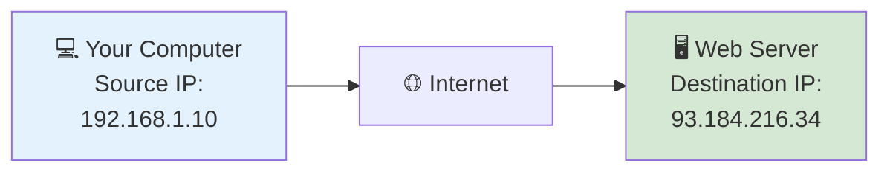

---

<!--
Image Description:
Create an educational comparison between a postal delivery system and IPv4 communication. On the left, show a person sending a letter with a sender and recipient address. On the right, show a computer sending a data packet with a Source IP Address and Destination IP Address through the Internet to a web server. Use arrows to highlight the similarities.

Suggested Search Keywords:
postal service analogy networking
IPv4 source destination address infographic
network packet delivery illustration
internet protocol address analogy

Suggested Filename:
Images/ipv4_postal_analogy.png
-->

<p align="center">

</p>

---

## 🔹 Why Do We Need IPv4 Addresses?

Without IP addresses, network communication would be impossible.

Imagine connecting millions—or even billions—of devices to the Internet without a way to identify them. Routers would have no way to determine where data should be delivered, leading to complete communication failure.

IPv4 addresses solve this problem by giving every device on a network a unique logical identity.

This allows network devices to:

- 📍 Identify individual devices.
- 📦 Deliver data to the correct destination.
- 🔄 Receive responses from remote systems.
- 🌍 Communicate across local networks and the Internet.
- 🛡️ Apply security rules through routers and firewalls.

Whether you're opening a website, sending an email, joining a video conference, or playing an online game, IPv4 addressing is working behind the scenes to make that communication possible.

---

## 🔹 Examples of IPv4 Addresses

Here are some examples of valid IPv4 addresses:

| Device | IPv4 Address |
|---------|--------------|
| Home Computer | `192.168.1.10` |
| Office Printer | `192.168.10.25` |
| Laptop | `10.0.0.15` |
| Router | `192.168.1.1` |
| Public Web Server | `93.184.216.34` |

Although these addresses look like ordinary decimal numbers, they are actually stored and processed as **32-bit binary values**, which you learned in the previous lesson.

---

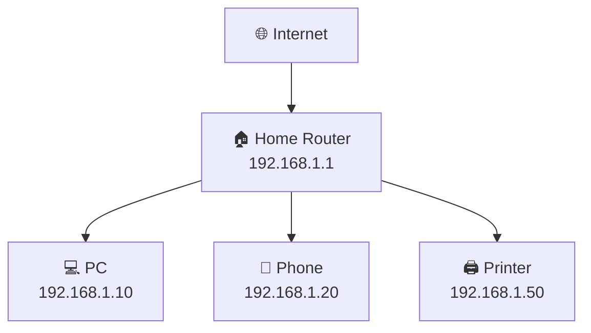

---

<!--
Image Description:
Create an educational home network diagram showing a router connected to a desktop computer, laptop, smartphone, and printer. Display a unique IPv4 address above each device and label the router as the default gateway. Use a clean, modern networking style with simple icons.

Suggested Search Keywords:
home network IPv4 diagram
devices with IPv4 addresses
router computer phone printer network
IPv4 home LAN illustration

Suggested Filename:
Images/ipv4_home_network.png
-->

<p align="center">

</p>

---

## 🌐 IPv4 in Everyday Life

Most people use IPv4 every day without realizing it.

Whenever you:

- 🌍 Browse a website
- 📧 Send an email
- 🎮 Play an online game
- 🎥 Watch videos on YouTube or Netflix
- ☁️ Access cloud services
- 📱 Use social media

your device uses an IP address to communicate with servers around the world.

Although the process happens in milliseconds and remains invisible to users, every successful network connection depends on accurate IP addressing.

---

> 💡 **Point to Remember**
>
> An **IPv4 address** is a **logical address** that uniquely identifies a device on a network. It enables routers and other networking devices to deliver data accurately between the sender and the receiver.

---

> 🤓 **Did You Know?**
>
> Every time you open a website, your device includes its own **source IP address** and the website's **destination IP address** in each packet it sends. Routers across the Internet use these addresses to forward packets toward their destination, often traversing dozens of intermediate networks before reaching the server.

---

# 🏗️ Structure of an IPv4 Address

Every IPv4 address follows a standardized structure that allows computers, routers, and other networking devices to identify and communicate with one another reliably.

Although an IPv4 address may look like a simple series of numbers, it is carefully organized according to rules defined by the **Internet Protocol (IP)**.

Understanding this structure is essential because it forms the foundation for many networking concepts, including **subnetting**, **CIDR notation**, **routing**, and **network troubleshooting**.

---

## 🔹 An IPv4 Address Is 32 Bits Long

Every IPv4 address contains exactly **32 bits** of information.

Since reading a continuous 32-bit binary number would be difficult for humans, IPv4 divides these bits into **four equal sections**, each consisting of **8 bits**.

Each 8-bit section is called an **octet**.

```
32 Bits

↓

8 Bits + 8 Bits + 8 Bits + 8 Bits

↓

4 Octets
```

This structure makes IPv4 addresses much easier to read, write, and configure.

---

## 🔹 The Four Octets

A standard IPv4 address is written using **four decimal numbers**, separated by periods (`.`).

For example:

```
192.168.1.10
```

Each number represents one **8-bit octet**.

| Octet | Decimal Value | Binary Representation |
|:------:|:-------------:|:---------------------:|
| Octet 1 | 192 | 11000000 |
| Octet 2 | 168 | 10101000 |
| Octet 3 | 1 | 00000001 |
| Octet 4 | 10 | 00001010 |

When combined, these four octets form the complete **32-bit IPv4 address**.

```
11000000.10101000.00000001.00001010
```

Although humans usually work with the decimal format, computers always process the binary representation internally.

---

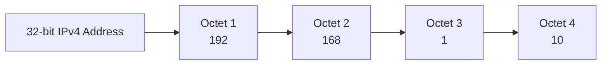

---

<!--
Image Description:
Create an educational infographic illustrating the structure of an IPv4 address. Show the address 192.168.1.10 divided into four labeled octets. Beneath each octet, display its corresponding 8-bit binary representation. Include labels indicating that the entire address is 32 bits long and that each octet contains 8 bits.

Suggested Search Keywords:
IPv4 address structure infographic
IPv4 octets explained
32-bit IPv4 diagram
IPv4 binary representation

Suggested Filename:
Images/ipv4_address_structure.png
-->

<p align="center">

</p>

---

## 🔹 Dotted Decimal Notation

Instead of displaying an IPv4 address as one long binary number, IPv4 uses a human-friendly format called **Dotted Decimal Notation**.

In this notation:

- Each octet is converted from binary into decimal.
- Periods (`.`) separate the four octets.
- Each octet ranges from **0 to 255**.

For example:

| Binary | Decimal |
|---------|---------|
| 11000000 | 192 |
| 10101000 | 168 |
| 00000001 | 1 |
| 00001010 | 10 |

Result:

```
192.168.1.10
```

This notation makes IPv4 addresses much easier to remember and configure while allowing computers to continue processing the binary equivalent behind the scenes.

---

## 🔹 Why Does Each Octet Range from 0 to 255?

In the previous lesson, you learned that each octet contains **8 bits**.

An 8-bit binary number can represent **256 unique values**, ranging from:

```
00000000₂ = 0₁₀
```

to

```
11111111₂ = 255₁₀
```

This is why every octet in an IPv4 address must be within the range:

```
0 – 255
```

Any value outside this range cannot be represented using 8 bits and therefore cannot be part of a valid IPv4 address.

For example:

| IPv4 Address | Valid? | Explanation |
|--------------|:------:|-------------|
| `192.168.1.10` | ✅ | Every octet is between 0 and 255 |
| `10.0.0.254` | ✅ | Valid IPv4 address |
| `172.16.300.5` | ❌ | 300 exceeds the maximum value of an octet |
| `256.1.1.1` | ❌ | 256 requires more than 8 bits |

---

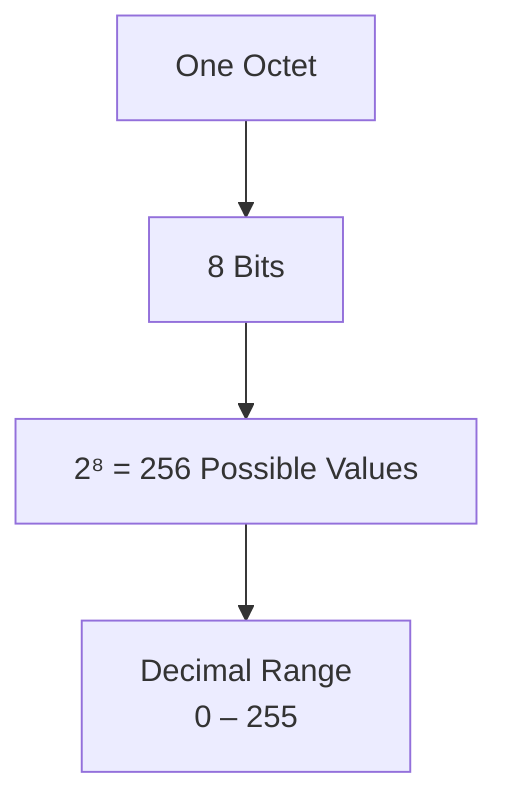

---

## 🌐 Why This Structure Matters

The standardized 32-bit structure of IPv4 allows networking devices around the world to interpret addresses consistently.

Whether a packet is sent across a home Wi-Fi network or routed between continents, every router understands that an IPv4 address consists of:

- **32 total bits**
- **4 octets**
- **8 bits per octet**
- **Decimal values ranging from 0 to 255**

This universal format makes global communication possible and provides the basis for more advanced concepts such as **Network IDs**, **Host IDs**, **Subnet Masks**, and **CIDR notation**, which you'll explore later in this module.

---

> 💡 **Point to Remember**
>
> Every IPv4 address contains **32 bits**, divided into **four 8-bit octets**. Humans read these octets in **dotted decimal notation**, while computers process them as binary values.

---

> 🤓 **Did You Know?**
>
> If IPv4 addresses were written only in binary, a simple home router address like **192.168.1.1** would appear as:
>
> ```
> 11000000.10101000.00000001.00000001
> ```
>
> Dotted decimal notation was introduced to make IP addresses much easier for humans to read, remember, and configure.

---

# 🌐 How IPv4 Works

Now that you understand **what an IPv4 address is** and **how it is structured**, the next question is:

> **How does an IPv4 address actually help devices communicate?**

Every time you browse a website, send an email, stream a video, or join an online meeting, your device exchanges thousands of small units of data called **packets**.

Each packet contains important information that helps it reach the correct destination. Among the most important pieces of information are:

- **Source IP Address** – The address of the device sending the packet.
- **Destination IP Address** – The address of the device that should receive the packet.

Just as a postal package contains both a sender's address and a recipient's address, every network packet contains both a source and destination IP address.

Without these addresses, routers would have no way of knowing where to forward the packet.

---

## 🔹 The Journey of a Packet

Imagine you're sitting at home and open your web browser to visit:

```
https://example.com
```

Although this action appears almost instant, several networking processes happen behind the scenes.

1. Your computer creates a packet containing the requested data.
2. The packet is assigned your computer's **Source IP Address**.
3. The destination server's **Destination IP Address** is added to the packet.
4. The packet is sent to your home router.
5. The router forwards the packet to your Internet Service Provider (ISP).
6. The ISP forwards the packet across multiple routers on the Internet.
7. Eventually, the packet reaches the destination web server.
8. The server processes the request and sends a response back to your computer using the same addressing process.

All of this usually happens in just a few milliseconds.

---

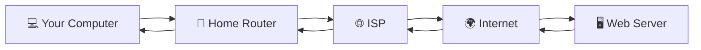

---

<!--
Image Description:
Create an educational infographic illustrating the journey of an IPv4 packet from a user's computer to a web server. Show a desktop computer connected to a home router, then an ISP, the Internet cloud, and finally a web server. Use arrows to illustrate the request traveling to the server and the response returning to the computer. Display Source IP and Destination IP labels on the packet.

Suggested Search Keywords:
IPv4 packet journey infographic
network packet flow diagram
computer to server communication
Internet packet routing illustration

Suggested Filename:
Images/ipv4_packet_journey.png
-->

<p align="center">

</p>

---

## 🔹 Source IP vs Destination IP

Every packet travelling across a network contains two essential addresses.

| Field | Purpose | Example |
|-------|---------|---------|
| **Source IP Address** | Identifies the sender of the packet. | `192.168.1.10` |
| **Destination IP Address** | Identifies the intended receiver. | `93.184.216.34` |

Think of these addresses like a shipping label.

- The **Source IP** tells the receiver where the packet came from.
- The **Destination IP** tells routers where the packet needs to go.

Routers examine the **Destination IP Address** to decide the best path for forwarding each packet toward its destination.

---

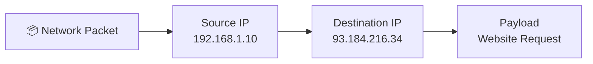

---

## 🔹 The Role of Routers

A router acts like a traffic controller for network packets.

Instead of reading the contents of a packet, the router focuses primarily on the **Destination IP Address**. It compares this address with its routing table to determine the best path toward the destination network.

This process happens at every router the packet encounters until it finally reaches its destination.

Without routers, communication between different networks—including the Internet—would not be possible.

---

<!--
Image Description:
Create an educational illustration showing a router examining the destination IP address of an incoming packet and forwarding it toward the correct network. Include multiple outgoing network paths to demonstrate routing decisions.

Suggested Search Keywords:
router forwarding packet infographic
routing decision illustration
network router packet forwarding
IPv4 routing diagram

Suggested Filename:
Images/router_packet_forwarding.png
-->

<p align="center">

</p>

---

## 🌍 Real-World Example

Suppose your laptop has the IPv4 address:

```
192.168.1.25
```

You visit:

```
https://example.com
```

The web server may have the IPv4 address:

```
93.184.216.34
```

Your request travels through several routers until it reaches the server.

When the server responds, it simply swaps the addresses:

| Request | Response |
|---------|----------|
| Source → `192.168.1.25` | Source → `93.184.216.34` |
| Destination → `93.184.216.34` | Destination → `192.168.1.25` |

This exchange allows two-way communication between devices, making web browsing, email, video streaming, and online gaming possible.

---

> 💡 **Point to Remember**
>
> Every IPv4 packet contains a **Source IP Address** and a **Destination IP Address**. Routers use the **Destination IP Address** to determine the best path for delivering packets across networks.

---

> 🤓 **Did You Know?**
>
> When you load a modern website, your browser doesn't send just one packet—it often exchanges **hundreds or even thousands of packets** with the server. Each packet contains source and destination IP addresses, allowing routers around the world to deliver them accurately in fractions of a second.

---

# 🧩 Network ID and Host ID

An IPv4 address does more than simply identify a device.

It also tells the network **where the device is located**.

To accomplish this, every IPv4 address is divided into **two logical parts**:

- **Network ID** – Identifies the network to which the device belongs.
- **Host ID** – Identifies the specific device within that network.

This separation allows routers to deliver packets to the correct network first, and then to the correct device within that network.

---

## 🔹 Understanding the Concept

Think of an IPv4 address as being similar to a postal address.

Consider the following address:

```
221B Baker Street,
London,
United Kingdom
```

Here:

- **United Kingdom** identifies the country.
- **London** identifies the city.
- **Baker Street** identifies the street.
- **221B** identifies the exact house.

A postal worker first delivers the package to the correct country, then the correct city, then the correct street, and finally the correct house.

IPv4 addressing follows a similar approach.

Routers first locate the **correct network**, and once the packet reaches that network, the destination device is identified using the **Host ID**.

---

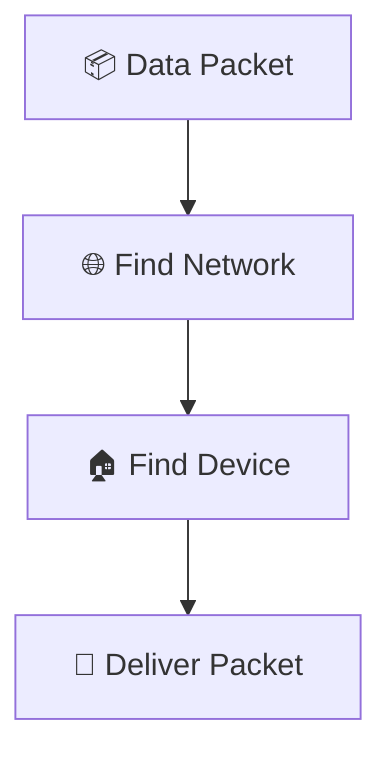

---

<!--
Image Description:
Create an educational comparison between a postal address and an IPv4 address. On the left, show a mailing address divided into Country, City, Street, and House Number. On the right, show an IPv4 address divided into Network ID and Host ID. Use arrows to demonstrate that both systems locate a destination step by step.

Suggested Search Keywords:
postal address vs IP address infographic
network id host id analogy
IPv4 addressing educational illustration
networking address comparison

Suggested Filename:
Images/network_id_host_id_analogy.png
-->

<p align="center">

</p>

---

## 🔹 Example IPv4 Address

Consider the following IPv4 address:

```
192.168.1.25
```

Assume the subnet mask is:

```
255.255.255.0
```

In this example:

| Portion | Value |
|----------|-------|
| Network ID | **192.168.1** |
| Host ID | **25** |

This means:

- Every device whose address begins with **192.168.1** belongs to the same network.
- The final number (**25**) uniquely identifies one specific device within that network.

For example:

| Device | IPv4 Address |
|---------|--------------|
| Router | `192.168.1.1` |
| Laptop | `192.168.1.25` |
| Printer | `192.168.1.50` |
| Smartphone | `192.168.1.75` |

Notice that every device shares the same **Network ID**, while each has a different **Host ID**.

---

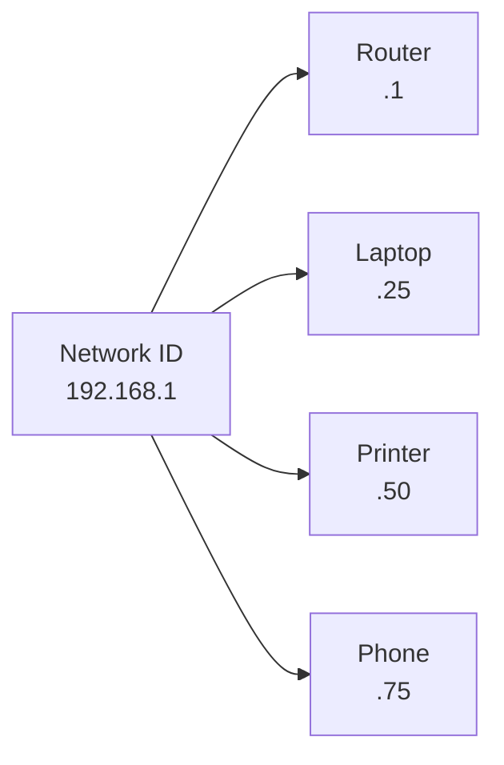

---

## 🔹 Why Is This Separation Important?

Imagine if routers had to memorize the location of every device connected to the Internet.

Considering there are billions of devices online, this would be impossible.

Instead, routers simplify their work by forwarding packets based primarily on the **Network ID**.

Once the packet arrives at the correct network, the destination device is located using the **Host ID**.

This hierarchical approach makes modern networking:

- ⚡ Faster
- 📈 More scalable
- 🌍 Capable of supporting billions of connected devices

Without separating an IPv4 address into a **Network ID** and a **Host ID**, the Internet could not efficiently route traffic between networks.

---

## 🔹 How Is the Boundary Determined?

You might be wondering:

> **How does a computer know where the Network ID ends and the Host ID begins?**

The answer is:

**It uses a Subnet Mask.**

A subnet mask defines which bits belong to the **Network ID** and which bits belong to the **Host ID**.

For now, simply remember that:

- The **Network ID** identifies the network.
- The **Host ID** identifies the device.

You'll learn exactly how subnet masks work later in this module when we study **CIDR notation** and **Subnetting**.

---

<!--
Image Description:
Create an educational infographic showing an IPv4 address (192.168.1.25) divided into Network ID and Host ID using color coding. Display the subnet mask (255.255.255.0) beneath it and visually indicate that the subnet mask determines the boundary between the network and host portions.

Suggested Search Keywords:
network id host id subnet mask infographic
IPv4 network host portion diagram
subnet mask educational illustration
IPv4 address breakdown

Suggested Filename:
Images/network_host_breakdown.png
-->

<p align="center">

</p>

---

> 💡 **Point to Remember**
>
> Every IPv4 address consists of a **Network ID** and a **Host ID**. Routers use the **Network ID** to forward packets to the correct network, while the **Host ID** identifies the specific device within that network.

---

> 🤓 **Did You Know?**
>
> The terms **Network ID** and **Host ID** are logical concepts rather than fixed positions within an IPv4 address. Their exact boundary depends on the **subnet mask** being used. This flexibility allows networks to be designed in many different sizes, from small home networks to large enterprise environments.

---

# ⚠️ Limitations of IPv4

When IPv4 was introduced in **1981**, the Internet was very different from what it is today.

At that time, the Internet was used mainly by universities, government organizations, and research institutions. Very few people owned personal computers, and devices such as smartphones, tablets, smart TVs, and Internet of Things (IoT) devices did not yet exist.

The designers of IPv4 believed that its address space would be large enough for the foreseeable future.

However, the explosive growth of the Internet proved otherwise.

Today, billions of devices require unique IP addresses, placing enormous pressure on the IPv4 addressing system.

---

## 🔹 Limited Address Space

An IPv4 address is **32 bits** long.

A 32-bit address can generate:

```
2³² = 4,294,967,296
```

possible addresses.

Although this may seem like an enormous number, it is no longer sufficient for today's Internet.

Why?

Because the world now has:

- 🌍 Billions of smartphones
- 💻 Billions of computers
- 📺 Smart TVs
- 🎮 Gaming consoles
- ⌚ Smart watches
- 🚗 Connected vehicles
- 🏭 Industrial devices
- 📡 Internet of Things (IoT) devices

Many people own **multiple Internet-connected devices**, dramatically increasing the demand for IP addresses.

---

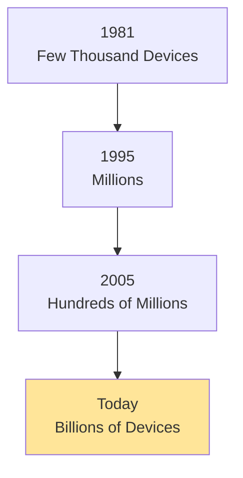

---

<!--
Image Description:
Create a timeline infographic showing the growth of Internet-connected devices from 1981 to today. Include desktop computers in the early years and gradually add laptops, smartphones, tablets, IoT devices, smart homes, vehicles, and cloud servers to illustrate why IPv4 addresses became insufficient.

Suggested Search Keywords:
internet growth timeline infographic
IPv4 address exhaustion illustration
growth of connected devices
IoT devices networking timeline

Suggested Filename:
Images/ipv4_address_growth.png
-->

<p align="center">

</p>

---

## 🔹 IPv4 Address Exhaustion

Eventually, organizations responsible for managing Internet addresses began to run out of available IPv4 addresses.

This situation is known as **IPv4 address exhaustion**.

It does **not** mean that the Internet stopped working.

Instead, it means that there were no longer enough **new public IPv4 addresses** to assign freely to every new organization or Internet service provider.

To continue supporting Internet growth, engineers developed techniques such as:

- **Network Address Translation (NAT)**, which allows multiple devices to share a single public IPv4 address.
- **IPv6**, a newer version of the Internet Protocol with a vastly larger address space.

These technologies have helped extend the life of IPv4 while preparing the Internet for future growth.

---

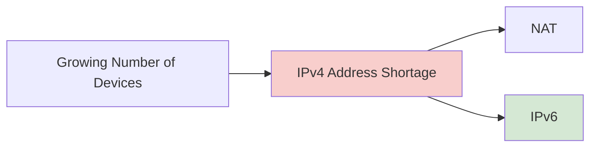

---

## 🔹 Other Limitations of IPv4

Besides the limited number of addresses, IPv4 has several other limitations.

### 🌍 Limited Scalability

IPv4 was not designed for today's massive global Internet.

Modern networks require far more flexibility than IPv4 originally provided.

---

### 🔒 Security Was Not Built In

IPv4 does not include built-in security features.

Although technologies such as **IPsec** can be added, they are optional rather than mandatory.

As a result, many security mechanisms are implemented through additional protocols and devices such as firewalls and VPNs.

---

### ⚙️ Heavy Reliance on NAT

Because public IPv4 addresses are scarce, many home and business networks use **Network Address Translation (NAT)**.

NAT allows dozens or even hundreds of devices to share a single public IP address.

While NAT conserves addresses, it also increases network complexity and can complicate applications that require direct device-to-device communication.

---

<!--
Image Description:
Create an educational comparison showing one public IPv4 address being shared by multiple devices through a home router using NAT. Include a desktop computer, laptop, smartphone, tablet, and smart TV all communicating with the Internet through a single public IP address.

Suggested Search Keywords:
NAT home network infographic
multiple devices one public IP
network address translation diagram
IPv4 NAT illustration

Suggested Filename:
Images/ipv4_nat_overview.png
-->

<p align="center">

</p>

---

## 🌍 Looking Ahead

Although IPv4 remains the most widely used Internet Protocol today, it cannot meet the long-term demands of an ever-growing Internet on its own.

To solve these challenges, the Internet Engineering Task Force (IETF) developed **IPv6**, which provides a vastly larger address space along with several architectural improvements.

In the next lesson, you'll explore how IPv6 works, why it was created, and how it addresses many of IPv4's limitations.

---

> 💡 **Point to Remember**
>
> IPv4 revolutionized computer networking, but its **32-bit address space** provides a limited number of unique addresses. Technologies such as **NAT** and **IPv6** were developed to overcome these limitations and support the continued growth of the Internet.

---

> 🤓 **Did You Know?**
>
> If every person on Earth owned multiple Internet-connected devices—as many already do—the original IPv4 address space would be far too small to assign a unique public address to each device. This rapid growth was one of the main reasons IPv6 was developed.

---

# 💻 Mini Lab — Discover Your IPv4 Address

Theory is important, but networking becomes much easier when you apply what you've learned to your own computer.

In this mini lab, you'll locate your computer's IPv4 address and identify some of the networking information that your operating system uses to communicate with other devices.

Don't worry if some of the information looks unfamiliar—we'll study many of these topics in later lessons.

---

## 🎯 Lab Objectives

By completing this lab, you will learn how to:

- ✅ Find your computer's IPv4 address.
- ✅ Identify your subnet mask.
- ✅ Locate your default gateway.
- ✅ Recognize whether your computer is connected to a network.

---

## 🖥️ Windows Instructions

Open **Command Prompt** by pressing:

```
Windows + R
```

Type:

```
cmd
```

Press **Enter**.

Now run the following command:

```powershell
ipconfig
```

You should see output similar to this:

```text
Ethernet adapter Ethernet:

   IPv4 Address. . . . . . . . . . : 192.168.1.25
   Subnet Mask . . . . . . . . . . : 255.255.255.0
   Default Gateway . . . . . . . . : 192.168.1.1
```

---

## 🐧 Linux Instructions

Open a terminal and execute:

```bash
ip addr
```

or

```bash
hostname -I
```

Example output:

```text
inet 192.168.1.25/24
```

---

## 🍎 macOS Instructions

Open **Terminal** and run:

```bash
ifconfig
```

or

```bash
ipconfig getifaddr en0
```

Depending on your Mac model and network connection, your interface name may be different (such as `en1`).

---

<!--
Image Description:
Create an educational screenshot-style illustration showing the Windows Command Prompt running the ipconfig command. Highlight the IPv4 Address, Subnet Mask, and Default Gateway fields using colored boxes and labels. The design should resemble a real terminal while remaining clean and easy to read.

Suggested Search Keywords:
ipconfig command example
Windows ipconfig output
IPv4 command prompt networking
network configuration terminal

Suggested Filename:
Images/ipconfig_example.png
-->

<p align="center">

</p>

---

## 🔍 Understanding the Output

After running the command, you'll notice several pieces of networking information.

| Field | Description |
|--------|-------------|
| **IPv4 Address** | The logical address assigned to your device on the network. |
| **Subnet Mask** | Defines which portion of the IP address represents the network and which represents the host. |
| **Default Gateway** | Usually your router. It forwards traffic to other networks and the Internet. |

Don't worry if you don't fully understand the **Subnet Mask** or **Default Gateway** yet—we'll explore these concepts in detail later in this module.

---

## 📝 Lab Tasks

Complete the following exercises using your own computer.

### Task 1

Write down your IPv4 address.

```
IPv4 Address:

________________________
```

---

### Task 2

Write down your subnet mask.

```
Subnet Mask:

________________________
```

---

### Task 3

Write down your default gateway.

```
Default Gateway:

________________________
```

---

### Task 4

Count the number of octets in your IPv4 address.

Answer:

```
__________
```

---

### Task 5

What is the decimal value of each octet?

Example:

```
192.168.1.25

↓

192
168
1
25
```

---

## 🎯 Challenge

If you have another device available (such as a smartphone, tablet, or another computer), compare its IPv4 address with your computer's.

Ask yourself:

- Are both devices on the same network?
- Do they share the same first three octets?
- Do they have different Host IDs?

You don't need to calculate anything yet—just observe the addresses and look for patterns.

---

> 💡 **Lab Tip**
>
> If you're connected to your home Wi-Fi, you'll often notice that multiple devices have similar IPv4 addresses, such as `192.168.1.x` or `192.168.0.x`. This usually indicates that they belong to the same local network.

---

# 🧠 Quick Check

Before moving on, take a moment to review the key concepts from this lesson.

Try to answer these questions **without looking back** at the chapter. If you can answer them confidently, you've built a solid understanding of IPv4 fundamentals.

---

## Question 1

**What does IPv4 stand for?**

<details>
<summary><strong>✅ Show Answer</strong></summary>

IPv4 stands for **Internet Protocol Version 4**.

It is the most widely used network-layer protocol for identifying devices and enabling communication across IP networks.

</details>

---

## Question 2

**How many bits are contained in an IPv4 address?**

<details>
<summary><strong>✅ Show Answer</strong></summary>

An IPv4 address contains **32 bits**.

These 32 bits are divided into **four 8-bit octets**.

</details>

---

## Question 3

**What is an octet?**

<details>
<summary><strong>✅ Show Answer</strong></summary>

An **octet** is a group of **8 bits**.

Every IPv4 address contains **four octets**.

</details>

---

## Question 4

**Why can each IPv4 octet only have a value between 0 and 255?**

<details>
<summary><strong>✅ Show Answer</strong></summary>

Each octet contains **8 bits**.

An 8-bit binary number can represent **256 unique values**, ranging from **0** to **255**.

</details>

---

## Question 5

**What are the two logical parts of an IPv4 address?**

<details>
<summary><strong>✅ Show Answer</strong></summary>

An IPv4 address consists of:

- **Network ID**
- **Host ID**

The **Network ID** identifies the network, while the **Host ID** identifies the specific device on that network.

</details>

---

## Question 6

**What information does a router primarily examine to decide where to forward a packet?**

<details>
<summary><strong>✅ Show Answer</strong></summary>

A router primarily examines the **Destination IP Address**.

Using this address and its routing table, it determines the best path to the destination network.

</details>

---

## Question 7

**Name one limitation of IPv4.**

<details>
<summary><strong>✅ Show Answer</strong></summary>

Possible answers include:

- Limited **32-bit address space**
- IPv4 address exhaustion
- Heavy reliance on **Network Address Translation (NAT)**
- No built-in mandatory security features

</details>

---

## 🎯 Quick Self-Assessment

How confident do you feel after completing this lesson?

| Confidence Level | Description |
|------------------|-------------|
| 🟢 **Confident** | I can explain IPv4 and its structure without referring to my notes. |
| 🟡 **Getting There** | I understand most concepts but need a little more practice. |
| 🔴 **Needs Review** | I should revisit the lesson before moving on. |

If you selected **🟡** or **🔴**, consider reviewing the sections on **IPv4 structure**, **binary representation**, and **Network ID vs. Host ID** before continuing.

---

> 💡 **Learning Tip**
>
> Don't worry if you couldn't answer every question correctly on your first attempt. Networking concepts become much easier with repetition and hands-on practice. Reviewing the lesson now will make future topics like **Subnetting** and **CIDR** much easier to understand.

---

# 📖 Knowledge Check

You've reached the end of the lesson! Now it's time to test your understanding of IPv4.

Unlike the **Quick Check**, these questions require you to **apply** the concepts you've learned. Take your time, think through each question, and avoid looking at the answers until you've completed all of them.

---

## 📝 Question 1

Which statement best describes an IPv4 address?

A. A physical address permanently assigned to a network card.

B. A logical address used to identify a device on a network.

C. A password used to connect to the Internet.

D. A unique serial number for a computer.

<details>
<summary><strong>✅ Show Answer</strong></summary>

**Correct Answer: B**

An IPv4 address is a **logical address** that identifies a device on a network and enables communication with other devices.

</details>

---

## 📝 Question 2

How many bits are contained in an IPv4 address?

A. 8

B. 16

C. 32

D. 64

<details>
<summary><strong>✅ Show Answer</strong></summary>

**Correct Answer: C**

Every IPv4 address contains exactly **32 bits**, divided into four 8-bit octets.

</details>

---

## 📝 Question 3

How many octets are contained in an IPv4 address?

A. 2

B. 4

C. 6

D. 8

<details>
<summary><strong>✅ Show Answer</strong></summary>

**Correct Answer: B**

An IPv4 address contains **four octets**, with each octet consisting of **8 bits**.

</details>

---

## 📝 Question 4

Which of the following is **NOT** a valid IPv4 address?

A. `192.168.1.1`

B. `10.0.0.254`

C. `172.16.300.5`

D. `8.8.8.8`

<details>
<summary><strong>✅ Show Answer</strong></summary>

**Correct Answer: C**

The value **300** exceeds the maximum value of an IPv4 octet, which is **255**.

</details>

---

## 📝 Question 5

Why is the address `256.1.1.1` invalid?

<details>
<summary><strong>✅ Show Answer</strong></summary>

Each octet contains **8 bits**, allowing decimal values only between **0 and 255**.

Since **256** cannot be represented using 8 bits, the address is invalid.

</details>

---

## 📝 Question 6

Match the networking term with its description.

| Term | Description |
|------|-------------|
| A. Network ID | 1. Identifies a specific device |
| B. Host ID | 2. Identifies the network |

<details>
<summary><strong>✅ Show Answer</strong></summary>

- **A → 2**
- **B → 1**

</details>

---

## 📝 Question 7

When a router receives a packet, which address does it primarily examine?

A. Source IP Address

B. Destination IP Address

C. MAC Address

D. Computer Name

<details>
<summary><strong>✅ Show Answer</strong></summary>

**Correct Answer: B**

Routers primarily examine the **Destination IP Address** to determine the best path toward the destination network.

</details>

---

## 📝 Question 8

Your laptop has the address:

```
192.168.1.25
```

Another computer has:

```
192.168.1.75
```

What can you conclude?

A. They are likely on the same local network.

B. They are on different continents.

C. One address is invalid.

D. They must be connected by Wi-Fi.

<details>
<summary><strong>✅ Show Answer</strong></summary>

**Correct Answer: A**

Both addresses share the same network portion (`192.168.1`), suggesting they belong to the same local network.

</details>

---

## 📝 Question 9

Explain the difference between a **Network ID** and a **Host ID** in your own words.

<details>
<summary><strong>✅ Sample Answer</strong></summary>

The **Network ID** identifies the network where a device is located, while the **Host ID** identifies the individual device within that network.

</details>

---

## 📝 Question 10

Why was IPv6 developed?

<details>
<summary><strong>✅ Sample Answer</strong></summary>

IPv6 was developed because the **32-bit address space of IPv4 is limited**. As the number of Internet-connected devices grew rapidly, IPv4 addresses became scarce. IPv6 provides a vastly larger address space to support the continued growth of the Internet.

</details>

---

## 📊 Score Yourself

| Score | Understanding |
|--------|---------------|
| **9–10 Correct** | 🌟 Excellent! You have a strong understanding of IPv4 fundamentals. |
| **7–8 Correct** | ✅ Good work! Review a few topics before continuing. |
| **5–6 Correct** | 📖 Fair understanding. Revisit the lesson and Mini Lab for reinforcement. |
| **Below 5** | 🔄 Review the chapter carefully before moving to IPv6. Building a solid foundation now will make later topics much easier. |

---

> 💡 **Exam Tip**
>
> Certification exams such as **CompTIA Network+**, **Security+**, and **CCNA** often test your understanding of IPv4 concepts through practical scenarios rather than simple definitions. Focus on understanding **why** IPv4 works the way it does—not just memorizing facts.

---

# 🚀 Challenge Questions

You've learned the theory behind IPv4. Now it's time to think like a network engineer.

These scenarios are designed to test your understanding by placing you in real-world networking situations. Don't worry if you can't answer every question immediately—the goal is to develop your problem-solving skills.

---

## 🌍 Challenge 1 — Identifying an Invalid Address

A network administrator gives you the following IPv4 addresses:

```
192.168.1.15
192.168.1.200
192.168.1.256
192.168.1.50
```

### ❓ Question

Which IPv4 address is invalid?

**Think Before You Answer**

<details>

<summary><strong>✅ Show Answer</strong></summary>

```
192.168.1.256
```

is invalid because each octet can only have values between **0 and 255**.

</details>

---

## 🏠 Challenge 2 — Same Network or Different Network?

Consider these two devices:

```
Laptop

192.168.1.25
```

```
Printer

192.168.1.60
```

Both devices use the subnet mask:

```
255.255.255.0
```

### ❓ Questions

- Are these devices likely on the same network?
- Can they communicate directly without a router?

<details>

<summary><strong>✅ Show Answer</strong></summary>

Yes.

Both devices share the same Network ID:

```
192.168.1
```

Because they belong to the same local network, they can usually communicate directly without traffic being routed to another network.

</details>

---

## 🌐 Challenge 3 — Follow the Packet

Imagine you open your browser and visit:

```
https://example.com
```

Arrange the following devices in the correct order that your request travels through.

- ISP
- Home Router
- Web Server
- Your Computer
- Internet

✍️ Write the correct sequence.

<details>

<summary><strong>✅ Show Answer</strong></summary>

```
Your Computer

↓

Home Router

↓

ISP

↓

Internet

↓

Web Server
```

The server then sends the response back along the reverse path.

</details>

---

## 📦 Challenge 4 — Identify the Source and Destination

A packet contains the following information:

| Field | Value |
|--------|-------|
| Source IP | 192.168.1.20 |
| Destination IP | 8.8.8.8 |

### ❓ Questions

- Which device sent the packet?
- Which device should receive the packet?
- Which address will routers use to forward the packet?

<details>

<summary><strong>✅ Show Answer</strong></summary>

- Sender → **192.168.1.20**
- Receiver → **8.8.8.8**
- Routers primarily examine the **Destination IP Address** to determine where to forward the packet.

</details>

---

## 🏢 Challenge 5 — Office Network

An office has the following devices:

| Device | IPv4 Address |
|---------|--------------|
| Router | 192.168.10.1 |
| PC-1 | 192.168.10.15 |
| PC-2 | 192.168.10.40 |
| Printer | 192.168.10.80 |

### ❓ Questions

1. Which device is most likely acting as the **Default Gateway**?
2. Which part of these addresses is the **Network ID**?
3. What makes each device unique?

<details>

<summary><strong>✅ Show Answer</strong></summary>

1. **192.168.10.1** (the router) is most likely the Default Gateway.
2. The shared Network ID is **192.168.10** (assuming a subnet mask of `255.255.255.0`).
3. The **Host ID** (the last octet) uniquely identifies each device.

</details>

---

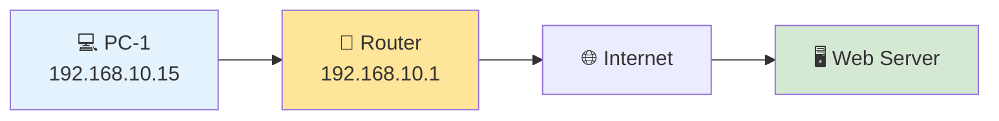

---

<!--
Image Description:
Create a realistic office network diagram showing multiple devices connected to a router. Include a desktop computer, laptop, printer, and a connection to the Internet. Label each device with its IPv4 address and highlight the router as the Default Gateway. Use arrows to show data flowing from a PC to a web server on the Internet.

Suggested Search Keywords:
office network IPv4 diagram
router default gateway illustration
LAN to Internet topology
computer networking office infographic

Suggested Filename:
Images/office_ipv4_network.png
-->

<p align="center">

</p>

---

## 🎯 Final Challenge

Without referring to the lesson, explain the following concepts in your own words:

- What is an IPv4 address?
- Why does every device need one?
- Why are IPv4 addresses written in dotted decimal notation?
- What is the difference between a Network ID and a Host ID?
- Why can't an IPv4 octet be greater than **255**?
- Why was IPv6 developed?

If you can confidently explain these concepts to another person, you've developed a strong understanding of IPv4 fundamentals.

---

> 🏆 **Challenge Complete!**
>
> If you successfully worked through these scenarios, you've moved beyond memorizing definitions and started thinking like a networking professional. That's an important milestone, because real-world networking is about understanding how concepts work together—not just recalling facts.

---
# 📝 Chapter Summary

Congratulations! 🎉

You've successfully completed the **IPv4** lesson, one of the most important topics in computer networking.

IPv4 is the addressing system that allows billions of devices to communicate across local networks and the Internet. Although users rarely see it working, every email you send, every website you visit, every online game you play, and every video you stream depends on IPv4 (or its successor, IPv6) to deliver data to the correct destination.

Throughout this lesson, you've learned not only **what an IPv4 address is**, but also **how it works**, **how it is structured**, and **why it became one of the most influential technologies in the history of the Internet**.

Understanding IPv4 provides the foundation for many advanced networking concepts that you'll encounter later in this roadmap, including subnetting, routing, DHCP, DNS, firewalls, VPNs, and network security.

---

# 🎯 What You Learned

By completing this lesson, you should now be able to:

- ✅ Define **Internet Protocol Version 4 (IPv4)**.
- ✅ Explain why every networked device requires an IP address.
- ✅ Describe the structure of a **32-bit IPv4 address**.
- ✅ Understand **dotted decimal notation**.
- ✅ Explain why each octet ranges from **0 to 255**.
- ✅ Describe how packets use **Source** and **Destination IP addresses**.
- ✅ Understand the purpose of **Network IDs** and **Host IDs**.
- ✅ Explain the major limitations of IPv4.
- ✅ Understand why technologies such as **NAT** and **IPv6** were introduced.
- ✅ Locate your own IPv4 configuration using operating system networking tools.

---

# 📌 Key Concepts to Remember

Before moving to the next lesson, make sure you remember these essential concepts:

| Concept | Key Idea |
|----------|----------|
| 🌍 IPv4 | A logical addressing system used to identify devices on a network. |
| 🔢 Address Length | Every IPv4 address contains **32 bits**. |
| 🧩 Octets | IPv4 is divided into **4 octets**, each containing **8 bits**. |
| 📍 Range | Each octet has a decimal value between **0 and 255**. |
| 📦 Packet Communication | Every packet contains a **Source IP** and a **Destination IP**. |
| 🌐 Network ID | Identifies the network where a device belongs. |
| 💻 Host ID | Identifies the specific device on that network. |
| ⚠️ Limitation | IPv4 has a limited address space, which contributed to the development of IPv6. |

---

# 💡 Point to Remember

> **An IPv4 address is much more than a number—it is the unique logical identity that enables devices to communicate across networks. Every packet sent across the Internet depends on IP addressing to reach the correct destination.**

---

# 🤓 Did You Know?

Although IPv6 is gradually becoming more common, **IPv4 continues to carry a significant portion of Internet traffic worldwide**. Modern networks often operate in **dual-stack environments**, where IPv4 and IPv6 run side by side to maintain compatibility with existing systems while supporting the transition to the future of networking.

---

<!--
Image Description:
Create a professional summary infographic for the IPv4 lesson. Include the following concepts connected visually:
- IPv4 Address
- 32 Bits
- Four Octets
- Source & Destination IP
- Network ID
- Host ID
- Packet Delivery
- IPv4 Limitations
- IPv6 Transition

Use a clean educational design with networking icons and arrows showing how these concepts relate to one another.

Suggested Search Keywords:
IPv4 summary infographic
IPv4 networking overview
computer networking IPv4 concept map
IPv4 educational summary

Suggested Filename:
Images/ipv4_summary.png
-->

<p align="center">

</p>

---

# 🏁 Lesson Complete!

You have now completed one of the most important lessons in the **IP Addressing** module.

Take a moment to review any sections that you found challenging before moving forward. A strong understanding of IPv4 will make the upcoming lessons on **IPv6**, **Public vs. Private IP Addresses**, and **Subnetting** much easier to understand.

Every networking professional—from help desk technicians to cybersecurity analysts and network engineers—uses IPv4 knowledge daily. Mastering these fundamentals is a major step toward building a successful career in networking and cybersecurity.

---

# 🧭 Module Progress

Congratulations! 🎉

You've successfully completed the **second lesson** of the **IP Addressing** module.

So far, you've built a strong foundation by understanding how computers represent information using binary and how IPv4 addresses uniquely identify devices on a network.

As you continue through this module, you'll explore more advanced addressing concepts, eventually learning how networks are designed, segmented, and managed in real-world environments.

---

## 📚 Your Learning Journey

```text
IP Addressing Module

✅ Binary Basics
✅ IPv4
⬜ IPv6
⬜ Public vs Private IP Addresses
⬜ Static vs Dynamic IP Addresses
⬜ APIPA
⬜ Loopback Address
⬜ CIDR Notation
⬜ Default Gateway
⬜ Subnetting
⬜ VLSM
⬜ Supernetting
```

---

## 🗺️ Roadmap

```mermaid
flowchart LR

A["✅ Binary Basics"]

--> B["✅ IPv4"]

--> C["🚀 IPv6"]

--> D["🌍 Public vs Private IP"]

--> E["⚙️ Static vs Dynamic IP"]

--> F["🆘 APIPA"]

--> G["🔄 Loopback Address"]

--> H["📏 CIDR Notation"]

--> I["🚪 Default Gateway"]

--> J["🧩 Subnetting"]

--> K["🏢 VLSM"]

--> L["🌐 Supernetting"]

style A fill:#D5E8D4
style B fill:#D5E8D4
style C fill:#FFF2CC
```

---

## 🎯 Progress Overview

| Module | Status |
|---------|:------:|
| Binary Basics | ✅ Complete |
| IPv4 | ✅ Complete |
| Remaining Lessons | ⏳ 10 |

---

## 🚀 Coming Up Next

The next lesson introduces **IPv6 (Internet Protocol Version 6)**, the modern addressing protocol designed to overcome the limitations of IPv4.

In the next lesson, you'll learn:

- 🌍 Why IPv6 was developed.
- 🔢 The structure of a **128-bit IPv6 address**.
- 📝 Understanding hexadecimal notation.
- 📦 IPv6 address compression rules.
- 🌐 Different types of IPv6 addresses.
- ⚡ Advantages of IPv6 over IPv4.
- 🔒 Security and scalability improvements.

By the end of the next lesson, you'll understand why IPv6 is essential for the future growth of the Internet.

---

<!--
Image Description:
Create a learning roadmap for the IP Addressing module. Highlight Binary Basics and IPv4 as completed lessons. Highlight IPv6 as the current next lesson. Show the remaining lessons (Public vs Private IP Addresses, Static vs Dynamic IP Addresses, APIPA, Loopback Address, CIDR Notation, Default Gateway, Subnetting, VLSM, and Supernetting) as upcoming milestones. Use arrows to illustrate progression through the module with a clean educational design.

Suggested Search Keywords:
IP addressing learning roadmap
IPv6 next lesson infographic
computer networking curriculum
networking learning path
IPv4 to IPv6 transition

Suggested Filename:
Images/ip_addressing_module_progress.png
-->

<p align="center">

</p>

---

# 📖 Continue Your Learning

## **➡️ Next Lesson: [🌐 03 – IPv6](03-IPv6.md)**

IPv4 has powered the Internet for decades, but its limited address space led to the development of a new generation of Internet Protocol.

In the next lesson, you'll discover how **IPv6** solves the address exhaustion problem, supports an almost unlimited number of connected devices, and provides the foundation for the future of global networking.

> **Next Stop:** 🌐 **IPv6 — The Next Generation of Internet Addressing**

---


