# 🌐 IPv6 (Internet Protocol Version 6)

> *IPv6 (Internet Protocol Version 6) is the next generation of the Internet Protocol, designed to overcome the limitations of IPv4 by providing an enormous address space, improved efficiency, and better support for the ever-growing number of devices connected to the Internet.*

---

<div align="center">

# 🌐 IPv6 (Internet Protocol Version 6)

### Powering the Future of Internet Communication


</div>

---

<div align="center">


<br>


</div>

---

# 📖 Introduction

The Internet has grown far beyond what its original designers imagined.

When **IPv4** was introduced in 1981, a 32-bit addressing system capable of supporting approximately **4.3 billion unique addresses** seemed more than sufficient. At the time, the Internet connected only a relatively small number of computers used primarily by universities, research organizations, and government agencies.

Today, the situation is dramatically different.

Modern networks connect **billions of smartphones, laptops, tablets, smart TVs, cloud servers, industrial systems, vehicles, and Internet of Things (IoT) devices**. As the number of connected devices increased, the available pool of IPv4 addresses became exhausted, making it clear that a new addressing system was needed.

To address this challenge, the **Internet Engineering Task Force (IETF)** developed **Internet Protocol Version 6 (IPv6)**.

IPv6 expands the address size from **32 bits to 128 bits**, providing an almost unimaginable number of unique addresses while introducing improvements in routing efficiency, scalability, and network design. Rather than simply replacing IPv4, IPv6 was designed to support the future growth of the Internet for decades to come.

Although IPv4 remains widely deployed, IPv6 adoption continues to increase across Internet service providers, cloud platforms, enterprise networks, and mobile networks. Understanding IPv6 is therefore an essential skill for network engineers, system administrators, and cybersecurity professionals.

In this lesson, you'll learn how IPv6 addresses are structured, how hexadecimal notation is used, how IPv6 addresses are compressed, the different types of IPv6 addresses, and how IPv6 compares with IPv4.

---

<!--
Image Description:
Create a modern educational banner illustrating the transition from IPv4 to IPv6. Show a globe connected to cloud servers, smartphones, laptops, IoT devices, data centers, and satellites. Include a visual comparison between a small IPv4 address space and the massive IPv6 address space, emphasizing scalability and the future of Internet communication. Use a professional blue and purple networking theme.

Suggested Search Keywords:
IPv6 networking infographic
IPv4 to IPv6 transition
future Internet illustration
IPv6 educational banner
Internet Protocol Version 6

Suggested Filename:
Images/ipv6_banner.png
-->

<p align="center">

</p>

---

# 🎯 Learning Objectives

By the end of this lesson, you will be able to:

- ✅ Explain what IPv6 is and why it was developed.
- ✅ Describe the structure of a 128-bit IPv6 address.
- ✅ Read and interpret IPv6 addresses written in hexadecimal notation.
- ✅ Apply IPv6 address compression rules correctly.
- ✅ Identify the major types of IPv6 addresses.
- ✅ Compare IPv4 and IPv6.
- ✅ Recognize IPv6 addresses on real systems.
- ✅ Understand why IPv6 is critical for the future of networking and cybersecurity.

---

# 📚 Table of Contents

- 📖 What Is IPv6?
- 🚀 Why Was IPv6 Developed?
- 🏗️ Structure of an IPv6 Address
- 🔢 Understanding Hexadecimal Numbers
- ✂️ IPv6 Address Compression
- 🌍 Types of IPv6 Addresses
- ⚖️ IPv4 vs IPv6
- 🌎 IPv6 in the Real World
- 💻 Mini Lab
- 🧠 Quick Check
- 📖 Knowledge Check
- 🚀 Challenge Questions
- 📝 Chapter Summary
- 🧭 Module Progress
- 📖 Continue Your Learning

---

# 📖 What Is IPv6?

In the previous lesson, you learned that **IPv4** is the addressing system that allows devices to communicate across networks by assigning each device a unique logical address.

For decades, IPv4 successfully powered the Internet. However, as billions of new devices connected to networks around the world, the limited number of available IPv4 addresses became a significant challenge.

To overcome this limitation, the **Internet Engineering Task Force (IETF)** developed **Internet Protocol Version 6 (IPv6)**.

IPv6 is the **successor to IPv4**. It is the latest version of the Internet Protocol and was specifically designed to support the continued growth of the Internet by providing a vastly larger address space, improved efficiency, and a more scalable network architecture.

Today, IPv4 and IPv6 often operate **side by side**, allowing networks to communicate with both older and newer devices during the global transition to IPv6.

---

## 🔹 Definition of IPv6

**IPv6 (Internet Protocol Version 6)** is a **network layer protocol** that provides logical addressing and routing for devices connected to IP networks.

Like IPv4, IPv6 enables data packets to travel from a source device to a destination device across local networks and the Internet.

The key difference is that IPv6 uses **128-bit addresses**, allowing it to support an almost unlimited number of unique devices.

---

## 🌍 Why Do We Need IPv6?

Imagine a city that was originally designed for only a few thousand houses.

As the population grows into the millions, there is no longer enough space to build new homes. Roads become crowded, infrastructure becomes inefficient, and temporary solutions are required just to keep the city functioning.

This is similar to what happened with IPv4.

When IPv4 was designed in the early 1980s, the Internet connected only a relatively small number of computers. No one anticipated a future where nearly every person would own multiple Internet-connected devices, and where billions of additional devices—from smart watches and security cameras to industrial sensors and connected vehicles—would also require unique IP addresses.

IPv6 was developed to provide the Internet with an addressing system capable of supporting this enormous and continuously growing number of devices.

---


---

<!--
Image Description:
Create an educational infographic illustrating the evolution from IPv4 to IPv6. Show a timeline beginning with early computers using IPv4, followed by the rapid growth of smartphones, cloud computing, IoT devices, and smart cities. Conclude with IPv6 supporting billions of connected devices worldwide. Use a modern blue and purple networking theme.

Suggested Search Keywords:
IPv4 to IPv6 evolution infographic
Internet growth IPv6 illustration
future Internet networking
IPv6 adoption timeline

Suggested Filename:
Images/ipv6_evolution.png
-->

<p align="center">

</p>

---

## 🔹 IPv4 and IPv6 Work Together

A common misconception is that IPv6 has completely replaced IPv4.

In reality, both protocols are widely used today.

Many organizations operate **dual-stack networks**, where devices support both IPv4 and IPv6 simultaneously. This approach allows existing IPv4 infrastructure to continue functioning while gradually introducing IPv6.

Over time, IPv6 adoption continues to increase, but IPv4 remains an important part of today's Internet.

---

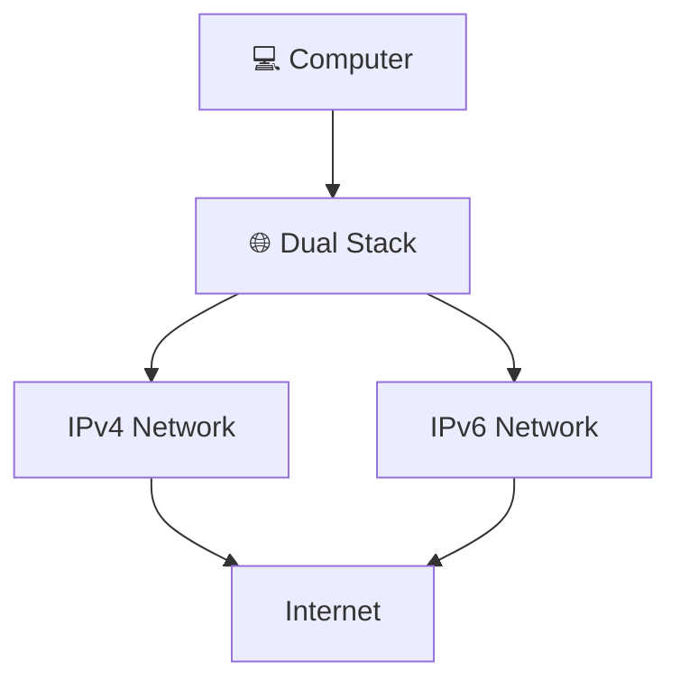

---

<!--
Image Description:
Create a dual-stack networking illustration showing a computer connected to both an IPv4 network and an IPv6 network simultaneously. Both networks connect to the Internet cloud, demonstrating how modern devices can communicate using either protocol.

Suggested Search Keywords:
dual stack IPv4 IPv6 diagram
IPv4 and IPv6 together
dual stack networking infographic
IPv6 transition illustration

Suggested Filename:
Images/dual_stack_network.png
-->

<p align="center">

</p>

---

## 🔹 Key Characteristics of IPv6

IPv6 introduces several improvements over IPv4.

Some of its most important characteristics include:

- 🌍 **128-bit addressing**, providing an enormous address space.
- 📈 Better scalability for future Internet growth.
- ⚡ More efficient packet processing through a simplified header.
- 🔒 Improved support for modern networking and security technologies.
- ☁️ Better support for cloud computing, mobile networks, and the Internet of Things (IoT).

You'll explore each of these features in detail throughout this lesson.

---

> 💡 **Point to Remember**
>
> **IPv6 (Internet Protocol Version 6)** is the modern version of the Internet Protocol. It was developed to overcome the limitations of IPv4 by providing a much larger address space and a more scalable foundation for the future of global networking.

---

> 🤓 **Did You Know?**
>
> IPv6 uses **128-bit addresses**, which provide approximately **340 undecillion** unique addresses (340 followed by 36 zeros). This is such a vast number that it is often described as enough to assign an enormous number of unique addresses to every device anyone could realistically need for the foreseeable future.

---

# 🚀 Why Was IPv6 Developed?

When **IPv4** was introduced in **1981**, the Internet looked very different from the one we use today.

At that time, the Internet was primarily used by universities, research institutions, government agencies, and a relatively small number of organizations. Personal computers were uncommon, mobile phones did not exist, and technologies such as cloud computing, smart homes, and the Internet of Things (IoT) were still decades away.

Because of this, the designers of IPv4 believed that its **32-bit addressing system** would provide more than enough addresses for the foreseeable future.

However, the Internet grew much faster than anyone expected.

Today, billions of devices rely on Internet connectivity, placing an enormous demand on IP addresses and exposing the limitations of IPv4.

---

## 🔹 The Rapid Growth of the Internet

Over the past few decades, the Internet has transformed from a small academic network into the world's largest communication platform.

Modern households often have multiple Internet-connected devices, including:

- 💻 Desktop Computers
- 💼 Laptops
- 📱 Smartphones
- 📺 Smart TVs
- 🎮 Gaming Consoles
- ⌚ Smart Watches
- 🏠 Smart Home Devices
- 🚗 Connected Vehicles
- ☁️ Cloud Servers
- 📡 IoT Sensors

Instead of one computer per household, it is now common for a single family to own **dozens of connected devices**.

As businesses, governments, and industries also expanded their networks, the demand for IP addresses increased dramatically.

---

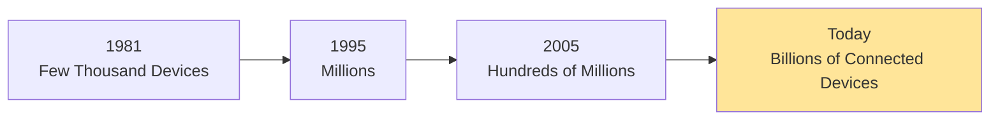

---

<!--
Image Description:
Create an educational timeline showing the growth of Internet-connected devices from 1981 to today. Begin with a few desktop computers and gradually add laptops, smartphones, tablets, cloud servers, smart homes, connected vehicles, industrial IoT devices, and satellites. Emphasize the explosive growth that increased demand for IP addresses.

Suggested Search Keywords:
internet growth timeline infographic
growth of connected devices
IPv4 exhaustion timeline
IoT evolution illustration

Suggested Filename:
Images/internet_growth_timeline.png
-->

<p align="center">

</p>

---

## 🔹 IPv4 Address Exhaustion

IPv4 uses **32-bit addresses**, which allows for approximately:

```
2³² = 4,294,967,296
```

unique addresses.

Although this number appears very large, it is not enough for a world with billions of people and billions of Internet-connected devices.

As available public IPv4 addresses were allocated over time, Internet registries eventually began to **run out of unused address blocks**.

This problem became known as **IPv4 address exhaustion**.

It is important to understand that address exhaustion **did not mean the Internet stopped working**.

Instead, it meant that obtaining new public IPv4 addresses became increasingly difficult, making long-term Internet growth unsustainable without a new addressing system.

---

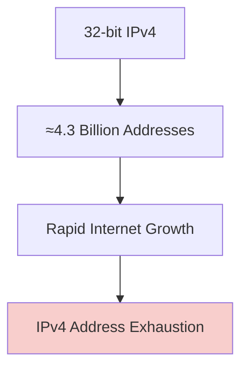

---

## 🔹 Temporary Solutions

Before IPv6 became widely available, engineers developed several techniques to delay IPv4 exhaustion.

One of the most important was **Network Address Translation (NAT)**.

NAT allows multiple devices on a private network to share a single public IPv4 address.

For example, in a typical home network, your laptop, smartphone, tablet, and smart TV may all access the Internet through the same public IP address provided by your Internet Service Provider (ISP).

While NAT has significantly extended the life of IPv4, it is considered a workaround rather than a permanent solution.

---

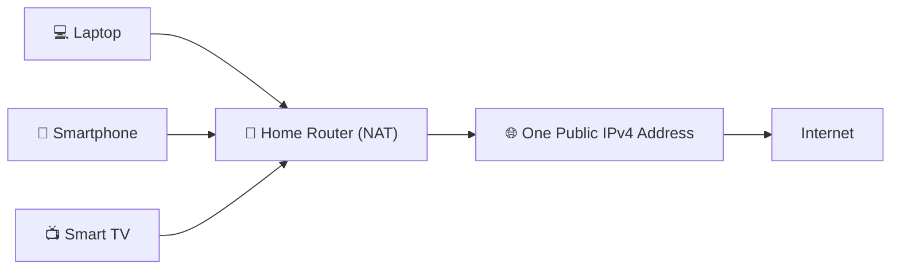

---

<!--
Image Description:
Create an educational infographic showing multiple home devices (laptop, smartphone, smart TV, gaming console) connecting to a home router that performs Network Address Translation (NAT). The router should use a single public IPv4 address to communicate with the Internet. Highlight NAT as a temporary solution to IPv4 address exhaustion.

Suggested Search Keywords:
NAT home network infographic
network address translation diagram
multiple devices one public IP
IPv4 NAT educational illustration

Suggested Filename:
Images/nat_ipv4_solution.png
-->

<p align="center">

</p>

---

## 🔹 The Birth of IPv6

Recognizing that IPv4 could not support the future growth of the Internet indefinitely, the **Internet Engineering Task Force (IETF)** developed **Internet Protocol Version 6 (IPv6)**.

Rather than making small improvements to IPv4, IPv6 introduced a completely new addressing system with several major enhancements.

Some of the most significant improvements include:

- 🌍 A **128-bit address space**, providing an enormous number of unique addresses.
- 📈 Improved scalability for future Internet growth.
- ⚡ More efficient routing through a simplified packet header.
- 🔒 Better support for modern networking and security technologies.
- ☁️ Native support for large-scale cloud computing and Internet of Things (IoT) deployments.

These improvements ensure that the Internet can continue growing for decades without facing the address limitations experienced by IPv4.

---

## 🌍 IPv6: A Long-Term Solution

Unlike IPv4, which was designed for a much smaller Internet, IPv6 was built with the future in mind.

Its vast address space allows every connected device—from smartphones and laptops to sensors, vehicles, appliances, and future technologies—to receive a unique IP address without relying heavily on workarounds like NAT.

As more Internet Service Providers, cloud platforms, enterprises, and governments adopt IPv6, it is becoming an increasingly important part of modern networking infrastructure.

---

> 💡 **Point to Remember**
>
> IPv6 was developed because the Internet outgrew the capabilities of IPv4. By expanding the address size from **32 bits to 128 bits**, IPv6 provides a long-term solution for the continued growth of global networks.

---

> 🤓 **Did You Know?**
>
> Although IPv6 was standardized in the late 1990s, the transition from IPv4 has taken many years because billions of existing devices, applications, and network infrastructures still depend on IPv4. As a result, many modern networks operate in **dual-stack mode**, supporting both IPv4 and IPv6 simultaneously during the transition.

---

# 🏗️ Structure of an IPv6 Address

One of the biggest differences between IPv4 and IPv6 is the way addresses are written.

An IPv4 address consists of **32 bits** and is written as **four decimal numbers** separated by periods (`.`).

For example:

```text
192.168.1.25
```

IPv6 uses a completely different format.

Instead of **32 bits**, every IPv6 address contains **128 bits** and is written using **eight groups of hexadecimal numbers** separated by colons (`:`).

For example:

```text
2001:0db8:85a3:0000:0000:8a2e:0370:7334
```

At first glance, an IPv6 address may appear much more complex than an IPv4 address. However, once you understand its structure, reading IPv6 addresses becomes much easier.

---

## 🔹 An IPv6 Address Is 128 Bits Long

Every IPv6 address contains exactly **128 bits**.

Rather than displaying all 128 bits as one long binary number, IPv6 divides them into **eight equal sections**.

Each section contains:

- **16 bits**
- **Four hexadecimal characters**

```
128 Bits

↓

16 + 16 + 16 + 16 + 16 + 16 + 16 + 16

↓

8 Groups
```

This makes IPv6 addresses much easier for humans to read while still allowing computers to process the underlying binary values.

---

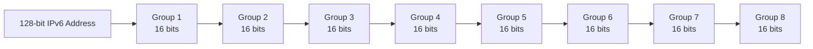

---

<!--
Image Description:
Create an educational infographic showing the structure of a 128-bit IPv6 address. Divide the address into eight equal groups, with each group labeled as 16 bits. Display arrows showing that 8 groups × 16 bits = 128 bits. Use a clean blue networking theme.

Suggested Search Keywords:
IPv6 address structure infographic
128 bit IPv6 diagram
IPv6 groups explained
IPv6 educational illustration

Suggested Filename:
Images/ipv6_address_structure.png
-->

<p align="center">

</p>

---

## 🔹 The Eight Groups

A full IPv6 address is written as **eight groups**, separated by colons (`:`).

Example:

```text
2001:0db8:85a3:0000:0000:8a2e:0370:7334
```

Let's break it into its individual groups.

| Group | Value |
|:------:|:------:|
| Group 1 | `2001` |
| Group 2 | `0db8` |
| Group 3 | `85a3` |
| Group 4 | `0000` |
| Group 5 | `0000` |
| Group 6 | `8a2e` |
| Group 7 | `0370` |
| Group 8 | `7334` |

Unlike IPv4, which uses **decimal numbers**, IPv6 uses **hexadecimal notation**, allowing each group to represent a much larger range of values using fewer characters.

Don't worry if hexadecimal numbers look unfamiliar—we'll learn them in the next section.

---

## 🔹 Why Does IPv6 Use Hexadecimal?

Imagine writing all **128 bits** of an IPv6 address using only binary digits.

The address would look something like this:

```text
0010000000000001
0000110110111000
1000010110100011
0000000000000000
0000000000000000
1000101000101110
0000001101110000
0111001100110100
```

While computers can process this easily, it would be extremely difficult for humans to read, remember, or configure.

Hexadecimal notation solves this problem by representing every **16-bit group** with only **four hexadecimal characters**, making IPv6 addresses much shorter and easier to work with.

---

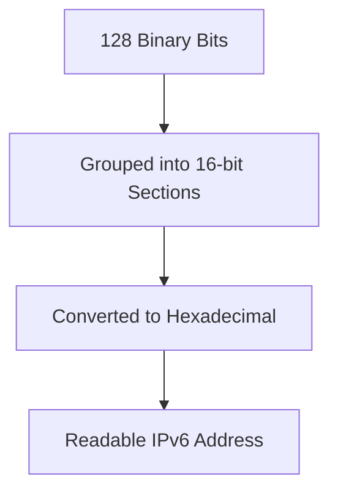

---

## 🔹 Comparing IPv4 and IPv6 Structures

Although both protocols identify devices on a network, they organize their addresses differently.

| Feature | IPv4 | IPv6 |
|---------|------|------|
| Address Length | 32 bits | 128 bits |
| Number of Sections | 4 Octets | 8 Groups |
| Bits per Section | 8 bits | 16 bits |
| Number System | Decimal | Hexadecimal |
| Separator | `.` | `:` |

As you can see, IPv6 expands the address size while also changing the way addresses are represented.

---

<!--
Image Description:
Create a side-by-side educational comparison between an IPv4 address and an IPv6 address. Show IPv4 as four decimal octets separated by dots and IPv6 as eight hexadecimal groups separated by colons. Label the bit lengths (32-bit vs. 128-bit) and highlight the differences using contrasting colors.

Suggested Search Keywords:
IPv4 vs IPv6 address structure
IPv6 hexadecimal infographic
IPv4 IPv6 comparison diagram
network addressing comparison

Suggested Filename:
Images/ipv4_vs_ipv6_structure.png
-->

<p align="center">

</p>

---

## 🌍 Why This Structure Matters

The expanded **128-bit address space** is one of the main reasons IPv6 was developed.

By increasing the address size from **32 bits** to **128 bits**, IPv6 provides an almost limitless supply of unique addresses. This allows the Internet to continue growing without the address shortages experienced by IPv4.

Although IPv6 addresses are longer, their structured format and hexadecimal representation make them practical to use in modern networks.

---

> 💡 **Point to Remember**
>
> Every IPv6 address contains **128 bits**, divided into **eight 16-bit groups**. These groups are written in **hexadecimal notation** and separated by **colons (`:`)**.

---

> 🤓 **Did You Know?**
>
> A full IPv6 address always contains **eight groups**, but in practice many addresses are written in a much shorter form using **address compression**. You'll learn exactly how this works later in this lesson.

---

# 🔢 Understanding Hexadecimal Numbers

Before you can confidently read and work with IPv6 addresses, you need to understand **hexadecimal notation**.

If you've never seen hexadecimal before, don't worry—it is much simpler than it first appears.

Hexadecimal is simply another way of representing numbers, just like the decimal and binary systems you've already encountered.

The only difference is **how many symbols each number system uses**.

---

## 🔹 What Is a Number System?

A **number system** is a method of representing numerical values using a specific set of symbols.

Different number systems use different bases.

| Number System | Base | Symbols Used |
|---------------|:----:|--------------|
| Binary | 2 | `0 1` |
| Decimal | 10 | `0–9` |
| Hexadecimal | 16 | `0–9` and `A–F` |

Computers process information using **binary**, while humans generally use **decimal**.

Hexadecimal acts as a bridge between these two systems because it represents large binary values in a much shorter and easier-to-read format.

---

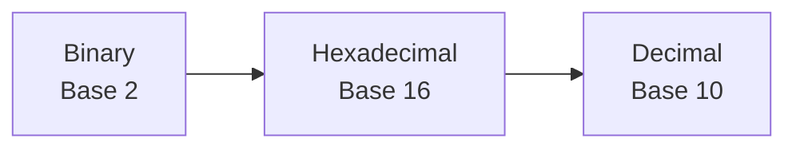

---

## 🔹 Why Does IPv6 Use Hexadecimal?

Imagine writing a **128-bit IPv6 address** entirely in binary.

```text
0010000000000001000011011011100010000101101000110000000000000000...
```

Although computers can read this effortlessly, it would be extremely difficult for humans to:

- Read
- Write
- Remember
- Troubleshoot

Instead, IPv6 converts groups of binary digits into **hexadecimal**, making addresses much shorter and far easier to work with.

For example:

```text
Binary

0010000000000001

↓

Hexadecimal

2001
```

Instead of sixteen individual binary digits, we only need four hexadecimal characters.

---

## 🔹 The Hexadecimal Digits

Unlike decimal, which has **10 symbols**, hexadecimal uses **16 symbols**.

The first ten symbols are the familiar numbers:

```text
0 1 2 3 4 5 6 7 8 9
```

After **9**, hexadecimal continues using letters.

| Decimal | Hexadecimal |
|---------:|:-----------:|
| 10 | A |
| 11 | B |
| 12 | C |
| 13 | D |
| 14 | E |
| 15 | F |

So an IPv6 address may contain characters such as:

```text
A
B
C
D
E
F
```

These are **not words**—they simply represent the decimal values **10 through 15**.

---

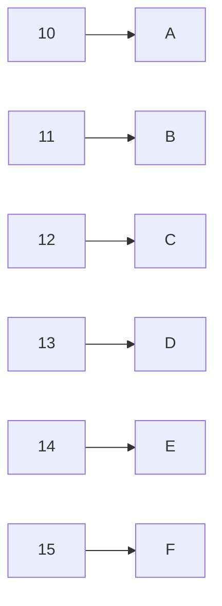

---

<!--
Image Description:
Create an educational infographic illustrating the hexadecimal number system. Show decimal values 0–15 alongside their hexadecimal equivalents (0–9, A–F). Include labels explaining that hexadecimal uses Base 16 and is commonly used in IPv6 addressing.

Suggested Search Keywords:
hexadecimal number system infographic
base 16 chart
hexadecimal digits explained
IPv6 hexadecimal educational illustration

Suggested Filename:
Images/hexadecimal_digits.png
-->

<p align="center">

</p>

---

## 🔹 Binary, Decimal, and Hexadecimal Relationship

One of the reasons hexadecimal is so useful is that it maps neatly to binary.

Every **4 binary bits** correspond to exactly **one hexadecimal digit**.

For example:

| Binary | Decimal | Hexadecimal |
|:------:|:-------:|:-----------:|
| 0000 | 0 | 0 |
| 0001 | 1 | 1 |
| 0010 | 2 | 2 |
| 0011 | 3 | 3 |
| 0100 | 4 | 4 |
| 0101 | 5 | 5 |
| 0110 | 6 | 6 |
| 0111 | 7 | 7 |
| 1000 | 8 | 8 |
| 1001 | 9 | 9 |
| 1010 | 10 | A |
| 1011 | 11 | B |
| 1100 | 12 | C |
| 1101 | 13 | D |
| 1110 | 14 | E |
| 1111 | 15 | F |

This direct relationship makes hexadecimal an efficient shorthand for binary data.

---

## 🔹 Example Conversion

Let's convert one binary value into hexadecimal.

Binary:

```text
1010
```

Looking at the table above:

```text
1010₂ = A₁₆
```

Another example:

```text
1111₂ = F₁₆
```

Now consider a complete 16-bit group:

```text
0010 0000 0000 0001
```

Break it into four groups of 4 bits:

```text
0010   0000   0000   0001
```

Convert each group:

```text
0010 → 2

0000 → 0

0000 → 0

0001 → 1
```

Result:

```text
2001
```

This is exactly why IPv6 addresses often begin with values such as:

```text
2001:
```

Rather than displaying all sixteen binary bits, IPv6 represents them using only four hexadecimal characters.

---

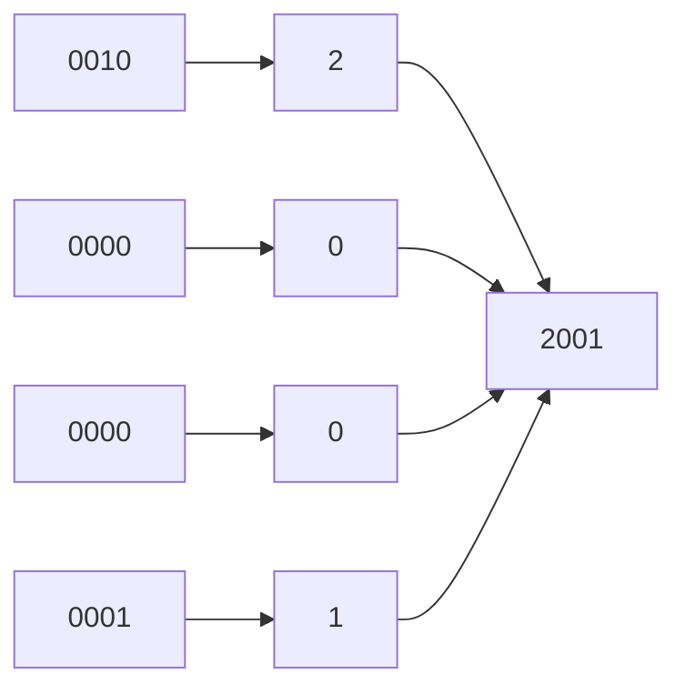

---

## 🌍 Why Learning Hexadecimal Matters

Hexadecimal is used throughout computer science and cybersecurity—not just in IPv6.

You'll encounter hexadecimal in:

- 🌐 IPv6 addressing
- 💾 Memory addresses
- 🔐 Cryptographic hashes
- 🛠️ Debugging tools
- 📦 Packet analysis with Wireshark
- 🔍 Digital forensics
- 💻 Low-level programming

By becoming comfortable with hexadecimal now, you'll be better prepared for many advanced topics later in your cybersecurity journey.

---

> 💡 **Point to Remember**
>
> Hexadecimal is a **Base-16 number system** that uses the symbols **0–9** and **A–F**. In IPv6, hexadecimal provides a compact and human-readable way to represent long binary addresses.

---

> 🤓 **Did You Know?**
>
> Every **single hexadecimal digit represents exactly four binary bits**. This means a full **16-bit IPv6 group** is always represented by **four hexadecimal characters**, making hexadecimal the perfect notation for IPv6 addresses.

---
# ✂️ IPv6 Address Compression

A full IPv6 address contains **128 bits** and is written as **eight groups of four hexadecimal characters**.

For example:

```text
2001:0db8:0000:0000:0000:ff00:0042:8329
```

Although this format is accurate, writing long IPv6 addresses repeatedly would be inconvenient and prone to typing errors.

To make IPv6 addresses easier for humans to read and write, IPv6 defines **address compression rules**.

These rules shorten an IPv6 address **without changing its meaning**.

---

## 🔹 Why Do We Compress IPv6 Addresses?

Imagine typing this address every time you configure a router or troubleshoot a network.

```text
2001:0db8:0000:0000:0000:ff00:0042:8329
```

Now compare it with the compressed version:

```text
2001:db8::ff00:42:8329
```

Both addresses represent **exactly the same IPv6 address**.

The second version is simply easier to read, type, and remember.

---


---

<!--
Image Description:
Create an educational illustration comparing a full IPv6 address with its compressed form. Show the transformation from
2001:0db8:0000:0000:0000:ff00:0042:8329
to
2001:db8::ff00:42:8329
Use arrows and labels explaining that compression improves readability without changing the address.

Suggested Search Keywords:
IPv6 compression infographic
IPv6 address shortening
IPv6 notation comparison
IPv6 educational diagram

Suggested Filename:
Images/ipv6_compression_overview.png
-->

<p align="center">

</p>

---

# 🔹 Rule 1 — Remove Leading Zeros

If a group begins with one or more zeros, those **leading zeros** may be removed.

For example:

| Original | Compressed |
|-----------|------------|
| `0001` | `1` |
| `000A` | `A` |
| `0042` | `42` |
| `0db8` | `db8` |
| `0000` | `0` |

Notice that **only zeros at the beginning of a group** can be removed.

You **cannot** remove zeros that appear in the middle or at the end.

For example:

```text
0042

↓

42
```

Valid ✅

---

```text
4200

↓

42
```

Invalid ❌

Removing trailing zeros changes the value of the address.

---

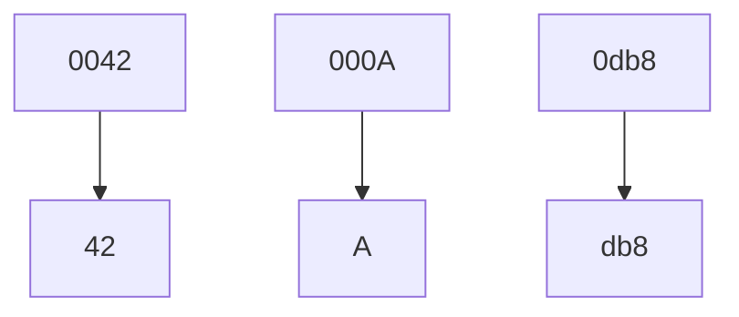

---

## 🔹 Rule 2 — Compress Consecutive Zero Groups

If an IPv6 address contains **one or more consecutive groups consisting entirely of zeros**, they may be replaced with a **double colon (`::`)**.

Example:

```text
2001:db8:0000:0000:0000:ff00:42:8329
```

becomes

```text
2001:db8::ff00:42:8329
```

The double colon represents the missing groups of zeros.

Instead of writing:

```text
0000:0000:0000
```

we simply write:

```text
::
```

---

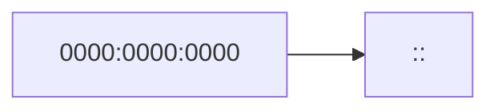

---

## 🔹 Important Rule — `::` Can Only Be Used Once

This is one of the most important IPv6 rules.

The double colon (`::`) may appear **only once** in an IPv6 address.

Why?

Because if it appeared more than once, a computer would not know how many zero groups each `::` represents.

Consider this invalid example:

```text
2001::db8::1
```

How many groups of zeros should each `::` represent?

There is no way to know.

For this reason, an IPv6 address can contain **only one** double colon.

---

| Address | Valid? |
|----------|:------:|
| `2001:db8::1` | ✅ |
| `fe80::1` | ✅ |
| `2001::db8::1` | ❌ |

---

<!--
Image Description:
Create an educational infographic explaining the IPv6 double-colon rule. Show valid examples with one `::` and an invalid example using two `::`. Include a warning icon explaining that `::` may appear only once because otherwise the omitted zero groups become ambiguous.

Suggested Search Keywords:
IPv6 double colon rule
IPv6 compression rules infographic
IPv6 :: notation explained
IPv6 addressing educational diagram

Suggested Filename:
Images/ipv6_double_colon_rule.png
-->

<p align="center">

</p>

---

# 🔹 Step-by-Step Compression Example

Let's compress an IPv6 address together.

Original address:

```text
2001:0db8:0000:0000:0000:ff00:0042:8329
```

### Step 1 — Remove Leading Zeros

```text
2001:db8:0:0:0:ff00:42:8329
```

### Step 2 — Replace Consecutive Zero Groups

```text
2001:db8::ff00:42:8329
```

Final compressed address:

```text
2001:db8::ff00:42:8329
```

---

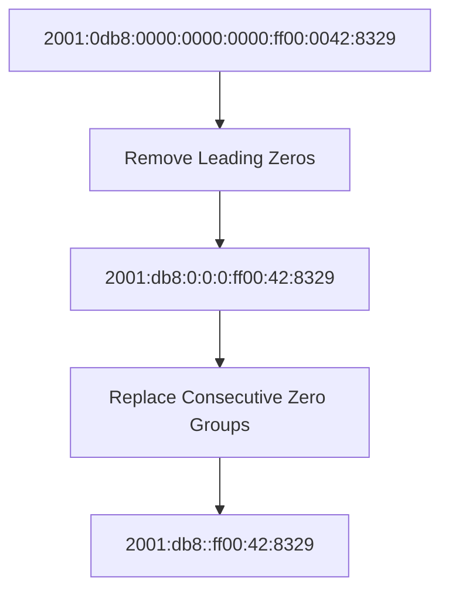

---

# 🌍 Practice Time

Compress the following IPv6 addresses.

### Exercise 1

```text
2001:0db8:0000:0000:0000:0000:0000:0001
```

<details>

<summary><strong>✅ Show Answer</strong></summary>

```text
2001:db8::1
```

</details>

---

### Exercise 2

```text
fe80:0000:0000:0000:0202:b3ff:fe1e:8329
```

<details>

<summary><strong>✅ Show Answer</strong></summary>

```text
fe80::202:b3ff:fe1e:8329
```

</details>

---

### Exercise 3

```text
2001:0db8:0000:0001:0000:0000:0000:abcd
```

<details>

<summary><strong>✅ Show Answer</strong></summary>

```text
2001:db8:0:1::abcd
```

</details>

---

> 💡 **Point to Remember**
>
> IPv6 compression follows two simple rules:
>
> 1. Remove **leading zeros** from each group.
> 2. Replace **one consecutive sequence of zero groups** with `::`.
>
> The double colon (`::`) can appear **only once** in a single IPv6 address.

---

> 🤓 **Did You Know?**
>
> Most IPv6 addresses you encounter in operating systems, routers, cloud platforms, and certification exams are displayed in their **compressed form**. Understanding the compression rules is an essential networking skill because you'll rarely see full, uncompressed IPv6 addresses in real-world environments.

---
# 🔄 Expanding a Compressed IPv6 Address

So far, you've learned how to **compress** an IPv6 address by removing unnecessary zeros and replacing consecutive groups of zeros with a double colon (`::`).

However, there are many situations where you'll encounter **compressed IPv6 addresses** and need to determine their **full, expanded form**.

Network engineers frequently expand IPv6 addresses when:

- 🔍 Troubleshooting network connectivity
- 📦 Analyzing packets with Wireshark
- ⚙️ Configuring routers and switches
- ☁️ Managing cloud infrastructure
- 🎓 Preparing for networking certification exams

Fortunately, expanding an IPv6 address follows a few simple rules.

---

# 🔹 Rule 1 — Count the Existing Groups

A complete IPv6 address always contains:

- **8 groups**
- **16 bits per group**
- **4 hexadecimal characters per group**

Whenever you see a compressed address, start by counting how many groups are already present.

Example:

```text
2001:db8::1
```

Current groups:

```
2001

db8

1
```

Only **3 groups** are visible.

Since a complete IPv6 address requires **8 groups**, the missing **5 groups** must be represented by the double colon (`::`).

---

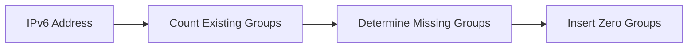

---

# 🔹 Rule 2 — Replace `::` with Zero Groups

Now replace the double colon with enough groups of `0000` so the address contains exactly **8 groups**.

Compressed:

```text
2001:db8::1
```

Expanded:

```text
2001:0db8:0000:0000:0000:0000:0000:0001
```

Notice that the address now contains exactly **eight groups**.

---

## 🔹 Rule 3 — Restore Leading Zeros

During compression, leading zeros were removed.

When expanding an IPv6 address, restore each group to **four hexadecimal characters**.

For example:

| Compressed | Expanded |
|------------|----------|
| `1` | `0001` |
| `A` | `000A` |
| `42` | `0042` |
| `db8` | `0db8` |

Every group must contain **exactly four hexadecimal characters**.

---

<!--
Image Description:
Create an educational infographic showing how a compressed IPv6 address is expanded. Start with `2001:db8::1`, count the visible groups, replace `::` with the missing `0000` groups, and restore leading zeros to produce the complete address. Use arrows to illustrate each step.

Suggested Search Keywords:
IPv6 expansion infographic
expand compressed IPv6 address
IPv6 address expansion diagram
IPv6 educational illustration

Suggested Filename:
Images/ipv6_address_expansion.png
-->

<p align="center">

</p>

---

# 🔹 Worked Example 1

Compressed address:

```text
2001:db8::1
```

### Step 1

Count the visible groups.

```
2001

db8

1
```

Visible groups:

```
3
```

Missing groups:

```
8 − 3 = 5
```

---

### Step 2

Insert five groups of `0000`.

```text
2001:db8:0000:0000:0000:0000:0000:1
```

---

### Step 3

Restore leading zeros.

```text
2001:0db8:0000:0000:0000:0000:0000:0001
```

✅ Expansion complete.

---

# 🔹 Worked Example 2

Compressed address:

```text
fe80::202:b3ff:fe1e:8329
```

Visible groups:

```
fe80

202

b3ff

fe1e

8329
```

Visible groups:

```
5
```

Missing groups:

```
8 − 5 = 3
```

Insert three groups of zeros.

```text
fe80:0000:0000:0000:0202:b3ff:fe1e:8329
```

Notice how:

```
202
```

became

```
0202
```

after restoring the leading zero.

---

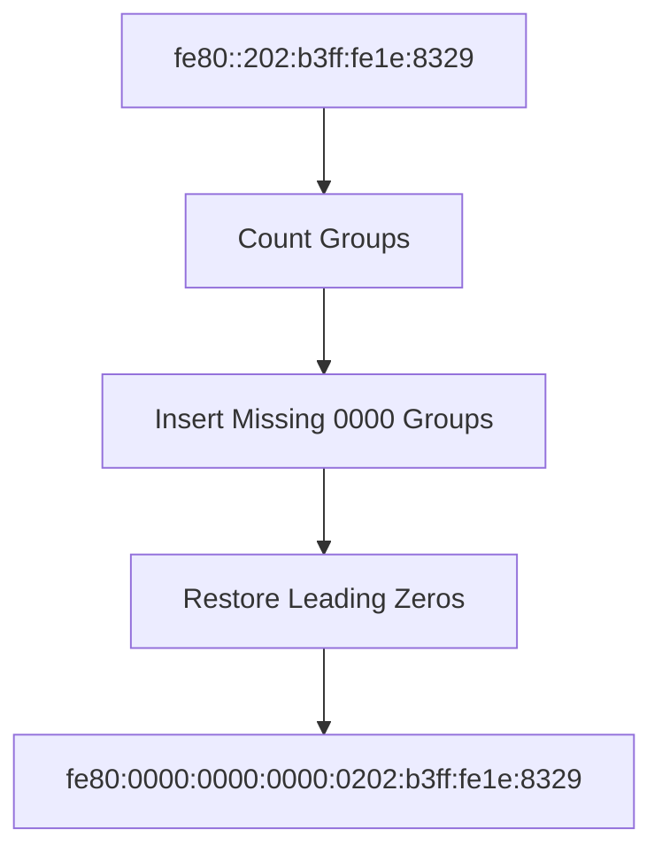

---

# 📝 Practice Time

Expand the following IPv6 addresses.

---

## Exercise 1

```text
2001:db8::abcd
```

<details>

<summary><strong>✅ Show Answer</strong></summary>

```text
2001:0db8:0000:0000:0000:0000:0000:abcd
```

</details>

---

## Exercise 2

```text
::1
```

<details>

<summary><strong>✅ Show Answer</strong></summary>

```text
0000:0000:0000:0000:0000:0000:0000:0001
```

</details>

---

## Exercise 3

```text
2001:db8:1::100
```

<details>

<summary><strong>✅ Show Answer</strong></summary>

```text
2001:0db8:0001:0000:0000:0000:0000:0100
```

</details>

---

# ⚠️ Common Mistakes

Beginners often make these mistakes when expanding IPv6 addresses:

❌ Forgetting that every IPv6 address must contain **exactly eight groups**.

❌ Forgetting to restore **leading zeros**.

❌ Inserting the wrong number of `0000` groups.

❌ Assuming `::` always represents the same number of zero groups.

Remember:

> The number of groups represented by `::` depends on how many groups are already present in the address.

---

> 💡 **Point to Remember**
>
> To expand a compressed IPv6 address:
>
> 1. Count the visible groups.
> 2. Insert enough `0000` groups so there are **eight groups** in total.
> 3. Restore leading zeros so every group contains **four hexadecimal characters**.

---

> 🤓 **Did You Know?**
>
> Most operating systems display IPv6 addresses in their **compressed form**, but networking tools, packet analyzers, and certification exams may require you to understand or reconstruct the **fully expanded address**. Being able to move confidently between both formats is an essential networking skill.

---


# 🌍 Types of IPv6 Addresses

Unlike IPv4, which primarily distinguishes between **public** and **private** addresses, IPv6 defines several address types, each designed for a specific purpose.

Different IPv6 address types allow devices to communicate within a local network, across the Internet, or with groups of devices simultaneously.

Understanding these address types is essential for configuring networks, troubleshooting connectivity issues, and analyzing network traffic.

---

## 🗂️ Overview of IPv6 Address Types

| Address Type | Purpose | Routable on the Internet |
|---------------|----------|:------------------------:|
| 🌐 Global Unicast | Public communication across the Internet | ✅ Yes |
| 🔗 Link-Local | Communication within the same local network | ❌ No |
| 🏠 Unique Local | Private internal networks | ❌ No |
| 📡 Multicast | One-to-many communication | ❌ No (local or scoped) |
| 🎯 Anycast | One-to-nearest communication | ✅ Yes (depending on deployment) |

---

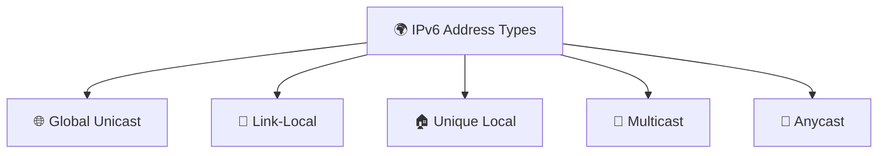

---

<!--
Image Description:
Create a colorful educational infographic showing the five major IPv6 address types branching from a central IPv6 icon. Include Global Unicast, Link-Local, Unique Local, Multicast, and Anycast with small icons representing the Internet, local networks, homes, groups of devices, and nearest server communication.

Suggested Search Keywords:
IPv6 address types infographic
IPv6 address categories
IPv6 networking illustration
IPv6 address overview

Suggested Filename:
Images/ipv6_address_types_overview.png
-->

<p align="center">

</p>

---

# 🌐 Global Unicast Addresses

A **Global Unicast Address (GUA)** is the IPv6 equivalent of a **public IPv4 address**.

These addresses are globally unique and can communicate across the Internet.

Whenever your computer accesses a website using IPv6, it typically uses a Global Unicast Address.

Example:

```text
2001:db8:abcd:12::25
```

Characteristics:

- ✅ Globally unique
- ✅ Internet routable
- ✅ Assigned by an ISP or organization
- ✅ Used for normal Internet communication

Think of a Global Unicast Address as your device's **public mailing address** on the Internet.

---

# 🔗 Link-Local Addresses

Every IPv6-enabled network interface automatically creates a **Link-Local Address**.

These addresses are used only for communication **within the same local network segment (link)**.

They are **never forwarded by routers**.

All Link-Local addresses begin with:

```text
FE80::
```

Example:

```text
fe80::1c2d:45ff:fe67:890a
```

Characteristics:

- ✅ Automatically generated
- ✅ Used on local networks
- ❌ Not routable across the Internet
- ✅ Required for many IPv6 networking functions

Even if a device has no Internet connectivity, it will usually still have a Link-Local Address.

---

# 🏠 Unique Local Addresses (ULA)

A **Unique Local Address (ULA)** is similar to a **private IPv4 address**.

These addresses are intended for communication **within private organizations or home networks**.

They are **not routable on the public Internet**.

Most ULAs begin with:

```text
FD00::
```

Example:

```text
fd12:3456:789a::15
```

Characteristics:

- ✅ Private addressing
- ✅ Internal communication
- ❌ Not Internet routable
- ✅ Useful for enterprise and home networks

Think of a ULA as an organization's **internal street address** that only makes sense inside that organization.

---

# 📡 Multicast Addresses

IPv6 does **not use broadcast addresses** like IPv4.

Instead, IPv6 relies heavily on **Multicast**.

A Multicast address sends traffic to **a specific group of interested devices**, rather than every device on the network.

All Multicast addresses begin with:

```text
FF00::
```

Example:

```text
ff02::1
```

Characteristics:

- ✅ One-to-many communication
- ✅ More efficient than broadcast
- ✅ Used for service discovery and routing protocols

For example, instead of sending a packet to every device on the network, a router can send it only to devices that have joined a particular multicast group.

---

# 🎯 Anycast Addresses

An **Anycast Address** is assigned to **multiple devices**, but packets are delivered to **the nearest or best destination** according to the routing protocol.

Imagine several identical web servers located around the world.

Each server advertises the same Anycast address.

When a user sends traffic to that address, routers automatically forward the packet to the closest or most efficient server.

Characteristics:

- ✅ One-to-nearest communication
- ✅ Improves performance
- ✅ Increases reliability
- ✅ Commonly used by DNS providers and cloud services

Users do not need to know which physical server handled their request—the network automatically selects the most appropriate destination.

---

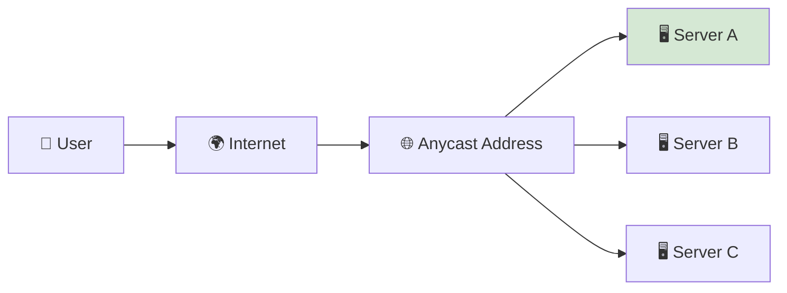

---

# 🚫 Why Doesn't IPv6 Use Broadcast?

One of the biggest design improvements in IPv6 is the removal of **broadcast addresses**.

In IPv4, broadcasts send packets to **every device** on a network.

While useful, broadcasts also generate unnecessary traffic.

IPv6 replaces broadcast communication with **Multicast**, allowing packets to reach **only the devices that need them**.

This makes networks:

- ⚡ More efficient
- 📉 Less congested
- 📈 More scalable

---

## 📊 Comparing IPv6 Address Types

| Address Type | Starts With | Internet Routable | Typical Use |
|---------------|-------------|:----------------:|-------------|
| Global Unicast | `2000::/3` | ✅ | Public Internet communication |
| Link-Local | `FE80::/10` | ❌ | Local network communication |
| Unique Local | `FC00::/7` *(commonly `FD00::/8`)* | ❌ | Private internal networks |
| Multicast | `FF00::/8` | ❌ | One-to-many communication |
| Anycast | No special prefix | ✅ | Nearest available destination |

---

<!--
Image Description:
Create a comparison infographic showing all five IPv6 address types. Include their prefixes, whether they are Internet routable, and typical use cases. Use icons for the Internet, local network, home network, multicast groups, and cloud servers.

Suggested Search Keywords:
IPv6 address type comparison
IPv6 address prefixes infographic
Global Unicast Link Local ULA Multicast Anycast
IPv6 addressing guide

Suggested Filename:
Images/ipv6_address_types_comparison.png
-->

<p align="center">

</p>

---

> 💡 **Point to Remember**
>
> IPv6 defines multiple address types, each serving a specific purpose. **Global Unicast** connects devices to the Internet, **Link-Local** enables communication on the local network, **Unique Local** supports private networks, **Multicast** replaces broadcast for group communication, and **Anycast** directs traffic to the nearest available destination.

---

> 🤓 **Did You Know?**
>
> One of the first IPv6 addresses you'll often see on a computer is a **Link-Local Address** beginning with **`FE80::`**. Operating systems automatically create these addresses, allowing devices on the same network to communicate even before a Global Unicast Address is assigned.

---

# ⚖️ IPv4 vs IPv6

Now that you've learned how both IPv4 and IPv6 work individually, it's time to compare them side by side.

Although both protocols perform the same fundamental job—**identifying devices and routing data across networks**—they differ significantly in their design, capabilities, and scalability.

Understanding these differences is important because modern networks often support **both IPv4 and IPv6 simultaneously**. As a networking or cybersecurity professional, you'll likely encounter both protocols throughout your career.

---

## 🔹 Side-by-Side Comparison

| Feature | 🌐 IPv4 | 🌍 IPv6 |
|----------|---------|----------|
| Full Name | Internet Protocol Version 4 | Internet Protocol Version 6 |
| Standardized | 1981 | 1998 |
| Address Length | 32 bits | 128 bits |
| Address Format | Decimal | Hexadecimal |
| Number of Sections | 4 Octets | 8 Groups |
| Separator | Dot (`.`) | Colon (`:`) |
| Address Example | `192.168.1.10` | `2001:db8::10` |
| Total Address Space | ≈ 4.3 Billion | ≈ 340 Undecillion |
| Broadcast Support | ✅ Yes | ❌ No |
| Multicast Support | Limited | ✅ Native |
| Anycast Support | Limited | ✅ Native |
| NAT Required | Often Yes | Usually No |
| Auto Configuration | Limited | Built-in (SLAAC) |
| Header Size | Variable | Fixed |
| Security | Optional IPsec | Better native support for IPsec |
| Internet Growth | Limited | Designed for Future Growth |

---

## 🔹 Address Format Comparison

One of the easiest differences to notice is how addresses are written.

### IPv4

```text
192.168.1.25
```

- 32 bits
- 4 decimal octets
- Dots (`.`)

---

### IPv6

```text
2001:db8:85a3::8a2e:370:7334
```

- 128 bits
- 8 hexadecimal groups
- Colons (`:`)

---

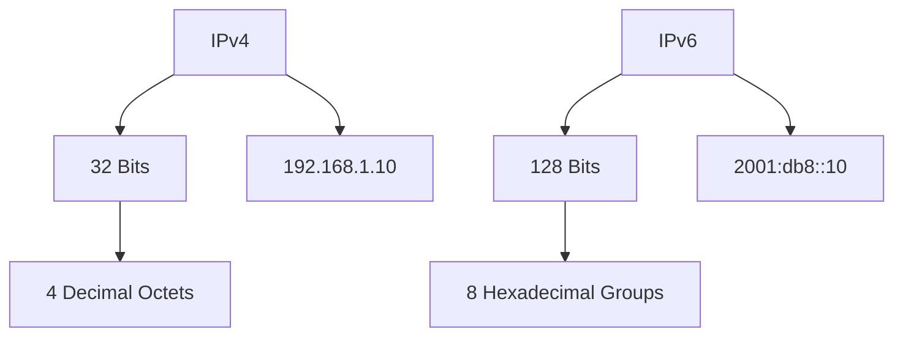

---

<!--
Image Description:
Create a side-by-side infographic comparing IPv4 and IPv6. Show an IPv4 address on the left with four decimal octets and an IPv6 address on the right with eight hexadecimal groups. Highlight the differences in bit length, notation, separators, and address space using a clean educational design.

Suggested Search Keywords:
IPv4 vs IPv6 infographic
IPv4 IPv6 comparison chart
IPv4 and IPv6 address format
network protocol comparison

Suggested Filename:
Images/ipv4_vs_ipv6_comparison.png
-->

<p align="center">

</p>

---

# 🔹 Address Space

The biggest improvement introduced by IPv6 is its enormous address space.

### IPv4

```
2³²

≈ 4.3 Billion Addresses
```

### IPv6

```
2¹²⁸

≈ 340 Undecillion Addresses
```

The difference is so large that IPv6 can provide unique addresses for an enormous number of devices, supporting the continued growth of the Internet for decades to come.

---

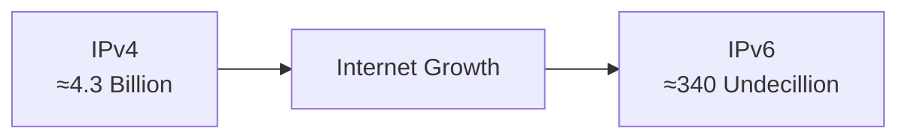

---

# 🔹 Network Efficiency

IPv6 was designed with lessons learned from IPv4.

Some improvements include:

- ⚡ Simplified packet header for more efficient routing.
- 📉 Reduced dependence on Network Address Translation (NAT).
- 🌐 Improved multicast support.
- 📦 Better scalability for large networks.
- 🚀 Easier automatic address configuration using **SLAAC (Stateless Address Autoconfiguration)**.

These enhancements help reduce administrative overhead and improve network efficiency.

---

# 🔹 Security

IPv4 was created at a time when Internet security was not a primary concern.

As a result, many security features had to be added later.

IPv6 was designed with modern networking requirements in mind and includes better support for technologies such as **IPsec**, which provides authentication, integrity, and encryption for IP communications.

> **Note:** While IPv6 was designed with native IPsec support, **using IPsec is not mandatory**. Organizations must still configure and enable it where required.

---

# 🔹 Why Do We Still Use IPv4?

A common question is:

> **If IPv6 is better, why hasn't IPv4 disappeared?**

The answer is simple:

The global Internet contains **billions of devices, routers, servers, applications, and embedded systems** that were built around IPv4.

Replacing all of this infrastructure overnight would be impractical and extremely expensive.

Instead, most organizations are gradually adopting IPv6 while continuing to support IPv4.

This approach is known as **Dual Stack**, where devices operate using both protocols simultaneously.

---

```mermaid
flowchart LR

A["💻 Device"]

--> B["Dual Stack"]

B --> C["IPv4"]

B --> D["IPv6"]

C --> E["🌐 Internet"]

D --> E
```

---

# 🔹 Advantages and Disadvantages

## ✅ Advantages of IPv4

- Simple and familiar.
- Supported by virtually all networking equipment.
- Large existing infrastructure.
- Easier for beginners to recognize and memorize.

---

## ❌ Limitations of IPv4

- Limited address space.
- Heavy reliance on NAT.
- Broadcast traffic can reduce efficiency.
- Not designed for today's massive Internet.

---

## ✅ Advantages of IPv6

- Massive 128-bit address space.
- Better scalability.
- More efficient routing.
- Improved multicast support.
- Native support for automatic address configuration.
- Better support for modern networking technologies.

---

## ❌ Challenges of IPv6

- Longer addresses can appear intimidating to beginners.
- Older hardware or software may not fully support IPv6.
- Transitioning existing networks requires planning and resources.
- Network administrators need additional training and experience.

---

## 📊 Quick Comparison Summary

| Category | Better Choice |
|----------|---------------|
| Address Space | 🌍 IPv6 |
| Simplicity | 🌐 IPv4 |
| Future Scalability | 🌍 IPv6 |
| Legacy Compatibility | 🌐 IPv4 |
| Automatic Configuration | 🌍 IPv6 |
| Modern Internet | 🌍 IPv6 |

---

> 💡 **Point to Remember**
>
> IPv4 and IPv6 serve the same purpose—providing logical addressing and routing—but IPv6 was designed to overcome the limitations of IPv4. With its **128-bit address space**, improved efficiency, and support for modern networking, IPv6 is the foundation of the Internet's future, while IPv4 continues to play an important role during the ongoing transition.

---

> 🤓 **Did You Know?**
>
> Many major technology companies, cloud providers, and Internet service providers now operate **dual-stack networks**, allowing devices to communicate using both IPv4 and IPv6. This gradual transition ensures compatibility with existing systems while enabling the continued growth of the Internet.

---
# 💻 Mini Lab — Exploring IPv6 on Your Computer

Theory is important, but networking is a practical skill.

In this lab, you'll inspect your computer's network configuration to locate its IPv6 addresses and identify the different address types discussed in this lesson.

Don't worry if your computer doesn't have a public IPv6 address. Many home networks still primarily use IPv4, while others operate in **dual-stack mode**, supporting both IPv4 and IPv6.

---

# 🎯 Lab Objectives

By completing this lab, you will learn how to:

- ✅ View your computer's IPv6 configuration.
- ✅ Identify a **Link-Local Address**.
- ✅ Determine whether a **Global Unicast Address** is assigned.
- ✅ Compare your IPv4 and IPv6 addresses.
- ✅ Observe how modern operating systems support IPv6.

---

# 🖥️ Windows

Open **Command Prompt** or **Windows PowerShell** and run:

```powershell
ipconfig /all
```

Example output:

```text
Ethernet adapter Ethernet

IPv6 Address . . . . . . . . . : 2001:db8:abcd:15::25
Link-local IPv6 Address . . . : fe80::d42f:8cff:fe12:34ab%8
IPv4 Address . . . . . . . . . : 192.168.1.15
```

---

# 🐧 Linux

Open a terminal and run:

```bash
ip addr
```

or

```bash
ip -6 addr
```

Example:

```text
inet6 fe80::d42f:8cff:fe12:34ab/64 scope link

inet6 2001:db8:abcd:15::25/64 scope global
```

---

# 🍎 macOS

Open **Terminal** and run:

```bash
ifconfig
```

or

```bash
ipconfig getifaddr en0
```

Look for lines beginning with:

```text
inet6
```

Example:

```text
inet6 fe80::d42f:8cff:fe12:34ab%en0
```

---

# 🔍 Identify Your IPv6 Addresses

After running the appropriate command, answer the following questions.

| Question | Your Answer |
|-----------|-------------|
| Do you see an IPv6 address? | __________ |
| Do you see a Link-Local address beginning with `FE80::`? | __________ |
| Do you see a Global Unicast address? | __________ |
| What is your IPv4 address? | __________ |
| Are both IPv4 and IPv6 present? | __________ |

---

# 🧪 Mini Exercise 1 — Identify the Address Type

Consider the following addresses.

```text
fe80::20c:29ff:fe4f:8c5a
```

```text
2001:db8:100:1::25
```

```text
fd12:3456:789a::10
```

### ❓ Questions

1. Which address is **Link-Local**?
2. Which address is **Global Unicast**?
3. Which address is **Unique Local**?

<details>
<summary><strong>✅ Show Answer</strong></summary>

| Address | Type |
|----------|------|
| `fe80::20c:29ff:fe4f:8c5a` | Link-Local |
| `2001:db8:100:1::25` | Global Unicast |
| `fd12:3456:789a::10` | Unique Local |

</details>

---

# 🧪 Mini Exercise 2 — IPv4 or IPv6?

Identify whether each address belongs to IPv4 or IPv6.

| Address | IPv4 or IPv6? |
|----------|---------------|
| `192.168.1.25` | ______ |
| `2001:db8::15` | ______ |
| `10.0.0.5` | ______ |
| `fe80::1` | ______ |
| `172.16.25.8` | ______ |

<details>
<summary><strong>✅ Show Answer</strong></summary>

| Address | Type |
|----------|------|
| `192.168.1.25` | IPv4 |
| `2001:db8::15` | IPv6 |
| `10.0.0.5` | IPv4 |
| `fe80::1` | IPv6 |
| `172.16.25.8` | IPv4 |

</details>

---

# 🧪 Mini Exercise 3 — Expand or Compress

Compress the following address:

```text
2001:0db8:0000:0000:0000:0000:0000:0025
```

Expand the following address:

```text
fe80::1
```

<details>
<summary><strong>✅ Show Answer</strong></summary>

Compressed:

```text
2001:db8::25
```

Expanded:

```text
fe80:0000:0000:0000:0000:0000:0000:0001
```

</details>

---

<!--
Image Description:
Create a professional educational illustration showing a desktop computer displaying the output of `ipconfig /all`. Highlight the IPv4 address, Global Unicast IPv6 address, and Link-Local IPv6 address using different colors and labels. Include callout boxes explaining the purpose of each address.

Suggested Search Keywords:
ipconfig IPv6 screenshot illustration
IPv4 and IPv6 command output infographic
Windows networking educational diagram
network configuration visualization

Suggested Filename:
Images/ipv6_lab_ipconfig.png
-->

<p align="center">

</p>

---

> 💡 **Lab Tip**
>
> Don't be surprised if you see **both IPv4 and IPv6 addresses** on your computer. Most modern operating systems support **dual-stack networking**, allowing them to communicate using either protocol depending on the destination and network configuration.

---

## ✅ Lab Complete

Congratulations!

You've successfully explored IPv6 on a real system, identified different address types, and practiced recognizing and manipulating IPv6 addresses.

This hands-on experience reinforces the concepts covered throughout the lesson and prepares you for the review questions in the next section.

---

# 🧠 Quick Check

Take a few minutes to answer the following questions without looking back at the lesson.

These questions are designed to reinforce the key concepts you've just learned. If you're unsure about any answer, revisit the relevant section before continuing.

---

## Question 1

**What does IPv6 stand for?**

<details>
<summary><strong>✅ Show Answer</strong></summary>

**IPv6** stands for **Internet Protocol Version 6**, the latest version of the Internet Protocol designed to replace IPv4.

</details>

---

## Question 2

**How many bits does an IPv6 address contain?**

<details>
<summary><strong>✅ Show Answer</strong></summary>

An IPv6 address contains **128 bits**.

</details>

---

## Question 3

**How many groups are found in a complete IPv6 address?**

<details>
<summary><strong>✅ Show Answer</strong></summary>

A complete IPv6 address contains **8 groups**, each consisting of **16 bits** (or four hexadecimal characters).

</details>

---

## Question 4

**Which number system does IPv6 use?**

<details>
<summary><strong>✅ Show Answer</strong></summary>

IPv6 uses the **hexadecimal (Base-16)** number system.

It uses the symbols:

```
0–9
A–F
```

</details>

---

## Question 5

**Which IPv6 address type begins with `FE80::`?**

<details>
<summary><strong>✅ Show Answer</strong></summary>

Addresses beginning with **`FE80::`** are **Link-Local Addresses**.

They are automatically assigned and are only used for communication on the local network.

</details>

---

## Question 6

**What is the purpose of IPv6 address compression?**

<details>
<summary><strong>✅ Show Answer</strong></summary>

IPv6 address compression makes long IPv6 addresses easier to read and write by:

- Removing leading zeros.
- Replacing consecutive groups of zeros with `::`.

</details>

---

## Question 7

**How many times can the double colon (`::`) appear in a single IPv6 address?**

<details>
<summary><strong>✅ Show Answer</strong></summary>

Only **once**.

Using `::` more than once would make it impossible to determine how many groups of zeros are omitted.

</details>

---

## Question 8

**Which IPv6 address type is used for communication across the public Internet?**

<details>
<summary><strong>✅ Show Answer</strong></summary>

A **Global Unicast Address (GUA)** is used for communication across the public Internet.

</details>

---

## Question 9

**True or False?**

> IPv6 uses broadcast addresses in the same way as IPv4.

<details>
<summary><strong>✅ Show Answer</strong></summary>

**False.**

IPv6 does **not** use broadcast addresses.

Instead, it uses **Multicast**, which is more efficient because packets are delivered only to devices that have joined a specific multicast group.

</details>

---

## Question 10

**Name two major advantages of IPv6 over IPv4.**

<details>
<summary><strong>✅ Show Answer</strong></summary>

Possible answers include:

- Much larger **128-bit address space**.
- Better scalability for future Internet growth.
- Native support for **Stateless Address Autoconfiguration (SLAAC)**.
- Improved multicast support.
- Simplified packet header for more efficient routing.
- Reduced dependence on Network Address Translation (NAT).

</details>

---

## 🎯 Quick Self-Assessment

How did you do?

| Score | Progress |
|--------|----------|
| **9–10 Correct** | 🟢 Excellent! You have a strong understanding of IPv6 fundamentals. |
| **7–8 Correct** | 🟡 Good job! Review the sections you missed before moving on. |
| **5–6 Correct** | 🟠 You're making progress, but another review of the chapter will help reinforce the concepts. |
| **Below 5** | 🔴 Revisit the lesson, especially the sections on hexadecimal notation, address compression, and IPv6 address types. |

---

> 💡 **Tip**
>
> The goal of the **Quick Check** isn't to memorize answers—it's to confirm that you understand the key ideas well enough to explain them in your own words. If you can answer these questions confidently, you're ready for the more in-depth **Knowledge Check** in the next section.

---

# 📖 Knowledge Check

The following questions are designed to test your understanding of IPv6 concepts rather than simple memorization.

Read each scenario carefully before revealing the answer.

---

## Question 1 — Choosing the Correct Protocol

A company is rapidly expanding its global operations. Thousands of new devices are being connected every month, including cloud servers, IoT sensors, employee laptops, and mobile devices.

**Why would IPv6 be a better long-term solution than IPv4?**

<details>
<summary><strong>✅ Show Answer</strong></summary>

IPv6 provides a **128-bit address space**, allowing an enormous number of unique addresses. Unlike IPv4, it can support future Internet growth without relying heavily on technologies such as NAT.

</details>

---

## Question 2 — Identifying an Address

A network administrator discovers the following address on a workstation:

```text
fe80::d42f:8cff:fe12:34ab
```

**What type of IPv6 address is this, and where can it be used?**

<details>
<summary><strong>✅ Show Answer</strong></summary>

It is a **Link-Local Address**.

- Begins with **FE80::**
- Automatically assigned
- Used only within the local network segment
- Cannot be routed across the Internet

</details>

---

## Question 3 — Address Compression

A technician writes the following IPv6 address:

```text
2001:0db8:0000:0000:0000:0000:0000:0025
```

**Write the compressed version.**

<details>
<summary><strong>✅ Show Answer</strong></summary>

```text
2001:db8::25
```

</details>

---

## Question 4 — Address Expansion

A firewall log contains the following address:

```text
2001:db8::100
```

**Expand it into its full IPv6 representation.**

<details>
<summary><strong>✅ Show Answer</strong></summary>

```text
2001:0db8:0000:0000:0000:0000:0000:0100
```

</details>

---

## Question 5 — Understanding the Rules

A student writes the following address:

```text
2001::db8::1
```

**Is this valid? Explain why or why not.**

<details>
<summary><strong>✅ Show Answer</strong></summary>

No.

The double colon (`::`) may appear **only once** in an IPv6 address.

Using it more than once makes it impossible to determine how many groups of zeros have been omitted.

</details>

---

## Question 6 — Hexadecimal Understanding

Which hexadecimal digit represents the decimal value **15**?

A. C

B. D

C. E

D. F

<details>
<summary><strong>✅ Show Answer</strong></summary>

✅ **D. F**

Hexadecimal values are:

```
A = 10
B = 11
C = 12
D = 13
E = 14
F = 15
```

</details>

---

## Question 7 — IPv4 vs IPv6

A home router currently uses NAT so that multiple devices can share one public IPv4 address.

**Why is NAT generally less important in IPv6 networks?**

<details>
<summary><strong>✅ Show Answer</strong></summary>

Because IPv6 provides an enormous address space, many devices can be assigned their own globally unique addresses without sharing a single public address through NAT.

</details>

---

## Question 8 — Address Types

Match each IPv6 address type with its purpose.

| Address Type | Purpose |
|---------------|---------|
| Global Unicast | ______ |
| Link-Local | ______ |
| Unique Local | ______ |
| Multicast | ______ |
| Anycast | ______ |

<details>
<summary><strong>✅ Show Answer</strong></summary>

| Address Type | Purpose |
|---------------|---------|
| Global Unicast | Public Internet communication |
| Link-Local | Communication on the local network |
| Unique Local | Private internal networks |
| Multicast | One-to-many communication |
| Anycast | One-to-nearest communication |

</details>

---

## Question 9 — Troubleshooting Scenario

A computer has the following IPv6 address:

```text
fe80::1234:5678:abcd:1
```

The user attempts to access a website on the Internet but cannot establish a connection.

**Why isn't this address sufficient for Internet communication?**

<details>
<summary><strong>✅ Show Answer</strong></summary>

The address is a **Link-Local Address**.

Link-Local addresses are only valid on the local network segment and cannot be routed across the Internet. To communicate over the Internet, the device typically needs a **Global Unicast Address**.

</details>

---

## Question 10 — Real-World Scenario

A cloud company operates identical servers in North America, Europe, and Asia.

Customers always connect to the **nearest available server**, even though they all use the same IP address.

**Which IPv6 addressing technique makes this possible?**

<details>
<summary><strong>✅ Show Answer</strong></summary>

**Anycast**

Anycast allows multiple servers to share the same IP address. Routing protocols automatically deliver traffic to the nearest or best-performing destination.

</details>

---

## 🏆 Bonus Challenge

Imagine you have been asked to explain IPv6 to someone who has never studied networking.

In **three or four sentences**, answer the following:

- What is IPv6?
- Why was it created?
- What is its biggest advantage over IPv4?

There is no single correct answer. The goal is to explain the concept clearly using your own words.

---

## 📊 Evaluate Your Understanding

| Score | Understanding |
|--------|---------------|
| **9–10 Correct** | 🟢 Excellent! You have a solid understanding of IPv6 fundamentals and are ready for more advanced networking topics. |
| **7–8 Correct** | 🟡 Good work! Review the sections on address types, hexadecimal notation, or compression if needed. |
| **5–6 Correct** | 🟠 You're building a good foundation, but revisiting the lesson will strengthen your understanding. |
| **Below 5** | 🔴 Take another pass through the chapter, focusing on address structure, compression rules, and the differences between IPv4 and IPv6 before moving forward. |

---

> 💡 **Point to Remember**
>
> Understanding IPv6 is more than memorizing address formats. A networking professional should be able to identify address types, interpret compressed addresses, understand why IPv6 was developed, and explain how it improves communication across modern networks.

---

# 🚀 Challenge Questions

Congratulations! You've completed the lesson on **IPv6**.

The following challenges are designed to test your ability to apply what you've learned in realistic networking situations. Think carefully before revealing the answers.

---

# 🌍 Challenge 1 — Preparing for the Future

A university is expanding its campus network. Over the next five years, thousands of new devices will be connected, including:

- Student laptops
- Smartphones
- Smart classroom equipment
- Security cameras
- IoT sensors
- Cloud-connected servers

The network administrator must decide whether to continue using only IPv4 or begin deploying IPv6.

### ❓ Questions

1. Which protocol would you recommend?
2. Why is it the better long-term solution?

<details>

<summary><strong>✅ Suggested Answer</strong></summary>

IPv6 is the better choice because it provides:

- A massive **128-bit address space**
- Better scalability for future growth
- Reduced dependence on NAT
- Improved support for modern networking technologies
- Long-term sustainability as the number of connected devices continues to increase

</details>

---

# 🖥️ Challenge 2 — Identifying Address Types

A technician discovers the following IPv6 addresses on different devices.

```text
A. fe80::12ab:34cd:56ef:7890

B. fd12:3456:789a::25

C. 2001:db8:abcd:10::15
```

### ❓ Identify the type of each address.

| Address | Type |
|----------|------|
| A | ______ |
| B | ______ |
| C | ______ |

<details>

<summary><strong>✅ Suggested Answer</strong></summary>

| Address | Type |
|----------|------|
| A | Link-Local |
| B | Unique Local |
| C | Global Unicast |

</details>

---

# 🔧 Challenge 3 — Network Troubleshooting

A user reports that their computer has the following IPv6 address:

```text
fe80::45ab:89ff:fe12:3456
```

The user cannot browse websites using IPv6.

### ❓ What is the most likely reason?

<details>

<summary><strong>✅ Suggested Answer</strong></summary>

The device only has a **Link-Local Address**.

A Link-Local Address is valid only within the local network and cannot be routed across the Internet.

The device would typically need a **Global Unicast Address** to communicate over the Internet using IPv6.

</details>

---

# ✂️ Challenge 4 — Compression Practice

Compress the following IPv6 address.

```text
2001:0db8:0000:0000:0000:0000:0000:0042
```

<details>

<summary><strong>✅ Suggested Answer</strong></summary>

```text
2001:db8::42
```

</details>

---

# 🔄 Challenge 5 — Expansion Practice

Expand the following IPv6 address.

```text
2001:db8::abcd
```

<details>

<summary><strong>✅ Suggested Answer</strong></summary>

```text
2001:0db8:0000:0000:0000:0000:0000:abcd
```

</details>

---

# 🌐 Challenge 6 — IPv4 or IPv6?

Your company is replacing old networking equipment.

Some devices only support IPv4, while newer equipment supports both IPv4 and IPv6.

### ❓ Which deployment strategy would allow both old and new devices to continue communicating during the transition?

A. Disable IPv4 immediately

B. Replace every device in one day

C. Use a Dual-Stack Network

D. Disable IPv6 completely

<details>

<summary><strong>✅ Suggested Answer</strong></summary>

✅ **C. Use a Dual-Stack Network**

A dual-stack deployment allows devices to communicate using both IPv4 and IPv6, making the transition gradual and minimizing disruption.

</details>

---

# 🛡️ Challenge 7 — Think Like a Cybersecurity Analyst

During a security assessment, you notice that many devices on a corporate network have IPv6 enabled, even though the organization mainly uses IPv4.

### ❓ Why is it important for a cybersecurity professional to understand IPv6?

<details>

<summary><strong>✅ Suggested Answer</strong></summary>

Cybersecurity professionals must understand IPv6 because:

- Modern operating systems enable IPv6 by default.
- Attackers may use IPv6 if it is overlooked by administrators.
- Firewalls and monitoring systems must be configured for both IPv4 and IPv6.
- Ignoring IPv6 can create security blind spots within a network.

</details>

---

# 🏆 Final Challenge

Without looking at your notes, explain IPv6 to a beginner in your own words.

Your explanation should answer:

- What is IPv6?
- Why was it developed?
- What problem does it solve?
- How is it different from IPv4?

Try to keep your explanation between **4 and 6 sentences**.

---

## 🎯 Reflection

If you can confidently complete these challenges without referring back to the lesson, you've developed a strong understanding of IPv6 fundamentals.

Remember, networking isn't about memorizing addresses—it's about understanding **how devices communicate**, **why protocols are designed the way they are**, and **how to apply that knowledge to real-world networks**.

> 💡 **Point to Remember**
>
> IPv6 is the future of Internet addressing. As a networking or cybersecurity professional, you should be comfortable identifying IPv6 address types, interpreting compressed addresses, understanding dual-stack deployments, and explaining why IPv6 is essential for the continued growth of the Internet.

---

# 📝 Chapter Summary

Congratulations! 🎉

You've completed one of the most important lessons in the **IP Addressing** module.

In this chapter, you explored **Internet Protocol Version 6 (IPv6)**—the next generation of Internet addressing that was developed to overcome the limitations of IPv4 and support the continued growth of the modern Internet.

Rather than simply learning a new address format, you've built an understanding of **why IPv6 exists**, **how it works**, and **why every networking and cybersecurity professional should be comfortable using it**.

---

## 📚 What You Learned

Throughout this lesson, you learned:

### 🌍 IPv6 Fundamentals

- What IPv6 is
- Why IPv6 was developed
- How IPv6 solves IPv4 address exhaustion
- The role of IPv6 in modern networking

---

### 🏗️ IPv6 Address Structure

You learned that every IPv6 address:

- Contains **128 bits**
- Is divided into **8 groups**
- Uses **hexadecimal notation**
- Separates groups using **colons (`:`)**

Example:

```text
2001:db8:85a3::8a2e:370:7334
```

---

### 🔢 Hexadecimal Numbers

You discovered that IPv6 uses the **Base-16 number system**, consisting of:

```text
0 1 2 3 4 5 6 7 8 9 A B C D E F
```

You also learned how hexadecimal provides a compact way to represent long binary values.

---

### ✂️ IPv6 Address Compression

You practiced simplifying IPv6 addresses by:

- Removing leading zeros.
- Replacing consecutive zero groups with `::`.
- Understanding why `::` can appear only once.

Example:

```text
2001:0db8:0000:0000:0000:ff00:0042:8329
```

↓

```text
2001:db8::ff00:42:8329
```

You also learned how to **expand compressed IPv6 addresses** back to their full representation.

---

### 🌐 IPv6 Address Types

You explored the major IPv6 address types and their purposes.

| Address Type | Purpose |
|---------------|---------|
| 🌐 Global Unicast | Public Internet communication |
| 🔗 Link-Local | Local network communication |
| 🏠 Unique Local | Private internal networks |
| 📡 Multicast | One-to-many communication |
| 🎯 Anycast | One-to-nearest communication |

---

### ⚖️ IPv4 vs IPv6

You compared both Internet Protocol versions and learned:

- IPv4 uses **32-bit addresses**.
- IPv6 uses **128-bit addresses**.
- IPv6 provides vastly more addresses.
- IPv6 eliminates broadcast traffic.
- IPv6 supports modern networking technologies more efficiently.
- Both protocols currently coexist through **Dual-Stack** deployments.

---

### 💻 Hands-on Practice

You completed practical exercises that included:

- Viewing IPv6 addresses on your operating system.
- Identifying different IPv6 address types.
- Compressing IPv6 addresses.
- Expanding compressed IPv6 addresses.
- Solving troubleshooting scenarios.

---

## 🎯 Key Takeaways

Before moving on, make sure you can confidently answer these questions:

- ✅ Why was IPv6 developed?
- ✅ How many bits are in an IPv6 address?
- ✅ Why does IPv6 use hexadecimal notation?
- ✅ How do you compress and expand an IPv6 address?
- ✅ What are the major IPv6 address types?
- ✅ What are the key differences between IPv4 and IPv6?
- ✅ Why do many networks still use both protocols?

If you can answer these questions without referring to your notes, you've built a strong foundation in IPv6.

---

## 💡 Point to Remember

> IPv6 isn't simply a newer version of IPv4—it's a redesign of Internet addressing built to support the future of global networking. As Internet-connected devices continue to grow, IPv6 provides the scalability, efficiency, and flexibility required for modern networks.

---

## ➡️ Next Lesson

# 🌍 [04 – Public vs Private IP Addresses](04-Public-vs-Private-IP-Addresses.md)

In the next chapter, you'll learn:

- 🌐 What **Public IP Addresses** are.
- 🏠 What **Private IP Addresses** are.
- 🔄 How **Network Address Translation (NAT)** works.
- 🌍 How devices access the Internet from private networks.
- 🛡️ Why private addressing improves scalability and security.
- ☁️ How public and private addressing are used in homes, businesses, and cloud environments.

Continue your learning by opening the next lesson:

**➡️ [04-Public-vs-Private-IP-Addresses.md](04-Public%20vs%20Private%20IP.md)**

---

> **💡 Learning Tip**
>
> Understanding the difference between **public** and **private** IP addresses is essential before studying topics such as **NAT, Port Forwarding, Firewalls, VPNs, Cloud Networking, and Network Security**. These concepts build upon one another, so mastering this lesson will make future networking topics much easier to understand.

