# 🌍 Public vs Private IP Addresses

> *Every device connected to a network needs an IP address, but not every IP address is meant to communicate directly over the Internet. In this chapter, you'll learn the difference between **Public** and **Private** IP addresses, why both exist, how they work together through **Network Address Translation (NAT)**, and why understanding them is essential for networking and cybersecurity.*

---


---

## 🎯 Learning Objectives

By the end of this lesson, you will be able to:

- Explain the difference between **Public** and **Private** IP addresses.
- Understand why private addressing was introduced.
- Identify the three private IPv4 address ranges defined by **RFC 1918**.
- Explain how devices with private IP addresses communicate over the Internet.
- Understand the basic purpose of **Network Address Translation (NAT)**.
- Compare the advantages and limitations of public and private addressing.
- Recognize the cybersecurity implications of exposing systems to the public Internet.

---

## 📚 Prerequisites

Before starting this lesson, you should already understand:

- ✅ Binary Basics
- ✅ IPv4 Addressing
- ✅ IPv6 Addressing

If you haven't completed those lessons yet, it's recommended to study them first before continuing.

---

## 📖 Table of Contents

- Why Do We Need Public and Private IP Addresses?
- What Is a Public IP Address?
- What Is a Private IP Address?
- Private IPv4 Address Ranges (RFC 1918)
- How Public and Private IP Addresses Work Together
- Introduction to Network Address Translation (NAT)
- Public vs Private IP Comparison
- Real-World Examples
- 🛡️ Cybersecurity Perspective
- Mini Lab
- Quick Check
- Knowledge Check
- Challenge Questions
- Chapter Summary
- Module Progress
- Continue Your Learning

---

<!--
Image Description:
Create a professional hero illustration showing a home network connected to the Internet. Inside the home are multiple devices (laptop, smartphone, smart TV, gaming console) using private IP addresses, while the home router connects to the Internet using a single public IP address. Clearly label "Private Network", "Router (NAT)", and "Public Internet". Use a modern blue networking theme.

Suggested Search Keywords:
public vs private IP infographic
home network NAT illustration
public private IP educational diagram
computer networking home internet

Suggested Filename:
Images/public_private_ip_hero.png
-->

<p align="center">

</p>

---

# 🌍 Why Do We Need Public and Private IP Addresses?

Imagine a large apartment building.

Each apartment has its own **apartment number**, allowing residents to identify individual homes within the building. However, if someone wants to send mail, they don't write only the apartment number—they also need the building's **street address**.

Without the street address, the mail carrier would know the apartment number but would have no idea where the building is located.

Computer networks work in a surprisingly similar way.

Inside a home or office, devices communicate using **private IP addresses**, which are unique only within that local network. To communicate with websites, cloud services, or other devices across the Internet, the entire network uses a **public IP address** assigned by an Internet Service Provider (ISP).

This combination allows millions of private networks around the world to communicate over the Internet without every individual device requiring its own public address.

---

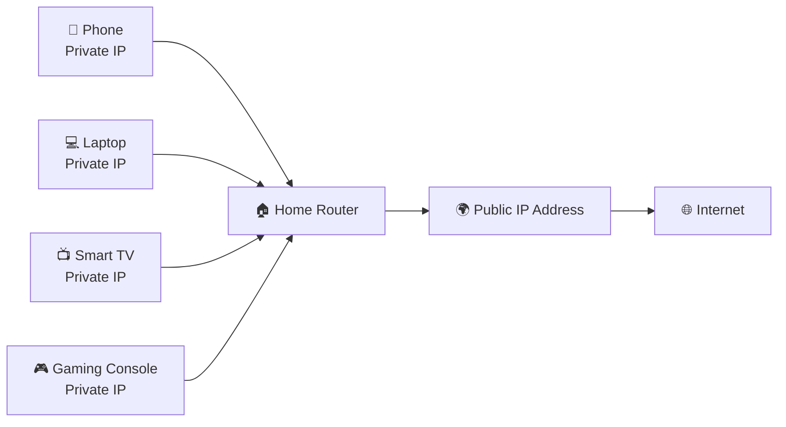

---

## 🔹 Why Can't Every Device Have a Public IP Address?

At first glance, giving every device its own public IP address might seem like the simplest solution.

However, there are several important challenges.

### 🌐 Limited IPv4 Address Space

IPv4 provides approximately **4.3 billion unique addresses**.

Although this sounds like a large number, the modern Internet contains:

- Billions of smartphones
- Billions of computers
- Smart TVs
- Gaming consoles
- IoT devices
- Security cameras
- Industrial control systems
- Cloud servers
- Connected vehicles

If every Internet-connected device required its own public IPv4 address, the available address space would quickly be exhausted—which is exactly what happened.

This limitation was one of the major reasons for developing **IPv6**, but IPv4 is still widely used today. As a result, public IPv4 addresses remain a valuable and limited resource.

---

## 🔹 A Better Solution

Instead of assigning every device a public IP address, modern networks use two types of addresses:

- 🌍 **Public IP Addresses** — Used to communicate across the Internet.
- 🏠 **Private IP Addresses** — Used for communication within local networks.

A router sits between these two worlds and uses **Network Address Translation (NAT)** to allow many private devices to share a single public IP address.

You'll explore NAT in detail later in this chapter, but for now, remember this simple idea:

> **Many devices inside a network can share one public identity when communicating with the Internet.**

---

> 💡 **Point to Remember**
>
> Public and private IP addresses were introduced to solve different problems. **Private IP addresses** make it possible for millions of devices to communicate within local networks, while **public IP addresses** provide globally unique identities that allow networks to communicate across the Internet.

---

> 🤓 **Did You Know?**
>
> A typical home today may contain **20 or more Internet-connected devices**, yet most Internet Service Providers assign **only one public IPv4 address** to the entire household. Technologies such as **Network Address Translation (NAT)** make this possible by allowing all of those devices to share the same public address when accessing the Internet.

---
# 🌐 What Is a Public IP Address?

A **Public IP Address** is an IP address that is **globally unique** and **reachable over the Internet**.

Unlike a private IP address, which is only valid inside a local network, a public IP address allows a device or an entire network to communicate with systems anywhere in the world.

Whenever you visit a website, send an email, join an online game, or connect to a cloud service, your Internet traffic leaves your local network through a **public IP address**.

In simple terms:

> **A public IP address is your network's identity on the Internet.**

---

## 🏠 A Real-World Analogy

Imagine you own a house.

Inside your home, every room has a unique purpose—bedroom, kitchen, living room—but these names only make sense to people inside the house.

If someone wants to deliver a package, however, they don't need to know the room names.

They only need the **house's street address**.

A **Public IP Address** works in exactly the same way.

- Your **private IP addresses** identify devices inside your network.
- Your **public IP address** identifies your entire network to the rest of the Internet.

Without a public IP address, other networks would have no way of finding your network.

---

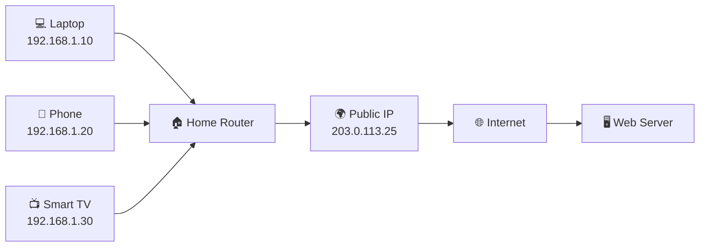

---

<!--
Image Description:
Create an educational illustration showing several home devices with private IP addresses connected to a router. The router has one public IP address that connects to the Internet and a web server. Clearly label the private network, router, public IP, and Internet.

Suggested Search Keywords:
public IP address home network
router public IP infographic
internet routing educational diagram
home router internet illustration

Suggested Filename:
Images/public_ip_overview.png
-->

<p align="center">

</p>

---

# 🔹 Characteristics of a Public IP Address

A Public IP Address has several important characteristics.

### 🌍 Globally Unique

Every public IP address must be unique across the Internet.

Two organizations cannot use the same public IP address at the same time because Internet routers would not know where to send data.

---

### 🌐 Internet Routable

Public IP addresses are advertised across the global Internet.

This allows routers around the world to determine the correct path for delivering packets to their destination.

---

### 🏢 Assigned by an Internet Service Provider (ISP)

Most individuals and businesses do not create their own public IP addresses.

Instead, they receive one or more public IP addresses from an **Internet Service Provider (ISP)**.

Examples of ISPs include:

- Local broadband providers
- Fiber Internet providers
- Mobile network operators
- Enterprise connectivity providers

The ISP allocates a public IP address to your modem or router, enabling communication with the Internet.

---

### 📡 Visible on the Internet

Whenever your network communicates with an external service, that service sees your **public IP address**.

For example, if you visit a website:

```
Your Laptop

↓

Home Router

↓

Public IP Address

↓

Website Server
```

The website does **not** see your private IP address.

Instead, it sees the public IP address assigned to your network.

---

## 🔹 Examples of Public IP Addresses

Examples:

```text
8.8.8.8
```

```text
1.1.1.1
```

```text
151.101.1.69
```

These are examples of publicly routable IPv4 addresses.

Similarly, IPv6 also supports globally routable public addresses, such as:

```text
2001:4860:4860::8888
```

These addresses can be reached from anywhere on the Internet, provided that routing and security policies allow access.

> **Note:** Some addresses you see in books and documentation (such as `203.0.113.0/24` or `2001:db8::/32`) are **reserved for documentation and examples**. They are not used as public Internet addresses in real-world networks.

---

## 🔹 How Does Your Device Use a Public IP?

Suppose you type the following into your browser:

```text
https://www.openai.com
```

Here's what happens:

1. Your laptop creates a request.
2. The request is sent to your home router.
3. The router forwards the request using your network's public IP address.
4. The request travels across the Internet.
5. The destination server sends the response back to your public IP.
6. Your router forwards the response to the correct device inside your home.

Although dozens of devices may share the same Internet connection, they can all communicate successfully because the router keeps track of which device initiated each connection.

---

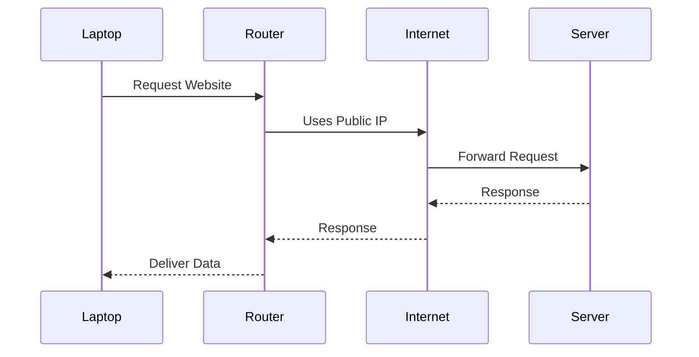

---

## 🌍 Where Are Public IP Addresses Used?

Public IP addresses are used by devices and services that need to communicate across the Internet.

Examples include:

- 🌐 Web servers
- ☁️ Cloud platforms
- 📧 Mail servers
- 🎮 Online gaming servers
- 🏢 Business Internet connections
- 🖥️ Public-facing APIs
- 📹 Internet-accessible security cameras (when configured appropriately)

Without public IP addresses, these services could not be reached by users outside their local networks.

---

> 💡 **Point to Remember**
>
> A **Public IP Address** is a globally unique address that allows a network or device to communicate across the Internet. It is typically assigned by an **Internet Service Provider (ISP)** and serves as the public identity of a network.

---

> 🤓 **Did You Know?**
>
> Many homes contain dozens of connected devices, but websites on the Internet usually see **only one public IP address**—the address assigned to the home's router. Behind the scenes, the router uses **Network Address Translation (NAT)** to ensure that responses are delivered to the correct device on the local network.

---

# 🏠 What Is a Private IP Address?

A **Private IP Address** is an IP address that is **used only within a local network** and **cannot be reached directly from the public Internet**.

Private IP addresses allow devices such as computers, smartphones, printers, security cameras, and smart TVs to communicate with one another inside a home, school, office, or enterprise network.

Unlike public IP addresses, private IP addresses **are not globally unique**. This means the same private IP address can be used in millions of different networks around the world without causing conflicts.

For example, your home router may assign your laptop the address:

```text
192.168.1.10
```

At the same time, another home in another country could also have a laptop using the exact same address:

```text
192.168.1.10
```

Because these devices are on **different private networks**, they never interfere with one another.

In simple terms:

> **A private IP address identifies a device within a local network, not on the Internet.**

---

## 🏠 A Real-World Analogy

Imagine a large hotel.

Every room has a room number:

- Room 101
- Room 205
- Room 312

Inside the hotel, these room numbers uniquely identify each guest room.

However, there are thousands of hotels around the world, and many of them also have a **Room 101**.

This doesn't cause any confusion because each hotel has its own unique street address.

Private IP addresses work the same way.

- 🏨 The **hotel** represents a local network.
- 🚪 The **room number** represents a private IP address.
- 📍 The **hotel's street address** represents the public IP address.

The Internet only needs to know the hotel's address—not every individual room.

---

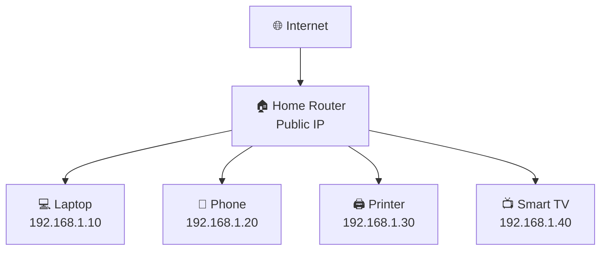

---

<!--
Image Description:
Create an educational illustration of a home network. Show a router connected to the Internet using one public IP address. Behind the router, display multiple devices (laptop, smartphone, printer, smart TV, gaming console) with different private IP addresses such as 192.168.1.x. Label the private network and the public Internet clearly.

Suggested Search Keywords:
private IP address home network
local network private IP infographic
router LAN educational illustration
computer networking LAN diagram

Suggested Filename:
Images/private_ip_home_network.png
-->

<p align="center">

</p>

---

# 🔹 Characteristics of a Private IP Address

Private IP addresses have several important characteristics that distinguish them from public IP addresses.

### 🏠 Used Only Inside Local Networks

Private IP addresses are intended for communication **within a local network**.

Examples include:

- Home Wi-Fi networks
- Office networks
- School and university campuses
- Corporate environments
- Data centers

Devices with private IP addresses can communicate freely with one another inside the same network.

---

### 🚫 Not Routable on the Internet

One of the most important characteristics of a private IP address is that **Internet routers do not forward traffic destined for private address ranges**.

If a packet containing a private destination address reaches the public Internet, routers will discard it because those address ranges are reserved for internal networks.

This prevents private networks from conflicting with one another across the Internet.

---

### 🔄 Reusable Across Millions of Networks

Unlike public IP addresses, private addresses **do not need to be globally unique**.

For example, all of the following networks can safely use:

```text
192.168.1.10
```

- Your home
- A school
- A hospital
- A university
- A company office

Since these networks are isolated from one another, identical private addresses do not create conflicts.

---

### 🤖 Usually Assigned Automatically

Most home and office networks use a service called **Dynamic Host Configuration Protocol (DHCP)** to assign private IP addresses automatically.

When a new device joins the network:

1. It connects to the router.
2. The router's DHCP service assigns an available private IP address.
3. The device is ready to communicate with other devices on the local network.

This process happens automatically, so users rarely need to configure IP addresses manually.

> **Note:** You'll learn about **DHCP** in detail later in the Networking module.

---

## 🌍 Where Are Private IP Addresses Used?

Private IP addresses are used anywhere devices need to communicate within an internal network.

Common examples include:

- 🏠 Home Wi-Fi networks
- 🏢 Office LANs
- 🏫 Schools and universities
- 🏥 Hospitals
- 🏭 Manufacturing facilities
- ☁️ Internal cloud networks
- 🖥️ Enterprise data centers

In all of these environments, private addresses allow devices to communicate efficiently without consuming scarce public IPv4 addresses.

---

## 🌐 Can a Device with a Private IP Access the Internet?

Yes—it can.

Although private IP addresses cannot be routed directly across the Internet, devices using them can still access websites, cloud services, and online applications.

How?

Through a technology called **Network Address Translation (NAT)**.

When your computer sends data to the Internet:

1. The packet leaves your device with a **private IP address**.
2. Your router replaces the private address with its **public IP address**.
3. The packet travels across the Internet.
4. When the response returns, the router translates the destination back to the correct private device.

We'll explore this process step by step in the upcoming **Introduction to NAT** section.

---

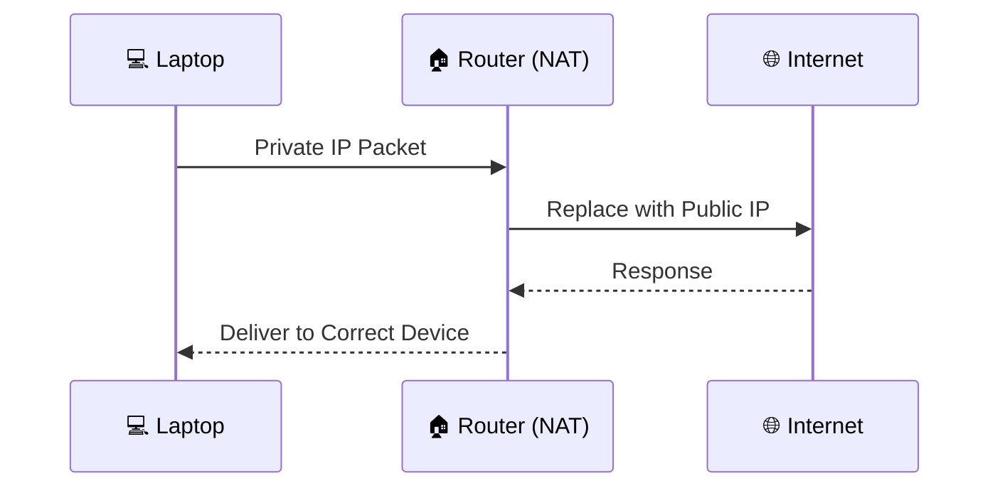

---

> 💡 **Point to Remember**
>
> A **Private IP Address** is designed for communication within a local network. It is **not reachable from the public Internet**, can be reused by millions of different networks, and relies on **Network Address Translation (NAT)** to access Internet resources.

---

> 🤓 **Did You Know?**
>
> Nearly every device in your home—your laptop, smartphone, smart TV, gaming console, printer, and even many smart appliances—uses a **private IP address**. Even though they all share a single Internet connection, each device can communicate independently because the router manages traffic using **NAT**.

---

# 📋 Private IPv4 Address Ranges (RFC 1918)

In the previous section, you learned that **Private IP addresses** are used inside local networks and cannot be routed directly across the Internet.

But which IP addresses are considered **private**?

The answer is defined by an Internet standard known as **RFC 1918**.

---

# 📖 What Is RFC 1918?

**RFC 1918** (Request for Comments 1918) is a standard published by the **Internet Engineering Task Force (IETF)** that reserves specific IPv4 address ranges for **private networks**.

These addresses are intended for internal communication only and are **not routable on the public Internet**.

Instead of every organization consuming valuable public IPv4 addresses, RFC 1918 allows homes, schools, businesses, and data centers to reuse the same private address ranges safely.

---

## 🎯 Why Was RFC 1918 Created?

As the Internet grew during the 1990s, it became clear that the available IPv4 address space would eventually run out.

Organizations often assigned public IP addresses to every computer, even if those devices never communicated directly with the Internet.

This wasted millions of globally unique addresses.

RFC 1918 solved this problem by introducing **private address ranges** that could be reused by anyone.

Today, almost every local network relies on these reserved ranges together with **Network Address Translation (NAT)**.

---


---

<!--
Image Description:
Create an educational infographic illustrating the IPv4 address shortage and how RFC 1918 solved the problem by introducing private address ranges. Show public IP exhaustion leading to private networks that reuse the same address ranges through NAT. Use modern networking icons and a clean blue theme.

Suggested Search Keywords:
RFC 1918 infographic
private IPv4 ranges educational diagram
IPv4 address exhaustion illustration
NAT private network visualization

Suggested Filename:
Images/rfc1918_overview.png
-->

<p align="center">

</p>

---

# 🏠 The Three Private IPv4 Address Ranges

RFC 1918 defines **three** private IPv4 address blocks.

| Address Range | Traditional Class | Number of Addresses | Common Usage |
|---------------|-------------------|--------------------:|--------------|
| **10.0.0.0 – 10.255.255.255** | Class A | 16,777,216 | Large enterprises, cloud environments, data centers |
| **172.16.0.0 – 172.31.255.255** | Class B | 1,048,576 | Medium-sized organizations |
| **192.168.0.0 – 192.168.255.255** | Class C | 65,536 | Homes, small businesses, offices |

> **Note:** The Class A, B, and C terminology comes from **classful networking**. Modern networks use **CIDR (Classless Inter-Domain Routing)** instead, but these labels are still commonly used to describe the RFC 1918 private ranges.

---

# 🏢 Range 1 — 10.0.0.0/8

```text
10.0.0.0
↓

10.255.255.255
```

This is the **largest** private IPv4 block.

Because it provides over **16 million addresses**, it is commonly used in:

- Large corporations
- Universities
- Cloud providers
- Government networks
- Enterprise data centers

Many organizations divide this large block into smaller subnets to organize departments, buildings, or services.

---

# 🏫 Range 2 — 172.16.0.0/12

```text
172.16.0.0
↓

172.31.255.255
```

This range provides approximately **one million addresses**.

It is often used by:

- Medium-sized businesses
- Educational institutions
- Healthcare organizations
- Corporate branch offices

Although smaller than the 10.0.0.0 range, it still supports very large internal networks.

---

# 🏠 Range 3 — 192.168.0.0/16

```text
192.168.0.0
↓

192.168.255.255
```

This is the most familiar private range for most people.

Home routers commonly assign addresses such as:

```text
192.168.0.x
```

or

```text
192.168.1.x
```

If you've ever viewed your computer's IP configuration at home, there's a good chance you've seen an address from this range.

---

# 🧠 Easy Memory Trick

You only need to remember **three numbers**:

```text
10

172

192
```

Then remember the limits:

| Begins With | Ends With |
|--------------|-----------|
| 10 | 10.255.255.255 |
| 172 | 172.16 → 172.31 |
| 192 | 192.168 |

A quick way to remember them is:

> **10 — 172 — 192**

If an IPv4 address starts with one of these prefixes (and falls within the valid range), it is likely a **private IP address**.

---

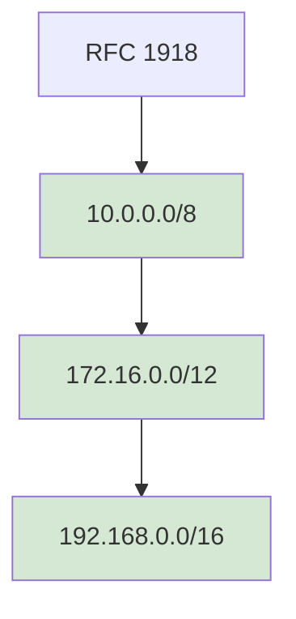

---

<!--
Image Description:
Create an educational comparison chart showing the three RFC 1918 private IPv4 address ranges. Use three colored blocks labeled 10.0.0.0/8, 172.16.0.0/12, and 192.168.0.0/16. Include icons representing enterprise, business, and home networks for each range.

Suggested Search Keywords:
RFC1918 address ranges infographic
private IP comparison chart
enterprise home network IP ranges
network addressing educational diagram

Suggested Filename:
Images/private_ipv4_ranges.png
-->

<p align="center">

</p>

---

# 🎯 Where Will You See These Addresses?

As a networking or cybersecurity professional, you'll encounter these ranges almost every day.

Examples include:

- 🏠 Home Wi-Fi routers (`192.168.x.x`)
- 🏢 Corporate office networks (`10.x.x.x`)
- ☁️ Cloud virtual networks (`10.x.x.x`)
- 🏫 University campuses (`172.16.x.x`)
- 🏥 Hospital networks
- 🏭 Industrial control systems
- 🖥️ Virtual machines and lab environments

Recognizing these ranges immediately helps you determine whether a device is using a **private** or **public** IPv4 address.

---

> 💡 **Point to Remember**
>
> RFC 1918 reserves **three IPv4 address ranges** for private use. These addresses can be reused by millions of independent networks because they are **never routed across the public Internet**.

---

> 🤓 **Did You Know?**
>
> The address **192.168.1.1** is one of the most common default gateway addresses used by home routers around the world. Although millions of routers use this address, there is no conflict because each router exists within its own separate private network.

---

# 🔄 How Public and Private IP Addresses Work Together

By now, you understand that:

- 🌍 **Public IP addresses** are used to communicate across the Internet.
- 🏠 **Private IP addresses** are used for communication inside local networks.

This raises an important question:

> **If private IP addresses cannot travel across the Internet, how can your laptop still open websites like Google, YouTube, or GitHub?**

The answer lies in the cooperation between your **local network**, your **router**, your **Internet Service Provider (ISP)**, and the **Internet** itself.

Let's follow the journey of a single packet.

---

# 🏠 Step 1 — Your Device Creates a Request

Imagine you're sitting at home using your laptop.

Your laptop has the following IP address:

```text
192.168.1.10
```

This is a **private IP address**.

Now you type:

```text
https://www.github.com
```

into your web browser.

Your laptop creates a network packet requesting the GitHub website.

At this moment, the packet looks something like this:

```text
Source IP:
192.168.1.10

Destination:
github.com
```

Since your laptop only knows about the local network, it sends the packet to the **default gateway**—your home router.

---

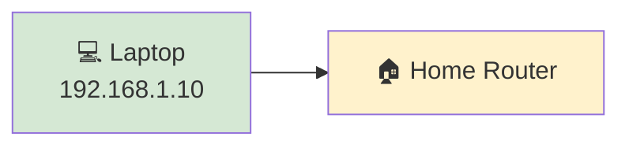

---

# 🌐 Step 2 — The Router Receives the Packet

The router examines the packet and notices something important:

- The destination is **outside the local network**.
- The packet must travel across the Internet.

However, Internet routers will **not forward packets containing private IPv4 addresses** such as:

```text
192.168.x.x
```

or

```text
10.x.x.x
```

or

```text
172.16.x.x
```

Before forwarding the packet, the router must prepare it for Internet communication.

This preparation involves a technology called **Network Address Translation (NAT)**, which you'll study in the next section.

For now, simply understand that the router acts as a translator between your private network and the public Internet.

---

# 🌍 Step 3 — The Packet Leaves Your Home

After preparing the packet, the router forwards it using the network's **public IP address**.

Instead of seeing:

```text
192.168.1.10
```

the Internet now sees something like:

```text
203.0.113.25
```

This public IP address represents your **entire home network**.

From the Internet's perspective, the request appears to come from a single device—even though there may be dozens of devices connected behind the router.

---

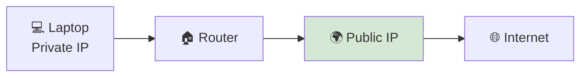

---

<!--
Image Description:
Illustrate a home router receiving packets from several devices with private IP addresses and forwarding them to the Internet using a single public IP address. Show arrows indicating packet flow and label the router as the connection point between the LAN and the Internet.

Suggested Search Keywords:
packet flow home router
public private IP packet journey
router internet communication infographic

Suggested Filename:
Images/public_private_packet_flow.png
-->

<p align="center">

</p>

---

# 🌐 Step 4 — Traveling Across the Internet

Once the packet reaches the Internet, it travels through multiple routers owned by Internet Service Providers and backbone networks.

Each router examines the destination address and forwards the packet toward the correct server.

This process continues until the packet reaches GitHub's web server.

```text
Home Router

↓

ISP

↓

Regional Router

↓

Internet Backbone

↓

GitHub Server
```

Every router along the way makes forwarding decisions based on the packet's **public destination information**.

---

# 🖥️ Step 5 — The Server Responds

GitHub receives the request and prepares a response.

The response is sent back to the same **public IP address** that initiated the request.

```text
GitHub Server

↓

Internet

↓

203.0.113.25
```

Notice something important.

The server has **no knowledge of your laptop's private IP address**.

It only knows the public IP address of your home network.

---

# 🏠 Step 6 — The Router Delivers the Response

When the response arrives at your router, the router determines which device originally requested the information.

It then forwards the response to:

```text
192.168.1.10
```

Your laptop receives the webpage and displays it in your browser.

To you, everything happens almost instantly.

Behind the scenes, however, multiple networking technologies have worked together to make this communication possible.

---

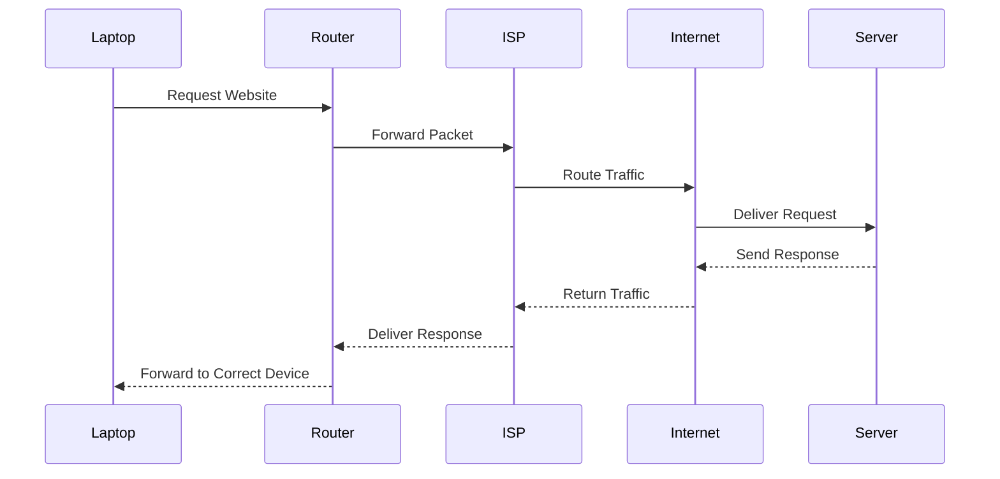

---

# 🎯 Bringing It All Together

The entire communication process can be summarized like this:

```text
💻 Laptop
(Private IP)

        │

        ▼

🏠 Home Router

        │

        ▼

🌍 Public IP Address

        │

        ▼

🌐 Internet

        │

        ▼

🖥️ Website or Cloud Server

        │

        ▼

🌍 Public IP

        │

        ▼

🏠 Router

        │

        ▼

💻 Laptop
```

Although the communication appears simple to the user, it involves cooperation between:

- Your device
- Your local network
- Your router
- Your Internet Service Provider
- Internet backbone routers
- The destination server

---

> 💡 **Point to Remember**
>
> Devices with **private IP addresses** do not communicate directly with the Internet. Instead, they send their traffic to a **router**, which acts as the gateway between the private network and the public Internet. This allows multiple devices to share a single public IP address while maintaining communication with external services.

---

> 🤓 **Did You Know?**
>
> Every time you open a website, dozens—or even hundreds—of packets travel between your device and remote servers. Each packet follows a similar journey through routers, ISPs, and the Internet before reaching its destination, often in just a fraction of a second.

---

# 🚪 Introduction to Network Address Translation (NAT)

In the previous section, you followed the journey of a packet as it traveled from your laptop to a website on the Internet.

One question, however, remains unanswered.

> **If your laptop uses a private IP address that cannot travel across the Internet, how does the website know where to send its response?**

The answer is **Network Address Translation (NAT).**

NAT is one of the most important technologies in modern networking. Without it, the IPv4 Internet would have exhausted its available addresses many years ago.

Today, nearly every home, office, university, and enterprise network relies on NAT to allow multiple devices to share a single public IP address.

---

# 📖 What Is NAT?

**Network Address Translation (NAT)** is a networking technology that allows a router or firewall to translate **private IP addresses** into **public IP addresses**, and vice versa.

In simple terms:

> **NAT acts as a translator between a private network and the public Internet.**

When a device inside your network sends data to the Internet, the router replaces the device's private IP address with the router's public IP address.

When the response comes back, the router reverses the translation and forwards the data to the correct device.

The process is completely transparent to the user.

---

## 🏢 A Real-World Analogy

Imagine a large company.

Inside the company:

- Every employee has their own desk number.
- Employees communicate internally using those desk numbers.

However, people outside the company don't know those desk numbers.

Instead, they call the company's **main reception number**.

The receptionist receives the call and forwards it to the correct employee.

When the employee replies, the response goes back through the receptionist.

```text
Visitor

↓

Reception Desk

↓

Employee
```

The receptionist acts as a translator between the outside world and the company's internal offices.

A router performing NAT works in exactly the same way.

---


---

<!--
Image Description:
Create an educational infographic showing a router labeled "NAT" sitting between a private home network and the public Internet. Multiple devices with private IP addresses connect to the router, while only one public IP address connects to the Internet. Use arrows to illustrate address translation.

Suggested Search Keywords:
NAT router infographic
network address translation diagram
private to public IP illustration
NAT educational networking diagram

Suggested Filename:
Images/nat_overview.png
-->

<p align="center">

</p>

---

# 🔄 How NAT Works

Let's follow a real example.

Suppose your laptop has the following private IP address:

```text
192.168.1.10
```

Your home router has this public IP:

```text
203.0.113.25
```

Now you open:

```text
https://github.com
```

---

## Step 1 — Laptop Creates a Packet

```text
Source IP:
192.168.1.10

Destination:
GitHub Server
```

The packet reaches the router.

---

## Step 2 — NAT Performs Translation

Before forwarding the packet, the router changes the source address.

### Before NAT

```text
Source:
192.168.1.10
```

↓

### After NAT

```text
Source:
203.0.113.25
```

Now the packet can travel across the public Internet.

---

## Step 3 — The Server Replies

GitHub receives the request.

The server believes the request came from:

```text
203.0.113.25
```

It sends the response back to that address.

---

## Step 4 — Router Reverses the Translation

When the response reaches your router, NAT checks its translation table.

The router remembers:

```text
203.0.113.25

↓

192.168.1.10
```

The packet is then forwarded to your laptop.

Everything happens automatically within milliseconds.

---

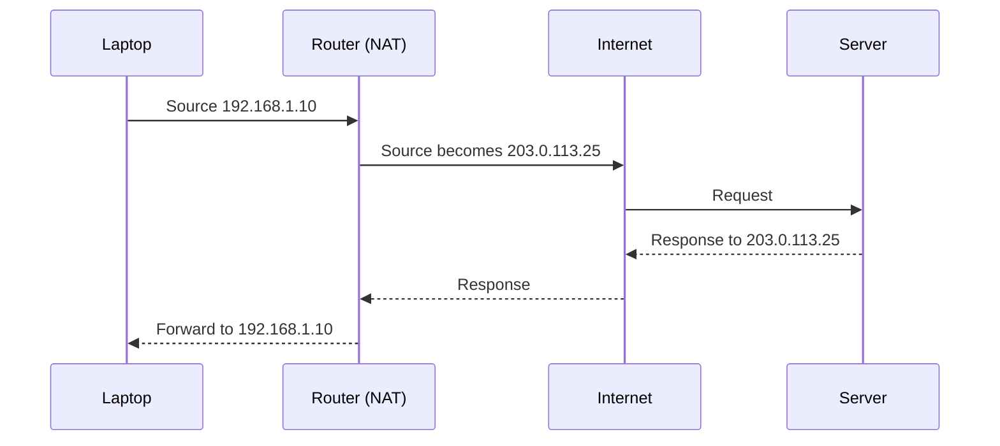

---

# 📊 Why Is NAT Important?

NAT provides several major benefits.

| Benefit | Explanation |
|----------|-------------|
| 🌍 Conserves IPv4 Addresses | Many devices share one public IP address. |
| 💰 Reduces Costs | Organizations require fewer public IPv4 addresses from their ISP. |
| 📈 Improves Scalability | Thousands of internal devices can access the Internet simultaneously. |
| 🏠 Simplifies Home Networking | Families can connect many devices through one Internet connection. |
| 🏢 Supports Enterprise Networks | Large organizations can build massive private networks efficiently. |

---

# ⚠️ Common Misconception

Many people believe:

> **"NAT is a firewall."**

This is **not correct**.

NAT performs **address translation**.

A **firewall** performs **traffic filtering and security enforcement**.

Although NAT can make internal devices less directly reachable from the Internet, it **does not inspect traffic, enforce security policies, or replace a properly configured firewall**.

---

## 🛡️ Cybersecurity Perspective

From a cybersecurity standpoint, NAT provides an additional layer of separation between internal devices and the public Internet.

For example:

- Attackers scanning your public IP cannot directly see the private IP addresses assigned to devices inside your network.
- Internal addressing schemes remain hidden from external users.
- Incoming connections generally require explicit configuration (such as port forwarding) before they can reach internal devices.

However, this should **not** be confused with security.

A vulnerable service exposed through NAT can still be attacked if it is reachable from the Internet.

Cybersecurity professionals should view NAT as an **address conservation and translation technology**, not as a standalone security control.

True network security relies on technologies such as:

- 🔥 Firewalls
- 🛡️ Intrusion Detection and Prevention Systems (IDS/IPS)
- 🔐 Access Control Lists (ACLs)
- 🔑 Strong authentication
- 📊 Continuous monitoring and logging

---

> 💡 **Point to Remember**
>
> **NAT translates IP addresses—it does not replace security controls.** While NAT helps conserve IPv4 addresses and limits direct exposure of internal devices, organizations still need firewalls and other security mechanisms to protect their networks.

---

> 🤓 **Did You Know?**
>
> Every time multiple devices in your home browse the Internet simultaneously, your router may be managing hundreds or even thousands of active NAT translations. This process happens so quickly that users rarely notice it, even during activities like streaming, gaming, or video conferencing.

---

# ⚖️ Public IP vs Private IP

Now that you've learned about **Public IP Addresses**, **Private IP Addresses**, and **Network Address Translation (NAT)**, let's compare them side by side.

Although both are Internet Protocol addresses, they serve very different purposes within modern networks.

Understanding these differences is essential for networking, cloud computing, system administration, and cybersecurity.

---

## 📊 Public IP vs Private IP Comparison

| Feature | 🌍 Public IP Address | 🏠 Private IP Address |
|----------|----------------------|-----------------------|
| **Purpose** | Identifies a network or device on the Internet | Identifies devices within a local network |
| **Visibility** | Visible across the Internet | Visible only inside the local network |
| **Uniqueness** | Must be globally unique | Can be reused in millions of networks |
| **Assigned By** | Internet Service Provider (ISP) or Regional Internet Registry | Router or DHCP Server |
| **Internet Access** | Directly reachable from the Internet | Cannot be reached directly from the Internet |
| **Routable** | Yes | No |
| **Address Conservation** | Limited IPv4 addresses | Reusable address space |
| **Examples** | `8.8.8.8`, `1.1.1.1` | `192.168.1.10`, `10.0.0.15` |
| **Common Users** | Websites, cloud servers, businesses | Homes, offices, schools, enterprises |
| **Security Exposure** | Higher, because the address is publicly reachable | Lower, because the address is hidden behind NAT |
| **Translation Required** | No | Yes, via NAT for Internet communication |
| **Typical Quantity** | Usually one or a few per network | Potentially hundreds or thousands per network |

---

## 🖼️ Visual Comparison

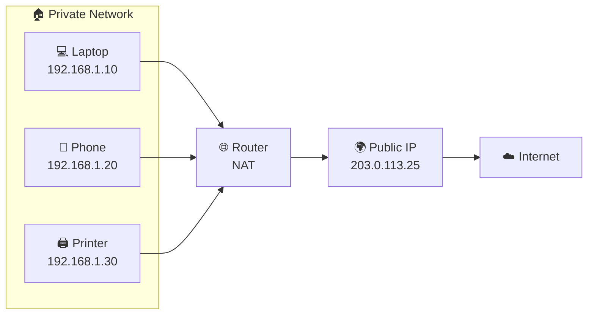

---

<!--
Image Description:
Create a side-by-side infographic comparing Public IP Addresses and Private IP Addresses. On the left, show a public IP connected directly to the Internet. On the right, show multiple devices with private IP addresses behind a router using NAT. Include icons for laptops, phones, routers, and cloud services with a clean educational style.

Suggested Search Keywords:
public vs private IP comparison infographic
NAT comparison educational diagram
public private networking illustration

Suggested Filename:
Images/public_vs_private_comparison.png
-->

<p align="center">

</p>

---

# 🌍 Real-World Example

Imagine a family with the following devices connected to their home Wi-Fi:

| Device | Private IP Address |
|----------|--------------------|
| 💻 Laptop | 192.168.1.10 |
| 📱 Smartphone | 192.168.1.20 |
| 📺 Smart TV | 192.168.1.30 |
| 🎮 Gaming Console | 192.168.1.40 |
| 🖨️ Printer | 192.168.1.50 |

Although five different devices are connected to the network, the Internet only sees one address:

```text
203.0.113.25
```

This single **public IP address** represents the entire home network.

Whenever one of these devices accesses a website, the router uses **Network Address Translation (NAT)** to translate the device's private IP into the shared public IP.

---

# 📌 When Will You Encounter Each Type?

### 🌍 Public IP Addresses

You'll commonly find public IP addresses on:

- Web servers
- Cloud services
- Business Internet connections
- VPN gateways
- Email servers
- Public APIs
- Internet-facing firewalls

---

### 🏠 Private IP Addresses

You'll commonly find private IP addresses on:

- Personal computers
- Smartphones
- Printers
- Security cameras
- Smart TVs
- IoT devices
- Office workstations
- Internal servers

---

## 🛡️ Cybersecurity Perspective

One of the first tasks during a penetration test or security assessment is determining whether a target system has a **public** or **private** IP address.

Why?

- 🌍 A **public IP address** may be accessible from anywhere on the Internet and therefore requires strong security controls.
- 🏠 A **private IP address** is normally accessible only from within the internal network unless special configurations, such as VPNs or port forwarding, are in place.

Security professionals use this information to understand:

- The network's attack surface.
- Which systems are Internet-facing.
- Which devices are protected behind routers and firewalls.
- How network segmentation has been implemented.

Recognizing the difference between public and private addressing is often one of the first steps in network reconnaissance.

---

> 💡 **Point to Remember**
>
> A **public IP address** identifies your network on the Internet, while a **private IP address** identifies individual devices within your local network. Together, with the help of **NAT**, they enable billions of devices to communicate efficiently despite the limited IPv4 address space.

---

> 🤓 **Did You Know?**
>
> Large organizations may operate thousands of devices using private IP addresses while exposing only a handful of public IP addresses to the Internet. This design simplifies network management, conserves IPv4 addresses, and reduces the number of systems directly accessible from outside the organization.

---
# 🌎 Real-World Examples

Understanding the difference between **Public** and **Private** IP addresses becomes much easier when you see how they are used in real environments.

Whether you're using Wi-Fi at home, working in an office, deploying cloud infrastructure, or managing an enterprise network, you'll encounter both types of IP addresses every day.

Let's explore some common real-world scenarios.

---

# 🏠 Example 1 — Home Wi-Fi Network

A typical home network contains multiple Internet-connected devices.

For example:

- 💻 Laptop
- 📱 Smartphone
- 📺 Smart TV
- 🎮 Gaming Console
- 🖨️ Printer
- 📷 Security Camera

Each device receives its own **private IP address** from the home router.

| Device | Private IP |
|----------|------------|
| Laptop | 192.168.1.10 |
| Smartphone | 192.168.1.20 |
| Smart TV | 192.168.1.30 |
| Gaming Console | 192.168.1.40 |
| Printer | 192.168.1.50 |

Although there are many devices, the ISP usually assigns **only one public IP address** to the router.

```text
Public IP

203.0.113.25
```

Whenever any device accesses the Internet, the router performs **Network Address Translation (NAT)** and sends the traffic using the shared public IP address.

---

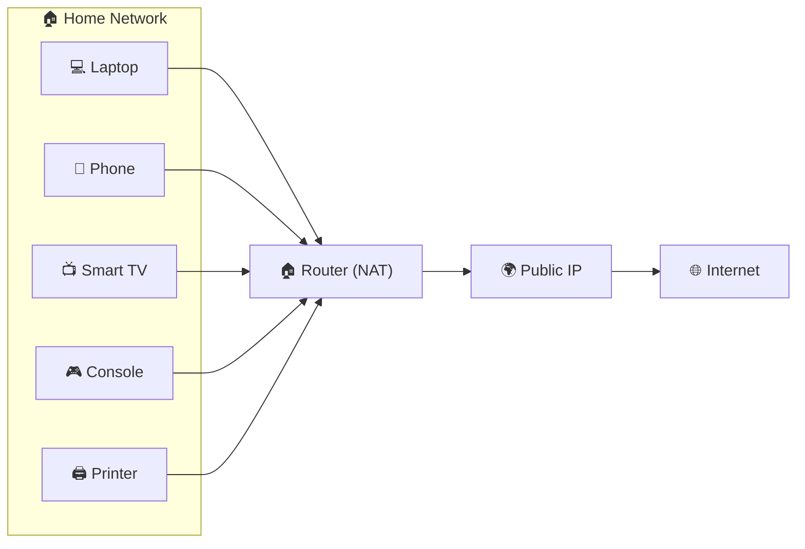

---

<!--
Image Description:
Create a home networking illustration showing multiple devices connected to a Wi-Fi router. Label each device with a private IP address and show the router using one public IP address to connect to the Internet.

Suggested Filename:
Images/home_network_example.png
-->

<p align="center">

</p>

---

# 🏢 Example 2 — Corporate Office Network

A medium-sized company may have:

- Hundreds of employee computers
- Printers
- VoIP phones
- File servers
- Internal applications
- Security cameras

Every device receives a **private IP address**.

Instead of exposing every computer directly to the Internet, the company's firewall or edge router performs **NAT**, allowing employees to browse the web through a small number of public IP addresses.

This approach:

- Conserves IPv4 addresses
- Simplifies network management
- Reduces direct Internet exposure

---

```text
500 Internal Devices

↓

Private IP Addresses

↓

Firewall / Router

↓

5 Public IP Addresses

↓

Internet
```

---

# 🏫 Example 3 — University Campus

A university network may contain:

- Student labs
- Faculty offices
- Libraries
- Dormitories
- Research centers
- Administrative departments

Thousands of devices communicate internally using private IP addresses.

Only selected services, such as:

- University Website
- Student Portal
- Email Server

need public IP addresses so students and staff can access them from anywhere.

This design improves scalability while keeping internal systems protected.

---

# ☁️ Example 4 — Cloud Infrastructure

Cloud providers such as AWS, Microsoft Azure, and Google Cloud also use both public and private IP addresses.

For example:

- Application servers often communicate using **private IP addresses**.
- Public-facing web servers receive **public IP addresses** so users can access websites.
- Databases typically remain on private networks and are not directly reachable from the Internet.

This architecture reduces unnecessary exposure while allowing Internet users to access the services they need.

---

```mermaid
flowchart TD

Users["🌐 Internet Users"]

↓

Web["🌍 Public Web Server"]

↓

App["🏢 Application Server
Private IP"]

↓

DB["🗄️ Database
Private IP"]
```

---

# 🏥 Example 5 — Hospital Network

Hospitals rely heavily on private networks.

Devices such as:

- Patient monitoring systems
- Medical imaging equipment
- Electronic Health Record (EHR) servers
- Pharmacy systems
- Staff computers

communicate using private IP addresses.

Only carefully selected services, such as secure patient portals or remote access gateways, are assigned public IP addresses.

This minimizes the exposure of sensitive medical systems to the Internet.

---

# 🏭 Example 6 — Industrial Networks

Factories and industrial facilities often use private IP addresses for:

- PLCs (Programmable Logic Controllers)
- SCADA systems
- Industrial sensors
- Manufacturing robots
- Monitoring stations

These systems are typically isolated from the public Internet to improve reliability and reduce cybersecurity risks.

When remote access is required, organizations commonly use secure technologies such as **VPNs**, rather than exposing industrial devices directly to public IP addresses.

---

# 🛡️ Cybersecurity Perspective

One of the first things a cybersecurity analyst does during a network assessment is identify which systems are **publicly accessible** and which are **internal-only**.

Why is this important?

Because Internet-facing systems are much more likely to be targeted by attackers.

Examples include:

- Public websites
- VPN gateways
- Email servers
- DNS servers
- Cloud applications

Internal systems, on the other hand, often communicate only through private IP addresses and are protected by routers, firewalls, and network segmentation.

Understanding where public and private IP addresses are used helps security professionals:

- Identify the organization's attack surface.
- Reduce unnecessary Internet exposure.
- Design secure network architectures.
- Protect sensitive internal resources.

---

> 💡 **Point to Remember**
>
> Almost every modern network—from a small home Wi-Fi setup to a global cloud provider—uses **both public and private IP addresses**. Public IP addresses provide connectivity to the Internet, while private IP addresses allow secure and efficient communication within local networks.

---

> 🤓 **Did You Know?**
>
> Large enterprises may have **tens of thousands of devices** using private IP addresses while exposing only a small number of carefully protected public IP addresses. This architecture improves scalability, conserves IPv4 addresses, and significantly reduces the organization's external attack surface.

---


# 💻 Mini Lab — Explore Your Own Network

Reading about IP addresses is helpful, but seeing them on **your own computer** makes the concepts much easier to understand.

In this mini lab, you'll identify your device's **private IP address**, **default gateway**, and **public IP address**, then compare them to understand how your network communicates with the Internet.

> **🎯 Goal:** Learn to identify the different IP addresses used by your own device and understand why they are different.

---

# 🧪 Lab 1 — Find Your Private IP Address

Your **private IP address** is assigned by your router and is only used within your local network.

Choose the instructions for your operating system.

---

## 🪟 Windows

1. Press **Windows + R**
2. Type:

```text
cmd
```

3. Press **Enter**
4. Run the following command:

```powershell
ipconfig
```

Look for:

```text
IPv4 Address . . . . . . . . : 192.168.1.25
```

That is your **private IPv4 address**.

---

## 🐧 Linux

Open a terminal and run:

```bash
ip addr
```

or

```bash
hostname -I
```

Locate an address similar to:

```text
192.168.x.x

or

10.x.x.x
```

---

## 🍎 macOS

Open **Terminal** and run:

```bash
ifconfig
```

or

```bash
ipconfig getifaddr en0
```

Look for your IPv4 address.

---

> **📝 Write Your Result**

| Item | Your Value |
|------|------------|
| Private IP Address | __________________ |

---

# 🧪 Lab 2 — Find Your Default Gateway

Your **Default Gateway** is normally your router.

On Windows, run:

```powershell
ipconfig
```

Look for:

```text
Default Gateway . . . . . . : 192.168.1.1
```

On Linux:

```bash
ip route
```

On macOS:

```bash
netstat -nr
```

or

```bash
route get default
```

---

> **📝 Write Your Result**

| Item | Your Value |
|------|------------|
| Default Gateway | __________________ |

---

# 🧪 Lab 3 — Find Your Public IP Address

Unlike your private IP address, your **public IP address** is visible to websites and Internet services.

Visit one of the following websites using your browser:

- https://whatismyipaddress.com
- https://ifconfig.me
- https://icanhazip.com

Your browser will display something similar to:

```text
203.0.113.25
```

This is your **public IP address**.

---

> **📝 Write Your Result**

| Item | Your Value |
|------|------------|
| Public IP Address | __________________ |

---

# 🧪 Lab 4 — Compare the Results

Compare the values you collected.

| Network Information | Example |
|---------------------|----------|
| Private IP | 192.168.1.25 |
| Default Gateway | 192.168.1.1 |
| Public IP | 203.0.113.25 |

Ask yourself:

- Are the private and public IP addresses the same?
- Why are they different?
- Which address does the Internet actually see?
- Which device owns the public IP address?

If you answered:

> "The router owns the public IP address while my computer uses a private IP address."

then you've understood one of the most important concepts in networking.

---

# 🧪 Lab 5 — Identify Your Private Address Range

Look at your private IP address.

Which RFC 1918 range does it belong to?

| If Your Address Starts With | Private Range |
|-----------------------------|---------------|
| 10.x.x.x | 10.0.0.0/8 |
| 172.16–31.x.x | 172.16.0.0/12 |
| 192.168.x.x | 192.168.0.0/16 |

Write your answer:

```text
My device belongs to:

□ 10.0.0.0/8

□ 172.16.0.0/12

□ 192.168.0.0/16
```

---

# 🧪 Lab 6 — Draw Your Own Network

Using the information you've collected, draw a simple diagram of your home network.

```text
        🌐 Internet
              │
              │
      Public IP Address
              │
              ▼
      ┌─────────────────┐
      │  Home Router    │
      │ Default Gateway │
      └─────────────────┘
         │      │      │
         │      │      │
   Laptop  Phone  Smart TV
   Private Private Private
      IP      IP      IP
```

Try replacing the labels with the actual IP addresses you discovered during the lab.

---

# 🎯 Lab Challenge

Without looking back at the chapter, answer the following questions.

1. What is the purpose of a private IP address?
2. Why can't private IP addresses be routed on the Internet?
3. What device normally owns the public IP address in a home network?
4. What technology allows multiple devices to share one public IP address?
5. Name the three private IPv4 address ranges defined by RFC 1918.
6. Which IP address does a website see when you visit it—your private IP or your public IP?
7. Can two different homes both have a device with the private IP address **192.168.1.10**? Why?
8. Why is NAT important for IPv4?

---

> 💡 **Lab Summary**
>
> In this lab, you explored your own network by identifying your **private IP address**, **default gateway**, and **public IP address**. You also observed how a home router connects a private network to the Internet using **Network Address Translation (NAT)**. This practical exercise reinforces the concepts introduced throughout this chapter and prepares you for more advanced networking topics.


# 🧠 Quick Check

Take a few minutes to answer the following questions without looking back at the lesson.

These questions are intended to reinforce the key concepts you've just learned. If you're unsure about an answer, revisit the relevant section before continuing.

---

## Question 1

**What is the primary purpose of a Public IP Address?**

<details>
<summary><strong>✅ Show Answer</strong></summary>

A **Public IP Address** uniquely identifies a device or network on the Internet and allows it to communicate with other networks worldwide.

</details>

---

## Question 2

**What is the primary purpose of a Private IP Address?**

<details>
<summary><strong>✅ Show Answer</strong></summary>

A **Private IP Address** identifies devices within a local network and is used for internal communication. It cannot be reached directly from the public Internet.

</details>

---

## Question 3

**Who typically assigns a Public IP Address?**

<details>
<summary><strong>✅ Show Answer</strong></summary>

A Public IP Address is usually assigned by an **Internet Service Provider (ISP)**.

</details>

---

## Question 4

**Which device usually assigns Private IP Addresses in a home network?**

<details>
<summary><strong>✅ Show Answer</strong></summary>

The **router**, using a **DHCP (Dynamic Host Configuration Protocol)** service, typically assigns private IP addresses automatically.

</details>

---

## Question 5

**Which technology allows multiple devices to share a single Public IP Address?**

<details>
<summary><strong>✅ Show Answer</strong></summary>

**Network Address Translation (NAT)** allows multiple private devices to share one public IP address.

</details>

---

## Question 6

**Which of the following is a Private IPv4 Address?**

A. `8.8.8.8`

B. `192.168.1.25`

C. `151.101.1.69`

D. `1.1.1.1`

<details>
<summary><strong>✅ Show Answer</strong></summary>

✅ **B. 192.168.1.25**

This address belongs to the **192.168.0.0/16** private address range defined by RFC 1918.

</details>

---

## Question 7

**Name the three Private IPv4 address ranges defined by RFC 1918.**

<details>
<summary><strong>✅ Show Answer</strong></summary>

The three private IPv4 ranges are:

- **10.0.0.0 – 10.255.255.255**
- **172.16.0.0 – 172.31.255.255**
- **192.168.0.0 – 192.168.255.255**

</details>

---

## Question 8

**True or False?**

> A device with a private IP address can communicate directly with a web server on the Internet without NAT.

<details>
<summary><strong>✅ Show Answer</strong></summary>

❌ **False**

Private IP addresses are **not routable on the Internet**. They require **Network Address Translation (NAT)** to communicate with public Internet services.

</details>

---

## Question 9

**Which IP address does a website normally see when you visit it?**

<details>
<summary><strong>✅ Show Answer</strong></summary>

A website normally sees your **Public IP Address**, not your device's private IP address.

</details>

---

## Question 10

**Can two different homes both use the private IP address `192.168.1.10`?**

<details>
<summary><strong>✅ Show Answer</strong></summary>

✅ **Yes**

Private IP addresses are not globally unique and can be reused in millions of separate local networks without causing conflicts.

</details>

---

## 🎯 Quick Self-Assessment

How did you do?

| Score | Progress |
|--------|----------|
| **9–10 Correct** | 🟢 Excellent! You have a strong understanding of public and private IP addressing. |
| **7–8 Correct** | 🟡 Good work! Review the concepts you missed before moving on. |
| **5–6 Correct** | 🟠 You're making good progress, but another review will strengthen your understanding. |
| **Below 5** | 🔴 Revisit the chapter, especially the sections on RFC 1918, NAT, and the differences between public and private IP addresses. |

---

> 💡 **Tip**
>
> Before moving to the **Knowledge Check**, make sure you can explain the difference between **Public** and **Private** IP addresses in your own words. If you can teach the concept to someone else, you've truly understood it.

---

# 📖 Knowledge Check

The following scenarios are designed to test your understanding of **Public IP Addresses**, **Private IP Addresses**, and **Network Address Translation (NAT)**.

Read each scenario carefully before revealing the answer.

---

# 🌍 Scenario 1 — Home Internet Connection

Sarah has the following devices connected to her home Wi-Fi:

- 💻 Laptop
- 📱 Smartphone
- 📺 Smart TV
- 🎮 Gaming Console

All of them can browse the Internet successfully.

### ❓ Question

Does each device need its own Public IP Address?

<details>

<summary><strong>✅ Show Answer</strong></summary>

**No.**

The devices use **private IP addresses** inside the home network.

The home router performs **Network Address Translation (NAT)**, allowing all devices to share a **single public IP address** when communicating with the Internet.

</details>

---

# 🏢 Scenario 2 — Company Expansion

A company grows from 100 computers to over 2,000 computers.

The network administrator wants every computer to communicate internally without purchasing thousands of public IPv4 addresses.

### ❓ Question

Which type of IP address should the administrator assign to employee computers?

<details>

<summary><strong>✅ Show Answer</strong></summary>

Employee computers should receive **private IP addresses**.

Only Internet-facing services and edge devices require public IP addresses.

Using private addresses conserves IPv4 space and reduces costs.

</details>

---

# 🌐 Scenario 3 — Visiting a Website

Your laptop has the following address:

```text
192.168.1.15
```

You visit:

```text
https://www.github.com
```

### ❓ Question

Will GitHub see:

A. `192.168.1.15`

or

B. Your router's Public IP Address?

<details>

<summary><strong>✅ Show Answer</strong></summary>

✅ **B**

GitHub sees your **Public IP Address**.

Your router translates your laptop's private address into its public address before sending the request.

</details>

---

# 🔄 Scenario 4 — Identifying Address Types

Classify the following addresses.

| Address | Public or Private? |
|----------|-------------------|
| 10.25.5.8 | ______ |
| 172.20.8.50 | ______ |
| 8.8.8.8 | ______ |
| 192.168.50.12 | ______ |
| 1.1.1.1 | ______ |

<details>

<summary><strong>✅ Show Answer</strong></summary>

| Address | Type |
|----------|------|
| 10.25.5.8 | Private |
| 172.20.8.50 | Private |
| 8.8.8.8 | Public |
| 192.168.50.12 | Private |
| 1.1.1.1 | Public |

</details>

---

# 🛠️ Scenario 5 — Router Replacement

A home router fails and is replaced with a new one.

The ISP assigns the new router a different Public IP Address.

The laptops, phones, and printers inside the home continue using the same private IP addresses.

### ❓ Question

Which address changed?

<details>

<summary><strong>✅ Show Answer</strong></summary>

The **Public IP Address** changed.

The private IP addresses assigned by the router can remain the same.

</details>

---

# 🏥 Scenario 6 — Hospital Network

A hospital has thousands of internal medical devices.

The IT department wants to prevent these devices from being directly accessible from the Internet.

### ❓ Question

Should the medical devices use Public or Private IP Addresses?

<details>

<summary><strong>✅ Show Answer</strong></summary>

They should use **Private IP Addresses**.

Only carefully controlled public-facing services should use Public IP Addresses.

This reduces unnecessary Internet exposure and improves network security.

</details>

---

# ☁️ Scenario 7 — Cloud Architecture

A company hosts its application in the cloud.

The architecture looks like this:

```text
Internet

↓

Web Server

↓

Application Server

↓

Database
```

### ❓ Question

Which systems typically require Public IP Addresses?

<details>

<summary><strong>✅ Show Answer</strong></summary>

Usually only the **Web Server** requires a Public IP Address.

The **Application Server** and **Database** normally use Private IP Addresses and communicate within the cloud's private network.

</details>

---

# 🛡️ Scenario 8 — Security Assessment

During a penetration test, you discover a server with the address:

```text
192.168.10.15
```

### ❓ Question

Can an attacker on the public Internet normally connect directly to this address?

<details>

<summary><strong>✅ Show Answer</strong></summary>

No.

**192.168.10.15** is a **Private IP Address**.

Private IP addresses are **not routable on the public Internet**.

An attacker would first need access to the internal network or another pathway such as a VPN or improperly configured port forwarding.

</details>

---

# 🌍 Scenario 9 — Multiple Homes

Two neighbors both have laptops with the following address:

```text
192.168.1.100
```

### ❓ Question

Will this create an Internet-wide IP address conflict?

<details>

<summary><strong>✅ Show Answer</strong></summary>

No.

Private IP addresses are reused in millions of independent networks.

Each home has its own router and public IP address, keeping the private networks separate.

</details>

---

# 🚀 Scenario 10 — Think Like a Network Engineer

A startup expects to grow from 20 employees to over 500 employees during the next three years.

### ❓ Question

Would assigning every employee a Public IPv4 Address be a good design?

Why or why not?

<details>

<summary><strong>✅ Suggested Answer</strong></summary>

No.

The organization should assign **Private IP Addresses** to employee devices and use **NAT** at the network edge.

This approach:

- Conserves public IPv4 addresses.
- Reduces costs.
- Simplifies network management.
- Limits the number of systems directly exposed to the Internet.
- Scales much more effectively as the company grows.

</details>

---

# 🎯 Reflection

If you were able to answer these scenarios confidently, you've moved beyond memorizing definitions and are beginning to think like a network administrator or cybersecurity professional.

Understanding **when** and **why** to use public and private IP addresses is a fundamental skill that you'll build upon in future topics such as **DHCP**, **Routing**, **Firewalls**, **VPNs**, **Cloud Networking**, and **Network Security**.

> 💡 **Point to Remember**
>
> Networking is about making the right design decisions. Public IP addresses connect networks to the Internet, while private IP addresses enable efficient and secure communication within local networks. **Network Address Translation (NAT)** bridges these two worlds, allowing billions of devices to share the limited IPv4 address space efficiently.

---

# 🚀 Challenge Questions

The following challenges are designed to test your understanding beyond simple definitions. These scenarios encourage you to think like a network engineer or cybersecurity professional.

Take your time and try to solve each problem before revealing the suggested answer.

---

# 🌍 Challenge 1 — Home Network Design

A family has the following devices:

- 💻 3 Laptops
- 📱 5 Smartphones
- 📺 2 Smart TVs
- 🎮 2 Gaming Consoles
- 📷 4 Security Cameras
- 🖨️ 1 Network Printer

### ❓ Challenge

Should every device receive its own **Public IP Address**, or should they use **Private IP Addresses** with **NAT**?

Explain your reasoning.

<details>
<summary><strong>✅ Suggested Answer</strong></summary>

The devices should use **Private IP Addresses**.

The home router should receive a **single Public IP Address** from the ISP and use **Network Address Translation (NAT)** so every device can access the Internet.

This approach:

- Conserves IPv4 addresses.
- Simplifies network management.
- Reduces unnecessary Internet exposure.
- Supports future expansion.

</details>

---

# 🏢 Challenge 2 — Small Business Expansion

A company currently has 40 employees but plans to expand to 400 employees over the next five years.

### ❓ Challenge

Which private IPv4 address range would you recommend?

- `10.0.0.0/8`
- `172.16.0.0/12`
- `192.168.0.0/16`

Explain your choice.

<details>
<summary><strong>✅ Suggested Answer</strong></summary>

Any of the RFC 1918 ranges could technically work, but many organizations choose **10.0.0.0/8** because it provides a large address space that supports future growth and subnetting.

The most important point is to choose a range that fits the organization's size and addressing plan.

</details>

---

# ☁️ Challenge 3 — Cloud Deployment

A company is deploying an application in the cloud.

The application consists of:

- Web Server
- Application Server
- Database Server

### ❓ Challenge

Which systems should normally have **Public IP Addresses**, and which should remain on **Private IP Addresses**?

<details>
<summary><strong>✅ Suggested Answer</strong></summary>

Normally:

- 🌍 Web Server → Public IP
- 🏢 Application Server → Private IP
- 🗄️ Database Server → Private IP

Only services that must communicate directly with Internet users should receive Public IP Addresses.

</details>

---

# 🛡️ Challenge 4 — Cybersecurity Investigation

During a security assessment, you discover that every employee workstation has a **Public IP Address** assigned directly by the ISP.

### ❓ Challenge

Identify at least three risks associated with this design.

<details>
<summary><strong>✅ Suggested Answer</strong></summary>

Possible risks include:

- Increased attack surface.
- Every workstation becomes directly reachable from the Internet.
- More difficult firewall management.
- Greater exposure to automated scanning and exploitation.
- Inefficient use of limited IPv4 addresses.

A better design would use Private IP Addresses with NAT and appropriate firewall controls.

</details>

---

# 🧠 Final Thought

Networking isn't simply about assigning IP addresses.

Good network design balances:

- 🌍 Connectivity
- 📈 Scalability
- 🔒 Security
- 💰 Efficient use of resources

Understanding the difference between **Public** and **Private** IP Addresses is one of the foundational skills that every network engineer and cybersecurity professional must master.

---

> 💡 **Challenge Yourself**
>
> Look at your own home network. Can you identify which devices use **Private IP Addresses**, which device owns the **Public IP Address**, and how **NAT** allows them all to communicate with the Internet? If you can explain this process without referring to your notes, you've built a solid understanding of one of the most important concepts in computer networking.

---

# 📝 Chapter Summary

Congratulations! 🎉

You've completed one of the most important lessons in the **IP Addressing** module.

Throughout this chapter, you explored how modern networks use **Public IP Addresses**, **Private IP Addresses**, and **Network Address Translation (NAT)** to enable billions of devices to communicate efficiently across the Internet.

Rather than assigning every device its own public address, today's networks use private addressing internally while relying on routers to translate traffic between private networks and the public Internet.

This approach conserves the limited IPv4 address space, simplifies network management, and forms the foundation of almost every home, business, and enterprise network.

---

## 📚 What You Learned

By completing this chapter, you should now be able to:

- ✅ Explain the difference between **Public** and **Private** IP Addresses.
- ✅ Describe why IPv4 address conservation became necessary.
- ✅ Identify the three **RFC 1918** private IPv4 address ranges.
- ✅ Explain how devices with private IP addresses access the Internet.
- ✅ Understand the purpose of **Network Address Translation (NAT)**.
- ✅ Compare Public and Private IP Addresses.
- ✅ Identify where each type of address is commonly used.
- ✅ Explain why NAT conserves IPv4 addresses.
- ✅ Recognize why NAT is **not** a replacement for a firewall.
- ✅ Apply these concepts to real-world networking and cybersecurity scenarios.

---

## 🧠 Key Takeaways

Remember these core ideas:

- 🌍 **Public IP Addresses** uniquely identify networks or devices on the Internet.
- 🏠 **Private IP Addresses** are used only inside local networks.
- 🔄 **NAT** translates between private and public addresses.
- 🌐 Most home networks use **one Public IP** shared by many devices.
- 📋 RFC 1918 defines the three private IPv4 address ranges.
- 🛡️ NAT improves address conservation but should not be considered a security mechanism by itself.

---

## 📖 Why This Matters

Understanding Public and Private IP Addresses is essential because these concepts appear throughout networking and cybersecurity.

You'll encounter them when learning about:

- 🌐 Routing
- 📡 DHCP
- 🔥 Firewalls
- 🔐 VPNs
- ☁️ Cloud Networking
- 🛡️ Network Security
- 🎯 Penetration Testing
- 🖥️ System Administration

A strong understanding of IP addressing will make these future topics much easier to learn.

---

> 💡 **Final Thought**
>
> Every time you browse a website, stream a video, join an online game, or connect to a cloud service, your network relies on **Public IP Addresses**, **Private IP Addresses**, and **NAT** working together behind the scenes. Understanding this process gives you the foundation needed to troubleshoot networks, design secure infrastructures, and begin thinking like a networking or cybersecurity professional.

---


---

# 🚀 Next Chapter Preview

You've now learned:

- 🌍 What Public IP Addresses are.
- 🏠 What Private IP Addresses are.
- 📋 The three RFC 1918 private IPv4 address ranges.
- 🔄 How Network Address Translation (NAT) allows private networks to communicate with the Internet.
- 🛡️ Why NAT is important for IPv4 address conservation and modern networking.

But another important question remains:

> **How does a computer receive an IP address in the first place?**

Do network administrators manually configure every computer, printer, and server?

Or is there a way for devices to automatically obtain an IP address as soon as they connect to a network?

In the next lesson, you'll discover how IP addresses are assigned, the difference between **Static** and **Dynamic** addressing, and why organizations choose one method over the other depending on their networking requirements.

---

<!--
Image Description:
Create a learning roadmap for the IP Addressing module. Highlight the completed lessons (README, Binary Basics, IPv4, IPv6, Public vs Private IP Addresses) and show "Static vs Dynamic IP Addresses" as the current upcoming lesson. The remaining lessons (Subnetting Basics, CIDR Notation, Reserved IP Addresses, MAC Address vs IP Address) should appear as future milestones. Use arrows to illustrate the learning progression.

Suggested Search Keywords:
IP addressing learning roadmap
networking roadmap infographic
IP addressing curriculum
computer networking study path

Suggested Filename:
Images/ip_addressing_next_lesson.png
-->

<p align="center">

</p>

---

## 📍 Your Next Lesson

# 🔄 [05 – Static vs Dynamic IP Addresses](05 Static vs Dynamic IP Addresses.md)

In the next chapter, you'll learn:

- 📝 What a **Static IP Address** is.
- 🔄 What a **Dynamic IP Address** is.
- 🤝 How **DHCP** automatically assigns IP addresses.
- ⚖️ Advantages and disadvantages of both approaches.
- 🏢 Where Static IPs are commonly used.
- 🏠 Why most home networks use Dynamic IP addresses.
- 🛡️ Security and management considerations for each addressing method.

Continue your learning journey by opening:

**➡️ [05 Static vs Dynamic IP Addresses.md](05-Static%20vs%20Dynamic%20IP.md)**

---
