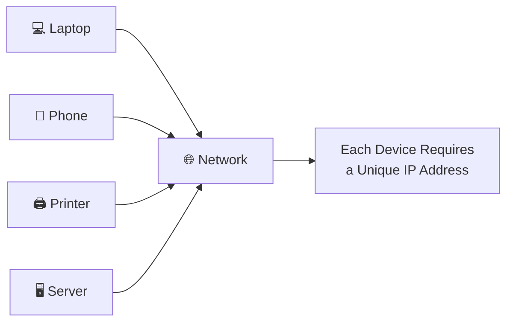
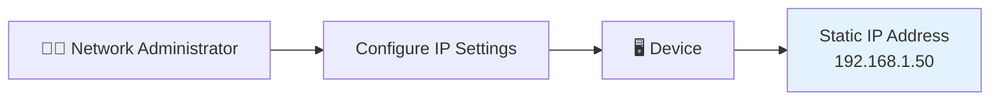
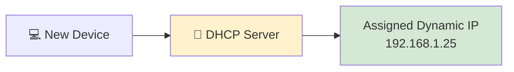
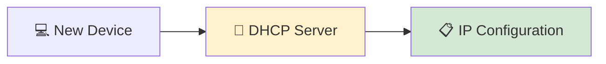
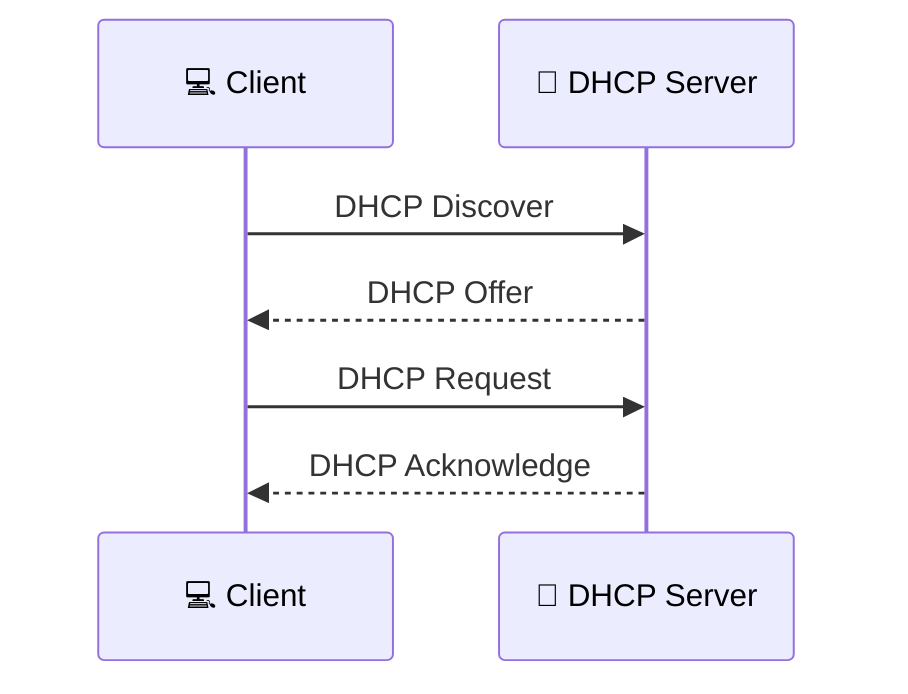
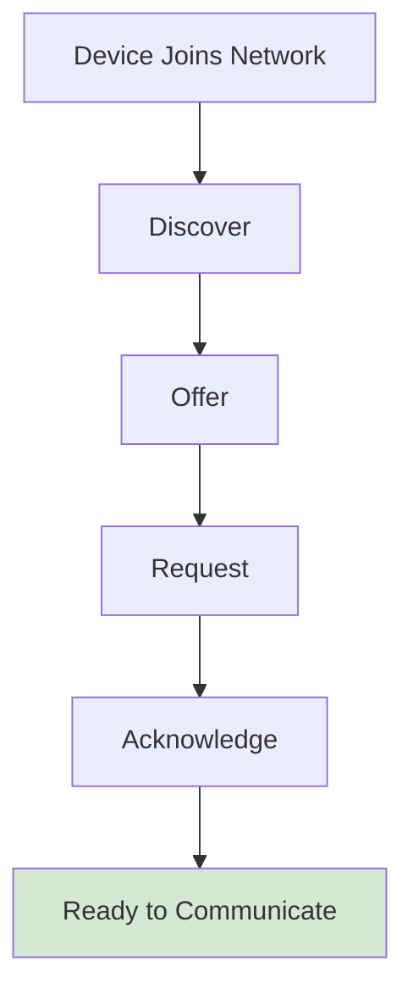
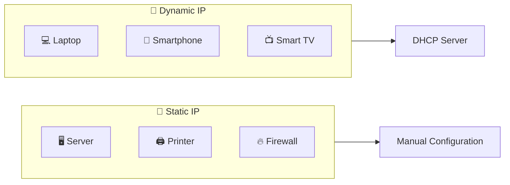
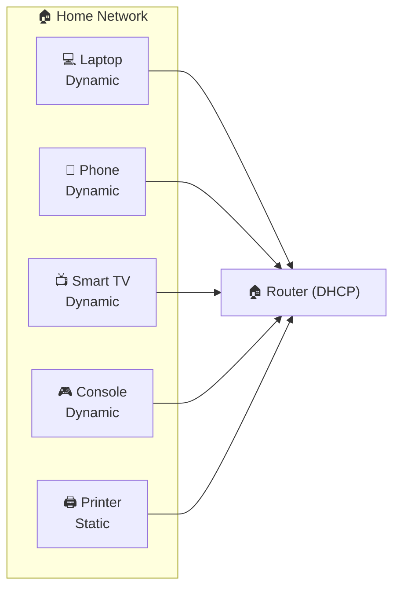
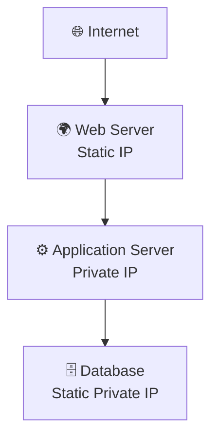
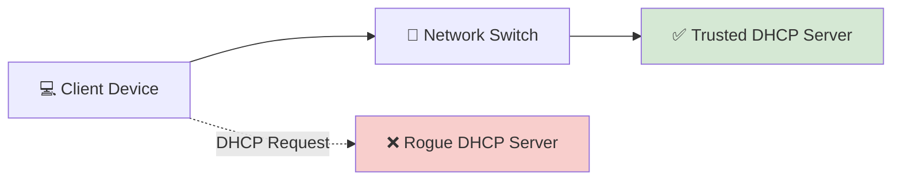

# 🔄 Static vs Dynamic IP Addresses

> *Every device on a network needs an IP address to communicate, but not every device receives its IP address in the same way. In this chapter, you'll learn the difference between **Static** and **Dynamic** IP addresses, how **DHCP** automatically assigns addresses, when each method should be used, and why understanding IP assignment is essential for networking, system administration, and cybersecurity.*

---


---

## 🎯 Learning Objectives

By the end of this lesson, you will be able to:

- Explain why devices need an IP address assignment method.
- Differentiate between **Static** and **Dynamic** IP addresses.
- Understand how **DHCP (Dynamic Host Configuration Protocol)** assigns IP addresses automatically.
- Explain the **DORA** process used by DHCP.
- Compare the advantages and disadvantages of Static and Dynamic IP addressing.
- Identify real-world situations where each method is appropriate.
- Recognize the cybersecurity implications of IP address assignment.

---

## 📚 Prerequisites

Before starting this lesson, you should already understand:

- ✅ Binary Basics
- ✅ IPv4 Addressing
- ✅ IPv6 Addressing
- ✅ Public vs Private IP Addresses
- ✅ Basic understanding of Network Address Translation (NAT)

If you haven't completed those lessons yet, it's recommended to study them first before continuing.

---

## 📖 Table of Contents

- Why Do Devices Need IP Address Assignment?
- What Is a Static IP Address?
- What Is a Dynamic IP Address?
- How DHCP Assigns an IP Address
- Understanding the DHCP DORA Process
- Static vs Dynamic IP Comparison
- Real-World Examples
- 🛡️ Cybersecurity Perspective
- Mini Lab
- Quick Check
- Knowledge Check
- Challenge Questions
- Chapter Summary
- Next Chapter Preview
- Module Progress
- Continue Your Learning

---

<!--
Image Description:
Create a modern educational illustration showing several devices (desktop, laptop, smartphone, printer, and server) connecting to a network. One server is labeled "Static IP" while the other devices receive addresses from a DHCP server labeled "Dynamic IP". Include a router and network switch in a clean blue networking theme.

Suggested Search Keywords:
static vs dynamic IP infographic
DHCP educational illustration
IP address assignment networking
computer network IP assignment

Suggested Filename:
Images/static_dynamic_hero.png
-->

<p align="center">

</p>

---

# 📖 Why Do Devices Need IP Address Assignment?

Imagine walking into a city where **none of the houses have addresses**.

A courier tries to deliver a package.

They know **who** the package is for, but they have no way of locating the correct house.

The result?

The package cannot be delivered.

Computer networks face the same challenge.

Every device connected to a network must have a unique **IP address** so that data can be sent to the correct destination.

Without an IP address, devices cannot identify one another, exchange information, or access network resources.

---

## 🌐 Every Device Needs an Identity

Whether it's a:

- 💻 Laptop
- 📱 Smartphone
- 🖨️ Printer
- 🎮 Gaming Console
- 📷 Security Camera
- ☁️ Cloud Server

each device must have a unique IP address within its network.

This address allows other devices to know:

- Where to send data.
- Where responses should return.
- Which device requested a particular service.

Without unique IP addresses, reliable communication would not be possible.

---



---

<!--
Image Description:
Create an educational illustration showing multiple devices attempting to communicate on a network. Label each device with its own IP address to emphasize that every device needs a unique network identity. Use a clean networking style suitable for beginners.

Suggested Search Keywords:
devices with IP addresses infographic
network device identity illustration
computer networking IP assignment concept

Suggested Filename:
Images/ip_assignment_problem.png
-->

<p align="center">

</p>

---

## 🤔 The Big Question

Now that we know every device needs an IP address, another important question arises:

> **How does a device actually get its IP address?**

There are two main approaches:

### 📝 Manual Assignment

A network administrator manually configures the IP address on each device.

This is known as a **Static IP Address**.

---

### 🔄 Automatic Assignment

A server automatically assigns an available IP address whenever a device joins the network.

This is known as a **Dynamic IP Address**, and it is typically managed by **DHCP (Dynamic Host Configuration Protocol)**.

---

These two methods solve the same problem, but they are designed for different situations.

In the following sections, you'll learn how each method works, their advantages and disadvantages, and when networking professionals choose one over the other.

---

> 💡 **Point to Remember**
>
> Every device on a network requires a unique IP address. The two primary methods of assigning these addresses are **Static IP addressing**, where the address is configured manually, and **Dynamic IP addressing**, where the address is assigned automatically by a DHCP server.

---

> 🤓 **Did You Know?**
>
> Every time you connect your phone to a new Wi-Fi network, it typically receives a **new Dynamic IP address** within seconds—without you entering any settings. This automatic process is handled by **DHCP**, one of the most widely used network services in the world.

---
# 📝 What Is a Static IP Address?

Now that you understand **why every device needs an IP address**, let's look at the first method of assigning one.

A **Static IP Address** is an IP address that is **manually configured** and remains the same until someone changes it.

Unlike a Dynamic IP Address, which can change over time, a Static IP Address provides a **permanent and predictable network identity**.

---

## 📖 Definition

> **A Static IP Address is an IP address that is manually assigned to a device and does not change automatically.**

Instead of requesting an address from a DHCP server, the network administrator enters the network settings manually.

These settings usually include:

- 🌐 IP Address
- 🎭 Subnet Mask
- 🚪 Default Gateway
- 🌍 DNS Server

Once configured, the device continues using the same address every time it connects to the network.

---

## 🏠 Real-World Analogy

Imagine owning a house.

Your house has a permanent postal address:

```text
221B Baker Street
```

Every visitor, delivery driver, or emergency service always knows where to find you because your address doesn't change every day.

A **Static IP Address** works in much the same way.

The device always has the same network address, making it easy for other devices and services to locate it whenever needed.

---



---

<!--
Image Description:
Create an educational illustration showing a network administrator manually configuring a computer with a static IP address. Display the fields IP Address, Subnet Mask, Default Gateway, and DNS Server being entered manually. Use a clean networking style with blue tones.

Suggested Search Keywords:
static IP configuration infographic
manual IP address setup illustration
static IP networking diagram

Suggested Filename:
Images/static_ip_overview.png
-->

<p align="center">

</p>

---

# ⚙️ How Does a Static IP Address Work?

When a device uses a Static IP Address, it **does not ask another device for an address**.

Instead, the administrator configures the network settings directly on the device.

For example:

```text
IP Address:
192.168.1.50

Subnet Mask:
255.255.255.0

Default Gateway:
192.168.1.1

DNS Server:
8.8.8.8
```

Every time the device starts, it continues using these same settings until they are manually modified.

This makes the device easy to locate because its address remains consistent.

---

## 📍 Where Are Static IP Addresses Commonly Used?

Static IP Addresses are typically assigned to devices that need to be **consistently reachable** on a network.

Common examples include:

- 🌐 Web Servers
- 🗄️ Database Servers
- 🖨️ Network Printers
- 📷 IP Security Cameras
- 📡 Routers and Firewalls
- 📁 File Servers
- ☁️ Cloud Virtual Machines
- 📧 Mail Servers
- 🔍 DNS Servers

For example, imagine an office printer whose IP address changes every day.

Employees would constantly need to update their printer settings, creating unnecessary confusion.

Assigning the printer a Static IP Address ensures that everyone can always find it at the same network location.

---

## ✅ Advantages of Static IP Addresses

Static addressing offers several important benefits.

| Advantage | Explanation |
|-----------|-------------|
| 📍 Predictable Address | The device always uses the same IP address. |
| 🖥️ Easier to Locate | Servers, printers, and network devices are always reachable at the same address. |
| 🔗 Reliable for Hosting | Ideal for websites, file servers, and remote services. |
| 🛠️ Simplifies Port Forwarding | Network rules remain valid because the IP address doesn't change. |
| 📋 Easier Asset Documentation | Administrators always know where important devices are located. |

---

## ❌ Disadvantages of Static IP Addresses

Although useful, Static IP Addresses also have some drawbacks.

| Disadvantage | Explanation |
|--------------|-------------|
| ⏳ Manual Configuration | Every device must be configured individually. |
| ⚠️ Human Error | Incorrect settings can prevent network communication. |
| 📈 Difficult to Scale | Managing hundreds or thousands of devices manually becomes impractical. |
| 🔄 Less Flexible | Address changes require administrator intervention. |

Because of these limitations, Static IP Addresses are generally reserved for devices that require a permanent network identity.

Most user devices, such as laptops and smartphones, instead use **Dynamic IP Addresses**, which you'll learn about in the next section.

---

## 🛡️ Cybersecurity Perspective

From a cybersecurity standpoint, Static IP Addresses make it easier to identify and manage critical infrastructure.

For example, administrators often assign Static IP Addresses to:

- Domain Controllers
- Firewalls
- DNS Servers
- File Servers
- Monitoring Systems

Because these systems always use the same address, firewall rules, monitoring tools, backups, and security policies can reliably reference them.

However, administrators should also remember that a predictable address can make important systems easier to identify during network reconnaissance if other security controls are weak.

For this reason, Static IP Addresses should always be combined with proper security measures such as:

- 🔥 Firewalls
- 🔐 Strong Authentication
- 📊 Continuous Monitoring
- 🛡️ Access Control Lists (ACLs)
- 🌐 Network Segmentation

---

> 💡 **Point to Remember**
>
> A **Static IP Address** is manually assigned and remains the same until it is changed by an administrator. It is best suited for devices that must always be reachable at a known address, such as servers, printers, routers, and other critical network infrastructure.

---

> 🤓 **Did You Know?**
>
> Many Internet-facing services, such as company websites and email servers, rely on Static IP Addresses because DNS records point to fixed IP addresses. If those addresses changed frequently, users might no longer be able to reach the services reliably.

---

# 🔄 What Is a Dynamic IP Address?

While **Static IP Addresses** are manually configured, most devices today use a much more convenient method called **Dynamic IP Addressing**.

A **Dynamic IP Address** is assigned **automatically** whenever a device joins a network. Instead of manually entering network settings, the device requests an available IP address from a **DHCP (Dynamic Host Configuration Protocol)** server.

This process happens in the background within seconds, allowing devices to connect to a network with little or no user intervention.

Whether you're connecting your smartphone to your home Wi-Fi, joining a university network with your laptop, or connecting a smart TV to the Internet, there's a very good chance the device is using a **Dynamic IP Address**.

---

## 📖 Definition

> **A Dynamic IP Address is an IP address that is automatically assigned to a device by a DHCP server for a limited period of time, known as a lease.**

Unlike a Static IP Address, a Dynamic IP Address **may change** over time depending on the network's configuration.

However, while connected to the network, the device keeps the assigned address until its lease expires or the network administrator changes the configuration.

---

## 🏠 Real-World Analogy

Imagine checking into a hotel.

You don't permanently own a room.

Instead:

- You arrive at reception.
- The receptionist assigns you an available room.
- You stay there for the duration of your visit.
- When you leave, the room becomes available for another guest.

Dynamic IP addressing works in much the same way.

The **DHCP server** acts like the hotel's receptionist, assigning available IP addresses to devices as they join the network.

When a device disconnects or its lease expires, that IP address can be reassigned to another device.

---



---

<!--
Image Description:
Create an educational illustration showing a laptop connecting to a DHCP server. The DHCP server automatically assigns a dynamic IP address to the device. Include a hotel receptionist analogy with room assignment to reinforce the concept of temporary IP assignment.

Suggested Search Keywords:
dynamic IP DHCP infographic
DHCP automatic IP assignment
dynamic IP educational illustration

Suggested Filename:
Images/dynamic_ip_overview.png
-->

<p align="center">

</p>

---

# ⚙️ How Does a Dynamic IP Address Work?

When a device connects to a network:

1. It searches for a DHCP server.
2. The DHCP server selects an available IP address.
3. The server assigns the address to the device.
4. The device uses that address to communicate on the network.

The user usually doesn't notice this process because it completes automatically in just a few seconds.

This automatic assignment makes modern networks much easier to manage.

---

## ⏳ What Is an IP Address Lease?

One important difference between Static and Dynamic IP addresses is that **Dynamic IP addresses are leased**, not permanently assigned.

A **lease** is simply the amount of time a device is allowed to use an IP address before renewing it.

For example:

```text
Device joins network

↓

DHCP assigns IP Address

↓

Lease starts

↓

Lease expires

↓

Device requests renewal

↓

Lease extended
```

In many home and office networks, lease times range from several hours to several days, depending on the administrator's configuration.

Most devices renew their lease automatically before it expires, so users rarely notice the process.

---


---

## 📍 Where Are Dynamic IP Addresses Commonly Used?

Dynamic IP addressing is ideal for devices that frequently connect to and disconnect from a network.

Examples include:

- 💻 Laptops
- 📱 Smartphones
- 📱 Tablets
- 📺 Smart TVs
- 🎮 Gaming Consoles
- ⌚ Smart Watches
- 🏠 IoT Devices
- 👥 Employee Workstations
- 🎓 Student Computers
- 🖥️ Public Computer Labs

These devices don't require permanent IP addresses, making Dynamic IP assignment the most practical choice.

---

## ✅ Advantages of Dynamic IP Addresses

Dynamic IP addressing offers several benefits for modern networks.

| Advantage | Explanation |
|-----------|-------------|
| ⚡ Automatic Configuration | Devices receive IP addresses without manual setup. |
| ⏱️ Saves Time | Administrators don't need to configure every device individually. |
| 📈 Highly Scalable | Supports networks with hundreds or thousands of devices. |
| 🔄 Efficient Address Management | Unused IP addresses can be reassigned automatically. |
| 👤 User-Friendly | Devices connect with minimal user interaction. |

---

## ❌ Disadvantages of Dynamic IP Addresses

Dynamic IP addressing also has some limitations.

| Disadvantage | Explanation |
|--------------|-------------|
| 🔄 IP Address May Change | A device may receive a different IP address after reconnecting or lease expiration. |
| 🖥️ Less Suitable for Servers | Services that must always be reachable typically require fixed addresses. |
| 🔍 Troubleshooting Can Be Harder | Changing addresses can make tracking devices more challenging without proper logging. |

For these reasons, Dynamic IP addressing is generally best suited for **client devices**, while many servers and network infrastructure devices continue using Static IP addresses.

---

## 🛡️ Cybersecurity Perspective

Dynamic IP addressing provides several operational advantages from a security perspective.

For example:

- Administrators can manage large numbers of devices more efficiently.
- Devices can automatically receive updated network settings.
- Address reuse helps optimize limited IPv4 address space.

However, Dynamic IP addressing also introduces considerations.

Because addresses can change over time:

- Incident responders often rely on **DHCP logs** to determine which device held a particular IP address at a specific time.
- Asset inventories should identify devices by more than just their IP address, such as hostname or MAC address.
- Unauthorized **Rogue DHCP Servers** can assign incorrect network settings, disrupting communication or enabling attacks.

You'll explore DHCP security and Rogue DHCP Servers in greater detail later in the **Network Services** and **Network Security** modules.

---

> 💡 **Point to Remember**
>
> A **Dynamic IP Address** is automatically assigned by a **DHCP server** and is typically leased for a limited period. It is the preferred addressing method for most client devices because it simplifies network management and scales efficiently.

---

> 🤓 **Did You Know?**
>
> Every time you connect your smartphone to a café, airport, university, or hotel Wi-Fi network, it usually receives a **different Dynamic IP Address**. This entire process happens automatically, often in less than a second, thanks to **DHCP**.

---

# 🤝 How DHCP Assigns an IP Address

In the previous section, you learned that most devices receive their IP addresses **automatically** using **DHCP (Dynamic Host Configuration Protocol)**.

But how does this actually happen?

When you connect your laptop to your home Wi-Fi, or your smartphone joins a coffee shop's wireless network, nobody manually enters an IP address.

Instead, your device and the DHCP server exchange a series of messages that automatically configure the network settings.

This entire process usually takes less than a second.

---

# 📖 What Is DHCP?

**Dynamic Host Configuration Protocol (DHCP)** is a network protocol that automatically assigns IP configuration information to devices joining a network.

Instead of requiring a network administrator to manually configure every computer, DHCP performs the work automatically.

A DHCP server can assign:

- 🌐 IP Address
- 🎭 Subnet Mask
- 🚪 Default Gateway
- 🌍 DNS Server
- ⏳ Lease Time

Without DHCP, administrators would need to manually configure every device that connects to the network—a practical impossibility in large organizations.

---

## 🏠 Real-World Analogy

Imagine checking into a hotel.

You walk up to the reception desk and ask for a room.

The receptionist:

- Checks for an available room.
- Assigns one to you.
- Gives you the room number.
- Tells you how long you may stay.

The receptionist keeps a record of which guest is using which room.

A DHCP server performs exactly the same role on a computer network.

Instead of assigning hotel rooms, it assigns **IP addresses**.

---



---

<!--
Image Description:
Create an educational illustration comparing a hotel receptionist assigning rooms to guests with a DHCP server assigning IP addresses to devices. Show laptops, phones, and tablets receiving IP addresses from the DHCP server. Use a clean networking style.

Suggested Search Keywords:
DHCP hotel analogy
DHCP educational infographic
automatic IP assignment illustration

Suggested Filename:
Images/dhcp_overview.png
-->

<p align="center">

</p>

---

# 🔄 The DHCP DORA Process

When a device joins a network, DHCP follows a **four-step process** known by the acronym:

# **DORA**

- **D** → Discover
- **O** → Offer
- **R** → Request
- **A** → Acknowledge

These four messages allow the device and the DHCP server to agree on an IP address and other network settings.

---



---

# ① DHCP Discover

When a device first connects to a network, it does **not** have an IP address.

Because it doesn't know where the DHCP server is located, it sends a **broadcast message** asking:

> "Is there a DHCP server on this network?"

This message is called:

```text
DHCP Discover
```

Since the device doesn't yet know the server's address, the message is sent to every device on the local network.

---

```text
💻 Laptop

↓

📢 Broadcast

↓

"Is any DHCP server available?"
```

---

# ② DHCP Offer

The DHCP server receives the Discover message.

It checks its pool of available addresses and selects one that isn't currently being used.

The server replies with a message containing:

- Proposed IP Address
- Subnet Mask
- Default Gateway
- DNS Server
- Lease Duration

This response is called:

```text
DHCP Offer
```

The client has not yet accepted the address—it has simply been offered one.

---

# ③ DHCP Request

After receiving the offer, the client responds by saying:

> "I would like to use this IP address."

This message is called:

```text
DHCP Request
```

The client is effectively asking the server to reserve that address for its use.

---

# ④ DHCP Acknowledge (ACK)

Finally, the DHCP server confirms the assignment.

It records the lease in its database and sends a:

```text
DHCP ACK
```

At this point, the client configures its network interface and begins communicating on the network.

The process is now complete.

---



---

# 📊 What Information Does DHCP Provide?

DHCP doesn't just assign an IP address.

It can also provide several important network settings.

| Information | Purpose |
|-------------|---------|
| 🌐 IP Address | Identifies the device on the network |
| 🎭 Subnet Mask | Defines the local network boundary |
| 🚪 Default Gateway | Allows communication outside the local network |
| 🌍 DNS Server | Translates domain names into IP addresses |
| ⏳ Lease Time | Specifies how long the address may be used |

This means a newly connected device can begin communicating almost immediately without requiring manual configuration.

---

# 🔄 Lease Renewal

A Dynamic IP Address is assigned for a limited time, known as a **lease**.

Before the lease expires, the client automatically contacts the DHCP server to renew it.

If the renewal is successful:

- The lease timer resets.
- The device usually keeps the same IP address.
- Network communication continues without interruption.

In most cases, users never notice this process because it occurs silently in the background.

---

# ❓ What Happens If No DHCP Server Is Available?

If a device cannot contact a DHCP server, it cannot automatically receive network settings.

Depending on the operating system, several things may happen:

- The device may assign itself a temporary address (such as an APIPA address on Windows).
- It may display a message indicating **"No Internet Connection."**
- It may only be able to communicate with certain local devices, or not communicate at all.

You'll study **APIPA** and DHCP troubleshooting later in the Networking roadmap.

---

## 🛡️ Cybersecurity Perspective

DHCP is a trusted service, but like any network protocol, it can be abused if not properly secured.

For example:

- A **Rogue DHCP Server** can assign incorrect network settings to clients.
- Attackers may redirect users to malicious DNS servers.
- Incorrect gateway information can enable traffic interception.

Because of these risks, enterprise switches often implement features such as **DHCP Snooping** to ensure that only authorized DHCP servers can assign IP addresses.

You'll explore these protections in the **Network Security** module.

---

> 💡 **Point to Remember**
>
> DHCP automatically assigns network configuration to devices using the four-step **DORA** process: **Discover → Offer → Request → Acknowledge**. This automation simplifies network management and allows devices to connect quickly without manual configuration.

---

> 🤓 **Did You Know?**
>
> Every time you connect to a new Wi-Fi network, your device typically completes the entire **DHCP DORA process** in less than a second. Behind the scenes, it receives not only an IP address but also the subnet mask, default gateway, DNS server, and lease information—all without requiring any user input.

---

# ⚖️ Static vs Dynamic IP Address Comparison

Now that you've learned how **Static** and **Dynamic** IP addresses work individually, let's compare them side by side.

Both methods assign IP addresses to devices, but they are designed for different purposes and environments.

Choosing the right method depends on factors such as network size, device type, management requirements, and security considerations.

---

# 📊 Static vs Dynamic IP Address Comparison

| Feature | 📝 Static IP Address | 🔄 Dynamic IP Address |
|----------|----------------------|-----------------------|
| **Assignment Method** | Manually configured by an administrator | Automatically assigned by a DHCP server |
| **Address Changes** | Remains the same until manually changed | May change when the lease expires or the device reconnects |
| **Configuration** | Manual | Automatic |
| **Management Effort** | Higher | Lower |
| **Scalability** | Best for small numbers of fixed devices | Ideal for large networks with many devices |
| **Risk of Human Error** | Higher due to manual configuration | Lower because DHCP automates the process |
| **Typical Devices** | Servers, routers, printers, firewalls | Laptops, smartphones, tablets, workstations |
| **DHCP Required** | No | Yes |
| **Best For** | Devices that must always be reachable | Client devices that connect and disconnect frequently |

---

## 🖼️ Visual Comparison



---

<!--
Image Description:
Create a side-by-side educational infographic comparing Static IP Addresses and Dynamic IP Addresses. On the left, show manually configured devices such as a server, printer, and firewall labeled "Static". On the right, show a DHCP server automatically assigning IP addresses to laptops, smartphones, and tablets labeled "Dynamic". Use arrows to illustrate manual versus automatic assignment.

Suggested Search Keywords:
static vs dynamic IP comparison infographic
DHCP versus static IP illustration
network IP assignment comparison

Suggested Filename:
Images/static_vs_dynamic_comparison.png
-->

<p align="center">

</p>

---

# ✅ Advantages and Disadvantages

## 📝 Static IP Address

### Advantages

- 📍 Always uses the same IP address.
- 🌐 Ideal for hosting websites and services.
- 🖨️ Perfect for printers and network infrastructure.
- 🔧 Simplifies remote access and port forwarding.
- 📋 Easier to document important network devices.

### Disadvantages

- ⚙️ Requires manual configuration.
- ⏳ Time-consuming in large networks.
- ⚠️ Incorrect settings can cause connectivity problems.
- 📈 Difficult to manage for hundreds or thousands of devices.

---

## 🔄 Dynamic IP Address

### Advantages

- ⚡ Automatic configuration.
- 📈 Highly scalable.
- 👥 Supports large organizations with many devices.
- 🔄 Efficient use of available IP addresses.
- 🛠️ Minimal administrative effort.

### Disadvantages

- 🔄 IP addresses may change.
- 🖥️ Less suitable for services that require a permanent address.
- 🔍 Troubleshooting may require DHCP lease records.

---

# 🌎 Common Use Cases

| Device | Recommended IP Type | Why? |
|----------|--------------------|------|
| 🌐 Web Server | Static | Clients must always know its address. |
| 📁 File Server | Static | Ensures consistent access for users. |
| 🖨️ Network Printer | Static | Prevents printer addresses from changing. |
| 🔥 Firewall | Static | Network devices rely on a fixed gateway. |
| 📷 Security Camera | Static | Makes monitoring and management easier. |
| 💻 Laptop | Dynamic | Frequently joins different networks. |
| 📱 Smartphone | Dynamic | Automatically receives an address wherever it connects. |
| 📺 Smart TV | Dynamic | No need for a permanent address in most homes. |
| 🎮 Gaming Console | Dynamic | Connects automatically using DHCP. |

---

# 🛡️ Cybersecurity Perspective

Choosing between Static and Dynamic IP addressing affects not only network management but also security operations.

### Static IP Addresses

Because the address remains constant:

- Easier to create firewall rules.
- Simpler to monitor critical infrastructure.
- Useful for servers that provide services to many users.
- Easier to include in asset inventories.

However, if a publicly accessible server always uses the same address, attackers may repeatedly target that system. Strong security controls remain essential.

---

### Dynamic IP Addresses

Dynamic addressing offers operational advantages:

- Simplifies onboarding new devices.
- Reduces manual configuration errors.
- Makes large environments easier to manage.

However, during incident response, security teams often need **DHCP lease logs** to determine which device was assigned a particular IP address at a specific time.

For this reason, enterprise environments combine DHCP with centralized logging and asset management systems.

---

# 🎯 Which One Should You Choose?

There is no universally "better" option.

Instead, choose the method that best fits the device's role.

### Choose a **Static IP Address** when:

- The device hosts services.
- The device must always be reachable.
- Other systems depend on its address remaining constant.

---

### Choose a **Dynamic IP Address** when:

- The device is a client workstation.
- It frequently joins or leaves networks.
- Automatic configuration is preferred.
- Scalability and ease of management are priorities.

---

## 📌 Rule of Thumb

A simple guideline used by many network administrators is:

> **Infrastructure devices usually use Static IP addresses. User devices usually use Dynamic IP addresses.**

This approach balances reliability, scalability, and ease of administration.

---

> 💡 **Point to Remember**
>
> Static IP Addresses provide **stability and predictability**, making them ideal for servers and network infrastructure. Dynamic IP Addresses provide **automation and scalability**, making them the preferred choice for most client devices. Modern networks commonly use both methods together to achieve efficient and reliable network management.

---

> 🤓 **Did You Know?**
>
> Even in organizations that primarily use DHCP, critical systems such as domain controllers, DNS servers, firewalls, and core network equipment are often assigned Static IP addresses. This hybrid approach combines the simplicity of automatic addressing with the reliability of fixed addresses where they are needed most.

---

# 🌎 Real-World Examples

By now, you understand that there are two primary methods of assigning IP addresses:

- 📝 **Static IP Address** — Manually configured and remains the same.
- 🔄 **Dynamic IP Address** — Automatically assigned by a DHCP server.

Modern networks rarely use only one method.

Instead, administrators choose the most appropriate addressing method based on the role of each device.

Let's explore how Static and Dynamic IP addresses are used in the real world.

---

# 🏠 Example 1 — Home Wi-Fi Network

Imagine a typical home network containing:

- 💻 Laptop
- 📱 Smartphone
- 📺 Smart TV
- 🎮 Gaming Console
- 🖨️ Printer

Most of these devices receive **Dynamic IP Addresses** from the home router.

For example:

| Device | Address Type |
|----------|-------------|
| Laptop | 🔄 Dynamic |
| Smartphone | 🔄 Dynamic |
| Smart TV | 🔄 Dynamic |
| Gaming Console | 🔄 Dynamic |

However, many homeowners choose to assign their **network printer** a **Static IP Address** so that every computer can always find it at the same location.

---



---

<!--
Image Description:
Illustrate a home Wi-Fi network where laptops, smartphones, smart TVs, and gaming consoles receive Dynamic IP addresses from a router, while a network printer is assigned a Static IP address. Use different colors or labels to distinguish static and dynamic assignments.

Suggested Search Keywords:
home network static dynamic IP
DHCP home network infographic
network printer static IP illustration

Suggested Filename:
Images/home_static_dynamic.png
-->

<p align="center">

</p>

---

# 🏢 Example 2 — Corporate Office

A medium-sized company may have:

- Hundreds of employee computers
- Network printers
- File servers
- Domain controllers
- Firewalls
- Wireless Access Points

The IT department typically assigns:

### 🔄 Dynamic IP Addresses

- Employee computers
- Laptops
- Tablets
- VoIP phones

### 📝 Static IP Addresses

- Domain Controllers
- File Servers
- DNS Servers
- Network Printers
- Firewalls
- Routers

This approach reduces administrative work while ensuring critical infrastructure always has a predictable address.

---

```text
Employee PCs

↓

DHCP Server

↓

Dynamic IP Addresses


Critical Servers

↓

Administrator

↓

Static IP Addresses
```

---

# ☁️ Example 3 — Cloud Infrastructure

Cloud platforms such as AWS, Microsoft Azure, and Google Cloud support both Static and Dynamic IP addressing.

A typical cloud application might look like this:

```text
Internet

↓

Web Server (Static/Public IP)

↓

Application Server (Static or Dynamic Private IP)

↓

Database Server (Static Private IP)
```

Why?

- Users must always be able to reach the web server.
- Internal services communicate using predictable private addresses.
- Databases should remain accessible only within the private network.

---



---

# 🏫 Example 4 — School or University

Universities often manage thousands of devices.

Examples include:

- Student laptops
- Faculty computers
- Laboratory PCs
- Classroom projectors
- Printers
- Administrative servers

To simplify management:

- Student devices receive **Dynamic IP Addresses**.
- Important servers and network equipment use **Static IP Addresses**.

This allows students to connect easily while ensuring campus services remain consistently available.

---

# 🏥 Example 5 — Hospital Network

Hospitals rely on devices that must always be reachable.

Examples include:

- Electronic Health Record (EHR) servers
- Medical imaging systems
- Pharmacy servers
- Network storage
- Monitoring systems

These devices usually receive **Static IP Addresses** because healthcare applications depend on reliable communication.

Meanwhile:

- Staff laptops
- Tablets
- Visitor Wi-Fi devices

typically receive **Dynamic IP Addresses** from DHCP.

---

# 🏭 Example 6 — Manufacturing and Industrial Networks

Industrial environments often contain:

- PLCs (Programmable Logic Controllers)
- SCADA Servers
- Industrial Sensors
- Manufacturing Robots
- Monitoring Stations

Many of these systems use **Static IP Addresses** because industrial software frequently expects devices to remain at fixed network locations.

Changing IP addresses unexpectedly could interrupt production processes or monitoring systems.

---

# 🛡️ Cybersecurity Perspective

Security professionals must understand both addressing methods because they affect network visibility, monitoring, and incident response.

### 📝 Static IP Addresses

Advantages:

- Easier to document critical systems.
- Consistent firewall and ACL configurations.
- Simplifies vulnerability scanning.
- Reliable asset identification.

---

### 🔄 Dynamic IP Addresses

Advantages:

- Easier device deployment.
- Automatic configuration.
- Better scalability.

Challenges:

- IP addresses may change.
- Investigators often need **DHCP lease logs** to determine which device held a particular IP address during a security incident.
- Asset tracking typically relies on hostnames, MAC addresses, or centralized inventory systems in addition to IP addresses.

Understanding when Static and Dynamic addressing should be used is an important skill for both network administrators and cybersecurity professionals.

---

# 🎯 Choosing the Right Approach

The following guideline is used in many organizations:

| Device Type | Recommended IP Assignment |
|--------------|--------------------------|
| 🌐 Web Server | 📝 Static |
| 📁 File Server | 📝 Static |
| 🔥 Firewall | 📝 Static |
| 🖨️ Network Printer | 📝 Static |
| 📷 Security Camera | 📝 Static |
| 💻 Laptop | 🔄 Dynamic |
| 📱 Smartphone | 🔄 Dynamic |
| 📺 Smart TV | 🔄 Dynamic |
| 🎮 Gaming Console | 🔄 Dynamic |
| 👤 Employee Workstation | 🔄 Dynamic |

Most enterprise networks use **both** Static and Dynamic IP addressing because each serves a different purpose.

---

> 💡 **Point to Remember**
>
> There is no single addressing method that fits every situation. **Static IP Addresses** provide stability for critical infrastructure, while **Dynamic IP Addresses** provide flexibility and automation for everyday client devices. A well-designed network combines both methods to achieve reliability, scalability, and efficient management.

---

> 🤓 **Did You Know?**
>
> Large organizations may manage **tens of thousands of Dynamic IP leases every day** through DHCP while keeping only a relatively small number of servers, firewalls, and network appliances on **Static IP Addresses**. This hybrid approach is one of the key reasons modern networks can scale efficiently while remaining manageable.

---

# 🛡️ Cybersecurity Perspective

IP address assignment is more than just a networking concept—it also plays an important role in **cybersecurity**.

Whether you're defending a corporate network, investigating a security incident, or performing a penetration test, understanding how devices receive and use IP addresses helps you identify systems, track network activity, and protect critical infrastructure.

Let's explore why Static and Dynamic IP addressing matters from a security perspective.

---

# 🎯 Why Security Professionals Care About IP Addresses

One of the first tasks during a security assessment is identifying:

- Which devices are connected to the network.
- Which devices are critical infrastructure.
- Which systems are publicly accessible.
- Which devices are receiving addresses dynamically.
- How devices communicate with each other.

Knowing whether a device uses a **Static** or **Dynamic** IP address provides valuable context during network monitoring and incident response.

---

## 📝 Static IP Addresses and Security

Critical infrastructure almost always relies on **Static IP Addresses**.

Examples include:

- 🌐 Web Servers
- 🗄️ Database Servers
- 🔥 Firewalls
- 📡 Routers
- 📁 File Servers
- 🌍 DNS Servers
- 📧 Mail Servers
- ☁️ Cloud Gateways

Because these systems always use the same IP address:

- Firewall rules remain consistent.
- Monitoring systems always know where to find them.
- Administrators can easily document network assets.
- Security tools can continuously monitor the same endpoints.

This predictability simplifies administration but also means that Internet-facing systems may become well-known targets if not properly secured.

---

## 🔄 Dynamic IP Addresses and Security

Most user devices receive **Dynamic IP Addresses** through DHCP.

Examples include:

- 💻 Employee laptops
- 📱 Smartphones
- 🖥️ Workstations
- 🎓 Student devices
- 🏠 Home computers

Dynamic addressing simplifies network administration because devices can join the network without manual configuration.

However, because these addresses may change over time, identifying a specific device during an investigation often requires additional information.

Security teams commonly correlate:

- IP Address
- MAC Address
- Hostname
- DHCP Lease Logs
- Authentication Logs

to determine which device was using a particular IP address at a specific time.

---

# 📋 The Importance of DHCP Logs

Imagine a security monitoring system reports suspicious activity from:

```text
192.168.10.55
```

If DHCP is being used, that address may belong to different devices at different times.

Without DHCP lease records, investigators might not know:

- Which device used the address.
- Which user was logged in.
- When the address was assigned.
- When it was released.

For this reason, enterprise organizations often retain DHCP logs to support:

- 🔍 Incident Response
- 🛡️ Digital Forensics
- 📊 Security Auditing
- 📋 Compliance Requirements

---

# ⚠️ Rogue DHCP Servers

Normally, only **authorized DHCP servers** should assign IP addresses.

However, an attacker could introduce an unauthorized device that begins responding to DHCP requests.

This is known as a **Rogue DHCP Server**.

A Rogue DHCP Server may provide incorrect network settings, such as:

- A malicious default gateway.
- A fake DNS server.
- Invalid IP address information.

This can cause:

- Network disruption.
- Traffic interception.
- Redirection to malicious websites.
- Man-in-the-Middle (MitM) attacks.

Enterprise networks often protect against this using security features such as **DHCP Snooping**, which allows switches to accept DHCP responses only from trusted ports.

> **Note:** You'll study DHCP Snooping in detail later in the **Network Security** module.

---



---

<!--
Image Description:
Create an educational cybersecurity diagram showing a client sending a DHCP request. One trusted DHCP server responds correctly, while an unauthorized rogue DHCP server attempts to respond with malicious settings. The network switch blocks the rogue server using DHCP Snooping. Use a clean blue and red networking theme.

Suggested Search Keywords:
rogue DHCP server illustration
DHCP snooping infographic
network security DHCP attack diagram

Suggested Filename:
Images/rogue_dhcp_server.png
-->

<p align="center">

</p>

---

# 🚨 DHCP Starvation Attack (Introduction)

Another attack targeting DHCP is called a **DHCP Starvation Attack**.

In this attack, an attacker repeatedly requests IP addresses using fake or spoofed MAC addresses.

Eventually, the DHCP server runs out of available addresses.

As a result:

- Legitimate devices cannot obtain an IP address.
- New users cannot join the network.
- Network services become unavailable.

This is considered a form of **Denial-of-Service (DoS)** attack.

Fortunately, enterprise switches provide protections such as:

- DHCP Snooping
- Port Security
- Rate Limiting

You'll explore these defenses in greater detail later in the roadmap.

---

# 🛡️ Best Practices

To improve the security and reliability of IP address management:

- ✅ Use **Static IP Addresses** for critical infrastructure.
- ✅ Use **Dynamic IP Addresses** for end-user devices.
- ✅ Keep DHCP servers properly secured.
- ✅ Monitor and retain DHCP lease logs.
- ✅ Use DHCP Snooping on enterprise switches.
- ✅ Document important Static IP assignments.
- ✅ Regularly review IP address usage and network inventory.

Following these practices helps organizations maintain secure, scalable, and well-managed networks.

---

# 🌍 Real-World Example

Imagine a company with:

- 1 Firewall
- 2 Domain Controllers
- 3 File Servers
- 250 Employee Computers
- 80 Laptops
- 60 VoIP Phones

A secure design might look like this:

| Device | IP Assignment |
|----------|--------------|
| Firewall | 📝 Static |
| Domain Controllers | 📝 Static |
| File Servers | 📝 Static |
| Employee Computers | 🔄 Dynamic |
| Laptops | 🔄 Dynamic |
| VoIP Phones | 🔄 Dynamic |

This hybrid approach provides predictable addressing for critical systems while allowing employee devices to connect automatically and efficiently.

---

> 💡 **Point to Remember**
>
> Understanding how IP addresses are assigned is essential for cybersecurity. Static IP addresses provide stability for critical infrastructure, while Dynamic IP addresses simplify device management. Security professionals rely on DHCP logs, network monitoring, and secure DHCP configurations to investigate incidents and protect enterprise networks.

---

> 🤓 **Did You Know?**
>
> During many cybersecurity investigations, analysts don't identify a suspect device by its IP address alone. Instead, they combine **DHCP lease records, MAC addresses, authentication logs, and timestamps** to accurately determine which device was using a particular IP address at the time of an incident.

---

# 💻 Mini Lab — Explore Static and Dynamic IP Addressing

Reading about **Static** and **Dynamic** IP addresses is helpful, but seeing them on your own computer makes the concepts much easier to understand.

In this lab, you'll inspect your current network configuration, determine whether your device is using a **Static** or **Dynamic** IP address, view DHCP information, and learn how to release and renew a DHCP lease.

> **🎯 Goal:** Understand how your own device receives and manages its IP address.

---

# 🧪 Lab 1 — View Your Current IP Configuration

Let's begin by examining your device's current network settings.

Choose the instructions for your operating system.

---

## 🪟 Windows

Open **Command Prompt** and run:

```powershell
ipconfig /all
```

---

## 🐧 Linux

Open a terminal and run:

```bash
ip addr
```

Then view routing information:

```bash
ip route
```

---

## 🍎 macOS

Open **Terminal** and run:

```bash
ifconfig
```

---

Look for information similar to this:

```text
IPv4 Address . . . . . . : 192.168.1.25

Subnet Mask . . . . . . : 255.255.255.0

Default Gateway . . . . : 192.168.1.1
```

---

### 📝 Record Your Results

| Setting | Your Value |
|----------|------------|
| IPv4 Address | _____________ |
| Subnet Mask | _____________ |
| Default Gateway | _____________ |

---

# 🧪 Lab 2 — Is Your Address Static or Dynamic?

Now determine **how** your IP address was assigned.

### 🪟 Windows

Look for:

```text
DHCP Enabled . . . . . . : Yes
```

If it says:

```text
Yes
```

your device is using a **Dynamic IP Address**.

If it says:

```text
No
```

your device is probably using a **Static IP Address**.

---

### 📝 Record Your Observation

| Question | Answer |
|----------|--------|
| DHCP Enabled? | __________ |
| Static or Dynamic? | __________ |

---

# 🧪 Lab 3 — View DHCP Server Information

If DHCP is enabled, your computer also knows **which server assigned the IP address**.

On Windows, look for:

```text
DHCP Server . . . . . . :

192.168.1.1
```

In many home networks, this will be your **Wi-Fi router**.

---

### 📝 Record Your Result

| Setting | Your Value |
|----------|------------|
| DHCP Server | __________ |

---

# 🧪 Lab 4 — Release Your IP Address (Windows)

> ⚠️ **Warning**
>
> Running this command will temporarily disconnect your computer from the network until a new IP address is obtained.

Open Command Prompt as Administrator and run:

```powershell
ipconfig /release
```

Your network adapter will temporarily lose its IP address.

Observe what happens.

Questions:

- Can you still browse the Internet?
- Does your computer still have an IPv4 address?

---

# 🧪 Lab 5 — Renew Your IP Address (Windows)

Now request a new IP address from the DHCP server.

Run:

```powershell
ipconfig /renew
```

Within a few seconds, your computer should receive a new DHCP lease.

Run:

```powershell
ipconfig
```

again and compare the results.

---

### 📝 Record Your Results

| Question | Answer |
|----------|--------|
| Did the IP Address change? | ________ |
| Is Internet access restored? | ________ |

---

# 🧪 Lab 6 — Observe the DHCP Lease

Run:

```powershell
ipconfig /all
```

Locate:

```text
Lease Obtained

Lease Expires
```

Example:

```text
Lease Obtained

Monday

10:15 AM

Lease Expires

Tuesday

10:15 AM
```

These values indicate:

- When your DHCP lease started.
- When it will expire if it is not renewed.

---

### 📝 Record Your Results

| Setting | Your Value |
|----------|------------|
| Lease Obtained | __________ |
| Lease Expires | __________ |

---

# 🧪 Lab 7 — Think Like a Network Administrator

Imagine you're designing a network for the following devices:

| Device | Static or Dynamic? |
|----------|-------------------|
| Web Server | __________ |
| Laptop | __________ |
| Network Printer | __________ |
| Smartphone | __________ |
| Firewall | __________ |
| Gaming Console | __________ |

Write your answers before checking below.

<details>
<summary><strong>✅ Suggested Answers</strong></summary>

| Device | Recommended Assignment |
|----------|-----------------------|
| Web Server | 📝 Static |
| Laptop | 🔄 Dynamic |
| Network Printer | 📝 Static |
| Smartphone | 🔄 Dynamic |
| Firewall | 📝 Static |
| Gaming Console | 🔄 Dynamic |

</details>

---

# 🧪 Lab 8 — Reflection Questions

Answer these questions in your own words.

1. Why do most home networks use Dynamic IP addresses?
2. Why are servers commonly assigned Static IP addresses?
3. What role does DHCP play in a network?
4. Why does a DHCP lease have an expiration time?
5. What problems might occur if two devices are manually assigned the same Static IP address?
6. Why would a company avoid manually configuring hundreds of employee laptops?

Try answering without looking back at the chapter.

---

# 🎯 Lab Challenge

Imagine you're the network administrator for a company with:

- 300 Employee Computers
- 20 Servers
- 10 Network Printers
- 5 Firewalls
- 40 Wireless Access Points

### Your Challenge

Decide which devices should use **Static IP Addresses** and which should use **Dynamic IP Addresses**.

Then explain **why** you made each choice.

Think about:

- Reliability
- Ease of management
- Scalability
- Security

---

<!--
Image Description:
Create a beginner-friendly networking lab illustration showing a laptop running 'ipconfig /all', a DHCP server assigning an IP address, and a router connected to several devices. Include labels such as 'Release', 'Renew', and 'DHCP Lease' to visually reinforce the lab activities.

Suggested Search Keywords:
DHCP lab illustration
ipconfig educational diagram
dynamic IP practical networking

Suggested Filename:
Images/dhcp_lab.png
-->

<p align="center">

</p>

---

> 💡 **Lab Summary**
>
> In this lab, you explored how your device receives and manages an IP address. You examined your current network configuration, identified whether your address was assigned statically or dynamically, viewed DHCP information, and observed how DHCP leases work. These practical skills are essential for troubleshooting network connectivity and form the foundation for more advanced topics such as subnetting, routing, and network services.

---

# 🧠 Quick Check

Take a few minutes to answer the following questions **without looking back at the lesson**.

These questions are designed to help you review the key concepts you've just learned. If you're unsure about an answer, revisit the relevant section before moving on.

---

## Question 1

**What is a Static IP Address?**

<details>
<summary><strong>✅ Show Answer</strong></summary>

A **Static IP Address** is an IP address that is **manually assigned** to a device and remains the same until it is manually changed.

</details>

---

## Question 2

**What is a Dynamic IP Address?**

<details>
<summary><strong>✅ Show Answer</strong></summary>

A **Dynamic IP Address** is an IP address that is **automatically assigned** by a **DHCP server** for a limited period of time called a **lease**.

</details>

---

## Question 3

**Which protocol automatically assigns IP addresses to devices?**

A. DNS

B. HTTP

C. DHCP

D. FTP

<details>
<summary><strong>✅ Show Answer</strong></summary>

✅ **C. DHCP (Dynamic Host Configuration Protocol)**

DHCP automatically assigns IP addresses and other network settings to devices joining a network.

</details>

---

## Question 4

**What does the acronym DORA stand for?**

<details>
<summary><strong>✅ Show Answer</strong></summary>

**DORA** stands for:

- **D** → Discover
- **O** → Offer
- **R** → Request
- **A** → Acknowledge

These are the four steps used by DHCP to assign an IP address.

</details>

---

## Question 5

**Which type of IP address is commonly used for web servers?**

A. Dynamic IP Address

B. Static IP Address

<details>
<summary><strong>✅ Show Answer</strong></summary>

✅ **B. Static IP Address**

Web servers should have a predictable, permanent address so clients can always reach them.

</details>

---

## Question 6

**Which type of IP address is commonly assigned to laptops and smartphones?**

<details>
<summary><strong>✅ Show Answer</strong></summary>

**Dynamic IP Addresses**

Most client devices automatically receive their IP addresses from a DHCP server.

</details>

---

## Question 7

**True or False?**

> A DHCP server only assigns an IP address.

<details>
<summary><strong>✅ Show Answer</strong></summary>

❌ **False**

A DHCP server can also provide:

- Subnet Mask
- Default Gateway
- DNS Server
- Lease Time

along with the IP address.

</details>

---

## Question 8

**What is a DHCP Lease?**

<details>
<summary><strong>✅ Show Answer</strong></summary>

A **DHCP Lease** is the length of time a device is allowed to use a dynamically assigned IP address before it must renew or request a new lease.

</details>

---

## Question 9

**Which statement is correct?**

A. Static IP addresses change automatically.

B. Dynamic IP addresses are manually configured.

C. Static IP addresses are commonly used for network infrastructure.

D. DHCP is required for Static IP addresses.

<details>
<summary><strong>✅ Show Answer</strong></summary>

✅ **C. Static IP addresses are commonly used for network infrastructure.**

Servers, routers, firewalls, and network printers often use Static IP addresses because they need a consistent network identity.

</details>

---

## Question 10

**Why do most organizations use Dynamic IP Addresses for employee computers?**

<details>
<summary><strong>✅ Show Answer</strong></summary>

Dynamic IP Addresses reduce administrative effort because devices are configured automatically by DHCP. This makes large networks easier to manage, minimizes manual errors, and allows IP addresses to be reused efficiently.

</details>

---

# 🎯 Quick Self-Assessment

How did you do?

| Score | Progress |
|--------|----------|
| **9–10 Correct** | 🟢 Excellent! You have a solid understanding of Static and Dynamic IP addressing. |
| **7–8 Correct** | 🟡 Good work! Review any topics you found challenging before continuing. |
| **5–6 Correct** | 🟠 You're making progress, but another review of DHCP and IP assignment will strengthen your understanding. |
| **Below 5** | 🔴 Revisit the chapter, especially the sections on Static IPs, Dynamic IPs, DHCP, and the DORA process before moving on. |

---

> 💡 **Tip**
>
> Before continuing to the **Knowledge Check**, make sure you can explain the **DHCP DORA process** from memory and describe when a device should use a **Static IP Address** versus a **Dynamic IP Address**. If you can confidently explain these concepts to someone else, you've built a strong foundation for the next networking topics.

---

# 📖 Knowledge Check

The following scenarios are designed to test your understanding of **Static IP Addresses**, **Dynamic IP Addresses**, and **DHCP**.

Read each scenario carefully before revealing the answer.

---

# 🏠 Scenario 1 — Setting Up a Home Network

Ali has just purchased a new Wi-Fi router.

He connects:

- 💻 Laptop
- 📱 Smartphone
- 📺 Smart TV
- 🎮 Gaming Console

He wants every device to connect automatically without manually configuring network settings.

### ❓ Question

Should these devices use **Static** or **Dynamic** IP Addresses?

<details>
<summary><strong>✅ Show Answer</strong></summary>

They should use **Dynamic IP Addresses**.

The router's DHCP server will automatically assign IP addresses to each device, making the network easy to manage.

</details>

---

# 🖨️ Scenario 2 — Office Printer

An office has one network printer used by every employee.

Employees complain that they occasionally cannot find the printer because its IP address changes.

### ❓ Question

What is the best solution?

<details>
<summary><strong>✅ Show Answer</strong></summary>

Assign the printer a **Static IP Address**.

A fixed IP address ensures that computers can always locate the printer at the same network address.

</details>

---

# 🌐 Scenario 3 — Company Website

A company hosts its website on a server.

Thousands of users visit the website every day.

### ❓ Question

Should the web server use a **Static** or **Dynamic** IP Address?

Why?

<details>
<summary><strong>✅ Show Answer</strong></summary>

The server should use a **Static IP Address**.

A web server must always be reachable at a predictable address so that DNS records continue pointing to the correct destination.

</details>

---

# 🤝 Scenario 4 — DHCP Process

A laptop has just connected to a network.

The DHCP server responds with an available IP address.

### ❓ Question

Which DHCP message does the client send next?

A. Discover

B. Offer

C. Request

D. Acknowledge

<details>
<summary><strong>✅ Show Answer</strong></summary>

✅ **C. Request**

After receiving a DHCP Offer, the client sends a **DHCP Request** to accept the proposed IP address.

</details>

---

# 🏢 Scenario 5 — Growing Business

A company has expanded from 20 employees to over 600.

The IT administrator is spending too much time manually configuring IP addresses for new computers.

### ❓ Question

What networking service should be implemented?

<details>
<summary><strong>✅ Show Answer</strong></summary>

The organization should deploy a **DHCP server**.

DHCP automatically assigns IP addresses, reducing administrative effort and making the network easier to scale.

</details>

---

# 🔍 Scenario 6 — Security Investigation

A security analyst discovers suspicious activity from the IP address:

```text
192.168.10.55
```

The organization uses DHCP.

### ❓ Question

Why might the analyst need DHCP lease logs?

<details>
<summary><strong>✅ Show Answer</strong></summary>

Because Dynamic IP Addresses can change over time.

DHCP lease logs help determine:

- Which device used the IP address.
- Which user was logged in.
- When the address was assigned.
- When it expired.

This information is critical during incident response and digital forensics.

</details>

---

# ⚠️ Scenario 7 — Duplicate IP Address

A network administrator manually assigns the same Static IP Address to two different computers.

### ❓ Question

What problem is likely to occur?

<details>
<summary><strong>✅ Show Answer</strong></summary>

An **IP Address Conflict**.

Both devices attempt to use the same address, causing communication problems and unpredictable network behavior.

</details>

---

# 🌍 Scenario 8 — Coffee Shop Wi-Fi

You visit a coffee shop and connect your laptop to its Wi-Fi network.

Within seconds, your device receives an IP address and can browse the Internet.

### ❓ Question

Which technology most likely assigned the IP address?

<details>
<summary><strong>✅ Show Answer</strong></summary>

The coffee shop's **DHCP server** automatically assigned a **Dynamic IP Address**.

This process happens without requiring any manual configuration.

</details>

---

# 🛡️ Scenario 9 — Rogue DHCP Server

An attacker connects an unauthorized DHCP server to an office network.

Several employee computers begin receiving incorrect network settings.

### ❓ Question

What security risk does this create?

<details>
<summary><strong>✅ Show Answer</strong></summary>

A **Rogue DHCP Server** can:

- Assign incorrect IP addresses.
- Provide a malicious default gateway.
- Redirect clients to a fake DNS server.
- Enable traffic interception or Man-in-the-Middle (MitM) attacks.

Enterprise switches commonly use **DHCP Snooping** to help prevent this attack.

</details>

---

# 🏭 Scenario 10 — Designing a Corporate Network

You are designing a network for:

- 🌐 Web Server
- 🗄️ Database Server
- 💻 300 Employee Laptops
- 🖨️ 15 Network Printers
- 🔥 Firewall

### ❓ Question

Which devices should use **Static IP Addresses**, and which should use **Dynamic IP Addresses**?

<details>
<summary><strong>✅ Suggested Answer</strong></summary>

**Static IP Addresses**

- 🌐 Web Server
- 🗄️ Database Server
- 🖨️ Network Printers
- 🔥 Firewall

**Dynamic IP Addresses**

- 💻 Employee Laptops

Critical infrastructure should have predictable addresses, while client devices benefit from automatic IP assignment through DHCP.

</details>

---

# 🎯 Reflection

If you answered these scenarios confidently, you've moved beyond memorizing definitions and have started thinking like a network administrator.

Understanding **when** to use Static or Dynamic IP addresses—and how DHCP automates IP assignment—is an essential skill for networking, system administration, cloud computing, and cybersecurity.

As networks grow larger and more complex, choosing the appropriate IP assignment method becomes increasingly important for maintaining reliability, scalability, and security.

> 💡 **Point to Remember**
>
> Static and Dynamic IP addressing are not competing technologies—they complement each other. Most modern networks use a combination of both: **Static IP Addresses** for critical infrastructure and **Dynamic IP Addresses** for everyday client devices. Choosing the right approach for each device is a key responsibility of every network administrator.

---

# 🚀 Challenge Questions

The following challenges are designed to test your ability to **apply** what you've learned throughout this chapter.

Unlike the **Quick Check** and **Knowledge Check**, these exercises have no single correct answer. Instead, they encourage you to think through real-world networking scenarios and justify your decisions.

Take a few minutes to answer each challenge before revealing the suggested solution.

---

# 🏠 Challenge 1 — Designing a Home Network

A family has the following devices:

- 💻 4 Laptops
- 📱 6 Smartphones
- 📺 3 Smart TVs
- 🎮 2 Gaming Consoles
- 🖨️ 1 Network Printer
- 📷 4 Security Cameras
- 🏠 1 Wi-Fi Router

### ❓ Challenge

Decide which devices should use:

- 📝 Static IP Addresses
- 🔄 Dynamic IP Addresses

Explain your reasoning.

<details>
<summary><strong>✅ Suggested Answer</strong></summary>

**Static IP Addresses**

- 🖨️ Network Printer
- 📷 Security Cameras (recommended)
- 🏠 Router

**Dynamic IP Addresses**

- 💻 Laptops
- 📱 Smartphones
- 📺 Smart TVs
- 🎮 Gaming Consoles

Client devices benefit from automatic configuration through DHCP, while devices that need to be consistently accessible are better suited to Static IP addresses.

</details>

---

# 🏢 Challenge 2 — Office Expansion

A company currently has:

- 40 Employees
- 2 Servers
- 3 Network Printers

Within two years, it plans to expand to **500 employees**.

### ❓ Challenge

Would you recommend:

- Manual Static IP assignment for every device?
- DHCP for employee devices?
- A combination of both?

Explain your decision.

<details>
<summary><strong>✅ Suggested Answer</strong></summary>

A **hybrid approach** is the best solution.

- Use **Static IP Addresses** for servers, printers, firewalls, and other infrastructure.
- Use **DHCP** to assign **Dynamic IP Addresses** to employee computers and laptops.

This approach provides reliability for critical systems while allowing the network to scale efficiently.

</details>

---

# ☁️ Challenge 3 — Cloud Deployment

A company is deploying an online application consisting of:

- 🌍 Web Server
- ⚙️ Application Server
- 🗄️ Database Server

### ❓ Challenge

Which systems should use Static IP Addresses?

Which systems could use Dynamic IP Addresses within the private network?

Explain your reasoning.

<details>
<summary><strong>✅ Suggested Answer</strong></summary>

A common design is:

- 🌍 Web Server → Static Public IP
- ⚙️ Application Server → Static or DHCP Reservation (depending on the environment)
- 🗄️ Database Server → Static Private IP

The exact implementation varies between cloud providers, but services that must be consistently reachable generally require stable addressing.

</details>

---

# 🔍 Challenge 4 — Security Investigation

A security monitoring system reports that:

```text
192.168.50.25
```

attempted to access confidential company files.

The organization uses DHCP.

### ❓ Challenge

What information would help identify the actual device responsible?

<details>
<summary><strong>✅ Suggested Answer</strong></summary>

Investigators should examine:

- DHCP lease logs
- MAC address
- Device hostname
- User authentication logs
- Event timestamps

Because Dynamic IP addresses can change over time, the IP address alone may not identify the responsible device.

</details>

---

# ⚠️ Challenge 5 — DHCP Failure

Imagine the organization's DHCP server suddenly stops working.

### ❓ Challenge

What problems would users experience?

Which devices would continue functioning normally?

<details>
<summary><strong>✅ Suggested Answer</strong></summary>

New devices would likely be unable to obtain an IP address automatically and may not be able to access the network.

Devices already holding valid DHCP leases would usually continue working until their leases expired.

Systems configured with Static IP Addresses would continue operating because they do not depend on DHCP for address assignment.

</details>

---

# 🛡️ Challenge 6 — Secure Network Design

You're designing the network for a small business.

The network contains:

- 🌐 Web Server
- 📁 File Server
- 🔥 Firewall
- 🖨️ 5 Network Printers
- 💻 150 Employee Computers
- 📱 Employee Smartphones

### ❓ Challenge

Create an IP assignment plan.

For each device type, decide whether you would use:

- 📝 Static IP Address
- 🔄 Dynamic IP Address

Explain your decisions from both a **network management** and **cybersecurity** perspective.

<details>
<summary><strong>✅ Suggested Answer</strong></summary>

**Static IP Addresses**

- 🌐 Web Server
- 📁 File Server
- 🔥 Firewall
- 🖨️ Network Printers

**Dynamic IP Addresses**

- 💻 Employee Computers
- 📱 Smartphones

Critical infrastructure benefits from fixed addresses for monitoring, firewall rules, and administration, while client devices are easier to manage using DHCP.

</details>

---

# 🌟 Final Thought

One of the signs that you're beginning to think like a network professional is recognizing that there is **no single IP assignment strategy for every device**.

Well-designed networks use **both Static and Dynamic IP addressing**:

- 📝 Static IP Addresses provide **stability, predictability, and reliable access** for important systems.
- 🔄 Dynamic IP Addresses provide **automation, flexibility, and scalability** for everyday client devices.

The best network designs balance these approaches to create systems that are efficient, manageable, and secure.

---

> 💡 **Challenge Yourself**
>
> Examine your own home or workplace network. Make a list of every device you can identify and decide whether it **should** use a **Static** or **Dynamic** IP Address. Then compare your choices with how the devices are actually configured. This exercise will strengthen your understanding of practical network design.

---
# 📝 Chapter Summary

Congratulations! 🎉

You've completed another important milestone in the **IP Addressing** module.

In this chapter, you learned how devices receive IP addresses and why different devices use different IP assignment methods.

Modern networks rely on a combination of **Static IP Addresses**, **Dynamic IP Addresses**, and **DHCP (Dynamic Host Configuration Protocol)** to provide reliable, scalable, and efficient communication.

Rather than manually configuring every device, network administrators assign **Static IP Addresses** to critical infrastructure while allowing **DHCP** to automatically manage IP addresses for everyday client devices.

This hybrid approach simplifies administration, reduces human error, and allows networks to scale from a few devices to thousands.

---

# 📚 What You Learned

By completing this chapter, you should now be able to:

- ✅ Explain why devices need an IP assignment method.
- ✅ Define a **Static IP Address**.
- ✅ Define a **Dynamic IP Address**.
- ✅ Explain the purpose of **DHCP**.
- ✅ Describe the four stages of the **DHCP DORA Process**.
- ✅ Understand what a **DHCP Lease** is.
- ✅ Compare Static and Dynamic IP addressing.
- ✅ Identify when each addressing method should be used.
- ✅ Explain the cybersecurity importance of DHCP and IP management.
- ✅ Apply these concepts to real-world networking scenarios.

---

# 🧠 Key Takeaways

Remember these important concepts:

- 📝 **Static IP Addresses** remain fixed until manually changed.
- 🔄 **Dynamic IP Addresses** are assigned automatically by DHCP.
- 🤝 DHCP simplifies network administration by automating IP assignment.
- 📋 DHCP provides more than just an IP address—it also supplies the subnet mask, default gateway, DNS server, and lease information.
- 🏢 Most enterprise networks use **both Static and Dynamic IP addressing** together.
- 🛡️ DHCP logs play an important role in troubleshooting and cybersecurity investigations.

---

# 🌍 Why This Matters

Understanding IP address assignment is essential because these concepts are used throughout modern networking.

You'll encounter them again when studying:

- 🌐 Routing
- 🔀 Switching
- 📡 DHCP Services
- 🔥 Firewalls
- 🛡️ Network Security
- ☁️ Cloud Networking
- 🏢 Enterprise Infrastructure
- 🎯 Penetration Testing
- 🔍 Digital Forensics

A solid understanding of Static and Dynamic IP addressing will make these future topics much easier to understand.

---

> 💡 **Final Thought**
>
> Every time you connect your laptop to Wi-Fi, join a corporate network, or browse the Internet from your smartphone, DHCP is quietly working in the background to provide the network configuration your device needs. Understanding how this process works gives you the knowledge to troubleshoot connectivity issues, design efficient networks, and build the foundation for advanced networking and cybersecurity concepts.

---

---

# 🧭 Chapter Navigation

<table>
<tr>

<td width="50%" align="center">

### ➡️ Next Lesson

## 🌐 APIPA (Automatic Private IP Addressing)

Discover what happens when a device cannot reach a DHCP server, how APIPA automatically assigns an IP address, its limitations, and how to troubleshoot APIPA-related connectivity issues.

**[06-APIPA.md](06-APIPA.md) →**

</td>

</tr>
</table>

---

