# 🌐 APIPA (Automatic Private IP Addressing)

> *Learn what APIPA is, why it exists, how Windows automatically assigns an IP address when DHCP is unavailable, and how to troubleshoot APIPA-related networking issues.*


---

# 📖 Table of Contents

- [🎯 Learning Objectives](#-learning-objectives)
- [📖 What Is APIPA?](#-what-is-apipa)
- [🤔 Why Do We Need APIPA?](#-why-do-we-need-apipa)
- [⚙️ How APIPA Works](#️-how-apipa-works)
- [🌐 The APIPA Address Range](#-the-apipa-address-range)
- [🔍 Duplicate Address Detection (DAD)](#-duplicate-address-detection-dad)
- [⚖️ APIPA vs DHCP](#️-apipa-vs-dhcp)
- [⚖️ APIPA vs Static IP Addressing](#️-apipa-vs-static-ip-addressing)
- [🌍 Real-World Examples](#-real-world-examples)
- [🛡️ Cybersecurity Perspective](#️-cybersecurity-perspective)
- [💻 Mini Lab](#-mini-lab)
- [🧠 Quick Check](#-quick-check)
- [📖 Knowledge Check](#-knowledge-check)
- [🚀 Challenge Questions](#-challenge-questions)
- [📝 Chapter Summary](#-chapter-summary)
- [🚀 Next Chapter Preview](#-next-chapter-preview)
- [🧭 Module Progress](#-module-progress)
- [🧭 Chapter Navigation](#-chapter-navigation)
- [📖 Continue Your Learning](#-continue-your-learning)

---

# 🎯 Learning Objectives

After completing this chapter, you will be able to:

- Explain what **APIPA (Automatic Private IP Addressing)** is.
- Understand why APIPA exists and the problem it solves.
- Identify an APIPA address by its IP range.
- Explain what happens when a DHCP server is unavailable.
- Describe how Windows automatically assigns an APIPA address.
- Understand the purpose of **Duplicate Address Detection (DAD)**.
- Compare APIPA with DHCP and Static IP addressing.
- Recognize the limitations of APIPA.
- Troubleshoot common APIPA-related connectivity issues.
- Explain why APIPA is relevant to network administrators and cybersecurity professionals.

---

# 📖 What Is APIPA?

Imagine you connect your laptop to a network.

Normally, your computer sends a request asking for an IP address, and a **DHCP (Dynamic Host Configuration Protocol)** server automatically provides one.

Within a few seconds, your device receives:

- 🌐 An IP Address
- 🎭 A Subnet Mask
- 🚪 A Default Gateway
- 🌍 A DNS Server

Everything works as expected.

But what happens if the DHCP server doesn't respond?

Should your computer simply give up and remain disconnected?

The answer is **no**.

Instead, many operating systems automatically assign themselves a special type of IP address known as an **APIPA address**.

---

## 📚 Definition

**APIPA (Automatic Private IP Addressing)** is a feature that allows a device to automatically assign itself an IP address when it cannot obtain one from a DHCP server.

Instead of leaving the device without an IP address, APIPA provides a temporary address from a reserved range so that the device can still communicate with other devices on the same local network.

Although APIPA does **not** provide Internet access, it allows limited local network communication until a DHCP server becomes available again.

---

## 🏠 Real-World Analogy

Imagine arriving at a hotel where the receptionist is responsible for assigning rooms.

Normally:

1. You arrive at the reception desk.
2. The receptionist checks for an available room.
3. You receive a room number.
4. You can enter the hotel and use all its services.

But suppose the receptionist is unexpectedly absent.

Instead of forcing every guest to wait outside, the hotel has an emergency procedure.

Guests are temporarily assigned spare rooms so they can stay inside the building until normal operations resume.

Those temporary rooms allow guests to remain inside the hotel, but they may not have access to every service.

APIPA works in much the same way.

When the **DHCP server** (the receptionist) is unavailable, the operating system temporarily assigns itself an IP address so the device can continue limited communication on the local network.

---

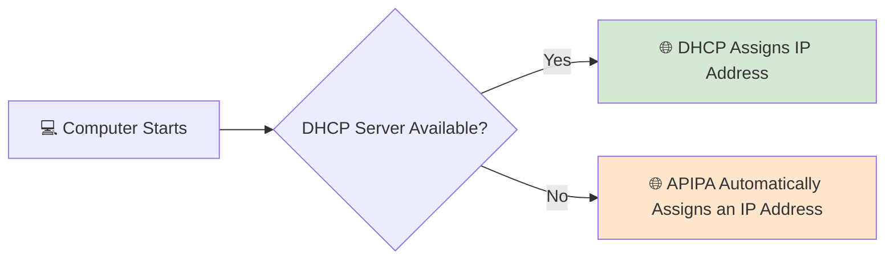

---

<!--
Image Description:
Create an educational illustration showing a computer attempting to obtain an IP address from a DHCP server. One path shows the DHCP server successfully assigning an address, while the other shows the DHCP server unavailable and the computer automatically assigning itself an APIPA address. Use a clean networking style suitable for beginners.

Suggested Filename:
Images/apipa_overview.png
-->

<p align="center">

</p>

---

## 🎯 Why Is APIPA Important?

Without APIPA, a computer that could not reach a DHCP server would have **no valid IP address** and would be unable to communicate with other devices on the local network.

APIPA provides a temporary solution that allows limited communication while helping administrators recognize that a DHCP-related problem exists.

This makes APIPA useful for:

- 🛠️ Basic network troubleshooting.
- 🖥️ Temporary local communication between devices.
- 🔍 Identifying DHCP server failures.
- 📚 Simplifying automatic network configuration.

It is important to remember that APIPA is **not a replacement for DHCP**. Instead, it acts as a fallback mechanism when automatic IP address assignment fails.

---

> 💡 **Point to Remember**
>
> **APIPA (Automatic Private IP Addressing)** is an automatic fallback feature used when a device cannot obtain an IP address from a DHCP server. It assigns a temporary IP address that enables limited communication on the local network but does not provide normal network connectivity or Internet access.

---

> 🤓 **Did You Know?**
>
> If you ever run the `ipconfig` command on a Windows computer and see an IP address beginning with **169.254**, it's a strong indication that the device was unable to contact a DHCP server and has automatically assigned itself an APIPA address.

---
# 🤔 Why Do We Need APIPA?

In the previous section, you learned that **APIPA** is a fallback mechanism that automatically assigns an IP address when a device cannot obtain one from a DHCP server.

But this raises an important question:

> **If DHCP already assigns IP addresses automatically, why was APIPA introduced?**

To answer that, we first need to understand what happens when a device joins a network.

---

## 🌐 The Normal Process

Whenever a computer connects to a network, it needs a valid IP address before it can communicate with other devices.

In most modern networks, this process is handled automatically by a **DHCP server**.

The sequence looks like this:

```text
Computer Starts
       │
       ▼
Sends DHCP Request
       │
       ▼
DHCP Server Responds
       │
       ▼
IP Address Assigned
       │
       ▼
Network Communication Begins
```

As long as the DHCP server is available, everything works smoothly and the user usually doesn't notice anything happening in the background.

---

## 🚨 What If the DHCP Server Doesn't Respond?

Now imagine the DHCP server is unavailable because:

- 🔌 The router has been turned off.
- 🌐 A network cable has been disconnected.
- ⚠️ The DHCP service has crashed.
- 🔥 A firewall is blocking DHCP traffic.
- 🛠️ The server is undergoing maintenance.

The computer still needs an IP address, but no DHCP server is available to provide one.

Without a valid IP address, the device cannot communicate on an IP network.

---

## ❌ Why Can't the Computer Just Choose Any IP Address?

You might wonder:

> **"Why doesn't the computer simply make up an IP address?"**

Although this sounds reasonable, it would create serious networking problems.

For example, imagine your computer randomly chooses:

```text
192.168.1.50
```

What if another computer is already using that address?

Now two devices share the same IP address, resulting in an **IP address conflict**.

This can lead to:

- ❌ Unreliable communication
- ❌ Connection failures
- ❌ Difficulty reaching network resources
- ❌ Network troubleshooting problems

Randomly selecting an address from a normal network range would make IP conflicts much more common.

---

## 💡 APIPA Solves This Problem

Instead of selecting a completely random address, operating systems use a **reserved range of IP addresses** that is specifically set aside for this situation.

When DHCP cannot provide an address:

1. The operating system detects the failure.
2. It selects an address from the **APIPA range**.
3. It checks whether another device is already using that address.
4. If the address is available, it configures the network interface automatically.

This approach allows devices to continue limited communication while avoiding unnecessary conflicts with normally configured networks.

---

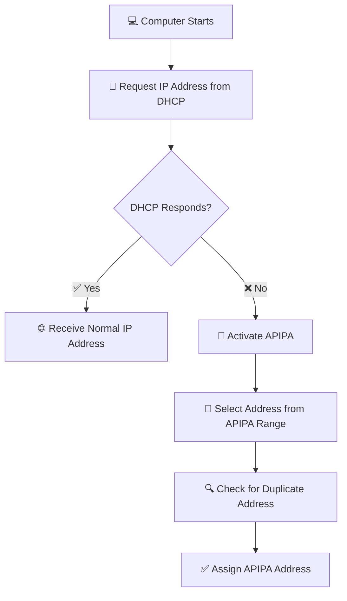

---

<!--
Image Description:
Create an educational flowchart showing a computer requesting an IP address from a DHCP server. If the server responds, the computer receives a normal IP address. If the server does not respond, the computer activates APIPA, selects an address from the APIPA range, checks for duplicates, and assigns the address automatically. Use a clean networking illustration suitable for beginners.

Suggested Filename:
Images/why_apipa_exists.png
-->

<p align="center">

</p>

---

## 🌍 Real-World Example

Imagine an office where every employee receives a visitor badge from the reception desk before entering the building.

Normally:

- Employees arrive.
- Reception issues a badge.
- Employees enter the building.

Now imagine the reception desk is temporarily closed.

Instead of refusing entry to everyone, the building provides **temporary emergency badges** that allow people to move within certain areas until the reception desk is operating again.

These temporary badges are **not intended for permanent use**, but they allow work to continue.

APIPA works in a very similar way.

When the DHCP server cannot assign a normal IP address, the operating system temporarily assigns itself an APIPA address so the device can continue limited communication until DHCP becomes available again.

---

> 💡 **Point to Remember**
>
> APIPA exists to solve a very specific problem: **what should a computer do when no DHCP server is available?** Instead of remaining without an IP address or choosing one at random, the operating system assigns a temporary address from a reserved range, allowing limited communication while avoiding unnecessary IP address conflicts.

---

> 🤓 **Did You Know?**
>
> APIPA is designed as a **temporary fallback mechanism**, not a permanent addressing solution. As soon as a DHCP server becomes available again, most operating systems automatically request a normal DHCP lease and replace the APIPA address with the newly assigned network configuration.

---

# ⚙️ How APIPA Works

Now that you understand **why APIPA exists**, let's see exactly **how it works**.

When a computer starts, it doesn't immediately assign itself an APIPA address. Instead, it first attempts to obtain a valid IP address from a **DHCP server**.

Only after that process fails does APIPA take over.

Let's walk through the entire process step by step.

---

## Step 1 — The Computer Starts

When a computer boots up or connects to a network, its network adapter becomes active.

At this point, the device has **no valid IP address** and cannot yet communicate with other devices using IP.

Its first goal is to obtain a valid network configuration.


---

## Step 2 — The Computer Looks for a DHCP Server

Instead of assigning an IP address immediately, the operating system follows the standard DHCP process.

It broadcasts a **DHCP Discover** message across the local network, asking:

> **"Is there a DHCP server that can assign me an IP address?"**

If a DHCP server is available, it responds and the normal DHCP process continues.

If no server responds, the computer waits for a short period before trying again.

---

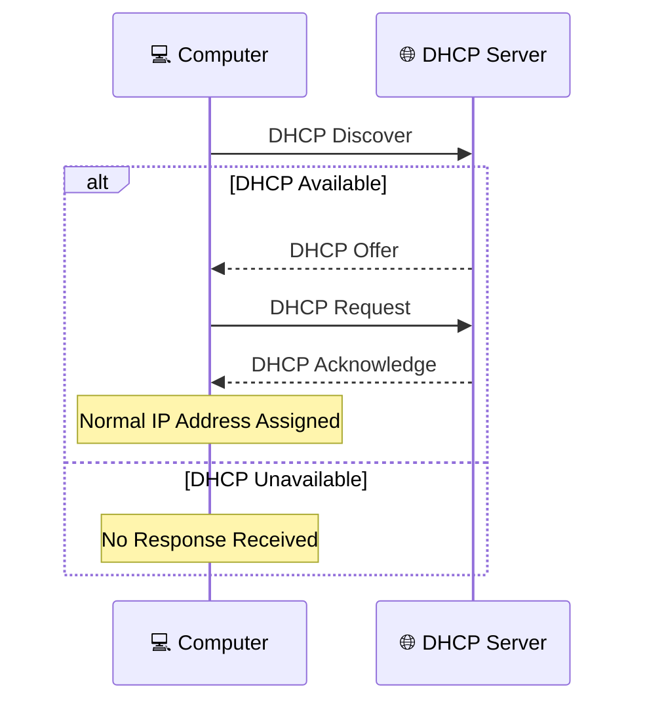

---

## Step 3 — DHCP Request Times Out

The computer doesn't give up after a single request.

Instead, it sends multiple DHCP Discover messages, waiting briefly between each attempt.

If **no DHCP server responds**, the operating system concludes that automatic IP address assignment has failed.

At this point, the computer must decide what to do next.

Without an IP address, it cannot communicate on the network.

This is where **APIPA** becomes active.

---

## Step 4 — APIPA Selects a Temporary Address

After DHCP fails, the operating system randomly selects an address from the **APIPA address range**:

```text
169.254.0.0 – 169.254.255.255
```

However, it **does not use the first address it chooses immediately**.

Before assigning the address, the operating system must ensure that no other device is already using it.

---


---

## Step 5 — Duplicate Address Detection (DAD)

Before assigning the selected address, the computer performs a safety check known as **Duplicate Address Detection (DAD)**.

It sends an **ARP Probe** asking:

> **"Is anyone already using this IP address?"**

Two outcomes are possible:

### ✅ No Response

If no device responds, the address is considered available.

The computer assigns the APIPA address to its network adapter.

---

### ❌ Address Already in Use

If another device replies, the operating system knows the address is already occupied.

It immediately discards that address, randomly selects another APIPA address, and repeats the process until an unused address is found.

This prevents IP address conflicts on the local network.

---

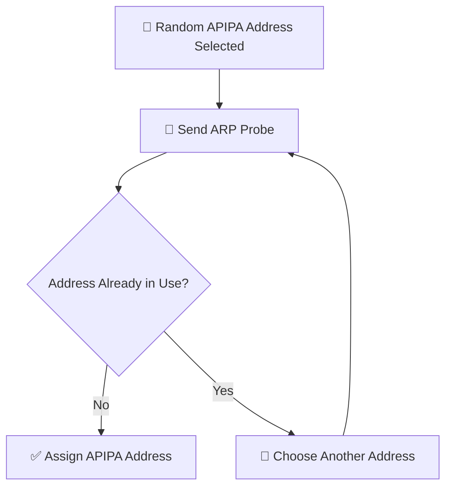

---

## Step 6 — APIPA Address Is Assigned

Once the operating system confirms that the address is unique, it configures the network adapter.

The computer now has:

- ✅ An APIPA IP Address
- ✅ A Subnet Mask

However, it does **not** receive:

- ❌ Default Gateway
- ❌ DNS Server
- ❌ Full DHCP Configuration

Because of this, communication is limited to devices on the same local APIPA network.

---

## Step 7 — Limited Local Communication Begins

With an APIPA address assigned, the computer can communicate with other devices that also have compatible local addressing.

However, it cannot normally:

- 🌍 Access the Internet
- 🌐 Reach devices on other networks
- 🚪 Communicate through a router

APIPA is designed to keep local communication possible until a DHCP server becomes available.

---

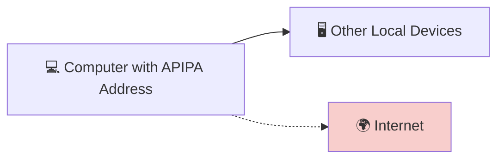

---

## Step 8 — DHCP Becomes Available Again

APIPA is only a **temporary solution**.

Operating systems continue checking for a DHCP server in the background.

When one becomes available:

1. The computer requests a DHCP lease.
2. The DHCP server assigns a normal IP address.
3. The APIPA address is removed automatically.

The user usually doesn't notice this transition.

---

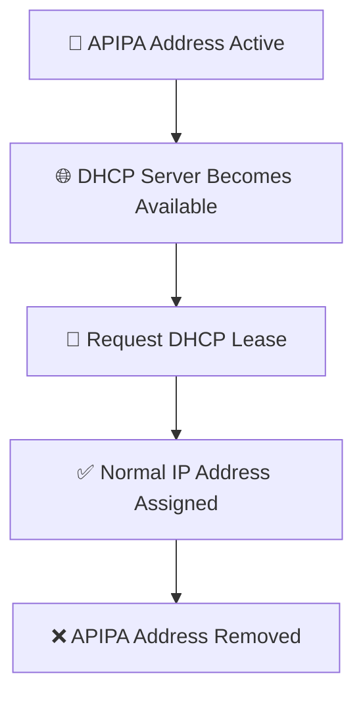

---

<!--
Image Description:
Create a beginner-friendly infographic showing the complete APIPA process from start to finish. Include the following steps: Computer starts → DHCP Discover → No DHCP response → Random APIPA address selected → Duplicate Address Detection (ARP Probe) → APIPA address assigned → Limited local communication → DHCP becomes available → Normal IP address assigned. Use arrows and icons for each stage.

Suggested Filename:
Images/apipa_process.png
-->

<p align="center">

</p>

---

> 💡 **Point to Remember**
>
> APIPA is not the computer's first choice for obtaining an IP address. The operating system always tries to contact a **DHCP server** first. Only after multiple DHCP attempts fail does it automatically assign itself an APIPA address, verify that the address is unique, and use it for limited local communication until normal DHCP service is restored.

---

> 🤓 **Did You Know?**
>
> Even after assigning an APIPA address, most operating systems continue to search for a DHCP server in the background. As soon as a DHCP server responds, the APIPA address is automatically replaced with a normal DHCP-assigned IP address—often without the user noticing the change.

---

# 🌐 The APIPA Address Range

Every IP address belongs to a specific range that serves a particular purpose.

For example:

- Private IP addresses are used inside local networks.
- Public IP addresses are used on the Internet.
- Loopback addresses are used for testing.
- APIPA addresses are used when a device cannot obtain an IP address from a DHCP server.

Instead of choosing a random address, APIPA always selects an address from one reserved range.

---

## 📍 The APIPA Address Block

The entire APIPA address space is:

```text
169.254.0.0/16
```

This means every APIPA address begins with:

```text
169.254
```

Examples include:

```text
169.254.12.5

169.254.80.120

169.254.200.15

169.254.254.220
```

Whenever you see an address starting with **169.254**, it's a strong indication that the device could not obtain an IP address from a DHCP server.

---

## 🧮 Understanding the /16 Prefix

The notation:

```text
169.254.0.0/16
```

means that:

- The **first 16 bits** identify the network.
- The **remaining 16 bits** identify individual hosts.

Visually:

```text
169        .       254        .        X        .        X

<------ Network -------> <--------- Host --------->
```

Or in binary:

```text
10101001.11111110.XXXXXXXX.XXXXXXXX
```

The first two octets remain fixed:

```text
169.254
```

while the last two octets are used to identify individual devices.

---


---

## 📦 How Many Addresses Are Available?

Because the host portion contains **16 bits**, the APIPA block provides:

```text
2¹⁶ = 65,536 possible addresses
```

However, not all of these addresses are available for normal use.

Some addresses are reserved for special purposes, just as in other IP networks.

Even so, the range provides far more addresses than are needed for temporary communication on a local network.

---

## 🚫 Why Doesn't APIPA Use Other Address Ranges?

You might wonder:

> **Why doesn't APIPA simply use a private IP address like 192.168.1.x?**

The reason is to avoid interfering with networks that are already using those addresses.

If APIPA randomly selected addresses from common private ranges:

```text
192.168.x.x

10.x.x.x

172.16.x.x
```

there would be a much greater risk of creating IP address conflicts.

Instead, the Internet Engineering Task Force (IETF) reserved the **169.254.0.0/16** block specifically for automatic link-local addressing.

Because this range has a unique purpose, devices can safely recognize it as a temporary fallback address.

---

## 🌍 Why APIPA Addresses Cannot Reach the Internet

One of the most important characteristics of APIPA addresses is that they are **link-local addresses**.

This means they are intended only for communication within the **local network segment**.

Routers are designed **not to forward APIPA traffic**.

As a result, a device using an APIPA address typically cannot:

- 🌍 Browse the Internet.
- 🌐 Communicate with devices on other networks.
- 🏢 Reach servers located on different subnets.

Its communication is limited to devices on the same local link.

---

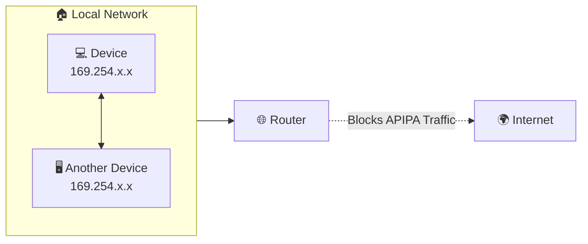

---

<!--
Image Description:
Illustrate the APIPA address range (169.254.0.0/16). Highlight the first two octets as the fixed network portion and the last two octets as the host portion. Show two devices communicating locally using APIPA while a router blocks communication to the Internet. Use a clean educational networking style.

Suggested Filename:
Images/apipa_address_range.png
-->

<p align="center">

</p>

---

## 🔍 Recognizing an APIPA Address

One of the quickest ways to identify a DHCP problem is by checking the device's IP address.

For example, on Windows you can run:

```powershell
ipconfig
```

If you see an output similar to:

```text
IPv4 Address. . . . . . . . . . : 169.254.45.108
```

it's a strong indication that:

- The device attempted to contact a DHCP server.
- No DHCP server responded.
- Windows automatically assigned an APIPA address.

This makes APIPA addresses an important clue during network troubleshooting.

---

> 💡 **Point to Remember**
>
> All APIPA addresses belong to the **169.254.0.0/16** range. Because this range is reserved exclusively for automatic link-local addressing, seeing an IP address that begins with **169.254** usually indicates that the device was unable to obtain an IP address from a DHCP server.

---

> 🤓 **Did You Know?**
>
> APIPA is based on the concept of **link-local addressing**, which means communication is limited to devices on the same network segment. Routers do not forward APIPA traffic, making these addresses useful for local communication but unsuitable for accessing remote networks or the Internet.

---

# 🔍 Duplicate Address Detection (DAD)

Imagine that your computer has selected the following APIPA address:

```text
169.254.45.108
```

Can it start using that address immediately?

**No.**

Before assigning the address to its network adapter, the operating system must first answer an important question:

> **"Is another device already using this IP address?"**

If two devices use the same IP address on the same network, an **IP address conflict** occurs, causing unreliable communication and making network troubleshooting much more difficult.

To prevent this, APIPA performs a safety check known as **Duplicate Address Detection (DAD).**

---

## 🤔 Why Is Duplicate Address Detection Necessary?

Although APIPA selects its address randomly, there is still a small chance that another computer has already chosen the same address.

For example:

```text
Computer A → 169.254.45.108

Computer B → 169.254.45.108
```

If both computers begin using the same address:

- ❌ Network communication becomes unreliable.
- ❌ Packets may be delivered to the wrong device.
- ❌ Applications may lose connectivity.
- ❌ Troubleshooting becomes much more difficult.

To avoid these problems, every APIPA address must be verified before it is used.

---

## 📡 How Does Duplicate Address Detection Work?

Once the operating system selects a random APIPA address, it sends a special network message called an **ARP Probe**.

The probe is essentially asking every device on the local network:

> **"Is anyone already using this IP address?"**

There are two possible outcomes.

---

### ✅ Scenario 1 — No Device Responds

If no computer replies to the ARP probe, the operating system assumes the address is available.

The APIPA address is then assigned to the network adapter, and the computer begins normal local communication.

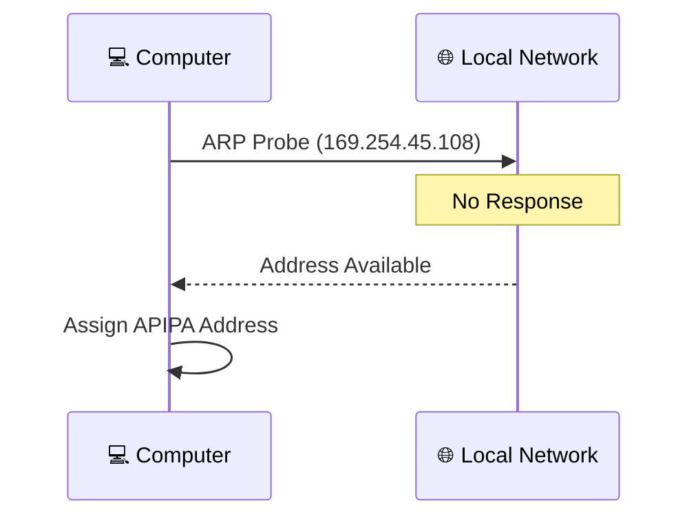

---

### ❌ Scenario 2 — Another Device Responds

If another computer replies to the ARP probe, the operating system immediately knows that the address is already in use.

Instead of creating a conflict, it simply:

1. Discards the current address.
2. Randomly selects another APIPA address.
3. Performs Duplicate Address Detection again.

This process repeats until a unique address is found.

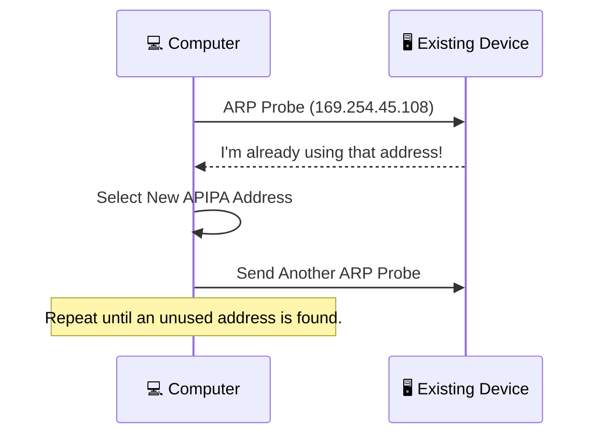

---

## 🔄 The Complete DAD Process

The entire Duplicate Address Detection process can be summarized as follows:

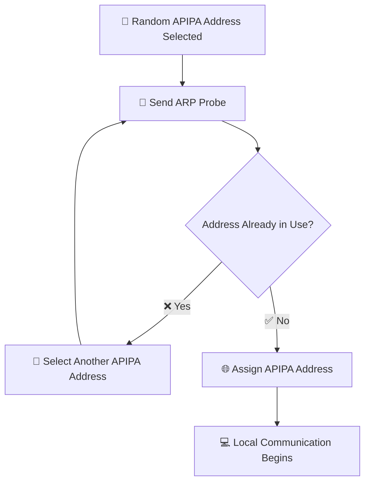

---

## 🌍 Real-World Analogy

Imagine you're parking your car in a large parking lot.

You don't simply park in the first space you see.

Instead, you first check whether another car is already parked there.

- 🚗 If the space is empty, you park.
- 🚙 If the space is occupied, you look for another available space.

Your computer follows exactly the same logic.

Instead of risking an IP address conflict, it checks whether the address is already "occupied" before using it.

---

## 💻 What Protocol Is Used?

Duplicate Address Detection relies on the **Address Resolution Protocol (ARP)**.

ARP is normally used to discover the **MAC address** associated with an IP address on the local network.

During APIPA assignment, Windows temporarily uses ARP in a different way:

- It sends an **ARP Probe** for the selected IP address.
- If no response is received, the address is assumed to be unused.
- If a response is received, another address is selected.

You'll learn much more about **ARP** later in the Networking module, where we'll explore how devices discover each other's MAC addresses and communicate on a local network.

---

## 🛡️ Why DAD Is Important

Duplicate Address Detection provides several important benefits:

- ✅ Prevents IP address conflicts.
- ✅ Improves network reliability.
- ✅ Allows automatic configuration without manual intervention.
- ✅ Ensures each APIPA device has a unique address.
- ✅ Reduces troubleshooting problems caused by duplicate IP addresses.

Without DAD, APIPA would be far less reliable because multiple devices could accidentally select the same address.

---

<!--
Image Description:
Create an educational diagram illustrating Duplicate Address Detection (DAD). Show a computer selecting an APIPA address, sending an ARP Probe to the local network, and receiving either no response (address assigned) or a response indicating the address is already in use (choose another address). Use a clean networking style with arrows and simple icons.

Suggested Filename:
Images/apipa_duplicate_address_detection.png
-->

<p align="center">

</p>

---

> 💡 **Point to Remember**
>
> Before using an APIPA address, the operating system performs **Duplicate Address Detection (DAD)** by sending an **ARP Probe**. If another device is already using the selected address, a new one is chosen automatically. This ensures that every APIPA device has a unique IP address and prevents network communication problems caused by duplicate addresses.

---

> 🤓 **Did You Know?**
>
> Duplicate Address Detection isn't unique to APIPA. Similar concepts are also used in **IPv6**, where devices verify that an address is unique before using it. Although the mechanisms differ, the goal is the same: preventing two devices from using the same IP address on the same network.

---

# ⚖️ APIPA vs DHCP

At first glance, **APIPA** and **DHCP** may seem similar because both allow a device to obtain an IP address automatically.

However, they serve **very different purposes**.

- **DHCP** is the standard method for automatically assigning IP addresses on a network.
- **APIPA** is a backup mechanism that activates only when DHCP is unavailable.

Think of APIPA as an **emergency fallback**, not a replacement for DHCP.

---

## 🎯 The Primary Purpose of Each

### 🌐 DHCP

DHCP (Dynamic Host Configuration Protocol) is designed to automatically configure devices so they can fully participate in a network.

A DHCP server provides:

- 🌐 IP Address
- 🎭 Subnet Mask
- 🚪 Default Gateway
- 🌍 DNS Server
- ⏳ Lease Duration

With this information, a device can communicate with:

- Other devices on the local network
- Other networks
- The Internet

DHCP is the preferred and most widely used method of IP address assignment.

---

### 🔄 APIPA

APIPA is designed for one specific situation:

> **When no DHCP server is available.**

Instead of leaving the computer without an IP address, the operating system automatically assigns a temporary **169.254.x.x** address.

This allows limited communication with nearby devices until DHCP becomes available again.

Unlike DHCP, APIPA does **not** provide a complete network configuration.

---

## 📊 Feature Comparison

| Feature | 🌐 DHCP | 🔄 APIPA |
|---------|---------|----------|
| IP Address Assignment | Automatic | Automatic (Fallback Only) |
| Requires DHCP Server | ✅ Yes | ❌ No |
| Address Range | Configured by Administrator | 169.254.0.0/16 |
| Default Gateway | ✅ Provided | ❌ Not Provided |
| DNS Server | ✅ Provided | ❌ Not Provided |
| Internet Access | ✅ Yes | ❌ Normally No |
| Router Communication | ✅ Yes | ❌ Local Link Only |
| Enterprise Networks | ✅ Standard | 🚨 Indicates a Problem |
| Temporary Solution | ❌ No | ✅ Yes |

---

## 🌍 Communication Comparison

The biggest difference between DHCP and APIPA is **how far a device can communicate**.

### 🌐 With DHCP

A DHCP-assigned device can communicate with:

- ✅ Other computers on the local network.
- ✅ Servers.
- ✅ Routers.
- ✅ Devices on remote networks.
- ✅ The Internet.


---

### 🔄 With APIPA

A device using an APIPA address is much more limited.

It can usually communicate only with devices on the same local network that are also using compatible addressing.

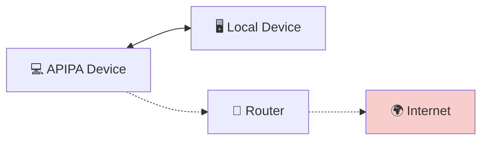

---

## 🏢 When Is Each Used?

### Use DHCP When

DHCP is the correct choice for almost every modern network.

Examples include:

- 🏠 Home networks
- 🏢 Offices
- 🏫 Schools
- ☁️ Cloud environments
- 🌍 Enterprise networks

DHCP provides automatic configuration while reducing administrative effort.

---

### APIPA Is Used When

APIPA is **not configured by an administrator**.

Instead, it activates automatically when:

- ❌ The DHCP server is offline.
- 🔌 A network cable is disconnected.
- 🌐 The router's DHCP service has failed.
- 🔥 DHCP traffic is blocked.
- ⚠️ The computer cannot contact a DHCP server.

It exists to keep the device functioning locally until the normal network configuration can be restored.

---

## 💻 Example Scenario

Imagine an employee starts their computer on Monday morning.

### Scenario 1 — DHCP Available

The computer receives:

```text
IP Address:      192.168.1.45
Subnet Mask:     255.255.255.0
Gateway:         192.168.1.1
DNS Server:      8.8.8.8
```

The employee can:

- Browse the Internet.
- Access shared folders.
- Print documents.
- Connect to company servers.

Everything works normally.

---

### Scenario 2 — DHCP Unavailable

The DHCP server is temporarily offline.

The computer assigns itself:

```text
IP Address:      169.254.85.120
Subnet Mask:     255.255.0.0
Gateway:         None
DNS Server:      None
```

The employee may be able to communicate with nearby devices using compatible local addressing, but Internet access and access to other networks will usually be unavailable.

---

## 🛠️ Which One Should You Use?

The answer is simple:

- **DHCP** should always be used whenever a DHCP server is available.
- **APIPA** should never be viewed as a preferred addressing method. It is an automatic recovery mechanism that activates only when DHCP fails.

If you discover a computer using an APIPA address on a network that should be using DHCP, it is often a sign that something needs to be investigated.

---

> 💡 **Point to Remember**
>
> **DHCP** is the standard method for automatically assigning IP addresses and complete network settings. **APIPA** is a temporary fallback mechanism that activates only when DHCP cannot be reached. Seeing an APIPA address on a managed network is usually an indication of a DHCP or connectivity problem rather than normal operation.

---

> 🤓 **Did You Know?**
>
> One of the first things many IT support technicians check when troubleshooting a "No Internet" complaint is the computer's IP address. If it begins with **169.254**, they immediately know the device was unable to obtain a DHCP lease and can focus their investigation on DHCP services or network connectivity.

---

# ⚖️ APIPA vs Static IP Addressing

By this point, you've learned about three different ways a device can obtain an IP address:

- 📝 Static IP Addressing
- 🌐 DHCP (Dynamic IP Addressing)
- 🔄 APIPA (Automatic Private IP Addressing)

Although all three methods assign IP addresses, they are designed for completely different purposes.

Understanding these differences is essential for designing, managing, and troubleshooting modern networks.

---

## 🎯 The Purpose of Each

### 📝 Static IP Addressing

A **Static IP Address** is manually configured by a network administrator or user.

The address remains the same until someone changes it manually.

Static IP addresses are commonly used for devices that must always be reachable at the same address, such as:

- 🌐 Web Servers
- 🖨️ Network Printers
- 🔥 Firewalls
- 📡 Routers
- 🗄️ Database Servers

Static addressing provides consistency and reliability.

---

### 🔄 APIPA

APIPA is completely different.

No administrator configures it.

Instead, the operating system automatically assigns an address **only when it cannot communicate with a DHCP server**.

Its purpose is not permanent networking—it simply provides temporary local communication until the network problem is resolved.

---

## 📊 Feature Comparison

| Feature | 📝 Static IP | 🔄 APIPA |
|----------|-------------|-----------|
| Configuration | Manual | Automatic |
| Administrator Required | ✅ Yes | ❌ No |
| IP Address Range | Any Valid Network Range | 169.254.0.0/16 |
| Permanent Address | ✅ Yes | ❌ No |
| Changes Automatically | ❌ No | ✅ Yes (when DHCP fails) |
| Internet Access | ✅ Yes (if configured correctly) | ❌ Normally No |
| Default Gateway | ✅ Configured | ❌ Not Assigned |
| DNS Server | ✅ Configured | ❌ Not Assigned |
| Typical Usage | Servers, Printers, Infrastructure | Temporary Emergency Address |

---

## 🌍 Real-World Example

Imagine a company network containing:

- 🌐 Web Server
- 🖨️ Network Printer
- 💻 Employee Laptop

Each device has different networking requirements.

### 🌐 Web Server

The web server must always be reachable at the same IP address.

If its address changed regularly, users and applications would no longer know where to find it.

A **Static IP Address** is the best choice.

---

### 🖨️ Network Printer

Employees expect to print documents throughout the day.

If the printer's IP address changed unexpectedly, every computer would need to be updated.

For this reason, printers are often assigned **Static IP Addresses** (or DHCP reservations, which you'll learn about later).

---

### 💻 Employee Laptop

Normally, the laptop receives its configuration automatically from a DHCP server.

However, if the DHCP server becomes unavailable, Windows may temporarily assign an **APIPA address**.

This allows limited local communication until the DHCP server is available again.

---

## 🔍 Which Method Should You Choose?

The answer depends on the device's role.

### Choose a Static IP Address when:

- The device must always have the same address.
- Other systems depend on finding it.
- It provides important network services.

Examples include:

- Servers
- Printers
- Firewalls
- Routers
- NAS devices

---

### APIPA Is Not a Choice

Unlike Static IP addressing, APIPA is **not something administrators intentionally configure**.

It is an automatic fallback mechanism built into the operating system.

If you see an APIPA address on a managed network, it usually indicates that the device could not obtain its normal network configuration.

Rather than configuring APIPA, administrators typically investigate why DHCP is unavailable.

---

## 💻 Troubleshooting Perspective

Suppose you're an IT support technician.

A user reports:

> **"I can't access the Internet."**

You run:

```powershell
ipconfig
```

The result shows:

```text
IPv4 Address : 169.254.72.15
```

From this single piece of information, you already know:

- ✅ The computer does **not** have its normal network configuration.
- ✅ It failed to obtain an IP address from DHCP.
- ✅ Windows assigned an APIPA address automatically.
- ✅ The next step is to investigate the DHCP server or the network connection—not manually configure a Static IP Address.

Recognizing this pattern can significantly reduce troubleshooting time.

---

## 🛡️ Best Practice

Modern networks typically use all three IP assignment methods appropriately:

- 📝 **Static IP Addresses** for critical infrastructure.
- 🌐 **DHCP** for client devices and automatic network management.
- 🔄 **APIPA** only as an automatic fallback when DHCP cannot provide an address.

Each method has a specific purpose, and understanding when each is used is an important skill for every network administrator.

---

> 💡 **Point to Remember**
>
> A **Static IP Address** is manually assigned and intended for long-term use. **APIPA** is automatically assigned by the operating system only when DHCP is unavailable. While Static IP addresses are part of a planned network design, APIPA addresses usually indicate a temporary network or DHCP-related problem.

---

> 🤓 **Did You Know?**
>
> In enterprise environments, administrators rarely solve an APIPA issue by assigning a Static IP Address. Instead, they investigate the underlying cause—such as a failed DHCP server, a disconnected cable, or a switch configuration problem—to restore normal network operation.

---

# 🌍 Real-World Examples

Understanding APIPA is much easier when you see it in real networking situations.

In this section, we'll examine several scenarios where APIPA may appear and explain what is happening behind the scenes.

As you read each example, try to identify **why the device received an APIPA address** and what steps would restore normal network connectivity.

---

# 🏠 Scenario 1 — Home Router with DHCP Disabled

Ali purchases a new Wi-Fi router and accidentally disables the **DHCP Server** while exploring the router's settings.

Later, he connects his laptop to the Wi-Fi network.

The laptop waits for an IP address, but no DHCP server responds.

After several attempts, Windows automatically assigns:

```text
169.254.86.142
```

Although the laptop is connected to the Wi-Fi network, Ali cannot browse the Internet.

### 🔍 What Happened?

The wireless connection is working correctly.

The problem is that **no DHCP server is available** to assign a valid IP address.

Windows activates APIPA as a temporary fallback.

### ✅ Solution

- Enable the DHCP server on the router.
- Renew the IP address.
- The laptop receives a normal DHCP-assigned address.

---

<!--
Image Description:
Illustrate a home router with the DHCP service disabled. Show a laptop connected to the router receiving an APIPA address (169.254.x.x) and failing to reach the Internet. Use warning icons to indicate the disabled DHCP server.

Suggested Filename:
Images/apipa_home_router.png
-->

<p align="center">

</p>

---

# 🏢 Scenario 2 — Office DHCP Server Failure

A company's DHCP server suddenly crashes during business hours.

Within the next hour:

- New employee laptops cannot obtain IP addresses.
- Existing devices continue working until their DHCP leases expire.
- Newly connected devices begin displaying **169.254.x.x** addresses.

Employees report:

> "The network is connected, but nothing works."

### 🔍 What Happened?

The computers attempted to obtain an IP address from the DHCP server.

Since the server was unavailable, Windows assigned APIPA addresses instead.

Without a valid gateway and DNS server, users could not reach company resources or the Internet.

### ✅ Solution

Restore the DHCP service.

Once the server is available again, client computers automatically request new DHCP leases and replace their APIPA addresses.

---

# 🔌 Scenario 3 — Connecting Two Computers Directly

Suppose you connect two Windows computers directly using an Ethernet cable.

There is:

- No router
- No switch with DHCP
- No DHCP server

After a short time, both computers assign themselves APIPA addresses.

For example:

```text
Computer A

169.254.45.20
```

```text
Computer B

169.254.45.35
```

Because both devices are using compatible APIPA addresses on the same local link, they can communicate directly with each other.

This is one of the few situations where APIPA can be useful without indicating a network problem.

---

<!--
Image Description:
Show two computers connected directly by an Ethernet cable with no router or DHCP server. Both devices automatically receive APIPA addresses (169.254.x.x) and successfully communicate with each other.

Suggested Filename:
Images/apipa_direct_connection.png
-->

<p align="center">

</p>

---

# ☕ Scenario 4 — Public Wi-Fi Network

You visit a coffee shop and connect your laptop to the free Wi-Fi.

The wireless signal is strong, but the hotspot's DHCP service has stopped responding.

After several failed DHCP requests, your laptop assigns itself:

```text
169.254.112.90
```

The Wi-Fi icon shows that you're connected, but every website fails to load.

### 🔍 What Happened?

Your device successfully connected to the wireless network.

However, it never received a valid network configuration because the DHCP service failed.

Without a gateway or DNS server, Internet access is impossible.

### ✅ Solution

The hotspot operator must restore the DHCP service, or you can reconnect once the issue has been resolved.

---

# 🛠️ Scenario 5 — IT Troubleshooting

An employee contacts the IT help desk and says:

> **"I have no Internet connection."**

The technician opens Command Prompt and runs:

```powershell
ipconfig
```

The result shows:

```text
IPv4 Address. . . . . . : 169.254.33.118
```

Immediately, the technician knows:

- ✅ The network adapter is functioning.
- ✅ The computer attempted to obtain an IP address.
- ✅ No DHCP server responded.
- ✅ Windows assigned an APIPA address automatically.

Instead of troubleshooting the web browser or reinstalling software, the technician investigates:

- Is the Ethernet cable connected?
- Is the Wi-Fi connected correctly?
- Is the DHCP server running?
- Is the switch functioning properly?
- Is DHCP traffic being blocked?

Recognizing an APIPA address saves valuable troubleshooting time.

---

# 📊 Summary of the Scenarios

| Scenario | APIPA Used? | Internet Access | Main Cause |
|-----------|-------------|-----------------|------------|
| Home Router (DHCP Disabled) | ✅ Yes | ❌ No | DHCP Disabled |
| Office DHCP Server Failure | ✅ Yes | ❌ No | DHCP Server Offline |
| Direct PC-to-PC Connection | ✅ Yes | ⚠️ Local Only | No DHCP Server Present |
| Public Wi-Fi DHCP Failure | ✅ Yes | ❌ No | DHCP Service Failure |
| IT Troubleshooting | ✅ Yes | Usually No | DHCP or Connectivity Issue |

---

> 💡 **Point to Remember**
>
> In most real-world environments, an APIPA address is **not the root problem—it is a symptom of another problem.** When you see an IP address beginning with **169.254**, your first step should be to investigate why the device could not obtain a DHCP lease rather than assuming the computer itself is faulty.

---

> 🤓 **Did You Know?**
>
> Experienced network administrators often recognize a **169.254.x.x** address instantly. Before running advanced diagnostic tools, they know to verify the network connection and DHCP service because APIPA almost always points to a DHCP-related issue rather than a hardware failure.

---

# 🛡️ Cybersecurity Perspective

At first glance, APIPA may seem like a simple networking feature with little connection to cybersecurity.

However, cybersecurity professionals regularly encounter APIPA addresses during incident response, vulnerability assessments, security monitoring, and network troubleshooting.

Understanding what an APIPA address means helps analysts quickly determine whether a problem is caused by a network configuration issue or something more serious.

---

## 🔍 APIPA as a Troubleshooting Clue

One of the first things security analysts examine when investigating a connectivity issue is the device's IP address.

If the address begins with:

```text
169.254.x.x
```

it immediately suggests that the device could not obtain a valid IP address from a DHCP server.

Instead of assuming malware or a cyberattack is responsible, the analyst first investigates basic networking problems such as:

- 🔌 Disconnected network cables.
- 📡 Wireless connectivity issues.
- 🌐 DHCP server failures.
- 🔥 Firewall rules blocking DHCP traffic.
- ⚙️ Incorrect switch or router configurations.

Understanding APIPA helps analysts avoid wasting time investigating the wrong problem.

---

## 🚨 APIPA During Incident Response

During a security incident, responders often collect network information from affected devices.

One of the first commands they may run is:

```powershell
ipconfig /all
```

If the output shows:

```text
IPv4 Address : 169.254.82.45
```

the responder immediately knows:

- The device does not have a normal network configuration.
- Communication problems may be caused by DHCP failure rather than malicious activity.
- Additional investigation should focus on the network infrastructure before drawing conclusions.

This information helps responders prioritize their investigation.

---

## 🖥️ APIPA in Security Monitoring

Security teams continuously monitor network activity using tools such as:

- Security Information and Event Management (SIEM) systems
- Endpoint Detection and Response (EDR) platforms
- Network monitoring tools
- Asset management systems

When multiple devices suddenly begin reporting APIPA addresses, it may indicate:

- DHCP server failure.
- Network switch outage.
- Router misconfiguration.
- Large-scale network connectivity problems.

Although APIPA itself is not a security threat, widespread APIPA assignments may signal an infrastructure issue that requires immediate attention.

---

## 🎯 APIPA During Penetration Testing

Penetration testers frequently work in unfamiliar network environments.

If their testing machine receives an APIPA address, they immediately recognize that:

- No DHCP server responded.
- The network may be isolated.
- The network cable may be disconnected.
- Access to the intended network has not been established.

Rather than assuming the target network is secure, they first verify that their device has obtained a valid network configuration.

---

## ⚠️ Don't Mistake APIPA for an Attack

A beginner might see a **169.254.x.x** address and assume the network has been hacked.

In reality, APIPA usually indicates a networking problem—not a cyberattack.

Good security professionals always eliminate simple explanations before investigating more complex ones.

This principle is important in cybersecurity:

> **Verify the network is functioning correctly before assuming malicious activity.**

---

## 💼 Real-World Example

Imagine a Security Operations Center (SOC) receives several alerts indicating that employees cannot access internal systems.

The analyst checks one affected computer and finds:

```text
IPv4 Address : 169.254.144.91
```

Instead of immediately searching for malware, the analyst contacts the network team.

A few minutes later, they discover that the organization's DHCP server unexpectedly stopped responding after a software update.

Once the DHCP service is restored, devices automatically receive valid IP addresses and normal communication resumes.

In this case, understanding APIPA prevented the security team from wasting valuable time investigating a problem that was actually caused by a network service failure.

---

## 📋 Best Practices for Security Professionals

Whenever you encounter an APIPA address:

1. Verify the physical network connection.
2. Confirm the device is connected to the correct network.
3. Check whether the DHCP server is operational.
4. Test communication with the default gateway.
5. Review switch, router, and firewall configurations.
6. Only after confirming the network is functioning correctly should you investigate possible security-related causes.

Following this logical approach makes troubleshooting faster and more accurate.

---

> 💡 **Point to Remember**
>
> APIPA is **not a security vulnerability or a cyberattack.** Instead, it is an important diagnostic clue that tells cybersecurity professionals a device could not obtain a normal IP address from a DHCP server. Recognizing an APIPA address helps analysts quickly distinguish network configuration problems from genuine security incidents.

---

> 🤓 **Did You Know?**
>
> One of the most valuable skills in cybersecurity is knowing when **not** to suspect an attack. Experienced analysts first verify basic networking components—such as IP addressing, DHCP, DNS, and routing—before investigating more advanced threats. Many incidents that initially appear suspicious are ultimately traced back to simple network configuration problems.

---

# 💻 Mini Lab — Identifying an APIPA Address

In this lab, you'll inspect your computer's current network configuration and learn how to recognize whether your device is using a **DHCP-assigned IP address** or an **APIPA address**.

> **🎯 Lab Goal**
>
> By the end of this exercise, you will be able to:
>
> - View your computer's IP configuration.
> - Identify whether the IP address was assigned by DHCP or APIPA.
> - Renew a DHCP lease.
> - Understand what an APIPA address indicates during troubleshooting.

---

## 🛠️ Lab Requirements

Before starting, ensure you have:

- 💻 A Windows computer
- 🌐 A network connection (Ethernet or Wi-Fi)
- 👤 A Command Prompt or Windows Terminal

---

## Step 1 — Open Command Prompt

Press:

```text
Windows + R
```

Type:

```text
cmd
```

Then press **Enter**.

A Command Prompt window will open.

---

## Step 2 — View Your IP Configuration

Run the following command:

```powershell
ipconfig
```

You will see output similar to:

```text
Ethernet adapter Ethernet:

   IPv4 Address . . . . . . . . : 192.168.1.25
   Subnet Mask  . . . . . . . . : 255.255.255.0
   Default Gateway . . . . . .  : 192.168.1.1
```

or

```text
Wireless LAN adapter Wi-Fi:

   IPv4 Address . . . . . . . . : 169.254.85.120
   Subnet Mask  . . . . . . . . : 255.255.0.0
```

---

## Step 3 — Identify Your Address Type

Compare your IPv4 address with the table below.

| IP Address | Meaning |
|------------|---------|
| **192.168.x.x** | Usually assigned by DHCP or configured manually. |
| **10.x.x.x** | Usually assigned by DHCP or configured manually. |
| **172.16–31.x.x** | Usually assigned by DHCP or configured manually. |
| **169.254.x.x** | APIPA address assigned because DHCP was unavailable. |

Ask yourself:

- Does my address begin with **169.254**?
- Is a **Default Gateway** listed?
- Can I access the Internet?

---

## Step 4 — View Detailed Network Information

Now run:

```powershell
ipconfig /all
```

Look for information such as:

- IPv4 Address
- DHCP Enabled
- DHCP Server
- Default Gateway
- DNS Servers
- Physical (MAC) Address

If your computer received its configuration from DHCP, you should see the DHCP server listed in the output.

---

## Step 5 — Renew Your DHCP Lease

Next, request a new IP address from the DHCP server.

Release the current lease:

```powershell
ipconfig /release
```

Then request a new one:

```powershell
ipconfig /renew
```

If a DHCP server is available, Windows will obtain a new IP address automatically.

---

## 🔍 Expected Results

### ✅ DHCP Available

You should receive:

- A valid IPv4 address
- A subnet mask
- A default gateway
- DNS server information

Example:

```text
IPv4 Address : 192.168.1.25
Default Gateway : 192.168.1.1
```

---

### ⚠️ DHCP Unavailable

If no DHCP server responds, Windows may eventually assign an APIPA address.

Example:

```text
IPv4 Address : 169.254.84.52
Subnet Mask  : 255.255.0.0
```

This indicates that Windows could not obtain a DHCP lease.

> **Note:** You do **not** need to intentionally disable your router or DHCP server to observe this behavior. Simply understand that this is the result you would see if DHCP were unavailable.

---

## 📝 Reflection Questions

Answer the following questions before moving on:

1. What IPv4 address did your computer receive?
2. Was the address assigned by DHCP or APIPA?
3. Did your output include a Default Gateway?
4. Why would an APIPA address prevent normal Internet access?
5. Which command displays detailed network configuration information?

---

## 🎯 Lab Summary

Congratulations! 🎉

In this lab, you learned how to:

- ✅ View your computer's IP configuration.
- ✅ Identify a DHCP-assigned IP address.
- ✅ Recognize an APIPA address.
- ✅ Renew a DHCP lease using Command Prompt.
- ✅ Understand what an APIPA address tells you during troubleshooting.

These are basic but essential skills used daily by network administrators, help desk technicians, and cybersecurity professionals when diagnosing connectivity issues.

---

> **💡 Challenge**
>
> Open **Command Prompt** on another Windows computer (or ask a friend to do so) and compare the output of `ipconfig`. Identify whether each device is using a DHCP-assigned IP address or an APIPA address, and explain how you reached your conclusion.

# 🔑 Key Takeaways

Before moving on to the review questions, let's summarize the most important concepts from this chapter.

- 🌐 **APIPA (Automatic Private IP Addressing)** is a fallback mechanism that automatically assigns an IP address when a device cannot obtain one from a DHCP server.

- 📡 A computer **always attempts to contact a DHCP server first**. APIPA is used only after multiple DHCP requests fail.

- 📍 All APIPA addresses belong to the reserved **169.254.0.0/16** address range, making them easy to recognize during troubleshooting.

- 🔍 Before assigning an APIPA address, the operating system performs **Duplicate Address Detection (DAD)** using **ARP Probes** to ensure the selected address is not already in use.

- 🚫 APIPA provides only a **temporary local IP address**. It does **not** assign a default gateway or DNS server, which means Internet access is normally unavailable.

- ⚖️ **DHCP**, **Static IP Addressing**, and **APIPA** each serve different purposes:
  - **DHCP** automatically assigns complete network configurations.
  - **Static IP Addressing** is manually configured for devices that require permanent addresses.
  - **APIPA** provides temporary addressing when DHCP is unavailable.

- 🌍 In most environments, seeing an IP address beginning with **169.254** is a strong indication that the device could not communicate with a DHCP server.

- 🛡️ For network administrators and cybersecurity professionals, an APIPA address is an important **diagnostic clue**, helping them quickly identify DHCP-related or network connectivity issues.

- 💻 Commands such as **`ipconfig`** and **`ipconfig /all`** are commonly used to identify APIPA addresses and inspect a device's network configuration.

- 🎯 APIPA is **not a replacement for DHCP**. It is a temporary recovery mechanism that allows limited local communication until a DHCP server becomes available again.

---

> 💡 **Final Thought**
>
> An APIPA address is more than just another IP address—it is the operating system's way of saying, **"I tried to obtain a network configuration, but I couldn't reach a DHCP server."** Recognizing this message is one of the quickest ways to diagnose and troubleshoot network connectivity problems.

# 🧠 Quick Check

Before moving on to the full knowledge assessment, take a few moments to answer these short questions.

Try to answer them **without looking back** at the chapter. If you struggle with any question, revisit the relevant section before continuing.

---

## Question 1

**What does APIPA stand for?**

<details>
<summary>💡 Show Answer</summary>

**APIPA** stands for **Automatic Private IP Addressing**.

It is a fallback mechanism that automatically assigns an IP address when a device cannot obtain one from a DHCP server.

</details>

---

## Question 2

**What IP address range is reserved for APIPA?**

<details>
<summary>💡 Show Answer</summary>

The APIPA address range is:

```text
169.254.0.0/16
```

Any IPv4 address beginning with **169.254** is typically an APIPA address.

</details>

---

## Question 3

**What is the primary purpose of APIPA?**

<details>
<summary>💡 Show Answer</summary>

APIPA allows a device to assign itself a temporary IP address when a DHCP server cannot provide one.

It enables limited communication on the local network until normal DHCP service is restored.

</details>

---

## Question 4

**Does APIPA normally provide Internet access? Why or why not?**

<details>
<summary>💡 Show Answer</summary>

No.

APIPA does not assign a **Default Gateway** or **DNS Server**, so the device usually cannot communicate outside its local network.

</details>

---

## Question 5

**What safety mechanism prevents two APIPA devices from using the same IP address?**

<details>
<summary>💡 Show Answer</summary>

**Duplicate Address Detection (DAD).**

The operating system sends an **ARP Probe** to check whether the selected IP address is already in use before assigning it.

</details>

---

## Question 6

**What command can you run on Windows to view your current IP address?**

<details>
<summary>💡 Show Answer</summary>

```powershell
ipconfig
```

For more detailed information, use:

```powershell
ipconfig /all
```

</details>

---

## Question 7

**You run `ipconfig` and see the following address:**

```text
169.254.87.21
```

**What does this tell you?**

<details>
<summary>💡 Show Answer</summary>

The computer could not obtain an IP address from a DHCP server.

Windows automatically assigned an APIPA address as a temporary fallback.

</details>

---

## 🎯 Self-Assessment

How did you do?

- ✅ **7/7** — Excellent! You have a solid understanding of APIPA and its purpose.
- 🟡 **5–6/7** — Good job! Review the sections on **Duplicate Address Detection (DAD)** and the **APIPA address range**.
- 🟠 **3–4/7** — You're making progress, but it's worth revisiting the chapter before moving on.
- 🔴 **0–2/7** — Read through the chapter again and complete the Mini Lab before continuing.

---

> 💡 **Tip**
>
> Don't worry if you didn't answer every question correctly. Networking concepts become much easier with practice. The important thing is understanding **why** APIPA exists and recognizing what a **169.254.x.x** address tells you during troubleshooting.

# 📖 Knowledge Check

Test your understanding of APIPA by answering the following questions.

Try to answer each question **before revealing the correct answer**. These questions are designed to reinforce the concepts covered in this chapter and prepare you for certification-style exams.

---

## Question 1

**What does APIPA stand for?**

- A. Automatic Public Internet Protocol Assignment
- B. Automatic Private IP Addressing
- C. Assigned Private Internet Protocol Access
- D. Automatic Protocol Internet Address

<details>
<summary>💡 Show Answer</summary>

**✅ Correct Answer: B. Automatic Private IP Addressing**

APIPA automatically assigns a temporary IP address when a DHCP server cannot be reached.

</details>

---

## Question 2

**Which IP address range is reserved for APIPA?**

- A. 10.0.0.0/8
- B. 172.16.0.0/12
- C. 192.168.0.0/16
- D. 169.254.0.0/16

<details>
<summary>💡 Show Answer</summary>

**✅ Correct Answer: D. 169.254.0.0/16**

Every APIPA address begins with **169.254**.

</details>

---

## Question 3

**When does Windows assign an APIPA address?**

- A. Every time the computer starts
- B. When a Static IP Address is configured
- C. When the device cannot obtain an IP address from a DHCP server
- D. Whenever the Internet connection is slow

<details>
<summary>💡 Show Answer</summary>

**✅ Correct Answer: C**

APIPA is activated only after multiple attempts to contact a DHCP server have failed.

</details>

---

## Question 4

**Which protocol is used during Duplicate Address Detection (DAD)?**

- A. DNS
- B. HTTP
- C. ARP
- D. FTP

<details>
<summary>💡 Show Answer</summary>

**✅ Correct Answer: C. ARP**

Windows sends an **ARP Probe** to determine whether the selected APIPA address is already in use.

</details>

---

## Question 5

**What is the primary purpose of APIPA?**

- A. Replace DHCP permanently
- B. Improve Internet speed
- C. Provide temporary local communication when DHCP is unavailable
- D. Secure network traffic

<details>
<summary>💡 Show Answer</summary>

**✅ Correct Answer: C**

APIPA is a temporary fallback mechanism that allows limited local communication until DHCP becomes available again.

</details>

---

## Question 6

**A computer has the IP address `169.254.55.120`. What does this most likely indicate?**

- A. The computer is using a Static IP Address
- B. The DHCP server could not be reached
- C. The DNS server is offline
- D. The router is functioning normally

<details>
<summary>💡 Show Answer</summary>

**✅ Correct Answer: B**

An address beginning with **169.254** indicates that Windows assigned an APIPA address because a DHCP lease could not be obtained.

</details>

---

## Question 7

**Which of the following is *not* normally provided by APIPA?**

- A. IPv4 Address
- B. Subnet Mask
- C. Default Gateway
- D. Link-local communication

<details>
<summary>💡 Show Answer</summary>

**✅ Correct Answer: C**

APIPA does not assign a **Default Gateway**, which is one reason Internet access is usually unavailable.

</details>

---

## Question 8

**Why does APIPA perform Duplicate Address Detection before assigning an address?**

- A. To increase Internet speed
- B. To prevent duplicate IP address conflicts
- C. To encrypt network traffic
- D. To discover DHCP servers

<details>
<summary>💡 Show Answer</summary>

**✅ Correct Answer: B**

Duplicate Address Detection ensures that no other device on the local network is already using the selected IP address.

</details>

---

## Question 9

**Which Windows command displays detailed network configuration information?**

- A. ping
- B. tracert
- C. ipconfig /all
- D. nslookup

<details>
<summary>💡 Show Answer</summary>

**✅ Correct Answer: C**

`ipconfig /all` displays detailed information including the IPv4 address, DHCP server, DNS servers, MAC address, and more.

</details>

---

## Question 10

**Which statement best describes the relationship between DHCP and APIPA?**

- A. APIPA replaces DHCP.
- B. DHCP and APIPA perform exactly the same function.
- C. APIPA is a temporary fallback used only when DHCP fails.
- D. DHCP is only used on small networks.

<details>
<summary>💡 Show Answer</summary>

**✅ Correct Answer: C**

DHCP is the standard method of automatic IP assignment, while APIPA is an emergency fallback mechanism used only when a DHCP server cannot be reached.

</details>

---

## 🏆 Score Yourself

| Score | Performance |
|--------|-------------|
| **9–10** | 🌟 Excellent! You have a strong understanding of APIPA and can confidently move to the next chapter. |
| **7–8** | ✅ Good work! Review any questions you missed to strengthen your understanding. |
| **5–6** | 🟡 Fair. Revisit the sections on **How APIPA Works** and **Duplicate Address Detection (DAD)** before continuing. |
| **0–4** | 🔴 Review the entire chapter, complete the Mini Lab again, and retake this assessment. |

---

> 💡 **Exam Tip**
>
> In certification exams such as **CompTIA Network+** and **CCNA**, an IP address beginning with **169.254** is an immediate clue that the device failed to obtain a DHCP lease. Recognizing this pattern can help you answer troubleshooting questions quickly and accurately.

---
---
# 📖 Continue Your Learning

Congratulations! 🎉 You have completed the **APIPA (Automatic Private IP Addressing)** chapter.

You now understand:

- ✅ Why APIPA exists and why operating systems assign APIPA addresses.
- ✅ How devices automatically configure themselves when a DHCP server is unavailable.
- ✅ The **169.254.0.0/16** APIPA address range.
- ✅ How Duplicate Address Detection (DAD) prevents IP conflicts.
- ✅ The differences between APIPA, DHCP, and Static IP addressing.
- ✅ How APIPA helps network administrators and cybersecurity professionals during troubleshooting.

In the next chapter, you will explore **Loopback Addresses**, where you will learn how devices communicate with themselves, why the **127.0.0.0/8** address range is reserved, and how loopback addresses are used in networking, application testing, and security analysis.

> **🚀 Next Lesson:** [**Loopback Address**](07-Loopback%20Address.md)