# 🔄 Loopback Address

> *Learn what a loopback address is, why it exists, how it works, and why it is one of the most important tools for network testing and troubleshooting.*


---

# 📖 Table of Contents

- [🎯 Learning Objectives](#-learning-objectives)
- [📖 What Is a Loopback Address?](#-what-is-a-loopback-address)
- [🤔 Why Do We Need a Loopback Address?](#-why-do-we-need-a-loopback-address)
- [⚙️ How the Loopback Address Works](#️-how-the-loopback-address-works)
- [🌐 The Loopback Address Range](#-the-loopback-address-range)
- [📍 Understanding 127.0.0.1 (Localhost)](#-understanding-127001-localhost)
- [🔄 Loopback vs APIPA](#-loopback-vs-apipa)
- [🔄 Loopback vs Private IP Address](#-loopback-vs-private-ip-address)
- [🌍 Real-World Examples](#-real-world-examples)
- [🛡️ Cybersecurity Perspective](#️-cybersecurity-perspective)
- [💻 Mini Lab](#-mini-lab)
- [🔑 Key Takeaways](#-key-takeaways)
- [🧠 Quick Check](#-quick-check)
- [📖 Knowledge Check](#-knowledge-check)
- [🚀 Challenge Questions](#-challenge-questions)
- [📝 Chapter Summary](#-chapter-summary)
- [🧭 Chapter Navigation](#-chapter-navigation)
- [📖 Continue Your Learning](#-continue-your-learning)

---

# 🎯 Learning Objectives

After completing this chapter, you will be able to:

- Explain what a Loopback Address is.
- Understand why Loopback Addressing exists.
- Describe how loopback communication works.
- Identify the Loopback Address range.
- Explain why **127.0.0.1** is called **localhost**.
- Differentiate between Loopback Addresses, APIPA addresses, and Private IP addresses.
- Use the loopback address for network testing and troubleshooting.
- Understand the importance of loopback addressing in cybersecurity and system administration.

---
# 🔄 Loopback Address

> *Learn what a Loopback Address is, why it exists, how it allows a computer to communicate with itself, and why it is one of the most important tools for network testing and troubleshooting.*


---

# 📖 Table of Contents

- [🎯 Learning Objectives](#-learning-objectives)
- [📖 What Is a Loopback Address?](#-what-is-a-loopback-address)
- [🤔 Why Do We Need a Loopback Address?](#-why-do-we-need-a-loopback-address)
- [⚙️ How the Loopback Address Works](#️-how-the-loopback-address-works)
- [🌐 The Loopback Address Range](#-the-loopback-address-range)
- [📍 Understanding 127.0.0.1 (Localhost)](#-understanding-127001-localhost)
- [🔄 Loopback vs APIPA](#-loopback-vs-apipa)
- [🔄 Loopback vs Private IP Address](#-loopback-vs-private-ip-address)
- [🌍 Real-World Examples](#-real-world-examples)
- [🛡️ Cybersecurity Perspective](#️-cybersecurity-perspective)
- [💻 Mini Lab](#-mini-lab)
- [🔑 Key Takeaways](#-key-takeaways)
- [🧠 Quick Check](#-quick-check)
- [📖 Knowledge Check](#-knowledge-check)
- [🚀 Challenge Questions](#-challenge-questions)
- [📝 Chapter Summary](#-chapter-summary)
- [🧭 Chapter Navigation](#-chapter-navigation)
- [📖 Continue Your Learning](#-continue-your-learning)

---

# 🎯 Learning Objectives

After completing this chapter, you will be able to:

- Explain what a Loopback Address is.
- Understand why Loopback Addressing exists.
- Describe how a computer communicates with itself using the loopback interface.
- Identify the IPv4 Loopback Address range.
- Explain why **127.0.0.1** is known as **localhost**.
- Differentiate between Loopback Addresses, APIPA addresses, and Private IP addresses.
- Use the loopback address to test network software and services.
- Understand why the loopback interface is important in networking and cybersecurity.

---

# 📖 What Is a Loopback Address?

Imagine you want to test whether your computer's networking software is working correctly.

Normally, when your computer sends data across a network, the information travels through several networking devices such as:

- 🌐 Network Interface Card (NIC)
- 🔀 Switch
- 📡 Router
- 🌍 The Internet (if necessary)

But what if you simply want to test **your own computer** without involving any external devices?

Should the data leave your computer and travel across the network?

The answer is **no**.

Instead, the operating system provides a special mechanism called the **Loopback Interface**, which allows a computer to communicate with **itself**.

---

## 📚 Definition

A **Loopback Address** is a special IP address that allows a computer to send network traffic to itself for testing and diagnostic purposes.

When a program sends data to a loopback address, the operating system immediately returns the data back to the same computer instead of sending it onto the physical network.

This allows applications and network services to be tested without requiring a network cable, switch, router, or Internet connection.

---

## 🏠 Real-World Analogy

Imagine writing a letter to yourself.

Normally, you would send a letter through the postal system:

- 📮 Drop the letter into a mailbox.
- 🚚 The postal service transports it.
- 🏠 It is delivered to your home.

Now imagine there is a special mailbox inside your house.

Instead of sending the letter through the postal service, you place it into this mailbox, and it immediately returns to you.

The letter never leaves your house.

A Loopback Address works in exactly the same way.

Instead of sending network traffic to another computer, the operating system sends the data directly back to itself.

---

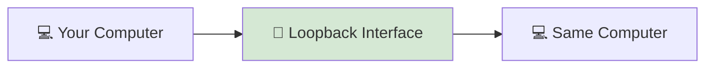

---

<!--
Image Description:
Create an educational illustration showing a computer sending a network packet to itself through the Loopback Interface. The packet should leave an application, pass through the operating system's networking stack, and immediately return to the same computer without reaching the network card, switch, or router. Use a clean beginner-friendly networking style.

Suggested Filename:
Images/loopback_overview.png
-->

<p align="center">

</p>

---

## 🎯 Why Is a Loopback Address Important?

The Loopback Address is one of the most useful tools for testing and troubleshooting networking software.

It allows you to:

- 🧪 Test whether the TCP/IP protocol stack is functioning correctly.
- 🌐 Verify that local network services are running.
- 💻 Develop and test applications without connecting to a network.
- 🔍 Diagnose networking problems before checking cables, switches, or routers.
- 🛡️ Verify that networking software is working even when the computer is offline.

Because loopback communication never leaves the computer, it provides a safe and reliable way to test networking functionality.

---

> 💡 **Point to Remember**
>
> A **Loopback Address** allows a computer to communicate with **itself**. Data sent to a loopback address never travels across the physical network—it is processed entirely within the operating system, making it ideal for testing and troubleshooting.

---

> 🤓 **Did You Know?**
>
> Every modern operating system—including **Windows**, **Linux**, and **macOS**—creates a loopback interface automatically. Even if your computer is not connected to a network, the loopback interface is still available for local communication and testing.

---

# 🤔 Why Do We Need a Loopback Address?

After learning that a computer can send network traffic to itself, you might wonder:

> **"Why would a computer need to communicate with itself?"**

At first, this may seem unnecessary. After all, networks are designed to connect different devices.

However, there are many situations where a computer needs to test its own networking capabilities without involving any external hardware or network infrastructure.

This is exactly why the **Loopback Address** exists.

---

## 🌐 The Normal Communication Process

Normally, when one computer communicates with another, the data travels through several networking components.

For example:

```text
Computer A
      │
      ▼
Network Interface Card (NIC)
      │
      ▼
Switch
      │
      ▼
Router
      │
      ▼
Computer B
```

If any part of this path fails, communication may stop.

The problem is that when a connection fails, it can be difficult to determine **where** the problem actually exists.

Is it:

- 🔌 A faulty network cable?
- 🌐 A damaged network adapter?
- 🔀 A switch failure?
- 📡 A router configuration issue?
- 💻 A problem with the operating system's networking software?

Without testing the computer itself, it's difficult to know where to begin troubleshooting.

---

## 💡 Testing the Computer Without the Network

Suppose you want to verify that your computer's **TCP/IP networking stack** is functioning correctly.

You don't need:

- An Internet connection
- A router
- A switch
- Another computer

Instead, you simply send data to the **Loopback Address**.

The operating system processes the data internally and immediately returns it to the sending application.

Because the traffic never leaves the computer, you can confirm that the networking software is working correctly without relying on any external devices.

---

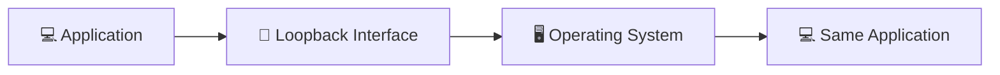

---

## 🛠️ Simplifying Network Troubleshooting

Imagine you run the following command:

```powershell
ping 127.0.0.1
```

If the command succeeds, you immediately know that:

- ✅ The TCP/IP protocol stack is functioning.
- ✅ The operating system's networking software is working.
- ✅ The loopback interface is operational.

If the command fails, the issue is likely inside the computer itself rather than with the network.

This simple test helps administrators narrow down the source of a problem before investigating cables, switches, routers, or Internet connectivity.

---

## 💻 Supporting Local Applications

Many applications communicate using networking protocols even when all communication occurs on the same computer.

For example:

- 🌐 A web browser connecting to a local web server.
- 🗄️ A database server communicating with a local application.
- ⚙️ Development tools testing APIs on the local machine.
- 🐳 Docker containers exposing services on the host computer.

Rather than sending traffic onto the physical network, these applications use the loopback interface for fast and secure local communication.

---

## 🌍 Real-World Analogy

Imagine you want to test your home's intercom system.

You don't need to call your neighbor or use the public telephone network.

Instead, you press the button inside your own house and immediately hear your own voice through the speaker.

Because the communication stays entirely within the house, you can verify that the intercom system works without depending on anything outside.

A loopback address works in exactly the same way.

It allows a computer to test its own networking functions internally, without relying on external devices or network infrastructure.

---

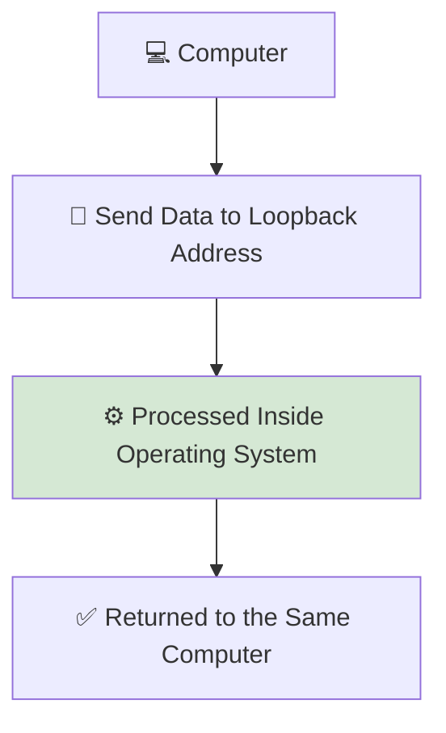

---

<!--
Image Description:
Create an educational illustration comparing normal network communication with loopback communication. On the left, show data traveling from one computer through a switch and router to another computer. On the right, show a computer sending data to the loopback interface, where the packet immediately returns to the same computer without leaving the operating system. Use a clean networking style suitable for beginners.

Suggested Filename:
Images/why_loopback_exists.png
-->

<p align="center">

</p>

---

## 🎯 Why Is This Important?

Without a loopback address, testing network software would require:

- Another computer
- A working network cable
- A switch or router
- A properly functioning network

The loopback interface removes all of these dependencies.

It gives administrators, developers, and cybersecurity professionals a quick and reliable way to verify that the computer's own networking software is working correctly before investigating external network problems.

---

> 💡 **Point to Remember**
>
> The Loopback Address exists so a computer can test its own networking software without sending data onto the physical network. This makes it an essential tool for troubleshooting, software development, and verifying that the TCP/IP protocol stack is functioning correctly.

---

> 🤓 **Did You Know?**
>
> The very first network test many administrators perform is:
>
> ```powershell
> ping 127.0.0.1
> ```
>
> If this test fails, they know the problem is likely inside the local computer rather than somewhere else on the network.

# ⚙️ How the Loopback Address Works

Now that you understand **why the Loopback Address exists**, let's see what actually happens when a computer sends data to itself.

Although the process may seem unusual, the operating system handles it automatically without involving any external networking hardware.

Let's examine the process step by step.

---

## Step 1 — An Application Sends Data

Everything begins with an application that wants to communicate using the network.

For example:

- 🌐 A web browser
- 🗄️ A database client
- 💻 A command like `ping`
- ⚙️ A locally hosted web application

Instead of sending data to another computer, the application sends it to the special Loopback Address:

```text
127.0.0.1
```

At this point, the application treats the address just like any other IP address.

---

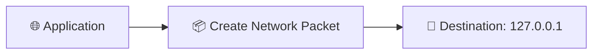

---

## Step 2 — The Operating System Recognizes the Address

The packet is passed to the operating system's networking stack.

Before sending the packet to the Network Interface Card (NIC), the operating system examines the destination IP address.

It immediately recognizes that:

```text
127.0.0.1
```

belongs to the **Loopback Address range**.

Instead of forwarding the packet to the physical network, the operating system keeps the traffic entirely inside the computer.

---

## Step 3 — The Packet Never Reaches the Network Card

Normally, outgoing network traffic follows a path like this:

```text
Application
      │
      ▼
Operating System
      │
      ▼
Network Interface Card (NIC)
      │
      ▼
Network Cable / Wi-Fi
      │
      ▼
Another Device
```

Loopback traffic is different.

Because the destination is the local computer itself, the packet **never reaches the Network Interface Card (NIC)**.

It never travels through:

- 🔌 An Ethernet cable
- 📶 Wi-Fi
- 🔀 A network switch
- 📡 A router
- 🌍 The Internet

The entire communication remains inside the operating system.

---

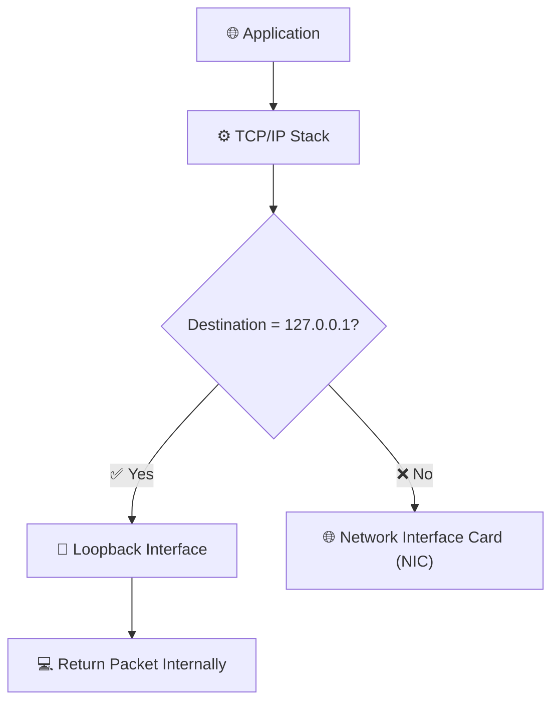

---

## Step 4 — The Packet Is Returned Internally

Once the operating system identifies the destination as the Loopback Address, it immediately redirects the packet back through its own networking stack.

To the application, the communication appears exactly like normal network communication.

However, no external network devices are involved.

This allows applications to test networking features in a safe and controlled environment.

---

## Step 5 — The Application Receives the Response

The receiving application processes the packet and sends a reply.

Since both the sender and receiver are running on the same computer, the response also travels through the loopback interface.

The result is extremely fast communication because:

- No physical transmission occurs.
- No switch processes the packet.
- No router forwards the traffic.
- No Internet connection is required.

Everything happens entirely within the operating system.

---

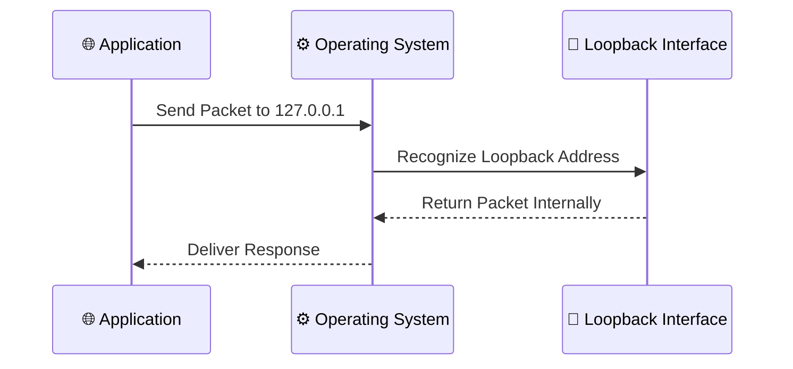

---

## 🔄 Comparing Normal Traffic and Loopback Traffic

The difference between normal network communication and loopback communication is significant.

### 🌐 Normal Network Communication

```text
Application
      │
      ▼
Operating System
      │
      ▼
Network Interface Card
      │
      ▼
Switch
      │
      ▼
Router
      │
      ▼
Another Computer
```

---

### 🔄 Loopback Communication

```text
Application
      │
      ▼
Operating System
      │
      ▼
Loopback Interface
      │
      ▼
Same Application / Local Service
```

Notice that the packet never leaves the computer.

---

## 🌍 Real-World Analogy

Imagine speaking to someone standing in another room.

Your voice must travel through the air to reach them.

Now imagine talking to yourself in your own mind.

Your thoughts never leave your brain, yet communication still takes place.

Loopback communication is similar.

Instead of sending data across a physical network, the operating system keeps the communication entirely inside the computer.

This makes testing faster, simpler, and independent of any external network.

---

<!--
Image Description:
Create an educational infographic comparing normal network communication with loopback communication. On the left, show packets traveling from an application through the operating system, network card, switch, router, and another computer. On the right, show packets sent to 127.0.0.1 being redirected by the operating system through the loopback interface and immediately returned to the same computer. Use a clean beginner-friendly networking style.

Suggested Filename:
Images/how_loopback_works.png
-->

<p align="center">

</p>

---

## 🎯 Why Is This Process Useful?

Because loopback communication never depends on external hardware, it provides several important benefits:

- ⚡ Extremely fast communication.
- 🔒 Safe testing environment.
- 🌐 No Internet connection required.
- 🛠️ Easy troubleshooting of networking software.
- 💻 Reliable testing of local applications and services.

This is why developers, network engineers, system administrators, and cybersecurity professionals use the loopback interface every day.

---

> 💡 **Point to Remember**
>
> When data is sent to the Loopback Address (`127.0.0.1`), the operating system recognizes that the destination is the local computer. Instead of sending the packet through the Network Interface Card (NIC), it redirects the traffic internally through the loopback interface, allowing the application to communicate with itself quickly and efficiently.

---

> 🤓 **Did You Know?**
>
> Because loopback traffic never reaches the physical network, you can successfully use `ping 127.0.0.1` even when your Ethernet cable is unplugged or your Wi-Fi is turned off. The test verifies the local TCP/IP networking stack, not your Internet connection.

---

# 🌐 The Loopback Address Range

When people hear the term **Loopback Address**, they almost always think of:

```text
127.0.0.1
```

While this is the most famous loopback address, it is **not the only one**.

In fact, the entire **127.0.0.0/8** network is reserved for loopback communication.

Understanding this address range helps you appreciate how IPv4 reserves special address blocks for specific purposes.

---

## 📍 The IPv4 Loopback Network

The complete IPv4 loopback network is:

```text
127.0.0.0/8
```

This means **every IP address that begins with `127`** belongs to the loopback network.

Examples include:

```text
127.0.0.1

127.0.0.10

127.1.1.1

127.100.50.25

127.255.255.254
```

All of these addresses are treated as **loopback addresses** by the operating system.

Whenever data is sent to any address in this range, it is redirected back to the same computer.

---

## 🧮 Understanding the `/8` Prefix

The notation:

```text
127.0.0.0/8
```

means that:

- The **first 8 bits** identify the network.
- The remaining **24 bits** identify host addresses.

Visually:

```text
127       .       X       .       X       .       X

<-- Network --> <-------- Host Portion -------->
```

Or in binary:

```text
01111111.XXXXXXXX.XXXXXXXX.XXXXXXXX
```

As long as the **first octet is 127**, the operating system recognizes the address as part of the loopback network.

---

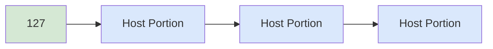

---

## 📦 How Many Loopback Addresses Exist?

Because the host portion contains **24 bits**, the loopback network contains:

```text
2²⁴ = 16,777,216 addresses
```

Although millions of loopback addresses exist, operating systems and applications almost always use:

```text
127.0.0.1
```

This address has become the standard loopback address and is commonly referred to as **localhost**, which you'll explore in the next section.

---

## 🚫 Can Loopback Addresses Be Used on a Network?

No.

Loopback addresses are **never assigned to physical network devices**.

You cannot assign a loopback address such as:

```text
127.0.0.25
```

to:

- 🌐 A computer's Ethernet adapter
- 📶 A Wi-Fi adapter
- 🔀 A network switch
- 📡 A router interface (for normal IPv4 communication)

Instead, the operating system reserves the entire **127.0.0.0/8** block for internal communication.

Any packet sent to this range is processed locally and never leaves the computer.

---

## 🌍 Why Aren't Loopback Addresses Routed?

Loopback addresses exist solely for communication within the local operating system.

Because of this:

- 🌐 Routers never forward loopback traffic.
- 🔌 The packet never reaches the Network Interface Card (NIC).
- 📡 The traffic never travels across a physical network.
- 🌍 The Internet never sees loopback packets.

The operating system intercepts the packet before it reaches any networking hardware and immediately returns it internally.

---

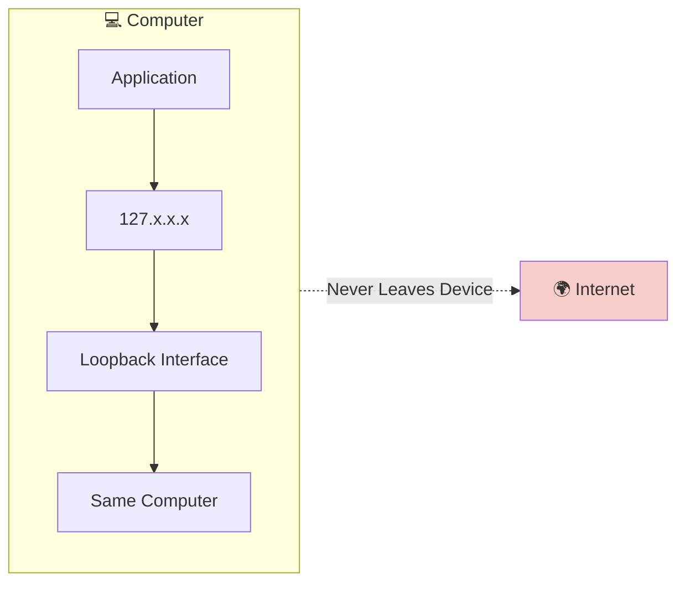

---

## 🔍 Recognizing a Loopback Address

One of the easiest ways to identify a loopback address is by looking at its **first octet**.

If the address begins with:

```text
127
```

it belongs to the loopback network.

For example:

| Address | Loopback? |
|----------|-----------|
| **127.0.0.1** | ✅ Yes |
| **127.10.20.30** | ✅ Yes |
| **127.255.1.100** | ✅ Yes |
| **192.168.1.10** | ❌ No |
| **169.254.45.80** | ❌ No (APIPA) |
| **10.0.0.5** | ❌ No |

---

<!--
Image Description:
Create an educational diagram showing the IPv4 loopback network (127.0.0.0/8). Highlight the first octet (127) as the network portion and the remaining three octets as the host portion. Show packets being redirected internally through the loopback interface instead of leaving through the network card. Use a clean networking style suitable for beginners.

Suggested Filename:
Images/loopback_address_range.png
-->

<p align="center">

</p>

---

> 💡 **Point to Remember**
>
> The entire **127.0.0.0/8** network is reserved for loopback communication. Although millions of loopback addresses exist, **127.0.0.1** is the standard address used by most operating systems and applications. Any traffic sent to this range is processed internally and never leaves the computer.

---

> 🤓 **Did You Know?**
>
> Many people believe that **127.0.0.1** is the only loopback address. In reality, every IPv4 address beginning with **127** belongs to the loopback network. However, **127.0.0.1** became the universal standard because it is simple, memorable, and supported consistently across operating systems.

---

# 📍 Understanding 127.0.0.1 (Localhost)

By now, you know that the entire **127.0.0.0/8** network is reserved for loopback communication.

However, one address is far more famous than all the others:

```text
127.0.0.1
```

This address is commonly known as **localhost**.

Whenever you see **127.0.0.1** or **localhost**, they usually refer to **your own computer**.

---

## 🏠 What Is Localhost?

The term **localhost** is a hostname that represents the local computer.

Instead of typing:

```text
127.0.0.1
```

many applications allow you to use:

```text
localhost
```

Both usually point to the same destination—the computer you're currently using.

For example:

```text
http://127.0.0.1
```

and

```text
http://localhost
```

normally open the same local service.

---

## 🔄 How Localhost Works

Suppose you open your web browser and enter:

```text
http://127.0.0.1
```

The browser sends an HTTP request.

Instead of leaving your computer and travelling across the network, the operating system immediately redirects the request through the loopback interface.

If a web server is running locally, it responds immediately.

Everything happens inside your computer.

---

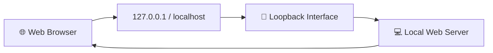

---

## 🌍 Where Is Localhost Used?

The loopback address is used every day by developers, network engineers, and cybersecurity professionals.

Some common examples include:

### 🌐 Local Web Development

Developers often build websites directly on their own computers.

Instead of publishing the website on the Internet, they test it locally by visiting:

```text
http://localhost
```

or

```text
http://127.0.0.1
```

---

### 🗄️ Database Servers

Applications often connect to databases running on the same computer.

Instead of using the computer's network address, they simply connect to:

```text
127.0.0.1
```

This keeps communication fast and secure.

---

### 🐳 Docker Containers

Developers frequently publish containerized applications on:

```text
localhost:8080

localhost:3000

localhost:5000
```

The services are available only on the local computer unless configured otherwise.

---

### 🛡️ Security Testing

Cybersecurity professionals often use localhost when:

- Testing web applications
- Running vulnerability scanners
- Testing APIs
- Performing penetration testing in lab environments

Because everything stays inside the local machine, testing can be performed safely.

---

## ⚡ Why Is Localhost So Fast?

Communication with localhost is extremely fast because:

- 🚫 No network cable is used.
- 🚫 No Wi-Fi transmission occurs.
- 🚫 No switch processes the packet.
- 🚫 No router forwards the traffic.
- 🚫 No Internet connection is required.

The operating system processes the packet internally.

---

## 🔍 Localhost vs 127.0.0.1

Although these terms are often used interchangeably, they are not exactly the same.

| Localhost | 127.0.0.1 |
|-----------|-----------|
| A hostname | An IPv4 address |
| Usually resolves to 127.0.0.1 | The standard IPv4 loopback address |
| Easier for humans to remember | Easier for computers to process |
| Can also resolve to IPv6 (::1) | IPv4 only |

In most situations:

```text
localhost
```

and

```text
127.0.0.1
```

behave exactly the same.

---

<!--
Image Description:
Illustrate a web browser requesting http://localhost. Show the request travelling through the loopback interface to a local web server running on the same computer. Emphasize that no packets leave the computer.

Suggested Filename:
Images/localhost.png
-->

<p align="center">

</p>

---

> 💡 **Point to Remember**
>
> **127.0.0.1** is the standard IPv4 Loopback Address, while **localhost** is a hostname that usually resolves to **127.0.0.1**. Both allow applications to communicate with services running on the same computer without using the physical network.

---

> 🤓 **Did You Know?**
>
> Thousands of developers around the world type **localhost** every day while building websites, APIs, databases, and cloud applications. It is one of the most frequently used hostnames in computing.

---

# 🔄 Loopback vs Private IP Address

At first glance, **Loopback Addresses** and **Private IP Addresses** may appear similar.

Both are used inside local environments and are not intended for direct communication over the public Internet.

However, they serve completely different purposes.

Understanding this distinction is essential because beginners often confuse the two.

---

## 🎯 The Purpose of Each

### 🔄 Loopback Address

A Loopback Address is used when a computer needs to communicate **with itself**.

The communication never leaves the operating system.

Its primary purposes include:

- 🧪 Testing the TCP/IP stack
- 💻 Running local applications
- 🔍 Troubleshooting network software
- ⚙️ Software development

---

### 🏠 Private IP Address

A Private IP Address is used when devices communicate with **other devices inside the same private network**.

Examples include:

- Computers
- Printers
- Smartphones
- Servers
- Routers

Private IP addresses allow devices to exchange information across a local network.

---

## 📊 Feature Comparison

| Feature | 🔄 Loopback | 🏠 Private IP |
|----------|------------|---------------|
| Address Range | 127.0.0.0/8 | 10.0.0.0/8<br>172.16.0.0/12<br>192.168.0.0/16 |
| Communication With | Same Computer | Other Devices |
| Leaves the Computer | ❌ Never | ✅ Yes |
| Used on Physical Network | ❌ No | ✅ Yes |
| Internet Access | ❌ No | ✅ Through a Router and NAT |
| Main Purpose | Testing & Diagnostics | Normal Network Communication |

---

## 🌍 Communication Difference

### 🔄 Loopback Communication

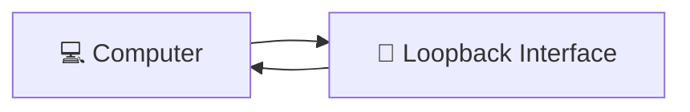

The packet never leaves the computer.

---

### 🏠 Private Network Communication

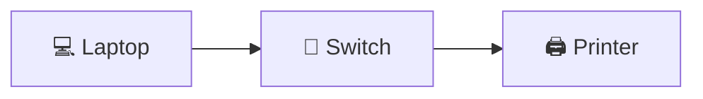

The packet travels across the local network to another device.

---

## 💻 Example

Suppose your computer has the following address:

```text
192.168.1.25
```

When you send data to:

```text
192.168.1.100
```

the packet leaves your computer and travels across the network.

Now compare that with:

```text
127.0.0.1
```

The packet never reaches the network cable or Wi-Fi adapter.

Instead, it immediately returns to your own computer.

---

## 🛠️ When Is Each Used?

Use a **Loopback Address** when you want to:

- Test networking software.
- Verify the TCP/IP stack.
- Run local services.
- Develop and test applications.

Use a **Private IP Address** when you want to:

- Share files.
- Access printers.
- Connect to servers.
- Browse the Internet through a router.
- Communicate with other devices.

---

> 💡 **Point to Remember**
>
> A **Loopback Address** allows a computer to communicate with itself, while a **Private IP Address** allows devices to communicate with other devices on a private network. Although both are reserved for special purposes, only Private IP addresses are used for normal network communication.

---

> 🤓 **Did You Know?**
>
> Your computer can use **both** a Loopback Address and a Private IP Address at the same time. The loopback interface is always available for internal communication, while the private IP address is used to communicate with other devices on the network.

---

# 🛡️ Cybersecurity Perspective

Understanding the Loopback Address is important for every networking professional, but it is especially valuable in cybersecurity.

Security analysts, penetration testers, malware researchers, and system administrators use the loopback interface regularly when testing applications, investigating incidents, and securing systems.

Although the loopback interface never sends traffic onto the physical network, it plays a critical role in many security-related tasks.

---

## 🔍 Testing Local Services Securely

Before exposing a service to other users, security professionals often test it locally using:

```text
127.0.0.1
```

or

```text
localhost
```

This ensures the application works correctly before it becomes accessible over the network.

Examples include:

- 🌐 Web servers
- 🗄️ Database servers
- 🔑 Authentication services
- 🔒 Security monitoring tools

Because communication stays inside the computer, the service remains inaccessible to external attackers during testing.

---

## 🛡️ Malware Analysis

Cybersecurity researchers often execute malware inside isolated virtual machines.

Some malware attempts to communicate with local services during execution.

By monitoring traffic sent to the loopback interface, analysts can observe how the malware behaves without allowing it to communicate with external systems.

This helps researchers understand:

- The malware's capabilities
- Its communication methods
- Possible indicators of compromise (IOCs)

---

## 🎯 Penetration Testing

Penetration testers frequently run vulnerable applications on their own computers before testing remote systems.

For example, a penetration tester may launch a deliberately vulnerable web application and access it using:

```text
http://127.0.0.1
```

or

```text
http://localhost
```

This provides a safe environment to:

- Practice attacks
- Test exploits
- Verify security tools
- Learn offensive security techniques

without exposing vulnerable software to the Internet.

---

## 📊 Security Monitoring

Many security tools communicate with local services through the loopback interface.

Examples include:

- Endpoint Detection and Response (EDR) agents
- Antivirus software
- Local dashboards
- Security management consoles

Since these services often run on the same computer, using the loopback interface improves performance and reduces unnecessary network traffic.

---

## 🔒 Why Is This Important?

The loopback interface provides a secure environment because:

- 🚫 Traffic never leaves the computer.
- 🔒 External attackers cannot directly access loopback services.
- ⚡ Communication is fast and reliable.
- 🧪 Applications can be tested safely before deployment.

This makes the loopback interface an essential component of secure software development and cybersecurity operations.

---

> 💡 **Point to Remember**
>
> In cybersecurity, the loopback interface provides a safe environment for testing, monitoring, and analyzing applications. Since loopback traffic never reaches the physical network, it allows professionals to perform many security tasks without exposing services to external systems.

---

> 🤓 **Did You Know?**
>
> Many security tools install a **local web interface** that is accessible only through **localhost** or **127.0.0.1**. This design helps protect administrative interfaces from unauthorized network access.

---

# 💻 Mini Lab — Exploring the Loopback Address

Now it's time to see the Loopback Address in action.

In this lab, you'll verify that your computer can communicate with itself using the loopback interface.

---

## 🎯 Lab Objectives

By completing this lab, you will learn how to:

- Test the TCP/IP protocol stack.
- Use the `ping` command with the Loopback Address.
- Observe communication that never leaves the computer.
- Recognize successful loopback communication.

---

## 🧪 Lab 1 — Ping the Loopback Address

Open **Command Prompt** (Windows) or a **Terminal** (Linux/macOS).

Run the following command:

```powershell
ping 127.0.0.1
```

---

### Expected Output

You should see output similar to:

```text
Pinging 127.0.0.1 with 32 bytes of data:

Reply from 127.0.0.1: bytes=32 time<1ms TTL=128
Reply from 127.0.0.1: bytes=32 time<1ms TTL=128
Reply from 127.0.0.1: bytes=32 time<1ms TTL=128
Reply from 127.0.0.1: bytes=32 time<1ms TTL=128

Ping statistics for 127.0.0.1:
    Packets: Sent = 4, Received = 4, Lost = 0 (0% loss)
```

---

### 🔍 What Happened?

Your computer sent ICMP Echo Request packets to the Loopback Address.

Instead of sending them across the network, the operating system immediately processed and returned the packets internally.

No switch, router, or Internet connection was involved.

---

## 🧪 Lab 2 — Ping Localhost

Now run:

```powershell
ping localhost
```

Notice that the result is almost identical.

This demonstrates that **localhost** resolves to the Loopback Address.

---

## 🧪 Lab 3 — Disconnect From the Network (Optional)

If possible:

1. Disconnect the Ethernet cable **or**
2. Disable Wi-Fi.

Now repeat:

```powershell
ping 127.0.0.1
```

The command should still succeed.

This proves that the loopback interface operates independently of the physical network.

---

## 📝 Questions

After completing the lab, try answering these questions:

1. Did the packets leave your computer?
2. Why did the ping succeed even without an Internet connection?
3. What does **127.0.0.1** represent?
4. Why is the loopback interface useful during troubleshooting?

---

## ✅ Lab Summary

Congratulations!

You have successfully verified that your computer can communicate with itself using the Loopback Address.

This simple test is one of the first troubleshooting steps performed by network engineers and cybersecurity professionals when diagnosing networking issues.

---

> 💡 **Lab Tip**
>
> If `ping 127.0.0.1` succeeds but you cannot reach other computers or the Internet, the problem is likely **outside** the local TCP/IP stack. The issue may involve your network adapter, cabling, switch, router, DHCP configuration, or Internet connection.


# 🔑 Key Takeaways

Congratulations! 🎉 You have completed the main learning content of the **Loopback Address** chapter.

Before moving on to the assessments, review these key concepts.

---

## 📌 What Is a Loopback Address?

A **Loopback Address** is a special IP address that allows a computer to communicate with itself.

Instead of sending traffic onto the physical network, the operating system processes the communication internally.

This makes loopback addresses ideal for:

- Testing
- Troubleshooting
- Software development
- Local service communication

---

## 📌 The IPv4 Loopback Range

The entire IPv4 loopback network is:

```text
127.0.0.0/8
```

This means every address beginning with:

```text
127
```

belongs to the loopback network.

Examples include:

```text
127.0.0.1
127.0.0.10
127.1.1.1
127.255.255.254
```

All of these addresses are treated as loopback addresses by the operating system.

---

## 📌 127.0.0.1 Is the Standard Loopback Address

Although millions of loopback addresses exist, the most commonly used address is:

```text
127.0.0.1
```

This address is often referred to as:

```text
localhost
```

and is widely used for testing and local application communication.

---

## 📌 Loopback Traffic Never Leaves the Computer

When data is sent to a loopback address:

- ❌ It does not reach the Network Interface Card (NIC).
- ❌ It does not travel through a switch.
- ❌ It does not pass through a router.
- ❌ It does not reach the Internet.
- ✅ It remains entirely inside the operating system.

This makes loopback communication fast, reliable, and independent of the physical network.

---

## 📌 Localhost and 127.0.0.1

In most situations:

```text
localhost
```

and

```text
127.0.0.1
```

refer to the same destination.

The difference is:

- **localhost** is a hostname.
- **127.0.0.1** is an IPv4 address.

Both allow applications to communicate with services running on the same computer.

---

## 📌 Loopback vs APIPA

These technologies serve different purposes.

### 🔄 Loopback

```text
127.0.0.0/8
```

Used for:

- Testing
- Diagnostics
- Local communication

Traffic never leaves the computer.

---

### 🌐 APIPA

```text
169.254.0.0/16
```

Used when:

- DHCP fails
- A temporary IP address is required

Traffic can communicate with other devices on the local network.

---

## 📌 Loopback vs Private IP Addresses

A Loopback Address allows a computer to communicate with itself.

A Private IP Address allows devices to communicate with other devices on a private network.

Examples:

```text
Loopback:
127.0.0.1

Private:
192.168.1.10
10.0.0.5
172.16.1.20
```

Private addresses are used for normal network communication, while loopback addresses are used for internal testing and diagnostics.

---

## 📌 Why Cybersecurity Professionals Use Loopback

Loopback addresses are commonly used for:

- 🛡️ Security testing
- 🌐 Local web applications
- 🗄️ Database communication
- 🔍 Malware analysis
- ⚙️ Development environments

Because traffic never leaves the computer, services can be tested safely before being exposed to a network.

---

## 🎯 Final Review

If you remember only a few things from this chapter, remember these:

- ✅ A Loopback Address allows a computer to communicate with itself.
- ✅ The IPv4 loopback range is **127.0.0.0/8**.
- ✅ **127.0.0.1** is the most commonly used loopback address.
- ✅ **localhost** usually resolves to **127.0.0.1**.
- ✅ Loopback traffic never reaches the physical network.
- ✅ Loopback is widely used for testing, troubleshooting, development, and cybersecurity.

---

> 💡 **One-Sentence Summary**
>
> A **Loopback Address** is a special IP address that enables a computer to communicate with itself for testing, troubleshooting, and local application communication without sending traffic onto the physical network.

# 🧠 Quick Check

Test your understanding by answering these short questions before moving on to the knowledge check.

---

## Question 1

**What is the primary purpose of a Loopback Address?**

<details>
<summary>✅ Show Answer</summary>

A Loopback Address allows a computer to communicate with itself for testing, troubleshooting, and running local applications.

</details>

---

## Question 2

**Which IPv4 address is most commonly used as the Loopback Address?**

<details>
<summary>✅ Show Answer</summary>

**127.0.0.1**

Although the entire **127.0.0.0/8** range is reserved for loopback communication, **127.0.0.1** is the standard address used by most operating systems and applications.

</details>

---

## Question 3

**Does traffic sent to a Loopback Address leave the computer?**

<details>
<summary>✅ Show Answer</summary>

No.

The operating system processes the traffic internally, so it never reaches the Network Interface Card (NIC), switch, router, or Internet.

</details>

---

## Question 4

**What is the relationship between `localhost` and `127.0.0.1`?**

<details>
<summary>✅ Show Answer</summary>

`localhost` is a hostname that usually resolves to the IPv4 Loopback Address **127.0.0.1**.

</details>

---

## Question 5

**Can you successfully ping `127.0.0.1` without an Internet connection?**

<details>
<summary>✅ Show Answer</summary>

Yes.

Because loopback communication never uses the physical network, it works even if the computer is offline.

</details>

---

## Question 6

**What is the IPv4 Loopback Address range?**

<details>
<summary>✅ Show Answer</summary>

**127.0.0.0/8**

Every IPv4 address beginning with **127** belongs to the loopback network.

</details>

---

## Question 7

**What is the main difference between a Loopback Address and an APIPA Address?**

<details>
<summary>✅ Show Answer</summary>

- **Loopback:** Used for communication with the same computer.
- **APIPA:** Used for temporary communication with other devices on the local network when DHCP is unavailable.

</details>

---

# 📖 Knowledge Check

Choose the best answer for each question before revealing the solution.

---

## Question 1

**Which IPv4 address is the standard Loopback Address?**

- A. 192.168.1.1
- B. 10.0.0.1
- C. 127.0.0.1
- D. 169.254.1.1

<details>
<summary>✅ Answer</summary>

**Correct Answer: C. 127.0.0.1**

The address **127.0.0.1** is the standard IPv4 Loopback Address used for local communication and testing.

</details>

---

## Question 2

**What is the primary purpose of a Loopback Address?**

- A. Internet communication
- B. Communicating with other computers
- C. Communicating with the same computer
- D. Assigning IP addresses automatically

<details>
<summary>✅ Answer</summary>

**Correct Answer: C. Communicating with the same computer**

A Loopback Address allows a computer to communicate with itself for testing and diagnostics.

</details>

---

## Question 3

**Which IPv4 network is reserved for loopback communication?**

- A. 10.0.0.0/8
- B. 169.254.0.0/16
- C. 192.168.0.0/16
- D. 127.0.0.0/8

<details>
<summary>✅ Answer</summary>

**Correct Answer: D. 127.0.0.0/8**

Every IPv4 address beginning with **127** belongs to the loopback network.

</details>

---

## Question 4

**When a packet is sent to `127.0.0.1`, where does it go?**

- A. To the default gateway
- B. To another computer
- C. Across the Internet
- D. Back to the same computer

<details>
<summary>✅ Answer</summary>

**Correct Answer: D. Back to the same computer**

The operating system redirects the packet internally through the loopback interface.

</details>

---

## Question 5

**Which hostname usually resolves to `127.0.0.1`?**

- A. gateway
- B. localhost
- C. dns
- D. router

<details>
<summary>✅ Answer</summary>

**Correct Answer: B. localhost**

`localhost` is the hostname commonly mapped to the Loopback Address.

</details>

---

## Question 6

**Which device processes loopback traffic?**

- A. Switch
- B. Router
- C. Operating System
- D. Modem

<details>
<summary>✅ Answer</summary>

**Correct Answer: C. Operating System**

The operating system recognizes loopback traffic and processes it internally without sending it to the physical network.

</details>

---

## Question 7

**Which command is commonly used to test the local TCP/IP stack?**

- A. `ipconfig`
- B. `tracert`
- C. `ping 127.0.0.1`
- D. `netstat`

<details>
<summary>✅ Answer</summary>

**Correct Answer: C. `ping 127.0.0.1`**

This command verifies that the local TCP/IP stack and loopback interface are functioning correctly.

</details>

---

## Question 8

**Which statement about Loopback Addresses is TRUE?**

- A. They are assigned by DHCP.
- B. They require Internet access.
- C. They never leave the local computer.
- D. They are public IP addresses.

<details>
<summary>✅ Answer</summary>

**Correct Answer: C. They never leave the local computer.**

Loopback traffic is processed entirely within the operating system and never reaches the physical network.

</details>

---
# 🚀 Challenge Questions

Now that you've completed the chapter, try applying what you've learned to these real-world scenarios.

Unlike the previous quizzes, these questions require you to think critically and apply your understanding of Loopback Addressing.

---

## Challenge 1 — Troubleshooting a Network Problem

A user reports that they cannot access any websites.

As a network administrator, the first command you run is:

```powershell
ping 127.0.0.1
```

The command succeeds.

### ❓ Question

What does this tell you about the computer?

<details>
<summary>💡 Suggested Answer</summary>

A successful ping to **127.0.0.1** confirms that:

- ✅ The TCP/IP protocol stack is working correctly.
- ✅ The loopback interface is functioning.
- ✅ The operating system's networking software is operational.

The problem is likely somewhere else, such as:

- The network adapter
- A network cable
- The switch
- The router
- DHCP configuration
- Internet connectivity

</details>

---

## Challenge 2 — Local Web Development

A developer starts a web server and opens:

```text
http://localhost:3000
```

The website loads successfully even though the computer is not connected to the Internet.

### ❓ Question

Why does the website still work?

<details>
<summary>💡 Suggested Answer</summary>

Because **localhost** resolves to the loopback address, the browser communicates directly with the web server running on the same computer.

The communication never leaves the operating system, so an Internet connection is not required.

</details>

---

## Challenge 3 — Identifying the Address

Which of the following addresses belongs to the IPv4 Loopback network?

```text
A. 10.1.5.20

B. 169.254.8.15

C. 127.10.25.1

D. 192.168.1.50
```

<details>
<summary>💡 Suggested Answer</summary>

**Correct Answer: C. 127.10.25.1**

Every IPv4 address beginning with **127** belongs to the **127.0.0.0/8** loopback network.

</details>

---

## Challenge 4 — Comparing Address Types

A computer has the following IP addresses:

```text
127.0.0.1

192.168.1.25
```

### ❓ Question

What is the purpose of each address?

<details>
<summary>💡 Suggested Answer</summary>

- **127.0.0.1** is the Loopback Address used for communication with the same computer.
- **192.168.1.25** is a Private IP Address used for communication with other devices on the local network.

Although both exist on the same computer, they serve different purposes.

</details>

---

## Challenge 5 — Thinking Like a Cybersecurity Professional

A penetration tester installs a vulnerable web application on a virtual machine.

Instead of making it accessible over the network, they access it using:

```text
http://127.0.0.1
```

### ❓ Question

Why is this a safer approach?

<details>
<summary>💡 Suggested Answer</summary>

Using the Loopback Address ensures that the vulnerable application is accessible only from the local machine.

Since loopback traffic never leaves the computer, other devices on the network cannot directly access the application.

This reduces the risk of accidental exposure while testing.

</details>

---

## 🌟 Final Reflection

Before moving to the next chapter, make sure you can confidently answer these questions:

- ✅ What is a Loopback Address?
- ✅ Why does the Loopback Address exist?
- ✅ What is the IPv4 Loopback Address range?
- ✅ Why is **127.0.0.1** called **localhost**?
- ✅ How is Loopback different from APIPA?
- ✅ How is Loopback different from a Private IP Address?
- ✅ Why is the Loopback Address important for networking, software development, and cybersecurity?

If you can answer these questions without referring back to the chapter, you've built a solid understanding of one of the most fundamental concepts in computer networking.

---

# 📝 Chapter Summary

Congratulations! 🎉 You have successfully completed the **Loopback Address** chapter.

In this chapter, you explored one of the most fundamental concepts in computer networking: the ability of a computer to communicate with itself. While the Loopback Address may seem simple, it is an essential tool for network troubleshooting, software development, system administration, and cybersecurity.

You learned that a **Loopback Address** allows a computer to send network traffic to itself without using the physical network. Instead of passing through a Network Interface Card (NIC), switch, router, or the Internet, the operating system processes the communication internally through the loopback interface.

You also discovered that the entire **127.0.0.0/8** network is reserved for loopback communication, although **127.0.0.1** is the standard address used by most operating systems. Additionally, you learned that **localhost** is a hostname that typically resolves to **127.0.0.1**, allowing applications to communicate with services running on the same computer.

Throughout the chapter, you compared Loopback Addresses with **APIPA** and **Private IP Addresses**, helping you understand that each serves a completely different purpose. Finally, you explored real-world examples, cybersecurity applications, and performed hands-on exercises using the `ping` command to verify your computer's TCP/IP stack.

By mastering the concepts in this chapter, you have taken another important step toward understanding how modern networks operate and how professionals troubleshoot networking issues.

---

# 🧭 Chapter Navigation

## ➡️ Next Chapter

### **08 - CIDR**

Learn how **Classless Inter-Domain Routing (CIDR)** replaced the traditional class-based addressing system, making IP address allocation more efficient and enabling modern subnetting techniques.

**Next →:** [**CIDR**](08-CIDR.md)

---

# 📖 Continue Your Learning

Congratulations! 🎉 You have completed the **Loopback Address** chapter.

You now understand:

- ✅ What a Loopback Address is.
- ✅ Why the loopback interface exists.
- ✅ How a computer communicates with itself.
- ✅ The IPv4 loopback range (**127.0.0.0/8**).
- ✅ Why **127.0.0.1** is known as **localhost**.
- ✅ The differences between Loopback Addresses, APIPA Addresses, and Private IP Addresses.
- ✅ How loopback communication is used for testing, troubleshooting, software development, and cybersecurity.

In the next chapter, you'll explore **Classless Inter-Domain Routing (CIDR)**. You'll learn why the traditional classful addressing system became inefficient, how CIDR solved address allocation problems, and why CIDR notation (such as **/24** and **/16**) is essential for subnetting, routing, and modern IP network design.

> **🚀 Next Lesson:** [**CIDR**](08-CIDR.md)
----

