# 📐 Classless Inter-Domain Routing (CIDR)

> *Learn how Classless Inter-Domain Routing (CIDR) replaced the traditional class-based addressing system, improved IPv4 address allocation, reduced routing table sizes, and became the foundation of modern IP networking.*


---

# 📖 Table of Contents

- [🎯 Learning Objectives](#-learning-objectives)
- [📖 What Is CIDR?](#-what-is-cidr)
- [🤔 Why Was CIDR Introduced?](#-why-was-cidr-introduced)
- [🏛️ The Problem with Classful Addressing](#️-the-problem-with-classful-addressing)
- [📐 Understanding CIDR Notation](#-understanding-cidr-notation)
- [🧮 Prefix Length and Subnet Masks](#-prefix-length-and-subnet-masks)
- [📊 Common CIDR Prefixes](#-common-cidr-prefixes)
- [🌍 Real-World Examples](#-real-world-examples)
- [🛡️ Cybersecurity Perspective](#️-cybersecurity-perspective)
- [💻 Mini Lab](#-mini-lab)
- [🔑 Key Takeaways](#-key-takeaways)
- [🧠 Quick Check](#-quick-check)
- [📖 Knowledge Check](#-knowledge-check)
- [🚀 Challenge Questions](#-challenge-questions)
- [📝 Chapter Summary](#-chapter-summary)
- [🧭 Chapter Navigation](#-chapter-navigation)
- [📖 Continue Your Learning](#-continue-your-learning)

---

# 🎯 Learning Objectives

After completing this chapter, you will be able to:

- Explain what CIDR is.
- Understand why CIDR replaced classful addressing.
- Describe the limitations of Class A, B, and C networks.
- Read and interpret CIDR notation (for example, /24 and /16).
- Understand the relationship between prefix length and subnet masks.
- Identify common CIDR prefixes used in modern networks.
- Explain how CIDR improves IP address allocation and routing.
- Understand why CIDR is essential for networking and cybersecurity.

---
# 📖 What Is CIDR?

As the Internet grew, the original IPv4 addressing system began to show its limitations.

Networks were being assigned large blocks of IP addresses that they didn't fully use, while other organizations struggled to obtain enough addresses for their growing infrastructure.

To solve this problem, a new addressing method called **Classless Inter-Domain Routing (CIDR)** was introduced.

Today, CIDR is the standard method used to allocate IPv4 addresses and define network boundaries.

Without CIDR, the modern Internet would be far less efficient and much more difficult to scale.

---

## 📚 Definition

**Classless Inter-Domain Routing (CIDR)** is an IP addressing method that allocates IP address blocks based on the actual needs of a network rather than fixed address classes.

Instead of relying on predefined **Class A**, **Class B**, and **Class C** networks, CIDR uses a **prefix length** to specify how much of an IP address identifies the network and how much identifies individual hosts.

This approach provides greater flexibility, improves address utilization, and simplifies routing across the Internet.

---

## 🧠 Breaking Down the Name

The term **Classless Inter-Domain Routing** may sound intimidating, but each word has a specific meaning.

### 📌 Classless

"Classless" means CIDR does **not** depend on the old Class A, Class B, and Class C addressing system.

Instead of assigning fixed-size networks, CIDR allows networks of almost any size to be created based on actual requirements.

---

### 🌍 Inter-Domain

A **domain** is a network or group of networks managed by an organization or Internet Service Provider (ISP).

"Inter-Domain" refers to routing traffic **between different networks or organizations** across the Internet.

For example:

- Your home network
- A university network
- A company's corporate network
- An ISP's network

All of these are separate domains that exchange data using routing.

---

### 🚦 Routing

**Routing** is the process of determining the best path for network traffic to travel from a source to its destination.

Routers examine IP addresses and forwarding tables to decide where packets should go next.

CIDR helps routers make these decisions more efficiently by organizing IP networks into flexible address blocks.

---

## 🌍 Why Is CIDR Important?

Before CIDR was introduced, organizations had to choose from only three major network classes:

- Class A
- Class B
- Class C

Each class provided a fixed number of host addresses.

This often resulted in:

- 📉 Large numbers of unused IP addresses.
- 📈 Faster exhaustion of the IPv4 address space.
- 🌐 Larger and more complex Internet routing tables.

CIDR solved these problems by allowing address blocks to be allocated according to the actual size of a network.

Instead of assigning thousands of unnecessary addresses, administrators could allocate only the number required.

---


---

## 🏠 Real-World Analogy

Imagine you're renting storage units.

The old system offers only three sizes:

- 📦 Small
- 📦 Medium
- 📦 Large

If you need a medium amount of storage but only a large unit is available, you'll end up paying for a lot of unused space.

This is similar to the old classful addressing system.

CIDR works differently.

Instead of forcing you to choose from fixed sizes, the storage company provides a unit that closely matches your actual needs.

You waste less space, save resources, and use capacity more efficiently.

The same principle applies to IP addresses.

CIDR allocates address blocks based on the number of devices a network actually requires.

---

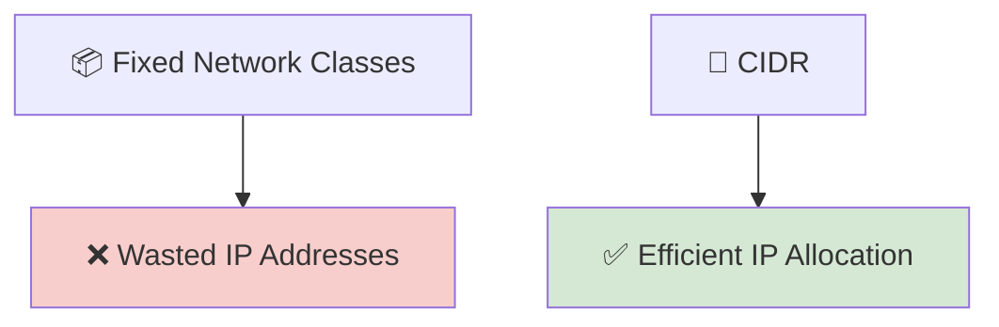

---

## 💡 A Preview of CIDR Notation

One of the most recognizable features of CIDR is its **prefix length**, written after an IP address using a forward slash.

For example:

```text
192.168.1.0/24
```

or

```text
10.0.0.0/16
```

The number after the slash indicates how many bits belong to the **network portion** of the address.

Don't worry if this notation is unfamiliar—we'll explore it in detail later in this chapter.

---

<!--
Image Description:
Create an educational infographic comparing Classful Addressing with CIDR. On the left, show fixed-size Class A, Class B, and Class C networks with many unused IP addresses. On the right, show CIDR allocating address blocks that closely match an organization's needs, reducing wasted addresses. Use a clean networking style suitable for beginners.

Suggested Filename:
Images/what_is_cidr.png
-->

<p align="center">

</p>

---

> 💡 **Point to Remember**
>
> **Classless Inter-Domain Routing (CIDR)** is a flexible IP addressing method that replaces the old class-based system. By using prefix lengths instead of fixed network classes, CIDR allocates IP addresses more efficiently and helps reduce the size of Internet routing tables.

---

> 🤓 **Did You Know?**
>
> Before CIDR was introduced in **1993**, many organizations received far more IPv4 addresses than they actually needed. CIDR significantly slowed the exhaustion of the IPv4 address space by allowing address blocks to be allocated much more efficiently.

# 🤔 Why Was CIDR Introduced?

When IPv4 was first designed in the early 1980s, the Internet was much smaller than it is today.

At the time, only a relatively small number of universities, government agencies, and research organizations were connected to the network.

The designers of IPv4 believed that the available address space would be more than enough for future growth.

To organize IP addresses, they created a **classful addressing system**, which divided IPv4 addresses into fixed-size classes such as **Class A**, **Class B**, and **Class C**.

For many years, this system worked well.

However, as the Internet expanded rapidly during the late 1980s and early 1990s, several serious problems began to appear.

These problems eventually led to the development of **Classless Inter-Domain Routing (CIDR)**.

---

# 📈 The Rapid Growth of the Internet

The popularity of the Internet increased much faster than anyone had expected.

More organizations wanted Internet access, including:

- 🏢 Businesses
- 🏫 Universities
- 🏥 Hospitals
- 🏛️ Government agencies
- 🏠 Internet Service Providers (ISPs)

Each organization required its own block of IPv4 addresses.

As demand continued to grow, the original classful addressing system became increasingly inefficient.

---


---

# 🏛️ Problem 1 — Fixed Network Sizes

The biggest weakness of classful addressing was its lack of flexibility.

Organizations could only receive addresses in fixed network sizes.

For example:

| Address Class | Approximate Hosts |
|---------------|------------------:|
| Class A | Over 16 million |
| Class B | About 65 thousand |
| Class C | 254 |

There was no option between these sizes.

Suppose a company needed **2,000 IP addresses**.

A **Class C** network was far too small because it supported only 254 hosts.

The next available option was a **Class B** network, which supported approximately **65,534 hosts**.

As a result, the organization received tens of thousands of addresses that it would never use.

---

## 📊 Example

Imagine a company with:

- 👨‍💼 2,000 employees
- 💻 2,000 computers

The company needs roughly **2,000 IP addresses**.

Under the classful system:

- Class C → ❌ Too small
- Class B → ✅ Large enough

The company receives:

```text
65,534 addresses
```

but actually uses only:

```text
2,000 addresses
```

This means more than **63,000 IP addresses remain unused**.

Those unused addresses cannot be given to another organization.

---


---

# 📉 Problem 2 — Wasting IPv4 Addresses

Because organizations often received much larger address blocks than they actually needed, millions of IPv4 addresses remained unused.

This problem is known as **address wastage**.

Over time:

- Large companies owned enormous address blocks.
- Many addresses sat unused for years.
- New organizations struggled to obtain addresses.

Although IPv4 contains over **4.3 billion addresses**, poor allocation caused available addresses to disappear much faster than expected.

---

# 🌍 Problem 3 — IPv4 Address Exhaustion

As more devices connected to the Internet:

- Personal computers
- Servers
- Smartphones
- Printers
- Networking equipment

the number of available IPv4 addresses continued to shrink.

This growing shortage became known as **IPv4 address exhaustion**.

Engineers realized that if address allocation continued using the classful system, the Internet would eventually run out of IPv4 addresses.

---

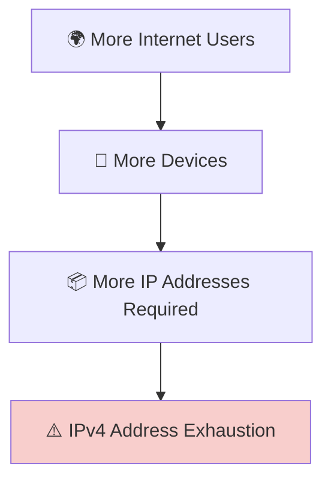

---

# 🚦 Problem 4 — Large Routing Tables

The classful system created another major challenge.

Every allocated network needed its own routing entry.

As thousands of organizations joined the Internet, routers had to store more and more routes.

This resulted in:

- 📈 Larger routing tables
- 🖥️ Increased memory usage
- ⚡ Slower routing decisions
- 🌐 Reduced Internet scalability

Internet routers were becoming overloaded with routing information.

A better solution was needed.

---

# 💡 The Solution — CIDR

To solve these growing problems, networking engineers introduced **Classless Inter-Domain Routing (CIDR)** in **1993**.

Instead of allocating fixed-size networks, CIDR allowed address blocks to be assigned according to an organization's actual requirements.

For example:

Instead of assigning:

```text
65,534 addresses
```

CIDR could allocate a much smaller block that closely matched the organization's needs.

This greatly reduced wasted IPv4 addresses.

CIDR also introduced **route aggregation (route summarization)**, allowing multiple smaller networks to be represented by a single routing entry.

This reduced the size of Internet routing tables and improved router performance.

---


---

<!--
Image Description:
Create an infographic illustrating why CIDR was introduced. On the left, show the problems of classful addressing: fixed network sizes, wasted IPv4 addresses, IPv4 exhaustion, and growing routing tables. On the right, show CIDR solving these problems through flexible address allocation and route aggregation. Use a clean, beginner-friendly networking style.

Suggested Filename:
Images/why_cidr_was_introduced.png
-->

<p align="center">

</p>

---

> 💡 **Point to Remember**
>
> CIDR was introduced because the classful addressing system wasted IPv4 addresses and created increasingly large Internet routing tables. By allowing flexible address allocation and route aggregation, CIDR made IPv4 networks more efficient and helped extend the usable life of the IPv4 address space.

---

> 🤓 **Did You Know?**
>
> CIDR did **not** increase the total number of IPv4 addresses. Instead, it made much better use of the addresses that already existed by allocating them more efficiently and reducing unnecessary waste.

# 🏛️ The Problem with Classful Addressing

Before **Classless Inter-Domain Routing (CIDR)** was introduced, IPv4 addresses were assigned using a system called **Classful Addressing**.

In this system, every IPv4 address belonged to one of several predefined classes.

Each class had:

- A fixed network size.
- A fixed number of host addresses.
- A fixed default subnet mask.

This design made IPv4 addressing simple, but it also created significant inefficiencies as the Internet grew.

---

# 📚 What Is Classful Addressing?

**Classful Addressing** is the original IPv4 addressing method that divides IP addresses into fixed classes based on the value of the first octet.

The five address classes are:

- Class A
- Class B
- Class C
- Class D (Multicast)
- Class E (Experimental)

For normal host addressing, only **Class A**, **Class B**, and **Class C** were used.

---

## 📊 IPv4 Address Classes

| Class | First Octet Range | Default Subnet Mask | Approximate Hosts per Network |
|--------|------------------:|--------------------:|------------------------------:|
| Class A | 1 – 126 | 255.0.0.0 | 16,777,214 |
| Class B | 128 – 191 | 255.255.0.0 | 65,534 |
| Class C | 192 – 223 | 255.255.255.0 | 254 |
| Class D | 224 – 239 | N/A | Multicast |
| Class E | 240 – 255 | N/A | Experimental |

> **Note:** `127.x.x.x` is reserved for the **Loopback Address** and is not assigned as a normal Class A network.

---

## 🌍 How Classful Addressing Worked

When an organization requested IP addresses, it could only receive one of the predefined network classes.

There was no flexibility.

For example:

- A small office might receive a **Class C** network.
- A medium-sized organization might receive a **Class B** network.
- A very large organization might receive a **Class A** network.

The organization had to use whichever class best fit its needs—even if it resulted in significant unused addresses.

---

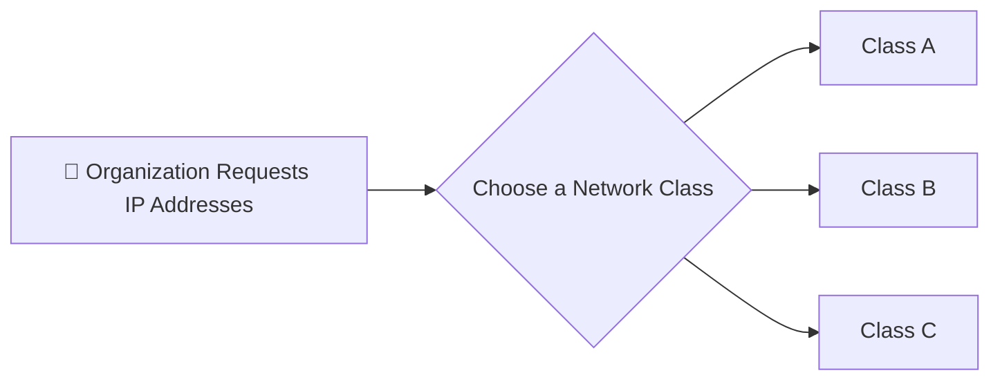

---

# ⚠️ Why Fixed Classes Were a Problem

At first, the classful system seemed practical.

However, organizations rarely needed exactly the number of addresses provided by a class.

This created two common situations.

---

## 📉 Situation 1 — Network Too Small

Imagine a company needs **500 IP addresses**.

A **Class C** network provides only:

```text
254 hosts
```

This is not enough.

The organization cannot fit all of its devices into a single Class C network.

---

## 📈 Situation 2 — Network Too Large

The next available option is a **Class B** network.

A Class B network provides approximately:

```text
65,534 hosts
```

For a company that needs only **500 addresses**, this is far more than necessary.

As a result:

- Thousands of IP addresses remain unused.
- Those addresses cannot be assigned to another organization.
- Valuable IPv4 address space is wasted.

---

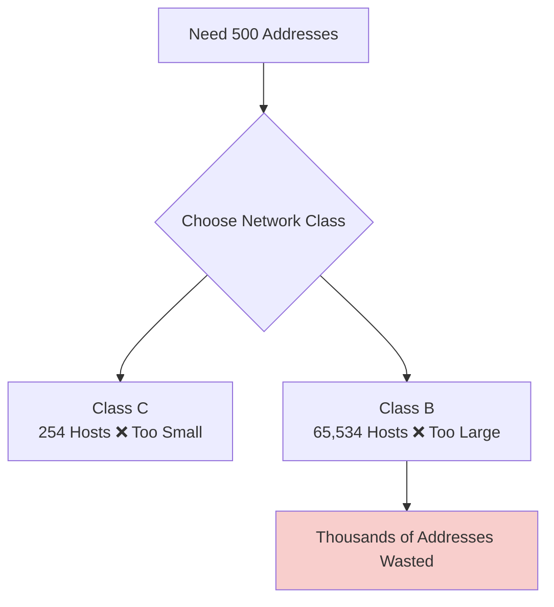

---

# 📊 Comparing Actual Needs with Classful Networks

| Organization Needs | Available Class | Result |
|-------------------:|-----------------|--------|
| 100 Hosts | Class C | ✅ Good Fit |
| 500 Hosts | Class C | ❌ Too Small |
| 500 Hosts | Class B | ❌ Too Large |
| 5,000 Hosts | Class B | ⚠️ Many Unused Addresses |
| 100,000 Hosts | Class A | ⚠️ Millions of Unused Addresses |

Notice that there is **no network size between Class C and Class B**.

This gap was one of the biggest weaknesses of classful addressing.

---

# 🌍 Real-World Analogy

Imagine you're buying parking spaces for your company.

The parking company offers only three options:

- 🚗 250 spaces
- 🚙 65,000 spaces
- 🚌 16 million spaces

Now suppose your company has **500 employees**.

The 250-space parking lot is too small.

The 65,000-space parking lot is far too large.

You are forced to rent thousands of spaces that will never be used.

This is exactly what happened with Classful Addressing.

CIDR solved this problem by allowing organizations to receive address blocks that closely matched their actual needs.

---

<!--
Image Description:
Create an educational infographic comparing Class A, Class B, and Class C networks. Show each class with its address range, default subnet mask, and approximate host capacity. Include an illustration showing how a company needing 500 IP addresses must choose between a Class C network (too small) and a Class B network (too large), highlighting wasted IPv4 addresses.

Suggested Filename:
Images/classful_addressing_problem.png
-->

<p align="center">

</p>

---

> 💡 **Point to Remember**
>
> Classful Addressing divided IPv4 networks into fixed-size classes. While this made addressing simple, it often forced organizations to accept networks that were either too small or much larger than they actually needed, leading to significant IPv4 address waste.

---

> 🤓 **Did You Know?**
>
> One of the main reasons CIDR became the Internet standard was that it removed the restrictions of fixed address classes. Instead of choosing only between Class A, Class B, or Class C networks, administrators could allocate address blocks that closely matched an organization's actual requirements.

# 📐 Understanding CIDR Notation

One of the most recognizable features of **Classless Inter-Domain Routing (CIDR)** is its unique way of writing network addresses.

Instead of relying only on an IP address and a separate subnet mask, CIDR combines both pieces of information into a single, compact notation.

For example:

```text
192.168.1.0/24
```

or

```text
10.0.0.0/8
```

The number after the forward slash (`/`) is called the **prefix length**.

This small number tells us how many bits belong to the **network portion** of the address.

---

# 📚 What Is CIDR Notation?

**CIDR notation** is a method of representing an IP network using:

- An IPv4 address
- A forward slash (`/`)
- A prefix length

The general format is:

```text
IP Address/Prefix Length
```

For example:

```text
192.168.1.0/24
```

Here:

- **192.168.1.0** represents the network.
- **24** is the prefix length.

Together, they describe an entire network rather than a single device.

---

# 🔍 Understanding the Forward Slash (/)

The forward slash is simply a separator.

Everything **before** the slash is the IP address.

Everything **after** the slash tells us how many bits are reserved for the network.

For example:

```text
172.16.0.0/16
```

can be read as:

> "The network **172.16.0.0** with a **16-bit network prefix**."

---

# 🧮 What Is a Prefix Length?

A **prefix length** specifies how many of the **32 bits** in an IPv4 address belong to the **network portion**.

Since every IPv4 address contains exactly **32 bits**, the remaining bits are available for identifying hosts.

Think of it like this:

```text
Total IPv4 Address = 32 Bits
```

Those 32 bits are divided into two parts:

- 🌐 Network Portion
- 💻 Host Portion

The prefix length tells us where that division occurs.

---

## 📊 Example: `/24`

Consider the following network:

```text
192.168.1.0/24
```

The prefix length is:

```text
24
```

This means:

- First **24 bits** → Network
- Remaining **8 bits** → Hosts

```text
|<------ Network ------>|<Hosts>|

192.168.1.0/24
```

---

## 📊 Example: `/16`

Now consider:

```text
172.16.0.0/16
```

Here:

- First **16 bits** → Network
- Remaining **16 bits** → Hosts

This creates a much larger network capable of supporting many more devices.

---

## 📊 Example: `/8`

Another example is:

```text
10.0.0.0/8
```

Here:

- First **8 bits** → Network
- Remaining **24 bits** → Hosts

This provides an extremely large address space.

---

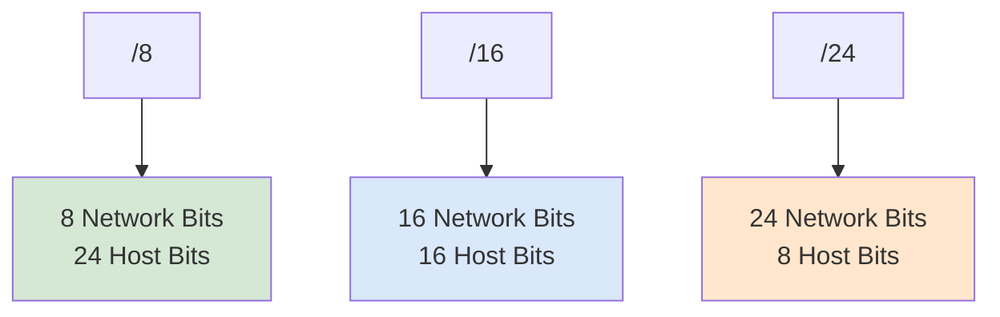

---

# 🖥️ Visualizing the Network and Host Portions

Imagine an IPv4 address as a line of **32 boxes**.

For a `/24` network:

```text
□□□□□□□□□□□□□□□□□□□□□□□□□□□□□□□□
^^^^^^^^^^^^^^^^^^^^^^^^□□□□□□□□
      Network               Hosts
```

For a `/16` network:

```text
□□□□□□□□□□□□□□□□□□□□□□□□□□□□□□□□
^^^^^^^^^^^^^^^^□□□□□□□□□□□□
    Network          Hosts
```

Notice that as the **prefix length increases**, the network portion becomes larger while the host portion becomes smaller.

---

# 📈 What Happens When the Prefix Changes?

Changing the prefix length changes the size of the network.

A **larger prefix** means:

- ✅ More bits for the network
- ✅ Smaller host portion
- ✅ Fewer available host addresses

A **smaller prefix** means:

- ✅ Smaller network portion
- ✅ Larger host portion
- ✅ More available host addresses

This flexibility is one of the biggest advantages of CIDR.

Unlike the old classful system, administrators can create networks that closely match their requirements.

---

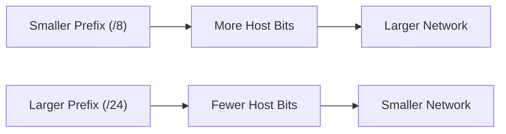

---

# 🌍 Why Is CIDR Notation Useful?

CIDR notation provides several important benefits.

It allows network administrators to:

- Allocate IP addresses more efficiently.
- Reduce wasted IPv4 address space.
- Create networks of different sizes.
- Simplify routing through route aggregation.
- Design scalable enterprise networks.

Without CIDR notation, modern IP addressing would be much less flexible.

---

<!--
Image Description:
Create a beginner-friendly infographic explaining CIDR notation. Show three examples: 10.0.0.0/8, 172.16.0.0/16, and 192.168.1.0/24. Highlight the network portion in one color and the host portion in another. Include labels showing that increasing the prefix length increases the network portion while decreasing the host portion.

Suggested Filename:
Images/understanding_cidr_notation.png
-->

<p align="center">

</p>

---

> 💡 **Point to Remember**
>
> **CIDR notation** combines an IP address with a **prefix length**. The prefix length tells you how many bits belong to the network portion of the address, while the remaining bits are used to identify hosts. This flexible approach replaces the fixed network sizes used in classful addressing.

---

> 🤓 **Did You Know?**
>
> Network engineers rarely write subnet masks such as **255.255.255.0** in everyday conversation. Instead, they almost always use the shorter and more convenient CIDR notation, such as **/24**, because it is easier to read, write, and configure on modern networking equipment.

# 🧮 Prefix Length and Subnet Masks

In the previous section, you learned that the **prefix length** tells us how many bits belong to the **network portion** of an IPv4 address.

However, before CIDR notation became common, networks were identified using **subnet masks**.

Today, both **CIDR prefix lengths** and **subnet masks** are used together in networking.

Understanding how they relate to each other is an essential networking skill.

---

# 📚 What Is a Subnet Mask?

A **subnet mask** is a 32-bit value that identifies which part of an IP address belongs to the **network** and which part belongs to the **host**.

Unlike an IP address, a subnet mask is **not assigned to a device**.

Instead, it acts as a guide that helps computers determine:

- 🌐 Which portion represents the network.
- 💻 Which portion represents the host.
- 📍 Whether another device is on the same network.

---

## 📖 The Relationship Between CIDR and Subnet Masks

CIDR notation and subnet masks represent the **same information**.

The only difference is how they are written.

For example:

| CIDR Prefix | Subnet Mask |
|-------------|-------------|
| `/8` | `255.0.0.0` |
| `/16` | `255.255.0.0` |
| `/24` | `255.255.255.0` |

Instead of writing:

```text
192.168.1.0 255.255.255.0
```

network engineers usually write:

```text
192.168.1.0/24
```

The second notation is shorter, cleaner, and easier to understand.

---

# 🔍 Why Does This Work?

Remember that an IPv4 address contains **32 bits**.

A subnet mask also contains **32 bits**.

The subnet mask uses:

- **1s** to represent the **network portion**
- **0s** to represent the **host portion**

For example:

```text
255.255.255.0
```

In binary:

```text
11111111.11111111.11111111.00000000
```

Notice that there are:

- **24 ones**
- **8 zeros**

Therefore:

```text
255.255.255.0 = /24
```

---

## 📊 Another Example

Subnet Mask:

```text
255.255.0.0
```

Binary:

```text
11111111.11111111.00000000.00000000
```

There are:

- **16 ones**
- **16 zeros**

Therefore:

```text
255.255.0.0 = /16
```

---

## 📊 One More Example

Subnet Mask:

```text
255.0.0.0
```

Binary:

```text
11111111.00000000.00000000.00000000
```

There are:

- **8 ones**
- **24 zeros**

Therefore:

```text
255.0.0.0 = /8
```

---

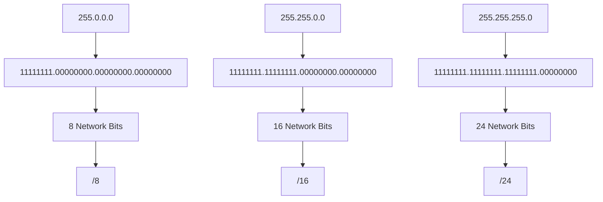

---

# 🌍 Why Do Network Engineers Prefer CIDR?

Although subnet masks are still important, CIDR notation has become the standard because it is:

- ✍️ Easier to write.
- 📖 Easier to read.
- ⚙️ Simpler to configure.
- 🌐 Supported by all modern networking equipment.

For example:

Instead of writing:

```text
255.255.255.0
```

most engineers simply write:

```text
/24
```

Both mean exactly the same thing.

---

> 💡 **Point to Remember**
>
> A **subnet mask** and a **CIDR prefix length** describe the same network boundary. The subnet mask uses dotted-decimal notation, while CIDR uses a shorter prefix length such as **/24** or **/16**.

---

> 🤓 **Did You Know?**
>
> Even though routers, switches, and operating systems understand both subnet masks and CIDR notation, most network documentation and certification exams use **CIDR notation** because it is simpler and more efficient.

---

# 📊 Common CIDR Prefixes

Although CIDR supports many different prefix lengths, some are used far more often than others.

Learning these common prefixes will make it much easier to read network diagrams, configure devices, and understand subnetting.

As you continue studying networking, you'll encounter these prefixes repeatedly.

---

## 📋 Frequently Used CIDR Prefixes

| CIDR Prefix | Subnet Mask | Approximate Hosts |
|-------------|-------------|------------------:|
| `/8` | `255.0.0.0` | 16,777,214 |
| `/16` | `255.255.0.0` | 65,534 |
| `/24` | `255.255.255.0` | 254 |
| `/25` | `255.255.255.128` | 126 |
| `/26` | `255.255.255.192` | 62 |
| `/27` | `255.255.255.224` | 30 |
| `/28` | `255.255.255.240` | 14 |
| `/29` | `255.255.255.248` | 6 |
| `/30` | `255.255.255.252` | 2 |

> **Note:** The host counts shown above represent the number of usable host addresses in each subnet.

---

# 📈 What Happens as the Prefix Gets Larger?

As the prefix length increases:

- 🌐 More bits are reserved for the network.
- 💻 Fewer bits remain for hosts.
- 📉 The number of available host addresses decreases.

This creates smaller and more efficient networks.

---

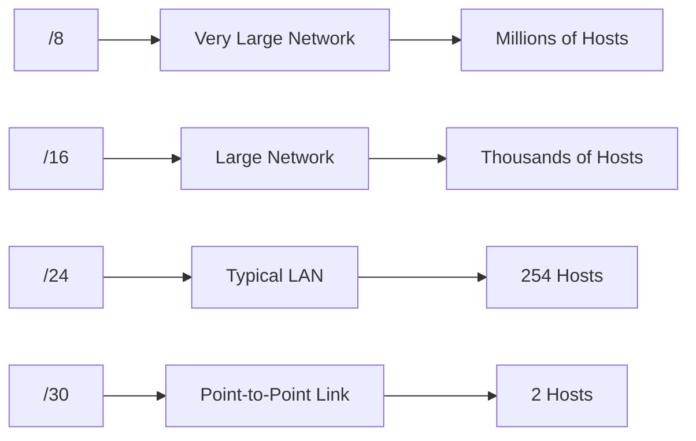

---

# 🌍 Where Are These Prefixes Used?

Different prefix lengths are commonly used in different situations.

| Prefix | Common Use |
|---------|------------|
| `/8` | Very large enterprise or historical allocations |
| `/16` | Large organizations and service providers |
| `/24` | Typical office and home LANs |
| `/30` | Point-to-point router links |
| `/32` | A single host address (commonly used in routing and firewall rules) |

As your networking knowledge grows, you'll learn why different network designs require different prefix lengths.

---

## 🧠 Don't Memorize Everything Yet

At this stage, you don't need to memorize every subnet mask or host count.

Instead, focus on understanding the pattern:

- Larger prefix → Smaller network → Fewer hosts
- Smaller prefix → Larger network → More hosts

Later, in the **Subnetting** chapter, you'll learn how to calculate these values yourself.

---

<!--
Image Description:
Create a CIDR reference chart showing common prefixes from /8 to /30. Include the corresponding subnet mask and the approximate number of usable host addresses. Use a clean, colorful table suitable for beginners.

Suggested Filename:
Images/common_cidr_prefixes.png
-->

<p align="center">

</p>

---

> 💡 **Point to Remember**
>
> The most common CIDR prefixes are **/8**, **/16**, and **/24**, but smaller networks often use prefixes such as **/25**, **/26**, **/27**, **/28**, **/29**, and **/30**. As the prefix length increases, the number of available host addresses decreases.

---

> 🤓 **Did You Know?**
>
> One of the most common networks you'll encounter is **192.168.1.0/24**, which provides **254 usable host addresses**. It is widely used in home routers, small businesses, and networking labs around the world.

# 🌍 Real-World Examples

CIDR is not just a theoretical networking concept—it is used every day in home networks, businesses, Internet Service Providers (ISPs), cloud platforms, and data centers.

Whenever a network is designed, expanded, or connected to the Internet, CIDR notation is used to define the size of each network.

Let's look at some practical examples.

---

# 🏠 Scenario 1 — Home Network

Imagine you purchase a new Wi-Fi router for your home.

When you log into the router's management interface, you may see a network similar to:

```text
192.168.1.0/24
```

This tells you that:

- The network address is **192.168.1.0**
- The prefix length is **/24**
- The network can support up to **254 usable devices**

Devices connected to the router might receive addresses such as:

```text
192.168.1.10
192.168.1.25
192.168.1.100
192.168.1.200
```

All of these devices belong to the same `/24` network.

---

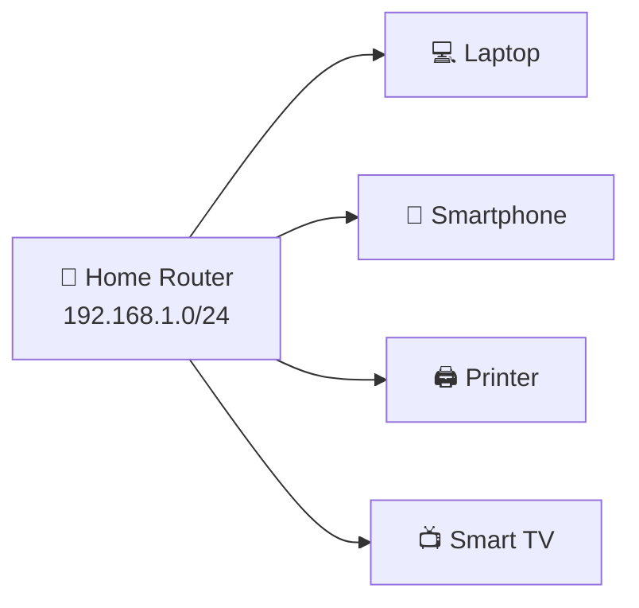

---

# 🏢 Scenario 2 — Small Business

A small company has:

- 45 desktop computers
- 10 laptops
- 8 printers
- 5 servers

Instead of receiving a huge Class B network, the administrator creates a network that closely matches the company's needs.

For example:

```text
192.168.10.0/25
```

This network provides **126 usable host addresses**, leaving room for future growth without wasting thousands of IP addresses.

This is one of the biggest advantages of CIDR.

---

# 🌐 Scenario 3 — Internet Service Provider (ISP)

An Internet Service Provider manages thousands of customers.

Instead of assigning random address ranges, the ISP allocates CIDR blocks based on customer requirements.

For example:

```text
Customer A
203.0.113.0/29
```

```text
Customer B
203.0.113.8/28
```

```text
Customer C
203.0.113.32/27
```

Each customer receives only the number of addresses they need.

This efficient allocation conserves IPv4 address space.

---

# ☁️ Scenario 4 — Cloud Computing

Cloud platforms such as Microsoft Azure, Amazon Web Services (AWS), and Google Cloud use CIDR whenever a virtual network is created.

For example, an administrator might configure:

```text
10.10.0.0/16
```

Within that larger network, smaller subnets can be created for:

- 🌐 Web servers
- 🗄️ Databases
- 🔒 Security appliances
- ⚙️ Application servers

CIDR provides the flexibility needed to design scalable cloud infrastructures.

---

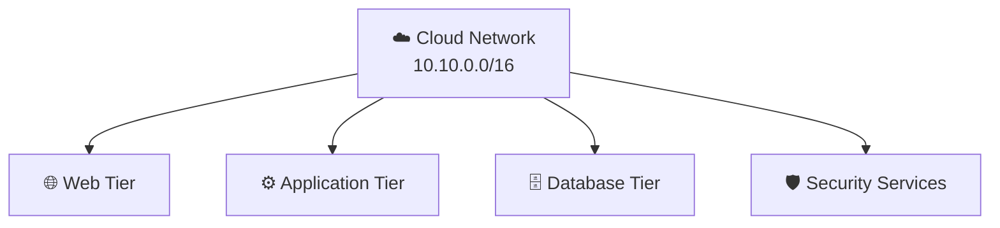

---

# 🏥 Scenario 5 — Enterprise Network

A large organization may operate multiple offices across different cities.

Instead of placing every device into one enormous network, administrators divide the infrastructure into several CIDR networks.

For example:

```text
Head Office
10.1.0.0/16
```

```text
Branch Office A
10.2.0.0/16
```

```text
Branch Office B
10.3.0.0/16
```

This approach makes the network:

- Easier to manage
- More scalable
- Better organized
- Simpler to troubleshoot

---

# 📊 Summary of the Scenarios

| Scenario | Example CIDR | Why CIDR Is Used |
|----------|--------------|------------------|
| 🏠 Home Network | `192.168.1.0/24` | Connect home devices |
| 🏢 Small Business | `192.168.10.0/25` | Allocate addresses efficiently |
| 🌐 ISP | `203.0.113.0/29` | Assign address blocks to customers |
| ☁️ Cloud | `10.10.0.0/16` | Build scalable virtual networks |
| 🏥 Enterprise | `10.1.0.0/16` | Organize multiple office networks |

---

<!--
Image Description:
Create an infographic titled "Real-World Uses of CIDR". Include five illustrated environments: Home Network, Small Business, Internet Service Provider (ISP), Cloud Infrastructure, and Enterprise Network. Show example CIDR blocks (such as 192.168.1.0/24 and 10.10.0.0/16) and simple network icons connected through routers. Use a clean, beginner-friendly educational style.

Suggested Filename:
Images/cidr_real_world_examples.png
-->

<p align="center">

</p>

---

> 💡 **Point to Remember**
>
> CIDR is used everywhere—from home Wi-Fi networks to global cloud infrastructures. Its flexible addressing method allows networks to be designed according to actual requirements instead of fixed address classes, making modern networking more efficient and scalable.

---

> 🤓 **Did You Know?**
>
> Every time a cloud engineer creates a virtual network in platforms like Azure or AWS, one of the first decisions they make is choosing a **CIDR block**. That single choice determines how many devices, servers, and services the network can support.

# 🛡️ Cybersecurity Perspective

Understanding CIDR is not only important for network engineers—it is also a fundamental skill for cybersecurity professionals.

Whether you work in a Security Operations Center (SOC), perform penetration testing, manage firewalls, or investigate security incidents, you'll encounter CIDR notation every day.

Many cybersecurity tools use CIDR to define networks, control access, detect suspicious activity, and protect critical systems.

Without understanding CIDR, it becomes difficult to analyze networks or configure security controls correctly.

---

# 🔥 Firewall Rules

Firewalls often use CIDR notation to determine which IP addresses are allowed or denied access.

Instead of creating hundreds of individual rules for every device, administrators can create a single rule that applies to an entire network.

For example:

```text
Allow:
192.168.1.0/24
```

This rule allows traffic from every device within the **192.168.1.0/24** network.

Likewise, a firewall can block an entire network using a single CIDR block.

```text
Deny:
203.0.113.0/24
```

This approach makes firewall policies easier to manage and reduces configuration errors.

---

## 🛡️ Example

Instead of writing rules like:

```text
192.168.1.1
192.168.1.2
192.168.1.3
...
192.168.1.254
```

A firewall administrator simply writes:

```text
192.168.1.0/24
```

One rule protects the entire network.

---

# 🔍 Security Monitoring

Security analysts constantly review logs generated by:

- Firewalls
- Intrusion Detection Systems (IDS)
- Intrusion Prevention Systems (IPS)
- Endpoint Detection and Response (EDR)
- Security Information and Event Management (SIEM) platforms

These logs frequently display source and destination networks using CIDR notation.

For example:

```text
Source:
10.20.30.0/24
```

or

```text
Destination:
172.16.5.0/24
```

Understanding these network ranges helps analysts quickly identify:

- Which network generated the traffic.
- Whether the traffic is internal or external.
- Which systems may be affected during an incident.

---

# 🎯 Penetration Testing

Penetration testers often scan entire networks instead of individual computers.

Rather than testing one IP address at a time, they specify a CIDR block.

For example:

```text
192.168.10.0/24
```

A vulnerability scanner or penetration testing tool can automatically examine every host within that network.

This saves time and ensures that no active devices are missed.

---

```text
Example:

192.168.10.0/24

↓

Scanner discovers:

192.168.10.5
192.168.10.12
192.168.10.45
192.168.10.200
```

---

# 🏢 Network Segmentation

One of the most effective cybersecurity strategies is **network segmentation**.

Instead of placing every device into one large network, administrators divide the infrastructure into multiple smaller CIDR networks.

For example:

```text
Office Network
192.168.10.0/24
```

```text
Server Network
192.168.20.0/24
```

```text
Guest Wi-Fi
192.168.30.0/24
```

If an attacker compromises a device on one network, segmentation makes it more difficult for them to move laterally into other parts of the infrastructure.

---

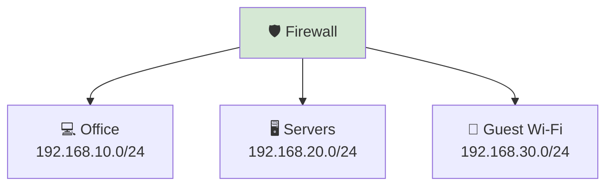

---

# 🚨 Incident Response

During a security incident, responders often need to determine which systems may be affected.

Suppose malicious traffic originates from:

```text
10.50.8.0/24
```

Instead of investigating every computer in the organization, responders can immediately focus on devices within that specific network.

This speeds up:

- Threat containment
- Evidence collection
- Root cause analysis
- Recovery efforts

---

# ☁️ Cloud Security

Cloud platforms rely heavily on CIDR.

When creating virtual networks in services such as Azure, AWS, or Google Cloud, administrators define CIDR blocks for:

- Virtual Networks (VNets)
- Virtual Private Clouds (VPCs)
- Subnets
- Security Groups
- Access Control Lists (ACLs)

A poor choice of CIDR ranges can lead to overlapping networks, routing issues, and security misconfigurations.

For this reason, planning CIDR blocks is an important part of cloud security design.

---

# 🎯 Why Cybersecurity Professionals Must Understand CIDR

CIDR helps security professionals:

- 🔥 Configure firewall rules.
- 🔍 Analyze security logs.
- 🎯 Scan entire networks.
- 🛡️ Segment enterprise environments.
- 🚨 Respond to security incidents.
- ☁️ Design secure cloud infrastructures.

Regardless of your cybersecurity role, understanding CIDR is an essential networking skill.

---

<!--
Image Description:
Create a cybersecurity infographic illustrating how CIDR is used in practice. Show a firewall protecting three segmented networks (Office, Servers, and Guest Wi-Fi), a SOC analyst reviewing logs containing CIDR blocks, and a penetration tester scanning a /24 network. Use shields, routers, computers, and cloud icons in a modern educational style.

Suggested Filename:
Images/cidr_cybersecurity.png
-->

<p align="center">

</p>

---

> 💡 **Point to Remember**
>
> CIDR is a core networking concept used throughout cybersecurity. It enables security professionals to define network boundaries, create efficient firewall rules, segment infrastructure, analyze security logs, and manage cloud environments more effectively.

---

> 🤓 **Did You Know?**
>
> Many penetration testing and network scanning tools, such as **Nmap**, accept CIDR notation directly. Instead of scanning one IP address at a time, you can scan an entire network like **192.168.1.0/24**, making security assessments much faster and more efficient.

# 💻 Mini Lab — Exploring CIDR Notation

Now it's time to see CIDR notation in action.

In this lab, you'll identify CIDR prefixes, view network configurations on your own computer, and recognize how CIDR is used in real networking environments.

No subnetting calculations are required—this lab focuses on understanding and recognizing CIDR notation.

---

# 🎯 Lab Objectives

By completing this lab, you will learn how to:

- Identify CIDR notation in network configurations.
- Recognize the relationship between prefix lengths and subnet masks.
- View your computer's IP configuration.
- Understand how CIDR is used on real networks.

---

# 🧪 Lab 1 — View Your IP Configuration

Open **Command Prompt** on Windows.

Run the following command:

```powershell
ipconfig
```

Example output:

```text
Ethernet adapter Ethernet:

IPv4 Address . . . . . . . . . : 192.168.1.25
Subnet Mask  . . . . . . . . . : 255.255.255.0
Default Gateway . . . . . . .  : 192.168.1.1
```

---

## 🔍 What Did You Find?

Notice the subnet mask:

```text
255.255.255.0
```

From the previous section, you learned that this is equivalent to:

```text
/24
```

So your computer belongs to the network:

```text
192.168.1.0/24
```

---

# 🧪 Lab 2 — Match the Prefix

Complete the following table.

| Subnet Mask | CIDR Prefix |
|-------------|-------------|
| 255.0.0.0 | ? |
| 255.255.0.0 | ? |
| 255.255.255.0 | ? |

---

### ✅ Answers

| Subnet Mask | CIDR Prefix |
|-------------|-------------|
| 255.0.0.0 | **/8** |
| 255.255.0.0 | **/16** |
| 255.255.255.0 | **/24** |

---

# 🧪 Lab 3 — Identify the Network Size

Look at the following CIDR blocks.

```text
192.168.1.0/24
```

```text
172.16.0.0/16
```

```text
10.0.0.0/8
```

### ❓ Question

Which network has the **largest** host space?

<details>
<summary>✅ Show Answer</summary>

```text
10.0.0.0/8
```

A **/8** network has the smallest prefix length and therefore the largest host portion.

</details>

---

# 🧪 Lab 4 — Compare Prefix Lengths

Arrange these networks from the **largest** to the **smallest**.

```text
/16
/24
/8
/30
```

<details>
<summary>✅ Show Answer</summary>

```text
/8
/16
/24
/30
```

As the prefix length increases, the number of available host addresses decreases.

</details>

---

# 🧪 Lab 5 — Think Like a Network Administrator

A company has only **40 computers**.

Which network would be the better choice?

```text
192.168.10.0/24

or

10.0.0.0/8
```

<details>
<summary>✅ Show Answer</summary>

```text
192.168.10.0/24
```

A **/24** network provides enough addresses for the company's devices while avoiding the unnecessary waste of a much larger **/8** network.

This demonstrates one of the key advantages of CIDR—allocating address space according to actual requirements.

</details>

---

# 📝 Lab Summary

Congratulations! 🎉

You have successfully completed your first CIDR lab.

You learned how to:

- ✅ Read CIDR notation.
- ✅ Match CIDR prefixes with subnet masks.
- ✅ View your computer's network configuration.
- ✅ Compare different network sizes.
- ✅ Understand why flexible address allocation is important.

Although you haven't performed subnetting calculations yet, you now understand the foundation that modern IP networking is built upon.

---

> 💡 **Lab Tip**
>
> Whenever you see a subnet mask such as **255.255.255.0**, try converting it into its CIDR notation (**/24**). With practice, you'll begin recognizing the most common prefix lengths instantly—a skill every network engineer and cybersecurity professional uses regularly.

# 🔑 Key Takeaways

Congratulations! 🎉 You have completed the main learning content of the **Classless Inter-Domain Routing (CIDR)** chapter.

Before moving on to the assessments, review the most important concepts you've learned.

---

## 📌 What Is CIDR?

**Classless Inter-Domain Routing (CIDR)** is a modern IP addressing method that allocates address blocks based on the actual needs of a network instead of using fixed address classes.

It replaces the old **Class A**, **Class B**, and **Class C** addressing system with a more flexible approach.

---

## 📌 Why Was CIDR Introduced?

CIDR was introduced to solve several major problems with classful addressing:

- ✅ Wasted IPv4 addresses
- ✅ Inefficient network allocation
- ✅ Growing Internet routing tables
- ✅ Limited flexibility when designing networks

By allowing networks of different sizes, CIDR greatly improved the efficiency of IPv4 address allocation.

---

## 📌 Understanding CIDR Notation

CIDR notation combines an IP address with a **prefix length**.

For example:

```text
192.168.1.0/24
```

The number after the forward slash (`/`) indicates how many bits belong to the **network portion** of the address.

---

## 📌 Prefix Length and Subnet Masks

CIDR prefixes and subnet masks describe the same network boundary.

Examples include:

| CIDR | Subnet Mask |
|------|-------------|
| /8 | 255.0.0.0 |
| /16 | 255.255.0.0 |
| /24 | 255.255.255.0 |

Modern networking typically uses CIDR notation because it is shorter and easier to understand.

---

## 📌 Larger vs Smaller Prefixes

Remember this simple rule:

- **Smaller Prefix (e.g., /8)** → Larger network → More host addresses
- **Larger Prefix (e.g., /24)** → Smaller network → Fewer host addresses

As the prefix length increases, the available host space decreases.

---

## 📌 CIDR in the Real World

CIDR is used in almost every modern network, including:

- 🏠 Home networks
- 🏢 Businesses
- 🌐 Internet Service Providers (ISPs)
- ☁️ Cloud platforms
- 🏥 Enterprise environments

It allows administrators to create networks that closely match their requirements.

---

## 📌 CIDR in Cybersecurity

Cybersecurity professionals use CIDR every day for:

- 🛡️ Firewall rules
- 🔍 Security monitoring
- 🎯 Penetration testing
- 🚨 Incident response
- ☁️ Cloud security
- 🏢 Network segmentation

Understanding CIDR is an essential networking skill for anyone working in cybersecurity.

---

## 🎯 Final Review

If you remember only a few things from this chapter, remember these:

- ✅ CIDR replaced the inefficient classful addressing system.
- ✅ CIDR uses **prefix lengths** such as **/24** and **/16**.
- ✅ Prefix lengths identify the network portion of an IP address.
- ✅ CIDR provides flexible and efficient IP address allocation.
- ✅ Larger prefixes create smaller networks with fewer hosts.
- ✅ CIDR is used throughout networking and cybersecurity.

---

> 💡 **One-Sentence Summary**
>
> **Classless Inter-Domain Routing (CIDR)** is a flexible IP addressing method that uses prefix lengths instead of fixed address classes, making modern networks more efficient, scalable, and easier to manage.

---

# 🧠 Quick Check

Test your understanding before moving on to the Knowledge Check.

---

## Question 1

**What does CIDR stand for?**

<details>
<summary>✅ Show Answer</summary>

**Classless Inter-Domain Routing**

It is the modern method of allocating IPv4 address blocks efficiently.

</details>

---

## Question 2

**Why was CIDR introduced?**

<details>
<summary>✅ Show Answer</summary>

CIDR was introduced to reduce IPv4 address wastage, improve address allocation, and decrease the size of Internet routing tables.

</details>

---

## Question 3

**What does the `/24` in `192.168.1.0/24` represent?**

<details>
<summary>✅ Show Answer</summary>

The **24** is the prefix length.

It means the first **24 bits** belong to the network portion of the IP address.

</details>

---

## Question 4

**Which subnet mask is equivalent to `/16`?**

<details>
<summary>✅ Show Answer</summary>

```text
255.255.0.0
```

</details>

---

## Question 5

**Which network provides more host addresses: `/16` or `/24`?**

<details>
<summary>✅ Show Answer</summary>

A **/16** network.

A smaller prefix leaves more bits available for host addresses.

</details>

---

## Question 6

**Name two places where CIDR is commonly used.**

<details>
<summary>✅ Show Answer</summary>

Examples include:

- Home networks
- Business networks
- Cloud platforms
- Internet Service Providers (ISPs)
- Enterprise networks
- Firewall configurations

</details>

---

## Question 7

**Why is CIDR important in cybersecurity?**

<details>
<summary>✅ Show Answer</summary>

CIDR is used to configure firewall rules, segment networks, analyze security logs, perform vulnerability scanning, and design secure cloud environments.

</details>

# 📖 Knowledge Check

Test your understanding of **Classless Inter-Domain Routing (CIDR)** by answering the following multiple-choice questions.

Choose the best answer before revealing the solution.

---

## Question 1

**What does CIDR stand for?**

- A. Class Internet Domain Routing
- B. Classless Inter-Domain Routing
- C. Central Internet Data Routing
- D. Common IP Domain Routing

<details>
<summary>✅ Answer</summary>

**Correct Answer: B. Classless Inter-Domain Routing**

CIDR is the modern IP addressing method that replaced the old classful addressing system.

</details>

---

## Question 2

**Why was CIDR introduced?**

- A. To replace IPv6
- B. To increase Internet speed
- C. To improve IPv4 address allocation and reduce routing table size
- D. To eliminate subnet masks

<details>
<summary>✅ Answer</summary>

**Correct Answer: C. To improve IPv4 address allocation and reduce routing table size**

CIDR was introduced to solve the inefficiencies of classful addressing by allowing flexible address allocation and route aggregation.

</details>

---

## Question 3

**What does the number after the slash in CIDR notation represent?**

Example:

```text
192.168.1.0/24
```

- A. Number of hosts
- B. Number of routers
- C. Prefix length
- D. Network speed

<details>
<summary>✅ Answer</summary>

**Correct Answer: C. Prefix length**

The number after the slash specifies how many bits belong to the network portion of the IP address.

</details>

---

## Question 4

**Which subnet mask is equivalent to `/24`?**

- A. 255.0.0.0
- B. 255.255.0.0
- C. 255.255.255.0
- D. 255.255.255.255

<details>
<summary>✅ Answer</summary>

**Correct Answer: C. 255.255.255.0**

A `/24` prefix means the first 24 bits are network bits, which corresponds to the subnet mask **255.255.255.0**.

</details>

---

## Question 5

**Which network provides the largest number of host addresses?**

- A. /30
- B. /24
- C. /16
- D. /8

<details>
<summary>✅ Answer</summary>

**Correct Answer: D. /8**

A **/8** network leaves 24 bits for hosts, allowing the largest number of usable host addresses among the options.

</details>

---

## Question 6

**Which statement about CIDR is TRUE?**

- A. CIDR only works with Class A networks.
- B. CIDR replaced the fixed classful addressing system.
- C. CIDR increases the total number of IPv4 addresses.
- D. CIDR is only used in home networks.

<details>
<summary>✅ Answer</summary>

**Correct Answer: B. CIDR replaced the fixed classful addressing system.**

CIDR introduced flexible network allocation based on prefix lengths instead of fixed address classes.

</details>

---

## Question 7

**Which of the following is valid CIDR notation?**

- A. 192.168.1.0-24
- B. 192.168.1.0:24
- C. 192.168.1.0/24
- D. 192.168.1.0\24

<details>
<summary>✅ Answer</summary>

**Correct Answer: C. 192.168.1.0/24**

CIDR notation always uses a forward slash (`/`) followed by the prefix length.

</details>

---

## Question 8

**Which of the following is a common use of CIDR in cybersecurity?**

- A. Creating Word documents
- B. Designing website layouts
- C. Configuring firewall rules and network segmentation
- D. Compressing files

<details>
<summary>✅ Answer</summary>

**Correct Answer: C. Configuring firewall rules and network segmentation**

Firewalls, SIEM platforms, cloud networks, and many other security tools use CIDR notation to define network ranges.

</details>

---

# 🚀 Challenge Questions

Now that you've completed the chapter, it's time to apply your knowledge to real-world networking scenarios.

These questions are designed to help you think like a network administrator or cybersecurity professional.

Take your time and try answering each question before revealing the solution.

---

## Challenge 1 — Choosing the Right Network

A small company has **45 employees** and expects to grow to about **70 devices** over the next few years.

The network administrator must choose between the following networks:

```text
10.0.0.0/8

or

192.168.10.0/25
```

### ❓ Question

Which network is the better choice and why?

<details>
<summary>💡 Suggested Answer</summary>

The better choice is:

```text
192.168.10.0/25
```

A **/25** network provides **126 usable host addresses**, which is more than enough for 70 devices while leaving room for future expansion.

Using a **/8** network would waste millions of IPv4 addresses.

CIDR allows administrators to allocate networks that closely match actual requirements.

</details>

---

## Challenge 2 — Reading CIDR Notation

A network is configured as:

```text
172.16.0.0/16
```

### ❓ Question

What does the **/16** indicate?

<details>
<summary>💡 Suggested Answer</summary>

The **/16** is the **prefix length**.

It means:

- The first **16 bits** identify the network.
- The remaining **16 bits** are available for host addresses.

</details>

---

## Challenge 3 — Firewall Configuration

A firewall administrator wants to allow every computer on the following network:

```text
192.168.50.0/24
```

Instead of creating hundreds of individual firewall rules, they create one rule using CIDR notation.

### ❓ Question

Why is using CIDR a better approach?

<details>
<summary>💡 Suggested Answer</summary>

Using a CIDR block allows one firewall rule to cover the entire network.

This makes firewall configurations:

- Easier to manage
- Less likely to contain errors
- Easier to update
- More scalable as the network grows

</details>

---

## Challenge 4 — Comparing Networks

Arrange the following networks from **largest** to **smallest** based on the number of available host addresses.

```text
/30
/24
/16
/8
```

<details>
<summary>💡 Suggested Answer</summary>

Correct order:

```text
/8
/16
/24
/30
```

A smaller prefix length leaves more bits available for host addresses.

As the prefix length increases, the number of available hosts decreases.

</details>

---

## Challenge 5 — Cloud Deployment

A cloud administrator is creating a new virtual network.

Before deploying any virtual machines, they must select a CIDR block for the network.

### ❓ Question

Why is choosing an appropriate CIDR block important?

<details>
<summary>💡 Suggested Answer</summary>

The chosen CIDR block determines:

- The size of the network.
- How many devices or virtual machines can be added.
- Whether future expansion is possible.
- Whether the network can communicate without overlapping with other networks.

Proper planning helps avoid addressing conflicts and simplifies network management.

</details>

---

## 🌟 Final Reflection

Before moving to the next chapter, make sure you can confidently answer these questions:

- ✅ What is CIDR?
- ✅ Why did CIDR replace classful addressing?
- ✅ What does a CIDR prefix length represent?
- ✅ How are CIDR prefixes related to subnet masks?
- ✅ Why does a **/8** network support more hosts than a **/24** network?
- ✅ How does CIDR reduce IPv4 address waste?
- ✅ Why is CIDR important for routing, cloud computing, and cybersecurity?

If you can answer these questions without referring back to the chapter, you've built a strong foundation for the next topic.

In the next chapter, you'll build on this knowledge by learning about **Subnetting**, where you'll discover how networks are divided into smaller, more efficient subnetworks using CIDR notation.

# 📝 Chapter Summary

Congratulations! 🎉 You have successfully completed the **Classless Inter-Domain Routing (CIDR)** chapter.

In this chapter, you explored one of the most important concepts in modern IP networking. You learned that the original **Classful Addressing** system, although simple, became inefficient as the Internet grew because it allocated fixed-size networks that often wasted large numbers of IPv4 addresses.

To overcome these limitations, **Classless Inter-Domain Routing (CIDR)** was introduced in 1993. Instead of assigning networks based on predefined classes, CIDR uses **prefix lengths** to allocate address space according to the actual needs of an organization. This approach significantly reduced IPv4 address waste and helped slow the exhaustion of the IPv4 address space.

You also learned how to read **CIDR notation**, such as **192.168.1.0/24**, and discovered that the number after the forward slash represents the **prefix length**, indicating how many bits belong to the network portion of the address.

Another important concept covered in this chapter was the relationship between **CIDR prefixes** and **subnet masks**. You saw that different notations, such as **/24** and **255.255.255.0**, represent the same network boundary, with CIDR providing a shorter and more convenient way to express it.

Throughout the chapter, you explored common CIDR prefixes, examined real-world networking examples, and learned how CIDR is used in home networks, enterprise environments, Internet Service Providers (ISPs), cloud computing, and cybersecurity.

Finally, through hands-on activities, quizzes, and challenge questions, you practiced interpreting CIDR notation and understood why it has become the standard method for modern IP address allocation and routing.

By mastering CIDR, you have built an essential foundation for understanding **subnetting**, one of the most valuable networking skills for network engineers and cybersecurity professionals.

---
# 🧭 Chapter Navigation

## ➡️ Next Chapter

### **09 - Default Gateway**

Now that you understand **Classless Inter-Domain Routing (CIDR)** and how networks are defined using **prefix lengths**, the next step is learning how devices communicate **outside their own network**.

In the next chapter, you'll learn about the **Default Gateway**—the device that forwards traffic from your local network to other networks. You'll discover how a default gateway works, why it is essential for Internet communication, and what happens when it is missing or configured incorrectly.

Understanding the default gateway is a fundamental networking skill because every device relies on it to communicate beyond its local subnet.

**Next →:** [**Default Gateway**](09-Default Gateway.md)

---

# 📖 Continue Your Learning

Congratulations! 🎉 You have completed the **Classless Inter-Domain Routing (CIDR)** chapter.

You now understand:

- ✅ What CIDR is and why it replaced classful addressing.
- ✅ Why the classful addressing system became inefficient.
- ✅ How CIDR notation works.
- ✅ The purpose of prefix lengths.
- ✅ The relationship between CIDR prefixes and subnet masks.
- ✅ Common CIDR prefixes used in modern networks.
- ✅ How CIDR improves IPv4 address allocation.
- ✅ Why CIDR is important in networking and cybersecurity.

In the next chapter, you'll learn about the **Default Gateway**, one of the most important components of every IP network. You'll explore how devices send traffic to other networks, how routers act as gateways, and why a correctly configured default gateway is essential for accessing remote networks and the Internet.

This chapter will complete your understanding of how devices communicate both **within** and **beyond** their local network.

> **🚀 Next Lesson:** [**Default Gateway**](09-Default Gateway.md)